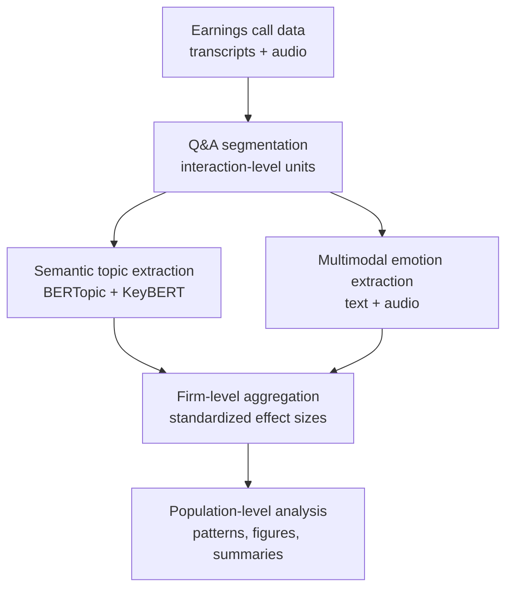

# Multimodal Framework for Population-Level Analysis of Earnings Call Discourse

This repository contains the code and documentation supporting a multimodal framework for the population-level analysis of earnings call Q&A interactions.

The framework integrates:

- semantic topic extraction from transcripts,
- multimodal emotional representations derived from text and audio,
- firm-level aggregation using standardized effect sizes.

The goal is to provide a scalable and interpretable pipeline for analyzing discourse patterns across companies in corporate earnings calls.

---

## Framework Overview

The analytical pipeline begins with earnings call transcripts and aligned audio recordings. Q&A interactions are segmented into interaction-level units, which are then processed along two complementary paths: semantic topic extraction and multimodal emotion extraction. The resulting signals are aggregated at the firm level using standardized effect sizes, enabling population-level analysis of discourse patterns across companies.




## Scope

This repository accompanies a methodological study focused on multimodal discourse analysis in earnings call interactions.

The framework supports:

- preprocessing of earnings call transcripts and aligned audio
- segmentation of Q&A interactions
- semantic topic modeling
- extraction of emotion-related signals from text and audio
- population-level aggregation and visualization of discourse patterns

The current release is intended for research reproducibility and methodological illustration.

---

## Main Components

**Preprocessing**

Parsing transcripts and aligning audio segments at the Q&A interaction level.

**Topic Modeling**

Transformer-based semantic topic extraction for analyst questions and managerial responses.

**Emotion Extraction**

Multimodal emotional signal estimation from textual and acoustic inputs.

**Aggregation**

Firm-level standardized effect size computation and population-level summaries.

**Visualization**

Generation of figures and tables for semantic and emotional analysis.

---

## Installation

```bash
pip install poetry
poetry install
```

---

## Basic Workflow

### Configure paths

Edit:

```bash
config/config.yaml
```


### Prepare input data

Create a CSV file listing earnings call folders containing transcripts and metadata.

### Run preprocessing

```bash
poetry run earningscall_framework process config/config.yaml --config-name default
```

### Generate embeddings and emotion features

Single file:

```bash
poetry run earningscall_framework embed config/config.yaml --config-name default --json-path /path/to/file.json

```
Multiple files:

```bash
poetry run earningscall_framework embed config/config.yaml --config-name default --json-csv data/json_paths.csv

```

### Run aggregation and visualization

Use notebooks in:

```bash
notebooks/

```

---

## Outputs

Typical outputs include:

- annotated Q&A interaction tables
- topic assignments and keywords
- emotion scores from text and audio
- firm-level effect sizes
- population-level visualizations

---

## Data

The repository is designed to work with publicly available earnings call materials and/or datasets provided by third-party data providers.

Due to licensing restrictions, raw data may not be redistributed through this repository.

---

## Reproducibility

The repository is organized to reproduce the methodological pipeline described in the associated paper.

Some steps may require external datasets or pretrained models not included in this public release.

The repository is located at https://github.com/jordieres/earnings-call-multimodal-framework, with the DOI: 10.5281/zenodo.19035654

---

## Citation

If you use this repository, please cite the associated paper once available.
Beacuse of its size, the data/companies repository was published over zenodo with DOI: https://doi.org/10.5281/zenodo.19030118 

The structure is the one described above.

---

## License

License is GNU General Public License v3.0


---

## Repository Structure

Although presented here in the tree of files ```data/companies``` have been compressed and released into a Zenodo repository located at: https://zenodo.org/records/19032377
You should download them and place the unzipped folders accordingly.

<details>
<summary>Repository tree (click to expand)</summary>

```text
├── CITATION.cff
├── LICENSE
├── README.md
├── SetUp_Ollama_on_GPU.md
├── config
│   └── config.yaml
├── data
│   ├── companies
│   │   ├── AAPL
│   │   │   ├── 2018
│   │   │   │   ├── Q3
│   │   │   │   │   ├── LEVEL_3.json
│   │   │   │   │   ├── LEVEL_4.json
│   │   │   │   │   ├── audio.mp3
│   │   │   │   │   └── transcript.csv
│   │   │   │   └── Q4
│   │   │   │       ├── LEVEL_3.json
│   │   │   │       ├── LEVEL_4.json
│   │   │   │       ├── audio.mp3
│   │   │   │       └── transcript.csv
│   │   │   ├── 2019
│   │   │   │   ├── Q1
│   │   │   │   │   ├── LEVEL_3.json
│   │   │   │   │   ├── LEVEL_4.json
│   │   │   │   │   ├── audio.mp3
│   │   │   │   │   └── transcript.csv
│   │   │   │   ├── Q2
│   │   │   │   │   ├── LEVEL_3.json
│   │   │   │   │   ├── LEVEL_4.json
│   │   │   │   │   ├── audio.mp3
│   │   │   │   │   └── transcript.csv
│   │   │   │   ├── Q3
│   │   │   │   │   ├── LEVEL_3.json
│   │   │   │   │   ├── LEVEL_4.json
│   │   │   │   │   ├── audio.mp3
│   │   │   │   │   └── transcript.csv
│   │   │   │   └── Q4
│   │   │   │       ├── LEVEL_3.json
│   │   │   │       ├── LEVEL_4.json
│   │   │   │       ├── audio.mp3
│   │   │   │       └── transcript.csv
│   │   │   ├── 2020
│   │   │   │   ├── Q1
│   │   │   │   │   ├── LEVEL_3.json
│   │   │   │   │   ├── LEVEL_4.json
│   │   │   │   │   ├── audio.mp3
│   │   │   │   │   └── transcript.csv
│   │   │   │   ├── Q2
│   │   │   │   │   ├── LEVEL_3.json
│   │   │   │   │   ├── LEVEL_4.json
│   │   │   │   │   ├── audio.mp3
│   │   │   │   │   └── transcript.csv
│   │   │   │   ├── Q3
│   │   │   │   │   ├── LEVEL_3.json
│   │   │   │   │   ├── LEVEL_4.json
│   │   │   │   │   ├── audio.mp3
│   │   │   │   │   └── transcript.csv
│   │   │   │   └── Q4
│   │   │   │       ├── LEVEL_3.json
│   │   │   │       ├── LEVEL_4.json
│   │   │   │       ├── audio.mp3
│   │   │   │       └── transcript.csv
│   │   │   ├── 2021
│   │   │   │   ├── Q1
│   │   │   │   │   ├── LEVEL_3.json
│   │   │   │   │   ├── LEVEL_4.json
│   │   │   │   │   ├── audio.mp3
│   │   │   │   │   └── transcript.csv
│   │   │   │   ├── Q2
│   │   │   │   │   ├── LEVEL_3.json
│   │   │   │   │   ├── LEVEL_4.json
│   │   │   │   │   ├── audio.mp3
│   │   │   │   │   └── transcript.csv
│   │   │   │   ├── Q3
│   │   │   │   │   ├── LEVEL_3.json
│   │   │   │   │   ├── LEVEL_4.json
│   │   │   │   │   ├── audio.mp3
│   │   │   │   │   └── transcript.csv
│   │   │   │   └── Q4
│   │   │   │       ├── LEVEL_3.json
│   │   │   │       ├── LEVEL_4.json
│   │   │   │       ├── audio.mp3
│   │   │   │       └── transcript.csv
│   │   │   ├── 2022
│   │   │   │   ├── Q1
│   │   │   │   │   ├── LEVEL_3.json
│   │   │   │   │   ├── LEVEL_4.json
│   │   │   │   │   ├── audio.mp3
│   │   │   │   │   └── transcript.csv
│   │   │   │   ├── Q2
│   │   │   │   │   ├── LEVEL_3.json
│   │   │   │   │   ├── LEVEL_4.json
│   │   │   │   │   ├── audio.mp3
│   │   │   │   │   └── transcript.csv
│   │   │   │   ├── Q3
│   │   │   │   │   ├── LEVEL_3.json
│   │   │   │   │   ├── LEVEL_4.json
│   │   │   │   │   ├── audio.mp3
│   │   │   │   │   └── transcript.csv
│   │   │   │   └── Q4
│   │   │   │       ├── LEVEL_3.json
│   │   │   │       ├── LEVEL_4.json
│   │   │   │       ├── audio.mp3
│   │   │   │       └── transcript.csv
│   │   │   ├── 2023
│   │   │   │   ├── Q1
│   │   │   │   │   ├── LEVEL_3.json
│   │   │   │   │   ├── LEVEL_4.json
│   │   │   │   │   ├── audio.mp3
│   │   │   │   │   └── transcript.csv
│   │   │   │   ├── Q2
│   │   │   │   │   ├── LEVEL_3.json
│   │   │   │   │   ├── LEVEL_4.json
│   │   │   │   │   ├── audio.mp3
│   │   │   │   │   └── transcript.csv
│   │   │   │   ├── Q3
│   │   │   │   │   ├── LEVEL_3.json
│   │   │   │   │   ├── LEVEL_4.json
│   │   │   │   │   ├── audio.mp3
│   │   │   │   │   └── transcript.csv
│   │   │   │   └── Q4
│   │   │   │       ├── LEVEL_3.json
│   │   │   │       ├── LEVEL_4.json
│   │   │   │       ├── audio.mp3
│   │   │   │       └── transcript.csv
│   │   │   └── 2024
│   │   │       ├── Q1
│   │   │       │   ├── LEVEL_3.json
│   │   │       │   ├── LEVEL_4.json
│   │   │       │   ├── audio.mp3
│   │   │       │   └── transcript.csv
│   │   │       ├── Q2
│   │   │       │   ├── LEVEL_3.json
│   │   │       │   ├── LEVEL_4.json
│   │   │       │   ├── audio.mp3
│   │   │       │   └── transcript.csv
│   │   │       ├── Q3
│   │   │       │   ├── LEVEL_3.json
│   │   │       │   ├── LEVEL_4.json
│   │   │       │   ├── audio.mp3
│   │   │       │   └── transcript.csv
│   │   │       └── Q4
│   │   │           ├── LEVEL_3.json
│   │   │           ├── LEVEL_4.json
│   │   │           ├── audio.mp3
│   │   │           └── transcript.csv
│   │   ├── ABBV
│   │   │   ├── 2019
│   │   │   │   ├── Q1
│   │   │   │   │   ├── LEVEL_3.json
│   │   │   │   │   ├── LEVEL_4.json
│   │   │   │   │   ├── audio.mp3
│   │   │   │   │   └── transcript.csv
│   │   │   │   ├── Q2
│   │   │   │   │   ├── LEVEL_3.json
│   │   │   │   │   ├── LEVEL_4.json
│   │   │   │   │   ├── audio.mp3
│   │   │   │   │   └── transcript.csv
│   │   │   │   └── Q3
│   │   │   │       ├── LEVEL_3.json
│   │   │   │       ├── LEVEL_4.json
│   │   │   │       ├── audio.mp3
│   │   │   │       └── transcript.csv
│   │   │   ├── 2020
│   │   │   │   ├── Q2
│   │   │   │   │   ├── LEVEL_3.json
│   │   │   │   │   ├── LEVEL_4.json
│   │   │   │   │   ├── audio.mp3
│   │   │   │   │   └── transcript.csv
│   │   │   │   ├── Q3
│   │   │   │   │   ├── LEVEL_3.json
│   │   │   │   │   ├── LEVEL_4.json
│   │   │   │   │   ├── audio.mp3
│   │   │   │   │   └── transcript.csv
│   │   │   │   └── Q4
│   │   │   │       ├── LEVEL_3.json
│   │   │   │       ├── LEVEL_4.json
│   │   │   │       ├── audio.mp3
│   │   │   │       └── transcript.csv
│   │   │   ├── 2021
│   │   │   │   ├── Q1
│   │   │   │   │   ├── LEVEL_3.json
│   │   │   │   │   ├── LEVEL_4.json
│   │   │   │   │   ├── audio.mp3
│   │   │   │   │   └── transcript.csv
│   │   │   │   ├── Q2
│   │   │   │   │   ├── LEVEL_3.json
│   │   │   │   │   ├── LEVEL_4.json
│   │   │   │   │   ├── audio.mp3
│   │   │   │   │   └── transcript.csv
│   │   │   │   ├── Q3
│   │   │   │   │   ├── LEVEL_3.json
│   │   │   │   │   ├── LEVEL_4.json
│   │   │   │   │   ├── audio.mp3
│   │   │   │   │   └── transcript.csv
│   │   │   │   └── Q4
│   │   │   │       ├── LEVEL_3.json
│   │   │   │       ├── LEVEL_4.json
│   │   │   │       ├── audio.mp3
│   │   │   │       └── transcript.csv
│   │   │   ├── 2022
│   │   │   │   ├── Q1
│   │   │   │   │   ├── LEVEL_3.json
│   │   │   │   │   ├── LEVEL_4.json
│   │   │   │   │   ├── audio.mp3
│   │   │   │   │   └── transcript.csv
│   │   │   │   ├── Q2
│   │   │   │   │   ├── LEVEL_3.json
│   │   │   │   │   ├── LEVEL_4.json
│   │   │   │   │   ├── audio.mp3
│   │   │   │   │   └── transcript.csv
│   │   │   │   ├── Q3
│   │   │   │   │   ├── LEVEL_3.json
│   │   │   │   │   ├── LEVEL_4.json
│   │   │   │   │   ├── audio.mp3
│   │   │   │   │   └── transcript.csv
│   │   │   │   └── Q4
│   │   │   │       ├── LEVEL_3.json
│   │   │   │       ├── LEVEL_4.json
│   │   │   │       ├── audio.mp3
│   │   │   │       └── transcript.csv
│   │   │   ├── 2023
│   │   │   │   ├── Q1
│   │   │   │   │   ├── LEVEL_3.json
│   │   │   │   │   ├── LEVEL_4.json
│   │   │   │   │   ├── audio.mp3
│   │   │   │   │   └── transcript.csv
│   │   │   │   ├── Q2
│   │   │   │   │   ├── LEVEL_3.json
│   │   │   │   │   ├── LEVEL_4.json
│   │   │   │   │   ├── audio.mp3
│   │   │   │   │   └── transcript.csv
│   │   │   │   ├── Q3
│   │   │   │   │   ├── LEVEL_3.json
│   │   │   │   │   ├── LEVEL_4.json
│   │   │   │   │   ├── audio.mp3
│   │   │   │   │   └── transcript.csv
│   │   │   │   └── Q4
│   │   │   │       ├── LEVEL_3.json
│   │   │   │       ├── LEVEL_4.json
│   │   │   │       ├── audio.mp3
│   │   │   │       └── transcript.csv
│   │   │   └── 2024
│   │   │       ├── Q1
│   │   │       │   ├── LEVEL_3.json
│   │   │       │   ├── LEVEL_4.json
│   │   │       │   ├── audio.mp3
│   │   │       │   └── transcript.csv
│   │   │       ├── Q2
│   │   │       │   ├── LEVEL_3.json
│   │   │       │   ├── LEVEL_4.json
│   │   │       │   ├── audio.mp3
│   │   │       │   └── transcript.csv
│   │   │       └── Q3
│   │   │           ├── LEVEL_3.json
│   │   │           ├── LEVEL_4.json
│   │   │           ├── audio.mp3
│   │   │           └── transcript.csv
│   │   ├── ABNB
│   │   │   ├── 2021
│   │   │   │   ├── Q1
│   │   │   │   │   ├── LEVEL_3.json
│   │   │   │   │   ├── LEVEL_4.json
│   │   │   │   │   ├── audio.mp3
│   │   │   │   │   └── transcript.csv
│   │   │   │   ├── Q2
│   │   │   │   │   ├── LEVEL_3.json
│   │   │   │   │   ├── LEVEL_4.json
│   │   │   │   │   ├── audio.mp3
│   │   │   │   │   └── transcript.csv
│   │   │   │   ├── Q3
│   │   │   │   │   ├── LEVEL_3.json
│   │   │   │   │   ├── LEVEL_4.json
│   │   │   │   │   ├── audio.mp3
│   │   │   │   │   └── transcript.csv
│   │   │   │   └── Q4
│   │   │   │       ├── LEVEL_3.json
│   │   │   │       ├── LEVEL_4.json
│   │   │   │       ├── audio.mp3
│   │   │   │       └── transcript.csv
│   │   │   ├── 2022
│   │   │   │   ├── Q1
│   │   │   │   │   ├── LEVEL_3.json
│   │   │   │   │   ├── LEVEL_4.json
│   │   │   │   │   ├── audio.mp3
│   │   │   │   │   └── transcript.csv
│   │   │   │   ├── Q2
│   │   │   │   │   ├── LEVEL_3.json
│   │   │   │   │   ├── LEVEL_4.json
│   │   │   │   │   ├── audio.mp3
│   │   │   │   │   └── transcript.csv
│   │   │   │   ├── Q3
│   │   │   │   │   ├── LEVEL_3.json
│   │   │   │   │   ├── LEVEL_4.json
│   │   │   │   │   ├── audio.mp3
│   │   │   │   │   └── transcript.csv
│   │   │   │   └── Q4
│   │   │   │       ├── LEVEL_3.json
│   │   │   │       ├── LEVEL_4.json
│   │   │   │       ├── audio.mp3
│   │   │   │       └── transcript.csv
│   │   │   ├── 2023
│   │   │   │   ├── Q1
│   │   │   │   │   ├── LEVEL_3.json
│   │   │   │   │   ├── LEVEL_4.json
│   │   │   │   │   ├── audio.mp3
│   │   │   │   │   └── transcript.csv
│   │   │   │   ├── Q2
│   │   │   │   │   ├── LEVEL_3.json
│   │   │   │   │   ├── LEVEL_4.json
│   │   │   │   │   ├── audio.mp3
│   │   │   │   │   └── transcript.csv
│   │   │   │   ├── Q3
│   │   │   │   │   ├── LEVEL_3.json
│   │   │   │   │   ├── LEVEL_4.json
│   │   │   │   │   ├── audio.mp3
│   │   │   │   │   └── transcript.csv
│   │   │   │   └── Q4
│   │   │   │       ├── LEVEL_3.json
│   │   │   │       ├── LEVEL_4.json
│   │   │   │       ├── audio.mp3
│   │   │   │       └── transcript.csv
│   │   │   └── 2024
│   │   │       ├── Q1
│   │   │       │   ├── LEVEL_3.json
│   │   │       │   ├── LEVEL_4.json
│   │   │       │   ├── audio.mp3
│   │   │       │   └── transcript.csv
│   │   │       ├── Q2
│   │   │       │   ├── LEVEL_3.json
│   │   │       │   ├── LEVEL_4.json
│   │   │       │   ├── audio.mp3
│   │   │       │   └── transcript.csv
│   │   │       └── Q3
│   │   │           ├── LEVEL_3.json
│   │   │           ├── LEVEL_4.json
│   │   │           ├── audio.mp3
│   │   │           └── transcript.csv
│   │   ├── ABT
│   │   │   ├── 2019
│   │   │   │   ├── Q1
│   │   │   │   │   ├── LEVEL_3.json
│   │   │   │   │   ├── LEVEL_4.json
│   │   │   │   │   ├── audio.mp3
│   │   │   │   │   └── transcript.csv
│   │   │   │   ├── Q2
│   │   │   │   │   ├── LEVEL_3.json
│   │   │   │   │   ├── LEVEL_4.json
│   │   │   │   │   ├── audio.mp3
│   │   │   │   │   └── transcript.csv
│   │   │   │   ├── Q3
│   │   │   │   │   ├── LEVEL_3.json
│   │   │   │   │   ├── LEVEL_4.json
│   │   │   │   │   ├── audio.mp3
│   │   │   │   │   └── transcript.csv
│   │   │   │   └── Q4
│   │   │   │       ├── LEVEL_3.json
│   │   │   │       ├── LEVEL_4.json
│   │   │   │       ├── audio.mp3
│   │   │   │       └── transcript.csv
│   │   │   ├── 2020
│   │   │   │   ├── Q1
│   │   │   │   │   ├── LEVEL_3.json
│   │   │   │   │   ├── LEVEL_4.json
│   │   │   │   │   ├── audio.mp3
│   │   │   │   │   └── transcript.csv
│   │   │   │   ├── Q2
│   │   │   │   │   ├── LEVEL_3.json
│   │   │   │   │   ├── LEVEL_4.json
│   │   │   │   │   ├── audio.mp3
│   │   │   │   │   └── transcript.csv
│   │   │   │   ├── Q3
│   │   │   │   │   ├── LEVEL_3.json
│   │   │   │   │   ├── LEVEL_4.json
│   │   │   │   │   ├── audio.mp3
│   │   │   │   │   └── transcript.csv
│   │   │   │   └── Q4
│   │   │   │       ├── LEVEL_3.json
│   │   │   │       ├── LEVEL_4.json
│   │   │   │       ├── audio.mp3
│   │   │   │       └── transcript.csv
│   │   │   ├── 2021
│   │   │   │   ├── Q1
│   │   │   │   │   ├── LEVEL_3.json
│   │   │   │   │   ├── LEVEL_4.json
│   │   │   │   │   ├── audio.mp3
│   │   │   │   │   └── transcript.csv
│   │   │   │   ├── Q2
│   │   │   │   │   ├── LEVEL_3.json
│   │   │   │   │   ├── LEVEL_4.json
│   │   │   │   │   ├── audio.mp3
│   │   │   │   │   └── transcript.csv
│   │   │   │   ├── Q3
│   │   │   │   │   ├── LEVEL_3.json
│   │   │   │   │   ├── LEVEL_4.json
│   │   │   │   │   ├── audio.mp3
│   │   │   │   │   └── transcript.csv
│   │   │   │   └── Q4
│   │   │   │       ├── LEVEL_3.json
│   │   │   │       ├── LEVEL_4.json
│   │   │   │       ├── audio.mp3
│   │   │   │       └── transcript.csv
│   │   │   ├── 2022
│   │   │   │   ├── Q1
│   │   │   │   │   ├── LEVEL_3.json
│   │   │   │   │   ├── LEVEL_4.json
│   │   │   │   │   ├── audio.mp3
│   │   │   │   │   └── transcript.csv
│   │   │   │   ├── Q2
│   │   │   │   │   ├── LEVEL_3.json
│   │   │   │   │   ├── LEVEL_4.json
│   │   │   │   │   ├── audio.mp3
│   │   │   │   │   └── transcript.csv
│   │   │   │   ├── Q3
│   │   │   │   │   ├── LEVEL_3.json
│   │   │   │   │   ├── LEVEL_4.json
│   │   │   │   │   ├── audio.mp3
│   │   │   │   │   └── transcript.csv
│   │   │   │   └── Q4
│   │   │   │       ├── LEVEL_3.json
│   │   │   │       ├── LEVEL_4.json
│   │   │   │       ├── audio.mp3
│   │   │   │       └── transcript.csv
│   │   │   ├── 2023
│   │   │   │   ├── Q1
│   │   │   │   │   ├── LEVEL_3.json
│   │   │   │   │   ├── LEVEL_4.json
│   │   │   │   │   ├── audio.mp3
│   │   │   │   │   └── transcript.csv
│   │   │   │   ├── Q2
│   │   │   │   │   ├── LEVEL_3.json
│   │   │   │   │   ├── LEVEL_4.json
│   │   │   │   │   ├── audio.mp3
│   │   │   │   │   └── transcript.csv
│   │   │   │   ├── Q3
│   │   │   │   │   ├── LEVEL_3.json
│   │   │   │   │   ├── LEVEL_4.json
│   │   │   │   │   ├── audio.mp3
│   │   │   │   │   └── transcript.csv
│   │   │   │   └── Q4
│   │   │   │       ├── LEVEL_3.json
│   │   │   │       ├── LEVEL_4.json
│   │   │   │       ├── audio.mp3
│   │   │   │       └── transcript.csv
│   │   │   └── 2024
│   │   │       ├── Q1
│   │   │       │   ├── LEVEL_3.json
│   │   │       │   ├── LEVEL_4.json
│   │   │       │   ├── audio.mp3
│   │   │       │   └── transcript.csv
│   │   │       ├── Q2
│   │   │       │   ├── LEVEL_3.json
│   │   │       │   ├── LEVEL_4.json
│   │   │       │   ├── audio.mp3
│   │   │       │   └── transcript.csv
│   │   │       └── Q3
│   │   │           ├── LEVEL_3.json
│   │   │           ├── LEVEL_4.json
│   │   │           ├── audio.mp3
│   │   │           └── transcript.csv
│   │   ├── ACN
│   │   │   ├── 2019
│   │   │   │   ├── Q1
│   │   │   │   │   ├── LEVEL_3.json
│   │   │   │   │   ├── LEVEL_4.json
│   │   │   │   │   ├── audio.mp3
│   │   │   │   │   └── transcript.csv
│   │   │   │   ├── Q2
│   │   │   │   │   ├── LEVEL_3.json
│   │   │   │   │   ├── LEVEL_4.json
│   │   │   │   │   ├── audio.mp3
│   │   │   │   │   └── transcript.csv
│   │   │   │   └── Q4
│   │   │   │       ├── LEVEL_3.json
│   │   │   │       ├── LEVEL_4.json
│   │   │   │       ├── audio.mp3
│   │   │   │       └── transcript.csv
│   │   │   ├── 2020
│   │   │   │   ├── Q1
│   │   │   │   │   ├── LEVEL_3.json
│   │   │   │   │   ├── LEVEL_4.json
│   │   │   │   │   ├── audio.mp3
│   │   │   │   │   └── transcript.csv
│   │   │   │   ├── Q2
│   │   │   │   │   ├── LEVEL_3.json
│   │   │   │   │   ├── LEVEL_4.json
│   │   │   │   │   ├── audio.mp3
│   │   │   │   │   └── transcript.csv
│   │   │   │   ├── Q3
│   │   │   │   │   ├── LEVEL_3.json
│   │   │   │   │   ├── LEVEL_4.json
│   │   │   │   │   ├── audio.mp3
│   │   │   │   │   └── transcript.csv
│   │   │   │   └── Q4
│   │   │   │       ├── LEVEL_3.json
│   │   │   │       ├── LEVEL_4.json
│   │   │   │       ├── audio.mp3
│   │   │   │       └── transcript.csv
│   │   │   ├── 2021
│   │   │   │   ├── Q1
│   │   │   │   │   ├── LEVEL_3.json
│   │   │   │   │   ├── LEVEL_4.json
│   │   │   │   │   ├── audio.mp3
│   │   │   │   │   └── transcript.csv
│   │   │   │   ├── Q2
│   │   │   │   │   ├── LEVEL_3.json
│   │   │   │   │   ├── LEVEL_4.json
│   │   │   │   │   ├── audio.mp3
│   │   │   │   │   └── transcript.csv
│   │   │   │   ├── Q3
│   │   │   │   │   ├── LEVEL_3.json
│   │   │   │   │   ├── LEVEL_4.json
│   │   │   │   │   ├── audio.mp3
│   │   │   │   │   └── transcript.csv
│   │   │   │   └── Q4
│   │   │   │       ├── LEVEL_3.json
│   │   │   │       ├── LEVEL_4.json
│   │   │   │       ├── audio.mp3
│   │   │   │       └── transcript.csv
│   │   │   ├── 2022
│   │   │   │   ├── Q1
│   │   │   │   │   ├── LEVEL_3.json
│   │   │   │   │   ├── LEVEL_4.json
│   │   │   │   │   ├── audio.mp3
│   │   │   │   │   └── transcript.csv
│   │   │   │   ├── Q2
│   │   │   │   │   ├── LEVEL_3.json
│   │   │   │   │   ├── LEVEL_4.json
│   │   │   │   │   ├── audio.mp3
│   │   │   │   │   └── transcript.csv
│   │   │   │   ├── Q3
│   │   │   │   │   ├── LEVEL_3.json
│   │   │   │   │   ├── LEVEL_4.json
│   │   │   │   │   ├── audio.mp3
│   │   │   │   │   └── transcript.csv
│   │   │   │   └── Q4
│   │   │   │       ├── LEVEL_3.json
│   │   │   │       ├── LEVEL_4.json
│   │   │   │       ├── audio.mp3
│   │   │   │       └── transcript.csv
│   │   │   ├── 2023
│   │   │   │   ├── Q1
│   │   │   │   │   ├── LEVEL_3.json
│   │   │   │   │   ├── LEVEL_4.json
│   │   │   │   │   ├── audio.mp3
│   │   │   │   │   └── transcript.csv
│   │   │   │   ├── Q2
│   │   │   │   │   ├── LEVEL_3.json
│   │   │   │   │   ├── LEVEL_4.json
│   │   │   │   │   ├── audio.mp3
│   │   │   │   │   └── transcript.csv
│   │   │   │   ├── Q3
│   │   │   │   │   ├── LEVEL_3.json
│   │   │   │   │   ├── LEVEL_4.json
│   │   │   │   │   ├── audio.mp3
│   │   │   │   │   └── transcript.csv
│   │   │   │   └── Q4
│   │   │   │       ├── LEVEL_3.json
│   │   │   │       ├── LEVEL_4.json
│   │   │   │       ├── audio.mp3
│   │   │   │       └── transcript.csv
│   │   │   └── 2024
│   │   │       ├── Q1
│   │   │       │   ├── LEVEL_3.json
│   │   │       │   ├── LEVEL_4.json
│   │   │       │   ├── audio.mp3
│   │   │       │   └── transcript.csv
│   │   │       ├── Q2
│   │   │       │   ├── LEVEL_3.json
│   │   │       │   ├── LEVEL_4.json
│   │   │       │   ├── audio.mp3
│   │   │       │   └── transcript.csv
│   │   │       ├── Q3
│   │   │       │   ├── LEVEL_3.json
│   │   │       │   ├── LEVEL_4.json
│   │   │       │   ├── audio.mp3
│   │   │       │   └── transcript.csv
│   │   │       └── Q4
│   │   │           ├── LEVEL_3.json
│   │   │           ├── LEVEL_4.json
│   │   │           ├── audio.mp3
│   │   │           └── transcript.csv
│   │   ├── ADBE
│   │   │   ├── 2018
│   │   │   │   └── Q4
│   │   │   │       ├── LEVEL_3.json
│   │   │   │       ├── LEVEL_4.json
│   │   │   │       ├── audio.mp3
│   │   │   │       └── transcript.csv
│   │   │   ├── 2019
│   │   │   │   ├── Q1
│   │   │   │   │   ├── LEVEL_3.json
│   │   │   │   │   ├── LEVEL_4.json
│   │   │   │   │   ├── audio.mp3
│   │   │   │   │   └── transcript.csv
│   │   │   │   ├── Q2
│   │   │   │   │   ├── LEVEL_3.json
│   │   │   │   │   ├── LEVEL_4.json
│   │   │   │   │   ├── audio.mp3
│   │   │   │   │   └── transcript.csv
│   │   │   │   ├── Q3
│   │   │   │   │   ├── LEVEL_3.json
│   │   │   │   │   ├── LEVEL_4.json
│   │   │   │   │   ├── audio.mp3
│   │   │   │   │   └── transcript.csv
│   │   │   │   └── Q4
│   │   │   │       ├── LEVEL_3.json
│   │   │   │       ├── LEVEL_4.json
│   │   │   │       ├── audio.mp3
│   │   │   │       └── transcript.csv
│   │   │   ├── 2020
│   │   │   │   ├── Q1
│   │   │   │   │   ├── LEVEL_3.json
│   │   │   │   │   ├── LEVEL_4.json
│   │   │   │   │   ├── audio.mp3
│   │   │   │   │   └── transcript.csv
│   │   │   │   ├── Q2
│   │   │   │   │   ├── LEVEL_3.json
│   │   │   │   │   ├── LEVEL_4.json
│   │   │   │   │   ├── audio.mp3
│   │   │   │   │   └── transcript.csv
│   │   │   │   ├── Q3
│   │   │   │   │   ├── LEVEL_3.json
│   │   │   │   │   ├── LEVEL_4.json
│   │   │   │   │   ├── audio.mp3
│   │   │   │   │   └── transcript.csv
│   │   │   │   └── Q4
│   │   │   │       ├── LEVEL_3.json
│   │   │   │       ├── LEVEL_4.json
│   │   │   │       ├── audio.mp3
│   │   │   │       └── transcript.csv
│   │   │   ├── 2021
│   │   │   │   ├── Q1
│   │   │   │   │   ├── LEVEL_3.json
│   │   │   │   │   ├── LEVEL_4.json
│   │   │   │   │   ├── audio.mp3
│   │   │   │   │   └── transcript.csv
│   │   │   │   ├── Q3
│   │   │   │   │   ├── LEVEL_3.json
│   │   │   │   │   ├── LEVEL_4.json
│   │   │   │   │   ├── audio.mp3
│   │   │   │   │   └── transcript.csv
│   │   │   │   └── Q4
│   │   │   │       ├── LEVEL_3.json
│   │   │   │       ├── LEVEL_4.json
│   │   │   │       ├── audio.mp3
│   │   │   │       └── transcript.csv
│   │   │   ├── 2022
│   │   │   │   ├── Q1
│   │   │   │   │   ├── LEVEL_3.json
│   │   │   │   │   ├── LEVEL_4.json
│   │   │   │   │   ├── audio.mp3
│   │   │   │   │   └── transcript.csv
│   │   │   │   ├── Q2
│   │   │   │   │   ├── LEVEL_3.json
│   │   │   │   │   ├── LEVEL_4.json
│   │   │   │   │   ├── audio.mp3
│   │   │   │   │   └── transcript.csv
│   │   │   │   ├── Q3
│   │   │   │   │   ├── LEVEL_3.json
│   │   │   │   │   ├── LEVEL_4.json
│   │   │   │   │   ├── audio.mp3
│   │   │   │   │   └── transcript.csv
│   │   │   │   └── Q4
│   │   │   │       ├── LEVEL_3.json
│   │   │   │       ├── LEVEL_4.json
│   │   │   │       ├── audio.mp3
│   │   │   │       └── transcript.csv
│   │   │   ├── 2023
│   │   │   │   ├── Q1
│   │   │   │   │   ├── LEVEL_3.json
│   │   │   │   │   ├── LEVEL_4.json
│   │   │   │   │   ├── audio.mp3
│   │   │   │   │   └── transcript.csv
│   │   │   │   ├── Q2
│   │   │   │   │   ├── LEVEL_3.json
│   │   │   │   │   ├── LEVEL_4.json
│   │   │   │   │   ├── audio.mp3
│   │   │   │   │   └── transcript.csv
│   │   │   │   ├── Q3
│   │   │   │   │   ├── LEVEL_3.json
│   │   │   │   │   ├── LEVEL_4.json
│   │   │   │   │   ├── audio.mp3
│   │   │   │   │   └── transcript.csv
│   │   │   │   └── Q4
│   │   │   │       ├── LEVEL_3.json
│   │   │   │       ├── LEVEL_4.json
│   │   │   │       ├── audio.mp3
│   │   │   │       └── transcript.csv
│   │   │   └── 2024
│   │   │       ├── Q1
│   │   │       │   ├── LEVEL_3.json
│   │   │       │   ├── LEVEL_4.json
│   │   │       │   ├── audio.mp3
│   │   │       │   └── transcript.csv
│   │   │       ├── Q2
│   │   │       │   ├── LEVEL_3.json
│   │   │       │   ├── LEVEL_4.json
│   │   │       │   ├── audio.mp3
│   │   │       │   └── transcript.csv
│   │   │       └── Q3
│   │   │           ├── LEVEL_3.json
│   │   │           ├── LEVEL_4.json
│   │   │           ├── audio.mp3
│   │   │           └── transcript.csv
│   │   ├── ADP
│   │   │   ├── 2019
│   │   │   │   └── Q3
│   │   │   │       ├── LEVEL_3.json
│   │   │   │       ├── LEVEL_4.json
│   │   │   │       ├── audio.mp3
│   │   │   │       └── transcript.csv
│   │   │   ├── 2020
│   │   │   │   ├── Q1
│   │   │   │   │   ├── LEVEL_3.json
│   │   │   │   │   ├── LEVEL_4.json
│   │   │   │   │   ├── audio.mp3
│   │   │   │   │   └── transcript.csv
│   │   │   │   ├── Q2
│   │   │   │   │   ├── LEVEL_3.json
│   │   │   │   │   ├── LEVEL_4.json
│   │   │   │   │   ├── audio.mp3
│   │   │   │   │   └── transcript.csv
│   │   │   │   ├── Q3
│   │   │   │   │   ├── LEVEL_3.json
│   │   │   │   │   ├── LEVEL_4.json
│   │   │   │   │   ├── audio.mp3
│   │   │   │   │   └── transcript.csv
│   │   │   │   └── Q4
│   │   │   │       ├── LEVEL_3.json
│   │   │   │       ├── LEVEL_4.json
│   │   │   │       ├── audio.mp3
│   │   │   │       └── transcript.csv
│   │   │   ├── 2021
│   │   │   │   ├── Q1
│   │   │   │   │   ├── LEVEL_3.json
│   │   │   │   │   ├── LEVEL_4.json
│   │   │   │   │   ├── audio.mp3
│   │   │   │   │   └── transcript.csv
│   │   │   │   ├── Q2
│   │   │   │   │   ├── LEVEL_3.json
│   │   │   │   │   ├── LEVEL_4.json
│   │   │   │   │   ├── audio.mp3
│   │   │   │   │   └── transcript.csv
│   │   │   │   ├── Q3
│   │   │   │   │   ├── LEVEL_3.json
│   │   │   │   │   ├── LEVEL_4.json
│   │   │   │   │   ├── audio.mp3
│   │   │   │   │   └── transcript.csv
│   │   │   │   └── Q4
│   │   │   │       ├── LEVEL_3.json
│   │   │   │       ├── LEVEL_4.json
│   │   │   │       ├── audio.mp3
│   │   │   │       └── transcript.csv
│   │   │   ├── 2022
│   │   │   │   ├── Q1
│   │   │   │   │   ├── LEVEL_3.json
│   │   │   │   │   ├── LEVEL_4.json
│   │   │   │   │   ├── audio.mp3
│   │   │   │   │   └── transcript.csv
│   │   │   │   ├── Q2
│   │   │   │   │   ├── LEVEL_3.json
│   │   │   │   │   ├── LEVEL_4.json
│   │   │   │   │   ├── audio.mp3
│   │   │   │   │   └── transcript.csv
│   │   │   │   ├── Q3
│   │   │   │   │   ├── LEVEL_3.json
│   │   │   │   │   ├── LEVEL_4.json
│   │   │   │   │   ├── audio.mp3
│   │   │   │   │   └── transcript.csv
│   │   │   │   └── Q4
│   │   │   │       ├── LEVEL_3.json
│   │   │   │       ├── LEVEL_4.json
│   │   │   │       ├── audio.mp3
│   │   │   │       └── transcript.csv
│   │   │   ├── 2023
│   │   │   │   ├── Q1
│   │   │   │   │   ├── LEVEL_3.json
│   │   │   │   │   ├── LEVEL_4.json
│   │   │   │   │   ├── audio.mp3
│   │   │   │   │   └── transcript.csv
│   │   │   │   ├── Q2
│   │   │   │   │   ├── LEVEL_3.json
│   │   │   │   │   ├── LEVEL_4.json
│   │   │   │   │   ├── audio.mp3
│   │   │   │   │   └── transcript.csv
│   │   │   │   ├── Q3
│   │   │   │   │   ├── LEVEL_3.json
│   │   │   │   │   ├── LEVEL_4.json
│   │   │   │   │   ├── audio.mp3
│   │   │   │   │   └── transcript.csv
│   │   │   │   └── Q4
│   │   │   │       ├── LEVEL_3.json
│   │   │   │       ├── LEVEL_4.json
│   │   │   │       ├── audio.mp3
│   │   │   │       └── transcript.csv
│   │   │   ├── 2024
│   │   │   │   ├── Q1
│   │   │   │   │   ├── LEVEL_3.json
│   │   │   │   │   ├── LEVEL_4.json
│   │   │   │   │   ├── audio.mp3
│   │   │   │   │   └── transcript.csv
│   │   │   │   ├── Q2
│   │   │   │   │   ├── LEVEL_3.json
│   │   │   │   │   ├── LEVEL_4.json
│   │   │   │   │   ├── audio.mp3
│   │   │   │   │   └── transcript.csv
│   │   │   │   ├── Q3
│   │   │   │   │   ├── LEVEL_3.json
│   │   │   │   │   ├── LEVEL_4.json
│   │   │   │   │   ├── audio.mp3
│   │   │   │   │   └── transcript.csv
│   │   │   │   └── Q4
│   │   │   │       ├── LEVEL_3.json
│   │   │   │       ├── LEVEL_4.json
│   │   │   │       ├── audio.mp3
│   │   │   │       └── transcript.csv
│   │   │   └── 2025
│   │   │       └── Q1
│   │   │           ├── LEVEL_3.json
│   │   │           ├── LEVEL_4.json
│   │   │           ├── audio.mp3
│   │   │           └── transcript.csv
│   │   ├── AEP
│   │   │   ├── 2021
│   │   │   ├── 2023
│   │   │   │   └── Q4
│   │   │   │       ├── LEVEL_3.json
│   │   │   │       ├── LEVEL_4.json
│   │   │   │       ├── audio.mp3
│   │   │   │       └── transcript.csv
│   │   │   └── 2024
│   │   │       ├── Q1
│   │   │       │   ├── LEVEL_3.json
│   │   │       │   ├── LEVEL_4.json
│   │   │       │   ├── audio.mp3
│   │   │       │   └── transcript.csv
│   │   │       ├── Q2
│   │   │       │   ├── LEVEL_3.json
│   │   │       │   ├── LEVEL_4.json
│   │   │       │   ├── audio.mp3
│   │   │       │   └── transcript.csv
│   │   │       └── Q3
│   │   │           ├── LEVEL_3.json
│   │   │           ├── LEVEL_4.json
│   │   │           ├── audio.mp3
│   │   │           └── transcript.csv
│   │   ├── ALB
│   │   │   ├── 2021
│   │   │   │   ├── Q1
│   │   │   │   │   ├── LEVEL_3.json
│   │   │   │   │   ├── LEVEL_4.json
│   │   │   │   │   ├── audio.mp3
│   │   │   │   │   └── transcript.csv
│   │   │   │   ├── Q2
│   │   │   │   │   ├── LEVEL_3.json
│   │   │   │   │   ├── LEVEL_4.json
│   │   │   │   │   ├── audio.mp3
│   │   │   │   │   └── transcript.csv
│   │   │   │   ├── Q3
│   │   │   │   │   ├── LEVEL_3.json
│   │   │   │   │   ├── LEVEL_4.json
│   │   │   │   │   ├── audio.mp3
│   │   │   │   │   └── transcript.csv
│   │   │   │   └── Q4
│   │   │   │       ├── LEVEL_3.json
│   │   │   │       ├── LEVEL_4.json
│   │   │   │       ├── audio.mp3
│   │   │   │       └── transcript.csv
│   │   │   ├── 2022
│   │   │   │   ├── Q1
│   │   │   │   │   ├── LEVEL_3.json
│   │   │   │   │   ├── LEVEL_4.json
│   │   │   │   │   ├── audio.mp3
│   │   │   │   │   └── transcript.csv
│   │   │   │   ├── Q2
│   │   │   │   │   ├── LEVEL_3.json
│   │   │   │   │   ├── LEVEL_4.json
│   │   │   │   │   ├── audio.mp3
│   │   │   │   │   └── transcript.csv
│   │   │   │   ├── Q3
│   │   │   │   │   ├── LEVEL_3.json
│   │   │   │   │   ├── LEVEL_4.json
│   │   │   │   │   ├── audio.mp3
│   │   │   │   │   └── transcript.csv
│   │   │   │   └── Q4
│   │   │   │       ├── LEVEL_3.json
│   │   │   │       ├── LEVEL_4.json
│   │   │   │       ├── audio.mp3
│   │   │   │       └── transcript.csv
│   │   │   ├── 2023
│   │   │   │   ├── Q1
│   │   │   │   │   ├── LEVEL_3.json
│   │   │   │   │   ├── LEVEL_4.json
│   │   │   │   │   ├── audio.mp3
│   │   │   │   │   └── transcript.csv
│   │   │   │   ├── Q2
│   │   │   │   │   ├── LEVEL_3.json
│   │   │   │   │   ├── LEVEL_4.json
│   │   │   │   │   ├── audio.mp3
│   │   │   │   │   └── transcript.csv
│   │   │   │   ├── Q3
│   │   │   │   │   ├── LEVEL_3.json
│   │   │   │   │   ├── LEVEL_4.json
│   │   │   │   │   ├── audio.mp3
│   │   │   │   │   └── transcript.csv
│   │   │   │   └── Q4
│   │   │   │       ├── LEVEL_3.json
│   │   │   │       ├── LEVEL_4.json
│   │   │   │       ├── audio.mp3
│   │   │   │       └── transcript.csv
│   │   │   └── 2024
│   │   │       ├── Q1
│   │   │       │   ├── LEVEL_3.json
│   │   │       │   ├── LEVEL_4.json
│   │   │       │   ├── audio.mp3
│   │   │       │   └── transcript.csv
│   │   │       ├── Q2
│   │   │       │   ├── LEVEL_3.json
│   │   │       │   ├── LEVEL_4.json
│   │   │       │   ├── audio.mp3
│   │   │       │   └── transcript.csv
│   │   │       └── Q3
│   │   │           ├── LEVEL_3.json
│   │   │           ├── LEVEL_4.json
│   │   │           ├── audio.mp3
│   │   │           └── transcript.csv
│   │   ├── AMAT
│   │   │   ├── 2019
│   │   │   │   ├── Q1
│   │   │   │   │   ├── LEVEL_3.json
│   │   │   │   │   ├── LEVEL_4.json
│   │   │   │   │   ├── audio.mp3
│   │   │   │   │   └── transcript.csv
│   │   │   │   ├── Q2
│   │   │   │   │   ├── LEVEL_3.json
│   │   │   │   │   ├── LEVEL_4.json
│   │   │   │   │   ├── audio.mp3
│   │   │   │   │   └── transcript.csv
│   │   │   │   ├── Q3
│   │   │   │   │   ├── LEVEL_3.json
│   │   │   │   │   ├── LEVEL_4.json
│   │   │   │   │   ├── audio.mp3
│   │   │   │   │   └── transcript.csv
│   │   │   │   └── Q4
│   │   │   │       ├── LEVEL_3.json
│   │   │   │       ├── LEVEL_4.json
│   │   │   │       ├── audio.mp3
│   │   │   │       └── transcript.csv
│   │   │   ├── 2020
│   │   │   │   ├── Q1
│   │   │   │   │   ├── LEVEL_3.json
│   │   │   │   │   ├── LEVEL_4.json
│   │   │   │   │   ├── audio.mp3
│   │   │   │   │   └── transcript.csv
│   │   │   │   ├── Q2
│   │   │   │   │   ├── LEVEL_3.json
│   │   │   │   │   ├── LEVEL_4.json
│   │   │   │   │   ├── audio.mp3
│   │   │   │   │   └── transcript.csv
│   │   │   │   ├── Q3
│   │   │   │   │   ├── LEVEL_3.json
│   │   │   │   │   ├── LEVEL_4.json
│   │   │   │   │   ├── audio.mp3
│   │   │   │   │   └── transcript.csv
│   │   │   │   └── Q4
│   │   │   │       ├── LEVEL_3.json
│   │   │   │       ├── LEVEL_4.json
│   │   │   │       ├── audio.mp3
│   │   │   │       └── transcript.csv
│   │   │   ├── 2021
│   │   │   │   ├── Q1
│   │   │   │   │   ├── LEVEL_3.json
│   │   │   │   │   ├── LEVEL_4.json
│   │   │   │   │   ├── audio.mp3
│   │   │   │   │   └── transcript.csv
│   │   │   │   ├── Q2
│   │   │   │   │   ├── LEVEL_3.json
│   │   │   │   │   ├── LEVEL_4.json
│   │   │   │   │   ├── audio.mp3
│   │   │   │   │   └── transcript.csv
│   │   │   │   ├── Q3
│   │   │   │   │   ├── LEVEL_3.json
│   │   │   │   │   ├── LEVEL_4.json
│   │   │   │   │   ├── audio.mp3
│   │   │   │   │   └── transcript.csv
│   │   │   │   └── Q4
│   │   │   │       ├── LEVEL_3.json
│   │   │   │       ├── LEVEL_4.json
│   │   │   │       ├── audio.mp3
│   │   │   │       └── transcript.csv
│   │   │   ├── 2022
│   │   │   │   ├── Q1
│   │   │   │   │   ├── LEVEL_3.json
│   │   │   │   │   ├── LEVEL_4.json
│   │   │   │   │   ├── audio.mp3
│   │   │   │   │   └── transcript.csv
│   │   │   │   ├── Q2
│   │   │   │   │   ├── LEVEL_3.json
│   │   │   │   │   ├── LEVEL_4.json
│   │   │   │   │   ├── audio.mp3
│   │   │   │   │   └── transcript.csv
│   │   │   │   ├── Q3
│   │   │   │   │   ├── LEVEL_3.json
│   │   │   │   │   ├── LEVEL_4.json
│   │   │   │   │   ├── audio.mp3
│   │   │   │   │   └── transcript.csv
│   │   │   │   └── Q4
│   │   │   │       ├── LEVEL_3.json
│   │   │   │       ├── LEVEL_4.json
│   │   │   │       ├── audio.mp3
│   │   │   │       └── transcript.csv
│   │   │   ├── 2023
│   │   │   │   ├── Q1
│   │   │   │   │   ├── LEVEL_3.json
│   │   │   │   │   ├── LEVEL_4.json
│   │   │   │   │   ├── audio.mp3
│   │   │   │   │   └── transcript.csv
│   │   │   │   ├── Q2
│   │   │   │   │   ├── LEVEL_3.json
│   │   │   │   │   ├── LEVEL_4.json
│   │   │   │   │   ├── audio.mp3
│   │   │   │   │   └── transcript.csv
│   │   │   │   ├── Q3
│   │   │   │   │   ├── LEVEL_3.json
│   │   │   │   │   ├── LEVEL_4.json
│   │   │   │   │   ├── audio.mp3
│   │   │   │   │   └── transcript.csv
│   │   │   │   └── Q4
│   │   │   │       ├── LEVEL_3.json
│   │   │   │       ├── LEVEL_4.json
│   │   │   │       ├── audio.mp3
│   │   │   │       └── transcript.csv
│   │   │   └── 2024
│   │   │       ├── Q1
│   │   │       │   ├── LEVEL_3.json
│   │   │       │   ├── LEVEL_4.json
│   │   │       │   ├── audio.mp3
│   │   │       │   └── transcript.csv
│   │   │       ├── Q2
│   │   │       │   ├── LEVEL_3.json
│   │   │       │   ├── LEVEL_4.json
│   │   │       │   ├── audio.mp3
│   │   │       │   └── transcript.csv
│   │   │       ├── Q3
│   │   │       │   ├── LEVEL_3.json
│   │   │       │   ├── LEVEL_4.json
│   │   │       │   ├── audio.mp3
│   │   │       │   └── transcript.csv
│   │   │       └── Q4
│   │   │           ├── LEVEL_3.json
│   │   │           ├── LEVEL_4.json
│   │   │           ├── audio.mp3
│   │   │           └── transcript.csv
│   │   ├── AMD
│   │   │   ├── 2018
│   │   │   │   └── Q4
│   │   │   │       ├── LEVEL_3.json
│   │   │   │       ├── LEVEL_4.json
│   │   │   │       ├── audio.mp3
│   │   │   │       └── transcript.csv
│   │   │   ├── 2019
│   │   │   │   ├── Q1
│   │   │   │   │   ├── LEVEL_3.json
│   │   │   │   │   ├── LEVEL_4.json
│   │   │   │   │   ├── audio.mp3
│   │   │   │   │   └── transcript.csv
│   │   │   │   ├── Q2
│   │   │   │   │   ├── LEVEL_3.json
│   │   │   │   │   ├── LEVEL_4.json
│   │   │   │   │   ├── audio.mp3
│   │   │   │   │   └── transcript.csv
│   │   │   │   ├── Q3
│   │   │   │   │   ├── LEVEL_3.json
│   │   │   │   │   ├── LEVEL_4.json
│   │   │   │   │   ├── audio.mp3
│   │   │   │   │   └── transcript.csv
│   │   │   │   └── Q4
│   │   │   │       ├── LEVEL_3.json
│   │   │   │       ├── LEVEL_4.json
│   │   │   │       ├── audio.mp3
│   │   │   │       └── transcript.csv
│   │   │   ├── 2020
│   │   │   │   ├── Q1
│   │   │   │   │   ├── LEVEL_3.json
│   │   │   │   │   ├── LEVEL_4.json
│   │   │   │   │   ├── audio.mp3
│   │   │   │   │   └── transcript.csv
│   │   │   │   ├── Q2
│   │   │   │   │   ├── LEVEL_3.json
│   │   │   │   │   ├── LEVEL_4.json
│   │   │   │   │   ├── audio.mp3
│   │   │   │   │   └── transcript.csv
│   │   │   │   ├── Q3
│   │   │   │   │   ├── LEVEL_3.json
│   │   │   │   │   ├── LEVEL_4.json
│   │   │   │   │   ├── audio.mp3
│   │   │   │   │   └── transcript.csv
│   │   │   │   └── Q4
│   │   │   │       ├── LEVEL_3.json
│   │   │   │       ├── LEVEL_4.json
│   │   │   │       ├── audio.mp3
│   │   │   │       └── transcript.csv
│   │   │   ├── 2021
│   │   │   │   ├── Q1
│   │   │   │   │   ├── LEVEL_3.json
│   │   │   │   │   ├── LEVEL_4.json
│   │   │   │   │   ├── audio.mp3
│   │   │   │   │   └── transcript.csv
│   │   │   │   ├── Q2
│   │   │   │   │   ├── LEVEL_3.json
│   │   │   │   │   ├── LEVEL_4.json
│   │   │   │   │   ├── audio.mp3
│   │   │   │   │   └── transcript.csv
│   │   │   │   ├── Q3
│   │   │   │   │   ├── LEVEL_3.json
│   │   │   │   │   ├── LEVEL_4.json
│   │   │   │   │   ├── audio.mp3
│   │   │   │   │   └── transcript.csv
│   │   │   │   └── Q4
│   │   │   │       ├── LEVEL_3.json
│   │   │   │       ├── LEVEL_4.json
│   │   │   │       ├── audio.mp3
│   │   │   │       └── transcript.csv
│   │   │   ├── 2022
│   │   │   │   ├── Q1
│   │   │   │   │   ├── LEVEL_3.json
│   │   │   │   │   ├── LEVEL_4.json
│   │   │   │   │   ├── audio.mp3
│   │   │   │   │   └── transcript.csv
│   │   │   │   ├── Q2
│   │   │   │   │   ├── LEVEL_3.json
│   │   │   │   │   ├── LEVEL_4.json
│   │   │   │   │   ├── audio.mp3
│   │   │   │   │   └── transcript.csv
│   │   │   │   ├── Q3
│   │   │   │   │   ├── LEVEL_3.json
│   │   │   │   │   ├── LEVEL_4.json
│   │   │   │   │   ├── audio.mp3
│   │   │   │   │   └── transcript.csv
│   │   │   │   └── Q4
│   │   │   │       ├── LEVEL_3.json
│   │   │   │       ├── LEVEL_4.json
│   │   │   │       ├── audio.mp3
│   │   │   │       └── transcript.csv
│   │   │   ├── 2023
│   │   │   │   ├── Q1
│   │   │   │   │   ├── LEVEL_3.json
│   │   │   │   │   ├── LEVEL_4.json
│   │   │   │   │   ├── audio.mp3
│   │   │   │   │   └── transcript.csv
│   │   │   │   ├── Q2
│   │   │   │   │   ├── LEVEL_3.json
│   │   │   │   │   ├── LEVEL_4.json
│   │   │   │   │   ├── audio.mp3
│   │   │   │   │   └── transcript.csv
│   │   │   │   ├── Q3
│   │   │   │   │   ├── LEVEL_3.json
│   │   │   │   │   ├── LEVEL_4.json
│   │   │   │   │   ├── audio.mp3
│   │   │   │   │   └── transcript.csv
│   │   │   │   └── Q4
│   │   │   │       ├── LEVEL_3.json
│   │   │   │       ├── LEVEL_4.json
│   │   │   │       ├── audio.mp3
│   │   │   │       └── transcript.csv
│   │   │   └── 2024
│   │   │       ├── Q1
│   │   │       │   ├── LEVEL_3.json
│   │   │       │   ├── LEVEL_4.json
│   │   │       │   ├── audio.mp3
│   │   │       │   └── transcript.csv
│   │   │       ├── Q2
│   │   │       │   ├── LEVEL_3.json
│   │   │       │   ├── LEVEL_4.json
│   │   │       │   ├── audio.mp3
│   │   │       │   └── transcript.csv
│   │   │       └── Q3
│   │   │           ├── LEVEL_3.json
│   │   │           ├── LEVEL_4.json
│   │   │           ├── audio.mp3
│   │   │           └── transcript.csv
│   │   ├── AMGN
│   │   │   ├── 2019
│   │   │   │   ├── Q1
│   │   │   │   │   ├── LEVEL_3.json
│   │   │   │   │   ├── LEVEL_4.json
│   │   │   │   │   ├── audio.mp3
│   │   │   │   │   └── transcript.csv
│   │   │   │   ├── Q2
│   │   │   │   │   ├── LEVEL_3.json
│   │   │   │   │   ├── LEVEL_4.json
│   │   │   │   │   ├── audio.mp3
│   │   │   │   │   └── transcript.csv
│   │   │   │   └── Q4
│   │   │   │       ├── LEVEL_3.json
│   │   │   │       ├── LEVEL_4.json
│   │   │   │       ├── audio.mp3
│   │   │   │       └── transcript.csv
│   │   │   ├── 2020
│   │   │   │   ├── Q2
│   │   │   │   │   ├── LEVEL_3.json
│   │   │   │   │   ├── LEVEL_4.json
│   │   │   │   │   ├── audio.mp3
│   │   │   │   │   └── transcript.csv
│   │   │   │   ├── Q3
│   │   │   │   │   ├── LEVEL_3.json
│   │   │   │   │   ├── LEVEL_4.json
│   │   │   │   │   ├── audio.mp3
│   │   │   │   │   └── transcript.csv
│   │   │   │   └── Q4
│   │   │   │       ├── LEVEL_3.json
│   │   │   │       ├── LEVEL_4.json
│   │   │   │       ├── audio.mp3
│   │   │   │       └── transcript.csv
│   │   │   ├── 2021
│   │   │   │   ├── Q1
│   │   │   │   │   ├── LEVEL_3.json
│   │   │   │   │   ├── LEVEL_4.json
│   │   │   │   │   ├── audio.mp3
│   │   │   │   │   └── transcript.csv
│   │   │   │   ├── Q2
│   │   │   │   │   ├── LEVEL_3.json
│   │   │   │   │   ├── LEVEL_4.json
│   │   │   │   │   ├── audio.mp3
│   │   │   │   │   └── transcript.csv
│   │   │   │   └── Q3
│   │   │   │       ├── LEVEL_3.json
│   │   │   │       ├── LEVEL_4.json
│   │   │   │       ├── audio.mp3
│   │   │   │       └── transcript.csv
│   │   │   ├── 2022
│   │   │   │   ├── Q1
│   │   │   │   │   ├── LEVEL_3.json
│   │   │   │   │   ├── LEVEL_4.json
│   │   │   │   │   ├── audio.mp3
│   │   │   │   │   └── transcript.csv
│   │   │   │   ├── Q2
│   │   │   │   │   ├── LEVEL_3.json
│   │   │   │   │   ├── LEVEL_4.json
│   │   │   │   │   ├── audio.mp3
│   │   │   │   │   └── transcript.csv
│   │   │   │   ├── Q3
│   │   │   │   │   ├── LEVEL_3.json
│   │   │   │   │   ├── LEVEL_4.json
│   │   │   │   │   ├── audio.mp3
│   │   │   │   │   └── transcript.csv
│   │   │   │   └── Q4
│   │   │   │       ├── LEVEL_3.json
│   │   │   │       ├── LEVEL_4.json
│   │   │   │       ├── audio.mp3
│   │   │   │       └── transcript.csv
│   │   │   ├── 2023
│   │   │   │   ├── Q1
│   │   │   │   │   ├── LEVEL_3.json
│   │   │   │   │   ├── LEVEL_4.json
│   │   │   │   │   ├── audio.mp3
│   │   │   │   │   └── transcript.csv
│   │   │   │   ├── Q2
│   │   │   │   │   ├── LEVEL_3.json
│   │   │   │   │   ├── LEVEL_4.json
│   │   │   │   │   ├── audio.mp3
│   │   │   │   │   └── transcript.csv
│   │   │   │   ├── Q3
│   │   │   │   │   ├── LEVEL_3.json
│   │   │   │   │   ├── LEVEL_4.json
│   │   │   │   │   ├── audio.mp3
│   │   │   │   │   └── transcript.csv
│   │   │   │   └── Q4
│   │   │   │       ├── LEVEL_3.json
│   │   │   │       ├── LEVEL_4.json
│   │   │   │       ├── audio.mp3
│   │   │   │       └── transcript.csv
│   │   │   └── 2024
│   │   │       ├── Q1
│   │   │       │   ├── LEVEL_3.json
│   │   │       │   ├── LEVEL_4.json
│   │   │       │   ├── audio.mp3
│   │   │       │   └── transcript.csv
│   │   │       ├── Q2
│   │   │       │   ├── LEVEL_3.json
│   │   │       │   ├── LEVEL_4.json
│   │   │       │   ├── audio.mp3
│   │   │       │   └── transcript.csv
│   │   │       └── Q3
│   │   │           ├── LEVEL_3.json
│   │   │           ├── LEVEL_4.json
│   │   │           ├── audio.mp3
│   │   │           └── transcript.csv
│   │   ├── AMT
│   │   │   ├── 2020
│   │   │   │   └── Q4
│   │   │   │       ├── LEVEL_3.json
│   │   │   │       ├── LEVEL_4.json
│   │   │   │       ├── audio.mp3
│   │   │   │       └── transcript.csv
│   │   │   ├── 2021
│   │   │   │   ├── Q1
│   │   │   │   │   ├── LEVEL_3.json
│   │   │   │   │   ├── LEVEL_4.json
│   │   │   │   │   ├── audio.mp3
│   │   │   │   │   └── transcript.csv
│   │   │   │   ├── Q2
│   │   │   │   │   ├── LEVEL_3.json
│   │   │   │   │   ├── LEVEL_4.json
│   │   │   │   │   ├── audio.mp3
│   │   │   │   │   └── transcript.csv
│   │   │   │   ├── Q3
│   │   │   │   │   ├── LEVEL_3.json
│   │   │   │   │   ├── LEVEL_4.json
│   │   │   │   │   ├── audio.mp3
│   │   │   │   │   └── transcript.csv
│   │   │   │   └── Q4
│   │   │   │       ├── LEVEL_3.json
│   │   │   │       ├── LEVEL_4.json
│   │   │   │       ├── audio.mp3
│   │   │   │       └── transcript.csv
│   │   │   ├── 2022
│   │   │   │   ├── Q1
│   │   │   │   │   ├── LEVEL_3.json
│   │   │   │   │   ├── LEVEL_4.json
│   │   │   │   │   ├── audio.mp3
│   │   │   │   │   └── transcript.csv
│   │   │   │   ├── Q2
│   │   │   │   │   ├── LEVEL_3.json
│   │   │   │   │   ├── LEVEL_4.json
│   │   │   │   │   ├── audio.mp3
│   │   │   │   │   └── transcript.csv
│   │   │   │   ├── Q3
│   │   │   │   │   ├── LEVEL_3.json
│   │   │   │   │   ├── LEVEL_4.json
│   │   │   │   │   ├── audio.mp3
│   │   │   │   │   └── transcript.csv
│   │   │   │   └── Q4
│   │   │   │       ├── LEVEL_3.json
│   │   │   │       ├── LEVEL_4.json
│   │   │   │       ├── audio.mp3
│   │   │   │       └── transcript.csv
│   │   │   ├── 2023
│   │   │   │   ├── Q1
│   │   │   │   │   ├── LEVEL_3.json
│   │   │   │   │   ├── LEVEL_4.json
│   │   │   │   │   ├── audio.mp3
│   │   │   │   │   └── transcript.csv
│   │   │   │   ├── Q2
│   │   │   │   │   ├── LEVEL_3.json
│   │   │   │   │   ├── LEVEL_4.json
│   │   │   │   │   ├── audio.mp3
│   │   │   │   │   └── transcript.csv
│   │   │   │   ├── Q3
│   │   │   │   │   ├── LEVEL_3.json
│   │   │   │   │   ├── LEVEL_4.json
│   │   │   │   │   ├── audio.mp3
│   │   │   │   │   └── transcript.csv
│   │   │   │   └── Q4
│   │   │   │       ├── LEVEL_3.json
│   │   │   │       ├── LEVEL_4.json
│   │   │   │       ├── audio.mp3
│   │   │   │       └── transcript.csv
│   │   │   └── 2024
│   │   │       ├── Q1
│   │   │       │   ├── LEVEL_3.json
│   │   │       │   ├── LEVEL_4.json
│   │   │       │   ├── audio.mp3
│   │   │       │   └── transcript.csv
│   │   │       ├── Q2
│   │   │       │   ├── LEVEL_3.json
│   │   │       │   ├── LEVEL_4.json
│   │   │       │   ├── audio.mp3
│   │   │       │   └── transcript.csv
│   │   │       └── Q3
│   │   │           ├── LEVEL_3.json
│   │   │           ├── LEVEL_4.json
│   │   │           ├── audio.mp3
│   │   │           └── transcript.csv
│   │   ├── AMZN
│   │   │   ├── 2018
│   │   │   │   └── Q4
│   │   │   │       ├── LEVEL_3.json
│   │   │   │       ├── LEVEL_4.json
│   │   │   │       ├── audio.mp3
│   │   │   │       └── transcript.csv
│   │   │   ├── 2019
│   │   │   │   ├── Q1
│   │   │   │   │   ├── LEVEL_3.json
│   │   │   │   │   ├── LEVEL_4.json
│   │   │   │   │   ├── audio.mp3
│   │   │   │   │   └── transcript.csv
│   │   │   │   ├── Q2
│   │   │   │   │   ├── LEVEL_3.json
│   │   │   │   │   ├── LEVEL_4.json
│   │   │   │   │   ├── audio.mp3
│   │   │   │   │   └── transcript.csv
│   │   │   │   ├── Q3
│   │   │   │   │   ├── LEVEL_3.json
│   │   │   │   │   ├── LEVEL_4.json
│   │   │   │   │   ├── audio.mp3
│   │   │   │   │   └── transcript.csv
│   │   │   │   └── Q4
│   │   │   │       ├── LEVEL_3.json
│   │   │   │       ├── LEVEL_4.json
│   │   │   │       ├── audio.mp3
│   │   │   │       └── transcript.csv
│   │   │   ├── 2020
│   │   │   │   ├── Q1
│   │   │   │   │   ├── LEVEL_3.json
│   │   │   │   │   ├── LEVEL_4.json
│   │   │   │   │   ├── audio.mp3
│   │   │   │   │   └── transcript.csv
│   │   │   │   ├── Q2
│   │   │   │   │   ├── LEVEL_3.json
│   │   │   │   │   ├── LEVEL_4.json
│   │   │   │   │   ├── audio.mp3
│   │   │   │   │   └── transcript.csv
│   │   │   │   ├── Q3
│   │   │   │   │   ├── LEVEL_3.json
│   │   │   │   │   ├── LEVEL_4.json
│   │   │   │   │   ├── audio.mp3
│   │   │   │   │   └── transcript.csv
│   │   │   │   └── Q4
│   │   │   │       ├── LEVEL_3.json
│   │   │   │       ├── LEVEL_4.json
│   │   │   │       ├── audio.mp3
│   │   │   │       └── transcript.csv
│   │   │   ├── 2021
│   │   │   │   ├── Q1
│   │   │   │   │   ├── LEVEL_3.json
│   │   │   │   │   ├── LEVEL_4.json
│   │   │   │   │   ├── audio.mp3
│   │   │   │   │   └── transcript.csv
│   │   │   │   ├── Q2
│   │   │   │   │   ├── LEVEL_3.json
│   │   │   │   │   ├── LEVEL_4.json
│   │   │   │   │   ├── audio.mp3
│   │   │   │   │   └── transcript.csv
│   │   │   │   ├── Q3
│   │   │   │   │   ├── LEVEL_3.json
│   │   │   │   │   ├── LEVEL_4.json
│   │   │   │   │   ├── audio.mp3
│   │   │   │   │   └── transcript.csv
│   │   │   │   └── Q4
│   │   │   │       ├── LEVEL_3.json
│   │   │   │       ├── LEVEL_4.json
│   │   │   │       ├── audio.mp3
│   │   │   │       └── transcript.csv
│   │   │   ├── 2022
│   │   │   │   ├── Q1
│   │   │   │   │   ├── LEVEL_3.json
│   │   │   │   │   ├── LEVEL_4.json
│   │   │   │   │   ├── audio.mp3
│   │   │   │   │   └── transcript.csv
│   │   │   │   ├── Q2
│   │   │   │   │   ├── LEVEL_3.json
│   │   │   │   │   ├── LEVEL_4.json
│   │   │   │   │   ├── audio.mp3
│   │   │   │   │   └── transcript.csv
│   │   │   │   ├── Q3
│   │   │   │   │   ├── LEVEL_3.json
│   │   │   │   │   ├── LEVEL_4.json
│   │   │   │   │   ├── audio.mp3
│   │   │   │   │   └── transcript.csv
│   │   │   │   └── Q4
│   │   │   │       ├── LEVEL_3.json
│   │   │   │       ├── LEVEL_4.json
│   │   │   │       ├── audio.mp3
│   │   │   │       └── transcript.csv
│   │   │   ├── 2023
│   │   │   │   ├── Q1
│   │   │   │   │   ├── LEVEL_3.json
│   │   │   │   │   ├── LEVEL_4.json
│   │   │   │   │   ├── audio.mp3
│   │   │   │   │   └── transcript.csv
│   │   │   │   ├── Q2
│   │   │   │   │   ├── LEVEL_3.json
│   │   │   │   │   ├── LEVEL_4.json
│   │   │   │   │   ├── audio.mp3
│   │   │   │   │   └── transcript.csv
│   │   │   │   ├── Q3
│   │   │   │   │   ├── LEVEL_3.json
│   │   │   │   │   ├── LEVEL_4.json
│   │   │   │   │   ├── audio.mp3
│   │   │   │   │   └── transcript.csv
│   │   │   │   └── Q4
│   │   │   │       ├── LEVEL_3.json
│   │   │   │       ├── LEVEL_4.json
│   │   │   │       ├── audio.mp3
│   │   │   │       └── transcript.csv
│   │   │   └── 2024
│   │   │       ├── Q1
│   │   │       │   ├── LEVEL_3.json
│   │   │       │   ├── LEVEL_4.json
│   │   │       │   ├── audio.mp3
│   │   │       │   └── transcript.csv
│   │   │       ├── Q2
│   │   │       │   ├── LEVEL_3.json
│   │   │       │   ├── LEVEL_4.json
│   │   │       │   ├── audio.mp3
│   │   │       │   └── transcript.csv
│   │   │       └── Q3
│   │   │           ├── LEVEL_3.json
│   │   │           ├── LEVEL_4.json
│   │   │           ├── audio.mp3
│   │   │           └── transcript.csv
│   │   ├── APD
│   │   │   ├── 2022
│   │   │   │   ├── Q1
│   │   │   │   │   ├── LEVEL_3.json
│   │   │   │   │   ├── LEVEL_4.json
│   │   │   │   │   ├── audio.mp3
│   │   │   │   │   └── transcript.csv
│   │   │   │   ├── Q2
│   │   │   │   │   ├── LEVEL_3.json
│   │   │   │   │   ├── LEVEL_4.json
│   │   │   │   │   ├── audio.mp3
│   │   │   │   │   └── transcript.csv
│   │   │   │   ├── Q3
│   │   │   │   │   ├── LEVEL_3.json
│   │   │   │   │   ├── LEVEL_4.json
│   │   │   │   │   ├── audio.mp3
│   │   │   │   │   └── transcript.csv
│   │   │   │   └── Q4
│   │   │   │       ├── LEVEL_3.json
│   │   │   │       ├── LEVEL_4.json
│   │   │   │       ├── audio.mp3
│   │   │   │       └── transcript.csv
│   │   │   ├── 2023
│   │   │   │   ├── Q1
│   │   │   │   │   ├── LEVEL_3.json
│   │   │   │   │   ├── LEVEL_4.json
│   │   │   │   │   ├── audio.mp3
│   │   │   │   │   └── transcript.csv
│   │   │   │   ├── Q2
│   │   │   │   │   ├── LEVEL_3.json
│   │   │   │   │   ├── LEVEL_4.json
│   │   │   │   │   ├── audio.mp3
│   │   │   │   │   └── transcript.csv
│   │   │   │   ├── Q3
│   │   │   │   │   ├── LEVEL_3.json
│   │   │   │   │   ├── LEVEL_4.json
│   │   │   │   │   ├── audio.mp3
│   │   │   │   │   └── transcript.csv
│   │   │   │   └── Q4
│   │   │   │       ├── LEVEL_3.json
│   │   │   │       ├── LEVEL_4.json
│   │   │   │       ├── audio.mp3
│   │   │   │       └── transcript.csv
│   │   │   └── 2024
│   │   │       ├── Q1
│   │   │       │   ├── LEVEL_3.json
│   │   │       │   ├── LEVEL_4.json
│   │   │       │   ├── audio.mp3
│   │   │       │   └── transcript.csv
│   │   │       ├── Q2
│   │   │       │   ├── LEVEL_3.json
│   │   │       │   ├── LEVEL_4.json
│   │   │       │   ├── audio.mp3
│   │   │       │   └── transcript.csv
│   │   │       ├── Q3
│   │   │       │   ├── LEVEL_3.json
│   │   │       │   ├── LEVEL_4.json
│   │   │       │   ├── audio.mp3
│   │   │       │   └── transcript.csv
│   │   │       └── Q4
│   │   │           ├── LEVEL_3.json
│   │   │           ├── LEVEL_4.json
│   │   │           ├── audio.mp3
│   │   │           └── transcript.csv
│   │   ├── AVB
│   │   │   ├── 2021
│   │   │   │   ├── Q1
│   │   │   │   │   ├── LEVEL_3.json
│   │   │   │   │   ├── LEVEL_4.json
│   │   │   │   │   ├── audio.mp3
│   │   │   │   │   └── transcript.csv
│   │   │   │   ├── Q2
│   │   │   │   │   ├── LEVEL_3.json
│   │   │   │   │   ├── LEVEL_4.json
│   │   │   │   │   ├── audio.mp3
│   │   │   │   │   └── transcript.csv
│   │   │   │   ├── Q3
│   │   │   │   │   ├── LEVEL_3.json
│   │   │   │   │   ├── LEVEL_4.json
│   │   │   │   │   ├── audio.mp3
│   │   │   │   │   └── transcript.csv
│   │   │   │   └── Q4
│   │   │   │       ├── LEVEL_3.json
│   │   │   │       ├── LEVEL_4.json
│   │   │   │       ├── audio.mp3
│   │   │   │       └── transcript.csv
│   │   │   ├── 2022
│   │   │   │   ├── Q1
│   │   │   │   │   ├── LEVEL_3.json
│   │   │   │   │   ├── LEVEL_4.json
│   │   │   │   │   ├── audio.mp3
│   │   │   │   │   └── transcript.csv
│   │   │   │   ├── Q2
│   │   │   │   │   ├── LEVEL_3.json
│   │   │   │   │   ├── LEVEL_4.json
│   │   │   │   │   ├── audio.mp3
│   │   │   │   │   └── transcript.csv
│   │   │   │   ├── Q3
│   │   │   │   │   ├── LEVEL_3.json
│   │   │   │   │   ├── LEVEL_4.json
│   │   │   │   │   ├── audio.mp3
│   │   │   │   │   └── transcript.csv
│   │   │   │   └── Q4
│   │   │   │       ├── LEVEL_3.json
│   │   │   │       ├── LEVEL_4.json
│   │   │   │       ├── audio.mp3
│   │   │   │       └── transcript.csv
│   │   │   ├── 2023
│   │   │   │   ├── Q1
│   │   │   │   │   ├── LEVEL_3.json
│   │   │   │   │   ├── LEVEL_4.json
│   │   │   │   │   ├── audio.mp3
│   │   │   │   │   └── transcript.csv
│   │   │   │   ├── Q2
│   │   │   │   │   ├── LEVEL_3.json
│   │   │   │   │   ├── LEVEL_4.json
│   │   │   │   │   ├── audio.mp3
│   │   │   │   │   └── transcript.csv
│   │   │   │   ├── Q3
│   │   │   │   │   ├── LEVEL_3.json
│   │   │   │   │   ├── LEVEL_4.json
│   │   │   │   │   ├── audio.mp3
│   │   │   │   │   └── transcript.csv
│   │   │   │   └── Q4
│   │   │   │       ├── LEVEL_3.json
│   │   │   │       ├── LEVEL_4.json
│   │   │   │       ├── audio.mp3
│   │   │   │       └── transcript.csv
│   │   │   └── 2024
│   │   │       ├── Q1
│   │   │       │   ├── LEVEL_3.json
│   │   │       │   ├── LEVEL_4.json
│   │   │       │   ├── audio.mp3
│   │   │       │   └── transcript.csv
│   │   │       ├── Q2
│   │   │       │   ├── LEVEL_3.json
│   │   │       │   ├── LEVEL_4.json
│   │   │       │   ├── audio.mp3
│   │   │       │   └── transcript.csv
│   │   │       └── Q3
│   │   │           ├── LEVEL_3.json
│   │   │           ├── LEVEL_4.json
│   │   │           ├── audio.mp3
│   │   │           └── transcript.csv
│   │   ├── AVGO
│   │   │   ├── 2019
│   │   │   │   ├── Q1
│   │   │   │   │   ├── LEVEL_3.json
│   │   │   │   │   ├── LEVEL_4.json
│   │   │   │   │   ├── audio.mp3
│   │   │   │   │   └── transcript.csv
│   │   │   │   ├── Q2
│   │   │   │   │   ├── LEVEL_3.json
│   │   │   │   │   ├── LEVEL_4.json
│   │   │   │   │   ├── audio.mp3
│   │   │   │   │   └── transcript.csv
│   │   │   │   ├── Q3
│   │   │   │   │   ├── LEVEL_3.json
│   │   │   │   │   ├── LEVEL_4.json
│   │   │   │   │   ├── audio.mp3
│   │   │   │   │   └── transcript.csv
│   │   │   │   └── Q4
│   │   │   │       ├── LEVEL_3.json
│   │   │   │       ├── LEVEL_4.json
│   │   │   │       ├── audio.mp3
│   │   │   │       └── transcript.csv
│   │   │   ├── 2020
│   │   │   │   ├── Q1
│   │   │   │   │   ├── LEVEL_3.json
│   │   │   │   │   ├── LEVEL_4.json
│   │   │   │   │   ├── audio.mp3
│   │   │   │   │   └── transcript.csv
│   │   │   │   ├── Q2
│   │   │   │   │   ├── LEVEL_3.json
│   │   │   │   │   ├── LEVEL_4.json
│   │   │   │   │   ├── audio.mp3
│   │   │   │   │   └── transcript.csv
│   │   │   │   ├── Q3
│   │   │   │   │   ├── LEVEL_3.json
│   │   │   │   │   ├── LEVEL_4.json
│   │   │   │   │   ├── audio.mp3
│   │   │   │   │   └── transcript.csv
│   │   │   │   └── Q4
│   │   │   │       ├── LEVEL_3.json
│   │   │   │       ├── LEVEL_4.json
│   │   │   │       ├── audio.mp3
│   │   │   │       └── transcript.csv
│   │   │   ├── 2021
│   │   │   │   ├── Q1
│   │   │   │   │   ├── LEVEL_3.json
│   │   │   │   │   ├── LEVEL_4.json
│   │   │   │   │   ├── audio.mp3
│   │   │   │   │   └── transcript.csv
│   │   │   │   ├── Q2
│   │   │   │   │   ├── LEVEL_3.json
│   │   │   │   │   ├── LEVEL_4.json
│   │   │   │   │   ├── audio.mp3
│   │   │   │   │   └── transcript.csv
│   │   │   │   ├── Q3
│   │   │   │   │   ├── LEVEL_3.json
│   │   │   │   │   ├── LEVEL_4.json
│   │   │   │   │   ├── audio.mp3
│   │   │   │   │   └── transcript.csv
│   │   │   │   └── Q4
│   │   │   │       ├── LEVEL_3.json
│   │   │   │       ├── LEVEL_4.json
│   │   │   │       ├── audio.mp3
│   │   │   │       └── transcript.csv
│   │   │   ├── 2022
│   │   │   │   ├── Q1
│   │   │   │   │   ├── LEVEL_3.json
│   │   │   │   │   ├── LEVEL_4.json
│   │   │   │   │   ├── audio.mp3
│   │   │   │   │   └── transcript.csv
│   │   │   │   ├── Q2
│   │   │   │   │   ├── LEVEL_3.json
│   │   │   │   │   ├── LEVEL_4.json
│   │   │   │   │   ├── audio.mp3
│   │   │   │   │   └── transcript.csv
│   │   │   │   ├── Q3
│   │   │   │   │   ├── LEVEL_3.json
│   │   │   │   │   ├── LEVEL_4.json
│   │   │   │   │   ├── audio.mp3
│   │   │   │   │   └── transcript.csv
│   │   │   │   └── Q4
│   │   │   │       ├── LEVEL_3.json
│   │   │   │       ├── LEVEL_4.json
│   │   │   │       ├── audio.mp3
│   │   │   │       └── transcript.csv
│   │   │   ├── 2023
│   │   │   │   ├── Q1
│   │   │   │   │   ├── LEVEL_3.json
│   │   │   │   │   ├── LEVEL_4.json
│   │   │   │   │   ├── audio.mp3
│   │   │   │   │   └── transcript.csv
│   │   │   │   ├── Q2
│   │   │   │   │   ├── LEVEL_3.json
│   │   │   │   │   ├── LEVEL_4.json
│   │   │   │   │   ├── audio.mp3
│   │   │   │   │   └── transcript.csv
│   │   │   │   ├── Q3
│   │   │   │   │   ├── LEVEL_3.json
│   │   │   │   │   ├── LEVEL_4.json
│   │   │   │   │   ├── audio.mp3
│   │   │   │   │   └── transcript.csv
│   │   │   │   └── Q4
│   │   │   │       ├── LEVEL_3.json
│   │   │   │       ├── LEVEL_4.json
│   │   │   │       ├── audio.mp3
│   │   │   │       └── transcript.csv
│   │   │   └── 2024
│   │   │       ├── Q1
│   │   │       │   ├── LEVEL_3.json
│   │   │       │   ├── LEVEL_4.json
│   │   │       │   ├── audio.mp3
│   │   │       │   └── transcript.csv
│   │   │       ├── Q2
│   │   │       │   ├── LEVEL_3.json
│   │   │       │   ├── LEVEL_4.json
│   │   │       │   ├── audio.mp3
│   │   │       │   └── transcript.csv
│   │   │       └── Q3
│   │   │           ├── LEVEL_3.json
│   │   │           ├── LEVEL_4.json
│   │   │           ├── audio.mp3
│   │   │           └── transcript.csv
│   │   ├── AWK
│   │   │   ├── 2020
│   │   │   │   └── Q3
│   │   │   │       ├── LEVEL_3.json
│   │   │   │       ├── LEVEL_4.json
│   │   │   │       ├── audio.mp3
│   │   │   │       └── transcript.csv
│   │   │   ├── 2021
│   │   │   │   ├── Q1
│   │   │   │   │   ├── LEVEL_3.json
│   │   │   │   │   ├── LEVEL_4.json
│   │   │   │   │   ├── audio.mp3
│   │   │   │   │   └── transcript.csv
│   │   │   │   ├── Q2
│   │   │   │   │   ├── LEVEL_3.json
│   │   │   │   │   ├── LEVEL_4.json
│   │   │   │   │   ├── audio.mp3
│   │   │   │   │   └── transcript.csv
│   │   │   │   ├── Q3
│   │   │   │   │   ├── LEVEL_3.json
│   │   │   │   │   ├── LEVEL_4.json
│   │   │   │   │   ├── audio.mp3
│   │   │   │   │   └── transcript.csv
│   │   │   │   └── Q4
│   │   │   │       ├── LEVEL_3.json
│   │   │   │       ├── LEVEL_4.json
│   │   │   │       ├── audio.mp3
│   │   │   │       └── transcript.csv
│   │   │   ├── 2022
│   │   │   │   ├── Q1
│   │   │   │   │   ├── LEVEL_3.json
│   │   │   │   │   ├── LEVEL_4.json
│   │   │   │   │   ├── audio.mp3
│   │   │   │   │   └── transcript.csv
│   │   │   │   ├── Q2
│   │   │   │   │   ├── LEVEL_3.json
│   │   │   │   │   ├── LEVEL_4.json
│   │   │   │   │   ├── audio.mp3
│   │   │   │   │   └── transcript.csv
│   │   │   │   ├── Q3
│   │   │   │   │   ├── LEVEL_3.json
│   │   │   │   │   ├── LEVEL_4.json
│   │   │   │   │   ├── audio.mp3
│   │   │   │   │   └── transcript.csv
│   │   │   │   └── Q4
│   │   │   │       ├── LEVEL_3.json
│   │   │   │       ├── LEVEL_4.json
│   │   │   │       ├── audio.mp3
│   │   │   │       └── transcript.csv
│   │   │   ├── 2023
│   │   │   │   ├── Q1
│   │   │   │   │   ├── LEVEL_3.json
│   │   │   │   │   ├── LEVEL_4.json
│   │   │   │   │   ├── audio.mp3
│   │   │   │   │   └── transcript.csv
│   │   │   │   ├── Q2
│   │   │   │   │   ├── LEVEL_3.json
│   │   │   │   │   ├── LEVEL_4.json
│   │   │   │   │   ├── audio.mp3
│   │   │   │   │   └── transcript.csv
│   │   │   │   ├── Q3
│   │   │   │   │   ├── LEVEL_3.json
│   │   │   │   │   ├── LEVEL_4.json
│   │   │   │   │   ├── audio.mp3
│   │   │   │   │   └── transcript.csv
│   │   │   │   └── Q4
│   │   │   │       ├── LEVEL_3.json
│   │   │   │       ├── LEVEL_4.json
│   │   │   │       ├── audio.mp3
│   │   │   │       └── transcript.csv
│   │   │   └── 2024
│   │   │       ├── Q1
│   │   │       │   ├── LEVEL_3.json
│   │   │       │   ├── LEVEL_4.json
│   │   │       │   ├── audio.mp3
│   │   │       │   └── transcript.csv
│   │   │       ├── Q2
│   │   │       │   ├── LEVEL_3.json
│   │   │       │   ├── LEVEL_4.json
│   │   │       │   ├── audio.mp3
│   │   │       │   └── transcript.csv
│   │   │       └── Q3
│   │   │           ├── LEVEL_3.json
│   │   │           ├── LEVEL_4.json
│   │   │           ├── audio.mp3
│   │   │           └── transcript.csv
│   │   ├── AXP
│   │   │   ├── 2018
│   │   │   │   └── Q4
│   │   │   │       ├── LEVEL_3.json
│   │   │   │       ├── LEVEL_4.json
│   │   │   │       ├── audio.mp3
│   │   │   │       └── transcript.csv
│   │   │   ├── 2019
│   │   │   │   ├── Q1
│   │   │   │   │   ├── LEVEL_3.json
│   │   │   │   │   ├── LEVEL_4.json
│   │   │   │   │   ├── audio.mp3
│   │   │   │   │   └── transcript.csv
│   │   │   │   ├── Q2
│   │   │   │   │   ├── LEVEL_3.json
│   │   │   │   │   ├── LEVEL_4.json
│   │   │   │   │   ├── audio.mp3
│   │   │   │   │   └── transcript.csv
│   │   │   │   ├── Q3
│   │   │   │   │   ├── LEVEL_3.json
│   │   │   │   │   ├── LEVEL_4.json
│   │   │   │   │   ├── audio.mp3
│   │   │   │   │   └── transcript.csv
│   │   │   │   └── Q4
│   │   │   │       ├── LEVEL_3.json
│   │   │   │       ├── LEVEL_4.json
│   │   │   │       ├── audio.mp3
│   │   │   │       └── transcript.csv
│   │   │   ├── 2020
│   │   │   │   ├── Q1
│   │   │   │   │   ├── LEVEL_3.json
│   │   │   │   │   ├── LEVEL_4.json
│   │   │   │   │   ├── audio.mp3
│   │   │   │   │   └── transcript.csv
│   │   │   │   ├── Q2
│   │   │   │   │   ├── LEVEL_3.json
│   │   │   │   │   ├── LEVEL_4.json
│   │   │   │   │   ├── audio.mp3
│   │   │   │   │   └── transcript.csv
│   │   │   │   ├── Q3
│   │   │   │   │   ├── LEVEL_3.json
│   │   │   │   │   ├── LEVEL_4.json
│   │   │   │   │   ├── audio.mp3
│   │   │   │   │   └── transcript.csv
│   │   │   │   └── Q4
│   │   │   │       ├── LEVEL_3.json
│   │   │   │       ├── LEVEL_4.json
│   │   │   │       ├── audio.mp3
│   │   │   │       └── transcript.csv
│   │   │   ├── 2021
│   │   │   │   ├── Q1
│   │   │   │   │   ├── LEVEL_3.json
│   │   │   │   │   ├── LEVEL_4.json
│   │   │   │   │   ├── audio.mp3
│   │   │   │   │   └── transcript.csv
│   │   │   │   ├── Q2
│   │   │   │   │   ├── LEVEL_3.json
│   │   │   │   │   ├── LEVEL_4.json
│   │   │   │   │   ├── audio.mp3
│   │   │   │   │   └── transcript.csv
│   │   │   │   ├── Q3
│   │   │   │   │   ├── LEVEL_3.json
│   │   │   │   │   ├── LEVEL_4.json
│   │   │   │   │   ├── audio.mp3
│   │   │   │   │   └── transcript.csv
│   │   │   │   └── Q4
│   │   │   │       ├── LEVEL_3.json
│   │   │   │       ├── LEVEL_4.json
│   │   │   │       ├── audio.mp3
│   │   │   │       └── transcript.csv
│   │   │   ├── 2022
│   │   │   │   ├── Q1
│   │   │   │   │   ├── LEVEL_3.json
│   │   │   │   │   ├── LEVEL_4.json
│   │   │   │   │   ├── audio.mp3
│   │   │   │   │   └── transcript.csv
│   │   │   │   ├── Q2
│   │   │   │   │   ├── LEVEL_3.json
│   │   │   │   │   ├── LEVEL_4.json
│   │   │   │   │   ├── audio.mp3
│   │   │   │   │   └── transcript.csv
│   │   │   │   ├── Q3
│   │   │   │   │   ├── LEVEL_3.json
│   │   │   │   │   ├── LEVEL_4.json
│   │   │   │   │   ├── audio.mp3
│   │   │   │   │   └── transcript.csv
│   │   │   │   └── Q4
│   │   │   │       ├── LEVEL_3.json
│   │   │   │       ├── LEVEL_4.json
│   │   │   │       ├── audio.mp3
│   │   │   │       └── transcript.csv
│   │   │   ├── 2023
│   │   │   │   ├── Q1
│   │   │   │   │   ├── LEVEL_3.json
│   │   │   │   │   ├── LEVEL_4.json
│   │   │   │   │   ├── audio.mp3
│   │   │   │   │   └── transcript.csv
│   │   │   │   ├── Q2
│   │   │   │   │   ├── LEVEL_3.json
│   │   │   │   │   ├── LEVEL_4.json
│   │   │   │   │   ├── audio.mp3
│   │   │   │   │   └── transcript.csv
│   │   │   │   ├── Q3
│   │   │   │   │   ├── LEVEL_3.json
│   │   │   │   │   ├── LEVEL_4.json
│   │   │   │   │   ├── audio.mp3
│   │   │   │   │   └── transcript.csv
│   │   │   │   └── Q4
│   │   │   │       ├── LEVEL_3.json
│   │   │   │       ├── LEVEL_4.json
│   │   │   │       ├── audio.mp3
│   │   │   │       └── transcript.csv
│   │   │   └── 2024
│   │   │       ├── Q1
│   │   │       │   ├── LEVEL_3.json
│   │   │       │   ├── LEVEL_4.json
│   │   │       │   ├── audio.mp3
│   │   │       │   └── transcript.csv
│   │   │       ├── Q2
│   │   │       │   ├── LEVEL_3.json
│   │   │       │   ├── LEVEL_4.json
│   │   │       │   ├── audio.mp3
│   │   │       │   └── transcript.csv
│   │   │       └── Q3
│   │   │           ├── LEVEL_3.json
│   │   │           ├── LEVEL_4.json
│   │   │           ├── audio.mp3
│   │   │           └── transcript.csv
│   │   ├── AZO
│   │   │   ├── 2021
│   │   │   │   ├── Q3
│   │   │   │   │   ├── LEVEL_3.json
│   │   │   │   │   ├── LEVEL_4.json
│   │   │   │   │   ├── audio.mp3
│   │   │   │   │   └── transcript.csv
│   │   │   │   └── Q4
│   │   │   │       ├── LEVEL_3.json
│   │   │   │       ├── LEVEL_4.json
│   │   │   │       ├── audio.mp3
│   │   │   │       └── transcript.csv
│   │   │   ├── 2022
│   │   │   │   ├── Q1
│   │   │   │   │   ├── LEVEL_3.json
│   │   │   │   │   ├── LEVEL_4.json
│   │   │   │   │   ├── audio.mp3
│   │   │   │   │   └── transcript.csv
│   │   │   │   ├── Q2
│   │   │   │   │   ├── LEVEL_3.json
│   │   │   │   │   ├── LEVEL_4.json
│   │   │   │   │   ├── audio.mp3
│   │   │   │   │   └── transcript.csv
│   │   │   │   ├── Q3
│   │   │   │   │   ├── LEVEL_3.json
│   │   │   │   │   ├── LEVEL_4.json
│   │   │   │   │   ├── audio.mp3
│   │   │   │   │   └── transcript.csv
│   │   │   │   └── Q4
│   │   │   │       ├── LEVEL_3.json
│   │   │   │       ├── LEVEL_4.json
│   │   │   │       ├── audio.mp3
│   │   │   │       └── transcript.csv
│   │   │   ├── 2023
│   │   │   │   ├── Q1
│   │   │   │   │   ├── LEVEL_3.json
│   │   │   │   │   ├── LEVEL_4.json
│   │   │   │   │   ├── audio.mp3
│   │   │   │   │   └── transcript.csv
│   │   │   │   ├── Q2
│   │   │   │   │   ├── LEVEL_3.json
│   │   │   │   │   ├── LEVEL_4.json
│   │   │   │   │   ├── audio.mp3
│   │   │   │   │   └── transcript.csv
│   │   │   │   ├── Q3
│   │   │   │   │   ├── LEVEL_3.json
│   │   │   │   │   ├── LEVEL_4.json
│   │   │   │   │   ├── audio.mp3
│   │   │   │   │   └── transcript.csv
│   │   │   │   └── Q4
│   │   │   │       ├── LEVEL_3.json
│   │   │   │       ├── LEVEL_4.json
│   │   │   │       ├── audio.mp3
│   │   │   │       └── transcript.csv
│   │   │   └── 2024
│   │   │       ├── Q1
│   │   │       │   ├── LEVEL_3.json
│   │   │       │   ├── LEVEL_4.json
│   │   │       │   ├── audio.mp3
│   │   │       │   └── transcript.csv
│   │   │       ├── Q2
│   │   │       │   ├── LEVEL_3.json
│   │   │       │   ├── LEVEL_4.json
│   │   │       │   ├── audio.mp3
│   │   │       │   └── transcript.csv
│   │   │       ├── Q3
│   │   │       │   ├── LEVEL_3.json
│   │   │       │   ├── LEVEL_4.json
│   │   │       │   ├── audio.mp3
│   │   │       │   └── transcript.csv
│   │   │       └── Q4
│   │   │           ├── LEVEL_3.json
│   │   │           ├── LEVEL_4.json
│   │   │           ├── audio.mp3
│   │   │           └── transcript.csv
│   │   ├── BA
│   │   │   ├── 2019
│   │   │   │   ├── Q1
│   │   │   │   │   ├── LEVEL_3.json
│   │   │   │   │   ├── LEVEL_4.json
│   │   │   │   │   ├── audio.mp3
│   │   │   │   │   └── transcript.csv
│   │   │   │   └── Q4
│   │   │   │       ├── LEVEL_3.json
│   │   │   │       ├── LEVEL_4.json
│   │   │   │       ├── audio.mp3
│   │   │   │       └── transcript.csv
│   │   │   ├── 2020
│   │   │   │   ├── Q1
│   │   │   │   │   ├── LEVEL_3.json
│   │   │   │   │   ├── LEVEL_4.json
│   │   │   │   │   ├── audio.mp3
│   │   │   │   │   └── transcript.csv
│   │   │   │   ├── Q2
│   │   │   │   │   ├── LEVEL_3.json
│   │   │   │   │   ├── LEVEL_4.json
│   │   │   │   │   ├── audio.mp3
│   │   │   │   │   └── transcript.csv
│   │   │   │   ├── Q3
│   │   │   │   │   ├── LEVEL_3.json
│   │   │   │   │   ├── LEVEL_4.json
│   │   │   │   │   ├── audio.mp3
│   │   │   │   │   └── transcript.csv
│   │   │   │   └── Q4
│   │   │   │       ├── LEVEL_3.json
│   │   │   │       ├── LEVEL_4.json
│   │   │   │       ├── audio.mp3
│   │   │   │       └── transcript.csv
│   │   │   ├── 2021
│   │   │   │   ├── Q1
│   │   │   │   │   ├── LEVEL_3.json
│   │   │   │   │   ├── LEVEL_4.json
│   │   │   │   │   ├── audio.mp3
│   │   │   │   │   └── transcript.csv
│   │   │   │   ├── Q2
│   │   │   │   │   ├── LEVEL_3.json
│   │   │   │   │   ├── LEVEL_4.json
│   │   │   │   │   ├── audio.mp3
│   │   │   │   │   └── transcript.csv
│   │   │   │   ├── Q3
│   │   │   │   │   ├── LEVEL_3.json
│   │   │   │   │   ├── LEVEL_4.json
│   │   │   │   │   ├── audio.mp3
│   │   │   │   │   └── transcript.csv
│   │   │   │   └── Q4
│   │   │   │       ├── LEVEL_3.json
│   │   │   │       ├── LEVEL_4.json
│   │   │   │       ├── audio.mp3
│   │   │   │       └── transcript.csv
│   │   │   ├── 2022
│   │   │   │   ├── Q1
│   │   │   │   │   ├── LEVEL_3.json
│   │   │   │   │   ├── LEVEL_4.json
│   │   │   │   │   ├── audio.mp3
│   │   │   │   │   └── transcript.csv
│   │   │   │   ├── Q2
│   │   │   │   │   ├── LEVEL_3.json
│   │   │   │   │   ├── LEVEL_4.json
│   │   │   │   │   ├── audio.mp3
│   │   │   │   │   └── transcript.csv
│   │   │   │   ├── Q3
│   │   │   │   │   ├── LEVEL_3.json
│   │   │   │   │   ├── LEVEL_4.json
│   │   │   │   │   ├── audio.mp3
│   │   │   │   │   └── transcript.csv
│   │   │   │   └── Q4
│   │   │   │       ├── LEVEL_3.json
│   │   │   │       ├── LEVEL_4.json
│   │   │   │       ├── audio.mp3
│   │   │   │       └── transcript.csv
│   │   │   ├── 2023
│   │   │   │   ├── Q1
│   │   │   │   │   ├── LEVEL_3.json
│   │   │   │   │   ├── LEVEL_4.json
│   │   │   │   │   ├── audio.mp3
│   │   │   │   │   └── transcript.csv
│   │   │   │   ├── Q2
│   │   │   │   │   ├── LEVEL_3.json
│   │   │   │   │   ├── LEVEL_4.json
│   │   │   │   │   ├── audio.mp3
│   │   │   │   │   └── transcript.csv
│   │   │   │   ├── Q3
│   │   │   │   │   ├── LEVEL_3.json
│   │   │   │   │   ├── LEVEL_4.json
│   │   │   │   │   ├── audio.mp3
│   │   │   │   │   └── transcript.csv
│   │   │   │   └── Q4
│   │   │   │       ├── LEVEL_3.json
│   │   │   │       ├── LEVEL_4.json
│   │   │   │       ├── audio.mp3
│   │   │   │       └── transcript.csv
│   │   │   └── 2024
│   │   │       ├── Q1
│   │   │       │   ├── LEVEL_3.json
│   │   │       │   ├── LEVEL_4.json
│   │   │       │   ├── audio.mp3
│   │   │       │   └── transcript.csv
│   │   │       ├── Q2
│   │   │       │   ├── LEVEL_3.json
│   │   │       │   ├── LEVEL_4.json
│   │   │       │   ├── audio.mp3
│   │   │       │   └── transcript.csv
│   │   │       └── Q3
│   │   │           ├── LEVEL_3.json
│   │   │           ├── LEVEL_4.json
│   │   │           ├── audio.mp3
│   │   │           └── transcript.csv
│   │   ├── BAC
│   │   │   ├── 2019
│   │   │   │   ├── Q1
│   │   │   │   │   ├── LEVEL_3.json
│   │   │   │   │   ├── LEVEL_4.json
│   │   │   │   │   ├── audio.mp3
│   │   │   │   │   └── transcript.csv
│   │   │   │   ├── Q2
│   │   │   │   │   ├── LEVEL_3.json
│   │   │   │   │   ├── LEVEL_4.json
│   │   │   │   │   ├── audio.mp3
│   │   │   │   │   └── transcript.csv
│   │   │   │   ├── Q3
│   │   │   │   │   ├── LEVEL_3.json
│   │   │   │   │   ├── LEVEL_4.json
│   │   │   │   │   ├── audio.mp3
│   │   │   │   │   └── transcript.csv
│   │   │   │   └── Q4
│   │   │   │       ├── LEVEL_3.json
│   │   │   │       ├── LEVEL_4.json
│   │   │   │       ├── audio.mp3
│   │   │   │       └── transcript.csv
│   │   │   ├── 2020
│   │   │   │   ├── Q1
│   │   │   │   │   ├── LEVEL_3.json
│   │   │   │   │   ├── LEVEL_4.json
│   │   │   │   │   ├── audio.mp3
│   │   │   │   │   └── transcript.csv
│   │   │   │   ├── Q2
│   │   │   │   │   ├── LEVEL_3.json
│   │   │   │   │   ├── LEVEL_4.json
│   │   │   │   │   ├── audio.mp3
│   │   │   │   │   └── transcript.csv
│   │   │   │   ├── Q3
│   │   │   │   │   ├── LEVEL_3.json
│   │   │   │   │   ├── LEVEL_4.json
│   │   │   │   │   ├── audio.mp3
│   │   │   │   │   └── transcript.csv
│   │   │   │   └── Q4
│   │   │   │       ├── LEVEL_3.json
│   │   │   │       ├── LEVEL_4.json
│   │   │   │       ├── audio.mp3
│   │   │   │       └── transcript.csv
│   │   │   ├── 2021
│   │   │   │   ├── Q1
│   │   │   │   │   ├── LEVEL_3.json
│   │   │   │   │   ├── LEVEL_4.json
│   │   │   │   │   ├── audio.mp3
│   │   │   │   │   └── transcript.csv
│   │   │   │   ├── Q2
│   │   │   │   │   ├── LEVEL_3.json
│   │   │   │   │   ├── LEVEL_4.json
│   │   │   │   │   ├── audio.mp3
│   │   │   │   │   └── transcript.csv
│   │   │   │   ├── Q3
│   │   │   │   │   ├── LEVEL_3.json
│   │   │   │   │   ├── LEVEL_4.json
│   │   │   │   │   ├── audio.mp3
│   │   │   │   │   └── transcript.csv
│   │   │   │   └── Q4
│   │   │   │       ├── LEVEL_3.json
│   │   │   │       ├── LEVEL_4.json
│   │   │   │       ├── audio.mp3
│   │   │   │       └── transcript.csv
│   │   │   ├── 2022
│   │   │   │   ├── Q1
│   │   │   │   │   ├── LEVEL_3.json
│   │   │   │   │   ├── LEVEL_4.json
│   │   │   │   │   ├── audio.mp3
│   │   │   │   │   └── transcript.csv
│   │   │   │   ├── Q2
│   │   │   │   │   ├── LEVEL_3.json
│   │   │   │   │   ├── LEVEL_4.json
│   │   │   │   │   ├── audio.mp3
│   │   │   │   │   └── transcript.csv
│   │   │   │   ├── Q3
│   │   │   │   │   ├── LEVEL_3.json
│   │   │   │   │   ├── LEVEL_4.json
│   │   │   │   │   ├── audio.mp3
│   │   │   │   │   └── transcript.csv
│   │   │   │   └── Q4
│   │   │   │       ├── LEVEL_3.json
│   │   │   │       ├── LEVEL_4.json
│   │   │   │       ├── audio.mp3
│   │   │   │       └── transcript.csv
│   │   │   ├── 2023
│   │   │   │   ├── Q1
│   │   │   │   │   ├── LEVEL_3.json
│   │   │   │   │   ├── LEVEL_4.json
│   │   │   │   │   ├── audio.mp3
│   │   │   │   │   └── transcript.csv
│   │   │   │   ├── Q2
│   │   │   │   │   ├── LEVEL_3.json
│   │   │   │   │   ├── LEVEL_4.json
│   │   │   │   │   ├── audio.mp3
│   │   │   │   │   └── transcript.csv
│   │   │   │   ├── Q3
│   │   │   │   │   ├── LEVEL_3.json
│   │   │   │   │   ├── LEVEL_4.json
│   │   │   │   │   ├── audio.mp3
│   │   │   │   │   └── transcript.csv
│   │   │   │   └── Q4
│   │   │   │       ├── LEVEL_3.json
│   │   │   │       ├── LEVEL_4.json
│   │   │   │       ├── audio.mp3
│   │   │   │       └── transcript.csv
│   │   │   └── 2024
│   │   │       ├── Q1
│   │   │       │   ├── LEVEL_3.json
│   │   │       │   ├── LEVEL_4.json
│   │   │       │   ├── audio.mp3
│   │   │       │   └── transcript.csv
│   │   │       ├── Q2
│   │   │       │   ├── LEVEL_3.json
│   │   │       │   ├── LEVEL_4.json
│   │   │       │   ├── audio.mp3
│   │   │       │   └── transcript.csv
│   │   │       └── Q3
│   │   │           ├── LEVEL_3.json
│   │   │           ├── LEVEL_4.json
│   │   │           ├── audio.mp3
│   │   │           └── transcript.csv
│   │   ├── BKNG
│   │   │   ├── 2019
│   │   │   │   ├── Q1
│   │   │   │   │   ├── LEVEL_3.json
│   │   │   │   │   ├── LEVEL_4.json
│   │   │   │   │   ├── audio.mp3
│   │   │   │   │   └── transcript.csv
│   │   │   │   ├── Q2
│   │   │   │   │   ├── LEVEL_3.json
│   │   │   │   │   ├── LEVEL_4.json
│   │   │   │   │   ├── audio.mp3
│   │   │   │   │   └── transcript.csv
│   │   │   │   ├── Q3
│   │   │   │   │   ├── LEVEL_3.json
│   │   │   │   │   ├── LEVEL_4.json
│   │   │   │   │   ├── audio.mp3
│   │   │   │   │   └── transcript.csv
│   │   │   │   └── Q4
│   │   │   │       ├── LEVEL_3.json
│   │   │   │       ├── LEVEL_4.json
│   │   │   │       ├── audio.mp3
│   │   │   │       └── transcript.csv
│   │   │   ├── 2020
│   │   │   │   ├── Q1
│   │   │   │   │   ├── LEVEL_3.json
│   │   │   │   │   ├── LEVEL_4.json
│   │   │   │   │   ├── audio.mp3
│   │   │   │   │   └── transcript.csv
│   │   │   │   ├── Q3
│   │   │   │   │   ├── LEVEL_3.json
│   │   │   │   │   ├── LEVEL_4.json
│   │   │   │   │   ├── audio.mp3
│   │   │   │   │   └── transcript.csv
│   │   │   │   └── Q4
│   │   │   │       ├── LEVEL_3.json
│   │   │   │       ├── LEVEL_4.json
│   │   │   │       ├── audio.mp3
│   │   │   │       └── transcript.csv
│   │   │   ├── 2021
│   │   │   │   ├── Q1
│   │   │   │   │   ├── LEVEL_3.json
│   │   │   │   │   ├── LEVEL_4.json
│   │   │   │   │   ├── audio.mp3
│   │   │   │   │   └── transcript.csv
│   │   │   │   ├── Q2
│   │   │   │   │   ├── LEVEL_3.json
│   │   │   │   │   ├── LEVEL_4.json
│   │   │   │   │   ├── audio.mp3
│   │   │   │   │   └── transcript.csv
│   │   │   │   ├── Q3
│   │   │   │   │   ├── LEVEL_3.json
│   │   │   │   │   ├── LEVEL_4.json
│   │   │   │   │   ├── audio.mp3
│   │   │   │   │   └── transcript.csv
│   │   │   │   └── Q4
│   │   │   │       ├── LEVEL_3.json
│   │   │   │       ├── LEVEL_4.json
│   │   │   │       ├── audio.mp3
│   │   │   │       └── transcript.csv
│   │   │   ├── 2022
│   │   │   │   ├── Q1
│   │   │   │   │   ├── LEVEL_3.json
│   │   │   │   │   ├── LEVEL_4.json
│   │   │   │   │   ├── audio.mp3
│   │   │   │   │   └── transcript.csv
│   │   │   │   ├── Q2
│   │   │   │   │   ├── LEVEL_3.json
│   │   │   │   │   ├── LEVEL_4.json
│   │   │   │   │   ├── audio.mp3
│   │   │   │   │   └── transcript.csv
│   │   │   │   ├── Q3
│   │   │   │   │   ├── LEVEL_3.json
│   │   │   │   │   ├── LEVEL_4.json
│   │   │   │   │   ├── audio.mp3
│   │   │   │   │   └── transcript.csv
│   │   │   │   └── Q4
│   │   │   │       ├── LEVEL_3.json
│   │   │   │       ├── LEVEL_4.json
│   │   │   │       ├── audio.mp3
│   │   │   │       └── transcript.csv
│   │   │   ├── 2023
│   │   │   │   ├── Q1
│   │   │   │   │   ├── LEVEL_3.json
│   │   │   │   │   ├── LEVEL_4.json
│   │   │   │   │   ├── audio.mp3
│   │   │   │   │   └── transcript.csv
│   │   │   │   ├── Q2
│   │   │   │   │   ├── LEVEL_3.json
│   │   │   │   │   ├── LEVEL_4.json
│   │   │   │   │   ├── audio.mp3
│   │   │   │   │   └── transcript.csv
│   │   │   │   ├── Q3
│   │   │   │   │   ├── LEVEL_3.json
│   │   │   │   │   ├── LEVEL_4.json
│   │   │   │   │   ├── audio.mp3
│   │   │   │   │   └── transcript.csv
│   │   │   │   └── Q4
│   │   │   │       ├── LEVEL_3.json
│   │   │   │       ├── LEVEL_4.json
│   │   │   │       ├── audio.mp3
│   │   │   │       └── transcript.csv
│   │   │   └── 2024
│   │   │       ├── Q1
│   │   │       │   ├── LEVEL_3.json
│   │   │       │   ├── LEVEL_4.json
│   │   │       │   ├── audio.mp3
│   │   │       │   └── transcript.csv
│   │   │       ├── Q2
│   │   │       │   ├── LEVEL_3.json
│   │   │       │   ├── LEVEL_4.json
│   │   │       │   ├── audio.mp3
│   │   │       │   └── transcript.csv
│   │   │       └── Q3
│   │   │           ├── LEVEL_3.json
│   │   │           ├── LEVEL_4.json
│   │   │           ├── audio.mp3
│   │   │           └── transcript.csv
│   │   ├── BKR
│   │   │   ├── 2019
│   │   │   │   ├── Q1
│   │   │   │   │   ├── LEVEL_3.json
│   │   │   │   │   ├── LEVEL_4.json
│   │   │   │   │   ├── audio.mp3
│   │   │   │   │   └── transcript.csv
│   │   │   │   ├── Q2
│   │   │   │   │   ├── LEVEL_3.json
│   │   │   │   │   ├── LEVEL_4.json
│   │   │   │   │   ├── audio.mp3
│   │   │   │   │   └── transcript.csv
│   │   │   │   ├── Q3
│   │   │   │   │   ├── LEVEL_3.json
│   │   │   │   │   ├── LEVEL_4.json
│   │   │   │   │   ├── audio.mp3
│   │   │   │   │   └── transcript.csv
│   │   │   │   └── Q4
│   │   │   │       ├── LEVEL_3.json
│   │   │   │       ├── LEVEL_4.json
│   │   │   │       ├── audio.mp3
│   │   │   │       └── transcript.csv
│   │   │   ├── 2020
│   │   │   │   ├── Q1
│   │   │   │   │   ├── LEVEL_3.json
│   │   │   │   │   ├── LEVEL_4.json
│   │   │   │   │   ├── audio.mp3
│   │   │   │   │   └── transcript.csv
│   │   │   │   ├── Q2
│   │   │   │   │   ├── LEVEL_3.json
│   │   │   │   │   ├── LEVEL_4.json
│   │   │   │   │   ├── audio.mp3
│   │   │   │   │   └── transcript.csv
│   │   │   │   ├── Q3
│   │   │   │   │   ├── LEVEL_3.json
│   │   │   │   │   ├── LEVEL_4.json
│   │   │   │   │   ├── audio.mp3
│   │   │   │   │   └── transcript.csv
│   │   │   │   └── Q4
│   │   │   │       ├── LEVEL_3.json
│   │   │   │       ├── LEVEL_4.json
│   │   │   │       ├── audio.mp3
│   │   │   │       └── transcript.csv
│   │   │   ├── 2021
│   │   │   │   ├── Q1
│   │   │   │   │   ├── LEVEL_3.json
│   │   │   │   │   ├── LEVEL_4.json
│   │   │   │   │   ├── audio.mp3
│   │   │   │   │   └── transcript.csv
│   │   │   │   ├── Q2
│   │   │   │   │   ├── LEVEL_3.json
│   │   │   │   │   ├── LEVEL_4.json
│   │   │   │   │   ├── audio.mp3
│   │   │   │   │   └── transcript.csv
│   │   │   │   ├── Q3
│   │   │   │   │   ├── LEVEL_3.json
│   │   │   │   │   ├── LEVEL_4.json
│   │   │   │   │   ├── audio.mp3
│   │   │   │   │   └── transcript.csv
│   │   │   │   └── Q4
│   │   │   │       ├── LEVEL_3.json
│   │   │   │       ├── LEVEL_4.json
│   │   │   │       ├── audio.mp3
│   │   │   │       └── transcript.csv
│   │   │   ├── 2022
│   │   │   │   ├── Q1
│   │   │   │   │   ├── LEVEL_3.json
│   │   │   │   │   ├── LEVEL_4.json
│   │   │   │   │   ├── audio.mp3
│   │   │   │   │   └── transcript.csv
│   │   │   │   ├── Q2
│   │   │   │   │   ├── LEVEL_3.json
│   │   │   │   │   ├── LEVEL_4.json
│   │   │   │   │   ├── audio.mp3
│   │   │   │   │   └── transcript.csv
│   │   │   │   ├── Q3
│   │   │   │   │   ├── LEVEL_3.json
│   │   │   │   │   ├── LEVEL_4.json
│   │   │   │   │   ├── audio.mp3
│   │   │   │   │   └── transcript.csv
│   │   │   │   └── Q4
│   │   │   │       ├── LEVEL_3.json
│   │   │   │       ├── LEVEL_4.json
│   │   │   │       ├── audio.mp3
│   │   │   │       └── transcript.csv
│   │   │   ├── 2023
│   │   │   │   ├── Q1
│   │   │   │   │   ├── LEVEL_3.json
│   │   │   │   │   ├── LEVEL_4.json
│   │   │   │   │   ├── audio.mp3
│   │   │   │   │   └── transcript.csv
│   │   │   │   ├── Q2
│   │   │   │   │   ├── LEVEL_3.json
│   │   │   │   │   ├── LEVEL_4.json
│   │   │   │   │   ├── audio.mp3
│   │   │   │   │   └── transcript.csv
│   │   │   │   ├── Q3
│   │   │   │   │   ├── LEVEL_3.json
│   │   │   │   │   ├── LEVEL_4.json
│   │   │   │   │   ├── audio.mp3
│   │   │   │   │   └── transcript.csv
│   │   │   │   └── Q4
│   │   │   │       ├── LEVEL_3.json
│   │   │   │       ├── LEVEL_4.json
│   │   │   │       ├── audio.mp3
│   │   │   │       └── transcript.csv
│   │   │   └── 2024
│   │   │       ├── Q1
│   │   │       │   ├── LEVEL_3.json
│   │   │       │   ├── LEVEL_4.json
│   │   │       │   ├── audio.mp3
│   │   │       │   └── transcript.csv
│   │   │       ├── Q2
│   │   │       │   ├── LEVEL_3.json
│   │   │       │   ├── LEVEL_4.json
│   │   │       │   ├── audio.mp3
│   │   │       │   └── transcript.csv
│   │   │       └── Q3
│   │   │           ├── LEVEL_3.json
│   │   │           ├── LEVEL_4.json
│   │   │           ├── audio.mp3
│   │   │           └── transcript.csv
│   │   ├── BLK
│   │   │   ├── 2018
│   │   │   │   └── Q4
│   │   │   │       ├── LEVEL_3.json
│   │   │   │       ├── LEVEL_4.json
│   │   │   │       ├── audio.mp3
│   │   │   │       └── transcript.csv
│   │   │   ├── 2019
│   │   │   │   ├── Q1
│   │   │   │   │   ├── LEVEL_3.json
│   │   │   │   │   ├── LEVEL_4.json
│   │   │   │   │   ├── audio.mp3
│   │   │   │   │   └── transcript.csv
│   │   │   │   ├── Q2
│   │   │   │   │   ├── LEVEL_3.json
│   │   │   │   │   ├── LEVEL_4.json
│   │   │   │   │   ├── audio.mp3
│   │   │   │   │   └── transcript.csv
│   │   │   │   ├── Q3
│   │   │   │   │   ├── LEVEL_3.json
│   │   │   │   │   ├── LEVEL_4.json
│   │   │   │   │   ├── audio.mp3
│   │   │   │   │   └── transcript.csv
│   │   │   │   └── Q4
│   │   │   │       ├── LEVEL_3.json
│   │   │   │       ├── LEVEL_4.json
│   │   │   │       ├── audio.mp3
│   │   │   │       └── transcript.csv
│   │   │   ├── 2020
│   │   │   │   ├── Q1
│   │   │   │   │   ├── LEVEL_3.json
│   │   │   │   │   ├── LEVEL_4.json
│   │   │   │   │   ├── audio.mp3
│   │   │   │   │   └── transcript.csv
│   │   │   │   ├── Q2
│   │   │   │   │   ├── LEVEL_3.json
│   │   │   │   │   ├── LEVEL_4.json
│   │   │   │   │   ├── audio.mp3
│   │   │   │   │   └── transcript.csv
│   │   │   │   ├── Q3
│   │   │   │   │   ├── LEVEL_3.json
│   │   │   │   │   ├── LEVEL_4.json
│   │   │   │   │   ├── audio.mp3
│   │   │   │   │   └── transcript.csv
│   │   │   │   └── Q4
│   │   │   │       ├── LEVEL_3.json
│   │   │   │       ├── LEVEL_4.json
│   │   │   │       ├── audio.mp3
│   │   │   │       └── transcript.csv
│   │   │   ├── 2021
│   │   │   │   ├── Q1
│   │   │   │   │   ├── LEVEL_3.json
│   │   │   │   │   ├── LEVEL_4.json
│   │   │   │   │   ├── audio.mp3
│   │   │   │   │   └── transcript.csv
│   │   │   │   ├── Q2
│   │   │   │   │   ├── LEVEL_3.json
│   │   │   │   │   ├── LEVEL_4.json
│   │   │   │   │   ├── audio.mp3
│   │   │   │   │   └── transcript.csv
│   │   │   │   ├── Q3
│   │   │   │   │   ├── LEVEL_3.json
│   │   │   │   │   ├── LEVEL_4.json
│   │   │   │   │   ├── audio.mp3
│   │   │   │   │   └── transcript.csv
│   │   │   │   └── Q4
│   │   │   │       ├── LEVEL_3.json
│   │   │   │       ├── LEVEL_4.json
│   │   │   │       ├── audio.mp3
│   │   │   │       └── transcript.csv
│   │   │   ├── 2022
│   │   │   │   ├── Q1
│   │   │   │   │   ├── LEVEL_3.json
│   │   │   │   │   ├── LEVEL_4.json
│   │   │   │   │   ├── audio.mp3
│   │   │   │   │   └── transcript.csv
│   │   │   │   ├── Q2
│   │   │   │   │   ├── LEVEL_3.json
│   │   │   │   │   ├── LEVEL_4.json
│   │   │   │   │   ├── audio.mp3
│   │   │   │   │   └── transcript.csv
│   │   │   │   ├── Q3
│   │   │   │   │   ├── LEVEL_3.json
│   │   │   │   │   ├── LEVEL_4.json
│   │   │   │   │   ├── audio.mp3
│   │   │   │   │   └── transcript.csv
│   │   │   │   └── Q4
│   │   │   │       ├── LEVEL_3.json
│   │   │   │       ├── LEVEL_4.json
│   │   │   │       ├── audio.mp3
│   │   │   │       └── transcript.csv
│   │   │   ├── 2023
│   │   │   │   ├── Q1
│   │   │   │   │   ├── LEVEL_3.json
│   │   │   │   │   ├── LEVEL_4.json
│   │   │   │   │   ├── audio.mp3
│   │   │   │   │   └── transcript.csv
│   │   │   │   ├── Q2
│   │   │   │   │   ├── LEVEL_3.json
│   │   │   │   │   ├── LEVEL_4.json
│   │   │   │   │   ├── audio.mp3
│   │   │   │   │   └── transcript.csv
│   │   │   │   ├── Q3
│   │   │   │   │   ├── LEVEL_3.json
│   │   │   │   │   ├── LEVEL_4.json
│   │   │   │   │   ├── audio.mp3
│   │   │   │   │   └── transcript.csv
│   │   │   │   └── Q4
│   │   │   │       ├── LEVEL_3.json
│   │   │   │       ├── LEVEL_4.json
│   │   │   │       ├── audio.mp3
│   │   │   │       └── transcript.csv
│   │   │   └── 2024
│   │   │       ├── Q1
│   │   │       │   ├── LEVEL_3.json
│   │   │       │   ├── LEVEL_4.json
│   │   │       │   ├── audio.mp3
│   │   │       │   └── transcript.csv
│   │   │       ├── Q2
│   │   │       │   ├── LEVEL_3.json
│   │   │       │   ├── LEVEL_4.json
│   │   │       │   ├── audio.mp3
│   │   │       │   └── transcript.csv
│   │   │       └── Q3
│   │   │           ├── LEVEL_3.json
│   │   │           ├── LEVEL_4.json
│   │   │           ├── audio.mp3
│   │   │           └── transcript.csv
│   │   ├── BMY
│   │   │   ├── 2020
│   │   │   │   └── Q4
│   │   │   │       ├── LEVEL_3.json
│   │   │   │       ├── LEVEL_4.json
│   │   │   │       ├── audio.mp3
│   │   │   │       └── transcript.csv
│   │   │   ├── 2021
│   │   │   │   ├── Q1
│   │   │   │   │   ├── LEVEL_3.json
│   │   │   │   │   ├── LEVEL_4.json
│   │   │   │   │   ├── audio.mp3
│   │   │   │   │   └── transcript.csv
│   │   │   │   ├── Q2
│   │   │   │   │   ├── LEVEL_3.json
│   │   │   │   │   ├── LEVEL_4.json
│   │   │   │   │   ├── audio.mp3
│   │   │   │   │   └── transcript.csv
│   │   │   │   ├── Q3
│   │   │   │   │   ├── LEVEL_3.json
│   │   │   │   │   ├── LEVEL_4.json
│   │   │   │   │   ├── audio.mp3
│   │   │   │   │   └── transcript.csv
│   │   │   │   └── Q4
│   │   │   │       ├── LEVEL_3.json
│   │   │   │       ├── LEVEL_4.json
│   │   │   │       ├── audio.mp3
│   │   │   │       └── transcript.csv
│   │   │   ├── 2022
│   │   │   │   ├── Q1
│   │   │   │   │   ├── LEVEL_3.json
│   │   │   │   │   ├── LEVEL_4.json
│   │   │   │   │   ├── audio.mp3
│   │   │   │   │   └── transcript.csv
│   │   │   │   ├── Q2
│   │   │   │   │   ├── LEVEL_3.json
│   │   │   │   │   ├── LEVEL_4.json
│   │   │   │   │   ├── audio.mp3
│   │   │   │   │   └── transcript.csv
│   │   │   │   ├── Q3
│   │   │   │   │   ├── LEVEL_3.json
│   │   │   │   │   ├── LEVEL_4.json
│   │   │   │   │   ├── audio.mp3
│   │   │   │   │   └── transcript.csv
│   │   │   │   └── Q4
│   │   │   │       ├── LEVEL_3.json
│   │   │   │       ├── LEVEL_4.json
│   │   │   │       ├── audio.mp3
│   │   │   │       └── transcript.csv
│   │   │   ├── 2023
│   │   │   │   ├── Q1
│   │   │   │   │   ├── LEVEL_3.json
│   │   │   │   │   ├── LEVEL_4.json
│   │   │   │   │   ├── audio.mp3
│   │   │   │   │   └── transcript.csv
│   │   │   │   ├── Q2
│   │   │   │   │   ├── LEVEL_3.json
│   │   │   │   │   ├── LEVEL_4.json
│   │   │   │   │   ├── audio.mp3
│   │   │   │   │   └── transcript.csv
│   │   │   │   ├── Q3
│   │   │   │   │   ├── LEVEL_3.json
│   │   │   │   │   ├── LEVEL_4.json
│   │   │   │   │   ├── audio.mp3
│   │   │   │   │   └── transcript.csv
│   │   │   │   └── Q4
│   │   │   │       ├── LEVEL_3.json
│   │   │   │       ├── LEVEL_4.json
│   │   │   │       ├── audio.mp3
│   │   │   │       └── transcript.csv
│   │   │   └── 2024
│   │   │       ├── Q1
│   │   │       │   ├── LEVEL_3.json
│   │   │       │   ├── LEVEL_4.json
│   │   │       │   ├── audio.mp3
│   │   │       │   └── transcript.csv
│   │   │       ├── Q2
│   │   │       │   ├── LEVEL_3.json
│   │   │       │   ├── LEVEL_4.json
│   │   │       │   ├── audio.mp3
│   │   │       │   └── transcript.csv
│   │   │       └── Q3
│   │   │           ├── LEVEL_3.json
│   │   │           ├── LEVEL_4.json
│   │   │           ├── audio.mp3
│   │   │           └── transcript.csv
│   │   ├── BRK.B
│   │   │   ├── 2022
│   │   │   ├── 2023
│   │   │   └── 2024
│   │   ├── BSX
│   │   │   ├── 2019
│   │   │   │   ├── Q1
│   │   │   │   │   ├── LEVEL_3.json
│   │   │   │   │   ├── LEVEL_4.json
│   │   │   │   │   ├── audio.mp3
│   │   │   │   │   └── transcript.csv
│   │   │   │   ├── Q2
│   │   │   │   │   ├── LEVEL_3.json
│   │   │   │   │   ├── LEVEL_4.json
│   │   │   │   │   ├── audio.mp3
│   │   │   │   │   └── transcript.csv
│   │   │   │   ├── Q3
│   │   │   │   │   ├── LEVEL_3.json
│   │   │   │   │   ├── LEVEL_4.json
│   │   │   │   │   ├── audio.mp3
│   │   │   │   │   └── transcript.csv
│   │   │   │   └── Q4
│   │   │   │       ├── LEVEL_3.json
│   │   │   │       ├── LEVEL_4.json
│   │   │   │       ├── audio.mp3
│   │   │   │       └── transcript.csv
│   │   │   ├── 2020
│   │   │   │   ├── Q1
│   │   │   │   │   ├── LEVEL_3.json
│   │   │   │   │   ├── LEVEL_4.json
│   │   │   │   │   ├── audio.mp3
│   │   │   │   │   └── transcript.csv
│   │   │   │   ├── Q2
│   │   │   │   │   ├── LEVEL_3.json
│   │   │   │   │   ├── LEVEL_4.json
│   │   │   │   │   ├── audio.mp3
│   │   │   │   │   └── transcript.csv
│   │   │   │   ├── Q3
│   │   │   │   │   ├── LEVEL_3.json
│   │   │   │   │   ├── LEVEL_4.json
│   │   │   │   │   ├── audio.mp3
│   │   │   │   │   └── transcript.csv
│   │   │   │   └── Q4
│   │   │   │       ├── LEVEL_3.json
│   │   │   │       ├── LEVEL_4.json
│   │   │   │       ├── audio.mp3
│   │   │   │       └── transcript.csv
│   │   │   ├── 2021
│   │   │   │   ├── Q1
│   │   │   │   │   ├── LEVEL_3.json
│   │   │   │   │   ├── LEVEL_4.json
│   │   │   │   │   ├── audio.mp3
│   │   │   │   │   └── transcript.csv
│   │   │   │   ├── Q2
│   │   │   │   │   ├── LEVEL_3.json
│   │   │   │   │   ├── LEVEL_4.json
│   │   │   │   │   ├── audio.mp3
│   │   │   │   │   └── transcript.csv
│   │   │   │   ├── Q3
│   │   │   │   │   ├── LEVEL_3.json
│   │   │   │   │   ├── LEVEL_4.json
│   │   │   │   │   ├── audio.mp3
│   │   │   │   │   └── transcript.csv
│   │   │   │   └── Q4
│   │   │   │       ├── LEVEL_3.json
│   │   │   │       ├── LEVEL_4.json
│   │   │   │       ├── audio.mp3
│   │   │   │       └── transcript.csv
│   │   │   ├── 2022
│   │   │   │   ├── Q1
│   │   │   │   │   ├── LEVEL_3.json
│   │   │   │   │   ├── LEVEL_4.json
│   │   │   │   │   ├── audio.mp3
│   │   │   │   │   └── transcript.csv
│   │   │   │   ├── Q2
│   │   │   │   │   ├── LEVEL_3.json
│   │   │   │   │   ├── LEVEL_4.json
│   │   │   │   │   ├── audio.mp3
│   │   │   │   │   └── transcript.csv
│   │   │   │   ├── Q3
│   │   │   │   │   ├── LEVEL_3.json
│   │   │   │   │   ├── LEVEL_4.json
│   │   │   │   │   ├── audio.mp3
│   │   │   │   │   └── transcript.csv
│   │   │   │   └── Q4
│   │   │   │       ├── LEVEL_3.json
│   │   │   │       ├── LEVEL_4.json
│   │   │   │       ├── audio.mp3
│   │   │   │       └── transcript.csv
│   │   │   ├── 2023
│   │   │   │   ├── Q1
│   │   │   │   │   ├── LEVEL_3.json
│   │   │   │   │   ├── LEVEL_4.json
│   │   │   │   │   ├── audio.mp3
│   │   │   │   │   └── transcript.csv
│   │   │   │   ├── Q2
│   │   │   │   │   ├── LEVEL_3.json
│   │   │   │   │   ├── LEVEL_4.json
│   │   │   │   │   ├── audio.mp3
│   │   │   │   │   └── transcript.csv
│   │   │   │   ├── Q3
│   │   │   │   │   ├── LEVEL_3.json
│   │   │   │   │   ├── LEVEL_4.json
│   │   │   │   │   ├── audio.mp3
│   │   │   │   │   └── transcript.csv
│   │   │   │   └── Q4
│   │   │   │       ├── LEVEL_3.json
│   │   │   │       ├── LEVEL_4.json
│   │   │   │       ├── audio.mp3
│   │   │   │       └── transcript.csv
│   │   │   └── 2024
│   │   │       ├── Q1
│   │   │       │   ├── LEVEL_3.json
│   │   │       │   ├── LEVEL_4.json
│   │   │       │   ├── audio.mp3
│   │   │       │   └── transcript.csv
│   │   │       ├── Q2
│   │   │       │   ├── LEVEL_3.json
│   │   │       │   ├── LEVEL_4.json
│   │   │       │   ├── audio.mp3
│   │   │       │   └── transcript.csv
│   │   │       └── Q3
│   │   │           ├── LEVEL_3.json
│   │   │           ├── LEVEL_4.json
│   │   │           ├── audio.mp3
│   │   │           └── transcript.csv
│   │   ├── BX
│   │   │   ├── 2022
│   │   │   │   └── Q4
│   │   │   │       ├── LEVEL_3.json
│   │   │   │       ├── LEVEL_4.json
│   │   │   │       ├── audio.mp3
│   │   │   │       └── transcript.csv
│   │   │   ├── 2023
│   │   │   │   └── Q1
│   │   │   │       ├── LEVEL_3.json
│   │   │   │       ├── LEVEL_4.json
│   │   │   │       ├── audio.mp3
│   │   │   │       └── transcript.csv
│   │   │   └── 2024
│   │   │       ├── Q2
│   │   │       │   ├── LEVEL_3.json
│   │   │       │   ├── LEVEL_4.json
│   │   │       │   ├── audio.mp3
│   │   │       │   └── transcript.csv
│   │   │       └── Q3
│   │   │           ├── LEVEL_3.json
│   │   │           ├── LEVEL_4.json
│   │   │           ├── audio.mp3
│   │   │           └── transcript.csv
│   │   ├── C
│   │   │   ├── 2018
│   │   │   │   └── Q4
│   │   │   │       ├── LEVEL_3.json
│   │   │   │       ├── LEVEL_4.json
│   │   │   │       ├── audio.mp3
│   │   │   │       └── transcript.csv
│   │   │   ├── 2019
│   │   │   │   ├── Q1
│   │   │   │   │   ├── LEVEL_3.json
│   │   │   │   │   ├── LEVEL_4.json
│   │   │   │   │   ├── audio.mp3
│   │   │   │   │   └── transcript.csv
│   │   │   │   ├── Q2
│   │   │   │   │   ├── LEVEL_3.json
│   │   │   │   │   ├── LEVEL_4.json
│   │   │   │   │   ├── audio.mp3
│   │   │   │   │   └── transcript.csv
│   │   │   │   ├── Q3
│   │   │   │   │   ├── LEVEL_3.json
│   │   │   │   │   ├── LEVEL_4.json
│   │   │   │   │   ├── audio.mp3
│   │   │   │   │   └── transcript.csv
│   │   │   │   └── Q4
│   │   │   │       ├── LEVEL_3.json
│   │   │   │       ├── LEVEL_4.json
│   │   │   │       ├── audio.mp3
│   │   │   │       └── transcript.csv
│   │   │   ├── 2020
│   │   │   │   ├── Q1
│   │   │   │   │   ├── LEVEL_3.json
│   │   │   │   │   ├── LEVEL_4.json
│   │   │   │   │   ├── audio.mp3
│   │   │   │   │   └── transcript.csv
│   │   │   │   ├── Q2
│   │   │   │   │   ├── LEVEL_3.json
│   │   │   │   │   ├── LEVEL_4.json
│   │   │   │   │   ├── audio.mp3
│   │   │   │   │   └── transcript.csv
│   │   │   │   ├── Q3
│   │   │   │   │   ├── LEVEL_3.json
│   │   │   │   │   ├── LEVEL_4.json
│   │   │   │   │   ├── audio.mp3
│   │   │   │   │   └── transcript.csv
│   │   │   │   └── Q4
│   │   │   │       ├── LEVEL_3.json
│   │   │   │       ├── LEVEL_4.json
│   │   │   │       ├── audio.mp3
│   │   │   │       └── transcript.csv
│   │   │   ├── 2021
│   │   │   │   ├── Q1
│   │   │   │   │   ├── LEVEL_3.json
│   │   │   │   │   ├── LEVEL_4.json
│   │   │   │   │   ├── audio.mp3
│   │   │   │   │   └── transcript.csv
│   │   │   │   ├── Q2
│   │   │   │   │   ├── LEVEL_3.json
│   │   │   │   │   ├── LEVEL_4.json
│   │   │   │   │   ├── audio.mp3
│   │   │   │   │   └── transcript.csv
│   │   │   │   ├── Q3
│   │   │   │   │   ├── LEVEL_3.json
│   │   │   │   │   ├── LEVEL_4.json
│   │   │   │   │   ├── audio.mp3
│   │   │   │   │   └── transcript.csv
│   │   │   │   └── Q4
│   │   │   │       ├── LEVEL_3.json
│   │   │   │       ├── LEVEL_4.json
│   │   │   │       ├── audio.mp3
│   │   │   │       └── transcript.csv
│   │   │   ├── 2022
│   │   │   │   ├── Q1
│   │   │   │   │   ├── LEVEL_3.json
│   │   │   │   │   ├── LEVEL_4.json
│   │   │   │   │   ├── audio.mp3
│   │   │   │   │   └── transcript.csv
│   │   │   │   ├── Q2
│   │   │   │   │   ├── LEVEL_3.json
│   │   │   │   │   ├── LEVEL_4.json
│   │   │   │   │   ├── audio.mp3
│   │   │   │   │   └── transcript.csv
│   │   │   │   ├── Q3
│   │   │   │   │   ├── LEVEL_3.json
│   │   │   │   │   ├── LEVEL_4.json
│   │   │   │   │   ├── audio.mp3
│   │   │   │   │   └── transcript.csv
│   │   │   │   └── Q4
│   │   │   │       ├── LEVEL_3.json
│   │   │   │       ├── LEVEL_4.json
│   │   │   │       ├── audio.mp3
│   │   │   │       └── transcript.csv
│   │   │   ├── 2023
│   │   │   │   ├── Q1
│   │   │   │   │   ├── LEVEL_3.json
│   │   │   │   │   ├── LEVEL_4.json
│   │   │   │   │   ├── audio.mp3
│   │   │   │   │   └── transcript.csv
│   │   │   │   ├── Q2
│   │   │   │   │   ├── LEVEL_3.json
│   │   │   │   │   ├── LEVEL_4.json
│   │   │   │   │   ├── audio.mp3
│   │   │   │   │   └── transcript.csv
│   │   │   │   ├── Q3
│   │   │   │   │   ├── LEVEL_3.json
│   │   │   │   │   ├── LEVEL_4.json
│   │   │   │   │   ├── audio.mp3
│   │   │   │   │   └── transcript.csv
│   │   │   │   └── Q4
│   │   │   │       ├── LEVEL_3.json
│   │   │   │       ├── LEVEL_4.json
│   │   │   │       ├── audio.mp3
│   │   │   │       └── transcript.csv
│   │   │   └── 2024
│   │   │       ├── Q1
│   │   │       │   ├── LEVEL_3.json
│   │   │       │   ├── LEVEL_4.json
│   │   │       │   ├── audio.mp3
│   │   │       │   └── transcript.csv
│   │   │       ├── Q2
│   │   │       │   ├── LEVEL_3.json
│   │   │       │   ├── LEVEL_4.json
│   │   │       │   ├── audio.mp3
│   │   │       │   └── transcript.csv
│   │   │       └── Q3
│   │   │           ├── LEVEL_3.json
│   │   │           ├── LEVEL_4.json
│   │   │           ├── audio.mp3
│   │   │           └── transcript.csv
│   │   ├── CAT
│   │   │   ├── 2019
│   │   │   │   ├── Q1
│   │   │   │   │   ├── LEVEL_3.json
│   │   │   │   │   ├── LEVEL_4.json
│   │   │   │   │   ├── audio.mp3
│   │   │   │   │   └── transcript.csv
│   │   │   │   ├── Q3
│   │   │   │   │   ├── LEVEL_3.json
│   │   │   │   │   ├── LEVEL_4.json
│   │   │   │   │   ├── audio.mp3
│   │   │   │   │   └── transcript.csv
│   │   │   │   └── Q4
│   │   │   │       ├── LEVEL_3.json
│   │   │   │       ├── LEVEL_4.json
│   │   │   │       ├── audio.mp3
│   │   │   │       └── transcript.csv
│   │   │   ├── 2020
│   │   │   │   ├── Q1
│   │   │   │   │   ├── LEVEL_3.json
│   │   │   │   │   ├── LEVEL_4.json
│   │   │   │   │   ├── audio.mp3
│   │   │   │   │   └── transcript.csv
│   │   │   │   ├── Q2
│   │   │   │   │   ├── LEVEL_3.json
│   │   │   │   │   ├── LEVEL_4.json
│   │   │   │   │   ├── audio.mp3
│   │   │   │   │   └── transcript.csv
│   │   │   │   ├── Q3
│   │   │   │   │   ├── LEVEL_3.json
│   │   │   │   │   ├── LEVEL_4.json
│   │   │   │   │   ├── audio.mp3
│   │   │   │   │   └── transcript.csv
│   │   │   │   └── Q4
│   │   │   │       ├── LEVEL_3.json
│   │   │   │       ├── LEVEL_4.json
│   │   │   │       ├── audio.mp3
│   │   │   │       └── transcript.csv
│   │   │   ├── 2021
│   │   │   │   ├── Q1
│   │   │   │   │   ├── LEVEL_3.json
│   │   │   │   │   ├── LEVEL_4.json
│   │   │   │   │   ├── audio.mp3
│   │   │   │   │   └── transcript.csv
│   │   │   │   ├── Q2
│   │   │   │   │   ├── LEVEL_3.json
│   │   │   │   │   ├── LEVEL_4.json
│   │   │   │   │   ├── audio.mp3
│   │   │   │   │   └── transcript.csv
│   │   │   │   ├── Q3
│   │   │   │   │   ├── LEVEL_3.json
│   │   │   │   │   ├── LEVEL_4.json
│   │   │   │   │   ├── audio.mp3
│   │   │   │   │   └── transcript.csv
│   │   │   │   └── Q4
│   │   │   │       ├── LEVEL_3.json
│   │   │   │       ├── LEVEL_4.json
│   │   │   │       ├── audio.mp3
│   │   │   │       └── transcript.csv
│   │   │   ├── 2022
│   │   │   │   ├── Q1
│   │   │   │   │   ├── LEVEL_3.json
│   │   │   │   │   ├── LEVEL_4.json
│   │   │   │   │   ├── audio.mp3
│   │   │   │   │   └── transcript.csv
│   │   │   │   ├── Q2
│   │   │   │   │   ├── LEVEL_3.json
│   │   │   │   │   ├── LEVEL_4.json
│   │   │   │   │   ├── audio.mp3
│   │   │   │   │   └── transcript.csv
│   │   │   │   ├── Q3
│   │   │   │   │   ├── LEVEL_3.json
│   │   │   │   │   ├── LEVEL_4.json
│   │   │   │   │   ├── audio.mp3
│   │   │   │   │   └── transcript.csv
│   │   │   │   └── Q4
│   │   │   │       ├── LEVEL_3.json
│   │   │   │       ├── LEVEL_4.json
│   │   │   │       ├── audio.mp3
│   │   │   │       └── transcript.csv
│   │   │   ├── 2023
│   │   │   │   ├── Q1
│   │   │   │   │   ├── LEVEL_3.json
│   │   │   │   │   ├── LEVEL_4.json
│   │   │   │   │   ├── audio.mp3
│   │   │   │   │   └── transcript.csv
│   │   │   │   ├── Q2
│   │   │   │   │   ├── LEVEL_3.json
│   │   │   │   │   ├── LEVEL_4.json
│   │   │   │   │   ├── audio.mp3
│   │   │   │   │   └── transcript.csv
│   │   │   │   ├── Q3
│   │   │   │   │   ├── LEVEL_3.json
│   │   │   │   │   ├── LEVEL_4.json
│   │   │   │   │   ├── audio.mp3
│   │   │   │   │   └── transcript.csv
│   │   │   │   └── Q4
│   │   │   │       ├── LEVEL_3.json
│   │   │   │       ├── LEVEL_4.json
│   │   │   │       ├── audio.mp3
│   │   │   │       └── transcript.csv
│   │   │   └── 2024
│   │   │       ├── Q1
│   │   │       │   ├── LEVEL_3.json
│   │   │       │   ├── LEVEL_4.json
│   │   │       │   ├── audio.mp3
│   │   │       │   └── transcript.csv
│   │   │       ├── Q2
│   │   │       │   ├── LEVEL_3.json
│   │   │       │   ├── LEVEL_4.json
│   │   │       │   ├── audio.mp3
│   │   │       │   └── transcript.csv
│   │   │       └── Q3
│   │   │           ├── LEVEL_3.json
│   │   │           ├── LEVEL_4.json
│   │   │           ├── audio.mp3
│   │   │           └── transcript.csv
│   │   ├── CB
│   │   │   ├── 2021
│   │   │   │   ├── Q3
│   │   │   │   │   ├── LEVEL_3.json
│   │   │   │   │   ├── LEVEL_4.json
│   │   │   │   │   ├── audio.mp3
│   │   │   │   │   └── transcript.csv
│   │   │   │   └── Q4
│   │   │   │       ├── LEVEL_3.json
│   │   │   │       ├── LEVEL_4.json
│   │   │   │       ├── audio.mp3
│   │   │   │       └── transcript.csv
│   │   │   ├── 2022
│   │   │   │   ├── Q1
│   │   │   │   │   ├── LEVEL_3.json
│   │   │   │   │   ├── LEVEL_4.json
│   │   │   │   │   ├── audio.mp3
│   │   │   │   │   └── transcript.csv
│   │   │   │   ├── Q2
│   │   │   │   │   ├── LEVEL_3.json
│   │   │   │   │   ├── LEVEL_4.json
│   │   │   │   │   ├── audio.mp3
│   │   │   │   │   └── transcript.csv
│   │   │   │   ├── Q3
│   │   │   │   │   ├── LEVEL_3.json
│   │   │   │   │   ├── LEVEL_4.json
│   │   │   │   │   ├── audio.mp3
│   │   │   │   │   └── transcript.csv
│   │   │   │   └── Q4
│   │   │   │       ├── LEVEL_3.json
│   │   │   │       ├── LEVEL_4.json
│   │   │   │       ├── audio.mp3
│   │   │   │       └── transcript.csv
│   │   │   ├── 2023
│   │   │   │   ├── Q1
│   │   │   │   │   ├── LEVEL_3.json
│   │   │   │   │   ├── LEVEL_4.json
│   │   │   │   │   ├── audio.mp3
│   │   │   │   │   └── transcript.csv
│   │   │   │   ├── Q2
│   │   │   │   │   ├── LEVEL_3.json
│   │   │   │   │   ├── LEVEL_4.json
│   │   │   │   │   ├── audio.mp3
│   │   │   │   │   └── transcript.csv
│   │   │   │   ├── Q3
│   │   │   │   │   ├── LEVEL_3.json
│   │   │   │   │   ├── LEVEL_4.json
│   │   │   │   │   ├── audio.mp3
│   │   │   │   │   └── transcript.csv
│   │   │   │   └── Q4
│   │   │   │       ├── LEVEL_3.json
│   │   │   │       ├── LEVEL_4.json
│   │   │   │       ├── audio.mp3
│   │   │   │       └── transcript.csv
│   │   │   └── 2024
│   │   │       ├── Q1
│   │   │       │   ├── LEVEL_3.json
│   │   │       │   ├── LEVEL_4.json
│   │   │       │   ├── audio.mp3
│   │   │       │   └── transcript.csv
│   │   │       ├── Q2
│   │   │       │   ├── LEVEL_3.json
│   │   │       │   ├── LEVEL_4.json
│   │   │       │   ├── audio.mp3
│   │   │       │   └── transcript.csv
│   │   │       └── Q3
│   │   │           ├── LEVEL_3.json
│   │   │           ├── LEVEL_4.json
│   │   │           ├── audio.mp3
│   │   │           └── transcript.csv
│   │   ├── CBRE
│   │   │   ├── 2019
│   │   │   │   ├── Q1
│   │   │   │   │   ├── LEVEL_3.json
│   │   │   │   │   ├── LEVEL_4.json
│   │   │   │   │   ├── audio.mp3
│   │   │   │   │   └── transcript.csv
│   │   │   │   ├── Q2
│   │   │   │   │   ├── LEVEL_3.json
│   │   │   │   │   ├── LEVEL_4.json
│   │   │   │   │   ├── audio.mp3
│   │   │   │   │   └── transcript.csv
│   │   │   │   ├── Q3
│   │   │   │   │   ├── LEVEL_3.json
│   │   │   │   │   ├── LEVEL_4.json
│   │   │   │   │   ├── audio.mp3
│   │   │   │   │   └── transcript.csv
│   │   │   │   └── Q4
│   │   │   │       ├── LEVEL_3.json
│   │   │   │       ├── LEVEL_4.json
│   │   │   │       ├── audio.mp3
│   │   │   │       └── transcript.csv
│   │   │   ├── 2020
│   │   │   │   ├── Q1
│   │   │   │   │   ├── LEVEL_3.json
│   │   │   │   │   ├── LEVEL_4.json
│   │   │   │   │   ├── audio.mp3
│   │   │   │   │   └── transcript.csv
│   │   │   │   ├── Q2
│   │   │   │   │   ├── LEVEL_3.json
│   │   │   │   │   ├── LEVEL_4.json
│   │   │   │   │   ├── audio.mp3
│   │   │   │   │   └── transcript.csv
│   │   │   │   ├── Q3
│   │   │   │   │   ├── LEVEL_3.json
│   │   │   │   │   ├── LEVEL_4.json
│   │   │   │   │   ├── audio.mp3
│   │   │   │   │   └── transcript.csv
│   │   │   │   └── Q4
│   │   │   │       ├── LEVEL_3.json
│   │   │   │       ├── LEVEL_4.json
│   │   │   │       ├── audio.mp3
│   │   │   │       └── transcript.csv
│   │   │   ├── 2021
│   │   │   │   ├── Q1
│   │   │   │   │   ├── LEVEL_3.json
│   │   │   │   │   ├── LEVEL_4.json
│   │   │   │   │   ├── audio.mp3
│   │   │   │   │   └── transcript.csv
│   │   │   │   ├── Q2
│   │   │   │   │   ├── LEVEL_3.json
│   │   │   │   │   ├── LEVEL_4.json
│   │   │   │   │   ├── audio.mp3
│   │   │   │   │   └── transcript.csv
│   │   │   │   ├── Q3
│   │   │   │   │   ├── LEVEL_3.json
│   │   │   │   │   ├── LEVEL_4.json
│   │   │   │   │   ├── audio.mp3
│   │   │   │   │   └── transcript.csv
│   │   │   │   └── Q4
│   │   │   │       ├── LEVEL_3.json
│   │   │   │       ├── LEVEL_4.json
│   │   │   │       ├── audio.mp3
│   │   │   │       └── transcript.csv
│   │   │   ├── 2022
│   │   │   │   ├── Q1
│   │   │   │   │   ├── LEVEL_3.json
│   │   │   │   │   ├── LEVEL_4.json
│   │   │   │   │   ├── audio.mp3
│   │   │   │   │   └── transcript.csv
│   │   │   │   ├── Q2
│   │   │   │   │   ├── LEVEL_3.json
│   │   │   │   │   ├── LEVEL_4.json
│   │   │   │   │   ├── audio.mp3
│   │   │   │   │   └── transcript.csv
│   │   │   │   ├── Q3
│   │   │   │   │   ├── LEVEL_3.json
│   │   │   │   │   ├── LEVEL_4.json
│   │   │   │   │   ├── audio.mp3
│   │   │   │   │   └── transcript.csv
│   │   │   │   └── Q4
│   │   │   │       ├── LEVEL_3.json
│   │   │   │       ├── LEVEL_4.json
│   │   │   │       ├── audio.mp3
│   │   │   │       └── transcript.csv
│   │   │   ├── 2023
│   │   │   │   ├── Q1
│   │   │   │   │   ├── LEVEL_3.json
│   │   │   │   │   ├── LEVEL_4.json
│   │   │   │   │   ├── audio.mp3
│   │   │   │   │   └── transcript.csv
│   │   │   │   ├── Q2
│   │   │   │   │   ├── LEVEL_3.json
│   │   │   │   │   ├── LEVEL_4.json
│   │   │   │   │   ├── audio.mp3
│   │   │   │   │   └── transcript.csv
│   │   │   │   ├── Q3
│   │   │   │   │   ├── LEVEL_3.json
│   │   │   │   │   ├── LEVEL_4.json
│   │   │   │   │   ├── audio.mp3
│   │   │   │   │   └── transcript.csv
│   │   │   │   └── Q4
│   │   │   │       ├── LEVEL_3.json
│   │   │   │       ├── LEVEL_4.json
│   │   │   │       ├── audio.mp3
│   │   │   │       └── transcript.csv
│   │   │   └── 2024
│   │   │       ├── Q1
│   │   │       │   ├── LEVEL_3.json
│   │   │       │   ├── LEVEL_4.json
│   │   │       │   ├── audio.mp3
│   │   │       │   └── transcript.csv
│   │   │       ├── Q2
│   │   │       │   ├── LEVEL_3.json
│   │   │       │   ├── LEVEL_4.json
│   │   │       │   ├── audio.mp3
│   │   │       │   └── transcript.csv
│   │   │       └── Q3
│   │   │           ├── LEVEL_3.json
│   │   │           ├── LEVEL_4.json
│   │   │           ├── audio.mp3
│   │   │           └── transcript.csv
│   │   ├── CCI
│   │   │   ├── 2019
│   │   │   │   ├── Q1
│   │   │   │   │   ├── LEVEL_3.json
│   │   │   │   │   ├── LEVEL_4.json
│   │   │   │   │   ├── audio.mp3
│   │   │   │   │   └── transcript.csv
│   │   │   │   ├── Q3
│   │   │   │   │   ├── LEVEL_3.json
│   │   │   │   │   ├── LEVEL_4.json
│   │   │   │   │   ├── audio.mp3
│   │   │   │   │   └── transcript.csv
│   │   │   │   └── Q4
│   │   │   │       ├── LEVEL_3.json
│   │   │   │       ├── LEVEL_4.json
│   │   │   │       ├── audio.mp3
│   │   │   │       └── transcript.csv
│   │   │   ├── 2020
│   │   │   │   └── Q4
│   │   │   │       ├── LEVEL_3.json
│   │   │   │       ├── LEVEL_4.json
│   │   │   │       ├── audio.mp3
│   │   │   │       └── transcript.csv
│   │   │   ├── 2021
│   │   │   │   ├── Q1
│   │   │   │   │   ├── LEVEL_3.json
│   │   │   │   │   ├── LEVEL_4.json
│   │   │   │   │   ├── audio.mp3
│   │   │   │   │   └── transcript.csv
│   │   │   │   ├── Q2
│   │   │   │   │   ├── LEVEL_3.json
│   │   │   │   │   ├── LEVEL_4.json
│   │   │   │   │   ├── audio.mp3
│   │   │   │   │   └── transcript.csv
│   │   │   │   ├── Q3
│   │   │   │   │   ├── LEVEL_3.json
│   │   │   │   │   ├── LEVEL_4.json
│   │   │   │   │   ├── audio.mp3
│   │   │   │   │   └── transcript.csv
│   │   │   │   └── Q4
│   │   │   │       ├── LEVEL_3.json
│   │   │   │       ├── LEVEL_4.json
│   │   │   │       ├── audio.mp3
│   │   │   │       └── transcript.csv
│   │   │   ├── 2022
│   │   │   │   ├── Q1
│   │   │   │   │   ├── LEVEL_3.json
│   │   │   │   │   ├── LEVEL_4.json
│   │   │   │   │   ├── audio.mp3
│   │   │   │   │   └── transcript.csv
│   │   │   │   ├── Q2
│   │   │   │   │   ├── LEVEL_3.json
│   │   │   │   │   ├── LEVEL_4.json
│   │   │   │   │   ├── audio.mp3
│   │   │   │   │   └── transcript.csv
│   │   │   │   ├── Q3
│   │   │   │   │   ├── LEVEL_3.json
│   │   │   │   │   ├── LEVEL_4.json
│   │   │   │   │   ├── audio.mp3
│   │   │   │   │   └── transcript.csv
│   │   │   │   └── Q4
│   │   │   │       ├── LEVEL_3.json
│   │   │   │       ├── LEVEL_4.json
│   │   │   │       ├── audio.mp3
│   │   │   │       └── transcript.csv
│   │   │   ├── 2023
│   │   │   │   ├── Q1
│   │   │   │   │   ├── LEVEL_3.json
│   │   │   │   │   ├── LEVEL_4.json
│   │   │   │   │   ├── audio.mp3
│   │   │   │   │   └── transcript.csv
│   │   │   │   ├── Q2
│   │   │   │   │   ├── LEVEL_3.json
│   │   │   │   │   ├── LEVEL_4.json
│   │   │   │   │   ├── audio.mp3
│   │   │   │   │   └── transcript.csv
│   │   │   │   ├── Q3
│   │   │   │   │   ├── LEVEL_3.json
│   │   │   │   │   ├── LEVEL_4.json
│   │   │   │   │   ├── audio.mp3
│   │   │   │   │   └── transcript.csv
│   │   │   │   └── Q4
│   │   │   │       ├── LEVEL_3.json
│   │   │   │       ├── LEVEL_4.json
│   │   │   │       ├── audio.mp3
│   │   │   │       └── transcript.csv
│   │   │   └── 2024
│   │   │       ├── Q1
│   │   │       │   ├── LEVEL_3.json
│   │   │       │   ├── LEVEL_4.json
│   │   │       │   ├── audio.mp3
│   │   │       │   └── transcript.csv
│   │   │       ├── Q2
│   │   │       │   ├── LEVEL_3.json
│   │   │       │   ├── LEVEL_4.json
│   │   │       │   ├── audio.mp3
│   │   │       │   └── transcript.csv
│   │   │       └── Q3
│   │   │           ├── LEVEL_3.json
│   │   │           ├── LEVEL_4.json
│   │   │           ├── audio.mp3
│   │   │           └── transcript.csv
│   │   ├── CEG
│   │   │   ├── 2022
│   │   │   │   ├── Q3
│   │   │   │   │   ├── LEVEL_3.json
│   │   │   │   │   ├── LEVEL_4.json
│   │   │   │   │   ├── audio.mp3
│   │   │   │   │   └── transcript.csv
│   │   │   │   └── Q4
│   │   │   │       ├── LEVEL_3.json
│   │   │   │       ├── LEVEL_4.json
│   │   │   │       ├── audio.mp3
│   │   │   │       └── transcript.csv
│   │   │   ├── 2023
│   │   │   │   ├── Q2
│   │   │   │   │   ├── LEVEL_3.json
│   │   │   │   │   ├── LEVEL_4.json
│   │   │   │   │   ├── audio.mp3
│   │   │   │   │   └── transcript.csv
│   │   │   │   ├── Q3
│   │   │   │   │   ├── LEVEL_3.json
│   │   │   │   │   ├── LEVEL_4.json
│   │   │   │   │   ├── audio.mp3
│   │   │   │   │   └── transcript.csv
│   │   │   │   └── Q4
│   │   │   │       ├── LEVEL_3.json
│   │   │   │       ├── LEVEL_4.json
│   │   │   │       ├── audio.mp3
│   │   │   │       └── transcript.csv
│   │   │   └── 2024
│   │   │       ├── Q1
│   │   │       │   ├── LEVEL_3.json
│   │   │       │   ├── LEVEL_4.json
│   │   │       │   ├── audio.mp3
│   │   │       │   └── transcript.csv
│   │   │       ├── Q2
│   │   │       │   ├── LEVEL_3.json
│   │   │       │   ├── LEVEL_4.json
│   │   │       │   ├── audio.mp3
│   │   │       │   └── transcript.csv
│   │   │       └── Q3
│   │   │           ├── LEVEL_3.json
│   │   │           ├── LEVEL_4.json
│   │   │           ├── audio.mp3
│   │   │           └── transcript.csv
│   │   ├── CF
│   │   │   ├── 2020
│   │   │   │   └── Q4
│   │   │   │       ├── LEVEL_3.json
│   │   │   │       ├── LEVEL_4.json
│   │   │   │       ├── audio.mp3
│   │   │   │       └── transcript.csv
│   │   │   ├── 2021
│   │   │   │   ├── Q1
│   │   │   │   │   ├── LEVEL_3.json
│   │   │   │   │   ├── LEVEL_4.json
│   │   │   │   │   ├── audio.mp3
│   │   │   │   │   └── transcript.csv
│   │   │   │   ├── Q2
│   │   │   │   │   ├── LEVEL_3.json
│   │   │   │   │   ├── LEVEL_4.json
│   │   │   │   │   ├── audio.mp3
│   │   │   │   │   └── transcript.csv
│   │   │   │   ├── Q3
│   │   │   │   │   ├── LEVEL_3.json
│   │   │   │   │   ├── LEVEL_4.json
│   │   │   │   │   ├── audio.mp3
│   │   │   │   │   └── transcript.csv
│   │   │   │   └── Q4
│   │   │   │       ├── LEVEL_3.json
│   │   │   │       ├── LEVEL_4.json
│   │   │   │       ├── audio.mp3
│   │   │   │       └── transcript.csv
│   │   │   ├── 2022
│   │   │   │   ├── Q1
│   │   │   │   │   ├── LEVEL_3.json
│   │   │   │   │   ├── LEVEL_4.json
│   │   │   │   │   ├── audio.mp3
│   │   │   │   │   └── transcript.csv
│   │   │   │   ├── Q2
│   │   │   │   │   ├── LEVEL_3.json
│   │   │   │   │   ├── LEVEL_4.json
│   │   │   │   │   ├── audio.mp3
│   │   │   │   │   └── transcript.csv
│   │   │   │   ├── Q3
│   │   │   │   │   ├── LEVEL_3.json
│   │   │   │   │   ├── LEVEL_4.json
│   │   │   │   │   ├── audio.mp3
│   │   │   │   │   └── transcript.csv
│   │   │   │   └── Q4
│   │   │   │       ├── LEVEL_3.json
│   │   │   │       ├── LEVEL_4.json
│   │   │   │       ├── audio.mp3
│   │   │   │       └── transcript.csv
│   │   │   ├── 2023
│   │   │   │   ├── Q1
│   │   │   │   │   ├── LEVEL_3.json
│   │   │   │   │   ├── LEVEL_4.json
│   │   │   │   │   ├── audio.mp3
│   │   │   │   │   └── transcript.csv
│   │   │   │   ├── Q2
│   │   │   │   │   ├── LEVEL_3.json
│   │   │   │   │   ├── LEVEL_4.json
│   │   │   │   │   ├── audio.mp3
│   │   │   │   │   └── transcript.csv
│   │   │   │   └── Q4
│   │   │   │       ├── LEVEL_3.json
│   │   │   │       ├── LEVEL_4.json
│   │   │   │       ├── audio.mp3
│   │   │   │       └── transcript.csv
│   │   │   └── 2024
│   │   │       ├── Q1
│   │   │       │   ├── LEVEL_3.json
│   │   │       │   ├── LEVEL_4.json
│   │   │       │   ├── audio.mp3
│   │   │       │   └── transcript.csv
│   │   │       ├── Q2
│   │   │       │   ├── LEVEL_3.json
│   │   │       │   ├── LEVEL_4.json
│   │   │       │   ├── audio.mp3
│   │   │       │   └── transcript.csv
│   │   │       └── Q3
│   │   │           ├── LEVEL_3.json
│   │   │           ├── LEVEL_4.json
│   │   │           ├── audio.mp3
│   │   │           └── transcript.csv
│   │   ├── CHD
│   │   │   ├── 2021
│   │   │   │   ├── Q2
│   │   │   │   │   ├── LEVEL_3.json
│   │   │   │   │   ├── LEVEL_4.json
│   │   │   │   │   ├── audio.mp3
│   │   │   │   │   └── transcript.csv
│   │   │   │   ├── Q3
│   │   │   │   │   ├── LEVEL_3.json
│   │   │   │   │   ├── LEVEL_4.json
│   │   │   │   │   ├── audio.mp3
│   │   │   │   │   └── transcript.csv
│   │   │   │   └── Q4
│   │   │   │       ├── LEVEL_3.json
│   │   │   │       ├── LEVEL_4.json
│   │   │   │       ├── audio.mp3
│   │   │   │       └── transcript.csv
│   │   │   ├── 2022
│   │   │   │   ├── Q1
│   │   │   │   │   ├── LEVEL_3.json
│   │   │   │   │   ├── LEVEL_4.json
│   │   │   │   │   ├── audio.mp3
│   │   │   │   │   └── transcript.csv
│   │   │   │   ├── Q2
│   │   │   │   │   ├── LEVEL_3.json
│   │   │   │   │   ├── LEVEL_4.json
│   │   │   │   │   ├── audio.mp3
│   │   │   │   │   └── transcript.csv
│   │   │   │   ├── Q3
│   │   │   │   │   ├── LEVEL_3.json
│   │   │   │   │   ├── LEVEL_4.json
│   │   │   │   │   ├── audio.mp3
│   │   │   │   │   └── transcript.csv
│   │   │   │   └── Q4
│   │   │   │       ├── LEVEL_3.json
│   │   │   │       ├── LEVEL_4.json
│   │   │   │       ├── audio.mp3
│   │   │   │       └── transcript.csv
│   │   │   ├── 2023
│   │   │   │   ├── Q1
│   │   │   │   │   ├── LEVEL_3.json
│   │   │   │   │   ├── LEVEL_4.json
│   │   │   │   │   ├── audio.mp3
│   │   │   │   │   └── transcript.csv
│   │   │   │   ├── Q3
│   │   │   │   │   ├── LEVEL_3.json
│   │   │   │   │   ├── LEVEL_4.json
│   │   │   │   │   ├── audio.mp3
│   │   │   │   │   └── transcript.csv
│   │   │   │   └── Q4
│   │   │   │       ├── LEVEL_3.json
│   │   │   │       ├── LEVEL_4.json
│   │   │   │       ├── audio.mp3
│   │   │   │       └── transcript.csv
│   │   │   └── 2024
│   │   │       ├── Q1
│   │   │       │   ├── LEVEL_3.json
│   │   │       │   ├── LEVEL_4.json
│   │   │       │   ├── audio.mp3
│   │   │       │   └── transcript.csv
│   │   │       ├── Q2
│   │   │       │   ├── LEVEL_3.json
│   │   │       │   ├── LEVEL_4.json
│   │   │       │   ├── audio.mp3
│   │   │       │   └── transcript.csv
│   │   │       └── Q3
│   │   │           ├── LEVEL_3.json
│   │   │           ├── LEVEL_4.json
│   │   │           ├── audio.mp3
│   │   │           └── transcript.csv
│   │   ├── CHTR
│   │   │   ├── 2019
│   │   │   │   ├── Q1
│   │   │   │   │   ├── LEVEL_3.json
│   │   │   │   │   ├── LEVEL_4.json
│   │   │   │   │   ├── audio.mp3
│   │   │   │   │   └── transcript.csv
│   │   │   │   ├── Q2
│   │   │   │   │   ├── LEVEL_3.json
│   │   │   │   │   ├── LEVEL_4.json
│   │   │   │   │   ├── audio.mp3
│   │   │   │   │   └── transcript.csv
│   │   │   │   ├── Q3
│   │   │   │   │   ├── LEVEL_3.json
│   │   │   │   │   ├── LEVEL_4.json
│   │   │   │   │   ├── audio.mp3
│   │   │   │   │   └── transcript.csv
│   │   │   │   └── Q4
│   │   │   │       ├── LEVEL_3.json
│   │   │   │       ├── LEVEL_4.json
│   │   │   │       ├── audio.mp3
│   │   │   │       └── transcript.csv
│   │   │   ├── 2020
│   │   │   │   ├── Q1
│   │   │   │   │   ├── LEVEL_3.json
│   │   │   │   │   ├── LEVEL_4.json
│   │   │   │   │   ├── audio.mp3
│   │   │   │   │   └── transcript.csv
│   │   │   │   ├── Q2
│   │   │   │   │   ├── LEVEL_3.json
│   │   │   │   │   ├── LEVEL_4.json
│   │   │   │   │   ├── audio.mp3
│   │   │   │   │   └── transcript.csv
│   │   │   │   ├── Q3
│   │   │   │   │   ├── LEVEL_3.json
│   │   │   │   │   ├── LEVEL_4.json
│   │   │   │   │   ├── audio.mp3
│   │   │   │   │   └── transcript.csv
│   │   │   │   └── Q4
│   │   │   │       ├── LEVEL_3.json
│   │   │   │       ├── LEVEL_4.json
│   │   │   │       ├── audio.mp3
│   │   │   │       └── transcript.csv
│   │   │   ├── 2021
│   │   │   │   ├── Q1
│   │   │   │   │   ├── LEVEL_3.json
│   │   │   │   │   ├── LEVEL_4.json
│   │   │   │   │   ├── audio.mp3
│   │   │   │   │   └── transcript.csv
│   │   │   │   ├── Q2
│   │   │   │   │   ├── LEVEL_3.json
│   │   │   │   │   ├── LEVEL_4.json
│   │   │   │   │   ├── audio.mp3
│   │   │   │   │   └── transcript.csv
│   │   │   │   ├── Q3
│   │   │   │   │   ├── LEVEL_3.json
│   │   │   │   │   ├── LEVEL_4.json
│   │   │   │   │   ├── audio.mp3
│   │   │   │   │   └── transcript.csv
│   │   │   │   └── Q4
│   │   │   │       ├── LEVEL_3.json
│   │   │   │       ├── LEVEL_4.json
│   │   │   │       ├── audio.mp3
│   │   │   │       └── transcript.csv
│   │   │   ├── 2022
│   │   │   │   ├── Q1
│   │   │   │   │   ├── LEVEL_3.json
│   │   │   │   │   ├── LEVEL_4.json
│   │   │   │   │   ├── audio.mp3
│   │   │   │   │   └── transcript.csv
│   │   │   │   ├── Q2
│   │   │   │   │   ├── LEVEL_3.json
│   │   │   │   │   ├── LEVEL_4.json
│   │   │   │   │   ├── audio.mp3
│   │   │   │   │   └── transcript.csv
│   │   │   │   ├── Q3
│   │   │   │   │   ├── LEVEL_3.json
│   │   │   │   │   ├── LEVEL_4.json
│   │   │   │   │   ├── audio.mp3
│   │   │   │   │   └── transcript.csv
│   │   │   │   └── Q4
│   │   │   │       ├── LEVEL_3.json
│   │   │   │       ├── LEVEL_4.json
│   │   │   │       ├── audio.mp3
│   │   │   │       └── transcript.csv
│   │   │   ├── 2023
│   │   │   │   ├── Q1
│   │   │   │   │   ├── LEVEL_3.json
│   │   │   │   │   ├── LEVEL_4.json
│   │   │   │   │   ├── audio.mp3
│   │   │   │   │   └── transcript.csv
│   │   │   │   ├── Q2
│   │   │   │   │   ├── LEVEL_3.json
│   │   │   │   │   ├── LEVEL_4.json
│   │   │   │   │   ├── audio.mp3
│   │   │   │   │   └── transcript.csv
│   │   │   │   ├── Q3
│   │   │   │   │   ├── LEVEL_3.json
│   │   │   │   │   ├── LEVEL_4.json
│   │   │   │   │   ├── audio.mp3
│   │   │   │   │   └── transcript.csv
│   │   │   │   └── Q4
│   │   │   │       ├── LEVEL_3.json
│   │   │   │       ├── LEVEL_4.json
│   │   │   │       ├── audio.mp3
│   │   │   │       └── transcript.csv
│   │   │   └── 2024
│   │   │       ├── Q1
│   │   │       │   ├── LEVEL_3.json
│   │   │       │   ├── LEVEL_4.json
│   │   │       │   ├── audio.mp3
│   │   │       │   └── transcript.csv
│   │   │       ├── Q2
│   │   │       │   ├── LEVEL_3.json
│   │   │       │   ├── LEVEL_4.json
│   │   │       │   ├── audio.mp3
│   │   │       │   └── transcript.csv
│   │   │       └── Q3
│   │   │           ├── LEVEL_3.json
│   │   │           ├── LEVEL_4.json
│   │   │           ├── audio.mp3
│   │   │           └── transcript.csv
│   │   ├── CI
│   │   │   ├── 2019
│   │   │   │   ├── Q1
│   │   │   │   │   ├── LEVEL_3.json
│   │   │   │   │   ├── LEVEL_4.json
│   │   │   │   │   ├── audio.mp3
│   │   │   │   │   └── transcript.csv
│   │   │   │   ├── Q2
│   │   │   │   │   ├── LEVEL_3.json
│   │   │   │   │   ├── LEVEL_4.json
│   │   │   │   │   ├── audio.mp3
│   │   │   │   │   └── transcript.csv
│   │   │   │   ├── Q3
│   │   │   │   │   ├── LEVEL_3.json
│   │   │   │   │   ├── LEVEL_4.json
│   │   │   │   │   ├── audio.mp3
│   │   │   │   │   └── transcript.csv
│   │   │   │   └── Q4
│   │   │   │       ├── LEVEL_3.json
│   │   │   │       ├── LEVEL_4.json
│   │   │   │       ├── audio.mp3
│   │   │   │       └── transcript.csv
│   │   │   ├── 2020
│   │   │   │   ├── Q1
│   │   │   │   │   ├── LEVEL_3.json
│   │   │   │   │   ├── LEVEL_4.json
│   │   │   │   │   ├── audio.mp3
│   │   │   │   │   └── transcript.csv
│   │   │   │   ├── Q2
│   │   │   │   │   ├── LEVEL_3.json
│   │   │   │   │   ├── LEVEL_4.json
│   │   │   │   │   ├── audio.mp3
│   │   │   │   │   └── transcript.csv
│   │   │   │   ├── Q3
│   │   │   │   │   ├── LEVEL_3.json
│   │   │   │   │   ├── LEVEL_4.json
│   │   │   │   │   ├── audio.mp3
│   │   │   │   │   └── transcript.csv
│   │   │   │   └── Q4
│   │   │   │       ├── LEVEL_3.json
│   │   │   │       ├── LEVEL_4.json
│   │   │   │       ├── audio.mp3
│   │   │   │       └── transcript.csv
│   │   │   ├── 2021
│   │   │   │   ├── Q1
│   │   │   │   │   ├── LEVEL_3.json
│   │   │   │   │   ├── LEVEL_4.json
│   │   │   │   │   ├── audio.mp3
│   │   │   │   │   └── transcript.csv
│   │   │   │   ├── Q2
│   │   │   │   │   ├── LEVEL_3.json
│   │   │   │   │   ├── LEVEL_4.json
│   │   │   │   │   ├── audio.mp3
│   │   │   │   │   └── transcript.csv
│   │   │   │   ├── Q3
│   │   │   │   │   ├── LEVEL_3.json
│   │   │   │   │   ├── LEVEL_4.json
│   │   │   │   │   ├── audio.mp3
│   │   │   │   │   └── transcript.csv
│   │   │   │   └── Q4
│   │   │   │       ├── LEVEL_3.json
│   │   │   │       ├── LEVEL_4.json
│   │   │   │       ├── audio.mp3
│   │   │   │       └── transcript.csv
│   │   │   ├── 2022
│   │   │   │   ├── Q1
│   │   │   │   │   ├── LEVEL_3.json
│   │   │   │   │   ├── LEVEL_4.json
│   │   │   │   │   ├── audio.mp3
│   │   │   │   │   └── transcript.csv
│   │   │   │   ├── Q2
│   │   │   │   │   ├── LEVEL_3.json
│   │   │   │   │   ├── LEVEL_4.json
│   │   │   │   │   ├── audio.mp3
│   │   │   │   │   └── transcript.csv
│   │   │   │   ├── Q3
│   │   │   │   │   ├── LEVEL_3.json
│   │   │   │   │   ├── LEVEL_4.json
│   │   │   │   │   ├── audio.mp3
│   │   │   │   │   └── transcript.csv
│   │   │   │   └── Q4
│   │   │   │       ├── LEVEL_3.json
│   │   │   │       ├── LEVEL_4.json
│   │   │   │       ├── audio.mp3
│   │   │   │       └── transcript.csv
│   │   │   ├── 2023
│   │   │   │   ├── Q1
│   │   │   │   │   ├── LEVEL_3.json
│   │   │   │   │   ├── LEVEL_4.json
│   │   │   │   │   ├── audio.mp3
│   │   │   │   │   └── transcript.csv
│   │   │   │   ├── Q2
│   │   │   │   │   ├── LEVEL_3.json
│   │   │   │   │   ├── LEVEL_4.json
│   │   │   │   │   ├── audio.mp3
│   │   │   │   │   └── transcript.csv
│   │   │   │   ├── Q3
│   │   │   │   │   ├── LEVEL_3.json
│   │   │   │   │   ├── LEVEL_4.json
│   │   │   │   │   ├── audio.mp3
│   │   │   │   │   └── transcript.csv
│   │   │   │   └── Q4
│   │   │   │       ├── LEVEL_3.json
│   │   │   │       ├── LEVEL_4.json
│   │   │   │       ├── audio.mp3
│   │   │   │       └── transcript.csv
│   │   │   └── 2024
│   │   │       ├── Q1
│   │   │       │   ├── LEVEL_3.json
│   │   │       │   ├── LEVEL_4.json
│   │   │       │   ├── audio.mp3
│   │   │       │   └── transcript.csv
│   │   │       ├── Q2
│   │   │       │   ├── LEVEL_3.json
│   │   │       │   ├── LEVEL_4.json
│   │   │       │   ├── audio.mp3
│   │   │       │   └── transcript.csv
│   │   │       └── Q3
│   │   │           ├── LEVEL_3.json
│   │   │           ├── LEVEL_4.json
│   │   │           ├── audio.mp3
│   │   │           └── transcript.csv
│   │   ├── CL
│   │   │   ├── 2019
│   │   │   │   ├── Q1
│   │   │   │   │   ├── LEVEL_3.json
│   │   │   │   │   ├── LEVEL_4.json
│   │   │   │   │   ├── audio.mp3
│   │   │   │   │   └── transcript.csv
│   │   │   │   ├── Q2
│   │   │   │   │   ├── LEVEL_3.json
│   │   │   │   │   ├── LEVEL_4.json
│   │   │   │   │   ├── audio.mp3
│   │   │   │   │   └── transcript.csv
│   │   │   │   ├── Q3
│   │   │   │   │   ├── LEVEL_3.json
│   │   │   │   │   ├── LEVEL_4.json
│   │   │   │   │   ├── audio.mp3
│   │   │   │   │   └── transcript.csv
│   │   │   │   └── Q4
│   │   │   │       ├── LEVEL_3.json
│   │   │   │       ├── LEVEL_4.json
│   │   │   │       ├── audio.mp3
│   │   │   │       └── transcript.csv
│   │   │   ├── 2020
│   │   │   │   ├── Q1
│   │   │   │   │   ├── LEVEL_3.json
│   │   │   │   │   ├── LEVEL_4.json
│   │   │   │   │   ├── audio.mp3
│   │   │   │   │   └── transcript.csv
│   │   │   │   ├── Q2
│   │   │   │   │   ├── LEVEL_3.json
│   │   │   │   │   ├── LEVEL_4.json
│   │   │   │   │   ├── audio.mp3
│   │   │   │   │   └── transcript.csv
│   │   │   │   ├── Q3
│   │   │   │   │   ├── LEVEL_3.json
│   │   │   │   │   ├── LEVEL_4.json
│   │   │   │   │   ├── audio.mp3
│   │   │   │   │   └── transcript.csv
│   │   │   │   └── Q4
│   │   │   │       ├── LEVEL_3.json
│   │   │   │       ├── LEVEL_4.json
│   │   │   │       ├── audio.mp3
│   │   │   │       └── transcript.csv
│   │   │   ├── 2021
│   │   │   │   ├── Q1
│   │   │   │   │   ├── LEVEL_3.json
│   │   │   │   │   ├── LEVEL_4.json
│   │   │   │   │   ├── audio.mp3
│   │   │   │   │   └── transcript.csv
│   │   │   │   ├── Q2
│   │   │   │   │   ├── LEVEL_3.json
│   │   │   │   │   ├── LEVEL_4.json
│   │   │   │   │   ├── audio.mp3
│   │   │   │   │   └── transcript.csv
│   │   │   │   ├── Q3
│   │   │   │   │   ├── LEVEL_3.json
│   │   │   │   │   ├── LEVEL_4.json
│   │   │   │   │   ├── audio.mp3
│   │   │   │   │   └── transcript.csv
│   │   │   │   └── Q4
│   │   │   │       ├── LEVEL_3.json
│   │   │   │       ├── LEVEL_4.json
│   │   │   │       ├── audio.mp3
│   │   │   │       └── transcript.csv
│   │   │   ├── 2022
│   │   │   │   ├── Q1
│   │   │   │   │   ├── LEVEL_3.json
│   │   │   │   │   ├── LEVEL_4.json
│   │   │   │   │   ├── audio.mp3
│   │   │   │   │   └── transcript.csv
│   │   │   │   ├── Q2
│   │   │   │   │   ├── LEVEL_3.json
│   │   │   │   │   ├── LEVEL_4.json
│   │   │   │   │   ├── audio.mp3
│   │   │   │   │   └── transcript.csv
│   │   │   │   ├── Q3
│   │   │   │   │   ├── LEVEL_3.json
│   │   │   │   │   ├── LEVEL_4.json
│   │   │   │   │   ├── audio.mp3
│   │   │   │   │   └── transcript.csv
│   │   │   │   └── Q4
│   │   │   │       ├── LEVEL_3.json
│   │   │   │       ├── LEVEL_4.json
│   │   │   │       ├── audio.mp3
│   │   │   │       └── transcript.csv
│   │   │   ├── 2023
│   │   │   │   ├── Q1
│   │   │   │   │   ├── LEVEL_3.json
│   │   │   │   │   ├── LEVEL_4.json
│   │   │   │   │   ├── audio.mp3
│   │   │   │   │   └── transcript.csv
│   │   │   │   ├── Q2
│   │   │   │   │   ├── LEVEL_3.json
│   │   │   │   │   ├── LEVEL_4.json
│   │   │   │   │   ├── audio.mp3
│   │   │   │   │   └── transcript.csv
│   │   │   │   ├── Q3
│   │   │   │   │   ├── LEVEL_3.json
│   │   │   │   │   ├── LEVEL_4.json
│   │   │   │   │   ├── audio.mp3
│   │   │   │   │   └── transcript.csv
│   │   │   │   └── Q4
│   │   │   │       ├── LEVEL_3.json
│   │   │   │       ├── LEVEL_4.json
│   │   │   │       ├── audio.mp3
│   │   │   │       └── transcript.csv
│   │   │   └── 2024
│   │   │       ├── Q1
│   │   │       │   ├── LEVEL_3.json
│   │   │       │   ├── LEVEL_4.json
│   │   │       │   ├── audio.mp3
│   │   │       │   └── transcript.csv
│   │   │       ├── Q2
│   │   │       │   ├── LEVEL_3.json
│   │   │       │   ├── LEVEL_4.json
│   │   │       │   ├── audio.mp3
│   │   │       │   └── transcript.csv
│   │   │       └── Q3
│   │   │           ├── LEVEL_3.json
│   │   │           ├── LEVEL_4.json
│   │   │           ├── audio.mp3
│   │   │           └── transcript.csv
│   │   ├── CMCSA
│   │   │   ├── 2019
│   │   │   │   ├── Q1
│   │   │   │   │   ├── LEVEL_3.json
│   │   │   │   │   ├── LEVEL_4.json
│   │   │   │   │   ├── audio.mp3
│   │   │   │   │   └── transcript.csv
│   │   │   │   ├── Q2
│   │   │   │   │   ├── LEVEL_3.json
│   │   │   │   │   ├── LEVEL_4.json
│   │   │   │   │   ├── audio.mp3
│   │   │   │   │   └── transcript.csv
│   │   │   │   └── Q3
│   │   │   │       ├── LEVEL_3.json
│   │   │   │       ├── LEVEL_4.json
│   │   │   │       ├── audio.mp3
│   │   │   │       └── transcript.csv
│   │   │   ├── 2020
│   │   │   │   ├── Q1
│   │   │   │   │   ├── LEVEL_3.json
│   │   │   │   │   ├── LEVEL_4.json
│   │   │   │   │   ├── audio.mp3
│   │   │   │   │   └── transcript.csv
│   │   │   │   ├── Q2
│   │   │   │   │   ├── LEVEL_3.json
│   │   │   │   │   ├── LEVEL_4.json
│   │   │   │   │   ├── audio.mp3
│   │   │   │   │   └── transcript.csv
│   │   │   │   ├── Q3
│   │   │   │   │   ├── LEVEL_3.json
│   │   │   │   │   ├── LEVEL_4.json
│   │   │   │   │   ├── audio.mp3
│   │   │   │   │   └── transcript.csv
│   │   │   │   └── Q4
│   │   │   │       ├── LEVEL_3.json
│   │   │   │       ├── LEVEL_4.json
│   │   │   │       ├── audio.mp3
│   │   │   │       └── transcript.csv
│   │   │   ├── 2021
│   │   │   │   ├── Q1
│   │   │   │   │   ├── LEVEL_3.json
│   │   │   │   │   ├── LEVEL_4.json
│   │   │   │   │   ├── audio.mp3
│   │   │   │   │   └── transcript.csv
│   │   │   │   ├── Q2
│   │   │   │   │   ├── LEVEL_3.json
│   │   │   │   │   ├── LEVEL_4.json
│   │   │   │   │   ├── audio.mp3
│   │   │   │   │   └── transcript.csv
│   │   │   │   ├── Q3
│   │   │   │   │   ├── LEVEL_3.json
│   │   │   │   │   ├── LEVEL_4.json
│   │   │   │   │   ├── audio.mp3
│   │   │   │   │   └── transcript.csv
│   │   │   │   └── Q4
│   │   │   │       ├── LEVEL_3.json
│   │   │   │       ├── LEVEL_4.json
│   │   │   │       ├── audio.mp3
│   │   │   │       └── transcript.csv
│   │   │   ├── 2022
│   │   │   │   ├── Q1
│   │   │   │   │   ├── LEVEL_3.json
│   │   │   │   │   ├── LEVEL_4.json
│   │   │   │   │   ├── audio.mp3
│   │   │   │   │   └── transcript.csv
│   │   │   │   ├── Q2
│   │   │   │   │   ├── LEVEL_3.json
│   │   │   │   │   ├── LEVEL_4.json
│   │   │   │   │   ├── audio.mp3
│   │   │   │   │   └── transcript.csv
│   │   │   │   ├── Q3
│   │   │   │   │   ├── LEVEL_3.json
│   │   │   │   │   ├── LEVEL_4.json
│   │   │   │   │   ├── audio.mp3
│   │   │   │   │   └── transcript.csv
│   │   │   │   └── Q4
│   │   │   │       ├── LEVEL_3.json
│   │   │   │       ├── LEVEL_4.json
│   │   │   │       ├── audio.mp3
│   │   │   │       └── transcript.csv
│   │   │   ├── 2023
│   │   │   │   ├── Q1
│   │   │   │   │   ├── LEVEL_3.json
│   │   │   │   │   ├── LEVEL_4.json
│   │   │   │   │   ├── audio.mp3
│   │   │   │   │   └── transcript.csv
│   │   │   │   ├── Q2
│   │   │   │   │   ├── LEVEL_3.json
│   │   │   │   │   ├── LEVEL_4.json
│   │   │   │   │   ├── audio.mp3
│   │   │   │   │   └── transcript.csv
│   │   │   │   ├── Q3
│   │   │   │   │   ├── LEVEL_3.json
│   │   │   │   │   ├── LEVEL_4.json
│   │   │   │   │   ├── audio.mp3
│   │   │   │   │   └── transcript.csv
│   │   │   │   └── Q4
│   │   │   │       ├── LEVEL_3.json
│   │   │   │       ├── LEVEL_4.json
│   │   │   │       ├── audio.mp3
│   │   │   │       └── transcript.csv
│   │   │   └── 2024
│   │   │       ├── Q1
│   │   │       │   ├── LEVEL_3.json
│   │   │       │   ├── LEVEL_4.json
│   │   │       │   ├── audio.mp3
│   │   │       │   └── transcript.csv
│   │   │       ├── Q2
│   │   │       │   ├── LEVEL_3.json
│   │   │       │   ├── LEVEL_4.json
│   │   │       │   ├── audio.mp3
│   │   │       │   └── transcript.csv
│   │   │       └── Q3
│   │   │           ├── LEVEL_3.json
│   │   │           ├── LEVEL_4.json
│   │   │           ├── audio.mp3
│   │   │           └── transcript.csv
│   │   ├── CMG
│   │   │   ├── 2019
│   │   │   │   ├── Q1
│   │   │   │   │   ├── LEVEL_3.json
│   │   │   │   │   ├── LEVEL_4.json
│   │   │   │   │   ├── audio.mp3
│   │   │   │   │   └── transcript.csv
│   │   │   │   ├── Q2
│   │   │   │   │   ├── LEVEL_3.json
│   │   │   │   │   ├── LEVEL_4.json
│   │   │   │   │   ├── audio.mp3
│   │   │   │   │   └── transcript.csv
│   │   │   │   ├── Q3
│   │   │   │   │   ├── LEVEL_3.json
│   │   │   │   │   ├── LEVEL_4.json
│   │   │   │   │   ├── audio.mp3
│   │   │   │   │   └── transcript.csv
│   │   │   │   └── Q4
│   │   │   │       ├── LEVEL_3.json
│   │   │   │       ├── LEVEL_4.json
│   │   │   │       ├── audio.mp3
│   │   │   │       └── transcript.csv
│   │   │   ├── 2020
│   │   │   │   ├── Q2
│   │   │   │   │   ├── LEVEL_3.json
│   │   │   │   │   ├── LEVEL_4.json
│   │   │   │   │   ├── audio.mp3
│   │   │   │   │   └── transcript.csv
│   │   │   │   ├── Q3
│   │   │   │   │   ├── LEVEL_3.json
│   │   │   │   │   ├── LEVEL_4.json
│   │   │   │   │   ├── audio.mp3
│   │   │   │   │   └── transcript.csv
│   │   │   │   └── Q4
│   │   │   │       ├── LEVEL_3.json
│   │   │   │       ├── LEVEL_4.json
│   │   │   │       ├── audio.mp3
│   │   │   │       └── transcript.csv
│   │   │   ├── 2021
│   │   │   │   ├── Q1
│   │   │   │   │   ├── LEVEL_3.json
│   │   │   │   │   ├── LEVEL_4.json
│   │   │   │   │   ├── audio.mp3
│   │   │   │   │   └── transcript.csv
│   │   │   │   ├── Q2
│   │   │   │   │   ├── LEVEL_3.json
│   │   │   │   │   ├── LEVEL_4.json
│   │   │   │   │   ├── audio.mp3
│   │   │   │   │   └── transcript.csv
│   │   │   │   ├── Q3
│   │   │   │   │   ├── LEVEL_3.json
│   │   │   │   │   ├── LEVEL_4.json
│   │   │   │   │   ├── audio.mp3
│   │   │   │   │   └── transcript.csv
│   │   │   │   └── Q4
│   │   │   │       ├── LEVEL_3.json
│   │   │   │       ├── LEVEL_4.json
│   │   │   │       ├── audio.mp3
│   │   │   │       └── transcript.csv
│   │   │   ├── 2022
│   │   │   │   ├── Q1
│   │   │   │   │   ├── LEVEL_3.json
│   │   │   │   │   ├── LEVEL_4.json
│   │   │   │   │   ├── audio.mp3
│   │   │   │   │   └── transcript.csv
│   │   │   │   ├── Q2
│   │   │   │   │   ├── LEVEL_3.json
│   │   │   │   │   ├── LEVEL_4.json
│   │   │   │   │   ├── audio.mp3
│   │   │   │   │   └── transcript.csv
│   │   │   │   ├── Q3
│   │   │   │   │   ├── LEVEL_3.json
│   │   │   │   │   ├── LEVEL_4.json
│   │   │   │   │   ├── audio.mp3
│   │   │   │   │   └── transcript.csv
│   │   │   │   └── Q4
│   │   │   │       ├── LEVEL_3.json
│   │   │   │       ├── LEVEL_4.json
│   │   │   │       ├── audio.mp3
│   │   │   │       └── transcript.csv
│   │   │   ├── 2023
│   │   │   │   ├── Q1
│   │   │   │   │   ├── LEVEL_3.json
│   │   │   │   │   ├── LEVEL_4.json
│   │   │   │   │   ├── audio.mp3
│   │   │   │   │   └── transcript.csv
│   │   │   │   ├── Q2
│   │   │   │   │   ├── LEVEL_3.json
│   │   │   │   │   ├── LEVEL_4.json
│   │   │   │   │   ├── audio.mp3
│   │   │   │   │   └── transcript.csv
│   │   │   │   ├── Q3
│   │   │   │   │   ├── LEVEL_3.json
│   │   │   │   │   ├── LEVEL_4.json
│   │   │   │   │   ├── audio.mp3
│   │   │   │   │   └── transcript.csv
│   │   │   │   └── Q4
│   │   │   │       ├── LEVEL_3.json
│   │   │   │       ├── LEVEL_4.json
│   │   │   │       ├── audio.mp3
│   │   │   │       └── transcript.csv
│   │   │   └── 2024
│   │   │       ├── Q1
│   │   │       │   ├── LEVEL_3.json
│   │   │       │   ├── LEVEL_4.json
│   │   │       │   ├── audio.mp3
│   │   │       │   └── transcript.csv
│   │   │       ├── Q2
│   │   │       │   ├── LEVEL_3.json
│   │   │       │   ├── LEVEL_4.json
│   │   │       │   ├── audio.mp3
│   │   │       │   └── transcript.csv
│   │   │       └── Q3
│   │   │           ├── LEVEL_3.json
│   │   │           ├── LEVEL_4.json
│   │   │           ├── audio.mp3
│   │   │           └── transcript.csv
│   │   ├── COP
│   │   │   ├── 2019
│   │   │   │   ├── Q1
│   │   │   │   │   ├── LEVEL_3.json
│   │   │   │   │   ├── LEVEL_4.json
│   │   │   │   │   ├── audio.mp3
│   │   │   │   │   └── transcript.csv
│   │   │   │   ├── Q2
│   │   │   │   │   ├── LEVEL_3.json
│   │   │   │   │   ├── LEVEL_4.json
│   │   │   │   │   ├── audio.mp3
│   │   │   │   │   └── transcript.csv
│   │   │   │   ├── Q3
│   │   │   │   │   ├── LEVEL_3.json
│   │   │   │   │   ├── LEVEL_4.json
│   │   │   │   │   ├── audio.mp3
│   │   │   │   │   └── transcript.csv
│   │   │   │   └── Q4
│   │   │   │       ├── LEVEL_3.json
│   │   │   │       ├── LEVEL_4.json
│   │   │   │       ├── audio.mp3
│   │   │   │       └── transcript.csv
│   │   │   ├── 2020
│   │   │   │   ├── Q3
│   │   │   │   │   ├── LEVEL_3.json
│   │   │   │   │   ├── LEVEL_4.json
│   │   │   │   │   ├── audio.mp3
│   │   │   │   │   └── transcript.csv
│   │   │   │   └── Q4
│   │   │   │       ├── LEVEL_3.json
│   │   │   │       ├── LEVEL_4.json
│   │   │   │       ├── audio.mp3
│   │   │   │       └── transcript.csv
│   │   │   ├── 2021
│   │   │   │   ├── Q1
│   │   │   │   │   ├── LEVEL_3.json
│   │   │   │   │   ├── LEVEL_4.json
│   │   │   │   │   ├── audio.mp3
│   │   │   │   │   └── transcript.csv
│   │   │   │   ├── Q2
│   │   │   │   │   ├── LEVEL_3.json
│   │   │   │   │   ├── LEVEL_4.json
│   │   │   │   │   ├── audio.mp3
│   │   │   │   │   └── transcript.csv
│   │   │   │   ├── Q3
│   │   │   │   │   ├── LEVEL_3.json
│   │   │   │   │   ├── LEVEL_4.json
│   │   │   │   │   ├── audio.mp3
│   │   │   │   │   └── transcript.csv
│   │   │   │   └── Q4
│   │   │   │       ├── LEVEL_3.json
│   │   │   │       ├── LEVEL_4.json
│   │   │   │       ├── audio.mp3
│   │   │   │       └── transcript.csv
│   │   │   ├── 2022
│   │   │   │   ├── Q1
│   │   │   │   │   ├── LEVEL_3.json
│   │   │   │   │   ├── LEVEL_4.json
│   │   │   │   │   ├── audio.mp3
│   │   │   │   │   └── transcript.csv
│   │   │   │   ├── Q2
│   │   │   │   │   ├── LEVEL_3.json
│   │   │   │   │   ├── LEVEL_4.json
│   │   │   │   │   ├── audio.mp3
│   │   │   │   │   └── transcript.csv
│   │   │   │   ├── Q3
│   │   │   │   │   ├── LEVEL_3.json
│   │   │   │   │   ├── LEVEL_4.json
│   │   │   │   │   ├── audio.mp3
│   │   │   │   │   └── transcript.csv
│   │   │   │   └── Q4
│   │   │   │       ├── LEVEL_3.json
│   │   │   │       ├── LEVEL_4.json
│   │   │   │       ├── audio.mp3
│   │   │   │       └── transcript.csv
│   │   │   ├── 2023
│   │   │   │   ├── Q1
│   │   │   │   │   ├── LEVEL_3.json
│   │   │   │   │   ├── LEVEL_4.json
│   │   │   │   │   ├── audio.mp3
│   │   │   │   │   └── transcript.csv
│   │   │   │   ├── Q2
│   │   │   │   │   ├── LEVEL_3.json
│   │   │   │   │   ├── LEVEL_4.json
│   │   │   │   │   ├── audio.mp3
│   │   │   │   │   └── transcript.csv
│   │   │   │   ├── Q3
│   │   │   │   │   ├── LEVEL_3.json
│   │   │   │   │   ├── LEVEL_4.json
│   │   │   │   │   ├── audio.mp3
│   │   │   │   │   └── transcript.csv
│   │   │   │   └── Q4
│   │   │   │       ├── LEVEL_3.json
│   │   │   │       ├── LEVEL_4.json
│   │   │   │       ├── audio.mp3
│   │   │   │       └── transcript.csv
│   │   │   └── 2024
│   │   │       ├── Q1
│   │   │       │   ├── LEVEL_3.json
│   │   │       │   ├── LEVEL_4.json
│   │   │       │   ├── audio.mp3
│   │   │       │   └── transcript.csv
│   │   │       ├── Q2
│   │   │       │   ├── LEVEL_3.json
│   │   │       │   ├── LEVEL_4.json
│   │   │       │   ├── audio.mp3
│   │   │       │   └── transcript.csv
│   │   │       └── Q3
│   │   │           ├── LEVEL_3.json
│   │   │           ├── LEVEL_4.json
│   │   │           ├── audio.mp3
│   │   │           └── transcript.csv
│   │   ├── COST
│   │   │   ├── 2019
│   │   │   │   ├── Q2
│   │   │   │   │   ├── LEVEL_3.json
│   │   │   │   │   ├── LEVEL_4.json
│   │   │   │   │   ├── audio.mp3
│   │   │   │   │   └── transcript.csv
│   │   │   │   ├── Q3
│   │   │   │   │   ├── LEVEL_3.json
│   │   │   │   │   ├── LEVEL_4.json
│   │   │   │   │   ├── audio.mp3
│   │   │   │   │   └── transcript.csv
│   │   │   │   └── Q4
│   │   │   │       ├── LEVEL_3.json
│   │   │   │       ├── LEVEL_4.json
│   │   │   │       ├── audio.mp3
│   │   │   │       └── transcript.csv
│   │   │   ├── 2020
│   │   │   │   ├── Q1
│   │   │   │   │   ├── LEVEL_3.json
│   │   │   │   │   ├── LEVEL_4.json
│   │   │   │   │   ├── audio.mp3
│   │   │   │   │   └── transcript.csv
│   │   │   │   ├── Q2
│   │   │   │   │   ├── LEVEL_3.json
│   │   │   │   │   ├── LEVEL_4.json
│   │   │   │   │   ├── audio.mp3
│   │   │   │   │   └── transcript.csv
│   │   │   │   ├── Q3
│   │   │   │   │   ├── LEVEL_3.json
│   │   │   │   │   ├── LEVEL_4.json
│   │   │   │   │   ├── audio.mp3
│   │   │   │   │   └── transcript.csv
│   │   │   │   └── Q4
│   │   │   │       ├── LEVEL_3.json
│   │   │   │       ├── LEVEL_4.json
│   │   │   │       ├── audio.mp3
│   │   │   │       └── transcript.csv
│   │   │   ├── 2021
│   │   │   │   ├── Q1
│   │   │   │   │   ├── LEVEL_3.json
│   │   │   │   │   ├── LEVEL_4.json
│   │   │   │   │   ├── audio.mp3
│   │   │   │   │   └── transcript.csv
│   │   │   │   ├── Q2
│   │   │   │   │   ├── LEVEL_3.json
│   │   │   │   │   ├── LEVEL_4.json
│   │   │   │   │   ├── audio.mp3
│   │   │   │   │   └── transcript.csv
│   │   │   │   ├── Q3
│   │   │   │   │   ├── LEVEL_3.json
│   │   │   │   │   ├── LEVEL_4.json
│   │   │   │   │   ├── audio.mp3
│   │   │   │   │   └── transcript.csv
│   │   │   │   └── Q4
│   │   │   │       ├── LEVEL_3.json
│   │   │   │       ├── LEVEL_4.json
│   │   │   │       ├── audio.mp3
│   │   │   │       └── transcript.csv
│   │   │   ├── 2022
│   │   │   │   ├── Q1
│   │   │   │   │   ├── LEVEL_3.json
│   │   │   │   │   ├── LEVEL_4.json
│   │   │   │   │   ├── audio.mp3
│   │   │   │   │   └── transcript.csv
│   │   │   │   ├── Q2
│   │   │   │   │   ├── LEVEL_3.json
│   │   │   │   │   ├── LEVEL_4.json
│   │   │   │   │   ├── audio.mp3
│   │   │   │   │   └── transcript.csv
│   │   │   │   ├── Q3
│   │   │   │   │   ├── LEVEL_3.json
│   │   │   │   │   ├── LEVEL_4.json
│   │   │   │   │   ├── audio.mp3
│   │   │   │   │   └── transcript.csv
│   │   │   │   └── Q4
│   │   │   │       ├── LEVEL_3.json
│   │   │   │       ├── LEVEL_4.json
│   │   │   │       ├── audio.mp3
│   │   │   │       └── transcript.csv
│   │   │   ├── 2023
│   │   │   │   ├── Q1
│   │   │   │   │   ├── LEVEL_3.json
│   │   │   │   │   ├── LEVEL_4.json
│   │   │   │   │   ├── audio.mp3
│   │   │   │   │   └── transcript.csv
│   │   │   │   ├── Q2
│   │   │   │   │   ├── LEVEL_3.json
│   │   │   │   │   ├── LEVEL_4.json
│   │   │   │   │   ├── audio.mp3
│   │   │   │   │   └── transcript.csv
│   │   │   │   ├── Q3
│   │   │   │   │   ├── LEVEL_3.json
│   │   │   │   │   ├── LEVEL_4.json
│   │   │   │   │   ├── audio.mp3
│   │   │   │   │   └── transcript.csv
│   │   │   │   └── Q4
│   │   │   │       ├── LEVEL_3.json
│   │   │   │       ├── LEVEL_4.json
│   │   │   │       ├── audio.mp3
│   │   │   │       └── transcript.csv
│   │   │   └── 2024
│   │   │       ├── Q1
│   │   │       │   ├── LEVEL_3.json
│   │   │       │   ├── LEVEL_4.json
│   │   │       │   ├── audio.mp3
│   │   │       │   └── transcript.csv
│   │   │       ├── Q2
│   │   │       │   ├── LEVEL_3.json
│   │   │       │   ├── LEVEL_4.json
│   │   │       │   ├── audio.mp3
│   │   │       │   └── transcript.csv
│   │   │       ├── Q3
│   │   │       │   ├── LEVEL_3.json
│   │   │       │   ├── LEVEL_4.json
│   │   │       │   ├── audio.mp3
│   │   │       │   └── transcript.csv
│   │   │       └── Q4
│   │   │           ├── LEVEL_3.json
│   │   │           ├── LEVEL_4.json
│   │   │           ├── audio.mp3
│   │   │           └── transcript.csv
│   │   ├── CRM
│   │   │   ├── 2021
│   │   │   │   ├── Q3
│   │   │   │   │   ├── LEVEL_3.json
│   │   │   │   │   ├── LEVEL_4.json
│   │   │   │   │   ├── audio.mp3
│   │   │   │   │   └── transcript.csv
│   │   │   │   └── Q4
│   │   │   │       ├── LEVEL_3.json
│   │   │   │       ├── LEVEL_4.json
│   │   │   │       ├── audio.mp3
│   │   │   │       └── transcript.csv
│   │   │   ├── 2022
│   │   │   │   ├── Q1
│   │   │   │   │   ├── LEVEL_3.json
│   │   │   │   │   ├── LEVEL_4.json
│   │   │   │   │   ├── audio.mp3
│   │   │   │   │   └── transcript.csv
│   │   │   │   ├── Q2
│   │   │   │   │   ├── LEVEL_3.json
│   │   │   │   │   ├── LEVEL_4.json
│   │   │   │   │   ├── audio.mp3
│   │   │   │   │   └── transcript.csv
│   │   │   │   ├── Q3
│   │   │   │   │   ├── LEVEL_3.json
│   │   │   │   │   ├── LEVEL_4.json
│   │   │   │   │   ├── audio.mp3
│   │   │   │   │   └── transcript.csv
│   │   │   │   └── Q4
│   │   │   │       ├── LEVEL_3.json
│   │   │   │       ├── LEVEL_4.json
│   │   │   │       ├── audio.mp3
│   │   │   │       └── transcript.csv
│   │   │   ├── 2023
│   │   │   │   ├── Q1
│   │   │   │   │   ├── LEVEL_3.json
│   │   │   │   │   ├── LEVEL_4.json
│   │   │   │   │   ├── audio.mp3
│   │   │   │   │   └── transcript.csv
│   │   │   │   ├── Q2
│   │   │   │   │   ├── LEVEL_3.json
│   │   │   │   │   ├── LEVEL_4.json
│   │   │   │   │   ├── audio.mp3
│   │   │   │   │   └── transcript.csv
│   │   │   │   ├── Q3
│   │   │   │   │   ├── LEVEL_3.json
│   │   │   │   │   ├── LEVEL_4.json
│   │   │   │   │   ├── audio.mp3
│   │   │   │   │   └── transcript.csv
│   │   │   │   └── Q4
│   │   │   │       ├── LEVEL_3.json
│   │   │   │       ├── LEVEL_4.json
│   │   │   │       ├── audio.mp3
│   │   │   │       └── transcript.csv
│   │   │   ├── 2024
│   │   │   │   ├── Q1
│   │   │   │   │   ├── LEVEL_3.json
│   │   │   │   │   ├── LEVEL_4.json
│   │   │   │   │   ├── audio.mp3
│   │   │   │   │   └── transcript.csv
│   │   │   │   ├── Q2
│   │   │   │   │   ├── LEVEL_3.json
│   │   │   │   │   ├── LEVEL_4.json
│   │   │   │   │   ├── audio.mp3
│   │   │   │   │   └── transcript.csv
│   │   │   │   ├── Q3
│   │   │   │   │   ├── LEVEL_3.json
│   │   │   │   │   ├── LEVEL_4.json
│   │   │   │   │   ├── audio.mp3
│   │   │   │   │   └── transcript.csv
│   │   │   │   └── Q4
│   │   │   │       ├── LEVEL_3.json
│   │   │   │       ├── LEVEL_4.json
│   │   │   │       ├── audio.mp3
│   │   │   │       └── transcript.csv
│   │   │   └── 2025
│   │   │       ├── Q1
│   │   │       │   ├── LEVEL_3.json
│   │   │       │   ├── LEVEL_4.json
│   │   │       │   ├── audio.mp3
│   │   │       │   └── transcript.csv
│   │   │       └── Q2
│   │   │           ├── LEVEL_3.json
│   │   │           ├── LEVEL_4.json
│   │   │           ├── audio.mp3
│   │   │           └── transcript.csv
│   │   ├── CSCO
│   │   │   ├── 2019
│   │   │   │   ├── Q1
│   │   │   │   │   ├── LEVEL_3.json
│   │   │   │   │   ├── LEVEL_4.json
│   │   │   │   │   ├── audio.mp3
│   │   │   │   │   └── transcript.csv
│   │   │   │   ├── Q2
│   │   │   │   │   ├── LEVEL_3.json
│   │   │   │   │   ├── LEVEL_4.json
│   │   │   │   │   ├── audio.mp3
│   │   │   │   │   └── transcript.csv
│   │   │   │   ├── Q3
│   │   │   │   │   ├── LEVEL_3.json
│   │   │   │   │   ├── LEVEL_4.json
│   │   │   │   │   ├── audio.mp3
│   │   │   │   │   └── transcript.csv
│   │   │   │   └── Q4
│   │   │   │       ├── LEVEL_3.json
│   │   │   │       ├── LEVEL_4.json
│   │   │   │       ├── audio.mp3
│   │   │   │       └── transcript.csv
│   │   │   ├── 2020
│   │   │   │   ├── Q1
│   │   │   │   │   ├── LEVEL_3.json
│   │   │   │   │   ├── LEVEL_4.json
│   │   │   │   │   ├── audio.mp3
│   │   │   │   │   └── transcript.csv
│   │   │   │   ├── Q3
│   │   │   │   │   ├── LEVEL_3.json
│   │   │   │   │   ├── LEVEL_4.json
│   │   │   │   │   ├── audio.mp3
│   │   │   │   │   └── transcript.csv
│   │   │   │   └── Q4
│   │   │   │       ├── LEVEL_3.json
│   │   │   │       ├── LEVEL_4.json
│   │   │   │       ├── audio.mp3
│   │   │   │       └── transcript.csv
│   │   │   ├── 2021
│   │   │   │   ├── Q1
│   │   │   │   │   ├── LEVEL_3.json
│   │   │   │   │   ├── LEVEL_4.json
│   │   │   │   │   ├── audio.mp3
│   │   │   │   │   └── transcript.csv
│   │   │   │   ├── Q2
│   │   │   │   │   ├── LEVEL_3.json
│   │   │   │   │   ├── LEVEL_4.json
│   │   │   │   │   ├── audio.mp3
│   │   │   │   │   └── transcript.csv
│   │   │   │   ├── Q3
│   │   │   │   │   ├── LEVEL_3.json
│   │   │   │   │   ├── LEVEL_4.json
│   │   │   │   │   ├── audio.mp3
│   │   │   │   │   └── transcript.csv
│   │   │   │   └── Q4
│   │   │   │       ├── LEVEL_3.json
│   │   │   │       ├── LEVEL_4.json
│   │   │   │       ├── audio.mp3
│   │   │   │       └── transcript.csv
│   │   │   ├── 2022
│   │   │   │   ├── Q1
│   │   │   │   │   ├── LEVEL_3.json
│   │   │   │   │   ├── LEVEL_4.json
│   │   │   │   │   ├── audio.mp3
│   │   │   │   │   └── transcript.csv
│   │   │   │   ├── Q2
│   │   │   │   │   ├── LEVEL_3.json
│   │   │   │   │   ├── LEVEL_4.json
│   │   │   │   │   ├── audio.mp3
│   │   │   │   │   └── transcript.csv
│   │   │   │   ├── Q3
│   │   │   │   │   ├── LEVEL_3.json
│   │   │   │   │   ├── LEVEL_4.json
│   │   │   │   │   ├── audio.mp3
│   │   │   │   │   └── transcript.csv
│   │   │   │   └── Q4
│   │   │   │       ├── LEVEL_3.json
│   │   │   │       ├── LEVEL_4.json
│   │   │   │       ├── audio.mp3
│   │   │   │       └── transcript.csv
│   │   │   ├── 2023
│   │   │   │   ├── Q1
│   │   │   │   │   ├── LEVEL_3.json
│   │   │   │   │   ├── LEVEL_4.json
│   │   │   │   │   ├── audio.mp3
│   │   │   │   │   └── transcript.csv
│   │   │   │   ├── Q2
│   │   │   │   │   ├── LEVEL_3.json
│   │   │   │   │   ├── LEVEL_4.json
│   │   │   │   │   ├── audio.mp3
│   │   │   │   │   └── transcript.csv
│   │   │   │   ├── Q3
│   │   │   │   │   ├── LEVEL_3.json
│   │   │   │   │   ├── LEVEL_4.json
│   │   │   │   │   ├── audio.mp3
│   │   │   │   │   └── transcript.csv
│   │   │   │   └── Q4
│   │   │   │       ├── LEVEL_3.json
│   │   │   │       ├── LEVEL_4.json
│   │   │   │       ├── audio.mp3
│   │   │   │       └── transcript.csv
│   │   │   ├── 2024
│   │   │   │   ├── Q1
│   │   │   │   │   ├── LEVEL_3.json
│   │   │   │   │   ├── LEVEL_4.json
│   │   │   │   │   ├── audio.mp3
│   │   │   │   │   └── transcript.csv
│   │   │   │   ├── Q2
│   │   │   │   │   ├── LEVEL_3.json
│   │   │   │   │   ├── LEVEL_4.json
│   │   │   │   │   ├── audio.mp3
│   │   │   │   │   └── transcript.csv
│   │   │   │   ├── Q3
│   │   │   │   │   ├── LEVEL_3.json
│   │   │   │   │   ├── LEVEL_4.json
│   │   │   │   │   ├── audio.mp3
│   │   │   │   │   └── transcript.csv
│   │   │   │   └── Q4
│   │   │   │       ├── LEVEL_3.json
│   │   │   │       ├── LEVEL_4.json
│   │   │   │       ├── audio.mp3
│   │   │   │       └── transcript.csv
│   │   │   └── 2025
│   │   │       └── Q1
│   │   │           ├── LEVEL_3.json
│   │   │           ├── LEVEL_4.json
│   │   │           ├── audio.mp3
│   │   │           └── transcript.csv
│   │   ├── CSGP
│   │   │   ├── 2018
│   │   │   │   └── Q4
│   │   │   │       ├── LEVEL_3.json
│   │   │   │       ├── LEVEL_4.json
│   │   │   │       ├── audio.mp3
│   │   │   │       └── transcript.csv
│   │   │   ├── 2019
│   │   │   │   ├── Q2
│   │   │   │   │   ├── LEVEL_3.json
│   │   │   │   │   ├── LEVEL_4.json
│   │   │   │   │   ├── audio.mp3
│   │   │   │   │   └── transcript.csv
│   │   │   │   └── Q4
│   │   │   │       ├── LEVEL_3.json
│   │   │   │       ├── LEVEL_4.json
│   │   │   │       ├── audio.mp3
│   │   │   │       └── transcript.csv
│   │   │   ├── 2020
│   │   │   │   ├── Q1
│   │   │   │   │   ├── LEVEL_3.json
│   │   │   │   │   ├── LEVEL_4.json
│   │   │   │   │   ├── audio.mp3
│   │   │   │   │   └── transcript.csv
│   │   │   │   ├── Q3
│   │   │   │   │   ├── LEVEL_3.json
│   │   │   │   │   ├── LEVEL_4.json
│   │   │   │   │   ├── audio.mp3
│   │   │   │   │   └── transcript.csv
│   │   │   │   └── Q4
│   │   │   │       ├── LEVEL_3.json
│   │   │   │       ├── LEVEL_4.json
│   │   │   │       ├── audio.mp3
│   │   │   │       └── transcript.csv
│   │   │   ├── 2021
│   │   │   │   ├── Q1
│   │   │   │   │   ├── LEVEL_3.json
│   │   │   │   │   ├── LEVEL_4.json
│   │   │   │   │   ├── audio.mp3
│   │   │   │   │   └── transcript.csv
│   │   │   │   ├── Q2
│   │   │   │   │   ├── LEVEL_3.json
│   │   │   │   │   ├── LEVEL_4.json
│   │   │   │   │   ├── audio.mp3
│   │   │   │   │   └── transcript.csv
│   │   │   │   ├── Q3
│   │   │   │   │   ├── LEVEL_3.json
│   │   │   │   │   ├── LEVEL_4.json
│   │   │   │   │   ├── audio.mp3
│   │   │   │   │   └── transcript.csv
│   │   │   │   └── Q4
│   │   │   │       ├── LEVEL_3.json
│   │   │   │       ├── LEVEL_4.json
│   │   │   │       ├── audio.mp3
│   │   │   │       └── transcript.csv
│   │   │   ├── 2022
│   │   │   │   ├── Q1
│   │   │   │   │   ├── LEVEL_3.json
│   │   │   │   │   ├── LEVEL_4.json
│   │   │   │   │   ├── audio.mp3
│   │   │   │   │   └── transcript.csv
│   │   │   │   ├── Q2
│   │   │   │   │   ├── LEVEL_3.json
│   │   │   │   │   ├── LEVEL_4.json
│   │   │   │   │   ├── audio.mp3
│   │   │   │   │   └── transcript.csv
│   │   │   │   ├── Q3
│   │   │   │   │   ├── LEVEL_3.json
│   │   │   │   │   ├── LEVEL_4.json
│   │   │   │   │   ├── audio.mp3
│   │   │   │   │   └── transcript.csv
│   │   │   │   └── Q4
│   │   │   │       ├── LEVEL_3.json
│   │   │   │       ├── LEVEL_4.json
│   │   │   │       ├── audio.mp3
│   │   │   │       └── transcript.csv
│   │   │   ├── 2023
│   │   │   │   ├── Q1
│   │   │   │   │   ├── LEVEL_3.json
│   │   │   │   │   ├── LEVEL_4.json
│   │   │   │   │   ├── audio.mp3
│   │   │   │   │   └── transcript.csv
│   │   │   │   ├── Q2
│   │   │   │   │   ├── LEVEL_3.json
│   │   │   │   │   ├── LEVEL_4.json
│   │   │   │   │   ├── audio.mp3
│   │   │   │   │   └── transcript.csv
│   │   │   │   ├── Q3
│   │   │   │   │   ├── LEVEL_3.json
│   │   │   │   │   ├── LEVEL_4.json
│   │   │   │   │   ├── audio.mp3
│   │   │   │   │   └── transcript.csv
│   │   │   │   └── Q4
│   │   │   │       ├── LEVEL_3.json
│   │   │   │       ├── LEVEL_4.json
│   │   │   │       ├── audio.mp3
│   │   │   │       └── transcript.csv
│   │   │   └── 2024
│   │   │       ├── Q1
│   │   │       │   ├── LEVEL_3.json
│   │   │       │   ├── LEVEL_4.json
│   │   │       │   ├── audio.mp3
│   │   │       │   └── transcript.csv
│   │   │       ├── Q2
│   │   │       │   ├── LEVEL_3.json
│   │   │       │   ├── LEVEL_4.json
│   │   │       │   ├── audio.mp3
│   │   │       │   └── transcript.csv
│   │   │       └── Q3
│   │   │           ├── LEVEL_3.json
│   │   │           ├── LEVEL_4.json
│   │   │           ├── audio.mp3
│   │   │           └── transcript.csv
│   │   ├── CSX
│   │   │   ├── 2020
│   │   │   │   ├── Q3
│   │   │   │   │   ├── LEVEL_3.json
│   │   │   │   │   ├── LEVEL_4.json
│   │   │   │   │   ├── audio.mp3
│   │   │   │   │   └── transcript.csv
│   │   │   │   └── Q4
│   │   │   │       ├── LEVEL_3.json
│   │   │   │       ├── LEVEL_4.json
│   │   │   │       ├── audio.mp3
│   │   │   │       └── transcript.csv
│   │   │   ├── 2021
│   │   │   │   ├── Q1
│   │   │   │   │   ├── LEVEL_3.json
│   │   │   │   │   ├── LEVEL_4.json
│   │   │   │   │   ├── audio.mp3
│   │   │   │   │   └── transcript.csv
│   │   │   │   ├── Q2
│   │   │   │   │   ├── LEVEL_3.json
│   │   │   │   │   ├── LEVEL_4.json
│   │   │   │   │   ├── audio.mp3
│   │   │   │   │   └── transcript.csv
│   │   │   │   ├── Q3
│   │   │   │   │   ├── LEVEL_3.json
│   │   │   │   │   ├── LEVEL_4.json
│   │   │   │   │   ├── audio.mp3
│   │   │   │   │   └── transcript.csv
│   │   │   │   └── Q4
│   │   │   │       ├── LEVEL_3.json
│   │   │   │       ├── LEVEL_4.json
│   │   │   │       ├── audio.mp3
│   │   │   │       └── transcript.csv
│   │   │   ├── 2022
│   │   │   │   ├── Q1
│   │   │   │   │   ├── LEVEL_3.json
│   │   │   │   │   ├── LEVEL_4.json
│   │   │   │   │   ├── audio.mp3
│   │   │   │   │   └── transcript.csv
│   │   │   │   ├── Q2
│   │   │   │   │   ├── LEVEL_3.json
│   │   │   │   │   ├── LEVEL_4.json
│   │   │   │   │   ├── audio.mp3
│   │   │   │   │   └── transcript.csv
│   │   │   │   ├── Q3
│   │   │   │   │   ├── LEVEL_3.json
│   │   │   │   │   ├── LEVEL_4.json
│   │   │   │   │   ├── audio.mp3
│   │   │   │   │   └── transcript.csv
│   │   │   │   └── Q4
│   │   │   │       ├── LEVEL_3.json
│   │   │   │       ├── LEVEL_4.json
│   │   │   │       ├── audio.mp3
│   │   │   │       └── transcript.csv
│   │   │   ├── 2023
│   │   │   │   ├── Q1
│   │   │   │   │   ├── LEVEL_3.json
│   │   │   │   │   ├── LEVEL_4.json
│   │   │   │   │   ├── audio.mp3
│   │   │   │   │   └── transcript.csv
│   │   │   │   ├── Q2
│   │   │   │   │   ├── LEVEL_3.json
│   │   │   │   │   ├── LEVEL_4.json
│   │   │   │   │   ├── audio.mp3
│   │   │   │   │   └── transcript.csv
│   │   │   │   ├── Q3
│   │   │   │   │   ├── LEVEL_3.json
│   │   │   │   │   ├── LEVEL_4.json
│   │   │   │   │   ├── audio.mp3
│   │   │   │   │   └── transcript.csv
│   │   │   │   └── Q4
│   │   │   │       ├── LEVEL_3.json
│   │   │   │       ├── LEVEL_4.json
│   │   │   │       ├── audio.mp3
│   │   │   │       └── transcript.csv
│   │   │   └── 2024
│   │   │       ├── Q1
│   │   │       │   ├── LEVEL_3.json
│   │   │       │   ├── LEVEL_4.json
│   │   │       │   ├── audio.mp3
│   │   │       │   └── transcript.csv
│   │   │       ├── Q2
│   │   │       │   ├── LEVEL_3.json
│   │   │       │   ├── LEVEL_4.json
│   │   │       │   ├── audio.mp3
│   │   │       │   └── transcript.csv
│   │   │       └── Q3
│   │   │           ├── LEVEL_3.json
│   │   │           ├── LEVEL_4.json
│   │   │           ├── audio.mp3
│   │   │           └── transcript.csv
│   │   ├── CTAS
│   │   │   ├── 2021
│   │   │   │   ├── Q1
│   │   │   │   │   ├── LEVEL_3.json
│   │   │   │   │   ├── LEVEL_4.json
│   │   │   │   │   ├── audio.mp3
│   │   │   │   │   └── transcript.csv
│   │   │   │   └── Q4
│   │   │   │       ├── LEVEL_3.json
│   │   │   │       ├── LEVEL_4.json
│   │   │   │       ├── audio.mp3
│   │   │   │       └── transcript.csv
│   │   │   ├── 2022
│   │   │   │   ├── Q1
│   │   │   │   │   ├── LEVEL_3.json
│   │   │   │   │   ├── LEVEL_4.json
│   │   │   │   │   ├── audio.mp3
│   │   │   │   │   └── transcript.csv
│   │   │   │   ├── Q2
│   │   │   │   │   ├── LEVEL_3.json
│   │   │   │   │   ├── LEVEL_4.json
│   │   │   │   │   ├── audio.mp3
│   │   │   │   │   └── transcript.csv
│   │   │   │   ├── Q3
│   │   │   │   │   ├── LEVEL_3.json
│   │   │   │   │   ├── LEVEL_4.json
│   │   │   │   │   ├── audio.mp3
│   │   │   │   │   └── transcript.csv
│   │   │   │   └── Q4
│   │   │   │       ├── LEVEL_3.json
│   │   │   │       ├── LEVEL_4.json
│   │   │   │       ├── audio.mp3
│   │   │   │       └── transcript.csv
│   │   │   ├── 2023
│   │   │   │   ├── Q1
│   │   │   │   │   ├── LEVEL_3.json
│   │   │   │   │   ├── LEVEL_4.json
│   │   │   │   │   ├── audio.mp3
│   │   │   │   │   └── transcript.csv
│   │   │   │   ├── Q2
│   │   │   │   │   ├── LEVEL_3.json
│   │   │   │   │   ├── LEVEL_4.json
│   │   │   │   │   ├── audio.mp3
│   │   │   │   │   └── transcript.csv
│   │   │   │   ├── Q3
│   │   │   │   │   ├── LEVEL_3.json
│   │   │   │   │   ├── LEVEL_4.json
│   │   │   │   │   ├── audio.mp3
│   │   │   │   │   └── transcript.csv
│   │   │   │   └── Q4
│   │   │   │       ├── LEVEL_3.json
│   │   │   │       ├── LEVEL_4.json
│   │   │   │       ├── audio.mp3
│   │   │   │       └── transcript.csv
│   │   │   ├── 2024
│   │   │   │   ├── Q1
│   │   │   │   │   ├── LEVEL_3.json
│   │   │   │   │   ├── LEVEL_4.json
│   │   │   │   │   ├── audio.mp3
│   │   │   │   │   └── transcript.csv
│   │   │   │   ├── Q2
│   │   │   │   │   ├── LEVEL_3.json
│   │   │   │   │   ├── LEVEL_4.json
│   │   │   │   │   ├── audio.mp3
│   │   │   │   │   └── transcript.csv
│   │   │   │   ├── Q3
│   │   │   │   │   ├── LEVEL_3.json
│   │   │   │   │   ├── LEVEL_4.json
│   │   │   │   │   ├── audio.mp3
│   │   │   │   │   └── transcript.csv
│   │   │   │   └── Q4
│   │   │   │       ├── LEVEL_3.json
│   │   │   │       ├── LEVEL_4.json
│   │   │   │       ├── audio.mp3
│   │   │   │       └── transcript.csv
│   │   │   └── 2025
│   │   │       └── Q1
│   │   │           ├── LEVEL_3.json
│   │   │           ├── LEVEL_4.json
│   │   │           ├── audio.mp3
│   │   │           └── transcript.csv
│   │   ├── CTRA
│   │   │   ├── 2020
│   │   │   │   └── Q3
│   │   │   │       ├── LEVEL_3.json
│   │   │   │       ├── LEVEL_4.json
│   │   │   │       ├── audio.mp3
│   │   │   │       └── transcript.csv
│   │   │   ├── 2021
│   │   │   │   ├── Q3
│   │   │   │   │   ├── LEVEL_3.json
│   │   │   │   │   ├── LEVEL_4.json
│   │   │   │   │   ├── audio.mp3
│   │   │   │   │   └── transcript.csv
│   │   │   │   └── Q4
│   │   │   │       ├── LEVEL_3.json
│   │   │   │       ├── LEVEL_4.json
│   │   │   │       ├── audio.mp3
│   │   │   │       └── transcript.csv
│   │   │   ├── 2022
│   │   │   │   ├── Q1
│   │   │   │   │   ├── LEVEL_3.json
│   │   │   │   │   ├── LEVEL_4.json
│   │   │   │   │   ├── audio.mp3
│   │   │   │   │   └── transcript.csv
│   │   │   │   ├── Q2
│   │   │   │   │   ├── LEVEL_3.json
│   │   │   │   │   ├── LEVEL_4.json
│   │   │   │   │   ├── audio.mp3
│   │   │   │   │   └── transcript.csv
│   │   │   │   ├── Q3
│   │   │   │   │   ├── LEVEL_3.json
│   │   │   │   │   ├── LEVEL_4.json
│   │   │   │   │   ├── audio.mp3
│   │   │   │   │   └── transcript.csv
│   │   │   │   └── Q4
│   │   │   │       ├── LEVEL_3.json
│   │   │   │       ├── LEVEL_4.json
│   │   │   │       ├── audio.mp3
│   │   │   │       └── transcript.csv
│   │   │   ├── 2023
│   │   │   │   ├── Q1
│   │   │   │   │   ├── LEVEL_3.json
│   │   │   │   │   ├── LEVEL_4.json
│   │   │   │   │   ├── audio.mp3
│   │   │   │   │   └── transcript.csv
│   │   │   │   ├── Q2
│   │   │   │   │   ├── LEVEL_3.json
│   │   │   │   │   ├── LEVEL_4.json
│   │   │   │   │   ├── audio.mp3
│   │   │   │   │   └── transcript.csv
│   │   │   │   ├── Q3
│   │   │   │   │   ├── LEVEL_3.json
│   │   │   │   │   ├── LEVEL_4.json
│   │   │   │   │   ├── audio.mp3
│   │   │   │   │   └── transcript.csv
│   │   │   │   └── Q4
│   │   │   │       ├── LEVEL_3.json
│   │   │   │       ├── LEVEL_4.json
│   │   │   │       ├── audio.mp3
│   │   │   │       └── transcript.csv
│   │   │   └── 2024
│   │   │       ├── Q1
│   │   │       │   ├── LEVEL_3.json
│   │   │       │   ├── LEVEL_4.json
│   │   │       │   ├── audio.mp3
│   │   │       │   └── transcript.csv
│   │   │       ├── Q2
│   │   │       │   ├── LEVEL_3.json
│   │   │       │   ├── LEVEL_4.json
│   │   │       │   ├── audio.mp3
│   │   │       │   └── transcript.csv
│   │   │       └── Q3
│   │   │           ├── LEVEL_3.json
│   │   │           ├── LEVEL_4.json
│   │   │           ├── audio.mp3
│   │   │           └── transcript.csv
│   │   ├── CTVA
│   │   │   ├── 2019
│   │   │   │   ├── Q2
│   │   │   │   │   ├── LEVEL_3.json
│   │   │   │   │   ├── LEVEL_4.json
│   │   │   │   │   ├── audio.mp3
│   │   │   │   │   └── transcript.csv
│   │   │   │   ├── Q3
│   │   │   │   │   ├── LEVEL_3.json
│   │   │   │   │   ├── LEVEL_4.json
│   │   │   │   │   ├── audio.mp3
│   │   │   │   │   └── transcript.csv
│   │   │   │   └── Q4
│   │   │   │       ├── LEVEL_3.json
│   │   │   │       ├── LEVEL_4.json
│   │   │   │       ├── audio.mp3
│   │   │   │       └── transcript.csv
│   │   │   ├── 2020
│   │   │   │   ├── Q1
│   │   │   │   │   ├── LEVEL_3.json
│   │   │   │   │   ├── LEVEL_4.json
│   │   │   │   │   ├── audio.mp3
│   │   │   │   │   └── transcript.csv
│   │   │   │   ├── Q2
│   │   │   │   │   ├── LEVEL_3.json
│   │   │   │   │   ├── LEVEL_4.json
│   │   │   │   │   ├── audio.mp3
│   │   │   │   │   └── transcript.csv
│   │   │   │   ├── Q3
│   │   │   │   │   ├── LEVEL_3.json
│   │   │   │   │   ├── LEVEL_4.json
│   │   │   │   │   ├── audio.mp3
│   │   │   │   │   └── transcript.csv
│   │   │   │   └── Q4
│   │   │   │       ├── LEVEL_3.json
│   │   │   │       ├── LEVEL_4.json
│   │   │   │       ├── audio.mp3
│   │   │   │       └── transcript.csv
│   │   │   ├── 2021
│   │   │   │   ├── Q1
│   │   │   │   │   ├── LEVEL_3.json
│   │   │   │   │   ├── LEVEL_4.json
│   │   │   │   │   ├── audio.mp3
│   │   │   │   │   └── transcript.csv
│   │   │   │   ├── Q2
│   │   │   │   │   ├── LEVEL_3.json
│   │   │   │   │   ├── LEVEL_4.json
│   │   │   │   │   ├── audio.mp3
│   │   │   │   │   └── transcript.csv
│   │   │   │   ├── Q3
│   │   │   │   │   ├── LEVEL_3.json
│   │   │   │   │   ├── LEVEL_4.json
│   │   │   │   │   ├── audio.mp3
│   │   │   │   │   └── transcript.csv
│   │   │   │   └── Q4
│   │   │   │       ├── LEVEL_3.json
│   │   │   │       ├── LEVEL_4.json
│   │   │   │       ├── audio.mp3
│   │   │   │       └── transcript.csv
│   │   │   ├── 2022
│   │   │   │   ├── Q1
│   │   │   │   │   ├── LEVEL_3.json
│   │   │   │   │   ├── LEVEL_4.json
│   │   │   │   │   ├── audio.mp3
│   │   │   │   │   └── transcript.csv
│   │   │   │   ├── Q2
│   │   │   │   │   ├── LEVEL_3.json
│   │   │   │   │   ├── LEVEL_4.json
│   │   │   │   │   ├── audio.mp3
│   │   │   │   │   └── transcript.csv
│   │   │   │   ├── Q3
│   │   │   │   │   ├── LEVEL_3.json
│   │   │   │   │   ├── LEVEL_4.json
│   │   │   │   │   ├── audio.mp3
│   │   │   │   │   └── transcript.csv
│   │   │   │   └── Q4
│   │   │   │       ├── LEVEL_3.json
│   │   │   │       ├── LEVEL_4.json
│   │   │   │       ├── audio.mp3
│   │   │   │       └── transcript.csv
│   │   │   ├── 2023
│   │   │   │   ├── Q1
│   │   │   │   │   ├── LEVEL_3.json
│   │   │   │   │   ├── LEVEL_4.json
│   │   │   │   │   ├── audio.mp3
│   │   │   │   │   └── transcript.csv
│   │   │   │   ├── Q2
│   │   │   │   │   ├── LEVEL_3.json
│   │   │   │   │   ├── LEVEL_4.json
│   │   │   │   │   ├── audio.mp3
│   │   │   │   │   └── transcript.csv
│   │   │   │   ├── Q3
│   │   │   │   │   ├── LEVEL_3.json
│   │   │   │   │   ├── LEVEL_4.json
│   │   │   │   │   ├── audio.mp3
│   │   │   │   │   └── transcript.csv
│   │   │   │   └── Q4
│   │   │   │       ├── LEVEL_3.json
│   │   │   │       ├── LEVEL_4.json
│   │   │   │       ├── audio.mp3
│   │   │   │       └── transcript.csv
│   │   │   └── 2024
│   │   │       ├── Q1
│   │   │       │   ├── LEVEL_3.json
│   │   │       │   ├── LEVEL_4.json
│   │   │       │   ├── audio.mp3
│   │   │       │   └── transcript.csv
│   │   │       ├── Q2
│   │   │       │   ├── LEVEL_3.json
│   │   │       │   ├── LEVEL_4.json
│   │   │       │   ├── audio.mp3
│   │   │       │   └── transcript.csv
│   │   │       └── Q3
│   │   │           ├── LEVEL_3.json
│   │   │           ├── LEVEL_4.json
│   │   │           ├── audio.mp3
│   │   │           └── transcript.csv
│   │   ├── CVX
│   │   │   ├── 2018
│   │   │   │   └── Q4
│   │   │   │       ├── LEVEL_3.json
│   │   │   │       ├── LEVEL_4.json
│   │   │   │       ├── audio.mp3
│   │   │   │       └── transcript.csv
│   │   │   ├── 2019
│   │   │   │   ├── Q1
│   │   │   │   │   ├── LEVEL_3.json
│   │   │   │   │   ├── LEVEL_4.json
│   │   │   │   │   ├── audio.mp3
│   │   │   │   │   └── transcript.csv
│   │   │   │   ├── Q2
│   │   │   │   │   ├── LEVEL_3.json
│   │   │   │   │   ├── LEVEL_4.json
│   │   │   │   │   ├── audio.mp3
│   │   │   │   │   └── transcript.csv
│   │   │   │   ├── Q3
│   │   │   │   │   ├── LEVEL_3.json
│   │   │   │   │   ├── LEVEL_4.json
│   │   │   │   │   ├── audio.mp3
│   │   │   │   │   └── transcript.csv
│   │   │   │   └── Q4
│   │   │   │       ├── LEVEL_3.json
│   │   │   │       ├── LEVEL_4.json
│   │   │   │       ├── audio.mp3
│   │   │   │       └── transcript.csv
│   │   │   ├── 2020
│   │   │   │   ├── Q1
│   │   │   │   │   ├── LEVEL_3.json
│   │   │   │   │   ├── LEVEL_4.json
│   │   │   │   │   ├── audio.mp3
│   │   │   │   │   └── transcript.csv
│   │   │   │   ├── Q2
│   │   │   │   │   ├── LEVEL_3.json
│   │   │   │   │   ├── LEVEL_4.json
│   │   │   │   │   ├── audio.mp3
│   │   │   │   │   └── transcript.csv
│   │   │   │   ├── Q3
│   │   │   │   │   ├── LEVEL_3.json
│   │   │   │   │   ├── LEVEL_4.json
│   │   │   │   │   ├── audio.mp3
│   │   │   │   │   └── transcript.csv
│   │   │   │   └── Q4
│   │   │   │       ├── LEVEL_3.json
│   │   │   │       ├── LEVEL_4.json
│   │   │   │       ├── audio.mp3
│   │   │   │       └── transcript.csv
│   │   │   ├── 2021
│   │   │   │   ├── Q1
│   │   │   │   │   ├── LEVEL_3.json
│   │   │   │   │   ├── LEVEL_4.json
│   │   │   │   │   ├── audio.mp3
│   │   │   │   │   └── transcript.csv
│   │   │   │   ├── Q2
│   │   │   │   │   ├── LEVEL_3.json
│   │   │   │   │   ├── LEVEL_4.json
│   │   │   │   │   ├── audio.mp3
│   │   │   │   │   └── transcript.csv
│   │   │   │   └── Q4
│   │   │   │       ├── LEVEL_3.json
│   │   │   │       ├── LEVEL_4.json
│   │   │   │       ├── audio.mp3
│   │   │   │       └── transcript.csv
│   │   │   ├── 2022
│   │   │   │   ├── Q1
│   │   │   │   │   ├── LEVEL_3.json
│   │   │   │   │   ├── LEVEL_4.json
│   │   │   │   │   ├── audio.mp3
│   │   │   │   │   └── transcript.csv
│   │   │   │   ├── Q2
│   │   │   │   │   ├── LEVEL_3.json
│   │   │   │   │   ├── LEVEL_4.json
│   │   │   │   │   ├── audio.mp3
│   │   │   │   │   └── transcript.csv
│   │   │   │   ├── Q3
│   │   │   │   │   ├── LEVEL_3.json
│   │   │   │   │   ├── LEVEL_4.json
│   │   │   │   │   ├── audio.mp3
│   │   │   │   │   └── transcript.csv
│   │   │   │   └── Q4
│   │   │   │       ├── LEVEL_3.json
│   │   │   │       ├── LEVEL_4.json
│   │   │   │       ├── audio.mp3
│   │   │   │       └── transcript.csv
│   │   │   ├── 2023
│   │   │   │   ├── Q1
│   │   │   │   │   ├── LEVEL_3.json
│   │   │   │   │   ├── LEVEL_4.json
│   │   │   │   │   ├── audio.mp3
│   │   │   │   │   └── transcript.csv
│   │   │   │   ├── Q2
│   │   │   │   │   ├── LEVEL_3.json
│   │   │   │   │   ├── LEVEL_4.json
│   │   │   │   │   ├── audio.mp3
│   │   │   │   │   └── transcript.csv
│   │   │   │   ├── Q3
│   │   │   │   │   ├── LEVEL_3.json
│   │   │   │   │   ├── LEVEL_4.json
│   │   │   │   │   ├── audio.mp3
│   │   │   │   │   └── transcript.csv
│   │   │   │   └── Q4
│   │   │   │       ├── LEVEL_3.json
│   │   │   │       ├── LEVEL_4.json
│   │   │   │       ├── audio.mp3
│   │   │   │       └── transcript.csv
│   │   │   └── 2024
│   │   │       ├── Q1
│   │   │       │   ├── LEVEL_3.json
│   │   │       │   ├── LEVEL_4.json
│   │   │       │   ├── audio.mp3
│   │   │       │   └── transcript.csv
│   │   │       ├── Q2
│   │   │       │   ├── LEVEL_3.json
│   │   │       │   ├── LEVEL_4.json
│   │   │       │   ├── audio.mp3
│   │   │       │   └── transcript.csv
│   │   │       └── Q3
│   │   │           ├── LEVEL_3.json
│   │   │           ├── LEVEL_4.json
│   │   │           ├── audio.mp3
│   │   │           └── transcript.csv
│   │   ├── D
│   │   │   ├── 2021
│   │   │   │   ├── Q1
│   │   │   │   │   ├── LEVEL_3.json
│   │   │   │   │   ├── LEVEL_4.json
│   │   │   │   │   ├── audio.mp3
│   │   │   │   │   └── transcript.csv
│   │   │   │   ├── Q2
│   │   │   │   │   ├── LEVEL_3.json
│   │   │   │   │   ├── LEVEL_4.json
│   │   │   │   │   ├── audio.mp3
│   │   │   │   │   └── transcript.csv
│   │   │   │   ├── Q3
│   │   │   │   │   ├── LEVEL_3.json
│   │   │   │   │   ├── LEVEL_4.json
│   │   │   │   │   ├── audio.mp3
│   │   │   │   │   └── transcript.csv
│   │   │   │   └── Q4
│   │   │   │       ├── LEVEL_3.json
│   │   │   │       ├── LEVEL_4.json
│   │   │   │       ├── audio.mp3
│   │   │   │       └── transcript.csv
│   │   │   ├── 2022
│   │   │   │   ├── Q1
│   │   │   │   │   ├── LEVEL_3.json
│   │   │   │   │   ├── LEVEL_4.json
│   │   │   │   │   ├── audio.mp3
│   │   │   │   │   └── transcript.csv
│   │   │   │   ├── Q2
│   │   │   │   │   ├── LEVEL_3.json
│   │   │   │   │   ├── LEVEL_4.json
│   │   │   │   │   ├── audio.mp3
│   │   │   │   │   └── transcript.csv
│   │   │   │   ├── Q3
│   │   │   │   │   ├── LEVEL_3.json
│   │   │   │   │   ├── LEVEL_4.json
│   │   │   │   │   ├── audio.mp3
│   │   │   │   │   └── transcript.csv
│   │   │   │   └── Q4
│   │   │   │       ├── LEVEL_3.json
│   │   │   │       ├── LEVEL_4.json
│   │   │   │       ├── audio.mp3
│   │   │   │       └── transcript.csv
│   │   │   ├── 2023
│   │   │   │   ├── Q1
│   │   │   │   │   ├── LEVEL_3.json
│   │   │   │   │   ├── LEVEL_4.json
│   │   │   │   │   ├── audio.mp3
│   │   │   │   │   └── transcript.csv
│   │   │   │   ├── Q2
│   │   │   │   │   ├── LEVEL_3.json
│   │   │   │   │   ├── LEVEL_4.json
│   │   │   │   │   ├── audio.mp3
│   │   │   │   │   └── transcript.csv
│   │   │   │   ├── Q3
│   │   │   │   │   ├── LEVEL_3.json
│   │   │   │   │   ├── LEVEL_4.json
│   │   │   │   │   ├── audio.mp3
│   │   │   │   │   └── transcript.csv
│   │   │   │   └── Q4
│   │   │   │       ├── LEVEL_3.json
│   │   │   │       ├── LEVEL_4.json
│   │   │   │       ├── audio.mp3
│   │   │   │       └── transcript.csv
│   │   │   └── 2024
│   │   │       ├── Q1
│   │   │       │   ├── LEVEL_3.json
│   │   │       │   ├── LEVEL_4.json
│   │   │       │   ├── audio.mp3
│   │   │       │   └── transcript.csv
│   │   │       ├── Q2
│   │   │       │   ├── LEVEL_3.json
│   │   │       │   ├── LEVEL_4.json
│   │   │       │   ├── audio.mp3
│   │   │       │   └── transcript.csv
│   │   │       └── Q3
│   │   │           ├── LEVEL_3.json
│   │   │           ├── LEVEL_4.json
│   │   │           ├── audio.mp3
│   │   │           └── transcript.csv
│   │   ├── DD
│   │   │   ├── 2021
│   │   │   │   └── Q4
│   │   │   │       ├── LEVEL_3.json
│   │   │   │       ├── LEVEL_4.json
│   │   │   │       ├── audio.mp3
│   │   │   │       └── transcript.csv
│   │   │   ├── 2022
│   │   │   │   ├── Q1
│   │   │   │   │   ├── LEVEL_3.json
│   │   │   │   │   ├── LEVEL_4.json
│   │   │   │   │   ├── audio.mp3
│   │   │   │   │   └── transcript.csv
│   │   │   │   ├── Q2
│   │   │   │   │   ├── LEVEL_3.json
│   │   │   │   │   ├── LEVEL_4.json
│   │   │   │   │   ├── audio.mp3
│   │   │   │   │   └── transcript.csv
│   │   │   │   ├── Q3
│   │   │   │   │   ├── LEVEL_3.json
│   │   │   │   │   ├── LEVEL_4.json
│   │   │   │   │   ├── audio.mp3
│   │   │   │   │   └── transcript.csv
│   │   │   │   └── Q4
│   │   │   │       ├── LEVEL_3.json
│   │   │   │       ├── LEVEL_4.json
│   │   │   │       ├── audio.mp3
│   │   │   │       └── transcript.csv
│   │   │   ├── 2023
│   │   │   │   ├── Q1
│   │   │   │   │   ├── LEVEL_3.json
│   │   │   │   │   ├── LEVEL_4.json
│   │   │   │   │   ├── audio.mp3
│   │   │   │   │   └── transcript.csv
│   │   │   │   ├── Q2
│   │   │   │   │   ├── LEVEL_3.json
│   │   │   │   │   ├── LEVEL_4.json
│   │   │   │   │   ├── audio.mp3
│   │   │   │   │   └── transcript.csv
│   │   │   │   ├── Q3
│   │   │   │   │   ├── LEVEL_3.json
│   │   │   │   │   ├── LEVEL_4.json
│   │   │   │   │   ├── audio.mp3
│   │   │   │   │   └── transcript.csv
│   │   │   │   └── Q4
│   │   │   │       ├── LEVEL_3.json
│   │   │   │       ├── LEVEL_4.json
│   │   │   │       ├── audio.mp3
│   │   │   │       └── transcript.csv
│   │   │   └── 2024
│   │   │       ├── Q1
│   │   │       │   ├── LEVEL_3.json
│   │   │       │   ├── LEVEL_4.json
│   │   │       │   ├── audio.mp3
│   │   │       │   └── transcript.csv
│   │   │       ├── Q2
│   │   │       │   ├── LEVEL_3.json
│   │   │       │   ├── LEVEL_4.json
│   │   │       │   ├── audio.mp3
│   │   │       │   └── transcript.csv
│   │   │       └── Q3
│   │   │           ├── LEVEL_3.json
│   │   │           ├── LEVEL_4.json
│   │   │           ├── audio.mp3
│   │   │           └── transcript.csv
│   │   ├── DE
│   │   │   ├── 2021
│   │   │   │   └── Q4
│   │   │   │       ├── LEVEL_3.json
│   │   │   │       ├── LEVEL_4.json
│   │   │   │       ├── audio.mp3
│   │   │   │       └── transcript.csv
│   │   │   ├── 2022
│   │   │   │   ├── Q1
│   │   │   │   │   ├── LEVEL_3.json
│   │   │   │   │   ├── LEVEL_4.json
│   │   │   │   │   ├── audio.mp3
│   │   │   │   │   └── transcript.csv
│   │   │   │   ├── Q2
│   │   │   │   │   ├── LEVEL_3.json
│   │   │   │   │   ├── LEVEL_4.json
│   │   │   │   │   ├── audio.mp3
│   │   │   │   │   └── transcript.csv
│   │   │   │   ├── Q3
│   │   │   │   │   ├── LEVEL_3.json
│   │   │   │   │   ├── LEVEL_4.json
│   │   │   │   │   ├── audio.mp3
│   │   │   │   │   └── transcript.csv
│   │   │   │   └── Q4
│   │   │   │       ├── LEVEL_3.json
│   │   │   │       ├── LEVEL_4.json
│   │   │   │       ├── audio.mp3
│   │   │   │       └── transcript.csv
│   │   │   ├── 2023
│   │   │   │   ├── Q1
│   │   │   │   │   ├── LEVEL_3.json
│   │   │   │   │   ├── LEVEL_4.json
│   │   │   │   │   ├── audio.mp3
│   │   │   │   │   └── transcript.csv
│   │   │   │   ├── Q2
│   │   │   │   │   ├── LEVEL_3.json
│   │   │   │   │   ├── LEVEL_4.json
│   │   │   │   │   ├── audio.mp3
│   │   │   │   │   └── transcript.csv
│   │   │   │   ├── Q3
│   │   │   │   │   ├── LEVEL_3.json
│   │   │   │   │   ├── LEVEL_4.json
│   │   │   │   │   ├── audio.mp3
│   │   │   │   │   └── transcript.csv
│   │   │   │   └── Q4
│   │   │   │       ├── LEVEL_3.json
│   │   │   │       ├── LEVEL_4.json
│   │   │   │       ├── audio.mp3
│   │   │   │       └── transcript.csv
│   │   │   └── 2024
│   │   │       ├── Q1
│   │   │       │   ├── LEVEL_3.json
│   │   │       │   ├── LEVEL_4.json
│   │   │       │   ├── audio.mp3
│   │   │       │   └── transcript.csv
│   │   │       ├── Q2
│   │   │       │   ├── LEVEL_3.json
│   │   │       │   ├── LEVEL_4.json
│   │   │       │   ├── audio.mp3
│   │   │       │   └── transcript.csv
│   │   │       ├── Q3
│   │   │       │   ├── LEVEL_3.json
│   │   │       │   ├── LEVEL_4.json
│   │   │       │   ├── audio.mp3
│   │   │       │   └── transcript.csv
│   │   │       └── Q4
│   │   │           ├── LEVEL_3.json
│   │   │           ├── LEVEL_4.json
│   │   │           ├── audio.mp3
│   │   │           └── transcript.csv
│   │   ├── DHI
│   │   │   ├── 2020
│   │   │   │   └── Q4
│   │   │   │       ├── LEVEL_3.json
│   │   │   │       ├── LEVEL_4.json
│   │   │   │       ├── audio.mp3
│   │   │   │       └── transcript.csv
│   │   │   ├── 2021
│   │   │   │   ├── Q1
│   │   │   │   │   ├── LEVEL_3.json
│   │   │   │   │   ├── LEVEL_4.json
│   │   │   │   │   ├── audio.mp3
│   │   │   │   │   └── transcript.csv
│   │   │   │   ├── Q2
│   │   │   │   │   ├── LEVEL_3.json
│   │   │   │   │   ├── LEVEL_4.json
│   │   │   │   │   ├── audio.mp3
│   │   │   │   │   └── transcript.csv
│   │   │   │   ├── Q3
│   │   │   │   │   ├── LEVEL_3.json
│   │   │   │   │   ├── LEVEL_4.json
│   │   │   │   │   ├── audio.mp3
│   │   │   │   │   └── transcript.csv
│   │   │   │   └── Q4
│   │   │   │       ├── LEVEL_3.json
│   │   │   │       ├── LEVEL_4.json
│   │   │   │       ├── audio.mp3
│   │   │   │       └── transcript.csv
│   │   │   ├── 2022
│   │   │   │   ├── Q1
│   │   │   │   │   ├── LEVEL_3.json
│   │   │   │   │   ├── LEVEL_4.json
│   │   │   │   │   ├── audio.mp3
│   │   │   │   │   └── transcript.csv
│   │   │   │   ├── Q2
│   │   │   │   │   ├── LEVEL_3.json
│   │   │   │   │   ├── LEVEL_4.json
│   │   │   │   │   ├── audio.mp3
│   │   │   │   │   └── transcript.csv
│   │   │   │   ├── Q3
│   │   │   │   │   ├── LEVEL_3.json
│   │   │   │   │   ├── LEVEL_4.json
│   │   │   │   │   ├── audio.mp3
│   │   │   │   │   └── transcript.csv
│   │   │   │   └── Q4
│   │   │   │       ├── LEVEL_3.json
│   │   │   │       ├── LEVEL_4.json
│   │   │   │       ├── audio.mp3
│   │   │   │       └── transcript.csv
│   │   │   ├── 2023
│   │   │   │   ├── Q1
│   │   │   │   │   ├── LEVEL_3.json
│   │   │   │   │   ├── LEVEL_4.json
│   │   │   │   │   ├── audio.mp3
│   │   │   │   │   └── transcript.csv
│   │   │   │   ├── Q2
│   │   │   │   │   ├── LEVEL_3.json
│   │   │   │   │   ├── LEVEL_4.json
│   │   │   │   │   ├── audio.mp3
│   │   │   │   │   └── transcript.csv
│   │   │   │   ├── Q3
│   │   │   │   │   ├── LEVEL_3.json
│   │   │   │   │   ├── LEVEL_4.json
│   │   │   │   │   ├── audio.mp3
│   │   │   │   │   └── transcript.csv
│   │   │   │   └── Q4
│   │   │   │       ├── LEVEL_3.json
│   │   │   │       ├── LEVEL_4.json
│   │   │   │       ├── audio.mp3
│   │   │   │       └── transcript.csv
│   │   │   └── 2024
│   │   │       ├── Q1
│   │   │       │   ├── LEVEL_3.json
│   │   │       │   ├── LEVEL_4.json
│   │   │       │   ├── audio.mp3
│   │   │       │   └── transcript.csv
│   │   │       ├── Q2
│   │   │       │   ├── LEVEL_3.json
│   │   │       │   ├── LEVEL_4.json
│   │   │       │   ├── audio.mp3
│   │   │       │   └── transcript.csv
│   │   │       ├── Q3
│   │   │       │   ├── LEVEL_3.json
│   │   │       │   ├── LEVEL_4.json
│   │   │       │   ├── audio.mp3
│   │   │       │   └── transcript.csv
│   │   │       └── Q4
│   │   │           ├── LEVEL_3.json
│   │   │           ├── LEVEL_4.json
│   │   │           ├── audio.mp3
│   │   │           └── transcript.csv
│   │   ├── DHR
│   │   │   ├── 2019
│   │   │   │   ├── Q1
│   │   │   │   │   ├── LEVEL_3.json
│   │   │   │   │   ├── LEVEL_4.json
│   │   │   │   │   ├── audio.mp3
│   │   │   │   │   └── transcript.csv
│   │   │   │   ├── Q2
│   │   │   │   │   ├── LEVEL_3.json
│   │   │   │   │   ├── LEVEL_4.json
│   │   │   │   │   ├── audio.mp3
│   │   │   │   │   └── transcript.csv
│   │   │   │   └── Q3
│   │   │   │       ├── LEVEL_3.json
│   │   │   │       ├── LEVEL_4.json
│   │   │   │       ├── audio.mp3
│   │   │   │       └── transcript.csv
│   │   │   ├── 2020
│   │   │   │   ├── Q1
│   │   │   │   │   ├── LEVEL_3.json
│   │   │   │   │   ├── LEVEL_4.json
│   │   │   │   │   ├── audio.mp3
│   │   │   │   │   └── transcript.csv
│   │   │   │   ├── Q2
│   │   │   │   │   ├── LEVEL_3.json
│   │   │   │   │   ├── LEVEL_4.json
│   │   │   │   │   ├── audio.mp3
│   │   │   │   │   └── transcript.csv
│   │   │   │   ├── Q3
│   │   │   │   │   ├── LEVEL_3.json
│   │   │   │   │   ├── LEVEL_4.json
│   │   │   │   │   ├── audio.mp3
│   │   │   │   │   └── transcript.csv
│   │   │   │   └── Q4
│   │   │   │       ├── LEVEL_3.json
│   │   │   │       ├── LEVEL_4.json
│   │   │   │       ├── audio.mp3
│   │   │   │       └── transcript.csv
│   │   │   ├── 2021
│   │   │   │   ├── Q1
│   │   │   │   │   ├── LEVEL_3.json
│   │   │   │   │   ├── LEVEL_4.json
│   │   │   │   │   ├── audio.mp3
│   │   │   │   │   └── transcript.csv
│   │   │   │   ├── Q2
│   │   │   │   │   ├── LEVEL_3.json
│   │   │   │   │   ├── LEVEL_4.json
│   │   │   │   │   ├── audio.mp3
│   │   │   │   │   └── transcript.csv
│   │   │   │   ├── Q3
│   │   │   │   │   ├── LEVEL_3.json
│   │   │   │   │   ├── LEVEL_4.json
│   │   │   │   │   ├── audio.mp3
│   │   │   │   │   └── transcript.csv
│   │   │   │   └── Q4
│   │   │   │       ├── LEVEL_3.json
│   │   │   │       ├── LEVEL_4.json
│   │   │   │       ├── audio.mp3
│   │   │   │       └── transcript.csv
│   │   │   ├── 2022
│   │   │   │   ├── Q1
│   │   │   │   │   ├── LEVEL_3.json
│   │   │   │   │   ├── LEVEL_4.json
│   │   │   │   │   ├── audio.mp3
│   │   │   │   │   └── transcript.csv
│   │   │   │   ├── Q2
│   │   │   │   │   ├── LEVEL_3.json
│   │   │   │   │   ├── LEVEL_4.json
│   │   │   │   │   ├── audio.mp3
│   │   │   │   │   └── transcript.csv
│   │   │   │   ├── Q3
│   │   │   │   │   ├── LEVEL_3.json
│   │   │   │   │   ├── LEVEL_4.json
│   │   │   │   │   ├── audio.mp3
│   │   │   │   │   └── transcript.csv
│   │   │   │   └── Q4
│   │   │   │       ├── LEVEL_3.json
│   │   │   │       ├── LEVEL_4.json
│   │   │   │       ├── audio.mp3
│   │   │   │       └── transcript.csv
│   │   │   ├── 2023
│   │   │   │   ├── Q1
│   │   │   │   │   ├── LEVEL_3.json
│   │   │   │   │   ├── LEVEL_4.json
│   │   │   │   │   ├── audio.mp3
│   │   │   │   │   └── transcript.csv
│   │   │   │   ├── Q2
│   │   │   │   │   ├── LEVEL_3.json
│   │   │   │   │   ├── LEVEL_4.json
│   │   │   │   │   ├── audio.mp3
│   │   │   │   │   └── transcript.csv
│   │   │   │   ├── Q3
│   │   │   │   │   ├── LEVEL_3.json
│   │   │   │   │   ├── LEVEL_4.json
│   │   │   │   │   ├── audio.mp3
│   │   │   │   │   └── transcript.csv
│   │   │   │   └── Q4
│   │   │   │       ├── LEVEL_3.json
│   │   │   │       ├── LEVEL_4.json
│   │   │   │       ├── audio.mp3
│   │   │   │       └── transcript.csv
│   │   │   └── 2024
│   │   │       ├── Q1
│   │   │       │   ├── LEVEL_3.json
│   │   │       │   ├── LEVEL_4.json
│   │   │       │   ├── audio.mp3
│   │   │       │   └── transcript.csv
│   │   │       ├── Q2
│   │   │       │   ├── LEVEL_3.json
│   │   │       │   ├── LEVEL_4.json
│   │   │       │   ├── audio.mp3
│   │   │       │   └── transcript.csv
│   │   │       └── Q3
│   │   │           ├── LEVEL_3.json
│   │   │           ├── LEVEL_4.json
│   │   │           ├── audio.mp3
│   │   │           └── transcript.csv
│   │   ├── DIS
│   │   │   ├── 2019
│   │   │   │   ├── Q1
│   │   │   │   │   ├── LEVEL_3.json
│   │   │   │   │   ├── LEVEL_4.json
│   │   │   │   │   ├── audio.mp3
│   │   │   │   │   └── transcript.csv
│   │   │   │   ├── Q2
│   │   │   │   │   ├── LEVEL_3.json
│   │   │   │   │   ├── LEVEL_4.json
│   │   │   │   │   ├── audio.mp3
│   │   │   │   │   └── transcript.csv
│   │   │   │   ├── Q3
│   │   │   │   │   ├── LEVEL_3.json
│   │   │   │   │   ├── LEVEL_4.json
│   │   │   │   │   ├── audio.mp3
│   │   │   │   │   └── transcript.csv
│   │   │   │   └── Q4
│   │   │   │       ├── LEVEL_3.json
│   │   │   │       ├── LEVEL_4.json
│   │   │   │       ├── audio.mp3
│   │   │   │       └── transcript.csv
│   │   │   ├── 2020
│   │   │   │   ├── Q1
│   │   │   │   │   ├── LEVEL_3.json
│   │   │   │   │   ├── LEVEL_4.json
│   │   │   │   │   ├── audio.mp3
│   │   │   │   │   └── transcript.csv
│   │   │   │   ├── Q2
│   │   │   │   │   ├── LEVEL_3.json
│   │   │   │   │   ├── LEVEL_4.json
│   │   │   │   │   ├── audio.mp3
│   │   │   │   │   └── transcript.csv
│   │   │   │   ├── Q3
│   │   │   │   │   ├── LEVEL_3.json
│   │   │   │   │   ├── LEVEL_4.json
│   │   │   │   │   ├── audio.mp3
│   │   │   │   │   └── transcript.csv
│   │   │   │   └── Q4
│   │   │   │       ├── LEVEL_3.json
│   │   │   │       ├── LEVEL_4.json
│   │   │   │       ├── audio.mp3
│   │   │   │       └── transcript.csv
│   │   │   ├── 2021
│   │   │   │   ├── Q1
│   │   │   │   │   ├── LEVEL_3.json
│   │   │   │   │   ├── LEVEL_4.json
│   │   │   │   │   ├── audio.mp3
│   │   │   │   │   └── transcript.csv
│   │   │   │   ├── Q2
│   │   │   │   │   ├── LEVEL_3.json
│   │   │   │   │   ├── LEVEL_4.json
│   │   │   │   │   ├── audio.mp3
│   │   │   │   │   └── transcript.csv
│   │   │   │   ├── Q3
│   │   │   │   │   ├── LEVEL_3.json
│   │   │   │   │   ├── LEVEL_4.json
│   │   │   │   │   ├── audio.mp3
│   │   │   │   │   └── transcript.csv
│   │   │   │   └── Q4
│   │   │   │       ├── LEVEL_3.json
│   │   │   │       ├── LEVEL_4.json
│   │   │   │       ├── audio.mp3
│   │   │   │       └── transcript.csv
│   │   │   ├── 2022
│   │   │   │   ├── Q1
│   │   │   │   │   ├── LEVEL_3.json
│   │   │   │   │   ├── LEVEL_4.json
│   │   │   │   │   ├── audio.mp3
│   │   │   │   │   └── transcript.csv
│   │   │   │   ├── Q2
│   │   │   │   │   ├── LEVEL_3.json
│   │   │   │   │   ├── LEVEL_4.json
│   │   │   │   │   ├── audio.mp3
│   │   │   │   │   └── transcript.csv
│   │   │   │   ├── Q3
│   │   │   │   │   ├── LEVEL_3.json
│   │   │   │   │   ├── LEVEL_4.json
│   │   │   │   │   ├── audio.mp3
│   │   │   │   │   └── transcript.csv
│   │   │   │   └── Q4
│   │   │   │       ├── LEVEL_3.json
│   │   │   │       ├── LEVEL_4.json
│   │   │   │       ├── audio.mp3
│   │   │   │       └── transcript.csv
│   │   │   ├── 2023
│   │   │   │   ├── Q1
│   │   │   │   │   ├── LEVEL_3.json
│   │   │   │   │   ├── LEVEL_4.json
│   │   │   │   │   ├── audio.mp3
│   │   │   │   │   └── transcript.csv
│   │   │   │   ├── Q2
│   │   │   │   │   ├── LEVEL_3.json
│   │   │   │   │   ├── LEVEL_4.json
│   │   │   │   │   ├── audio.mp3
│   │   │   │   │   └── transcript.csv
│   │   │   │   ├── Q3
│   │   │   │   │   ├── LEVEL_3.json
│   │   │   │   │   ├── LEVEL_4.json
│   │   │   │   │   ├── audio.mp3
│   │   │   │   │   └── transcript.csv
│   │   │   │   └── Q4
│   │   │   │       ├── LEVEL_3.json
│   │   │   │       ├── LEVEL_4.json
│   │   │   │       ├── audio.mp3
│   │   │   │       └── transcript.csv
│   │   │   └── 2024
│   │   │       ├── Q1
│   │   │       │   ├── LEVEL_3.json
│   │   │       │   ├── LEVEL_4.json
│   │   │       │   ├── audio.mp3
│   │   │       │   └── transcript.csv
│   │   │       ├── Q2
│   │   │       │   ├── LEVEL_3.json
│   │   │       │   ├── LEVEL_4.json
│   │   │       │   ├── audio.mp3
│   │   │       │   └── transcript.csv
│   │   │       ├── Q3
│   │   │       │   ├── LEVEL_3.json
│   │   │       │   ├── LEVEL_4.json
│   │   │       │   ├── audio.mp3
│   │   │       │   └── transcript.csv
│   │   │       └── Q4
│   │   │           ├── LEVEL_3.json
│   │   │           ├── LEVEL_4.json
│   │   │           ├── audio.mp3
│   │   │           └── transcript.csv
│   │   ├── DLR
│   │   │   ├── 2021
│   │   │   │   ├── Q1
│   │   │   │   │   ├── LEVEL_3.json
│   │   │   │   │   ├── LEVEL_4.json
│   │   │   │   │   ├── audio.mp3
│   │   │   │   │   └── transcript.csv
│   │   │   │   ├── Q3
│   │   │   │   │   ├── LEVEL_3.json
│   │   │   │   │   ├── LEVEL_4.json
│   │   │   │   │   ├── audio.mp3
│   │   │   │   │   └── transcript.csv
│   │   │   │   └── Q4
│   │   │   │       ├── LEVEL_3.json
│   │   │   │       ├── LEVEL_4.json
│   │   │   │       ├── audio.mp3
│   │   │   │       └── transcript.csv
│   │   │   ├── 2022
│   │   │   │   ├── Q1
│   │   │   │   │   ├── LEVEL_3.json
│   │   │   │   │   ├── LEVEL_4.json
│   │   │   │   │   ├── audio.mp3
│   │   │   │   │   └── transcript.csv
│   │   │   │   ├── Q2
│   │   │   │   │   ├── LEVEL_3.json
│   │   │   │   │   ├── LEVEL_4.json
│   │   │   │   │   ├── audio.mp3
│   │   │   │   │   └── transcript.csv
│   │   │   │   ├── Q3
│   │   │   │   │   ├── LEVEL_3.json
│   │   │   │   │   ├── LEVEL_4.json
│   │   │   │   │   ├── audio.mp3
│   │   │   │   │   └── transcript.csv
│   │   │   │   └── Q4
│   │   │   │       ├── LEVEL_3.json
│   │   │   │       ├── LEVEL_4.json
│   │   │   │       ├── audio.mp3
│   │   │   │       └── transcript.csv
│   │   │   ├── 2023
│   │   │   │   ├── Q1
│   │   │   │   │   ├── LEVEL_3.json
│   │   │   │   │   ├── LEVEL_4.json
│   │   │   │   │   ├── audio.mp3
│   │   │   │   │   └── transcript.csv
│   │   │   │   ├── Q2
│   │   │   │   │   ├── LEVEL_3.json
│   │   │   │   │   ├── LEVEL_4.json
│   │   │   │   │   ├── audio.mp3
│   │   │   │   │   └── transcript.csv
│   │   │   │   ├── Q3
│   │   │   │   │   ├── LEVEL_3.json
│   │   │   │   │   ├── LEVEL_4.json
│   │   │   │   │   ├── audio.mp3
│   │   │   │   │   └── transcript.csv
│   │   │   │   └── Q4
│   │   │   │       ├── LEVEL_3.json
│   │   │   │       ├── LEVEL_4.json
│   │   │   │       ├── audio.mp3
│   │   │   │       └── transcript.csv
│   │   │   └── 2024
│   │   │       ├── Q1
│   │   │       │   ├── LEVEL_3.json
│   │   │       │   ├── LEVEL_4.json
│   │   │       │   ├── audio.mp3
│   │   │       │   └── transcript.csv
│   │   │       ├── Q2
│   │   │       │   ├── LEVEL_3.json
│   │   │       │   ├── LEVEL_4.json
│   │   │       │   ├── audio.mp3
│   │   │       │   └── transcript.csv
│   │   │       └── Q3
│   │   │           ├── LEVEL_3.json
│   │   │           ├── LEVEL_4.json
│   │   │           ├── audio.mp3
│   │   │           └── transcript.csv
│   │   ├── DOW
│   │   │   ├── 2020
│   │   │   │   └── Q4
│   │   │   │       ├── LEVEL_3.json
│   │   │   │       ├── LEVEL_4.json
│   │   │   │       ├── audio.mp3
│   │   │   │       └── transcript.csv
│   │   │   ├── 2021
│   │   │   │   ├── Q1
│   │   │   │   │   ├── LEVEL_3.json
│   │   │   │   │   ├── LEVEL_4.json
│   │   │   │   │   ├── audio.mp3
│   │   │   │   │   └── transcript.csv
│   │   │   │   ├── Q2
│   │   │   │   │   ├── LEVEL_3.json
│   │   │   │   │   ├── LEVEL_4.json
│   │   │   │   │   ├── audio.mp3
│   │   │   │   │   └── transcript.csv
│   │   │   │   └── Q4
│   │   │   │       ├── LEVEL_3.json
│   │   │   │       ├── LEVEL_4.json
│   │   │   │       ├── audio.mp3
│   │   │   │       └── transcript.csv
│   │   │   ├── 2022
│   │   │   │   ├── Q1
│   │   │   │   │   ├── LEVEL_3.json
│   │   │   │   │   ├── LEVEL_4.json
│   │   │   │   │   ├── audio.mp3
│   │   │   │   │   └── transcript.csv
│   │   │   │   ├── Q2
│   │   │   │   │   ├── LEVEL_3.json
│   │   │   │   │   ├── LEVEL_4.json
│   │   │   │   │   ├── audio.mp3
│   │   │   │   │   └── transcript.csv
│   │   │   │   ├── Q3
│   │   │   │   │   ├── LEVEL_3.json
│   │   │   │   │   ├── LEVEL_4.json
│   │   │   │   │   ├── audio.mp3
│   │   │   │   │   └── transcript.csv
│   │   │   │   └── Q4
│   │   │   │       ├── LEVEL_3.json
│   │   │   │       ├── LEVEL_4.json
│   │   │   │       ├── audio.mp3
│   │   │   │       └── transcript.csv
│   │   │   ├── 2023
│   │   │   │   ├── Q1
│   │   │   │   │   ├── LEVEL_3.json
│   │   │   │   │   ├── LEVEL_4.json
│   │   │   │   │   ├── audio.mp3
│   │   │   │   │   └── transcript.csv
│   │   │   │   ├── Q2
│   │   │   │   │   ├── LEVEL_3.json
│   │   │   │   │   ├── LEVEL_4.json
│   │   │   │   │   ├── audio.mp3
│   │   │   │   │   └── transcript.csv
│   │   │   │   ├── Q3
│   │   │   │   │   ├── LEVEL_3.json
│   │   │   │   │   ├── LEVEL_4.json
│   │   │   │   │   ├── audio.mp3
│   │   │   │   │   └── transcript.csv
│   │   │   │   └── Q4
│   │   │   │       ├── LEVEL_3.json
│   │   │   │       ├── LEVEL_4.json
│   │   │   │       ├── audio.mp3
│   │   │   │       └── transcript.csv
│   │   │   └── 2024
│   │   │       ├── Q1
│   │   │       │   ├── LEVEL_3.json
│   │   │       │   ├── LEVEL_4.json
│   │   │       │   ├── audio.mp3
│   │   │       │   └── transcript.csv
│   │   │       ├── Q2
│   │   │       │   ├── LEVEL_3.json
│   │   │       │   ├── LEVEL_4.json
│   │   │       │   ├── audio.mp3
│   │   │       │   └── transcript.csv
│   │   │       └── Q3
│   │   │           ├── LEVEL_3.json
│   │   │           ├── LEVEL_4.json
│   │   │           ├── audio.mp3
│   │   │           └── transcript.csv
│   │   ├── DTE
│   │   │   ├── 2021
│   │   │   │   ├── Q1
│   │   │   │   │   ├── LEVEL_3.json
│   │   │   │   │   ├── LEVEL_4.json
│   │   │   │   │   ├── audio.mp3
│   │   │   │   │   └── transcript.csv
│   │   │   │   ├── Q2
│   │   │   │   │   ├── LEVEL_3.json
│   │   │   │   │   ├── LEVEL_4.json
│   │   │   │   │   ├── audio.mp3
│   │   │   │   │   └── transcript.csv
│   │   │   │   ├── Q3
│   │   │   │   │   ├── LEVEL_3.json
│   │   │   │   │   ├── LEVEL_4.json
│   │   │   │   │   ├── audio.mp3
│   │   │   │   │   └── transcript.csv
│   │   │   │   └── Q4
│   │   │   │       ├── LEVEL_3.json
│   │   │   │       ├── LEVEL_4.json
│   │   │   │       ├── audio.mp3
│   │   │   │       └── transcript.csv
│   │   │   ├── 2022
│   │   │   │   ├── Q1
│   │   │   │   │   ├── LEVEL_3.json
│   │   │   │   │   ├── LEVEL_4.json
│   │   │   │   │   ├── audio.mp3
│   │   │   │   │   └── transcript.csv
│   │   │   │   ├── Q2
│   │   │   │   │   ├── LEVEL_3.json
│   │   │   │   │   ├── LEVEL_4.json
│   │   │   │   │   ├── audio.mp3
│   │   │   │   │   └── transcript.csv
│   │   │   │   ├── Q3
│   │   │   │   │   ├── LEVEL_3.json
│   │   │   │   │   ├── LEVEL_4.json
│   │   │   │   │   ├── audio.mp3
│   │   │   │   │   └── transcript.csv
│   │   │   │   └── Q4
│   │   │   │       ├── LEVEL_3.json
│   │   │   │       ├── LEVEL_4.json
│   │   │   │       ├── audio.mp3
│   │   │   │       └── transcript.csv
│   │   │   ├── 2023
│   │   │   │   ├── Q1
│   │   │   │   │   ├── LEVEL_3.json
│   │   │   │   │   ├── LEVEL_4.json
│   │   │   │   │   ├── audio.mp3
│   │   │   │   │   └── transcript.csv
│   │   │   │   ├── Q2
│   │   │   │   │   ├── LEVEL_3.json
│   │   │   │   │   ├── LEVEL_4.json
│   │   │   │   │   ├── audio.mp3
│   │   │   │   │   └── transcript.csv
│   │   │   │   ├── Q3
│   │   │   │   │   ├── LEVEL_3.json
│   │   │   │   │   ├── LEVEL_4.json
│   │   │   │   │   ├── audio.mp3
│   │   │   │   │   └── transcript.csv
│   │   │   │   └── Q4
│   │   │   │       ├── LEVEL_3.json
│   │   │   │       ├── LEVEL_4.json
│   │   │   │       ├── audio.mp3
│   │   │   │       └── transcript.csv
│   │   │   └── 2024
│   │   │       ├── Q1
│   │   │       │   ├── LEVEL_3.json
│   │   │       │   ├── LEVEL_4.json
│   │   │       │   ├── audio.mp3
│   │   │       │   └── transcript.csv
│   │   │       ├── Q2
│   │   │       │   ├── LEVEL_3.json
│   │   │       │   ├── LEVEL_4.json
│   │   │       │   ├── audio.mp3
│   │   │       │   └── transcript.csv
│   │   │       └── Q3
│   │   │           ├── LEVEL_3.json
│   │   │           ├── LEVEL_4.json
│   │   │           ├── audio.mp3
│   │   │           └── transcript.csv
│   │   ├── DUK
│   │   │   ├── 2019
│   │   │   │   ├── Q1
│   │   │   │   │   ├── LEVEL_3.json
│   │   │   │   │   ├── LEVEL_4.json
│   │   │   │   │   ├── audio.mp3
│   │   │   │   │   └── transcript.csv
│   │   │   │   ├── Q2
│   │   │   │   │   ├── LEVEL_3.json
│   │   │   │   │   ├── LEVEL_4.json
│   │   │   │   │   ├── audio.mp3
│   │   │   │   │   └── transcript.csv
│   │   │   │   ├── Q3
│   │   │   │   │   ├── LEVEL_3.json
│   │   │   │   │   ├── LEVEL_4.json
│   │   │   │   │   ├── audio.mp3
│   │   │   │   │   └── transcript.csv
│   │   │   │   └── Q4
│   │   │   │       ├── LEVEL_3.json
│   │   │   │       ├── LEVEL_4.json
│   │   │   │       ├── audio.mp3
│   │   │   │       └── transcript.csv
│   │   │   ├── 2020
│   │   │   │   ├── Q1
│   │   │   │   │   ├── LEVEL_3.json
│   │   │   │   │   ├── LEVEL_4.json
│   │   │   │   │   ├── audio.mp3
│   │   │   │   │   └── transcript.csv
│   │   │   │   ├── Q2
│   │   │   │   │   ├── LEVEL_3.json
│   │   │   │   │   ├── LEVEL_4.json
│   │   │   │   │   ├── audio.mp3
│   │   │   │   │   └── transcript.csv
│   │   │   │   └── Q4
│   │   │   │       ├── LEVEL_3.json
│   │   │   │       ├── LEVEL_4.json
│   │   │   │       ├── audio.mp3
│   │   │   │       └── transcript.csv
│   │   │   ├── 2021
│   │   │   │   ├── Q1
│   │   │   │   │   ├── LEVEL_3.json
│   │   │   │   │   ├── LEVEL_4.json
│   │   │   │   │   ├── audio.mp3
│   │   │   │   │   └── transcript.csv
│   │   │   │   ├── Q2
│   │   │   │   │   ├── LEVEL_3.json
│   │   │   │   │   ├── LEVEL_4.json
│   │   │   │   │   ├── audio.mp3
│   │   │   │   │   └── transcript.csv
│   │   │   │   ├── Q3
│   │   │   │   │   ├── LEVEL_3.json
│   │   │   │   │   ├── LEVEL_4.json
│   │   │   │   │   ├── audio.mp3
│   │   │   │   │   └── transcript.csv
│   │   │   │   └── Q4
│   │   │   │       ├── LEVEL_3.json
│   │   │   │       ├── LEVEL_4.json
│   │   │   │       ├── audio.mp3
│   │   │   │       └── transcript.csv
│   │   │   ├── 2022
│   │   │   │   ├── Q1
│   │   │   │   │   ├── LEVEL_3.json
│   │   │   │   │   ├── LEVEL_4.json
│   │   │   │   │   ├── audio.mp3
│   │   │   │   │   └── transcript.csv
│   │   │   │   ├── Q2
│   │   │   │   │   ├── LEVEL_3.json
│   │   │   │   │   ├── LEVEL_4.json
│   │   │   │   │   ├── audio.mp3
│   │   │   │   │   └── transcript.csv
│   │   │   │   ├── Q3
│   │   │   │   │   ├── LEVEL_3.json
│   │   │   │   │   ├── LEVEL_4.json
│   │   │   │   │   ├── audio.mp3
│   │   │   │   │   └── transcript.csv
│   │   │   │   └── Q4
│   │   │   │       ├── LEVEL_3.json
│   │   │   │       ├── LEVEL_4.json
│   │   │   │       ├── audio.mp3
│   │   │   │       └── transcript.csv
│   │   │   ├── 2023
│   │   │   │   ├── Q1
│   │   │   │   │   ├── LEVEL_3.json
│   │   │   │   │   ├── LEVEL_4.json
│   │   │   │   │   ├── audio.mp3
│   │   │   │   │   └── transcript.csv
│   │   │   │   ├── Q2
│   │   │   │   │   ├── LEVEL_3.json
│   │   │   │   │   ├── LEVEL_4.json
│   │   │   │   │   ├── audio.mp3
│   │   │   │   │   └── transcript.csv
│   │   │   │   ├── Q3
│   │   │   │   │   ├── LEVEL_3.json
│   │   │   │   │   ├── LEVEL_4.json
│   │   │   │   │   ├── audio.mp3
│   │   │   │   │   └── transcript.csv
│   │   │   │   └── Q4
│   │   │   │       ├── LEVEL_3.json
│   │   │   │       ├── LEVEL_4.json
│   │   │   │       ├── audio.mp3
│   │   │   │       └── transcript.csv
│   │   │   └── 2024
│   │   │       ├── Q1
│   │   │       │   ├── LEVEL_3.json
│   │   │       │   ├── LEVEL_4.json
│   │   │       │   ├── audio.mp3
│   │   │       │   └── transcript.csv
│   │   │       ├── Q2
│   │   │       │   ├── LEVEL_3.json
│   │   │       │   ├── LEVEL_4.json
│   │   │       │   ├── audio.mp3
│   │   │       │   └── transcript.csv
│   │   │       └── Q3
│   │   │           ├── LEVEL_3.json
│   │   │           ├── LEVEL_4.json
│   │   │           ├── audio.mp3
│   │   │           └── transcript.csv
│   │   ├── DVN
│   │   │   ├── 2020
│   │   │   │   └── Q3
│   │   │   │       ├── LEVEL_3.json
│   │   │   │       ├── LEVEL_4.json
│   │   │   │       ├── audio.mp3
│   │   │   │       └── transcript.csv
│   │   │   ├── 2021
│   │   │   │   ├── Q1
│   │   │   │   │   ├── LEVEL_3.json
│   │   │   │   │   ├── LEVEL_4.json
│   │   │   │   │   ├── audio.mp3
│   │   │   │   │   └── transcript.csv
│   │   │   │   ├── Q2
│   │   │   │   │   ├── LEVEL_3.json
│   │   │   │   │   ├── LEVEL_4.json
│   │   │   │   │   ├── audio.mp3
│   │   │   │   │   └── transcript.csv
│   │   │   │   ├── Q3
│   │   │   │   │   ├── LEVEL_3.json
│   │   │   │   │   ├── LEVEL_4.json
│   │   │   │   │   ├── audio.mp3
│   │   │   │   │   └── transcript.csv
│   │   │   │   └── Q4
│   │   │   │       ├── LEVEL_3.json
│   │   │   │       ├── LEVEL_4.json
│   │   │   │       ├── audio.mp3
│   │   │   │       └── transcript.csv
│   │   │   ├── 2022
│   │   │   │   ├── Q1
│   │   │   │   │   ├── LEVEL_3.json
│   │   │   │   │   ├── LEVEL_4.json
│   │   │   │   │   ├── audio.mp3
│   │   │   │   │   └── transcript.csv
│   │   │   │   ├── Q2
│   │   │   │   │   ├── LEVEL_3.json
│   │   │   │   │   ├── LEVEL_4.json
│   │   │   │   │   ├── audio.mp3
│   │   │   │   │   └── transcript.csv
│   │   │   │   ├── Q3
│   │   │   │   │   ├── LEVEL_3.json
│   │   │   │   │   ├── LEVEL_4.json
│   │   │   │   │   ├── audio.mp3
│   │   │   │   │   └── transcript.csv
│   │   │   │   └── Q4
│   │   │   │       ├── LEVEL_3.json
│   │   │   │       ├── LEVEL_4.json
│   │   │   │       ├── audio.mp3
│   │   │   │       └── transcript.csv
│   │   │   ├── 2023
│   │   │   │   ├── Q1
│   │   │   │   │   ├── LEVEL_3.json
│   │   │   │   │   ├── LEVEL_4.json
│   │   │   │   │   ├── audio.mp3
│   │   │   │   │   └── transcript.csv
│   │   │   │   ├── Q2
│   │   │   │   │   ├── LEVEL_3.json
│   │   │   │   │   ├── LEVEL_4.json
│   │   │   │   │   ├── audio.mp3
│   │   │   │   │   └── transcript.csv
│   │   │   │   ├── Q3
│   │   │   │   │   ├── LEVEL_3.json
│   │   │   │   │   ├── LEVEL_4.json
│   │   │   │   │   ├── audio.mp3
│   │   │   │   │   └── transcript.csv
│   │   │   │   └── Q4
│   │   │   │       ├── LEVEL_3.json
│   │   │   │       ├── LEVEL_4.json
│   │   │   │       ├── audio.mp3
│   │   │   │       └── transcript.csv
│   │   │   └── 2024
│   │   │       ├── Q1
│   │   │       │   ├── LEVEL_3.json
│   │   │       │   ├── LEVEL_4.json
│   │   │       │   ├── audio.mp3
│   │   │       │   └── transcript.csv
│   │   │       ├── Q2
│   │   │       │   ├── LEVEL_3.json
│   │   │       │   ├── LEVEL_4.json
│   │   │       │   ├── audio.mp3
│   │   │       │   └── transcript.csv
│   │   │       └── Q3
│   │   │           ├── LEVEL_3.json
│   │   │           ├── LEVEL_4.json
│   │   │           ├── audio.mp3
│   │   │           └── transcript.csv
│   │   ├── EA
│   │   │   ├── 2020
│   │   │   │   ├── Q1
│   │   │   │   │   ├── LEVEL_3.json
│   │   │   │   │   ├── LEVEL_4.json
│   │   │   │   │   ├── audio.mp3
│   │   │   │   │   └── transcript.csv
│   │   │   │   └── Q4
│   │   │   │       ├── LEVEL_3.json
│   │   │   │       ├── LEVEL_4.json
│   │   │   │       ├── audio.mp3
│   │   │   │       └── transcript.csv
│   │   │   ├── 2021
│   │   │   │   ├── Q1
│   │   │   │   │   ├── LEVEL_3.json
│   │   │   │   │   ├── LEVEL_4.json
│   │   │   │   │   ├── audio.mp3
│   │   │   │   │   └── transcript.csv
│   │   │   │   ├── Q2
│   │   │   │   │   ├── LEVEL_3.json
│   │   │   │   │   ├── LEVEL_4.json
│   │   │   │   │   ├── audio.mp3
│   │   │   │   │   └── transcript.csv
│   │   │   │   ├── Q3
│   │   │   │   │   ├── LEVEL_3.json
│   │   │   │   │   ├── LEVEL_4.json
│   │   │   │   │   ├── audio.mp3
│   │   │   │   │   └── transcript.csv
│   │   │   │   └── Q4
│   │   │   │       ├── LEVEL_3.json
│   │   │   │       ├── LEVEL_4.json
│   │   │   │       ├── audio.mp3
│   │   │   │       └── transcript.csv
│   │   │   ├── 2022
│   │   │   │   ├── Q1
│   │   │   │   │   ├── LEVEL_3.json
│   │   │   │   │   ├── LEVEL_4.json
│   │   │   │   │   ├── audio.mp3
│   │   │   │   │   └── transcript.csv
│   │   │   │   ├── Q2
│   │   │   │   │   ├── LEVEL_3.json
│   │   │   │   │   ├── LEVEL_4.json
│   │   │   │   │   ├── audio.mp3
│   │   │   │   │   └── transcript.csv
│   │   │   │   ├── Q3
│   │   │   │   │   ├── LEVEL_3.json
│   │   │   │   │   ├── LEVEL_4.json
│   │   │   │   │   ├── audio.mp3
│   │   │   │   │   └── transcript.csv
│   │   │   │   └── Q4
│   │   │   │       ├── LEVEL_3.json
│   │   │   │       ├── LEVEL_4.json
│   │   │   │       ├── audio.mp3
│   │   │   │       └── transcript.csv
│   │   │   ├── 2023
│   │   │   │   ├── Q1
│   │   │   │   │   ├── LEVEL_3.json
│   │   │   │   │   ├── LEVEL_4.json
│   │   │   │   │   ├── audio.mp3
│   │   │   │   │   └── transcript.csv
│   │   │   │   ├── Q2
│   │   │   │   │   ├── LEVEL_3.json
│   │   │   │   │   ├── LEVEL_4.json
│   │   │   │   │   ├── audio.mp3
│   │   │   │   │   └── transcript.csv
│   │   │   │   ├── Q3
│   │   │   │   │   ├── LEVEL_3.json
│   │   │   │   │   ├── LEVEL_4.json
│   │   │   │   │   ├── audio.mp3
│   │   │   │   │   └── transcript.csv
│   │   │   │   └── Q4
│   │   │   │       ├── LEVEL_3.json
│   │   │   │       ├── LEVEL_4.json
│   │   │   │       ├── audio.mp3
│   │   │   │       └── transcript.csv
│   │   │   ├── 2024
│   │   │   │   ├── Q1
│   │   │   │   │   ├── LEVEL_3.json
│   │   │   │   │   ├── LEVEL_4.json
│   │   │   │   │   ├── audio.mp3
│   │   │   │   │   └── transcript.csv
│   │   │   │   ├── Q2
│   │   │   │   │   ├── LEVEL_3.json
│   │   │   │   │   ├── LEVEL_4.json
│   │   │   │   │   ├── audio.mp3
│   │   │   │   │   └── transcript.csv
│   │   │   │   ├── Q3
│   │   │   │   │   ├── LEVEL_3.json
│   │   │   │   │   ├── LEVEL_4.json
│   │   │   │   │   ├── audio.mp3
│   │   │   │   │   └── transcript.csv
│   │   │   │   └── Q4
│   │   │   │       ├── LEVEL_3.json
│   │   │   │       ├── LEVEL_4.json
│   │   │   │       ├── audio.mp3
│   │   │   │       └── transcript.csv
│   │   │   └── 2025
│   │   │       ├── Q1
│   │   │       │   ├── LEVEL_3.json
│   │   │       │   ├── LEVEL_4.json
│   │   │       │   ├── audio.mp3
│   │   │       │   └── transcript.csv
│   │   │       └── Q2
│   │   │           ├── LEVEL_3.json
│   │   │           ├── LEVEL_4.json
│   │   │           ├── audio.mp3
│   │   │           └── transcript.csv
│   │   ├── ECL
│   │   │   ├── 2021
│   │   │   │   ├── Q3
│   │   │   │   │   ├── LEVEL_3.json
│   │   │   │   │   ├── LEVEL_4.json
│   │   │   │   │   ├── audio.mp3
│   │   │   │   │   └── transcript.csv
│   │   │   │   └── Q4
│   │   │   │       ├── LEVEL_3.json
│   │   │   │       ├── LEVEL_4.json
│   │   │   │       ├── audio.mp3
│   │   │   │       └── transcript.csv
│   │   │   ├── 2022
│   │   │   │   ├── Q1
│   │   │   │   │   ├── LEVEL_3.json
│   │   │   │   │   ├── LEVEL_4.json
│   │   │   │   │   ├── audio.mp3
│   │   │   │   │   └── transcript.csv
│   │   │   │   ├── Q2
│   │   │   │   │   ├── LEVEL_3.json
│   │   │   │   │   ├── LEVEL_4.json
│   │   │   │   │   ├── audio.mp3
│   │   │   │   │   └── transcript.csv
│   │   │   │   ├── Q3
│   │   │   │   │   ├── LEVEL_3.json
│   │   │   │   │   ├── LEVEL_4.json
│   │   │   │   │   ├── audio.mp3
│   │   │   │   │   └── transcript.csv
│   │   │   │   └── Q4
│   │   │   │       ├── LEVEL_3.json
│   │   │   │       ├── LEVEL_4.json
│   │   │   │       ├── audio.mp3
│   │   │   │       └── transcript.csv
│   │   │   ├── 2023
│   │   │   │   ├── Q1
│   │   │   │   │   ├── LEVEL_3.json
│   │   │   │   │   ├── LEVEL_4.json
│   │   │   │   │   ├── audio.mp3
│   │   │   │   │   └── transcript.csv
│   │   │   │   ├── Q2
│   │   │   │   │   ├── LEVEL_3.json
│   │   │   │   │   ├── LEVEL_4.json
│   │   │   │   │   ├── audio.mp3
│   │   │   │   │   └── transcript.csv
│   │   │   │   ├── Q3
│   │   │   │   │   ├── LEVEL_3.json
│   │   │   │   │   ├── LEVEL_4.json
│   │   │   │   │   ├── audio.mp3
│   │   │   │   │   └── transcript.csv
│   │   │   │   └── Q4
│   │   │   │       ├── LEVEL_3.json
│   │   │   │       ├── LEVEL_4.json
│   │   │   │       ├── audio.mp3
│   │   │   │       └── transcript.csv
│   │   │   └── 2024
│   │   │       ├── Q1
│   │   │       │   ├── LEVEL_3.json
│   │   │       │   ├── LEVEL_4.json
│   │   │       │   ├── audio.mp3
│   │   │       │   └── transcript.csv
│   │   │       ├── Q2
│   │   │       │   ├── LEVEL_3.json
│   │   │       │   ├── LEVEL_4.json
│   │   │       │   ├── audio.mp3
│   │   │       │   └── transcript.csv
│   │   │       └── Q3
│   │   │           ├── LEVEL_3.json
│   │   │           ├── LEVEL_4.json
│   │   │           ├── audio.mp3
│   │   │           └── transcript.csv
│   │   ├── EIX
│   │   │   ├── 2021
│   │   │   │   ├── Q3
│   │   │   │   │   ├── LEVEL_3.json
│   │   │   │   │   ├── LEVEL_4.json
│   │   │   │   │   ├── audio.mp3
│   │   │   │   │   └── transcript.csv
│   │   │   │   └── Q4
│   │   │   │       ├── LEVEL_3.json
│   │   │   │       ├── LEVEL_4.json
│   │   │   │       ├── audio.mp3
│   │   │   │       └── transcript.csv
│   │   │   ├── 2022
│   │   │   │   ├── Q1
│   │   │   │   │   ├── LEVEL_3.json
│   │   │   │   │   ├── LEVEL_4.json
│   │   │   │   │   ├── audio.mp3
│   │   │   │   │   └── transcript.csv
│   │   │   │   ├── Q2
│   │   │   │   │   ├── LEVEL_3.json
│   │   │   │   │   ├── LEVEL_4.json
│   │   │   │   │   ├── audio.mp3
│   │   │   │   │   └── transcript.csv
│   │   │   │   ├── Q3
│   │   │   │   │   ├── LEVEL_3.json
│   │   │   │   │   ├── LEVEL_4.json
│   │   │   │   │   ├── audio.mp3
│   │   │   │   │   └── transcript.csv
│   │   │   │   └── Q4
│   │   │   │       ├── LEVEL_3.json
│   │   │   │       ├── LEVEL_4.json
│   │   │   │       ├── audio.mp3
│   │   │   │       └── transcript.csv
│   │   │   ├── 2023
│   │   │   │   ├── Q1
│   │   │   │   │   ├── LEVEL_3.json
│   │   │   │   │   ├── LEVEL_4.json
│   │   │   │   │   ├── audio.mp3
│   │   │   │   │   └── transcript.csv
│   │   │   │   ├── Q3
│   │   │   │   │   ├── LEVEL_3.json
│   │   │   │   │   ├── LEVEL_4.json
│   │   │   │   │   ├── audio.mp3
│   │   │   │   │   └── transcript.csv
│   │   │   │   └── Q4
│   │   │   │       ├── LEVEL_3.json
│   │   │   │       ├── LEVEL_4.json
│   │   │   │       ├── audio.mp3
│   │   │   │       └── transcript.csv
│   │   │   └── 2024
│   │   │       ├── Q1
│   │   │       │   ├── LEVEL_3.json
│   │   │       │   ├── LEVEL_4.json
│   │   │       │   ├── audio.mp3
│   │   │       │   └── transcript.csv
│   │   │       ├── Q2
│   │   │       │   ├── LEVEL_3.json
│   │   │       │   ├── LEVEL_4.json
│   │   │       │   ├── audio.mp3
│   │   │       │   └── transcript.csv
│   │   │       └── Q3
│   │   │           ├── LEVEL_3.json
│   │   │           ├── LEVEL_4.json
│   │   │           ├── audio.mp3
│   │   │           └── transcript.csv
│   │   ├── ELV
│   │   │   ├── 2022
│   │   │   │   ├── Q2
│   │   │   │   │   ├── LEVEL_3.json
│   │   │   │   │   ├── LEVEL_4.json
│   │   │   │   │   ├── audio.mp3
│   │   │   │   │   └── transcript.csv
│   │   │   │   ├── Q3
│   │   │   │   │   ├── LEVEL_3.json
│   │   │   │   │   ├── LEVEL_4.json
│   │   │   │   │   ├── audio.mp3
│   │   │   │   │   └── transcript.csv
│   │   │   │   └── Q4
│   │   │   │       ├── LEVEL_3.json
│   │   │   │       ├── LEVEL_4.json
│   │   │   │       ├── audio.mp3
│   │   │   │       └── transcript.csv
│   │   │   ├── 2023
│   │   │   │   ├── Q1
│   │   │   │   │   ├── LEVEL_3.json
│   │   │   │   │   ├── LEVEL_4.json
│   │   │   │   │   ├── audio.mp3
│   │   │   │   │   └── transcript.csv
│   │   │   │   ├── Q2
│   │   │   │   │   ├── LEVEL_3.json
│   │   │   │   │   ├── LEVEL_4.json
│   │   │   │   │   ├── audio.mp3
│   │   │   │   │   └── transcript.csv
│   │   │   │   ├── Q3
│   │   │   │   │   ├── LEVEL_3.json
│   │   │   │   │   ├── LEVEL_4.json
│   │   │   │   │   ├── audio.mp3
│   │   │   │   │   └── transcript.csv
│   │   │   │   └── Q4
│   │   │   │       ├── LEVEL_3.json
│   │   │   │       ├── LEVEL_4.json
│   │   │   │       ├── audio.mp3
│   │   │   │       └── transcript.csv
│   │   │   └── 2024
│   │   │       ├── Q1
│   │   │       │   ├── LEVEL_3.json
│   │   │       │   ├── LEVEL_4.json
│   │   │       │   ├── audio.mp3
│   │   │       │   └── transcript.csv
│   │   │       ├── Q2
│   │   │       │   ├── LEVEL_3.json
│   │   │       │   ├── LEVEL_4.json
│   │   │       │   ├── audio.mp3
│   │   │       │   └── transcript.csv
│   │   │       └── Q3
│   │   │           ├── LEVEL_3.json
│   │   │           ├── LEVEL_4.json
│   │   │           ├── audio.mp3
│   │   │           └── transcript.csv
│   │   ├── EMN
│   │   │   ├── 2020
│   │   │   │   ├── Q3
│   │   │   │   │   ├── LEVEL_3.json
│   │   │   │   │   ├── LEVEL_4.json
│   │   │   │   │   ├── audio.mp3
│   │   │   │   │   └── transcript.csv
│   │   │   │   └── Q4
│   │   │   │       ├── LEVEL_3.json
│   │   │   │       ├── LEVEL_4.json
│   │   │   │       ├── audio.mp3
│   │   │   │       └── transcript.csv
│   │   │   ├── 2021
│   │   │   │   ├── Q1
│   │   │   │   │   ├── LEVEL_3.json
│   │   │   │   │   ├── LEVEL_4.json
│   │   │   │   │   ├── audio.mp3
│   │   │   │   │   └── transcript.csv
│   │   │   │   ├── Q2
│   │   │   │   │   ├── LEVEL_3.json
│   │   │   │   │   ├── LEVEL_4.json
│   │   │   │   │   ├── audio.mp3
│   │   │   │   │   └── transcript.csv
│   │   │   │   ├── Q3
│   │   │   │   │   ├── LEVEL_3.json
│   │   │   │   │   ├── LEVEL_4.json
│   │   │   │   │   ├── audio.mp3
│   │   │   │   │   └── transcript.csv
│   │   │   │   └── Q4
│   │   │   │       ├── LEVEL_3.json
│   │   │   │       ├── LEVEL_4.json
│   │   │   │       ├── audio.mp3
│   │   │   │       └── transcript.csv
│   │   │   ├── 2022
│   │   │   │   ├── Q1
│   │   │   │   │   ├── LEVEL_3.json
│   │   │   │   │   ├── LEVEL_4.json
│   │   │   │   │   ├── audio.mp3
│   │   │   │   │   └── transcript.csv
│   │   │   │   ├── Q2
│   │   │   │   │   ├── LEVEL_3.json
│   │   │   │   │   ├── LEVEL_4.json
│   │   │   │   │   ├── audio.mp3
│   │   │   │   │   └── transcript.csv
│   │   │   │   ├── Q3
│   │   │   │   │   ├── LEVEL_3.json
│   │   │   │   │   ├── LEVEL_4.json
│   │   │   │   │   ├── audio.mp3
│   │   │   │   │   └── transcript.csv
│   │   │   │   └── Q4
│   │   │   │       ├── LEVEL_3.json
│   │   │   │       ├── LEVEL_4.json
│   │   │   │       ├── audio.mp3
│   │   │   │       └── transcript.csv
│   │   │   ├── 2023
│   │   │   │   ├── Q1
│   │   │   │   │   ├── LEVEL_3.json
│   │   │   │   │   ├── LEVEL_4.json
│   │   │   │   │   ├── audio.mp3
│   │   │   │   │   └── transcript.csv
│   │   │   │   ├── Q2
│   │   │   │   │   ├── LEVEL_3.json
│   │   │   │   │   ├── LEVEL_4.json
│   │   │   │   │   ├── audio.mp3
│   │   │   │   │   └── transcript.csv
│   │   │   │   ├── Q3
│   │   │   │   │   ├── LEVEL_3.json
│   │   │   │   │   ├── LEVEL_4.json
│   │   │   │   │   ├── audio.mp3
│   │   │   │   │   └── transcript.csv
│   │   │   │   └── Q4
│   │   │   │       ├── LEVEL_3.json
│   │   │   │       ├── LEVEL_4.json
│   │   │   │       ├── audio.mp3
│   │   │   │       └── transcript.csv
│   │   │   └── 2024
│   │   │       ├── Q1
│   │   │       │   ├── LEVEL_3.json
│   │   │       │   ├── LEVEL_4.json
│   │   │       │   ├── audio.mp3
│   │   │       │   └── transcript.csv
│   │   │       ├── Q2
│   │   │       │   ├── LEVEL_3.json
│   │   │       │   ├── LEVEL_4.json
│   │   │       │   ├── audio.mp3
│   │   │       │   └── transcript.csv
│   │   │       └── Q3
│   │   │           ├── LEVEL_3.json
│   │   │           ├── LEVEL_4.json
│   │   │           ├── audio.mp3
│   │   │           └── transcript.csv
│   │   ├── EMR
│   │   │   ├── 2021
│   │   │   │   └── Q4
│   │   │   │       ├── LEVEL_3.json
│   │   │   │       ├── LEVEL_4.json
│   │   │   │       ├── audio.mp3
│   │   │   │       └── transcript.csv
│   │   │   ├── 2022
│   │   │   │   ├── Q1
│   │   │   │   │   ├── LEVEL_3.json
│   │   │   │   │   ├── LEVEL_4.json
│   │   │   │   │   ├── audio.mp3
│   │   │   │   │   └── transcript.csv
│   │   │   │   ├── Q2
│   │   │   │   │   ├── LEVEL_3.json
│   │   │   │   │   ├── LEVEL_4.json
│   │   │   │   │   ├── audio.mp3
│   │   │   │   │   └── transcript.csv
│   │   │   │   ├── Q3
│   │   │   │   │   ├── LEVEL_3.json
│   │   │   │   │   ├── LEVEL_4.json
│   │   │   │   │   ├── audio.mp3
│   │   │   │   │   └── transcript.csv
│   │   │   │   └── Q4
│   │   │   │       ├── LEVEL_3.json
│   │   │   │       ├── LEVEL_4.json
│   │   │   │       ├── audio.mp3
│   │   │   │       └── transcript.csv
│   │   │   ├── 2023
│   │   │   │   ├── Q1
│   │   │   │   │   ├── LEVEL_3.json
│   │   │   │   │   ├── LEVEL_4.json
│   │   │   │   │   ├── audio.mp3
│   │   │   │   │   └── transcript.csv
│   │   │   │   ├── Q2
│   │   │   │   │   ├── LEVEL_3.json
│   │   │   │   │   ├── LEVEL_4.json
│   │   │   │   │   ├── audio.mp3
│   │   │   │   │   └── transcript.csv
│   │   │   │   ├── Q3
│   │   │   │   │   ├── LEVEL_3.json
│   │   │   │   │   ├── LEVEL_4.json
│   │   │   │   │   ├── audio.mp3
│   │   │   │   │   └── transcript.csv
│   │   │   │   └── Q4
│   │   │   │       ├── LEVEL_3.json
│   │   │   │       ├── LEVEL_4.json
│   │   │   │       ├── audio.mp3
│   │   │   │       └── transcript.csv
│   │   │   └── 2024
│   │   │       ├── Q1
│   │   │       │   ├── LEVEL_3.json
│   │   │       │   ├── LEVEL_4.json
│   │   │       │   ├── audio.mp3
│   │   │       │   └── transcript.csv
│   │   │       ├── Q2
│   │   │       │   ├── LEVEL_3.json
│   │   │       │   ├── LEVEL_4.json
│   │   │       │   ├── audio.mp3
│   │   │       │   └── transcript.csv
│   │   │       ├── Q3
│   │   │       │   ├── LEVEL_3.json
│   │   │       │   ├── LEVEL_4.json
│   │   │       │   ├── audio.mp3
│   │   │       │   └── transcript.csv
│   │   │       └── Q4
│   │   │           ├── LEVEL_3.json
│   │   │           ├── LEVEL_4.json
│   │   │           ├── audio.mp3
│   │   │           └── transcript.csv
│   │   ├── EOG
│   │   │   ├── 2019
│   │   │   │   ├── Q1
│   │   │   │   │   ├── LEVEL_3.json
│   │   │   │   │   ├── LEVEL_4.json
│   │   │   │   │   ├── audio.mp3
│   │   │   │   │   └── transcript.csv
│   │   │   │   ├── Q2
│   │   │   │   │   ├── LEVEL_3.json
│   │   │   │   │   ├── LEVEL_4.json
│   │   │   │   │   ├── audio.mp3
│   │   │   │   │   └── transcript.csv
│   │   │   │   └── Q4
│   │   │   │       ├── LEVEL_3.json
│   │   │   │       ├── LEVEL_4.json
│   │   │   │       ├── audio.mp3
│   │   │   │       └── transcript.csv
│   │   │   ├── 2020
│   │   │   │   ├── Q1
│   │   │   │   │   ├── LEVEL_3.json
│   │   │   │   │   ├── LEVEL_4.json
│   │   │   │   │   ├── audio.mp3
│   │   │   │   │   └── transcript.csv
│   │   │   │   ├── Q2
│   │   │   │   │   ├── LEVEL_3.json
│   │   │   │   │   ├── LEVEL_4.json
│   │   │   │   │   ├── audio.mp3
│   │   │   │   │   └── transcript.csv
│   │   │   │   └── Q4
│   │   │   │       ├── LEVEL_3.json
│   │   │   │       ├── LEVEL_4.json
│   │   │   │       ├── audio.mp3
│   │   │   │       └── transcript.csv
│   │   │   ├── 2021
│   │   │   │   ├── Q1
│   │   │   │   │   ├── LEVEL_3.json
│   │   │   │   │   ├── LEVEL_4.json
│   │   │   │   │   ├── audio.mp3
│   │   │   │   │   └── transcript.csv
│   │   │   │   ├── Q2
│   │   │   │   │   ├── LEVEL_3.json
│   │   │   │   │   ├── LEVEL_4.json
│   │   │   │   │   ├── audio.mp3
│   │   │   │   │   └── transcript.csv
│   │   │   │   ├── Q3
│   │   │   │   │   ├── LEVEL_3.json
│   │   │   │   │   ├── LEVEL_4.json
│   │   │   │   │   ├── audio.mp3
│   │   │   │   │   └── transcript.csv
│   │   │   │   └── Q4
│   │   │   │       ├── LEVEL_3.json
│   │   │   │       ├── LEVEL_4.json
│   │   │   │       ├── audio.mp3
│   │   │   │       └── transcript.csv
│   │   │   ├── 2022
│   │   │   │   ├── Q1
│   │   │   │   │   ├── LEVEL_3.json
│   │   │   │   │   ├── LEVEL_4.json
│   │   │   │   │   ├── audio.mp3
│   │   │   │   │   └── transcript.csv
│   │   │   │   ├── Q2
│   │   │   │   │   ├── LEVEL_3.json
│   │   │   │   │   ├── LEVEL_4.json
│   │   │   │   │   ├── audio.mp3
│   │   │   │   │   └── transcript.csv
│   │   │   │   ├── Q3
│   │   │   │   │   ├── LEVEL_3.json
│   │   │   │   │   ├── LEVEL_4.json
│   │   │   │   │   ├── audio.mp3
│   │   │   │   │   └── transcript.csv
│   │   │   │   └── Q4
│   │   │   │       ├── LEVEL_3.json
│   │   │   │       ├── LEVEL_4.json
│   │   │   │       ├── audio.mp3
│   │   │   │       └── transcript.csv
│   │   │   ├── 2023
│   │   │   │   ├── Q1
│   │   │   │   │   ├── LEVEL_3.json
│   │   │   │   │   ├── LEVEL_4.json
│   │   │   │   │   ├── audio.mp3
│   │   │   │   │   └── transcript.csv
│   │   │   │   ├── Q2
│   │   │   │   │   ├── LEVEL_3.json
│   │   │   │   │   ├── LEVEL_4.json
│   │   │   │   │   ├── audio.mp3
│   │   │   │   │   └── transcript.csv
│   │   │   │   ├── Q3
│   │   │   │   │   ├── LEVEL_3.json
│   │   │   │   │   ├── LEVEL_4.json
│   │   │   │   │   ├── audio.mp3
│   │   │   │   │   └── transcript.csv
│   │   │   │   └── Q4
│   │   │   │       ├── LEVEL_3.json
│   │   │   │       ├── LEVEL_4.json
│   │   │   │       ├── audio.mp3
│   │   │   │       └── transcript.csv
│   │   │   └── 2024
│   │   │       ├── Q1
│   │   │       │   ├── LEVEL_3.json
│   │   │       │   ├── LEVEL_4.json
│   │   │       │   ├── audio.mp3
│   │   │       │   └── transcript.csv
│   │   │       ├── Q2
│   │   │       │   ├── LEVEL_3.json
│   │   │       │   ├── LEVEL_4.json
│   │   │       │   ├── audio.mp3
│   │   │       │   └── transcript.csv
│   │   │       └── Q3
│   │   │           ├── LEVEL_3.json
│   │   │           ├── LEVEL_4.json
│   │   │           ├── audio.mp3
│   │   │           └── transcript.csv
│   │   ├── EQIX
│   │   │   ├── 2019
│   │   │   │   ├── Q2
│   │   │   │   │   ├── LEVEL_3.json
│   │   │   │   │   ├── LEVEL_4.json
│   │   │   │   │   ├── audio.mp3
│   │   │   │   │   └── transcript.csv
│   │   │   │   ├── Q3
│   │   │   │   │   ├── LEVEL_3.json
│   │   │   │   │   ├── LEVEL_4.json
│   │   │   │   │   ├── audio.mp3
│   │   │   │   │   └── transcript.csv
│   │   │   │   └── Q4
│   │   │   │       ├── LEVEL_3.json
│   │   │   │       ├── LEVEL_4.json
│   │   │   │       ├── audio.mp3
│   │   │   │       └── transcript.csv
│   │   │   ├── 2020
│   │   │   │   ├── Q1
│   │   │   │   │   ├── LEVEL_3.json
│   │   │   │   │   ├── LEVEL_4.json
│   │   │   │   │   ├── audio.mp3
│   │   │   │   │   └── transcript.csv
│   │   │   │   ├── Q2
│   │   │   │   │   ├── LEVEL_3.json
│   │   │   │   │   ├── LEVEL_4.json
│   │   │   │   │   ├── audio.mp3
│   │   │   │   │   └── transcript.csv
│   │   │   │   ├── Q3
│   │   │   │   │   ├── LEVEL_3.json
│   │   │   │   │   ├── LEVEL_4.json
│   │   │   │   │   ├── audio.mp3
│   │   │   │   │   └── transcript.csv
│   │   │   │   └── Q4
│   │   │   │       ├── LEVEL_3.json
│   │   │   │       ├── LEVEL_4.json
│   │   │   │       ├── audio.mp3
│   │   │   │       └── transcript.csv
│   │   │   ├── 2021
│   │   │   │   ├── Q1
│   │   │   │   │   ├── LEVEL_3.json
│   │   │   │   │   ├── LEVEL_4.json
│   │   │   │   │   ├── audio.mp3
│   │   │   │   │   └── transcript.csv
│   │   │   │   ├── Q2
│   │   │   │   │   ├── LEVEL_3.json
│   │   │   │   │   ├── LEVEL_4.json
│   │   │   │   │   ├── audio.mp3
│   │   │   │   │   └── transcript.csv
│   │   │   │   ├── Q3
│   │   │   │   │   ├── LEVEL_3.json
│   │   │   │   │   ├── LEVEL_4.json
│   │   │   │   │   ├── audio.mp3
│   │   │   │   │   └── transcript.csv
│   │   │   │   └── Q4
│   │   │   │       ├── LEVEL_3.json
│   │   │   │       ├── LEVEL_4.json
│   │   │   │       ├── audio.mp3
│   │   │   │       └── transcript.csv
│   │   │   ├── 2022
│   │   │   │   ├── Q1
│   │   │   │   │   ├── LEVEL_3.json
│   │   │   │   │   ├── LEVEL_4.json
│   │   │   │   │   ├── audio.mp3
│   │   │   │   │   └── transcript.csv
│   │   │   │   ├── Q2
│   │   │   │   │   ├── LEVEL_3.json
│   │   │   │   │   ├── LEVEL_4.json
│   │   │   │   │   ├── audio.mp3
│   │   │   │   │   └── transcript.csv
│   │   │   │   ├── Q3
│   │   │   │   │   ├── LEVEL_3.json
│   │   │   │   │   ├── LEVEL_4.json
│   │   │   │   │   ├── audio.mp3
│   │   │   │   │   └── transcript.csv
│   │   │   │   └── Q4
│   │   │   │       ├── LEVEL_3.json
│   │   │   │       ├── LEVEL_4.json
│   │   │   │       ├── audio.mp3
│   │   │   │       └── transcript.csv
│   │   │   ├── 2023
│   │   │   │   ├── Q1
│   │   │   │   │   ├── LEVEL_3.json
│   │   │   │   │   ├── LEVEL_4.json
│   │   │   │   │   ├── audio.mp3
│   │   │   │   │   └── transcript.csv
│   │   │   │   ├── Q2
│   │   │   │   │   ├── LEVEL_3.json
│   │   │   │   │   ├── LEVEL_4.json
│   │   │   │   │   ├── audio.mp3
│   │   │   │   │   └── transcript.csv
│   │   │   │   ├── Q3
│   │   │   │   │   ├── LEVEL_3.json
│   │   │   │   │   ├── LEVEL_4.json
│   │   │   │   │   ├── audio.mp3
│   │   │   │   │   └── transcript.csv
│   │   │   │   └── Q4
│   │   │   │       ├── LEVEL_3.json
│   │   │   │       ├── LEVEL_4.json
│   │   │   │       ├── audio.mp3
│   │   │   │       └── transcript.csv
│   │   │   └── 2024
│   │   │       ├── Q1
│   │   │       │   ├── LEVEL_3.json
│   │   │       │   ├── LEVEL_4.json
│   │   │       │   ├── audio.mp3
│   │   │       │   └── transcript.csv
│   │   │       ├── Q2
│   │   │       │   ├── LEVEL_3.json
│   │   │       │   ├── LEVEL_4.json
│   │   │       │   ├── audio.mp3
│   │   │       │   └── transcript.csv
│   │   │       └── Q3
│   │   │           ├── LEVEL_3.json
│   │   │           ├── LEVEL_4.json
│   │   │           ├── audio.mp3
│   │   │           └── transcript.csv
│   │   ├── EQR
│   │   │   ├── 2021
│   │   │   │   └── Q4
│   │   │   │       ├── LEVEL_3.json
│   │   │   │       ├── LEVEL_4.json
│   │   │   │       ├── audio.mp3
│   │   │   │       └── transcript.csv
│   │   │   ├── 2022
│   │   │   │   ├── Q1
│   │   │   │   │   ├── LEVEL_3.json
│   │   │   │   │   ├── LEVEL_4.json
│   │   │   │   │   ├── audio.mp3
│   │   │   │   │   └── transcript.csv
│   │   │   │   ├── Q2
│   │   │   │   │   ├── LEVEL_3.json
│   │   │   │   │   ├── LEVEL_4.json
│   │   │   │   │   ├── audio.mp3
│   │   │   │   │   └── transcript.csv
│   │   │   │   ├── Q3
│   │   │   │   │   ├── LEVEL_3.json
│   │   │   │   │   ├── LEVEL_4.json
│   │   │   │   │   ├── audio.mp3
│   │   │   │   │   └── transcript.csv
│   │   │   │   └── Q4
│   │   │   │       ├── LEVEL_3.json
│   │   │   │       ├── LEVEL_4.json
│   │   │   │       ├── audio.mp3
│   │   │   │       └── transcript.csv
│   │   │   ├── 2023
│   │   │   │   ├── Q1
│   │   │   │   │   ├── LEVEL_3.json
│   │   │   │   │   ├── LEVEL_4.json
│   │   │   │   │   ├── audio.mp3
│   │   │   │   │   └── transcript.csv
│   │   │   │   ├── Q2
│   │   │   │   │   ├── LEVEL_3.json
│   │   │   │   │   ├── LEVEL_4.json
│   │   │   │   │   ├── audio.mp3
│   │   │   │   │   └── transcript.csv
│   │   │   │   ├── Q3
│   │   │   │   │   ├── LEVEL_3.json
│   │   │   │   │   ├── LEVEL_4.json
│   │   │   │   │   ├── audio.mp3
│   │   │   │   │   └── transcript.csv
│   │   │   │   └── Q4
│   │   │   │       ├── LEVEL_3.json
│   │   │   │       ├── LEVEL_4.json
│   │   │   │       ├── audio.mp3
│   │   │   │       └── transcript.csv
│   │   │   └── 2024
│   │   │       ├── Q1
│   │   │       │   ├── LEVEL_3.json
│   │   │       │   ├── LEVEL_4.json
│   │   │       │   ├── audio.mp3
│   │   │       │   └── transcript.csv
│   │   │       ├── Q2
│   │   │       │   ├── LEVEL_3.json
│   │   │       │   ├── LEVEL_4.json
│   │   │       │   ├── audio.mp3
│   │   │       │   └── transcript.csv
│   │   │       └── Q3
│   │   │           ├── LEVEL_3.json
│   │   │           ├── LEVEL_4.json
│   │   │           ├── audio.mp3
│   │   │           └── transcript.csv
│   │   ├── EQT
│   │   │   ├── 2020
│   │   │   │   ├── Q3
│   │   │   │   │   ├── LEVEL_3.json
│   │   │   │   │   ├── LEVEL_4.json
│   │   │   │   │   ├── audio.mp3
│   │   │   │   │   └── transcript.csv
│   │   │   │   └── Q4
│   │   │   │       ├── LEVEL_3.json
│   │   │   │       ├── LEVEL_4.json
│   │   │   │       ├── audio.mp3
│   │   │   │       └── transcript.csv
│   │   │   ├── 2021
│   │   │   │   ├── Q1
│   │   │   │   │   ├── LEVEL_3.json
│   │   │   │   │   ├── LEVEL_4.json
│   │   │   │   │   ├── audio.mp3
│   │   │   │   │   └── transcript.csv
│   │   │   │   ├── Q2
│   │   │   │   │   ├── LEVEL_3.json
│   │   │   │   │   ├── LEVEL_4.json
│   │   │   │   │   ├── audio.mp3
│   │   │   │   │   └── transcript.csv
│   │   │   │   ├── Q3
│   │   │   │   │   ├── LEVEL_3.json
│   │   │   │   │   ├── LEVEL_4.json
│   │   │   │   │   ├── audio.mp3
│   │   │   │   │   └── transcript.csv
│   │   │   │   └── Q4
│   │   │   │       ├── LEVEL_3.json
│   │   │   │       ├── LEVEL_4.json
│   │   │   │       ├── audio.mp3
│   │   │   │       └── transcript.csv
│   │   │   ├── 2022
│   │   │   │   ├── Q1
│   │   │   │   │   ├── LEVEL_3.json
│   │   │   │   │   ├── LEVEL_4.json
│   │   │   │   │   ├── audio.mp3
│   │   │   │   │   └── transcript.csv
│   │   │   │   ├── Q2
│   │   │   │   │   ├── LEVEL_3.json
│   │   │   │   │   ├── LEVEL_4.json
│   │   │   │   │   ├── audio.mp3
│   │   │   │   │   └── transcript.csv
│   │   │   │   ├── Q3
│   │   │   │   │   ├── LEVEL_3.json
│   │   │   │   │   ├── LEVEL_4.json
│   │   │   │   │   ├── audio.mp3
│   │   │   │   │   └── transcript.csv
│   │   │   │   └── Q4
│   │   │   │       ├── LEVEL_3.json
│   │   │   │       ├── LEVEL_4.json
│   │   │   │       ├── audio.mp3
│   │   │   │       └── transcript.csv
│   │   │   ├── 2023
│   │   │   │   ├── Q1
│   │   │   │   │   ├── LEVEL_3.json
│   │   │   │   │   ├── LEVEL_4.json
│   │   │   │   │   ├── audio.mp3
│   │   │   │   │   └── transcript.csv
│   │   │   │   ├── Q2
│   │   │   │   │   ├── LEVEL_3.json
│   │   │   │   │   ├── LEVEL_4.json
│   │   │   │   │   ├── audio.mp3
│   │   │   │   │   └── transcript.csv
│   │   │   │   ├── Q3
│   │   │   │   │   ├── LEVEL_3.json
│   │   │   │   │   ├── LEVEL_4.json
│   │   │   │   │   ├── audio.mp3
│   │   │   │   │   └── transcript.csv
│   │   │   │   └── Q4
│   │   │   │       ├── LEVEL_3.json
│   │   │   │       ├── LEVEL_4.json
│   │   │   │       ├── audio.mp3
│   │   │   │       └── transcript.csv
│   │   │   └── 2024
│   │   │       ├── Q1
│   │   │       │   ├── LEVEL_3.json
│   │   │       │   ├── LEVEL_4.json
│   │   │       │   ├── audio.mp3
│   │   │       │   └── transcript.csv
│   │   │       ├── Q2
│   │   │       │   ├── LEVEL_3.json
│   │   │       │   ├── LEVEL_4.json
│   │   │       │   ├── audio.mp3
│   │   │       │   └── transcript.csv
│   │   │       └── Q3
│   │   │           ├── LEVEL_3.json
│   │   │           ├── LEVEL_4.json
│   │   │           ├── audio.mp3
│   │   │           └── transcript.csv
│   │   ├── ESS
│   │   │   ├── 2021
│   │   │   │   ├── Q1
│   │   │   │   │   ├── LEVEL_3.json
│   │   │   │   │   ├── LEVEL_4.json
│   │   │   │   │   ├── audio.mp3
│   │   │   │   │   └── transcript.csv
│   │   │   │   ├── Q3
│   │   │   │   │   ├── LEVEL_3.json
│   │   │   │   │   ├── LEVEL_4.json
│   │   │   │   │   ├── audio.mp3
│   │   │   │   │   └── transcript.csv
│   │   │   │   └── Q4
│   │   │   │       ├── LEVEL_3.json
│   │   │   │       ├── LEVEL_4.json
│   │   │   │       ├── audio.mp3
│   │   │   │       └── transcript.csv
│   │   │   ├── 2022
│   │   │   │   ├── Q1
│   │   │   │   │   ├── LEVEL_3.json
│   │   │   │   │   ├── LEVEL_4.json
│   │   │   │   │   ├── audio.mp3
│   │   │   │   │   └── transcript.csv
│   │   │   │   ├── Q2
│   │   │   │   │   ├── LEVEL_3.json
│   │   │   │   │   ├── LEVEL_4.json
│   │   │   │   │   ├── audio.mp3
│   │   │   │   │   └── transcript.csv
│   │   │   │   └── Q4
│   │   │   │       ├── LEVEL_3.json
│   │   │   │       ├── LEVEL_4.json
│   │   │   │       ├── audio.mp3
│   │   │   │       └── transcript.csv
│   │   │   ├── 2023
│   │   │   │   ├── Q1
│   │   │   │   │   ├── LEVEL_3.json
│   │   │   │   │   ├── LEVEL_4.json
│   │   │   │   │   ├── audio.mp3
│   │   │   │   │   └── transcript.csv
│   │   │   │   ├── Q2
│   │   │   │   │   ├── LEVEL_3.json
│   │   │   │   │   ├── LEVEL_4.json
│   │   │   │   │   ├── audio.mp3
│   │   │   │   │   └── transcript.csv
│   │   │   │   ├── Q3
│   │   │   │   │   ├── LEVEL_3.json
│   │   │   │   │   ├── LEVEL_4.json
│   │   │   │   │   ├── audio.mp3
│   │   │   │   │   └── transcript.csv
│   │   │   │   └── Q4
│   │   │   │       ├── LEVEL_3.json
│   │   │   │       ├── LEVEL_4.json
│   │   │   │       ├── audio.mp3
│   │   │   │       └── transcript.csv
│   │   │   └── 2024
│   │   │       ├── Q1
│   │   │       │   ├── LEVEL_3.json
│   │   │       │   ├── LEVEL_4.json
│   │   │       │   ├── audio.mp3
│   │   │       │   └── transcript.csv
│   │   │       ├── Q2
│   │   │       │   ├── LEVEL_3.json
│   │   │       │   ├── LEVEL_4.json
│   │   │       │   ├── audio.mp3
│   │   │       │   └── transcript.csv
│   │   │       └── Q3
│   │   │           ├── LEVEL_3.json
│   │   │           ├── LEVEL_4.json
│   │   │           ├── audio.mp3
│   │   │           └── transcript.csv
│   │   ├── ETN
│   │   │   ├── 2019
│   │   │   │   ├── Q1
│   │   │   │   │   ├── LEVEL_3.json
│   │   │   │   │   ├── LEVEL_4.json
│   │   │   │   │   ├── audio.mp3
│   │   │   │   │   └── transcript.csv
│   │   │   │   ├── Q2
│   │   │   │   │   ├── LEVEL_3.json
│   │   │   │   │   ├── LEVEL_4.json
│   │   │   │   │   ├── audio.mp3
│   │   │   │   │   └── transcript.csv
│   │   │   │   ├── Q3
│   │   │   │   │   ├── LEVEL_3.json
│   │   │   │   │   ├── LEVEL_4.json
│   │   │   │   │   ├── audio.mp3
│   │   │   │   │   └── transcript.csv
│   │   │   │   └── Q4
│   │   │   │       ├── LEVEL_3.json
│   │   │   │       ├── LEVEL_4.json
│   │   │   │       ├── audio.mp3
│   │   │   │       └── transcript.csv
│   │   │   ├── 2020
│   │   │   │   ├── Q1
│   │   │   │   │   ├── LEVEL_3.json
│   │   │   │   │   ├── LEVEL_4.json
│   │   │   │   │   ├── audio.mp3
│   │   │   │   │   └── transcript.csv
│   │   │   │   ├── Q2
│   │   │   │   │   ├── LEVEL_3.json
│   │   │   │   │   ├── LEVEL_4.json
│   │   │   │   │   ├── audio.mp3
│   │   │   │   │   └── transcript.csv
│   │   │   │   ├── Q3
│   │   │   │   │   ├── LEVEL_3.json
│   │   │   │   │   ├── LEVEL_4.json
│   │   │   │   │   ├── audio.mp3
│   │   │   │   │   └── transcript.csv
│   │   │   │   └── Q4
│   │   │   │       ├── LEVEL_3.json
│   │   │   │       ├── LEVEL_4.json
│   │   │   │       ├── audio.mp3
│   │   │   │       └── transcript.csv
│   │   │   ├── 2021
│   │   │   │   ├── Q1
│   │   │   │   │   ├── LEVEL_3.json
│   │   │   │   │   ├── LEVEL_4.json
│   │   │   │   │   ├── audio.mp3
│   │   │   │   │   └── transcript.csv
│   │   │   │   ├── Q2
│   │   │   │   │   ├── LEVEL_3.json
│   │   │   │   │   ├── LEVEL_4.json
│   │   │   │   │   ├── audio.mp3
│   │   │   │   │   └── transcript.csv
│   │   │   │   ├── Q3
│   │   │   │   │   ├── LEVEL_3.json
│   │   │   │   │   ├── LEVEL_4.json
│   │   │   │   │   ├── audio.mp3
│   │   │   │   │   └── transcript.csv
│   │   │   │   └── Q4
│   │   │   │       ├── LEVEL_3.json
│   │   │   │       ├── LEVEL_4.json
│   │   │   │       ├── audio.mp3
│   │   │   │       └── transcript.csv
│   │   │   ├── 2022
│   │   │   │   ├── Q1
│   │   │   │   │   ├── LEVEL_3.json
│   │   │   │   │   ├── LEVEL_4.json
│   │   │   │   │   ├── audio.mp3
│   │   │   │   │   └── transcript.csv
│   │   │   │   ├── Q2
│   │   │   │   │   ├── LEVEL_3.json
│   │   │   │   │   ├── LEVEL_4.json
│   │   │   │   │   ├── audio.mp3
│   │   │   │   │   └── transcript.csv
│   │   │   │   ├── Q3
│   │   │   │   │   ├── LEVEL_3.json
│   │   │   │   │   ├── LEVEL_4.json
│   │   │   │   │   ├── audio.mp3
│   │   │   │   │   └── transcript.csv
│   │   │   │   └── Q4
│   │   │   │       ├── LEVEL_3.json
│   │   │   │       ├── LEVEL_4.json
│   │   │   │       ├── audio.mp3
│   │   │   │       └── transcript.csv
│   │   │   ├── 2023
│   │   │   │   ├── Q1
│   │   │   │   │   ├── LEVEL_3.json
│   │   │   │   │   ├── LEVEL_4.json
│   │   │   │   │   ├── audio.mp3
│   │   │   │   │   └── transcript.csv
│   │   │   │   ├── Q2
│   │   │   │   │   ├── LEVEL_3.json
│   │   │   │   │   ├── LEVEL_4.json
│   │   │   │   │   ├── audio.mp3
│   │   │   │   │   └── transcript.csv
│   │   │   │   ├── Q3
│   │   │   │   │   ├── LEVEL_3.json
│   │   │   │   │   ├── LEVEL_4.json
│   │   │   │   │   ├── audio.mp3
│   │   │   │   │   └── transcript.csv
│   │   │   │   └── Q4
│   │   │   │       ├── LEVEL_3.json
│   │   │   │       ├── LEVEL_4.json
│   │   │   │       ├── audio.mp3
│   │   │   │       └── transcript.csv
│   │   │   └── 2024
│   │   │       ├── Q1
│   │   │       │   ├── LEVEL_3.json
│   │   │       │   ├── LEVEL_4.json
│   │   │       │   ├── audio.mp3
│   │   │       │   └── transcript.csv
│   │   │       ├── Q2
│   │   │       │   ├── LEVEL_3.json
│   │   │       │   ├── LEVEL_4.json
│   │   │       │   ├── audio.mp3
│   │   │       │   └── transcript.csv
│   │   │       └── Q3
│   │   │           ├── LEVEL_3.json
│   │   │           ├── LEVEL_4.json
│   │   │           ├── audio.mp3
│   │   │           └── transcript.csv
│   │   ├── ETR
│   │   │   ├── 2020
│   │   │   │   └── Q4
│   │   │   │       ├── LEVEL_3.json
│   │   │   │       ├── LEVEL_4.json
│   │   │   │       ├── audio.mp3
│   │   │   │       └── transcript.csv
│   │   │   ├── 2021
│   │   │   │   ├── Q1
│   │   │   │   │   ├── LEVEL_3.json
│   │   │   │   │   ├── LEVEL_4.json
│   │   │   │   │   ├── audio.mp3
│   │   │   │   │   └── transcript.csv
│   │   │   │   ├── Q2
│   │   │   │   │   ├── LEVEL_3.json
│   │   │   │   │   ├── LEVEL_4.json
│   │   │   │   │   ├── audio.mp3
│   │   │   │   │   └── transcript.csv
│   │   │   │   ├── Q3
│   │   │   │   │   ├── LEVEL_3.json
│   │   │   │   │   ├── LEVEL_4.json
│   │   │   │   │   ├── audio.mp3
│   │   │   │   │   └── transcript.csv
│   │   │   │   └── Q4
│   │   │   │       ├── LEVEL_3.json
│   │   │   │       ├── LEVEL_4.json
│   │   │   │       ├── audio.mp3
│   │   │   │       └── transcript.csv
│   │   │   ├── 2022
│   │   │   │   ├── Q1
│   │   │   │   │   ├── LEVEL_3.json
│   │   │   │   │   ├── LEVEL_4.json
│   │   │   │   │   ├── audio.mp3
│   │   │   │   │   └── transcript.csv
│   │   │   │   ├── Q2
│   │   │   │   │   ├── LEVEL_3.json
│   │   │   │   │   ├── LEVEL_4.json
│   │   │   │   │   ├── audio.mp3
│   │   │   │   │   └── transcript.csv
│   │   │   │   ├── Q3
│   │   │   │   │   ├── LEVEL_3.json
│   │   │   │   │   ├── LEVEL_4.json
│   │   │   │   │   ├── audio.mp3
│   │   │   │   │   └── transcript.csv
│   │   │   │   └── Q4
│   │   │   │       ├── LEVEL_3.json
│   │   │   │       ├── LEVEL_4.json
│   │   │   │       ├── audio.mp3
│   │   │   │       └── transcript.csv
│   │   │   ├── 2023
│   │   │   │   ├── Q1
│   │   │   │   │   ├── LEVEL_3.json
│   │   │   │   │   ├── LEVEL_4.json
│   │   │   │   │   ├── audio.mp3
│   │   │   │   │   └── transcript.csv
│   │   │   │   ├── Q2
│   │   │   │   │   ├── LEVEL_3.json
│   │   │   │   │   ├── LEVEL_4.json
│   │   │   │   │   ├── audio.mp3
│   │   │   │   │   └── transcript.csv
│   │   │   │   ├── Q3
│   │   │   │   │   ├── LEVEL_3.json
│   │   │   │   │   ├── LEVEL_4.json
│   │   │   │   │   ├── audio.mp3
│   │   │   │   │   └── transcript.csv
│   │   │   │   └── Q4
│   │   │   │       ├── LEVEL_3.json
│   │   │   │       ├── LEVEL_4.json
│   │   │   │       ├── audio.mp3
│   │   │   │       └── transcript.csv
│   │   │   └── 2024
│   │   │       ├── Q1
│   │   │       │   ├── LEVEL_3.json
│   │   │       │   ├── LEVEL_4.json
│   │   │       │   ├── audio.mp3
│   │   │       │   └── transcript.csv
│   │   │       ├── Q2
│   │   │       │   ├── LEVEL_3.json
│   │   │       │   ├── LEVEL_4.json
│   │   │       │   ├── audio.mp3
│   │   │       │   └── transcript.csv
│   │   │       └── Q3
│   │   │           ├── LEVEL_3.json
│   │   │           ├── LEVEL_4.json
│   │   │           ├── audio.mp3
│   │   │           └── transcript.csv
│   │   ├── EXC
│   │   │   ├── 2019
│   │   │   │   ├── Q2
│   │   │   │   │   ├── LEVEL_3.json
│   │   │   │   │   ├── LEVEL_4.json
│   │   │   │   │   ├── audio.mp3
│   │   │   │   │   └── transcript.csv
│   │   │   │   └── Q3
│   │   │   │       ├── LEVEL_3.json
│   │   │   │       ├── LEVEL_4.json
│   │   │   │       ├── audio.mp3
│   │   │   │       └── transcript.csv
│   │   │   ├── 2020
│   │   │   │   ├── Q1
│   │   │   │   │   ├── LEVEL_3.json
│   │   │   │   │   ├── LEVEL_4.json
│   │   │   │   │   ├── audio.mp3
│   │   │   │   │   └── transcript.csv
│   │   │   │   ├── Q2
│   │   │   │   │   ├── LEVEL_3.json
│   │   │   │   │   ├── LEVEL_4.json
│   │   │   │   │   ├── audio.mp3
│   │   │   │   │   └── transcript.csv
│   │   │   │   ├── Q3
│   │   │   │   │   ├── LEVEL_3.json
│   │   │   │   │   ├── LEVEL_4.json
│   │   │   │   │   ├── audio.mp3
│   │   │   │   │   └── transcript.csv
│   │   │   │   └── Q4
│   │   │   │       ├── LEVEL_3.json
│   │   │   │       ├── LEVEL_4.json
│   │   │   │       ├── audio.mp3
│   │   │   │       └── transcript.csv
│   │   │   ├── 2021
│   │   │   │   ├── Q1
│   │   │   │   │   ├── LEVEL_3.json
│   │   │   │   │   ├── LEVEL_4.json
│   │   │   │   │   ├── audio.mp3
│   │   │   │   │   └── transcript.csv
│   │   │   │   ├── Q2
│   │   │   │   │   ├── LEVEL_3.json
│   │   │   │   │   ├── LEVEL_4.json
│   │   │   │   │   ├── audio.mp3
│   │   │   │   │   └── transcript.csv
│   │   │   │   └── Q3
│   │   │   │       ├── LEVEL_3.json
│   │   │   │       ├── LEVEL_4.json
│   │   │   │       ├── audio.mp3
│   │   │   │       └── transcript.csv
│   │   │   ├── 2022
│   │   │   │   ├── Q1
│   │   │   │   │   ├── LEVEL_3.json
│   │   │   │   │   ├── LEVEL_4.json
│   │   │   │   │   ├── audio.mp3
│   │   │   │   │   └── transcript.csv
│   │   │   │   ├── Q2
│   │   │   │   │   ├── LEVEL_3.json
│   │   │   │   │   ├── LEVEL_4.json
│   │   │   │   │   ├── audio.mp3
│   │   │   │   │   └── transcript.csv
│   │   │   │   ├── Q3
│   │   │   │   │   ├── LEVEL_3.json
│   │   │   │   │   ├── LEVEL_4.json
│   │   │   │   │   ├── audio.mp3
│   │   │   │   │   └── transcript.csv
│   │   │   │   └── Q4
│   │   │   │       ├── LEVEL_3.json
│   │   │   │       ├── LEVEL_4.json
│   │   │   │       ├── audio.mp3
│   │   │   │       └── transcript.csv
│   │   │   ├── 2023
│   │   │   │   ├── Q1
│   │   │   │   │   ├── LEVEL_3.json
│   │   │   │   │   ├── LEVEL_4.json
│   │   │   │   │   ├── audio.mp3
│   │   │   │   │   └── transcript.csv
│   │   │   │   ├── Q2
│   │   │   │   │   ├── LEVEL_3.json
│   │   │   │   │   ├── LEVEL_4.json
│   │   │   │   │   ├── audio.mp3
│   │   │   │   │   └── transcript.csv
│   │   │   │   ├── Q3
│   │   │   │   │   ├── LEVEL_3.json
│   │   │   │   │   ├── LEVEL_4.json
│   │   │   │   │   ├── audio.mp3
│   │   │   │   │   └── transcript.csv
│   │   │   │   └── Q4
│   │   │   │       ├── LEVEL_3.json
│   │   │   │       ├── LEVEL_4.json
│   │   │   │       ├── audio.mp3
│   │   │   │       └── transcript.csv
│   │   │   └── 2024
│   │   │       ├── Q1
│   │   │       │   ├── LEVEL_3.json
│   │   │       │   ├── LEVEL_4.json
│   │   │       │   ├── audio.mp3
│   │   │       │   └── transcript.csv
│   │   │       ├── Q2
│   │   │       │   ├── LEVEL_3.json
│   │   │       │   ├── LEVEL_4.json
│   │   │       │   ├── audio.mp3
│   │   │       │   └── transcript.csv
│   │   │       └── Q3
│   │   │           ├── LEVEL_3.json
│   │   │           ├── LEVEL_4.json
│   │   │           ├── audio.mp3
│   │   │           └── transcript.csv
│   │   ├── EXR
│   │   │   ├── 2020
│   │   │   │   ├── Q3
│   │   │   │   │   ├── LEVEL_3.json
│   │   │   │   │   ├── LEVEL_4.json
│   │   │   │   │   ├── audio.mp3
│   │   │   │   │   └── transcript.csv
│   │   │   │   └── Q4
│   │   │   │       ├── LEVEL_3.json
│   │   │   │       ├── LEVEL_4.json
│   │   │   │       ├── audio.mp3
│   │   │   │       └── transcript.csv
│   │   │   ├── 2021
│   │   │   │   ├── Q1
│   │   │   │   │   ├── LEVEL_3.json
│   │   │   │   │   ├── LEVEL_4.json
│   │   │   │   │   ├── audio.mp3
│   │   │   │   │   └── transcript.csv
│   │   │   │   ├── Q2
│   │   │   │   │   ├── LEVEL_3.json
│   │   │   │   │   ├── LEVEL_4.json
│   │   │   │   │   ├── audio.mp3
│   │   │   │   │   └── transcript.csv
│   │   │   │   ├── Q3
│   │   │   │   │   ├── LEVEL_3.json
│   │   │   │   │   ├── LEVEL_4.json
│   │   │   │   │   ├── audio.mp3
│   │   │   │   │   └── transcript.csv
│   │   │   │   └── Q4
│   │   │   │       ├── LEVEL_3.json
│   │   │   │       ├── LEVEL_4.json
│   │   │   │       ├── audio.mp3
│   │   │   │       └── transcript.csv
│   │   │   ├── 2022
│   │   │   │   ├── Q1
│   │   │   │   │   ├── LEVEL_3.json
│   │   │   │   │   ├── LEVEL_4.json
│   │   │   │   │   ├── audio.mp3
│   │   │   │   │   └── transcript.csv
│   │   │   │   ├── Q2
│   │   │   │   │   ├── LEVEL_3.json
│   │   │   │   │   ├── LEVEL_4.json
│   │   │   │   │   ├── audio.mp3
│   │   │   │   │   └── transcript.csv
│   │   │   │   ├── Q3
│   │   │   │   │   ├── LEVEL_3.json
│   │   │   │   │   ├── LEVEL_4.json
│   │   │   │   │   ├── audio.mp3
│   │   │   │   │   └── transcript.csv
│   │   │   │   └── Q4
│   │   │   │       ├── LEVEL_3.json
│   │   │   │       ├── LEVEL_4.json
│   │   │   │       ├── audio.mp3
│   │   │   │       └── transcript.csv
│   │   │   ├── 2023
│   │   │   │   ├── Q1
│   │   │   │   │   ├── LEVEL_3.json
│   │   │   │   │   ├── LEVEL_4.json
│   │   │   │   │   ├── audio.mp3
│   │   │   │   │   └── transcript.csv
│   │   │   │   ├── Q2
│   │   │   │   │   ├── LEVEL_3.json
│   │   │   │   │   ├── LEVEL_4.json
│   │   │   │   │   ├── audio.mp3
│   │   │   │   │   └── transcript.csv
│   │   │   │   ├── Q3
│   │   │   │   │   ├── LEVEL_3.json
│   │   │   │   │   ├── LEVEL_4.json
│   │   │   │   │   ├── audio.mp3
│   │   │   │   │   └── transcript.csv
│   │   │   │   └── Q4
│   │   │   │       ├── LEVEL_3.json
│   │   │   │       ├── LEVEL_4.json
│   │   │   │       ├── audio.mp3
│   │   │   │       └── transcript.csv
│   │   │   └── 2024
│   │   │       ├── Q1
│   │   │       │   ├── LEVEL_3.json
│   │   │       │   ├── LEVEL_4.json
│   │   │       │   ├── audio.mp3
│   │   │       │   └── transcript.csv
│   │   │       ├── Q2
│   │   │       │   ├── LEVEL_3.json
│   │   │       │   ├── LEVEL_4.json
│   │   │       │   ├── audio.mp3
│   │   │       │   └── transcript.csv
│   │   │       └── Q3
│   │   │           ├── LEVEL_3.json
│   │   │           ├── LEVEL_4.json
│   │   │           ├── audio.mp3
│   │   │           └── transcript.csv
│   │   ├── F
│   │   │   ├── 2019
│   │   │   │   ├── Q2
│   │   │   │   │   ├── LEVEL_3.json
│   │   │   │   │   ├── LEVEL_4.json
│   │   │   │   │   ├── audio.mp3
│   │   │   │   │   └── transcript.csv
│   │   │   │   ├── Q3
│   │   │   │   │   ├── LEVEL_3.json
│   │   │   │   │   ├── LEVEL_4.json
│   │   │   │   │   ├── audio.mp3
│   │   │   │   │   └── transcript.csv
│   │   │   │   └── Q4
│   │   │   │       ├── LEVEL_3.json
│   │   │   │       ├── LEVEL_4.json
│   │   │   │       ├── audio.mp3
│   │   │   │       └── transcript.csv
│   │   │   ├── 2020
│   │   │   │   ├── Q1
│   │   │   │   │   ├── LEVEL_3.json
│   │   │   │   │   ├── LEVEL_4.json
│   │   │   │   │   ├── audio.mp3
│   │   │   │   │   └── transcript.csv
│   │   │   │   ├── Q2
│   │   │   │   │   ├── LEVEL_3.json
│   │   │   │   │   ├── LEVEL_4.json
│   │   │   │   │   ├── audio.mp3
│   │   │   │   │   └── transcript.csv
│   │   │   │   ├── Q3
│   │   │   │   │   ├── LEVEL_3.json
│   │   │   │   │   ├── LEVEL_4.json
│   │   │   │   │   ├── audio.mp3
│   │   │   │   │   └── transcript.csv
│   │   │   │   └── Q4
│   │   │   │       ├── LEVEL_3.json
│   │   │   │       ├── LEVEL_4.json
│   │   │   │       ├── audio.mp3
│   │   │   │       └── transcript.csv
│   │   │   ├── 2021
│   │   │   │   ├── Q1
│   │   │   │   │   ├── LEVEL_3.json
│   │   │   │   │   ├── LEVEL_4.json
│   │   │   │   │   ├── audio.mp3
│   │   │   │   │   └── transcript.csv
│   │   │   │   ├── Q2
│   │   │   │   │   ├── LEVEL_3.json
│   │   │   │   │   ├── LEVEL_4.json
│   │   │   │   │   ├── audio.mp3
│   │   │   │   │   └── transcript.csv
│   │   │   │   ├── Q3
│   │   │   │   │   ├── LEVEL_3.json
│   │   │   │   │   ├── LEVEL_4.json
│   │   │   │   │   ├── audio.mp3
│   │   │   │   │   └── transcript.csv
│   │   │   │   └── Q4
│   │   │   │       ├── LEVEL_3.json
│   │   │   │       ├── LEVEL_4.json
│   │   │   │       ├── audio.mp3
│   │   │   │       └── transcript.csv
│   │   │   ├── 2022
│   │   │   │   ├── Q1
│   │   │   │   │   ├── LEVEL_3.json
│   │   │   │   │   ├── LEVEL_4.json
│   │   │   │   │   ├── audio.mp3
│   │   │   │   │   └── transcript.csv
│   │   │   │   ├── Q2
│   │   │   │   │   ├── LEVEL_3.json
│   │   │   │   │   ├── LEVEL_4.json
│   │   │   │   │   ├── audio.mp3
│   │   │   │   │   └── transcript.csv
│   │   │   │   ├── Q3
│   │   │   │   │   ├── LEVEL_3.json
│   │   │   │   │   ├── LEVEL_4.json
│   │   │   │   │   ├── audio.mp3
│   │   │   │   │   └── transcript.csv
│   │   │   │   └── Q4
│   │   │   │       ├── LEVEL_3.json
│   │   │   │       ├── LEVEL_4.json
│   │   │   │       ├── audio.mp3
│   │   │   │       └── transcript.csv
│   │   │   ├── 2023
│   │   │   │   ├── Q1
│   │   │   │   │   ├── LEVEL_3.json
│   │   │   │   │   ├── LEVEL_4.json
│   │   │   │   │   ├── audio.mp3
│   │   │   │   │   └── transcript.csv
│   │   │   │   ├── Q2
│   │   │   │   │   ├── LEVEL_3.json
│   │   │   │   │   ├── LEVEL_4.json
│   │   │   │   │   ├── audio.mp3
│   │   │   │   │   └── transcript.csv
│   │   │   │   ├── Q3
│   │   │   │   │   ├── LEVEL_3.json
│   │   │   │   │   ├── LEVEL_4.json
│   │   │   │   │   ├── audio.mp3
│   │   │   │   │   └── transcript.csv
│   │   │   │   └── Q4
│   │   │   │       ├── LEVEL_3.json
│   │   │   │       ├── LEVEL_4.json
│   │   │   │       ├── audio.mp3
│   │   │   │       └── transcript.csv
│   │   │   └── 2024
│   │   │       ├── Q1
│   │   │       │   ├── LEVEL_3.json
│   │   │       │   ├── LEVEL_4.json
│   │   │       │   ├── audio.mp3
│   │   │       │   └── transcript.csv
│   │   │       ├── Q2
│   │   │       │   ├── LEVEL_3.json
│   │   │       │   ├── LEVEL_4.json
│   │   │       │   ├── audio.mp3
│   │   │       │   └── transcript.csv
│   │   │       └── Q3
│   │   │           ├── LEVEL_3.json
│   │   │           ├── LEVEL_4.json
│   │   │           ├── audio.mp3
│   │   │           └── transcript.csv
│   │   ├── FANG
│   │   │   ├── 2020
│   │   │   │   └── Q4
│   │   │   │       ├── LEVEL_3.json
│   │   │   │       ├── LEVEL_4.json
│   │   │   │       ├── audio.mp3
│   │   │   │       └── transcript.csv
│   │   │   ├── 2021
│   │   │   │   ├── Q1
│   │   │   │   │   ├── LEVEL_3.json
│   │   │   │   │   ├── LEVEL_4.json
│   │   │   │   │   ├── audio.mp3
│   │   │   │   │   └── transcript.csv
│   │   │   │   ├── Q2
│   │   │   │   │   ├── LEVEL_3.json
│   │   │   │   │   ├── LEVEL_4.json
│   │   │   │   │   ├── audio.mp3
│   │   │   │   │   └── transcript.csv
│   │   │   │   ├── Q3
│   │   │   │   │   ├── LEVEL_3.json
│   │   │   │   │   ├── LEVEL_4.json
│   │   │   │   │   ├── audio.mp3
│   │   │   │   │   └── transcript.csv
│   │   │   │   └── Q4
│   │   │   │       ├── LEVEL_3.json
│   │   │   │       ├── LEVEL_4.json
│   │   │   │       ├── audio.mp3
│   │   │   │       └── transcript.csv
│   │   │   ├── 2022
│   │   │   │   ├── Q1
│   │   │   │   │   ├── LEVEL_3.json
│   │   │   │   │   ├── LEVEL_4.json
│   │   │   │   │   ├── audio.mp3
│   │   │   │   │   └── transcript.csv
│   │   │   │   ├── Q2
│   │   │   │   │   ├── LEVEL_3.json
│   │   │   │   │   ├── LEVEL_4.json
│   │   │   │   │   ├── audio.mp3
│   │   │   │   │   └── transcript.csv
│   │   │   │   ├── Q3
│   │   │   │   │   ├── LEVEL_3.json
│   │   │   │   │   ├── LEVEL_4.json
│   │   │   │   │   ├── audio.mp3
│   │   │   │   │   └── transcript.csv
│   │   │   │   └── Q4
│   │   │   │       ├── LEVEL_3.json
│   │   │   │       ├── LEVEL_4.json
│   │   │   │       ├── audio.mp3
│   │   │   │       └── transcript.csv
│   │   │   ├── 2023
│   │   │   │   ├── Q1
│   │   │   │   │   ├── LEVEL_3.json
│   │   │   │   │   ├── LEVEL_4.json
│   │   │   │   │   ├── audio.mp3
│   │   │   │   │   └── transcript.csv
│   │   │   │   ├── Q2
│   │   │   │   │   ├── LEVEL_3.json
│   │   │   │   │   ├── LEVEL_4.json
│   │   │   │   │   ├── audio.mp3
│   │   │   │   │   └── transcript.csv
│   │   │   │   ├── Q3
│   │   │   │   │   ├── LEVEL_3.json
│   │   │   │   │   ├── LEVEL_4.json
│   │   │   │   │   ├── audio.mp3
│   │   │   │   │   └── transcript.csv
│   │   │   │   └── Q4
│   │   │   │       ├── LEVEL_3.json
│   │   │   │       ├── LEVEL_4.json
│   │   │   │       ├── audio.mp3
│   │   │   │       └── transcript.csv
│   │   │   └── 2024
│   │   │       ├── Q1
│   │   │       │   ├── LEVEL_3.json
│   │   │       │   ├── LEVEL_4.json
│   │   │       │   ├── audio.mp3
│   │   │       │   └── transcript.csv
│   │   │       ├── Q2
│   │   │       │   ├── LEVEL_3.json
│   │   │       │   ├── LEVEL_4.json
│   │   │       │   ├── audio.mp3
│   │   │       │   └── transcript.csv
│   │   │       └── Q3
│   │   │           ├── LEVEL_3.json
│   │   │           ├── LEVEL_4.json
│   │   │           ├── audio.mp3
│   │   │           └── transcript.csv
│   │   ├── FCX
│   │   │   ├── 2022
│   │   │   │   └── Q4
│   │   │   │       ├── LEVEL_3.json
│   │   │   │       ├── LEVEL_4.json
│   │   │   │       ├── audio.mp3
│   │   │   │       └── transcript.csv
│   │   │   ├── 2023
│   │   │   │   ├── Q1
│   │   │   │   │   ├── LEVEL_3.json
│   │   │   │   │   ├── LEVEL_4.json
│   │   │   │   │   ├── audio.mp3
│   │   │   │   │   └── transcript.csv
│   │   │   │   ├── Q2
│   │   │   │   │   ├── LEVEL_3.json
│   │   │   │   │   ├── LEVEL_4.json
│   │   │   │   │   ├── audio.mp3
│   │   │   │   │   └── transcript.csv
│   │   │   │   ├── Q3
│   │   │   │   │   ├── LEVEL_3.json
│   │   │   │   │   ├── LEVEL_4.json
│   │   │   │   │   ├── audio.mp3
│   │   │   │   │   └── transcript.csv
│   │   │   │   └── Q4
│   │   │   │       ├── LEVEL_3.json
│   │   │   │       ├── LEVEL_4.json
│   │   │   │       ├── audio.mp3
│   │   │   │       └── transcript.csv
│   │   │   └── 2024
│   │   │       ├── Q1
│   │   │       │   ├── LEVEL_3.json
│   │   │       │   ├── LEVEL_4.json
│   │   │       │   ├── audio.mp3
│   │   │       │   └── transcript.csv
│   │   │       ├── Q2
│   │   │       │   ├── LEVEL_3.json
│   │   │       │   ├── LEVEL_4.json
│   │   │       │   ├── audio.mp3
│   │   │       │   └── transcript.csv
│   │   │       └── Q3
│   │   │           ├── LEVEL_3.json
│   │   │           ├── LEVEL_4.json
│   │   │           ├── audio.mp3
│   │   │           └── transcript.csv
│   │   ├── FI
│   │   │   ├── 2020
│   │   │   │   ├── Q3
│   │   │   │   │   ├── LEVEL_3.json
│   │   │   │   │   ├── LEVEL_4.json
│   │   │   │   │   ├── audio.mp3
│   │   │   │   │   └── transcript.csv
│   │   │   │   └── Q4
│   │   │   │       ├── LEVEL_3.json
│   │   │   │       ├── LEVEL_4.json
│   │   │   │       ├── audio.mp3
│   │   │   │       └── transcript.csv
│   │   │   ├── 2021
│   │   │   │   ├── Q1
│   │   │   │   │   ├── LEVEL_3.json
│   │   │   │   │   ├── LEVEL_4.json
│   │   │   │   │   ├── audio.mp3
│   │   │   │   │   └── transcript.csv
│   │   │   │   ├── Q2
│   │   │   │   │   ├── LEVEL_3.json
│   │   │   │   │   ├── LEVEL_4.json
│   │   │   │   │   ├── audio.mp3
│   │   │   │   │   └── transcript.csv
│   │   │   │   ├── Q3
│   │   │   │   │   ├── LEVEL_3.json
│   │   │   │   │   ├── LEVEL_4.json
│   │   │   │   │   ├── audio.mp3
│   │   │   │   │   └── transcript.csv
│   │   │   │   └── Q4
│   │   │   │       ├── LEVEL_3.json
│   │   │   │       ├── LEVEL_4.json
│   │   │   │       ├── audio.mp3
│   │   │   │       └── transcript.csv
│   │   │   ├── 2022
│   │   │   │   ├── Q1
│   │   │   │   │   ├── LEVEL_3.json
│   │   │   │   │   ├── LEVEL_4.json
│   │   │   │   │   ├── audio.mp3
│   │   │   │   │   └── transcript.csv
│   │   │   │   ├── Q2
│   │   │   │   │   ├── LEVEL_3.json
│   │   │   │   │   ├── LEVEL_4.json
│   │   │   │   │   ├── audio.mp3
│   │   │   │   │   └── transcript.csv
│   │   │   │   ├── Q3
│   │   │   │   │   ├── LEVEL_3.json
│   │   │   │   │   ├── LEVEL_4.json
│   │   │   │   │   ├── audio.mp3
│   │   │   │   │   └── transcript.csv
│   │   │   │   └── Q4
│   │   │   │       ├── LEVEL_3.json
│   │   │   │       ├── LEVEL_4.json
│   │   │   │       ├── audio.mp3
│   │   │   │       └── transcript.csv
│   │   │   ├── 2023
│   │   │   │   ├── Q1
│   │   │   │   │   ├── LEVEL_3.json
│   │   │   │   │   ├── LEVEL_4.json
│   │   │   │   │   ├── audio.mp3
│   │   │   │   │   └── transcript.csv
│   │   │   │   ├── Q2
│   │   │   │   │   ├── LEVEL_3.json
│   │   │   │   │   ├── LEVEL_4.json
│   │   │   │   │   ├── audio.mp3
│   │   │   │   │   └── transcript.csv
│   │   │   │   ├── Q3
│   │   │   │   │   ├── LEVEL_3.json
│   │   │   │   │   ├── LEVEL_4.json
│   │   │   │   │   ├── audio.mp3
│   │   │   │   │   └── transcript.csv
│   │   │   │   └── Q4
│   │   │   │       ├── LEVEL_3.json
│   │   │   │       ├── LEVEL_4.json
│   │   │   │       ├── audio.mp3
│   │   │   │       └── transcript.csv
│   │   │   └── 2024
│   │   │       ├── Q1
│   │   │       │   ├── LEVEL_3.json
│   │   │       │   ├── LEVEL_4.json
│   │   │       │   ├── audio.mp3
│   │   │       │   └── transcript.csv
│   │   │       ├── Q2
│   │   │       │   ├── LEVEL_3.json
│   │   │       │   ├── LEVEL_4.json
│   │   │       │   ├── audio.mp3
│   │   │       │   └── transcript.csv
│   │   │       └── Q3
│   │   │           ├── LEVEL_3.json
│   │   │           ├── LEVEL_4.json
│   │   │           ├── audio.mp3
│   │   │           └── transcript.csv
│   │   ├── FOXA
│   │   │   ├── 2019
│   │   │   │   └── Q4
│   │   │   │       ├── LEVEL_3.json
│   │   │   │       ├── LEVEL_4.json
│   │   │   │       ├── audio.mp3
│   │   │   │       └── transcript.csv
│   │   │   ├── 2020
│   │   │   │   ├── Q1
│   │   │   │   │   ├── LEVEL_3.json
│   │   │   │   │   ├── LEVEL_4.json
│   │   │   │   │   ├── audio.mp3
│   │   │   │   │   └── transcript.csv
│   │   │   │   ├── Q2
│   │   │   │   │   ├── LEVEL_3.json
│   │   │   │   │   ├── LEVEL_4.json
│   │   │   │   │   ├── audio.mp3
│   │   │   │   │   └── transcript.csv
│   │   │   │   └── Q4
│   │   │   │       ├── LEVEL_3.json
│   │   │   │       ├── LEVEL_4.json
│   │   │   │       ├── audio.mp3
│   │   │   │       └── transcript.csv
│   │   │   ├── 2021
│   │   │   │   ├── Q1
│   │   │   │   │   ├── LEVEL_3.json
│   │   │   │   │   ├── LEVEL_4.json
│   │   │   │   │   ├── audio.mp3
│   │   │   │   │   └── transcript.csv
│   │   │   │   ├── Q2
│   │   │   │   │   ├── LEVEL_3.json
│   │   │   │   │   ├── LEVEL_4.json
│   │   │   │   │   ├── audio.mp3
│   │   │   │   │   └── transcript.csv
│   │   │   │   ├── Q3
│   │   │   │   │   ├── LEVEL_3.json
│   │   │   │   │   ├── LEVEL_4.json
│   │   │   │   │   ├── audio.mp3
│   │   │   │   │   └── transcript.csv
│   │   │   │   └── Q4
│   │   │   │       ├── LEVEL_3.json
│   │   │   │       ├── LEVEL_4.json
│   │   │   │       ├── audio.mp3
│   │   │   │       └── transcript.csv
│   │   │   ├── 2022
│   │   │   │   ├── Q1
│   │   │   │   │   ├── LEVEL_3.json
│   │   │   │   │   ├── LEVEL_4.json
│   │   │   │   │   ├── audio.mp3
│   │   │   │   │   └── transcript.csv
│   │   │   │   ├── Q2
│   │   │   │   │   ├── LEVEL_3.json
│   │   │   │   │   ├── LEVEL_4.json
│   │   │   │   │   ├── audio.mp3
│   │   │   │   │   └── transcript.csv
│   │   │   │   ├── Q3
│   │   │   │   │   ├── LEVEL_3.json
│   │   │   │   │   ├── LEVEL_4.json
│   │   │   │   │   ├── audio.mp3
│   │   │   │   │   └── transcript.csv
│   │   │   │   └── Q4
│   │   │   │       ├── LEVEL_3.json
│   │   │   │       ├── LEVEL_4.json
│   │   │   │       ├── audio.mp3
│   │   │   │       └── transcript.csv
│   │   │   ├── 2023
│   │   │   │   ├── Q1
│   │   │   │   │   ├── LEVEL_3.json
│   │   │   │   │   ├── LEVEL_4.json
│   │   │   │   │   ├── audio.mp3
│   │   │   │   │   └── transcript.csv
│   │   │   │   ├── Q2
│   │   │   │   │   ├── LEVEL_3.json
│   │   │   │   │   ├── LEVEL_4.json
│   │   │   │   │   ├── audio.mp3
│   │   │   │   │   └── transcript.csv
│   │   │   │   ├── Q3
│   │   │   │   │   ├── LEVEL_3.json
│   │   │   │   │   ├── LEVEL_4.json
│   │   │   │   │   ├── audio.mp3
│   │   │   │   │   └── transcript.csv
│   │   │   │   └── Q4
│   │   │   │       ├── LEVEL_3.json
│   │   │   │       ├── LEVEL_4.json
│   │   │   │       ├── audio.mp3
│   │   │   │       └── transcript.csv
│   │   │   ├── 2024
│   │   │   │   ├── Q1
│   │   │   │   │   ├── LEVEL_3.json
│   │   │   │   │   ├── LEVEL_4.json
│   │   │   │   │   ├── audio.mp3
│   │   │   │   │   └── transcript.csv
│   │   │   │   ├── Q2
│   │   │   │   │   ├── LEVEL_3.json
│   │   │   │   │   ├── LEVEL_4.json
│   │   │   │   │   ├── audio.mp3
│   │   │   │   │   └── transcript.csv
│   │   │   │   ├── Q3
│   │   │   │   │   ├── LEVEL_3.json
│   │   │   │   │   ├── LEVEL_4.json
│   │   │   │   │   ├── audio.mp3
│   │   │   │   │   └── transcript.csv
│   │   │   │   └── Q4
│   │   │   │       ├── LEVEL_3.json
│   │   │   │       ├── LEVEL_4.json
│   │   │   │       ├── audio.mp3
│   │   │   │       └── transcript.csv
│   │   │   └── 2025
│   │   │       └── Q1
│   │   │           ├── LEVEL_3.json
│   │   │           ├── LEVEL_4.json
│   │   │           ├── audio.mp3
│   │   │           └── transcript.csv
│   │   ├── GD
│   │   │   ├── 2019
│   │   │   │   ├── Q1
│   │   │   │   │   ├── LEVEL_3.json
│   │   │   │   │   ├── LEVEL_4.json
│   │   │   │   │   ├── audio.mp3
│   │   │   │   │   └── transcript.csv
│   │   │   │   ├── Q3
│   │   │   │   │   ├── LEVEL_3.json
│   │   │   │   │   ├── LEVEL_4.json
│   │   │   │   │   ├── audio.mp3
│   │   │   │   │   └── transcript.csv
│   │   │   │   └── Q4
│   │   │   │       ├── LEVEL_3.json
│   │   │   │       ├── LEVEL_4.json
│   │   │   │       ├── audio.mp3
│   │   │   │       └── transcript.csv
│   │   │   ├── 2020
│   │   │   │   ├── Q1
│   │   │   │   │   ├── LEVEL_3.json
│   │   │   │   │   ├── LEVEL_4.json
│   │   │   │   │   ├── audio.mp3
│   │   │   │   │   └── transcript.csv
│   │   │   │   ├── Q2
│   │   │   │   │   ├── LEVEL_3.json
│   │   │   │   │   ├── LEVEL_4.json
│   │   │   │   │   ├── audio.mp3
│   │   │   │   │   └── transcript.csv
│   │   │   │   ├── Q3
│   │   │   │   │   ├── LEVEL_3.json
│   │   │   │   │   ├── LEVEL_4.json
│   │   │   │   │   ├── audio.mp3
│   │   │   │   │   └── transcript.csv
│   │   │   │   └── Q4
│   │   │   │       ├── LEVEL_3.json
│   │   │   │       ├── LEVEL_4.json
│   │   │   │       ├── audio.mp3
│   │   │   │       └── transcript.csv
│   │   │   ├── 2021
│   │   │   │   ├── Q1
│   │   │   │   │   ├── LEVEL_3.json
│   │   │   │   │   ├── LEVEL_4.json
│   │   │   │   │   ├── audio.mp3
│   │   │   │   │   └── transcript.csv
│   │   │   │   ├── Q2
│   │   │   │   │   ├── LEVEL_3.json
│   │   │   │   │   ├── LEVEL_4.json
│   │   │   │   │   ├── audio.mp3
│   │   │   │   │   └── transcript.csv
│   │   │   │   ├── Q3
│   │   │   │   │   ├── LEVEL_3.json
│   │   │   │   │   ├── LEVEL_4.json
│   │   │   │   │   ├── audio.mp3
│   │   │   │   │   └── transcript.csv
│   │   │   │   └── Q4
│   │   │   │       ├── LEVEL_3.json
│   │   │   │       ├── LEVEL_4.json
│   │   │   │       ├── audio.mp3
│   │   │   │       └── transcript.csv
│   │   │   ├── 2022
│   │   │   │   ├── Q1
│   │   │   │   │   ├── LEVEL_3.json
│   │   │   │   │   ├── LEVEL_4.json
│   │   │   │   │   ├── audio.mp3
│   │   │   │   │   └── transcript.csv
│   │   │   │   ├── Q2
│   │   │   │   │   ├── LEVEL_3.json
│   │   │   │   │   ├── LEVEL_4.json
│   │   │   │   │   ├── audio.mp3
│   │   │   │   │   └── transcript.csv
│   │   │   │   ├── Q3
│   │   │   │   │   ├── LEVEL_3.json
│   │   │   │   │   ├── LEVEL_4.json
│   │   │   │   │   ├── audio.mp3
│   │   │   │   │   └── transcript.csv
│   │   │   │   └── Q4
│   │   │   │       ├── LEVEL_3.json
│   │   │   │       ├── LEVEL_4.json
│   │   │   │       ├── audio.mp3
│   │   │   │       └── transcript.csv
│   │   │   ├── 2023
│   │   │   │   ├── Q1
│   │   │   │   │   ├── LEVEL_3.json
│   │   │   │   │   ├── LEVEL_4.json
│   │   │   │   │   ├── audio.mp3
│   │   │   │   │   └── transcript.csv
│   │   │   │   ├── Q2
│   │   │   │   │   ├── LEVEL_3.json
│   │   │   │   │   ├── LEVEL_4.json
│   │   │   │   │   ├── audio.mp3
│   │   │   │   │   └── transcript.csv
│   │   │   │   ├── Q3
│   │   │   │   │   ├── LEVEL_3.json
│   │   │   │   │   ├── LEVEL_4.json
│   │   │   │   │   ├── audio.mp3
│   │   │   │   │   └── transcript.csv
│   │   │   │   └── Q4
│   │   │   │       ├── LEVEL_3.json
│   │   │   │       ├── LEVEL_4.json
│   │   │   │       ├── audio.mp3
│   │   │   │       └── transcript.csv
│   │   │   └── 2024
│   │   │       ├── Q1
│   │   │       │   ├── LEVEL_3.json
│   │   │       │   ├── LEVEL_4.json
│   │   │       │   ├── audio.mp3
│   │   │       │   └── transcript.csv
│   │   │       ├── Q2
│   │   │       │   ├── LEVEL_3.json
│   │   │       │   ├── LEVEL_4.json
│   │   │       │   ├── audio.mp3
│   │   │       │   └── transcript.csv
│   │   │       └── Q3
│   │   │           ├── LEVEL_3.json
│   │   │           ├── LEVEL_4.json
│   │   │           ├── audio.mp3
│   │   │           └── transcript.csv
│   │   ├── GE
│   │   │   ├── 2020
│   │   │   │   └── Q4
│   │   │   │       ├── LEVEL_3.json
│   │   │   │       ├── LEVEL_4.json
│   │   │   │       ├── audio.mp3
│   │   │   │       └── transcript.csv
│   │   │   ├── 2021
│   │   │   │   ├── Q1
│   │   │   │   │   ├── LEVEL_3.json
│   │   │   │   │   ├── LEVEL_4.json
│   │   │   │   │   ├── audio.mp3
│   │   │   │   │   └── transcript.csv
│   │   │   │   ├── Q2
│   │   │   │   │   ├── LEVEL_3.json
│   │   │   │   │   ├── LEVEL_4.json
│   │   │   │   │   ├── audio.mp3
│   │   │   │   │   └── transcript.csv
│   │   │   │   ├── Q3
│   │   │   │   │   ├── LEVEL_3.json
│   │   │   │   │   ├── LEVEL_4.json
│   │   │   │   │   ├── audio.mp3
│   │   │   │   │   └── transcript.csv
│   │   │   │   └── Q4
│   │   │   │       ├── LEVEL_3.json
│   │   │   │       ├── LEVEL_4.json
│   │   │   │       ├── audio.mp3
│   │   │   │       └── transcript.csv
│   │   │   ├── 2022
│   │   │   │   ├── Q1
│   │   │   │   │   ├── LEVEL_3.json
│   │   │   │   │   ├── LEVEL_4.json
│   │   │   │   │   ├── audio.mp3
│   │   │   │   │   └── transcript.csv
│   │   │   │   ├── Q2
│   │   │   │   │   ├── LEVEL_3.json
│   │   │   │   │   ├── LEVEL_4.json
│   │   │   │   │   ├── audio.mp3
│   │   │   │   │   └── transcript.csv
│   │   │   │   ├── Q3
│   │   │   │   │   ├── LEVEL_3.json
│   │   │   │   │   ├── LEVEL_4.json
│   │   │   │   │   ├── audio.mp3
│   │   │   │   │   └── transcript.csv
│   │   │   │   └── Q4
│   │   │   │       ├── LEVEL_3.json
│   │   │   │       ├── LEVEL_4.json
│   │   │   │       ├── audio.mp3
│   │   │   │       └── transcript.csv
│   │   │   ├── 2023
│   │   │   │   ├── Q1
│   │   │   │   │   ├── LEVEL_3.json
│   │   │   │   │   ├── LEVEL_4.json
│   │   │   │   │   ├── audio.mp3
│   │   │   │   │   └── transcript.csv
│   │   │   │   ├── Q2
│   │   │   │   │   ├── LEVEL_3.json
│   │   │   │   │   ├── LEVEL_4.json
│   │   │   │   │   ├── audio.mp3
│   │   │   │   │   └── transcript.csv
│   │   │   │   ├── Q3
│   │   │   │   │   ├── LEVEL_3.json
│   │   │   │   │   ├── LEVEL_4.json
│   │   │   │   │   ├── audio.mp3
│   │   │   │   │   └── transcript.csv
│   │   │   │   └── Q4
│   │   │   │       ├── LEVEL_3.json
│   │   │   │       ├── LEVEL_4.json
│   │   │   │       ├── audio.mp3
│   │   │   │       └── transcript.csv
│   │   │   └── 2024
│   │   │       ├── Q1
│   │   │       │   ├── LEVEL_3.json
│   │   │       │   ├── LEVEL_4.json
│   │   │       │   ├── audio.mp3
│   │   │       │   └── transcript.csv
│   │   │       ├── Q2
│   │   │       │   ├── LEVEL_3.json
│   │   │       │   ├── LEVEL_4.json
│   │   │       │   ├── audio.mp3
│   │   │       │   └── transcript.csv
│   │   │       └── Q3
│   │   │           ├── LEVEL_3.json
│   │   │           ├── LEVEL_4.json
│   │   │           ├── audio.mp3
│   │   │           └── transcript.csv
│   │   ├── GEV
│   │   │   └── 2024
│   │   │       ├── Q1
│   │   │       │   ├── LEVEL_3.json
│   │   │       │   ├── LEVEL_4.json
│   │   │       │   ├── audio.mp3
│   │   │       │   └── transcript.csv
│   │   │       ├── Q2
│   │   │       │   ├── LEVEL_3.json
│   │   │       │   ├── LEVEL_4.json
│   │   │       │   ├── audio.mp3
│   │   │       │   └── transcript.csv
│   │   │       └── Q3
│   │   │           ├── LEVEL_3.json
│   │   │           ├── LEVEL_4.json
│   │   │           ├── audio.mp3
│   │   │           └── transcript.csv
│   │   ├── GILD
│   │   │   ├── 2020
│   │   │   │   └── Q4
│   │   │   │       ├── LEVEL_3.json
│   │   │   │       ├── LEVEL_4.json
│   │   │   │       ├── audio.mp3
│   │   │   │       └── transcript.csv
│   │   │   ├── 2021
│   │   │   │   ├── Q1
│   │   │   │   │   ├── LEVEL_3.json
│   │   │   │   │   ├── LEVEL_4.json
│   │   │   │   │   ├── audio.mp3
│   │   │   │   │   └── transcript.csv
│   │   │   │   ├── Q2
│   │   │   │   │   ├── LEVEL_3.json
│   │   │   │   │   ├── LEVEL_4.json
│   │   │   │   │   ├── audio.mp3
│   │   │   │   │   └── transcript.csv
│   │   │   │   ├── Q3
│   │   │   │   │   ├── LEVEL_3.json
│   │   │   │   │   ├── LEVEL_4.json
│   │   │   │   │   ├── audio.mp3
│   │   │   │   │   └── transcript.csv
│   │   │   │   └── Q4
│   │   │   │       ├── LEVEL_3.json
│   │   │   │       ├── LEVEL_4.json
│   │   │   │       ├── audio.mp3
│   │   │   │       └── transcript.csv
│   │   │   ├── 2022
│   │   │   │   ├── Q1
│   │   │   │   │   ├── LEVEL_3.json
│   │   │   │   │   ├── LEVEL_4.json
│   │   │   │   │   ├── audio.mp3
│   │   │   │   │   └── transcript.csv
│   │   │   │   ├── Q3
│   │   │   │   │   ├── LEVEL_3.json
│   │   │   │   │   ├── LEVEL_4.json
│   │   │   │   │   ├── audio.mp3
│   │   │   │   │   └── transcript.csv
│   │   │   │   └── Q4
│   │   │   │       ├── LEVEL_3.json
│   │   │   │       ├── LEVEL_4.json
│   │   │   │       ├── audio.mp3
│   │   │   │       └── transcript.csv
│   │   │   ├── 2023
│   │   │   │   ├── Q1
│   │   │   │   │   ├── LEVEL_3.json
│   │   │   │   │   ├── LEVEL_4.json
│   │   │   │   │   ├── audio.mp3
│   │   │   │   │   └── transcript.csv
│   │   │   │   ├── Q2
│   │   │   │   │   ├── LEVEL_3.json
│   │   │   │   │   ├── LEVEL_4.json
│   │   │   │   │   ├── audio.mp3
│   │   │   │   │   └── transcript.csv
│   │   │   │   ├── Q3
│   │   │   │   │   ├── LEVEL_3.json
│   │   │   │   │   ├── LEVEL_4.json
│   │   │   │   │   ├── audio.mp3
│   │   │   │   │   └── transcript.csv
│   │   │   │   └── Q4
│   │   │   │       ├── LEVEL_3.json
│   │   │   │       ├── LEVEL_4.json
│   │   │   │       ├── audio.mp3
│   │   │   │       └── transcript.csv
│   │   │   └── 2024
│   │   │       ├── Q1
│   │   │       │   ├── LEVEL_3.json
│   │   │       │   ├── LEVEL_4.json
│   │   │       │   ├── audio.mp3
│   │   │       │   └── transcript.csv
│   │   │       ├── Q2
│   │   │       │   ├── LEVEL_3.json
│   │   │       │   ├── LEVEL_4.json
│   │   │       │   ├── audio.mp3
│   │   │       │   └── transcript.csv
│   │   │       └── Q3
│   │   │           ├── LEVEL_3.json
│   │   │           ├── LEVEL_4.json
│   │   │           ├── audio.mp3
│   │   │           └── transcript.csv
│   │   ├── GIS
│   │   │   ├── 2020
│   │   │   │   └── Q2
│   │   │   │       ├── LEVEL_3.json
│   │   │   │       ├── LEVEL_4.json
│   │   │   │       ├── audio.mp3
│   │   │   │       └── transcript.csv
│   │   │   ├── 2021
│   │   │   │   ├── Q1
│   │   │   │   │   ├── LEVEL_3.json
│   │   │   │   │   ├── LEVEL_4.json
│   │   │   │   │   ├── audio.mp3
│   │   │   │   │   └── transcript.csv
│   │   │   │   ├── Q2
│   │   │   │   │   ├── LEVEL_3.json
│   │   │   │   │   ├── LEVEL_4.json
│   │   │   │   │   ├── audio.mp3
│   │   │   │   │   └── transcript.csv
│   │   │   │   ├── Q3
│   │   │   │   │   ├── LEVEL_3.json
│   │   │   │   │   ├── LEVEL_4.json
│   │   │   │   │   ├── audio.mp3
│   │   │   │   │   └── transcript.csv
│   │   │   │   └── Q4
│   │   │   │       ├── LEVEL_3.json
│   │   │   │       ├── LEVEL_4.json
│   │   │   │       ├── audio.mp3
│   │   │   │       └── transcript.csv
│   │   │   ├── 2022
│   │   │   │   ├── Q1
│   │   │   │   │   ├── LEVEL_3.json
│   │   │   │   │   ├── LEVEL_4.json
│   │   │   │   │   ├── audio.mp3
│   │   │   │   │   └── transcript.csv
│   │   │   │   ├── Q2
│   │   │   │   │   ├── LEVEL_3.json
│   │   │   │   │   ├── LEVEL_4.json
│   │   │   │   │   ├── audio.mp3
│   │   │   │   │   └── transcript.csv
│   │   │   │   ├── Q3
│   │   │   │   │   ├── LEVEL_3.json
│   │   │   │   │   ├── LEVEL_4.json
│   │   │   │   │   ├── audio.mp3
│   │   │   │   │   └── transcript.csv
│   │   │   │   └── Q4
│   │   │   │       ├── LEVEL_3.json
│   │   │   │       ├── LEVEL_4.json
│   │   │   │       ├── audio.mp3
│   │   │   │       └── transcript.csv
│   │   │   ├── 2023
│   │   │   │   ├── Q1
│   │   │   │   │   ├── LEVEL_3.json
│   │   │   │   │   ├── LEVEL_4.json
│   │   │   │   │   ├── audio.mp3
│   │   │   │   │   └── transcript.csv
│   │   │   │   ├── Q2
│   │   │   │   │   ├── LEVEL_3.json
│   │   │   │   │   ├── LEVEL_4.json
│   │   │   │   │   ├── audio.mp3
│   │   │   │   │   └── transcript.csv
│   │   │   │   ├── Q3
│   │   │   │   │   ├── LEVEL_3.json
│   │   │   │   │   ├── LEVEL_4.json
│   │   │   │   │   ├── audio.mp3
│   │   │   │   │   └── transcript.csv
│   │   │   │   └── Q4
│   │   │   │       ├── LEVEL_3.json
│   │   │   │       ├── LEVEL_4.json
│   │   │   │       ├── audio.mp3
│   │   │   │       └── transcript.csv
│   │   │   ├── 2024
│   │   │   │   ├── Q1
│   │   │   │   │   ├── LEVEL_3.json
│   │   │   │   │   ├── LEVEL_4.json
│   │   │   │   │   ├── audio.mp3
│   │   │   │   │   └── transcript.csv
│   │   │   │   ├── Q2
│   │   │   │   │   ├── LEVEL_3.json
│   │   │   │   │   ├── LEVEL_4.json
│   │   │   │   │   ├── audio.mp3
│   │   │   │   │   └── transcript.csv
│   │   │   │   ├── Q3
│   │   │   │   │   ├── LEVEL_3.json
│   │   │   │   │   ├── LEVEL_4.json
│   │   │   │   │   ├── audio.mp3
│   │   │   │   │   └── transcript.csv
│   │   │   │   └── Q4
│   │   │   │       ├── LEVEL_3.json
│   │   │   │       ├── LEVEL_4.json
│   │   │   │       ├── audio.mp3
│   │   │   │       └── transcript.csv
│   │   │   └── 2025
│   │   │       └── Q1
│   │   │           ├── LEVEL_3.json
│   │   │           ├── LEVEL_4.json
│   │   │           ├── audio.mp3
│   │   │           └── transcript.csv
│   │   ├── GM
│   │   │   ├── 2021
│   │   │   │   ├── Q1
│   │   │   │   │   ├── LEVEL_3.json
│   │   │   │   │   ├── LEVEL_4.json
│   │   │   │   │   ├── audio.mp3
│   │   │   │   │   └── transcript.csv
│   │   │   │   ├── Q2
│   │   │   │   │   ├── LEVEL_3.json
│   │   │   │   │   ├── LEVEL_4.json
│   │   │   │   │   ├── audio.mp3
│   │   │   │   │   └── transcript.csv
│   │   │   │   ├── Q3
│   │   │   │   │   ├── LEVEL_3.json
│   │   │   │   │   ├── LEVEL_4.json
│   │   │   │   │   ├── audio.mp3
│   │   │   │   │   └── transcript.csv
│   │   │   │   └── Q4
│   │   │   │       ├── LEVEL_3.json
│   │   │   │       ├── LEVEL_4.json
│   │   │   │       ├── audio.mp3
│   │   │   │       └── transcript.csv
│   │   │   ├── 2022
│   │   │   │   ├── Q1
│   │   │   │   │   ├── LEVEL_3.json
│   │   │   │   │   ├── LEVEL_4.json
│   │   │   │   │   ├── audio.mp3
│   │   │   │   │   └── transcript.csv
│   │   │   │   ├── Q2
│   │   │   │   │   ├── LEVEL_3.json
│   │   │   │   │   ├── LEVEL_4.json
│   │   │   │   │   ├── audio.mp3
│   │   │   │   │   └── transcript.csv
│   │   │   │   ├── Q3
│   │   │   │   │   ├── LEVEL_3.json
│   │   │   │   │   ├── LEVEL_4.json
│   │   │   │   │   ├── audio.mp3
│   │   │   │   │   └── transcript.csv
│   │   │   │   └── Q4
│   │   │   │       ├── LEVEL_3.json
│   │   │   │       ├── LEVEL_4.json
│   │   │   │       ├── audio.mp3
│   │   │   │       └── transcript.csv
│   │   │   ├── 2023
│   │   │   │   ├── Q1
│   │   │   │   │   ├── LEVEL_3.json
│   │   │   │   │   ├── LEVEL_4.json
│   │   │   │   │   ├── audio.mp3
│   │   │   │   │   └── transcript.csv
│   │   │   │   ├── Q2
│   │   │   │   │   ├── LEVEL_3.json
│   │   │   │   │   ├── LEVEL_4.json
│   │   │   │   │   ├── audio.mp3
│   │   │   │   │   └── transcript.csv
│   │   │   │   ├── Q3
│   │   │   │   │   ├── LEVEL_3.json
│   │   │   │   │   ├── LEVEL_4.json
│   │   │   │   │   ├── audio.mp3
│   │   │   │   │   └── transcript.csv
│   │   │   │   └── Q4
│   │   │   │       ├── LEVEL_3.json
│   │   │   │       ├── LEVEL_4.json
│   │   │   │       ├── audio.mp3
│   │   │   │       └── transcript.csv
│   │   │   └── 2024
│   │   │       ├── Q1
│   │   │       │   ├── LEVEL_3.json
│   │   │       │   ├── LEVEL_4.json
│   │   │       │   ├── audio.mp3
│   │   │       │   └── transcript.csv
│   │   │       ├── Q2
│   │   │       │   ├── LEVEL_3.json
│   │   │       │   ├── LEVEL_4.json
│   │   │       │   ├── audio.mp3
│   │   │       │   └── transcript.csv
│   │   │       └── Q3
│   │   │           ├── LEVEL_3.json
│   │   │           ├── LEVEL_4.json
│   │   │           ├── audio.mp3
│   │   │           └── transcript.csv
│   │   ├── GOOG
│   │   │   ├── 2018
│   │   │   │   └── Q4
│   │   │   │       ├── LEVEL_3.json
│   │   │   │       ├── LEVEL_4.json
│   │   │   │       ├── audio.mp3
│   │   │   │       └── transcript.csv
│   │   │   ├── 2019
│   │   │   │   ├── Q1
│   │   │   │   │   ├── LEVEL_3.json
│   │   │   │   │   ├── LEVEL_4.json
│   │   │   │   │   ├── audio.mp3
│   │   │   │   │   └── transcript.csv
│   │   │   │   ├── Q2
│   │   │   │   │   ├── LEVEL_3.json
│   │   │   │   │   ├── LEVEL_4.json
│   │   │   │   │   ├── audio.mp3
│   │   │   │   │   └── transcript.csv
│   │   │   │   ├── Q3
│   │   │   │   │   ├── LEVEL_3.json
│   │   │   │   │   ├── LEVEL_4.json
│   │   │   │   │   ├── audio.mp3
│   │   │   │   │   └── transcript.csv
│   │   │   │   └── Q4
│   │   │   │       ├── LEVEL_3.json
│   │   │   │       ├── LEVEL_4.json
│   │   │   │       ├── audio.mp3
│   │   │   │       └── transcript.csv
│   │   │   ├── 2020
│   │   │   │   ├── Q1
│   │   │   │   │   ├── LEVEL_3.json
│   │   │   │   │   ├── LEVEL_4.json
│   │   │   │   │   ├── audio.mp3
│   │   │   │   │   └── transcript.csv
│   │   │   │   ├── Q2
│   │   │   │   │   ├── LEVEL_3.json
│   │   │   │   │   ├── LEVEL_4.json
│   │   │   │   │   ├── audio.mp3
│   │   │   │   │   └── transcript.csv
│   │   │   │   ├── Q3
│   │   │   │   │   ├── LEVEL_3.json
│   │   │   │   │   ├── LEVEL_4.json
│   │   │   │   │   ├── audio.mp3
│   │   │   │   │   └── transcript.csv
│   │   │   │   └── Q4
│   │   │   │       ├── LEVEL_3.json
│   │   │   │       ├── LEVEL_4.json
│   │   │   │       ├── audio.mp3
│   │   │   │       └── transcript.csv
│   │   │   ├── 2021
│   │   │   │   ├── Q1
│   │   │   │   │   ├── LEVEL_3.json
│   │   │   │   │   ├── LEVEL_4.json
│   │   │   │   │   ├── audio.mp3
│   │   │   │   │   └── transcript.csv
│   │   │   │   ├── Q2
│   │   │   │   │   ├── LEVEL_3.json
│   │   │   │   │   ├── LEVEL_4.json
│   │   │   │   │   ├── audio.mp3
│   │   │   │   │   └── transcript.csv
│   │   │   │   ├── Q3
│   │   │   │   │   ├── LEVEL_3.json
│   │   │   │   │   ├── LEVEL_4.json
│   │   │   │   │   ├── audio.mp3
│   │   │   │   │   └── transcript.csv
│   │   │   │   └── Q4
│   │   │   │       ├── LEVEL_3.json
│   │   │   │       ├── LEVEL_4.json
│   │   │   │       ├── audio.mp3
│   │   │   │       └── transcript.csv
│   │   │   ├── 2022
│   │   │   │   ├── Q1
│   │   │   │   │   ├── LEVEL_3.json
│   │   │   │   │   ├── LEVEL_4.json
│   │   │   │   │   ├── audio.mp3
│   │   │   │   │   └── transcript.csv
│   │   │   │   ├── Q2
│   │   │   │   │   ├── LEVEL_3.json
│   │   │   │   │   ├── LEVEL_4.json
│   │   │   │   │   ├── audio.mp3
│   │   │   │   │   └── transcript.csv
│   │   │   │   ├── Q3
│   │   │   │   │   ├── LEVEL_3.json
│   │   │   │   │   ├── LEVEL_4.json
│   │   │   │   │   ├── audio.mp3
│   │   │   │   │   └── transcript.csv
│   │   │   │   └── Q4
│   │   │   │       ├── LEVEL_3.json
│   │   │   │       ├── LEVEL_4.json
│   │   │   │       ├── audio.mp3
│   │   │   │       └── transcript.csv
│   │   │   ├── 2023
│   │   │   │   ├── Q1
│   │   │   │   │   ├── LEVEL_3.json
│   │   │   │   │   ├── LEVEL_4.json
│   │   │   │   │   ├── audio.mp3
│   │   │   │   │   └── transcript.csv
│   │   │   │   ├── Q2
│   │   │   │   │   ├── LEVEL_3.json
│   │   │   │   │   ├── LEVEL_4.json
│   │   │   │   │   ├── audio.mp3
│   │   │   │   │   └── transcript.csv
│   │   │   │   ├── Q3
│   │   │   │   │   ├── LEVEL_3.json
│   │   │   │   │   ├── LEVEL_4.json
│   │   │   │   │   ├── audio.mp3
│   │   │   │   │   └── transcript.csv
│   │   │   │   └── Q4
│   │   │   │       ├── LEVEL_3.json
│   │   │   │       ├── LEVEL_4.json
│   │   │   │       ├── audio.mp3
│   │   │   │       └── transcript.csv
│   │   │   └── 2024
│   │   │       ├── Q1
│   │   │       │   ├── LEVEL_3.json
│   │   │       │   ├── LEVEL_4.json
│   │   │       │   ├── audio.mp3
│   │   │       │   └── transcript.csv
│   │   │       ├── Q2
│   │   │       │   ├── LEVEL_3.json
│   │   │       │   ├── LEVEL_4.json
│   │   │       │   ├── audio.mp3
│   │   │       │   └── transcript.csv
│   │   │       └── Q3
│   │   │           ├── LEVEL_3.json
│   │   │           ├── LEVEL_4.json
│   │   │           ├── audio.mp3
│   │   │           └── transcript.csv
│   │   ├── GS
│   │   │   ├── 2019
│   │   │   │   ├── Q1
│   │   │   │   │   ├── LEVEL_3.json
│   │   │   │   │   ├── LEVEL_4.json
│   │   │   │   │   ├── audio.mp3
│   │   │   │   │   └── transcript.csv
│   │   │   │   ├── Q2
│   │   │   │   │   ├── LEVEL_3.json
│   │   │   │   │   ├── LEVEL_4.json
│   │   │   │   │   ├── audio.mp3
│   │   │   │   │   └── transcript.csv
│   │   │   │   ├── Q3
│   │   │   │   │   ├── LEVEL_3.json
│   │   │   │   │   ├── LEVEL_4.json
│   │   │   │   │   ├── audio.mp3
│   │   │   │   │   └── transcript.csv
│   │   │   │   └── Q4
│   │   │   │       ├── LEVEL_3.json
│   │   │   │       ├── LEVEL_4.json
│   │   │   │       ├── audio.mp3
│   │   │   │       └── transcript.csv
│   │   │   ├── 2020
│   │   │   │   ├── Q1
│   │   │   │   │   ├── LEVEL_3.json
│   │   │   │   │   ├── LEVEL_4.json
│   │   │   │   │   ├── audio.mp3
│   │   │   │   │   └── transcript.csv
│   │   │   │   ├── Q2
│   │   │   │   │   ├── LEVEL_3.json
│   │   │   │   │   ├── LEVEL_4.json
│   │   │   │   │   ├── audio.mp3
│   │   │   │   │   └── transcript.csv
│   │   │   │   ├── Q3
│   │   │   │   │   ├── LEVEL_3.json
│   │   │   │   │   ├── LEVEL_4.json
│   │   │   │   │   ├── audio.mp3
│   │   │   │   │   └── transcript.csv
│   │   │   │   └── Q4
│   │   │   │       ├── LEVEL_3.json
│   │   │   │       ├── LEVEL_4.json
│   │   │   │       ├── audio.mp3
│   │   │   │       └── transcript.csv
│   │   │   ├── 2021
│   │   │   │   ├── Q1
│   │   │   │   │   ├── LEVEL_3.json
│   │   │   │   │   ├── LEVEL_4.json
│   │   │   │   │   ├── audio.mp3
│   │   │   │   │   └── transcript.csv
│   │   │   │   ├── Q2
│   │   │   │   │   ├── LEVEL_3.json
│   │   │   │   │   ├── LEVEL_4.json
│   │   │   │   │   ├── audio.mp3
│   │   │   │   │   └── transcript.csv
│   │   │   │   ├── Q3
│   │   │   │   │   ├── LEVEL_3.json
│   │   │   │   │   ├── LEVEL_4.json
│   │   │   │   │   ├── audio.mp3
│   │   │   │   │   └── transcript.csv
│   │   │   │   └── Q4
│   │   │   │       ├── LEVEL_3.json
│   │   │   │       ├── LEVEL_4.json
│   │   │   │       ├── audio.mp3
│   │   │   │       └── transcript.csv
│   │   │   ├── 2022
│   │   │   │   ├── Q1
│   │   │   │   │   ├── LEVEL_3.json
│   │   │   │   │   ├── LEVEL_4.json
│   │   │   │   │   ├── audio.mp3
│   │   │   │   │   └── transcript.csv
│   │   │   │   ├── Q2
│   │   │   │   │   ├── LEVEL_3.json
│   │   │   │   │   ├── LEVEL_4.json
│   │   │   │   │   ├── audio.mp3
│   │   │   │   │   └── transcript.csv
│   │   │   │   ├── Q3
│   │   │   │   │   ├── LEVEL_3.json
│   │   │   │   │   ├── LEVEL_4.json
│   │   │   │   │   ├── audio.mp3
│   │   │   │   │   └── transcript.csv
│   │   │   │   └── Q4
│   │   │   │       ├── LEVEL_3.json
│   │   │   │       ├── LEVEL_4.json
│   │   │   │       ├── audio.mp3
│   │   │   │       └── transcript.csv
│   │   │   ├── 2023
│   │   │   │   ├── Q1
│   │   │   │   │   ├── LEVEL_3.json
│   │   │   │   │   ├── LEVEL_4.json
│   │   │   │   │   ├── audio.mp3
│   │   │   │   │   └── transcript.csv
│   │   │   │   ├── Q2
│   │   │   │   │   ├── LEVEL_3.json
│   │   │   │   │   ├── LEVEL_4.json
│   │   │   │   │   ├── audio.mp3
│   │   │   │   │   └── transcript.csv
│   │   │   │   ├── Q3
│   │   │   │   │   ├── LEVEL_3.json
│   │   │   │   │   ├── LEVEL_4.json
│   │   │   │   │   ├── audio.mp3
│   │   │   │   │   └── transcript.csv
│   │   │   │   └── Q4
│   │   │   │       ├── LEVEL_3.json
│   │   │   │       ├── LEVEL_4.json
│   │   │   │       ├── audio.mp3
│   │   │   │       └── transcript.csv
│   │   │   └── 2024
│   │   │       ├── Q1
│   │   │       │   ├── LEVEL_3.json
│   │   │       │   ├── LEVEL_4.json
│   │   │       │   ├── audio.mp3
│   │   │       │   └── transcript.csv
│   │   │       ├── Q2
│   │   │       │   ├── LEVEL_3.json
│   │   │       │   ├── LEVEL_4.json
│   │   │       │   ├── audio.mp3
│   │   │       │   └── transcript.csv
│   │   │       └── Q3
│   │   │           ├── LEVEL_3.json
│   │   │           ├── LEVEL_4.json
│   │   │           ├── audio.mp3
│   │   │           └── transcript.csv
│   │   ├── HAL
│   │   │   ├── 2020
│   │   │   │   └── Q4
│   │   │   │       ├── LEVEL_3.json
│   │   │   │       ├── LEVEL_4.json
│   │   │   │       ├── audio.mp3
│   │   │   │       └── transcript.csv
│   │   │   ├── 2021
│   │   │   │   ├── Q1
│   │   │   │   │   ├── LEVEL_3.json
│   │   │   │   │   ├── LEVEL_4.json
│   │   │   │   │   ├── audio.mp3
│   │   │   │   │   └── transcript.csv
│   │   │   │   ├── Q2
│   │   │   │   │   ├── LEVEL_3.json
│   │   │   │   │   ├── LEVEL_4.json
│   │   │   │   │   ├── audio.mp3
│   │   │   │   │   └── transcript.csv
│   │   │   │   ├── Q3
│   │   │   │   │   ├── LEVEL_3.json
│   │   │   │   │   ├── LEVEL_4.json
│   │   │   │   │   ├── audio.mp3
│   │   │   │   │   └── transcript.csv
│   │   │   │   └── Q4
│   │   │   │       ├── LEVEL_3.json
│   │   │   │       ├── LEVEL_4.json
│   │   │   │       ├── audio.mp3
│   │   │   │       └── transcript.csv
│   │   │   ├── 2022
│   │   │   │   ├── Q1
│   │   │   │   │   ├── LEVEL_3.json
│   │   │   │   │   ├── LEVEL_4.json
│   │   │   │   │   ├── audio.mp3
│   │   │   │   │   └── transcript.csv
│   │   │   │   ├── Q2
│   │   │   │   │   ├── LEVEL_3.json
│   │   │   │   │   ├── LEVEL_4.json
│   │   │   │   │   ├── audio.mp3
│   │   │   │   │   └── transcript.csv
│   │   │   │   ├── Q3
│   │   │   │   │   ├── LEVEL_3.json
│   │   │   │   │   ├── LEVEL_4.json
│   │   │   │   │   ├── audio.mp3
│   │   │   │   │   └── transcript.csv
│   │   │   │   └── Q4
│   │   │   │       ├── LEVEL_3.json
│   │   │   │       ├── LEVEL_4.json
│   │   │   │       ├── audio.mp3
│   │   │   │       └── transcript.csv
│   │   │   ├── 2023
│   │   │   │   ├── Q1
│   │   │   │   │   ├── LEVEL_3.json
│   │   │   │   │   ├── LEVEL_4.json
│   │   │   │   │   ├── audio.mp3
│   │   │   │   │   └── transcript.csv
│   │   │   │   ├── Q2
│   │   │   │   │   ├── LEVEL_3.json
│   │   │   │   │   ├── LEVEL_4.json
│   │   │   │   │   ├── audio.mp3
│   │   │   │   │   └── transcript.csv
│   │   │   │   ├── Q3
│   │   │   │   │   ├── LEVEL_3.json
│   │   │   │   │   ├── LEVEL_4.json
│   │   │   │   │   ├── audio.mp3
│   │   │   │   │   └── transcript.csv
│   │   │   │   └── Q4
│   │   │   │       ├── LEVEL_3.json
│   │   │   │       ├── LEVEL_4.json
│   │   │   │       ├── audio.mp3
│   │   │   │       └── transcript.csv
│   │   │   └── 2024
│   │   │       ├── Q1
│   │   │       │   ├── LEVEL_3.json
│   │   │       │   ├── LEVEL_4.json
│   │   │       │   ├── audio.mp3
│   │   │       │   └── transcript.csv
│   │   │       ├── Q2
│   │   │       │   ├── LEVEL_3.json
│   │   │       │   ├── LEVEL_4.json
│   │   │       │   ├── audio.mp3
│   │   │       │   └── transcript.csv
│   │   │       └── Q3
│   │   │           ├── LEVEL_3.json
│   │   │           ├── LEVEL_4.json
│   │   │           ├── audio.mp3
│   │   │           └── transcript.csv
│   │   ├── HD
│   │   │   ├── 2019
│   │   │   │   ├── Q2
│   │   │   │   │   ├── LEVEL_3.json
│   │   │   │   │   ├── LEVEL_4.json
│   │   │   │   │   ├── audio.mp3
│   │   │   │   │   └── transcript.csv
│   │   │   │   ├── Q3
│   │   │   │   │   ├── LEVEL_3.json
│   │   │   │   │   ├── LEVEL_4.json
│   │   │   │   │   ├── audio.mp3
│   │   │   │   │   └── transcript.csv
│   │   │   │   └── Q4
│   │   │   │       ├── LEVEL_3.json
│   │   │   │       ├── LEVEL_4.json
│   │   │   │       ├── audio.mp3
│   │   │   │       └── transcript.csv
│   │   │   ├── 2020
│   │   │   │   ├── Q1
│   │   │   │   │   ├── LEVEL_3.json
│   │   │   │   │   ├── LEVEL_4.json
│   │   │   │   │   ├── audio.mp3
│   │   │   │   │   └── transcript.csv
│   │   │   │   ├── Q2
│   │   │   │   │   ├── LEVEL_3.json
│   │   │   │   │   ├── LEVEL_4.json
│   │   │   │   │   ├── audio.mp3
│   │   │   │   │   └── transcript.csv
│   │   │   │   ├── Q3
│   │   │   │   │   ├── LEVEL_3.json
│   │   │   │   │   ├── LEVEL_4.json
│   │   │   │   │   ├── audio.mp3
│   │   │   │   │   └── transcript.csv
│   │   │   │   └── Q4
│   │   │   │       ├── LEVEL_3.json
│   │   │   │       ├── LEVEL_4.json
│   │   │   │       ├── audio.mp3
│   │   │   │       └── transcript.csv
│   │   │   ├── 2021
│   │   │   │   ├── Q1
│   │   │   │   │   ├── LEVEL_3.json
│   │   │   │   │   ├── LEVEL_4.json
│   │   │   │   │   ├── audio.mp3
│   │   │   │   │   └── transcript.csv
│   │   │   │   ├── Q2
│   │   │   │   │   ├── LEVEL_3.json
│   │   │   │   │   ├── LEVEL_4.json
│   │   │   │   │   ├── audio.mp3
│   │   │   │   │   └── transcript.csv
│   │   │   │   ├── Q3
│   │   │   │   │   ├── LEVEL_3.json
│   │   │   │   │   ├── LEVEL_4.json
│   │   │   │   │   ├── audio.mp3
│   │   │   │   │   └── transcript.csv
│   │   │   │   └── Q4
│   │   │   │       ├── LEVEL_3.json
│   │   │   │       ├── LEVEL_4.json
│   │   │   │       ├── audio.mp3
│   │   │   │       └── transcript.csv
│   │   │   ├── 2022
│   │   │   │   ├── Q1
│   │   │   │   │   ├── LEVEL_3.json
│   │   │   │   │   ├── LEVEL_4.json
│   │   │   │   │   ├── audio.mp3
│   │   │   │   │   └── transcript.csv
│   │   │   │   ├── Q2
│   │   │   │   │   ├── LEVEL_3.json
│   │   │   │   │   ├── LEVEL_4.json
│   │   │   │   │   ├── audio.mp3
│   │   │   │   │   └── transcript.csv
│   │   │   │   ├── Q3
│   │   │   │   │   ├── LEVEL_3.json
│   │   │   │   │   ├── LEVEL_4.json
│   │   │   │   │   ├── audio.mp3
│   │   │   │   │   └── transcript.csv
│   │   │   │   └── Q4
│   │   │   │       ├── LEVEL_3.json
│   │   │   │       ├── LEVEL_4.json
│   │   │   │       ├── audio.mp3
│   │   │   │       └── transcript.csv
│   │   │   ├── 2023
│   │   │   │   ├── Q1
│   │   │   │   │   ├── LEVEL_3.json
│   │   │   │   │   ├── LEVEL_4.json
│   │   │   │   │   ├── audio.mp3
│   │   │   │   │   └── transcript.csv
│   │   │   │   ├── Q2
│   │   │   │   │   ├── LEVEL_3.json
│   │   │   │   │   ├── LEVEL_4.json
│   │   │   │   │   ├── audio.mp3
│   │   │   │   │   └── transcript.csv
│   │   │   │   ├── Q3
│   │   │   │   │   ├── LEVEL_3.json
│   │   │   │   │   ├── LEVEL_4.json
│   │   │   │   │   ├── audio.mp3
│   │   │   │   │   └── transcript.csv
│   │   │   │   └── Q4
│   │   │   │       ├── LEVEL_3.json
│   │   │   │       ├── LEVEL_4.json
│   │   │   │       ├── audio.mp3
│   │   │   │       └── transcript.csv
│   │   │   └── 2024
│   │   │       ├── Q1
│   │   │       │   ├── LEVEL_3.json
│   │   │       │   ├── LEVEL_4.json
│   │   │       │   ├── audio.mp3
│   │   │       │   └── transcript.csv
│   │   │       ├── Q2
│   │   │       │   ├── LEVEL_3.json
│   │   │       │   ├── LEVEL_4.json
│   │   │       │   ├── audio.mp3
│   │   │       │   └── transcript.csv
│   │   │       └── Q3
│   │   │           ├── LEVEL_3.json
│   │   │           ├── LEVEL_4.json
│   │   │           ├── audio.mp3
│   │   │           └── transcript.csv
│   │   ├── HES
│   │   │   ├── 2019
│   │   │   │   ├── Q1
│   │   │   │   │   ├── LEVEL_3.json
│   │   │   │   │   ├── LEVEL_4.json
│   │   │   │   │   ├── audio.mp3
│   │   │   │   │   └── transcript.csv
│   │   │   │   ├── Q2
│   │   │   │   │   ├── LEVEL_3.json
│   │   │   │   │   ├── LEVEL_4.json
│   │   │   │   │   ├── audio.mp3
│   │   │   │   │   └── transcript.csv
│   │   │   │   ├── Q3
│   │   │   │   │   ├── LEVEL_3.json
│   │   │   │   │   ├── LEVEL_4.json
│   │   │   │   │   ├── audio.mp3
│   │   │   │   │   └── transcript.csv
│   │   │   │   └── Q4
│   │   │   │       ├── LEVEL_3.json
│   │   │   │       ├── LEVEL_4.json
│   │   │   │       ├── audio.mp3
│   │   │   │       └── transcript.csv
│   │   │   ├── 2020
│   │   │   │   ├── Q1
│   │   │   │   │   ├── LEVEL_3.json
│   │   │   │   │   ├── LEVEL_4.json
│   │   │   │   │   ├── audio.mp3
│   │   │   │   │   └── transcript.csv
│   │   │   │   ├── Q3
│   │   │   │   │   ├── LEVEL_3.json
│   │   │   │   │   ├── LEVEL_4.json
│   │   │   │   │   ├── audio.mp3
│   │   │   │   │   └── transcript.csv
│   │   │   │   └── Q4
│   │   │   │       ├── LEVEL_3.json
│   │   │   │       ├── LEVEL_4.json
│   │   │   │       ├── audio.mp3
│   │   │   │       └── transcript.csv
│   │   │   ├── 2021
│   │   │   │   ├── Q1
│   │   │   │   │   ├── LEVEL_3.json
│   │   │   │   │   ├── LEVEL_4.json
│   │   │   │   │   ├── audio.mp3
│   │   │   │   │   └── transcript.csv
│   │   │   │   ├── Q2
│   │   │   │   │   ├── LEVEL_3.json
│   │   │   │   │   ├── LEVEL_4.json
│   │   │   │   │   ├── audio.mp3
│   │   │   │   │   └── transcript.csv
│   │   │   │   ├── Q3
│   │   │   │   │   ├── LEVEL_3.json
│   │   │   │   │   ├── LEVEL_4.json
│   │   │   │   │   ├── audio.mp3
│   │   │   │   │   └── transcript.csv
│   │   │   │   └── Q4
│   │   │   │       ├── LEVEL_3.json
│   │   │   │       ├── LEVEL_4.json
│   │   │   │       ├── audio.mp3
│   │   │   │       └── transcript.csv
│   │   │   ├── 2022
│   │   │   │   ├── Q1
│   │   │   │   │   ├── LEVEL_3.json
│   │   │   │   │   ├── LEVEL_4.json
│   │   │   │   │   ├── audio.mp3
│   │   │   │   │   └── transcript.csv
│   │   │   │   ├── Q2
│   │   │   │   │   ├── LEVEL_3.json
│   │   │   │   │   ├── LEVEL_4.json
│   │   │   │   │   ├── audio.mp3
│   │   │   │   │   └── transcript.csv
│   │   │   │   ├── Q3
│   │   │   │   │   ├── LEVEL_3.json
│   │   │   │   │   ├── LEVEL_4.json
│   │   │   │   │   ├── audio.mp3
│   │   │   │   │   └── transcript.csv
│   │   │   │   └── Q4
│   │   │   │       ├── LEVEL_3.json
│   │   │   │       ├── LEVEL_4.json
│   │   │   │       ├── audio.mp3
│   │   │   │       └── transcript.csv
│   │   │   └── 2023
│   │   │       ├── Q1
│   │   │       │   ├── LEVEL_3.json
│   │   │       │   ├── LEVEL_4.json
│   │   │       │   ├── audio.mp3
│   │   │       │   └── transcript.csv
│   │   │       └── Q2
│   │   │           ├── LEVEL_3.json
│   │   │           ├── LEVEL_4.json
│   │   │           ├── audio.mp3
│   │   │           └── transcript.csv
│   │   ├── HLT
│   │   │   ├── 2020
│   │   │   │   └── Q4
│   │   │   │       ├── LEVEL_3.json
│   │   │   │       ├── LEVEL_4.json
│   │   │   │       ├── audio.mp3
│   │   │   │       └── transcript.csv
│   │   │   ├── 2021
│   │   │   │   ├── Q1
│   │   │   │   │   ├── LEVEL_3.json
│   │   │   │   │   ├── LEVEL_4.json
│   │   │   │   │   ├── audio.mp3
│   │   │   │   │   └── transcript.csv
│   │   │   │   ├── Q2
│   │   │   │   │   ├── LEVEL_3.json
│   │   │   │   │   ├── LEVEL_4.json
│   │   │   │   │   ├── audio.mp3
│   │   │   │   │   └── transcript.csv
│   │   │   │   ├── Q3
│   │   │   │   │   ├── LEVEL_3.json
│   │   │   │   │   ├── LEVEL_4.json
│   │   │   │   │   ├── audio.mp3
│   │   │   │   │   └── transcript.csv
│   │   │   │   └── Q4
│   │   │   │       ├── LEVEL_3.json
│   │   │   │       ├── LEVEL_4.json
│   │   │   │       ├── audio.mp3
│   │   │   │       └── transcript.csv
│   │   │   ├── 2022
│   │   │   │   ├── Q1
│   │   │   │   │   ├── LEVEL_3.json
│   │   │   │   │   ├── LEVEL_4.json
│   │   │   │   │   ├── audio.mp3
│   │   │   │   │   └── transcript.csv
│   │   │   │   ├── Q2
│   │   │   │   │   ├── LEVEL_3.json
│   │   │   │   │   ├── LEVEL_4.json
│   │   │   │   │   ├── audio.mp3
│   │   │   │   │   └── transcript.csv
│   │   │   │   ├── Q3
│   │   │   │   │   ├── LEVEL_3.json
│   │   │   │   │   ├── LEVEL_4.json
│   │   │   │   │   ├── audio.mp3
│   │   │   │   │   └── transcript.csv
│   │   │   │   └── Q4
│   │   │   │       ├── LEVEL_3.json
│   │   │   │       ├── LEVEL_4.json
│   │   │   │       ├── audio.mp3
│   │   │   │       └── transcript.csv
│   │   │   ├── 2023
│   │   │   │   ├── Q1
│   │   │   │   │   ├── LEVEL_3.json
│   │   │   │   │   ├── LEVEL_4.json
│   │   │   │   │   ├── audio.mp3
│   │   │   │   │   └── transcript.csv
│   │   │   │   ├── Q2
│   │   │   │   │   ├── LEVEL_3.json
│   │   │   │   │   ├── LEVEL_4.json
│   │   │   │   │   ├── audio.mp3
│   │   │   │   │   └── transcript.csv
│   │   │   │   ├── Q3
│   │   │   │   │   ├── LEVEL_3.json
│   │   │   │   │   ├── LEVEL_4.json
│   │   │   │   │   ├── audio.mp3
│   │   │   │   │   └── transcript.csv
│   │   │   │   └── Q4
│   │   │   │       ├── LEVEL_3.json
│   │   │   │       ├── LEVEL_4.json
│   │   │   │       ├── audio.mp3
│   │   │   │       └── transcript.csv
│   │   │   └── 2024
│   │   │       ├── Q1
│   │   │       │   ├── LEVEL_3.json
│   │   │       │   ├── LEVEL_4.json
│   │   │       │   ├── audio.mp3
│   │   │       │   └── transcript.csv
│   │   │       ├── Q2
│   │   │       │   ├── LEVEL_3.json
│   │   │       │   ├── LEVEL_4.json
│   │   │       │   ├── audio.mp3
│   │   │       │   └── transcript.csv
│   │   │       └── Q3
│   │   │           ├── LEVEL_3.json
│   │   │           ├── LEVEL_4.json
│   │   │           ├── audio.mp3
│   │   │           └── transcript.csv
│   │   ├── HON
│   │   │   ├── 2019
│   │   │   │   ├── Q1
│   │   │   │   │   ├── LEVEL_3.json
│   │   │   │   │   ├── LEVEL_4.json
│   │   │   │   │   ├── audio.mp3
│   │   │   │   │   └── transcript.csv
│   │   │   │   ├── Q2
│   │   │   │   │   ├── LEVEL_3.json
│   │   │   │   │   ├── LEVEL_4.json
│   │   │   │   │   ├── audio.mp3
│   │   │   │   │   └── transcript.csv
│   │   │   │   ├── Q3
│   │   │   │   │   ├── LEVEL_3.json
│   │   │   │   │   ├── LEVEL_4.json
│   │   │   │   │   ├── audio.mp3
│   │   │   │   │   └── transcript.csv
│   │   │   │   └── Q4
│   │   │   │       ├── LEVEL_3.json
│   │   │   │       ├── LEVEL_4.json
│   │   │   │       ├── audio.mp3
│   │   │   │       └── transcript.csv
│   │   │   ├── 2020
│   │   │   │   ├── Q1
│   │   │   │   │   ├── LEVEL_3.json
│   │   │   │   │   ├── LEVEL_4.json
│   │   │   │   │   ├── audio.mp3
│   │   │   │   │   └── transcript.csv
│   │   │   │   ├── Q2
│   │   │   │   │   ├── LEVEL_3.json
│   │   │   │   │   ├── LEVEL_4.json
│   │   │   │   │   ├── audio.mp3
│   │   │   │   │   └── transcript.csv
│   │   │   │   ├── Q3
│   │   │   │   │   ├── LEVEL_3.json
│   │   │   │   │   ├── LEVEL_4.json
│   │   │   │   │   ├── audio.mp3
│   │   │   │   │   └── transcript.csv
│   │   │   │   └── Q4
│   │   │   │       ├── LEVEL_3.json
│   │   │   │       ├── LEVEL_4.json
│   │   │   │       ├── audio.mp3
│   │   │   │       └── transcript.csv
│   │   │   ├── 2021
│   │   │   │   ├── Q1
│   │   │   │   │   ├── LEVEL_3.json
│   │   │   │   │   ├── LEVEL_4.json
│   │   │   │   │   ├── audio.mp3
│   │   │   │   │   └── transcript.csv
│   │   │   │   ├── Q2
│   │   │   │   │   ├── LEVEL_3.json
│   │   │   │   │   ├── LEVEL_4.json
│   │   │   │   │   ├── audio.mp3
│   │   │   │   │   └── transcript.csv
│   │   │   │   ├── Q3
│   │   │   │   │   ├── LEVEL_3.json
│   │   │   │   │   ├── LEVEL_4.json
│   │   │   │   │   ├── audio.mp3
│   │   │   │   │   └── transcript.csv
│   │   │   │   └── Q4
│   │   │   │       ├── LEVEL_3.json
│   │   │   │       ├── LEVEL_4.json
│   │   │   │       ├── audio.mp3
│   │   │   │       └── transcript.csv
│   │   │   ├── 2022
│   │   │   │   ├── Q1
│   │   │   │   │   ├── LEVEL_3.json
│   │   │   │   │   ├── LEVEL_4.json
│   │   │   │   │   ├── audio.mp3
│   │   │   │   │   └── transcript.csv
│   │   │   │   ├── Q2
│   │   │   │   │   ├── LEVEL_3.json
│   │   │   │   │   ├── LEVEL_4.json
│   │   │   │   │   ├── audio.mp3
│   │   │   │   │   └── transcript.csv
│   │   │   │   ├── Q3
│   │   │   │   │   ├── LEVEL_3.json
│   │   │   │   │   ├── LEVEL_4.json
│   │   │   │   │   ├── audio.mp3
│   │   │   │   │   └── transcript.csv
│   │   │   │   └── Q4
│   │   │   │       ├── LEVEL_3.json
│   │   │   │       ├── LEVEL_4.json
│   │   │   │       ├── audio.mp3
│   │   │   │       └── transcript.csv
│   │   │   ├── 2023
│   │   │   │   ├── Q1
│   │   │   │   │   ├── LEVEL_3.json
│   │   │   │   │   ├── LEVEL_4.json
│   │   │   │   │   ├── audio.mp3
│   │   │   │   │   └── transcript.csv
│   │   │   │   ├── Q2
│   │   │   │   │   ├── LEVEL_3.json
│   │   │   │   │   ├── LEVEL_4.json
│   │   │   │   │   ├── audio.mp3
│   │   │   │   │   └── transcript.csv
│   │   │   │   ├── Q3
│   │   │   │   │   ├── LEVEL_3.json
│   │   │   │   │   ├── LEVEL_4.json
│   │   │   │   │   ├── audio.mp3
│   │   │   │   │   └── transcript.csv
│   │   │   │   └── Q4
│   │   │   │       ├── LEVEL_3.json
│   │   │   │       ├── LEVEL_4.json
│   │   │   │       ├── audio.mp3
│   │   │   │       └── transcript.csv
│   │   │   └── 2024
│   │   │       ├── Q1
│   │   │       │   ├── LEVEL_3.json
│   │   │       │   ├── LEVEL_4.json
│   │   │       │   ├── audio.mp3
│   │   │       │   └── transcript.csv
│   │   │       ├── Q2
│   │   │       │   ├── LEVEL_3.json
│   │   │       │   ├── LEVEL_4.json
│   │   │       │   ├── audio.mp3
│   │   │       │   └── transcript.csv
│   │   │       └── Q3
│   │   │           ├── LEVEL_3.json
│   │   │           ├── LEVEL_4.json
│   │   │           ├── audio.mp3
│   │   │           └── transcript.csv
│   │   ├── IBM
│   │   │   ├── 2018
│   │   │   │   └── Q4
│   │   │   │       ├── LEVEL_3.json
│   │   │   │       ├── LEVEL_4.json
│   │   │   │       ├── audio.mp3
│   │   │   │       └── transcript.csv
│   │   │   ├── 2019
│   │   │   │   ├── Q1
│   │   │   │   │   ├── LEVEL_3.json
│   │   │   │   │   ├── LEVEL_4.json
│   │   │   │   │   ├── audio.mp3
│   │   │   │   │   └── transcript.csv
│   │   │   │   ├── Q2
│   │   │   │   │   ├── LEVEL_3.json
│   │   │   │   │   ├── LEVEL_4.json
│   │   │   │   │   ├── audio.mp3
│   │   │   │   │   └── transcript.csv
│   │   │   │   ├── Q3
│   │   │   │   │   ├── LEVEL_3.json
│   │   │   │   │   ├── LEVEL_4.json
│   │   │   │   │   ├── audio.mp3
│   │   │   │   │   └── transcript.csv
│   │   │   │   └── Q4
│   │   │   │       ├── LEVEL_3.json
│   │   │   │       ├── LEVEL_4.json
│   │   │   │       ├── audio.mp3
│   │   │   │       └── transcript.csv
│   │   │   ├── 2020
│   │   │   │   ├── Q1
│   │   │   │   │   ├── LEVEL_3.json
│   │   │   │   │   ├── LEVEL_4.json
│   │   │   │   │   ├── audio.mp3
│   │   │   │   │   └── transcript.csv
│   │   │   │   ├── Q2
│   │   │   │   │   ├── LEVEL_3.json
│   │   │   │   │   ├── LEVEL_4.json
│   │   │   │   │   ├── audio.mp3
│   │   │   │   │   └── transcript.csv
│   │   │   │   ├── Q3
│   │   │   │   │   ├── LEVEL_3.json
│   │   │   │   │   ├── LEVEL_4.json
│   │   │   │   │   ├── audio.mp3
│   │   │   │   │   └── transcript.csv
│   │   │   │   └── Q4
│   │   │   │       ├── LEVEL_3.json
│   │   │   │       ├── LEVEL_4.json
│   │   │   │       ├── audio.mp3
│   │   │   │       └── transcript.csv
│   │   │   ├── 2021
│   │   │   │   ├── Q1
│   │   │   │   │   ├── LEVEL_3.json
│   │   │   │   │   ├── LEVEL_4.json
│   │   │   │   │   ├── audio.mp3
│   │   │   │   │   └── transcript.csv
│   │   │   │   ├── Q2
│   │   │   │   │   ├── LEVEL_3.json
│   │   │   │   │   ├── LEVEL_4.json
│   │   │   │   │   ├── audio.mp3
│   │   │   │   │   └── transcript.csv
│   │   │   │   ├── Q3
│   │   │   │   │   ├── LEVEL_3.json
│   │   │   │   │   ├── LEVEL_4.json
│   │   │   │   │   ├── audio.mp3
│   │   │   │   │   └── transcript.csv
│   │   │   │   └── Q4
│   │   │   │       ├── LEVEL_3.json
│   │   │   │       ├── LEVEL_4.json
│   │   │   │       ├── audio.mp3
│   │   │   │       └── transcript.csv
│   │   │   ├── 2022
│   │   │   │   ├── Q1
│   │   │   │   │   ├── LEVEL_3.json
│   │   │   │   │   ├── LEVEL_4.json
│   │   │   │   │   ├── audio.mp3
│   │   │   │   │   └── transcript.csv
│   │   │   │   ├── Q2
│   │   │   │   │   ├── LEVEL_3.json
│   │   │   │   │   ├── LEVEL_4.json
│   │   │   │   │   ├── audio.mp3
│   │   │   │   │   └── transcript.csv
│   │   │   │   ├── Q3
│   │   │   │   │   ├── LEVEL_3.json
│   │   │   │   │   ├── LEVEL_4.json
│   │   │   │   │   ├── audio.mp3
│   │   │   │   │   └── transcript.csv
│   │   │   │   └── Q4
│   │   │   │       ├── LEVEL_3.json
│   │   │   │       ├── LEVEL_4.json
│   │   │   │       ├── audio.mp3
│   │   │   │       └── transcript.csv
│   │   │   ├── 2023
│   │   │   │   ├── Q1
│   │   │   │   │   ├── LEVEL_3.json
│   │   │   │   │   ├── LEVEL_4.json
│   │   │   │   │   ├── audio.mp3
│   │   │   │   │   └── transcript.csv
│   │   │   │   ├── Q2
│   │   │   │   │   ├── LEVEL_3.json
│   │   │   │   │   ├── LEVEL_4.json
│   │   │   │   │   ├── audio.mp3
│   │   │   │   │   └── transcript.csv
│   │   │   │   ├── Q3
│   │   │   │   │   ├── LEVEL_3.json
│   │   │   │   │   ├── LEVEL_4.json
│   │   │   │   │   ├── audio.mp3
│   │   │   │   │   └── transcript.csv
│   │   │   │   └── Q4
│   │   │   │       ├── LEVEL_3.json
│   │   │   │       ├── LEVEL_4.json
│   │   │   │       ├── audio.mp3
│   │   │   │       └── transcript.csv
│   │   │   └── 2024
│   │   │       ├── Q1
│   │   │       │   ├── LEVEL_3.json
│   │   │       │   ├── LEVEL_4.json
│   │   │       │   ├── audio.mp3
│   │   │       │   └── transcript.csv
│   │   │       ├── Q2
│   │   │       │   ├── LEVEL_3.json
│   │   │       │   ├── LEVEL_4.json
│   │   │       │   ├── audio.mp3
│   │   │       │   └── transcript.csv
│   │   │       └── Q3
│   │   │           ├── LEVEL_3.json
│   │   │           ├── LEVEL_4.json
│   │   │           ├── audio.mp3
│   │   │           └── transcript.csv
│   │   ├── ICE
│   │   │   ├── 2019
│   │   │   │   ├── Q1
│   │   │   │   │   ├── LEVEL_3.json
│   │   │   │   │   ├── LEVEL_4.json
│   │   │   │   │   ├── audio.mp3
│   │   │   │   │   └── transcript.csv
│   │   │   │   ├── Q2
│   │   │   │   │   ├── LEVEL_3.json
│   │   │   │   │   ├── LEVEL_4.json
│   │   │   │   │   ├── audio.mp3
│   │   │   │   │   └── transcript.csv
│   │   │   │   ├── Q3
│   │   │   │   │   ├── LEVEL_3.json
│   │   │   │   │   ├── LEVEL_4.json
│   │   │   │   │   ├── audio.mp3
│   │   │   │   │   └── transcript.csv
│   │   │   │   └── Q4
│   │   │   │       ├── LEVEL_3.json
│   │   │   │       ├── LEVEL_4.json
│   │   │   │       ├── audio.mp3
│   │   │   │       └── transcript.csv
│   │   │   ├── 2020
│   │   │   │   ├── Q1
│   │   │   │   │   ├── LEVEL_3.json
│   │   │   │   │   ├── LEVEL_4.json
│   │   │   │   │   ├── audio.mp3
│   │   │   │   │   └── transcript.csv
│   │   │   │   ├── Q2
│   │   │   │   │   ├── LEVEL_3.json
│   │   │   │   │   ├── LEVEL_4.json
│   │   │   │   │   ├── audio.mp3
│   │   │   │   │   └── transcript.csv
│   │   │   │   ├── Q3
│   │   │   │   │   ├── LEVEL_3.json
│   │   │   │   │   ├── LEVEL_4.json
│   │   │   │   │   ├── audio.mp3
│   │   │   │   │   └── transcript.csv
│   │   │   │   └── Q4
│   │   │   │       ├── LEVEL_3.json
│   │   │   │       ├── LEVEL_4.json
│   │   │   │       ├── audio.mp3
│   │   │   │       └── transcript.csv
│   │   │   ├── 2021
│   │   │   │   ├── Q1
│   │   │   │   │   ├── LEVEL_3.json
│   │   │   │   │   ├── LEVEL_4.json
│   │   │   │   │   ├── audio.mp3
│   │   │   │   │   └── transcript.csv
│   │   │   │   ├── Q2
│   │   │   │   │   ├── LEVEL_3.json
│   │   │   │   │   ├── LEVEL_4.json
│   │   │   │   │   ├── audio.mp3
│   │   │   │   │   └── transcript.csv
│   │   │   │   └── Q4
│   │   │   │       ├── LEVEL_3.json
│   │   │   │       ├── LEVEL_4.json
│   │   │   │       ├── audio.mp3
│   │   │   │       └── transcript.csv
│   │   │   ├── 2022
│   │   │   │   ├── Q1
│   │   │   │   │   ├── LEVEL_3.json
│   │   │   │   │   ├── LEVEL_4.json
│   │   │   │   │   ├── audio.mp3
│   │   │   │   │   └── transcript.csv
│   │   │   │   ├── Q2
│   │   │   │   │   ├── LEVEL_3.json
│   │   │   │   │   ├── LEVEL_4.json
│   │   │   │   │   ├── audio.mp3
│   │   │   │   │   └── transcript.csv
│   │   │   │   ├── Q3
│   │   │   │   │   ├── LEVEL_3.json
│   │   │   │   │   ├── LEVEL_4.json
│   │   │   │   │   ├── audio.mp3
│   │   │   │   │   └── transcript.csv
│   │   │   │   └── Q4
│   │   │   │       ├── LEVEL_3.json
│   │   │   │       ├── LEVEL_4.json
│   │   │   │       ├── audio.mp3
│   │   │   │       └── transcript.csv
│   │   │   ├── 2023
│   │   │   │   ├── Q1
│   │   │   │   │   ├── LEVEL_3.json
│   │   │   │   │   ├── LEVEL_4.json
│   │   │   │   │   ├── audio.mp3
│   │   │   │   │   └── transcript.csv
│   │   │   │   ├── Q2
│   │   │   │   │   ├── LEVEL_3.json
│   │   │   │   │   ├── LEVEL_4.json
│   │   │   │   │   ├── audio.mp3
│   │   │   │   │   └── transcript.csv
│   │   │   │   ├── Q3
│   │   │   │   │   ├── LEVEL_3.json
│   │   │   │   │   ├── LEVEL_4.json
│   │   │   │   │   ├── audio.mp3
│   │   │   │   │   └── transcript.csv
│   │   │   │   └── Q4
│   │   │   │       ├── LEVEL_3.json
│   │   │   │       ├── LEVEL_4.json
│   │   │   │       ├── audio.mp3
│   │   │   │       └── transcript.csv
│   │   │   └── 2024
│   │   │       ├── Q1
│   │   │       │   ├── LEVEL_3.json
│   │   │       │   ├── LEVEL_4.json
│   │   │       │   ├── audio.mp3
│   │   │       │   └── transcript.csv
│   │   │       ├── Q2
│   │   │       │   ├── LEVEL_3.json
│   │   │       │   ├── LEVEL_4.json
│   │   │       │   ├── audio.mp3
│   │   │       │   └── transcript.csv
│   │   │       └── Q3
│   │   │           ├── LEVEL_3.json
│   │   │           ├── LEVEL_4.json
│   │   │           ├── audio.mp3
│   │   │           └── transcript.csv
│   │   ├── IFF
│   │   │   ├── 2022
│   │   │   │   └── Q4
│   │   │   │       ├── LEVEL_3.json
│   │   │   │       ├── LEVEL_4.json
│   │   │   │       ├── audio.mp3
│   │   │   │       └── transcript.csv
│   │   │   ├── 2023
│   │   │   │   ├── Q1
│   │   │   │   │   ├── LEVEL_3.json
│   │   │   │   │   ├── LEVEL_4.json
│   │   │   │   │   ├── audio.mp3
│   │   │   │   │   └── transcript.csv
│   │   │   │   ├── Q2
│   │   │   │   │   ├── LEVEL_3.json
│   │   │   │   │   ├── LEVEL_4.json
│   │   │   │   │   ├── audio.mp3
│   │   │   │   │   └── transcript.csv
│   │   │   │   ├── Q3
│   │   │   │   │   ├── LEVEL_3.json
│   │   │   │   │   ├── LEVEL_4.json
│   │   │   │   │   ├── audio.mp3
│   │   │   │   │   └── transcript.csv
│   │   │   │   └── Q4
│   │   │   │       ├── LEVEL_3.json
│   │   │   │       ├── LEVEL_4.json
│   │   │   │       ├── audio.mp3
│   │   │   │       └── transcript.csv
│   │   │   └── 2024
│   │   │       ├── Q1
│   │   │       │   ├── LEVEL_3.json
│   │   │       │   ├── LEVEL_4.json
│   │   │       │   ├── audio.mp3
│   │   │       │   └── transcript.csv
│   │   │       ├── Q2
│   │   │       │   ├── LEVEL_3.json
│   │   │       │   ├── LEVEL_4.json
│   │   │       │   ├── audio.mp3
│   │   │       │   └── transcript.csv
│   │   │       └── Q3
│   │   │           ├── LEVEL_3.json
│   │   │           ├── LEVEL_4.json
│   │   │           ├── audio.mp3
│   │   │           └── transcript.csv
│   │   ├── INTU
│   │   │   ├── 2019
│   │   │   │   ├── Q2
│   │   │   │   │   ├── LEVEL_3.json
│   │   │   │   │   ├── LEVEL_4.json
│   │   │   │   │   ├── audio.mp3
│   │   │   │   │   └── transcript.csv
│   │   │   │   ├── Q3
│   │   │   │   │   ├── LEVEL_3.json
│   │   │   │   │   ├── LEVEL_4.json
│   │   │   │   │   ├── audio.mp3
│   │   │   │   │   └── transcript.csv
│   │   │   │   └── Q4
│   │   │   │       ├── LEVEL_3.json
│   │   │   │       ├── LEVEL_4.json
│   │   │   │       ├── audio.mp3
│   │   │   │       └── transcript.csv
│   │   │   ├── 2020
│   │   │   │   ├── Q1
│   │   │   │   │   ├── LEVEL_3.json
│   │   │   │   │   ├── LEVEL_4.json
│   │   │   │   │   ├── audio.mp3
│   │   │   │   │   └── transcript.csv
│   │   │   │   ├── Q2
│   │   │   │   │   ├── LEVEL_3.json
│   │   │   │   │   ├── LEVEL_4.json
│   │   │   │   │   ├── audio.mp3
│   │   │   │   │   └── transcript.csv
│   │   │   │   ├── Q3
│   │   │   │   │   ├── LEVEL_3.json
│   │   │   │   │   ├── LEVEL_4.json
│   │   │   │   │   ├── audio.mp3
│   │   │   │   │   └── transcript.csv
│   │   │   │   └── Q4
│   │   │   │       ├── LEVEL_3.json
│   │   │   │       ├── LEVEL_4.json
│   │   │   │       ├── audio.mp3
│   │   │   │       └── transcript.csv
│   │   │   ├── 2021
│   │   │   │   ├── Q1
│   │   │   │   │   ├── LEVEL_3.json
│   │   │   │   │   ├── LEVEL_4.json
│   │   │   │   │   ├── audio.mp3
│   │   │   │   │   └── transcript.csv
│   │   │   │   ├── Q2
│   │   │   │   │   ├── LEVEL_3.json
│   │   │   │   │   ├── LEVEL_4.json
│   │   │   │   │   ├── audio.mp3
│   │   │   │   │   └── transcript.csv
│   │   │   │   ├── Q3
│   │   │   │   │   ├── LEVEL_3.json
│   │   │   │   │   ├── LEVEL_4.json
│   │   │   │   │   ├── audio.mp3
│   │   │   │   │   └── transcript.csv
│   │   │   │   └── Q4
│   │   │   │       ├── LEVEL_3.json
│   │   │   │       ├── LEVEL_4.json
│   │   │   │       ├── audio.mp3
│   │   │   │       └── transcript.csv
│   │   │   ├── 2022
│   │   │   │   ├── Q1
│   │   │   │   │   ├── LEVEL_3.json
│   │   │   │   │   ├── LEVEL_4.json
│   │   │   │   │   ├── audio.mp3
│   │   │   │   │   └── transcript.csv
│   │   │   │   ├── Q2
│   │   │   │   │   ├── LEVEL_3.json
│   │   │   │   │   ├── LEVEL_4.json
│   │   │   │   │   ├── audio.mp3
│   │   │   │   │   └── transcript.csv
│   │   │   │   ├── Q3
│   │   │   │   │   ├── LEVEL_3.json
│   │   │   │   │   ├── LEVEL_4.json
│   │   │   │   │   ├── audio.mp3
│   │   │   │   │   └── transcript.csv
│   │   │   │   └── Q4
│   │   │   │       ├── LEVEL_3.json
│   │   │   │       ├── LEVEL_4.json
│   │   │   │       ├── audio.mp3
│   │   │   │       └── transcript.csv
│   │   │   ├── 2023
│   │   │   │   ├── Q1
│   │   │   │   │   ├── LEVEL_3.json
│   │   │   │   │   ├── LEVEL_4.json
│   │   │   │   │   ├── audio.mp3
│   │   │   │   │   └── transcript.csv
│   │   │   │   ├── Q2
│   │   │   │   │   ├── LEVEL_3.json
│   │   │   │   │   ├── LEVEL_4.json
│   │   │   │   │   ├── audio.mp3
│   │   │   │   │   └── transcript.csv
│   │   │   │   ├── Q3
│   │   │   │   │   ├── LEVEL_3.json
│   │   │   │   │   ├── LEVEL_4.json
│   │   │   │   │   ├── audio.mp3
│   │   │   │   │   └── transcript.csv
│   │   │   │   └── Q4
│   │   │   │       ├── LEVEL_3.json
│   │   │   │       ├── LEVEL_4.json
│   │   │   │       ├── audio.mp3
│   │   │   │       └── transcript.csv
│   │   │   ├── 2024
│   │   │   │   ├── Q1
│   │   │   │   │   ├── LEVEL_3.json
│   │   │   │   │   ├── LEVEL_4.json
│   │   │   │   │   ├── audio.mp3
│   │   │   │   │   └── transcript.csv
│   │   │   │   ├── Q2
│   │   │   │   │   ├── LEVEL_3.json
│   │   │   │   │   ├── LEVEL_4.json
│   │   │   │   │   ├── audio.mp3
│   │   │   │   │   └── transcript.csv
│   │   │   │   ├── Q3
│   │   │   │   │   ├── LEVEL_3.json
│   │   │   │   │   ├── LEVEL_4.json
│   │   │   │   │   ├── audio.mp3
│   │   │   │   │   └── transcript.csv
│   │   │   │   └── Q4
│   │   │   │       ├── LEVEL_3.json
│   │   │   │       ├── LEVEL_4.json
│   │   │   │       ├── audio.mp3
│   │   │   │       └── transcript.csv
│   │   │   └── 2025
│   │   │       └── Q1
│   │   │           ├── LEVEL_3.json
│   │   │           ├── LEVEL_4.json
│   │   │           ├── audio.mp3
│   │   │           └── transcript.csv
│   │   ├── IPG
│   │   │   ├── 2021
│   │   │   │   └── Q1
│   │   │   │       ├── LEVEL_3.json
│   │   │   │       ├── LEVEL_4.json
│   │   │   │       ├── audio.mp3
│   │   │   │       └── transcript.csv
│   │   │   ├── 2023
│   │   │   │   └── Q4
│   │   │   │       ├── LEVEL_3.json
│   │   │   │       ├── LEVEL_4.json
│   │   │   │       ├── audio.mp3
│   │   │   │       └── transcript.csv
│   │   │   └── 2024
│   │   │       ├── Q1
│   │   │       │   ├── LEVEL_3.json
│   │   │       │   ├── LEVEL_4.json
│   │   │       │   ├── audio.mp3
│   │   │       │   └── transcript.csv
│   │   │       ├── Q2
│   │   │       │   ├── LEVEL_3.json
│   │   │       │   ├── LEVEL_4.json
│   │   │       │   ├── audio.mp3
│   │   │       │   └── transcript.csv
│   │   │       └── Q3
│   │   │           ├── LEVEL_3.json
│   │   │           ├── LEVEL_4.json
│   │   │           ├── audio.mp3
│   │   │           └── transcript.csv
│   │   ├── IRM
│   │   │   ├── 2020
│   │   │   │   ├── Q3
│   │   │   │   │   ├── LEVEL_3.json
│   │   │   │   │   ├── LEVEL_4.json
│   │   │   │   │   ├── audio.mp3
│   │   │   │   │   └── transcript.csv
│   │   │   │   └── Q4
│   │   │   │       ├── LEVEL_3.json
│   │   │   │       ├── LEVEL_4.json
│   │   │   │       ├── audio.mp3
│   │   │   │       └── transcript.csv
│   │   │   ├── 2021
│   │   │   │   ├── Q1
│   │   │   │   │   ├── LEVEL_3.json
│   │   │   │   │   ├── LEVEL_4.json
│   │   │   │   │   ├── audio.mp3
│   │   │   │   │   └── transcript.csv
│   │   │   │   ├── Q2
│   │   │   │   │   ├── LEVEL_3.json
│   │   │   │   │   ├── LEVEL_4.json
│   │   │   │   │   ├── audio.mp3
│   │   │   │   │   └── transcript.csv
│   │   │   │   ├── Q3
│   │   │   │   │   ├── LEVEL_3.json
│   │   │   │   │   ├── LEVEL_4.json
│   │   │   │   │   ├── audio.mp3
│   │   │   │   │   └── transcript.csv
│   │   │   │   └── Q4
│   │   │   │       ├── LEVEL_3.json
│   │   │   │       ├── LEVEL_4.json
│   │   │   │       ├── audio.mp3
│   │   │   │       └── transcript.csv
│   │   │   ├── 2022
│   │   │   │   ├── Q1
│   │   │   │   │   ├── LEVEL_3.json
│   │   │   │   │   ├── LEVEL_4.json
│   │   │   │   │   ├── audio.mp3
│   │   │   │   │   └── transcript.csv
│   │   │   │   ├── Q2
│   │   │   │   │   ├── LEVEL_3.json
│   │   │   │   │   ├── LEVEL_4.json
│   │   │   │   │   ├── audio.mp3
│   │   │   │   │   └── transcript.csv
│   │   │   │   ├── Q3
│   │   │   │   │   ├── LEVEL_3.json
│   │   │   │   │   ├── LEVEL_4.json
│   │   │   │   │   ├── audio.mp3
│   │   │   │   │   └── transcript.csv
│   │   │   │   └── Q4
│   │   │   │       ├── LEVEL_3.json
│   │   │   │       ├── LEVEL_4.json
│   │   │   │       ├── audio.mp3
│   │   │   │       └── transcript.csv
│   │   │   ├── 2023
│   │   │   │   ├── Q1
│   │   │   │   │   ├── LEVEL_3.json
│   │   │   │   │   ├── LEVEL_4.json
│   │   │   │   │   ├── audio.mp3
│   │   │   │   │   └── transcript.csv
│   │   │   │   ├── Q2
│   │   │   │   │   ├── LEVEL_3.json
│   │   │   │   │   ├── LEVEL_4.json
│   │   │   │   │   ├── audio.mp3
│   │   │   │   │   └── transcript.csv
│   │   │   │   ├── Q3
│   │   │   │   │   ├── LEVEL_3.json
│   │   │   │   │   ├── LEVEL_4.json
│   │   │   │   │   ├── audio.mp3
│   │   │   │   │   └── transcript.csv
│   │   │   │   └── Q4
│   │   │   │       ├── LEVEL_3.json
│   │   │   │       ├── LEVEL_4.json
│   │   │   │       ├── audio.mp3
│   │   │   │       └── transcript.csv
│   │   │   └── 2024
│   │   │       ├── Q1
│   │   │       │   ├── LEVEL_3.json
│   │   │       │   ├── LEVEL_4.json
│   │   │       │   ├── audio.mp3
│   │   │       │   └── transcript.csv
│   │   │       ├── Q2
│   │   │       │   ├── LEVEL_3.json
│   │   │       │   ├── LEVEL_4.json
│   │   │       │   ├── audio.mp3
│   │   │       │   └── transcript.csv
│   │   │       └── Q3
│   │   │           ├── LEVEL_3.json
│   │   │           ├── LEVEL_4.json
│   │   │           ├── audio.mp3
│   │   │           └── transcript.csv
│   │   ├── ISRG
│   │   │   ├── 2019
│   │   │   │   ├── Q1
│   │   │   │   │   ├── LEVEL_3.json
│   │   │   │   │   ├── LEVEL_4.json
│   │   │   │   │   ├── audio.mp3
│   │   │   │   │   └── transcript.csv
│   │   │   │   ├── Q2
│   │   │   │   │   ├── LEVEL_3.json
│   │   │   │   │   ├── LEVEL_4.json
│   │   │   │   │   ├── audio.mp3
│   │   │   │   │   └── transcript.csv
│   │   │   │   ├── Q3
│   │   │   │   │   ├── LEVEL_3.json
│   │   │   │   │   ├── LEVEL_4.json
│   │   │   │   │   ├── audio.mp3
│   │   │   │   │   └── transcript.csv
│   │   │   │   └── Q4
│   │   │   │       ├── LEVEL_3.json
│   │   │   │       ├── LEVEL_4.json
│   │   │   │       ├── audio.mp3
│   │   │   │       └── transcript.csv
│   │   │   ├── 2020
│   │   │   │   ├── Q1
│   │   │   │   │   ├── LEVEL_3.json
│   │   │   │   │   ├── LEVEL_4.json
│   │   │   │   │   ├── audio.mp3
│   │   │   │   │   └── transcript.csv
│   │   │   │   ├── Q2
│   │   │   │   │   ├── LEVEL_3.json
│   │   │   │   │   ├── LEVEL_4.json
│   │   │   │   │   ├── audio.mp3
│   │   │   │   │   └── transcript.csv
│   │   │   │   ├── Q3
│   │   │   │   │   ├── LEVEL_3.json
│   │   │   │   │   ├── LEVEL_4.json
│   │   │   │   │   ├── audio.mp3
│   │   │   │   │   └── transcript.csv
│   │   │   │   └── Q4
│   │   │   │       ├── LEVEL_3.json
│   │   │   │       ├── LEVEL_4.json
│   │   │   │       ├── audio.mp3
│   │   │   │       └── transcript.csv
│   │   │   ├── 2021
│   │   │   │   ├── Q1
│   │   │   │   │   ├── LEVEL_3.json
│   │   │   │   │   ├── LEVEL_4.json
│   │   │   │   │   ├── audio.mp3
│   │   │   │   │   └── transcript.csv
│   │   │   │   ├── Q2
│   │   │   │   │   ├── LEVEL_3.json
│   │   │   │   │   ├── LEVEL_4.json
│   │   │   │   │   ├── audio.mp3
│   │   │   │   │   └── transcript.csv
│   │   │   │   ├── Q3
│   │   │   │   │   ├── LEVEL_3.json
│   │   │   │   │   ├── LEVEL_4.json
│   │   │   │   │   ├── audio.mp3
│   │   │   │   │   └── transcript.csv
│   │   │   │   └── Q4
│   │   │   │       ├── LEVEL_3.json
│   │   │   │       ├── LEVEL_4.json
│   │   │   │       ├── audio.mp3
│   │   │   │       └── transcript.csv
│   │   │   ├── 2022
│   │   │   │   ├── Q1
│   │   │   │   │   ├── LEVEL_3.json
│   │   │   │   │   ├── LEVEL_4.json
│   │   │   │   │   ├── audio.mp3
│   │   │   │   │   └── transcript.csv
│   │   │   │   ├── Q2
│   │   │   │   │   ├── LEVEL_3.json
│   │   │   │   │   ├── LEVEL_4.json
│   │   │   │   │   ├── audio.mp3
│   │   │   │   │   └── transcript.csv
│   │   │   │   ├── Q3
│   │   │   │   │   ├── LEVEL_3.json
│   │   │   │   │   ├── LEVEL_4.json
│   │   │   │   │   ├── audio.mp3
│   │   │   │   │   └── transcript.csv
│   │   │   │   └── Q4
│   │   │   │       ├── LEVEL_3.json
│   │   │   │       ├── LEVEL_4.json
│   │   │   │       ├── audio.mp3
│   │   │   │       └── transcript.csv
│   │   │   ├── 2023
│   │   │   │   ├── Q1
│   │   │   │   │   ├── LEVEL_3.json
│   │   │   │   │   ├── LEVEL_4.json
│   │   │   │   │   ├── audio.mp3
│   │   │   │   │   └── transcript.csv
│   │   │   │   ├── Q2
│   │   │   │   │   ├── LEVEL_3.json
│   │   │   │   │   ├── LEVEL_4.json
│   │   │   │   │   ├── audio.mp3
│   │   │   │   │   └── transcript.csv
│   │   │   │   ├── Q3
│   │   │   │   │   ├── LEVEL_3.json
│   │   │   │   │   ├── LEVEL_4.json
│   │   │   │   │   ├── audio.mp3
│   │   │   │   │   └── transcript.csv
│   │   │   │   └── Q4
│   │   │   │       ├── LEVEL_3.json
│   │   │   │       ├── LEVEL_4.json
│   │   │   │       ├── audio.mp3
│   │   │   │       └── transcript.csv
│   │   │   └── 2024
│   │   │       ├── Q1
│   │   │       │   ├── LEVEL_3.json
│   │   │       │   ├── LEVEL_4.json
│   │   │       │   ├── audio.mp3
│   │   │       │   └── transcript.csv
│   │   │       ├── Q2
│   │   │       │   ├── LEVEL_3.json
│   │   │       │   ├── LEVEL_4.json
│   │   │       │   ├── audio.mp3
│   │   │       │   └── transcript.csv
│   │   │       └── Q3
│   │   │           ├── LEVEL_3.json
│   │   │           ├── LEVEL_4.json
│   │   │           ├── audio.mp3
│   │   │           └── transcript.csv
│   │   ├── ITW
│   │   │   ├── 2020
│   │   │   │   └── Q4
│   │   │   │       ├── LEVEL_3.json
│   │   │   │       ├── LEVEL_4.json
│   │   │   │       ├── audio.mp3
│   │   │   │       └── transcript.csv
│   │   │   ├── 2021
│   │   │   │   ├── Q1
│   │   │   │   │   ├── LEVEL_3.json
│   │   │   │   │   ├── LEVEL_4.json
│   │   │   │   │   ├── audio.mp3
│   │   │   │   │   └── transcript.csv
│   │   │   │   ├── Q2
│   │   │   │   │   ├── LEVEL_3.json
│   │   │   │   │   ├── LEVEL_4.json
│   │   │   │   │   ├── audio.mp3
│   │   │   │   │   └── transcript.csv
│   │   │   │   ├── Q3
│   │   │   │   │   ├── LEVEL_3.json
│   │   │   │   │   ├── LEVEL_4.json
│   │   │   │   │   ├── audio.mp3
│   │   │   │   │   └── transcript.csv
│   │   │   │   └── Q4
│   │   │   │       ├── LEVEL_3.json
│   │   │   │       ├── LEVEL_4.json
│   │   │   │       ├── audio.mp3
│   │   │   │       └── transcript.csv
│   │   │   ├── 2022
│   │   │   │   ├── Q1
│   │   │   │   │   ├── LEVEL_3.json
│   │   │   │   │   ├── LEVEL_4.json
│   │   │   │   │   ├── audio.mp3
│   │   │   │   │   └── transcript.csv
│   │   │   │   ├── Q2
│   │   │   │   │   ├── LEVEL_3.json
│   │   │   │   │   ├── LEVEL_4.json
│   │   │   │   │   ├── audio.mp3
│   │   │   │   │   └── transcript.csv
│   │   │   │   ├── Q3
│   │   │   │   │   ├── LEVEL_3.json
│   │   │   │   │   ├── LEVEL_4.json
│   │   │   │   │   ├── audio.mp3
│   │   │   │   │   └── transcript.csv
│   │   │   │   └── Q4
│   │   │   │       ├── LEVEL_3.json
│   │   │   │       ├── LEVEL_4.json
│   │   │   │       ├── audio.mp3
│   │   │   │       └── transcript.csv
│   │   │   ├── 2023
│   │   │   │   ├── Q1
│   │   │   │   │   ├── LEVEL_3.json
│   │   │   │   │   ├── LEVEL_4.json
│   │   │   │   │   ├── audio.mp3
│   │   │   │   │   └── transcript.csv
│   │   │   │   ├── Q2
│   │   │   │   │   ├── LEVEL_3.json
│   │   │   │   │   ├── LEVEL_4.json
│   │   │   │   │   ├── audio.mp3
│   │   │   │   │   └── transcript.csv
│   │   │   │   ├── Q3
│   │   │   │   │   ├── LEVEL_3.json
│   │   │   │   │   ├── LEVEL_4.json
│   │   │   │   │   ├── audio.mp3
│   │   │   │   │   └── transcript.csv
│   │   │   │   └── Q4
│   │   │   │       ├── LEVEL_3.json
│   │   │   │       ├── LEVEL_4.json
│   │   │   │       ├── audio.mp3
│   │   │   │       └── transcript.csv
│   │   │   └── 2024
│   │   │       ├── Q1
│   │   │       │   ├── LEVEL_3.json
│   │   │       │   ├── LEVEL_4.json
│   │   │       │   ├── audio.mp3
│   │   │       │   └── transcript.csv
│   │   │       ├── Q2
│   │   │       │   ├── LEVEL_3.json
│   │   │       │   ├── LEVEL_4.json
│   │   │       │   ├── audio.mp3
│   │   │       │   └── transcript.csv
│   │   │       └── Q3
│   │   │           ├── LEVEL_3.json
│   │   │           ├── LEVEL_4.json
│   │   │           ├── audio.mp3
│   │   │           └── transcript.csv
│   │   ├── JNJ
│   │   │   ├── 2019
│   │   │   │   ├── Q1
│   │   │   │   │   ├── LEVEL_3.json
│   │   │   │   │   ├── LEVEL_4.json
│   │   │   │   │   ├── audio.mp3
│   │   │   │   │   └── transcript.csv
│   │   │   │   ├── Q2
│   │   │   │   │   ├── LEVEL_3.json
│   │   │   │   │   ├── LEVEL_4.json
│   │   │   │   │   ├── audio.mp3
│   │   │   │   │   └── transcript.csv
│   │   │   │   ├── Q3
│   │   │   │   │   ├── LEVEL_3.json
│   │   │   │   │   ├── LEVEL_4.json
│   │   │   │   │   ├── audio.mp3
│   │   │   │   │   └── transcript.csv
│   │   │   │   └── Q4
│   │   │   │       ├── LEVEL_3.json
│   │   │   │       ├── LEVEL_4.json
│   │   │   │       ├── audio.mp3
│   │   │   │       └── transcript.csv
│   │   │   ├── 2020
│   │   │   │   ├── Q1
│   │   │   │   │   ├── LEVEL_3.json
│   │   │   │   │   ├── LEVEL_4.json
│   │   │   │   │   ├── audio.mp3
│   │   │   │   │   └── transcript.csv
│   │   │   │   ├── Q2
│   │   │   │   │   ├── LEVEL_3.json
│   │   │   │   │   ├── LEVEL_4.json
│   │   │   │   │   ├── audio.mp3
│   │   │   │   │   └── transcript.csv
│   │   │   │   ├── Q3
│   │   │   │   │   ├── LEVEL_3.json
│   │   │   │   │   ├── LEVEL_4.json
│   │   │   │   │   ├── audio.mp3
│   │   │   │   │   └── transcript.csv
│   │   │   │   └── Q4
│   │   │   │       ├── LEVEL_3.json
│   │   │   │       ├── LEVEL_4.json
│   │   │   │       ├── audio.mp3
│   │   │   │       └── transcript.csv
│   │   │   ├── 2021
│   │   │   │   ├── Q1
│   │   │   │   │   ├── LEVEL_3.json
│   │   │   │   │   ├── LEVEL_4.json
│   │   │   │   │   ├── audio.mp3
│   │   │   │   │   └── transcript.csv
│   │   │   │   ├── Q2
│   │   │   │   │   ├── LEVEL_3.json
│   │   │   │   │   ├── LEVEL_4.json
│   │   │   │   │   ├── audio.mp3
│   │   │   │   │   └── transcript.csv
│   │   │   │   ├── Q3
│   │   │   │   │   ├── LEVEL_3.json
│   │   │   │   │   ├── LEVEL_4.json
│   │   │   │   │   ├── audio.mp3
│   │   │   │   │   └── transcript.csv
│   │   │   │   └── Q4
│   │   │   │       ├── LEVEL_3.json
│   │   │   │       ├── LEVEL_4.json
│   │   │   │       ├── audio.mp3
│   │   │   │       └── transcript.csv
│   │   │   ├── 2022
│   │   │   │   ├── Q1
│   │   │   │   │   ├── LEVEL_3.json
│   │   │   │   │   ├── LEVEL_4.json
│   │   │   │   │   ├── audio.mp3
│   │   │   │   │   └── transcript.csv
│   │   │   │   ├── Q2
│   │   │   │   │   ├── LEVEL_3.json
│   │   │   │   │   ├── LEVEL_4.json
│   │   │   │   │   ├── audio.mp3
│   │   │   │   │   └── transcript.csv
│   │   │   │   ├── Q3
│   │   │   │   │   ├── LEVEL_3.json
│   │   │   │   │   ├── LEVEL_4.json
│   │   │   │   │   ├── audio.mp3
│   │   │   │   │   └── transcript.csv
│   │   │   │   └── Q4
│   │   │   │       ├── LEVEL_3.json
│   │   │   │       ├── LEVEL_4.json
│   │   │   │       ├── audio.mp3
│   │   │   │       └── transcript.csv
│   │   │   ├── 2023
│   │   │   │   ├── Q1
│   │   │   │   │   ├── LEVEL_3.json
│   │   │   │   │   ├── LEVEL_4.json
│   │   │   │   │   ├── audio.mp3
│   │   │   │   │   └── transcript.csv
│   │   │   │   ├── Q2
│   │   │   │   │   ├── LEVEL_3.json
│   │   │   │   │   ├── LEVEL_4.json
│   │   │   │   │   ├── audio.mp3
│   │   │   │   │   └── transcript.csv
│   │   │   │   ├── Q3
│   │   │   │   │   ├── LEVEL_3.json
│   │   │   │   │   ├── LEVEL_4.json
│   │   │   │   │   ├── audio.mp3
│   │   │   │   │   └── transcript.csv
│   │   │   │   └── Q4
│   │   │   │       ├── LEVEL_3.json
│   │   │   │       ├── LEVEL_4.json
│   │   │   │       ├── audio.mp3
│   │   │   │       └── transcript.csv
│   │   │   └── 2024
│   │   │       ├── Q1
│   │   │       │   ├── LEVEL_3.json
│   │   │       │   ├── LEVEL_4.json
│   │   │       │   ├── audio.mp3
│   │   │       │   └── transcript.csv
│   │   │       ├── Q2
│   │   │       │   ├── LEVEL_3.json
│   │   │       │   ├── LEVEL_4.json
│   │   │       │   ├── audio.mp3
│   │   │       │   └── transcript.csv
│   │   │       └── Q3
│   │   │           ├── LEVEL_3.json
│   │   │           ├── LEVEL_4.json
│   │   │           ├── audio.mp3
│   │   │           └── transcript.csv
│   │   ├── JPM
│   │   │   ├── 2018
│   │   │   │   └── Q4
│   │   │   │       ├── LEVEL_3.json
│   │   │   │       ├── LEVEL_4.json
│   │   │   │       ├── audio.mp3
│   │   │   │       └── transcript.csv
│   │   │   ├── 2019
│   │   │   │   ├── Q1
│   │   │   │   │   ├── LEVEL_3.json
│   │   │   │   │   ├── LEVEL_4.json
│   │   │   │   │   ├── audio.mp3
│   │   │   │   │   └── transcript.csv
│   │   │   │   ├── Q2
│   │   │   │   │   ├── LEVEL_3.json
│   │   │   │   │   ├── LEVEL_4.json
│   │   │   │   │   ├── audio.mp3
│   │   │   │   │   └── transcript.csv
│   │   │   │   ├── Q3
│   │   │   │   │   ├── LEVEL_3.json
│   │   │   │   │   ├── LEVEL_4.json
│   │   │   │   │   ├── audio.mp3
│   │   │   │   │   └── transcript.csv
│   │   │   │   └── Q4
│   │   │   │       ├── LEVEL_3.json
│   │   │   │       ├── LEVEL_4.json
│   │   │   │       ├── audio.mp3
│   │   │   │       └── transcript.csv
│   │   │   ├── 2020
│   │   │   │   ├── Q1
│   │   │   │   │   ├── LEVEL_3.json
│   │   │   │   │   ├── LEVEL_4.json
│   │   │   │   │   ├── audio.mp3
│   │   │   │   │   └── transcript.csv
│   │   │   │   ├── Q2
│   │   │   │   │   ├── LEVEL_3.json
│   │   │   │   │   ├── LEVEL_4.json
│   │   │   │   │   ├── audio.mp3
│   │   │   │   │   └── transcript.csv
│   │   │   │   ├── Q3
│   │   │   │   │   ├── LEVEL_3.json
│   │   │   │   │   ├── LEVEL_4.json
│   │   │   │   │   ├── audio.mp3
│   │   │   │   │   └── transcript.csv
│   │   │   │   └── Q4
│   │   │   │       ├── LEVEL_3.json
│   │   │   │       ├── LEVEL_4.json
│   │   │   │       ├── audio.mp3
│   │   │   │       └── transcript.csv
│   │   │   ├── 2021
│   │   │   │   ├── Q1
│   │   │   │   │   ├── LEVEL_3.json
│   │   │   │   │   ├── LEVEL_4.json
│   │   │   │   │   ├── audio.mp3
│   │   │   │   │   └── transcript.csv
│   │   │   │   ├── Q2
│   │   │   │   │   ├── LEVEL_3.json
│   │   │   │   │   ├── LEVEL_4.json
│   │   │   │   │   ├── audio.mp3
│   │   │   │   │   └── transcript.csv
│   │   │   │   ├── Q3
│   │   │   │   │   ├── LEVEL_3.json
│   │   │   │   │   ├── LEVEL_4.json
│   │   │   │   │   ├── audio.mp3
│   │   │   │   │   └── transcript.csv
│   │   │   │   └── Q4
│   │   │   │       ├── LEVEL_3.json
│   │   │   │       ├── LEVEL_4.json
│   │   │   │       ├── audio.mp3
│   │   │   │       └── transcript.csv
│   │   │   ├── 2022
│   │   │   │   ├── Q1
│   │   │   │   │   ├── LEVEL_3.json
│   │   │   │   │   ├── LEVEL_4.json
│   │   │   │   │   ├── audio.mp3
│   │   │   │   │   └── transcript.csv
│   │   │   │   ├── Q2
│   │   │   │   │   ├── LEVEL_3.json
│   │   │   │   │   ├── LEVEL_4.json
│   │   │   │   │   ├── audio.mp3
│   │   │   │   │   └── transcript.csv
│   │   │   │   ├── Q3
│   │   │   │   │   ├── LEVEL_3.json
│   │   │   │   │   ├── LEVEL_4.json
│   │   │   │   │   ├── audio.mp3
│   │   │   │   │   └── transcript.csv
│   │   │   │   └── Q4
│   │   │   │       ├── LEVEL_3.json
│   │   │   │       ├── LEVEL_4.json
│   │   │   │       ├── audio.mp3
│   │   │   │       └── transcript.csv
│   │   │   ├── 2023
│   │   │   │   ├── Q1
│   │   │   │   │   ├── LEVEL_3.json
│   │   │   │   │   ├── LEVEL_4.json
│   │   │   │   │   ├── audio.mp3
│   │   │   │   │   └── transcript.csv
│   │   │   │   ├── Q2
│   │   │   │   │   ├── LEVEL_3.json
│   │   │   │   │   ├── LEVEL_4.json
│   │   │   │   │   ├── audio.mp3
│   │   │   │   │   └── transcript.csv
│   │   │   │   ├── Q3
│   │   │   │   │   ├── LEVEL_3.json
│   │   │   │   │   ├── LEVEL_4.json
│   │   │   │   │   ├── audio.mp3
│   │   │   │   │   └── transcript.csv
│   │   │   │   └── Q4
│   │   │   │       ├── LEVEL_3.json
│   │   │   │       ├── LEVEL_4.json
│   │   │   │       ├── audio.mp3
│   │   │   │       └── transcript.csv
│   │   │   └── 2024
│   │   │       ├── Q1
│   │   │       │   ├── LEVEL_3.json
│   │   │       │   ├── LEVEL_4.json
│   │   │       │   ├── audio.mp3
│   │   │       │   └── transcript.csv
│   │   │       ├── Q2
│   │   │       │   ├── LEVEL_3.json
│   │   │       │   ├── LEVEL_4.json
│   │   │       │   ├── audio.mp3
│   │   │       │   └── transcript.csv
│   │   │       └── Q3
│   │   │           ├── LEVEL_3.json
│   │   │           ├── LEVEL_4.json
│   │   │           ├── audio.mp3
│   │   │           └── transcript.csv
│   │   ├── KDP
│   │   │   ├── 2019
│   │   │   │   ├── Q1
│   │   │   │   │   ├── LEVEL_3.json
│   │   │   │   │   ├── LEVEL_4.json
│   │   │   │   │   ├── audio.mp3
│   │   │   │   │   └── transcript.csv
│   │   │   │   ├── Q2
│   │   │   │   │   ├── LEVEL_3.json
│   │   │   │   │   ├── LEVEL_4.json
│   │   │   │   │   ├── audio.mp3
│   │   │   │   │   └── transcript.csv
│   │   │   │   └── Q3
│   │   │   │       ├── LEVEL_3.json
│   │   │   │       ├── LEVEL_4.json
│   │   │   │       ├── audio.mp3
│   │   │   │       └── transcript.csv
│   │   │   ├── 2020
│   │   │   │   ├── Q1
│   │   │   │   │   ├── LEVEL_3.json
│   │   │   │   │   ├── LEVEL_4.json
│   │   │   │   │   ├── audio.mp3
│   │   │   │   │   └── transcript.csv
│   │   │   │   ├── Q2
│   │   │   │   │   ├── LEVEL_3.json
│   │   │   │   │   ├── LEVEL_4.json
│   │   │   │   │   ├── audio.mp3
│   │   │   │   │   └── transcript.csv
│   │   │   │   ├── Q3
│   │   │   │   │   ├── LEVEL_3.json
│   │   │   │   │   ├── LEVEL_4.json
│   │   │   │   │   ├── audio.mp3
│   │   │   │   │   └── transcript.csv
│   │   │   │   └── Q4
│   │   │   │       ├── LEVEL_3.json
│   │   │   │       ├── LEVEL_4.json
│   │   │   │       ├── audio.mp3
│   │   │   │       └── transcript.csv
│   │   │   ├── 2021
│   │   │   │   ├── Q1
│   │   │   │   │   ├── LEVEL_3.json
│   │   │   │   │   ├── LEVEL_4.json
│   │   │   │   │   ├── audio.mp3
│   │   │   │   │   └── transcript.csv
│   │   │   │   ├── Q2
│   │   │   │   │   ├── LEVEL_3.json
│   │   │   │   │   ├── LEVEL_4.json
│   │   │   │   │   ├── audio.mp3
│   │   │   │   │   └── transcript.csv
│   │   │   │   ├── Q3
│   │   │   │   │   ├── LEVEL_3.json
│   │   │   │   │   ├── LEVEL_4.json
│   │   │   │   │   ├── audio.mp3
│   │   │   │   │   └── transcript.csv
│   │   │   │   └── Q4
│   │   │   │       ├── LEVEL_3.json
│   │   │   │       ├── LEVEL_4.json
│   │   │   │       ├── audio.mp3
│   │   │   │       └── transcript.csv
│   │   │   ├── 2022
│   │   │   │   ├── Q1
│   │   │   │   │   ├── LEVEL_3.json
│   │   │   │   │   ├── LEVEL_4.json
│   │   │   │   │   ├── audio.mp3
│   │   │   │   │   └── transcript.csv
│   │   │   │   ├── Q2
│   │   │   │   │   ├── LEVEL_3.json
│   │   │   │   │   ├── LEVEL_4.json
│   │   │   │   │   ├── audio.mp3
│   │   │   │   │   └── transcript.csv
│   │   │   │   ├── Q3
│   │   │   │   │   ├── LEVEL_3.json
│   │   │   │   │   ├── LEVEL_4.json
│   │   │   │   │   ├── audio.mp3
│   │   │   │   │   └── transcript.csv
│   │   │   │   └── Q4
│   │   │   │       ├── LEVEL_3.json
│   │   │   │       ├── LEVEL_4.json
│   │   │   │       ├── audio.mp3
│   │   │   │       └── transcript.csv
│   │   │   ├── 2023
│   │   │   │   ├── Q1
│   │   │   │   │   ├── LEVEL_3.json
│   │   │   │   │   ├── LEVEL_4.json
│   │   │   │   │   ├── audio.mp3
│   │   │   │   │   └── transcript.csv
│   │   │   │   ├── Q2
│   │   │   │   │   ├── LEVEL_3.json
│   │   │   │   │   ├── LEVEL_4.json
│   │   │   │   │   ├── audio.mp3
│   │   │   │   │   └── transcript.csv
│   │   │   │   ├── Q3
│   │   │   │   │   ├── LEVEL_3.json
│   │   │   │   │   ├── LEVEL_4.json
│   │   │   │   │   ├── audio.mp3
│   │   │   │   │   └── transcript.csv
│   │   │   │   └── Q4
│   │   │   │       ├── LEVEL_3.json
│   │   │   │       ├── LEVEL_4.json
│   │   │   │       ├── audio.mp3
│   │   │   │       └── transcript.csv
│   │   │   └── 2024
│   │   │       ├── Q1
│   │   │       │   ├── LEVEL_3.json
│   │   │       │   ├── LEVEL_4.json
│   │   │       │   ├── audio.mp3
│   │   │       │   └── transcript.csv
│   │   │       ├── Q2
│   │   │       │   ├── LEVEL_3.json
│   │   │       │   ├── LEVEL_4.json
│   │   │       │   ├── audio.mp3
│   │   │       │   └── transcript.csv
│   │   │       └── Q3
│   │   │           ├── LEVEL_3.json
│   │   │           ├── LEVEL_4.json
│   │   │           ├── audio.mp3
│   │   │           └── transcript.csv
│   │   ├── KHC
│   │   │   ├── 2021
│   │   │   │   ├── Q1
│   │   │   │   │   ├── LEVEL_3.json
│   │   │   │   │   ├── LEVEL_4.json
│   │   │   │   │   ├── audio.mp3
│   │   │   │   │   └── transcript.csv
│   │   │   │   ├── Q2
│   │   │   │   │   ├── LEVEL_3.json
│   │   │   │   │   ├── LEVEL_4.json
│   │   │   │   │   ├── audio.mp3
│   │   │   │   │   └── transcript.csv
│   │   │   │   ├── Q3
│   │   │   │   │   ├── LEVEL_3.json
│   │   │   │   │   ├── LEVEL_4.json
│   │   │   │   │   ├── audio.mp3
│   │   │   │   │   └── transcript.csv
│   │   │   │   └── Q4
│   │   │   │       ├── LEVEL_3.json
│   │   │   │       ├── LEVEL_4.json
│   │   │   │       ├── audio.mp3
│   │   │   │       └── transcript.csv
│   │   │   ├── 2022
│   │   │   │   ├── Q1
│   │   │   │   │   ├── LEVEL_3.json
│   │   │   │   │   ├── LEVEL_4.json
│   │   │   │   │   ├── audio.mp3
│   │   │   │   │   └── transcript.csv
│   │   │   │   ├── Q2
│   │   │   │   │   ├── LEVEL_3.json
│   │   │   │   │   ├── LEVEL_4.json
│   │   │   │   │   ├── audio.mp3
│   │   │   │   │   └── transcript.csv
│   │   │   │   ├── Q3
│   │   │   │   │   ├── LEVEL_3.json
│   │   │   │   │   ├── LEVEL_4.json
│   │   │   │   │   ├── audio.mp3
│   │   │   │   │   └── transcript.csv
│   │   │   │   └── Q4
│   │   │   │       ├── LEVEL_3.json
│   │   │   │       ├── LEVEL_4.json
│   │   │   │       ├── audio.mp3
│   │   │   │       └── transcript.csv
│   │   │   ├── 2023
│   │   │   │   ├── Q1
│   │   │   │   │   ├── LEVEL_3.json
│   │   │   │   │   ├── LEVEL_4.json
│   │   │   │   │   ├── audio.mp3
│   │   │   │   │   └── transcript.csv
│   │   │   │   ├── Q2
│   │   │   │   │   ├── LEVEL_3.json
│   │   │   │   │   ├── LEVEL_4.json
│   │   │   │   │   ├── audio.mp3
│   │   │   │   │   └── transcript.csv
│   │   │   │   ├── Q3
│   │   │   │   │   ├── LEVEL_3.json
│   │   │   │   │   ├── LEVEL_4.json
│   │   │   │   │   ├── audio.mp3
│   │   │   │   │   └── transcript.csv
│   │   │   │   └── Q4
│   │   │   │       ├── LEVEL_3.json
│   │   │   │       ├── LEVEL_4.json
│   │   │   │       ├── audio.mp3
│   │   │   │       └── transcript.csv
│   │   │   └── 2024
│   │   │       ├── Q1
│   │   │       │   ├── LEVEL_3.json
│   │   │       │   ├── LEVEL_4.json
│   │   │       │   ├── audio.mp3
│   │   │       │   └── transcript.csv
│   │   │       ├── Q2
│   │   │       │   ├── LEVEL_3.json
│   │   │       │   ├── LEVEL_4.json
│   │   │       │   ├── audio.mp3
│   │   │       │   └── transcript.csv
│   │   │       └── Q3
│   │   │           ├── LEVEL_3.json
│   │   │           ├── LEVEL_4.json
│   │   │           ├── audio.mp3
│   │   │           └── transcript.csv
│   │   ├── KKR
│   │   │   ├── 2019
│   │   │   │   ├── Q1
│   │   │   │   │   ├── LEVEL_3.json
│   │   │   │   │   ├── LEVEL_4.json
│   │   │   │   │   ├── audio.mp3
│   │   │   │   │   └── transcript.csv
│   │   │   │   ├── Q2
│   │   │   │   │   ├── LEVEL_3.json
│   │   │   │   │   ├── LEVEL_4.json
│   │   │   │   │   ├── audio.mp3
│   │   │   │   │   └── transcript.csv
│   │   │   │   └── Q4
│   │   │   │       ├── LEVEL_3.json
│   │   │   │       ├── LEVEL_4.json
│   │   │   │       ├── audio.mp3
│   │   │   │       └── transcript.csv
│   │   │   ├── 2020
│   │   │   │   ├── Q1
│   │   │   │   │   ├── LEVEL_3.json
│   │   │   │   │   ├── LEVEL_4.json
│   │   │   │   │   ├── audio.mp3
│   │   │   │   │   └── transcript.csv
│   │   │   │   ├── Q2
│   │   │   │   │   ├── LEVEL_3.json
│   │   │   │   │   ├── LEVEL_4.json
│   │   │   │   │   ├── audio.mp3
│   │   │   │   │   └── transcript.csv
│   │   │   │   ├── Q3
│   │   │   │   │   ├── LEVEL_3.json
│   │   │   │   │   ├── LEVEL_4.json
│   │   │   │   │   ├── audio.mp3
│   │   │   │   │   └── transcript.csv
│   │   │   │   └── Q4
│   │   │   │       ├── LEVEL_3.json
│   │   │   │       ├── LEVEL_4.json
│   │   │   │       ├── audio.mp3
│   │   │   │       └── transcript.csv
│   │   │   ├── 2021
│   │   │   │   ├── Q1
│   │   │   │   │   ├── LEVEL_3.json
│   │   │   │   │   ├── LEVEL_4.json
│   │   │   │   │   ├── audio.mp3
│   │   │   │   │   └── transcript.csv
│   │   │   │   ├── Q2
│   │   │   │   │   ├── LEVEL_3.json
│   │   │   │   │   ├── LEVEL_4.json
│   │   │   │   │   ├── audio.mp3
│   │   │   │   │   └── transcript.csv
│   │   │   │   ├── Q3
│   │   │   │   │   ├── LEVEL_3.json
│   │   │   │   │   ├── LEVEL_4.json
│   │   │   │   │   ├── audio.mp3
│   │   │   │   │   └── transcript.csv
│   │   │   │   └── Q4
│   │   │   │       ├── LEVEL_3.json
│   │   │   │       ├── LEVEL_4.json
│   │   │   │       ├── audio.mp3
│   │   │   │       └── transcript.csv
│   │   │   ├── 2022
│   │   │   │   ├── Q1
│   │   │   │   │   ├── LEVEL_3.json
│   │   │   │   │   ├── LEVEL_4.json
│   │   │   │   │   ├── audio.mp3
│   │   │   │   │   └── transcript.csv
│   │   │   │   ├── Q2
│   │   │   │   │   ├── LEVEL_3.json
│   │   │   │   │   ├── LEVEL_4.json
│   │   │   │   │   ├── audio.mp3
│   │   │   │   │   └── transcript.csv
│   │   │   │   ├── Q3
│   │   │   │   │   ├── LEVEL_3.json
│   │   │   │   │   ├── LEVEL_4.json
│   │   │   │   │   ├── audio.mp3
│   │   │   │   │   └── transcript.csv
│   │   │   │   └── Q4
│   │   │   │       ├── LEVEL_3.json
│   │   │   │       ├── LEVEL_4.json
│   │   │   │       ├── audio.mp3
│   │   │   │       └── transcript.csv
│   │   │   ├── 2023
│   │   │   │   ├── Q1
│   │   │   │   │   ├── LEVEL_3.json
│   │   │   │   │   ├── LEVEL_4.json
│   │   │   │   │   ├── audio.mp3
│   │   │   │   │   └── transcript.csv
│   │   │   │   ├── Q2
│   │   │   │   │   ├── LEVEL_3.json
│   │   │   │   │   ├── LEVEL_4.json
│   │   │   │   │   ├── audio.mp3
│   │   │   │   │   └── transcript.csv
│   │   │   │   ├── Q3
│   │   │   │   │   ├── LEVEL_3.json
│   │   │   │   │   ├── LEVEL_4.json
│   │   │   │   │   ├── audio.mp3
│   │   │   │   │   └── transcript.csv
│   │   │   │   └── Q4
│   │   │   │       ├── LEVEL_3.json
│   │   │   │       ├── LEVEL_4.json
│   │   │   │       ├── audio.mp3
│   │   │   │       └── transcript.csv
│   │   │   └── 2024
│   │   │       ├── Q1
│   │   │       │   ├── LEVEL_3.json
│   │   │       │   ├── LEVEL_4.json
│   │   │       │   ├── audio.mp3
│   │   │       │   └── transcript.csv
│   │   │       ├── Q2
│   │   │       │   ├── LEVEL_3.json
│   │   │       │   ├── LEVEL_4.json
│   │   │       │   ├── audio.mp3
│   │   │       │   └── transcript.csv
│   │   │       └── Q3
│   │   │           ├── LEVEL_3.json
│   │   │           ├── LEVEL_4.json
│   │   │           ├── audio.mp3
│   │   │           └── transcript.csv
│   │   ├── KMB
│   │   │   ├── 2019
│   │   │   │   ├── Q1
│   │   │   │   │   ├── LEVEL_3.json
│   │   │   │   │   ├── LEVEL_4.json
│   │   │   │   │   ├── audio.mp3
│   │   │   │   │   └── transcript.csv
│   │   │   │   ├── Q2
│   │   │   │   │   ├── LEVEL_3.json
│   │   │   │   │   ├── LEVEL_4.json
│   │   │   │   │   ├── audio.mp3
│   │   │   │   │   └── transcript.csv
│   │   │   │   ├── Q3
│   │   │   │   │   ├── LEVEL_3.json
│   │   │   │   │   ├── LEVEL_4.json
│   │   │   │   │   ├── audio.mp3
│   │   │   │   │   └── transcript.csv
│   │   │   │   └── Q4
│   │   │   │       ├── LEVEL_3.json
│   │   │   │       ├── LEVEL_4.json
│   │   │   │       ├── audio.mp3
│   │   │   │       └── transcript.csv
│   │   │   ├── 2020
│   │   │   │   ├── Q1
│   │   │   │   │   ├── LEVEL_3.json
│   │   │   │   │   ├── LEVEL_4.json
│   │   │   │   │   ├── audio.mp3
│   │   │   │   │   └── transcript.csv
│   │   │   │   ├── Q3
│   │   │   │   │   ├── LEVEL_3.json
│   │   │   │   │   ├── LEVEL_4.json
│   │   │   │   │   ├── audio.mp3
│   │   │   │   │   └── transcript.csv
│   │   │   │   └── Q4
│   │   │   │       ├── LEVEL_3.json
│   │   │   │       ├── LEVEL_4.json
│   │   │   │       ├── audio.mp3
│   │   │   │       └── transcript.csv
│   │   │   ├── 2021
│   │   │   │   ├── Q1
│   │   │   │   │   ├── LEVEL_3.json
│   │   │   │   │   ├── LEVEL_4.json
│   │   │   │   │   ├── audio.mp3
│   │   │   │   │   └── transcript.csv
│   │   │   │   ├── Q2
│   │   │   │   │   ├── LEVEL_3.json
│   │   │   │   │   ├── LEVEL_4.json
│   │   │   │   │   ├── audio.mp3
│   │   │   │   │   └── transcript.csv
│   │   │   │   ├── Q3
│   │   │   │   │   ├── LEVEL_3.json
│   │   │   │   │   ├── LEVEL_4.json
│   │   │   │   │   ├── audio.mp3
│   │   │   │   │   └── transcript.csv
│   │   │   │   └── Q4
│   │   │   │       ├── LEVEL_3.json
│   │   │   │       ├── LEVEL_4.json
│   │   │   │       ├── audio.mp3
│   │   │   │       └── transcript.csv
│   │   │   ├── 2022
│   │   │   │   ├── Q1
│   │   │   │   │   ├── LEVEL_3.json
│   │   │   │   │   ├── LEVEL_4.json
│   │   │   │   │   ├── audio.mp3
│   │   │   │   │   └── transcript.csv
│   │   │   │   ├── Q2
│   │   │   │   │   ├── LEVEL_3.json
│   │   │   │   │   ├── LEVEL_4.json
│   │   │   │   │   ├── audio.mp3
│   │   │   │   │   └── transcript.csv
│   │   │   │   ├── Q3
│   │   │   │   │   ├── LEVEL_3.json
│   │   │   │   │   ├── LEVEL_4.json
│   │   │   │   │   ├── audio.mp3
│   │   │   │   │   └── transcript.csv
│   │   │   │   └── Q4
│   │   │   │       ├── LEVEL_3.json
│   │   │   │       ├── LEVEL_4.json
│   │   │   │       ├── audio.mp3
│   │   │   │       └── transcript.csv
│   │   │   ├── 2023
│   │   │   │   ├── Q1
│   │   │   │   │   ├── LEVEL_3.json
│   │   │   │   │   ├── LEVEL_4.json
│   │   │   │   │   ├── audio.mp3
│   │   │   │   │   └── transcript.csv
│   │   │   │   ├── Q2
│   │   │   │   │   ├── LEVEL_3.json
│   │   │   │   │   ├── LEVEL_4.json
│   │   │   │   │   ├── audio.mp3
│   │   │   │   │   └── transcript.csv
│   │   │   │   ├── Q3
│   │   │   │   │   ├── LEVEL_3.json
│   │   │   │   │   ├── LEVEL_4.json
│   │   │   │   │   ├── audio.mp3
│   │   │   │   │   └── transcript.csv
│   │   │   │   └── Q4
│   │   │   │       ├── LEVEL_3.json
│   │   │   │       ├── LEVEL_4.json
│   │   │   │       ├── audio.mp3
│   │   │   │       └── transcript.csv
│   │   │   └── 2024
│   │   │       ├── Q1
│   │   │       │   ├── LEVEL_3.json
│   │   │       │   ├── LEVEL_4.json
│   │   │       │   ├── audio.mp3
│   │   │       │   └── transcript.csv
│   │   │       ├── Q2
│   │   │       │   ├── LEVEL_3.json
│   │   │       │   ├── LEVEL_4.json
│   │   │       │   ├── audio.mp3
│   │   │       │   └── transcript.csv
│   │   │       └── Q3
│   │   │           ├── LEVEL_3.json
│   │   │           ├── LEVEL_4.json
│   │   │           ├── audio.mp3
│   │   │           └── transcript.csv
│   │   ├── KMI
│   │   │   ├── 2020
│   │   │   │   ├── Q3
│   │   │   │   │   ├── LEVEL_3.json
│   │   │   │   │   ├── LEVEL_4.json
│   │   │   │   │   ├── audio.mp3
│   │   │   │   │   └── transcript.csv
│   │   │   │   └── Q4
│   │   │   │       ├── LEVEL_3.json
│   │   │   │       ├── LEVEL_4.json
│   │   │   │       ├── audio.mp3
│   │   │   │       └── transcript.csv
│   │   │   ├── 2021
│   │   │   │   ├── Q1
│   │   │   │   │   ├── LEVEL_3.json
│   │   │   │   │   ├── LEVEL_4.json
│   │   │   │   │   ├── audio.mp3
│   │   │   │   │   └── transcript.csv
│   │   │   │   ├── Q2
│   │   │   │   │   ├── LEVEL_3.json
│   │   │   │   │   ├── LEVEL_4.json
│   │   │   │   │   ├── audio.mp3
│   │   │   │   │   └── transcript.csv
│   │   │   │   ├── Q3
│   │   │   │   │   ├── LEVEL_3.json
│   │   │   │   │   ├── LEVEL_4.json
│   │   │   │   │   ├── audio.mp3
│   │   │   │   │   └── transcript.csv
│   │   │   │   └── Q4
│   │   │   │       ├── LEVEL_3.json
│   │   │   │       ├── LEVEL_4.json
│   │   │   │       ├── audio.mp3
│   │   │   │       └── transcript.csv
│   │   │   ├── 2022
│   │   │   │   ├── Q1
│   │   │   │   │   ├── LEVEL_3.json
│   │   │   │   │   ├── LEVEL_4.json
│   │   │   │   │   ├── audio.mp3
│   │   │   │   │   └── transcript.csv
│   │   │   │   ├── Q2
│   │   │   │   │   ├── LEVEL_3.json
│   │   │   │   │   ├── LEVEL_4.json
│   │   │   │   │   ├── audio.mp3
│   │   │   │   │   └── transcript.csv
│   │   │   │   ├── Q3
│   │   │   │   │   ├── LEVEL_3.json
│   │   │   │   │   ├── LEVEL_4.json
│   │   │   │   │   ├── audio.mp3
│   │   │   │   │   └── transcript.csv
│   │   │   │   └── Q4
│   │   │   │       ├── LEVEL_3.json
│   │   │   │       ├── LEVEL_4.json
│   │   │   │       ├── audio.mp3
│   │   │   │       └── transcript.csv
│   │   │   ├── 2023
│   │   │   │   ├── Q1
│   │   │   │   │   ├── LEVEL_3.json
│   │   │   │   │   ├── LEVEL_4.json
│   │   │   │   │   ├── audio.mp3
│   │   │   │   │   └── transcript.csv
│   │   │   │   ├── Q2
│   │   │   │   │   ├── LEVEL_3.json
│   │   │   │   │   ├── LEVEL_4.json
│   │   │   │   │   ├── audio.mp3
│   │   │   │   │   └── transcript.csv
│   │   │   │   ├── Q3
│   │   │   │   │   ├── LEVEL_3.json
│   │   │   │   │   ├── LEVEL_4.json
│   │   │   │   │   ├── audio.mp3
│   │   │   │   │   └── transcript.csv
│   │   │   │   └── Q4
│   │   │   │       ├── LEVEL_3.json
│   │   │   │       ├── LEVEL_4.json
│   │   │   │       ├── audio.mp3
│   │   │   │       └── transcript.csv
│   │   │   └── 2024
│   │   │       ├── Q1
│   │   │       │   ├── LEVEL_3.json
│   │   │       │   ├── LEVEL_4.json
│   │   │       │   ├── audio.mp3
│   │   │       │   └── transcript.csv
│   │   │       ├── Q2
│   │   │       │   ├── LEVEL_3.json
│   │   │       │   ├── LEVEL_4.json
│   │   │       │   ├── audio.mp3
│   │   │       │   └── transcript.csv
│   │   │       └── Q3
│   │   │           ├── LEVEL_3.json
│   │   │           ├── LEVEL_4.json
│   │   │           ├── audio.mp3
│   │   │           └── transcript.csv
│   │   ├── KO
│   │   │   ├── 2019
│   │   │   │   ├── Q1
│   │   │   │   │   ├── LEVEL_3.json
│   │   │   │   │   ├── LEVEL_4.json
│   │   │   │   │   ├── audio.mp3
│   │   │   │   │   └── transcript.csv
│   │   │   │   ├── Q2
│   │   │   │   │   ├── LEVEL_3.json
│   │   │   │   │   ├── LEVEL_4.json
│   │   │   │   │   ├── audio.mp3
│   │   │   │   │   └── transcript.csv
│   │   │   │   ├── Q3
│   │   │   │   │   ├── LEVEL_3.json
│   │   │   │   │   ├── LEVEL_4.json
│   │   │   │   │   ├── audio.mp3
│   │   │   │   │   └── transcript.csv
│   │   │   │   └── Q4
│   │   │   │       ├── LEVEL_3.json
│   │   │   │       ├── LEVEL_4.json
│   │   │   │       ├── audio.mp3
│   │   │   │       └── transcript.csv
│   │   │   ├── 2020
│   │   │   │   ├── Q1
│   │   │   │   │   ├── LEVEL_3.json
│   │   │   │   │   ├── LEVEL_4.json
│   │   │   │   │   ├── audio.mp3
│   │   │   │   │   └── transcript.csv
│   │   │   │   ├── Q3
│   │   │   │   │   ├── LEVEL_3.json
│   │   │   │   │   ├── LEVEL_4.json
│   │   │   │   │   ├── audio.mp3
│   │   │   │   │   └── transcript.csv
│   │   │   │   └── Q4
│   │   │   │       ├── LEVEL_3.json
│   │   │   │       ├── LEVEL_4.json
│   │   │   │       ├── audio.mp3
│   │   │   │       └── transcript.csv
│   │   │   ├── 2021
│   │   │   │   ├── Q2
│   │   │   │   │   ├── LEVEL_3.json
│   │   │   │   │   ├── LEVEL_4.json
│   │   │   │   │   ├── audio.mp3
│   │   │   │   │   └── transcript.csv
│   │   │   │   ├── Q3
│   │   │   │   │   ├── LEVEL_3.json
│   │   │   │   │   ├── LEVEL_4.json
│   │   │   │   │   ├── audio.mp3
│   │   │   │   │   └── transcript.csv
│   │   │   │   └── Q4
│   │   │   │       ├── LEVEL_3.json
│   │   │   │       ├── LEVEL_4.json
│   │   │   │       ├── audio.mp3
│   │   │   │       └── transcript.csv
│   │   │   ├── 2022
│   │   │   │   ├── Q1
│   │   │   │   │   ├── LEVEL_3.json
│   │   │   │   │   ├── LEVEL_4.json
│   │   │   │   │   ├── audio.mp3
│   │   │   │   │   └── transcript.csv
│   │   │   │   ├── Q2
│   │   │   │   │   ├── LEVEL_3.json
│   │   │   │   │   ├── LEVEL_4.json
│   │   │   │   │   ├── audio.mp3
│   │   │   │   │   └── transcript.csv
│   │   │   │   ├── Q3
│   │   │   │   │   ├── LEVEL_3.json
│   │   │   │   │   ├── LEVEL_4.json
│   │   │   │   │   ├── audio.mp3
│   │   │   │   │   └── transcript.csv
│   │   │   │   └── Q4
│   │   │   │       ├── LEVEL_3.json
│   │   │   │       ├── LEVEL_4.json
│   │   │   │       ├── audio.mp3
│   │   │   │       └── transcript.csv
│   │   │   ├── 2023
│   │   │   │   ├── Q1
│   │   │   │   │   ├── LEVEL_3.json
│   │   │   │   │   ├── LEVEL_4.json
│   │   │   │   │   ├── audio.mp3
│   │   │   │   │   └── transcript.csv
│   │   │   │   ├── Q2
│   │   │   │   │   ├── LEVEL_3.json
│   │   │   │   │   ├── LEVEL_4.json
│   │   │   │   │   ├── audio.mp3
│   │   │   │   │   └── transcript.csv
│   │   │   │   ├── Q3
│   │   │   │   │   ├── LEVEL_3.json
│   │   │   │   │   ├── LEVEL_4.json
│   │   │   │   │   ├── audio.mp3
│   │   │   │   │   └── transcript.csv
│   │   │   │   └── Q4
│   │   │   │       ├── LEVEL_3.json
│   │   │   │       ├── LEVEL_4.json
│   │   │   │       ├── audio.mp3
│   │   │   │       └── transcript.csv
│   │   │   └── 2024
│   │   │       ├── Q1
│   │   │       │   ├── LEVEL_3.json
│   │   │       │   ├── LEVEL_4.json
│   │   │       │   ├── audio.mp3
│   │   │       │   └── transcript.csv
│   │   │       ├── Q2
│   │   │       │   ├── LEVEL_3.json
│   │   │       │   ├── LEVEL_4.json
│   │   │       │   ├── audio.mp3
│   │   │       │   └── transcript.csv
│   │   │       └── Q3
│   │   │           ├── LEVEL_3.json
│   │   │           ├── LEVEL_4.json
│   │   │           ├── audio.mp3
│   │   │           └── transcript.csv
│   │   ├── KR
│   │   │   ├── 2019
│   │   │   │   ├── Q1
│   │   │   │   │   ├── LEVEL_3.json
│   │   │   │   │   ├── LEVEL_4.json
│   │   │   │   │   ├── audio.mp3
│   │   │   │   │   └── transcript.csv
│   │   │   │   ├── Q2
│   │   │   │   │   ├── LEVEL_3.json
│   │   │   │   │   ├── LEVEL_4.json
│   │   │   │   │   ├── audio.mp3
│   │   │   │   │   └── transcript.csv
│   │   │   │   ├── Q3
│   │   │   │   │   ├── LEVEL_3.json
│   │   │   │   │   ├── LEVEL_4.json
│   │   │   │   │   ├── audio.mp3
│   │   │   │   │   └── transcript.csv
│   │   │   │   └── Q4
│   │   │   │       ├── LEVEL_3.json
│   │   │   │       ├── LEVEL_4.json
│   │   │   │       ├── audio.mp3
│   │   │   │       └── transcript.csv
│   │   │   ├── 2020
│   │   │   │   ├── Q1
│   │   │   │   │   ├── LEVEL_3.json
│   │   │   │   │   ├── LEVEL_4.json
│   │   │   │   │   ├── audio.mp3
│   │   │   │   │   └── transcript.csv
│   │   │   │   ├── Q3
│   │   │   │   │   ├── LEVEL_3.json
│   │   │   │   │   ├── LEVEL_4.json
│   │   │   │   │   ├── audio.mp3
│   │   │   │   │   └── transcript.csv
│   │   │   │   └── Q4
│   │   │   │       ├── LEVEL_3.json
│   │   │   │       ├── LEVEL_4.json
│   │   │   │       ├── audio.mp3
│   │   │   │       └── transcript.csv
│   │   │   ├── 2021
│   │   │   │   ├── Q1
│   │   │   │   │   ├── LEVEL_3.json
│   │   │   │   │   ├── LEVEL_4.json
│   │   │   │   │   ├── audio.mp3
│   │   │   │   │   └── transcript.csv
│   │   │   │   ├── Q2
│   │   │   │   │   ├── LEVEL_3.json
│   │   │   │   │   ├── LEVEL_4.json
│   │   │   │   │   ├── audio.mp3
│   │   │   │   │   └── transcript.csv
│   │   │   │   ├── Q3
│   │   │   │   │   ├── LEVEL_3.json
│   │   │   │   │   ├── LEVEL_4.json
│   │   │   │   │   ├── audio.mp3
│   │   │   │   │   └── transcript.csv
│   │   │   │   └── Q4
│   │   │   │       ├── LEVEL_3.json
│   │   │   │       ├── LEVEL_4.json
│   │   │   │       ├── audio.mp3
│   │   │   │       └── transcript.csv
│   │   │   ├── 2022
│   │   │   │   ├── Q1
│   │   │   │   │   ├── LEVEL_3.json
│   │   │   │   │   ├── LEVEL_4.json
│   │   │   │   │   ├── audio.mp3
│   │   │   │   │   └── transcript.csv
│   │   │   │   ├── Q2
│   │   │   │   │   ├── LEVEL_3.json
│   │   │   │   │   ├── LEVEL_4.json
│   │   │   │   │   ├── audio.mp3
│   │   │   │   │   └── transcript.csv
│   │   │   │   ├── Q3
│   │   │   │   │   ├── LEVEL_3.json
│   │   │   │   │   ├── LEVEL_4.json
│   │   │   │   │   ├── audio.mp3
│   │   │   │   │   └── transcript.csv
│   │   │   │   └── Q4
│   │   │   │       ├── LEVEL_3.json
│   │   │   │       ├── LEVEL_4.json
│   │   │   │       ├── audio.mp3
│   │   │   │       └── transcript.csv
│   │   │   ├── 2023
│   │   │   │   ├── Q1
│   │   │   │   │   ├── LEVEL_3.json
│   │   │   │   │   ├── LEVEL_4.json
│   │   │   │   │   ├── audio.mp3
│   │   │   │   │   └── transcript.csv
│   │   │   │   ├── Q2
│   │   │   │   │   ├── LEVEL_3.json
│   │   │   │   │   ├── LEVEL_4.json
│   │   │   │   │   ├── audio.mp3
│   │   │   │   │   └── transcript.csv
│   │   │   │   ├── Q3
│   │   │   │   │   ├── LEVEL_3.json
│   │   │   │   │   ├── LEVEL_4.json
│   │   │   │   │   ├── audio.mp3
│   │   │   │   │   └── transcript.csv
│   │   │   │   └── Q4
│   │   │   │       ├── LEVEL_3.json
│   │   │   │       ├── LEVEL_4.json
│   │   │   │       ├── audio.mp3
│   │   │   │       └── transcript.csv
│   │   │   └── 2024
│   │   │       ├── Q1
│   │   │       │   ├── LEVEL_3.json
│   │   │       │   ├── LEVEL_4.json
│   │   │       │   ├── audio.mp3
│   │   │       │   └── transcript.csv
│   │   │       ├── Q2
│   │   │       │   ├── LEVEL_3.json
│   │   │       │   ├── LEVEL_4.json
│   │   │       │   ├── audio.mp3
│   │   │       │   └── transcript.csv
│   │   │       └── Q3
│   │   │           ├── LEVEL_3.json
│   │   │           ├── LEVEL_4.json
│   │   │           ├── audio.mp3
│   │   │           └── transcript.csv
│   │   ├── KVUE
│   │   │   ├── 2023
│   │   │   │   ├── Q2
│   │   │   │   │   ├── LEVEL_3.json
│   │   │   │   │   ├── LEVEL_4.json
│   │   │   │   │   ├── audio.mp3
│   │   │   │   │   └── transcript.csv
│   │   │   │   ├── Q3
│   │   │   │   │   ├── LEVEL_3.json
│   │   │   │   │   ├── LEVEL_4.json
│   │   │   │   │   ├── audio.mp3
│   │   │   │   │   └── transcript.csv
│   │   │   │   └── Q4
│   │   │   │       ├── LEVEL_3.json
│   │   │   │       ├── LEVEL_4.json
│   │   │   │       ├── audio.mp3
│   │   │   │       └── transcript.csv
│   │   │   └── 2024
│   │   │       ├── Q1
│   │   │       │   ├── LEVEL_3.json
│   │   │       │   ├── LEVEL_4.json
│   │   │       │   ├── audio.mp3
│   │   │       │   └── transcript.csv
│   │   │       ├── Q2
│   │   │       │   ├── LEVEL_3.json
│   │   │       │   ├── LEVEL_4.json
│   │   │       │   ├── audio.mp3
│   │   │       │   └── transcript.csv
│   │   │       └── Q3
│   │   │           ├── LEVEL_3.json
│   │   │           ├── LEVEL_4.json
│   │   │           ├── audio.mp3
│   │   │           └── transcript.csv
│   │   ├── LIN
│   │   │   ├── 2019
│   │   │   │   ├── Q3
│   │   │   │   │   ├── LEVEL_3.json
│   │   │   │   │   ├── LEVEL_4.json
│   │   │   │   │   ├── audio.mp3
│   │   │   │   │   └── transcript.csv
│   │   │   │   └── Q4
│   │   │   │       ├── LEVEL_3.json
│   │   │   │       ├── LEVEL_4.json
│   │   │   │       ├── audio.mp3
│   │   │   │       └── transcript.csv
│   │   │   ├── 2020
│   │   │   │   ├── Q2
│   │   │   │   │   ├── LEVEL_3.json
│   │   │   │   │   ├── LEVEL_4.json
│   │   │   │   │   ├── audio.mp3
│   │   │   │   │   └── transcript.csv
│   │   │   │   ├── Q3
│   │   │   │   │   ├── LEVEL_3.json
│   │   │   │   │   ├── LEVEL_4.json
│   │   │   │   │   ├── audio.mp3
│   │   │   │   │   └── transcript.csv
│   │   │   │   └── Q4
│   │   │   │       ├── LEVEL_3.json
│   │   │   │       ├── LEVEL_4.json
│   │   │   │       ├── audio.mp3
│   │   │   │       └── transcript.csv
│   │   │   ├── 2021
│   │   │   │   ├── Q1
│   │   │   │   │   ├── LEVEL_3.json
│   │   │   │   │   ├── LEVEL_4.json
│   │   │   │   │   ├── audio.mp3
│   │   │   │   │   └── transcript.csv
│   │   │   │   ├── Q2
│   │   │   │   │   ├── LEVEL_3.json
│   │   │   │   │   ├── LEVEL_4.json
│   │   │   │   │   ├── audio.mp3
│   │   │   │   │   └── transcript.csv
│   │   │   │   ├── Q3
│   │   │   │   │   ├── LEVEL_3.json
│   │   │   │   │   ├── LEVEL_4.json
│   │   │   │   │   ├── audio.mp3
│   │   │   │   │   └── transcript.csv
│   │   │   │   └── Q4
│   │   │   │       ├── LEVEL_3.json
│   │   │   │       ├── LEVEL_4.json
│   │   │   │       ├── audio.mp3
│   │   │   │       └── transcript.csv
│   │   │   ├── 2022
│   │   │   │   ├── Q1
│   │   │   │   │   ├── LEVEL_3.json
│   │   │   │   │   ├── LEVEL_4.json
│   │   │   │   │   ├── audio.mp3
│   │   │   │   │   └── transcript.csv
│   │   │   │   ├── Q2
│   │   │   │   │   ├── LEVEL_3.json
│   │   │   │   │   ├── LEVEL_4.json
│   │   │   │   │   ├── audio.mp3
│   │   │   │   │   └── transcript.csv
│   │   │   │   ├── Q3
│   │   │   │   │   ├── LEVEL_3.json
│   │   │   │   │   ├── LEVEL_4.json
│   │   │   │   │   ├── audio.mp3
│   │   │   │   │   └── transcript.csv
│   │   │   │   └── Q4
│   │   │   │       ├── LEVEL_3.json
│   │   │   │       ├── LEVEL_4.json
│   │   │   │       ├── audio.mp3
│   │   │   │       └── transcript.csv
│   │   │   ├── 2023
│   │   │   │   ├── Q1
│   │   │   │   │   ├── LEVEL_3.json
│   │   │   │   │   ├── LEVEL_4.json
│   │   │   │   │   ├── audio.mp3
│   │   │   │   │   └── transcript.csv
│   │   │   │   ├── Q2
│   │   │   │   │   ├── LEVEL_3.json
│   │   │   │   │   ├── LEVEL_4.json
│   │   │   │   │   ├── audio.mp3
│   │   │   │   │   └── transcript.csv
│   │   │   │   ├── Q3
│   │   │   │   │   ├── LEVEL_3.json
│   │   │   │   │   ├── LEVEL_4.json
│   │   │   │   │   ├── audio.mp3
│   │   │   │   │   └── transcript.csv
│   │   │   │   └── Q4
│   │   │   │       ├── LEVEL_3.json
│   │   │   │       ├── LEVEL_4.json
│   │   │   │       ├── audio.mp3
│   │   │   │       └── transcript.csv
│   │   │   └── 2024
│   │   │       ├── Q1
│   │   │       │   ├── LEVEL_3.json
│   │   │       │   ├── LEVEL_4.json
│   │   │       │   ├── audio.mp3
│   │   │       │   └── transcript.csv
│   │   │       ├── Q2
│   │   │       │   ├── LEVEL_3.json
│   │   │       │   ├── LEVEL_4.json
│   │   │       │   ├── audio.mp3
│   │   │       │   └── transcript.csv
│   │   │       └── Q3
│   │   │           ├── LEVEL_3.json
│   │   │           ├── LEVEL_4.json
│   │   │           ├── audio.mp3
│   │   │           └── transcript.csv
│   │   ├── LLY
│   │   │   ├── 2019
│   │   │   │   ├── Q1
│   │   │   │   │   ├── LEVEL_3.json
│   │   │   │   │   ├── LEVEL_4.json
│   │   │   │   │   ├── audio.mp3
│   │   │   │   │   └── transcript.csv
│   │   │   │   ├── Q3
│   │   │   │   │   ├── LEVEL_3.json
│   │   │   │   │   ├── LEVEL_4.json
│   │   │   │   │   ├── audio.mp3
│   │   │   │   │   └── transcript.csv
│   │   │   │   └── Q4
│   │   │   │       ├── LEVEL_3.json
│   │   │   │       ├── LEVEL_4.json
│   │   │   │       ├── audio.mp3
│   │   │   │       └── transcript.csv
│   │   │   ├── 2020
│   │   │   │   ├── Q1
│   │   │   │   │   ├── LEVEL_3.json
│   │   │   │   │   ├── LEVEL_4.json
│   │   │   │   │   ├── audio.mp3
│   │   │   │   │   └── transcript.csv
│   │   │   │   ├── Q2
│   │   │   │   │   ├── LEVEL_3.json
│   │   │   │   │   ├── LEVEL_4.json
│   │   │   │   │   ├── audio.mp3
│   │   │   │   │   └── transcript.csv
│   │   │   │   ├── Q3
│   │   │   │   │   ├── LEVEL_3.json
│   │   │   │   │   ├── LEVEL_4.json
│   │   │   │   │   ├── audio.mp3
│   │   │   │   │   └── transcript.csv
│   │   │   │   └── Q4
│   │   │   │       ├── LEVEL_3.json
│   │   │   │       ├── LEVEL_4.json
│   │   │   │       ├── audio.mp3
│   │   │   │       └── transcript.csv
│   │   │   ├── 2021
│   │   │   │   ├── Q1
│   │   │   │   │   ├── LEVEL_3.json
│   │   │   │   │   ├── LEVEL_4.json
│   │   │   │   │   ├── audio.mp3
│   │   │   │   │   └── transcript.csv
│   │   │   │   ├── Q2
│   │   │   │   │   ├── LEVEL_3.json
│   │   │   │   │   ├── LEVEL_4.json
│   │   │   │   │   ├── audio.mp3
│   │   │   │   │   └── transcript.csv
│   │   │   │   ├── Q3
│   │   │   │   │   ├── LEVEL_3.json
│   │   │   │   │   ├── LEVEL_4.json
│   │   │   │   │   ├── audio.mp3
│   │   │   │   │   └── transcript.csv
│   │   │   │   └── Q4
│   │   │   │       ├── LEVEL_3.json
│   │   │   │       ├── LEVEL_4.json
│   │   │   │       ├── audio.mp3
│   │   │   │       └── transcript.csv
│   │   │   ├── 2022
│   │   │   │   ├── Q1
│   │   │   │   │   ├── LEVEL_3.json
│   │   │   │   │   ├── LEVEL_4.json
│   │   │   │   │   ├── audio.mp3
│   │   │   │   │   └── transcript.csv
│   │   │   │   ├── Q2
│   │   │   │   │   ├── LEVEL_3.json
│   │   │   │   │   ├── LEVEL_4.json
│   │   │   │   │   ├── audio.mp3
│   │   │   │   │   └── transcript.csv
│   │   │   │   ├── Q3
│   │   │   │   │   ├── LEVEL_3.json
│   │   │   │   │   ├── LEVEL_4.json
│   │   │   │   │   ├── audio.mp3
│   │   │   │   │   └── transcript.csv
│   │   │   │   └── Q4
│   │   │   │       ├── LEVEL_3.json
│   │   │   │       ├── LEVEL_4.json
│   │   │   │       ├── audio.mp3
│   │   │   │       └── transcript.csv
│   │   │   ├── 2023
│   │   │   │   ├── Q1
│   │   │   │   │   ├── LEVEL_3.json
│   │   │   │   │   ├── LEVEL_4.json
│   │   │   │   │   ├── audio.mp3
│   │   │   │   │   └── transcript.csv
│   │   │   │   ├── Q2
│   │   │   │   │   ├── LEVEL_3.json
│   │   │   │   │   ├── LEVEL_4.json
│   │   │   │   │   ├── audio.mp3
│   │   │   │   │   └── transcript.csv
│   │   │   │   ├── Q3
│   │   │   │   │   ├── LEVEL_3.json
│   │   │   │   │   ├── LEVEL_4.json
│   │   │   │   │   ├── audio.mp3
│   │   │   │   │   └── transcript.csv
│   │   │   │   └── Q4
│   │   │   │       ├── LEVEL_3.json
│   │   │   │       ├── LEVEL_4.json
│   │   │   │       ├── audio.mp3
│   │   │   │       └── transcript.csv
│   │   │   └── 2024
│   │   │       ├── Q1
│   │   │       │   ├── LEVEL_3.json
│   │   │       │   ├── LEVEL_4.json
│   │   │       │   ├── audio.mp3
│   │   │       │   └── transcript.csv
│   │   │       ├── Q2
│   │   │       │   ├── LEVEL_3.json
│   │   │       │   ├── LEVEL_4.json
│   │   │       │   ├── audio.mp3
│   │   │       │   └── transcript.csv
│   │   │       └── Q3
│   │   │           ├── LEVEL_3.json
│   │   │           ├── LEVEL_4.json
│   │   │           ├── audio.mp3
│   │   │           └── transcript.csv
│   │   ├── LMT
│   │   │   ├── 2019
│   │   │   │   ├── Q1
│   │   │   │   │   ├── LEVEL_3.json
│   │   │   │   │   ├── LEVEL_4.json
│   │   │   │   │   ├── audio.mp3
│   │   │   │   │   └── transcript.csv
│   │   │   │   ├── Q2
│   │   │   │   │   ├── LEVEL_3.json
│   │   │   │   │   ├── LEVEL_4.json
│   │   │   │   │   ├── audio.mp3
│   │   │   │   │   └── transcript.csv
│   │   │   │   └── Q3
│   │   │   │       ├── LEVEL_3.json
│   │   │   │       ├── LEVEL_4.json
│   │   │   │       ├── audio.mp3
│   │   │   │       └── transcript.csv
│   │   │   ├── 2020
│   │   │   │   ├── Q1
│   │   │   │   │   ├── LEVEL_3.json
│   │   │   │   │   ├── LEVEL_4.json
│   │   │   │   │   ├── audio.mp3
│   │   │   │   │   └── transcript.csv
│   │   │   │   ├── Q2
│   │   │   │   │   ├── LEVEL_3.json
│   │   │   │   │   ├── LEVEL_4.json
│   │   │   │   │   ├── audio.mp3
│   │   │   │   │   └── transcript.csv
│   │   │   │   ├── Q3
│   │   │   │   │   ├── LEVEL_3.json
│   │   │   │   │   ├── LEVEL_4.json
│   │   │   │   │   ├── audio.mp3
│   │   │   │   │   └── transcript.csv
│   │   │   │   └── Q4
│   │   │   │       ├── LEVEL_3.json
│   │   │   │       ├── LEVEL_4.json
│   │   │   │       ├── audio.mp3
│   │   │   │       └── transcript.csv
│   │   │   ├── 2021
│   │   │   │   ├── Q1
│   │   │   │   │   ├── LEVEL_3.json
│   │   │   │   │   ├── LEVEL_4.json
│   │   │   │   │   ├── audio.mp3
│   │   │   │   │   └── transcript.csv
│   │   │   │   ├── Q2
│   │   │   │   │   ├── LEVEL_3.json
│   │   │   │   │   ├── LEVEL_4.json
│   │   │   │   │   ├── audio.mp3
│   │   │   │   │   └── transcript.csv
│   │   │   │   ├── Q3
│   │   │   │   │   ├── LEVEL_3.json
│   │   │   │   │   ├── LEVEL_4.json
│   │   │   │   │   ├── audio.mp3
│   │   │   │   │   └── transcript.csv
│   │   │   │   └── Q4
│   │   │   │       ├── LEVEL_3.json
│   │   │   │       ├── LEVEL_4.json
│   │   │   │       ├── audio.mp3
│   │   │   │       └── transcript.csv
│   │   │   ├── 2022
│   │   │   │   ├── Q1
│   │   │   │   │   ├── LEVEL_3.json
│   │   │   │   │   ├── LEVEL_4.json
│   │   │   │   │   ├── audio.mp3
│   │   │   │   │   └── transcript.csv
│   │   │   │   ├── Q2
│   │   │   │   │   ├── LEVEL_3.json
│   │   │   │   │   ├── LEVEL_4.json
│   │   │   │   │   ├── audio.mp3
│   │   │   │   │   └── transcript.csv
│   │   │   │   ├── Q3
│   │   │   │   │   ├── LEVEL_3.json
│   │   │   │   │   ├── LEVEL_4.json
│   │   │   │   │   ├── audio.mp3
│   │   │   │   │   └── transcript.csv
│   │   │   │   └── Q4
│   │   │   │       ├── LEVEL_3.json
│   │   │   │       ├── LEVEL_4.json
│   │   │   │       ├── audio.mp3
│   │   │   │       └── transcript.csv
│   │   │   ├── 2023
│   │   │   │   ├── Q1
│   │   │   │   │   ├── LEVEL_3.json
│   │   │   │   │   ├── LEVEL_4.json
│   │   │   │   │   ├── audio.mp3
│   │   │   │   │   └── transcript.csv
│   │   │   │   ├── Q2
│   │   │   │   │   ├── LEVEL_3.json
│   │   │   │   │   ├── LEVEL_4.json
│   │   │   │   │   ├── audio.mp3
│   │   │   │   │   └── transcript.csv
│   │   │   │   ├── Q3
│   │   │   │   │   ├── LEVEL_3.json
│   │   │   │   │   ├── LEVEL_4.json
│   │   │   │   │   ├── audio.mp3
│   │   │   │   │   └── transcript.csv
│   │   │   │   └── Q4
│   │   │   │       ├── LEVEL_3.json
│   │   │   │       ├── LEVEL_4.json
│   │   │   │       ├── audio.mp3
│   │   │   │       └── transcript.csv
│   │   │   └── 2024
│   │   │       ├── Q1
│   │   │       │   ├── LEVEL_3.json
│   │   │       │   ├── LEVEL_4.json
│   │   │       │   ├── audio.mp3
│   │   │       │   └── transcript.csv
│   │   │       ├── Q2
│   │   │       │   ├── LEVEL_3.json
│   │   │       │   ├── LEVEL_4.json
│   │   │       │   ├── audio.mp3
│   │   │       │   └── transcript.csv
│   │   │       ├── Q3
│   │   │       │   ├── LEVEL_3.json
│   │   │       │   ├── LEVEL_4.json
│   │   │       │   ├── audio.mp3
│   │   │       │   └── transcript.csv
│   │   │       └── Q4
│   │   │           ├── LEVEL_3.json
│   │   │           ├── LEVEL_4.json
│   │   │           ├── audio.mp3
│   │   │           └── transcript.csv
│   │   ├── LOW
│   │   │   ├── 2019
│   │   │   │   ├── Q1
│   │   │   │   │   ├── LEVEL_3.json
│   │   │   │   │   ├── LEVEL_4.json
│   │   │   │   │   ├── audio.mp3
│   │   │   │   │   └── transcript.csv
│   │   │   │   ├── Q2
│   │   │   │   │   ├── LEVEL_3.json
│   │   │   │   │   ├── LEVEL_4.json
│   │   │   │   │   ├── audio.mp3
│   │   │   │   │   └── transcript.csv
│   │   │   │   ├── Q3
│   │   │   │   │   ├── LEVEL_3.json
│   │   │   │   │   ├── LEVEL_4.json
│   │   │   │   │   ├── audio.mp3
│   │   │   │   │   └── transcript.csv
│   │   │   │   └── Q4
│   │   │   │       ├── LEVEL_3.json
│   │   │   │       ├── LEVEL_4.json
│   │   │   │       ├── audio.mp3
│   │   │   │       └── transcript.csv
│   │   │   ├── 2020
│   │   │   │   ├── Q1
│   │   │   │   │   ├── LEVEL_3.json
│   │   │   │   │   ├── LEVEL_4.json
│   │   │   │   │   ├── audio.mp3
│   │   │   │   │   └── transcript.csv
│   │   │   │   ├── Q2
│   │   │   │   │   ├── LEVEL_3.json
│   │   │   │   │   ├── LEVEL_4.json
│   │   │   │   │   ├── audio.mp3
│   │   │   │   │   └── transcript.csv
│   │   │   │   ├── Q3
│   │   │   │   │   ├── LEVEL_3.json
│   │   │   │   │   ├── LEVEL_4.json
│   │   │   │   │   ├── audio.mp3
│   │   │   │   │   └── transcript.csv
│   │   │   │   └── Q4
│   │   │   │       ├── LEVEL_3.json
│   │   │   │       ├── LEVEL_4.json
│   │   │   │       ├── audio.mp3
│   │   │   │       └── transcript.csv
│   │   │   ├── 2021
│   │   │   │   ├── Q1
│   │   │   │   │   ├── LEVEL_3.json
│   │   │   │   │   ├── LEVEL_4.json
│   │   │   │   │   ├── audio.mp3
│   │   │   │   │   └── transcript.csv
│   │   │   │   ├── Q2
│   │   │   │   │   ├── LEVEL_3.json
│   │   │   │   │   ├── LEVEL_4.json
│   │   │   │   │   ├── audio.mp3
│   │   │   │   │   └── transcript.csv
│   │   │   │   ├── Q3
│   │   │   │   │   ├── LEVEL_3.json
│   │   │   │   │   ├── LEVEL_4.json
│   │   │   │   │   ├── audio.mp3
│   │   │   │   │   └── transcript.csv
│   │   │   │   └── Q4
│   │   │   │       ├── LEVEL_3.json
│   │   │   │       ├── LEVEL_4.json
│   │   │   │       ├── audio.mp3
│   │   │   │       └── transcript.csv
│   │   │   ├── 2022
│   │   │   │   ├── Q1
│   │   │   │   │   ├── LEVEL_3.json
│   │   │   │   │   ├── LEVEL_4.json
│   │   │   │   │   ├── audio.mp3
│   │   │   │   │   └── transcript.csv
│   │   │   │   ├── Q2
│   │   │   │   │   ├── LEVEL_3.json
│   │   │   │   │   ├── LEVEL_4.json
│   │   │   │   │   ├── audio.mp3
│   │   │   │   │   └── transcript.csv
│   │   │   │   ├── Q3
│   │   │   │   │   ├── LEVEL_3.json
│   │   │   │   │   ├── LEVEL_4.json
│   │   │   │   │   ├── audio.mp3
│   │   │   │   │   └── transcript.csv
│   │   │   │   └── Q4
│   │   │   │       ├── LEVEL_3.json
│   │   │   │       ├── LEVEL_4.json
│   │   │   │       ├── audio.mp3
│   │   │   │       └── transcript.csv
│   │   │   ├── 2023
│   │   │   │   ├── Q1
│   │   │   │   │   ├── LEVEL_3.json
│   │   │   │   │   ├── LEVEL_4.json
│   │   │   │   │   ├── audio.mp3
│   │   │   │   │   └── transcript.csv
│   │   │   │   ├── Q2
│   │   │   │   │   ├── LEVEL_3.json
│   │   │   │   │   ├── LEVEL_4.json
│   │   │   │   │   ├── audio.mp3
│   │   │   │   │   └── transcript.csv
│   │   │   │   ├── Q3
│   │   │   │   │   ├── LEVEL_3.json
│   │   │   │   │   ├── LEVEL_4.json
│   │   │   │   │   ├── audio.mp3
│   │   │   │   │   └── transcript.csv
│   │   │   │   └── Q4
│   │   │   │       ├── LEVEL_3.json
│   │   │   │       ├── LEVEL_4.json
│   │   │   │       ├── audio.mp3
│   │   │   │       └── transcript.csv
│   │   │   └── 2024
│   │   │       ├── Q1
│   │   │       │   ├── LEVEL_3.json
│   │   │       │   ├── LEVEL_4.json
│   │   │       │   ├── audio.mp3
│   │   │       │   └── transcript.csv
│   │   │       ├── Q2
│   │   │       │   ├── LEVEL_3.json
│   │   │       │   ├── LEVEL_4.json
│   │   │       │   ├── audio.mp3
│   │   │       │   └── transcript.csv
│   │   │       └── Q3
│   │   │           ├── LEVEL_3.json
│   │   │           ├── LEVEL_4.json
│   │   │           ├── audio.mp3
│   │   │           └── transcript.csv
│   │   ├── LYB
│   │   │   ├── 2020
│   │   │   │   └── Q4
│   │   │   │       ├── LEVEL_3.json
│   │   │   │       ├── LEVEL_4.json
│   │   │   │       ├── audio.mp3
│   │   │   │       └── transcript.csv
│   │   │   ├── 2021
│   │   │   │   ├── Q1
│   │   │   │   │   ├── LEVEL_3.json
│   │   │   │   │   ├── LEVEL_4.json
│   │   │   │   │   ├── audio.mp3
│   │   │   │   │   └── transcript.csv
│   │   │   │   └── Q4
│   │   │   │       ├── LEVEL_3.json
│   │   │   │       ├── LEVEL_4.json
│   │   │   │       ├── audio.mp3
│   │   │   │       └── transcript.csv
│   │   │   ├── 2022
│   │   │   │   └── Q2
│   │   │   │       ├── LEVEL_3.json
│   │   │   │       ├── LEVEL_4.json
│   │   │   │       ├── audio.mp3
│   │   │   │       └── transcript.csv
│   │   │   ├── 2023
│   │   │   │   ├── Q1
│   │   │   │   │   ├── LEVEL_3.json
│   │   │   │   │   ├── LEVEL_4.json
│   │   │   │   │   ├── audio.mp3
│   │   │   │   │   └── transcript.csv
│   │   │   │   ├── Q2
│   │   │   │   │   ├── LEVEL_3.json
│   │   │   │   │   ├── LEVEL_4.json
│   │   │   │   │   ├── audio.mp3
│   │   │   │   │   └── transcript.csv
│   │   │   │   ├── Q3
│   │   │   │   │   ├── LEVEL_3.json
│   │   │   │   │   ├── LEVEL_4.json
│   │   │   │   │   ├── audio.mp3
│   │   │   │   │   └── transcript.csv
│   │   │   │   └── Q4
│   │   │   │       ├── LEVEL_3.json
│   │   │   │       ├── LEVEL_4.json
│   │   │   │       ├── audio.mp3
│   │   │   │       └── transcript.csv
│   │   │   └── 2024
│   │   │       ├── Q1
│   │   │       │   ├── LEVEL_3.json
│   │   │       │   ├── LEVEL_4.json
│   │   │       │   ├── audio.mp3
│   │   │       │   └── transcript.csv
│   │   │       ├── Q2
│   │   │       │   ├── LEVEL_3.json
│   │   │       │   ├── LEVEL_4.json
│   │   │       │   ├── audio.mp3
│   │   │       │   └── transcript.csv
│   │   │       └── Q3
│   │   │           ├── LEVEL_3.json
│   │   │           ├── LEVEL_4.json
│   │   │           ├── audio.mp3
│   │   │           └── transcript.csv
│   │   ├── LYV
│   │   │   ├── 2021
│   │   │   │   ├── Q2
│   │   │   │   │   ├── LEVEL_3.json
│   │   │   │   │   ├── LEVEL_4.json
│   │   │   │   │   ├── audio.mp3
│   │   │   │   │   └── transcript.csv
│   │   │   │   ├── Q3
│   │   │   │   │   ├── LEVEL_3.json
│   │   │   │   │   ├── LEVEL_4.json
│   │   │   │   │   ├── audio.mp3
│   │   │   │   │   └── transcript.csv
│   │   │   │   └── Q4
│   │   │   │       ├── LEVEL_3.json
│   │   │   │       ├── LEVEL_4.json
│   │   │   │       ├── audio.mp3
│   │   │   │       └── transcript.csv
│   │   │   ├── 2022
│   │   │   │   ├── Q1
│   │   │   │   │   ├── LEVEL_3.json
│   │   │   │   │   ├── LEVEL_4.json
│   │   │   │   │   ├── audio.mp3
│   │   │   │   │   └── transcript.csv
│   │   │   │   ├── Q2
│   │   │   │   │   ├── LEVEL_3.json
│   │   │   │   │   ├── LEVEL_4.json
│   │   │   │   │   ├── audio.mp3
│   │   │   │   │   └── transcript.csv
│   │   │   │   ├── Q3
│   │   │   │   │   ├── LEVEL_3.json
│   │   │   │   │   ├── LEVEL_4.json
│   │   │   │   │   ├── audio.mp3
│   │   │   │   │   └── transcript.csv
│   │   │   │   └── Q4
│   │   │   │       ├── LEVEL_3.json
│   │   │   │       ├── LEVEL_4.json
│   │   │   │       ├── audio.mp3
│   │   │   │       └── transcript.csv
│   │   │   ├── 2023
│   │   │   │   ├── Q1
│   │   │   │   │   ├── LEVEL_3.json
│   │   │   │   │   ├── LEVEL_4.json
│   │   │   │   │   ├── audio.mp3
│   │   │   │   │   └── transcript.csv
│   │   │   │   ├── Q2
│   │   │   │   │   ├── LEVEL_3.json
│   │   │   │   │   ├── LEVEL_4.json
│   │   │   │   │   ├── audio.mp3
│   │   │   │   │   └── transcript.csv
│   │   │   │   ├── Q3
│   │   │   │   │   ├── LEVEL_3.json
│   │   │   │   │   ├── LEVEL_4.json
│   │   │   │   │   ├── audio.mp3
│   │   │   │   │   └── transcript.csv
│   │   │   │   └── Q4
│   │   │   │       ├── LEVEL_3.json
│   │   │   │       ├── LEVEL_4.json
│   │   │   │       ├── audio.mp3
│   │   │   │       └── transcript.csv
│   │   │   └── 2024
│   │   │       ├── Q1
│   │   │       │   ├── LEVEL_3.json
│   │   │       │   ├── LEVEL_4.json
│   │   │       │   ├── audio.mp3
│   │   │       │   └── transcript.csv
│   │   │       ├── Q2
│   │   │       │   ├── LEVEL_3.json
│   │   │       │   ├── LEVEL_4.json
│   │   │       │   ├── audio.mp3
│   │   │       │   └── transcript.csv
│   │   │       └── Q3
│   │   │           ├── LEVEL_3.json
│   │   │           ├── LEVEL_4.json
│   │   │           ├── audio.mp3
│   │   │           └── transcript.csv
│   │   ├── MA
│   │   │   ├── 2018
│   │   │   │   └── Q4
│   │   │   │       ├── LEVEL_3.json
│   │   │   │       ├── LEVEL_4.json
│   │   │   │       ├── audio.mp3
│   │   │   │       └── transcript.csv
│   │   │   ├── 2019
│   │   │   │   ├── Q1
│   │   │   │   │   ├── LEVEL_3.json
│   │   │   │   │   ├── LEVEL_4.json
│   │   │   │   │   ├── audio.mp3
│   │   │   │   │   └── transcript.csv
│   │   │   │   ├── Q2
│   │   │   │   │   ├── LEVEL_3.json
│   │   │   │   │   ├── LEVEL_4.json
│   │   │   │   │   ├── audio.mp3
│   │   │   │   │   └── transcript.csv
│   │   │   │   ├── Q3
│   │   │   │   │   ├── LEVEL_3.json
│   │   │   │   │   ├── LEVEL_4.json
│   │   │   │   │   ├── audio.mp3
│   │   │   │   │   └── transcript.csv
│   │   │   │   └── Q4
│   │   │   │       ├── LEVEL_3.json
│   │   │   │       ├── LEVEL_4.json
│   │   │   │       ├── audio.mp3
│   │   │   │       └── transcript.csv
│   │   │   ├── 2020
│   │   │   │   ├── Q1
│   │   │   │   │   ├── LEVEL_3.json
│   │   │   │   │   ├── LEVEL_4.json
│   │   │   │   │   ├── audio.mp3
│   │   │   │   │   └── transcript.csv
│   │   │   │   ├── Q2
│   │   │   │   │   ├── LEVEL_3.json
│   │   │   │   │   ├── LEVEL_4.json
│   │   │   │   │   ├── audio.mp3
│   │   │   │   │   └── transcript.csv
│   │   │   │   ├── Q3
│   │   │   │   │   ├── LEVEL_3.json
│   │   │   │   │   ├── LEVEL_4.json
│   │   │   │   │   ├── audio.mp3
│   │   │   │   │   └── transcript.csv
│   │   │   │   └── Q4
│   │   │   │       ├── LEVEL_3.json
│   │   │   │       ├── LEVEL_4.json
│   │   │   │       ├── audio.mp3
│   │   │   │       └── transcript.csv
│   │   │   ├── 2021
│   │   │   │   ├── Q1
│   │   │   │   │   ├── LEVEL_3.json
│   │   │   │   │   ├── LEVEL_4.json
│   │   │   │   │   ├── audio.mp3
│   │   │   │   │   └── transcript.csv
│   │   │   │   ├── Q2
│   │   │   │   │   ├── LEVEL_3.json
│   │   │   │   │   ├── LEVEL_4.json
│   │   │   │   │   ├── audio.mp3
│   │   │   │   │   └── transcript.csv
│   │   │   │   ├── Q3
│   │   │   │   │   ├── LEVEL_3.json
│   │   │   │   │   ├── LEVEL_4.json
│   │   │   │   │   ├── audio.mp3
│   │   │   │   │   └── transcript.csv
│   │   │   │   └── Q4
│   │   │   │       ├── LEVEL_3.json
│   │   │   │       ├── LEVEL_4.json
│   │   │   │       ├── audio.mp3
│   │   │   │       └── transcript.csv
│   │   │   ├── 2022
│   │   │   │   ├── Q1
│   │   │   │   │   ├── LEVEL_3.json
│   │   │   │   │   ├── LEVEL_4.json
│   │   │   │   │   ├── audio.mp3
│   │   │   │   │   └── transcript.csv
│   │   │   │   ├── Q2
│   │   │   │   │   ├── LEVEL_3.json
│   │   │   │   │   ├── LEVEL_4.json
│   │   │   │   │   ├── audio.mp3
│   │   │   │   │   └── transcript.csv
│   │   │   │   ├── Q3
│   │   │   │   │   ├── LEVEL_3.json
│   │   │   │   │   ├── LEVEL_4.json
│   │   │   │   │   ├── audio.mp3
│   │   │   │   │   └── transcript.csv
│   │   │   │   └── Q4
│   │   │   │       ├── LEVEL_3.json
│   │   │   │       ├── LEVEL_4.json
│   │   │   │       ├── audio.mp3
│   │   │   │       └── transcript.csv
│   │   │   ├── 2023
│   │   │   │   ├── Q1
│   │   │   │   │   ├── LEVEL_3.json
│   │   │   │   │   ├── LEVEL_4.json
│   │   │   │   │   ├── audio.mp3
│   │   │   │   │   └── transcript.csv
│   │   │   │   ├── Q2
│   │   │   │   │   ├── LEVEL_3.json
│   │   │   │   │   ├── LEVEL_4.json
│   │   │   │   │   ├── audio.mp3
│   │   │   │   │   └── transcript.csv
│   │   │   │   ├── Q3
│   │   │   │   │   ├── LEVEL_3.json
│   │   │   │   │   ├── LEVEL_4.json
│   │   │   │   │   ├── audio.mp3
│   │   │   │   │   └── transcript.csv
│   │   │   │   └── Q4
│   │   │   │       ├── LEVEL_3.json
│   │   │   │       ├── LEVEL_4.json
│   │   │   │       ├── audio.mp3
│   │   │   │       └── transcript.csv
│   │   │   └── 2024
│   │   │       ├── Q1
│   │   │       │   ├── LEVEL_3.json
│   │   │       │   ├── LEVEL_4.json
│   │   │       │   ├── audio.mp3
│   │   │       │   └── transcript.csv
│   │   │       ├── Q2
│   │   │       │   ├── LEVEL_3.json
│   │   │       │   ├── LEVEL_4.json
│   │   │       │   ├── audio.mp3
│   │   │       │   └── transcript.csv
│   │   │       └── Q3
│   │   │           ├── LEVEL_3.json
│   │   │           ├── LEVEL_4.json
│   │   │           ├── audio.mp3
│   │   │           └── transcript.csv
│   │   ├── MAR
│   │   │   ├── 2020
│   │   │   │   └── Q4
│   │   │   │       ├── LEVEL_3.json
│   │   │   │       ├── LEVEL_4.json
│   │   │   │       ├── audio.mp3
│   │   │   │       └── transcript.csv
│   │   │   ├── 2021
│   │   │   │   ├── Q1
│   │   │   │   │   ├── LEVEL_3.json
│   │   │   │   │   ├── LEVEL_4.json
│   │   │   │   │   ├── audio.mp3
│   │   │   │   │   └── transcript.csv
│   │   │   │   ├── Q2
│   │   │   │   │   ├── LEVEL_3.json
│   │   │   │   │   ├── LEVEL_4.json
│   │   │   │   │   ├── audio.mp3
│   │   │   │   │   └── transcript.csv
│   │   │   │   ├── Q3
│   │   │   │   │   ├── LEVEL_3.json
│   │   │   │   │   ├── LEVEL_4.json
│   │   │   │   │   ├── audio.mp3
│   │   │   │   │   └── transcript.csv
│   │   │   │   └── Q4
│   │   │   │       ├── LEVEL_3.json
│   │   │   │       ├── LEVEL_4.json
│   │   │   │       ├── audio.mp3
│   │   │   │       └── transcript.csv
│   │   │   ├── 2022
│   │   │   │   ├── Q1
│   │   │   │   │   ├── LEVEL_3.json
│   │   │   │   │   ├── LEVEL_4.json
│   │   │   │   │   ├── audio.mp3
│   │   │   │   │   └── transcript.csv
│   │   │   │   ├── Q2
│   │   │   │   │   ├── LEVEL_3.json
│   │   │   │   │   ├── LEVEL_4.json
│   │   │   │   │   ├── audio.mp3
│   │   │   │   │   └── transcript.csv
│   │   │   │   ├── Q3
│   │   │   │   │   ├── LEVEL_3.json
│   │   │   │   │   ├── LEVEL_4.json
│   │   │   │   │   ├── audio.mp3
│   │   │   │   │   └── transcript.csv
│   │   │   │   └── Q4
│   │   │   │       ├── LEVEL_3.json
│   │   │   │       ├── LEVEL_4.json
│   │   │   │       ├── audio.mp3
│   │   │   │       └── transcript.csv
│   │   │   ├── 2023
│   │   │   │   ├── Q1
│   │   │   │   │   ├── LEVEL_3.json
│   │   │   │   │   ├── LEVEL_4.json
│   │   │   │   │   ├── audio.mp3
│   │   │   │   │   └── transcript.csv
│   │   │   │   ├── Q2
│   │   │   │   │   ├── LEVEL_3.json
│   │   │   │   │   ├── LEVEL_4.json
│   │   │   │   │   ├── audio.mp3
│   │   │   │   │   └── transcript.csv
│   │   │   │   ├── Q3
│   │   │   │   │   ├── LEVEL_3.json
│   │   │   │   │   ├── LEVEL_4.json
│   │   │   │   │   ├── audio.mp3
│   │   │   │   │   └── transcript.csv
│   │   │   │   └── Q4
│   │   │   │       ├── LEVEL_3.json
│   │   │   │       ├── LEVEL_4.json
│   │   │   │       ├── audio.mp3
│   │   │   │       └── transcript.csv
│   │   │   └── 2024
│   │   │       ├── Q1
│   │   │       │   ├── LEVEL_3.json
│   │   │       │   ├── LEVEL_4.json
│   │   │       │   ├── audio.mp3
│   │   │       │   └── transcript.csv
│   │   │       ├── Q2
│   │   │       │   ├── LEVEL_3.json
│   │   │       │   ├── LEVEL_4.json
│   │   │       │   ├── audio.mp3
│   │   │       │   └── transcript.csv
│   │   │       └── Q3
│   │   │           ├── LEVEL_3.json
│   │   │           ├── LEVEL_4.json
│   │   │           ├── audio.mp3
│   │   │           └── transcript.csv
│   │   ├── MCD
│   │   │   ├── 2019
│   │   │   │   ├── Q1
│   │   │   │   │   ├── LEVEL_3.json
│   │   │   │   │   ├── LEVEL_4.json
│   │   │   │   │   ├── audio.mp3
│   │   │   │   │   └── transcript.csv
│   │   │   │   ├── Q2
│   │   │   │   │   ├── LEVEL_3.json
│   │   │   │   │   ├── LEVEL_4.json
│   │   │   │   │   ├── audio.mp3
│   │   │   │   │   └── transcript.csv
│   │   │   │   ├── Q3
│   │   │   │   │   ├── LEVEL_3.json
│   │   │   │   │   ├── LEVEL_4.json
│   │   │   │   │   ├── audio.mp3
│   │   │   │   │   └── transcript.csv
│   │   │   │   └── Q4
│   │   │   │       ├── LEVEL_3.json
│   │   │   │       ├── LEVEL_4.json
│   │   │   │       ├── audio.mp3
│   │   │   │       └── transcript.csv
│   │   │   ├── 2020
│   │   │   │   ├── Q1
│   │   │   │   │   ├── LEVEL_3.json
│   │   │   │   │   ├── LEVEL_4.json
│   │   │   │   │   ├── audio.mp3
│   │   │   │   │   └── transcript.csv
│   │   │   │   ├── Q2
│   │   │   │   │   ├── LEVEL_3.json
│   │   │   │   │   ├── LEVEL_4.json
│   │   │   │   │   ├── audio.mp3
│   │   │   │   │   └── transcript.csv
│   │   │   │   ├── Q3
│   │   │   │   │   ├── LEVEL_3.json
│   │   │   │   │   ├── LEVEL_4.json
│   │   │   │   │   ├── audio.mp3
│   │   │   │   │   └── transcript.csv
│   │   │   │   └── Q4
│   │   │   │       ├── LEVEL_3.json
│   │   │   │       ├── LEVEL_4.json
│   │   │   │       ├── audio.mp3
│   │   │   │       └── transcript.csv
│   │   │   ├── 2021
│   │   │   │   ├── Q1
│   │   │   │   │   ├── LEVEL_3.json
│   │   │   │   │   ├── LEVEL_4.json
│   │   │   │   │   ├── audio.mp3
│   │   │   │   │   └── transcript.csv
│   │   │   │   ├── Q2
│   │   │   │   │   ├── LEVEL_3.json
│   │   │   │   │   ├── LEVEL_4.json
│   │   │   │   │   ├── audio.mp3
│   │   │   │   │   └── transcript.csv
│   │   │   │   ├── Q3
│   │   │   │   │   ├── LEVEL_3.json
│   │   │   │   │   ├── LEVEL_4.json
│   │   │   │   │   ├── audio.mp3
│   │   │   │   │   └── transcript.csv
│   │   │   │   └── Q4
│   │   │   │       ├── LEVEL_3.json
│   │   │   │       ├── LEVEL_4.json
│   │   │   │       ├── audio.mp3
│   │   │   │       └── transcript.csv
│   │   │   ├── 2022
│   │   │   │   ├── Q1
│   │   │   │   │   ├── LEVEL_3.json
│   │   │   │   │   ├── LEVEL_4.json
│   │   │   │   │   ├── audio.mp3
│   │   │   │   │   └── transcript.csv
│   │   │   │   ├── Q2
│   │   │   │   │   ├── LEVEL_3.json
│   │   │   │   │   ├── LEVEL_4.json
│   │   │   │   │   ├── audio.mp3
│   │   │   │   │   └── transcript.csv
│   │   │   │   ├── Q3
│   │   │   │   │   ├── LEVEL_3.json
│   │   │   │   │   ├── LEVEL_4.json
│   │   │   │   │   ├── audio.mp3
│   │   │   │   │   └── transcript.csv
│   │   │   │   └── Q4
│   │   │   │       ├── LEVEL_3.json
│   │   │   │       ├── LEVEL_4.json
│   │   │   │       ├── audio.mp3
│   │   │   │       └── transcript.csv
│   │   │   ├── 2023
│   │   │   │   ├── Q1
│   │   │   │   │   ├── LEVEL_3.json
│   │   │   │   │   ├── LEVEL_4.json
│   │   │   │   │   ├── audio.mp3
│   │   │   │   │   └── transcript.csv
│   │   │   │   ├── Q2
│   │   │   │   │   ├── LEVEL_3.json
│   │   │   │   │   ├── LEVEL_4.json
│   │   │   │   │   ├── audio.mp3
│   │   │   │   │   └── transcript.csv
│   │   │   │   ├── Q3
│   │   │   │   │   ├── LEVEL_3.json
│   │   │   │   │   ├── LEVEL_4.json
│   │   │   │   │   ├── audio.mp3
│   │   │   │   │   └── transcript.csv
│   │   │   │   └── Q4
│   │   │   │       ├── LEVEL_3.json
│   │   │   │       ├── LEVEL_4.json
│   │   │   │       ├── audio.mp3
│   │   │   │       └── transcript.csv
│   │   │   └── 2024
│   │   │       ├── Q1
│   │   │       │   ├── LEVEL_3.json
│   │   │       │   ├── LEVEL_4.json
│   │   │       │   ├── audio.mp3
│   │   │       │   └── transcript.csv
│   │   │       ├── Q2
│   │   │       │   ├── LEVEL_3.json
│   │   │       │   ├── LEVEL_4.json
│   │   │       │   ├── audio.mp3
│   │   │       │   └── transcript.csv
│   │   │       └── Q3
│   │   │           ├── LEVEL_3.json
│   │   │           ├── LEVEL_4.json
│   │   │           ├── audio.mp3
│   │   │           └── transcript.csv
│   │   ├── MCK
│   │   │   ├── 2021
│   │   │   │   ├── Q2
│   │   │   │   │   ├── LEVEL_3.json
│   │   │   │   │   ├── LEVEL_4.json
│   │   │   │   │   ├── audio.mp3
│   │   │   │   │   └── transcript.csv
│   │   │   │   ├── Q3
│   │   │   │   │   ├── LEVEL_3.json
│   │   │   │   │   ├── LEVEL_4.json
│   │   │   │   │   ├── audio.mp3
│   │   │   │   │   └── transcript.csv
│   │   │   │   └── Q4
│   │   │   │       ├── LEVEL_3.json
│   │   │   │       ├── LEVEL_4.json
│   │   │   │       ├── audio.mp3
│   │   │   │       └── transcript.csv
│   │   │   ├── 2022
│   │   │   │   ├── Q1
│   │   │   │   │   ├── LEVEL_3.json
│   │   │   │   │   ├── LEVEL_4.json
│   │   │   │   │   ├── audio.mp3
│   │   │   │   │   └── transcript.csv
│   │   │   │   ├── Q2
│   │   │   │   │   ├── LEVEL_3.json
│   │   │   │   │   ├── LEVEL_4.json
│   │   │   │   │   ├── audio.mp3
│   │   │   │   │   └── transcript.csv
│   │   │   │   ├── Q3
│   │   │   │   │   ├── LEVEL_3.json
│   │   │   │   │   ├── LEVEL_4.json
│   │   │   │   │   ├── audio.mp3
│   │   │   │   │   └── transcript.csv
│   │   │   │   └── Q4
│   │   │   │       ├── LEVEL_3.json
│   │   │   │       ├── LEVEL_4.json
│   │   │   │       ├── audio.mp3
│   │   │   │       └── transcript.csv
│   │   │   ├── 2023
│   │   │   │   ├── Q1
│   │   │   │   │   ├── LEVEL_3.json
│   │   │   │   │   ├── LEVEL_4.json
│   │   │   │   │   ├── audio.mp3
│   │   │   │   │   └── transcript.csv
│   │   │   │   ├── Q2
│   │   │   │   │   ├── LEVEL_3.json
│   │   │   │   │   ├── LEVEL_4.json
│   │   │   │   │   ├── audio.mp3
│   │   │   │   │   └── transcript.csv
│   │   │   │   ├── Q3
│   │   │   │   │   ├── LEVEL_3.json
│   │   │   │   │   ├── LEVEL_4.json
│   │   │   │   │   ├── audio.mp3
│   │   │   │   │   └── transcript.csv
│   │   │   │   └── Q4
│   │   │   │       ├── LEVEL_3.json
│   │   │   │       ├── LEVEL_4.json
│   │   │   │       ├── audio.mp3
│   │   │   │       └── transcript.csv
│   │   │   ├── 2024
│   │   │   │   ├── Q1
│   │   │   │   │   ├── LEVEL_3.json
│   │   │   │   │   ├── LEVEL_4.json
│   │   │   │   │   ├── audio.mp3
│   │   │   │   │   └── transcript.csv
│   │   │   │   ├── Q2
│   │   │   │   │   ├── LEVEL_3.json
│   │   │   │   │   ├── LEVEL_4.json
│   │   │   │   │   ├── audio.mp3
│   │   │   │   │   └── transcript.csv
│   │   │   │   ├── Q3
│   │   │   │   │   ├── LEVEL_3.json
│   │   │   │   │   ├── LEVEL_4.json
│   │   │   │   │   ├── audio.mp3
│   │   │   │   │   └── transcript.csv
│   │   │   │   └── Q4
│   │   │   │       ├── LEVEL_3.json
│   │   │   │       ├── LEVEL_4.json
│   │   │   │       ├── audio.mp3
│   │   │   │       └── transcript.csv
│   │   │   └── 2025
│   │   │       ├── Q1
│   │   │       │   ├── LEVEL_3.json
│   │   │       │   ├── LEVEL_4.json
│   │   │       │   ├── audio.mp3
│   │   │       │   └── transcript.csv
│   │   │       └── Q2
│   │   │           ├── LEVEL_3.json
│   │   │           ├── LEVEL_4.json
│   │   │           ├── audio.mp3
│   │   │           └── transcript.csv
│   │   ├── MDLZ
│   │   │   ├── 2019
│   │   │   │   ├── Q1
│   │   │   │   │   ├── LEVEL_3.json
│   │   │   │   │   ├── LEVEL_4.json
│   │   │   │   │   ├── audio.mp3
│   │   │   │   │   └── transcript.csv
│   │   │   │   ├── Q2
│   │   │   │   │   ├── LEVEL_3.json
│   │   │   │   │   ├── LEVEL_4.json
│   │   │   │   │   ├── audio.mp3
│   │   │   │   │   └── transcript.csv
│   │   │   │   ├── Q3
│   │   │   │   │   ├── LEVEL_3.json
│   │   │   │   │   ├── LEVEL_4.json
│   │   │   │   │   ├── audio.mp3
│   │   │   │   │   └── transcript.csv
│   │   │   │   └── Q4
│   │   │   │       ├── LEVEL_3.json
│   │   │   │       ├── LEVEL_4.json
│   │   │   │       ├── audio.mp3
│   │   │   │       └── transcript.csv
│   │   │   ├── 2020
│   │   │   │   ├── Q1
│   │   │   │   │   ├── LEVEL_3.json
│   │   │   │   │   ├── LEVEL_4.json
│   │   │   │   │   ├── audio.mp3
│   │   │   │   │   └── transcript.csv
│   │   │   │   ├── Q2
│   │   │   │   │   ├── LEVEL_3.json
│   │   │   │   │   ├── LEVEL_4.json
│   │   │   │   │   ├── audio.mp3
│   │   │   │   │   └── transcript.csv
│   │   │   │   ├── Q3
│   │   │   │   │   ├── LEVEL_3.json
│   │   │   │   │   ├── LEVEL_4.json
│   │   │   │   │   ├── audio.mp3
│   │   │   │   │   └── transcript.csv
│   │   │   │   └── Q4
│   │   │   │       ├── LEVEL_3.json
│   │   │   │       ├── LEVEL_4.json
│   │   │   │       ├── audio.mp3
│   │   │   │       └── transcript.csv
│   │   │   ├── 2021
│   │   │   │   ├── Q1
│   │   │   │   │   ├── LEVEL_3.json
│   │   │   │   │   ├── LEVEL_4.json
│   │   │   │   │   ├── audio.mp3
│   │   │   │   │   └── transcript.csv
│   │   │   │   ├── Q2
│   │   │   │   │   ├── LEVEL_3.json
│   │   │   │   │   ├── LEVEL_4.json
│   │   │   │   │   ├── audio.mp3
│   │   │   │   │   └── transcript.csv
│   │   │   │   ├── Q3
│   │   │   │   │   ├── LEVEL_3.json
│   │   │   │   │   ├── LEVEL_4.json
│   │   │   │   │   ├── audio.mp3
│   │   │   │   │   └── transcript.csv
│   │   │   │   └── Q4
│   │   │   │       ├── LEVEL_3.json
│   │   │   │       ├── LEVEL_4.json
│   │   │   │       ├── audio.mp3
│   │   │   │       └── transcript.csv
│   │   │   ├── 2022
│   │   │   │   ├── Q1
│   │   │   │   │   ├── LEVEL_3.json
│   │   │   │   │   ├── LEVEL_4.json
│   │   │   │   │   ├── audio.mp3
│   │   │   │   │   └── transcript.csv
│   │   │   │   ├── Q2
│   │   │   │   │   ├── LEVEL_3.json
│   │   │   │   │   ├── LEVEL_4.json
│   │   │   │   │   ├── audio.mp3
│   │   │   │   │   └── transcript.csv
│   │   │   │   ├── Q3
│   │   │   │   │   ├── LEVEL_3.json
│   │   │   │   │   ├── LEVEL_4.json
│   │   │   │   │   ├── audio.mp3
│   │   │   │   │   └── transcript.csv
│   │   │   │   └── Q4
│   │   │   │       ├── LEVEL_3.json
│   │   │   │       ├── LEVEL_4.json
│   │   │   │       ├── audio.mp3
│   │   │   │       └── transcript.csv
│   │   │   ├── 2023
│   │   │   │   ├── Q1
│   │   │   │   │   ├── LEVEL_3.json
│   │   │   │   │   ├── LEVEL_4.json
│   │   │   │   │   ├── audio.mp3
│   │   │   │   │   └── transcript.csv
│   │   │   │   ├── Q2
│   │   │   │   │   ├── LEVEL_3.json
│   │   │   │   │   ├── LEVEL_4.json
│   │   │   │   │   ├── audio.mp3
│   │   │   │   │   └── transcript.csv
│   │   │   │   ├── Q3
│   │   │   │   │   ├── LEVEL_3.json
│   │   │   │   │   ├── LEVEL_4.json
│   │   │   │   │   ├── audio.mp3
│   │   │   │   │   └── transcript.csv
│   │   │   │   └── Q4
│   │   │   │       ├── LEVEL_3.json
│   │   │   │       ├── LEVEL_4.json
│   │   │   │       ├── audio.mp3
│   │   │   │       └── transcript.csv
│   │   │   └── 2024
│   │   │       ├── Q1
│   │   │       │   ├── LEVEL_3.json
│   │   │       │   ├── LEVEL_4.json
│   │   │       │   ├── audio.mp3
│   │   │       │   └── transcript.csv
│   │   │       ├── Q2
│   │   │       │   ├── LEVEL_3.json
│   │   │       │   ├── LEVEL_4.json
│   │   │       │   ├── audio.mp3
│   │   │       │   └── transcript.csv
│   │   │       └── Q3
│   │   │           ├── LEVEL_3.json
│   │   │           ├── LEVEL_4.json
│   │   │           ├── audio.mp3
│   │   │           └── transcript.csv
│   │   ├── MDT
│   │   │   ├── 2019
│   │   │   │   ├── Q3
│   │   │   │   │   ├── LEVEL_3.json
│   │   │   │   │   ├── LEVEL_4.json
│   │   │   │   │   ├── audio.mp3
│   │   │   │   │   └── transcript.csv
│   │   │   │   └── Q4
│   │   │   │       ├── LEVEL_3.json
│   │   │   │       ├── LEVEL_4.json
│   │   │   │       ├── audio.mp3
│   │   │   │       └── transcript.csv
│   │   │   ├── 2020
│   │   │   │   ├── Q1
│   │   │   │   │   ├── LEVEL_3.json
│   │   │   │   │   ├── LEVEL_4.json
│   │   │   │   │   ├── audio.mp3
│   │   │   │   │   └── transcript.csv
│   │   │   │   ├── Q2
│   │   │   │   │   ├── LEVEL_3.json
│   │   │   │   │   ├── LEVEL_4.json
│   │   │   │   │   ├── audio.mp3
│   │   │   │   │   └── transcript.csv
│   │   │   │   ├── Q3
│   │   │   │   │   ├── LEVEL_3.json
│   │   │   │   │   ├── LEVEL_4.json
│   │   │   │   │   ├── audio.mp3
│   │   │   │   │   └── transcript.csv
│   │   │   │   └── Q4
│   │   │   │       ├── LEVEL_3.json
│   │   │   │       ├── LEVEL_4.json
│   │   │   │       ├── audio.mp3
│   │   │   │       └── transcript.csv
│   │   │   ├── 2021
│   │   │   │   ├── Q1
│   │   │   │   │   ├── LEVEL_3.json
│   │   │   │   │   ├── LEVEL_4.json
│   │   │   │   │   ├── audio.mp3
│   │   │   │   │   └── transcript.csv
│   │   │   │   ├── Q2
│   │   │   │   │   ├── LEVEL_3.json
│   │   │   │   │   ├── LEVEL_4.json
│   │   │   │   │   ├── audio.mp3
│   │   │   │   │   └── transcript.csv
│   │   │   │   ├── Q3
│   │   │   │   │   ├── LEVEL_3.json
│   │   │   │   │   ├── LEVEL_4.json
│   │   │   │   │   ├── audio.mp3
│   │   │   │   │   └── transcript.csv
│   │   │   │   └── Q4
│   │   │   │       ├── LEVEL_3.json
│   │   │   │       ├── LEVEL_4.json
│   │   │   │       ├── audio.mp3
│   │   │   │       └── transcript.csv
│   │   │   ├── 2022
│   │   │   │   ├── Q1
│   │   │   │   │   ├── LEVEL_3.json
│   │   │   │   │   ├── LEVEL_4.json
│   │   │   │   │   ├── audio.mp3
│   │   │   │   │   └── transcript.csv
│   │   │   │   ├── Q2
│   │   │   │   │   ├── LEVEL_3.json
│   │   │   │   │   ├── LEVEL_4.json
│   │   │   │   │   ├── audio.mp3
│   │   │   │   │   └── transcript.csv
│   │   │   │   ├── Q3
│   │   │   │   │   ├── LEVEL_3.json
│   │   │   │   │   ├── LEVEL_4.json
│   │   │   │   │   ├── audio.mp3
│   │   │   │   │   └── transcript.csv
│   │   │   │   └── Q4
│   │   │   │       ├── LEVEL_3.json
│   │   │   │       ├── LEVEL_4.json
│   │   │   │       ├── audio.mp3
│   │   │   │       └── transcript.csv
│   │   │   ├── 2023
│   │   │   │   ├── Q1
│   │   │   │   │   ├── LEVEL_3.json
│   │   │   │   │   ├── LEVEL_4.json
│   │   │   │   │   ├── audio.mp3
│   │   │   │   │   └── transcript.csv
│   │   │   │   ├── Q2
│   │   │   │   │   ├── LEVEL_3.json
│   │   │   │   │   ├── LEVEL_4.json
│   │   │   │   │   ├── audio.mp3
│   │   │   │   │   └── transcript.csv
│   │   │   │   ├── Q3
│   │   │   │   │   ├── LEVEL_3.json
│   │   │   │   │   ├── LEVEL_4.json
│   │   │   │   │   ├── audio.mp3
│   │   │   │   │   └── transcript.csv
│   │   │   │   └── Q4
│   │   │   │       ├── LEVEL_3.json
│   │   │   │       ├── LEVEL_4.json
│   │   │   │       ├── audio.mp3
│   │   │   │       └── transcript.csv
│   │   │   ├── 2024
│   │   │   │   ├── Q1
│   │   │   │   │   ├── LEVEL_3.json
│   │   │   │   │   ├── LEVEL_4.json
│   │   │   │   │   ├── audio.mp3
│   │   │   │   │   └── transcript.csv
│   │   │   │   ├── Q2
│   │   │   │   │   ├── LEVEL_3.json
│   │   │   │   │   ├── LEVEL_4.json
│   │   │   │   │   ├── audio.mp3
│   │   │   │   │   └── transcript.csv
│   │   │   │   ├── Q3
│   │   │   │   │   ├── LEVEL_3.json
│   │   │   │   │   ├── LEVEL_4.json
│   │   │   │   │   ├── audio.mp3
│   │   │   │   │   └── transcript.csv
│   │   │   │   └── Q4
│   │   │   │       ├── LEVEL_3.json
│   │   │   │       ├── LEVEL_4.json
│   │   │   │       ├── audio.mp3
│   │   │   │       └── transcript.csv
│   │   │   └── 2025
│   │   │       ├── Q1
│   │   │       │   ├── LEVEL_3.json
│   │   │       │   ├── LEVEL_4.json
│   │   │       │   ├── audio.mp3
│   │   │       │   └── transcript.csv
│   │   │       └── Q2
│   │   │           ├── LEVEL_3.json
│   │   │           ├── LEVEL_4.json
│   │   │           ├── audio.mp3
│   │   │           └── transcript.csv
│   │   ├── META
│   │   │   ├── 2018
│   │   │   │   └── Q4
│   │   │   │       ├── LEVEL_3.json
│   │   │   │       ├── LEVEL_4.json
│   │   │   │       ├── audio.mp3
│   │   │   │       └── transcript.csv
│   │   │   ├── 2019
│   │   │   │   ├── Q1
│   │   │   │   │   ├── LEVEL_3.json
│   │   │   │   │   ├── LEVEL_4.json
│   │   │   │   │   ├── audio.mp3
│   │   │   │   │   └── transcript.csv
│   │   │   │   ├── Q2
│   │   │   │   │   ├── LEVEL_3.json
│   │   │   │   │   ├── LEVEL_4.json
│   │   │   │   │   ├── audio.mp3
│   │   │   │   │   └── transcript.csv
│   │   │   │   ├── Q3
│   │   │   │   │   ├── LEVEL_3.json
│   │   │   │   │   ├── LEVEL_4.json
│   │   │   │   │   ├── audio.mp3
│   │   │   │   │   └── transcript.csv
│   │   │   │   └── Q4
│   │   │   │       ├── LEVEL_3.json
│   │   │   │       ├── LEVEL_4.json
│   │   │   │       ├── audio.mp3
│   │   │   │       └── transcript.csv
│   │   │   ├── 2020
│   │   │   │   ├── Q1
│   │   │   │   │   ├── LEVEL_3.json
│   │   │   │   │   ├── LEVEL_4.json
│   │   │   │   │   ├── audio.mp3
│   │   │   │   │   └── transcript.csv
│   │   │   │   ├── Q2
│   │   │   │   │   ├── LEVEL_3.json
│   │   │   │   │   ├── LEVEL_4.json
│   │   │   │   │   ├── audio.mp3
│   │   │   │   │   └── transcript.csv
│   │   │   │   ├── Q3
│   │   │   │   │   ├── LEVEL_3.json
│   │   │   │   │   ├── LEVEL_4.json
│   │   │   │   │   ├── audio.mp3
│   │   │   │   │   └── transcript.csv
│   │   │   │   └── Q4
│   │   │   │       ├── LEVEL_3.json
│   │   │   │       ├── LEVEL_4.json
│   │   │   │       ├── audio.mp3
│   │   │   │       └── transcript.csv
│   │   │   ├── 2021
│   │   │   │   ├── Q1
│   │   │   │   │   ├── LEVEL_3.json
│   │   │   │   │   ├── LEVEL_4.json
│   │   │   │   │   ├── audio.mp3
│   │   │   │   │   └── transcript.csv
│   │   │   │   ├── Q2
│   │   │   │   │   ├── LEVEL_3.json
│   │   │   │   │   ├── LEVEL_4.json
│   │   │   │   │   ├── audio.mp3
│   │   │   │   │   └── transcript.csv
│   │   │   │   ├── Q3
│   │   │   │   │   ├── LEVEL_3.json
│   │   │   │   │   ├── LEVEL_4.json
│   │   │   │   │   ├── audio.mp3
│   │   │   │   │   └── transcript.csv
│   │   │   │   └── Q4
│   │   │   │       ├── LEVEL_3.json
│   │   │   │       ├── LEVEL_4.json
│   │   │   │       ├── audio.mp3
│   │   │   │       └── transcript.csv
│   │   │   ├── 2022
│   │   │   │   ├── Q1
│   │   │   │   │   ├── LEVEL_3.json
│   │   │   │   │   ├── LEVEL_4.json
│   │   │   │   │   ├── audio.mp3
│   │   │   │   │   └── transcript.csv
│   │   │   │   ├── Q2
│   │   │   │   │   ├── LEVEL_3.json
│   │   │   │   │   ├── LEVEL_4.json
│   │   │   │   │   ├── audio.mp3
│   │   │   │   │   └── transcript.csv
│   │   │   │   ├── Q3
│   │   │   │   │   ├── LEVEL_3.json
│   │   │   │   │   ├── LEVEL_4.json
│   │   │   │   │   ├── audio.mp3
│   │   │   │   │   └── transcript.csv
│   │   │   │   └── Q4
│   │   │   │       ├── LEVEL_3.json
│   │   │   │       ├── LEVEL_4.json
│   │   │   │       ├── audio.mp3
│   │   │   │       └── transcript.csv
│   │   │   ├── 2023
│   │   │   │   ├── Q1
│   │   │   │   │   ├── LEVEL_3.json
│   │   │   │   │   ├── LEVEL_4.json
│   │   │   │   │   ├── audio.mp3
│   │   │   │   │   └── transcript.csv
│   │   │   │   ├── Q2
│   │   │   │   │   ├── LEVEL_3.json
│   │   │   │   │   ├── LEVEL_4.json
│   │   │   │   │   ├── audio.mp3
│   │   │   │   │   └── transcript.csv
│   │   │   │   ├── Q3
│   │   │   │   │   ├── LEVEL_3.json
│   │   │   │   │   ├── LEVEL_4.json
│   │   │   │   │   ├── audio.mp3
│   │   │   │   │   └── transcript.csv
│   │   │   │   └── Q4
│   │   │   │       ├── LEVEL_3.json
│   │   │   │       ├── LEVEL_4.json
│   │   │   │       ├── audio.mp3
│   │   │   │       └── transcript.csv
│   │   │   └── 2024
│   │   │       ├── Q1
│   │   │       │   ├── LEVEL_3.json
│   │   │       │   ├── LEVEL_4.json
│   │   │       │   ├── audio.mp3
│   │   │       │   └── transcript.csv
│   │   │       ├── Q2
│   │   │       │   ├── LEVEL_3.json
│   │   │       │   ├── LEVEL_4.json
│   │   │       │   ├── audio.mp3
│   │   │       │   └── transcript.csv
│   │   │       └── Q3
│   │   │           ├── LEVEL_3.json
│   │   │           ├── LEVEL_4.json
│   │   │           ├── audio.mp3
│   │   │           └── transcript.csv
│   │   ├── MLM
│   │   │   ├── 2020
│   │   │   │   ├── Q3
│   │   │   │   │   ├── LEVEL_3.json
│   │   │   │   │   ├── LEVEL_4.json
│   │   │   │   │   ├── audio.mp3
│   │   │   │   │   └── transcript.csv
│   │   │   │   └── Q4
│   │   │   │       ├── LEVEL_3.json
│   │   │   │       ├── LEVEL_4.json
│   │   │   │       ├── audio.mp3
│   │   │   │       └── transcript.csv
│   │   │   ├── 2021
│   │   │   │   ├── Q1
│   │   │   │   │   ├── LEVEL_3.json
│   │   │   │   │   ├── LEVEL_4.json
│   │   │   │   │   ├── audio.mp3
│   │   │   │   │   └── transcript.csv
│   │   │   │   ├── Q2
│   │   │   │   │   ├── LEVEL_3.json
│   │   │   │   │   ├── LEVEL_4.json
│   │   │   │   │   ├── audio.mp3
│   │   │   │   │   └── transcript.csv
│   │   │   │   ├── Q3
│   │   │   │   │   ├── LEVEL_3.json
│   │   │   │   │   ├── LEVEL_4.json
│   │   │   │   │   ├── audio.mp3
│   │   │   │   │   └── transcript.csv
│   │   │   │   └── Q4
│   │   │   │       ├── LEVEL_3.json
│   │   │   │       ├── LEVEL_4.json
│   │   │   │       ├── audio.mp3
│   │   │   │       └── transcript.csv
│   │   │   ├── 2022
│   │   │   │   ├── Q1
│   │   │   │   │   ├── LEVEL_3.json
│   │   │   │   │   ├── LEVEL_4.json
│   │   │   │   │   ├── audio.mp3
│   │   │   │   │   └── transcript.csv
│   │   │   │   ├── Q2
│   │   │   │   │   ├── LEVEL_3.json
│   │   │   │   │   ├── LEVEL_4.json
│   │   │   │   │   ├── audio.mp3
│   │   │   │   │   └── transcript.csv
│   │   │   │   ├── Q3
│   │   │   │   │   ├── LEVEL_3.json
│   │   │   │   │   ├── LEVEL_4.json
│   │   │   │   │   ├── audio.mp3
│   │   │   │   │   └── transcript.csv
│   │   │   │   └── Q4
│   │   │   │       ├── LEVEL_3.json
│   │   │   │       ├── LEVEL_4.json
│   │   │   │       ├── audio.mp3
│   │   │   │       └── transcript.csv
│   │   │   ├── 2023
│   │   │   │   ├── Q1
│   │   │   │   │   ├── LEVEL_3.json
│   │   │   │   │   ├── LEVEL_4.json
│   │   │   │   │   ├── audio.mp3
│   │   │   │   │   └── transcript.csv
│   │   │   │   ├── Q2
│   │   │   │   │   ├── LEVEL_3.json
│   │   │   │   │   ├── LEVEL_4.json
│   │   │   │   │   ├── audio.mp3
│   │   │   │   │   └── transcript.csv
│   │   │   │   ├── Q3
│   │   │   │   │   ├── LEVEL_3.json
│   │   │   │   │   ├── LEVEL_4.json
│   │   │   │   │   ├── audio.mp3
│   │   │   │   │   └── transcript.csv
│   │   │   │   └── Q4
│   │   │   │       ├── LEVEL_3.json
│   │   │   │       ├── LEVEL_4.json
│   │   │   │       ├── audio.mp3
│   │   │   │       └── transcript.csv
│   │   │   └── 2024
│   │   │       ├── Q1
│   │   │       │   ├── LEVEL_3.json
│   │   │       │   ├── LEVEL_4.json
│   │   │       │   ├── audio.mp3
│   │   │       │   └── transcript.csv
│   │   │       ├── Q2
│   │   │       │   ├── LEVEL_3.json
│   │   │       │   ├── LEVEL_4.json
│   │   │       │   ├── audio.mp3
│   │   │       │   └── transcript.csv
│   │   │       └── Q3
│   │   │           ├── LEVEL_3.json
│   │   │           ├── LEVEL_4.json
│   │   │           ├── audio.mp3
│   │   │           └── transcript.csv
│   │   ├── MMC
│   │   │   ├── 2019
│   │   │   │   ├── Q1
│   │   │   │   │   ├── LEVEL_3.json
│   │   │   │   │   ├── LEVEL_4.json
│   │   │   │   │   ├── audio.mp3
│   │   │   │   │   └── transcript.csv
│   │   │   │   ├── Q2
│   │   │   │   │   ├── LEVEL_3.json
│   │   │   │   │   ├── LEVEL_4.json
│   │   │   │   │   ├── audio.mp3
│   │   │   │   │   └── transcript.csv
│   │   │   │   ├── Q3
│   │   │   │   │   ├── LEVEL_3.json
│   │   │   │   │   ├── LEVEL_4.json
│   │   │   │   │   ├── audio.mp3
│   │   │   │   │   └── transcript.csv
│   │   │   │   └── Q4
│   │   │   │       ├── LEVEL_3.json
│   │   │   │       ├── LEVEL_4.json
│   │   │   │       ├── audio.mp3
│   │   │   │       └── transcript.csv
│   │   │   ├── 2020
│   │   │   │   ├── Q1
│   │   │   │   │   ├── LEVEL_3.json
│   │   │   │   │   ├── LEVEL_4.json
│   │   │   │   │   ├── audio.mp3
│   │   │   │   │   └── transcript.csv
│   │   │   │   ├── Q2
│   │   │   │   │   ├── LEVEL_3.json
│   │   │   │   │   ├── LEVEL_4.json
│   │   │   │   │   ├── audio.mp3
│   │   │   │   │   └── transcript.csv
│   │   │   │   ├── Q3
│   │   │   │   │   ├── LEVEL_3.json
│   │   │   │   │   ├── LEVEL_4.json
│   │   │   │   │   ├── audio.mp3
│   │   │   │   │   └── transcript.csv
│   │   │   │   └── Q4
│   │   │   │       ├── LEVEL_3.json
│   │   │   │       ├── LEVEL_4.json
│   │   │   │       ├── audio.mp3
│   │   │   │       └── transcript.csv
│   │   │   ├── 2021
│   │   │   │   ├── Q1
│   │   │   │   │   ├── LEVEL_3.json
│   │   │   │   │   ├── LEVEL_4.json
│   │   │   │   │   ├── audio.mp3
│   │   │   │   │   └── transcript.csv
│   │   │   │   ├── Q2
│   │   │   │   │   ├── LEVEL_3.json
│   │   │   │   │   ├── LEVEL_4.json
│   │   │   │   │   ├── audio.mp3
│   │   │   │   │   └── transcript.csv
│   │   │   │   ├── Q3
│   │   │   │   │   ├── LEVEL_3.json
│   │   │   │   │   ├── LEVEL_4.json
│   │   │   │   │   ├── audio.mp3
│   │   │   │   │   └── transcript.csv
│   │   │   │   └── Q4
│   │   │   │       ├── LEVEL_3.json
│   │   │   │       ├── LEVEL_4.json
│   │   │   │       ├── audio.mp3
│   │   │   │       └── transcript.csv
│   │   │   ├── 2022
│   │   │   │   ├── Q1
│   │   │   │   │   ├── LEVEL_3.json
│   │   │   │   │   ├── LEVEL_4.json
│   │   │   │   │   ├── audio.mp3
│   │   │   │   │   └── transcript.csv
│   │   │   │   ├── Q2
│   │   │   │   │   ├── LEVEL_3.json
│   │   │   │   │   ├── LEVEL_4.json
│   │   │   │   │   ├── audio.mp3
│   │   │   │   │   └── transcript.csv
│   │   │   │   ├── Q3
│   │   │   │   │   ├── LEVEL_3.json
│   │   │   │   │   ├── LEVEL_4.json
│   │   │   │   │   ├── audio.mp3
│   │   │   │   │   └── transcript.csv
│   │   │   │   └── Q4
│   │   │   │       ├── LEVEL_3.json
│   │   │   │       ├── LEVEL_4.json
│   │   │   │       ├── audio.mp3
│   │   │   │       └── transcript.csv
│   │   │   ├── 2023
│   │   │   │   ├── Q1
│   │   │   │   │   ├── LEVEL_3.json
│   │   │   │   │   ├── LEVEL_4.json
│   │   │   │   │   ├── audio.mp3
│   │   │   │   │   └── transcript.csv
│   │   │   │   ├── Q2
│   │   │   │   │   ├── LEVEL_3.json
│   │   │   │   │   ├── LEVEL_4.json
│   │   │   │   │   ├── audio.mp3
│   │   │   │   │   └── transcript.csv
│   │   │   │   ├── Q3
│   │   │   │   │   ├── LEVEL_3.json
│   │   │   │   │   ├── LEVEL_4.json
│   │   │   │   │   ├── audio.mp3
│   │   │   │   │   └── transcript.csv
│   │   │   │   └── Q4
│   │   │   │       ├── LEVEL_3.json
│   │   │   │       ├── LEVEL_4.json
│   │   │   │       ├── audio.mp3
│   │   │   │       └── transcript.csv
│   │   │   └── 2024
│   │   │       ├── Q1
│   │   │       │   ├── LEVEL_3.json
│   │   │       │   ├── LEVEL_4.json
│   │   │       │   ├── audio.mp3
│   │   │       │   └── transcript.csv
│   │   │       ├── Q2
│   │   │       │   ├── LEVEL_3.json
│   │   │       │   ├── LEVEL_4.json
│   │   │       │   ├── audio.mp3
│   │   │       │   └── transcript.csv
│   │   │       └── Q3
│   │   │           ├── LEVEL_3.json
│   │   │           ├── LEVEL_4.json
│   │   │           ├── audio.mp3
│   │   │           └── transcript.csv
│   │   ├── MMM
│   │   │   ├── 2021
│   │   │   │   ├── Q1
│   │   │   │   │   ├── LEVEL_3.json
│   │   │   │   │   ├── LEVEL_4.json
│   │   │   │   │   ├── audio.mp3
│   │   │   │   │   └── transcript.csv
│   │   │   │   ├── Q2
│   │   │   │   │   ├── LEVEL_3.json
│   │   │   │   │   ├── LEVEL_4.json
│   │   │   │   │   ├── audio.mp3
│   │   │   │   │   └── transcript.csv
│   │   │   │   ├── Q3
│   │   │   │   │   ├── LEVEL_3.json
│   │   │   │   │   ├── LEVEL_4.json
│   │   │   │   │   ├── audio.mp3
│   │   │   │   │   └── transcript.csv
│   │   │   │   └── Q4
│   │   │   │       ├── LEVEL_3.json
│   │   │   │       ├── LEVEL_4.json
│   │   │   │       ├── audio.mp3
│   │   │   │       └── transcript.csv
│   │   │   ├── 2022
│   │   │   │   ├── Q1
│   │   │   │   │   ├── LEVEL_3.json
│   │   │   │   │   ├── LEVEL_4.json
│   │   │   │   │   ├── audio.mp3
│   │   │   │   │   └── transcript.csv
│   │   │   │   ├── Q2
│   │   │   │   │   ├── LEVEL_3.json
│   │   │   │   │   ├── LEVEL_4.json
│   │   │   │   │   ├── audio.mp3
│   │   │   │   │   └── transcript.csv
│   │   │   │   ├── Q3
│   │   │   │   │   ├── LEVEL_3.json
│   │   │   │   │   ├── LEVEL_4.json
│   │   │   │   │   ├── audio.mp3
│   │   │   │   │   └── transcript.csv
│   │   │   │   └── Q4
│   │   │   │       ├── LEVEL_3.json
│   │   │   │       ├── LEVEL_4.json
│   │   │   │       ├── audio.mp3
│   │   │   │       └── transcript.csv
│   │   │   ├── 2023
│   │   │   │   ├── Q1
│   │   │   │   │   ├── LEVEL_3.json
│   │   │   │   │   ├── LEVEL_4.json
│   │   │   │   │   ├── audio.mp3
│   │   │   │   │   └── transcript.csv
│   │   │   │   ├── Q2
│   │   │   │   │   ├── LEVEL_3.json
│   │   │   │   │   ├── LEVEL_4.json
│   │   │   │   │   ├── audio.mp3
│   │   │   │   │   └── transcript.csv
│   │   │   │   ├── Q3
│   │   │   │   │   ├── LEVEL_3.json
│   │   │   │   │   ├── LEVEL_4.json
│   │   │   │   │   ├── audio.mp3
│   │   │   │   │   └── transcript.csv
│   │   │   │   └── Q4
│   │   │   │       ├── LEVEL_3.json
│   │   │   │       ├── LEVEL_4.json
│   │   │   │       ├── audio.mp3
│   │   │   │       └── transcript.csv
│   │   │   └── 2024
│   │   │       ├── Q1
│   │   │       │   ├── LEVEL_3.json
│   │   │       │   ├── LEVEL_4.json
│   │   │       │   ├── audio.mp3
│   │   │       │   └── transcript.csv
│   │   │       ├── Q2
│   │   │       │   ├── LEVEL_3.json
│   │   │       │   ├── LEVEL_4.json
│   │   │       │   ├── audio.mp3
│   │   │       │   └── transcript.csv
│   │   │       └── Q3
│   │   │           ├── LEVEL_3.json
│   │   │           ├── LEVEL_4.json
│   │   │           ├── audio.mp3
│   │   │           └── transcript.csv
│   │   ├── MNST
│   │   │   ├── 2019
│   │   │   │   ├── Q1
│   │   │   │   │   ├── LEVEL_3.json
│   │   │   │   │   ├── LEVEL_4.json
│   │   │   │   │   ├── audio.mp3
│   │   │   │   │   └── transcript.csv
│   │   │   │   ├── Q2
│   │   │   │   │   ├── LEVEL_3.json
│   │   │   │   │   ├── LEVEL_4.json
│   │   │   │   │   ├── audio.mp3
│   │   │   │   │   └── transcript.csv
│   │   │   │   ├── Q3
│   │   │   │   │   ├── LEVEL_3.json
│   │   │   │   │   ├── LEVEL_4.json
│   │   │   │   │   ├── audio.mp3
│   │   │   │   │   └── transcript.csv
│   │   │   │   └── Q4
│   │   │   │       ├── LEVEL_3.json
│   │   │   │       ├── LEVEL_4.json
│   │   │   │       ├── audio.mp3
│   │   │   │       └── transcript.csv
│   │   │   ├── 2020
│   │   │   │   ├── Q1
│   │   │   │   │   ├── LEVEL_3.json
│   │   │   │   │   ├── LEVEL_4.json
│   │   │   │   │   ├── audio.mp3
│   │   │   │   │   └── transcript.csv
│   │   │   │   ├── Q2
│   │   │   │   │   ├── LEVEL_3.json
│   │   │   │   │   ├── LEVEL_4.json
│   │   │   │   │   ├── audio.mp3
│   │   │   │   │   └── transcript.csv
│   │   │   │   ├── Q3
│   │   │   │   │   ├── LEVEL_3.json
│   │   │   │   │   ├── LEVEL_4.json
│   │   │   │   │   ├── audio.mp3
│   │   │   │   │   └── transcript.csv
│   │   │   │   └── Q4
│   │   │   │       ├── LEVEL_3.json
│   │   │   │       ├── LEVEL_4.json
│   │   │   │       ├── audio.mp3
│   │   │   │       └── transcript.csv
│   │   │   ├── 2021
│   │   │   │   ├── Q1
│   │   │   │   │   ├── LEVEL_3.json
│   │   │   │   │   ├── LEVEL_4.json
│   │   │   │   │   ├── audio.mp3
│   │   │   │   │   └── transcript.csv
│   │   │   │   ├── Q2
│   │   │   │   │   ├── LEVEL_3.json
│   │   │   │   │   ├── LEVEL_4.json
│   │   │   │   │   ├── audio.mp3
│   │   │   │   │   └── transcript.csv
│   │   │   │   ├── Q3
│   │   │   │   │   ├── LEVEL_3.json
│   │   │   │   │   ├── LEVEL_4.json
│   │   │   │   │   ├── audio.mp3
│   │   │   │   │   └── transcript.csv
│   │   │   │   └── Q4
│   │   │   │       ├── LEVEL_3.json
│   │   │   │       ├── LEVEL_4.json
│   │   │   │       ├── audio.mp3
│   │   │   │       └── transcript.csv
│   │   │   ├── 2022
│   │   │   │   ├── Q1
│   │   │   │   │   ├── LEVEL_3.json
│   │   │   │   │   ├── LEVEL_4.json
│   │   │   │   │   ├── audio.mp3
│   │   │   │   │   └── transcript.csv
│   │   │   │   ├── Q2
│   │   │   │   │   ├── LEVEL_3.json
│   │   │   │   │   ├── LEVEL_4.json
│   │   │   │   │   ├── audio.mp3
│   │   │   │   │   └── transcript.csv
│   │   │   │   ├── Q3
│   │   │   │   │   ├── LEVEL_3.json
│   │   │   │   │   ├── LEVEL_4.json
│   │   │   │   │   ├── audio.mp3
│   │   │   │   │   └── transcript.csv
│   │   │   │   └── Q4
│   │   │   │       ├── LEVEL_3.json
│   │   │   │       ├── LEVEL_4.json
│   │   │   │       ├── audio.mp3
│   │   │   │       └── transcript.csv
│   │   │   ├── 2023
│   │   │   │   ├── Q1
│   │   │   │   │   ├── LEVEL_3.json
│   │   │   │   │   ├── LEVEL_4.json
│   │   │   │   │   ├── audio.mp3
│   │   │   │   │   └── transcript.csv
│   │   │   │   ├── Q2
│   │   │   │   │   ├── LEVEL_3.json
│   │   │   │   │   ├── LEVEL_4.json
│   │   │   │   │   ├── audio.mp3
│   │   │   │   │   └── transcript.csv
│   │   │   │   ├── Q3
│   │   │   │   │   ├── LEVEL_3.json
│   │   │   │   │   ├── LEVEL_4.json
│   │   │   │   │   ├── audio.mp3
│   │   │   │   │   └── transcript.csv
│   │   │   │   └── Q4
│   │   │   │       ├── LEVEL_3.json
│   │   │   │       ├── LEVEL_4.json
│   │   │   │       ├── audio.mp3
│   │   │   │       └── transcript.csv
│   │   │   └── 2024
│   │   │       ├── Q1
│   │   │       │   ├── LEVEL_3.json
│   │   │       │   ├── LEVEL_4.json
│   │   │       │   ├── audio.mp3
│   │   │       │   └── transcript.csv
│   │   │       ├── Q2
│   │   │       │   ├── LEVEL_3.json
│   │   │       │   ├── LEVEL_4.json
│   │   │       │   ├── audio.mp3
│   │   │       │   └── transcript.csv
│   │   │       └── Q3
│   │   │           ├── LEVEL_3.json
│   │   │           ├── LEVEL_4.json
│   │   │           ├── audio.mp3
│   │   │           └── transcript.csv
│   │   ├── MO
│   │   │   ├── 2019
│   │   │   │   ├── Q1
│   │   │   │   │   ├── LEVEL_3.json
│   │   │   │   │   ├── LEVEL_4.json
│   │   │   │   │   ├── audio.mp3
│   │   │   │   │   └── transcript.csv
│   │   │   │   ├── Q2
│   │   │   │   │   ├── LEVEL_3.json
│   │   │   │   │   ├── LEVEL_4.json
│   │   │   │   │   ├── audio.mp3
│   │   │   │   │   └── transcript.csv
│   │   │   │   ├── Q3
│   │   │   │   │   ├── LEVEL_3.json
│   │   │   │   │   ├── LEVEL_4.json
│   │   │   │   │   ├── audio.mp3
│   │   │   │   │   └── transcript.csv
│   │   │   │   └── Q4
│   │   │   │       ├── LEVEL_3.json
│   │   │   │       ├── LEVEL_4.json
│   │   │   │       ├── audio.mp3
│   │   │   │       └── transcript.csv
│   │   │   ├── 2020
│   │   │   │   ├── Q2
│   │   │   │   │   ├── LEVEL_3.json
│   │   │   │   │   ├── LEVEL_4.json
│   │   │   │   │   ├── audio.mp3
│   │   │   │   │   └── transcript.csv
│   │   │   │   ├── Q3
│   │   │   │   │   ├── LEVEL_3.json
│   │   │   │   │   ├── LEVEL_4.json
│   │   │   │   │   ├── audio.mp3
│   │   │   │   │   └── transcript.csv
│   │   │   │   └── Q4
│   │   │   │       ├── LEVEL_3.json
│   │   │   │       ├── LEVEL_4.json
│   │   │   │       ├── audio.mp3
│   │   │   │       └── transcript.csv
│   │   │   ├── 2021
│   │   │   │   ├── Q1
│   │   │   │   │   ├── LEVEL_3.json
│   │   │   │   │   ├── LEVEL_4.json
│   │   │   │   │   ├── audio.mp3
│   │   │   │   │   └── transcript.csv
│   │   │   │   ├── Q2
│   │   │   │   │   ├── LEVEL_3.json
│   │   │   │   │   ├── LEVEL_4.json
│   │   │   │   │   ├── audio.mp3
│   │   │   │   │   └── transcript.csv
│   │   │   │   ├── Q3
│   │   │   │   │   ├── LEVEL_3.json
│   │   │   │   │   ├── LEVEL_4.json
│   │   │   │   │   ├── audio.mp3
│   │   │   │   │   └── transcript.csv
│   │   │   │   └── Q4
│   │   │   │       ├── LEVEL_3.json
│   │   │   │       ├── LEVEL_4.json
│   │   │   │       ├── audio.mp3
│   │   │   │       └── transcript.csv
│   │   │   ├── 2022
│   │   │   │   ├── Q1
│   │   │   │   │   ├── LEVEL_3.json
│   │   │   │   │   ├── LEVEL_4.json
│   │   │   │   │   ├── audio.mp3
│   │   │   │   │   └── transcript.csv
│   │   │   │   ├── Q2
│   │   │   │   │   ├── LEVEL_3.json
│   │   │   │   │   ├── LEVEL_4.json
│   │   │   │   │   ├── audio.mp3
│   │   │   │   │   └── transcript.csv
│   │   │   │   ├── Q3
│   │   │   │   │   ├── LEVEL_3.json
│   │   │   │   │   ├── LEVEL_4.json
│   │   │   │   │   ├── audio.mp3
│   │   │   │   │   └── transcript.csv
│   │   │   │   └── Q4
│   │   │   │       ├── LEVEL_3.json
│   │   │   │       ├── LEVEL_4.json
│   │   │   │       ├── audio.mp3
│   │   │   │       └── transcript.csv
│   │   │   ├── 2023
│   │   │   │   ├── Q1
│   │   │   │   │   ├── LEVEL_3.json
│   │   │   │   │   ├── LEVEL_4.json
│   │   │   │   │   ├── audio.mp3
│   │   │   │   │   └── transcript.csv
│   │   │   │   ├── Q2
│   │   │   │   │   ├── LEVEL_3.json
│   │   │   │   │   ├── LEVEL_4.json
│   │   │   │   │   ├── audio.mp3
│   │   │   │   │   └── transcript.csv
│   │   │   │   ├── Q3
│   │   │   │   │   ├── LEVEL_3.json
│   │   │   │   │   ├── LEVEL_4.json
│   │   │   │   │   ├── audio.mp3
│   │   │   │   │   └── transcript.csv
│   │   │   │   └── Q4
│   │   │   │       ├── LEVEL_3.json
│   │   │   │       ├── LEVEL_4.json
│   │   │   │       ├── audio.mp3
│   │   │   │       └── transcript.csv
│   │   │   └── 2024
│   │   │       ├── Q1
│   │   │       │   ├── LEVEL_3.json
│   │   │       │   ├── LEVEL_4.json
│   │   │       │   ├── audio.mp3
│   │   │       │   └── transcript.csv
│   │   │       ├── Q2
│   │   │       │   ├── LEVEL_3.json
│   │   │       │   ├── LEVEL_4.json
│   │   │       │   ├── audio.mp3
│   │   │       │   └── transcript.csv
│   │   │       └── Q3
│   │   │           ├── LEVEL_3.json
│   │   │           ├── LEVEL_4.json
│   │   │           ├── audio.mp3
│   │   │           └── transcript.csv
│   │   ├── MOS
│   │   │   ├── 2020
│   │   │   │   └── Q3
│   │   │   │       ├── LEVEL_3.json
│   │   │   │       ├── LEVEL_4.json
│   │   │   │       ├── audio.mp3
│   │   │   │       └── transcript.csv
│   │   │   ├── 2021
│   │   │   │   ├── Q3
│   │   │   │   │   ├── LEVEL_3.json
│   │   │   │   │   ├── LEVEL_4.json
│   │   │   │   │   ├── audio.mp3
│   │   │   │   │   └── transcript.csv
│   │   │   │   └── Q4
│   │   │   │       ├── LEVEL_3.json
│   │   │   │       ├── LEVEL_4.json
│   │   │   │       ├── audio.mp3
│   │   │   │       └── transcript.csv
│   │   │   ├── 2022
│   │   │   │   ├── Q1
│   │   │   │   │   ├── LEVEL_3.json
│   │   │   │   │   ├── LEVEL_4.json
│   │   │   │   │   ├── audio.mp3
│   │   │   │   │   └── transcript.csv
│   │   │   │   ├── Q2
│   │   │   │   │   ├── LEVEL_3.json
│   │   │   │   │   ├── LEVEL_4.json
│   │   │   │   │   ├── audio.mp3
│   │   │   │   │   └── transcript.csv
│   │   │   │   ├── Q3
│   │   │   │   │   ├── LEVEL_3.json
│   │   │   │   │   ├── LEVEL_4.json
│   │   │   │   │   ├── audio.mp3
│   │   │   │   │   └── transcript.csv
│   │   │   │   └── Q4
│   │   │   │       ├── LEVEL_3.json
│   │   │   │       ├── LEVEL_4.json
│   │   │   │       ├── audio.mp3
│   │   │   │       └── transcript.csv
│   │   │   ├── 2023
│   │   │   │   ├── Q1
│   │   │   │   │   ├── LEVEL_3.json
│   │   │   │   │   ├── LEVEL_4.json
│   │   │   │   │   ├── audio.mp3
│   │   │   │   │   └── transcript.csv
│   │   │   │   ├── Q2
│   │   │   │   │   ├── LEVEL_3.json
│   │   │   │   │   ├── LEVEL_4.json
│   │   │   │   │   ├── audio.mp3
│   │   │   │   │   └── transcript.csv
│   │   │   │   ├── Q3
│   │   │   │   │   ├── LEVEL_3.json
│   │   │   │   │   ├── LEVEL_4.json
│   │   │   │   │   ├── audio.mp3
│   │   │   │   │   └── transcript.csv
│   │   │   │   └── Q4
│   │   │   │       ├── LEVEL_3.json
│   │   │   │       ├── LEVEL_4.json
│   │   │   │       ├── audio.mp3
│   │   │   │       └── transcript.csv
│   │   │   └── 2024
│   │   │       ├── Q1
│   │   │       │   ├── LEVEL_3.json
│   │   │       │   ├── LEVEL_4.json
│   │   │       │   ├── audio.mp3
│   │   │       │   └── transcript.csv
│   │   │       ├── Q2
│   │   │       │   ├── LEVEL_3.json
│   │   │       │   ├── LEVEL_4.json
│   │   │       │   ├── audio.mp3
│   │   │       │   └── transcript.csv
│   │   │       └── Q3
│   │   │           ├── LEVEL_3.json
│   │   │           ├── LEVEL_4.json
│   │   │           ├── audio.mp3
│   │   │           └── transcript.csv
│   │   ├── MPC
│   │   │   ├── 2021
│   │   │   │   ├── Q3
│   │   │   │   │   ├── LEVEL_3.json
│   │   │   │   │   ├── LEVEL_4.json
│   │   │   │   │   ├── audio.mp3
│   │   │   │   │   └── transcript.csv
│   │   │   │   └── Q4
│   │   │   │       ├── LEVEL_3.json
│   │   │   │       ├── LEVEL_4.json
│   │   │   │       ├── audio.mp3
│   │   │   │       └── transcript.csv
│   │   │   ├── 2022
│   │   │   │   ├── Q1
│   │   │   │   │   ├── LEVEL_3.json
│   │   │   │   │   ├── LEVEL_4.json
│   │   │   │   │   ├── audio.mp3
│   │   │   │   │   └── transcript.csv
│   │   │   │   ├── Q2
│   │   │   │   │   ├── LEVEL_3.json
│   │   │   │   │   ├── LEVEL_4.json
│   │   │   │   │   ├── audio.mp3
│   │   │   │   │   └── transcript.csv
│   │   │   │   ├── Q3
│   │   │   │   │   ├── LEVEL_3.json
│   │   │   │   │   ├── LEVEL_4.json
│   │   │   │   │   ├── audio.mp3
│   │   │   │   │   └── transcript.csv
│   │   │   │   └── Q4
│   │   │   │       ├── LEVEL_3.json
│   │   │   │       ├── LEVEL_4.json
│   │   │   │       ├── audio.mp3
│   │   │   │       └── transcript.csv
│   │   │   ├── 2023
│   │   │   │   ├── Q1
│   │   │   │   │   ├── LEVEL_3.json
│   │   │   │   │   ├── LEVEL_4.json
│   │   │   │   │   ├── audio.mp3
│   │   │   │   │   └── transcript.csv
│   │   │   │   ├── Q2
│   │   │   │   │   ├── LEVEL_3.json
│   │   │   │   │   ├── LEVEL_4.json
│   │   │   │   │   ├── audio.mp3
│   │   │   │   │   └── transcript.csv
│   │   │   │   ├── Q3
│   │   │   │   │   ├── LEVEL_3.json
│   │   │   │   │   ├── LEVEL_4.json
│   │   │   │   │   ├── audio.mp3
│   │   │   │   │   └── transcript.csv
│   │   │   │   └── Q4
│   │   │   │       ├── LEVEL_3.json
│   │   │   │       ├── LEVEL_4.json
│   │   │   │       ├── audio.mp3
│   │   │   │       └── transcript.csv
│   │   │   └── 2024
│   │   │       ├── Q1
│   │   │       │   ├── LEVEL_3.json
│   │   │       │   ├── LEVEL_4.json
│   │   │       │   ├── audio.mp3
│   │   │       │   └── transcript.csv
│   │   │       ├── Q2
│   │   │       │   ├── LEVEL_3.json
│   │   │       │   ├── LEVEL_4.json
│   │   │       │   ├── audio.mp3
│   │   │       │   └── transcript.csv
│   │   │       └── Q3
│   │   │           ├── LEVEL_3.json
│   │   │           ├── LEVEL_4.json
│   │   │           ├── audio.mp3
│   │   │           └── transcript.csv
│   │   ├── MRK
│   │   │   ├── 2019
│   │   │   │   ├── Q1
│   │   │   │   │   ├── LEVEL_3.json
│   │   │   │   │   ├── LEVEL_4.json
│   │   │   │   │   ├── audio.mp3
│   │   │   │   │   └── transcript.csv
│   │   │   │   ├── Q2
│   │   │   │   │   ├── LEVEL_3.json
│   │   │   │   │   ├── LEVEL_4.json
│   │   │   │   │   ├── audio.mp3
│   │   │   │   │   └── transcript.csv
│   │   │   │   └── Q4
│   │   │   │       ├── LEVEL_3.json
│   │   │   │       ├── LEVEL_4.json
│   │   │   │       ├── audio.mp3
│   │   │   │       └── transcript.csv
│   │   │   ├── 2020
│   │   │   │   ├── Q1
│   │   │   │   │   ├── LEVEL_3.json
│   │   │   │   │   ├── LEVEL_4.json
│   │   │   │   │   ├── audio.mp3
│   │   │   │   │   └── transcript.csv
│   │   │   │   ├── Q2
│   │   │   │   │   ├── LEVEL_3.json
│   │   │   │   │   ├── LEVEL_4.json
│   │   │   │   │   ├── audio.mp3
│   │   │   │   │   └── transcript.csv
│   │   │   │   ├── Q3
│   │   │   │   │   ├── LEVEL_3.json
│   │   │   │   │   ├── LEVEL_4.json
│   │   │   │   │   ├── audio.mp3
│   │   │   │   │   └── transcript.csv
│   │   │   │   └── Q4
│   │   │   │       ├── LEVEL_3.json
│   │   │   │       ├── LEVEL_4.json
│   │   │   │       ├── audio.mp3
│   │   │   │       └── transcript.csv
│   │   │   ├── 2021
│   │   │   │   ├── Q1
│   │   │   │   │   ├── LEVEL_3.json
│   │   │   │   │   ├── LEVEL_4.json
│   │   │   │   │   ├── audio.mp3
│   │   │   │   │   └── transcript.csv
│   │   │   │   ├── Q2
│   │   │   │   │   ├── LEVEL_3.json
│   │   │   │   │   ├── LEVEL_4.json
│   │   │   │   │   ├── audio.mp3
│   │   │   │   │   └── transcript.csv
│   │   │   │   ├── Q3
│   │   │   │   │   ├── LEVEL_3.json
│   │   │   │   │   ├── LEVEL_4.json
│   │   │   │   │   ├── audio.mp3
│   │   │   │   │   └── transcript.csv
│   │   │   │   └── Q4
│   │   │   │       ├── LEVEL_3.json
│   │   │   │       ├── LEVEL_4.json
│   │   │   │       ├── audio.mp3
│   │   │   │       └── transcript.csv
│   │   │   ├── 2022
│   │   │   │   ├── Q1
│   │   │   │   │   ├── LEVEL_3.json
│   │   │   │   │   ├── LEVEL_4.json
│   │   │   │   │   ├── audio.mp3
│   │   │   │   │   └── transcript.csv
│   │   │   │   ├── Q2
│   │   │   │   │   ├── LEVEL_3.json
│   │   │   │   │   ├── LEVEL_4.json
│   │   │   │   │   ├── audio.mp3
│   │   │   │   │   └── transcript.csv
│   │   │   │   ├── Q3
│   │   │   │   │   ├── LEVEL_3.json
│   │   │   │   │   ├── LEVEL_4.json
│   │   │   │   │   ├── audio.mp3
│   │   │   │   │   └── transcript.csv
│   │   │   │   └── Q4
│   │   │   │       ├── LEVEL_3.json
│   │   │   │       ├── LEVEL_4.json
│   │   │   │       ├── audio.mp3
│   │   │   │       └── transcript.csv
│   │   │   ├── 2023
│   │   │   │   ├── Q1
│   │   │   │   │   ├── LEVEL_3.json
│   │   │   │   │   ├── LEVEL_4.json
│   │   │   │   │   ├── audio.mp3
│   │   │   │   │   └── transcript.csv
│   │   │   │   ├── Q2
│   │   │   │   │   ├── LEVEL_3.json
│   │   │   │   │   ├── LEVEL_4.json
│   │   │   │   │   ├── audio.mp3
│   │   │   │   │   └── transcript.csv
│   │   │   │   ├── Q3
│   │   │   │   │   ├── LEVEL_3.json
│   │   │   │   │   ├── LEVEL_4.json
│   │   │   │   │   ├── audio.mp3
│   │   │   │   │   └── transcript.csv
│   │   │   │   └── Q4
│   │   │   │       ├── LEVEL_3.json
│   │   │   │       ├── LEVEL_4.json
│   │   │   │       ├── audio.mp3
│   │   │   │       └── transcript.csv
│   │   │   └── 2024
│   │   │       ├── Q1
│   │   │       │   ├── LEVEL_3.json
│   │   │       │   ├── LEVEL_4.json
│   │   │       │   ├── audio.mp3
│   │   │       │   └── transcript.csv
│   │   │       ├── Q2
│   │   │       │   ├── LEVEL_3.json
│   │   │       │   ├── LEVEL_4.json
│   │   │       │   ├── audio.mp3
│   │   │       │   └── transcript.csv
│   │   │       └── Q3
│   │   │           ├── LEVEL_3.json
│   │   │           ├── LEVEL_4.json
│   │   │           ├── audio.mp3
│   │   │           └── transcript.csv
│   │   ├── MS
│   │   │   ├── 2018
│   │   │   │   └── Q4
│   │   │   │       ├── LEVEL_3.json
│   │   │   │       ├── LEVEL_4.json
│   │   │   │       ├── audio.mp3
│   │   │   │       └── transcript.csv
│   │   │   ├── 2019
│   │   │   │   ├── Q1
│   │   │   │   │   ├── LEVEL_3.json
│   │   │   │   │   ├── LEVEL_4.json
│   │   │   │   │   ├── audio.mp3
│   │   │   │   │   └── transcript.csv
│   │   │   │   ├── Q2
│   │   │   │   │   ├── LEVEL_3.json
│   │   │   │   │   ├── LEVEL_4.json
│   │   │   │   │   ├── audio.mp3
│   │   │   │   │   └── transcript.csv
│   │   │   │   ├── Q3
│   │   │   │   │   ├── LEVEL_3.json
│   │   │   │   │   ├── LEVEL_4.json
│   │   │   │   │   ├── audio.mp3
│   │   │   │   │   └── transcript.csv
│   │   │   │   └── Q4
│   │   │   │       ├── LEVEL_3.json
│   │   │   │       ├── LEVEL_4.json
│   │   │   │       ├── audio.mp3
│   │   │   │       └── transcript.csv
│   │   │   ├── 2020
│   │   │   │   ├── Q1
│   │   │   │   │   ├── LEVEL_3.json
│   │   │   │   │   ├── LEVEL_4.json
│   │   │   │   │   ├── audio.mp3
│   │   │   │   │   └── transcript.csv
│   │   │   │   ├── Q2
│   │   │   │   │   ├── LEVEL_3.json
│   │   │   │   │   ├── LEVEL_4.json
│   │   │   │   │   ├── audio.mp3
│   │   │   │   │   └── transcript.csv
│   │   │   │   ├── Q3
│   │   │   │   │   ├── LEVEL_3.json
│   │   │   │   │   ├── LEVEL_4.json
│   │   │   │   │   ├── audio.mp3
│   │   │   │   │   └── transcript.csv
│   │   │   │   └── Q4
│   │   │   │       ├── LEVEL_3.json
│   │   │   │       ├── LEVEL_4.json
│   │   │   │       ├── audio.mp3
│   │   │   │       └── transcript.csv
│   │   │   ├── 2021
│   │   │   │   ├── Q1
│   │   │   │   │   ├── LEVEL_3.json
│   │   │   │   │   ├── LEVEL_4.json
│   │   │   │   │   ├── audio.mp3
│   │   │   │   │   └── transcript.csv
│   │   │   │   ├── Q2
│   │   │   │   │   ├── LEVEL_3.json
│   │   │   │   │   ├── LEVEL_4.json
│   │   │   │   │   ├── audio.mp3
│   │   │   │   │   └── transcript.csv
│   │   │   │   ├── Q3
│   │   │   │   │   ├── LEVEL_3.json
│   │   │   │   │   ├── LEVEL_4.json
│   │   │   │   │   ├── audio.mp3
│   │   │   │   │   └── transcript.csv
│   │   │   │   └── Q4
│   │   │   │       ├── LEVEL_3.json
│   │   │   │       ├── LEVEL_4.json
│   │   │   │       ├── audio.mp3
│   │   │   │       └── transcript.csv
│   │   │   ├── 2022
│   │   │   │   ├── Q1
│   │   │   │   │   ├── LEVEL_3.json
│   │   │   │   │   ├── LEVEL_4.json
│   │   │   │   │   ├── audio.mp3
│   │   │   │   │   └── transcript.csv
│   │   │   │   ├── Q2
│   │   │   │   │   ├── LEVEL_3.json
│   │   │   │   │   ├── LEVEL_4.json
│   │   │   │   │   ├── audio.mp3
│   │   │   │   │   └── transcript.csv
│   │   │   │   ├── Q3
│   │   │   │   │   ├── LEVEL_3.json
│   │   │   │   │   ├── LEVEL_4.json
│   │   │   │   │   ├── audio.mp3
│   │   │   │   │   └── transcript.csv
│   │   │   │   └── Q4
│   │   │   │       ├── LEVEL_3.json
│   │   │   │       ├── LEVEL_4.json
│   │   │   │       ├── audio.mp3
│   │   │   │       └── transcript.csv
│   │   │   ├── 2023
│   │   │   │   ├── Q1
│   │   │   │   │   ├── LEVEL_3.json
│   │   │   │   │   ├── LEVEL_4.json
│   │   │   │   │   ├── audio.mp3
│   │   │   │   │   └── transcript.csv
│   │   │   │   ├── Q2
│   │   │   │   │   ├── LEVEL_3.json
│   │   │   │   │   ├── LEVEL_4.json
│   │   │   │   │   ├── audio.mp3
│   │   │   │   │   └── transcript.csv
│   │   │   │   ├── Q3
│   │   │   │   │   ├── LEVEL_3.json
│   │   │   │   │   ├── LEVEL_4.json
│   │   │   │   │   ├── audio.mp3
│   │   │   │   │   └── transcript.csv
│   │   │   │   └── Q4
│   │   │   │       ├── LEVEL_3.json
│   │   │   │       ├── LEVEL_4.json
│   │   │   │       ├── audio.mp3
│   │   │   │       └── transcript.csv
│   │   │   └── 2024
│   │   │       ├── Q1
│   │   │       │   ├── LEVEL_3.json
│   │   │       │   ├── LEVEL_4.json
│   │   │       │   ├── audio.mp3
│   │   │       │   └── transcript.csv
│   │   │       ├── Q2
│   │   │       │   ├── LEVEL_3.json
│   │   │       │   ├── LEVEL_4.json
│   │   │       │   ├── audio.mp3
│   │   │       │   └── transcript.csv
│   │   │       └── Q3
│   │   │           ├── LEVEL_3.json
│   │   │           ├── LEVEL_4.json
│   │   │           ├── audio.mp3
│   │   │           └── transcript.csv
│   │   ├── MSFT
│   │   │   ├── 2019
│   │   │   │   ├── Q2
│   │   │   │   │   ├── LEVEL_3.json
│   │   │   │   │   ├── LEVEL_4.json
│   │   │   │   │   ├── audio.mp3
│   │   │   │   │   └── transcript.csv
│   │   │   │   ├── Q3
│   │   │   │   │   ├── LEVEL_3.json
│   │   │   │   │   ├── LEVEL_4.json
│   │   │   │   │   ├── audio.mp3
│   │   │   │   │   └── transcript.csv
│   │   │   │   └── Q4
│   │   │   │       ├── LEVEL_3.json
│   │   │   │       ├── LEVEL_4.json
│   │   │   │       ├── audio.mp3
│   │   │   │       └── transcript.csv
│   │   │   ├── 2020
│   │   │   │   ├── Q1
│   │   │   │   │   ├── LEVEL_3.json
│   │   │   │   │   ├── LEVEL_4.json
│   │   │   │   │   ├── audio.mp3
│   │   │   │   │   └── transcript.csv
│   │   │   │   ├── Q2
│   │   │   │   │   ├── LEVEL_3.json
│   │   │   │   │   ├── LEVEL_4.json
│   │   │   │   │   ├── audio.mp3
│   │   │   │   │   └── transcript.csv
│   │   │   │   ├── Q3
│   │   │   │   │   ├── LEVEL_3.json
│   │   │   │   │   ├── LEVEL_4.json
│   │   │   │   │   ├── audio.mp3
│   │   │   │   │   └── transcript.csv
│   │   │   │   └── Q4
│   │   │   │       ├── LEVEL_3.json
│   │   │   │       ├── LEVEL_4.json
│   │   │   │       ├── audio.mp3
│   │   │   │       └── transcript.csv
│   │   │   ├── 2021
│   │   │   │   ├── Q1
│   │   │   │   │   ├── LEVEL_3.json
│   │   │   │   │   ├── LEVEL_4.json
│   │   │   │   │   ├── audio.mp3
│   │   │   │   │   └── transcript.csv
│   │   │   │   ├── Q2
│   │   │   │   │   ├── LEVEL_3.json
│   │   │   │   │   ├── LEVEL_4.json
│   │   │   │   │   ├── audio.mp3
│   │   │   │   │   └── transcript.csv
│   │   │   │   ├── Q3
│   │   │   │   │   ├── LEVEL_3.json
│   │   │   │   │   ├── LEVEL_4.json
│   │   │   │   │   ├── audio.mp3
│   │   │   │   │   └── transcript.csv
│   │   │   │   └── Q4
│   │   │   │       ├── LEVEL_3.json
│   │   │   │       ├── LEVEL_4.json
│   │   │   │       ├── audio.mp3
│   │   │   │       └── transcript.csv
│   │   │   ├── 2022
│   │   │   │   ├── Q1
│   │   │   │   │   ├── LEVEL_3.json
│   │   │   │   │   ├── LEVEL_4.json
│   │   │   │   │   ├── audio.mp3
│   │   │   │   │   └── transcript.csv
│   │   │   │   ├── Q2
│   │   │   │   │   ├── LEVEL_3.json
│   │   │   │   │   ├── LEVEL_4.json
│   │   │   │   │   ├── audio.mp3
│   │   │   │   │   └── transcript.csv
│   │   │   │   ├── Q3
│   │   │   │   │   ├── LEVEL_3.json
│   │   │   │   │   ├── LEVEL_4.json
│   │   │   │   │   ├── audio.mp3
│   │   │   │   │   └── transcript.csv
│   │   │   │   └── Q4
│   │   │   │       ├── LEVEL_3.json
│   │   │   │       ├── LEVEL_4.json
│   │   │   │       ├── audio.mp3
│   │   │   │       └── transcript.csv
│   │   │   ├── 2023
│   │   │   │   ├── Q1
│   │   │   │   │   ├── LEVEL_3.json
│   │   │   │   │   ├── LEVEL_4.json
│   │   │   │   │   ├── audio.mp3
│   │   │   │   │   └── transcript.csv
│   │   │   │   ├── Q2
│   │   │   │   │   ├── LEVEL_3.json
│   │   │   │   │   ├── LEVEL_4.json
│   │   │   │   │   ├── audio.mp3
│   │   │   │   │   └── transcript.csv
│   │   │   │   ├── Q3
│   │   │   │   │   ├── LEVEL_3.json
│   │   │   │   │   ├── LEVEL_4.json
│   │   │   │   │   ├── audio.mp3
│   │   │   │   │   └── transcript.csv
│   │   │   │   └── Q4
│   │   │   │       ├── LEVEL_3.json
│   │   │   │       ├── LEVEL_4.json
│   │   │   │       ├── audio.mp3
│   │   │   │       └── transcript.csv
│   │   │   ├── 2024
│   │   │   │   ├── Q1
│   │   │   │   │   ├── LEVEL_3.json
│   │   │   │   │   ├── LEVEL_4.json
│   │   │   │   │   ├── audio.mp3
│   │   │   │   │   └── transcript.csv
│   │   │   │   ├── Q2
│   │   │   │   │   ├── LEVEL_3.json
│   │   │   │   │   ├── LEVEL_4.json
│   │   │   │   │   ├── audio.mp3
│   │   │   │   │   └── transcript.csv
│   │   │   │   ├── Q3
│   │   │   │   │   ├── LEVEL_3.json
│   │   │   │   │   ├── LEVEL_4.json
│   │   │   │   │   ├── audio.mp3
│   │   │   │   │   └── transcript.csv
│   │   │   │   └── Q4
│   │   │   │       ├── LEVEL_3.json
│   │   │   │       ├── LEVEL_4.json
│   │   │   │       ├── audio.mp3
│   │   │   │       └── transcript.csv
│   │   │   └── 2025
│   │   │       └── Q1
│   │   │           ├── LEVEL_3.json
│   │   │           ├── LEVEL_4.json
│   │   │           ├── audio.mp3
│   │   │           └── transcript.csv
│   │   ├── MTCH
│   │   │   ├── 2020
│   │   │   │   ├── Q3
│   │   │   │   │   ├── LEVEL_3.json
│   │   │   │   │   ├── LEVEL_4.json
│   │   │   │   │   ├── audio.mp3
│   │   │   │   │   └── transcript.csv
│   │   │   │   └── Q4
│   │   │   │       ├── LEVEL_3.json
│   │   │   │       ├── LEVEL_4.json
│   │   │   │       ├── audio.mp3
│   │   │   │       └── transcript.csv
│   │   │   ├── 2021
│   │   │   │   ├── Q1
│   │   │   │   │   ├── LEVEL_3.json
│   │   │   │   │   ├── LEVEL_4.json
│   │   │   │   │   ├── audio.mp3
│   │   │   │   │   └── transcript.csv
│   │   │   │   ├── Q2
│   │   │   │   │   ├── LEVEL_3.json
│   │   │   │   │   ├── LEVEL_4.json
│   │   │   │   │   ├── audio.mp3
│   │   │   │   │   └── transcript.csv
│   │   │   │   ├── Q3
│   │   │   │   │   ├── LEVEL_3.json
│   │   │   │   │   ├── LEVEL_4.json
│   │   │   │   │   ├── audio.mp3
│   │   │   │   │   └── transcript.csv
│   │   │   │   └── Q4
│   │   │   │       ├── LEVEL_3.json
│   │   │   │       ├── LEVEL_4.json
│   │   │   │       ├── audio.mp3
│   │   │   │       └── transcript.csv
│   │   │   ├── 2022
│   │   │   │   ├── Q1
│   │   │   │   │   ├── LEVEL_3.json
│   │   │   │   │   ├── LEVEL_4.json
│   │   │   │   │   ├── audio.mp3
│   │   │   │   │   └── transcript.csv
│   │   │   │   ├── Q2
│   │   │   │   │   ├── LEVEL_3.json
│   │   │   │   │   ├── LEVEL_4.json
│   │   │   │   │   ├── audio.mp3
│   │   │   │   │   └── transcript.csv
│   │   │   │   ├── Q3
│   │   │   │   │   ├── LEVEL_3.json
│   │   │   │   │   ├── LEVEL_4.json
│   │   │   │   │   ├── audio.mp3
│   │   │   │   │   └── transcript.csv
│   │   │   │   └── Q4
│   │   │   │       ├── LEVEL_3.json
│   │   │   │       ├── LEVEL_4.json
│   │   │   │       ├── audio.mp3
│   │   │   │       └── transcript.csv
│   │   │   ├── 2023
│   │   │   │   ├── Q1
│   │   │   │   │   ├── LEVEL_3.json
│   │   │   │   │   ├── LEVEL_4.json
│   │   │   │   │   ├── audio.mp3
│   │   │   │   │   └── transcript.csv
│   │   │   │   ├── Q2
│   │   │   │   │   ├── LEVEL_3.json
│   │   │   │   │   ├── LEVEL_4.json
│   │   │   │   │   ├── audio.mp3
│   │   │   │   │   └── transcript.csv
│   │   │   │   ├── Q3
│   │   │   │   │   ├── LEVEL_3.json
│   │   │   │   │   ├── LEVEL_4.json
│   │   │   │   │   ├── audio.mp3
│   │   │   │   │   └── transcript.csv
│   │   │   │   └── Q4
│   │   │   │       ├── LEVEL_3.json
│   │   │   │       ├── LEVEL_4.json
│   │   │   │       ├── audio.mp3
│   │   │   │       └── transcript.csv
│   │   │   └── 2024
│   │   │       ├── Q1
│   │   │       │   ├── LEVEL_3.json
│   │   │       │   ├── LEVEL_4.json
│   │   │       │   ├── audio.mp3
│   │   │       │   └── transcript.csv
│   │   │       ├── Q2
│   │   │       │   ├── LEVEL_3.json
│   │   │       │   ├── LEVEL_4.json
│   │   │       │   ├── audio.mp3
│   │   │       │   └── transcript.csv
│   │   │       └── Q3
│   │   │           ├── LEVEL_3.json
│   │   │           ├── LEVEL_4.json
│   │   │           ├── audio.mp3
│   │   │           └── transcript.csv
│   │   ├── NEE
│   │   │   ├── 2021
│   │   │   │   ├── Q1
│   │   │   │   │   ├── LEVEL_3.json
│   │   │   │   │   ├── LEVEL_4.json
│   │   │   │   │   ├── audio.mp3
│   │   │   │   │   └── transcript.csv
│   │   │   │   ├── Q3
│   │   │   │   │   ├── LEVEL_3.json
│   │   │   │   │   ├── LEVEL_4.json
│   │   │   │   │   ├── audio.mp3
│   │   │   │   │   └── transcript.csv
│   │   │   │   └── Q4
│   │   │   │       ├── LEVEL_3.json
│   │   │   │       ├── LEVEL_4.json
│   │   │   │       ├── audio.mp3
│   │   │   │       └── transcript.csv
│   │   │   ├── 2022
│   │   │   │   ├── Q1
│   │   │   │   │   ├── LEVEL_3.json
│   │   │   │   │   ├── LEVEL_4.json
│   │   │   │   │   ├── audio.mp3
│   │   │   │   │   └── transcript.csv
│   │   │   │   ├── Q2
│   │   │   │   │   ├── LEVEL_3.json
│   │   │   │   │   ├── LEVEL_4.json
│   │   │   │   │   ├── audio.mp3
│   │   │   │   │   └── transcript.csv
│   │   │   │   ├── Q3
│   │   │   │   │   ├── LEVEL_3.json
│   │   │   │   │   ├── LEVEL_4.json
│   │   │   │   │   ├── audio.mp3
│   │   │   │   │   └── transcript.csv
│   │   │   │   └── Q4
│   │   │   │       ├── LEVEL_3.json
│   │   │   │       ├── LEVEL_4.json
│   │   │   │       ├── audio.mp3
│   │   │   │       └── transcript.csv
│   │   │   ├── 2023
│   │   │   │   ├── Q1
│   │   │   │   │   ├── LEVEL_3.json
│   │   │   │   │   ├── LEVEL_4.json
│   │   │   │   │   ├── audio.mp3
│   │   │   │   │   └── transcript.csv
│   │   │   │   ├── Q2
│   │   │   │   │   ├── LEVEL_3.json
│   │   │   │   │   ├── LEVEL_4.json
│   │   │   │   │   ├── audio.mp3
│   │   │   │   │   └── transcript.csv
│   │   │   │   ├── Q3
│   │   │   │   │   ├── LEVEL_3.json
│   │   │   │   │   ├── LEVEL_4.json
│   │   │   │   │   ├── audio.mp3
│   │   │   │   │   └── transcript.csv
│   │   │   │   └── Q4
│   │   │   │       ├── LEVEL_3.json
│   │   │   │       ├── LEVEL_4.json
│   │   │   │       ├── audio.mp3
│   │   │   │       └── transcript.csv
│   │   │   └── 2024
│   │   │       ├── Q1
│   │   │       │   ├── LEVEL_3.json
│   │   │       │   ├── LEVEL_4.json
│   │   │       │   ├── audio.mp3
│   │   │       │   └── transcript.csv
│   │   │       ├── Q2
│   │   │       │   ├── LEVEL_3.json
│   │   │       │   ├── LEVEL_4.json
│   │   │       │   ├── audio.mp3
│   │   │       │   └── transcript.csv
│   │   │       └── Q3
│   │   │           ├── LEVEL_3.json
│   │   │           ├── LEVEL_4.json
│   │   │           ├── audio.mp3
│   │   │           └── transcript.csv
│   │   ├── NEM
│   │   │   ├── 2020
│   │   │   │   ├── Q3
│   │   │   │   │   ├── LEVEL_3.json
│   │   │   │   │   ├── LEVEL_4.json
│   │   │   │   │   ├── audio.mp3
│   │   │   │   │   └── transcript.csv
│   │   │   │   └── Q4
│   │   │   │       ├── LEVEL_3.json
│   │   │   │       ├── LEVEL_4.json
│   │   │   │       ├── audio.mp3
│   │   │   │       └── transcript.csv
│   │   │   ├── 2021
│   │   │   │   ├── Q1
│   │   │   │   │   ├── LEVEL_3.json
│   │   │   │   │   ├── LEVEL_4.json
│   │   │   │   │   ├── audio.mp3
│   │   │   │   │   └── transcript.csv
│   │   │   │   ├── Q2
│   │   │   │   │   ├── LEVEL_3.json
│   │   │   │   │   ├── LEVEL_4.json
│   │   │   │   │   ├── audio.mp3
│   │   │   │   │   └── transcript.csv
│   │   │   │   ├── Q3
│   │   │   │   │   ├── LEVEL_3.json
│   │   │   │   │   ├── LEVEL_4.json
│   │   │   │   │   ├── audio.mp3
│   │   │   │   │   └── transcript.csv
│   │   │   │   └── Q4
│   │   │   │       ├── LEVEL_3.json
│   │   │   │       ├── LEVEL_4.json
│   │   │   │       ├── audio.mp3
│   │   │   │       └── transcript.csv
│   │   │   ├── 2022
│   │   │   │   ├── Q1
│   │   │   │   │   ├── LEVEL_3.json
│   │   │   │   │   ├── LEVEL_4.json
│   │   │   │   │   ├── audio.mp3
│   │   │   │   │   └── transcript.csv
│   │   │   │   ├── Q2
│   │   │   │   │   ├── LEVEL_3.json
│   │   │   │   │   ├── LEVEL_4.json
│   │   │   │   │   ├── audio.mp3
│   │   │   │   │   └── transcript.csv
│   │   │   │   ├── Q3
│   │   │   │   │   ├── LEVEL_3.json
│   │   │   │   │   ├── LEVEL_4.json
│   │   │   │   │   ├── audio.mp3
│   │   │   │   │   └── transcript.csv
│   │   │   │   └── Q4
│   │   │   │       ├── LEVEL_3.json
│   │   │   │       ├── LEVEL_4.json
│   │   │   │       ├── audio.mp3
│   │   │   │       └── transcript.csv
│   │   │   ├── 2023
│   │   │   │   ├── Q1
│   │   │   │   │   ├── LEVEL_3.json
│   │   │   │   │   ├── LEVEL_4.json
│   │   │   │   │   ├── audio.mp3
│   │   │   │   │   └── transcript.csv
│   │   │   │   ├── Q2
│   │   │   │   │   ├── LEVEL_3.json
│   │   │   │   │   ├── LEVEL_4.json
│   │   │   │   │   ├── audio.mp3
│   │   │   │   │   └── transcript.csv
│   │   │   │   ├── Q3
│   │   │   │   │   ├── LEVEL_3.json
│   │   │   │   │   ├── LEVEL_4.json
│   │   │   │   │   ├── audio.mp3
│   │   │   │   │   └── transcript.csv
│   │   │   │   └── Q4
│   │   │   │       ├── LEVEL_3.json
│   │   │   │       ├── LEVEL_4.json
│   │   │   │       ├── audio.mp3
│   │   │   │       └── transcript.csv
│   │   │   └── 2024
│   │   │       ├── Q1
│   │   │       │   ├── LEVEL_3.json
│   │   │       │   ├── LEVEL_4.json
│   │   │       │   ├── audio.mp3
│   │   │       │   └── transcript.csv
│   │   │       ├── Q2
│   │   │       │   ├── LEVEL_3.json
│   │   │       │   ├── LEVEL_4.json
│   │   │       │   ├── audio.mp3
│   │   │       │   └── transcript.csv
│   │   │       └── Q3
│   │   │           ├── LEVEL_3.json
│   │   │           ├── LEVEL_4.json
│   │   │           ├── audio.mp3
│   │   │           └── transcript.csv
│   │   ├── NFLX
│   │   │   ├── 2019
│   │   │   │   ├── Q1
│   │   │   │   │   ├── LEVEL_3.json
│   │   │   │   │   ├── LEVEL_4.json
│   │   │   │   │   ├── audio.mp3
│   │   │   │   │   └── transcript.csv
│   │   │   │   ├── Q2
│   │   │   │   │   ├── LEVEL_3.json
│   │   │   │   │   ├── LEVEL_4.json
│   │   │   │   │   ├── audio.mp3
│   │   │   │   │   └── transcript.csv
│   │   │   │   ├── Q3
│   │   │   │   │   ├── LEVEL_3.json
│   │   │   │   │   ├── LEVEL_4.json
│   │   │   │   │   ├── audio.mp3
│   │   │   │   │   └── transcript.csv
│   │   │   │   └── Q4
│   │   │   │       ├── LEVEL_3.json
│   │   │   │       ├── LEVEL_4.json
│   │   │   │       ├── audio.mp3
│   │   │   │       └── transcript.csv
│   │   │   ├── 2020
│   │   │   │   ├── Q1
│   │   │   │   │   ├── LEVEL_3.json
│   │   │   │   │   ├── LEVEL_4.json
│   │   │   │   │   ├── audio.mp3
│   │   │   │   │   └── transcript.csv
│   │   │   │   ├── Q2
│   │   │   │   │   ├── LEVEL_3.json
│   │   │   │   │   ├── LEVEL_4.json
│   │   │   │   │   ├── audio.mp3
│   │   │   │   │   └── transcript.csv
│   │   │   │   ├── Q3
│   │   │   │   │   ├── LEVEL_3.json
│   │   │   │   │   ├── LEVEL_4.json
│   │   │   │   │   ├── audio.mp3
│   │   │   │   │   └── transcript.csv
│   │   │   │   └── Q4
│   │   │   │       ├── LEVEL_3.json
│   │   │   │       ├── LEVEL_4.json
│   │   │   │       ├── audio.mp3
│   │   │   │       └── transcript.csv
│   │   │   ├── 2021
│   │   │   │   ├── Q1
│   │   │   │   │   ├── LEVEL_3.json
│   │   │   │   │   ├── LEVEL_4.json
│   │   │   │   │   ├── audio.mp3
│   │   │   │   │   └── transcript.csv
│   │   │   │   ├── Q2
│   │   │   │   │   ├── LEVEL_3.json
│   │   │   │   │   ├── LEVEL_4.json
│   │   │   │   │   ├── audio.mp3
│   │   │   │   │   └── transcript.csv
│   │   │   │   ├── Q3
│   │   │   │   │   ├── LEVEL_3.json
│   │   │   │   │   ├── LEVEL_4.json
│   │   │   │   │   ├── audio.mp3
│   │   │   │   │   └── transcript.csv
│   │   │   │   └── Q4
│   │   │   │       ├── LEVEL_3.json
│   │   │   │       ├── LEVEL_4.json
│   │   │   │       ├── audio.mp3
│   │   │   │       └── transcript.csv
│   │   │   ├── 2022
│   │   │   │   ├── Q1
│   │   │   │   │   ├── LEVEL_3.json
│   │   │   │   │   ├── LEVEL_4.json
│   │   │   │   │   ├── audio.mp3
│   │   │   │   │   └── transcript.csv
│   │   │   │   ├── Q2
│   │   │   │   │   ├── LEVEL_3.json
│   │   │   │   │   ├── LEVEL_4.json
│   │   │   │   │   ├── audio.mp3
│   │   │   │   │   └── transcript.csv
│   │   │   │   ├── Q3
│   │   │   │   │   ├── LEVEL_3.json
│   │   │   │   │   ├── LEVEL_4.json
│   │   │   │   │   ├── audio.mp3
│   │   │   │   │   └── transcript.csv
│   │   │   │   └── Q4
│   │   │   │       ├── LEVEL_3.json
│   │   │   │       ├── LEVEL_4.json
│   │   │   │       ├── audio.mp3
│   │   │   │       └── transcript.csv
│   │   │   ├── 2023
│   │   │   │   ├── Q1
│   │   │   │   │   ├── LEVEL_3.json
│   │   │   │   │   ├── LEVEL_4.json
│   │   │   │   │   ├── audio.mp3
│   │   │   │   │   └── transcript.csv
│   │   │   │   ├── Q2
│   │   │   │   │   ├── LEVEL_3.json
│   │   │   │   │   ├── LEVEL_4.json
│   │   │   │   │   ├── audio.mp3
│   │   │   │   │   └── transcript.csv
│   │   │   │   ├── Q3
│   │   │   │   │   ├── LEVEL_3.json
│   │   │   │   │   ├── LEVEL_4.json
│   │   │   │   │   ├── audio.mp3
│   │   │   │   │   └── transcript.csv
│   │   │   │   └── Q4
│   │   │   │       ├── LEVEL_3.json
│   │   │   │       ├── LEVEL_4.json
│   │   │   │       ├── audio.mp3
│   │   │   │       └── transcript.csv
│   │   │   └── 2024
│   │   │       ├── Q1
│   │   │       │   ├── LEVEL_3.json
│   │   │       │   ├── LEVEL_4.json
│   │   │       │   ├── audio.mp3
│   │   │       │   └── transcript.csv
│   │   │       ├── Q2
│   │   │       │   ├── LEVEL_3.json
│   │   │       │   ├── LEVEL_4.json
│   │   │       │   ├── audio.mp3
│   │   │       │   └── transcript.csv
│   │   │       └── Q3
│   │   │           ├── LEVEL_3.json
│   │   │           ├── LEVEL_4.json
│   │   │           ├── audio.mp3
│   │   │           └── transcript.csv
│   │   ├── NKE
│   │   │   ├── 2021
│   │   │   │   └── Q4
│   │   │   │       ├── LEVEL_3.json
│   │   │   │       ├── LEVEL_4.json
│   │   │   │       ├── audio.mp3
│   │   │   │       └── transcript.csv
│   │   │   ├── 2022
│   │   │   │   ├── Q1
│   │   │   │   │   ├── LEVEL_3.json
│   │   │   │   │   ├── LEVEL_4.json
│   │   │   │   │   ├── audio.mp3
│   │   │   │   │   └── transcript.csv
│   │   │   │   ├── Q2
│   │   │   │   │   ├── LEVEL_3.json
│   │   │   │   │   ├── LEVEL_4.json
│   │   │   │   │   ├── audio.mp3
│   │   │   │   │   └── transcript.csv
│   │   │   │   ├── Q3
│   │   │   │   │   ├── LEVEL_3.json
│   │   │   │   │   ├── LEVEL_4.json
│   │   │   │   │   ├── audio.mp3
│   │   │   │   │   └── transcript.csv
│   │   │   │   └── Q4
│   │   │   │       ├── LEVEL_3.json
│   │   │   │       ├── LEVEL_4.json
│   │   │   │       ├── audio.mp3
│   │   │   │       └── transcript.csv
│   │   │   ├── 2023
│   │   │   │   ├── Q1
│   │   │   │   │   ├── LEVEL_3.json
│   │   │   │   │   ├── LEVEL_4.json
│   │   │   │   │   ├── audio.mp3
│   │   │   │   │   └── transcript.csv
│   │   │   │   ├── Q2
│   │   │   │   │   ├── LEVEL_3.json
│   │   │   │   │   ├── LEVEL_4.json
│   │   │   │   │   ├── audio.mp3
│   │   │   │   │   └── transcript.csv
│   │   │   │   ├── Q3
│   │   │   │   │   ├── LEVEL_3.json
│   │   │   │   │   ├── LEVEL_4.json
│   │   │   │   │   ├── audio.mp3
│   │   │   │   │   └── transcript.csv
│   │   │   │   └── Q4
│   │   │   │       ├── LEVEL_3.json
│   │   │   │       ├── LEVEL_4.json
│   │   │   │       ├── audio.mp3
│   │   │   │       └── transcript.csv
│   │   │   ├── 2024
│   │   │   │   ├── Q1
│   │   │   │   │   ├── LEVEL_3.json
│   │   │   │   │   ├── LEVEL_4.json
│   │   │   │   │   ├── audio.mp3
│   │   │   │   │   └── transcript.csv
│   │   │   │   ├── Q2
│   │   │   │   │   ├── LEVEL_3.json
│   │   │   │   │   ├── LEVEL_4.json
│   │   │   │   │   ├── audio.mp3
│   │   │   │   │   └── transcript.csv
│   │   │   │   ├── Q3
│   │   │   │   │   ├── LEVEL_3.json
│   │   │   │   │   ├── LEVEL_4.json
│   │   │   │   │   ├── audio.mp3
│   │   │   │   │   └── transcript.csv
│   │   │   │   └── Q4
│   │   │   │       ├── LEVEL_3.json
│   │   │   │       ├── LEVEL_4.json
│   │   │   │       ├── audio.mp3
│   │   │   │       └── transcript.csv
│   │   │   └── 2025
│   │   │       └── Q1
│   │   │           ├── LEVEL_3.json
│   │   │           ├── LEVEL_4.json
│   │   │           ├── audio.mp3
│   │   │           └── transcript.csv
│   │   ├── NOW
│   │   │   ├── 2018
│   │   │   │   └── Q4
│   │   │   │       ├── LEVEL_3.json
│   │   │   │       ├── LEVEL_4.json
│   │   │   │       ├── audio.mp3
│   │   │   │       └── transcript.csv
│   │   │   ├── 2019
│   │   │   │   ├── Q1
│   │   │   │   │   ├── LEVEL_3.json
│   │   │   │   │   ├── LEVEL_4.json
│   │   │   │   │   ├── audio.mp3
│   │   │   │   │   └── transcript.csv
│   │   │   │   ├── Q2
│   │   │   │   │   ├── LEVEL_3.json
│   │   │   │   │   ├── LEVEL_4.json
│   │   │   │   │   ├── audio.mp3
│   │   │   │   │   └── transcript.csv
│   │   │   │   ├── Q3
│   │   │   │   │   ├── LEVEL_3.json
│   │   │   │   │   ├── LEVEL_4.json
│   │   │   │   │   ├── audio.mp3
│   │   │   │   │   └── transcript.csv
│   │   │   │   └── Q4
│   │   │   │       ├── LEVEL_3.json
│   │   │   │       ├── LEVEL_4.json
│   │   │   │       ├── audio.mp3
│   │   │   │       └── transcript.csv
│   │   │   ├── 2020
│   │   │   │   ├── Q1
│   │   │   │   │   ├── LEVEL_3.json
│   │   │   │   │   ├── LEVEL_4.json
│   │   │   │   │   ├── audio.mp3
│   │   │   │   │   └── transcript.csv
│   │   │   │   ├── Q2
│   │   │   │   │   ├── LEVEL_3.json
│   │   │   │   │   ├── LEVEL_4.json
│   │   │   │   │   ├── audio.mp3
│   │   │   │   │   └── transcript.csv
│   │   │   │   ├── Q3
│   │   │   │   │   ├── LEVEL_3.json
│   │   │   │   │   ├── LEVEL_4.json
│   │   │   │   │   ├── audio.mp3
│   │   │   │   │   └── transcript.csv
│   │   │   │   └── Q4
│   │   │   │       ├── LEVEL_3.json
│   │   │   │       ├── LEVEL_4.json
│   │   │   │       ├── audio.mp3
│   │   │   │       └── transcript.csv
│   │   │   ├── 2021
│   │   │   │   ├── Q1
│   │   │   │   │   ├── LEVEL_3.json
│   │   │   │   │   ├── LEVEL_4.json
│   │   │   │   │   ├── audio.mp3
│   │   │   │   │   └── transcript.csv
│   │   │   │   ├── Q2
│   │   │   │   │   ├── LEVEL_3.json
│   │   │   │   │   ├── LEVEL_4.json
│   │   │   │   │   ├── audio.mp3
│   │   │   │   │   └── transcript.csv
│   │   │   │   ├── Q3
│   │   │   │   │   ├── LEVEL_3.json
│   │   │   │   │   ├── LEVEL_4.json
│   │   │   │   │   ├── audio.mp3
│   │   │   │   │   └── transcript.csv
│   │   │   │   └── Q4
│   │   │   │       ├── LEVEL_3.json
│   │   │   │       ├── LEVEL_4.json
│   │   │   │       ├── audio.mp3
│   │   │   │       └── transcript.csv
│   │   │   ├── 2022
│   │   │   │   ├── Q1
│   │   │   │   │   ├── LEVEL_3.json
│   │   │   │   │   ├── LEVEL_4.json
│   │   │   │   │   ├── audio.mp3
│   │   │   │   │   └── transcript.csv
│   │   │   │   ├── Q2
│   │   │   │   │   ├── LEVEL_3.json
│   │   │   │   │   ├── LEVEL_4.json
│   │   │   │   │   ├── audio.mp3
│   │   │   │   │   └── transcript.csv
│   │   │   │   ├── Q3
│   │   │   │   │   ├── LEVEL_3.json
│   │   │   │   │   ├── LEVEL_4.json
│   │   │   │   │   ├── audio.mp3
│   │   │   │   │   └── transcript.csv
│   │   │   │   └── Q4
│   │   │   │       ├── LEVEL_3.json
│   │   │   │       ├── LEVEL_4.json
│   │   │   │       ├── audio.mp3
│   │   │   │       └── transcript.csv
│   │   │   ├── 2023
│   │   │   │   ├── Q1
│   │   │   │   │   ├── LEVEL_3.json
│   │   │   │   │   ├── LEVEL_4.json
│   │   │   │   │   ├── audio.mp3
│   │   │   │   │   └── transcript.csv
│   │   │   │   ├── Q2
│   │   │   │   │   ├── LEVEL_3.json
│   │   │   │   │   ├── LEVEL_4.json
│   │   │   │   │   ├── audio.mp3
│   │   │   │   │   └── transcript.csv
│   │   │   │   ├── Q3
│   │   │   │   │   ├── LEVEL_3.json
│   │   │   │   │   ├── LEVEL_4.json
│   │   │   │   │   ├── audio.mp3
│   │   │   │   │   └── transcript.csv
│   │   │   │   └── Q4
│   │   │   │       ├── LEVEL_3.json
│   │   │   │       ├── LEVEL_4.json
│   │   │   │       ├── audio.mp3
│   │   │   │       └── transcript.csv
│   │   │   └── 2024
│   │   │       ├── Q1
│   │   │       │   ├── LEVEL_3.json
│   │   │       │   ├── LEVEL_4.json
│   │   │       │   ├── audio.mp3
│   │   │       │   └── transcript.csv
│   │   │       ├── Q2
│   │   │       │   ├── LEVEL_3.json
│   │   │       │   ├── LEVEL_4.json
│   │   │       │   ├── audio.mp3
│   │   │       │   └── transcript.csv
│   │   │       └── Q3
│   │   │           ├── LEVEL_3.json
│   │   │           ├── LEVEL_4.json
│   │   │           ├── audio.mp3
│   │   │           └── transcript.csv
│   │   ├── NUE
│   │   │   ├── 2021
│   │   │   │   ├── Q1
│   │   │   │   │   ├── LEVEL_3.json
│   │   │   │   │   ├── LEVEL_4.json
│   │   │   │   │   ├── audio.mp3
│   │   │   │   │   └── transcript.csv
│   │   │   │   ├── Q2
│   │   │   │   │   ├── LEVEL_3.json
│   │   │   │   │   ├── LEVEL_4.json
│   │   │   │   │   ├── audio.mp3
│   │   │   │   │   └── transcript.csv
│   │   │   │   └── Q4
│   │   │   │       ├── LEVEL_3.json
│   │   │   │       ├── LEVEL_4.json
│   │   │   │       ├── audio.mp3
│   │   │   │       └── transcript.csv
│   │   │   ├── 2022
│   │   │   │   ├── Q1
│   │   │   │   │   ├── LEVEL_3.json
│   │   │   │   │   ├── LEVEL_4.json
│   │   │   │   │   ├── audio.mp3
│   │   │   │   │   └── transcript.csv
│   │   │   │   ├── Q2
│   │   │   │   │   ├── LEVEL_3.json
│   │   │   │   │   ├── LEVEL_4.json
│   │   │   │   │   ├── audio.mp3
│   │   │   │   │   └── transcript.csv
│   │   │   │   ├── Q3
│   │   │   │   │   ├── LEVEL_3.json
│   │   │   │   │   ├── LEVEL_4.json
│   │   │   │   │   ├── audio.mp3
│   │   │   │   │   └── transcript.csv
│   │   │   │   └── Q4
│   │   │   │       ├── LEVEL_3.json
│   │   │   │       ├── LEVEL_4.json
│   │   │   │       ├── audio.mp3
│   │   │   │       └── transcript.csv
│   │   │   ├── 2023
│   │   │   │   ├── Q1
│   │   │   │   │   ├── LEVEL_3.json
│   │   │   │   │   ├── LEVEL_4.json
│   │   │   │   │   ├── audio.mp3
│   │   │   │   │   └── transcript.csv
│   │   │   │   ├── Q2
│   │   │   │   │   ├── LEVEL_3.json
│   │   │   │   │   ├── LEVEL_4.json
│   │   │   │   │   ├── audio.mp3
│   │   │   │   │   └── transcript.csv
│   │   │   │   ├── Q3
│   │   │   │   │   ├── LEVEL_3.json
│   │   │   │   │   ├── LEVEL_4.json
│   │   │   │   │   ├── audio.mp3
│   │   │   │   │   └── transcript.csv
│   │   │   │   └── Q4
│   │   │   │       ├── LEVEL_3.json
│   │   │   │       ├── LEVEL_4.json
│   │   │   │       ├── audio.mp3
│   │   │   │       └── transcript.csv
│   │   │   └── 2024
│   │   │       ├── Q1
│   │   │       │   ├── LEVEL_3.json
│   │   │       │   ├── LEVEL_4.json
│   │   │       │   ├── audio.mp3
│   │   │       │   └── transcript.csv
│   │   │       ├── Q2
│   │   │       │   ├── LEVEL_3.json
│   │   │       │   ├── LEVEL_4.json
│   │   │       │   ├── audio.mp3
│   │   │       │   └── transcript.csv
│   │   │       └── Q3
│   │   │           ├── LEVEL_3.json
│   │   │           ├── LEVEL_4.json
│   │   │           ├── audio.mp3
│   │   │           └── transcript.csv
│   │   ├── NVDA
│   │   │   ├── 2019
│   │   │   │   ├── Q3
│   │   │   │   │   ├── LEVEL_3.json
│   │   │   │   │   ├── LEVEL_4.json
│   │   │   │   │   ├── audio.mp3
│   │   │   │   │   └── transcript.csv
│   │   │   │   └── Q4
│   │   │   │       ├── LEVEL_3.json
│   │   │   │       ├── LEVEL_4.json
│   │   │   │       ├── audio.mp3
│   │   │   │       └── transcript.csv
│   │   │   ├── 2020
│   │   │   │   ├── Q1
│   │   │   │   │   ├── LEVEL_3.json
│   │   │   │   │   ├── LEVEL_4.json
│   │   │   │   │   ├── audio.mp3
│   │   │   │   │   └── transcript.csv
│   │   │   │   ├── Q2
│   │   │   │   │   ├── LEVEL_3.json
│   │   │   │   │   ├── LEVEL_4.json
│   │   │   │   │   ├── audio.mp3
│   │   │   │   │   └── transcript.csv
│   │   │   │   ├── Q3
│   │   │   │   │   ├── LEVEL_3.json
│   │   │   │   │   ├── LEVEL_4.json
│   │   │   │   │   ├── audio.mp3
│   │   │   │   │   └── transcript.csv
│   │   │   │   └── Q4
│   │   │   │       ├── LEVEL_3.json
│   │   │   │       ├── LEVEL_4.json
│   │   │   │       ├── audio.mp3
│   │   │   │       └── transcript.csv
│   │   │   ├── 2021
│   │   │   │   ├── Q1
│   │   │   │   │   ├── LEVEL_3.json
│   │   │   │   │   ├── LEVEL_4.json
│   │   │   │   │   ├── audio.mp3
│   │   │   │   │   └── transcript.csv
│   │   │   │   ├── Q2
│   │   │   │   │   ├── LEVEL_3.json
│   │   │   │   │   ├── LEVEL_4.json
│   │   │   │   │   ├── audio.mp3
│   │   │   │   │   └── transcript.csv
│   │   │   │   ├── Q3
│   │   │   │   │   ├── LEVEL_3.json
│   │   │   │   │   ├── LEVEL_4.json
│   │   │   │   │   ├── audio.mp3
│   │   │   │   │   └── transcript.csv
│   │   │   │   └── Q4
│   │   │   │       ├── LEVEL_3.json
│   │   │   │       ├── LEVEL_4.json
│   │   │   │       ├── audio.mp3
│   │   │   │       └── transcript.csv
│   │   │   ├── 2022
│   │   │   │   ├── Q1
│   │   │   │   │   ├── LEVEL_3.json
│   │   │   │   │   ├── LEVEL_4.json
│   │   │   │   │   ├── audio.mp3
│   │   │   │   │   └── transcript.csv
│   │   │   │   ├── Q2
│   │   │   │   │   ├── LEVEL_3.json
│   │   │   │   │   ├── LEVEL_4.json
│   │   │   │   │   ├── audio.mp3
│   │   │   │   │   └── transcript.csv
│   │   │   │   ├── Q3
│   │   │   │   │   ├── LEVEL_3.json
│   │   │   │   │   ├── LEVEL_4.json
│   │   │   │   │   ├── audio.mp3
│   │   │   │   │   └── transcript.csv
│   │   │   │   └── Q4
│   │   │   │       ├── LEVEL_3.json
│   │   │   │       ├── LEVEL_4.json
│   │   │   │       ├── audio.mp3
│   │   │   │       └── transcript.csv
│   │   │   ├── 2023
│   │   │   │   ├── Q1
│   │   │   │   │   ├── LEVEL_3.json
│   │   │   │   │   ├── LEVEL_4.json
│   │   │   │   │   ├── audio.mp3
│   │   │   │   │   └── transcript.csv
│   │   │   │   ├── Q2
│   │   │   │   │   ├── LEVEL_3.json
│   │   │   │   │   ├── LEVEL_4.json
│   │   │   │   │   ├── audio.mp3
│   │   │   │   │   └── transcript.csv
│   │   │   │   ├── Q3
│   │   │   │   │   ├── LEVEL_3.json
│   │   │   │   │   ├── LEVEL_4.json
│   │   │   │   │   ├── audio.mp3
│   │   │   │   │   └── transcript.csv
│   │   │   │   └── Q4
│   │   │   │       ├── LEVEL_3.json
│   │   │   │       ├── LEVEL_4.json
│   │   │   │       ├── audio.mp3
│   │   │   │       └── transcript.csv
│   │   │   ├── 2024
│   │   │   │   ├── Q1
│   │   │   │   │   ├── LEVEL_3.json
│   │   │   │   │   ├── LEVEL_4.json
│   │   │   │   │   ├── audio.mp3
│   │   │   │   │   └── transcript.csv
│   │   │   │   ├── Q2
│   │   │   │   │   ├── LEVEL_3.json
│   │   │   │   │   ├── LEVEL_4.json
│   │   │   │   │   ├── audio.mp3
│   │   │   │   │   └── transcript.csv
│   │   │   │   ├── Q3
│   │   │   │   │   ├── LEVEL_3.json
│   │   │   │   │   ├── LEVEL_4.json
│   │   │   │   │   ├── audio.mp3
│   │   │   │   │   └── transcript.csv
│   │   │   │   └── Q4
│   │   │   │       ├── LEVEL_3.json
│   │   │   │       ├── LEVEL_4.json
│   │   │   │       ├── audio.mp3
│   │   │   │       └── transcript.csv
│   │   │   └── 2025
│   │   │       ├── Q1
│   │   │       │   ├── LEVEL_3.json
│   │   │       │   ├── LEVEL_4.json
│   │   │       │   ├── audio.mp3
│   │   │       │   └── transcript.csv
│   │   │       ├── Q2
│   │   │       │   ├── LEVEL_3.json
│   │   │       │   ├── LEVEL_4.json
│   │   │       │   ├── audio.mp3
│   │   │       │   └── transcript.csv
│   │   │       └── Q3
│   │   │           ├── LEVEL_3.json
│   │   │           ├── LEVEL_4.json
│   │   │           ├── audio.mp3
│   │   │           └── transcript.csv
│   │   ├── NWS
│   │   │   ├── 2019
│   │   │   │   ├── Q2
│   │   │   │   │   ├── LEVEL_3.json
│   │   │   │   │   ├── LEVEL_4.json
│   │   │   │   │   ├── audio.mp3
│   │   │   │   │   └── transcript.csv
│   │   │   │   ├── Q3
│   │   │   │   │   ├── LEVEL_3.json
│   │   │   │   │   ├── LEVEL_4.json
│   │   │   │   │   ├── audio.mp3
│   │   │   │   │   └── transcript.csv
│   │   │   │   └── Q4
│   │   │   │       ├── LEVEL_3.json
│   │   │   │       ├── LEVEL_4.json
│   │   │   │       ├── audio.mp3
│   │   │   │       └── transcript.csv
│   │   │   ├── 2020
│   │   │   │   ├── Q1
│   │   │   │   │   ├── LEVEL_3.json
│   │   │   │   │   ├── LEVEL_4.json
│   │   │   │   │   ├── audio.mp3
│   │   │   │   │   └── transcript.csv
│   │   │   │   ├── Q2
│   │   │   │   │   ├── LEVEL_3.json
│   │   │   │   │   ├── LEVEL_4.json
│   │   │   │   │   ├── audio.mp3
│   │   │   │   │   └── transcript.csv
│   │   │   │   ├── Q3
│   │   │   │   │   ├── LEVEL_3.json
│   │   │   │   │   ├── LEVEL_4.json
│   │   │   │   │   ├── audio.mp3
│   │   │   │   │   └── transcript.csv
│   │   │   │   └── Q4
│   │   │   │       ├── LEVEL_3.json
│   │   │   │       ├── LEVEL_4.json
│   │   │   │       ├── audio.mp3
│   │   │   │       └── transcript.csv
│   │   │   ├── 2021
│   │   │   │   ├── Q2
│   │   │   │   │   ├── LEVEL_3.json
│   │   │   │   │   ├── LEVEL_4.json
│   │   │   │   │   ├── audio.mp3
│   │   │   │   │   └── transcript.csv
│   │   │   │   ├── Q3
│   │   │   │   │   ├── LEVEL_3.json
│   │   │   │   │   ├── LEVEL_4.json
│   │   │   │   │   ├── audio.mp3
│   │   │   │   │   └── transcript.csv
│   │   │   │   └── Q4
│   │   │   │       ├── LEVEL_3.json
│   │   │   │       ├── LEVEL_4.json
│   │   │   │       ├── audio.mp3
│   │   │   │       └── transcript.csv
│   │   │   ├── 2022
│   │   │   │   ├── Q1
│   │   │   │   │   ├── LEVEL_3.json
│   │   │   │   │   ├── LEVEL_4.json
│   │   │   │   │   ├── audio.mp3
│   │   │   │   │   └── transcript.csv
│   │   │   │   ├── Q2
│   │   │   │   │   ├── LEVEL_3.json
│   │   │   │   │   ├── LEVEL_4.json
│   │   │   │   │   ├── audio.mp3
│   │   │   │   │   └── transcript.csv
│   │   │   │   ├── Q3
│   │   │   │   │   ├── LEVEL_3.json
│   │   │   │   │   ├── LEVEL_4.json
│   │   │   │   │   ├── audio.mp3
│   │   │   │   │   └── transcript.csv
│   │   │   │   └── Q4
│   │   │   │       ├── LEVEL_3.json
│   │   │   │       ├── LEVEL_4.json
│   │   │   │       ├── audio.mp3
│   │   │   │       └── transcript.csv
│   │   │   ├── 2023
│   │   │   │   ├── Q1
│   │   │   │   │   ├── LEVEL_3.json
│   │   │   │   │   ├── LEVEL_4.json
│   │   │   │   │   ├── audio.mp3
│   │   │   │   │   └── transcript.csv
│   │   │   │   ├── Q2
│   │   │   │   │   ├── LEVEL_3.json
│   │   │   │   │   ├── LEVEL_4.json
│   │   │   │   │   ├── audio.mp3
│   │   │   │   │   └── transcript.csv
│   │   │   │   ├── Q3
│   │   │   │   │   ├── LEVEL_3.json
│   │   │   │   │   ├── LEVEL_4.json
│   │   │   │   │   ├── audio.mp3
│   │   │   │   │   └── transcript.csv
│   │   │   │   └── Q4
│   │   │   │       ├── LEVEL_3.json
│   │   │   │       ├── LEVEL_4.json
│   │   │   │       ├── audio.mp3
│   │   │   │       └── transcript.csv
│   │   │   ├── 2024
│   │   │   │   ├── Q1
│   │   │   │   │   ├── LEVEL_3.json
│   │   │   │   │   ├── LEVEL_4.json
│   │   │   │   │   ├── audio.mp3
│   │   │   │   │   └── transcript.csv
│   │   │   │   ├── Q2
│   │   │   │   │   ├── LEVEL_3.json
│   │   │   │   │   ├── LEVEL_4.json
│   │   │   │   │   ├── audio.mp3
│   │   │   │   │   └── transcript.csv
│   │   │   │   ├── Q3
│   │   │   │   │   ├── LEVEL_3.json
│   │   │   │   │   ├── LEVEL_4.json
│   │   │   │   │   ├── audio.mp3
│   │   │   │   │   └── transcript.csv
│   │   │   │   └── Q4
│   │   │   │       ├── LEVEL_3.json
│   │   │   │       ├── LEVEL_4.json
│   │   │   │       ├── audio.mp3
│   │   │   │       └── transcript.csv
│   │   │   └── 2025
│   │   │       └── Q1
│   │   │           ├── LEVEL_3.json
│   │   │           ├── LEVEL_4.json
│   │   │           ├── audio.mp3
│   │   │           └── transcript.csv
│   │   ├── O
│   │   │   ├── 2020
│   │   │   │   └── Q3
│   │   │   │       ├── LEVEL_3.json
│   │   │   │       ├── LEVEL_4.json
│   │   │   │       ├── audio.mp3
│   │   │   │       └── transcript.csv
│   │   │   ├── 2021
│   │   │   │   ├── Q1
│   │   │   │   │   ├── LEVEL_3.json
│   │   │   │   │   ├── LEVEL_4.json
│   │   │   │   │   ├── audio.mp3
│   │   │   │   │   └── transcript.csv
│   │   │   │   ├── Q2
│   │   │   │   │   ├── LEVEL_3.json
│   │   │   │   │   ├── LEVEL_4.json
│   │   │   │   │   ├── audio.mp3
│   │   │   │   │   └── transcript.csv
│   │   │   │   ├── Q3
│   │   │   │   │   ├── LEVEL_3.json
│   │   │   │   │   ├── LEVEL_4.json
│   │   │   │   │   ├── audio.mp3
│   │   │   │   │   └── transcript.csv
│   │   │   │   └── Q4
│   │   │   │       ├── LEVEL_3.json
│   │   │   │       ├── LEVEL_4.json
│   │   │   │       ├── audio.mp3
│   │   │   │       └── transcript.csv
│   │   │   ├── 2022
│   │   │   │   ├── Q1
│   │   │   │   │   ├── LEVEL_3.json
│   │   │   │   │   ├── LEVEL_4.json
│   │   │   │   │   ├── audio.mp3
│   │   │   │   │   └── transcript.csv
│   │   │   │   ├── Q2
│   │   │   │   │   ├── LEVEL_3.json
│   │   │   │   │   ├── LEVEL_4.json
│   │   │   │   │   ├── audio.mp3
│   │   │   │   │   └── transcript.csv
│   │   │   │   ├── Q3
│   │   │   │   │   ├── LEVEL_3.json
│   │   │   │   │   ├── LEVEL_4.json
│   │   │   │   │   ├── audio.mp3
│   │   │   │   │   └── transcript.csv
│   │   │   │   └── Q4
│   │   │   │       ├── LEVEL_3.json
│   │   │   │       ├── LEVEL_4.json
│   │   │   │       ├── audio.mp3
│   │   │   │       └── transcript.csv
│   │   │   ├── 2023
│   │   │   │   ├── Q1
│   │   │   │   │   ├── LEVEL_3.json
│   │   │   │   │   ├── LEVEL_4.json
│   │   │   │   │   ├── audio.mp3
│   │   │   │   │   └── transcript.csv
│   │   │   │   ├── Q2
│   │   │   │   │   ├── LEVEL_3.json
│   │   │   │   │   ├── LEVEL_4.json
│   │   │   │   │   ├── audio.mp3
│   │   │   │   │   └── transcript.csv
│   │   │   │   ├── Q3
│   │   │   │   │   ├── LEVEL_3.json
│   │   │   │   │   ├── LEVEL_4.json
│   │   │   │   │   ├── audio.mp3
│   │   │   │   │   └── transcript.csv
│   │   │   │   └── Q4
│   │   │   │       ├── LEVEL_3.json
│   │   │   │       ├── LEVEL_4.json
│   │   │   │       ├── audio.mp3
│   │   │   │       └── transcript.csv
│   │   │   └── 2024
│   │   │       ├── Q1
│   │   │       │   ├── LEVEL_3.json
│   │   │       │   ├── LEVEL_4.json
│   │   │       │   ├── audio.mp3
│   │   │       │   └── transcript.csv
│   │   │       ├── Q2
│   │   │       │   ├── LEVEL_3.json
│   │   │       │   ├── LEVEL_4.json
│   │   │       │   ├── audio.mp3
│   │   │       │   └── transcript.csv
│   │   │       └── Q3
│   │   │           ├── LEVEL_3.json
│   │   │           ├── LEVEL_4.json
│   │   │           ├── audio.mp3
│   │   │           └── transcript.csv
│   │   ├── OKE
│   │   │   ├── 2022
│   │   │   │   ├── Q3
│   │   │   │   │   ├── LEVEL_3.json
│   │   │   │   │   ├── LEVEL_4.json
│   │   │   │   │   ├── audio.mp3
│   │   │   │   │   └── transcript.csv
│   │   │   │   └── Q4
│   │   │   │       ├── LEVEL_3.json
│   │   │   │       ├── LEVEL_4.json
│   │   │   │       ├── audio.mp3
│   │   │   │       └── transcript.csv
│   │   │   ├── 2023
│   │   │   │   ├── Q1
│   │   │   │   │   ├── LEVEL_3.json
│   │   │   │   │   ├── LEVEL_4.json
│   │   │   │   │   ├── audio.mp3
│   │   │   │   │   └── transcript.csv
│   │   │   │   ├── Q2
│   │   │   │   │   ├── LEVEL_3.json
│   │   │   │   │   ├── LEVEL_4.json
│   │   │   │   │   ├── audio.mp3
│   │   │   │   │   └── transcript.csv
│   │   │   │   ├── Q3
│   │   │   │   │   ├── LEVEL_3.json
│   │   │   │   │   ├── LEVEL_4.json
│   │   │   │   │   ├── audio.mp3
│   │   │   │   │   └── transcript.csv
│   │   │   │   └── Q4
│   │   │   │       ├── LEVEL_3.json
│   │   │   │       ├── LEVEL_4.json
│   │   │   │       ├── audio.mp3
│   │   │   │       └── transcript.csv
│   │   │   └── 2024
│   │   │       ├── Q1
│   │   │       │   ├── LEVEL_3.json
│   │   │       │   ├── LEVEL_4.json
│   │   │       │   ├── audio.mp3
│   │   │       │   └── transcript.csv
│   │   │       ├── Q2
│   │   │       │   ├── LEVEL_3.json
│   │   │       │   ├── LEVEL_4.json
│   │   │       │   ├── audio.mp3
│   │   │       │   └── transcript.csv
│   │   │       └── Q3
│   │   │           ├── LEVEL_3.json
│   │   │           ├── LEVEL_4.json
│   │   │           ├── audio.mp3
│   │   │           └── transcript.csv
│   │   ├── OMC
│   │   │   ├── 2020
│   │   │   │   ├── Q3
│   │   │   │   │   ├── LEVEL_3.json
│   │   │   │   │   ├── LEVEL_4.json
│   │   │   │   │   ├── audio.mp3
│   │   │   │   │   └── transcript.csv
│   │   │   │   └── Q4
│   │   │   │       ├── LEVEL_3.json
│   │   │   │       ├── LEVEL_4.json
│   │   │   │       ├── audio.mp3
│   │   │   │       └── transcript.csv
│   │   │   ├── 2021
│   │   │   │   ├── Q1
│   │   │   │   │   ├── LEVEL_3.json
│   │   │   │   │   ├── LEVEL_4.json
│   │   │   │   │   ├── audio.mp3
│   │   │   │   │   └── transcript.csv
│   │   │   │   ├── Q2
│   │   │   │   │   ├── LEVEL_3.json
│   │   │   │   │   ├── LEVEL_4.json
│   │   │   │   │   ├── audio.mp3
│   │   │   │   │   └── transcript.csv
│   │   │   │   ├── Q3
│   │   │   │   │   ├── LEVEL_3.json
│   │   │   │   │   ├── LEVEL_4.json
│   │   │   │   │   ├── audio.mp3
│   │   │   │   │   └── transcript.csv
│   │   │   │   └── Q4
│   │   │   │       ├── LEVEL_3.json
│   │   │   │       ├── LEVEL_4.json
│   │   │   │       ├── audio.mp3
│   │   │   │       └── transcript.csv
│   │   │   ├── 2022
│   │   │   │   ├── Q1
│   │   │   │   │   ├── LEVEL_3.json
│   │   │   │   │   ├── LEVEL_4.json
│   │   │   │   │   ├── audio.mp3
│   │   │   │   │   └── transcript.csv
│   │   │   │   ├── Q2
│   │   │   │   │   ├── LEVEL_3.json
│   │   │   │   │   ├── LEVEL_4.json
│   │   │   │   │   ├── audio.mp3
│   │   │   │   │   └── transcript.csv
│   │   │   │   ├── Q3
│   │   │   │   │   ├── LEVEL_3.json
│   │   │   │   │   ├── LEVEL_4.json
│   │   │   │   │   ├── audio.mp3
│   │   │   │   │   └── transcript.csv
│   │   │   │   └── Q4
│   │   │   │       ├── LEVEL_3.json
│   │   │   │       ├── LEVEL_4.json
│   │   │   │       ├── audio.mp3
│   │   │   │       └── transcript.csv
│   │   │   ├── 2023
│   │   │   │   ├── Q1
│   │   │   │   │   ├── LEVEL_3.json
│   │   │   │   │   ├── LEVEL_4.json
│   │   │   │   │   ├── audio.mp3
│   │   │   │   │   └── transcript.csv
│   │   │   │   ├── Q2
│   │   │   │   │   ├── LEVEL_3.json
│   │   │   │   │   ├── LEVEL_4.json
│   │   │   │   │   ├── audio.mp3
│   │   │   │   │   └── transcript.csv
│   │   │   │   ├── Q3
│   │   │   │   │   ├── LEVEL_3.json
│   │   │   │   │   ├── LEVEL_4.json
│   │   │   │   │   ├── audio.mp3
│   │   │   │   │   └── transcript.csv
│   │   │   │   └── Q4
│   │   │   │       ├── LEVEL_3.json
│   │   │   │       ├── LEVEL_4.json
│   │   │   │       ├── audio.mp3
│   │   │   │       └── transcript.csv
│   │   │   └── 2024
│   │   │       ├── Q1
│   │   │       │   ├── LEVEL_3.json
│   │   │       │   ├── LEVEL_4.json
│   │   │       │   ├── audio.mp3
│   │   │       │   └── transcript.csv
│   │   │       ├── Q2
│   │   │       │   ├── LEVEL_3.json
│   │   │       │   ├── LEVEL_4.json
│   │   │       │   ├── audio.mp3
│   │   │       │   └── transcript.csv
│   │   │       └── Q3
│   │   │           ├── LEVEL_3.json
│   │   │           ├── LEVEL_4.json
│   │   │           ├── audio.mp3
│   │   │           └── transcript.csv
│   │   ├── ORCL
│   │   │   ├── 2022
│   │   │   ├── 2023
│   │   │   └── 2024
│   │   ├── ORLY
│   │   │   ├── 2020
│   │   │   │   ├── Q3
│   │   │   │   │   ├── LEVEL_3.json
│   │   │   │   │   ├── LEVEL_4.json
│   │   │   │   │   ├── audio.mp3
│   │   │   │   │   └── transcript.csv
│   │   │   │   └── Q4
│   │   │   │       ├── LEVEL_3.json
│   │   │   │       ├── LEVEL_4.json
│   │   │   │       ├── audio.mp3
│   │   │   │       └── transcript.csv
│   │   │   ├── 2021
│   │   │   │   ├── Q1
│   │   │   │   │   ├── LEVEL_3.json
│   │   │   │   │   ├── LEVEL_4.json
│   │   │   │   │   ├── audio.mp3
│   │   │   │   │   └── transcript.csv
│   │   │   │   ├── Q2
│   │   │   │   │   ├── LEVEL_3.json
│   │   │   │   │   ├── LEVEL_4.json
│   │   │   │   │   ├── audio.mp3
│   │   │   │   │   └── transcript.csv
│   │   │   │   ├── Q3
│   │   │   │   │   ├── LEVEL_3.json
│   │   │   │   │   ├── LEVEL_4.json
│   │   │   │   │   ├── audio.mp3
│   │   │   │   │   └── transcript.csv
│   │   │   │   └── Q4
│   │   │   │       ├── LEVEL_3.json
│   │   │   │       ├── LEVEL_4.json
│   │   │   │       ├── audio.mp3
│   │   │   │       └── transcript.csv
│   │   │   ├── 2022
│   │   │   │   ├── Q1
│   │   │   │   │   ├── LEVEL_3.json
│   │   │   │   │   ├── LEVEL_4.json
│   │   │   │   │   ├── audio.mp3
│   │   │   │   │   └── transcript.csv
│   │   │   │   ├── Q2
│   │   │   │   │   ├── LEVEL_3.json
│   │   │   │   │   ├── LEVEL_4.json
│   │   │   │   │   ├── audio.mp3
│   │   │   │   │   └── transcript.csv
│   │   │   │   ├── Q3
│   │   │   │   │   ├── LEVEL_3.json
│   │   │   │   │   ├── LEVEL_4.json
│   │   │   │   │   ├── audio.mp3
│   │   │   │   │   └── transcript.csv
│   │   │   │   └── Q4
│   │   │   │       ├── LEVEL_3.json
│   │   │   │       ├── LEVEL_4.json
│   │   │   │       ├── audio.mp3
│   │   │   │       └── transcript.csv
│   │   │   ├── 2023
│   │   │   │   ├── Q1
│   │   │   │   │   ├── LEVEL_3.json
│   │   │   │   │   ├── LEVEL_4.json
│   │   │   │   │   ├── audio.mp3
│   │   │   │   │   └── transcript.csv
│   │   │   │   ├── Q2
│   │   │   │   │   ├── LEVEL_3.json
│   │   │   │   │   ├── LEVEL_4.json
│   │   │   │   │   ├── audio.mp3
│   │   │   │   │   └── transcript.csv
│   │   │   │   ├── Q3
│   │   │   │   │   ├── LEVEL_3.json
│   │   │   │   │   ├── LEVEL_4.json
│   │   │   │   │   ├── audio.mp3
│   │   │   │   │   └── transcript.csv
│   │   │   │   └── Q4
│   │   │   │       ├── LEVEL_3.json
│   │   │   │       ├── LEVEL_4.json
│   │   │   │       ├── audio.mp3
│   │   │   │       └── transcript.csv
│   │   │   └── 2024
│   │   │       ├── Q1
│   │   │       │   ├── LEVEL_3.json
│   │   │       │   ├── LEVEL_4.json
│   │   │       │   ├── audio.mp3
│   │   │       │   └── transcript.csv
│   │   │       ├── Q2
│   │   │       │   ├── LEVEL_3.json
│   │   │       │   ├── LEVEL_4.json
│   │   │       │   ├── audio.mp3
│   │   │       │   └── transcript.csv
│   │   │       └── Q3
│   │   │           ├── LEVEL_3.json
│   │   │           ├── LEVEL_4.json
│   │   │           ├── audio.mp3
│   │   │           └── transcript.csv
│   │   ├── OXY
│   │   │   ├── 2020
│   │   │   │   └── Q4
│   │   │   │       ├── LEVEL_3.json
│   │   │   │       ├── LEVEL_4.json
│   │   │   │       ├── audio.mp3
│   │   │   │       └── transcript.csv
│   │   │   ├── 2021
│   │   │   │   ├── Q1
│   │   │   │   │   ├── LEVEL_3.json
│   │   │   │   │   ├── LEVEL_4.json
│   │   │   │   │   ├── audio.mp3
│   │   │   │   │   └── transcript.csv
│   │   │   │   ├── Q2
│   │   │   │   │   ├── LEVEL_3.json
│   │   │   │   │   ├── LEVEL_4.json
│   │   │   │   │   ├── audio.mp3
│   │   │   │   │   └── transcript.csv
│   │   │   │   ├── Q3
│   │   │   │   │   ├── LEVEL_3.json
│   │   │   │   │   ├── LEVEL_4.json
│   │   │   │   │   ├── audio.mp3
│   │   │   │   │   └── transcript.csv
│   │   │   │   └── Q4
│   │   │   │       ├── LEVEL_3.json
│   │   │   │       ├── LEVEL_4.json
│   │   │   │       ├── audio.mp3
│   │   │   │       └── transcript.csv
│   │   │   ├── 2022
│   │   │   │   ├── Q1
│   │   │   │   │   ├── LEVEL_3.json
│   │   │   │   │   ├── LEVEL_4.json
│   │   │   │   │   ├── audio.mp3
│   │   │   │   │   └── transcript.csv
│   │   │   │   ├── Q2
│   │   │   │   │   ├── LEVEL_3.json
│   │   │   │   │   ├── LEVEL_4.json
│   │   │   │   │   ├── audio.mp3
│   │   │   │   │   └── transcript.csv
│   │   │   │   ├── Q3
│   │   │   │   │   ├── LEVEL_3.json
│   │   │   │   │   ├── LEVEL_4.json
│   │   │   │   │   ├── audio.mp3
│   │   │   │   │   └── transcript.csv
│   │   │   │   └── Q4
│   │   │   │       ├── LEVEL_3.json
│   │   │   │       ├── LEVEL_4.json
│   │   │   │       ├── audio.mp3
│   │   │   │       └── transcript.csv
│   │   │   ├── 2023
│   │   │   │   ├── Q1
│   │   │   │   │   ├── LEVEL_3.json
│   │   │   │   │   ├── LEVEL_4.json
│   │   │   │   │   ├── audio.mp3
│   │   │   │   │   └── transcript.csv
│   │   │   │   ├── Q2
│   │   │   │   │   ├── LEVEL_3.json
│   │   │   │   │   ├── LEVEL_4.json
│   │   │   │   │   ├── audio.mp3
│   │   │   │   │   └── transcript.csv
│   │   │   │   └── Q3
│   │   │   │       ├── LEVEL_3.json
│   │   │   │       ├── LEVEL_4.json
│   │   │   │       ├── audio.mp3
│   │   │   │       └── transcript.csv
│   │   │   └── 2024
│   │   │       ├── Q1
│   │   │       │   ├── LEVEL_3.json
│   │   │       │   ├── LEVEL_4.json
│   │   │       │   ├── audio.mp3
│   │   │       │   └── transcript.csv
│   │   │       ├── Q2
│   │   │       │   ├── LEVEL_3.json
│   │   │       │   ├── LEVEL_4.json
│   │   │       │   ├── audio.mp3
│   │   │       │   └── transcript.csv
│   │   │       ├── Q3
│   │   │       │   ├── LEVEL_3.json
│   │   │       │   ├── LEVEL_4.json
│   │   │       │   ├── audio.mp3
│   │   │       │   └── transcript.csv
│   │   │       └── Q4
│   │   │           ├── LEVEL_3.json
│   │   │           ├── LEVEL_4.json
│   │   │           ├── audio.mp3
│   │   │           └── transcript.csv
│   │   ├── PANW
│   │   │   ├── 2021
│   │   │   │   ├── Q3
│   │   │   │   │   ├── LEVEL_3.json
│   │   │   │   │   ├── LEVEL_4.json
│   │   │   │   │   ├── audio.mp3
│   │   │   │   │   └── transcript.csv
│   │   │   │   └── Q4
│   │   │   │       ├── LEVEL_3.json
│   │   │   │       ├── LEVEL_4.json
│   │   │   │       ├── audio.mp3
│   │   │   │       └── transcript.csv
│   │   │   ├── 2022
│   │   │   │   ├── Q1
│   │   │   │   │   ├── LEVEL_3.json
│   │   │   │   │   ├── LEVEL_4.json
│   │   │   │   │   ├── audio.mp3
│   │   │   │   │   └── transcript.csv
│   │   │   │   ├── Q2
│   │   │   │   │   ├── LEVEL_3.json
│   │   │   │   │   ├── LEVEL_4.json
│   │   │   │   │   ├── audio.mp3
│   │   │   │   │   └── transcript.csv
│   │   │   │   ├── Q3
│   │   │   │   │   ├── LEVEL_3.json
│   │   │   │   │   ├── LEVEL_4.json
│   │   │   │   │   ├── audio.mp3
│   │   │   │   │   └── transcript.csv
│   │   │   │   └── Q4
│   │   │   │       ├── LEVEL_3.json
│   │   │   │       ├── LEVEL_4.json
│   │   │   │       ├── audio.mp3
│   │   │   │       └── transcript.csv
│   │   │   ├── 2023
│   │   │   │   ├── Q1
│   │   │   │   │   ├── LEVEL_3.json
│   │   │   │   │   ├── LEVEL_4.json
│   │   │   │   │   ├── audio.mp3
│   │   │   │   │   └── transcript.csv
│   │   │   │   ├── Q2
│   │   │   │   │   ├── LEVEL_3.json
│   │   │   │   │   ├── LEVEL_4.json
│   │   │   │   │   ├── audio.mp3
│   │   │   │   │   └── transcript.csv
│   │   │   │   ├── Q3
│   │   │   │   │   ├── LEVEL_3.json
│   │   │   │   │   ├── LEVEL_4.json
│   │   │   │   │   ├── audio.mp3
│   │   │   │   │   └── transcript.csv
│   │   │   │   └── Q4
│   │   │   │       ├── LEVEL_3.json
│   │   │   │       ├── LEVEL_4.json
│   │   │   │       ├── audio.mp3
│   │   │   │       └── transcript.csv
│   │   │   ├── 2024
│   │   │   │   ├── Q1
│   │   │   │   │   ├── LEVEL_3.json
│   │   │   │   │   ├── LEVEL_4.json
│   │   │   │   │   ├── audio.mp3
│   │   │   │   │   └── transcript.csv
│   │   │   │   ├── Q2
│   │   │   │   │   ├── LEVEL_3.json
│   │   │   │   │   ├── LEVEL_4.json
│   │   │   │   │   ├── audio.mp3
│   │   │   │   │   └── transcript.csv
│   │   │   │   ├── Q3
│   │   │   │   │   ├── LEVEL_3.json
│   │   │   │   │   ├── LEVEL_4.json
│   │   │   │   │   ├── audio.mp3
│   │   │   │   │   └── transcript.csv
│   │   │   │   └── Q4
│   │   │   │       ├── LEVEL_3.json
│   │   │   │       ├── LEVEL_4.json
│   │   │   │       ├── audio.mp3
│   │   │   │       └── transcript.csv
│   │   │   └── 2025
│   │   │       └── Q1
│   │   │           ├── LEVEL_3.json
│   │   │           ├── LEVEL_4.json
│   │   │           ├── audio.mp3
│   │   │           └── transcript.csv
│   │   ├── PARA
│   │   │   ├── 2018
│   │   │   │   └── Q4
│   │   │   │       ├── LEVEL_3.json
│   │   │   │       ├── LEVEL_4.json
│   │   │   │       ├── audio.mp3
│   │   │   │       └── transcript.csv
│   │   │   ├── 2019
│   │   │   │   ├── Q1
│   │   │   │   │   ├── LEVEL_3.json
│   │   │   │   │   ├── LEVEL_4.json
│   │   │   │   │   ├── audio.mp3
│   │   │   │   │   └── transcript.csv
│   │   │   │   ├── Q2
│   │   │   │   │   ├── LEVEL_3.json
│   │   │   │   │   ├── LEVEL_4.json
│   │   │   │   │   ├── audio.mp3
│   │   │   │   │   └── transcript.csv
│   │   │   │   ├── Q3
│   │   │   │   │   ├── LEVEL_3.json
│   │   │   │   │   ├── LEVEL_4.json
│   │   │   │   │   ├── audio.mp3
│   │   │   │   │   └── transcript.csv
│   │   │   │   └── Q4
│   │   │   │       ├── LEVEL_3.json
│   │   │   │       ├── LEVEL_4.json
│   │   │   │       ├── audio.mp3
│   │   │   │       └── transcript.csv
│   │   │   ├── 2020
│   │   │   │   ├── Q1
│   │   │   │   │   ├── LEVEL_3.json
│   │   │   │   │   ├── LEVEL_4.json
│   │   │   │   │   ├── audio.mp3
│   │   │   │   │   └── transcript.csv
│   │   │   │   ├── Q2
│   │   │   │   │   ├── LEVEL_3.json
│   │   │   │   │   ├── LEVEL_4.json
│   │   │   │   │   ├── audio.mp3
│   │   │   │   │   └── transcript.csv
│   │   │   │   ├── Q3
│   │   │   │   │   ├── LEVEL_3.json
│   │   │   │   │   ├── LEVEL_4.json
│   │   │   │   │   ├── audio.mp3
│   │   │   │   │   └── transcript.csv
│   │   │   │   └── Q4
│   │   │   │       ├── LEVEL_3.json
│   │   │   │       ├── LEVEL_4.json
│   │   │   │       ├── audio.mp3
│   │   │   │       └── transcript.csv
│   │   │   ├── 2021
│   │   │   │   ├── Q1
│   │   │   │   │   ├── LEVEL_3.json
│   │   │   │   │   ├── LEVEL_4.json
│   │   │   │   │   ├── audio.mp3
│   │   │   │   │   └── transcript.csv
│   │   │   │   ├── Q2
│   │   │   │   │   ├── LEVEL_3.json
│   │   │   │   │   ├── LEVEL_4.json
│   │   │   │   │   ├── audio.mp3
│   │   │   │   │   └── transcript.csv
│   │   │   │   ├── Q3
│   │   │   │   │   ├── LEVEL_3.json
│   │   │   │   │   ├── LEVEL_4.json
│   │   │   │   │   ├── audio.mp3
│   │   │   │   │   └── transcript.csv
│   │   │   │   └── Q4
│   │   │   │       ├── LEVEL_3.json
│   │   │   │       ├── LEVEL_4.json
│   │   │   │       ├── audio.mp3
│   │   │   │       └── transcript.csv
│   │   │   ├── 2022
│   │   │   │   ├── Q1
│   │   │   │   │   ├── LEVEL_3.json
│   │   │   │   │   ├── LEVEL_4.json
│   │   │   │   │   ├── audio.mp3
│   │   │   │   │   └── transcript.csv
│   │   │   │   ├── Q2
│   │   │   │   │   ├── LEVEL_3.json
│   │   │   │   │   ├── LEVEL_4.json
│   │   │   │   │   ├── audio.mp3
│   │   │   │   │   └── transcript.csv
│   │   │   │   ├── Q3
│   │   │   │   │   ├── LEVEL_3.json
│   │   │   │   │   ├── LEVEL_4.json
│   │   │   │   │   ├── audio.mp3
│   │   │   │   │   └── transcript.csv
│   │   │   │   └── Q4
│   │   │   │       ├── LEVEL_3.json
│   │   │   │       ├── LEVEL_4.json
│   │   │   │       ├── audio.mp3
│   │   │   │       └── transcript.csv
│   │   │   ├── 2023
│   │   │   │   ├── Q1
│   │   │   │   │   ├── LEVEL_3.json
│   │   │   │   │   ├── LEVEL_4.json
│   │   │   │   │   ├── audio.mp3
│   │   │   │   │   └── transcript.csv
│   │   │   │   ├── Q2
│   │   │   │   │   ├── LEVEL_3.json
│   │   │   │   │   ├── LEVEL_4.json
│   │   │   │   │   ├── audio.mp3
│   │   │   │   │   └── transcript.csv
│   │   │   │   ├── Q3
│   │   │   │   │   ├── LEVEL_3.json
│   │   │   │   │   ├── LEVEL_4.json
│   │   │   │   │   ├── audio.mp3
│   │   │   │   │   └── transcript.csv
│   │   │   │   └── Q4
│   │   │   │       ├── LEVEL_3.json
│   │   │   │       ├── LEVEL_4.json
│   │   │   │       ├── audio.mp3
│   │   │   │       └── transcript.csv
│   │   │   └── 2024
│   │   │       ├── Q1
│   │   │       │   ├── LEVEL_3.json
│   │   │       │   ├── LEVEL_4.json
│   │   │       │   ├── audio.mp3
│   │   │       │   └── transcript.csv
│   │   │       ├── Q2
│   │   │       │   ├── LEVEL_3.json
│   │   │       │   ├── LEVEL_4.json
│   │   │       │   ├── audio.mp3
│   │   │       │   └── transcript.csv
│   │   │       └── Q3
│   │   │           ├── LEVEL_3.json
│   │   │           ├── LEVEL_4.json
│   │   │           ├── audio.mp3
│   │   │           └── transcript.csv
│   │   ├── PCG
│   │   │   ├── 2020
│   │   │   │   ├── Q2
│   │   │   │   │   ├── LEVEL_3.json
│   │   │   │   │   ├── LEVEL_4.json
│   │   │   │   │   ├── audio.mp3
│   │   │   │   │   └── transcript.csv
│   │   │   │   ├── Q3
│   │   │   │   │   ├── LEVEL_3.json
│   │   │   │   │   ├── LEVEL_4.json
│   │   │   │   │   ├── audio.mp3
│   │   │   │   │   └── transcript.csv
│   │   │   │   └── Q4
│   │   │   │       ├── LEVEL_3.json
│   │   │   │       ├── LEVEL_4.json
│   │   │   │       ├── audio.mp3
│   │   │   │       └── transcript.csv
│   │   │   ├── 2021
│   │   │   │   ├── Q1
│   │   │   │   │   ├── LEVEL_3.json
│   │   │   │   │   ├── LEVEL_4.json
│   │   │   │   │   ├── audio.mp3
│   │   │   │   │   └── transcript.csv
│   │   │   │   ├── Q2
│   │   │   │   │   ├── LEVEL_3.json
│   │   │   │   │   ├── LEVEL_4.json
│   │   │   │   │   ├── audio.mp3
│   │   │   │   │   └── transcript.csv
│   │   │   │   ├── Q3
│   │   │   │   │   ├── LEVEL_3.json
│   │   │   │   │   ├── LEVEL_4.json
│   │   │   │   │   ├── audio.mp3
│   │   │   │   │   └── transcript.csv
│   │   │   │   └── Q4
│   │   │   │       ├── LEVEL_3.json
│   │   │   │       ├── LEVEL_4.json
│   │   │   │       ├── audio.mp3
│   │   │   │       └── transcript.csv
│   │   │   ├── 2022
│   │   │   │   ├── Q1
│   │   │   │   │   ├── LEVEL_3.json
│   │   │   │   │   ├── LEVEL_4.json
│   │   │   │   │   ├── audio.mp3
│   │   │   │   │   └── transcript.csv
│   │   │   │   ├── Q2
│   │   │   │   │   ├── LEVEL_3.json
│   │   │   │   │   ├── LEVEL_4.json
│   │   │   │   │   ├── audio.mp3
│   │   │   │   │   └── transcript.csv
│   │   │   │   ├── Q3
│   │   │   │   │   ├── LEVEL_3.json
│   │   │   │   │   ├── LEVEL_4.json
│   │   │   │   │   ├── audio.mp3
│   │   │   │   │   └── transcript.csv
│   │   │   │   └── Q4
│   │   │   │       ├── LEVEL_3.json
│   │   │   │       ├── LEVEL_4.json
│   │   │   │       ├── audio.mp3
│   │   │   │       └── transcript.csv
│   │   │   ├── 2023
│   │   │   │   ├── Q1
│   │   │   │   │   ├── LEVEL_3.json
│   │   │   │   │   ├── LEVEL_4.json
│   │   │   │   │   ├── audio.mp3
│   │   │   │   │   └── transcript.csv
│   │   │   │   ├── Q2
│   │   │   │   │   ├── LEVEL_3.json
│   │   │   │   │   ├── LEVEL_4.json
│   │   │   │   │   ├── audio.mp3
│   │   │   │   │   └── transcript.csv
│   │   │   │   ├── Q3
│   │   │   │   │   ├── LEVEL_3.json
│   │   │   │   │   ├── LEVEL_4.json
│   │   │   │   │   ├── audio.mp3
│   │   │   │   │   └── transcript.csv
│   │   │   │   └── Q4
│   │   │   │       ├── LEVEL_3.json
│   │   │   │       ├── LEVEL_4.json
│   │   │   │       ├── audio.mp3
│   │   │   │       └── transcript.csv
│   │   │   └── 2024
│   │   │       ├── Q1
│   │   │       │   ├── LEVEL_3.json
│   │   │       │   ├── LEVEL_4.json
│   │   │       │   ├── audio.mp3
│   │   │       │   └── transcript.csv
│   │   │       ├── Q2
│   │   │       │   ├── LEVEL_3.json
│   │   │       │   ├── LEVEL_4.json
│   │   │       │   ├── audio.mp3
│   │   │       │   └── transcript.csv
│   │   │       └── Q3
│   │   │           ├── LEVEL_3.json
│   │   │           ├── LEVEL_4.json
│   │   │           ├── audio.mp3
│   │   │           └── transcript.csv
│   │   ├── PEG
│   │   │   ├── 2019
│   │   │   │   ├── Q2
│   │   │   │   │   ├── LEVEL_3.json
│   │   │   │   │   ├── LEVEL_4.json
│   │   │   │   │   ├── audio.mp3
│   │   │   │   │   └── transcript.csv
│   │   │   │   ├── Q3
│   │   │   │   │   ├── LEVEL_3.json
│   │   │   │   │   ├── LEVEL_4.json
│   │   │   │   │   ├── audio.mp3
│   │   │   │   │   └── transcript.csv
│   │   │   │   └── Q4
│   │   │   │       ├── LEVEL_3.json
│   │   │   │       ├── LEVEL_4.json
│   │   │   │       ├── audio.mp3
│   │   │   │       └── transcript.csv
│   │   │   ├── 2020
│   │   │   │   ├── Q1
│   │   │   │   │   ├── LEVEL_3.json
│   │   │   │   │   ├── LEVEL_4.json
│   │   │   │   │   ├── audio.mp3
│   │   │   │   │   └── transcript.csv
│   │   │   │   ├── Q2
│   │   │   │   │   ├── LEVEL_3.json
│   │   │   │   │   ├── LEVEL_4.json
│   │   │   │   │   ├── audio.mp3
│   │   │   │   │   └── transcript.csv
│   │   │   │   ├── Q3
│   │   │   │   │   ├── LEVEL_3.json
│   │   │   │   │   ├── LEVEL_4.json
│   │   │   │   │   ├── audio.mp3
│   │   │   │   │   └── transcript.csv
│   │   │   │   └── Q4
│   │   │   │       ├── LEVEL_3.json
│   │   │   │       ├── LEVEL_4.json
│   │   │   │       ├── audio.mp3
│   │   │   │       └── transcript.csv
│   │   │   ├── 2021
│   │   │   │   ├── Q1
│   │   │   │   │   ├── LEVEL_3.json
│   │   │   │   │   ├── LEVEL_4.json
│   │   │   │   │   ├── audio.mp3
│   │   │   │   │   └── transcript.csv
│   │   │   │   ├── Q2
│   │   │   │   │   ├── LEVEL_3.json
│   │   │   │   │   ├── LEVEL_4.json
│   │   │   │   │   ├── audio.mp3
│   │   │   │   │   └── transcript.csv
│   │   │   │   ├── Q3
│   │   │   │   │   ├── LEVEL_3.json
│   │   │   │   │   ├── LEVEL_4.json
│   │   │   │   │   ├── audio.mp3
│   │   │   │   │   └── transcript.csv
│   │   │   │   └── Q4
│   │   │   │       ├── LEVEL_3.json
│   │   │   │       ├── LEVEL_4.json
│   │   │   │       ├── audio.mp3
│   │   │   │       └── transcript.csv
│   │   │   ├── 2022
│   │   │   │   ├── Q1
│   │   │   │   │   ├── LEVEL_3.json
│   │   │   │   │   ├── LEVEL_4.json
│   │   │   │   │   ├── audio.mp3
│   │   │   │   │   └── transcript.csv
│   │   │   │   ├── Q2
│   │   │   │   │   ├── LEVEL_3.json
│   │   │   │   │   ├── LEVEL_4.json
│   │   │   │   │   ├── audio.mp3
│   │   │   │   │   └── transcript.csv
│   │   │   │   ├── Q3
│   │   │   │   │   ├── LEVEL_3.json
│   │   │   │   │   ├── LEVEL_4.json
│   │   │   │   │   ├── audio.mp3
│   │   │   │   │   └── transcript.csv
│   │   │   │   └── Q4
│   │   │   │       ├── LEVEL_3.json
│   │   │   │       ├── LEVEL_4.json
│   │   │   │       ├── audio.mp3
│   │   │   │       └── transcript.csv
│   │   │   ├── 2023
│   │   │   │   ├── Q1
│   │   │   │   │   ├── LEVEL_3.json
│   │   │   │   │   ├── LEVEL_4.json
│   │   │   │   │   ├── audio.mp3
│   │   │   │   │   └── transcript.csv
│   │   │   │   ├── Q2
│   │   │   │   │   ├── LEVEL_3.json
│   │   │   │   │   ├── LEVEL_4.json
│   │   │   │   │   ├── audio.mp3
│   │   │   │   │   └── transcript.csv
│   │   │   │   ├── Q3
│   │   │   │   │   ├── LEVEL_3.json
│   │   │   │   │   ├── LEVEL_4.json
│   │   │   │   │   ├── audio.mp3
│   │   │   │   │   └── transcript.csv
│   │   │   │   └── Q4
│   │   │   │       ├── LEVEL_3.json
│   │   │   │       ├── LEVEL_4.json
│   │   │   │       ├── audio.mp3
│   │   │   │       └── transcript.csv
│   │   │   └── 2024
│   │   │       ├── Q1
│   │   │       │   ├── LEVEL_3.json
│   │   │       │   ├── LEVEL_4.json
│   │   │       │   ├── audio.mp3
│   │   │       │   └── transcript.csv
│   │   │       ├── Q2
│   │   │       │   ├── LEVEL_3.json
│   │   │       │   ├── LEVEL_4.json
│   │   │       │   ├── audio.mp3
│   │   │       │   └── transcript.csv
│   │   │       └── Q3
│   │   │           ├── LEVEL_3.json
│   │   │           ├── LEVEL_4.json
│   │   │           ├── audio.mp3
│   │   │           └── transcript.csv
│   │   ├── PEP
│   │   │   ├── 2020
│   │   │   │   ├── Q2
│   │   │   │   │   ├── LEVEL_3.json
│   │   │   │   │   ├── LEVEL_4.json
│   │   │   │   │   ├── audio.mp3
│   │   │   │   │   └── transcript.csv
│   │   │   │   ├── Q3
│   │   │   │   │   ├── LEVEL_3.json
│   │   │   │   │   ├── LEVEL_4.json
│   │   │   │   │   ├── audio.mp3
│   │   │   │   │   └── transcript.csv
│   │   │   │   └── Q4
│   │   │   │       ├── LEVEL_3.json
│   │   │   │       ├── LEVEL_4.json
│   │   │   │       ├── audio.mp3
│   │   │   │       └── transcript.csv
│   │   │   ├── 2021
│   │   │   │   ├── Q1
│   │   │   │   │   ├── LEVEL_3.json
│   │   │   │   │   ├── LEVEL_4.json
│   │   │   │   │   ├── audio.mp3
│   │   │   │   │   └── transcript.csv
│   │   │   │   ├── Q2
│   │   │   │   │   ├── LEVEL_3.json
│   │   │   │   │   ├── LEVEL_4.json
│   │   │   │   │   ├── audio.mp3
│   │   │   │   │   └── transcript.csv
│   │   │   │   ├── Q3
│   │   │   │   │   ├── LEVEL_3.json
│   │   │   │   │   ├── LEVEL_4.json
│   │   │   │   │   ├── audio.mp3
│   │   │   │   │   └── transcript.csv
│   │   │   │   └── Q4
│   │   │   │       ├── LEVEL_3.json
│   │   │   │       ├── LEVEL_4.json
│   │   │   │       ├── audio.mp3
│   │   │   │       └── transcript.csv
│   │   │   ├── 2022
│   │   │   │   ├── Q1
│   │   │   │   │   ├── LEVEL_3.json
│   │   │   │   │   ├── LEVEL_4.json
│   │   │   │   │   ├── audio.mp3
│   │   │   │   │   └── transcript.csv
│   │   │   │   ├── Q2
│   │   │   │   │   ├── LEVEL_3.json
│   │   │   │   │   ├── LEVEL_4.json
│   │   │   │   │   ├── audio.mp3
│   │   │   │   │   └── transcript.csv
│   │   │   │   └── Q3
│   │   │   │       ├── LEVEL_3.json
│   │   │   │       ├── LEVEL_4.json
│   │   │   │       ├── audio.mp3
│   │   │   │       └── transcript.csv
│   │   │   ├── 2023
│   │   │   │   ├── Q1
│   │   │   │   │   ├── LEVEL_3.json
│   │   │   │   │   ├── LEVEL_4.json
│   │   │   │   │   ├── audio.mp3
│   │   │   │   │   └── transcript.csv
│   │   │   │   ├── Q2
│   │   │   │   │   ├── LEVEL_3.json
│   │   │   │   │   ├── LEVEL_4.json
│   │   │   │   │   ├── audio.mp3
│   │   │   │   │   └── transcript.csv
│   │   │   │   ├── Q3
│   │   │   │   │   ├── LEVEL_3.json
│   │   │   │   │   ├── LEVEL_4.json
│   │   │   │   │   ├── audio.mp3
│   │   │   │   │   └── transcript.csv
│   │   │   │   └── Q4
│   │   │   │       ├── LEVEL_3.json
│   │   │   │       ├── LEVEL_4.json
│   │   │   │       ├── audio.mp3
│   │   │   │       └── transcript.csv
│   │   │   └── 2024
│   │   │       ├── Q1
│   │   │       │   ├── LEVEL_3.json
│   │   │       │   ├── LEVEL_4.json
│   │   │       │   ├── audio.mp3
│   │   │       │   └── transcript.csv
│   │   │       ├── Q2
│   │   │       │   ├── LEVEL_3.json
│   │   │       │   ├── LEVEL_4.json
│   │   │       │   ├── audio.mp3
│   │   │       │   └── transcript.csv
│   │   │       └── Q3
│   │   │           ├── LEVEL_3.json
│   │   │           ├── LEVEL_4.json
│   │   │           ├── audio.mp3
│   │   │           └── transcript.csv
│   │   ├── PFE
│   │   │   ├── 2018
│   │   │   │   └── Q4
│   │   │   │       ├── LEVEL_3.json
│   │   │   │       ├── LEVEL_4.json
│   │   │   │       ├── audio.mp3
│   │   │   │       └── transcript.csv
│   │   │   ├── 2019
│   │   │   │   ├── Q1
│   │   │   │   │   ├── LEVEL_3.json
│   │   │   │   │   ├── LEVEL_4.json
│   │   │   │   │   ├── audio.mp3
│   │   │   │   │   └── transcript.csv
│   │   │   │   ├── Q2
│   │   │   │   │   ├── LEVEL_3.json
│   │   │   │   │   ├── LEVEL_4.json
│   │   │   │   │   ├── audio.mp3
│   │   │   │   │   └── transcript.csv
│   │   │   │   ├── Q3
│   │   │   │   │   ├── LEVEL_3.json
│   │   │   │   │   ├── LEVEL_4.json
│   │   │   │   │   ├── audio.mp3
│   │   │   │   │   └── transcript.csv
│   │   │   │   └── Q4
│   │   │   │       ├── LEVEL_3.json
│   │   │   │       ├── LEVEL_4.json
│   │   │   │       ├── audio.mp3
│   │   │   │       └── transcript.csv
│   │   │   ├── 2020
│   │   │   │   ├── Q1
│   │   │   │   │   ├── LEVEL_3.json
│   │   │   │   │   ├── LEVEL_4.json
│   │   │   │   │   ├── audio.mp3
│   │   │   │   │   └── transcript.csv
│   │   │   │   ├── Q2
│   │   │   │   │   ├── LEVEL_3.json
│   │   │   │   │   ├── LEVEL_4.json
│   │   │   │   │   ├── audio.mp3
│   │   │   │   │   └── transcript.csv
│   │   │   │   ├── Q3
│   │   │   │   │   ├── LEVEL_3.json
│   │   │   │   │   ├── LEVEL_4.json
│   │   │   │   │   ├── audio.mp3
│   │   │   │   │   └── transcript.csv
│   │   │   │   └── Q4
│   │   │   │       ├── LEVEL_3.json
│   │   │   │       ├── LEVEL_4.json
│   │   │   │       ├── audio.mp3
│   │   │   │       └── transcript.csv
│   │   │   ├── 2021
│   │   │   │   ├── Q1
│   │   │   │   │   ├── LEVEL_3.json
│   │   │   │   │   ├── LEVEL_4.json
│   │   │   │   │   ├── audio.mp3
│   │   │   │   │   └── transcript.csv
│   │   │   │   ├── Q2
│   │   │   │   │   ├── LEVEL_3.json
│   │   │   │   │   ├── LEVEL_4.json
│   │   │   │   │   ├── audio.mp3
│   │   │   │   │   └── transcript.csv
│   │   │   │   ├── Q3
│   │   │   │   │   ├── LEVEL_3.json
│   │   │   │   │   ├── LEVEL_4.json
│   │   │   │   │   ├── audio.mp3
│   │   │   │   │   └── transcript.csv
│   │   │   │   └── Q4
│   │   │   │       ├── LEVEL_3.json
│   │   │   │       ├── LEVEL_4.json
│   │   │   │       ├── audio.mp3
│   │   │   │       └── transcript.csv
│   │   │   ├── 2022
│   │   │   │   ├── Q1
│   │   │   │   │   ├── LEVEL_3.json
│   │   │   │   │   ├── LEVEL_4.json
│   │   │   │   │   ├── audio.mp3
│   │   │   │   │   └── transcript.csv
│   │   │   │   ├── Q2
│   │   │   │   │   ├── LEVEL_3.json
│   │   │   │   │   ├── LEVEL_4.json
│   │   │   │   │   ├── audio.mp3
│   │   │   │   │   └── transcript.csv
│   │   │   │   ├── Q3
│   │   │   │   │   ├── LEVEL_3.json
│   │   │   │   │   ├── LEVEL_4.json
│   │   │   │   │   ├── audio.mp3
│   │   │   │   │   └── transcript.csv
│   │   │   │   └── Q4
│   │   │   │       ├── LEVEL_3.json
│   │   │   │       ├── LEVEL_4.json
│   │   │   │       ├── audio.mp3
│   │   │   │       └── transcript.csv
│   │   │   ├── 2023
│   │   │   │   ├── Q1
│   │   │   │   │   ├── LEVEL_3.json
│   │   │   │   │   ├── LEVEL_4.json
│   │   │   │   │   ├── audio.mp3
│   │   │   │   │   └── transcript.csv
│   │   │   │   ├── Q2
│   │   │   │   │   ├── LEVEL_3.json
│   │   │   │   │   ├── LEVEL_4.json
│   │   │   │   │   ├── audio.mp3
│   │   │   │   │   └── transcript.csv
│   │   │   │   ├── Q3
│   │   │   │   │   ├── LEVEL_3.json
│   │   │   │   │   ├── LEVEL_4.json
│   │   │   │   │   ├── audio.mp3
│   │   │   │   │   └── transcript.csv
│   │   │   │   └── Q4
│   │   │   │       ├── LEVEL_3.json
│   │   │   │       ├── LEVEL_4.json
│   │   │   │       ├── audio.mp3
│   │   │   │       └── transcript.csv
│   │   │   └── 2024
│   │   │       ├── Q1
│   │   │       │   ├── LEVEL_3.json
│   │   │       │   ├── LEVEL_4.json
│   │   │       │   ├── audio.mp3
│   │   │       │   └── transcript.csv
│   │   │       ├── Q2
│   │   │       │   ├── LEVEL_3.json
│   │   │       │   ├── LEVEL_4.json
│   │   │       │   ├── audio.mp3
│   │   │       │   └── transcript.csv
│   │   │       └── Q3
│   │   │           ├── LEVEL_3.json
│   │   │           ├── LEVEL_4.json
│   │   │           ├── audio.mp3
│   │   │           └── transcript.csv
│   │   ├── PG
│   │   │   ├── 2019
│   │   │   │   ├── Q2
│   │   │   │   │   ├── LEVEL_3.json
│   │   │   │   │   ├── LEVEL_4.json
│   │   │   │   │   ├── audio.mp3
│   │   │   │   │   └── transcript.csv
│   │   │   │   ├── Q3
│   │   │   │   │   ├── LEVEL_3.json
│   │   │   │   │   ├── LEVEL_4.json
│   │   │   │   │   ├── audio.mp3
│   │   │   │   │   └── transcript.csv
│   │   │   │   └── Q4
│   │   │   │       ├── LEVEL_3.json
│   │   │   │       ├── LEVEL_4.json
│   │   │   │       ├── audio.mp3
│   │   │   │       └── transcript.csv
│   │   │   ├── 2020
│   │   │   │   ├── Q1
│   │   │   │   │   ├── LEVEL_3.json
│   │   │   │   │   ├── LEVEL_4.json
│   │   │   │   │   ├── audio.mp3
│   │   │   │   │   └── transcript.csv
│   │   │   │   ├── Q2
│   │   │   │   │   ├── LEVEL_3.json
│   │   │   │   │   ├── LEVEL_4.json
│   │   │   │   │   ├── audio.mp3
│   │   │   │   │   └── transcript.csv
│   │   │   │   ├── Q3
│   │   │   │   │   ├── LEVEL_3.json
│   │   │   │   │   ├── LEVEL_4.json
│   │   │   │   │   ├── audio.mp3
│   │   │   │   │   └── transcript.csv
│   │   │   │   └── Q4
│   │   │   │       ├── LEVEL_3.json
│   │   │   │       ├── LEVEL_4.json
│   │   │   │       ├── audio.mp3
│   │   │   │       └── transcript.csv
│   │   │   ├── 2021
│   │   │   │   ├── Q1
│   │   │   │   │   ├── LEVEL_3.json
│   │   │   │   │   ├── LEVEL_4.json
│   │   │   │   │   ├── audio.mp3
│   │   │   │   │   └── transcript.csv
│   │   │   │   ├── Q2
│   │   │   │   │   ├── LEVEL_3.json
│   │   │   │   │   ├── LEVEL_4.json
│   │   │   │   │   ├── audio.mp3
│   │   │   │   │   └── transcript.csv
│   │   │   │   ├── Q3
│   │   │   │   │   ├── LEVEL_3.json
│   │   │   │   │   ├── LEVEL_4.json
│   │   │   │   │   ├── audio.mp3
│   │   │   │   │   └── transcript.csv
│   │   │   │   └── Q4
│   │   │   │       ├── LEVEL_3.json
│   │   │   │       ├── LEVEL_4.json
│   │   │   │       ├── audio.mp3
│   │   │   │       └── transcript.csv
│   │   │   ├── 2022
│   │   │   │   ├── Q1
│   │   │   │   │   ├── LEVEL_3.json
│   │   │   │   │   ├── LEVEL_4.json
│   │   │   │   │   ├── audio.mp3
│   │   │   │   │   └── transcript.csv
│   │   │   │   ├── Q2
│   │   │   │   │   ├── LEVEL_3.json
│   │   │   │   │   ├── LEVEL_4.json
│   │   │   │   │   ├── audio.mp3
│   │   │   │   │   └── transcript.csv
│   │   │   │   ├── Q3
│   │   │   │   │   ├── LEVEL_3.json
│   │   │   │   │   ├── LEVEL_4.json
│   │   │   │   │   ├── audio.mp3
│   │   │   │   │   └── transcript.csv
│   │   │   │   └── Q4
│   │   │   │       ├── LEVEL_3.json
│   │   │   │       ├── LEVEL_4.json
│   │   │   │       ├── audio.mp3
│   │   │   │       └── transcript.csv
│   │   │   ├── 2023
│   │   │   │   ├── Q1
│   │   │   │   │   ├── LEVEL_3.json
│   │   │   │   │   ├── LEVEL_4.json
│   │   │   │   │   ├── audio.mp3
│   │   │   │   │   └── transcript.csv
│   │   │   │   ├── Q2
│   │   │   │   │   ├── LEVEL_3.json
│   │   │   │   │   ├── LEVEL_4.json
│   │   │   │   │   ├── audio.mp3
│   │   │   │   │   └── transcript.csv
│   │   │   │   ├── Q3
│   │   │   │   │   ├── LEVEL_3.json
│   │   │   │   │   ├── LEVEL_4.json
│   │   │   │   │   ├── audio.mp3
│   │   │   │   │   └── transcript.csv
│   │   │   │   └── Q4
│   │   │   │       ├── LEVEL_3.json
│   │   │   │       ├── LEVEL_4.json
│   │   │   │       ├── audio.mp3
│   │   │   │       └── transcript.csv
│   │   │   ├── 2024
│   │   │   │   ├── Q1
│   │   │   │   │   ├── LEVEL_3.json
│   │   │   │   │   ├── LEVEL_4.json
│   │   │   │   │   ├── audio.mp3
│   │   │   │   │   └── transcript.csv
│   │   │   │   ├── Q2
│   │   │   │   │   ├── LEVEL_3.json
│   │   │   │   │   ├── LEVEL_4.json
│   │   │   │   │   ├── audio.mp3
│   │   │   │   │   └── transcript.csv
│   │   │   │   ├── Q3
│   │   │   │   │   ├── LEVEL_3.json
│   │   │   │   │   ├── LEVEL_4.json
│   │   │   │   │   ├── audio.mp3
│   │   │   │   │   └── transcript.csv
│   │   │   │   └── Q4
│   │   │   │       ├── LEVEL_3.json
│   │   │   │       ├── LEVEL_4.json
│   │   │   │       ├── audio.mp3
│   │   │   │       └── transcript.csv
│   │   │   └── 2025
│   │   │       └── Q1
│   │   │           ├── LEVEL_3.json
│   │   │           ├── LEVEL_4.json
│   │   │           ├── audio.mp3
│   │   │           └── transcript.csv
│   │   ├── PGR
│   │   │   ├── 2019
│   │   │   │   ├── Q1
│   │   │   │   │   ├── LEVEL_3.json
│   │   │   │   │   ├── LEVEL_4.json
│   │   │   │   │   ├── audio.mp3
│   │   │   │   │   └── transcript.csv
│   │   │   │   ├── Q2
│   │   │   │   │   ├── LEVEL_3.json
│   │   │   │   │   ├── LEVEL_4.json
│   │   │   │   │   ├── audio.mp3
│   │   │   │   │   └── transcript.csv
│   │   │   │   ├── Q3
│   │   │   │   │   ├── LEVEL_3.json
│   │   │   │   │   ├── LEVEL_4.json
│   │   │   │   │   ├── audio.mp3
│   │   │   │   │   └── transcript.csv
│   │   │   │   └── Q4
│   │   │   │       ├── LEVEL_3.json
│   │   │   │       ├── LEVEL_4.json
│   │   │   │       ├── audio.mp3
│   │   │   │       └── transcript.csv
│   │   │   ├── 2020
│   │   │   │   ├── Q1
│   │   │   │   │   ├── LEVEL_3.json
│   │   │   │   │   ├── LEVEL_4.json
│   │   │   │   │   ├── audio.mp3
│   │   │   │   │   └── transcript.csv
│   │   │   │   ├── Q2
│   │   │   │   │   ├── LEVEL_3.json
│   │   │   │   │   ├── LEVEL_4.json
│   │   │   │   │   ├── audio.mp3
│   │   │   │   │   └── transcript.csv
│   │   │   │   ├── Q3
│   │   │   │   │   ├── LEVEL_3.json
│   │   │   │   │   ├── LEVEL_4.json
│   │   │   │   │   ├── audio.mp3
│   │   │   │   │   └── transcript.csv
│   │   │   │   └── Q4
│   │   │   │       ├── LEVEL_3.json
│   │   │   │       ├── LEVEL_4.json
│   │   │   │       ├── audio.mp3
│   │   │   │       └── transcript.csv
│   │   │   ├── 2021
│   │   │   │   ├── Q1
│   │   │   │   │   ├── LEVEL_3.json
│   │   │   │   │   ├── LEVEL_4.json
│   │   │   │   │   ├── audio.mp3
│   │   │   │   │   └── transcript.csv
│   │   │   │   ├── Q2
│   │   │   │   │   ├── LEVEL_3.json
│   │   │   │   │   ├── LEVEL_4.json
│   │   │   │   │   ├── audio.mp3
│   │   │   │   │   └── transcript.csv
│   │   │   │   ├── Q3
│   │   │   │   │   ├── LEVEL_3.json
│   │   │   │   │   ├── LEVEL_4.json
│   │   │   │   │   ├── audio.mp3
│   │   │   │   │   └── transcript.csv
│   │   │   │   └── Q4
│   │   │   │       ├── LEVEL_3.json
│   │   │   │       ├── LEVEL_4.json
│   │   │   │       ├── audio.mp3
│   │   │   │       └── transcript.csv
│   │   │   ├── 2022
│   │   │   │   ├── Q1
│   │   │   │   │   ├── LEVEL_3.json
│   │   │   │   │   ├── LEVEL_4.json
│   │   │   │   │   ├── audio.mp3
│   │   │   │   │   └── transcript.csv
│   │   │   │   ├── Q3
│   │   │   │   │   ├── LEVEL_3.json
│   │   │   │   │   ├── LEVEL_4.json
│   │   │   │   │   ├── audio.mp3
│   │   │   │   │   └── transcript.csv
│   │   │   │   └── Q4
│   │   │   │       ├── LEVEL_3.json
│   │   │   │       ├── LEVEL_4.json
│   │   │   │       ├── audio.mp3
│   │   │   │       └── transcript.csv
│   │   │   ├── 2023
│   │   │   │   ├── Q1
│   │   │   │   │   ├── LEVEL_3.json
│   │   │   │   │   ├── LEVEL_4.json
│   │   │   │   │   ├── audio.mp3
│   │   │   │   │   └── transcript.csv
│   │   │   │   ├── Q2
│   │   │   │   │   ├── LEVEL_3.json
│   │   │   │   │   ├── LEVEL_4.json
│   │   │   │   │   ├── audio.mp3
│   │   │   │   │   └── transcript.csv
│   │   │   │   ├── Q3
│   │   │   │   │   ├── LEVEL_3.json
│   │   │   │   │   ├── LEVEL_4.json
│   │   │   │   │   ├── audio.mp3
│   │   │   │   │   └── transcript.csv
│   │   │   │   └── Q4
│   │   │   │       ├── LEVEL_3.json
│   │   │   │       ├── LEVEL_4.json
│   │   │   │       ├── audio.mp3
│   │   │   │       └── transcript.csv
│   │   │   └── 2024
│   │   │       ├── Q1
│   │   │       │   ├── LEVEL_3.json
│   │   │       │   ├── LEVEL_4.json
│   │   │       │   ├── audio.mp3
│   │   │       │   └── transcript.csv
│   │   │       ├── Q2
│   │   │       │   ├── LEVEL_3.json
│   │   │       │   ├── LEVEL_4.json
│   │   │       │   ├── audio.mp3
│   │   │       │   └── transcript.csv
│   │   │       └── Q3
│   │   │           ├── LEVEL_3.json
│   │   │           ├── LEVEL_4.json
│   │   │           ├── audio.mp3
│   │   │           └── transcript.csv
│   │   ├── PH
│   │   │   ├── 2019
│   │   │   │   └── Q4
│   │   │   │       ├── LEVEL_3.json
│   │   │   │       ├── LEVEL_4.json
│   │   │   │       ├── audio.mp3
│   │   │   │       └── transcript.csv
│   │   │   ├── 2020
│   │   │   │   ├── Q1
│   │   │   │   │   ├── LEVEL_3.json
│   │   │   │   │   ├── LEVEL_4.json
│   │   │   │   │   ├── audio.mp3
│   │   │   │   │   └── transcript.csv
│   │   │   │   ├── Q3
│   │   │   │   │   ├── LEVEL_3.json
│   │   │   │   │   ├── LEVEL_4.json
│   │   │   │   │   ├── audio.mp3
│   │   │   │   │   └── transcript.csv
│   │   │   │   └── Q4
│   │   │   │       ├── LEVEL_3.json
│   │   │   │       ├── LEVEL_4.json
│   │   │   │       ├── audio.mp3
│   │   │   │       └── transcript.csv
│   │   │   ├── 2021
│   │   │   │   ├── Q1
│   │   │   │   │   ├── LEVEL_3.json
│   │   │   │   │   ├── LEVEL_4.json
│   │   │   │   │   ├── audio.mp3
│   │   │   │   │   └── transcript.csv
│   │   │   │   ├── Q2
│   │   │   │   │   ├── LEVEL_3.json
│   │   │   │   │   ├── LEVEL_4.json
│   │   │   │   │   ├── audio.mp3
│   │   │   │   │   └── transcript.csv
│   │   │   │   ├── Q3
│   │   │   │   │   ├── LEVEL_3.json
│   │   │   │   │   ├── LEVEL_4.json
│   │   │   │   │   ├── audio.mp3
│   │   │   │   │   └── transcript.csv
│   │   │   │   └── Q4
│   │   │   │       ├── LEVEL_3.json
│   │   │   │       ├── LEVEL_4.json
│   │   │   │       ├── audio.mp3
│   │   │   │       └── transcript.csv
│   │   │   ├── 2022
│   │   │   │   ├── Q1
│   │   │   │   │   ├── LEVEL_3.json
│   │   │   │   │   ├── LEVEL_4.json
│   │   │   │   │   ├── audio.mp3
│   │   │   │   │   └── transcript.csv
│   │   │   │   ├── Q2
│   │   │   │   │   ├── LEVEL_3.json
│   │   │   │   │   ├── LEVEL_4.json
│   │   │   │   │   ├── audio.mp3
│   │   │   │   │   └── transcript.csv
│   │   │   │   ├── Q3
│   │   │   │   │   ├── LEVEL_3.json
│   │   │   │   │   ├── LEVEL_4.json
│   │   │   │   │   ├── audio.mp3
│   │   │   │   │   └── transcript.csv
│   │   │   │   └── Q4
│   │   │   │       ├── LEVEL_3.json
│   │   │   │       ├── LEVEL_4.json
│   │   │   │       ├── audio.mp3
│   │   │   │       └── transcript.csv
│   │   │   ├── 2023
│   │   │   │   ├── Q1
│   │   │   │   │   ├── LEVEL_3.json
│   │   │   │   │   ├── LEVEL_4.json
│   │   │   │   │   ├── audio.mp3
│   │   │   │   │   └── transcript.csv
│   │   │   │   ├── Q2
│   │   │   │   │   ├── LEVEL_3.json
│   │   │   │   │   ├── LEVEL_4.json
│   │   │   │   │   ├── audio.mp3
│   │   │   │   │   └── transcript.csv
│   │   │   │   ├── Q3
│   │   │   │   │   ├── LEVEL_3.json
│   │   │   │   │   ├── LEVEL_4.json
│   │   │   │   │   ├── audio.mp3
│   │   │   │   │   └── transcript.csv
│   │   │   │   └── Q4
│   │   │   │       ├── LEVEL_3.json
│   │   │   │       ├── LEVEL_4.json
│   │   │   │       ├── audio.mp3
│   │   │   │       └── transcript.csv
│   │   │   ├── 2024
│   │   │   │   ├── Q1
│   │   │   │   │   ├── LEVEL_3.json
│   │   │   │   │   ├── LEVEL_4.json
│   │   │   │   │   ├── audio.mp3
│   │   │   │   │   └── transcript.csv
│   │   │   │   ├── Q2
│   │   │   │   │   ├── LEVEL_3.json
│   │   │   │   │   ├── LEVEL_4.json
│   │   │   │   │   ├── audio.mp3
│   │   │   │   │   └── transcript.csv
│   │   │   │   ├── Q3
│   │   │   │   │   ├── LEVEL_3.json
│   │   │   │   │   ├── LEVEL_4.json
│   │   │   │   │   ├── audio.mp3
│   │   │   │   │   └── transcript.csv
│   │   │   │   └── Q4
│   │   │   │       ├── LEVEL_3.json
│   │   │   │       ├── LEVEL_4.json
│   │   │   │       ├── audio.mp3
│   │   │   │       └── transcript.csv
│   │   │   └── 2025
│   │   │       └── Q1
│   │   │           ├── LEVEL_3.json
│   │   │           ├── LEVEL_4.json
│   │   │           ├── audio.mp3
│   │   │           └── transcript.csv
│   │   ├── PLD
│   │   │   ├── 2019
│   │   │   │   ├── Q1
│   │   │   │   │   ├── LEVEL_3.json
│   │   │   │   │   ├── LEVEL_4.json
│   │   │   │   │   ├── audio.mp3
│   │   │   │   │   └── transcript.csv
│   │   │   │   ├── Q2
│   │   │   │   │   ├── LEVEL_3.json
│   │   │   │   │   ├── LEVEL_4.json
│   │   │   │   │   ├── audio.mp3
│   │   │   │   │   └── transcript.csv
│   │   │   │   ├── Q3
│   │   │   │   │   ├── LEVEL_3.json
│   │   │   │   │   ├── LEVEL_4.json
│   │   │   │   │   ├── audio.mp3
│   │   │   │   │   └── transcript.csv
│   │   │   │   └── Q4
│   │   │   │       ├── LEVEL_3.json
│   │   │   │       ├── LEVEL_4.json
│   │   │   │       ├── audio.mp3
│   │   │   │       └── transcript.csv
│   │   │   ├── 2020
│   │   │   │   ├── Q1
│   │   │   │   │   ├── LEVEL_3.json
│   │   │   │   │   ├── LEVEL_4.json
│   │   │   │   │   ├── audio.mp3
│   │   │   │   │   └── transcript.csv
│   │   │   │   ├── Q2
│   │   │   │   │   ├── LEVEL_3.json
│   │   │   │   │   ├── LEVEL_4.json
│   │   │   │   │   ├── audio.mp3
│   │   │   │   │   └── transcript.csv
│   │   │   │   ├── Q3
│   │   │   │   │   ├── LEVEL_3.json
│   │   │   │   │   ├── LEVEL_4.json
│   │   │   │   │   ├── audio.mp3
│   │   │   │   │   └── transcript.csv
│   │   │   │   └── Q4
│   │   │   │       ├── LEVEL_3.json
│   │   │   │       ├── LEVEL_4.json
│   │   │   │       ├── audio.mp3
│   │   │   │       └── transcript.csv
│   │   │   ├── 2021
│   │   │   │   ├── Q1
│   │   │   │   │   ├── LEVEL_3.json
│   │   │   │   │   ├── LEVEL_4.json
│   │   │   │   │   ├── audio.mp3
│   │   │   │   │   └── transcript.csv
│   │   │   │   ├── Q2
│   │   │   │   │   ├── LEVEL_3.json
│   │   │   │   │   ├── LEVEL_4.json
│   │   │   │   │   ├── audio.mp3
│   │   │   │   │   └── transcript.csv
│   │   │   │   ├── Q3
│   │   │   │   │   ├── LEVEL_3.json
│   │   │   │   │   ├── LEVEL_4.json
│   │   │   │   │   ├── audio.mp3
│   │   │   │   │   └── transcript.csv
│   │   │   │   └── Q4
│   │   │   │       ├── LEVEL_3.json
│   │   │   │       ├── LEVEL_4.json
│   │   │   │       ├── audio.mp3
│   │   │   │       └── transcript.csv
│   │   │   ├── 2022
│   │   │   │   ├── Q1
│   │   │   │   │   ├── LEVEL_3.json
│   │   │   │   │   ├── LEVEL_4.json
│   │   │   │   │   ├── audio.mp3
│   │   │   │   │   └── transcript.csv
│   │   │   │   ├── Q2
│   │   │   │   │   ├── LEVEL_3.json
│   │   │   │   │   ├── LEVEL_4.json
│   │   │   │   │   ├── audio.mp3
│   │   │   │   │   └── transcript.csv
│   │   │   │   ├── Q3
│   │   │   │   │   ├── LEVEL_3.json
│   │   │   │   │   ├── LEVEL_4.json
│   │   │   │   │   ├── audio.mp3
│   │   │   │   │   └── transcript.csv
│   │   │   │   └── Q4
│   │   │   │       ├── LEVEL_3.json
│   │   │   │       ├── LEVEL_4.json
│   │   │   │       ├── audio.mp3
│   │   │   │       └── transcript.csv
│   │   │   ├── 2023
│   │   │   │   ├── Q1
│   │   │   │   │   ├── LEVEL_3.json
│   │   │   │   │   ├── LEVEL_4.json
│   │   │   │   │   ├── audio.mp3
│   │   │   │   │   └── transcript.csv
│   │   │   │   ├── Q2
│   │   │   │   │   ├── LEVEL_3.json
│   │   │   │   │   ├── LEVEL_4.json
│   │   │   │   │   ├── audio.mp3
│   │   │   │   │   └── transcript.csv
│   │   │   │   ├── Q3
│   │   │   │   │   ├── LEVEL_3.json
│   │   │   │   │   ├── LEVEL_4.json
│   │   │   │   │   ├── audio.mp3
│   │   │   │   │   └── transcript.csv
│   │   │   │   └── Q4
│   │   │   │       ├── LEVEL_3.json
│   │   │   │       ├── LEVEL_4.json
│   │   │   │       ├── audio.mp3
│   │   │   │       └── transcript.csv
│   │   │   └── 2024
│   │   │       ├── Q1
│   │   │       │   ├── LEVEL_3.json
│   │   │       │   ├── LEVEL_4.json
│   │   │       │   ├── audio.mp3
│   │   │       │   └── transcript.csv
│   │   │       ├── Q2
│   │   │       │   ├── LEVEL_3.json
│   │   │       │   ├── LEVEL_4.json
│   │   │       │   ├── audio.mp3
│   │   │       │   └── transcript.csv
│   │   │       └── Q3
│   │   │           ├── LEVEL_3.json
│   │   │           ├── LEVEL_4.json
│   │   │           ├── audio.mp3
│   │   │           └── transcript.csv
│   │   ├── PM
│   │   │   ├── 2019
│   │   │   │   ├── Q1
│   │   │   │   │   ├── LEVEL_3.json
│   │   │   │   │   ├── LEVEL_4.json
│   │   │   │   │   ├── audio.mp3
│   │   │   │   │   └── transcript.csv
│   │   │   │   ├── Q2
│   │   │   │   │   ├── LEVEL_3.json
│   │   │   │   │   ├── LEVEL_4.json
│   │   │   │   │   ├── audio.mp3
│   │   │   │   │   └── transcript.csv
│   │   │   │   └── Q3
│   │   │   │       ├── LEVEL_3.json
│   │   │   │       ├── LEVEL_4.json
│   │   │   │       ├── audio.mp3
│   │   │   │       └── transcript.csv
│   │   │   ├── 2020
│   │   │   │   ├── Q1
│   │   │   │   │   ├── LEVEL_3.json
│   │   │   │   │   ├── LEVEL_4.json
│   │   │   │   │   ├── audio.mp3
│   │   │   │   │   └── transcript.csv
│   │   │   │   ├── Q2
│   │   │   │   │   ├── LEVEL_3.json
│   │   │   │   │   ├── LEVEL_4.json
│   │   │   │   │   ├── audio.mp3
│   │   │   │   │   └── transcript.csv
│   │   │   │   ├── Q3
│   │   │   │   │   ├── LEVEL_3.json
│   │   │   │   │   ├── LEVEL_4.json
│   │   │   │   │   ├── audio.mp3
│   │   │   │   │   └── transcript.csv
│   │   │   │   └── Q4
│   │   │   │       ├── LEVEL_3.json
│   │   │   │       ├── LEVEL_4.json
│   │   │   │       ├── audio.mp3
│   │   │   │       └── transcript.csv
│   │   │   ├── 2021
│   │   │   │   ├── Q1
│   │   │   │   │   ├── LEVEL_3.json
│   │   │   │   │   ├── LEVEL_4.json
│   │   │   │   │   ├── audio.mp3
│   │   │   │   │   └── transcript.csv
│   │   │   │   ├── Q2
│   │   │   │   │   ├── LEVEL_3.json
│   │   │   │   │   ├── LEVEL_4.json
│   │   │   │   │   ├── audio.mp3
│   │   │   │   │   └── transcript.csv
│   │   │   │   ├── Q3
│   │   │   │   │   ├── LEVEL_3.json
│   │   │   │   │   ├── LEVEL_4.json
│   │   │   │   │   ├── audio.mp3
│   │   │   │   │   └── transcript.csv
│   │   │   │   └── Q4
│   │   │   │       ├── LEVEL_3.json
│   │   │   │       ├── LEVEL_4.json
│   │   │   │       ├── audio.mp3
│   │   │   │       └── transcript.csv
│   │   │   ├── 2022
│   │   │   │   ├── Q1
│   │   │   │   │   ├── LEVEL_3.json
│   │   │   │   │   ├── LEVEL_4.json
│   │   │   │   │   ├── audio.mp3
│   │   │   │   │   └── transcript.csv
│   │   │   │   ├── Q2
│   │   │   │   │   ├── LEVEL_3.json
│   │   │   │   │   ├── LEVEL_4.json
│   │   │   │   │   ├── audio.mp3
│   │   │   │   │   └── transcript.csv
│   │   │   │   ├── Q3
│   │   │   │   │   ├── LEVEL_3.json
│   │   │   │   │   ├── LEVEL_4.json
│   │   │   │   │   ├── audio.mp3
│   │   │   │   │   └── transcript.csv
│   │   │   │   └── Q4
│   │   │   │       ├── LEVEL_3.json
│   │   │   │       ├── LEVEL_4.json
│   │   │   │       ├── audio.mp3
│   │   │   │       └── transcript.csv
│   │   │   ├── 2023
│   │   │   │   ├── Q1
│   │   │   │   │   ├── LEVEL_3.json
│   │   │   │   │   ├── LEVEL_4.json
│   │   │   │   │   ├── audio.mp3
│   │   │   │   │   └── transcript.csv
│   │   │   │   ├── Q2
│   │   │   │   │   ├── LEVEL_3.json
│   │   │   │   │   ├── LEVEL_4.json
│   │   │   │   │   ├── audio.mp3
│   │   │   │   │   └── transcript.csv
│   │   │   │   ├── Q3
│   │   │   │   │   ├── LEVEL_3.json
│   │   │   │   │   ├── LEVEL_4.json
│   │   │   │   │   ├── audio.mp3
│   │   │   │   │   └── transcript.csv
│   │   │   │   └── Q4
│   │   │   │       ├── LEVEL_3.json
│   │   │   │       ├── LEVEL_4.json
│   │   │   │       ├── audio.mp3
│   │   │   │       └── transcript.csv
│   │   │   └── 2024
│   │   │       ├── Q1
│   │   │       │   ├── LEVEL_3.json
│   │   │       │   ├── LEVEL_4.json
│   │   │       │   ├── audio.mp3
│   │   │       │   └── transcript.csv
│   │   │       ├── Q2
│   │   │       │   ├── LEVEL_3.json
│   │   │       │   ├── LEVEL_4.json
│   │   │       │   ├── audio.mp3
│   │   │       │   └── transcript.csv
│   │   │       └── Q3
│   │   │           ├── LEVEL_3.json
│   │   │           ├── LEVEL_4.json
│   │   │           ├── audio.mp3
│   │   │           └── transcript.csv
│   │   ├── PPG
│   │   │   ├── 2020
│   │   │   │   ├── Q3
│   │   │   │   │   ├── LEVEL_3.json
│   │   │   │   │   ├── LEVEL_4.json
│   │   │   │   │   ├── audio.mp3
│   │   │   │   │   └── transcript.csv
│   │   │   │   └── Q4
│   │   │   │       ├── LEVEL_3.json
│   │   │   │       ├── LEVEL_4.json
│   │   │   │       ├── audio.mp3
│   │   │   │       └── transcript.csv
│   │   │   ├── 2021
│   │   │   │   ├── Q1
│   │   │   │   │   ├── LEVEL_3.json
│   │   │   │   │   ├── LEVEL_4.json
│   │   │   │   │   ├── audio.mp3
│   │   │   │   │   └── transcript.csv
│   │   │   │   ├── Q2
│   │   │   │   │   ├── LEVEL_3.json
│   │   │   │   │   ├── LEVEL_4.json
│   │   │   │   │   ├── audio.mp3
│   │   │   │   │   └── transcript.csv
│   │   │   │   ├── Q3
│   │   │   │   │   ├── LEVEL_3.json
│   │   │   │   │   ├── LEVEL_4.json
│   │   │   │   │   ├── audio.mp3
│   │   │   │   │   └── transcript.csv
│   │   │   │   └── Q4
│   │   │   │       ├── LEVEL_3.json
│   │   │   │       ├── LEVEL_4.json
│   │   │   │       ├── audio.mp3
│   │   │   │       └── transcript.csv
│   │   │   ├── 2022
│   │   │   │   ├── Q1
│   │   │   │   │   ├── LEVEL_3.json
│   │   │   │   │   ├── LEVEL_4.json
│   │   │   │   │   ├── audio.mp3
│   │   │   │   │   └── transcript.csv
│   │   │   │   ├── Q2
│   │   │   │   │   ├── LEVEL_3.json
│   │   │   │   │   ├── LEVEL_4.json
│   │   │   │   │   ├── audio.mp3
│   │   │   │   │   └── transcript.csv
│   │   │   │   ├── Q3
│   │   │   │   │   ├── LEVEL_3.json
│   │   │   │   │   ├── LEVEL_4.json
│   │   │   │   │   ├── audio.mp3
│   │   │   │   │   └── transcript.csv
│   │   │   │   └── Q4
│   │   │   │       ├── LEVEL_3.json
│   │   │   │       ├── LEVEL_4.json
│   │   │   │       ├── audio.mp3
│   │   │   │       └── transcript.csv
│   │   │   ├── 2023
│   │   │   │   ├── Q1
│   │   │   │   │   ├── LEVEL_3.json
│   │   │   │   │   ├── LEVEL_4.json
│   │   │   │   │   ├── audio.mp3
│   │   │   │   │   └── transcript.csv
│   │   │   │   ├── Q2
│   │   │   │   │   ├── LEVEL_3.json
│   │   │   │   │   ├── LEVEL_4.json
│   │   │   │   │   ├── audio.mp3
│   │   │   │   │   └── transcript.csv
│   │   │   │   ├── Q3
│   │   │   │   │   ├── LEVEL_3.json
│   │   │   │   │   ├── LEVEL_4.json
│   │   │   │   │   ├── audio.mp3
│   │   │   │   │   └── transcript.csv
│   │   │   │   └── Q4
│   │   │   │       ├── LEVEL_3.json
│   │   │   │       ├── LEVEL_4.json
│   │   │   │       ├── audio.mp3
│   │   │   │       └── transcript.csv
│   │   │   └── 2024
│   │   │       ├── Q1
│   │   │       │   ├── LEVEL_3.json
│   │   │       │   ├── LEVEL_4.json
│   │   │       │   ├── audio.mp3
│   │   │       │   └── transcript.csv
│   │   │       ├── Q2
│   │   │       │   ├── LEVEL_3.json
│   │   │       │   ├── LEVEL_4.json
│   │   │       │   ├── audio.mp3
│   │   │       │   └── transcript.csv
│   │   │       └── Q3
│   │   │           ├── LEVEL_3.json
│   │   │           ├── LEVEL_4.json
│   │   │           ├── audio.mp3
│   │   │           └── transcript.csv
│   │   ├── PPL
│   │   │   ├── 2020
│   │   │   ├── 2021
│   │   │   │   ├── Q3
│   │   │   │   │   ├── LEVEL_3.json
│   │   │   │   │   ├── LEVEL_4.json
│   │   │   │   │   ├── audio.mp3
│   │   │   │   │   └── transcript.csv
│   │   │   │   └── Q4
│   │   │   │       ├── LEVEL_3.json
│   │   │   │       ├── LEVEL_4.json
│   │   │   │       ├── audio.mp3
│   │   │   │       └── transcript.csv
│   │   │   ├── 2022
│   │   │   │   ├── Q1
│   │   │   │   │   ├── LEVEL_3.json
│   │   │   │   │   ├── LEVEL_4.json
│   │   │   │   │   ├── audio.mp3
│   │   │   │   │   └── transcript.csv
│   │   │   │   ├── Q2
│   │   │   │   │   ├── LEVEL_3.json
│   │   │   │   │   ├── LEVEL_4.json
│   │   │   │   │   ├── audio.mp3
│   │   │   │   │   └── transcript.csv
│   │   │   │   ├── Q3
│   │   │   │   │   ├── LEVEL_3.json
│   │   │   │   │   ├── LEVEL_4.json
│   │   │   │   │   ├── audio.mp3
│   │   │   │   │   └── transcript.csv
│   │   │   │   └── Q4
│   │   │   │       ├── LEVEL_3.json
│   │   │   │       ├── LEVEL_4.json
│   │   │   │       ├── audio.mp3
│   │   │   │       └── transcript.csv
│   │   │   ├── 2023
│   │   │   │   ├── Q1
│   │   │   │   │   ├── LEVEL_3.json
│   │   │   │   │   ├── LEVEL_4.json
│   │   │   │   │   ├── audio.mp3
│   │   │   │   │   └── transcript.csv
│   │   │   │   ├── Q2
│   │   │   │   │   ├── LEVEL_3.json
│   │   │   │   │   ├── LEVEL_4.json
│   │   │   │   │   ├── audio.mp3
│   │   │   │   │   └── transcript.csv
│   │   │   │   ├── Q3
│   │   │   │   │   ├── LEVEL_3.json
│   │   │   │   │   ├── LEVEL_4.json
│   │   │   │   │   ├── audio.mp3
│   │   │   │   │   └── transcript.csv
│   │   │   │   └── Q4
│   │   │   │       ├── LEVEL_3.json
│   │   │   │       ├── LEVEL_4.json
│   │   │   │       ├── audio.mp3
│   │   │   │       └── transcript.csv
│   │   │   └── 2024
│   │   │       ├── Q1
│   │   │       │   ├── LEVEL_3.json
│   │   │       │   ├── LEVEL_4.json
│   │   │       │   ├── audio.mp3
│   │   │       │   └── transcript.csv
│   │   │       ├── Q2
│   │   │       │   ├── LEVEL_3.json
│   │   │       │   ├── LEVEL_4.json
│   │   │       │   ├── audio.mp3
│   │   │       │   └── transcript.csv
│   │   │       └── Q3
│   │   │           ├── LEVEL_3.json
│   │   │           ├── LEVEL_4.json
│   │   │           ├── audio.mp3
│   │   │           └── transcript.csv
│   │   ├── PSA
│   │   │   ├── 2020
│   │   │   │   └── Q4
│   │   │   │       ├── LEVEL_3.json
│   │   │   │       ├── LEVEL_4.json
│   │   │   │       ├── audio.mp3
│   │   │   │       └── transcript.csv
│   │   │   ├── 2021
│   │   │   │   ├── Q2
│   │   │   │   │   ├── LEVEL_3.json
│   │   │   │   │   ├── LEVEL_4.json
│   │   │   │   │   ├── audio.mp3
│   │   │   │   │   └── transcript.csv
│   │   │   │   ├── Q3
│   │   │   │   │   ├── LEVEL_3.json
│   │   │   │   │   ├── LEVEL_4.json
│   │   │   │   │   ├── audio.mp3
│   │   │   │   │   └── transcript.csv
│   │   │   │   └── Q4
│   │   │   │       ├── LEVEL_3.json
│   │   │   │       ├── LEVEL_4.json
│   │   │   │       ├── audio.mp3
│   │   │   │       └── transcript.csv
│   │   │   ├── 2022
│   │   │   │   ├── Q1
│   │   │   │   │   ├── LEVEL_3.json
│   │   │   │   │   ├── LEVEL_4.json
│   │   │   │   │   ├── audio.mp3
│   │   │   │   │   └── transcript.csv
│   │   │   │   ├── Q2
│   │   │   │   │   ├── LEVEL_3.json
│   │   │   │   │   ├── LEVEL_4.json
│   │   │   │   │   ├── audio.mp3
│   │   │   │   │   └── transcript.csv
│   │   │   │   ├── Q3
│   │   │   │   │   ├── LEVEL_3.json
│   │   │   │   │   ├── LEVEL_4.json
│   │   │   │   │   ├── audio.mp3
│   │   │   │   │   └── transcript.csv
│   │   │   │   └── Q4
│   │   │   │       ├── LEVEL_3.json
│   │   │   │       ├── LEVEL_4.json
│   │   │   │       ├── audio.mp3
│   │   │   │       └── transcript.csv
│   │   │   ├── 2023
│   │   │   │   ├── Q1
│   │   │   │   │   ├── LEVEL_3.json
│   │   │   │   │   ├── LEVEL_4.json
│   │   │   │   │   ├── audio.mp3
│   │   │   │   │   └── transcript.csv
│   │   │   │   ├── Q2
│   │   │   │   │   ├── LEVEL_3.json
│   │   │   │   │   ├── LEVEL_4.json
│   │   │   │   │   ├── audio.mp3
│   │   │   │   │   └── transcript.csv
│   │   │   │   ├── Q3
│   │   │   │   │   ├── LEVEL_3.json
│   │   │   │   │   ├── LEVEL_4.json
│   │   │   │   │   ├── audio.mp3
│   │   │   │   │   └── transcript.csv
│   │   │   │   └── Q4
│   │   │   │       ├── LEVEL_3.json
│   │   │   │       ├── LEVEL_4.json
│   │   │   │       ├── audio.mp3
│   │   │   │       └── transcript.csv
│   │   │   └── 2024
│   │   │       ├── Q1
│   │   │       │   ├── LEVEL_3.json
│   │   │       │   ├── LEVEL_4.json
│   │   │       │   ├── audio.mp3
│   │   │       │   └── transcript.csv
│   │   │       ├── Q2
│   │   │       │   ├── LEVEL_3.json
│   │   │       │   ├── LEVEL_4.json
│   │   │       │   ├── audio.mp3
│   │   │       │   └── transcript.csv
│   │   │       └── Q3
│   │   │           ├── LEVEL_3.json
│   │   │           ├── LEVEL_4.json
│   │   │           ├── audio.mp3
│   │   │           └── transcript.csv
│   │   ├── PSX
│   │   │   ├── 2020
│   │   │   │   ├── Q3
│   │   │   │   │   ├── LEVEL_3.json
│   │   │   │   │   ├── LEVEL_4.json
│   │   │   │   │   ├── audio.mp3
│   │   │   │   │   └── transcript.csv
│   │   │   │   └── Q4
│   │   │   │       ├── LEVEL_3.json
│   │   │   │       ├── LEVEL_4.json
│   │   │   │       ├── audio.mp3
│   │   │   │       └── transcript.csv
│   │   │   ├── 2021
│   │   │   │   ├── Q1
│   │   │   │   │   ├── LEVEL_3.json
│   │   │   │   │   ├── LEVEL_4.json
│   │   │   │   │   ├── audio.mp3
│   │   │   │   │   └── transcript.csv
│   │   │   │   ├── Q2
│   │   │   │   │   ├── LEVEL_3.json
│   │   │   │   │   ├── LEVEL_4.json
│   │   │   │   │   ├── audio.mp3
│   │   │   │   │   └── transcript.csv
│   │   │   │   ├── Q3
│   │   │   │   │   ├── LEVEL_3.json
│   │   │   │   │   ├── LEVEL_4.json
│   │   │   │   │   ├── audio.mp3
│   │   │   │   │   └── transcript.csv
│   │   │   │   └── Q4
│   │   │   │       ├── LEVEL_3.json
│   │   │   │       ├── LEVEL_4.json
│   │   │   │       ├── audio.mp3
│   │   │   │       └── transcript.csv
│   │   │   ├── 2022
│   │   │   │   ├── Q1
│   │   │   │   │   ├── LEVEL_3.json
│   │   │   │   │   ├── LEVEL_4.json
│   │   │   │   │   ├── audio.mp3
│   │   │   │   │   └── transcript.csv
│   │   │   │   ├── Q2
│   │   │   │   │   ├── LEVEL_3.json
│   │   │   │   │   ├── LEVEL_4.json
│   │   │   │   │   ├── audio.mp3
│   │   │   │   │   └── transcript.csv
│   │   │   │   ├── Q3
│   │   │   │   │   ├── LEVEL_3.json
│   │   │   │   │   ├── LEVEL_4.json
│   │   │   │   │   ├── audio.mp3
│   │   │   │   │   └── transcript.csv
│   │   │   │   └── Q4
│   │   │   │       ├── LEVEL_3.json
│   │   │   │       ├── LEVEL_4.json
│   │   │   │       ├── audio.mp3
│   │   │   │       └── transcript.csv
│   │   │   ├── 2023
│   │   │   │   ├── Q1
│   │   │   │   │   ├── LEVEL_3.json
│   │   │   │   │   ├── LEVEL_4.json
│   │   │   │   │   ├── audio.mp3
│   │   │   │   │   └── transcript.csv
│   │   │   │   ├── Q2
│   │   │   │   │   ├── LEVEL_3.json
│   │   │   │   │   ├── LEVEL_4.json
│   │   │   │   │   ├── audio.mp3
│   │   │   │   │   └── transcript.csv
│   │   │   │   ├── Q3
│   │   │   │   │   ├── LEVEL_3.json
│   │   │   │   │   ├── LEVEL_4.json
│   │   │   │   │   ├── audio.mp3
│   │   │   │   │   └── transcript.csv
│   │   │   │   └── Q4
│   │   │   │       ├── LEVEL_3.json
│   │   │   │       ├── LEVEL_4.json
│   │   │   │       ├── audio.mp3
│   │   │   │       └── transcript.csv
│   │   │   └── 2024
│   │   │       ├── Q1
│   │   │       │   ├── LEVEL_3.json
│   │   │       │   ├── LEVEL_4.json
│   │   │       │   ├── audio.mp3
│   │   │       │   └── transcript.csv
│   │   │       ├── Q2
│   │   │       │   ├── LEVEL_3.json
│   │   │       │   ├── LEVEL_4.json
│   │   │       │   ├── audio.mp3
│   │   │       │   └── transcript.csv
│   │   │       └── Q3
│   │   │           ├── LEVEL_3.json
│   │   │           ├── LEVEL_4.json
│   │   │           ├── audio.mp3
│   │   │           └── transcript.csv
│   │   ├── PYPL
│   │   │   ├── 2019
│   │   │   │   ├── Q1
│   │   │   │   │   ├── LEVEL_3.json
│   │   │   │   │   ├── LEVEL_4.json
│   │   │   │   │   ├── audio.mp3
│   │   │   │   │   └── transcript.csv
│   │   │   │   └── Q4
│   │   │   │       ├── LEVEL_3.json
│   │   │   │       ├── LEVEL_4.json
│   │   │   │       ├── audio.mp3
│   │   │   │       └── transcript.csv
│   │   │   ├── 2020
│   │   │   │   ├── Q1
│   │   │   │   │   ├── LEVEL_3.json
│   │   │   │   │   ├── LEVEL_4.json
│   │   │   │   │   ├── audio.mp3
│   │   │   │   │   └── transcript.csv
│   │   │   │   ├── Q2
│   │   │   │   │   ├── LEVEL_3.json
│   │   │   │   │   ├── LEVEL_4.json
│   │   │   │   │   ├── audio.mp3
│   │   │   │   │   └── transcript.csv
│   │   │   │   ├── Q3
│   │   │   │   │   ├── LEVEL_3.json
│   │   │   │   │   ├── LEVEL_4.json
│   │   │   │   │   ├── audio.mp3
│   │   │   │   │   └── transcript.csv
│   │   │   │   └── Q4
│   │   │   │       ├── LEVEL_3.json
│   │   │   │       ├── LEVEL_4.json
│   │   │   │       ├── audio.mp3
│   │   │   │       └── transcript.csv
│   │   │   ├── 2021
│   │   │   │   ├── Q1
│   │   │   │   │   ├── LEVEL_3.json
│   │   │   │   │   ├── LEVEL_4.json
│   │   │   │   │   ├── audio.mp3
│   │   │   │   │   └── transcript.csv
│   │   │   │   ├── Q2
│   │   │   │   │   ├── LEVEL_3.json
│   │   │   │   │   ├── LEVEL_4.json
│   │   │   │   │   ├── audio.mp3
│   │   │   │   │   └── transcript.csv
│   │   │   │   ├── Q3
│   │   │   │   │   ├── LEVEL_3.json
│   │   │   │   │   ├── LEVEL_4.json
│   │   │   │   │   ├── audio.mp3
│   │   │   │   │   └── transcript.csv
│   │   │   │   └── Q4
│   │   │   │       ├── LEVEL_3.json
│   │   │   │       ├── LEVEL_4.json
│   │   │   │       ├── audio.mp3
│   │   │   │       └── transcript.csv
│   │   │   ├── 2022
│   │   │   │   ├── Q1
│   │   │   │   │   ├── LEVEL_3.json
│   │   │   │   │   ├── LEVEL_4.json
│   │   │   │   │   ├── audio.mp3
│   │   │   │   │   └── transcript.csv
│   │   │   │   ├── Q2
│   │   │   │   │   ├── LEVEL_3.json
│   │   │   │   │   ├── LEVEL_4.json
│   │   │   │   │   ├── audio.mp3
│   │   │   │   │   └── transcript.csv
│   │   │   │   ├── Q3
│   │   │   │   │   ├── LEVEL_3.json
│   │   │   │   │   ├── LEVEL_4.json
│   │   │   │   │   ├── audio.mp3
│   │   │   │   │   └── transcript.csv
│   │   │   │   └── Q4
│   │   │   │       ├── LEVEL_3.json
│   │   │   │       ├── LEVEL_4.json
│   │   │   │       ├── audio.mp3
│   │   │   │       └── transcript.csv
│   │   │   ├── 2023
│   │   │   │   ├── Q1
│   │   │   │   │   ├── LEVEL_3.json
│   │   │   │   │   ├── LEVEL_4.json
│   │   │   │   │   ├── audio.mp3
│   │   │   │   │   └── transcript.csv
│   │   │   │   ├── Q2
│   │   │   │   │   ├── LEVEL_3.json
│   │   │   │   │   ├── LEVEL_4.json
│   │   │   │   │   ├── audio.mp3
│   │   │   │   │   └── transcript.csv
│   │   │   │   ├── Q3
│   │   │   │   │   ├── LEVEL_3.json
│   │   │   │   │   ├── LEVEL_4.json
│   │   │   │   │   ├── audio.mp3
│   │   │   │   │   └── transcript.csv
│   │   │   │   └── Q4
│   │   │   │       ├── LEVEL_3.json
│   │   │   │       ├── LEVEL_4.json
│   │   │   │       ├── audio.mp3
│   │   │   │       └── transcript.csv
│   │   │   └── 2024
│   │   │       ├── Q1
│   │   │       │   ├── LEVEL_3.json
│   │   │       │   ├── LEVEL_4.json
│   │   │       │   ├── audio.mp3
│   │   │       │   └── transcript.csv
│   │   │       ├── Q2
│   │   │       │   ├── LEVEL_3.json
│   │   │       │   ├── LEVEL_4.json
│   │   │       │   ├── audio.mp3
│   │   │       │   └── transcript.csv
│   │   │       └── Q3
│   │   │           ├── LEVEL_3.json
│   │   │           ├── LEVEL_4.json
│   │   │           ├── audio.mp3
│   │   │           └── transcript.csv
│   │   ├── QCOM
│   │   │   ├── 2019
│   │   │   │   ├── Q1
│   │   │   │   │   ├── LEVEL_3.json
│   │   │   │   │   ├── LEVEL_4.json
│   │   │   │   │   ├── audio.mp3
│   │   │   │   │   └── transcript.csv
│   │   │   │   ├── Q3
│   │   │   │   │   ├── LEVEL_3.json
│   │   │   │   │   ├── LEVEL_4.json
│   │   │   │   │   ├── audio.mp3
│   │   │   │   │   └── transcript.csv
│   │   │   │   └── Q4
│   │   │   │       ├── LEVEL_3.json
│   │   │   │       ├── LEVEL_4.json
│   │   │   │       ├── audio.mp3
│   │   │   │       └── transcript.csv
│   │   │   ├── 2020
│   │   │   │   ├── Q1
│   │   │   │   │   ├── LEVEL_3.json
│   │   │   │   │   ├── LEVEL_4.json
│   │   │   │   │   ├── audio.mp3
│   │   │   │   │   └── transcript.csv
│   │   │   │   ├── Q3
│   │   │   │   │   ├── LEVEL_3.json
│   │   │   │   │   ├── LEVEL_4.json
│   │   │   │   │   ├── audio.mp3
│   │   │   │   │   └── transcript.csv
│   │   │   │   └── Q4
│   │   │   │       ├── LEVEL_3.json
│   │   │   │       ├── LEVEL_4.json
│   │   │   │       ├── audio.mp3
│   │   │   │       └── transcript.csv
│   │   │   ├── 2021
│   │   │   │   ├── Q1
│   │   │   │   │   ├── LEVEL_3.json
│   │   │   │   │   ├── LEVEL_4.json
│   │   │   │   │   ├── audio.mp3
│   │   │   │   │   └── transcript.csv
│   │   │   │   ├── Q2
│   │   │   │   │   ├── LEVEL_3.json
│   │   │   │   │   ├── LEVEL_4.json
│   │   │   │   │   ├── audio.mp3
│   │   │   │   │   └── transcript.csv
│   │   │   │   ├── Q3
│   │   │   │   │   ├── LEVEL_3.json
│   │   │   │   │   ├── LEVEL_4.json
│   │   │   │   │   ├── audio.mp3
│   │   │   │   │   └── transcript.csv
│   │   │   │   └── Q4
│   │   │   │       ├── LEVEL_3.json
│   │   │   │       ├── LEVEL_4.json
│   │   │   │       ├── audio.mp3
│   │   │   │       └── transcript.csv
│   │   │   ├── 2022
│   │   │   │   ├── Q1
│   │   │   │   │   ├── LEVEL_3.json
│   │   │   │   │   ├── LEVEL_4.json
│   │   │   │   │   ├── audio.mp3
│   │   │   │   │   └── transcript.csv
│   │   │   │   ├── Q2
│   │   │   │   │   ├── LEVEL_3.json
│   │   │   │   │   ├── LEVEL_4.json
│   │   │   │   │   ├── audio.mp3
│   │   │   │   │   └── transcript.csv
│   │   │   │   ├── Q3
│   │   │   │   │   ├── LEVEL_3.json
│   │   │   │   │   ├── LEVEL_4.json
│   │   │   │   │   ├── audio.mp3
│   │   │   │   │   └── transcript.csv
│   │   │   │   └── Q4
│   │   │   │       ├── LEVEL_3.json
│   │   │   │       ├── LEVEL_4.json
│   │   │   │       ├── audio.mp3
│   │   │   │       └── transcript.csv
│   │   │   ├── 2023
│   │   │   │   ├── Q1
│   │   │   │   │   ├── LEVEL_3.json
│   │   │   │   │   ├── LEVEL_4.json
│   │   │   │   │   ├── audio.mp3
│   │   │   │   │   └── transcript.csv
│   │   │   │   ├── Q2
│   │   │   │   │   ├── LEVEL_3.json
│   │   │   │   │   ├── LEVEL_4.json
│   │   │   │   │   ├── audio.mp3
│   │   │   │   │   └── transcript.csv
│   │   │   │   ├── Q3
│   │   │   │   │   ├── LEVEL_3.json
│   │   │   │   │   ├── LEVEL_4.json
│   │   │   │   │   ├── audio.mp3
│   │   │   │   │   └── transcript.csv
│   │   │   │   └── Q4
│   │   │   │       ├── LEVEL_3.json
│   │   │   │       ├── LEVEL_4.json
│   │   │   │       ├── audio.mp3
│   │   │   │       └── transcript.csv
│   │   │   └── 2024
│   │   │       ├── Q1
│   │   │       │   ├── LEVEL_3.json
│   │   │       │   ├── LEVEL_4.json
│   │   │       │   ├── audio.mp3
│   │   │       │   └── transcript.csv
│   │   │       ├── Q2
│   │   │       │   ├── LEVEL_3.json
│   │   │       │   ├── LEVEL_4.json
│   │   │       │   ├── audio.mp3
│   │   │       │   └── transcript.csv
│   │   │       ├── Q3
│   │   │       │   ├── LEVEL_3.json
│   │   │       │   ├── LEVEL_4.json
│   │   │       │   ├── audio.mp3
│   │   │       │   └── transcript.csv
│   │   │       └── Q4
│   │   │           ├── LEVEL_3.json
│   │   │           ├── LEVEL_4.json
│   │   │           ├── audio.mp3
│   │   │           └── transcript.csv
│   │   ├── RCL
│   │   │   ├── 2020
│   │   │   │   └── Q4
│   │   │   │       ├── LEVEL_3.json
│   │   │   │       ├── LEVEL_4.json
│   │   │   │       ├── audio.mp3
│   │   │   │       └── transcript.csv
│   │   │   ├── 2021
│   │   │   │   ├── Q1
│   │   │   │   │   ├── LEVEL_3.json
│   │   │   │   │   ├── LEVEL_4.json
│   │   │   │   │   ├── audio.mp3
│   │   │   │   │   └── transcript.csv
│   │   │   │   ├── Q2
│   │   │   │   │   ├── LEVEL_3.json
│   │   │   │   │   ├── LEVEL_4.json
│   │   │   │   │   ├── audio.mp3
│   │   │   │   │   └── transcript.csv
│   │   │   │   ├── Q3
│   │   │   │   │   ├── LEVEL_3.json
│   │   │   │   │   ├── LEVEL_4.json
│   │   │   │   │   ├── audio.mp3
│   │   │   │   │   └── transcript.csv
│   │   │   │   └── Q4
│   │   │   │       ├── LEVEL_3.json
│   │   │   │       ├── LEVEL_4.json
│   │   │   │       ├── audio.mp3
│   │   │   │       └── transcript.csv
│   │   │   ├── 2022
│   │   │   │   ├── Q2
│   │   │   │   │   ├── LEVEL_3.json
│   │   │   │   │   ├── LEVEL_4.json
│   │   │   │   │   ├── audio.mp3
│   │   │   │   │   └── transcript.csv
│   │   │   │   ├── Q3
│   │   │   │   │   ├── LEVEL_3.json
│   │   │   │   │   ├── LEVEL_4.json
│   │   │   │   │   ├── audio.mp3
│   │   │   │   │   └── transcript.csv
│   │   │   │   └── Q4
│   │   │   │       ├── LEVEL_3.json
│   │   │   │       ├── LEVEL_4.json
│   │   │   │       ├── audio.mp3
│   │   │   │       └── transcript.csv
│   │   │   ├── 2023
│   │   │   │   ├── Q1
│   │   │   │   │   ├── LEVEL_3.json
│   │   │   │   │   ├── LEVEL_4.json
│   │   │   │   │   ├── audio.mp3
│   │   │   │   │   └── transcript.csv
│   │   │   │   ├── Q2
│   │   │   │   │   ├── LEVEL_3.json
│   │   │   │   │   ├── LEVEL_4.json
│   │   │   │   │   ├── audio.mp3
│   │   │   │   │   └── transcript.csv
│   │   │   │   ├── Q3
│   │   │   │   │   ├── LEVEL_3.json
│   │   │   │   │   ├── LEVEL_4.json
│   │   │   │   │   ├── audio.mp3
│   │   │   │   │   └── transcript.csv
│   │   │   │   └── Q4
│   │   │   │       ├── LEVEL_3.json
│   │   │   │       ├── LEVEL_4.json
│   │   │   │       ├── audio.mp3
│   │   │   │       └── transcript.csv
│   │   │   └── 2024
│   │   │       ├── Q1
│   │   │       │   ├── LEVEL_3.json
│   │   │       │   ├── LEVEL_4.json
│   │   │       │   ├── audio.mp3
│   │   │       │   └── transcript.csv
│   │   │       ├── Q2
│   │   │       │   ├── LEVEL_3.json
│   │   │       │   ├── LEVEL_4.json
│   │   │       │   ├── audio.mp3
│   │   │       │   └── transcript.csv
│   │   │       └── Q3
│   │   │           ├── LEVEL_3.json
│   │   │           ├── LEVEL_4.json
│   │   │           ├── audio.mp3
│   │   │           └── transcript.csv
│   │   ├── ROST
│   │   │   ├── 2020
│   │   │   │   └── Q4
│   │   │   │       ├── LEVEL_3.json
│   │   │   │       ├── LEVEL_4.json
│   │   │   │       ├── audio.mp3
│   │   │   │       └── transcript.csv
│   │   │   ├── 2021
│   │   │   │   ├── Q1
│   │   │   │   │   ├── LEVEL_3.json
│   │   │   │   │   ├── LEVEL_4.json
│   │   │   │   │   ├── audio.mp3
│   │   │   │   │   └── transcript.csv
│   │   │   │   ├── Q2
│   │   │   │   │   ├── LEVEL_3.json
│   │   │   │   │   ├── LEVEL_4.json
│   │   │   │   │   ├── audio.mp3
│   │   │   │   │   └── transcript.csv
│   │   │   │   ├── Q3
│   │   │   │   │   ├── LEVEL_3.json
│   │   │   │   │   ├── LEVEL_4.json
│   │   │   │   │   ├── audio.mp3
│   │   │   │   │   └── transcript.csv
│   │   │   │   └── Q4
│   │   │   │       ├── LEVEL_3.json
│   │   │   │       ├── LEVEL_4.json
│   │   │   │       ├── audio.mp3
│   │   │   │       └── transcript.csv
│   │   │   ├── 2022
│   │   │   │   ├── Q1
│   │   │   │   │   ├── LEVEL_3.json
│   │   │   │   │   ├── LEVEL_4.json
│   │   │   │   │   ├── audio.mp3
│   │   │   │   │   └── transcript.csv
│   │   │   │   ├── Q2
│   │   │   │   │   ├── LEVEL_3.json
│   │   │   │   │   ├── LEVEL_4.json
│   │   │   │   │   ├── audio.mp3
│   │   │   │   │   └── transcript.csv
│   │   │   │   ├── Q3
│   │   │   │   │   ├── LEVEL_3.json
│   │   │   │   │   ├── LEVEL_4.json
│   │   │   │   │   ├── audio.mp3
│   │   │   │   │   └── transcript.csv
│   │   │   │   └── Q4
│   │   │   │       ├── LEVEL_3.json
│   │   │   │       ├── LEVEL_4.json
│   │   │   │       ├── audio.mp3
│   │   │   │       └── transcript.csv
│   │   │   ├── 2023
│   │   │   │   ├── Q1
│   │   │   │   │   ├── LEVEL_3.json
│   │   │   │   │   ├── LEVEL_4.json
│   │   │   │   │   ├── audio.mp3
│   │   │   │   │   └── transcript.csv
│   │   │   │   ├── Q2
│   │   │   │   │   ├── LEVEL_3.json
│   │   │   │   │   ├── LEVEL_4.json
│   │   │   │   │   ├── audio.mp3
│   │   │   │   │   └── transcript.csv
│   │   │   │   ├── Q3
│   │   │   │   │   ├── LEVEL_3.json
│   │   │   │   │   ├── LEVEL_4.json
│   │   │   │   │   ├── audio.mp3
│   │   │   │   │   └── transcript.csv
│   │   │   │   └── Q4
│   │   │   │       ├── LEVEL_3.json
│   │   │   │       ├── LEVEL_4.json
│   │   │   │       ├── audio.mp3
│   │   │   │       └── transcript.csv
│   │   │   └── 2024
│   │   │       ├── Q1
│   │   │       │   ├── LEVEL_3.json
│   │   │       │   ├── LEVEL_4.json
│   │   │       │   ├── audio.mp3
│   │   │       │   └── transcript.csv
│   │   │       ├── Q2
│   │   │       │   ├── LEVEL_3.json
│   │   │       │   ├── LEVEL_4.json
│   │   │       │   ├── audio.mp3
│   │   │       │   └── transcript.csv
│   │   │       └── Q3
│   │   │           ├── LEVEL_3.json
│   │   │           ├── LEVEL_4.json
│   │   │           ├── audio.mp3
│   │   │           └── transcript.csv
│   │   ├── RTX
│   │   │   ├── 2019
│   │   │   │   ├── Q1
│   │   │   │   │   ├── LEVEL_3.json
│   │   │   │   │   ├── LEVEL_4.json
│   │   │   │   │   ├── audio.mp3
│   │   │   │   │   └── transcript.csv
│   │   │   │   ├── Q2
│   │   │   │   │   ├── LEVEL_3.json
│   │   │   │   │   ├── LEVEL_4.json
│   │   │   │   │   ├── audio.mp3
│   │   │   │   │   └── transcript.csv
│   │   │   │   ├── Q3
│   │   │   │   │   ├── LEVEL_3.json
│   │   │   │   │   ├── LEVEL_4.json
│   │   │   │   │   ├── audio.mp3
│   │   │   │   │   └── transcript.csv
│   │   │   │   └── Q4
│   │   │   │       ├── LEVEL_3.json
│   │   │   │       ├── LEVEL_4.json
│   │   │   │       ├── audio.mp3
│   │   │   │       └── transcript.csv
│   │   │   ├── 2020
│   │   │   │   ├── Q1
│   │   │   │   │   ├── LEVEL_3.json
│   │   │   │   │   ├── LEVEL_4.json
│   │   │   │   │   ├── audio.mp3
│   │   │   │   │   └── transcript.csv
│   │   │   │   ├── Q2
│   │   │   │   │   ├── LEVEL_3.json
│   │   │   │   │   ├── LEVEL_4.json
│   │   │   │   │   ├── audio.mp3
│   │   │   │   │   └── transcript.csv
│   │   │   │   ├── Q3
│   │   │   │   │   ├── LEVEL_3.json
│   │   │   │   │   ├── LEVEL_4.json
│   │   │   │   │   ├── audio.mp3
│   │   │   │   │   └── transcript.csv
│   │   │   │   └── Q4
│   │   │   │       ├── LEVEL_3.json
│   │   │   │       ├── LEVEL_4.json
│   │   │   │       ├── audio.mp3
│   │   │   │       └── transcript.csv
│   │   │   ├── 2021
│   │   │   │   ├── Q1
│   │   │   │   │   ├── LEVEL_3.json
│   │   │   │   │   ├── LEVEL_4.json
│   │   │   │   │   ├── audio.mp3
│   │   │   │   │   └── transcript.csv
│   │   │   │   ├── Q2
│   │   │   │   │   ├── LEVEL_3.json
│   │   │   │   │   ├── LEVEL_4.json
│   │   │   │   │   ├── audio.mp3
│   │   │   │   │   └── transcript.csv
│   │   │   │   ├── Q3
│   │   │   │   │   ├── LEVEL_3.json
│   │   │   │   │   ├── LEVEL_4.json
│   │   │   │   │   ├── audio.mp3
│   │   │   │   │   └── transcript.csv
│   │   │   │   └── Q4
│   │   │   │       ├── LEVEL_3.json
│   │   │   │       ├── LEVEL_4.json
│   │   │   │       ├── audio.mp3
│   │   │   │       └── transcript.csv
│   │   │   ├── 2022
│   │   │   │   ├── Q1
│   │   │   │   │   ├── LEVEL_3.json
│   │   │   │   │   ├── LEVEL_4.json
│   │   │   │   │   ├── audio.mp3
│   │   │   │   │   └── transcript.csv
│   │   │   │   ├── Q2
│   │   │   │   │   ├── LEVEL_3.json
│   │   │   │   │   ├── LEVEL_4.json
│   │   │   │   │   ├── audio.mp3
│   │   │   │   │   └── transcript.csv
│   │   │   │   ├── Q3
│   │   │   │   │   ├── LEVEL_3.json
│   │   │   │   │   ├── LEVEL_4.json
│   │   │   │   │   ├── audio.mp3
│   │   │   │   │   └── transcript.csv
│   │   │   │   └── Q4
│   │   │   │       ├── LEVEL_3.json
│   │   │   │       ├── LEVEL_4.json
│   │   │   │       ├── audio.mp3
│   │   │   │       └── transcript.csv
│   │   │   ├── 2023
│   │   │   │   ├── Q1
│   │   │   │   │   ├── LEVEL_3.json
│   │   │   │   │   ├── LEVEL_4.json
│   │   │   │   │   ├── audio.mp3
│   │   │   │   │   └── transcript.csv
│   │   │   │   ├── Q2
│   │   │   │   │   ├── LEVEL_3.json
│   │   │   │   │   ├── LEVEL_4.json
│   │   │   │   │   ├── audio.mp3
│   │   │   │   │   └── transcript.csv
│   │   │   │   ├── Q3
│   │   │   │   │   ├── LEVEL_3.json
│   │   │   │   │   ├── LEVEL_4.json
│   │   │   │   │   ├── audio.mp3
│   │   │   │   │   └── transcript.csv
│   │   │   │   └── Q4
│   │   │   │       ├── LEVEL_3.json
│   │   │   │       ├── LEVEL_4.json
│   │   │   │       ├── audio.mp3
│   │   │   │       └── transcript.csv
│   │   │   └── 2024
│   │   │       ├── Q1
│   │   │       │   ├── LEVEL_3.json
│   │   │       │   ├── LEVEL_4.json
│   │   │       │   ├── audio.mp3
│   │   │       │   └── transcript.csv
│   │   │       ├── Q2
│   │   │       │   ├── LEVEL_3.json
│   │   │       │   ├── LEVEL_4.json
│   │   │       │   ├── audio.mp3
│   │   │       │   └── transcript.csv
│   │   │       └── Q3
│   │   │           ├── LEVEL_3.json
│   │   │           ├── LEVEL_4.json
│   │   │           ├── audio.mp3
│   │   │           └── transcript.csv
│   │   ├── SBAC
│   │   │   ├── 2020
│   │   │   │   ├── Q3
│   │   │   │   │   ├── LEVEL_3.json
│   │   │   │   │   ├── LEVEL_4.json
│   │   │   │   │   ├── audio.mp3
│   │   │   │   │   └── transcript.csv
│   │   │   │   └── Q4
│   │   │   │       ├── LEVEL_3.json
│   │   │   │       ├── LEVEL_4.json
│   │   │   │       ├── audio.mp3
│   │   │   │       └── transcript.csv
│   │   │   ├── 2021
│   │   │   │   ├── Q1
│   │   │   │   │   ├── LEVEL_3.json
│   │   │   │   │   ├── LEVEL_4.json
│   │   │   │   │   ├── audio.mp3
│   │   │   │   │   └── transcript.csv
│   │   │   │   ├── Q2
│   │   │   │   │   ├── LEVEL_3.json
│   │   │   │   │   ├── LEVEL_4.json
│   │   │   │   │   ├── audio.mp3
│   │   │   │   │   └── transcript.csv
│   │   │   │   ├── Q3
│   │   │   │   │   ├── LEVEL_3.json
│   │   │   │   │   ├── LEVEL_4.json
│   │   │   │   │   ├── audio.mp3
│   │   │   │   │   └── transcript.csv
│   │   │   │   └── Q4
│   │   │   │       ├── LEVEL_3.json
│   │   │   │       ├── LEVEL_4.json
│   │   │   │       ├── audio.mp3
│   │   │   │       └── transcript.csv
│   │   │   ├── 2022
│   │   │   │   ├── Q1
│   │   │   │   │   ├── LEVEL_3.json
│   │   │   │   │   ├── LEVEL_4.json
│   │   │   │   │   ├── audio.mp3
│   │   │   │   │   └── transcript.csv
│   │   │   │   ├── Q2
│   │   │   │   │   ├── LEVEL_3.json
│   │   │   │   │   ├── LEVEL_4.json
│   │   │   │   │   ├── audio.mp3
│   │   │   │   │   └── transcript.csv
│   │   │   │   ├── Q3
│   │   │   │   │   ├── LEVEL_3.json
│   │   │   │   │   ├── LEVEL_4.json
│   │   │   │   │   ├── audio.mp3
│   │   │   │   │   └── transcript.csv
│   │   │   │   └── Q4
│   │   │   │       ├── LEVEL_3.json
│   │   │   │       ├── LEVEL_4.json
│   │   │   │       ├── audio.mp3
│   │   │   │       └── transcript.csv
│   │   │   ├── 2023
│   │   │   │   ├── Q1
│   │   │   │   │   ├── LEVEL_3.json
│   │   │   │   │   ├── LEVEL_4.json
│   │   │   │   │   ├── audio.mp3
│   │   │   │   │   └── transcript.csv
│   │   │   │   ├── Q2
│   │   │   │   │   ├── LEVEL_3.json
│   │   │   │   │   ├── LEVEL_4.json
│   │   │   │   │   ├── audio.mp3
│   │   │   │   │   └── transcript.csv
│   │   │   │   ├── Q3
│   │   │   │   │   ├── LEVEL_3.json
│   │   │   │   │   ├── LEVEL_4.json
│   │   │   │   │   ├── audio.mp3
│   │   │   │   │   └── transcript.csv
│   │   │   │   └── Q4
│   │   │   │       ├── LEVEL_3.json
│   │   │   │       ├── LEVEL_4.json
│   │   │   │       ├── audio.mp3
│   │   │   │       └── transcript.csv
│   │   │   └── 2024
│   │   │       ├── Q1
│   │   │       │   ├── LEVEL_3.json
│   │   │       │   ├── LEVEL_4.json
│   │   │       │   ├── audio.mp3
│   │   │       │   └── transcript.csv
│   │   │       ├── Q2
│   │   │       │   ├── LEVEL_3.json
│   │   │       │   ├── LEVEL_4.json
│   │   │       │   ├── audio.mp3
│   │   │       │   └── transcript.csv
│   │   │       └── Q3
│   │   │           ├── LEVEL_3.json
│   │   │           ├── LEVEL_4.json
│   │   │           ├── audio.mp3
│   │   │           └── transcript.csv
│   │   ├── SBUX
│   │   │   ├── 2021
│   │   │   │   ├── Q1
│   │   │   │   │   ├── LEVEL_3.json
│   │   │   │   │   ├── LEVEL_4.json
│   │   │   │   │   ├── audio.mp3
│   │   │   │   │   └── transcript.csv
│   │   │   │   ├── Q2
│   │   │   │   │   ├── LEVEL_3.json
│   │   │   │   │   ├── LEVEL_4.json
│   │   │   │   │   ├── audio.mp3
│   │   │   │   │   └── transcript.csv
│   │   │   │   ├── Q3
│   │   │   │   │   ├── LEVEL_3.json
│   │   │   │   │   ├── LEVEL_4.json
│   │   │   │   │   ├── audio.mp3
│   │   │   │   │   └── transcript.csv
│   │   │   │   └── Q4
│   │   │   │       ├── LEVEL_3.json
│   │   │   │       ├── LEVEL_4.json
│   │   │   │       ├── audio.mp3
│   │   │   │       └── transcript.csv
│   │   │   ├── 2022
│   │   │   │   ├── Q1
│   │   │   │   │   ├── LEVEL_3.json
│   │   │   │   │   ├── LEVEL_4.json
│   │   │   │   │   ├── audio.mp3
│   │   │   │   │   └── transcript.csv
│   │   │   │   ├── Q2
│   │   │   │   │   ├── LEVEL_3.json
│   │   │   │   │   ├── LEVEL_4.json
│   │   │   │   │   ├── audio.mp3
│   │   │   │   │   └── transcript.csv
│   │   │   │   ├── Q3
│   │   │   │   │   ├── LEVEL_3.json
│   │   │   │   │   ├── LEVEL_4.json
│   │   │   │   │   ├── audio.mp3
│   │   │   │   │   └── transcript.csv
│   │   │   │   └── Q4
│   │   │   │       ├── LEVEL_3.json
│   │   │   │       ├── LEVEL_4.json
│   │   │   │       ├── audio.mp3
│   │   │   │       └── transcript.csv
│   │   │   ├── 2023
│   │   │   │   ├── Q1
│   │   │   │   │   ├── LEVEL_3.json
│   │   │   │   │   ├── LEVEL_4.json
│   │   │   │   │   ├── audio.mp3
│   │   │   │   │   └── transcript.csv
│   │   │   │   ├── Q2
│   │   │   │   │   ├── LEVEL_3.json
│   │   │   │   │   ├── LEVEL_4.json
│   │   │   │   │   ├── audio.mp3
│   │   │   │   │   └── transcript.csv
│   │   │   │   ├── Q3
│   │   │   │   │   ├── LEVEL_3.json
│   │   │   │   │   ├── LEVEL_4.json
│   │   │   │   │   ├── audio.mp3
│   │   │   │   │   └── transcript.csv
│   │   │   │   └── Q4
│   │   │   │       ├── LEVEL_3.json
│   │   │   │       ├── LEVEL_4.json
│   │   │   │       ├── audio.mp3
│   │   │   │       └── transcript.csv
│   │   │   └── 2024
│   │   │       ├── Q1
│   │   │       │   ├── LEVEL_3.json
│   │   │       │   ├── LEVEL_4.json
│   │   │       │   ├── audio.mp3
│   │   │       │   └── transcript.csv
│   │   │       ├── Q2
│   │   │       │   ├── LEVEL_3.json
│   │   │       │   ├── LEVEL_4.json
│   │   │       │   ├── audio.mp3
│   │   │       │   └── transcript.csv
│   │   │       ├── Q3
│   │   │       │   ├── LEVEL_3.json
│   │   │       │   ├── LEVEL_4.json
│   │   │       │   ├── audio.mp3
│   │   │       │   └── transcript.csv
│   │   │       └── Q4
│   │   │           ├── LEVEL_3.json
│   │   │           ├── LEVEL_4.json
│   │   │           ├── audio.mp3
│   │   │           └── transcript.csv
│   │   ├── SCHW
│   │   │   ├── 2022
│   │   │   │   └── Q1
│   │   │   │       ├── LEVEL_3.json
│   │   │   │       ├── LEVEL_4.json
│   │   │   │       ├── audio.mp3
│   │   │   │       └── transcript.csv
│   │   │   ├── 2023
│   │   │   │   ├── Q1
│   │   │   │   │   ├── LEVEL_3.json
│   │   │   │   │   ├── LEVEL_4.json
│   │   │   │   │   ├── audio.mp3
│   │   │   │   │   └── transcript.csv
│   │   │   │   ├── Q2
│   │   │   │   │   ├── LEVEL_3.json
│   │   │   │   │   ├── LEVEL_4.json
│   │   │   │   │   ├── audio.mp3
│   │   │   │   │   └── transcript.csv
│   │   │   │   ├── Q3
│   │   │   │   │   ├── LEVEL_3.json
│   │   │   │   │   ├── LEVEL_4.json
│   │   │   │   │   ├── audio.mp3
│   │   │   │   │   └── transcript.csv
│   │   │   │   └── Q4
│   │   │   │       ├── LEVEL_3.json
│   │   │   │       ├── LEVEL_4.json
│   │   │   │       ├── audio.mp3
│   │   │   │       └── transcript.csv
│   │   │   └── 2024
│   │   │       ├── Q1
│   │   │       │   ├── LEVEL_3.json
│   │   │       │   ├── LEVEL_4.json
│   │   │       │   ├── audio.mp3
│   │   │       │   └── transcript.csv
│   │   │       ├── Q2
│   │   │       │   ├── LEVEL_3.json
│   │   │       │   ├── LEVEL_4.json
│   │   │       │   ├── audio.mp3
│   │   │       │   └── transcript.csv
│   │   │       └── Q3
│   │   │           ├── LEVEL_3.json
│   │   │           ├── LEVEL_4.json
│   │   │           ├── audio.mp3
│   │   │           └── transcript.csv
│   │   ├── SHW
│   │   │   ├── 2019
│   │   │   │   ├── Q1
│   │   │   │   │   ├── LEVEL_3.json
│   │   │   │   │   ├── LEVEL_4.json
│   │   │   │   │   ├── audio.mp3
│   │   │   │   │   └── transcript.csv
│   │   │   │   └── Q2
│   │   │   │       ├── LEVEL_3.json
│   │   │   │       ├── LEVEL_4.json
│   │   │   │       ├── audio.mp3
│   │   │   │       └── transcript.csv
│   │   │   ├── 2020
│   │   │   │   ├── Q1
│   │   │   │   │   ├── LEVEL_3.json
│   │   │   │   │   ├── LEVEL_4.json
│   │   │   │   │   ├── audio.mp3
│   │   │   │   │   └── transcript.csv
│   │   │   │   └── Q2
│   │   │   │       ├── LEVEL_3.json
│   │   │   │       ├── LEVEL_4.json
│   │   │   │       ├── audio.mp3
│   │   │   │       └── transcript.csv
│   │   │   ├── 2021
│   │   │   │   ├── Q2
│   │   │   │   │   ├── LEVEL_3.json
│   │   │   │   │   ├── LEVEL_4.json
│   │   │   │   │   ├── audio.mp3
│   │   │   │   │   └── transcript.csv
│   │   │   │   ├── Q3
│   │   │   │   │   ├── LEVEL_3.json
│   │   │   │   │   ├── LEVEL_4.json
│   │   │   │   │   ├── audio.mp3
│   │   │   │   │   └── transcript.csv
│   │   │   │   └── Q4
│   │   │   │       ├── LEVEL_3.json
│   │   │   │       ├── LEVEL_4.json
│   │   │   │       ├── audio.mp3
│   │   │   │       └── transcript.csv
│   │   │   ├── 2022
│   │   │   │   ├── Q1
│   │   │   │   │   ├── LEVEL_3.json
│   │   │   │   │   ├── LEVEL_4.json
│   │   │   │   │   ├── audio.mp3
│   │   │   │   │   └── transcript.csv
│   │   │   │   ├── Q2
│   │   │   │   │   ├── LEVEL_3.json
│   │   │   │   │   ├── LEVEL_4.json
│   │   │   │   │   ├── audio.mp3
│   │   │   │   │   └── transcript.csv
│   │   │   │   ├── Q3
│   │   │   │   │   ├── LEVEL_3.json
│   │   │   │   │   ├── LEVEL_4.json
│   │   │   │   │   ├── audio.mp3
│   │   │   │   │   └── transcript.csv
│   │   │   │   └── Q4
│   │   │   │       ├── LEVEL_3.json
│   │   │   │       ├── LEVEL_4.json
│   │   │   │       ├── audio.mp3
│   │   │   │       └── transcript.csv
│   │   │   ├── 2023
│   │   │   │   ├── Q1
│   │   │   │   │   ├── LEVEL_3.json
│   │   │   │   │   ├── LEVEL_4.json
│   │   │   │   │   ├── audio.mp3
│   │   │   │   │   └── transcript.csv
│   │   │   │   ├── Q2
│   │   │   │   │   ├── LEVEL_3.json
│   │   │   │   │   ├── LEVEL_4.json
│   │   │   │   │   ├── audio.mp3
│   │   │   │   │   └── transcript.csv
│   │   │   │   ├── Q3
│   │   │   │   │   ├── LEVEL_3.json
│   │   │   │   │   ├── LEVEL_4.json
│   │   │   │   │   ├── audio.mp3
│   │   │   │   │   └── transcript.csv
│   │   │   │   └── Q4
│   │   │   │       ├── LEVEL_3.json
│   │   │   │       ├── LEVEL_4.json
│   │   │   │       ├── audio.mp3
│   │   │   │       └── transcript.csv
│   │   │   └── 2024
│   │   │       ├── Q1
│   │   │       │   ├── LEVEL_3.json
│   │   │       │   ├── LEVEL_4.json
│   │   │       │   ├── audio.mp3
│   │   │       │   └── transcript.csv
│   │   │       ├── Q2
│   │   │       │   ├── LEVEL_3.json
│   │   │       │   ├── LEVEL_4.json
│   │   │       │   ├── audio.mp3
│   │   │       │   └── transcript.csv
│   │   │       └── Q3
│   │   │           ├── LEVEL_3.json
│   │   │           ├── LEVEL_4.json
│   │   │           ├── audio.mp3
│   │   │           └── transcript.csv
│   │   ├── SLB
│   │   │   ├── 2020
│   │   │   │   └── Q4
│   │   │   │       ├── LEVEL_3.json
│   │   │   │       ├── LEVEL_4.json
│   │   │   │       ├── audio.mp3
│   │   │   │       └── transcript.csv
│   │   │   ├── 2021
│   │   │   │   ├── Q1
│   │   │   │   │   ├── LEVEL_3.json
│   │   │   │   │   ├── LEVEL_4.json
│   │   │   │   │   ├── audio.mp3
│   │   │   │   │   └── transcript.csv
│   │   │   │   ├── Q2
│   │   │   │   │   ├── LEVEL_3.json
│   │   │   │   │   ├── LEVEL_4.json
│   │   │   │   │   ├── audio.mp3
│   │   │   │   │   └── transcript.csv
│   │   │   │   ├── Q3
│   │   │   │   │   ├── LEVEL_3.json
│   │   │   │   │   ├── LEVEL_4.json
│   │   │   │   │   ├── audio.mp3
│   │   │   │   │   └── transcript.csv
│   │   │   │   └── Q4
│   │   │   │       ├── LEVEL_3.json
│   │   │   │       ├── LEVEL_4.json
│   │   │   │       ├── audio.mp3
│   │   │   │       └── transcript.csv
│   │   │   ├── 2022
│   │   │   │   ├── Q1
│   │   │   │   │   ├── LEVEL_3.json
│   │   │   │   │   ├── LEVEL_4.json
│   │   │   │   │   ├── audio.mp3
│   │   │   │   │   └── transcript.csv
│   │   │   │   ├── Q2
│   │   │   │   │   ├── LEVEL_3.json
│   │   │   │   │   ├── LEVEL_4.json
│   │   │   │   │   ├── audio.mp3
│   │   │   │   │   └── transcript.csv
│   │   │   │   ├── Q3
│   │   │   │   │   ├── LEVEL_3.json
│   │   │   │   │   ├── LEVEL_4.json
│   │   │   │   │   ├── audio.mp3
│   │   │   │   │   └── transcript.csv
│   │   │   │   └── Q4
│   │   │   │       ├── LEVEL_3.json
│   │   │   │       ├── LEVEL_4.json
│   │   │   │       ├── audio.mp3
│   │   │   │       └── transcript.csv
│   │   │   ├── 2023
│   │   │   │   ├── Q1
│   │   │   │   │   ├── LEVEL_3.json
│   │   │   │   │   ├── LEVEL_4.json
│   │   │   │   │   ├── audio.mp3
│   │   │   │   │   └── transcript.csv
│   │   │   │   ├── Q2
│   │   │   │   │   ├── LEVEL_3.json
│   │   │   │   │   ├── LEVEL_4.json
│   │   │   │   │   ├── audio.mp3
│   │   │   │   │   └── transcript.csv
│   │   │   │   ├── Q3
│   │   │   │   │   ├── LEVEL_3.json
│   │   │   │   │   ├── LEVEL_4.json
│   │   │   │   │   ├── audio.mp3
│   │   │   │   │   └── transcript.csv
│   │   │   │   └── Q4
│   │   │   │       ├── LEVEL_3.json
│   │   │   │       ├── LEVEL_4.json
│   │   │   │       ├── audio.mp3
│   │   │   │       └── transcript.csv
│   │   │   └── 2024
│   │   │       ├── Q1
│   │   │       │   ├── LEVEL_3.json
│   │   │       │   ├── LEVEL_4.json
│   │   │       │   ├── audio.mp3
│   │   │       │   └── transcript.csv
│   │   │       ├── Q2
│   │   │       │   ├── LEVEL_3.json
│   │   │       │   ├── LEVEL_4.json
│   │   │       │   ├── audio.mp3
│   │   │       │   └── transcript.csv
│   │   │       └── Q3
│   │   │           ├── LEVEL_3.json
│   │   │           ├── LEVEL_4.json
│   │   │           ├── audio.mp3
│   │   │           └── transcript.csv
│   │   ├── SO
│   │   │   ├── 2021
│   │   │   │   ├── Q1
│   │   │   │   │   ├── LEVEL_3.json
│   │   │   │   │   ├── LEVEL_4.json
│   │   │   │   │   ├── audio.mp3
│   │   │   │   │   └── transcript.csv
│   │   │   │   ├── Q2
│   │   │   │   │   ├── LEVEL_3.json
│   │   │   │   │   ├── LEVEL_4.json
│   │   │   │   │   ├── audio.mp3
│   │   │   │   │   └── transcript.csv
│   │   │   │   ├── Q3
│   │   │   │   │   ├── LEVEL_3.json
│   │   │   │   │   ├── LEVEL_4.json
│   │   │   │   │   ├── audio.mp3
│   │   │   │   │   └── transcript.csv
│   │   │   │   └── Q4
│   │   │   │       ├── LEVEL_3.json
│   │   │   │       ├── LEVEL_4.json
│   │   │   │       ├── audio.mp3
│   │   │   │       └── transcript.csv
│   │   │   ├── 2022
│   │   │   │   ├── Q1
│   │   │   │   │   ├── LEVEL_3.json
│   │   │   │   │   ├── LEVEL_4.json
│   │   │   │   │   ├── audio.mp3
│   │   │   │   │   └── transcript.csv
│   │   │   │   ├── Q2
│   │   │   │   │   ├── LEVEL_3.json
│   │   │   │   │   ├── LEVEL_4.json
│   │   │   │   │   ├── audio.mp3
│   │   │   │   │   └── transcript.csv
│   │   │   │   ├── Q3
│   │   │   │   │   ├── LEVEL_3.json
│   │   │   │   │   ├── LEVEL_4.json
│   │   │   │   │   ├── audio.mp3
│   │   │   │   │   └── transcript.csv
│   │   │   │   └── Q4
│   │   │   │       ├── LEVEL_3.json
│   │   │   │       ├── LEVEL_4.json
│   │   │   │       ├── audio.mp3
│   │   │   │       └── transcript.csv
│   │   │   ├── 2023
│   │   │   │   ├── Q1
│   │   │   │   │   ├── LEVEL_3.json
│   │   │   │   │   ├── LEVEL_4.json
│   │   │   │   │   ├── audio.mp3
│   │   │   │   │   └── transcript.csv
│   │   │   │   ├── Q2
│   │   │   │   │   ├── LEVEL_3.json
│   │   │   │   │   ├── LEVEL_4.json
│   │   │   │   │   ├── audio.mp3
│   │   │   │   │   └── transcript.csv
│   │   │   │   ├── Q3
│   │   │   │   │   ├── LEVEL_3.json
│   │   │   │   │   ├── LEVEL_4.json
│   │   │   │   │   ├── audio.mp3
│   │   │   │   │   └── transcript.csv
│   │   │   │   └── Q4
│   │   │   │       ├── LEVEL_3.json
│   │   │   │       ├── LEVEL_4.json
│   │   │   │       ├── audio.mp3
│   │   │   │       └── transcript.csv
│   │   │   └── 2024
│   │   │       ├── Q1
│   │   │       │   ├── LEVEL_3.json
│   │   │       │   ├── LEVEL_4.json
│   │   │       │   ├── audio.mp3
│   │   │       │   └── transcript.csv
│   │   │       ├── Q2
│   │   │       │   ├── LEVEL_3.json
│   │   │       │   ├── LEVEL_4.json
│   │   │       │   ├── audio.mp3
│   │   │       │   └── transcript.csv
│   │   │       └── Q3
│   │   │           ├── LEVEL_3.json
│   │   │           ├── LEVEL_4.json
│   │   │           ├── audio.mp3
│   │   │           └── transcript.csv
│   │   ├── SPG
│   │   │   ├── 2021
│   │   │   │   ├── Q1
│   │   │   │   │   ├── LEVEL_3.json
│   │   │   │   │   ├── LEVEL_4.json
│   │   │   │   │   ├── audio.mp3
│   │   │   │   │   └── transcript.csv
│   │   │   │   ├── Q2
│   │   │   │   │   ├── LEVEL_3.json
│   │   │   │   │   ├── LEVEL_4.json
│   │   │   │   │   ├── audio.mp3
│   │   │   │   │   └── transcript.csv
│   │   │   │   ├── Q3
│   │   │   │   │   ├── LEVEL_3.json
│   │   │   │   │   ├── LEVEL_4.json
│   │   │   │   │   ├── audio.mp3
│   │   │   │   │   └── transcript.csv
│   │   │   │   └── Q4
│   │   │   │       ├── LEVEL_3.json
│   │   │   │       ├── LEVEL_4.json
│   │   │   │       ├── audio.mp3
│   │   │   │       └── transcript.csv
│   │   │   ├── 2022
│   │   │   │   ├── Q1
│   │   │   │   │   ├── LEVEL_3.json
│   │   │   │   │   ├── LEVEL_4.json
│   │   │   │   │   ├── audio.mp3
│   │   │   │   │   └── transcript.csv
│   │   │   │   ├── Q2
│   │   │   │   │   ├── LEVEL_3.json
│   │   │   │   │   ├── LEVEL_4.json
│   │   │   │   │   ├── audio.mp3
│   │   │   │   │   └── transcript.csv
│   │   │   │   ├── Q3
│   │   │   │   │   ├── LEVEL_3.json
│   │   │   │   │   ├── LEVEL_4.json
│   │   │   │   │   ├── audio.mp3
│   │   │   │   │   └── transcript.csv
│   │   │   │   └── Q4
│   │   │   │       ├── LEVEL_3.json
│   │   │   │       ├── LEVEL_4.json
│   │   │   │       ├── audio.mp3
│   │   │   │       └── transcript.csv
│   │   │   ├── 2023
│   │   │   │   ├── Q1
│   │   │   │   │   ├── LEVEL_3.json
│   │   │   │   │   ├── LEVEL_4.json
│   │   │   │   │   ├── audio.mp3
│   │   │   │   │   └── transcript.csv
│   │   │   │   ├── Q2
│   │   │   │   │   ├── LEVEL_3.json
│   │   │   │   │   ├── LEVEL_4.json
│   │   │   │   │   ├── audio.mp3
│   │   │   │   │   └── transcript.csv
│   │   │   │   ├── Q3
│   │   │   │   │   ├── LEVEL_3.json
│   │   │   │   │   ├── LEVEL_4.json
│   │   │   │   │   ├── audio.mp3
│   │   │   │   │   └── transcript.csv
│   │   │   │   └── Q4
│   │   │   │       ├── LEVEL_3.json
│   │   │   │       ├── LEVEL_4.json
│   │   │   │       ├── audio.mp3
│   │   │   │       └── transcript.csv
│   │   │   └── 2024
│   │   │       ├── Q1
│   │   │       │   ├── LEVEL_3.json
│   │   │       │   ├── LEVEL_4.json
│   │   │       │   ├── audio.mp3
│   │   │       │   └── transcript.csv
│   │   │       ├── Q2
│   │   │       │   ├── LEVEL_3.json
│   │   │       │   ├── LEVEL_4.json
│   │   │       │   ├── audio.mp3
│   │   │       │   └── transcript.csv
│   │   │       └── Q3
│   │   │           ├── LEVEL_3.json
│   │   │           ├── LEVEL_4.json
│   │   │           ├── audio.mp3
│   │   │           └── transcript.csv
│   │   ├── SPGI
│   │   │   ├── 2018
│   │   │   │   └── Q4
│   │   │   │       ├── LEVEL_3.json
│   │   │   │       ├── LEVEL_4.json
│   │   │   │       ├── audio.mp3
│   │   │   │       └── transcript.csv
│   │   │   ├── 2019
│   │   │   │   ├── Q1
│   │   │   │   │   ├── LEVEL_3.json
│   │   │   │   │   ├── LEVEL_4.json
│   │   │   │   │   ├── audio.mp3
│   │   │   │   │   └── transcript.csv
│   │   │   │   ├── Q2
│   │   │   │   │   ├── LEVEL_3.json
│   │   │   │   │   ├── LEVEL_4.json
│   │   │   │   │   ├── audio.mp3
│   │   │   │   │   └── transcript.csv
│   │   │   │   ├── Q3
│   │   │   │   │   ├── LEVEL_3.json
│   │   │   │   │   ├── LEVEL_4.json
│   │   │   │   │   ├── audio.mp3
│   │   │   │   │   └── transcript.csv
│   │   │   │   └── Q4
│   │   │   │       ├── LEVEL_3.json
│   │   │   │       ├── LEVEL_4.json
│   │   │   │       ├── audio.mp3
│   │   │   │       └── transcript.csv
│   │   │   ├── 2020
│   │   │   │   ├── Q1
│   │   │   │   │   ├── LEVEL_3.json
│   │   │   │   │   ├── LEVEL_4.json
│   │   │   │   │   ├── audio.mp3
│   │   │   │   │   └── transcript.csv
│   │   │   │   ├── Q2
│   │   │   │   │   ├── LEVEL_3.json
│   │   │   │   │   ├── LEVEL_4.json
│   │   │   │   │   ├── audio.mp3
│   │   │   │   │   └── transcript.csv
│   │   │   │   ├── Q3
│   │   │   │   │   ├── LEVEL_3.json
│   │   │   │   │   ├── LEVEL_4.json
│   │   │   │   │   ├── audio.mp3
│   │   │   │   │   └── transcript.csv
│   │   │   │   └── Q4
│   │   │   │       ├── LEVEL_3.json
│   │   │   │       ├── LEVEL_4.json
│   │   │   │       ├── audio.mp3
│   │   │   │       └── transcript.csv
│   │   │   ├── 2021
│   │   │   │   ├── Q1
│   │   │   │   │   ├── LEVEL_3.json
│   │   │   │   │   ├── LEVEL_4.json
│   │   │   │   │   ├── audio.mp3
│   │   │   │   │   └── transcript.csv
│   │   │   │   ├── Q2
│   │   │   │   │   ├── LEVEL_3.json
│   │   │   │   │   ├── LEVEL_4.json
│   │   │   │   │   ├── audio.mp3
│   │   │   │   │   └── transcript.csv
│   │   │   │   ├── Q3
│   │   │   │   │   ├── LEVEL_3.json
│   │   │   │   │   ├── LEVEL_4.json
│   │   │   │   │   ├── audio.mp3
│   │   │   │   │   └── transcript.csv
│   │   │   │   └── Q4
│   │   │   │       ├── LEVEL_3.json
│   │   │   │       ├── LEVEL_4.json
│   │   │   │       ├── audio.mp3
│   │   │   │       └── transcript.csv
│   │   │   ├── 2022
│   │   │   │   ├── Q1
│   │   │   │   │   ├── LEVEL_3.json
│   │   │   │   │   ├── LEVEL_4.json
│   │   │   │   │   ├── audio.mp3
│   │   │   │   │   └── transcript.csv
│   │   │   │   ├── Q2
│   │   │   │   │   ├── LEVEL_3.json
│   │   │   │   │   ├── LEVEL_4.json
│   │   │   │   │   ├── audio.mp3
│   │   │   │   │   └── transcript.csv
│   │   │   │   ├── Q3
│   │   │   │   │   ├── LEVEL_3.json
│   │   │   │   │   ├── LEVEL_4.json
│   │   │   │   │   ├── audio.mp3
│   │   │   │   │   └── transcript.csv
│   │   │   │   └── Q4
│   │   │   │       ├── LEVEL_3.json
│   │   │   │       ├── LEVEL_4.json
│   │   │   │       ├── audio.mp3
│   │   │   │       └── transcript.csv
│   │   │   ├── 2023
│   │   │   │   ├── Q1
│   │   │   │   │   ├── LEVEL_3.json
│   │   │   │   │   ├── LEVEL_4.json
│   │   │   │   │   ├── audio.mp3
│   │   │   │   │   └── transcript.csv
│   │   │   │   ├── Q2
│   │   │   │   │   ├── LEVEL_3.json
│   │   │   │   │   ├── LEVEL_4.json
│   │   │   │   │   ├── audio.mp3
│   │   │   │   │   └── transcript.csv
│   │   │   │   ├── Q3
│   │   │   │   │   ├── LEVEL_3.json
│   │   │   │   │   ├── LEVEL_4.json
│   │   │   │   │   ├── audio.mp3
│   │   │   │   │   └── transcript.csv
│   │   │   │   └── Q4
│   │   │   │       ├── LEVEL_3.json
│   │   │   │       ├── LEVEL_4.json
│   │   │   │       ├── audio.mp3
│   │   │   │       └── transcript.csv
│   │   │   └── 2024
│   │   │       ├── Q1
│   │   │       │   ├── LEVEL_3.json
│   │   │       │   ├── LEVEL_4.json
│   │   │       │   ├── audio.mp3
│   │   │       │   └── transcript.csv
│   │   │       ├── Q2
│   │   │       │   ├── LEVEL_3.json
│   │   │       │   ├── LEVEL_4.json
│   │   │       │   ├── audio.mp3
│   │   │       │   └── transcript.csv
│   │   │       └── Q3
│   │   │           ├── LEVEL_3.json
│   │   │           ├── LEVEL_4.json
│   │   │           ├── audio.mp3
│   │   │           └── transcript.csv
│   │   ├── SRE
│   │   │   ├── 2021
│   │   │   │   ├── Q1
│   │   │   │   │   ├── LEVEL_3.json
│   │   │   │   │   ├── LEVEL_4.json
│   │   │   │   │   ├── audio.mp3
│   │   │   │   │   └── transcript.csv
│   │   │   │   ├── Q2
│   │   │   │   │   ├── LEVEL_3.json
│   │   │   │   │   ├── LEVEL_4.json
│   │   │   │   │   ├── audio.mp3
│   │   │   │   │   └── transcript.csv
│   │   │   │   ├── Q3
│   │   │   │   │   ├── LEVEL_3.json
│   │   │   │   │   ├── LEVEL_4.json
│   │   │   │   │   ├── audio.mp3
│   │   │   │   │   └── transcript.csv
│   │   │   │   └── Q4
│   │   │   │       ├── LEVEL_3.json
│   │   │   │       ├── LEVEL_4.json
│   │   │   │       ├── audio.mp3
│   │   │   │       └── transcript.csv
│   │   │   ├── 2022
│   │   │   │   ├── Q1
│   │   │   │   │   ├── LEVEL_3.json
│   │   │   │   │   ├── LEVEL_4.json
│   │   │   │   │   ├── audio.mp3
│   │   │   │   │   └── transcript.csv
│   │   │   │   ├── Q2
│   │   │   │   │   ├── LEVEL_3.json
│   │   │   │   │   ├── LEVEL_4.json
│   │   │   │   │   ├── audio.mp3
│   │   │   │   │   └── transcript.csv
│   │   │   │   ├── Q3
│   │   │   │   │   ├── LEVEL_3.json
│   │   │   │   │   ├── LEVEL_4.json
│   │   │   │   │   ├── audio.mp3
│   │   │   │   │   └── transcript.csv
│   │   │   │   └── Q4
│   │   │   │       ├── LEVEL_3.json
│   │   │   │       ├── LEVEL_4.json
│   │   │   │       ├── audio.mp3
│   │   │   │       └── transcript.csv
│   │   │   ├── 2023
│   │   │   │   ├── Q1
│   │   │   │   │   ├── LEVEL_3.json
│   │   │   │   │   ├── LEVEL_4.json
│   │   │   │   │   ├── audio.mp3
│   │   │   │   │   └── transcript.csv
│   │   │   │   ├── Q2
│   │   │   │   │   ├── LEVEL_3.json
│   │   │   │   │   ├── LEVEL_4.json
│   │   │   │   │   ├── audio.mp3
│   │   │   │   │   └── transcript.csv
│   │   │   │   ├── Q3
│   │   │   │   │   ├── LEVEL_3.json
│   │   │   │   │   ├── LEVEL_4.json
│   │   │   │   │   ├── audio.mp3
│   │   │   │   │   └── transcript.csv
│   │   │   │   └── Q4
│   │   │   │       ├── LEVEL_3.json
│   │   │   │       ├── LEVEL_4.json
│   │   │   │       ├── audio.mp3
│   │   │   │       └── transcript.csv
│   │   │   └── 2024
│   │   │       ├── Q1
│   │   │       │   ├── LEVEL_3.json
│   │   │       │   ├── LEVEL_4.json
│   │   │       │   ├── audio.mp3
│   │   │       │   └── transcript.csv
│   │   │       ├── Q2
│   │   │       │   ├── LEVEL_3.json
│   │   │       │   ├── LEVEL_4.json
│   │   │       │   ├── audio.mp3
│   │   │       │   └── transcript.csv
│   │   │       └── Q3
│   │   │           ├── LEVEL_3.json
│   │   │           ├── LEVEL_4.json
│   │   │           ├── audio.mp3
│   │   │           └── transcript.csv
│   │   ├── STLD
│   │   │   ├── 2020
│   │   │   │   └── Q3
│   │   │   │       ├── LEVEL_3.json
│   │   │   │       ├── LEVEL_4.json
│   │   │   │       ├── audio.mp3
│   │   │   │       └── transcript.csv
│   │   │   ├── 2021
│   │   │   │   ├── Q1
│   │   │   │   │   ├── LEVEL_3.json
│   │   │   │   │   ├── LEVEL_4.json
│   │   │   │   │   ├── audio.mp3
│   │   │   │   │   └── transcript.csv
│   │   │   │   ├── Q2
│   │   │   │   │   ├── LEVEL_3.json
│   │   │   │   │   ├── LEVEL_4.json
│   │   │   │   │   ├── audio.mp3
│   │   │   │   │   └── transcript.csv
│   │   │   │   ├── Q3
│   │   │   │   │   ├── LEVEL_3.json
│   │   │   │   │   ├── LEVEL_4.json
│   │   │   │   │   ├── audio.mp3
│   │   │   │   │   └── transcript.csv
│   │   │   │   └── Q4
│   │   │   │       ├── LEVEL_3.json
│   │   │   │       ├── LEVEL_4.json
│   │   │   │       ├── audio.mp3
│   │   │   │       └── transcript.csv
│   │   │   ├── 2022
│   │   │   │   ├── Q1
│   │   │   │   │   ├── LEVEL_3.json
│   │   │   │   │   ├── LEVEL_4.json
│   │   │   │   │   ├── audio.mp3
│   │   │   │   │   └── transcript.csv
│   │   │   │   ├── Q2
│   │   │   │   │   ├── LEVEL_3.json
│   │   │   │   │   ├── LEVEL_4.json
│   │   │   │   │   ├── audio.mp3
│   │   │   │   │   └── transcript.csv
│   │   │   │   ├── Q3
│   │   │   │   │   ├── LEVEL_3.json
│   │   │   │   │   ├── LEVEL_4.json
│   │   │   │   │   ├── audio.mp3
│   │   │   │   │   └── transcript.csv
│   │   │   │   └── Q4
│   │   │   │       ├── LEVEL_3.json
│   │   │   │       ├── LEVEL_4.json
│   │   │   │       ├── audio.mp3
│   │   │   │       └── transcript.csv
│   │   │   ├── 2023
│   │   │   │   ├── Q1
│   │   │   │   │   ├── LEVEL_3.json
│   │   │   │   │   ├── LEVEL_4.json
│   │   │   │   │   ├── audio.mp3
│   │   │   │   │   └── transcript.csv
│   │   │   │   ├── Q2
│   │   │   │   │   ├── LEVEL_3.json
│   │   │   │   │   ├── LEVEL_4.json
│   │   │   │   │   ├── audio.mp3
│   │   │   │   │   └── transcript.csv
│   │   │   │   ├── Q3
│   │   │   │   │   ├── LEVEL_3.json
│   │   │   │   │   ├── LEVEL_4.json
│   │   │   │   │   ├── audio.mp3
│   │   │   │   │   └── transcript.csv
│   │   │   │   └── Q4
│   │   │   │       ├── LEVEL_3.json
│   │   │   │       ├── LEVEL_4.json
│   │   │   │       ├── audio.mp3
│   │   │   │       └── transcript.csv
│   │   │   └── 2024
│   │   │       ├── Q1
│   │   │       │   ├── LEVEL_3.json
│   │   │       │   ├── LEVEL_4.json
│   │   │       │   ├── audio.mp3
│   │   │       │   └── transcript.csv
│   │   │       ├── Q2
│   │   │       │   ├── LEVEL_3.json
│   │   │       │   ├── LEVEL_4.json
│   │   │       │   ├── audio.mp3
│   │   │       │   └── transcript.csv
│   │   │       └── Q3
│   │   │           ├── LEVEL_3.json
│   │   │           ├── LEVEL_4.json
│   │   │           ├── audio.mp3
│   │   │           └── transcript.csv
│   │   ├── STZ
│   │   │   ├── 2020
│   │   │   │   └── Q3
│   │   │   │       ├── LEVEL_3.json
│   │   │   │       ├── LEVEL_4.json
│   │   │   │       ├── audio.mp3
│   │   │   │       └── transcript.csv
│   │   │   ├── 2021
│   │   │   │   ├── Q1
│   │   │   │   │   ├── LEVEL_3.json
│   │   │   │   │   ├── LEVEL_4.json
│   │   │   │   │   ├── audio.mp3
│   │   │   │   │   └── transcript.csv
│   │   │   │   ├── Q2
│   │   │   │   │   ├── LEVEL_3.json
│   │   │   │   │   ├── LEVEL_4.json
│   │   │   │   │   ├── audio.mp3
│   │   │   │   │   └── transcript.csv
│   │   │   │   ├── Q3
│   │   │   │   │   ├── LEVEL_3.json
│   │   │   │   │   ├── LEVEL_4.json
│   │   │   │   │   ├── audio.mp3
│   │   │   │   │   └── transcript.csv
│   │   │   │   └── Q4
│   │   │   │       ├── LEVEL_3.json
│   │   │   │       ├── LEVEL_4.json
│   │   │   │       ├── audio.mp3
│   │   │   │       └── transcript.csv
│   │   │   ├── 2022
│   │   │   │   ├── Q1
│   │   │   │   │   ├── LEVEL_3.json
│   │   │   │   │   ├── LEVEL_4.json
│   │   │   │   │   ├── audio.mp3
│   │   │   │   │   └── transcript.csv
│   │   │   │   ├── Q2
│   │   │   │   │   ├── LEVEL_3.json
│   │   │   │   │   ├── LEVEL_4.json
│   │   │   │   │   ├── audio.mp3
│   │   │   │   │   └── transcript.csv
│   │   │   │   ├── Q3
│   │   │   │   │   ├── LEVEL_3.json
│   │   │   │   │   ├── LEVEL_4.json
│   │   │   │   │   ├── audio.mp3
│   │   │   │   │   └── transcript.csv
│   │   │   │   └── Q4
│   │   │   │       ├── LEVEL_3.json
│   │   │   │       ├── LEVEL_4.json
│   │   │   │       ├── audio.mp3
│   │   │   │       └── transcript.csv
│   │   │   ├── 2023
│   │   │   │   ├── Q1
│   │   │   │   │   ├── LEVEL_3.json
│   │   │   │   │   ├── LEVEL_4.json
│   │   │   │   │   ├── audio.mp3
│   │   │   │   │   └── transcript.csv
│   │   │   │   ├── Q2
│   │   │   │   │   ├── LEVEL_3.json
│   │   │   │   │   ├── LEVEL_4.json
│   │   │   │   │   ├── audio.mp3
│   │   │   │   │   └── transcript.csv
│   │   │   │   ├── Q3
│   │   │   │   │   ├── LEVEL_3.json
│   │   │   │   │   ├── LEVEL_4.json
│   │   │   │   │   ├── audio.mp3
│   │   │   │   │   └── transcript.csv
│   │   │   │   └── Q4
│   │   │   │       ├── LEVEL_3.json
│   │   │   │       ├── LEVEL_4.json
│   │   │   │       ├── audio.mp3
│   │   │   │       └── transcript.csv
│   │   │   ├── 2024
│   │   │   │   ├── Q1
│   │   │   │   │   ├── LEVEL_3.json
│   │   │   │   │   ├── LEVEL_4.json
│   │   │   │   │   ├── audio.mp3
│   │   │   │   │   └── transcript.csv
│   │   │   │   ├── Q2
│   │   │   │   │   ├── LEVEL_3.json
│   │   │   │   │   ├── LEVEL_4.json
│   │   │   │   │   ├── audio.mp3
│   │   │   │   │   └── transcript.csv
│   │   │   │   ├── Q3
│   │   │   │   │   ├── LEVEL_3.json
│   │   │   │   │   ├── LEVEL_4.json
│   │   │   │   │   ├── audio.mp3
│   │   │   │   │   └── transcript.csv
│   │   │   │   └── Q4
│   │   │   │       ├── LEVEL_3.json
│   │   │   │       ├── LEVEL_4.json
│   │   │   │       ├── audio.mp3
│   │   │   │       └── transcript.csv
│   │   │   └── 2025
│   │   │       ├── Q1
│   │   │       │   ├── LEVEL_3.json
│   │   │       │   ├── LEVEL_4.json
│   │   │       │   ├── audio.mp3
│   │   │       │   └── transcript.csv
│   │   │       └── Q2
│   │   │           ├── LEVEL_3.json
│   │   │           ├── LEVEL_4.json
│   │   │           ├── audio.mp3
│   │   │           └── transcript.csv
│   │   ├── SYK
│   │   │   ├── 2019
│   │   │   │   ├── Q1
│   │   │   │   │   ├── LEVEL_3.json
│   │   │   │   │   ├── LEVEL_4.json
│   │   │   │   │   ├── audio.mp3
│   │   │   │   │   └── transcript.csv
│   │   │   │   ├── Q2
│   │   │   │   │   ├── LEVEL_3.json
│   │   │   │   │   ├── LEVEL_4.json
│   │   │   │   │   ├── audio.mp3
│   │   │   │   │   └── transcript.csv
│   │   │   │   ├── Q3
│   │   │   │   │   ├── LEVEL_3.json
│   │   │   │   │   ├── LEVEL_4.json
│   │   │   │   │   ├── audio.mp3
│   │   │   │   │   └── transcript.csv
│   │   │   │   └── Q4
│   │   │   │       ├── LEVEL_3.json
│   │   │   │       ├── LEVEL_4.json
│   │   │   │       ├── audio.mp3
│   │   │   │       └── transcript.csv
│   │   │   ├── 2020
│   │   │   │   ├── Q1
│   │   │   │   │   ├── LEVEL_3.json
│   │   │   │   │   ├── LEVEL_4.json
│   │   │   │   │   ├── audio.mp3
│   │   │   │   │   └── transcript.csv
│   │   │   │   ├── Q2
│   │   │   │   │   ├── LEVEL_3.json
│   │   │   │   │   ├── LEVEL_4.json
│   │   │   │   │   ├── audio.mp3
│   │   │   │   │   └── transcript.csv
│   │   │   │   ├── Q3
│   │   │   │   │   ├── LEVEL_3.json
│   │   │   │   │   ├── LEVEL_4.json
│   │   │   │   │   ├── audio.mp3
│   │   │   │   │   └── transcript.csv
│   │   │   │   └── Q4
│   │   │   │       ├── LEVEL_3.json
│   │   │   │       ├── LEVEL_4.json
│   │   │   │       ├── audio.mp3
│   │   │   │       └── transcript.csv
│   │   │   ├── 2021
│   │   │   │   ├── Q1
│   │   │   │   │   ├── LEVEL_3.json
│   │   │   │   │   ├── LEVEL_4.json
│   │   │   │   │   ├── audio.mp3
│   │   │   │   │   └── transcript.csv
│   │   │   │   ├── Q2
│   │   │   │   │   ├── LEVEL_3.json
│   │   │   │   │   ├── LEVEL_4.json
│   │   │   │   │   ├── audio.mp3
│   │   │   │   │   └── transcript.csv
│   │   │   │   ├── Q3
│   │   │   │   │   ├── LEVEL_3.json
│   │   │   │   │   ├── LEVEL_4.json
│   │   │   │   │   ├── audio.mp3
│   │   │   │   │   └── transcript.csv
│   │   │   │   └── Q4
│   │   │   │       ├── LEVEL_3.json
│   │   │   │       ├── LEVEL_4.json
│   │   │   │       ├── audio.mp3
│   │   │   │       └── transcript.csv
│   │   │   ├── 2022
│   │   │   │   ├── Q1
│   │   │   │   │   ├── LEVEL_3.json
│   │   │   │   │   ├── LEVEL_4.json
│   │   │   │   │   ├── audio.mp3
│   │   │   │   │   └── transcript.csv
│   │   │   │   ├── Q2
│   │   │   │   │   ├── LEVEL_3.json
│   │   │   │   │   ├── LEVEL_4.json
│   │   │   │   │   ├── audio.mp3
│   │   │   │   │   └── transcript.csv
│   │   │   │   ├── Q3
│   │   │   │   │   ├── LEVEL_3.json
│   │   │   │   │   ├── LEVEL_4.json
│   │   │   │   │   ├── audio.mp3
│   │   │   │   │   └── transcript.csv
│   │   │   │   └── Q4
│   │   │   │       ├── LEVEL_3.json
│   │   │   │       ├── LEVEL_4.json
│   │   │   │       ├── audio.mp3
│   │   │   │       └── transcript.csv
│   │   │   ├── 2023
│   │   │   │   ├── Q1
│   │   │   │   │   ├── LEVEL_3.json
│   │   │   │   │   ├── LEVEL_4.json
│   │   │   │   │   ├── audio.mp3
│   │   │   │   │   └── transcript.csv
│   │   │   │   ├── Q2
│   │   │   │   │   ├── LEVEL_3.json
│   │   │   │   │   ├── LEVEL_4.json
│   │   │   │   │   ├── audio.mp3
│   │   │   │   │   └── transcript.csv
│   │   │   │   ├── Q3
│   │   │   │   │   ├── LEVEL_3.json
│   │   │   │   │   ├── LEVEL_4.json
│   │   │   │   │   ├── audio.mp3
│   │   │   │   │   └── transcript.csv
│   │   │   │   └── Q4
│   │   │   │       ├── LEVEL_3.json
│   │   │   │       ├── LEVEL_4.json
│   │   │   │       ├── audio.mp3
│   │   │   │       └── transcript.csv
│   │   │   └── 2024
│   │   │       ├── Q1
│   │   │       │   ├── LEVEL_3.json
│   │   │       │   ├── LEVEL_4.json
│   │   │       │   ├── audio.mp3
│   │   │       │   └── transcript.csv
│   │   │       ├── Q2
│   │   │       │   ├── LEVEL_3.json
│   │   │       │   ├── LEVEL_4.json
│   │   │       │   ├── audio.mp3
│   │   │       │   └── transcript.csv
│   │   │       └── Q3
│   │   │           ├── LEVEL_3.json
│   │   │           ├── LEVEL_4.json
│   │   │           ├── audio.mp3
│   │   │           └── transcript.csv
│   │   ├── SYY
│   │   │   ├── 2019
│   │   │   ├── 2020
│   │   │   │   ├── Q1
│   │   │   │   │   ├── LEVEL_3.json
│   │   │   │   │   ├── LEVEL_4.json
│   │   │   │   │   ├── audio.mp3
│   │   │   │   │   └── transcript.csv
│   │   │   │   ├── Q2
│   │   │   │   │   ├── LEVEL_3.json
│   │   │   │   │   ├── LEVEL_4.json
│   │   │   │   │   ├── audio.mp3
│   │   │   │   │   └── transcript.csv
│   │   │   │   ├── Q3
│   │   │   │   │   ├── LEVEL_3.json
│   │   │   │   │   ├── LEVEL_4.json
│   │   │   │   │   ├── audio.mp3
│   │   │   │   │   └── transcript.csv
│   │   │   │   └── Q4
│   │   │   │       ├── LEVEL_3.json
│   │   │   │       ├── LEVEL_4.json
│   │   │   │       ├── audio.mp3
│   │   │   │       └── transcript.csv
│   │   │   ├── 2021
│   │   │   │   ├── Q1
│   │   │   │   │   ├── LEVEL_3.json
│   │   │   │   │   ├── LEVEL_4.json
│   │   │   │   │   ├── audio.mp3
│   │   │   │   │   └── transcript.csv
│   │   │   │   ├── Q2
│   │   │   │   │   ├── LEVEL_3.json
│   │   │   │   │   ├── LEVEL_4.json
│   │   │   │   │   ├── audio.mp3
│   │   │   │   │   └── transcript.csv
│   │   │   │   ├── Q3
│   │   │   │   │   ├── LEVEL_3.json
│   │   │   │   │   ├── LEVEL_4.json
│   │   │   │   │   ├── audio.mp3
│   │   │   │   │   └── transcript.csv
│   │   │   │   └── Q4
│   │   │   │       ├── LEVEL_3.json
│   │   │   │       ├── LEVEL_4.json
│   │   │   │       ├── audio.mp3
│   │   │   │       └── transcript.csv
│   │   │   ├── 2022
│   │   │   │   ├── Q1
│   │   │   │   │   ├── LEVEL_3.json
│   │   │   │   │   ├── LEVEL_4.json
│   │   │   │   │   ├── audio.mp3
│   │   │   │   │   └── transcript.csv
│   │   │   │   ├── Q2
│   │   │   │   │   ├── LEVEL_3.json
│   │   │   │   │   ├── LEVEL_4.json
│   │   │   │   │   ├── audio.mp3
│   │   │   │   │   └── transcript.csv
│   │   │   │   ├── Q3
│   │   │   │   │   ├── LEVEL_3.json
│   │   │   │   │   ├── LEVEL_4.json
│   │   │   │   │   ├── audio.mp3
│   │   │   │   │   └── transcript.csv
│   │   │   │   └── Q4
│   │   │   │       ├── LEVEL_3.json
│   │   │   │       ├── LEVEL_4.json
│   │   │   │       ├── audio.mp3
│   │   │   │       └── transcript.csv
│   │   │   ├── 2023
│   │   │   │   ├── Q1
│   │   │   │   │   ├── LEVEL_3.json
│   │   │   │   │   ├── LEVEL_4.json
│   │   │   │   │   ├── audio.mp3
│   │   │   │   │   └── transcript.csv
│   │   │   │   ├── Q2
│   │   │   │   │   ├── LEVEL_3.json
│   │   │   │   │   ├── LEVEL_4.json
│   │   │   │   │   ├── audio.mp3
│   │   │   │   │   └── transcript.csv
│   │   │   │   ├── Q3
│   │   │   │   │   ├── LEVEL_3.json
│   │   │   │   │   ├── LEVEL_4.json
│   │   │   │   │   ├── audio.mp3
│   │   │   │   │   └── transcript.csv
│   │   │   │   └── Q4
│   │   │   │       ├── LEVEL_3.json
│   │   │   │       ├── LEVEL_4.json
│   │   │   │       ├── audio.mp3
│   │   │   │       └── transcript.csv
│   │   │   ├── 2024
│   │   │   │   ├── Q1
│   │   │   │   │   ├── LEVEL_3.json
│   │   │   │   │   ├── LEVEL_4.json
│   │   │   │   │   ├── audio.mp3
│   │   │   │   │   └── transcript.csv
│   │   │   │   ├── Q2
│   │   │   │   │   ├── LEVEL_3.json
│   │   │   │   │   ├── LEVEL_4.json
│   │   │   │   │   ├── audio.mp3
│   │   │   │   │   └── transcript.csv
│   │   │   │   ├── Q3
│   │   │   │   │   ├── LEVEL_3.json
│   │   │   │   │   ├── LEVEL_4.json
│   │   │   │   │   ├── audio.mp3
│   │   │   │   │   └── transcript.csv
│   │   │   │   └── Q4
│   │   │   │       ├── LEVEL_3.json
│   │   │   │       ├── LEVEL_4.json
│   │   │   │       ├── audio.mp3
│   │   │   │       └── transcript.csv
│   │   │   └── 2025
│   │   │       └── Q1
│   │   │           ├── LEVEL_3.json
│   │   │           ├── LEVEL_4.json
│   │   │           ├── audio.mp3
│   │   │           └── transcript.csv
│   │   ├── T
│   │   │   ├── 2018
│   │   │   │   └── Q4
│   │   │   │       ├── LEVEL_3.json
│   │   │   │       ├── LEVEL_4.json
│   │   │   │       ├── audio.mp3
│   │   │   │       └── transcript.csv
│   │   │   ├── 2019
│   │   │   │   ├── Q1
│   │   │   │   │   ├── LEVEL_3.json
│   │   │   │   │   ├── LEVEL_4.json
│   │   │   │   │   ├── audio.mp3
│   │   │   │   │   └── transcript.csv
│   │   │   │   ├── Q2
│   │   │   │   │   ├── LEVEL_3.json
│   │   │   │   │   ├── LEVEL_4.json
│   │   │   │   │   ├── audio.mp3
│   │   │   │   │   └── transcript.csv
│   │   │   │   ├── Q3
│   │   │   │   │   ├── LEVEL_3.json
│   │   │   │   │   ├── LEVEL_4.json
│   │   │   │   │   ├── audio.mp3
│   │   │   │   │   └── transcript.csv
│   │   │   │   └── Q4
│   │   │   │       ├── LEVEL_3.json
│   │   │   │       ├── LEVEL_4.json
│   │   │   │       ├── audio.mp3
│   │   │   │       └── transcript.csv
│   │   │   ├── 2020
│   │   │   │   ├── Q1
│   │   │   │   │   ├── LEVEL_3.json
│   │   │   │   │   ├── LEVEL_4.json
│   │   │   │   │   ├── audio.mp3
│   │   │   │   │   └── transcript.csv
│   │   │   │   ├── Q2
│   │   │   │   │   ├── LEVEL_3.json
│   │   │   │   │   ├── LEVEL_4.json
│   │   │   │   │   ├── audio.mp3
│   │   │   │   │   └── transcript.csv
│   │   │   │   ├── Q3
│   │   │   │   │   ├── LEVEL_3.json
│   │   │   │   │   ├── LEVEL_4.json
│   │   │   │   │   ├── audio.mp3
│   │   │   │   │   └── transcript.csv
│   │   │   │   └── Q4
│   │   │   │       ├── LEVEL_3.json
│   │   │   │       ├── LEVEL_4.json
│   │   │   │       ├── audio.mp3
│   │   │   │       └── transcript.csv
│   │   │   ├── 2021
│   │   │   │   ├── Q1
│   │   │   │   │   ├── LEVEL_3.json
│   │   │   │   │   ├── LEVEL_4.json
│   │   │   │   │   ├── audio.mp3
│   │   │   │   │   └── transcript.csv
│   │   │   │   ├── Q2
│   │   │   │   │   ├── LEVEL_3.json
│   │   │   │   │   ├── LEVEL_4.json
│   │   │   │   │   ├── audio.mp3
│   │   │   │   │   └── transcript.csv
│   │   │   │   ├── Q3
│   │   │   │   │   ├── LEVEL_3.json
│   │   │   │   │   ├── LEVEL_4.json
│   │   │   │   │   ├── audio.mp3
│   │   │   │   │   └── transcript.csv
│   │   │   │   └── Q4
│   │   │   │       ├── LEVEL_3.json
│   │   │   │       ├── LEVEL_4.json
│   │   │   │       ├── audio.mp3
│   │   │   │       └── transcript.csv
│   │   │   ├── 2022
│   │   │   │   ├── Q1
│   │   │   │   │   ├── LEVEL_3.json
│   │   │   │   │   ├── LEVEL_4.json
│   │   │   │   │   ├── audio.mp3
│   │   │   │   │   └── transcript.csv
│   │   │   │   ├── Q2
│   │   │   │   │   ├── LEVEL_3.json
│   │   │   │   │   ├── LEVEL_4.json
│   │   │   │   │   ├── audio.mp3
│   │   │   │   │   └── transcript.csv
│   │   │   │   ├── Q3
│   │   │   │   │   ├── LEVEL_3.json
│   │   │   │   │   ├── LEVEL_4.json
│   │   │   │   │   ├── audio.mp3
│   │   │   │   │   └── transcript.csv
│   │   │   │   └── Q4
│   │   │   │       ├── LEVEL_3.json
│   │   │   │       ├── LEVEL_4.json
│   │   │   │       ├── audio.mp3
│   │   │   │       └── transcript.csv
│   │   │   ├── 2023
│   │   │   │   ├── Q1
│   │   │   │   │   ├── LEVEL_3.json
│   │   │   │   │   ├── LEVEL_4.json
│   │   │   │   │   ├── audio.mp3
│   │   │   │   │   └── transcript.csv
│   │   │   │   ├── Q2
│   │   │   │   │   ├── LEVEL_3.json
│   │   │   │   │   ├── LEVEL_4.json
│   │   │   │   │   ├── audio.mp3
│   │   │   │   │   └── transcript.csv
│   │   │   │   ├── Q3
│   │   │   │   │   ├── LEVEL_3.json
│   │   │   │   │   ├── LEVEL_4.json
│   │   │   │   │   ├── audio.mp3
│   │   │   │   │   └── transcript.csv
│   │   │   │   └── Q4
│   │   │   │       ├── LEVEL_3.json
│   │   │   │       ├── LEVEL_4.json
│   │   │   │       ├── audio.mp3
│   │   │   │       └── transcript.csv
│   │   │   └── 2024
│   │   │       ├── Q1
│   │   │       │   ├── LEVEL_3.json
│   │   │       │   ├── LEVEL_4.json
│   │   │       │   ├── audio.mp3
│   │   │       │   └── transcript.csv
│   │   │       ├── Q2
│   │   │       │   ├── LEVEL_3.json
│   │   │       │   ├── LEVEL_4.json
│   │   │       │   ├── audio.mp3
│   │   │       │   └── transcript.csv
│   │   │       └── Q3
│   │   │           ├── LEVEL_3.json
│   │   │           ├── LEVEL_4.json
│   │   │           ├── audio.mp3
│   │   │           └── transcript.csv
│   │   ├── TDG
│   │   │   ├── 2019
│   │   │   │   ├── Q1
│   │   │   │   │   ├── LEVEL_3.json
│   │   │   │   │   ├── LEVEL_4.json
│   │   │   │   │   ├── audio.mp3
│   │   │   │   │   └── transcript.csv
│   │   │   │   ├── Q2
│   │   │   │   │   ├── LEVEL_3.json
│   │   │   │   │   ├── LEVEL_4.json
│   │   │   │   │   ├── audio.mp3
│   │   │   │   │   └── transcript.csv
│   │   │   │   ├── Q3
│   │   │   │   │   ├── LEVEL_3.json
│   │   │   │   │   ├── LEVEL_4.json
│   │   │   │   │   ├── audio.mp3
│   │   │   │   │   └── transcript.csv
│   │   │   │   └── Q4
│   │   │   │       ├── LEVEL_3.json
│   │   │   │       ├── LEVEL_4.json
│   │   │   │       ├── audio.mp3
│   │   │   │       └── transcript.csv
│   │   │   ├── 2020
│   │   │   │   ├── Q2
│   │   │   │   │   ├── LEVEL_3.json
│   │   │   │   │   ├── LEVEL_4.json
│   │   │   │   │   ├── audio.mp3
│   │   │   │   │   └── transcript.csv
│   │   │   │   ├── Q3
│   │   │   │   │   ├── LEVEL_3.json
│   │   │   │   │   ├── LEVEL_4.json
│   │   │   │   │   ├── audio.mp3
│   │   │   │   │   └── transcript.csv
│   │   │   │   └── Q4
│   │   │   │       ├── LEVEL_3.json
│   │   │   │       ├── LEVEL_4.json
│   │   │   │       ├── audio.mp3
│   │   │   │       └── transcript.csv
│   │   │   ├── 2021
│   │   │   │   ├── Q1
│   │   │   │   │   ├── LEVEL_3.json
│   │   │   │   │   ├── LEVEL_4.json
│   │   │   │   │   ├── audio.mp3
│   │   │   │   │   └── transcript.csv
│   │   │   │   ├── Q2
│   │   │   │   │   ├── LEVEL_3.json
│   │   │   │   │   ├── LEVEL_4.json
│   │   │   │   │   ├── audio.mp3
│   │   │   │   │   └── transcript.csv
│   │   │   │   ├── Q3
│   │   │   │   │   ├── LEVEL_3.json
│   │   │   │   │   ├── LEVEL_4.json
│   │   │   │   │   ├── audio.mp3
│   │   │   │   │   └── transcript.csv
│   │   │   │   └── Q4
│   │   │   │       ├── LEVEL_3.json
│   │   │   │       ├── LEVEL_4.json
│   │   │   │       ├── audio.mp3
│   │   │   │       └── transcript.csv
│   │   │   ├── 2022
│   │   │   │   ├── Q1
│   │   │   │   │   ├── LEVEL_3.json
│   │   │   │   │   ├── LEVEL_4.json
│   │   │   │   │   ├── audio.mp3
│   │   │   │   │   └── transcript.csv
│   │   │   │   ├── Q2
│   │   │   │   │   ├── LEVEL_3.json
│   │   │   │   │   ├── LEVEL_4.json
│   │   │   │   │   ├── audio.mp3
│   │   │   │   │   └── transcript.csv
│   │   │   │   ├── Q3
│   │   │   │   │   ├── LEVEL_3.json
│   │   │   │   │   ├── LEVEL_4.json
│   │   │   │   │   ├── audio.mp3
│   │   │   │   │   └── transcript.csv
│   │   │   │   └── Q4
│   │   │   │       ├── LEVEL_3.json
│   │   │   │       ├── LEVEL_4.json
│   │   │   │       ├── audio.mp3
│   │   │   │       └── transcript.csv
│   │   │   ├── 2023
│   │   │   │   ├── Q1
│   │   │   │   │   ├── LEVEL_3.json
│   │   │   │   │   ├── LEVEL_4.json
│   │   │   │   │   ├── audio.mp3
│   │   │   │   │   └── transcript.csv
│   │   │   │   ├── Q2
│   │   │   │   │   ├── LEVEL_3.json
│   │   │   │   │   ├── LEVEL_4.json
│   │   │   │   │   ├── audio.mp3
│   │   │   │   │   └── transcript.csv
│   │   │   │   ├── Q3
│   │   │   │   │   ├── LEVEL_3.json
│   │   │   │   │   ├── LEVEL_4.json
│   │   │   │   │   ├── audio.mp3
│   │   │   │   │   └── transcript.csv
│   │   │   │   └── Q4
│   │   │   │       ├── LEVEL_3.json
│   │   │   │       ├── LEVEL_4.json
│   │   │   │       ├── audio.mp3
│   │   │   │       └── transcript.csv
│   │   │   └── 2024
│   │   │       ├── Q1
│   │   │       │   ├── LEVEL_3.json
│   │   │       │   ├── LEVEL_4.json
│   │   │       │   ├── audio.mp3
│   │   │       │   └── transcript.csv
│   │   │       ├── Q2
│   │   │       │   ├── LEVEL_3.json
│   │   │       │   ├── LEVEL_4.json
│   │   │       │   ├── audio.mp3
│   │   │       │   └── transcript.csv
│   │   │       ├── Q3
│   │   │       │   ├── LEVEL_3.json
│   │   │       │   ├── LEVEL_4.json
│   │   │       │   ├── audio.mp3
│   │   │       │   └── transcript.csv
│   │   │       └── Q4
│   │   │           ├── LEVEL_3.json
│   │   │           ├── LEVEL_4.json
│   │   │           ├── audio.mp3
│   │   │           └── transcript.csv
│   │   ├── TGT
│   │   │   ├── 2021
│   │   │   │   ├── Q1
│   │   │   │   │   ├── LEVEL_3.json
│   │   │   │   │   ├── LEVEL_4.json
│   │   │   │   │   ├── audio.mp3
│   │   │   │   │   └── transcript.csv
│   │   │   │   ├── Q2
│   │   │   │   │   ├── LEVEL_3.json
│   │   │   │   │   ├── LEVEL_4.json
│   │   │   │   │   ├── audio.mp3
│   │   │   │   │   └── transcript.csv
│   │   │   │   └── Q3
│   │   │   │       ├── LEVEL_3.json
│   │   │   │       ├── LEVEL_4.json
│   │   │   │       ├── audio.mp3
│   │   │   │       └── transcript.csv
│   │   │   ├── 2022
│   │   │   │   ├── Q1
│   │   │   │   │   ├── LEVEL_3.json
│   │   │   │   │   ├── LEVEL_4.json
│   │   │   │   │   ├── audio.mp3
│   │   │   │   │   └── transcript.csv
│   │   │   │   ├── Q2
│   │   │   │   │   ├── LEVEL_3.json
│   │   │   │   │   ├── LEVEL_4.json
│   │   │   │   │   ├── audio.mp3
│   │   │   │   │   └── transcript.csv
│   │   │   │   └── Q3
│   │   │   │       ├── LEVEL_3.json
│   │   │   │       ├── LEVEL_4.json
│   │   │   │       ├── audio.mp3
│   │   │   │       └── transcript.csv
│   │   │   ├── 2023
│   │   │   │   ├── Q1
│   │   │   │   │   ├── LEVEL_3.json
│   │   │   │   │   ├── LEVEL_4.json
│   │   │   │   │   ├── audio.mp3
│   │   │   │   │   └── transcript.csv
│   │   │   │   ├── Q2
│   │   │   │   │   ├── LEVEL_3.json
│   │   │   │   │   ├── LEVEL_4.json
│   │   │   │   │   ├── audio.mp3
│   │   │   │   │   └── transcript.csv
│   │   │   │   ├── Q3
│   │   │   │   │   ├── LEVEL_3.json
│   │   │   │   │   ├── LEVEL_4.json
│   │   │   │   │   ├── audio.mp3
│   │   │   │   │   └── transcript.csv
│   │   │   │   └── Q4
│   │   │   │       ├── LEVEL_3.json
│   │   │   │       ├── LEVEL_4.json
│   │   │   │       ├── audio.mp3
│   │   │   │       └── transcript.csv
│   │   │   └── 2024
│   │   │       ├── Q1
│   │   │       │   ├── LEVEL_3.json
│   │   │       │   ├── LEVEL_4.json
│   │   │       │   ├── audio.mp3
│   │   │       │   └── transcript.csv
│   │   │       ├── Q2
│   │   │       │   ├── LEVEL_3.json
│   │   │       │   ├── LEVEL_4.json
│   │   │       │   ├── audio.mp3
│   │   │       │   └── transcript.csv
│   │   │       └── Q3
│   │   │           ├── LEVEL_3.json
│   │   │           ├── LEVEL_4.json
│   │   │           ├── audio.mp3
│   │   │           └── transcript.csv
│   │   ├── TJX
│   │   │   ├── 2019
│   │   │   │   └── Q4
│   │   │   │       ├── LEVEL_3.json
│   │   │   │       ├── LEVEL_4.json
│   │   │   │       ├── audio.mp3
│   │   │   │       └── transcript.csv
│   │   │   ├── 2020
│   │   │   │   ├── Q1
│   │   │   │   │   ├── LEVEL_3.json
│   │   │   │   │   ├── LEVEL_4.json
│   │   │   │   │   ├── audio.mp3
│   │   │   │   │   └── transcript.csv
│   │   │   │   ├── Q2
│   │   │   │   │   ├── LEVEL_3.json
│   │   │   │   │   ├── LEVEL_4.json
│   │   │   │   │   ├── audio.mp3
│   │   │   │   │   └── transcript.csv
│   │   │   │   ├── Q3
│   │   │   │   │   ├── LEVEL_3.json
│   │   │   │   │   ├── LEVEL_4.json
│   │   │   │   │   ├── audio.mp3
│   │   │   │   │   └── transcript.csv
│   │   │   │   └── Q4
│   │   │   │       ├── LEVEL_3.json
│   │   │   │       ├── LEVEL_4.json
│   │   │   │       ├── audio.mp3
│   │   │   │       └── transcript.csv
│   │   │   ├── 2021
│   │   │   │   ├── Q1
│   │   │   │   │   ├── LEVEL_3.json
│   │   │   │   │   ├── LEVEL_4.json
│   │   │   │   │   ├── audio.mp3
│   │   │   │   │   └── transcript.csv
│   │   │   │   ├── Q2
│   │   │   │   │   ├── LEVEL_3.json
│   │   │   │   │   ├── LEVEL_4.json
│   │   │   │   │   ├── audio.mp3
│   │   │   │   │   └── transcript.csv
│   │   │   │   ├── Q3
│   │   │   │   │   ├── LEVEL_3.json
│   │   │   │   │   ├── LEVEL_4.json
│   │   │   │   │   ├── audio.mp3
│   │   │   │   │   └── transcript.csv
│   │   │   │   └── Q4
│   │   │   │       ├── LEVEL_3.json
│   │   │   │       ├── LEVEL_4.json
│   │   │   │       ├── audio.mp3
│   │   │   │       └── transcript.csv
│   │   │   ├── 2022
│   │   │   │   ├── Q1
│   │   │   │   │   ├── LEVEL_3.json
│   │   │   │   │   ├── LEVEL_4.json
│   │   │   │   │   ├── audio.mp3
│   │   │   │   │   └── transcript.csv
│   │   │   │   ├── Q2
│   │   │   │   │   ├── LEVEL_3.json
│   │   │   │   │   ├── LEVEL_4.json
│   │   │   │   │   ├── audio.mp3
│   │   │   │   │   └── transcript.csv
│   │   │   │   ├── Q3
│   │   │   │   │   ├── LEVEL_3.json
│   │   │   │   │   ├── LEVEL_4.json
│   │   │   │   │   ├── audio.mp3
│   │   │   │   │   └── transcript.csv
│   │   │   │   └── Q4
│   │   │   │       ├── LEVEL_3.json
│   │   │   │       ├── LEVEL_4.json
│   │   │   │       ├── audio.mp3
│   │   │   │       └── transcript.csv
│   │   │   ├── 2023
│   │   │   │   ├── Q1
│   │   │   │   │   ├── LEVEL_3.json
│   │   │   │   │   ├── LEVEL_4.json
│   │   │   │   │   ├── audio.mp3
│   │   │   │   │   └── transcript.csv
│   │   │   │   ├── Q2
│   │   │   │   │   ├── LEVEL_3.json
│   │   │   │   │   ├── LEVEL_4.json
│   │   │   │   │   ├── audio.mp3
│   │   │   │   │   └── transcript.csv
│   │   │   │   ├── Q3
│   │   │   │   │   ├── LEVEL_3.json
│   │   │   │   │   ├── LEVEL_4.json
│   │   │   │   │   ├── audio.mp3
│   │   │   │   │   └── transcript.csv
│   │   │   │   └── Q4
│   │   │   │       ├── LEVEL_3.json
│   │   │   │       ├── LEVEL_4.json
│   │   │   │       ├── audio.mp3
│   │   │   │       └── transcript.csv
│   │   │   ├── 2024
│   │   │   │   ├── Q1
│   │   │   │   │   ├── LEVEL_3.json
│   │   │   │   │   ├── LEVEL_4.json
│   │   │   │   │   ├── audio.mp3
│   │   │   │   │   └── transcript.csv
│   │   │   │   ├── Q2
│   │   │   │   │   ├── LEVEL_3.json
│   │   │   │   │   ├── LEVEL_4.json
│   │   │   │   │   ├── audio.mp3
│   │   │   │   │   └── transcript.csv
│   │   │   │   ├── Q3
│   │   │   │   │   ├── LEVEL_3.json
│   │   │   │   │   ├── LEVEL_4.json
│   │   │   │   │   ├── audio.mp3
│   │   │   │   │   └── transcript.csv
│   │   │   │   └── Q4
│   │   │   │       ├── LEVEL_3.json
│   │   │   │       ├── LEVEL_4.json
│   │   │   │       ├── audio.mp3
│   │   │   │       └── transcript.csv
│   │   │   └── 2025
│   │   │       ├── Q1
│   │   │       │   ├── LEVEL_3.json
│   │   │       │   ├── LEVEL_4.json
│   │   │       │   ├── audio.mp3
│   │   │       │   └── transcript.csv
│   │   │       ├── Q2
│   │   │       │   ├── LEVEL_3.json
│   │   │       │   ├── LEVEL_4.json
│   │   │       │   ├── audio.mp3
│   │   │       │   └── transcript.csv
│   │   │       └── Q3
│   │   │           ├── LEVEL_3.json
│   │   │           ├── LEVEL_4.json
│   │   │           ├── audio.mp3
│   │   │           └── transcript.csv
│   │   ├── TMO
│   │   │   ├── 2021
│   │   │   │   ├── Q3
│   │   │   │   │   ├── LEVEL_3.json
│   │   │   │   │   ├── LEVEL_4.json
│   │   │   │   │   ├── audio.mp3
│   │   │   │   │   └── transcript.csv
│   │   │   │   └── Q4
│   │   │   │       ├── LEVEL_3.json
│   │   │   │       ├── LEVEL_4.json
│   │   │   │       ├── audio.mp3
│   │   │   │       └── transcript.csv
│   │   │   ├── 2022
│   │   │   │   ├── Q1
│   │   │   │   │   ├── LEVEL_3.json
│   │   │   │   │   ├── LEVEL_4.json
│   │   │   │   │   ├── audio.mp3
│   │   │   │   │   └── transcript.csv
│   │   │   │   ├── Q2
│   │   │   │   │   ├── LEVEL_3.json
│   │   │   │   │   ├── LEVEL_4.json
│   │   │   │   │   ├── audio.mp3
│   │   │   │   │   └── transcript.csv
│   │   │   │   ├── Q3
│   │   │   │   │   ├── LEVEL_3.json
│   │   │   │   │   ├── LEVEL_4.json
│   │   │   │   │   ├── audio.mp3
│   │   │   │   │   └── transcript.csv
│   │   │   │   └── Q4
│   │   │   │       ├── LEVEL_3.json
│   │   │   │       ├── LEVEL_4.json
│   │   │   │       ├── audio.mp3
│   │   │   │       └── transcript.csv
│   │   │   ├── 2023
│   │   │   │   ├── Q1
│   │   │   │   │   ├── LEVEL_3.json
│   │   │   │   │   ├── LEVEL_4.json
│   │   │   │   │   ├── audio.mp3
│   │   │   │   │   └── transcript.csv
│   │   │   │   ├── Q2
│   │   │   │   │   ├── LEVEL_3.json
│   │   │   │   │   ├── LEVEL_4.json
│   │   │   │   │   ├── audio.mp3
│   │   │   │   │   └── transcript.csv
│   │   │   │   ├── Q3
│   │   │   │   │   ├── LEVEL_3.json
│   │   │   │   │   ├── LEVEL_4.json
│   │   │   │   │   ├── audio.mp3
│   │   │   │   │   └── transcript.csv
│   │   │   │   └── Q4
│   │   │   │       ├── LEVEL_3.json
│   │   │   │       ├── LEVEL_4.json
│   │   │   │       ├── audio.mp3
│   │   │   │       └── transcript.csv
│   │   │   └── 2024
│   │   │       ├── Q1
│   │   │       │   ├── LEVEL_3.json
│   │   │       │   ├── LEVEL_4.json
│   │   │       │   ├── audio.mp3
│   │   │       │   └── transcript.csv
│   │   │       ├── Q2
│   │   │       │   ├── LEVEL_3.json
│   │   │       │   ├── LEVEL_4.json
│   │   │       │   ├── audio.mp3
│   │   │       │   └── transcript.csv
│   │   │       └── Q3
│   │   │           ├── LEVEL_3.json
│   │   │           ├── LEVEL_4.json
│   │   │           ├── audio.mp3
│   │   │           └── transcript.csv
│   │   ├── TMUS
│   │   │   ├── 2020
│   │   │   │   ├── Q3
│   │   │   │   │   ├── LEVEL_3.json
│   │   │   │   │   ├── LEVEL_4.json
│   │   │   │   │   ├── audio.mp3
│   │   │   │   │   └── transcript.csv
│   │   │   │   └── Q4
│   │   │   │       ├── LEVEL_3.json
│   │   │   │       ├── LEVEL_4.json
│   │   │   │       ├── audio.mp3
│   │   │   │       └── transcript.csv
│   │   │   ├── 2021
│   │   │   │   ├── Q1
│   │   │   │   │   ├── LEVEL_3.json
│   │   │   │   │   ├── LEVEL_4.json
│   │   │   │   │   ├── audio.mp3
│   │   │   │   │   └── transcript.csv
│   │   │   │   ├── Q2
│   │   │   │   │   ├── LEVEL_3.json
│   │   │   │   │   ├── LEVEL_4.json
│   │   │   │   │   ├── audio.mp3
│   │   │   │   │   └── transcript.csv
│   │   │   │   ├── Q3
│   │   │   │   │   ├── LEVEL_3.json
│   │   │   │   │   ├── LEVEL_4.json
│   │   │   │   │   ├── audio.mp3
│   │   │   │   │   └── transcript.csv
│   │   │   │   └── Q4
│   │   │   │       ├── LEVEL_3.json
│   │   │   │       ├── LEVEL_4.json
│   │   │   │       ├── audio.mp3
│   │   │   │       └── transcript.csv
│   │   │   ├── 2022
│   │   │   │   ├── Q1
│   │   │   │   │   ├── LEVEL_3.json
│   │   │   │   │   ├── LEVEL_4.json
│   │   │   │   │   ├── audio.mp3
│   │   │   │   │   └── transcript.csv
│   │   │   │   ├── Q2
│   │   │   │   │   ├── LEVEL_3.json
│   │   │   │   │   ├── LEVEL_4.json
│   │   │   │   │   ├── audio.mp3
│   │   │   │   │   └── transcript.csv
│   │   │   │   └── Q4
│   │   │   │       ├── LEVEL_3.json
│   │   │   │       ├── LEVEL_4.json
│   │   │   │       ├── audio.mp3
│   │   │   │       └── transcript.csv
│   │   │   ├── 2023
│   │   │   │   └── Q4
│   │   │   │       ├── LEVEL_3.json
│   │   │   │       ├── LEVEL_4.json
│   │   │   │       ├── audio.mp3
│   │   │   │       └── transcript.csv
│   │   │   └── 2024
│   │   │       ├── Q1
│   │   │       │   ├── LEVEL_3.json
│   │   │       │   ├── LEVEL_4.json
│   │   │       │   ├── audio.mp3
│   │   │       │   └── transcript.csv
│   │   │       ├── Q2
│   │   │       │   ├── LEVEL_3.json
│   │   │       │   ├── LEVEL_4.json
│   │   │       │   ├── audio.mp3
│   │   │       │   └── transcript.csv
│   │   │       └── Q3
│   │   │           ├── LEVEL_3.json
│   │   │           ├── LEVEL_4.json
│   │   │           ├── audio.mp3
│   │   │           └── transcript.csv
│   │   ├── TRGP
│   │   │   ├── 2019
│   │   │   │   ├── Q1
│   │   │   │   │   ├── LEVEL_3.json
│   │   │   │   │   ├── LEVEL_4.json
│   │   │   │   │   ├── audio.mp3
│   │   │   │   │   └── transcript.csv
│   │   │   │   ├── Q2
│   │   │   │   │   ├── LEVEL_3.json
│   │   │   │   │   ├── LEVEL_4.json
│   │   │   │   │   ├── audio.mp3
│   │   │   │   │   └── transcript.csv
│   │   │   │   ├── Q3
│   │   │   │   │   ├── LEVEL_3.json
│   │   │   │   │   ├── LEVEL_4.json
│   │   │   │   │   ├── audio.mp3
│   │   │   │   │   └── transcript.csv
│   │   │   │   └── Q4
│   │   │   │       ├── LEVEL_3.json
│   │   │   │       ├── LEVEL_4.json
│   │   │   │       ├── audio.mp3
│   │   │   │       └── transcript.csv
│   │   │   ├── 2020
│   │   │   │   ├── Q1
│   │   │   │   │   ├── LEVEL_3.json
│   │   │   │   │   ├── LEVEL_4.json
│   │   │   │   │   ├── audio.mp3
│   │   │   │   │   └── transcript.csv
│   │   │   │   ├── Q3
│   │   │   │   │   ├── LEVEL_3.json
│   │   │   │   │   ├── LEVEL_4.json
│   │   │   │   │   ├── audio.mp3
│   │   │   │   │   └── transcript.csv
│   │   │   │   └── Q4
│   │   │   │       ├── LEVEL_3.json
│   │   │   │       ├── LEVEL_4.json
│   │   │   │       ├── audio.mp3
│   │   │   │       └── transcript.csv
│   │   │   ├── 2021
│   │   │   │   ├── Q1
│   │   │   │   │   ├── LEVEL_3.json
│   │   │   │   │   ├── LEVEL_4.json
│   │   │   │   │   ├── audio.mp3
│   │   │   │   │   └── transcript.csv
│   │   │   │   ├── Q2
│   │   │   │   │   ├── LEVEL_3.json
│   │   │   │   │   ├── LEVEL_4.json
│   │   │   │   │   ├── audio.mp3
│   │   │   │   │   └── transcript.csv
│   │   │   │   ├── Q3
│   │   │   │   │   ├── LEVEL_3.json
│   │   │   │   │   ├── LEVEL_4.json
│   │   │   │   │   ├── audio.mp3
│   │   │   │   │   └── transcript.csv
│   │   │   │   └── Q4
│   │   │   │       ├── LEVEL_3.json
│   │   │   │       ├── LEVEL_4.json
│   │   │   │       ├── audio.mp3
│   │   │   │       └── transcript.csv
│   │   │   ├── 2022
│   │   │   │   ├── Q1
│   │   │   │   │   ├── LEVEL_3.json
│   │   │   │   │   ├── LEVEL_4.json
│   │   │   │   │   ├── audio.mp3
│   │   │   │   │   └── transcript.csv
│   │   │   │   ├── Q2
│   │   │   │   │   ├── LEVEL_3.json
│   │   │   │   │   ├── LEVEL_4.json
│   │   │   │   │   ├── audio.mp3
│   │   │   │   │   └── transcript.csv
│   │   │   │   ├── Q3
│   │   │   │   │   ├── LEVEL_3.json
│   │   │   │   │   ├── LEVEL_4.json
│   │   │   │   │   ├── audio.mp3
│   │   │   │   │   └── transcript.csv
│   │   │   │   └── Q4
│   │   │   │       ├── LEVEL_3.json
│   │   │   │       ├── LEVEL_4.json
│   │   │   │       ├── audio.mp3
│   │   │   │       └── transcript.csv
│   │   │   ├── 2023
│   │   │   │   ├── Q1
│   │   │   │   │   ├── LEVEL_3.json
│   │   │   │   │   ├── LEVEL_4.json
│   │   │   │   │   ├── audio.mp3
│   │   │   │   │   └── transcript.csv
│   │   │   │   ├── Q2
│   │   │   │   │   ├── LEVEL_3.json
│   │   │   │   │   ├── LEVEL_4.json
│   │   │   │   │   ├── audio.mp3
│   │   │   │   │   └── transcript.csv
│   │   │   │   ├── Q3
│   │   │   │   │   ├── LEVEL_3.json
│   │   │   │   │   ├── LEVEL_4.json
│   │   │   │   │   ├── audio.mp3
│   │   │   │   │   └── transcript.csv
│   │   │   │   └── Q4
│   │   │   │       ├── LEVEL_3.json
│   │   │   │       ├── LEVEL_4.json
│   │   │   │       ├── audio.mp3
│   │   │   │       └── transcript.csv
│   │   │   └── 2024
│   │   │       ├── Q1
│   │   │       │   ├── LEVEL_3.json
│   │   │       │   ├── LEVEL_4.json
│   │   │       │   ├── audio.mp3
│   │   │       │   └── transcript.csv
│   │   │       ├── Q2
│   │   │       │   ├── LEVEL_3.json
│   │   │       │   ├── LEVEL_4.json
│   │   │       │   ├── audio.mp3
│   │   │       │   └── transcript.csv
│   │   │       └── Q3
│   │   │           ├── LEVEL_3.json
│   │   │           ├── LEVEL_4.json
│   │   │           ├── audio.mp3
│   │   │           └── transcript.csv
│   │   ├── TSLA
│   │   │   ├── 2018
│   │   │   │   ├── Q1
│   │   │   │   │   ├── LEVEL_3.json
│   │   │   │   │   ├── LEVEL_4.json
│   │   │   │   │   ├── audio.mp3
│   │   │   │   │   └── transcript.csv
│   │   │   │   ├── Q2
│   │   │   │   │   ├── LEVEL_3.json
│   │   │   │   │   ├── LEVEL_4.json
│   │   │   │   │   ├── audio.mp3
│   │   │   │   │   └── transcript.csv
│   │   │   │   ├── Q3
│   │   │   │   │   ├── LEVEL_3.json
│   │   │   │   │   ├── LEVEL_4.json
│   │   │   │   │   ├── audio.mp3
│   │   │   │   │   └── transcript.csv
│   │   │   │   └── Q4
│   │   │   │       ├── LEVEL_3.json
│   │   │   │       ├── LEVEL_4.json
│   │   │   │       ├── audio.mp3
│   │   │   │       └── transcript.csv
│   │   │   ├── 2019
│   │   │   │   ├── Q1
│   │   │   │   │   ├── LEVEL_3.json
│   │   │   │   │   ├── LEVEL_4.json
│   │   │   │   │   ├── audio.mp3
│   │   │   │   │   └── transcript.csv
│   │   │   │   ├── Q2
│   │   │   │   │   ├── LEVEL_3.json
│   │   │   │   │   ├── LEVEL_4.json
│   │   │   │   │   ├── audio.mp3
│   │   │   │   │   └── transcript.csv
│   │   │   │   ├── Q3
│   │   │   │   │   ├── LEVEL_3.json
│   │   │   │   │   ├── LEVEL_4.json
│   │   │   │   │   ├── audio.mp3
│   │   │   │   │   └── transcript.csv
│   │   │   │   └── Q4
│   │   │   │       ├── LEVEL_3.json
│   │   │   │       ├── LEVEL_4.json
│   │   │   │       ├── audio.mp3
│   │   │   │       └── transcript.csv
│   │   │   ├── 2020
│   │   │   │   ├── Q1
│   │   │   │   │   ├── LEVEL_3.json
│   │   │   │   │   ├── LEVEL_4.json
│   │   │   │   │   ├── audio.mp3
│   │   │   │   │   └── transcript.csv
│   │   │   │   ├── Q2
│   │   │   │   │   ├── LEVEL_3.json
│   │   │   │   │   ├── LEVEL_4.json
│   │   │   │   │   ├── audio.mp3
│   │   │   │   │   └── transcript.csv
│   │   │   │   ├── Q3
│   │   │   │   │   ├── LEVEL_3.json
│   │   │   │   │   ├── LEVEL_4.json
│   │   │   │   │   ├── audio.mp3
│   │   │   │   │   └── transcript.csv
│   │   │   │   └── Q4
│   │   │   │       ├── LEVEL_3.json
│   │   │   │       ├── LEVEL_4.json
│   │   │   │       ├── audio.mp3
│   │   │   │       └── transcript.csv
│   │   │   ├── 2021
│   │   │   │   ├── Q1
│   │   │   │   │   ├── LEVEL_3.json
│   │   │   │   │   ├── LEVEL_4.json
│   │   │   │   │   ├── audio.mp3
│   │   │   │   │   └── transcript.csv
│   │   │   │   ├── Q2
│   │   │   │   │   ├── LEVEL_3.json
│   │   │   │   │   ├── LEVEL_4.json
│   │   │   │   │   ├── audio.mp3
│   │   │   │   │   └── transcript.csv
│   │   │   │   ├── Q3
│   │   │   │   │   ├── LEVEL_3.json
│   │   │   │   │   ├── LEVEL_4.json
│   │   │   │   │   ├── audio.mp3
│   │   │   │   │   └── transcript.csv
│   │   │   │   └── Q4
│   │   │   │       ├── LEVEL_3.json
│   │   │   │       ├── LEVEL_4.json
│   │   │   │       ├── audio.mp3
│   │   │   │       └── transcript.csv
│   │   │   ├── 2022
│   │   │   │   ├── Q1
│   │   │   │   │   ├── LEVEL_3.json
│   │   │   │   │   ├── LEVEL_4.json
│   │   │   │   │   ├── audio.mp3
│   │   │   │   │   └── transcript.csv
│   │   │   │   ├── Q2
│   │   │   │   │   ├── LEVEL_3.json
│   │   │   │   │   ├── LEVEL_4.json
│   │   │   │   │   ├── audio.mp3
│   │   │   │   │   └── transcript.csv
│   │   │   │   ├── Q3
│   │   │   │   │   ├── LEVEL_3.json
│   │   │   │   │   ├── LEVEL_4.json
│   │   │   │   │   ├── audio.mp3
│   │   │   │   │   └── transcript.csv
│   │   │   │   └── Q4
│   │   │   │       ├── LEVEL_3.json
│   │   │   │       ├── LEVEL_4.json
│   │   │   │       ├── audio.mp3
│   │   │   │       └── transcript.csv
│   │   │   ├── 2023
│   │   │   │   ├── Q1
│   │   │   │   │   ├── LEVEL_3.json
│   │   │   │   │   ├── LEVEL_4.json
│   │   │   │   │   ├── audio.mp3
│   │   │   │   │   └── transcript.csv
│   │   │   │   ├── Q2
│   │   │   │   │   ├── LEVEL_3.json
│   │   │   │   │   ├── LEVEL_4.json
│   │   │   │   │   ├── audio.mp3
│   │   │   │   │   └── transcript.csv
│   │   │   │   ├── Q3
│   │   │   │   │   ├── LEVEL_3.json
│   │   │   │   │   ├── LEVEL_4.json
│   │   │   │   │   ├── audio.mp3
│   │   │   │   │   └── transcript.csv
│   │   │   │   └── Q4
│   │   │   │       ├── LEVEL_3.json
│   │   │   │       ├── LEVEL_4.json
│   │   │   │       ├── audio.mp3
│   │   │   │       └── transcript.csv
│   │   │   └── 2024
│   │   │       ├── Q1
│   │   │       │   ├── LEVEL_3.json
│   │   │       │   ├── LEVEL_4.json
│   │   │       │   ├── audio.mp3
│   │   │       │   └── transcript.csv
│   │   │       ├── Q2
│   │   │       │   ├── LEVEL_3.json
│   │   │       │   ├── LEVEL_4.json
│   │   │       │   ├── audio.mp3
│   │   │       │   └── transcript.csv
│   │   │       └── Q3
│   │   │           ├── LEVEL_3.json
│   │   │           ├── LEVEL_4.json
│   │   │           ├── audio.mp3
│   │   │           └── transcript.csv
│   │   ├── TT
│   │   │   ├── 2020
│   │   │   │   ├── Q1
│   │   │   │   │   ├── LEVEL_3.json
│   │   │   │   │   ├── LEVEL_4.json
│   │   │   │   │   ├── audio.mp3
│   │   │   │   │   └── transcript.csv
│   │   │   │   ├── Q2
│   │   │   │   │   ├── LEVEL_3.json
│   │   │   │   │   ├── LEVEL_4.json
│   │   │   │   │   ├── audio.mp3
│   │   │   │   │   └── transcript.csv
│   │   │   │   ├── Q3
│   │   │   │   │   ├── LEVEL_3.json
│   │   │   │   │   ├── LEVEL_4.json
│   │   │   │   │   ├── audio.mp3
│   │   │   │   │   └── transcript.csv
│   │   │   │   └── Q4
│   │   │   │       ├── LEVEL_3.json
│   │   │   │       ├── LEVEL_4.json
│   │   │   │       ├── audio.mp3
│   │   │   │       └── transcript.csv
│   │   │   ├── 2021
│   │   │   │   ├── Q1
│   │   │   │   │   ├── LEVEL_3.json
│   │   │   │   │   ├── LEVEL_4.json
│   │   │   │   │   ├── audio.mp3
│   │   │   │   │   └── transcript.csv
│   │   │   │   ├── Q2
│   │   │   │   │   ├── LEVEL_3.json
│   │   │   │   │   ├── LEVEL_4.json
│   │   │   │   │   ├── audio.mp3
│   │   │   │   │   └── transcript.csv
│   │   │   │   ├── Q3
│   │   │   │   │   ├── LEVEL_3.json
│   │   │   │   │   ├── LEVEL_4.json
│   │   │   │   │   ├── audio.mp3
│   │   │   │   │   └── transcript.csv
│   │   │   │   └── Q4
│   │   │   │       ├── LEVEL_3.json
│   │   │   │       ├── LEVEL_4.json
│   │   │   │       ├── audio.mp3
│   │   │   │       └── transcript.csv
│   │   │   ├── 2022
│   │   │   │   ├── Q1
│   │   │   │   │   ├── LEVEL_3.json
│   │   │   │   │   ├── LEVEL_4.json
│   │   │   │   │   ├── audio.mp3
│   │   │   │   │   └── transcript.csv
│   │   │   │   ├── Q2
│   │   │   │   │   ├── LEVEL_3.json
│   │   │   │   │   ├── LEVEL_4.json
│   │   │   │   │   ├── audio.mp3
│   │   │   │   │   └── transcript.csv
│   │   │   │   ├── Q3
│   │   │   │   │   ├── LEVEL_3.json
│   │   │   │   │   ├── LEVEL_4.json
│   │   │   │   │   ├── audio.mp3
│   │   │   │   │   └── transcript.csv
│   │   │   │   └── Q4
│   │   │   │       ├── LEVEL_3.json
│   │   │   │       ├── LEVEL_4.json
│   │   │   │       ├── audio.mp3
│   │   │   │       └── transcript.csv
│   │   │   ├── 2023
│   │   │   │   ├── Q1
│   │   │   │   │   ├── LEVEL_3.json
│   │   │   │   │   ├── LEVEL_4.json
│   │   │   │   │   ├── audio.mp3
│   │   │   │   │   └── transcript.csv
│   │   │   │   ├── Q2
│   │   │   │   │   ├── LEVEL_3.json
│   │   │   │   │   ├── LEVEL_4.json
│   │   │   │   │   ├── audio.mp3
│   │   │   │   │   └── transcript.csv
│   │   │   │   ├── Q3
│   │   │   │   │   ├── LEVEL_3.json
│   │   │   │   │   ├── LEVEL_4.json
│   │   │   │   │   ├── audio.mp3
│   │   │   │   │   └── transcript.csv
│   │   │   │   └── Q4
│   │   │   │       ├── LEVEL_3.json
│   │   │   │       ├── LEVEL_4.json
│   │   │   │       ├── audio.mp3
│   │   │   │       └── transcript.csv
│   │   │   └── 2024
│   │   │       ├── Q1
│   │   │       │   ├── LEVEL_3.json
│   │   │       │   ├── LEVEL_4.json
│   │   │       │   ├── audio.mp3
│   │   │       │   └── transcript.csv
│   │   │       ├── Q2
│   │   │       │   ├── LEVEL_3.json
│   │   │       │   ├── LEVEL_4.json
│   │   │       │   ├── audio.mp3
│   │   │       │   └── transcript.csv
│   │   │       └── Q3
│   │   │           ├── LEVEL_3.json
│   │   │           ├── LEVEL_4.json
│   │   │           ├── audio.mp3
│   │   │           └── transcript.csv
│   │   ├── TTWO
│   │   │   ├── 2021
│   │   │   │   ├── Q2
│   │   │   │   │   ├── LEVEL_3.json
│   │   │   │   │   ├── LEVEL_4.json
│   │   │   │   │   ├── audio.mp3
│   │   │   │   │   └── transcript.csv
│   │   │   │   ├── Q3
│   │   │   │   │   ├── LEVEL_3.json
│   │   │   │   │   ├── LEVEL_4.json
│   │   │   │   │   ├── audio.mp3
│   │   │   │   │   └── transcript.csv
│   │   │   │   └── Q4
│   │   │   │       ├── LEVEL_3.json
│   │   │   │       ├── LEVEL_4.json
│   │   │   │       ├── audio.mp3
│   │   │   │       └── transcript.csv
│   │   │   ├── 2022
│   │   │   │   ├── Q1
│   │   │   │   │   ├── LEVEL_3.json
│   │   │   │   │   ├── LEVEL_4.json
│   │   │   │   │   ├── audio.mp3
│   │   │   │   │   └── transcript.csv
│   │   │   │   ├── Q2
│   │   │   │   │   ├── LEVEL_3.json
│   │   │   │   │   ├── LEVEL_4.json
│   │   │   │   │   ├── audio.mp3
│   │   │   │   │   └── transcript.csv
│   │   │   │   ├── Q3
│   │   │   │   │   ├── LEVEL_3.json
│   │   │   │   │   ├── LEVEL_4.json
│   │   │   │   │   ├── audio.mp3
│   │   │   │   │   └── transcript.csv
│   │   │   │   └── Q4
│   │   │   │       ├── LEVEL_3.json
│   │   │   │       ├── LEVEL_4.json
│   │   │   │       ├── audio.mp3
│   │   │   │       └── transcript.csv
│   │   │   ├── 2023
│   │   │   │   ├── Q1
│   │   │   │   │   ├── LEVEL_3.json
│   │   │   │   │   ├── LEVEL_4.json
│   │   │   │   │   ├── audio.mp3
│   │   │   │   │   └── transcript.csv
│   │   │   │   ├── Q2
│   │   │   │   │   ├── LEVEL_3.json
│   │   │   │   │   ├── LEVEL_4.json
│   │   │   │   │   ├── audio.mp3
│   │   │   │   │   └── transcript.csv
│   │   │   │   ├── Q3
│   │   │   │   │   ├── LEVEL_3.json
│   │   │   │   │   ├── LEVEL_4.json
│   │   │   │   │   ├── audio.mp3
│   │   │   │   │   └── transcript.csv
│   │   │   │   └── Q4
│   │   │   │       ├── LEVEL_3.json
│   │   │   │       ├── LEVEL_4.json
│   │   │   │       ├── audio.mp3
│   │   │   │       └── transcript.csv
│   │   │   ├── 2024
│   │   │   │   ├── Q1
│   │   │   │   │   ├── LEVEL_3.json
│   │   │   │   │   ├── LEVEL_4.json
│   │   │   │   │   ├── audio.mp3
│   │   │   │   │   └── transcript.csv
│   │   │   │   ├── Q2
│   │   │   │   │   ├── LEVEL_3.json
│   │   │   │   │   ├── LEVEL_4.json
│   │   │   │   │   ├── audio.mp3
│   │   │   │   │   └── transcript.csv
│   │   │   │   ├── Q3
│   │   │   │   │   ├── LEVEL_3.json
│   │   │   │   │   ├── LEVEL_4.json
│   │   │   │   │   ├── audio.mp3
│   │   │   │   │   └── transcript.csv
│   │   │   │   └── Q4
│   │   │   │       ├── LEVEL_3.json
│   │   │   │       ├── LEVEL_4.json
│   │   │   │       ├── audio.mp3
│   │   │   │       └── transcript.csv
│   │   │   └── 2025
│   │   │       ├── Q1
│   │   │       │   ├── LEVEL_3.json
│   │   │       │   ├── LEVEL_4.json
│   │   │       │   ├── audio.mp3
│   │   │       │   └── transcript.csv
│   │   │       └── Q2
│   │   │           ├── LEVEL_3.json
│   │   │           ├── LEVEL_4.json
│   │   │           ├── audio.mp3
│   │   │           └── transcript.csv
│   │   ├── TXN
│   │   │   ├── 2019
│   │   │   │   ├── Q1
│   │   │   │   │   ├── LEVEL_3.json
│   │   │   │   │   ├── LEVEL_4.json
│   │   │   │   │   ├── audio.mp3
│   │   │   │   │   └── transcript.csv
│   │   │   │   ├── Q2
│   │   │   │   │   ├── LEVEL_3.json
│   │   │   │   │   ├── LEVEL_4.json
│   │   │   │   │   ├── audio.mp3
│   │   │   │   │   └── transcript.csv
│   │   │   │   ├── Q3
│   │   │   │   │   ├── LEVEL_3.json
│   │   │   │   │   ├── LEVEL_4.json
│   │   │   │   │   ├── audio.mp3
│   │   │   │   │   └── transcript.csv
│   │   │   │   └── Q4
│   │   │   │       ├── LEVEL_3.json
│   │   │   │       ├── LEVEL_4.json
│   │   │   │       ├── audio.mp3
│   │   │   │       └── transcript.csv
│   │   │   ├── 2020
│   │   │   │   ├── Q1
│   │   │   │   │   ├── LEVEL_3.json
│   │   │   │   │   ├── LEVEL_4.json
│   │   │   │   │   ├── audio.mp3
│   │   │   │   │   └── transcript.csv
│   │   │   │   ├── Q2
│   │   │   │   │   ├── LEVEL_3.json
│   │   │   │   │   ├── LEVEL_4.json
│   │   │   │   │   ├── audio.mp3
│   │   │   │   │   └── transcript.csv
│   │   │   │   └── Q4
│   │   │   │       ├── LEVEL_3.json
│   │   │   │       ├── LEVEL_4.json
│   │   │   │       ├── audio.mp3
│   │   │   │       └── transcript.csv
│   │   │   ├── 2021
│   │   │   │   ├── Q1
│   │   │   │   │   ├── LEVEL_3.json
│   │   │   │   │   ├── LEVEL_4.json
│   │   │   │   │   ├── audio.mp3
│   │   │   │   │   └── transcript.csv
│   │   │   │   ├── Q2
│   │   │   │   │   ├── LEVEL_3.json
│   │   │   │   │   ├── LEVEL_4.json
│   │   │   │   │   ├── audio.mp3
│   │   │   │   │   └── transcript.csv
│   │   │   │   ├── Q3
│   │   │   │   │   ├── LEVEL_3.json
│   │   │   │   │   ├── LEVEL_4.json
│   │   │   │   │   ├── audio.mp3
│   │   │   │   │   └── transcript.csv
│   │   │   │   └── Q4
│   │   │   │       ├── LEVEL_3.json
│   │   │   │       ├── LEVEL_4.json
│   │   │   │       ├── audio.mp3
│   │   │   │       └── transcript.csv
│   │   │   ├── 2022
│   │   │   │   ├── Q1
│   │   │   │   │   ├── LEVEL_3.json
│   │   │   │   │   ├── LEVEL_4.json
│   │   │   │   │   ├── audio.mp3
│   │   │   │   │   └── transcript.csv
│   │   │   │   ├── Q2
│   │   │   │   │   ├── LEVEL_3.json
│   │   │   │   │   ├── LEVEL_4.json
│   │   │   │   │   ├── audio.mp3
│   │   │   │   │   └── transcript.csv
│   │   │   │   ├── Q3
│   │   │   │   │   ├── LEVEL_3.json
│   │   │   │   │   ├── LEVEL_4.json
│   │   │   │   │   ├── audio.mp3
│   │   │   │   │   └── transcript.csv
│   │   │   │   └── Q4
│   │   │   │       ├── LEVEL_3.json
│   │   │   │       ├── LEVEL_4.json
│   │   │   │       ├── audio.mp3
│   │   │   │       └── transcript.csv
│   │   │   ├── 2023
│   │   │   │   ├── Q1
│   │   │   │   │   ├── LEVEL_3.json
│   │   │   │   │   ├── LEVEL_4.json
│   │   │   │   │   ├── audio.mp3
│   │   │   │   │   └── transcript.csv
│   │   │   │   ├── Q2
│   │   │   │   │   ├── LEVEL_3.json
│   │   │   │   │   ├── LEVEL_4.json
│   │   │   │   │   ├── audio.mp3
│   │   │   │   │   └── transcript.csv
│   │   │   │   ├── Q3
│   │   │   │   │   ├── LEVEL_3.json
│   │   │   │   │   ├── LEVEL_4.json
│   │   │   │   │   ├── audio.mp3
│   │   │   │   │   └── transcript.csv
│   │   │   │   └── Q4
│   │   │   │       ├── LEVEL_3.json
│   │   │   │       ├── LEVEL_4.json
│   │   │   │       ├── audio.mp3
│   │   │   │       └── transcript.csv
│   │   │   └── 2024
│   │   │       ├── Q1
│   │   │       │   ├── LEVEL_3.json
│   │   │       │   ├── LEVEL_4.json
│   │   │       │   ├── audio.mp3
│   │   │       │   └── transcript.csv
│   │   │       ├── Q2
│   │   │       │   ├── LEVEL_3.json
│   │   │       │   ├── LEVEL_4.json
│   │   │       │   ├── audio.mp3
│   │   │       │   └── transcript.csv
│   │   │       └── Q3
│   │   │           ├── LEVEL_3.json
│   │   │           ├── LEVEL_4.json
│   │   │           ├── audio.mp3
│   │   │           └── transcript.csv
│   │   ├── UBER
│   │   │   ├── 2019
│   │   │   │   ├── Q1
│   │   │   │   │   ├── LEVEL_3.json
│   │   │   │   │   ├── LEVEL_4.json
│   │   │   │   │   ├── audio.mp3
│   │   │   │   │   └── transcript.csv
│   │   │   │   ├── Q2
│   │   │   │   │   ├── LEVEL_3.json
│   │   │   │   │   ├── LEVEL_4.json
│   │   │   │   │   ├── audio.mp3
│   │   │   │   │   └── transcript.csv
│   │   │   │   ├── Q3
│   │   │   │   │   ├── LEVEL_3.json
│   │   │   │   │   ├── LEVEL_4.json
│   │   │   │   │   ├── audio.mp3
│   │   │   │   │   └── transcript.csv
│   │   │   │   └── Q4
│   │   │   │       ├── LEVEL_3.json
│   │   │   │       ├── LEVEL_4.json
│   │   │   │       ├── audio.mp3
│   │   │   │       └── transcript.csv
│   │   │   ├── 2020
│   │   │   │   ├── Q1
│   │   │   │   │   ├── LEVEL_3.json
│   │   │   │   │   ├── LEVEL_4.json
│   │   │   │   │   ├── audio.mp3
│   │   │   │   │   └── transcript.csv
│   │   │   │   ├── Q2
│   │   │   │   │   ├── LEVEL_3.json
│   │   │   │   │   ├── LEVEL_4.json
│   │   │   │   │   ├── audio.mp3
│   │   │   │   │   └── transcript.csv
│   │   │   │   ├── Q3
│   │   │   │   │   ├── LEVEL_3.json
│   │   │   │   │   ├── LEVEL_4.json
│   │   │   │   │   ├── audio.mp3
│   │   │   │   │   └── transcript.csv
│   │   │   │   └── Q4
│   │   │   │       ├── LEVEL_3.json
│   │   │   │       ├── LEVEL_4.json
│   │   │   │       ├── audio.mp3
│   │   │   │       └── transcript.csv
│   │   │   ├── 2021
│   │   │   │   ├── Q1
│   │   │   │   │   ├── LEVEL_3.json
│   │   │   │   │   ├── LEVEL_4.json
│   │   │   │   │   ├── audio.mp3
│   │   │   │   │   └── transcript.csv
│   │   │   │   ├── Q2
│   │   │   │   │   ├── LEVEL_3.json
│   │   │   │   │   ├── LEVEL_4.json
│   │   │   │   │   ├── audio.mp3
│   │   │   │   │   └── transcript.csv
│   │   │   │   ├── Q3
│   │   │   │   │   ├── LEVEL_3.json
│   │   │   │   │   ├── LEVEL_4.json
│   │   │   │   │   ├── audio.mp3
│   │   │   │   │   └── transcript.csv
│   │   │   │   └── Q4
│   │   │   │       ├── LEVEL_3.json
│   │   │   │       ├── LEVEL_4.json
│   │   │   │       ├── audio.mp3
│   │   │   │       └── transcript.csv
│   │   │   ├── 2022
│   │   │   │   ├── Q1
│   │   │   │   │   ├── LEVEL_3.json
│   │   │   │   │   ├── LEVEL_4.json
│   │   │   │   │   ├── audio.mp3
│   │   │   │   │   └── transcript.csv
│   │   │   │   ├── Q2
│   │   │   │   │   ├── LEVEL_3.json
│   │   │   │   │   ├── LEVEL_4.json
│   │   │   │   │   ├── audio.mp3
│   │   │   │   │   └── transcript.csv
│   │   │   │   ├── Q3
│   │   │   │   │   ├── LEVEL_3.json
│   │   │   │   │   ├── LEVEL_4.json
│   │   │   │   │   ├── audio.mp3
│   │   │   │   │   └── transcript.csv
│   │   │   │   └── Q4
│   │   │   │       ├── LEVEL_3.json
│   │   │   │       ├── LEVEL_4.json
│   │   │   │       ├── audio.mp3
│   │   │   │       └── transcript.csv
│   │   │   ├── 2023
│   │   │   │   ├── Q1
│   │   │   │   │   ├── LEVEL_3.json
│   │   │   │   │   ├── LEVEL_4.json
│   │   │   │   │   ├── audio.mp3
│   │   │   │   │   └── transcript.csv
│   │   │   │   ├── Q2
│   │   │   │   │   ├── LEVEL_3.json
│   │   │   │   │   ├── LEVEL_4.json
│   │   │   │   │   ├── audio.mp3
│   │   │   │   │   └── transcript.csv
│   │   │   │   ├── Q3
│   │   │   │   │   ├── LEVEL_3.json
│   │   │   │   │   ├── LEVEL_4.json
│   │   │   │   │   ├── audio.mp3
│   │   │   │   │   └── transcript.csv
│   │   │   │   └── Q4
│   │   │   │       ├── LEVEL_3.json
│   │   │   │       ├── LEVEL_4.json
│   │   │   │       ├── audio.mp3
│   │   │   │       └── transcript.csv
│   │   │   └── 2024
│   │   │       ├── Q1
│   │   │       │   ├── LEVEL_3.json
│   │   │       │   ├── LEVEL_4.json
│   │   │       │   ├── audio.mp3
│   │   │       │   └── transcript.csv
│   │   │       ├── Q2
│   │   │       │   ├── LEVEL_3.json
│   │   │       │   ├── LEVEL_4.json
│   │   │       │   ├── audio.mp3
│   │   │       │   └── transcript.csv
│   │   │       └── Q3
│   │   │           ├── LEVEL_3.json
│   │   │           ├── LEVEL_4.json
│   │   │           ├── audio.mp3
│   │   │           └── transcript.csv
│   │   ├── UNH
│   │   │   ├── 2019
│   │   │   │   ├── Q1
│   │   │   │   │   ├── LEVEL_3.json
│   │   │   │   │   ├── LEVEL_4.json
│   │   │   │   │   ├── audio.mp3
│   │   │   │   │   └── transcript.csv
│   │   │   │   ├── Q2
│   │   │   │   │   ├── LEVEL_3.json
│   │   │   │   │   ├── LEVEL_4.json
│   │   │   │   │   ├── audio.mp3
│   │   │   │   │   └── transcript.csv
│   │   │   │   ├── Q3
│   │   │   │   │   ├── LEVEL_3.json
│   │   │   │   │   ├── LEVEL_4.json
│   │   │   │   │   ├── audio.mp3
│   │   │   │   │   └── transcript.csv
│   │   │   │   └── Q4
│   │   │   │       ├── LEVEL_3.json
│   │   │   │       ├── LEVEL_4.json
│   │   │   │       ├── audio.mp3
│   │   │   │       └── transcript.csv
│   │   │   ├── 2020
│   │   │   │   ├── Q1
│   │   │   │   │   ├── LEVEL_3.json
│   │   │   │   │   ├── LEVEL_4.json
│   │   │   │   │   ├── audio.mp3
│   │   │   │   │   └── transcript.csv
│   │   │   │   ├── Q2
│   │   │   │   │   ├── LEVEL_3.json
│   │   │   │   │   ├── LEVEL_4.json
│   │   │   │   │   ├── audio.mp3
│   │   │   │   │   └── transcript.csv
│   │   │   │   ├── Q3
│   │   │   │   │   ├── LEVEL_3.json
│   │   │   │   │   ├── LEVEL_4.json
│   │   │   │   │   ├── audio.mp3
│   │   │   │   │   └── transcript.csv
│   │   │   │   └── Q4
│   │   │   │       ├── LEVEL_3.json
│   │   │   │       ├── LEVEL_4.json
│   │   │   │       ├── audio.mp3
│   │   │   │       └── transcript.csv
│   │   │   ├── 2021
│   │   │   │   ├── Q1
│   │   │   │   │   ├── LEVEL_3.json
│   │   │   │   │   ├── LEVEL_4.json
│   │   │   │   │   ├── audio.mp3
│   │   │   │   │   └── transcript.csv
│   │   │   │   ├── Q2
│   │   │   │   │   ├── LEVEL_3.json
│   │   │   │   │   ├── LEVEL_4.json
│   │   │   │   │   ├── audio.mp3
│   │   │   │   │   └── transcript.csv
│   │   │   │   ├── Q3
│   │   │   │   │   ├── LEVEL_3.json
│   │   │   │   │   ├── LEVEL_4.json
│   │   │   │   │   ├── audio.mp3
│   │   │   │   │   └── transcript.csv
│   │   │   │   └── Q4
│   │   │   │       ├── LEVEL_3.json
│   │   │   │       ├── LEVEL_4.json
│   │   │   │       ├── audio.mp3
│   │   │   │       └── transcript.csv
│   │   │   ├── 2022
│   │   │   │   ├── Q1
│   │   │   │   │   ├── LEVEL_3.json
│   │   │   │   │   ├── LEVEL_4.json
│   │   │   │   │   ├── audio.mp3
│   │   │   │   │   └── transcript.csv
│   │   │   │   ├── Q2
│   │   │   │   │   ├── LEVEL_3.json
│   │   │   │   │   ├── LEVEL_4.json
│   │   │   │   │   ├── audio.mp3
│   │   │   │   │   └── transcript.csv
│   │   │   │   ├── Q3
│   │   │   │   │   ├── LEVEL_3.json
│   │   │   │   │   ├── LEVEL_4.json
│   │   │   │   │   ├── audio.mp3
│   │   │   │   │   └── transcript.csv
│   │   │   │   └── Q4
│   │   │   │       ├── LEVEL_3.json
│   │   │   │       ├── LEVEL_4.json
│   │   │   │       ├── audio.mp3
│   │   │   │       └── transcript.csv
│   │   │   ├── 2023
│   │   │   │   ├── Q1
│   │   │   │   │   ├── LEVEL_3.json
│   │   │   │   │   ├── LEVEL_4.json
│   │   │   │   │   ├── audio.mp3
│   │   │   │   │   └── transcript.csv
│   │   │   │   ├── Q2
│   │   │   │   │   ├── LEVEL_3.json
│   │   │   │   │   ├── LEVEL_4.json
│   │   │   │   │   ├── audio.mp3
│   │   │   │   │   └── transcript.csv
│   │   │   │   ├── Q3
│   │   │   │   │   ├── LEVEL_3.json
│   │   │   │   │   ├── LEVEL_4.json
│   │   │   │   │   ├── audio.mp3
│   │   │   │   │   └── transcript.csv
│   │   │   │   └── Q4
│   │   │   │       ├── LEVEL_3.json
│   │   │   │       ├── LEVEL_4.json
│   │   │   │       ├── audio.mp3
│   │   │   │       └── transcript.csv
│   │   │   └── 2024
│   │   │       ├── Q1
│   │   │       │   ├── LEVEL_3.json
│   │   │       │   ├── LEVEL_4.json
│   │   │       │   ├── audio.mp3
│   │   │       │   └── transcript.csv
│   │   │       ├── Q2
│   │   │       │   ├── LEVEL_3.json
│   │   │       │   ├── LEVEL_4.json
│   │   │       │   ├── audio.mp3
│   │   │       │   └── transcript.csv
│   │   │       └── Q3
│   │   │           ├── LEVEL_3.json
│   │   │           ├── LEVEL_4.json
│   │   │           ├── audio.mp3
│   │   │           └── transcript.csv
│   │   ├── UNP
│   │   │   ├── 2019
│   │   │   │   ├── Q1
│   │   │   │   │   ├── LEVEL_3.json
│   │   │   │   │   ├── LEVEL_4.json
│   │   │   │   │   ├── audio.mp3
│   │   │   │   │   └── transcript.csv
│   │   │   │   ├── Q2
│   │   │   │   │   ├── LEVEL_3.json
│   │   │   │   │   ├── LEVEL_4.json
│   │   │   │   │   ├── audio.mp3
│   │   │   │   │   └── transcript.csv
│   │   │   │   ├── Q3
│   │   │   │   │   ├── LEVEL_3.json
│   │   │   │   │   ├── LEVEL_4.json
│   │   │   │   │   ├── audio.mp3
│   │   │   │   │   └── transcript.csv
│   │   │   │   └── Q4
│   │   │   │       ├── LEVEL_3.json
│   │   │   │       ├── LEVEL_4.json
│   │   │   │       ├── audio.mp3
│   │   │   │       └── transcript.csv
│   │   │   ├── 2020
│   │   │   │   ├── Q1
│   │   │   │   │   ├── LEVEL_3.json
│   │   │   │   │   ├── LEVEL_4.json
│   │   │   │   │   ├── audio.mp3
│   │   │   │   │   └── transcript.csv
│   │   │   │   ├── Q2
│   │   │   │   │   ├── LEVEL_3.json
│   │   │   │   │   ├── LEVEL_4.json
│   │   │   │   │   ├── audio.mp3
│   │   │   │   │   └── transcript.csv
│   │   │   │   ├── Q3
│   │   │   │   │   ├── LEVEL_3.json
│   │   │   │   │   ├── LEVEL_4.json
│   │   │   │   │   ├── audio.mp3
│   │   │   │   │   └── transcript.csv
│   │   │   │   └── Q4
│   │   │   │       ├── LEVEL_3.json
│   │   │   │       ├── LEVEL_4.json
│   │   │   │       ├── audio.mp3
│   │   │   │       └── transcript.csv
│   │   │   ├── 2021
│   │   │   │   ├── Q1
│   │   │   │   │   ├── LEVEL_3.json
│   │   │   │   │   ├── LEVEL_4.json
│   │   │   │   │   ├── audio.mp3
│   │   │   │   │   └── transcript.csv
│   │   │   │   ├── Q2
│   │   │   │   │   ├── LEVEL_3.json
│   │   │   │   │   ├── LEVEL_4.json
│   │   │   │   │   ├── audio.mp3
│   │   │   │   │   └── transcript.csv
│   │   │   │   ├── Q3
│   │   │   │   │   ├── LEVEL_3.json
│   │   │   │   │   ├── LEVEL_4.json
│   │   │   │   │   ├── audio.mp3
│   │   │   │   │   └── transcript.csv
│   │   │   │   └── Q4
│   │   │   │       ├── LEVEL_3.json
│   │   │   │       ├── LEVEL_4.json
│   │   │   │       ├── audio.mp3
│   │   │   │       └── transcript.csv
│   │   │   ├── 2022
│   │   │   │   ├── Q1
│   │   │   │   │   ├── LEVEL_3.json
│   │   │   │   │   ├── LEVEL_4.json
│   │   │   │   │   ├── audio.mp3
│   │   │   │   │   └── transcript.csv
│   │   │   │   ├── Q2
│   │   │   │   │   ├── LEVEL_3.json
│   │   │   │   │   ├── LEVEL_4.json
│   │   │   │   │   ├── audio.mp3
│   │   │   │   │   └── transcript.csv
│   │   │   │   ├── Q3
│   │   │   │   │   ├── LEVEL_3.json
│   │   │   │   │   ├── LEVEL_4.json
│   │   │   │   │   ├── audio.mp3
│   │   │   │   │   └── transcript.csv
│   │   │   │   └── Q4
│   │   │   │       ├── LEVEL_3.json
│   │   │   │       ├── LEVEL_4.json
│   │   │   │       ├── audio.mp3
│   │   │   │       └── transcript.csv
│   │   │   ├── 2023
│   │   │   │   ├── Q1
│   │   │   │   │   ├── LEVEL_3.json
│   │   │   │   │   ├── LEVEL_4.json
│   │   │   │   │   ├── audio.mp3
│   │   │   │   │   └── transcript.csv
│   │   │   │   ├── Q2
│   │   │   │   │   ├── LEVEL_3.json
│   │   │   │   │   ├── LEVEL_4.json
│   │   │   │   │   ├── audio.mp3
│   │   │   │   │   └── transcript.csv
│   │   │   │   ├── Q3
│   │   │   │   │   ├── LEVEL_3.json
│   │   │   │   │   ├── LEVEL_4.json
│   │   │   │   │   ├── audio.mp3
│   │   │   │   │   └── transcript.csv
│   │   │   │   └── Q4
│   │   │   │       ├── LEVEL_3.json
│   │   │   │       ├── LEVEL_4.json
│   │   │   │       ├── audio.mp3
│   │   │   │       └── transcript.csv
│   │   │   └── 2024
│   │   │       ├── Q1
│   │   │       │   ├── LEVEL_3.json
│   │   │       │   ├── LEVEL_4.json
│   │   │       │   ├── audio.mp3
│   │   │       │   └── transcript.csv
│   │   │       ├── Q2
│   │   │       │   ├── LEVEL_3.json
│   │   │       │   ├── LEVEL_4.json
│   │   │       │   ├── audio.mp3
│   │   │       │   └── transcript.csv
│   │   │       └── Q3
│   │   │           ├── LEVEL_3.json
│   │   │           ├── LEVEL_4.json
│   │   │           ├── audio.mp3
│   │   │           └── transcript.csv
│   │   ├── UPS
│   │   │   ├── 2020
│   │   │   │   ├── Q3
│   │   │   │   │   ├── LEVEL_3.json
│   │   │   │   │   ├── LEVEL_4.json
│   │   │   │   │   ├── audio.mp3
│   │   │   │   │   └── transcript.csv
│   │   │   │   └── Q4
│   │   │   │       ├── LEVEL_3.json
│   │   │   │       ├── LEVEL_4.json
│   │   │   │       ├── audio.mp3
│   │   │   │       └── transcript.csv
│   │   │   ├── 2021
│   │   │   │   ├── Q1
│   │   │   │   │   ├── LEVEL_3.json
│   │   │   │   │   ├── LEVEL_4.json
│   │   │   │   │   ├── audio.mp3
│   │   │   │   │   └── transcript.csv
│   │   │   │   ├── Q2
│   │   │   │   │   ├── LEVEL_3.json
│   │   │   │   │   ├── LEVEL_4.json
│   │   │   │   │   ├── audio.mp3
│   │   │   │   │   └── transcript.csv
│   │   │   │   ├── Q3
│   │   │   │   │   ├── LEVEL_3.json
│   │   │   │   │   ├── LEVEL_4.json
│   │   │   │   │   ├── audio.mp3
│   │   │   │   │   └── transcript.csv
│   │   │   │   └── Q4
│   │   │   │       ├── LEVEL_3.json
│   │   │   │       ├── LEVEL_4.json
│   │   │   │       ├── audio.mp3
│   │   │   │       └── transcript.csv
│   │   │   ├── 2022
│   │   │   │   ├── Q1
│   │   │   │   │   ├── LEVEL_3.json
│   │   │   │   │   ├── LEVEL_4.json
│   │   │   │   │   ├── audio.mp3
│   │   │   │   │   └── transcript.csv
│   │   │   │   ├── Q2
│   │   │   │   │   ├── LEVEL_3.json
│   │   │   │   │   ├── LEVEL_4.json
│   │   │   │   │   ├── audio.mp3
│   │   │   │   │   └── transcript.csv
│   │   │   │   ├── Q3
│   │   │   │   │   ├── LEVEL_3.json
│   │   │   │   │   ├── LEVEL_4.json
│   │   │   │   │   ├── audio.mp3
│   │   │   │   │   └── transcript.csv
│   │   │   │   └── Q4
│   │   │   │       ├── LEVEL_3.json
│   │   │   │       ├── LEVEL_4.json
│   │   │   │       ├── audio.mp3
│   │   │   │       └── transcript.csv
│   │   │   ├── 2023
│   │   │   │   ├── Q1
│   │   │   │   │   ├── LEVEL_3.json
│   │   │   │   │   ├── LEVEL_4.json
│   │   │   │   │   ├── audio.mp3
│   │   │   │   │   └── transcript.csv
│   │   │   │   ├── Q2
│   │   │   │   │   ├── LEVEL_3.json
│   │   │   │   │   ├── LEVEL_4.json
│   │   │   │   │   ├── audio.mp3
│   │   │   │   │   └── transcript.csv
│   │   │   │   ├── Q3
│   │   │   │   │   ├── LEVEL_3.json
│   │   │   │   │   ├── LEVEL_4.json
│   │   │   │   │   ├── audio.mp3
│   │   │   │   │   └── transcript.csv
│   │   │   │   └── Q4
│   │   │   │       ├── LEVEL_3.json
│   │   │   │       ├── LEVEL_4.json
│   │   │   │       ├── audio.mp3
│   │   │   │       └── transcript.csv
│   │   │   └── 2024
│   │   │       ├── Q1
│   │   │       │   ├── LEVEL_3.json
│   │   │       │   ├── LEVEL_4.json
│   │   │       │   ├── audio.mp3
│   │   │       │   └── transcript.csv
│   │   │       ├── Q2
│   │   │       │   ├── LEVEL_3.json
│   │   │       │   ├── LEVEL_4.json
│   │   │       │   ├── audio.mp3
│   │   │       │   └── transcript.csv
│   │   │       └── Q3
│   │   │           ├── LEVEL_3.json
│   │   │           ├── LEVEL_4.json
│   │   │           ├── audio.mp3
│   │   │           └── transcript.csv
│   │   ├── V
│   │   │   ├── 2019
│   │   │   │   ├── Q1
│   │   │   │   │   ├── LEVEL_3.json
│   │   │   │   │   ├── LEVEL_4.json
│   │   │   │   │   ├── audio.mp3
│   │   │   │   │   └── transcript.csv
│   │   │   │   ├── Q2
│   │   │   │   │   ├── LEVEL_3.json
│   │   │   │   │   ├── LEVEL_4.json
│   │   │   │   │   ├── audio.mp3
│   │   │   │   │   └── transcript.csv
│   │   │   │   ├── Q3
│   │   │   │   │   ├── LEVEL_3.json
│   │   │   │   │   ├── LEVEL_4.json
│   │   │   │   │   ├── audio.mp3
│   │   │   │   │   └── transcript.csv
│   │   │   │   └── Q4
│   │   │   │       ├── LEVEL_3.json
│   │   │   │       ├── LEVEL_4.json
│   │   │   │       ├── audio.mp3
│   │   │   │       └── transcript.csv
│   │   │   ├── 2020
│   │   │   │   ├── Q1
│   │   │   │   │   ├── LEVEL_3.json
│   │   │   │   │   ├── LEVEL_4.json
│   │   │   │   │   ├── audio.mp3
│   │   │   │   │   └── transcript.csv
│   │   │   │   ├── Q2
│   │   │   │   │   ├── LEVEL_3.json
│   │   │   │   │   ├── LEVEL_4.json
│   │   │   │   │   ├── audio.mp3
│   │   │   │   │   └── transcript.csv
│   │   │   │   ├── Q3
│   │   │   │   │   ├── LEVEL_3.json
│   │   │   │   │   ├── LEVEL_4.json
│   │   │   │   │   ├── audio.mp3
│   │   │   │   │   └── transcript.csv
│   │   │   │   └── Q4
│   │   │   │       ├── LEVEL_3.json
│   │   │   │       ├── LEVEL_4.json
│   │   │   │       ├── audio.mp3
│   │   │   │       └── transcript.csv
│   │   │   ├── 2021
│   │   │   │   ├── Q1
│   │   │   │   │   ├── LEVEL_3.json
│   │   │   │   │   ├── LEVEL_4.json
│   │   │   │   │   ├── audio.mp3
│   │   │   │   │   └── transcript.csv
│   │   │   │   ├── Q2
│   │   │   │   │   ├── LEVEL_3.json
│   │   │   │   │   ├── LEVEL_4.json
│   │   │   │   │   ├── audio.mp3
│   │   │   │   │   └── transcript.csv
│   │   │   │   ├── Q3
│   │   │   │   │   ├── LEVEL_3.json
│   │   │   │   │   ├── LEVEL_4.json
│   │   │   │   │   ├── audio.mp3
│   │   │   │   │   └── transcript.csv
│   │   │   │   └── Q4
│   │   │   │       ├── LEVEL_3.json
│   │   │   │       ├── LEVEL_4.json
│   │   │   │       ├── audio.mp3
│   │   │   │       └── transcript.csv
│   │   │   ├── 2022
│   │   │   │   ├── Q1
│   │   │   │   │   ├── LEVEL_3.json
│   │   │   │   │   ├── LEVEL_4.json
│   │   │   │   │   ├── audio.mp3
│   │   │   │   │   └── transcript.csv
│   │   │   │   ├── Q2
│   │   │   │   │   ├── LEVEL_3.json
│   │   │   │   │   ├── LEVEL_4.json
│   │   │   │   │   ├── audio.mp3
│   │   │   │   │   └── transcript.csv
│   │   │   │   ├── Q3
│   │   │   │   │   ├── LEVEL_3.json
│   │   │   │   │   ├── LEVEL_4.json
│   │   │   │   │   ├── audio.mp3
│   │   │   │   │   └── transcript.csv
│   │   │   │   └── Q4
│   │   │   │       ├── LEVEL_3.json
│   │   │   │       ├── LEVEL_4.json
│   │   │   │       ├── audio.mp3
│   │   │   │       └── transcript.csv
│   │   │   ├── 2023
│   │   │   │   ├── Q1
│   │   │   │   │   ├── LEVEL_3.json
│   │   │   │   │   ├── LEVEL_4.json
│   │   │   │   │   ├── audio.mp3
│   │   │   │   │   └── transcript.csv
│   │   │   │   ├── Q2
│   │   │   │   │   ├── LEVEL_3.json
│   │   │   │   │   ├── LEVEL_4.json
│   │   │   │   │   ├── audio.mp3
│   │   │   │   │   └── transcript.csv
│   │   │   │   ├── Q3
│   │   │   │   │   ├── LEVEL_3.json
│   │   │   │   │   ├── LEVEL_4.json
│   │   │   │   │   ├── audio.mp3
│   │   │   │   │   └── transcript.csv
│   │   │   │   └── Q4
│   │   │   │       ├── LEVEL_3.json
│   │   │   │       ├── LEVEL_4.json
│   │   │   │       ├── audio.mp3
│   │   │   │       └── transcript.csv
│   │   │   └── 2024
│   │   │       ├── Q1
│   │   │       │   ├── LEVEL_3.json
│   │   │       │   ├── LEVEL_4.json
│   │   │       │   ├── audio.mp3
│   │   │       │   └── transcript.csv
│   │   │       ├── Q2
│   │   │       │   ├── LEVEL_3.json
│   │   │       │   ├── LEVEL_4.json
│   │   │       │   ├── audio.mp3
│   │   │       │   └── transcript.csv
│   │   │       ├── Q3
│   │   │       │   ├── LEVEL_3.json
│   │   │       │   ├── LEVEL_4.json
│   │   │       │   ├── audio.mp3
│   │   │       │   └── transcript.csv
│   │   │       └── Q4
│   │   │           ├── LEVEL_3.json
│   │   │           ├── LEVEL_4.json
│   │   │           ├── audio.mp3
│   │   │           └── transcript.csv
│   │   ├── VICI
│   │   │   ├── 2020
│   │   │   │   ├── Q3
│   │   │   │   │   ├── LEVEL_3.json
│   │   │   │   │   ├── LEVEL_4.json
│   │   │   │   │   ├── audio.mp3
│   │   │   │   │   └── transcript.csv
│   │   │   │   └── Q4
│   │   │   │       ├── LEVEL_3.json
│   │   │   │       ├── LEVEL_4.json
│   │   │   │       ├── audio.mp3
│   │   │   │       └── transcript.csv
│   │   │   ├── 2021
│   │   │   │   ├── Q1
│   │   │   │   │   ├── LEVEL_3.json
│   │   │   │   │   ├── LEVEL_4.json
│   │   │   │   │   ├── audio.mp3
│   │   │   │   │   └── transcript.csv
│   │   │   │   ├── Q2
│   │   │   │   │   ├── LEVEL_3.json
│   │   │   │   │   ├── LEVEL_4.json
│   │   │   │   │   ├── audio.mp3
│   │   │   │   │   └── transcript.csv
│   │   │   │   ├── Q3
│   │   │   │   │   ├── LEVEL_3.json
│   │   │   │   │   ├── LEVEL_4.json
│   │   │   │   │   ├── audio.mp3
│   │   │   │   │   └── transcript.csv
│   │   │   │   └── Q4
│   │   │   │       ├── LEVEL_3.json
│   │   │   │       ├── LEVEL_4.json
│   │   │   │       ├── audio.mp3
│   │   │   │       └── transcript.csv
│   │   │   ├── 2022
│   │   │   │   ├── Q1
│   │   │   │   │   ├── LEVEL_3.json
│   │   │   │   │   ├── LEVEL_4.json
│   │   │   │   │   ├── audio.mp3
│   │   │   │   │   └── transcript.csv
│   │   │   │   ├── Q2
│   │   │   │   │   ├── LEVEL_3.json
│   │   │   │   │   ├── LEVEL_4.json
│   │   │   │   │   ├── audio.mp3
│   │   │   │   │   └── transcript.csv
│   │   │   │   ├── Q3
│   │   │   │   │   ├── LEVEL_3.json
│   │   │   │   │   ├── LEVEL_4.json
│   │   │   │   │   ├── audio.mp3
│   │   │   │   │   └── transcript.csv
│   │   │   │   └── Q4
│   │   │   │       ├── LEVEL_3.json
│   │   │   │       ├── LEVEL_4.json
│   │   │   │       ├── audio.mp3
│   │   │   │       └── transcript.csv
│   │   │   ├── 2023
│   │   │   │   ├── Q1
│   │   │   │   │   ├── LEVEL_3.json
│   │   │   │   │   ├── LEVEL_4.json
│   │   │   │   │   ├── audio.mp3
│   │   │   │   │   └── transcript.csv
│   │   │   │   ├── Q2
│   │   │   │   │   ├── LEVEL_3.json
│   │   │   │   │   ├── LEVEL_4.json
│   │   │   │   │   ├── audio.mp3
│   │   │   │   │   └── transcript.csv
│   │   │   │   ├── Q3
│   │   │   │   │   ├── LEVEL_3.json
│   │   │   │   │   ├── LEVEL_4.json
│   │   │   │   │   ├── audio.mp3
│   │   │   │   │   └── transcript.csv
│   │   │   │   └── Q4
│   │   │   │       ├── LEVEL_3.json
│   │   │   │       ├── LEVEL_4.json
│   │   │   │       ├── audio.mp3
│   │   │   │       └── transcript.csv
│   │   │   └── 2024
│   │   │       ├── Q1
│   │   │       │   ├── LEVEL_3.json
│   │   │       │   ├── LEVEL_4.json
│   │   │       │   ├── audio.mp3
│   │   │       │   └── transcript.csv
│   │   │       ├── Q2
│   │   │       │   ├── LEVEL_3.json
│   │   │       │   ├── LEVEL_4.json
│   │   │       │   ├── audio.mp3
│   │   │       │   └── transcript.csv
│   │   │       └── Q3
│   │   │           ├── LEVEL_3.json
│   │   │           ├── LEVEL_4.json
│   │   │           ├── audio.mp3
│   │   │           └── transcript.csv
│   │   ├── VLO
│   │   │   ├── 2019
│   │   │   │   ├── Q1
│   │   │   │   │   ├── LEVEL_3.json
│   │   │   │   │   ├── LEVEL_4.json
│   │   │   │   │   ├── audio.mp3
│   │   │   │   │   └── transcript.csv
│   │   │   │   ├── Q2
│   │   │   │   │   ├── LEVEL_3.json
│   │   │   │   │   ├── LEVEL_4.json
│   │   │   │   │   ├── audio.mp3
│   │   │   │   │   └── transcript.csv
│   │   │   │   ├── Q3
│   │   │   │   │   ├── LEVEL_3.json
│   │   │   │   │   ├── LEVEL_4.json
│   │   │   │   │   ├── audio.mp3
│   │   │   │   │   └── transcript.csv
│   │   │   │   └── Q4
│   │   │   │       ├── LEVEL_3.json
│   │   │   │       ├── LEVEL_4.json
│   │   │   │       ├── audio.mp3
│   │   │   │       └── transcript.csv
│   │   │   ├── 2020
│   │   │   │   ├── Q1
│   │   │   │   │   ├── LEVEL_3.json
│   │   │   │   │   ├── LEVEL_4.json
│   │   │   │   │   ├── audio.mp3
│   │   │   │   │   └── transcript.csv
│   │   │   │   ├── Q2
│   │   │   │   │   ├── LEVEL_3.json
│   │   │   │   │   ├── LEVEL_4.json
│   │   │   │   │   ├── audio.mp3
│   │   │   │   │   └── transcript.csv
│   │   │   │   ├── Q3
│   │   │   │   │   ├── LEVEL_3.json
│   │   │   │   │   ├── LEVEL_4.json
│   │   │   │   │   ├── audio.mp3
│   │   │   │   │   └── transcript.csv
│   │   │   │   └── Q4
│   │   │   │       ├── LEVEL_3.json
│   │   │   │       ├── LEVEL_4.json
│   │   │   │       ├── audio.mp3
│   │   │   │       └── transcript.csv
│   │   │   ├── 2021
│   │   │   │   ├── Q1
│   │   │   │   │   ├── LEVEL_3.json
│   │   │   │   │   ├── LEVEL_4.json
│   │   │   │   │   ├── audio.mp3
│   │   │   │   │   └── transcript.csv
│   │   │   │   ├── Q2
│   │   │   │   │   ├── LEVEL_3.json
│   │   │   │   │   ├── LEVEL_4.json
│   │   │   │   │   ├── audio.mp3
│   │   │   │   │   └── transcript.csv
│   │   │   │   ├── Q3
│   │   │   │   │   ├── LEVEL_3.json
│   │   │   │   │   ├── LEVEL_4.json
│   │   │   │   │   ├── audio.mp3
│   │   │   │   │   └── transcript.csv
│   │   │   │   └── Q4
│   │   │   │       ├── LEVEL_3.json
│   │   │   │       ├── LEVEL_4.json
│   │   │   │       ├── audio.mp3
│   │   │   │       └── transcript.csv
│   │   │   ├── 2022
│   │   │   │   ├── Q1
│   │   │   │   │   ├── LEVEL_3.json
│   │   │   │   │   ├── LEVEL_4.json
│   │   │   │   │   ├── audio.mp3
│   │   │   │   │   └── transcript.csv
│   │   │   │   ├── Q2
│   │   │   │   │   ├── LEVEL_3.json
│   │   │   │   │   ├── LEVEL_4.json
│   │   │   │   │   ├── audio.mp3
│   │   │   │   │   └── transcript.csv
│   │   │   │   ├── Q3
│   │   │   │   │   ├── LEVEL_3.json
│   │   │   │   │   ├── LEVEL_4.json
│   │   │   │   │   ├── audio.mp3
│   │   │   │   │   └── transcript.csv
│   │   │   │   └── Q4
│   │   │   │       ├── LEVEL_3.json
│   │   │   │       ├── LEVEL_4.json
│   │   │   │       ├── audio.mp3
│   │   │   │       └── transcript.csv
│   │   │   ├── 2023
│   │   │   │   ├── Q1
│   │   │   │   │   ├── LEVEL_3.json
│   │   │   │   │   ├── LEVEL_4.json
│   │   │   │   │   ├── audio.mp3
│   │   │   │   │   └── transcript.csv
│   │   │   │   ├── Q2
│   │   │   │   │   ├── LEVEL_3.json
│   │   │   │   │   ├── LEVEL_4.json
│   │   │   │   │   ├── audio.mp3
│   │   │   │   │   └── transcript.csv
│   │   │   │   ├── Q3
│   │   │   │   │   ├── LEVEL_3.json
│   │   │   │   │   ├── LEVEL_4.json
│   │   │   │   │   ├── audio.mp3
│   │   │   │   │   └── transcript.csv
│   │   │   │   └── Q4
│   │   │   │       ├── LEVEL_3.json
│   │   │   │       ├── LEVEL_4.json
│   │   │   │       ├── audio.mp3
│   │   │   │       └── transcript.csv
│   │   │   └── 2024
│   │   │       ├── Q1
│   │   │       │   ├── LEVEL_3.json
│   │   │       │   ├── LEVEL_4.json
│   │   │       │   ├── audio.mp3
│   │   │       │   └── transcript.csv
│   │   │       ├── Q2
│   │   │       │   ├── LEVEL_3.json
│   │   │       │   ├── LEVEL_4.json
│   │   │       │   ├── audio.mp3
│   │   │       │   └── transcript.csv
│   │   │       └── Q3
│   │   │           ├── LEVEL_3.json
│   │   │           ├── LEVEL_4.json
│   │   │           ├── audio.mp3
│   │   │           └── transcript.csv
│   │   ├── VMC
│   │   │   ├── 2019
│   │   │   │   ├── Q1
│   │   │   │   │   ├── LEVEL_3.json
│   │   │   │   │   ├── LEVEL_4.json
│   │   │   │   │   ├── audio.mp3
│   │   │   │   │   └── transcript.csv
│   │   │   │   ├── Q2
│   │   │   │   │   ├── LEVEL_3.json
│   │   │   │   │   ├── LEVEL_4.json
│   │   │   │   │   ├── audio.mp3
│   │   │   │   │   └── transcript.csv
│   │   │   │   ├── Q3
│   │   │   │   │   ├── LEVEL_3.json
│   │   │   │   │   ├── LEVEL_4.json
│   │   │   │   │   ├── audio.mp3
│   │   │   │   │   └── transcript.csv
│   │   │   │   └── Q4
│   │   │   │       ├── LEVEL_3.json
│   │   │   │       ├── LEVEL_4.json
│   │   │   │       ├── audio.mp3
│   │   │   │       └── transcript.csv
│   │   │   ├── 2020
│   │   │   │   ├── Q3
│   │   │   │   │   ├── LEVEL_3.json
│   │   │   │   │   ├── LEVEL_4.json
│   │   │   │   │   ├── audio.mp3
│   │   │   │   │   └── transcript.csv
│   │   │   │   └── Q4
│   │   │   │       ├── LEVEL_3.json
│   │   │   │       ├── LEVEL_4.json
│   │   │   │       ├── audio.mp3
│   │   │   │       └── transcript.csv
│   │   │   ├── 2021
│   │   │   │   ├── Q2
│   │   │   │   │   ├── LEVEL_3.json
│   │   │   │   │   ├── LEVEL_4.json
│   │   │   │   │   ├── audio.mp3
│   │   │   │   │   └── transcript.csv
│   │   │   │   ├── Q3
│   │   │   │   │   ├── LEVEL_3.json
│   │   │   │   │   ├── LEVEL_4.json
│   │   │   │   │   ├── audio.mp3
│   │   │   │   │   └── transcript.csv
│   │   │   │   └── Q4
│   │   │   │       ├── LEVEL_3.json
│   │   │   │       ├── LEVEL_4.json
│   │   │   │       ├── audio.mp3
│   │   │   │       └── transcript.csv
│   │   │   ├── 2022
│   │   │   │   ├── Q1
│   │   │   │   │   ├── LEVEL_3.json
│   │   │   │   │   ├── LEVEL_4.json
│   │   │   │   │   ├── audio.mp3
│   │   │   │   │   └── transcript.csv
│   │   │   │   ├── Q2
│   │   │   │   │   ├── LEVEL_3.json
│   │   │   │   │   ├── LEVEL_4.json
│   │   │   │   │   ├── audio.mp3
│   │   │   │   │   └── transcript.csv
│   │   │   │   ├── Q3
│   │   │   │   │   ├── LEVEL_3.json
│   │   │   │   │   ├── LEVEL_4.json
│   │   │   │   │   ├── audio.mp3
│   │   │   │   │   └── transcript.csv
│   │   │   │   └── Q4
│   │   │   │       ├── LEVEL_3.json
│   │   │   │       ├── LEVEL_4.json
│   │   │   │       ├── audio.mp3
│   │   │   │       └── transcript.csv
│   │   │   ├── 2023
│   │   │   │   ├── Q1
│   │   │   │   │   ├── LEVEL_3.json
│   │   │   │   │   ├── LEVEL_4.json
│   │   │   │   │   ├── audio.mp3
│   │   │   │   │   └── transcript.csv
│   │   │   │   ├── Q2
│   │   │   │   │   ├── LEVEL_3.json
│   │   │   │   │   ├── LEVEL_4.json
│   │   │   │   │   ├── audio.mp3
│   │   │   │   │   └── transcript.csv
│   │   │   │   ├── Q3
│   │   │   │   │   ├── LEVEL_3.json
│   │   │   │   │   ├── LEVEL_4.json
│   │   │   │   │   ├── audio.mp3
│   │   │   │   │   └── transcript.csv
│   │   │   │   └── Q4
│   │   │   │       ├── LEVEL_3.json
│   │   │   │       ├── LEVEL_4.json
│   │   │   │       ├── audio.mp3
│   │   │   │       └── transcript.csv
│   │   │   └── 2024
│   │   │       ├── Q1
│   │   │       │   ├── LEVEL_3.json
│   │   │       │   ├── LEVEL_4.json
│   │   │       │   ├── audio.mp3
│   │   │       │   └── transcript.csv
│   │   │       ├── Q2
│   │   │       │   ├── LEVEL_3.json
│   │   │       │   ├── LEVEL_4.json
│   │   │       │   ├── audio.mp3
│   │   │       │   └── transcript.csv
│   │   │       └── Q3
│   │   │           ├── LEVEL_3.json
│   │   │           ├── LEVEL_4.json
│   │   │           ├── audio.mp3
│   │   │           └── transcript.csv
│   │   ├── VRTX
│   │   │   ├── 2019
│   │   │   │   ├── Q1
│   │   │   │   │   ├── LEVEL_3.json
│   │   │   │   │   ├── LEVEL_4.json
│   │   │   │   │   ├── audio.mp3
│   │   │   │   │   └── transcript.csv
│   │   │   │   ├── Q2
│   │   │   │   │   ├── LEVEL_3.json
│   │   │   │   │   ├── LEVEL_4.json
│   │   │   │   │   ├── audio.mp3
│   │   │   │   │   └── transcript.csv
│   │   │   │   ├── Q3
│   │   │   │   │   ├── LEVEL_3.json
│   │   │   │   │   ├── LEVEL_4.json
│   │   │   │   │   ├── audio.mp3
│   │   │   │   │   └── transcript.csv
│   │   │   │   └── Q4
│   │   │   │       ├── LEVEL_3.json
│   │   │   │       ├── LEVEL_4.json
│   │   │   │       ├── audio.mp3
│   │   │   │       └── transcript.csv
│   │   │   ├── 2020
│   │   │   │   ├── Q1
│   │   │   │   │   ├── LEVEL_3.json
│   │   │   │   │   ├── LEVEL_4.json
│   │   │   │   │   ├── audio.mp3
│   │   │   │   │   └── transcript.csv
│   │   │   │   ├── Q2
│   │   │   │   │   ├── LEVEL_3.json
│   │   │   │   │   ├── LEVEL_4.json
│   │   │   │   │   ├── audio.mp3
│   │   │   │   │   └── transcript.csv
│   │   │   │   ├── Q3
│   │   │   │   │   ├── LEVEL_3.json
│   │   │   │   │   ├── LEVEL_4.json
│   │   │   │   │   ├── audio.mp3
│   │   │   │   │   └── transcript.csv
│   │   │   │   └── Q4
│   │   │   │       ├── LEVEL_3.json
│   │   │   │       ├── LEVEL_4.json
│   │   │   │       ├── audio.mp3
│   │   │   │       └── transcript.csv
│   │   │   ├── 2021
│   │   │   │   ├── Q1
│   │   │   │   │   ├── LEVEL_3.json
│   │   │   │   │   ├── LEVEL_4.json
│   │   │   │   │   ├── audio.mp3
│   │   │   │   │   └── transcript.csv
│   │   │   │   ├── Q2
│   │   │   │   │   ├── LEVEL_3.json
│   │   │   │   │   ├── LEVEL_4.json
│   │   │   │   │   ├── audio.mp3
│   │   │   │   │   └── transcript.csv
│   │   │   │   ├── Q3
│   │   │   │   │   ├── LEVEL_3.json
│   │   │   │   │   ├── LEVEL_4.json
│   │   │   │   │   ├── audio.mp3
│   │   │   │   │   └── transcript.csv
│   │   │   │   └── Q4
│   │   │   │       ├── LEVEL_3.json
│   │   │   │       ├── LEVEL_4.json
│   │   │   │       ├── audio.mp3
│   │   │   │       └── transcript.csv
│   │   │   ├── 2022
│   │   │   │   ├── Q1
│   │   │   │   │   ├── LEVEL_3.json
│   │   │   │   │   ├── LEVEL_4.json
│   │   │   │   │   ├── audio.mp3
│   │   │   │   │   └── transcript.csv
│   │   │   │   ├── Q2
│   │   │   │   │   ├── LEVEL_3.json
│   │   │   │   │   ├── LEVEL_4.json
│   │   │   │   │   ├── audio.mp3
│   │   │   │   │   └── transcript.csv
│   │   │   │   ├── Q3
│   │   │   │   │   ├── LEVEL_3.json
│   │   │   │   │   ├── LEVEL_4.json
│   │   │   │   │   ├── audio.mp3
│   │   │   │   │   └── transcript.csv
│   │   │   │   └── Q4
│   │   │   │       ├── LEVEL_3.json
│   │   │   │       ├── LEVEL_4.json
│   │   │   │       ├── audio.mp3
│   │   │   │       └── transcript.csv
│   │   │   ├── 2023
│   │   │   │   ├── Q1
│   │   │   │   │   ├── LEVEL_3.json
│   │   │   │   │   ├── LEVEL_4.json
│   │   │   │   │   ├── audio.mp3
│   │   │   │   │   └── transcript.csv
│   │   │   │   ├── Q2
│   │   │   │   │   ├── LEVEL_3.json
│   │   │   │   │   ├── LEVEL_4.json
│   │   │   │   │   ├── audio.mp3
│   │   │   │   │   └── transcript.csv
│   │   │   │   ├── Q3
│   │   │   │   │   ├── LEVEL_3.json
│   │   │   │   │   ├── LEVEL_4.json
│   │   │   │   │   ├── audio.mp3
│   │   │   │   │   └── transcript.csv
│   │   │   │   └── Q4
│   │   │   │       ├── LEVEL_3.json
│   │   │   │       ├── LEVEL_4.json
│   │   │   │       ├── audio.mp3
│   │   │   │       └── transcript.csv
│   │   │   └── 2024
│   │   │       ├── Q1
│   │   │       │   ├── LEVEL_3.json
│   │   │       │   ├── LEVEL_4.json
│   │   │       │   ├── audio.mp3
│   │   │       │   └── transcript.csv
│   │   │       ├── Q2
│   │   │       │   ├── LEVEL_3.json
│   │   │       │   ├── LEVEL_4.json
│   │   │       │   ├── audio.mp3
│   │   │       │   └── transcript.csv
│   │   │       └── Q3
│   │   │           ├── LEVEL_3.json
│   │   │           ├── LEVEL_4.json
│   │   │           ├── audio.mp3
│   │   │           └── transcript.csv
│   │   ├── VST
│   │   │   ├── 2020
│   │   │   │   ├── Q3
│   │   │   │   │   ├── LEVEL_3.json
│   │   │   │   │   ├── LEVEL_4.json
│   │   │   │   │   ├── audio.mp3
│   │   │   │   │   └── transcript.csv
│   │   │   │   └── Q4
│   │   │   │       ├── LEVEL_3.json
│   │   │   │       ├── LEVEL_4.json
│   │   │   │       ├── audio.mp3
│   │   │   │       └── transcript.csv
│   │   │   ├── 2021
│   │   │   │   ├── Q2
│   │   │   │   │   ├── LEVEL_3.json
│   │   │   │   │   ├── LEVEL_4.json
│   │   │   │   │   ├── audio.mp3
│   │   │   │   │   └── transcript.csv
│   │   │   │   ├── Q3
│   │   │   │   │   ├── LEVEL_3.json
│   │   │   │   │   ├── LEVEL_4.json
│   │   │   │   │   ├── audio.mp3
│   │   │   │   │   └── transcript.csv
│   │   │   │   └── Q4
│   │   │   │       ├── LEVEL_3.json
│   │   │   │       ├── LEVEL_4.json
│   │   │   │       ├── audio.mp3
│   │   │   │       └── transcript.csv
│   │   │   ├── 2022
│   │   │   │   ├── Q1
│   │   │   │   │   ├── LEVEL_3.json
│   │   │   │   │   ├── LEVEL_4.json
│   │   │   │   │   ├── audio.mp3
│   │   │   │   │   └── transcript.csv
│   │   │   │   ├── Q2
│   │   │   │   │   ├── LEVEL_3.json
│   │   │   │   │   ├── LEVEL_4.json
│   │   │   │   │   ├── audio.mp3
│   │   │   │   │   └── transcript.csv
│   │   │   │   ├── Q3
│   │   │   │   │   ├── LEVEL_3.json
│   │   │   │   │   ├── LEVEL_4.json
│   │   │   │   │   ├── audio.mp3
│   │   │   │   │   └── transcript.csv
│   │   │   │   └── Q4
│   │   │   │       ├── LEVEL_3.json
│   │   │   │       ├── LEVEL_4.json
│   │   │   │       ├── audio.mp3
│   │   │   │       └── transcript.csv
│   │   │   ├── 2023
│   │   │   │   ├── Q1
│   │   │   │   │   ├── LEVEL_3.json
│   │   │   │   │   ├── LEVEL_4.json
│   │   │   │   │   ├── audio.mp3
│   │   │   │   │   └── transcript.csv
│   │   │   │   ├── Q2
│   │   │   │   │   ├── LEVEL_3.json
│   │   │   │   │   ├── LEVEL_4.json
│   │   │   │   │   ├── audio.mp3
│   │   │   │   │   └── transcript.csv
│   │   │   │   ├── Q3
│   │   │   │   │   ├── LEVEL_3.json
│   │   │   │   │   ├── LEVEL_4.json
│   │   │   │   │   ├── audio.mp3
│   │   │   │   │   └── transcript.csv
│   │   │   │   └── Q4
│   │   │   │       ├── LEVEL_3.json
│   │   │   │       ├── LEVEL_4.json
│   │   │   │       ├── audio.mp3
│   │   │   │       └── transcript.csv
│   │   │   └── 2024
│   │   │       ├── Q1
│   │   │       │   ├── LEVEL_3.json
│   │   │       │   ├── LEVEL_4.json
│   │   │       │   ├── audio.mp3
│   │   │       │   └── transcript.csv
│   │   │       ├── Q2
│   │   │       │   ├── LEVEL_3.json
│   │   │       │   ├── LEVEL_4.json
│   │   │       │   ├── audio.mp3
│   │   │       │   └── transcript.csv
│   │   │       └── Q3
│   │   │           ├── LEVEL_3.json
│   │   │           ├── LEVEL_4.json
│   │   │           ├── audio.mp3
│   │   │           └── transcript.csv
│   │   ├── VTR
│   │   │   ├── 2020
│   │   │   │   └── Q4
│   │   │   │       ├── LEVEL_3.json
│   │   │   │       ├── LEVEL_4.json
│   │   │   │       ├── audio.mp3
│   │   │   │       └── transcript.csv
│   │   │   ├── 2021
│   │   │   │   ├── Q1
│   │   │   │   │   ├── LEVEL_3.json
│   │   │   │   │   ├── LEVEL_4.json
│   │   │   │   │   ├── audio.mp3
│   │   │   │   │   └── transcript.csv
│   │   │   │   ├── Q2
│   │   │   │   │   ├── LEVEL_3.json
│   │   │   │   │   ├── LEVEL_4.json
│   │   │   │   │   ├── audio.mp3
│   │   │   │   │   └── transcript.csv
│   │   │   │   ├── Q3
│   │   │   │   │   ├── LEVEL_3.json
│   │   │   │   │   ├── LEVEL_4.json
│   │   │   │   │   ├── audio.mp3
│   │   │   │   │   └── transcript.csv
│   │   │   │   └── Q4
│   │   │   │       ├── LEVEL_3.json
│   │   │   │       ├── LEVEL_4.json
│   │   │   │       ├── audio.mp3
│   │   │   │       └── transcript.csv
│   │   │   ├── 2022
│   │   │   │   ├── Q1
│   │   │   │   │   ├── LEVEL_3.json
│   │   │   │   │   ├── LEVEL_4.json
│   │   │   │   │   ├── audio.mp3
│   │   │   │   │   └── transcript.csv
│   │   │   │   ├── Q2
│   │   │   │   │   ├── LEVEL_3.json
│   │   │   │   │   ├── LEVEL_4.json
│   │   │   │   │   ├── audio.mp3
│   │   │   │   │   └── transcript.csv
│   │   │   │   ├── Q3
│   │   │   │   │   ├── LEVEL_3.json
│   │   │   │   │   ├── LEVEL_4.json
│   │   │   │   │   ├── audio.mp3
│   │   │   │   │   └── transcript.csv
│   │   │   │   └── Q4
│   │   │   │       ├── LEVEL_3.json
│   │   │   │       ├── LEVEL_4.json
│   │   │   │       ├── audio.mp3
│   │   │   │       └── transcript.csv
│   │   │   ├── 2023
│   │   │   │   ├── Q1
│   │   │   │   │   ├── LEVEL_3.json
│   │   │   │   │   ├── LEVEL_4.json
│   │   │   │   │   ├── audio.mp3
│   │   │   │   │   └── transcript.csv
│   │   │   │   ├── Q2
│   │   │   │   │   ├── LEVEL_3.json
│   │   │   │   │   ├── LEVEL_4.json
│   │   │   │   │   ├── audio.mp3
│   │   │   │   │   └── transcript.csv
│   │   │   │   ├── Q3
│   │   │   │   │   ├── LEVEL_3.json
│   │   │   │   │   ├── LEVEL_4.json
│   │   │   │   │   ├── audio.mp3
│   │   │   │   │   └── transcript.csv
│   │   │   │   └── Q4
│   │   │   │       ├── LEVEL_3.json
│   │   │   │       ├── LEVEL_4.json
│   │   │   │       ├── audio.mp3
│   │   │   │       └── transcript.csv
│   │   │   └── 2024
│   │   │       ├── Q1
│   │   │       │   ├── LEVEL_3.json
│   │   │       │   ├── LEVEL_4.json
│   │   │       │   ├── audio.mp3
│   │   │       │   └── transcript.csv
│   │   │       ├── Q2
│   │   │       │   ├── LEVEL_3.json
│   │   │       │   ├── LEVEL_4.json
│   │   │       │   ├── audio.mp3
│   │   │       │   └── transcript.csv
│   │   │       └── Q3
│   │   │           ├── LEVEL_3.json
│   │   │           ├── LEVEL_4.json
│   │   │           ├── audio.mp3
│   │   │           └── transcript.csv
│   │   ├── VZ
│   │   │   ├── 2019
│   │   │   │   ├── Q1
│   │   │   │   │   ├── LEVEL_3.json
│   │   │   │   │   ├── LEVEL_4.json
│   │   │   │   │   ├── audio.mp3
│   │   │   │   │   └── transcript.csv
│   │   │   │   ├── Q2
│   │   │   │   │   ├── LEVEL_3.json
│   │   │   │   │   ├── LEVEL_4.json
│   │   │   │   │   ├── audio.mp3
│   │   │   │   │   └── transcript.csv
│   │   │   │   └── Q3
│   │   │   │       ├── LEVEL_3.json
│   │   │   │       ├── LEVEL_4.json
│   │   │   │       ├── audio.mp3
│   │   │   │       └── transcript.csv
│   │   │   ├── 2020
│   │   │   │   ├── Q2
│   │   │   │   │   ├── LEVEL_3.json
│   │   │   │   │   ├── LEVEL_4.json
│   │   │   │   │   ├── audio.mp3
│   │   │   │   │   └── transcript.csv
│   │   │   │   ├── Q3
│   │   │   │   │   ├── LEVEL_3.json
│   │   │   │   │   ├── LEVEL_4.json
│   │   │   │   │   ├── audio.mp3
│   │   │   │   │   └── transcript.csv
│   │   │   │   └── Q4
│   │   │   │       ├── LEVEL_3.json
│   │   │   │       ├── LEVEL_4.json
│   │   │   │       ├── audio.mp3
│   │   │   │       └── transcript.csv
│   │   │   ├── 2021
│   │   │   │   ├── Q1
│   │   │   │   │   ├── LEVEL_3.json
│   │   │   │   │   ├── LEVEL_4.json
│   │   │   │   │   ├── audio.mp3
│   │   │   │   │   └── transcript.csv
│   │   │   │   ├── Q2
│   │   │   │   │   ├── LEVEL_3.json
│   │   │   │   │   ├── LEVEL_4.json
│   │   │   │   │   ├── audio.mp3
│   │   │   │   │   └── transcript.csv
│   │   │   │   ├── Q3
│   │   │   │   │   ├── LEVEL_3.json
│   │   │   │   │   ├── LEVEL_4.json
│   │   │   │   │   ├── audio.mp3
│   │   │   │   │   └── transcript.csv
│   │   │   │   └── Q4
│   │   │   │       ├── LEVEL_3.json
│   │   │   │       ├── LEVEL_4.json
│   │   │   │       ├── audio.mp3
│   │   │   │       └── transcript.csv
│   │   │   ├── 2022
│   │   │   │   ├── Q1
│   │   │   │   │   ├── LEVEL_3.json
│   │   │   │   │   ├── LEVEL_4.json
│   │   │   │   │   ├── audio.mp3
│   │   │   │   │   └── transcript.csv
│   │   │   │   ├── Q2
│   │   │   │   │   ├── LEVEL_3.json
│   │   │   │   │   ├── LEVEL_4.json
│   │   │   │   │   ├── audio.mp3
│   │   │   │   │   └── transcript.csv
│   │   │   │   ├── Q3
│   │   │   │   │   ├── LEVEL_3.json
│   │   │   │   │   ├── LEVEL_4.json
│   │   │   │   │   ├── audio.mp3
│   │   │   │   │   └── transcript.csv
│   │   │   │   └── Q4
│   │   │   │       ├── LEVEL_3.json
│   │   │   │       ├── LEVEL_4.json
│   │   │   │       ├── audio.mp3
│   │   │   │       └── transcript.csv
│   │   │   ├── 2023
│   │   │   │   ├── Q1
│   │   │   │   │   ├── LEVEL_3.json
│   │   │   │   │   ├── LEVEL_4.json
│   │   │   │   │   ├── audio.mp3
│   │   │   │   │   └── transcript.csv
│   │   │   │   ├── Q2
│   │   │   │   │   ├── LEVEL_3.json
│   │   │   │   │   ├── LEVEL_4.json
│   │   │   │   │   ├── audio.mp3
│   │   │   │   │   └── transcript.csv
│   │   │   │   ├── Q3
│   │   │   │   │   ├── LEVEL_3.json
│   │   │   │   │   ├── LEVEL_4.json
│   │   │   │   │   ├── audio.mp3
│   │   │   │   │   └── transcript.csv
│   │   │   │   └── Q4
│   │   │   │       ├── LEVEL_3.json
│   │   │   │       ├── LEVEL_4.json
│   │   │   │       ├── audio.mp3
│   │   │   │       └── transcript.csv
│   │   │   └── 2024
│   │   │       ├── Q1
│   │   │       │   ├── LEVEL_3.json
│   │   │       │   ├── LEVEL_4.json
│   │   │       │   ├── audio.mp3
│   │   │       │   └── transcript.csv
│   │   │       ├── Q2
│   │   │       │   ├── LEVEL_3.json
│   │   │       │   ├── LEVEL_4.json
│   │   │       │   ├── audio.mp3
│   │   │       │   └── transcript.csv
│   │   │       └── Q3
│   │   │           ├── LEVEL_3.json
│   │   │           ├── LEVEL_4.json
│   │   │           ├── audio.mp3
│   │   │           └── transcript.csv
│   │   ├── WBD
│   │   │   ├── 2022
│   │   │   │   ├── Q2
│   │   │   │   │   ├── LEVEL_3.json
│   │   │   │   │   ├── LEVEL_4.json
│   │   │   │   │   ├── audio.mp3
│   │   │   │   │   └── transcript.csv
│   │   │   │   ├── Q3
│   │   │   │   │   ├── LEVEL_3.json
│   │   │   │   │   ├── LEVEL_4.json
│   │   │   │   │   ├── audio.mp3
│   │   │   │   │   └── transcript.csv
│   │   │   │   └── Q4
│   │   │   │       ├── LEVEL_3.json
│   │   │   │       ├── LEVEL_4.json
│   │   │   │       ├── audio.mp3
│   │   │   │       └── transcript.csv
│   │   │   ├── 2023
│   │   │   │   ├── Q1
│   │   │   │   │   ├── LEVEL_3.json
│   │   │   │   │   ├── LEVEL_4.json
│   │   │   │   │   ├── audio.mp3
│   │   │   │   │   └── transcript.csv
│   │   │   │   ├── Q2
│   │   │   │   │   ├── LEVEL_3.json
│   │   │   │   │   ├── LEVEL_4.json
│   │   │   │   │   ├── audio.mp3
│   │   │   │   │   └── transcript.csv
│   │   │   │   ├── Q3
│   │   │   │   │   ├── LEVEL_3.json
│   │   │   │   │   ├── LEVEL_4.json
│   │   │   │   │   ├── audio.mp3
│   │   │   │   │   └── transcript.csv
│   │   │   │   └── Q4
│   │   │   │       ├── LEVEL_3.json
│   │   │   │       ├── LEVEL_4.json
│   │   │   │       ├── audio.mp3
│   │   │   │       └── transcript.csv
│   │   │   └── 2024
│   │   │       ├── Q1
│   │   │       │   ├── LEVEL_3.json
│   │   │       │   ├── LEVEL_4.json
│   │   │       │   ├── audio.mp3
│   │   │       │   └── transcript.csv
│   │   │       ├── Q2
│   │   │       │   ├── LEVEL_3.json
│   │   │       │   ├── LEVEL_4.json
│   │   │       │   ├── audio.mp3
│   │   │       │   └── transcript.csv
│   │   │       └── Q3
│   │   │           ├── LEVEL_3.json
│   │   │           ├── LEVEL_4.json
│   │   │           ├── audio.mp3
│   │   │           └── transcript.csv
│   │   ├── WEC
│   │   │   ├── 2021
│   │   │   │   ├── Q1
│   │   │   │   │   ├── LEVEL_3.json
│   │   │   │   │   ├── LEVEL_4.json
│   │   │   │   │   ├── audio.mp3
│   │   │   │   │   └── transcript.csv
│   │   │   │   ├── Q2
│   │   │   │   │   ├── LEVEL_3.json
│   │   │   │   │   ├── LEVEL_4.json
│   │   │   │   │   ├── audio.mp3
│   │   │   │   │   └── transcript.csv
│   │   │   │   ├── Q3
│   │   │   │   │   ├── LEVEL_3.json
│   │   │   │   │   ├── LEVEL_4.json
│   │   │   │   │   ├── audio.mp3
│   │   │   │   │   └── transcript.csv
│   │   │   │   └── Q4
│   │   │   │       ├── LEVEL_3.json
│   │   │   │       ├── LEVEL_4.json
│   │   │   │       ├── audio.mp3
│   │   │   │       └── transcript.csv
│   │   │   ├── 2022
│   │   │   │   ├── Q1
│   │   │   │   │   ├── LEVEL_3.json
│   │   │   │   │   ├── LEVEL_4.json
│   │   │   │   │   ├── audio.mp3
│   │   │   │   │   └── transcript.csv
│   │   │   │   ├── Q2
│   │   │   │   │   ├── LEVEL_3.json
│   │   │   │   │   ├── LEVEL_4.json
│   │   │   │   │   ├── audio.mp3
│   │   │   │   │   └── transcript.csv
│   │   │   │   ├── Q3
│   │   │   │   │   ├── LEVEL_3.json
│   │   │   │   │   ├── LEVEL_4.json
│   │   │   │   │   ├── audio.mp3
│   │   │   │   │   └── transcript.csv
│   │   │   │   └── Q4
│   │   │   │       ├── LEVEL_3.json
│   │   │   │       ├── LEVEL_4.json
│   │   │   │       ├── audio.mp3
│   │   │   │       └── transcript.csv
│   │   │   ├── 2023
│   │   │   │   ├── Q1
│   │   │   │   │   ├── LEVEL_3.json
│   │   │   │   │   ├── LEVEL_4.json
│   │   │   │   │   ├── audio.mp3
│   │   │   │   │   └── transcript.csv
│   │   │   │   ├── Q2
│   │   │   │   │   ├── LEVEL_3.json
│   │   │   │   │   ├── LEVEL_4.json
│   │   │   │   │   ├── audio.mp3
│   │   │   │   │   └── transcript.csv
│   │   │   │   ├── Q3
│   │   │   │   │   ├── LEVEL_3.json
│   │   │   │   │   ├── LEVEL_4.json
│   │   │   │   │   ├── audio.mp3
│   │   │   │   │   └── transcript.csv
│   │   │   │   └── Q4
│   │   │   │       ├── LEVEL_3.json
│   │   │   │       ├── LEVEL_4.json
│   │   │   │       ├── audio.mp3
│   │   │   │       └── transcript.csv
│   │   │   └── 2024
│   │   │       ├── Q1
│   │   │       │   ├── LEVEL_3.json
│   │   │       │   ├── LEVEL_4.json
│   │   │       │   ├── audio.mp3
│   │   │       │   └── transcript.csv
│   │   │       ├── Q2
│   │   │       │   ├── LEVEL_3.json
│   │   │       │   ├── LEVEL_4.json
│   │   │       │   ├── audio.mp3
│   │   │       │   └── transcript.csv
│   │   │       └── Q3
│   │   │           ├── LEVEL_3.json
│   │   │           ├── LEVEL_4.json
│   │   │           ├── audio.mp3
│   │   │           └── transcript.csv
│   │   ├── WELL
│   │   │   ├── 2020
│   │   │   │   └── Q4
│   │   │   │       ├── LEVEL_3.json
│   │   │   │       ├── LEVEL_4.json
│   │   │   │       ├── audio.mp3
│   │   │   │       └── transcript.csv
│   │   │   ├── 2021
│   │   │   │   ├── Q1
│   │   │   │   │   ├── LEVEL_3.json
│   │   │   │   │   ├── LEVEL_4.json
│   │   │   │   │   ├── audio.mp3
│   │   │   │   │   └── transcript.csv
│   │   │   │   ├── Q2
│   │   │   │   │   ├── LEVEL_3.json
│   │   │   │   │   ├── LEVEL_4.json
│   │   │   │   │   ├── audio.mp3
│   │   │   │   │   └── transcript.csv
│   │   │   │   ├── Q3
│   │   │   │   │   ├── LEVEL_3.json
│   │   │   │   │   ├── LEVEL_4.json
│   │   │   │   │   ├── audio.mp3
│   │   │   │   │   └── transcript.csv
│   │   │   │   └── Q4
│   │   │   │       ├── LEVEL_3.json
│   │   │   │       ├── LEVEL_4.json
│   │   │   │       ├── audio.mp3
│   │   │   │       └── transcript.csv
│   │   │   ├── 2022
│   │   │   │   ├── Q1
│   │   │   │   │   ├── LEVEL_3.json
│   │   │   │   │   ├── LEVEL_4.json
│   │   │   │   │   ├── audio.mp3
│   │   │   │   │   └── transcript.csv
│   │   │   │   ├── Q2
│   │   │   │   │   ├── LEVEL_3.json
│   │   │   │   │   ├── LEVEL_4.json
│   │   │   │   │   ├── audio.mp3
│   │   │   │   │   └── transcript.csv
│   │   │   │   ├── Q3
│   │   │   │   │   ├── LEVEL_3.json
│   │   │   │   │   ├── LEVEL_4.json
│   │   │   │   │   ├── audio.mp3
│   │   │   │   │   └── transcript.csv
│   │   │   │   └── Q4
│   │   │   │       ├── LEVEL_3.json
│   │   │   │       ├── LEVEL_4.json
│   │   │   │       ├── audio.mp3
│   │   │   │       └── transcript.csv
│   │   │   ├── 2023
│   │   │   │   ├── Q1
│   │   │   │   │   ├── LEVEL_3.json
│   │   │   │   │   ├── LEVEL_4.json
│   │   │   │   │   ├── audio.mp3
│   │   │   │   │   └── transcript.csv
│   │   │   │   ├── Q2
│   │   │   │   │   ├── LEVEL_3.json
│   │   │   │   │   ├── LEVEL_4.json
│   │   │   │   │   ├── audio.mp3
│   │   │   │   │   └── transcript.csv
│   │   │   │   ├── Q3
│   │   │   │   │   ├── LEVEL_3.json
│   │   │   │   │   ├── LEVEL_4.json
│   │   │   │   │   ├── audio.mp3
│   │   │   │   │   └── transcript.csv
│   │   │   │   └── Q4
│   │   │   │       ├── LEVEL_3.json
│   │   │   │       ├── LEVEL_4.json
│   │   │   │       ├── audio.mp3
│   │   │   │       └── transcript.csv
│   │   │   └── 2024
│   │   │       ├── Q1
│   │   │       │   ├── LEVEL_3.json
│   │   │       │   ├── LEVEL_4.json
│   │   │       │   ├── audio.mp3
│   │   │       │   └── transcript.csv
│   │   │       ├── Q2
│   │   │       │   ├── LEVEL_3.json
│   │   │       │   ├── LEVEL_4.json
│   │   │       │   ├── audio.mp3
│   │   │       │   └── transcript.csv
│   │   │       └── Q3
│   │   │           ├── LEVEL_3.json
│   │   │           ├── LEVEL_4.json
│   │   │           ├── audio.mp3
│   │   │           └── transcript.csv
│   │   ├── WFC
│   │   │   ├── 2019
│   │   │   │   ├── Q1
│   │   │   │   │   ├── LEVEL_3.json
│   │   │   │   │   ├── LEVEL_4.json
│   │   │   │   │   ├── audio.mp3
│   │   │   │   │   └── transcript.csv
│   │   │   │   ├── Q2
│   │   │   │   │   ├── LEVEL_3.json
│   │   │   │   │   ├── LEVEL_4.json
│   │   │   │   │   ├── audio.mp3
│   │   │   │   │   └── transcript.csv
│   │   │   │   ├── Q3
│   │   │   │   │   ├── LEVEL_3.json
│   │   │   │   │   ├── LEVEL_4.json
│   │   │   │   │   ├── audio.mp3
│   │   │   │   │   └── transcript.csv
│   │   │   │   └── Q4
│   │   │   │       ├── LEVEL_3.json
│   │   │   │       ├── LEVEL_4.json
│   │   │   │       ├── audio.mp3
│   │   │   │       └── transcript.csv
│   │   │   ├── 2020
│   │   │   │   ├── Q1
│   │   │   │   │   ├── LEVEL_3.json
│   │   │   │   │   ├── LEVEL_4.json
│   │   │   │   │   ├── audio.mp3
│   │   │   │   │   └── transcript.csv
│   │   │   │   ├── Q2
│   │   │   │   │   ├── LEVEL_3.json
│   │   │   │   │   ├── LEVEL_4.json
│   │   │   │   │   ├── audio.mp3
│   │   │   │   │   └── transcript.csv
│   │   │   │   ├── Q3
│   │   │   │   │   ├── LEVEL_3.json
│   │   │   │   │   ├── LEVEL_4.json
│   │   │   │   │   ├── audio.mp3
│   │   │   │   │   └── transcript.csv
│   │   │   │   └── Q4
│   │   │   │       ├── LEVEL_3.json
│   │   │   │       ├── LEVEL_4.json
│   │   │   │       ├── audio.mp3
│   │   │   │       └── transcript.csv
│   │   │   ├── 2021
│   │   │   │   ├── Q1
│   │   │   │   │   ├── LEVEL_3.json
│   │   │   │   │   ├── LEVEL_4.json
│   │   │   │   │   ├── audio.mp3
│   │   │   │   │   └── transcript.csv
│   │   │   │   ├── Q2
│   │   │   │   │   ├── LEVEL_3.json
│   │   │   │   │   ├── LEVEL_4.json
│   │   │   │   │   ├── audio.mp3
│   │   │   │   │   └── transcript.csv
│   │   │   │   ├── Q3
│   │   │   │   │   ├── LEVEL_3.json
│   │   │   │   │   ├── LEVEL_4.json
│   │   │   │   │   ├── audio.mp3
│   │   │   │   │   └── transcript.csv
│   │   │   │   └── Q4
│   │   │   │       ├── LEVEL_3.json
│   │   │   │       ├── LEVEL_4.json
│   │   │   │       ├── audio.mp3
│   │   │   │       └── transcript.csv
│   │   │   ├── 2022
│   │   │   │   ├── Q1
│   │   │   │   │   ├── LEVEL_3.json
│   │   │   │   │   ├── LEVEL_4.json
│   │   │   │   │   ├── audio.mp3
│   │   │   │   │   └── transcript.csv
│   │   │   │   ├── Q2
│   │   │   │   │   ├── LEVEL_3.json
│   │   │   │   │   ├── LEVEL_4.json
│   │   │   │   │   ├── audio.mp3
│   │   │   │   │   └── transcript.csv
│   │   │   │   ├── Q3
│   │   │   │   │   ├── LEVEL_3.json
│   │   │   │   │   ├── LEVEL_4.json
│   │   │   │   │   ├── audio.mp3
│   │   │   │   │   └── transcript.csv
│   │   │   │   └── Q4
│   │   │   │       ├── LEVEL_3.json
│   │   │   │       ├── LEVEL_4.json
│   │   │   │       ├── audio.mp3
│   │   │   │       └── transcript.csv
│   │   │   ├── 2023
│   │   │   │   ├── Q1
│   │   │   │   │   ├── LEVEL_3.json
│   │   │   │   │   ├── LEVEL_4.json
│   │   │   │   │   ├── audio.mp3
│   │   │   │   │   └── transcript.csv
│   │   │   │   ├── Q2
│   │   │   │   │   ├── LEVEL_3.json
│   │   │   │   │   ├── LEVEL_4.json
│   │   │   │   │   ├── audio.mp3
│   │   │   │   │   └── transcript.csv
│   │   │   │   ├── Q3
│   │   │   │   │   ├── LEVEL_3.json
│   │   │   │   │   ├── LEVEL_4.json
│   │   │   │   │   ├── audio.mp3
│   │   │   │   │   └── transcript.csv
│   │   │   │   └── Q4
│   │   │   │       ├── LEVEL_3.json
│   │   │   │       ├── LEVEL_4.json
│   │   │   │       ├── audio.mp3
│   │   │   │       └── transcript.csv
│   │   │   └── 2024
│   │   │       ├── Q1
│   │   │       │   ├── LEVEL_3.json
│   │   │       │   ├── LEVEL_4.json
│   │   │       │   ├── audio.mp3
│   │   │       │   └── transcript.csv
│   │   │       ├── Q2
│   │   │       │   ├── LEVEL_3.json
│   │   │       │   ├── LEVEL_4.json
│   │   │       │   ├── audio.mp3
│   │   │       │   └── transcript.csv
│   │   │       └── Q3
│   │   │           ├── LEVEL_3.json
│   │   │           ├── LEVEL_4.json
│   │   │           ├── audio.mp3
│   │   │           └── transcript.csv
│   │   ├── WM
│   │   │   ├── 2019
│   │   │   │   ├── Q1
│   │   │   │   │   ├── LEVEL_3.json
│   │   │   │   │   ├── LEVEL_4.json
│   │   │   │   │   ├── audio.mp3
│   │   │   │   │   └── transcript.csv
│   │   │   │   ├── Q2
│   │   │   │   │   ├── LEVEL_3.json
│   │   │   │   │   ├── LEVEL_4.json
│   │   │   │   │   ├── audio.mp3
│   │   │   │   │   └── transcript.csv
│   │   │   │   ├── Q3
│   │   │   │   │   ├── LEVEL_3.json
│   │   │   │   │   ├── LEVEL_4.json
│   │   │   │   │   ├── audio.mp3
│   │   │   │   │   └── transcript.csv
│   │   │   │   └── Q4
│   │   │   │       ├── LEVEL_3.json
│   │   │   │       ├── LEVEL_4.json
│   │   │   │       ├── audio.mp3
│   │   │   │       └── transcript.csv
│   │   │   ├── 2020
│   │   │   │   ├── Q1
│   │   │   │   │   ├── LEVEL_3.json
│   │   │   │   │   ├── LEVEL_4.json
│   │   │   │   │   ├── audio.mp3
│   │   │   │   │   └── transcript.csv
│   │   │   │   ├── Q2
│   │   │   │   │   ├── LEVEL_3.json
│   │   │   │   │   ├── LEVEL_4.json
│   │   │   │   │   ├── audio.mp3
│   │   │   │   │   └── transcript.csv
│   │   │   │   ├── Q3
│   │   │   │   │   ├── LEVEL_3.json
│   │   │   │   │   ├── LEVEL_4.json
│   │   │   │   │   ├── audio.mp3
│   │   │   │   │   └── transcript.csv
│   │   │   │   └── Q4
│   │   │   │       ├── LEVEL_3.json
│   │   │   │       ├── LEVEL_4.json
│   │   │   │       ├── audio.mp3
│   │   │   │       └── transcript.csv
│   │   │   ├── 2021
│   │   │   │   ├── Q1
│   │   │   │   │   ├── LEVEL_3.json
│   │   │   │   │   ├── LEVEL_4.json
│   │   │   │   │   ├── audio.mp3
│   │   │   │   │   └── transcript.csv
│   │   │   │   ├── Q2
│   │   │   │   │   ├── LEVEL_3.json
│   │   │   │   │   ├── LEVEL_4.json
│   │   │   │   │   ├── audio.mp3
│   │   │   │   │   └── transcript.csv
│   │   │   │   ├── Q3
│   │   │   │   │   ├── LEVEL_3.json
│   │   │   │   │   ├── LEVEL_4.json
│   │   │   │   │   ├── audio.mp3
│   │   │   │   │   └── transcript.csv
│   │   │   │   └── Q4
│   │   │   │       ├── LEVEL_3.json
│   │   │   │       ├── LEVEL_4.json
│   │   │   │       ├── audio.mp3
│   │   │   │       └── transcript.csv
│   │   │   ├── 2022
│   │   │   │   ├── Q1
│   │   │   │   │   ├── LEVEL_3.json
│   │   │   │   │   ├── LEVEL_4.json
│   │   │   │   │   ├── audio.mp3
│   │   │   │   │   └── transcript.csv
│   │   │   │   ├── Q2
│   │   │   │   │   ├── LEVEL_3.json
│   │   │   │   │   ├── LEVEL_4.json
│   │   │   │   │   ├── audio.mp3
│   │   │   │   │   └── transcript.csv
│   │   │   │   └── Q3
│   │   │   │       ├── LEVEL_3.json
│   │   │   │       ├── LEVEL_4.json
│   │   │   │       ├── audio.mp3
│   │   │   │       └── transcript.csv
│   │   │   ├── 2023
│   │   │   │   ├── Q1
│   │   │   │   │   ├── LEVEL_3.json
│   │   │   │   │   ├── LEVEL_4.json
│   │   │   │   │   ├── audio.mp3
│   │   │   │   │   └── transcript.csv
│   │   │   │   ├── Q2
│   │   │   │   │   ├── LEVEL_3.json
│   │   │   │   │   ├── LEVEL_4.json
│   │   │   │   │   ├── audio.mp3
│   │   │   │   │   └── transcript.csv
│   │   │   │   ├── Q3
│   │   │   │   │   ├── LEVEL_3.json
│   │   │   │   │   ├── LEVEL_4.json
│   │   │   │   │   ├── audio.mp3
│   │   │   │   │   └── transcript.csv
│   │   │   │   └── Q4
│   │   │   │       ├── LEVEL_3.json
│   │   │   │       ├── LEVEL_4.json
│   │   │   │       ├── audio.mp3
│   │   │   │       └── transcript.csv
│   │   │   └── 2024
│   │   │       ├── Q1
│   │   │       │   ├── LEVEL_3.json
│   │   │       │   ├── LEVEL_4.json
│   │   │       │   ├── audio.mp3
│   │   │       │   └── transcript.csv
│   │   │       ├── Q2
│   │   │       │   ├── LEVEL_3.json
│   │   │       │   ├── LEVEL_4.json
│   │   │       │   ├── audio.mp3
│   │   │       │   └── transcript.csv
│   │   │       └── Q3
│   │   │           ├── LEVEL_3.json
│   │   │           ├── LEVEL_4.json
│   │   │           ├── audio.mp3
│   │   │           └── transcript.csv
│   │   ├── WMB
│   │   │   ├── 2020
│   │   │   │   ├── Q3
│   │   │   │   │   ├── LEVEL_3.json
│   │   │   │   │   ├── LEVEL_4.json
│   │   │   │   │   ├── audio.mp3
│   │   │   │   │   └── transcript.csv
│   │   │   │   └── Q4
│   │   │   │       ├── LEVEL_3.json
│   │   │   │       ├── LEVEL_4.json
│   │   │   │       ├── audio.mp3
│   │   │   │       └── transcript.csv
│   │   │   ├── 2021
│   │   │   │   ├── Q1
│   │   │   │   │   ├── LEVEL_3.json
│   │   │   │   │   ├── LEVEL_4.json
│   │   │   │   │   ├── audio.mp3
│   │   │   │   │   └── transcript.csv
│   │   │   │   ├── Q2
│   │   │   │   │   ├── LEVEL_3.json
│   │   │   │   │   ├── LEVEL_4.json
│   │   │   │   │   ├── audio.mp3
│   │   │   │   │   └── transcript.csv
│   │   │   │   ├── Q3
│   │   │   │   │   ├── LEVEL_3.json
│   │   │   │   │   ├── LEVEL_4.json
│   │   │   │   │   ├── audio.mp3
│   │   │   │   │   └── transcript.csv
│   │   │   │   └── Q4
│   │   │   │       ├── LEVEL_3.json
│   │   │   │       ├── LEVEL_4.json
│   │   │   │       ├── audio.mp3
│   │   │   │       └── transcript.csv
│   │   │   ├── 2022
│   │   │   │   ├── Q1
│   │   │   │   │   ├── LEVEL_3.json
│   │   │   │   │   ├── LEVEL_4.json
│   │   │   │   │   ├── audio.mp3
│   │   │   │   │   └── transcript.csv
│   │   │   │   ├── Q2
│   │   │   │   │   ├── LEVEL_3.json
│   │   │   │   │   ├── LEVEL_4.json
│   │   │   │   │   ├── audio.mp3
│   │   │   │   │   └── transcript.csv
│   │   │   │   ├── Q3
│   │   │   │   │   ├── LEVEL_3.json
│   │   │   │   │   ├── LEVEL_4.json
│   │   │   │   │   ├── audio.mp3
│   │   │   │   │   └── transcript.csv
│   │   │   │   └── Q4
│   │   │   │       ├── LEVEL_3.json
│   │   │   │       ├── LEVEL_4.json
│   │   │   │       ├── audio.mp3
│   │   │   │       └── transcript.csv
│   │   │   ├── 2023
│   │   │   │   ├── Q1
│   │   │   │   │   ├── LEVEL_3.json
│   │   │   │   │   ├── LEVEL_4.json
│   │   │   │   │   ├── audio.mp3
│   │   │   │   │   └── transcript.csv
│   │   │   │   ├── Q2
│   │   │   │   │   ├── LEVEL_3.json
│   │   │   │   │   ├── LEVEL_4.json
│   │   │   │   │   ├── audio.mp3
│   │   │   │   │   └── transcript.csv
│   │   │   │   ├── Q3
│   │   │   │   │   ├── LEVEL_3.json
│   │   │   │   │   ├── LEVEL_4.json
│   │   │   │   │   ├── audio.mp3
│   │   │   │   │   └── transcript.csv
│   │   │   │   └── Q4
│   │   │   │       ├── LEVEL_3.json
│   │   │   │       ├── LEVEL_4.json
│   │   │   │       ├── audio.mp3
│   │   │   │       └── transcript.csv
│   │   │   └── 2024
│   │   │       ├── Q1
│   │   │       │   ├── LEVEL_3.json
│   │   │       │   ├── LEVEL_4.json
│   │   │       │   ├── audio.mp3
│   │   │       │   └── transcript.csv
│   │   │       ├── Q2
│   │   │       │   ├── LEVEL_3.json
│   │   │       │   ├── LEVEL_4.json
│   │   │       │   ├── audio.mp3
│   │   │       │   └── transcript.csv
│   │   │       └── Q3
│   │   │           ├── LEVEL_3.json
│   │   │           ├── LEVEL_4.json
│   │   │           ├── audio.mp3
│   │   │           └── transcript.csv
│   │   ├── WMT
│   │   │   ├── 2019
│   │   │   │   └── Q4
│   │   │   │       ├── LEVEL_3.json
│   │   │   │       ├── LEVEL_4.json
│   │   │   │       ├── audio.mp3
│   │   │   │       └── transcript.csv
│   │   │   ├── 2021
│   │   │   │   ├── Q1
│   │   │   │   │   ├── LEVEL_3.json
│   │   │   │   │   ├── LEVEL_4.json
│   │   │   │   │   ├── audio.mp3
│   │   │   │   │   └── transcript.csv
│   │   │   │   ├── Q2
│   │   │   │   │   ├── LEVEL_3.json
│   │   │   │   │   ├── LEVEL_4.json
│   │   │   │   │   ├── audio.mp3
│   │   │   │   │   └── transcript.csv
│   │   │   │   ├── Q3
│   │   │   │   │   ├── LEVEL_3.json
│   │   │   │   │   ├── LEVEL_4.json
│   │   │   │   │   ├── audio.mp3
│   │   │   │   │   └── transcript.csv
│   │   │   │   └── Q4
│   │   │   │       ├── LEVEL_3.json
│   │   │   │       ├── LEVEL_4.json
│   │   │   │       ├── audio.mp3
│   │   │   │       └── transcript.csv
│   │   │   ├── 2022
│   │   │   │   ├── Q1
│   │   │   │   │   ├── LEVEL_3.json
│   │   │   │   │   ├── LEVEL_4.json
│   │   │   │   │   ├── audio.mp3
│   │   │   │   │   └── transcript.csv
│   │   │   │   ├── Q2
│   │   │   │   │   ├── LEVEL_3.json
│   │   │   │   │   ├── LEVEL_4.json
│   │   │   │   │   ├── audio.mp3
│   │   │   │   │   └── transcript.csv
│   │   │   │   ├── Q3
│   │   │   │   │   ├── LEVEL_3.json
│   │   │   │   │   ├── LEVEL_4.json
│   │   │   │   │   ├── audio.mp3
│   │   │   │   │   └── transcript.csv
│   │   │   │   └── Q4
│   │   │   │       ├── LEVEL_3.json
│   │   │   │       ├── LEVEL_4.json
│   │   │   │       ├── audio.mp3
│   │   │   │       └── transcript.csv
│   │   │   ├── 2023
│   │   │   │   ├── Q1
│   │   │   │   │   ├── LEVEL_3.json
│   │   │   │   │   ├── LEVEL_4.json
│   │   │   │   │   ├── audio.mp3
│   │   │   │   │   └── transcript.csv
│   │   │   │   ├── Q2
│   │   │   │   │   ├── LEVEL_3.json
│   │   │   │   │   ├── LEVEL_4.json
│   │   │   │   │   ├── audio.mp3
│   │   │   │   │   └── transcript.csv
│   │   │   │   ├── Q3
│   │   │   │   │   ├── LEVEL_3.json
│   │   │   │   │   ├── LEVEL_4.json
│   │   │   │   │   ├── audio.mp3
│   │   │   │   │   └── transcript.csv
│   │   │   │   └── Q4
│   │   │   │       ├── LEVEL_3.json
│   │   │   │       ├── LEVEL_4.json
│   │   │   │       ├── audio.mp3
│   │   │   │       └── transcript.csv
│   │   │   ├── 2024
│   │   │   │   ├── Q1
│   │   │   │   │   ├── LEVEL_3.json
│   │   │   │   │   ├── LEVEL_4.json
│   │   │   │   │   ├── audio.mp3
│   │   │   │   │   └── transcript.csv
│   │   │   │   ├── Q2
│   │   │   │   │   ├── LEVEL_3.json
│   │   │   │   │   ├── LEVEL_4.json
│   │   │   │   │   ├── audio.mp3
│   │   │   │   │   └── transcript.csv
│   │   │   │   ├── Q3
│   │   │   │   │   ├── LEVEL_3.json
│   │   │   │   │   ├── LEVEL_4.json
│   │   │   │   │   ├── audio.mp3
│   │   │   │   │   └── transcript.csv
│   │   │   │   └── Q4
│   │   │   │       ├── LEVEL_3.json
│   │   │   │       ├── LEVEL_4.json
│   │   │   │       ├── audio.mp3
│   │   │   │       └── transcript.csv
│   │   │   └── 2025
│   │   │       ├── Q1
│   │   │       │   ├── LEVEL_3.json
│   │   │       │   ├── LEVEL_4.json
│   │   │       │   ├── audio.mp3
│   │   │       │   └── transcript.csv
│   │   │       ├── Q2
│   │   │       │   ├── LEVEL_3.json
│   │   │       │   ├── LEVEL_4.json
│   │   │       │   ├── audio.mp3
│   │   │       │   └── transcript.csv
│   │   │       └── Q3
│   │   │           ├── LEVEL_3.json
│   │   │           ├── LEVEL_4.json
│   │   │           ├── audio.mp3
│   │   │           └── transcript.csv
│   │   ├── WY
│   │   │   ├── 2021
│   │   │   │   ├── Q1
│   │   │   │   │   ├── LEVEL_3.json
│   │   │   │   │   ├── LEVEL_4.json
│   │   │   │   │   ├── audio.mp3
│   │   │   │   │   └── transcript.csv
│   │   │   │   ├── Q2
│   │   │   │   │   ├── LEVEL_3.json
│   │   │   │   │   ├── LEVEL_4.json
│   │   │   │   │   ├── audio.mp3
│   │   │   │   │   └── transcript.csv
│   │   │   │   ├── Q3
│   │   │   │   │   ├── LEVEL_3.json
│   │   │   │   │   ├── LEVEL_4.json
│   │   │   │   │   ├── audio.mp3
│   │   │   │   │   └── transcript.csv
│   │   │   │   └── Q4
│   │   │   │       ├── LEVEL_3.json
│   │   │   │       ├── LEVEL_4.json
│   │   │   │       ├── audio.mp3
│   │   │   │       └── transcript.csv
│   │   │   ├── 2022
│   │   │   │   ├── Q1
│   │   │   │   │   ├── LEVEL_3.json
│   │   │   │   │   ├── LEVEL_4.json
│   │   │   │   │   ├── audio.mp3
│   │   │   │   │   └── transcript.csv
│   │   │   │   ├── Q2
│   │   │   │   │   ├── LEVEL_3.json
│   │   │   │   │   ├── LEVEL_4.json
│   │   │   │   │   ├── audio.mp3
│   │   │   │   │   └── transcript.csv
│   │   │   │   ├── Q3
│   │   │   │   │   ├── LEVEL_3.json
│   │   │   │   │   ├── LEVEL_4.json
│   │   │   │   │   ├── audio.mp3
│   │   │   │   │   └── transcript.csv
│   │   │   │   └── Q4
│   │   │   │       ├── LEVEL_3.json
│   │   │   │       ├── LEVEL_4.json
│   │   │   │       ├── audio.mp3
│   │   │   │       └── transcript.csv
│   │   │   ├── 2023
│   │   │   │   ├── Q1
│   │   │   │   │   ├── LEVEL_3.json
│   │   │   │   │   ├── LEVEL_4.json
│   │   │   │   │   ├── audio.mp3
│   │   │   │   │   └── transcript.csv
│   │   │   │   ├── Q2
│   │   │   │   │   ├── LEVEL_3.json
│   │   │   │   │   ├── LEVEL_4.json
│   │   │   │   │   ├── audio.mp3
│   │   │   │   │   └── transcript.csv
│   │   │   │   ├── Q3
│   │   │   │   │   ├── LEVEL_3.json
│   │   │   │   │   ├── LEVEL_4.json
│   │   │   │   │   ├── audio.mp3
│   │   │   │   │   └── transcript.csv
│   │   │   │   └── Q4
│   │   │   │       ├── LEVEL_3.json
│   │   │   │       ├── LEVEL_4.json
│   │   │   │       ├── audio.mp3
│   │   │   │       └── transcript.csv
│   │   │   └── 2024
│   │   │       ├── Q1
│   │   │       │   ├── LEVEL_3.json
│   │   │       │   ├── LEVEL_4.json
│   │   │       │   ├── audio.mp3
│   │   │       │   └── transcript.csv
│   │   │       ├── Q2
│   │   │       │   ├── LEVEL_3.json
│   │   │       │   ├── LEVEL_4.json
│   │   │       │   ├── audio.mp3
│   │   │       │   └── transcript.csv
│   │   │       └── Q3
│   │   │           ├── LEVEL_3.json
│   │   │           ├── LEVEL_4.json
│   │   │           ├── audio.mp3
│   │   │           └── transcript.csv
│   │   ├── XEL
│   │   │   ├── 2019
│   │   │   │   ├── Q1
│   │   │   │   │   ├── LEVEL_3.json
│   │   │   │   │   ├── LEVEL_4.json
│   │   │   │   │   ├── audio.mp3
│   │   │   │   │   └── transcript.csv
│   │   │   │   ├── Q2
│   │   │   │   │   ├── LEVEL_3.json
│   │   │   │   │   ├── LEVEL_4.json
│   │   │   │   │   ├── audio.mp3
│   │   │   │   │   └── transcript.csv
│   │   │   │   └── Q3
│   │   │   │       ├── LEVEL_3.json
│   │   │   │       ├── LEVEL_4.json
│   │   │   │       ├── audio.mp3
│   │   │   │       └── transcript.csv
│   │   │   ├── 2020
│   │   │   │   ├── Q1
│   │   │   │   │   ├── LEVEL_3.json
│   │   │   │   │   ├── LEVEL_4.json
│   │   │   │   │   ├── audio.mp3
│   │   │   │   │   └── transcript.csv
│   │   │   │   ├── Q2
│   │   │   │   │   ├── LEVEL_3.json
│   │   │   │   │   ├── LEVEL_4.json
│   │   │   │   │   ├── audio.mp3
│   │   │   │   │   └── transcript.csv
│   │   │   │   ├── Q3
│   │   │   │   │   ├── LEVEL_3.json
│   │   │   │   │   ├── LEVEL_4.json
│   │   │   │   │   ├── audio.mp3
│   │   │   │   │   └── transcript.csv
│   │   │   │   └── Q4
│   │   │   │       ├── LEVEL_3.json
│   │   │   │       ├── LEVEL_4.json
│   │   │   │       ├── audio.mp3
│   │   │   │       └── transcript.csv
│   │   │   ├── 2021
│   │   │   │   ├── Q1
│   │   │   │   │   ├── LEVEL_3.json
│   │   │   │   │   ├── LEVEL_4.json
│   │   │   │   │   ├── audio.mp3
│   │   │   │   │   └── transcript.csv
│   │   │   │   ├── Q2
│   │   │   │   │   ├── LEVEL_3.json
│   │   │   │   │   ├── LEVEL_4.json
│   │   │   │   │   ├── audio.mp3
│   │   │   │   │   └── transcript.csv
│   │   │   │   ├── Q3
│   │   │   │   │   ├── LEVEL_3.json
│   │   │   │   │   ├── LEVEL_4.json
│   │   │   │   │   ├── audio.mp3
│   │   │   │   │   └── transcript.csv
│   │   │   │   └── Q4
│   │   │   │       ├── LEVEL_3.json
│   │   │   │       ├── LEVEL_4.json
│   │   │   │       ├── audio.mp3
│   │   │   │       └── transcript.csv
│   │   │   ├── 2022
│   │   │   │   ├── Q1
│   │   │   │   │   ├── LEVEL_3.json
│   │   │   │   │   ├── LEVEL_4.json
│   │   │   │   │   ├── audio.mp3
│   │   │   │   │   └── transcript.csv
│   │   │   │   ├── Q2
│   │   │   │   │   ├── LEVEL_3.json
│   │   │   │   │   ├── LEVEL_4.json
│   │   │   │   │   ├── audio.mp3
│   │   │   │   │   └── transcript.csv
│   │   │   │   ├── Q3
│   │   │   │   │   ├── LEVEL_3.json
│   │   │   │   │   ├── LEVEL_4.json
│   │   │   │   │   ├── audio.mp3
│   │   │   │   │   └── transcript.csv
│   │   │   │   └── Q4
│   │   │   │       ├── LEVEL_3.json
│   │   │   │       ├── LEVEL_4.json
│   │   │   │       ├── audio.mp3
│   │   │   │       └── transcript.csv
│   │   │   ├── 2023
│   │   │   │   ├── Q1
│   │   │   │   │   ├── LEVEL_3.json
│   │   │   │   │   ├── LEVEL_4.json
│   │   │   │   │   ├── audio.mp3
│   │   │   │   │   └── transcript.csv
│   │   │   │   ├── Q2
│   │   │   │   │   ├── LEVEL_3.json
│   │   │   │   │   ├── LEVEL_4.json
│   │   │   │   │   ├── audio.mp3
│   │   │   │   │   └── transcript.csv
│   │   │   │   ├── Q3
│   │   │   │   │   ├── LEVEL_3.json
│   │   │   │   │   ├── LEVEL_4.json
│   │   │   │   │   ├── audio.mp3
│   │   │   │   │   └── transcript.csv
│   │   │   │   └── Q4
│   │   │   │       ├── LEVEL_3.json
│   │   │   │       ├── LEVEL_4.json
│   │   │   │       ├── audio.mp3
│   │   │   │       └── transcript.csv
│   │   │   └── 2024
│   │   │       ├── Q1
│   │   │       │   ├── LEVEL_3.json
│   │   │       │   ├── LEVEL_4.json
│   │   │       │   ├── audio.mp3
│   │   │       │   └── transcript.csv
│   │   │       ├── Q2
│   │   │       │   ├── LEVEL_3.json
│   │   │       │   ├── LEVEL_4.json
│   │   │       │   ├── audio.mp3
│   │   │       │   └── transcript.csv
│   │   │       └── Q3
│   │   │           ├── LEVEL_3.json
│   │   │           ├── LEVEL_4.json
│   │   │           ├── audio.mp3
│   │   │           └── transcript.csv
│   │   └── XOM
│   │       ├── 2019
│   │       │   ├── Q1
│   │       │   │   ├── LEVEL_3.json
│   │       │   │   ├── LEVEL_4.json
│   │       │   │   ├── audio.mp3
│   │       │   │   └── transcript.csv
│   │       │   ├── Q2
│   │       │   │   ├── LEVEL_3.json
│   │       │   │   ├── LEVEL_4.json
│   │       │   │   ├── audio.mp3
│   │       │   │   └── transcript.csv
│   │       │   ├── Q3
│   │       │   │   ├── LEVEL_3.json
│   │       │   │   ├── LEVEL_4.json
│   │       │   │   ├── audio.mp3
│   │       │   │   └── transcript.csv
│   │       │   └── Q4
│   │       │       ├── LEVEL_3.json
│   │       │       ├── LEVEL_4.json
│   │       │       ├── audio.mp3
│   │       │       └── transcript.csv
│   │       ├── 2020
│   │       │   ├── Q1
│   │       │   │   ├── LEVEL_3.json
│   │       │   │   ├── LEVEL_4.json
│   │       │   │   ├── audio.mp3
│   │       │   │   └── transcript.csv
│   │       │   ├── Q2
│   │       │   │   ├── LEVEL_3.json
│   │       │   │   ├── LEVEL_4.json
│   │       │   │   ├── audio.mp3
│   │       │   │   └── transcript.csv
│   │       │   ├── Q3
│   │       │   │   ├── LEVEL_3.json
│   │       │   │   ├── LEVEL_4.json
│   │       │   │   ├── audio.mp3
│   │       │   │   └── transcript.csv
│   │       │   └── Q4
│   │       │       ├── LEVEL_3.json
│   │       │       ├── LEVEL_4.json
│   │       │       ├── audio.mp3
│   │       │       └── transcript.csv
│   │       ├── 2021
│   │       │   ├── Q1
│   │       │   │   ├── LEVEL_3.json
│   │       │   │   ├── LEVEL_4.json
│   │       │   │   ├── audio.mp3
│   │       │   │   └── transcript.csv
│   │       │   ├── Q2
│   │       │   │   ├── LEVEL_3.json
│   │       │   │   ├── LEVEL_4.json
│   │       │   │   ├── audio.mp3
│   │       │   │   └── transcript.csv
│   │       │   ├── Q3
│   │       │   │   ├── LEVEL_3.json
│   │       │   │   ├── LEVEL_4.json
│   │       │   │   ├── audio.mp3
│   │       │   │   └── transcript.csv
│   │       │   └── Q4
│   │       │       ├── LEVEL_3.json
│   │       │       ├── LEVEL_4.json
│   │       │       ├── audio.mp3
│   │       │       └── transcript.csv
│   │       ├── 2022
│   │       │   ├── Q1
│   │       │   │   ├── LEVEL_3.json
│   │       │   │   ├── LEVEL_4.json
│   │       │   │   ├── audio.mp3
│   │       │   │   └── transcript.csv
│   │       │   ├── Q2
│   │       │   │   ├── LEVEL_3.json
│   │       │   │   ├── LEVEL_4.json
│   │       │   │   ├── audio.mp3
│   │       │   │   └── transcript.csv
│   │       │   ├── Q3
│   │       │   │   ├── LEVEL_3.json
│   │       │   │   ├── LEVEL_4.json
│   │       │   │   ├── audio.mp3
│   │       │   │   └── transcript.csv
│   │       │   └── Q4
│   │       │       ├── LEVEL_3.json
│   │       │       ├── LEVEL_4.json
│   │       │       ├── audio.mp3
│   │       │       └── transcript.csv
│   │       ├── 2023
│   │       │   ├── Q1
│   │       │   │   ├── LEVEL_3.json
│   │       │   │   ├── LEVEL_4.json
│   │       │   │   ├── audio.mp3
│   │       │   │   └── transcript.csv
│   │       │   ├── Q2
│   │       │   │   ├── LEVEL_3.json
│   │       │   │   ├── LEVEL_4.json
│   │       │   │   ├── audio.mp3
│   │       │   │   └── transcript.csv
│   │       │   ├── Q3
│   │       │   │   ├── LEVEL_3.json
│   │       │   │   ├── LEVEL_4.json
│   │       │   │   ├── audio.mp3
│   │       │   │   └── transcript.csv
│   │       │   └── Q4
│   │       │       ├── LEVEL_3.json
│   │       │       ├── LEVEL_4.json
│   │       │       ├── audio.mp3
│   │       │       └── transcript.csv
│   │       └── 2024
│   │           ├── Q1
│   │           │   ├── LEVEL_3.json
│   │           │   ├── LEVEL_4.json
│   │           │   ├── audio.mp3
│   │           │   └── transcript.csv
│   │           ├── Q2
│   │           │   ├── LEVEL_3.json
│   │           │   ├── LEVEL_4.json
│   │           │   ├── audio.mp3
│   │           │   └── transcript.csv
│   │           └── Q3
│   │               ├── LEVEL_3.json
│   │               ├── LEVEL_4.json
│   │               ├── audio.mp3
│   │               └── transcript.csv
│   ├── conferences_data
│   │   ├── companies
│   │   │   ├── AAPL
│   │   │   │   ├── 2018
│   │   │   │   │   ├── Q3
│   │   │   │   │   │   ├── LEVEL_3.json
│   │   │   │   │   │   ├── LEVEL_4.json
│   │   │   │   │   │   ├── audio.mp3
│   │   │   │   │   │   └── transcript.csv
│   │   │   │   │   └── Q4
│   │   │   │   │       ├── LEVEL_3.json
│   │   │   │   │       ├── LEVEL_4.json
│   │   │   │   │       ├── audio.mp3
│   │   │   │   │       └── transcript.csv
│   │   │   │   ├── 2019
│   │   │   │   │   ├── Q1
│   │   │   │   │   │   ├── LEVEL_3.json
│   │   │   │   │   │   ├── LEVEL_4.json
│   │   │   │   │   │   ├── audio.mp3
│   │   │   │   │   │   └── transcript.csv
│   │   │   │   │   ├── Q2
│   │   │   │   │   │   ├── LEVEL_3.json
│   │   │   │   │   │   ├── LEVEL_4.json
│   │   │   │   │   │   ├── audio.mp3
│   │   │   │   │   │   └── transcript.csv
│   │   │   │   │   ├── Q3
│   │   │   │   │   │   ├── LEVEL_3.json
│   │   │   │   │   │   ├── LEVEL_4.json
│   │   │   │   │   │   ├── audio.mp3
│   │   │   │   │   │   └── transcript.csv
│   │   │   │   │   └── Q4
│   │   │   │   │       ├── LEVEL_3.json
│   │   │   │   │       ├── LEVEL_4.json
│   │   │   │   │       ├── audio.mp3
│   │   │   │   │       └── transcript.csv
│   │   │   │   ├── 2020
│   │   │   │   │   ├── Q1
│   │   │   │   │   │   ├── LEVEL_3.json
│   │   │   │   │   │   ├── LEVEL_4.json
│   │   │   │   │   │   ├── audio.mp3
│   │   │   │   │   │   └── transcript.csv
│   │   │   │   │   ├── Q2
│   │   │   │   │   │   ├── LEVEL_3.json
│   │   │   │   │   │   ├── LEVEL_4.json
│   │   │   │   │   │   ├── audio.mp3
│   │   │   │   │   │   └── transcript.csv
│   │   │   │   │   ├── Q3
│   │   │   │   │   │   ├── LEVEL_3.json
│   │   │   │   │   │   ├── LEVEL_4.json
│   │   │   │   │   │   ├── audio.mp3
│   │   │   │   │   │   └── transcript.csv
│   │   │   │   │   └── Q4
│   │   │   │   │       ├── LEVEL_3.json
│   │   │   │   │       ├── LEVEL_4.json
│   │   │   │   │       ├── audio.mp3
│   │   │   │   │       └── transcript.csv
│   │   │   │   ├── 2021
│   │   │   │   │   ├── Q1
│   │   │   │   │   │   ├── LEVEL_3.json
│   │   │   │   │   │   ├── LEVEL_4.json
│   │   │   │   │   │   ├── audio.mp3
│   │   │   │   │   │   └── transcript.csv
│   │   │   │   │   ├── Q2
│   │   │   │   │   │   ├── LEVEL_3.json
│   │   │   │   │   │   ├── LEVEL_4.json
│   │   │   │   │   │   ├── audio.mp3
│   │   │   │   │   │   └── transcript.csv
│   │   │   │   │   ├── Q3
│   │   │   │   │   │   ├── LEVEL_3.json
│   │   │   │   │   │   ├── LEVEL_4.json
│   │   │   │   │   │   ├── audio.mp3
│   │   │   │   │   │   └── transcript.csv
│   │   │   │   │   └── Q4
│   │   │   │   │       ├── LEVEL_3.json
│   │   │   │   │       ├── LEVEL_4.json
│   │   │   │   │       ├── audio.mp3
│   │   │   │   │       └── transcript.csv
│   │   │   │   ├── 2022
│   │   │   │   │   ├── Q1
│   │   │   │   │   │   ├── LEVEL_3.json
│   │   │   │   │   │   ├── LEVEL_4.json
│   │   │   │   │   │   ├── audio.mp3
│   │   │   │   │   │   └── transcript.csv
│   │   │   │   │   ├── Q2
│   │   │   │   │   │   ├── LEVEL_3.json
│   │   │   │   │   │   ├── LEVEL_4.json
│   │   │   │   │   │   ├── audio.mp3
│   │   │   │   │   │   └── transcript.csv
│   │   │   │   │   ├── Q3
│   │   │   │   │   │   ├── LEVEL_3.json
│   │   │   │   │   │   ├── LEVEL_4.json
│   │   │   │   │   │   ├── audio.mp3
│   │   │   │   │   │   └── transcript.csv
│   │   │   │   │   └── Q4
│   │   │   │   │       ├── LEVEL_3.json
│   │   │   │   │       ├── LEVEL_4.json
│   │   │   │   │       ├── audio.mp3
│   │   │   │   │       └── transcript.csv
│   │   │   │   ├── 2023
│   │   │   │   │   ├── Q1
│   │   │   │   │   │   ├── LEVEL_3.json
│   │   │   │   │   │   ├── LEVEL_4.json
│   │   │   │   │   │   ├── audio.mp3
│   │   │   │   │   │   └── transcript.csv
│   │   │   │   │   ├── Q2
│   │   │   │   │   │   ├── LEVEL_3.json
│   │   │   │   │   │   ├── LEVEL_4.json
│   │   │   │   │   │   ├── audio.mp3
│   │   │   │   │   │   └── transcript.csv
│   │   │   │   │   ├── Q3
│   │   │   │   │   │   ├── LEVEL_3.json
│   │   │   │   │   │   ├── LEVEL_4.json
│   │   │   │   │   │   ├── audio.mp3
│   │   │   │   │   │   └── transcript.csv
│   │   │   │   │   └── Q4
│   │   │   │   │       ├── LEVEL_3.json
│   │   │   │   │       ├── LEVEL_4.json
│   │   │   │   │       ├── audio.mp3
│   │   │   │   │       └── transcript.csv
│   │   │   │   └── 2024
│   │   │   │       ├── Q1
│   │   │   │       │   ├── LEVEL_3.json
│   │   │   │       │   ├── LEVEL_4.json
│   │   │   │       │   ├── audio.mp3
│   │   │   │       │   └── transcript.csv
│   │   │   │       ├── Q2
│   │   │   │       │   ├── LEVEL_3.json
│   │   │   │       │   ├── LEVEL_4.json
│   │   │   │       │   ├── audio.mp3
│   │   │   │       │   └── transcript.csv
│   │   │   │       ├── Q3
│   │   │   │       │   ├── LEVEL_3.json
│   │   │   │       │   ├── LEVEL_4.json
│   │   │   │       │   ├── audio.mp3
│   │   │   │       │   └── transcript.csv
│   │   │   │       └── Q4
│   │   │   │           ├── LEVEL_3.json
│   │   │   │           ├── LEVEL_4.json
│   │   │   │           ├── audio.mp3
│   │   │   │           └── transcript.csv
│   │   │   ├── ABBV
│   │   │   │   ├── 2019
│   │   │   │   │   ├── Q1
│   │   │   │   │   │   ├── LEVEL_3.json
│   │   │   │   │   │   ├── LEVEL_4.json
│   │   │   │   │   │   ├── audio.mp3
│   │   │   │   │   │   └── transcript.csv
│   │   │   │   │   ├── Q2
│   │   │   │   │   │   ├── LEVEL_3.json
│   │   │   │   │   │   ├── LEVEL_4.json
│   │   │   │   │   │   ├── audio.mp3
│   │   │   │   │   │   └── transcript.csv
│   │   │   │   │   └── Q3
│   │   │   │   │       ├── LEVEL_3.json
│   │   │   │   │       ├── LEVEL_4.json
│   │   │   │   │       ├── audio.mp3
│   │   │   │   │       └── transcript.csv
│   │   │   │   ├── 2020
│   │   │   │   │   ├── Q2
│   │   │   │   │   │   ├── LEVEL_3.json
│   │   │   │   │   │   ├── LEVEL_4.json
│   │   │   │   │   │   ├── audio.mp3
│   │   │   │   │   │   └── transcript.csv
│   │   │   │   │   ├── Q3
│   │   │   │   │   │   ├── LEVEL_3.json
│   │   │   │   │   │   ├── LEVEL_4.json
│   │   │   │   │   │   ├── audio.mp3
│   │   │   │   │   │   └── transcript.csv
│   │   │   │   │   └── Q4
│   │   │   │   │       ├── LEVEL_3.json
│   │   │   │   │       ├── LEVEL_4.json
│   │   │   │   │       ├── audio.mp3
│   │   │   │   │       └── transcript.csv
│   │   │   │   ├── 2021
│   │   │   │   │   ├── Q1
│   │   │   │   │   │   ├── LEVEL_3.json
│   │   │   │   │   │   ├── LEVEL_4.json
│   │   │   │   │   │   ├── audio.mp3
│   │   │   │   │   │   └── transcript.csv
│   │   │   │   │   ├── Q2
│   │   │   │   │   │   ├── LEVEL_3.json
│   │   │   │   │   │   ├── LEVEL_4.json
│   │   │   │   │   │   ├── audio.mp3
│   │   │   │   │   │   └── transcript.csv
│   │   │   │   │   ├── Q3
│   │   │   │   │   │   ├── LEVEL_3.json
│   │   │   │   │   │   ├── LEVEL_4.json
│   │   │   │   │   │   ├── audio.mp3
│   │   │   │   │   │   └── transcript.csv
│   │   │   │   │   └── Q4
│   │   │   │   │       ├── LEVEL_3.json
│   │   │   │   │       ├── LEVEL_4.json
│   │   │   │   │       ├── audio.mp3
│   │   │   │   │       └── transcript.csv
│   │   │   │   ├── 2022
│   │   │   │   │   ├── Q1
│   │   │   │   │   │   ├── LEVEL_3.json
│   │   │   │   │   │   ├── LEVEL_4.json
│   │   │   │   │   │   ├── audio.mp3
│   │   │   │   │   │   └── transcript.csv
│   │   │   │   │   ├── Q2
│   │   │   │   │   │   ├── LEVEL_3.json
│   │   │   │   │   │   ├── LEVEL_4.json
│   │   │   │   │   │   ├── audio.mp3
│   │   │   │   │   │   └── transcript.csv
│   │   │   │   │   ├── Q3
│   │   │   │   │   │   ├── LEVEL_3.json
│   │   │   │   │   │   ├── LEVEL_4.json
│   │   │   │   │   │   ├── audio.mp3
│   │   │   │   │   │   └── transcript.csv
│   │   │   │   │   └── Q4
│   │   │   │   │       ├── LEVEL_3.json
│   │   │   │   │       ├── LEVEL_4.json
│   │   │   │   │       ├── audio.mp3
│   │   │   │   │       └── transcript.csv
│   │   │   │   ├── 2023
│   │   │   │   │   ├── Q1
│   │   │   │   │   │   ├── LEVEL_3.json
│   │   │   │   │   │   ├── LEVEL_4.json
│   │   │   │   │   │   ├── audio.mp3
│   │   │   │   │   │   └── transcript.csv
│   │   │   │   │   ├── Q2
│   │   │   │   │   │   ├── LEVEL_3.json
│   │   │   │   │   │   ├── LEVEL_4.json
│   │   │   │   │   │   ├── audio.mp3
│   │   │   │   │   │   └── transcript.csv
│   │   │   │   │   ├── Q3
│   │   │   │   │   │   ├── LEVEL_3.json
│   │   │   │   │   │   ├── LEVEL_4.json
│   │   │   │   │   │   ├── audio.mp3
│   │   │   │   │   │   └── transcript.csv
│   │   │   │   │   └── Q4
│   │   │   │   │       ├── LEVEL_3.json
│   │   │   │   │       ├── LEVEL_4.json
│   │   │   │   │       ├── audio.mp3
│   │   │   │   │       └── transcript.csv
│   │   │   │   └── 2024
│   │   │   │       ├── Q1
│   │   │   │       │   ├── LEVEL_3.json
│   │   │   │       │   ├── LEVEL_4.json
│   │   │   │       │   ├── audio.mp3
│   │   │   │       │   └── transcript.csv
│   │   │   │       ├── Q2
│   │   │   │       │   ├── LEVEL_3.json
│   │   │   │       │   ├── LEVEL_4.json
│   │   │   │       │   ├── audio.mp3
│   │   │   │       │   └── transcript.csv
│   │   │   │       └── Q3
│   │   │   │           ├── LEVEL_3.json
│   │   │   │           ├── LEVEL_4.json
│   │   │   │           ├── audio.mp3
│   │   │   │           └── transcript.csv
│   │   │   ├── ABNB
│   │   │   │   ├── 2021
│   │   │   │   │   ├── Q1
│   │   │   │   │   │   ├── LEVEL_3.json
│   │   │   │   │   │   ├── LEVEL_4.json
│   │   │   │   │   │   ├── audio.mp3
│   │   │   │   │   │   └── transcript.csv
│   │   │   │   │   ├── Q2
│   │   │   │   │   │   ├── LEVEL_3.json
│   │   │   │   │   │   ├── LEVEL_4.json
│   │   │   │   │   │   ├── audio.mp3
│   │   │   │   │   │   └── transcript.csv
│   │   │   │   │   ├── Q3
│   │   │   │   │   │   ├── LEVEL_3.json
│   │   │   │   │   │   ├── LEVEL_4.json
│   │   │   │   │   │   ├── audio.mp3
│   │   │   │   │   │   └── transcript.csv
│   │   │   │   │   └── Q4
│   │   │   │   │       ├── LEVEL_3.json
│   │   │   │   │       ├── LEVEL_4.json
│   │   │   │   │       ├── audio.mp3
│   │   │   │   │       └── transcript.csv
│   │   │   │   ├── 2022
│   │   │   │   │   ├── Q1
│   │   │   │   │   │   ├── LEVEL_3.json
│   │   │   │   │   │   ├── LEVEL_4.json
│   │   │   │   │   │   ├── audio.mp3
│   │   │   │   │   │   └── transcript.csv
│   │   │   │   │   ├── Q2
│   │   │   │   │   │   ├── LEVEL_3.json
│   │   │   │   │   │   ├── LEVEL_4.json
│   │   │   │   │   │   ├── audio.mp3
│   │   │   │   │   │   └── transcript.csv
│   │   │   │   │   ├── Q3
│   │   │   │   │   │   ├── LEVEL_3.json
│   │   │   │   │   │   ├── LEVEL_4.json
│   │   │   │   │   │   ├── audio.mp3
│   │   │   │   │   │   └── transcript.csv
│   │   │   │   │   └── Q4
│   │   │   │   │       ├── LEVEL_3.json
│   │   │   │   │       ├── LEVEL_4.json
│   │   │   │   │       ├── audio.mp3
│   │   │   │   │       └── transcript.csv
│   │   │   │   ├── 2023
│   │   │   │   │   ├── Q1
│   │   │   │   │   │   ├── LEVEL_3.json
│   │   │   │   │   │   ├── LEVEL_4.json
│   │   │   │   │   │   ├── audio.mp3
│   │   │   │   │   │   └── transcript.csv
│   │   │   │   │   ├── Q2
│   │   │   │   │   │   ├── LEVEL_3.json
│   │   │   │   │   │   ├── LEVEL_4.json
│   │   │   │   │   │   ├── audio.mp3
│   │   │   │   │   │   └── transcript.csv
│   │   │   │   │   ├── Q3
│   │   │   │   │   │   ├── LEVEL_3.json
│   │   │   │   │   │   ├── LEVEL_4.json
│   │   │   │   │   │   ├── audio.mp3
│   │   │   │   │   │   └── transcript.csv
│   │   │   │   │   └── Q4
│   │   │   │   │       ├── LEVEL_3.json
│   │   │   │   │       ├── LEVEL_4.json
│   │   │   │   │       ├── audio.mp3
│   │   │   │   │       └── transcript.csv
│   │   │   │   └── 2024
│   │   │   │       ├── Q1
│   │   │   │       │   ├── LEVEL_3.json
│   │   │   │       │   ├── LEVEL_4.json
│   │   │   │       │   ├── audio.mp3
│   │   │   │       │   └── transcript.csv
│   │   │   │       ├── Q2
│   │   │   │       │   ├── LEVEL_3.json
│   │   │   │       │   ├── LEVEL_4.json
│   │   │   │       │   ├── audio.mp3
│   │   │   │       │   └── transcript.csv
│   │   │   │       └── Q3
│   │   │   │           ├── LEVEL_3.json
│   │   │   │           ├── LEVEL_4.json
│   │   │   │           ├── audio.mp3
│   │   │   │           └── transcript.csv
│   │   │   ├── ABT
│   │   │   │   ├── 2019
│   │   │   │   │   ├── Q1
│   │   │   │   │   │   ├── LEVEL_3.json
│   │   │   │   │   │   ├── LEVEL_4.json
│   │   │   │   │   │   ├── audio.mp3
│   │   │   │   │   │   └── transcript.csv
│   │   │   │   │   ├── Q2
│   │   │   │   │   │   ├── LEVEL_3.json
│   │   │   │   │   │   ├── LEVEL_4.json
│   │   │   │   │   │   ├── audio.mp3
│   │   │   │   │   │   └── transcript.csv
│   │   │   │   │   ├── Q3
│   │   │   │   │   │   ├── LEVEL_3.json
│   │   │   │   │   │   ├── LEVEL_4.json
│   │   │   │   │   │   ├── audio.mp3
│   │   │   │   │   │   └── transcript.csv
│   │   │   │   │   └── Q4
│   │   │   │   │       ├── LEVEL_3.json
│   │   │   │   │       ├── LEVEL_4.json
│   │   │   │   │       ├── audio.mp3
│   │   │   │   │       └── transcript.csv
│   │   │   │   ├── 2020
│   │   │   │   │   ├── Q1
│   │   │   │   │   │   ├── LEVEL_3.json
│   │   │   │   │   │   ├── LEVEL_4.json
│   │   │   │   │   │   ├── audio.mp3
│   │   │   │   │   │   └── transcript.csv
│   │   │   │   │   ├── Q2
│   │   │   │   │   │   ├── LEVEL_3.json
│   │   │   │   │   │   ├── LEVEL_4.json
│   │   │   │   │   │   ├── audio.mp3
│   │   │   │   │   │   └── transcript.csv
│   │   │   │   │   ├── Q3
│   │   │   │   │   │   ├── LEVEL_3.json
│   │   │   │   │   │   ├── LEVEL_4.json
│   │   │   │   │   │   ├── audio.mp3
│   │   │   │   │   │   └── transcript.csv
│   │   │   │   │   └── Q4
│   │   │   │   │       ├── LEVEL_3.json
│   │   │   │   │       ├── LEVEL_4.json
│   │   │   │   │       ├── audio.mp3
│   │   │   │   │       └── transcript.csv
│   │   │   │   ├── 2021
│   │   │   │   │   ├── Q1
│   │   │   │   │   │   ├── LEVEL_3.json
│   │   │   │   │   │   ├── LEVEL_4.json
│   │   │   │   │   │   ├── audio.mp3
│   │   │   │   │   │   └── transcript.csv
│   │   │   │   │   ├── Q2
│   │   │   │   │   │   ├── LEVEL_3.json
│   │   │   │   │   │   ├── LEVEL_4.json
│   │   │   │   │   │   ├── audio.mp3
│   │   │   │   │   │   └── transcript.csv
│   │   │   │   │   ├── Q3
│   │   │   │   │   │   ├── LEVEL_3.json
│   │   │   │   │   │   ├── LEVEL_4.json
│   │   │   │   │   │   ├── audio.mp3
│   │   │   │   │   │   └── transcript.csv
│   │   │   │   │   └── Q4
│   │   │   │   │       ├── LEVEL_3.json
│   │   │   │   │       ├── LEVEL_4.json
│   │   │   │   │       ├── audio.mp3
│   │   │   │   │       └── transcript.csv
│   │   │   │   ├── 2022
│   │   │   │   │   ├── Q1
│   │   │   │   │   │   ├── LEVEL_3.json
│   │   │   │   │   │   ├── LEVEL_4.json
│   │   │   │   │   │   ├── audio.mp3
│   │   │   │   │   │   └── transcript.csv
│   │   │   │   │   ├── Q2
│   │   │   │   │   │   ├── LEVEL_3.json
│   │   │   │   │   │   ├── LEVEL_4.json
│   │   │   │   │   │   ├── audio.mp3
│   │   │   │   │   │   └── transcript.csv
│   │   │   │   │   ├── Q3
│   │   │   │   │   │   ├── LEVEL_3.json
│   │   │   │   │   │   ├── LEVEL_4.json
│   │   │   │   │   │   ├── audio.mp3
│   │   │   │   │   │   └── transcript.csv
│   │   │   │   │   └── Q4
│   │   │   │   │       ├── LEVEL_3.json
│   │   │   │   │       ├── LEVEL_4.json
│   │   │   │   │       ├── audio.mp3
│   │   │   │   │       └── transcript.csv
│   │   │   │   ├── 2023
│   │   │   │   │   ├── Q1
│   │   │   │   │   │   ├── LEVEL_3.json
│   │   │   │   │   │   ├── LEVEL_4.json
│   │   │   │   │   │   ├── audio.mp3
│   │   │   │   │   │   └── transcript.csv
│   │   │   │   │   ├── Q2
│   │   │   │   │   │   ├── LEVEL_3.json
│   │   │   │   │   │   ├── LEVEL_4.json
│   │   │   │   │   │   ├── audio.mp3
│   │   │   │   │   │   └── transcript.csv
│   │   │   │   │   ├── Q3
│   │   │   │   │   │   ├── LEVEL_3.json
│   │   │   │   │   │   ├── LEVEL_4.json
│   │   │   │   │   │   ├── audio.mp3
│   │   │   │   │   │   └── transcript.csv
│   │   │   │   │   └── Q4
│   │   │   │   │       ├── LEVEL_3.json
│   │   │   │   │       ├── LEVEL_4.json
│   │   │   │   │       ├── audio.mp3
│   │   │   │   │       └── transcript.csv
│   │   │   │   └── 2024
│   │   │   │       ├── Q1
│   │   │   │       │   ├── LEVEL_3.json
│   │   │   │       │   ├── LEVEL_4.json
│   │   │   │       │   ├── audio.mp3
│   │   │   │       │   └── transcript.csv
│   │   │   │       ├── Q2
│   │   │   │       │   ├── LEVEL_3.json
│   │   │   │       │   ├── LEVEL_4.json
│   │   │   │       │   ├── audio.mp3
│   │   │   │       │   └── transcript.csv
│   │   │   │       └── Q3
│   │   │   │           ├── LEVEL_3.json
│   │   │   │           ├── LEVEL_4.json
│   │   │   │           ├── audio.mp3
│   │   │   │           └── transcript.csv
│   │   │   ├── ACN
│   │   │   │   ├── 2019
│   │   │   │   │   ├── Q1
│   │   │   │   │   │   ├── LEVEL_3.json
│   │   │   │   │   │   ├── LEVEL_4.json
│   │   │   │   │   │   ├── audio.mp3
│   │   │   │   │   │   └── transcript.csv
│   │   │   │   │   ├── Q2
│   │   │   │   │   │   ├── LEVEL_3.json
│   │   │   │   │   │   ├── LEVEL_4.json
│   │   │   │   │   │   ├── audio.mp3
│   │   │   │   │   │   └── transcript.csv
│   │   │   │   │   └── Q4
│   │   │   │   │       ├── LEVEL_3.json
│   │   │   │   │       ├── LEVEL_4.json
│   │   │   │   │       ├── audio.mp3
│   │   │   │   │       └── transcript.csv
│   │   │   │   ├── 2020
│   │   │   │   │   ├── Q1
│   │   │   │   │   │   ├── LEVEL_3.json
│   │   │   │   │   │   ├── LEVEL_4.json
│   │   │   │   │   │   ├── audio.mp3
│   │   │   │   │   │   └── transcript.csv
│   │   │   │   │   ├── Q2
│   │   │   │   │   │   ├── LEVEL_3.json
│   │   │   │   │   │   ├── LEVEL_4.json
│   │   │   │   │   │   ├── audio.mp3
│   │   │   │   │   │   └── transcript.csv
│   │   │   │   │   ├── Q3
│   │   │   │   │   │   ├── LEVEL_3.json
│   │   │   │   │   │   ├── LEVEL_4.json
│   │   │   │   │   │   ├── audio.mp3
│   │   │   │   │   │   └── transcript.csv
│   │   │   │   │   └── Q4
│   │   │   │   │       ├── LEVEL_3.json
│   │   │   │   │       ├── LEVEL_4.json
│   │   │   │   │       ├── audio.mp3
│   │   │   │   │       └── transcript.csv
│   │   │   │   ├── 2021
│   │   │   │   │   ├── Q1
│   │   │   │   │   │   ├── LEVEL_3.json
│   │   │   │   │   │   ├── LEVEL_4.json
│   │   │   │   │   │   ├── audio.mp3
│   │   │   │   │   │   └── transcript.csv
│   │   │   │   │   ├── Q2
│   │   │   │   │   │   ├── LEVEL_3.json
│   │   │   │   │   │   ├── LEVEL_4.json
│   │   │   │   │   │   ├── audio.mp3
│   │   │   │   │   │   └── transcript.csv
│   │   │   │   │   ├── Q3
│   │   │   │   │   │   ├── LEVEL_3.json
│   │   │   │   │   │   ├── LEVEL_4.json
│   │   │   │   │   │   ├── audio.mp3
│   │   │   │   │   │   └── transcript.csv
│   │   │   │   │   └── Q4
│   │   │   │   │       ├── LEVEL_3.json
│   │   │   │   │       ├── LEVEL_4.json
│   │   │   │   │       ├── audio.mp3
│   │   │   │   │       └── transcript.csv
│   │   │   │   ├── 2022
│   │   │   │   │   ├── Q1
│   │   │   │   │   │   ├── LEVEL_3.json
│   │   │   │   │   │   ├── LEVEL_4.json
│   │   │   │   │   │   ├── audio.mp3
│   │   │   │   │   │   └── transcript.csv
│   │   │   │   │   ├── Q2
│   │   │   │   │   │   ├── LEVEL_3.json
│   │   │   │   │   │   ├── LEVEL_4.json
│   │   │   │   │   │   ├── audio.mp3
│   │   │   │   │   │   └── transcript.csv
│   │   │   │   │   ├── Q3
│   │   │   │   │   │   ├── LEVEL_3.json
│   │   │   │   │   │   ├── LEVEL_4.json
│   │   │   │   │   │   ├── audio.mp3
│   │   │   │   │   │   └── transcript.csv
│   │   │   │   │   └── Q4
│   │   │   │   │       ├── LEVEL_3.json
│   │   │   │   │       ├── LEVEL_4.json
│   │   │   │   │       ├── audio.mp3
│   │   │   │   │       └── transcript.csv
│   │   │   │   ├── 2023
│   │   │   │   │   ├── Q1
│   │   │   │   │   │   ├── LEVEL_3.json
│   │   │   │   │   │   ├── LEVEL_4.json
│   │   │   │   │   │   ├── audio.mp3
│   │   │   │   │   │   └── transcript.csv
│   │   │   │   │   ├── Q2
│   │   │   │   │   │   ├── LEVEL_3.json
│   │   │   │   │   │   ├── LEVEL_4.json
│   │   │   │   │   │   ├── audio.mp3
│   │   │   │   │   │   └── transcript.csv
│   │   │   │   │   ├── Q3
│   │   │   │   │   │   ├── LEVEL_3.json
│   │   │   │   │   │   ├── LEVEL_4.json
│   │   │   │   │   │   ├── audio.mp3
│   │   │   │   │   │   └── transcript.csv
│   │   │   │   │   └── Q4
│   │   │   │   │       ├── LEVEL_3.json
│   │   │   │   │       ├── LEVEL_4.json
│   │   │   │   │       ├── audio.mp3
│   │   │   │   │       └── transcript.csv
│   │   │   │   └── 2024
│   │   │   │       ├── Q1
│   │   │   │       │   ├── LEVEL_3.json
│   │   │   │       │   ├── LEVEL_4.json
│   │   │   │       │   ├── audio.mp3
│   │   │   │       │   └── transcript.csv
│   │   │   │       ├── Q2
│   │   │   │       │   ├── LEVEL_3.json
│   │   │   │       │   ├── LEVEL_4.json
│   │   │   │       │   ├── audio.mp3
│   │   │   │       │   └── transcript.csv
│   │   │   │       ├── Q3
│   │   │   │       │   ├── LEVEL_3.json
│   │   │   │       │   ├── LEVEL_4.json
│   │   │   │       │   ├── audio.mp3
│   │   │   │       │   └── transcript.csv
│   │   │   │       └── Q4
│   │   │   │           ├── LEVEL_3.json
│   │   │   │           ├── LEVEL_4.json
│   │   │   │           ├── audio.mp3
│   │   │   │           └── transcript.csv
│   │   │   ├── ADBE
│   │   │   │   ├── 2018
│   │   │   │   │   └── Q4
│   │   │   │   │       ├── LEVEL_3.json
│   │   │   │   │       ├── LEVEL_4.json
│   │   │   │   │       ├── audio.mp3
│   │   │   │   │       └── transcript.csv
│   │   │   │   ├── 2019
│   │   │   │   │   ├── Q1
│   │   │   │   │   │   ├── LEVEL_3.json
│   │   │   │   │   │   ├── LEVEL_4.json
│   │   │   │   │   │   ├── audio.mp3
│   │   │   │   │   │   └── transcript.csv
│   │   │   │   │   ├── Q2
│   │   │   │   │   │   ├── LEVEL_3.json
│   │   │   │   │   │   ├── LEVEL_4.json
│   │   │   │   │   │   ├── audio.mp3
│   │   │   │   │   │   └── transcript.csv
│   │   │   │   │   ├── Q3
│   │   │   │   │   │   ├── LEVEL_3.json
│   │   │   │   │   │   ├── LEVEL_4.json
│   │   │   │   │   │   ├── audio.mp3
│   │   │   │   │   │   └── transcript.csv
│   │   │   │   │   └── Q4
│   │   │   │   │       ├── LEVEL_3.json
│   │   │   │   │       ├── LEVEL_4.json
│   │   │   │   │       ├── audio.mp3
│   │   │   │   │       └── transcript.csv
│   │   │   │   ├── 2020
│   │   │   │   │   ├── Q1
│   │   │   │   │   │   ├── LEVEL_3.json
│   │   │   │   │   │   ├── LEVEL_4.json
│   │   │   │   │   │   ├── audio.mp3
│   │   │   │   │   │   └── transcript.csv
│   │   │   │   │   ├── Q2
│   │   │   │   │   │   ├── LEVEL_3.json
│   │   │   │   │   │   ├── LEVEL_4.json
│   │   │   │   │   │   ├── audio.mp3
│   │   │   │   │   │   └── transcript.csv
│   │   │   │   │   ├── Q3
│   │   │   │   │   │   ├── LEVEL_3.json
│   │   │   │   │   │   ├── LEVEL_4.json
│   │   │   │   │   │   ├── audio.mp3
│   │   │   │   │   │   └── transcript.csv
│   │   │   │   │   └── Q4
│   │   │   │   │       ├── LEVEL_3.json
│   │   │   │   │       ├── LEVEL_4.json
│   │   │   │   │       ├── audio.mp3
│   │   │   │   │       └── transcript.csv
│   │   │   │   ├── 2021
│   │   │   │   │   ├── Q1
│   │   │   │   │   │   ├── LEVEL_3.json
│   │   │   │   │   │   ├── LEVEL_4.json
│   │   │   │   │   │   ├── audio.mp3
│   │   │   │   │   │   └── transcript.csv
│   │   │   │   │   ├── Q3
│   │   │   │   │   │   ├── LEVEL_3.json
│   │   │   │   │   │   ├── LEVEL_4.json
│   │   │   │   │   │   ├── audio.mp3
│   │   │   │   │   │   └── transcript.csv
│   │   │   │   │   └── Q4
│   │   │   │   │       ├── LEVEL_3.json
│   │   │   │   │       ├── LEVEL_4.json
│   │   │   │   │       ├── audio.mp3
│   │   │   │   │       └── transcript.csv
│   │   │   │   ├── 2022
│   │   │   │   │   ├── Q1
│   │   │   │   │   │   ├── LEVEL_3.json
│   │   │   │   │   │   ├── LEVEL_4.json
│   │   │   │   │   │   ├── audio.mp3
│   │   │   │   │   │   └── transcript.csv
│   │   │   │   │   ├── Q2
│   │   │   │   │   │   ├── LEVEL_3.json
│   │   │   │   │   │   ├── LEVEL_4.json
│   │   │   │   │   │   ├── audio.mp3
│   │   │   │   │   │   └── transcript.csv
│   │   │   │   │   ├── Q3
│   │   │   │   │   │   ├── LEVEL_3.json
│   │   │   │   │   │   ├── LEVEL_4.json
│   │   │   │   │   │   ├── audio.mp3
│   │   │   │   │   │   └── transcript.csv
│   │   │   │   │   └── Q4
│   │   │   │   │       ├── LEVEL_3.json
│   │   │   │   │       ├── LEVEL_4.json
│   │   │   │   │       ├── audio.mp3
│   │   │   │   │       └── transcript.csv
│   │   │   │   ├── 2023
│   │   │   │   │   ├── Q1
│   │   │   │   │   │   ├── LEVEL_3.json
│   │   │   │   │   │   ├── LEVEL_4.json
│   │   │   │   │   │   ├── audio.mp3
│   │   │   │   │   │   └── transcript.csv
│   │   │   │   │   ├── Q2
│   │   │   │   │   │   ├── LEVEL_3.json
│   │   │   │   │   │   ├── LEVEL_4.json
│   │   │   │   │   │   ├── audio.mp3
│   │   │   │   │   │   └── transcript.csv
│   │   │   │   │   ├── Q3
│   │   │   │   │   │   ├── LEVEL_3.json
│   │   │   │   │   │   ├── LEVEL_4.json
│   │   │   │   │   │   ├── audio.mp3
│   │   │   │   │   │   └── transcript.csv
│   │   │   │   │   └── Q4
│   │   │   │   │       ├── LEVEL_3.json
│   │   │   │   │       ├── LEVEL_4.json
│   │   │   │   │       ├── audio.mp3
│   │   │   │   │       └── transcript.csv
│   │   │   │   └── 2024
│   │   │   │       ├── Q1
│   │   │   │       │   ├── LEVEL_3.json
│   │   │   │       │   ├── LEVEL_4.json
│   │   │   │       │   ├── audio.mp3
│   │   │   │       │   └── transcript.csv
│   │   │   │       ├── Q2
│   │   │   │       │   ├── LEVEL_3.json
│   │   │   │       │   ├── LEVEL_4.json
│   │   │   │       │   ├── audio.mp3
│   │   │   │       │   └── transcript.csv
│   │   │   │       └── Q3
│   │   │   │           ├── LEVEL_3.json
│   │   │   │           ├── LEVEL_4.json
│   │   │   │           ├── audio.mp3
│   │   │   │           └── transcript.csv
│   │   │   ├── ADP
│   │   │   │   ├── 2019
│   │   │   │   │   └── Q3
│   │   │   │   │       ├── LEVEL_3.json
│   │   │   │   │       ├── LEVEL_4.json
│   │   │   │   │       ├── audio.mp3
│   │   │   │   │       └── transcript.csv
│   │   │   │   ├── 2020
│   │   │   │   │   ├── Q1
│   │   │   │   │   │   ├── LEVEL_3.json
│   │   │   │   │   │   ├── LEVEL_4.json
│   │   │   │   │   │   ├── audio.mp3
│   │   │   │   │   │   └── transcript.csv
│   │   │   │   │   ├── Q2
│   │   │   │   │   │   ├── LEVEL_3.json
│   │   │   │   │   │   ├── LEVEL_4.json
│   │   │   │   │   │   ├── audio.mp3
│   │   │   │   │   │   └── transcript.csv
│   │   │   │   │   ├── Q3
│   │   │   │   │   │   ├── LEVEL_3.json
│   │   │   │   │   │   ├── LEVEL_4.json
│   │   │   │   │   │   ├── audio.mp3
│   │   │   │   │   │   └── transcript.csv
│   │   │   │   │   └── Q4
│   │   │   │   │       ├── LEVEL_3.json
│   │   │   │   │       ├── LEVEL_4.json
│   │   │   │   │       ├── audio.mp3
│   │   │   │   │       └── transcript.csv
│   │   │   │   ├── 2021
│   │   │   │   │   ├── Q1
│   │   │   │   │   │   ├── LEVEL_3.json
│   │   │   │   │   │   ├── LEVEL_4.json
│   │   │   │   │   │   ├── audio.mp3
│   │   │   │   │   │   └── transcript.csv
│   │   │   │   │   ├── Q2
│   │   │   │   │   │   ├── LEVEL_3.json
│   │   │   │   │   │   ├── LEVEL_4.json
│   │   │   │   │   │   ├── audio.mp3
│   │   │   │   │   │   └── transcript.csv
│   │   │   │   │   ├── Q3
│   │   │   │   │   │   ├── LEVEL_3.json
│   │   │   │   │   │   ├── LEVEL_4.json
│   │   │   │   │   │   ├── audio.mp3
│   │   │   │   │   │   └── transcript.csv
│   │   │   │   │   └── Q4
│   │   │   │   │       ├── LEVEL_3.json
│   │   │   │   │       ├── LEVEL_4.json
│   │   │   │   │       ├── audio.mp3
│   │   │   │   │       └── transcript.csv
│   │   │   │   ├── 2022
│   │   │   │   │   ├── Q1
│   │   │   │   │   │   ├── LEVEL_3.json
│   │   │   │   │   │   ├── LEVEL_4.json
│   │   │   │   │   │   ├── audio.mp3
│   │   │   │   │   │   └── transcript.csv
│   │   │   │   │   ├── Q2
│   │   │   │   │   │   ├── LEVEL_3.json
│   │   │   │   │   │   ├── LEVEL_4.json
│   │   │   │   │   │   ├── audio.mp3
│   │   │   │   │   │   └── transcript.csv
│   │   │   │   │   ├── Q3
│   │   │   │   │   │   ├── LEVEL_3.json
│   │   │   │   │   │   ├── LEVEL_4.json
│   │   │   │   │   │   ├── audio.mp3
│   │   │   │   │   │   └── transcript.csv
│   │   │   │   │   └── Q4
│   │   │   │   │       ├── LEVEL_3.json
│   │   │   │   │       ├── LEVEL_4.json
│   │   │   │   │       ├── audio.mp3
│   │   │   │   │       └── transcript.csv
│   │   │   │   ├── 2023
│   │   │   │   │   ├── Q1
│   │   │   │   │   │   ├── LEVEL_3.json
│   │   │   │   │   │   ├── LEVEL_4.json
│   │   │   │   │   │   ├── audio.mp3
│   │   │   │   │   │   └── transcript.csv
│   │   │   │   │   ├── Q2
│   │   │   │   │   │   ├── LEVEL_3.json
│   │   │   │   │   │   ├── LEVEL_4.json
│   │   │   │   │   │   ├── audio.mp3
│   │   │   │   │   │   └── transcript.csv
│   │   │   │   │   ├── Q3
│   │   │   │   │   │   ├── LEVEL_3.json
│   │   │   │   │   │   ├── LEVEL_4.json
│   │   │   │   │   │   ├── audio.mp3
│   │   │   │   │   │   └── transcript.csv
│   │   │   │   │   └── Q4
│   │   │   │   │       ├── LEVEL_3.json
│   │   │   │   │       ├── LEVEL_4.json
│   │   │   │   │       ├── audio.mp3
│   │   │   │   │       └── transcript.csv
│   │   │   │   ├── 2024
│   │   │   │   │   ├── Q1
│   │   │   │   │   │   ├── LEVEL_3.json
│   │   │   │   │   │   ├── LEVEL_4.json
│   │   │   │   │   │   ├── audio.mp3
│   │   │   │   │   │   └── transcript.csv
│   │   │   │   │   ├── Q2
│   │   │   │   │   │   ├── LEVEL_3.json
│   │   │   │   │   │   ├── LEVEL_4.json
│   │   │   │   │   │   ├── audio.mp3
│   │   │   │   │   │   └── transcript.csv
│   │   │   │   │   ├── Q3
│   │   │   │   │   │   ├── LEVEL_3.json
│   │   │   │   │   │   ├── LEVEL_4.json
│   │   │   │   │   │   ├── audio.mp3
│   │   │   │   │   │   └── transcript.csv
│   │   │   │   │   └── Q4
│   │   │   │   │       ├── LEVEL_3.json
│   │   │   │   │       ├── LEVEL_4.json
│   │   │   │   │       ├── audio.mp3
│   │   │   │   │       └── transcript.csv
│   │   │   │   └── 2025
│   │   │   │       └── Q1
│   │   │   │           ├── LEVEL_3.json
│   │   │   │           ├── LEVEL_4.json
│   │   │   │           ├── audio.mp3
│   │   │   │           └── transcript.csv
│   │   │   ├── AEP
│   │   │   │   ├── 2021
│   │   │   │   ├── 2023
│   │   │   │   │   └── Q4
│   │   │   │   │       ├── LEVEL_3.json
│   │   │   │   │       ├── LEVEL_4.json
│   │   │   │   │       ├── audio.mp3
│   │   │   │   │       └── transcript.csv
│   │   │   │   └── 2024
│   │   │   │       ├── Q1
│   │   │   │       │   ├── LEVEL_3.json
│   │   │   │       │   ├── LEVEL_4.json
│   │   │   │       │   ├── audio.mp3
│   │   │   │       │   └── transcript.csv
│   │   │   │       ├── Q2
│   │   │   │       │   ├── LEVEL_3.json
│   │   │   │       │   ├── LEVEL_4.json
│   │   │   │       │   ├── audio.mp3
│   │   │   │       │   └── transcript.csv
│   │   │   │       └── Q3
│   │   │   │           ├── LEVEL_3.json
│   │   │   │           ├── LEVEL_4.json
│   │   │   │           ├── audio.mp3
│   │   │   │           └── transcript.csv
│   │   │   ├── ALB
│   │   │   │   ├── 2021
│   │   │   │   │   ├── Q1
│   │   │   │   │   │   ├── LEVEL_3.json
│   │   │   │   │   │   ├── LEVEL_4.json
│   │   │   │   │   │   ├── audio.mp3
│   │   │   │   │   │   └── transcript.csv
│   │   │   │   │   ├── Q2
│   │   │   │   │   │   ├── LEVEL_3.json
│   │   │   │   │   │   ├── LEVEL_4.json
│   │   │   │   │   │   ├── audio.mp3
│   │   │   │   │   │   └── transcript.csv
│   │   │   │   │   ├── Q3
│   │   │   │   │   │   ├── LEVEL_3.json
│   │   │   │   │   │   ├── LEVEL_4.json
│   │   │   │   │   │   ├── audio.mp3
│   │   │   │   │   │   └── transcript.csv
│   │   │   │   │   └── Q4
│   │   │   │   │       ├── LEVEL_3.json
│   │   │   │   │       ├── LEVEL_4.json
│   │   │   │   │       ├── audio.mp3
│   │   │   │   │       └── transcript.csv
│   │   │   │   ├── 2022
│   │   │   │   │   ├── Q1
│   │   │   │   │   │   ├── LEVEL_3.json
│   │   │   │   │   │   ├── LEVEL_4.json
│   │   │   │   │   │   ├── audio.mp3
│   │   │   │   │   │   └── transcript.csv
│   │   │   │   │   ├── Q2
│   │   │   │   │   │   ├── LEVEL_3.json
│   │   │   │   │   │   ├── LEVEL_4.json
│   │   │   │   │   │   ├── audio.mp3
│   │   │   │   │   │   └── transcript.csv
│   │   │   │   │   ├── Q3
│   │   │   │   │   │   ├── LEVEL_3.json
│   │   │   │   │   │   ├── LEVEL_4.json
│   │   │   │   │   │   ├── audio.mp3
│   │   │   │   │   │   └── transcript.csv
│   │   │   │   │   └── Q4
│   │   │   │   │       ├── LEVEL_3.json
│   │   │   │   │       ├── LEVEL_4.json
│   │   │   │   │       ├── audio.mp3
│   │   │   │   │       └── transcript.csv
│   │   │   │   ├── 2023
│   │   │   │   │   ├── Q1
│   │   │   │   │   │   ├── LEVEL_3.json
│   │   │   │   │   │   ├── LEVEL_4.json
│   │   │   │   │   │   ├── audio.mp3
│   │   │   │   │   │   └── transcript.csv
│   │   │   │   │   ├── Q2
│   │   │   │   │   │   ├── LEVEL_3.json
│   │   │   │   │   │   ├── LEVEL_4.json
│   │   │   │   │   │   ├── audio.mp3
│   │   │   │   │   │   └── transcript.csv
│   │   │   │   │   ├── Q3
│   │   │   │   │   │   ├── LEVEL_3.json
│   │   │   │   │   │   ├── LEVEL_4.json
│   │   │   │   │   │   ├── audio.mp3
│   │   │   │   │   │   └── transcript.csv
│   │   │   │   │   └── Q4
│   │   │   │   │       ├── LEVEL_3.json
│   │   │   │   │       ├── LEVEL_4.json
│   │   │   │   │       ├── audio.mp3
│   │   │   │   │       └── transcript.csv
│   │   │   │   └── 2024
│   │   │   │       ├── Q1
│   │   │   │       │   ├── LEVEL_3.json
│   │   │   │       │   ├── LEVEL_4.json
│   │   │   │       │   ├── audio.mp3
│   │   │   │       │   └── transcript.csv
│   │   │   │       ├── Q2
│   │   │   │       │   ├── LEVEL_3.json
│   │   │   │       │   ├── LEVEL_4.json
│   │   │   │       │   ├── audio.mp3
│   │   │   │       │   └── transcript.csv
│   │   │   │       └── Q3
│   │   │   │           ├── LEVEL_3.json
│   │   │   │           ├── LEVEL_4.json
│   │   │   │           ├── audio.mp3
│   │   │   │           └── transcript.csv
│   │   │   ├── AMAT
│   │   │   │   ├── 2019
│   │   │   │   │   ├── Q1
│   │   │   │   │   │   ├── LEVEL_3.json
│   │   │   │   │   │   ├── LEVEL_4.json
│   │   │   │   │   │   ├── audio.mp3
│   │   │   │   │   │   └── transcript.csv
│   │   │   │   │   ├── Q2
│   │   │   │   │   │   ├── LEVEL_3.json
│   │   │   │   │   │   ├── LEVEL_4.json
│   │   │   │   │   │   ├── audio.mp3
│   │   │   │   │   │   └── transcript.csv
│   │   │   │   │   ├── Q3
│   │   │   │   │   │   ├── LEVEL_3.json
│   │   │   │   │   │   ├── LEVEL_4.json
│   │   │   │   │   │   ├── audio.mp3
│   │   │   │   │   │   └── transcript.csv
│   │   │   │   │   └── Q4
│   │   │   │   │       ├── LEVEL_3.json
│   │   │   │   │       ├── LEVEL_4.json
│   │   │   │   │       ├── audio.mp3
│   │   │   │   │       └── transcript.csv
│   │   │   │   ├── 2020
│   │   │   │   │   ├── Q1
│   │   │   │   │   │   ├── LEVEL_3.json
│   │   │   │   │   │   ├── LEVEL_4.json
│   │   │   │   │   │   ├── audio.mp3
│   │   │   │   │   │   └── transcript.csv
│   │   │   │   │   ├── Q2
│   │   │   │   │   │   ├── LEVEL_3.json
│   │   │   │   │   │   ├── LEVEL_4.json
│   │   │   │   │   │   ├── audio.mp3
│   │   │   │   │   │   └── transcript.csv
│   │   │   │   │   ├── Q3
│   │   │   │   │   │   ├── LEVEL_3.json
│   │   │   │   │   │   ├── LEVEL_4.json
│   │   │   │   │   │   ├── audio.mp3
│   │   │   │   │   │   └── transcript.csv
│   │   │   │   │   └── Q4
│   │   │   │   │       ├── LEVEL_3.json
│   │   │   │   │       ├── LEVEL_4.json
│   │   │   │   │       ├── audio.mp3
│   │   │   │   │       └── transcript.csv
│   │   │   │   ├── 2021
│   │   │   │   │   ├── Q1
│   │   │   │   │   │   ├── LEVEL_3.json
│   │   │   │   │   │   ├── LEVEL_4.json
│   │   │   │   │   │   ├── audio.mp3
│   │   │   │   │   │   └── transcript.csv
│   │   │   │   │   ├── Q2
│   │   │   │   │   │   ├── LEVEL_3.json
│   │   │   │   │   │   ├── LEVEL_4.json
│   │   │   │   │   │   ├── audio.mp3
│   │   │   │   │   │   └── transcript.csv
│   │   │   │   │   ├── Q3
│   │   │   │   │   │   ├── LEVEL_3.json
│   │   │   │   │   │   ├── LEVEL_4.json
│   │   │   │   │   │   ├── audio.mp3
│   │   │   │   │   │   └── transcript.csv
│   │   │   │   │   └── Q4
│   │   │   │   │       ├── LEVEL_3.json
│   │   │   │   │       ├── LEVEL_4.json
│   │   │   │   │       ├── audio.mp3
│   │   │   │   │       └── transcript.csv
│   │   │   │   ├── 2022
│   │   │   │   │   ├── Q1
│   │   │   │   │   │   ├── LEVEL_3.json
│   │   │   │   │   │   ├── LEVEL_4.json
│   │   │   │   │   │   ├── audio.mp3
│   │   │   │   │   │   └── transcript.csv
│   │   │   │   │   ├── Q2
│   │   │   │   │   │   ├── LEVEL_3.json
│   │   │   │   │   │   ├── LEVEL_4.json
│   │   │   │   │   │   ├── audio.mp3
│   │   │   │   │   │   └── transcript.csv
│   │   │   │   │   ├── Q3
│   │   │   │   │   │   ├── LEVEL_3.json
│   │   │   │   │   │   ├── LEVEL_4.json
│   │   │   │   │   │   ├── audio.mp3
│   │   │   │   │   │   └── transcript.csv
│   │   │   │   │   └── Q4
│   │   │   │   │       ├── LEVEL_3.json
│   │   │   │   │       ├── LEVEL_4.json
│   │   │   │   │       ├── audio.mp3
│   │   │   │   │       └── transcript.csv
│   │   │   │   ├── 2023
│   │   │   │   │   ├── Q1
│   │   │   │   │   │   ├── LEVEL_3.json
│   │   │   │   │   │   ├── LEVEL_4.json
│   │   │   │   │   │   ├── audio.mp3
│   │   │   │   │   │   └── transcript.csv
│   │   │   │   │   ├── Q2
│   │   │   │   │   │   ├── LEVEL_3.json
│   │   │   │   │   │   ├── LEVEL_4.json
│   │   │   │   │   │   ├── audio.mp3
│   │   │   │   │   │   └── transcript.csv
│   │   │   │   │   ├── Q3
│   │   │   │   │   │   ├── LEVEL_3.json
│   │   │   │   │   │   ├── LEVEL_4.json
│   │   │   │   │   │   ├── audio.mp3
│   │   │   │   │   │   └── transcript.csv
│   │   │   │   │   └── Q4
│   │   │   │   │       ├── LEVEL_3.json
│   │   │   │   │       ├── LEVEL_4.json
│   │   │   │   │       ├── audio.mp3
│   │   │   │   │       └── transcript.csv
│   │   │   │   └── 2024
│   │   │   │       ├── Q1
│   │   │   │       │   ├── LEVEL_3.json
│   │   │   │       │   ├── LEVEL_4.json
│   │   │   │       │   ├── audio.mp3
│   │   │   │       │   └── transcript.csv
│   │   │   │       ├── Q2
│   │   │   │       │   ├── LEVEL_3.json
│   │   │   │       │   ├── LEVEL_4.json
│   │   │   │       │   ├── audio.mp3
│   │   │   │       │   └── transcript.csv
│   │   │   │       ├── Q3
│   │   │   │       │   ├── LEVEL_3.json
│   │   │   │       │   ├── LEVEL_4.json
│   │   │   │       │   ├── audio.mp3
│   │   │   │       │   └── transcript.csv
│   │   │   │       └── Q4
│   │   │   │           ├── LEVEL_3.json
│   │   │   │           ├── LEVEL_4.json
│   │   │   │           ├── audio.mp3
│   │   │   │           └── transcript.csv
│   │   │   ├── AMD
│   │   │   │   ├── 2018
│   │   │   │   │   └── Q4
│   │   │   │   │       ├── LEVEL_3.json
│   │   │   │   │       ├── LEVEL_4.json
│   │   │   │   │       ├── audio.mp3
│   │   │   │   │       └── transcript.csv
│   │   │   │   ├── 2019
│   │   │   │   │   ├── Q1
│   │   │   │   │   │   ├── LEVEL_3.json
│   │   │   │   │   │   ├── LEVEL_4.json
│   │   │   │   │   │   ├── audio.mp3
│   │   │   │   │   │   └── transcript.csv
│   │   │   │   │   ├── Q2
│   │   │   │   │   │   ├── LEVEL_3.json
│   │   │   │   │   │   ├── LEVEL_4.json
│   │   │   │   │   │   ├── audio.mp3
│   │   │   │   │   │   └── transcript.csv
│   │   │   │   │   ├── Q3
│   │   │   │   │   │   ├── LEVEL_3.json
│   │   │   │   │   │   ├── LEVEL_4.json
│   │   │   │   │   │   ├── audio.mp3
│   │   │   │   │   │   └── transcript.csv
│   │   │   │   │   └── Q4
│   │   │   │   │       ├── LEVEL_3.json
│   │   │   │   │       ├── LEVEL_4.json
│   │   │   │   │       ├── audio.mp3
│   │   │   │   │       └── transcript.csv
│   │   │   │   ├── 2020
│   │   │   │   │   ├── Q1
│   │   │   │   │   │   ├── LEVEL_3.json
│   │   │   │   │   │   ├── LEVEL_4.json
│   │   │   │   │   │   ├── audio.mp3
│   │   │   │   │   │   └── transcript.csv
│   │   │   │   │   ├── Q2
│   │   │   │   │   │   ├── LEVEL_3.json
│   │   │   │   │   │   ├── LEVEL_4.json
│   │   │   │   │   │   ├── audio.mp3
│   │   │   │   │   │   └── transcript.csv
│   │   │   │   │   ├── Q3
│   │   │   │   │   │   ├── LEVEL_3.json
│   │   │   │   │   │   ├── LEVEL_4.json
│   │   │   │   │   │   ├── audio.mp3
│   │   │   │   │   │   └── transcript.csv
│   │   │   │   │   └── Q4
│   │   │   │   │       ├── LEVEL_3.json
│   │   │   │   │       ├── LEVEL_4.json
│   │   │   │   │       ├── audio.mp3
│   │   │   │   │       └── transcript.csv
│   │   │   │   ├── 2021
│   │   │   │   │   ├── Q1
│   │   │   │   │   │   ├── LEVEL_3.json
│   │   │   │   │   │   ├── LEVEL_4.json
│   │   │   │   │   │   ├── audio.mp3
│   │   │   │   │   │   └── transcript.csv
│   │   │   │   │   ├── Q2
│   │   │   │   │   │   ├── LEVEL_3.json
│   │   │   │   │   │   ├── LEVEL_4.json
│   │   │   │   │   │   ├── audio.mp3
│   │   │   │   │   │   └── transcript.csv
│   │   │   │   │   ├── Q3
│   │   │   │   │   │   ├── LEVEL_3.json
│   │   │   │   │   │   ├── LEVEL_4.json
│   │   │   │   │   │   ├── audio.mp3
│   │   │   │   │   │   └── transcript.csv
│   │   │   │   │   └── Q4
│   │   │   │   │       ├── LEVEL_3.json
│   │   │   │   │       ├── LEVEL_4.json
│   │   │   │   │       ├── audio.mp3
│   │   │   │   │       └── transcript.csv
│   │   │   │   ├── 2022
│   │   │   │   │   ├── Q1
│   │   │   │   │   │   ├── LEVEL_3.json
│   │   │   │   │   │   ├── LEVEL_4.json
│   │   │   │   │   │   ├── audio.mp3
│   │   │   │   │   │   └── transcript.csv
│   │   │   │   │   ├── Q2
│   │   │   │   │   │   ├── LEVEL_3.json
│   │   │   │   │   │   ├── LEVEL_4.json
│   │   │   │   │   │   ├── audio.mp3
│   │   │   │   │   │   └── transcript.csv
│   │   │   │   │   ├── Q3
│   │   │   │   │   │   ├── LEVEL_3.json
│   │   │   │   │   │   ├── LEVEL_4.json
│   │   │   │   │   │   ├── audio.mp3
│   │   │   │   │   │   └── transcript.csv
│   │   │   │   │   └── Q4
│   │   │   │   │       ├── LEVEL_3.json
│   │   │   │   │       ├── LEVEL_4.json
│   │   │   │   │       ├── audio.mp3
│   │   │   │   │       └── transcript.csv
│   │   │   │   ├── 2023
│   │   │   │   │   ├── Q1
│   │   │   │   │   │   ├── LEVEL_3.json
│   │   │   │   │   │   ├── LEVEL_4.json
│   │   │   │   │   │   ├── audio.mp3
│   │   │   │   │   │   └── transcript.csv
│   │   │   │   │   ├── Q2
│   │   │   │   │   │   ├── LEVEL_3.json
│   │   │   │   │   │   ├── LEVEL_4.json
│   │   │   │   │   │   ├── audio.mp3
│   │   │   │   │   │   └── transcript.csv
│   │   │   │   │   ├── Q3
│   │   │   │   │   │   ├── LEVEL_3.json
│   │   │   │   │   │   ├── LEVEL_4.json
│   │   │   │   │   │   ├── audio.mp3
│   │   │   │   │   │   └── transcript.csv
│   │   │   │   │   └── Q4
│   │   │   │   │       ├── LEVEL_3.json
│   │   │   │   │       ├── LEVEL_4.json
│   │   │   │   │       ├── audio.mp3
│   │   │   │   │       └── transcript.csv
│   │   │   │   └── 2024
│   │   │   │       ├── Q1
│   │   │   │       │   ├── LEVEL_3.json
│   │   │   │       │   ├── LEVEL_4.json
│   │   │   │       │   ├── audio.mp3
│   │   │   │       │   └── transcript.csv
│   │   │   │       ├── Q2
│   │   │   │       │   ├── LEVEL_3.json
│   │   │   │       │   ├── LEVEL_4.json
│   │   │   │       │   ├── audio.mp3
│   │   │   │       │   └── transcript.csv
│   │   │   │       └── Q3
│   │   │   │           ├── LEVEL_3.json
│   │   │   │           ├── LEVEL_4.json
│   │   │   │           ├── audio.mp3
│   │   │   │           └── transcript.csv
│   │   │   ├── AMGN
│   │   │   │   ├── 2019
│   │   │   │   │   ├── Q1
│   │   │   │   │   │   ├── LEVEL_3.json
│   │   │   │   │   │   ├── LEVEL_4.json
│   │   │   │   │   │   ├── audio.mp3
│   │   │   │   │   │   └── transcript.csv
│   │   │   │   │   ├── Q2
│   │   │   │   │   │   ├── LEVEL_3.json
│   │   │   │   │   │   ├── LEVEL_4.json
│   │   │   │   │   │   ├── audio.mp3
│   │   │   │   │   │   └── transcript.csv
│   │   │   │   │   └── Q4
│   │   │   │   │       ├── LEVEL_3.json
│   │   │   │   │       ├── LEVEL_4.json
│   │   │   │   │       ├── audio.mp3
│   │   │   │   │       └── transcript.csv
│   │   │   │   ├── 2020
│   │   │   │   │   ├── Q2
│   │   │   │   │   │   ├── LEVEL_3.json
│   │   │   │   │   │   ├── LEVEL_4.json
│   │   │   │   │   │   ├── audio.mp3
│   │   │   │   │   │   └── transcript.csv
│   │   │   │   │   ├── Q3
│   │   │   │   │   │   ├── LEVEL_3.json
│   │   │   │   │   │   ├── LEVEL_4.json
│   │   │   │   │   │   ├── audio.mp3
│   │   │   │   │   │   └── transcript.csv
│   │   │   │   │   └── Q4
│   │   │   │   │       ├── LEVEL_3.json
│   │   │   │   │       ├── LEVEL_4.json
│   │   │   │   │       ├── audio.mp3
│   │   │   │   │       └── transcript.csv
│   │   │   │   ├── 2021
│   │   │   │   │   ├── Q1
│   │   │   │   │   │   ├── LEVEL_3.json
│   │   │   │   │   │   ├── LEVEL_4.json
│   │   │   │   │   │   ├── audio.mp3
│   │   │   │   │   │   └── transcript.csv
│   │   │   │   │   ├── Q2
│   │   │   │   │   │   ├── LEVEL_3.json
│   │   │   │   │   │   ├── LEVEL_4.json
│   │   │   │   │   │   ├── audio.mp3
│   │   │   │   │   │   └── transcript.csv
│   │   │   │   │   └── Q3
│   │   │   │   │       ├── LEVEL_3.json
│   │   │   │   │       ├── LEVEL_4.json
│   │   │   │   │       ├── audio.mp3
│   │   │   │   │       └── transcript.csv
│   │   │   │   ├── 2022
│   │   │   │   │   ├── Q1
│   │   │   │   │   │   ├── LEVEL_3.json
│   │   │   │   │   │   ├── LEVEL_4.json
│   │   │   │   │   │   ├── audio.mp3
│   │   │   │   │   │   └── transcript.csv
│   │   │   │   │   ├── Q2
│   │   │   │   │   │   ├── LEVEL_3.json
│   │   │   │   │   │   ├── LEVEL_4.json
│   │   │   │   │   │   ├── audio.mp3
│   │   │   │   │   │   └── transcript.csv
│   │   │   │   │   ├── Q3
│   │   │   │   │   │   ├── LEVEL_3.json
│   │   │   │   │   │   ├── LEVEL_4.json
│   │   │   │   │   │   ├── audio.mp3
│   │   │   │   │   │   └── transcript.csv
│   │   │   │   │   └── Q4
│   │   │   │   │       ├── LEVEL_3.json
│   │   │   │   │       ├── LEVEL_4.json
│   │   │   │   │       ├── audio.mp3
│   │   │   │   │       └── transcript.csv
│   │   │   │   ├── 2023
│   │   │   │   │   ├── Q1
│   │   │   │   │   │   ├── LEVEL_3.json
│   │   │   │   │   │   ├── LEVEL_4.json
│   │   │   │   │   │   ├── audio.mp3
│   │   │   │   │   │   └── transcript.csv
│   │   │   │   │   ├── Q2
│   │   │   │   │   │   ├── LEVEL_3.json
│   │   │   │   │   │   ├── LEVEL_4.json
│   │   │   │   │   │   ├── audio.mp3
│   │   │   │   │   │   └── transcript.csv
│   │   │   │   │   ├── Q3
│   │   │   │   │   │   ├── LEVEL_3.json
│   │   │   │   │   │   ├── LEVEL_4.json
│   │   │   │   │   │   ├── audio.mp3
│   │   │   │   │   │   └── transcript.csv
│   │   │   │   │   └── Q4
│   │   │   │   │       ├── LEVEL_3.json
│   │   │   │   │       ├── LEVEL_4.json
│   │   │   │   │       ├── audio.mp3
│   │   │   │   │       └── transcript.csv
│   │   │   │   └── 2024
│   │   │   │       ├── Q1
│   │   │   │       │   ├── LEVEL_3.json
│   │   │   │       │   ├── LEVEL_4.json
│   │   │   │       │   ├── audio.mp3
│   │   │   │       │   └── transcript.csv
│   │   │   │       ├── Q2
│   │   │   │       │   ├── LEVEL_3.json
│   │   │   │       │   ├── LEVEL_4.json
│   │   │   │       │   ├── audio.mp3
│   │   │   │       │   └── transcript.csv
│   │   │   │       └── Q3
│   │   │   │           ├── LEVEL_3.json
│   │   │   │           ├── LEVEL_4.json
│   │   │   │           ├── audio.mp3
│   │   │   │           └── transcript.csv
│   │   │   ├── AMT
│   │   │   │   ├── 2020
│   │   │   │   │   └── Q4
│   │   │   │   │       ├── LEVEL_3.json
│   │   │   │   │       ├── LEVEL_4.json
│   │   │   │   │       ├── audio.mp3
│   │   │   │   │       └── transcript.csv
│   │   │   │   ├── 2021
│   │   │   │   │   ├── Q1
│   │   │   │   │   │   ├── LEVEL_3.json
│   │   │   │   │   │   ├── LEVEL_4.json
│   │   │   │   │   │   ├── audio.mp3
│   │   │   │   │   │   └── transcript.csv
│   │   │   │   │   ├── Q2
│   │   │   │   │   │   ├── LEVEL_3.json
│   │   │   │   │   │   ├── LEVEL_4.json
│   │   │   │   │   │   ├── audio.mp3
│   │   │   │   │   │   └── transcript.csv
│   │   │   │   │   ├── Q3
│   │   │   │   │   │   ├── LEVEL_3.json
│   │   │   │   │   │   ├── LEVEL_4.json
│   │   │   │   │   │   ├── audio.mp3
│   │   │   │   │   │   └── transcript.csv
│   │   │   │   │   └── Q4
│   │   │   │   │       ├── LEVEL_3.json
│   │   │   │   │       ├── LEVEL_4.json
│   │   │   │   │       ├── audio.mp3
│   │   │   │   │       └── transcript.csv
│   │   │   │   ├── 2022
│   │   │   │   │   ├── Q1
│   │   │   │   │   │   ├── LEVEL_3.json
│   │   │   │   │   │   ├── LEVEL_4.json
│   │   │   │   │   │   ├── audio.mp3
│   │   │   │   │   │   └── transcript.csv
│   │   │   │   │   ├── Q2
│   │   │   │   │   │   ├── LEVEL_3.json
│   │   │   │   │   │   ├── LEVEL_4.json
│   │   │   │   │   │   ├── audio.mp3
│   │   │   │   │   │   └── transcript.csv
│   │   │   │   │   ├── Q3
│   │   │   │   │   │   ├── LEVEL_3.json
│   │   │   │   │   │   ├── LEVEL_4.json
│   │   │   │   │   │   ├── audio.mp3
│   │   │   │   │   │   └── transcript.csv
│   │   │   │   │   └── Q4
│   │   │   │   │       ├── LEVEL_3.json
│   │   │   │   │       ├── LEVEL_4.json
│   │   │   │   │       ├── audio.mp3
│   │   │   │   │       └── transcript.csv
│   │   │   │   ├── 2023
│   │   │   │   │   ├── Q1
│   │   │   │   │   │   ├── LEVEL_3.json
│   │   │   │   │   │   ├── LEVEL_4.json
│   │   │   │   │   │   ├── audio.mp3
│   │   │   │   │   │   └── transcript.csv
│   │   │   │   │   ├── Q2
│   │   │   │   │   │   ├── LEVEL_3.json
│   │   │   │   │   │   ├── LEVEL_4.json
│   │   │   │   │   │   ├── audio.mp3
│   │   │   │   │   │   └── transcript.csv
│   │   │   │   │   ├── Q3
│   │   │   │   │   │   ├── LEVEL_3.json
│   │   │   │   │   │   ├── LEVEL_4.json
│   │   │   │   │   │   ├── audio.mp3
│   │   │   │   │   │   └── transcript.csv
│   │   │   │   │   └── Q4
│   │   │   │   │       ├── LEVEL_3.json
│   │   │   │   │       ├── LEVEL_4.json
│   │   │   │   │       ├── audio.mp3
│   │   │   │   │       └── transcript.csv
│   │   │   │   └── 2024
│   │   │   │       ├── Q1
│   │   │   │       │   ├── LEVEL_3.json
│   │   │   │       │   ├── LEVEL_4.json
│   │   │   │       │   ├── audio.mp3
│   │   │   │       │   └── transcript.csv
│   │   │   │       ├── Q2
│   │   │   │       │   ├── LEVEL_3.json
│   │   │   │       │   ├── LEVEL_4.json
│   │   │   │       │   ├── audio.mp3
│   │   │   │       │   └── transcript.csv
│   │   │   │       └── Q3
│   │   │   │           ├── LEVEL_3.json
│   │   │   │           ├── LEVEL_4.json
│   │   │   │           ├── audio.mp3
│   │   │   │           └── transcript.csv
│   │   │   ├── AMZN
│   │   │   │   ├── 2018
│   │   │   │   │   └── Q4
│   │   │   │   │       ├── LEVEL_3.json
│   │   │   │   │       ├── LEVEL_4.json
│   │   │   │   │       ├── audio.mp3
│   │   │   │   │       └── transcript.csv
│   │   │   │   ├── 2019
│   │   │   │   │   ├── Q1
│   │   │   │   │   │   ├── LEVEL_3.json
│   │   │   │   │   │   ├── LEVEL_4.json
│   │   │   │   │   │   ├── audio.mp3
│   │   │   │   │   │   └── transcript.csv
│   │   │   │   │   ├── Q2
│   │   │   │   │   │   ├── LEVEL_3.json
│   │   │   │   │   │   ├── LEVEL_4.json
│   │   │   │   │   │   ├── audio.mp3
│   │   │   │   │   │   └── transcript.csv
│   │   │   │   │   ├── Q3
│   │   │   │   │   │   ├── LEVEL_3.json
│   │   │   │   │   │   ├── LEVEL_4.json
│   │   │   │   │   │   ├── audio.mp3
│   │   │   │   │   │   └── transcript.csv
│   │   │   │   │   └── Q4
│   │   │   │   │       ├── LEVEL_3.json
│   │   │   │   │       ├── LEVEL_4.json
│   │   │   │   │       ├── audio.mp3
│   │   │   │   │       └── transcript.csv
│   │   │   │   ├── 2020
│   │   │   │   │   ├── Q1
│   │   │   │   │   │   ├── LEVEL_3.json
│   │   │   │   │   │   ├── LEVEL_4.json
│   │   │   │   │   │   ├── audio.mp3
│   │   │   │   │   │   └── transcript.csv
│   │   │   │   │   ├── Q2
│   │   │   │   │   │   ├── LEVEL_3.json
│   │   │   │   │   │   ├── LEVEL_4.json
│   │   │   │   │   │   ├── audio.mp3
│   │   │   │   │   │   └── transcript.csv
│   │   │   │   │   ├── Q3
│   │   │   │   │   │   ├── LEVEL_3.json
│   │   │   │   │   │   ├── LEVEL_4.json
│   │   │   │   │   │   ├── audio.mp3
│   │   │   │   │   │   └── transcript.csv
│   │   │   │   │   └── Q4
│   │   │   │   │       ├── LEVEL_3.json
│   │   │   │   │       ├── LEVEL_4.json
│   │   │   │   │       ├── audio.mp3
│   │   │   │   │       └── transcript.csv
│   │   │   │   ├── 2021
│   │   │   │   │   ├── Q1
│   │   │   │   │   │   ├── LEVEL_3.json
│   │   │   │   │   │   ├── LEVEL_4.json
│   │   │   │   │   │   ├── audio.mp3
│   │   │   │   │   │   └── transcript.csv
│   │   │   │   │   ├── Q2
│   │   │   │   │   │   ├── LEVEL_3.json
│   │   │   │   │   │   ├── LEVEL_4.json
│   │   │   │   │   │   ├── audio.mp3
│   │   │   │   │   │   └── transcript.csv
│   │   │   │   │   ├── Q3
│   │   │   │   │   │   ├── LEVEL_3.json
│   │   │   │   │   │   ├── LEVEL_4.json
│   │   │   │   │   │   ├── audio.mp3
│   │   │   │   │   │   └── transcript.csv
│   │   │   │   │   └── Q4
│   │   │   │   │       ├── LEVEL_3.json
│   │   │   │   │       ├── LEVEL_4.json
│   │   │   │   │       ├── audio.mp3
│   │   │   │   │       └── transcript.csv
│   │   │   │   ├── 2022
│   │   │   │   │   ├── Q1
│   │   │   │   │   │   ├── LEVEL_3.json
│   │   │   │   │   │   ├── LEVEL_4.json
│   │   │   │   │   │   ├── audio.mp3
│   │   │   │   │   │   └── transcript.csv
│   │   │   │   │   ├── Q2
│   │   │   │   │   │   ├── LEVEL_3.json
│   │   │   │   │   │   ├── LEVEL_4.json
│   │   │   │   │   │   ├── audio.mp3
│   │   │   │   │   │   └── transcript.csv
│   │   │   │   │   ├── Q3
│   │   │   │   │   │   ├── LEVEL_3.json
│   │   │   │   │   │   ├── LEVEL_4.json
│   │   │   │   │   │   ├── audio.mp3
│   │   │   │   │   │   └── transcript.csv
│   │   │   │   │   └── Q4
│   │   │   │   │       ├── LEVEL_3.json
│   │   │   │   │       ├── LEVEL_4.json
│   │   │   │   │       ├── audio.mp3
│   │   │   │   │       └── transcript.csv
│   │   │   │   ├── 2023
│   │   │   │   │   ├── Q1
│   │   │   │   │   │   ├── LEVEL_3.json
│   │   │   │   │   │   ├── LEVEL_4.json
│   │   │   │   │   │   ├── audio.mp3
│   │   │   │   │   │   └── transcript.csv
│   │   │   │   │   ├── Q2
│   │   │   │   │   │   ├── LEVEL_3.json
│   │   │   │   │   │   ├── LEVEL_4.json
│   │   │   │   │   │   ├── audio.mp3
│   │   │   │   │   │   └── transcript.csv
│   │   │   │   │   ├── Q3
│   │   │   │   │   │   ├── LEVEL_3.json
│   │   │   │   │   │   ├── LEVEL_4.json
│   │   │   │   │   │   ├── audio.mp3
│   │   │   │   │   │   └── transcript.csv
│   │   │   │   │   └── Q4
│   │   │   │   │       ├── LEVEL_3.json
│   │   │   │   │       ├── LEVEL_4.json
│   │   │   │   │       ├── audio.mp3
│   │   │   │   │       └── transcript.csv
│   │   │   │   └── 2024
│   │   │   │       ├── Q1
│   │   │   │       │   ├── LEVEL_3.json
│   │   │   │       │   ├── LEVEL_4.json
│   │   │   │       │   ├── audio.mp3
│   │   │   │       │   └── transcript.csv
│   │   │   │       ├── Q2
│   │   │   │       │   ├── LEVEL_3.json
│   │   │   │       │   ├── LEVEL_4.json
│   │   │   │       │   ├── audio.mp3
│   │   │   │       │   └── transcript.csv
│   │   │   │       └── Q3
│   │   │   │           ├── LEVEL_3.json
│   │   │   │           ├── LEVEL_4.json
│   │   │   │           ├── audio.mp3
│   │   │   │           └── transcript.csv
│   │   │   ├── APD
│   │   │   │   ├── 2022
│   │   │   │   │   ├── Q1
│   │   │   │   │   │   ├── LEVEL_3.json
│   │   │   │   │   │   ├── LEVEL_4.json
│   │   │   │   │   │   ├── audio.mp3
│   │   │   │   │   │   └── transcript.csv
│   │   │   │   │   ├── Q2
│   │   │   │   │   │   ├── LEVEL_3.json
│   │   │   │   │   │   ├── LEVEL_4.json
│   │   │   │   │   │   ├── audio.mp3
│   │   │   │   │   │   └── transcript.csv
│   │   │   │   │   ├── Q3
│   │   │   │   │   │   ├── LEVEL_3.json
│   │   │   │   │   │   ├── LEVEL_4.json
│   │   │   │   │   │   ├── audio.mp3
│   │   │   │   │   │   └── transcript.csv
│   │   │   │   │   └── Q4
│   │   │   │   │       ├── LEVEL_3.json
│   │   │   │   │       ├── LEVEL_4.json
│   │   │   │   │       ├── audio.mp3
│   │   │   │   │       └── transcript.csv
│   │   │   │   ├── 2023
│   │   │   │   │   ├── Q1
│   │   │   │   │   │   ├── LEVEL_3.json
│   │   │   │   │   │   ├── LEVEL_4.json
│   │   │   │   │   │   ├── audio.mp3
│   │   │   │   │   │   └── transcript.csv
│   │   │   │   │   ├── Q2
│   │   │   │   │   │   ├── LEVEL_3.json
│   │   │   │   │   │   ├── LEVEL_4.json
│   │   │   │   │   │   ├── audio.mp3
│   │   │   │   │   │   └── transcript.csv
│   │   │   │   │   ├── Q3
│   │   │   │   │   │   ├── LEVEL_3.json
│   │   │   │   │   │   ├── LEVEL_4.json
│   │   │   │   │   │   ├── audio.mp3
│   │   │   │   │   │   └── transcript.csv
│   │   │   │   │   └── Q4
│   │   │   │   │       ├── LEVEL_3.json
│   │   │   │   │       ├── LEVEL_4.json
│   │   │   │   │       ├── audio.mp3
│   │   │   │   │       └── transcript.csv
│   │   │   │   └── 2024
│   │   │   │       ├── Q1
│   │   │   │       │   ├── LEVEL_3.json
│   │   │   │       │   ├── LEVEL_4.json
│   │   │   │       │   ├── audio.mp3
│   │   │   │       │   └── transcript.csv
│   │   │   │       ├── Q2
│   │   │   │       │   ├── LEVEL_3.json
│   │   │   │       │   ├── LEVEL_4.json
│   │   │   │       │   ├── audio.mp3
│   │   │   │       │   └── transcript.csv
│   │   │   │       ├── Q3
│   │   │   │       │   ├── LEVEL_3.json
│   │   │   │       │   ├── LEVEL_4.json
│   │   │   │       │   ├── audio.mp3
│   │   │   │       │   └── transcript.csv
│   │   │   │       └── Q4
│   │   │   │           ├── LEVEL_3.json
│   │   │   │           ├── LEVEL_4.json
│   │   │   │           ├── audio.mp3
│   │   │   │           └── transcript.csv
│   │   │   ├── AVB
│   │   │   │   ├── 2021
│   │   │   │   │   ├── Q1
│   │   │   │   │   │   ├── LEVEL_3.json
│   │   │   │   │   │   ├── LEVEL_4.json
│   │   │   │   │   │   ├── audio.mp3
│   │   │   │   │   │   └── transcript.csv
│   │   │   │   │   ├── Q2
│   │   │   │   │   │   ├── LEVEL_3.json
│   │   │   │   │   │   ├── LEVEL_4.json
│   │   │   │   │   │   ├── audio.mp3
│   │   │   │   │   │   └── transcript.csv
│   │   │   │   │   ├── Q3
│   │   │   │   │   │   ├── LEVEL_3.json
│   │   │   │   │   │   ├── LEVEL_4.json
│   │   │   │   │   │   ├── audio.mp3
│   │   │   │   │   │   └── transcript.csv
│   │   │   │   │   └── Q4
│   │   │   │   │       ├── LEVEL_3.json
│   │   │   │   │       ├── LEVEL_4.json
│   │   │   │   │       ├── audio.mp3
│   │   │   │   │       └── transcript.csv
│   │   │   │   ├── 2022
│   │   │   │   │   ├── Q1
│   │   │   │   │   │   ├── LEVEL_3.json
│   │   │   │   │   │   ├── LEVEL_4.json
│   │   │   │   │   │   ├── audio.mp3
│   │   │   │   │   │   └── transcript.csv
│   │   │   │   │   ├── Q2
│   │   │   │   │   │   ├── LEVEL_3.json
│   │   │   │   │   │   ├── LEVEL_4.json
│   │   │   │   │   │   ├── audio.mp3
│   │   │   │   │   │   └── transcript.csv
│   │   │   │   │   ├── Q3
│   │   │   │   │   │   ├── LEVEL_3.json
│   │   │   │   │   │   ├── LEVEL_4.json
│   │   │   │   │   │   ├── audio.mp3
│   │   │   │   │   │   └── transcript.csv
│   │   │   │   │   └── Q4
│   │   │   │   │       ├── LEVEL_3.json
│   │   │   │   │       ├── LEVEL_4.json
│   │   │   │   │       ├── audio.mp3
│   │   │   │   │       └── transcript.csv
│   │   │   │   ├── 2023
│   │   │   │   │   ├── Q1
│   │   │   │   │   │   ├── LEVEL_3.json
│   │   │   │   │   │   ├── LEVEL_4.json
│   │   │   │   │   │   ├── audio.mp3
│   │   │   │   │   │   └── transcript.csv
│   │   │   │   │   ├── Q2
│   │   │   │   │   │   ├── LEVEL_3.json
│   │   │   │   │   │   ├── LEVEL_4.json
│   │   │   │   │   │   ├── audio.mp3
│   │   │   │   │   │   └── transcript.csv
│   │   │   │   │   ├── Q3
│   │   │   │   │   │   ├── LEVEL_3.json
│   │   │   │   │   │   ├── LEVEL_4.json
│   │   │   │   │   │   ├── audio.mp3
│   │   │   │   │   │   └── transcript.csv
│   │   │   │   │   └── Q4
│   │   │   │   │       ├── LEVEL_3.json
│   │   │   │   │       ├── LEVEL_4.json
│   │   │   │   │       ├── audio.mp3
│   │   │   │   │       └── transcript.csv
│   │   │   │   └── 2024
│   │   │   │       ├── Q1
│   │   │   │       │   ├── LEVEL_3.json
│   │   │   │       │   ├── LEVEL_4.json
│   │   │   │       │   ├── audio.mp3
│   │   │   │       │   └── transcript.csv
│   │   │   │       ├── Q2
│   │   │   │       │   ├── LEVEL_3.json
│   │   │   │       │   ├── LEVEL_4.json
│   │   │   │       │   ├── audio.mp3
│   │   │   │       │   └── transcript.csv
│   │   │   │       └── Q3
│   │   │   │           ├── LEVEL_3.json
│   │   │   │           ├── LEVEL_4.json
│   │   │   │           ├── audio.mp3
│   │   │   │           └── transcript.csv
│   │   │   ├── AVGO
│   │   │   │   ├── 2019
│   │   │   │   │   ├── Q1
│   │   │   │   │   │   ├── LEVEL_3.json
│   │   │   │   │   │   ├── LEVEL_4.json
│   │   │   │   │   │   ├── audio.mp3
│   │   │   │   │   │   └── transcript.csv
│   │   │   │   │   ├── Q2
│   │   │   │   │   │   ├── LEVEL_3.json
│   │   │   │   │   │   ├── LEVEL_4.json
│   │   │   │   │   │   ├── audio.mp3
│   │   │   │   │   │   └── transcript.csv
│   │   │   │   │   ├── Q3
│   │   │   │   │   │   ├── LEVEL_3.json
│   │   │   │   │   │   ├── LEVEL_4.json
│   │   │   │   │   │   ├── audio.mp3
│   │   │   │   │   │   └── transcript.csv
│   │   │   │   │   └── Q4
│   │   │   │   │       ├── LEVEL_3.json
│   │   │   │   │       ├── LEVEL_4.json
│   │   │   │   │       ├── audio.mp3
│   │   │   │   │       └── transcript.csv
│   │   │   │   ├── 2020
│   │   │   │   │   ├── Q1
│   │   │   │   │   │   ├── LEVEL_3.json
│   │   │   │   │   │   ├── LEVEL_4.json
│   │   │   │   │   │   ├── audio.mp3
│   │   │   │   │   │   └── transcript.csv
│   │   │   │   │   ├── Q2
│   │   │   │   │   │   ├── LEVEL_3.json
│   │   │   │   │   │   ├── LEVEL_4.json
│   │   │   │   │   │   ├── audio.mp3
│   │   │   │   │   │   └── transcript.csv
│   │   │   │   │   ├── Q3
│   │   │   │   │   │   ├── LEVEL_3.json
│   │   │   │   │   │   ├── LEVEL_4.json
│   │   │   │   │   │   ├── audio.mp3
│   │   │   │   │   │   └── transcript.csv
│   │   │   │   │   └── Q4
│   │   │   │   │       ├── LEVEL_3.json
│   │   │   │   │       ├── LEVEL_4.json
│   │   │   │   │       ├── audio.mp3
│   │   │   │   │       └── transcript.csv
│   │   │   │   ├── 2021
│   │   │   │   │   ├── Q1
│   │   │   │   │   │   ├── LEVEL_3.json
│   │   │   │   │   │   ├── LEVEL_4.json
│   │   │   │   │   │   ├── audio.mp3
│   │   │   │   │   │   └── transcript.csv
│   │   │   │   │   ├── Q2
│   │   │   │   │   │   ├── LEVEL_3.json
│   │   │   │   │   │   ├── LEVEL_4.json
│   │   │   │   │   │   ├── audio.mp3
│   │   │   │   │   │   └── transcript.csv
│   │   │   │   │   ├── Q3
│   │   │   │   │   │   ├── LEVEL_3.json
│   │   │   │   │   │   ├── LEVEL_4.json
│   │   │   │   │   │   ├── audio.mp3
│   │   │   │   │   │   └── transcript.csv
│   │   │   │   │   └── Q4
│   │   │   │   │       ├── LEVEL_3.json
│   │   │   │   │       ├── LEVEL_4.json
│   │   │   │   │       ├── audio.mp3
│   │   │   │   │       └── transcript.csv
│   │   │   │   ├── 2022
│   │   │   │   │   ├── Q1
│   │   │   │   │   │   ├── LEVEL_3.json
│   │   │   │   │   │   ├── LEVEL_4.json
│   │   │   │   │   │   ├── audio.mp3
│   │   │   │   │   │   └── transcript.csv
│   │   │   │   │   ├── Q2
│   │   │   │   │   │   ├── LEVEL_3.json
│   │   │   │   │   │   ├── LEVEL_4.json
│   │   │   │   │   │   ├── audio.mp3
│   │   │   │   │   │   └── transcript.csv
│   │   │   │   │   ├── Q3
│   │   │   │   │   │   ├── LEVEL_3.json
│   │   │   │   │   │   ├── LEVEL_4.json
│   │   │   │   │   │   ├── audio.mp3
│   │   │   │   │   │   └── transcript.csv
│   │   │   │   │   └── Q4
│   │   │   │   │       ├── LEVEL_3.json
│   │   │   │   │       ├── LEVEL_4.json
│   │   │   │   │       ├── audio.mp3
│   │   │   │   │       └── transcript.csv
│   │   │   │   ├── 2023
│   │   │   │   │   ├── Q1
│   │   │   │   │   │   ├── LEVEL_3.json
│   │   │   │   │   │   ├── LEVEL_4.json
│   │   │   │   │   │   ├── audio.mp3
│   │   │   │   │   │   └── transcript.csv
│   │   │   │   │   ├── Q2
│   │   │   │   │   │   ├── LEVEL_3.json
│   │   │   │   │   │   ├── LEVEL_4.json
│   │   │   │   │   │   ├── audio.mp3
│   │   │   │   │   │   └── transcript.csv
│   │   │   │   │   ├── Q3
│   │   │   │   │   │   ├── LEVEL_3.json
│   │   │   │   │   │   ├── LEVEL_4.json
│   │   │   │   │   │   ├── audio.mp3
│   │   │   │   │   │   └── transcript.csv
│   │   │   │   │   └── Q4
│   │   │   │   │       ├── LEVEL_3.json
│   │   │   │   │       ├── LEVEL_4.json
│   │   │   │   │       ├── audio.mp3
│   │   │   │   │       └── transcript.csv
│   │   │   │   └── 2024
│   │   │   │       ├── Q1
│   │   │   │       │   ├── LEVEL_3.json
│   │   │   │       │   ├── LEVEL_4.json
│   │   │   │       │   ├── audio.mp3
│   │   │   │       │   └── transcript.csv
│   │   │   │       ├── Q2
│   │   │   │       │   ├── LEVEL_3.json
│   │   │   │       │   ├── LEVEL_4.json
│   │   │   │       │   ├── audio.mp3
│   │   │   │       │   └── transcript.csv
│   │   │   │       └── Q3
│   │   │   │           ├── LEVEL_3.json
│   │   │   │           ├── LEVEL_4.json
│   │   │   │           ├── audio.mp3
│   │   │   │           └── transcript.csv
│   │   │   ├── AWK
│   │   │   │   ├── 2020
│   │   │   │   │   └── Q3
│   │   │   │   │       ├── LEVEL_3.json
│   │   │   │   │       ├── LEVEL_4.json
│   │   │   │   │       ├── audio.mp3
│   │   │   │   │       └── transcript.csv
│   │   │   │   ├── 2021
│   │   │   │   │   ├── Q1
│   │   │   │   │   │   ├── LEVEL_3.json
│   │   │   │   │   │   ├── LEVEL_4.json
│   │   │   │   │   │   ├── audio.mp3
│   │   │   │   │   │   └── transcript.csv
│   │   │   │   │   ├── Q2
│   │   │   │   │   │   ├── LEVEL_3.json
│   │   │   │   │   │   ├── LEVEL_4.json
│   │   │   │   │   │   ├── audio.mp3
│   │   │   │   │   │   └── transcript.csv
│   │   │   │   │   ├── Q3
│   │   │   │   │   │   ├── LEVEL_3.json
│   │   │   │   │   │   ├── LEVEL_4.json
│   │   │   │   │   │   ├── audio.mp3
│   │   │   │   │   │   └── transcript.csv
│   │   │   │   │   └── Q4
│   │   │   │   │       ├── LEVEL_3.json
│   │   │   │   │       ├── LEVEL_4.json
│   │   │   │   │       ├── audio.mp3
│   │   │   │   │       └── transcript.csv
│   │   │   │   ├── 2022
│   │   │   │   │   ├── Q1
│   │   │   │   │   │   ├── LEVEL_3.json
│   │   │   │   │   │   ├── LEVEL_4.json
│   │   │   │   │   │   ├── audio.mp3
│   │   │   │   │   │   └── transcript.csv
│   │   │   │   │   ├── Q2
│   │   │   │   │   │   ├── LEVEL_3.json
│   │   │   │   │   │   ├── LEVEL_4.json
│   │   │   │   │   │   ├── audio.mp3
│   │   │   │   │   │   └── transcript.csv
│   │   │   │   │   ├── Q3
│   │   │   │   │   │   ├── LEVEL_3.json
│   │   │   │   │   │   ├── LEVEL_4.json
│   │   │   │   │   │   ├── audio.mp3
│   │   │   │   │   │   └── transcript.csv
│   │   │   │   │   └── Q4
│   │   │   │   │       ├── LEVEL_3.json
│   │   │   │   │       ├── LEVEL_4.json
│   │   │   │   │       ├── audio.mp3
│   │   │   │   │       └── transcript.csv
│   │   │   │   ├── 2023
│   │   │   │   │   ├── Q1
│   │   │   │   │   │   ├── LEVEL_3.json
│   │   │   │   │   │   ├── LEVEL_4.json
│   │   │   │   │   │   ├── audio.mp3
│   │   │   │   │   │   └── transcript.csv
│   │   │   │   │   ├── Q2
│   │   │   │   │   │   ├── LEVEL_3.json
│   │   │   │   │   │   ├── LEVEL_4.json
│   │   │   │   │   │   ├── audio.mp3
│   │   │   │   │   │   └── transcript.csv
│   │   │   │   │   ├── Q3
│   │   │   │   │   │   ├── LEVEL_3.json
│   │   │   │   │   │   ├── LEVEL_4.json
│   │   │   │   │   │   ├── audio.mp3
│   │   │   │   │   │   └── transcript.csv
│   │   │   │   │   └── Q4
│   │   │   │   │       ├── LEVEL_3.json
│   │   │   │   │       ├── LEVEL_4.json
│   │   │   │   │       ├── audio.mp3
│   │   │   │   │       └── transcript.csv
│   │   │   │   └── 2024
│   │   │   │       ├── Q1
│   │   │   │       │   ├── LEVEL_3.json
│   │   │   │       │   ├── LEVEL_4.json
│   │   │   │       │   ├── audio.mp3
│   │   │   │       │   └── transcript.csv
│   │   │   │       ├── Q2
│   │   │   │       │   ├── LEVEL_3.json
│   │   │   │       │   ├── LEVEL_4.json
│   │   │   │       │   ├── audio.mp3
│   │   │   │       │   └── transcript.csv
│   │   │   │       └── Q3
│   │   │   │           ├── LEVEL_3.json
│   │   │   │           ├── LEVEL_4.json
│   │   │   │           ├── audio.mp3
│   │   │   │           └── transcript.csv
│   │   │   ├── AXP
│   │   │   │   ├── 2018
│   │   │   │   │   └── Q4
│   │   │   │   │       ├── LEVEL_3.json
│   │   │   │   │       ├── LEVEL_4.json
│   │   │   │   │       ├── audio.mp3
│   │   │   │   │       └── transcript.csv
│   │   │   │   ├── 2019
│   │   │   │   │   ├── Q1
│   │   │   │   │   │   ├── LEVEL_3.json
│   │   │   │   │   │   ├── LEVEL_4.json
│   │   │   │   │   │   ├── audio.mp3
│   │   │   │   │   │   └── transcript.csv
│   │   │   │   │   ├── Q2
│   │   │   │   │   │   ├── LEVEL_3.json
│   │   │   │   │   │   ├── LEVEL_4.json
│   │   │   │   │   │   ├── audio.mp3
│   │   │   │   │   │   └── transcript.csv
│   │   │   │   │   ├── Q3
│   │   │   │   │   │   ├── LEVEL_3.json
│   │   │   │   │   │   ├── LEVEL_4.json
│   │   │   │   │   │   ├── audio.mp3
│   │   │   │   │   │   └── transcript.csv
│   │   │   │   │   └── Q4
│   │   │   │   │       ├── LEVEL_3.json
│   │   │   │   │       ├── LEVEL_4.json
│   │   │   │   │       ├── audio.mp3
│   │   │   │   │       └── transcript.csv
│   │   │   │   ├── 2020
│   │   │   │   │   ├── Q1
│   │   │   │   │   │   ├── LEVEL_3.json
│   │   │   │   │   │   ├── LEVEL_4.json
│   │   │   │   │   │   ├── audio.mp3
│   │   │   │   │   │   └── transcript.csv
│   │   │   │   │   ├── Q2
│   │   │   │   │   │   ├── LEVEL_3.json
│   │   │   │   │   │   ├── LEVEL_4.json
│   │   │   │   │   │   ├── audio.mp3
│   │   │   │   │   │   └── transcript.csv
│   │   │   │   │   ├── Q3
│   │   │   │   │   │   ├── LEVEL_3.json
│   │   │   │   │   │   ├── LEVEL_4.json
│   │   │   │   │   │   ├── audio.mp3
│   │   │   │   │   │   └── transcript.csv
│   │   │   │   │   └── Q4
│   │   │   │   │       ├── LEVEL_3.json
│   │   │   │   │       ├── LEVEL_4.json
│   │   │   │   │       ├── audio.mp3
│   │   │   │   │       └── transcript.csv
│   │   │   │   ├── 2021
│   │   │   │   │   ├── Q1
│   │   │   │   │   │   ├── LEVEL_3.json
│   │   │   │   │   │   ├── LEVEL_4.json
│   │   │   │   │   │   ├── audio.mp3
│   │   │   │   │   │   └── transcript.csv
│   │   │   │   │   ├── Q2
│   │   │   │   │   │   ├── LEVEL_3.json
│   │   │   │   │   │   ├── LEVEL_4.json
│   │   │   │   │   │   ├── audio.mp3
│   │   │   │   │   │   └── transcript.csv
│   │   │   │   │   ├── Q3
│   │   │   │   │   │   ├── LEVEL_3.json
│   │   │   │   │   │   ├── LEVEL_4.json
│   │   │   │   │   │   ├── audio.mp3
│   │   │   │   │   │   └── transcript.csv
│   │   │   │   │   └── Q4
│   │   │   │   │       ├── LEVEL_3.json
│   │   │   │   │       ├── LEVEL_4.json
│   │   │   │   │       ├── audio.mp3
│   │   │   │   │       └── transcript.csv
│   │   │   │   ├── 2022
│   │   │   │   │   ├── Q1
│   │   │   │   │   │   ├── LEVEL_3.json
│   │   │   │   │   │   ├── LEVEL_4.json
│   │   │   │   │   │   ├── audio.mp3
│   │   │   │   │   │   └── transcript.csv
│   │   │   │   │   ├── Q2
│   │   │   │   │   │   ├── LEVEL_3.json
│   │   │   │   │   │   ├── LEVEL_4.json
│   │   │   │   │   │   ├── audio.mp3
│   │   │   │   │   │   └── transcript.csv
│   │   │   │   │   ├── Q3
│   │   │   │   │   │   ├── LEVEL_3.json
│   │   │   │   │   │   ├── LEVEL_4.json
│   │   │   │   │   │   ├── audio.mp3
│   │   │   │   │   │   └── transcript.csv
│   │   │   │   │   └── Q4
│   │   │   │   │       ├── LEVEL_3.json
│   │   │   │   │       ├── LEVEL_4.json
│   │   │   │   │       ├── audio.mp3
│   │   │   │   │       └── transcript.csv
│   │   │   │   ├── 2023
│   │   │   │   │   ├── Q1
│   │   │   │   │   │   ├── LEVEL_3.json
│   │   │   │   │   │   ├── LEVEL_4.json
│   │   │   │   │   │   ├── audio.mp3
│   │   │   │   │   │   └── transcript.csv
│   │   │   │   │   ├── Q2
│   │   │   │   │   │   ├── LEVEL_3.json
│   │   │   │   │   │   ├── LEVEL_4.json
│   │   │   │   │   │   ├── audio.mp3
│   │   │   │   │   │   └── transcript.csv
│   │   │   │   │   ├── Q3
│   │   │   │   │   │   ├── LEVEL_3.json
│   │   │   │   │   │   ├── LEVEL_4.json
│   │   │   │   │   │   ├── audio.mp3
│   │   │   │   │   │   └── transcript.csv
│   │   │   │   │   └── Q4
│   │   │   │   │       ├── LEVEL_3.json
│   │   │   │   │       ├── LEVEL_4.json
│   │   │   │   │       ├── audio.mp3
│   │   │   │   │       └── transcript.csv
│   │   │   │   └── 2024
│   │   │   │       ├── Q1
│   │   │   │       │   ├── LEVEL_3.json
│   │   │   │       │   ├── LEVEL_4.json
│   │   │   │       │   ├── audio.mp3
│   │   │   │       │   └── transcript.csv
│   │   │   │       ├── Q2
│   │   │   │       │   ├── LEVEL_3.json
│   │   │   │       │   ├── LEVEL_4.json
│   │   │   │       │   ├── audio.mp3
│   │   │   │       │   └── transcript.csv
│   │   │   │       └── Q3
│   │   │   │           ├── LEVEL_3.json
│   │   │   │           ├── LEVEL_4.json
│   │   │   │           ├── audio.mp3
│   │   │   │           └── transcript.csv
│   │   │   ├── AZO
│   │   │   │   ├── 2021
│   │   │   │   │   ├── Q3
│   │   │   │   │   │   ├── LEVEL_3.json
│   │   │   │   │   │   ├── LEVEL_4.json
│   │   │   │   │   │   ├── audio.mp3
│   │   │   │   │   │   └── transcript.csv
│   │   │   │   │   └── Q4
│   │   │   │   │       ├── LEVEL_3.json
│   │   │   │   │       ├── LEVEL_4.json
│   │   │   │   │       ├── audio.mp3
│   │   │   │   │       └── transcript.csv
│   │   │   │   ├── 2022
│   │   │   │   │   ├── Q1
│   │   │   │   │   │   ├── LEVEL_3.json
│   │   │   │   │   │   ├── LEVEL_4.json
│   │   │   │   │   │   ├── audio.mp3
│   │   │   │   │   │   └── transcript.csv
│   │   │   │   │   ├── Q2
│   │   │   │   │   │   ├── LEVEL_3.json
│   │   │   │   │   │   ├── LEVEL_4.json
│   │   │   │   │   │   ├── audio.mp3
│   │   │   │   │   │   └── transcript.csv
│   │   │   │   │   ├── Q3
│   │   │   │   │   │   ├── LEVEL_3.json
│   │   │   │   │   │   ├── LEVEL_4.json
│   │   │   │   │   │   ├── audio.mp3
│   │   │   │   │   │   └── transcript.csv
│   │   │   │   │   └── Q4
│   │   │   │   │       ├── LEVEL_3.json
│   │   │   │   │       ├── LEVEL_4.json
│   │   │   │   │       ├── audio.mp3
│   │   │   │   │       └── transcript.csv
│   │   │   │   ├── 2023
│   │   │   │   │   ├── Q1
│   │   │   │   │   │   ├── LEVEL_3.json
│   │   │   │   │   │   ├── LEVEL_4.json
│   │   │   │   │   │   ├── audio.mp3
│   │   │   │   │   │   └── transcript.csv
│   │   │   │   │   ├── Q2
│   │   │   │   │   │   ├── LEVEL_3.json
│   │   │   │   │   │   ├── LEVEL_4.json
│   │   │   │   │   │   ├── audio.mp3
│   │   │   │   │   │   └── transcript.csv
│   │   │   │   │   ├── Q3
│   │   │   │   │   │   ├── LEVEL_3.json
│   │   │   │   │   │   ├── LEVEL_4.json
│   │   │   │   │   │   ├── audio.mp3
│   │   │   │   │   │   └── transcript.csv
│   │   │   │   │   └── Q4
│   │   │   │   │       ├── LEVEL_3.json
│   │   │   │   │       ├── LEVEL_4.json
│   │   │   │   │       ├── audio.mp3
│   │   │   │   │       └── transcript.csv
│   │   │   │   └── 2024
│   │   │   │       ├── Q1
│   │   │   │       │   ├── LEVEL_3.json
│   │   │   │       │   ├── LEVEL_4.json
│   │   │   │       │   ├── audio.mp3
│   │   │   │       │   └── transcript.csv
│   │   │   │       ├── Q2
│   │   │   │       │   ├── LEVEL_3.json
│   │   │   │       │   ├── LEVEL_4.json
│   │   │   │       │   ├── audio.mp3
│   │   │   │       │   └── transcript.csv
│   │   │   │       ├── Q3
│   │   │   │       │   ├── LEVEL_3.json
│   │   │   │       │   ├── LEVEL_4.json
│   │   │   │       │   ├── audio.mp3
│   │   │   │       │   └── transcript.csv
│   │   │   │       └── Q4
│   │   │   │           ├── LEVEL_3.json
│   │   │   │           ├── LEVEL_4.json
│   │   │   │           ├── audio.mp3
│   │   │   │           └── transcript.csv
│   │   │   ├── BA
│   │   │   │   ├── 2019
│   │   │   │   │   ├── Q1
│   │   │   │   │   │   ├── LEVEL_3.json
│   │   │   │   │   │   ├── LEVEL_4.json
│   │   │   │   │   │   ├── audio.mp3
│   │   │   │   │   │   └── transcript.csv
│   │   │   │   │   └── Q4
│   │   │   │   │       ├── LEVEL_3.json
│   │   │   │   │       ├── LEVEL_4.json
│   │   │   │   │       ├── audio.mp3
│   │   │   │   │       └── transcript.csv
│   │   │   │   ├── 2020
│   │   │   │   │   ├── Q1
│   │   │   │   │   │   ├── LEVEL_3.json
│   │   │   │   │   │   ├── LEVEL_4.json
│   │   │   │   │   │   ├── audio.mp3
│   │   │   │   │   │   └── transcript.csv
│   │   │   │   │   ├── Q2
│   │   │   │   │   │   ├── LEVEL_3.json
│   │   │   │   │   │   ├── LEVEL_4.json
│   │   │   │   │   │   ├── audio.mp3
│   │   │   │   │   │   └── transcript.csv
│   │   │   │   │   ├── Q3
│   │   │   │   │   │   ├── LEVEL_3.json
│   │   │   │   │   │   ├── LEVEL_4.json
│   │   │   │   │   │   ├── audio.mp3
│   │   │   │   │   │   └── transcript.csv
│   │   │   │   │   └── Q4
│   │   │   │   │       ├── LEVEL_3.json
│   │   │   │   │       ├── LEVEL_4.json
│   │   │   │   │       ├── audio.mp3
│   │   │   │   │       └── transcript.csv
│   │   │   │   ├── 2021
│   │   │   │   │   ├── Q1
│   │   │   │   │   │   ├── LEVEL_3.json
│   │   │   │   │   │   ├── LEVEL_4.json
│   │   │   │   │   │   ├── audio.mp3
│   │   │   │   │   │   └── transcript.csv
│   │   │   │   │   ├── Q2
│   │   │   │   │   │   ├── LEVEL_3.json
│   │   │   │   │   │   ├── LEVEL_4.json
│   │   │   │   │   │   ├── audio.mp3
│   │   │   │   │   │   └── transcript.csv
│   │   │   │   │   ├── Q3
│   │   │   │   │   │   ├── LEVEL_3.json
│   │   │   │   │   │   ├── LEVEL_4.json
│   │   │   │   │   │   ├── audio.mp3
│   │   │   │   │   │   └── transcript.csv
│   │   │   │   │   └── Q4
│   │   │   │   │       ├── LEVEL_3.json
│   │   │   │   │       ├── LEVEL_4.json
│   │   │   │   │       ├── audio.mp3
│   │   │   │   │       └── transcript.csv
│   │   │   │   ├── 2022
│   │   │   │   │   ├── Q1
│   │   │   │   │   │   ├── LEVEL_3.json
│   │   │   │   │   │   ├── LEVEL_4.json
│   │   │   │   │   │   ├── audio.mp3
│   │   │   │   │   │   └── transcript.csv
│   │   │   │   │   ├── Q2
│   │   │   │   │   │   ├── LEVEL_3.json
│   │   │   │   │   │   ├── LEVEL_4.json
│   │   │   │   │   │   ├── audio.mp3
│   │   │   │   │   │   └── transcript.csv
│   │   │   │   │   ├── Q3
│   │   │   │   │   │   ├── LEVEL_3.json
│   │   │   │   │   │   ├── LEVEL_4.json
│   │   │   │   │   │   ├── audio.mp3
│   │   │   │   │   │   └── transcript.csv
│   │   │   │   │   └── Q4
│   │   │   │   │       ├── LEVEL_3.json
│   │   │   │   │       ├── LEVEL_4.json
│   │   │   │   │       ├── audio.mp3
│   │   │   │   │       └── transcript.csv
│   │   │   │   ├── 2023
│   │   │   │   │   ├── Q1
│   │   │   │   │   │   ├── LEVEL_3.json
│   │   │   │   │   │   ├── LEVEL_4.json
│   │   │   │   │   │   ├── audio.mp3
│   │   │   │   │   │   └── transcript.csv
│   │   │   │   │   ├── Q2
│   │   │   │   │   │   ├── LEVEL_3.json
│   │   │   │   │   │   ├── LEVEL_4.json
│   │   │   │   │   │   ├── audio.mp3
│   │   │   │   │   │   └── transcript.csv
│   │   │   │   │   ├── Q3
│   │   │   │   │   │   ├── LEVEL_3.json
│   │   │   │   │   │   ├── LEVEL_4.json
│   │   │   │   │   │   ├── audio.mp3
│   │   │   │   │   │   └── transcript.csv
│   │   │   │   │   └── Q4
│   │   │   │   │       ├── LEVEL_3.json
│   │   │   │   │       ├── LEVEL_4.json
│   │   │   │   │       ├── audio.mp3
│   │   │   │   │       └── transcript.csv
│   │   │   │   └── 2024
│   │   │   │       ├── Q1
│   │   │   │       │   ├── LEVEL_3.json
│   │   │   │       │   ├── LEVEL_4.json
│   │   │   │       │   ├── audio.mp3
│   │   │   │       │   └── transcript.csv
│   │   │   │       ├── Q2
│   │   │   │       │   ├── LEVEL_3.json
│   │   │   │       │   ├── LEVEL_4.json
│   │   │   │       │   ├── audio.mp3
│   │   │   │       │   └── transcript.csv
│   │   │   │       └── Q3
│   │   │   │           ├── LEVEL_3.json
│   │   │   │           ├── LEVEL_4.json
│   │   │   │           ├── audio.mp3
│   │   │   │           └── transcript.csv
│   │   │   ├── BAC
│   │   │   │   ├── 2019
│   │   │   │   │   ├── Q1
│   │   │   │   │   │   ├── LEVEL_3.json
│   │   │   │   │   │   ├── LEVEL_4.json
│   │   │   │   │   │   ├── audio.mp3
│   │   │   │   │   │   └── transcript.csv
│   │   │   │   │   ├── Q2
│   │   │   │   │   │   ├── LEVEL_3.json
│   │   │   │   │   │   ├── LEVEL_4.json
│   │   │   │   │   │   ├── audio.mp3
│   │   │   │   │   │   └── transcript.csv
│   │   │   │   │   ├── Q3
│   │   │   │   │   │   ├── LEVEL_3.json
│   │   │   │   │   │   ├── LEVEL_4.json
│   │   │   │   │   │   ├── audio.mp3
│   │   │   │   │   │   └── transcript.csv
│   │   │   │   │   └── Q4
│   │   │   │   │       ├── LEVEL_3.json
│   │   │   │   │       ├── LEVEL_4.json
│   │   │   │   │       ├── audio.mp3
│   │   │   │   │       └── transcript.csv
│   │   │   │   ├── 2020
│   │   │   │   │   ├── Q1
│   │   │   │   │   │   ├── LEVEL_3.json
│   │   │   │   │   │   ├── LEVEL_4.json
│   │   │   │   │   │   ├── audio.mp3
│   │   │   │   │   │   └── transcript.csv
│   │   │   │   │   ├── Q2
│   │   │   │   │   │   ├── LEVEL_3.json
│   │   │   │   │   │   ├── LEVEL_4.json
│   │   │   │   │   │   ├── audio.mp3
│   │   │   │   │   │   └── transcript.csv
│   │   │   │   │   ├── Q3
│   │   │   │   │   │   ├── LEVEL_3.json
│   │   │   │   │   │   ├── LEVEL_4.json
│   │   │   │   │   │   ├── audio.mp3
│   │   │   │   │   │   └── transcript.csv
│   │   │   │   │   └── Q4
│   │   │   │   │       ├── LEVEL_3.json
│   │   │   │   │       ├── LEVEL_4.json
│   │   │   │   │       ├── audio.mp3
│   │   │   │   │       └── transcript.csv
│   │   │   │   ├── 2021
│   │   │   │   │   ├── Q1
│   │   │   │   │   │   ├── LEVEL_3.json
│   │   │   │   │   │   ├── LEVEL_4.json
│   │   │   │   │   │   ├── audio.mp3
│   │   │   │   │   │   └── transcript.csv
│   │   │   │   │   ├── Q2
│   │   │   │   │   │   ├── LEVEL_3.json
│   │   │   │   │   │   ├── LEVEL_4.json
│   │   │   │   │   │   ├── audio.mp3
│   │   │   │   │   │   └── transcript.csv
│   │   │   │   │   ├── Q3
│   │   │   │   │   │   ├── LEVEL_3.json
│   │   │   │   │   │   ├── LEVEL_4.json
│   │   │   │   │   │   ├── audio.mp3
│   │   │   │   │   │   └── transcript.csv
│   │   │   │   │   └── Q4
│   │   │   │   │       ├── LEVEL_3.json
│   │   │   │   │       ├── LEVEL_4.json
│   │   │   │   │       ├── audio.mp3
│   │   │   │   │       └── transcript.csv
│   │   │   │   ├── 2022
│   │   │   │   │   ├── Q1
│   │   │   │   │   │   ├── LEVEL_3.json
│   │   │   │   │   │   ├── LEVEL_4.json
│   │   │   │   │   │   ├── audio.mp3
│   │   │   │   │   │   └── transcript.csv
│   │   │   │   │   ├── Q2
│   │   │   │   │   │   ├── LEVEL_3.json
│   │   │   │   │   │   ├── LEVEL_4.json
│   │   │   │   │   │   ├── audio.mp3
│   │   │   │   │   │   └── transcript.csv
│   │   │   │   │   ├── Q3
│   │   │   │   │   │   ├── LEVEL_3.json
│   │   │   │   │   │   ├── LEVEL_4.json
│   │   │   │   │   │   ├── audio.mp3
│   │   │   │   │   │   └── transcript.csv
│   │   │   │   │   └── Q4
│   │   │   │   │       ├── LEVEL_3.json
│   │   │   │   │       ├── LEVEL_4.json
│   │   │   │   │       ├── audio.mp3
│   │   │   │   │       └── transcript.csv
│   │   │   │   ├── 2023
│   │   │   │   │   ├── Q1
│   │   │   │   │   │   ├── LEVEL_3.json
│   │   │   │   │   │   ├── LEVEL_4.json
│   │   │   │   │   │   ├── audio.mp3
│   │   │   │   │   │   └── transcript.csv
│   │   │   │   │   ├── Q2
│   │   │   │   │   │   ├── LEVEL_3.json
│   │   │   │   │   │   ├── LEVEL_4.json
│   │   │   │   │   │   ├── audio.mp3
│   │   │   │   │   │   └── transcript.csv
│   │   │   │   │   ├── Q3
│   │   │   │   │   │   ├── LEVEL_3.json
│   │   │   │   │   │   ├── LEVEL_4.json
│   │   │   │   │   │   ├── audio.mp3
│   │   │   │   │   │   └── transcript.csv
│   │   │   │   │   └── Q4
│   │   │   │   │       ├── LEVEL_3.json
│   │   │   │   │       ├── LEVEL_4.json
│   │   │   │   │       ├── audio.mp3
│   │   │   │   │       └── transcript.csv
│   │   │   │   └── 2024
│   │   │   │       ├── Q1
│   │   │   │       │   ├── LEVEL_3.json
│   │   │   │       │   ├── LEVEL_4.json
│   │   │   │       │   ├── audio.mp3
│   │   │   │       │   └── transcript.csv
│   │   │   │       ├── Q2
│   │   │   │       │   ├── LEVEL_3.json
│   │   │   │       │   ├── LEVEL_4.json
│   │   │   │       │   ├── audio.mp3
│   │   │   │       │   └── transcript.csv
│   │   │   │       └── Q3
│   │   │   │           ├── LEVEL_3.json
│   │   │   │           ├── LEVEL_4.json
│   │   │   │           ├── audio.mp3
│   │   │   │           └── transcript.csv
│   │   │   ├── BKNG
│   │   │   │   ├── 2019
│   │   │   │   │   ├── Q1
│   │   │   │   │   │   ├── LEVEL_3.json
│   │   │   │   │   │   ├── LEVEL_4.json
│   │   │   │   │   │   ├── audio.mp3
│   │   │   │   │   │   └── transcript.csv
│   │   │   │   │   ├── Q2
│   │   │   │   │   │   ├── LEVEL_3.json
│   │   │   │   │   │   ├── LEVEL_4.json
│   │   │   │   │   │   ├── audio.mp3
│   │   │   │   │   │   └── transcript.csv
│   │   │   │   │   ├── Q3
│   │   │   │   │   │   ├── LEVEL_3.json
│   │   │   │   │   │   ├── LEVEL_4.json
│   │   │   │   │   │   ├── audio.mp3
│   │   │   │   │   │   └── transcript.csv
│   │   │   │   │   └── Q4
│   │   │   │   │       ├── LEVEL_3.json
│   │   │   │   │       ├── LEVEL_4.json
│   │   │   │   │       ├── audio.mp3
│   │   │   │   │       └── transcript.csv
│   │   │   │   ├── 2020
│   │   │   │   │   ├── Q1
│   │   │   │   │   │   ├── LEVEL_3.json
│   │   │   │   │   │   ├── LEVEL_4.json
│   │   │   │   │   │   ├── audio.mp3
│   │   │   │   │   │   └── transcript.csv
│   │   │   │   │   ├── Q3
│   │   │   │   │   │   ├── LEVEL_3.json
│   │   │   │   │   │   ├── LEVEL_4.json
│   │   │   │   │   │   ├── audio.mp3
│   │   │   │   │   │   └── transcript.csv
│   │   │   │   │   └── Q4
│   │   │   │   │       ├── LEVEL_3.json
│   │   │   │   │       ├── LEVEL_4.json
│   │   │   │   │       ├── audio.mp3
│   │   │   │   │       └── transcript.csv
│   │   │   │   ├── 2021
│   │   │   │   │   ├── Q1
│   │   │   │   │   │   ├── LEVEL_3.json
│   │   │   │   │   │   ├── LEVEL_4.json
│   │   │   │   │   │   ├── audio.mp3
│   │   │   │   │   │   └── transcript.csv
│   │   │   │   │   ├── Q2
│   │   │   │   │   │   ├── LEVEL_3.json
│   │   │   │   │   │   ├── LEVEL_4.json
│   │   │   │   │   │   ├── audio.mp3
│   │   │   │   │   │   └── transcript.csv
│   │   │   │   │   ├── Q3
│   │   │   │   │   │   ├── LEVEL_3.json
│   │   │   │   │   │   ├── LEVEL_4.json
│   │   │   │   │   │   ├── audio.mp3
│   │   │   │   │   │   └── transcript.csv
│   │   │   │   │   └── Q4
│   │   │   │   │       ├── LEVEL_3.json
│   │   │   │   │       ├── LEVEL_4.json
│   │   │   │   │       ├── audio.mp3
│   │   │   │   │       └── transcript.csv
│   │   │   │   ├── 2022
│   │   │   │   │   ├── Q1
│   │   │   │   │   │   ├── LEVEL_3.json
│   │   │   │   │   │   ├── LEVEL_4.json
│   │   │   │   │   │   ├── audio.mp3
│   │   │   │   │   │   └── transcript.csv
│   │   │   │   │   ├── Q2
│   │   │   │   │   │   ├── LEVEL_3.json
│   │   │   │   │   │   ├── LEVEL_4.json
│   │   │   │   │   │   ├── audio.mp3
│   │   │   │   │   │   └── transcript.csv
│   │   │   │   │   ├── Q3
│   │   │   │   │   │   ├── LEVEL_3.json
│   │   │   │   │   │   ├── LEVEL_4.json
│   │   │   │   │   │   ├── audio.mp3
│   │   │   │   │   │   └── transcript.csv
│   │   │   │   │   └── Q4
│   │   │   │   │       ├── LEVEL_3.json
│   │   │   │   │       ├── LEVEL_4.json
│   │   │   │   │       ├── audio.mp3
│   │   │   │   │       └── transcript.csv
│   │   │   │   ├── 2023
│   │   │   │   │   ├── Q1
│   │   │   │   │   │   ├── LEVEL_3.json
│   │   │   │   │   │   ├── LEVEL_4.json
│   │   │   │   │   │   ├── audio.mp3
│   │   │   │   │   │   └── transcript.csv
│   │   │   │   │   ├── Q2
│   │   │   │   │   │   ├── LEVEL_3.json
│   │   │   │   │   │   ├── LEVEL_4.json
│   │   │   │   │   │   ├── audio.mp3
│   │   │   │   │   │   └── transcript.csv
│   │   │   │   │   ├── Q3
│   │   │   │   │   │   ├── LEVEL_3.json
│   │   │   │   │   │   ├── LEVEL_4.json
│   │   │   │   │   │   ├── audio.mp3
│   │   │   │   │   │   └── transcript.csv
│   │   │   │   │   └── Q4
│   │   │   │   │       ├── LEVEL_3.json
│   │   │   │   │       ├── LEVEL_4.json
│   │   │   │   │       ├── audio.mp3
│   │   │   │   │       └── transcript.csv
│   │   │   │   └── 2024
│   │   │   │       ├── Q1
│   │   │   │       │   ├── LEVEL_3.json
│   │   │   │       │   ├── LEVEL_4.json
│   │   │   │       │   ├── audio.mp3
│   │   │   │       │   └── transcript.csv
│   │   │   │       ├── Q2
│   │   │   │       │   ├── LEVEL_3.json
│   │   │   │       │   ├── LEVEL_4.json
│   │   │   │       │   ├── audio.mp3
│   │   │   │       │   └── transcript.csv
│   │   │   │       └── Q3
│   │   │   │           ├── LEVEL_3.json
│   │   │   │           ├── LEVEL_4.json
│   │   │   │           ├── audio.mp3
│   │   │   │           └── transcript.csv
│   │   │   ├── BKR
│   │   │   │   ├── 2019
│   │   │   │   │   ├── Q1
│   │   │   │   │   │   ├── LEVEL_3.json
│   │   │   │   │   │   ├── LEVEL_4.json
│   │   │   │   │   │   ├── audio.mp3
│   │   │   │   │   │   └── transcript.csv
│   │   │   │   │   ├── Q2
│   │   │   │   │   │   ├── LEVEL_3.json
│   │   │   │   │   │   ├── LEVEL_4.json
│   │   │   │   │   │   ├── audio.mp3
│   │   │   │   │   │   └── transcript.csv
│   │   │   │   │   ├── Q3
│   │   │   │   │   │   ├── LEVEL_3.json
│   │   │   │   │   │   ├── LEVEL_4.json
│   │   │   │   │   │   ├── audio.mp3
│   │   │   │   │   │   └── transcript.csv
│   │   │   │   │   └── Q4
│   │   │   │   │       ├── LEVEL_3.json
│   │   │   │   │       ├── LEVEL_4.json
│   │   │   │   │       ├── audio.mp3
│   │   │   │   │       └── transcript.csv
│   │   │   │   ├── 2020
│   │   │   │   │   ├── Q1
│   │   │   │   │   │   ├── LEVEL_3.json
│   │   │   │   │   │   ├── LEVEL_4.json
│   │   │   │   │   │   ├── audio.mp3
│   │   │   │   │   │   └── transcript.csv
│   │   │   │   │   ├── Q2
│   │   │   │   │   │   ├── LEVEL_3.json
│   │   │   │   │   │   ├── LEVEL_4.json
│   │   │   │   │   │   ├── audio.mp3
│   │   │   │   │   │   └── transcript.csv
│   │   │   │   │   ├── Q3
│   │   │   │   │   │   ├── LEVEL_3.json
│   │   │   │   │   │   ├── LEVEL_4.json
│   │   │   │   │   │   ├── audio.mp3
│   │   │   │   │   │   └── transcript.csv
│   │   │   │   │   └── Q4
│   │   │   │   │       ├── LEVEL_3.json
│   │   │   │   │       ├── LEVEL_4.json
│   │   │   │   │       ├── audio.mp3
│   │   │   │   │       └── transcript.csv
│   │   │   │   ├── 2021
│   │   │   │   │   ├── Q1
│   │   │   │   │   │   ├── LEVEL_3.json
│   │   │   │   │   │   ├── LEVEL_4.json
│   │   │   │   │   │   ├── audio.mp3
│   │   │   │   │   │   └── transcript.csv
│   │   │   │   │   ├── Q2
│   │   │   │   │   │   ├── LEVEL_3.json
│   │   │   │   │   │   ├── LEVEL_4.json
│   │   │   │   │   │   ├── audio.mp3
│   │   │   │   │   │   └── transcript.csv
│   │   │   │   │   ├── Q3
│   │   │   │   │   │   ├── LEVEL_3.json
│   │   │   │   │   │   ├── LEVEL_4.json
│   │   │   │   │   │   ├── audio.mp3
│   │   │   │   │   │   └── transcript.csv
│   │   │   │   │   └── Q4
│   │   │   │   │       ├── LEVEL_3.json
│   │   │   │   │       ├── LEVEL_4.json
│   │   │   │   │       ├── audio.mp3
│   │   │   │   │       └── transcript.csv
│   │   │   │   ├── 2022
│   │   │   │   │   ├── Q1
│   │   │   │   │   │   ├── LEVEL_3.json
│   │   │   │   │   │   ├── LEVEL_4.json
│   │   │   │   │   │   ├── audio.mp3
│   │   │   │   │   │   └── transcript.csv
│   │   │   │   │   ├── Q2
│   │   │   │   │   │   ├── LEVEL_3.json
│   │   │   │   │   │   ├── LEVEL_4.json
│   │   │   │   │   │   ├── audio.mp3
│   │   │   │   │   │   └── transcript.csv
│   │   │   │   │   ├── Q3
│   │   │   │   │   │   ├── LEVEL_3.json
│   │   │   │   │   │   ├── LEVEL_4.json
│   │   │   │   │   │   ├── audio.mp3
│   │   │   │   │   │   └── transcript.csv
│   │   │   │   │   └── Q4
│   │   │   │   │       ├── LEVEL_3.json
│   │   │   │   │       ├── LEVEL_4.json
│   │   │   │   │       ├── audio.mp3
│   │   │   │   │       └── transcript.csv
│   │   │   │   ├── 2023
│   │   │   │   │   ├── Q1
│   │   │   │   │   │   ├── LEVEL_3.json
│   │   │   │   │   │   ├── LEVEL_4.json
│   │   │   │   │   │   ├── audio.mp3
│   │   │   │   │   │   └── transcript.csv
│   │   │   │   │   ├── Q2
│   │   │   │   │   │   ├── LEVEL_3.json
│   │   │   │   │   │   ├── LEVEL_4.json
│   │   │   │   │   │   ├── audio.mp3
│   │   │   │   │   │   └── transcript.csv
│   │   │   │   │   ├── Q3
│   │   │   │   │   │   ├── LEVEL_3.json
│   │   │   │   │   │   ├── LEVEL_4.json
│   │   │   │   │   │   ├── audio.mp3
│   │   │   │   │   │   └── transcript.csv
│   │   │   │   │   └── Q4
│   │   │   │   │       ├── LEVEL_3.json
│   │   │   │   │       ├── LEVEL_4.json
│   │   │   │   │       ├── audio.mp3
│   │   │   │   │       └── transcript.csv
│   │   │   │   └── 2024
│   │   │   │       ├── Q1
│   │   │   │       │   ├── LEVEL_3.json
│   │   │   │       │   ├── LEVEL_4.json
│   │   │   │       │   ├── audio.mp3
│   │   │   │       │   └── transcript.csv
│   │   │   │       ├── Q2
│   │   │   │       │   ├── LEVEL_3.json
│   │   │   │       │   ├── LEVEL_4.json
│   │   │   │       │   ├── audio.mp3
│   │   │   │       │   └── transcript.csv
│   │   │   │       └── Q3
│   │   │   │           ├── LEVEL_3.json
│   │   │   │           ├── LEVEL_4.json
│   │   │   │           ├── audio.mp3
│   │   │   │           └── transcript.csv
│   │   │   ├── BLK
│   │   │   │   ├── 2018
│   │   │   │   │   └── Q4
│   │   │   │   │       ├── LEVEL_3.json
│   │   │   │   │       ├── LEVEL_4.json
│   │   │   │   │       ├── audio.mp3
│   │   │   │   │       └── transcript.csv
│   │   │   │   ├── 2019
│   │   │   │   │   ├── Q1
│   │   │   │   │   │   ├── LEVEL_3.json
│   │   │   │   │   │   ├── LEVEL_4.json
│   │   │   │   │   │   ├── audio.mp3
│   │   │   │   │   │   └── transcript.csv
│   │   │   │   │   ├── Q2
│   │   │   │   │   │   ├── LEVEL_3.json
│   │   │   │   │   │   ├── LEVEL_4.json
│   │   │   │   │   │   ├── audio.mp3
│   │   │   │   │   │   └── transcript.csv
│   │   │   │   │   ├── Q3
│   │   │   │   │   │   ├── LEVEL_3.json
│   │   │   │   │   │   ├── LEVEL_4.json
│   │   │   │   │   │   ├── audio.mp3
│   │   │   │   │   │   └── transcript.csv
│   │   │   │   │   └── Q4
│   │   │   │   │       ├── LEVEL_3.json
│   │   │   │   │       ├── LEVEL_4.json
│   │   │   │   │       ├── audio.mp3
│   │   │   │   │       └── transcript.csv
│   │   │   │   ├── 2020
│   │   │   │   │   ├── Q1
│   │   │   │   │   │   ├── LEVEL_3.json
│   │   │   │   │   │   ├── LEVEL_4.json
│   │   │   │   │   │   ├── audio.mp3
│   │   │   │   │   │   └── transcript.csv
│   │   │   │   │   ├── Q2
│   │   │   │   │   │   ├── LEVEL_3.json
│   │   │   │   │   │   ├── LEVEL_4.json
│   │   │   │   │   │   ├── audio.mp3
│   │   │   │   │   │   └── transcript.csv
│   │   │   │   │   ├── Q3
│   │   │   │   │   │   ├── LEVEL_3.json
│   │   │   │   │   │   ├── LEVEL_4.json
│   │   │   │   │   │   ├── audio.mp3
│   │   │   │   │   │   └── transcript.csv
│   │   │   │   │   └── Q4
│   │   │   │   │       ├── LEVEL_3.json
│   │   │   │   │       ├── LEVEL_4.json
│   │   │   │   │       ├── audio.mp3
│   │   │   │   │       └── transcript.csv
│   │   │   │   ├── 2021
│   │   │   │   │   ├── Q1
│   │   │   │   │   │   ├── LEVEL_3.json
│   │   │   │   │   │   ├── LEVEL_4.json
│   │   │   │   │   │   ├── audio.mp3
│   │   │   │   │   │   └── transcript.csv
│   │   │   │   │   ├── Q2
│   │   │   │   │   │   ├── LEVEL_3.json
│   │   │   │   │   │   ├── LEVEL_4.json
│   │   │   │   │   │   ├── audio.mp3
│   │   │   │   │   │   └── transcript.csv
│   │   │   │   │   ├── Q3
│   │   │   │   │   │   ├── LEVEL_3.json
│   │   │   │   │   │   ├── LEVEL_4.json
│   │   │   │   │   │   ├── audio.mp3
│   │   │   │   │   │   └── transcript.csv
│   │   │   │   │   └── Q4
│   │   │   │   │       ├── LEVEL_3.json
│   │   │   │   │       ├── LEVEL_4.json
│   │   │   │   │       ├── audio.mp3
│   │   │   │   │       └── transcript.csv
│   │   │   │   ├── 2022
│   │   │   │   │   ├── Q1
│   │   │   │   │   │   ├── LEVEL_3.json
│   │   │   │   │   │   ├── LEVEL_4.json
│   │   │   │   │   │   ├── audio.mp3
│   │   │   │   │   │   └── transcript.csv
│   │   │   │   │   ├── Q2
│   │   │   │   │   │   ├── LEVEL_3.json
│   │   │   │   │   │   ├── LEVEL_4.json
│   │   │   │   │   │   ├── audio.mp3
│   │   │   │   │   │   └── transcript.csv
│   │   │   │   │   ├── Q3
│   │   │   │   │   │   ├── LEVEL_3.json
│   │   │   │   │   │   ├── LEVEL_4.json
│   │   │   │   │   │   ├── audio.mp3
│   │   │   │   │   │   └── transcript.csv
│   │   │   │   │   └── Q4
│   │   │   │   │       ├── LEVEL_3.json
│   │   │   │   │       ├── LEVEL_4.json
│   │   │   │   │       ├── audio.mp3
│   │   │   │   │       └── transcript.csv
│   │   │   │   ├── 2023
│   │   │   │   │   ├── Q1
│   │   │   │   │   │   ├── LEVEL_3.json
│   │   │   │   │   │   ├── LEVEL_4.json
│   │   │   │   │   │   ├── audio.mp3
│   │   │   │   │   │   └── transcript.csv
│   │   │   │   │   ├── Q2
│   │   │   │   │   │   ├── LEVEL_3.json
│   │   │   │   │   │   ├── LEVEL_4.json
│   │   │   │   │   │   ├── audio.mp3
│   │   │   │   │   │   └── transcript.csv
│   │   │   │   │   ├── Q3
│   │   │   │   │   │   ├── LEVEL_3.json
│   │   │   │   │   │   ├── LEVEL_4.json
│   │   │   │   │   │   ├── audio.mp3
│   │   │   │   │   │   └── transcript.csv
│   │   │   │   │   └── Q4
│   │   │   │   │       ├── LEVEL_3.json
│   │   │   │   │       ├── LEVEL_4.json
│   │   │   │   │       ├── audio.mp3
│   │   │   │   │       └── transcript.csv
│   │   │   │   └── 2024
│   │   │   │       ├── Q1
│   │   │   │       │   ├── LEVEL_3.json
│   │   │   │       │   ├── LEVEL_4.json
│   │   │   │       │   ├── audio.mp3
│   │   │   │       │   └── transcript.csv
│   │   │   │       ├── Q2
│   │   │   │       │   ├── LEVEL_3.json
│   │   │   │       │   ├── LEVEL_4.json
│   │   │   │       │   ├── audio.mp3
│   │   │   │       │   └── transcript.csv
│   │   │   │       └── Q3
│   │   │   │           ├── LEVEL_3.json
│   │   │   │           ├── LEVEL_4.json
│   │   │   │           ├── audio.mp3
│   │   │   │           └── transcript.csv
│   │   │   ├── BMY
│   │   │   │   ├── 2020
│   │   │   │   │   └── Q4
│   │   │   │   │       ├── LEVEL_3.json
│   │   │   │   │       ├── LEVEL_4.json
│   │   │   │   │       ├── audio.mp3
│   │   │   │   │       └── transcript.csv
│   │   │   │   ├── 2021
│   │   │   │   │   ├── Q1
│   │   │   │   │   │   ├── LEVEL_3.json
│   │   │   │   │   │   ├── LEVEL_4.json
│   │   │   │   │   │   ├── audio.mp3
│   │   │   │   │   │   └── transcript.csv
│   │   │   │   │   ├── Q2
│   │   │   │   │   │   ├── LEVEL_3.json
│   │   │   │   │   │   ├── LEVEL_4.json
│   │   │   │   │   │   ├── audio.mp3
│   │   │   │   │   │   └── transcript.csv
│   │   │   │   │   ├── Q3
│   │   │   │   │   │   ├── LEVEL_3.json
│   │   │   │   │   │   ├── LEVEL_4.json
│   │   │   │   │   │   ├── audio.mp3
│   │   │   │   │   │   └── transcript.csv
│   │   │   │   │   └── Q4
│   │   │   │   │       ├── LEVEL_3.json
│   │   │   │   │       ├── LEVEL_4.json
│   │   │   │   │       ├── audio.mp3
│   │   │   │   │       └── transcript.csv
│   │   │   │   ├── 2022
│   │   │   │   │   ├── Q1
│   │   │   │   │   │   ├── LEVEL_3.json
│   │   │   │   │   │   ├── LEVEL_4.json
│   │   │   │   │   │   ├── audio.mp3
│   │   │   │   │   │   └── transcript.csv
│   │   │   │   │   ├── Q2
│   │   │   │   │   │   ├── LEVEL_3.json
│   │   │   │   │   │   ├── LEVEL_4.json
│   │   │   │   │   │   ├── audio.mp3
│   │   │   │   │   │   └── transcript.csv
│   │   │   │   │   ├── Q3
│   │   │   │   │   │   ├── LEVEL_3.json
│   │   │   │   │   │   ├── LEVEL_4.json
│   │   │   │   │   │   ├── audio.mp3
│   │   │   │   │   │   └── transcript.csv
│   │   │   │   │   └── Q4
│   │   │   │   │       ├── LEVEL_3.json
│   │   │   │   │       ├── LEVEL_4.json
│   │   │   │   │       ├── audio.mp3
│   │   │   │   │       └── transcript.csv
│   │   │   │   ├── 2023
│   │   │   │   │   ├── Q1
│   │   │   │   │   │   ├── LEVEL_3.json
│   │   │   │   │   │   ├── LEVEL_4.json
│   │   │   │   │   │   ├── audio.mp3
│   │   │   │   │   │   └── transcript.csv
│   │   │   │   │   ├── Q2
│   │   │   │   │   │   ├── LEVEL_3.json
│   │   │   │   │   │   ├── LEVEL_4.json
│   │   │   │   │   │   ├── audio.mp3
│   │   │   │   │   │   └── transcript.csv
│   │   │   │   │   ├── Q3
│   │   │   │   │   │   ├── LEVEL_3.json
│   │   │   │   │   │   ├── LEVEL_4.json
│   │   │   │   │   │   ├── audio.mp3
│   │   │   │   │   │   └── transcript.csv
│   │   │   │   │   └── Q4
│   │   │   │   │       ├── LEVEL_3.json
│   │   │   │   │       ├── LEVEL_4.json
│   │   │   │   │       ├── audio.mp3
│   │   │   │   │       └── transcript.csv
│   │   │   │   └── 2024
│   │   │   │       ├── Q1
│   │   │   │       │   ├── LEVEL_3.json
│   │   │   │       │   ├── LEVEL_4.json
│   │   │   │       │   ├── audio.mp3
│   │   │   │       │   └── transcript.csv
│   │   │   │       ├── Q2
│   │   │   │       │   ├── LEVEL_3.json
│   │   │   │       │   ├── LEVEL_4.json
│   │   │   │       │   ├── audio.mp3
│   │   │   │       │   └── transcript.csv
│   │   │   │       └── Q3
│   │   │   │           ├── LEVEL_3.json
│   │   │   │           ├── LEVEL_4.json
│   │   │   │           ├── audio.mp3
│   │   │   │           └── transcript.csv
│   │   │   ├── BRK.B
│   │   │   │   ├── 2022
│   │   │   │   ├── 2023
│   │   │   │   └── 2024
│   │   │   ├── BSX
│   │   │   │   ├── 2019
│   │   │   │   │   ├── Q1
│   │   │   │   │   │   ├── LEVEL_3.json
│   │   │   │   │   │   ├── LEVEL_4.json
│   │   │   │   │   │   ├── audio.mp3
│   │   │   │   │   │   └── transcript.csv
│   │   │   │   │   ├── Q2
│   │   │   │   │   │   ├── LEVEL_3.json
│   │   │   │   │   │   ├── LEVEL_4.json
│   │   │   │   │   │   ├── audio.mp3
│   │   │   │   │   │   └── transcript.csv
│   │   │   │   │   ├── Q3
│   │   │   │   │   │   ├── LEVEL_3.json
│   │   │   │   │   │   ├── LEVEL_4.json
│   │   │   │   │   │   ├── audio.mp3
│   │   │   │   │   │   └── transcript.csv
│   │   │   │   │   └── Q4
│   │   │   │   │       ├── LEVEL_3.json
│   │   │   │   │       ├── LEVEL_4.json
│   │   │   │   │       ├── audio.mp3
│   │   │   │   │       └── transcript.csv
│   │   │   │   ├── 2020
│   │   │   │   │   ├── Q1
│   │   │   │   │   │   ├── LEVEL_3.json
│   │   │   │   │   │   ├── LEVEL_4.json
│   │   │   │   │   │   ├── audio.mp3
│   │   │   │   │   │   └── transcript.csv
│   │   │   │   │   ├── Q2
│   │   │   │   │   │   ├── LEVEL_3.json
│   │   │   │   │   │   ├── LEVEL_4.json
│   │   │   │   │   │   ├── audio.mp3
│   │   │   │   │   │   └── transcript.csv
│   │   │   │   │   ├── Q3
│   │   │   │   │   │   ├── LEVEL_3.json
│   │   │   │   │   │   ├── LEVEL_4.json
│   │   │   │   │   │   ├── audio.mp3
│   │   │   │   │   │   └── transcript.csv
│   │   │   │   │   └── Q4
│   │   │   │   │       ├── LEVEL_3.json
│   │   │   │   │       ├── LEVEL_4.json
│   │   │   │   │       ├── audio.mp3
│   │   │   │   │       └── transcript.csv
│   │   │   │   ├── 2021
│   │   │   │   │   ├── Q1
│   │   │   │   │   │   ├── LEVEL_3.json
│   │   │   │   │   │   ├── LEVEL_4.json
│   │   │   │   │   │   ├── audio.mp3
│   │   │   │   │   │   └── transcript.csv
│   │   │   │   │   ├── Q2
│   │   │   │   │   │   ├── LEVEL_3.json
│   │   │   │   │   │   ├── LEVEL_4.json
│   │   │   │   │   │   ├── audio.mp3
│   │   │   │   │   │   └── transcript.csv
│   │   │   │   │   ├── Q3
│   │   │   │   │   │   ├── LEVEL_3.json
│   │   │   │   │   │   ├── LEVEL_4.json
│   │   │   │   │   │   ├── audio.mp3
│   │   │   │   │   │   └── transcript.csv
│   │   │   │   │   └── Q4
│   │   │   │   │       ├── LEVEL_3.json
│   │   │   │   │       ├── LEVEL_4.json
│   │   │   │   │       ├── audio.mp3
│   │   │   │   │       └── transcript.csv
│   │   │   │   ├── 2022
│   │   │   │   │   ├── Q1
│   │   │   │   │   │   ├── LEVEL_3.json
│   │   │   │   │   │   ├── LEVEL_4.json
│   │   │   │   │   │   ├── audio.mp3
│   │   │   │   │   │   └── transcript.csv
│   │   │   │   │   ├── Q2
│   │   │   │   │   │   ├── LEVEL_3.json
│   │   │   │   │   │   ├── LEVEL_4.json
│   │   │   │   │   │   ├── audio.mp3
│   │   │   │   │   │   └── transcript.csv
│   │   │   │   │   ├── Q3
│   │   │   │   │   │   ├── LEVEL_3.json
│   │   │   │   │   │   ├── LEVEL_4.json
│   │   │   │   │   │   ├── audio.mp3
│   │   │   │   │   │   └── transcript.csv
│   │   │   │   │   └── Q4
│   │   │   │   │       ├── LEVEL_3.json
│   │   │   │   │       ├── LEVEL_4.json
│   │   │   │   │       ├── audio.mp3
│   │   │   │   │       └── transcript.csv
│   │   │   │   ├── 2023
│   │   │   │   │   ├── Q1
│   │   │   │   │   │   ├── LEVEL_3.json
│   │   │   │   │   │   ├── LEVEL_4.json
│   │   │   │   │   │   ├── audio.mp3
│   │   │   │   │   │   └── transcript.csv
│   │   │   │   │   ├── Q2
│   │   │   │   │   │   ├── LEVEL_3.json
│   │   │   │   │   │   ├── LEVEL_4.json
│   │   │   │   │   │   ├── audio.mp3
│   │   │   │   │   │   └── transcript.csv
│   │   │   │   │   ├── Q3
│   │   │   │   │   │   ├── LEVEL_3.json
│   │   │   │   │   │   ├── LEVEL_4.json
│   │   │   │   │   │   ├── audio.mp3
│   │   │   │   │   │   └── transcript.csv
│   │   │   │   │   └── Q4
│   │   │   │   │       ├── LEVEL_3.json
│   │   │   │   │       ├── LEVEL_4.json
│   │   │   │   │       ├── audio.mp3
│   │   │   │   │       └── transcript.csv
│   │   │   │   └── 2024
│   │   │   │       ├── Q1
│   │   │   │       │   ├── LEVEL_3.json
│   │   │   │       │   ├── LEVEL_4.json
│   │   │   │       │   ├── audio.mp3
│   │   │   │       │   └── transcript.csv
│   │   │   │       ├── Q2
│   │   │   │       │   ├── LEVEL_3.json
│   │   │   │       │   ├── LEVEL_4.json
│   │   │   │       │   ├── audio.mp3
│   │   │   │       │   └── transcript.csv
│   │   │   │       └── Q3
│   │   │   │           ├── LEVEL_3.json
│   │   │   │           ├── LEVEL_4.json
│   │   │   │           ├── audio.mp3
│   │   │   │           └── transcript.csv
│   │   │   ├── BX
│   │   │   │   ├── 2022
│   │   │   │   │   └── Q4
│   │   │   │   │       ├── LEVEL_3.json
│   │   │   │   │       ├── LEVEL_4.json
│   │   │   │   │       ├── audio.mp3
│   │   │   │   │       └── transcript.csv
│   │   │   │   ├── 2023
│   │   │   │   │   └── Q1
│   │   │   │   │       ├── LEVEL_3.json
│   │   │   │   │       ├── LEVEL_4.json
│   │   │   │   │       ├── audio.mp3
│   │   │   │   │       └── transcript.csv
│   │   │   │   └── 2024
│   │   │   │       ├── Q2
│   │   │   │       │   ├── LEVEL_3.json
│   │   │   │       │   ├── LEVEL_4.json
│   │   │   │       │   ├── audio.mp3
│   │   │   │       │   └── transcript.csv
│   │   │   │       └── Q3
│   │   │   │           ├── LEVEL_3.json
│   │   │   │           ├── LEVEL_4.json
│   │   │   │           ├── audio.mp3
│   │   │   │           └── transcript.csv
│   │   │   ├── C
│   │   │   │   ├── 2018
│   │   │   │   │   └── Q4
│   │   │   │   │       ├── LEVEL_3.json
│   │   │   │   │       ├── LEVEL_4.json
│   │   │   │   │       ├── audio.mp3
│   │   │   │   │       └── transcript.csv
│   │   │   │   ├── 2019
│   │   │   │   │   ├── Q1
│   │   │   │   │   │   ├── LEVEL_3.json
│   │   │   │   │   │   ├── LEVEL_4.json
│   │   │   │   │   │   ├── audio.mp3
│   │   │   │   │   │   └── transcript.csv
│   │   │   │   │   ├── Q2
│   │   │   │   │   │   ├── LEVEL_3.json
│   │   │   │   │   │   ├── LEVEL_4.json
│   │   │   │   │   │   ├── audio.mp3
│   │   │   │   │   │   └── transcript.csv
│   │   │   │   │   ├── Q3
│   │   │   │   │   │   ├── LEVEL_3.json
│   │   │   │   │   │   ├── LEVEL_4.json
│   │   │   │   │   │   ├── audio.mp3
│   │   │   │   │   │   └── transcript.csv
│   │   │   │   │   └── Q4
│   │   │   │   │       ├── LEVEL_3.json
│   │   │   │   │       ├── LEVEL_4.json
│   │   │   │   │       ├── audio.mp3
│   │   │   │   │       └── transcript.csv
│   │   │   │   ├── 2020
│   │   │   │   │   ├── Q1
│   │   │   │   │   │   ├── LEVEL_3.json
│   │   │   │   │   │   ├── LEVEL_4.json
│   │   │   │   │   │   ├── audio.mp3
│   │   │   │   │   │   └── transcript.csv
│   │   │   │   │   ├── Q2
│   │   │   │   │   │   ├── LEVEL_3.json
│   │   │   │   │   │   ├── LEVEL_4.json
│   │   │   │   │   │   ├── audio.mp3
│   │   │   │   │   │   └── transcript.csv
│   │   │   │   │   ├── Q3
│   │   │   │   │   │   ├── LEVEL_3.json
│   │   │   │   │   │   ├── LEVEL_4.json
│   │   │   │   │   │   ├── audio.mp3
│   │   │   │   │   │   └── transcript.csv
│   │   │   │   │   └── Q4
│   │   │   │   │       ├── LEVEL_3.json
│   │   │   │   │       ├── LEVEL_4.json
│   │   │   │   │       ├── audio.mp3
│   │   │   │   │       └── transcript.csv
│   │   │   │   ├── 2021
│   │   │   │   │   ├── Q1
│   │   │   │   │   │   ├── LEVEL_3.json
│   │   │   │   │   │   ├── LEVEL_4.json
│   │   │   │   │   │   ├── audio.mp3
│   │   │   │   │   │   └── transcript.csv
│   │   │   │   │   ├── Q2
│   │   │   │   │   │   ├── LEVEL_3.json
│   │   │   │   │   │   ├── LEVEL_4.json
│   │   │   │   │   │   ├── audio.mp3
│   │   │   │   │   │   └── transcript.csv
│   │   │   │   │   ├── Q3
│   │   │   │   │   │   ├── LEVEL_3.json
│   │   │   │   │   │   ├── LEVEL_4.json
│   │   │   │   │   │   ├── audio.mp3
│   │   │   │   │   │   └── transcript.csv
│   │   │   │   │   └── Q4
│   │   │   │   │       ├── LEVEL_3.json
│   │   │   │   │       ├── LEVEL_4.json
│   │   │   │   │       ├── audio.mp3
│   │   │   │   │       └── transcript.csv
│   │   │   │   ├── 2022
│   │   │   │   │   ├── Q1
│   │   │   │   │   │   ├── LEVEL_3.json
│   │   │   │   │   │   ├── LEVEL_4.json
│   │   │   │   │   │   ├── audio.mp3
│   │   │   │   │   │   └── transcript.csv
│   │   │   │   │   ├── Q2
│   │   │   │   │   │   ├── LEVEL_3.json
│   │   │   │   │   │   ├── LEVEL_4.json
│   │   │   │   │   │   ├── audio.mp3
│   │   │   │   │   │   └── transcript.csv
│   │   │   │   │   ├── Q3
│   │   │   │   │   │   ├── LEVEL_3.json
│   │   │   │   │   │   ├── LEVEL_4.json
│   │   │   │   │   │   ├── audio.mp3
│   │   │   │   │   │   └── transcript.csv
│   │   │   │   │   └── Q4
│   │   │   │   │       ├── LEVEL_3.json
│   │   │   │   │       ├── LEVEL_4.json
│   │   │   │   │       ├── audio.mp3
│   │   │   │   │       └── transcript.csv
│   │   │   │   ├── 2023
│   │   │   │   │   ├── Q1
│   │   │   │   │   │   ├── LEVEL_3.json
│   │   │   │   │   │   ├── LEVEL_4.json
│   │   │   │   │   │   ├── audio.mp3
│   │   │   │   │   │   └── transcript.csv
│   │   │   │   │   ├── Q2
│   │   │   │   │   │   ├── LEVEL_3.json
│   │   │   │   │   │   ├── LEVEL_4.json
│   │   │   │   │   │   ├── audio.mp3
│   │   │   │   │   │   └── transcript.csv
│   │   │   │   │   ├── Q3
│   │   │   │   │   │   ├── LEVEL_3.json
│   │   │   │   │   │   ├── LEVEL_4.json
│   │   │   │   │   │   ├── audio.mp3
│   │   │   │   │   │   └── transcript.csv
│   │   │   │   │   └── Q4
│   │   │   │   │       ├── LEVEL_3.json
│   │   │   │   │       ├── LEVEL_4.json
│   │   │   │   │       ├── audio.mp3
│   │   │   │   │       └── transcript.csv
│   │   │   │   └── 2024
│   │   │   │       ├── Q1
│   │   │   │       │   ├── LEVEL_3.json
│   │   │   │       │   ├── LEVEL_4.json
│   │   │   │       │   ├── audio.mp3
│   │   │   │       │   └── transcript.csv
│   │   │   │       ├── Q2
│   │   │   │       │   ├── LEVEL_3.json
│   │   │   │       │   ├── LEVEL_4.json
│   │   │   │       │   ├── audio.mp3
│   │   │   │       │   └── transcript.csv
│   │   │   │       └── Q3
│   │   │   │           ├── LEVEL_3.json
│   │   │   │           ├── LEVEL_4.json
│   │   │   │           ├── audio.mp3
│   │   │   │           └── transcript.csv
│   │   │   ├── CAT
│   │   │   │   ├── 2019
│   │   │   │   │   ├── Q1
│   │   │   │   │   │   ├── LEVEL_3.json
│   │   │   │   │   │   ├── LEVEL_4.json
│   │   │   │   │   │   ├── audio.mp3
│   │   │   │   │   │   └── transcript.csv
│   │   │   │   │   ├── Q3
│   │   │   │   │   │   ├── LEVEL_3.json
│   │   │   │   │   │   ├── LEVEL_4.json
│   │   │   │   │   │   ├── audio.mp3
│   │   │   │   │   │   └── transcript.csv
│   │   │   │   │   └── Q4
│   │   │   │   │       ├── LEVEL_3.json
│   │   │   │   │       ├── LEVEL_4.json
│   │   │   │   │       ├── audio.mp3
│   │   │   │   │       └── transcript.csv
│   │   │   │   ├── 2020
│   │   │   │   │   ├── Q1
│   │   │   │   │   │   ├── LEVEL_3.json
│   │   │   │   │   │   ├── LEVEL_4.json
│   │   │   │   │   │   ├── audio.mp3
│   │   │   │   │   │   └── transcript.csv
│   │   │   │   │   ├── Q2
│   │   │   │   │   │   ├── LEVEL_3.json
│   │   │   │   │   │   ├── LEVEL_4.json
│   │   │   │   │   │   ├── audio.mp3
│   │   │   │   │   │   └── transcript.csv
│   │   │   │   │   ├── Q3
│   │   │   │   │   │   ├── LEVEL_3.json
│   │   │   │   │   │   ├── LEVEL_4.json
│   │   │   │   │   │   ├── audio.mp3
│   │   │   │   │   │   └── transcript.csv
│   │   │   │   │   └── Q4
│   │   │   │   │       ├── LEVEL_3.json
│   │   │   │   │       ├── LEVEL_4.json
│   │   │   │   │       ├── audio.mp3
│   │   │   │   │       └── transcript.csv
│   │   │   │   ├── 2021
│   │   │   │   │   ├── Q1
│   │   │   │   │   │   ├── LEVEL_3.json
│   │   │   │   │   │   ├── LEVEL_4.json
│   │   │   │   │   │   ├── audio.mp3
│   │   │   │   │   │   └── transcript.csv
│   │   │   │   │   ├── Q2
│   │   │   │   │   │   ├── LEVEL_3.json
│   │   │   │   │   │   ├── LEVEL_4.json
│   │   │   │   │   │   ├── audio.mp3
│   │   │   │   │   │   └── transcript.csv
│   │   │   │   │   ├── Q3
│   │   │   │   │   │   ├── LEVEL_3.json
│   │   │   │   │   │   ├── LEVEL_4.json
│   │   │   │   │   │   ├── audio.mp3
│   │   │   │   │   │   └── transcript.csv
│   │   │   │   │   └── Q4
│   │   │   │   │       ├── LEVEL_3.json
│   │   │   │   │       ├── LEVEL_4.json
│   │   │   │   │       ├── audio.mp3
│   │   │   │   │       └── transcript.csv
│   │   │   │   ├── 2022
│   │   │   │   │   ├── Q1
│   │   │   │   │   │   ├── LEVEL_3.json
│   │   │   │   │   │   ├── LEVEL_4.json
│   │   │   │   │   │   ├── audio.mp3
│   │   │   │   │   │   └── transcript.csv
│   │   │   │   │   ├── Q2
│   │   │   │   │   │   ├── LEVEL_3.json
│   │   │   │   │   │   ├── LEVEL_4.json
│   │   │   │   │   │   ├── audio.mp3
│   │   │   │   │   │   └── transcript.csv
│   │   │   │   │   ├── Q3
│   │   │   │   │   │   ├── LEVEL_3.json
│   │   │   │   │   │   ├── LEVEL_4.json
│   │   │   │   │   │   ├── audio.mp3
│   │   │   │   │   │   └── transcript.csv
│   │   │   │   │   └── Q4
│   │   │   │   │       ├── LEVEL_3.json
│   │   │   │   │       ├── LEVEL_4.json
│   │   │   │   │       ├── audio.mp3
│   │   │   │   │       └── transcript.csv
│   │   │   │   ├── 2023
│   │   │   │   │   ├── Q1
│   │   │   │   │   │   ├── LEVEL_3.json
│   │   │   │   │   │   ├── LEVEL_4.json
│   │   │   │   │   │   ├── audio.mp3
│   │   │   │   │   │   └── transcript.csv
│   │   │   │   │   ├── Q2
│   │   │   │   │   │   ├── LEVEL_3.json
│   │   │   │   │   │   ├── LEVEL_4.json
│   │   │   │   │   │   ├── audio.mp3
│   │   │   │   │   │   └── transcript.csv
│   │   │   │   │   ├── Q3
│   │   │   │   │   │   ├── LEVEL_3.json
│   │   │   │   │   │   ├── LEVEL_4.json
│   │   │   │   │   │   ├── audio.mp3
│   │   │   │   │   │   └── transcript.csv
│   │   │   │   │   └── Q4
│   │   │   │   │       ├── LEVEL_3.json
│   │   │   │   │       ├── LEVEL_4.json
│   │   │   │   │       ├── audio.mp3
│   │   │   │   │       └── transcript.csv
│   │   │   │   └── 2024
│   │   │   │       ├── Q1
│   │   │   │       │   ├── LEVEL_3.json
│   │   │   │       │   ├── LEVEL_4.json
│   │   │   │       │   ├── audio.mp3
│   │   │   │       │   └── transcript.csv
│   │   │   │       ├── Q2
│   │   │   │       │   ├── LEVEL_3.json
│   │   │   │       │   ├── LEVEL_4.json
│   │   │   │       │   ├── audio.mp3
│   │   │   │       │   └── transcript.csv
│   │   │   │       └── Q3
│   │   │   │           ├── LEVEL_3.json
│   │   │   │           ├── LEVEL_4.json
│   │   │   │           ├── audio.mp3
│   │   │   │           └── transcript.csv
│   │   │   ├── CB
│   │   │   │   ├── 2021
│   │   │   │   │   ├── Q3
│   │   │   │   │   │   ├── LEVEL_3.json
│   │   │   │   │   │   ├── LEVEL_4.json
│   │   │   │   │   │   ├── audio.mp3
│   │   │   │   │   │   └── transcript.csv
│   │   │   │   │   └── Q4
│   │   │   │   │       ├── LEVEL_3.json
│   │   │   │   │       ├── LEVEL_4.json
│   │   │   │   │       ├── audio.mp3
│   │   │   │   │       └── transcript.csv
│   │   │   │   ├── 2022
│   │   │   │   │   ├── Q1
│   │   │   │   │   │   ├── LEVEL_3.json
│   │   │   │   │   │   ├── LEVEL_4.json
│   │   │   │   │   │   ├── audio.mp3
│   │   │   │   │   │   └── transcript.csv
│   │   │   │   │   ├── Q2
│   │   │   │   │   │   ├── LEVEL_3.json
│   │   │   │   │   │   ├── LEVEL_4.json
│   │   │   │   │   │   ├── audio.mp3
│   │   │   │   │   │   └── transcript.csv
│   │   │   │   │   ├── Q3
│   │   │   │   │   │   ├── LEVEL_3.json
│   │   │   │   │   │   ├── LEVEL_4.json
│   │   │   │   │   │   ├── audio.mp3
│   │   │   │   │   │   └── transcript.csv
│   │   │   │   │   └── Q4
│   │   │   │   │       ├── LEVEL_3.json
│   │   │   │   │       ├── LEVEL_4.json
│   │   │   │   │       ├── audio.mp3
│   │   │   │   │       └── transcript.csv
│   │   │   │   ├── 2023
│   │   │   │   │   ├── Q1
│   │   │   │   │   │   ├── LEVEL_3.json
│   │   │   │   │   │   ├── LEVEL_4.json
│   │   │   │   │   │   ├── audio.mp3
│   │   │   │   │   │   └── transcript.csv
│   │   │   │   │   ├── Q2
│   │   │   │   │   │   ├── LEVEL_3.json
│   │   │   │   │   │   ├── LEVEL_4.json
│   │   │   │   │   │   ├── audio.mp3
│   │   │   │   │   │   └── transcript.csv
│   │   │   │   │   ├── Q3
│   │   │   │   │   │   ├── LEVEL_3.json
│   │   │   │   │   │   ├── LEVEL_4.json
│   │   │   │   │   │   ├── audio.mp3
│   │   │   │   │   │   └── transcript.csv
│   │   │   │   │   └── Q4
│   │   │   │   │       ├── LEVEL_3.json
│   │   │   │   │       ├── LEVEL_4.json
│   │   │   │   │       ├── audio.mp3
│   │   │   │   │       └── transcript.csv
│   │   │   │   └── 2024
│   │   │   │       ├── Q1
│   │   │   │       │   ├── LEVEL_3.json
│   │   │   │       │   ├── LEVEL_4.json
│   │   │   │       │   ├── audio.mp3
│   │   │   │       │   └── transcript.csv
│   │   │   │       ├── Q2
│   │   │   │       │   ├── LEVEL_3.json
│   │   │   │       │   ├── LEVEL_4.json
│   │   │   │       │   ├── audio.mp3
│   │   │   │       │   └── transcript.csv
│   │   │   │       └── Q3
│   │   │   │           ├── LEVEL_3.json
│   │   │   │           ├── LEVEL_4.json
│   │   │   │           ├── audio.mp3
│   │   │   │           └── transcript.csv
│   │   │   ├── CBRE
│   │   │   │   ├── 2019
│   │   │   │   │   ├── Q1
│   │   │   │   │   │   ├── LEVEL_3.json
│   │   │   │   │   │   ├── LEVEL_4.json
│   │   │   │   │   │   ├── audio.mp3
│   │   │   │   │   │   └── transcript.csv
│   │   │   │   │   ├── Q2
│   │   │   │   │   │   ├── LEVEL_3.json
│   │   │   │   │   │   ├── LEVEL_4.json
│   │   │   │   │   │   ├── audio.mp3
│   │   │   │   │   │   └── transcript.csv
│   │   │   │   │   ├── Q3
│   │   │   │   │   │   ├── LEVEL_3.json
│   │   │   │   │   │   ├── LEVEL_4.json
│   │   │   │   │   │   ├── audio.mp3
│   │   │   │   │   │   └── transcript.csv
│   │   │   │   │   └── Q4
│   │   │   │   │       ├── LEVEL_3.json
│   │   │   │   │       ├── LEVEL_4.json
│   │   │   │   │       ├── audio.mp3
│   │   │   │   │       └── transcript.csv
│   │   │   │   ├── 2020
│   │   │   │   │   ├── Q1
│   │   │   │   │   │   ├── LEVEL_3.json
│   │   │   │   │   │   ├── LEVEL_4.json
│   │   │   │   │   │   ├── audio.mp3
│   │   │   │   │   │   └── transcript.csv
│   │   │   │   │   ├── Q2
│   │   │   │   │   │   ├── LEVEL_3.json
│   │   │   │   │   │   ├── LEVEL_4.json
│   │   │   │   │   │   ├── audio.mp3
│   │   │   │   │   │   └── transcript.csv
│   │   │   │   │   ├── Q3
│   │   │   │   │   │   ├── LEVEL_3.json
│   │   │   │   │   │   ├── LEVEL_4.json
│   │   │   │   │   │   ├── audio.mp3
│   │   │   │   │   │   └── transcript.csv
│   │   │   │   │   └── Q4
│   │   │   │   │       ├── LEVEL_3.json
│   │   │   │   │       ├── LEVEL_4.json
│   │   │   │   │       ├── audio.mp3
│   │   │   │   │       └── transcript.csv
│   │   │   │   ├── 2021
│   │   │   │   │   ├── Q1
│   │   │   │   │   │   ├── LEVEL_3.json
│   │   │   │   │   │   ├── LEVEL_4.json
│   │   │   │   │   │   ├── audio.mp3
│   │   │   │   │   │   └── transcript.csv
│   │   │   │   │   ├── Q2
│   │   │   │   │   │   ├── LEVEL_3.json
│   │   │   │   │   │   ├── LEVEL_4.json
│   │   │   │   │   │   ├── audio.mp3
│   │   │   │   │   │   └── transcript.csv
│   │   │   │   │   ├── Q3
│   │   │   │   │   │   ├── LEVEL_3.json
│   │   │   │   │   │   ├── LEVEL_4.json
│   │   │   │   │   │   ├── audio.mp3
│   │   │   │   │   │   └── transcript.csv
│   │   │   │   │   └── Q4
│   │   │   │   │       ├── LEVEL_3.json
│   │   │   │   │       ├── LEVEL_4.json
│   │   │   │   │       ├── audio.mp3
│   │   │   │   │       └── transcript.csv
│   │   │   │   ├── 2022
│   │   │   │   │   ├── Q1
│   │   │   │   │   │   ├── LEVEL_3.json
│   │   │   │   │   │   ├── LEVEL_4.json
│   │   │   │   │   │   ├── audio.mp3
│   │   │   │   │   │   └── transcript.csv
│   │   │   │   │   ├── Q2
│   │   │   │   │   │   ├── LEVEL_3.json
│   │   │   │   │   │   ├── LEVEL_4.json
│   │   │   │   │   │   ├── audio.mp3
│   │   │   │   │   │   └── transcript.csv
│   │   │   │   │   ├── Q3
│   │   │   │   │   │   ├── LEVEL_3.json
│   │   │   │   │   │   ├── LEVEL_4.json
│   │   │   │   │   │   ├── audio.mp3
│   │   │   │   │   │   └── transcript.csv
│   │   │   │   │   └── Q4
│   │   │   │   │       ├── LEVEL_3.json
│   │   │   │   │       ├── LEVEL_4.json
│   │   │   │   │       ├── audio.mp3
│   │   │   │   │       └── transcript.csv
│   │   │   │   ├── 2023
│   │   │   │   │   ├── Q1
│   │   │   │   │   │   ├── LEVEL_3.json
│   │   │   │   │   │   ├── LEVEL_4.json
│   │   │   │   │   │   ├── audio.mp3
│   │   │   │   │   │   └── transcript.csv
│   │   │   │   │   ├── Q2
│   │   │   │   │   │   ├── LEVEL_3.json
│   │   │   │   │   │   ├── LEVEL_4.json
│   │   │   │   │   │   ├── audio.mp3
│   │   │   │   │   │   └── transcript.csv
│   │   │   │   │   ├── Q3
│   │   │   │   │   │   ├── LEVEL_3.json
│   │   │   │   │   │   ├── LEVEL_4.json
│   │   │   │   │   │   ├── audio.mp3
│   │   │   │   │   │   └── transcript.csv
│   │   │   │   │   └── Q4
│   │   │   │   │       ├── LEVEL_3.json
│   │   │   │   │       ├── LEVEL_4.json
│   │   │   │   │       ├── audio.mp3
│   │   │   │   │       └── transcript.csv
│   │   │   │   └── 2024
│   │   │   │       ├── Q1
│   │   │   │       │   ├── LEVEL_3.json
│   │   │   │       │   ├── LEVEL_4.json
│   │   │   │       │   ├── audio.mp3
│   │   │   │       │   └── transcript.csv
│   │   │   │       ├── Q2
│   │   │   │       │   ├── LEVEL_3.json
│   │   │   │       │   ├── LEVEL_4.json
│   │   │   │       │   ├── audio.mp3
│   │   │   │       │   └── transcript.csv
│   │   │   │       └── Q3
│   │   │   │           ├── LEVEL_3.json
│   │   │   │           ├── LEVEL_4.json
│   │   │   │           ├── audio.mp3
│   │   │   │           └── transcript.csv
│   │   │   ├── CCI
│   │   │   │   ├── 2019
│   │   │   │   │   ├── Q1
│   │   │   │   │   │   ├── LEVEL_3.json
│   │   │   │   │   │   ├── LEVEL_4.json
│   │   │   │   │   │   ├── audio.mp3
│   │   │   │   │   │   └── transcript.csv
│   │   │   │   │   ├── Q3
│   │   │   │   │   │   ├── LEVEL_3.json
│   │   │   │   │   │   ├── LEVEL_4.json
│   │   │   │   │   │   ├── audio.mp3
│   │   │   │   │   │   └── transcript.csv
│   │   │   │   │   └── Q4
│   │   │   │   │       ├── LEVEL_3.json
│   │   │   │   │       ├── LEVEL_4.json
│   │   │   │   │       ├── audio.mp3
│   │   │   │   │       └── transcript.csv
│   │   │   │   ├── 2020
│   │   │   │   │   └── Q4
│   │   │   │   │       ├── LEVEL_3.json
│   │   │   │   │       ├── LEVEL_4.json
│   │   │   │   │       ├── audio.mp3
│   │   │   │   │       └── transcript.csv
│   │   │   │   ├── 2021
│   │   │   │   │   ├── Q1
│   │   │   │   │   │   ├── LEVEL_3.json
│   │   │   │   │   │   ├── LEVEL_4.json
│   │   │   │   │   │   ├── audio.mp3
│   │   │   │   │   │   └── transcript.csv
│   │   │   │   │   ├── Q2
│   │   │   │   │   │   ├── LEVEL_3.json
│   │   │   │   │   │   ├── LEVEL_4.json
│   │   │   │   │   │   ├── audio.mp3
│   │   │   │   │   │   └── transcript.csv
│   │   │   │   │   ├── Q3
│   │   │   │   │   │   ├── LEVEL_3.json
│   │   │   │   │   │   ├── LEVEL_4.json
│   │   │   │   │   │   ├── audio.mp3
│   │   │   │   │   │   └── transcript.csv
│   │   │   │   │   └── Q4
│   │   │   │   │       ├── LEVEL_3.json
│   │   │   │   │       ├── LEVEL_4.json
│   │   │   │   │       ├── audio.mp3
│   │   │   │   │       └── transcript.csv
│   │   │   │   ├── 2022
│   │   │   │   │   ├── Q1
│   │   │   │   │   │   ├── LEVEL_3.json
│   │   │   │   │   │   ├── LEVEL_4.json
│   │   │   │   │   │   ├── audio.mp3
│   │   │   │   │   │   └── transcript.csv
│   │   │   │   │   ├── Q2
│   │   │   │   │   │   ├── LEVEL_3.json
│   │   │   │   │   │   ├── LEVEL_4.json
│   │   │   │   │   │   ├── audio.mp3
│   │   │   │   │   │   └── transcript.csv
│   │   │   │   │   ├── Q3
│   │   │   │   │   │   ├── LEVEL_3.json
│   │   │   │   │   │   ├── LEVEL_4.json
│   │   │   │   │   │   ├── audio.mp3
│   │   │   │   │   │   └── transcript.csv
│   │   │   │   │   └── Q4
│   │   │   │   │       ├── LEVEL_3.json
│   │   │   │   │       ├── LEVEL_4.json
│   │   │   │   │       ├── audio.mp3
│   │   │   │   │       └── transcript.csv
│   │   │   │   ├── 2023
│   │   │   │   │   ├── Q1
│   │   │   │   │   │   ├── LEVEL_3.json
│   │   │   │   │   │   ├── LEVEL_4.json
│   │   │   │   │   │   ├── audio.mp3
│   │   │   │   │   │   └── transcript.csv
│   │   │   │   │   ├── Q2
│   │   │   │   │   │   ├── LEVEL_3.json
│   │   │   │   │   │   ├── LEVEL_4.json
│   │   │   │   │   │   ├── audio.mp3
│   │   │   │   │   │   └── transcript.csv
│   │   │   │   │   ├── Q3
│   │   │   │   │   │   ├── LEVEL_3.json
│   │   │   │   │   │   ├── LEVEL_4.json
│   │   │   │   │   │   ├── audio.mp3
│   │   │   │   │   │   └── transcript.csv
│   │   │   │   │   └── Q4
│   │   │   │   │       ├── LEVEL_3.json
│   │   │   │   │       ├── LEVEL_4.json
│   │   │   │   │       ├── audio.mp3
│   │   │   │   │       └── transcript.csv
│   │   │   │   └── 2024
│   │   │   │       ├── Q1
│   │   │   │       │   ├── LEVEL_3.json
│   │   │   │       │   ├── LEVEL_4.json
│   │   │   │       │   ├── audio.mp3
│   │   │   │       │   └── transcript.csv
│   │   │   │       ├── Q2
│   │   │   │       │   ├── LEVEL_3.json
│   │   │   │       │   ├── LEVEL_4.json
│   │   │   │       │   ├── audio.mp3
│   │   │   │       │   └── transcript.csv
│   │   │   │       └── Q3
│   │   │   │           ├── LEVEL_3.json
│   │   │   │           ├── LEVEL_4.json
│   │   │   │           ├── audio.mp3
│   │   │   │           └── transcript.csv
│   │   │   ├── CEG
│   │   │   │   ├── 2022
│   │   │   │   │   ├── Q3
│   │   │   │   │   │   ├── LEVEL_3.json
│   │   │   │   │   │   ├── LEVEL_4.json
│   │   │   │   │   │   ├── audio.mp3
│   │   │   │   │   │   └── transcript.csv
│   │   │   │   │   └── Q4
│   │   │   │   │       ├── LEVEL_3.json
│   │   │   │   │       ├── LEVEL_4.json
│   │   │   │   │       ├── audio.mp3
│   │   │   │   │       └── transcript.csv
│   │   │   │   ├── 2023
│   │   │   │   │   ├── Q2
│   │   │   │   │   │   ├── LEVEL_3.json
│   │   │   │   │   │   ├── LEVEL_4.json
│   │   │   │   │   │   ├── audio.mp3
│   │   │   │   │   │   └── transcript.csv
│   │   │   │   │   ├── Q3
│   │   │   │   │   │   ├── LEVEL_3.json
│   │   │   │   │   │   ├── LEVEL_4.json
│   │   │   │   │   │   ├── audio.mp3
│   │   │   │   │   │   └── transcript.csv
│   │   │   │   │   └── Q4
│   │   │   │   │       ├── LEVEL_3.json
│   │   │   │   │       ├── LEVEL_4.json
│   │   │   │   │       ├── audio.mp3
│   │   │   │   │       └── transcript.csv
│   │   │   │   └── 2024
│   │   │   │       ├── Q1
│   │   │   │       │   ├── LEVEL_3.json
│   │   │   │       │   ├── LEVEL_4.json
│   │   │   │       │   ├── audio.mp3
│   │   │   │       │   └── transcript.csv
│   │   │   │       ├── Q2
│   │   │   │       │   ├── LEVEL_3.json
│   │   │   │       │   ├── LEVEL_4.json
│   │   │   │       │   ├── audio.mp3
│   │   │   │       │   └── transcript.csv
│   │   │   │       └── Q3
│   │   │   │           ├── LEVEL_3.json
│   │   │   │           ├── LEVEL_4.json
│   │   │   │           ├── audio.mp3
│   │   │   │           └── transcript.csv
│   │   │   ├── CF
│   │   │   │   ├── 2020
│   │   │   │   │   └── Q4
│   │   │   │   │       ├── LEVEL_3.json
│   │   │   │   │       ├── LEVEL_4.json
│   │   │   │   │       ├── audio.mp3
│   │   │   │   │       └── transcript.csv
│   │   │   │   ├── 2021
│   │   │   │   │   ├── Q1
│   │   │   │   │   │   ├── LEVEL_3.json
│   │   │   │   │   │   ├── LEVEL_4.json
│   │   │   │   │   │   ├── audio.mp3
│   │   │   │   │   │   └── transcript.csv
│   │   │   │   │   ├── Q2
│   │   │   │   │   │   ├── LEVEL_3.json
│   │   │   │   │   │   ├── LEVEL_4.json
│   │   │   │   │   │   ├── audio.mp3
│   │   │   │   │   │   └── transcript.csv
│   │   │   │   │   ├── Q3
│   │   │   │   │   │   ├── LEVEL_3.json
│   │   │   │   │   │   ├── LEVEL_4.json
│   │   │   │   │   │   ├── audio.mp3
│   │   │   │   │   │   └── transcript.csv
│   │   │   │   │   └── Q4
│   │   │   │   │       ├── LEVEL_3.json
│   │   │   │   │       ├── LEVEL_4.json
│   │   │   │   │       ├── audio.mp3
│   │   │   │   │       └── transcript.csv
│   │   │   │   ├── 2022
│   │   │   │   │   ├── Q1
│   │   │   │   │   │   ├── LEVEL_3.json
│   │   │   │   │   │   ├── LEVEL_4.json
│   │   │   │   │   │   ├── audio.mp3
│   │   │   │   │   │   └── transcript.csv
│   │   │   │   │   ├── Q2
│   │   │   │   │   │   ├── LEVEL_3.json
│   │   │   │   │   │   ├── LEVEL_4.json
│   │   │   │   │   │   ├── audio.mp3
│   │   │   │   │   │   └── transcript.csv
│   │   │   │   │   ├── Q3
│   │   │   │   │   │   ├── LEVEL_3.json
│   │   │   │   │   │   ├── LEVEL_4.json
│   │   │   │   │   │   ├── audio.mp3
│   │   │   │   │   │   └── transcript.csv
│   │   │   │   │   └── Q4
│   │   │   │   │       ├── LEVEL_3.json
│   │   │   │   │       ├── LEVEL_4.json
│   │   │   │   │       ├── audio.mp3
│   │   │   │   │       └── transcript.csv
│   │   │   │   ├── 2023
│   │   │   │   │   ├── Q1
│   │   │   │   │   │   ├── LEVEL_3.json
│   │   │   │   │   │   ├── LEVEL_4.json
│   │   │   │   │   │   ├── audio.mp3
│   │   │   │   │   │   └── transcript.csv
│   │   │   │   │   ├── Q2
│   │   │   │   │   │   ├── LEVEL_3.json
│   │   │   │   │   │   ├── LEVEL_4.json
│   │   │   │   │   │   ├── audio.mp3
│   │   │   │   │   │   └── transcript.csv
│   │   │   │   │   └── Q4
│   │   │   │   │       ├── LEVEL_3.json
│   │   │   │   │       ├── LEVEL_4.json
│   │   │   │   │       ├── audio.mp3
│   │   │   │   │       └── transcript.csv
│   │   │   │   └── 2024
│   │   │   │       ├── Q1
│   │   │   │       │   ├── LEVEL_3.json
│   │   │   │       │   ├── LEVEL_4.json
│   │   │   │       │   ├── audio.mp3
│   │   │   │       │   └── transcript.csv
│   │   │   │       ├── Q2
│   │   │   │       │   ├── LEVEL_3.json
│   │   │   │       │   ├── LEVEL_4.json
│   │   │   │       │   ├── audio.mp3
│   │   │   │       │   └── transcript.csv
│   │   │   │       └── Q3
│   │   │   │           ├── LEVEL_3.json
│   │   │   │           ├── LEVEL_4.json
│   │   │   │           ├── audio.mp3
│   │   │   │           └── transcript.csv
│   │   │   ├── CHD
│   │   │   │   ├── 2021
│   │   │   │   │   ├── Q2
│   │   │   │   │   │   ├── LEVEL_3.json
│   │   │   │   │   │   ├── LEVEL_4.json
│   │   │   │   │   │   ├── audio.mp3
│   │   │   │   │   │   └── transcript.csv
│   │   │   │   │   ├── Q3
│   │   │   │   │   │   ├── LEVEL_3.json
│   │   │   │   │   │   ├── LEVEL_4.json
│   │   │   │   │   │   ├── audio.mp3
│   │   │   │   │   │   └── transcript.csv
│   │   │   │   │   └── Q4
│   │   │   │   │       ├── LEVEL_3.json
│   │   │   │   │       ├── LEVEL_4.json
│   │   │   │   │       ├── audio.mp3
│   │   │   │   │       └── transcript.csv
│   │   │   │   ├── 2022
│   │   │   │   │   ├── Q1
│   │   │   │   │   │   ├── LEVEL_3.json
│   │   │   │   │   │   ├── LEVEL_4.json
│   │   │   │   │   │   ├── audio.mp3
│   │   │   │   │   │   └── transcript.csv
│   │   │   │   │   ├── Q2
│   │   │   │   │   │   ├── LEVEL_3.json
│   │   │   │   │   │   ├── LEVEL_4.json
│   │   │   │   │   │   ├── audio.mp3
│   │   │   │   │   │   └── transcript.csv
│   │   │   │   │   ├── Q3
│   │   │   │   │   │   ├── LEVEL_3.json
│   │   │   │   │   │   ├── LEVEL_4.json
│   │   │   │   │   │   ├── audio.mp3
│   │   │   │   │   │   └── transcript.csv
│   │   │   │   │   └── Q4
│   │   │   │   │       ├── LEVEL_3.json
│   │   │   │   │       ├── LEVEL_4.json
│   │   │   │   │       ├── audio.mp3
│   │   │   │   │       └── transcript.csv
│   │   │   │   ├── 2023
│   │   │   │   │   ├── Q1
│   │   │   │   │   │   ├── LEVEL_3.json
│   │   │   │   │   │   ├── LEVEL_4.json
│   │   │   │   │   │   ├── audio.mp3
│   │   │   │   │   │   └── transcript.csv
│   │   │   │   │   ├── Q3
│   │   │   │   │   │   ├── LEVEL_3.json
│   │   │   │   │   │   ├── LEVEL_4.json
│   │   │   │   │   │   ├── audio.mp3
│   │   │   │   │   │   └── transcript.csv
│   │   │   │   │   └── Q4
│   │   │   │   │       ├── LEVEL_3.json
│   │   │   │   │       ├── LEVEL_4.json
│   │   │   │   │       ├── audio.mp3
│   │   │   │   │       └── transcript.csv
│   │   │   │   └── 2024
│   │   │   │       ├── Q1
│   │   │   │       │   ├── LEVEL_3.json
│   │   │   │       │   ├── LEVEL_4.json
│   │   │   │       │   ├── audio.mp3
│   │   │   │       │   └── transcript.csv
│   │   │   │       ├── Q2
│   │   │   │       │   ├── LEVEL_3.json
│   │   │   │       │   ├── LEVEL_4.json
│   │   │   │       │   ├── audio.mp3
│   │   │   │       │   └── transcript.csv
│   │   │   │       └── Q3
│   │   │   │           ├── LEVEL_3.json
│   │   │   │           ├── LEVEL_4.json
│   │   │   │           ├── audio.mp3
│   │   │   │           └── transcript.csv
│   │   │   ├── CHTR
│   │   │   │   ├── 2019
│   │   │   │   │   ├── Q1
│   │   │   │   │   │   ├── LEVEL_3.json
│   │   │   │   │   │   ├── LEVEL_4.json
│   │   │   │   │   │   ├── audio.mp3
│   │   │   │   │   │   └── transcript.csv
│   │   │   │   │   ├── Q2
│   │   │   │   │   │   ├── LEVEL_3.json
│   │   │   │   │   │   ├── LEVEL_4.json
│   │   │   │   │   │   ├── audio.mp3
│   │   │   │   │   │   └── transcript.csv
│   │   │   │   │   ├── Q3
│   │   │   │   │   │   ├── LEVEL_3.json
│   │   │   │   │   │   ├── LEVEL_4.json
│   │   │   │   │   │   ├── audio.mp3
│   │   │   │   │   │   └── transcript.csv
│   │   │   │   │   └── Q4
│   │   │   │   │       ├── LEVEL_3.json
│   │   │   │   │       ├── LEVEL_4.json
│   │   │   │   │       ├── audio.mp3
│   │   │   │   │       └── transcript.csv
│   │   │   │   ├── 2020
│   │   │   │   │   ├── Q1
│   │   │   │   │   │   ├── LEVEL_3.json
│   │   │   │   │   │   ├── LEVEL_4.json
│   │   │   │   │   │   ├── audio.mp3
│   │   │   │   │   │   └── transcript.csv
│   │   │   │   │   ├── Q2
│   │   │   │   │   │   ├── LEVEL_3.json
│   │   │   │   │   │   ├── LEVEL_4.json
│   │   │   │   │   │   ├── audio.mp3
│   │   │   │   │   │   └── transcript.csv
│   │   │   │   │   ├── Q3
│   │   │   │   │   │   ├── LEVEL_3.json
│   │   │   │   │   │   ├── LEVEL_4.json
│   │   │   │   │   │   ├── audio.mp3
│   │   │   │   │   │   └── transcript.csv
│   │   │   │   │   └── Q4
│   │   │   │   │       ├── LEVEL_3.json
│   │   │   │   │       ├── LEVEL_4.json
│   │   │   │   │       ├── audio.mp3
│   │   │   │   │       └── transcript.csv
│   │   │   │   ├── 2021
│   │   │   │   │   ├── Q1
│   │   │   │   │   │   ├── LEVEL_3.json
│   │   │   │   │   │   ├── LEVEL_4.json
│   │   │   │   │   │   ├── audio.mp3
│   │   │   │   │   │   └── transcript.csv
│   │   │   │   │   ├── Q2
│   │   │   │   │   │   ├── LEVEL_3.json
│   │   │   │   │   │   ├── LEVEL_4.json
│   │   │   │   │   │   ├── audio.mp3
│   │   │   │   │   │   └── transcript.csv
│   │   │   │   │   ├── Q3
│   │   │   │   │   │   ├── LEVEL_3.json
│   │   │   │   │   │   ├── LEVEL_4.json
│   │   │   │   │   │   ├── audio.mp3
│   │   │   │   │   │   └── transcript.csv
│   │   │   │   │   └── Q4
│   │   │   │   │       ├── LEVEL_3.json
│   │   │   │   │       ├── LEVEL_4.json
│   │   │   │   │       ├── audio.mp3
│   │   │   │   │       └── transcript.csv
│   │   │   │   ├── 2022
│   │   │   │   │   ├── Q1
│   │   │   │   │   │   ├── LEVEL_3.json
│   │   │   │   │   │   ├── LEVEL_4.json
│   │   │   │   │   │   ├── audio.mp3
│   │   │   │   │   │   └── transcript.csv
│   │   │   │   │   ├── Q2
│   │   │   │   │   │   ├── LEVEL_3.json
│   │   │   │   │   │   ├── LEVEL_4.json
│   │   │   │   │   │   ├── audio.mp3
│   │   │   │   │   │   └── transcript.csv
│   │   │   │   │   ├── Q3
│   │   │   │   │   │   ├── LEVEL_3.json
│   │   │   │   │   │   ├── LEVEL_4.json
│   │   │   │   │   │   ├── audio.mp3
│   │   │   │   │   │   └── transcript.csv
│   │   │   │   │   └── Q4
│   │   │   │   │       ├── LEVEL_3.json
│   │   │   │   │       ├── LEVEL_4.json
│   │   │   │   │       ├── audio.mp3
│   │   │   │   │       └── transcript.csv
│   │   │   │   ├── 2023
│   │   │   │   │   ├── Q1
│   │   │   │   │   │   ├── LEVEL_3.json
│   │   │   │   │   │   ├── LEVEL_4.json
│   │   │   │   │   │   ├── audio.mp3
│   │   │   │   │   │   └── transcript.csv
│   │   │   │   │   ├── Q2
│   │   │   │   │   │   ├── LEVEL_3.json
│   │   │   │   │   │   ├── LEVEL_4.json
│   │   │   │   │   │   ├── audio.mp3
│   │   │   │   │   │   └── transcript.csv
│   │   │   │   │   ├── Q3
│   │   │   │   │   │   ├── LEVEL_3.json
│   │   │   │   │   │   ├── LEVEL_4.json
│   │   │   │   │   │   ├── audio.mp3
│   │   │   │   │   │   └── transcript.csv
│   │   │   │   │   └── Q4
│   │   │   │   │       ├── LEVEL_3.json
│   │   │   │   │       ├── LEVEL_4.json
│   │   │   │   │       ├── audio.mp3
│   │   │   │   │       └── transcript.csv
│   │   │   │   └── 2024
│   │   │   │       ├── Q1
│   │   │   │       │   ├── LEVEL_3.json
│   │   │   │       │   ├── LEVEL_4.json
│   │   │   │       │   ├── audio.mp3
│   │   │   │       │   └── transcript.csv
│   │   │   │       ├── Q2
│   │   │   │       │   ├── LEVEL_3.json
│   │   │   │       │   ├── LEVEL_4.json
│   │   │   │       │   ├── audio.mp3
│   │   │   │       │   └── transcript.csv
│   │   │   │       └── Q3
│   │   │   │           ├── LEVEL_3.json
│   │   │   │           ├── LEVEL_4.json
│   │   │   │           ├── audio.mp3
│   │   │   │           └── transcript.csv
│   │   │   ├── CI
│   │   │   │   ├── 2019
│   │   │   │   │   ├── Q1
│   │   │   │   │   │   ├── LEVEL_3.json
│   │   │   │   │   │   ├── LEVEL_4.json
│   │   │   │   │   │   ├── audio.mp3
│   │   │   │   │   │   └── transcript.csv
│   │   │   │   │   ├── Q2
│   │   │   │   │   │   ├── LEVEL_3.json
│   │   │   │   │   │   ├── LEVEL_4.json
│   │   │   │   │   │   ├── audio.mp3
│   │   │   │   │   │   └── transcript.csv
│   │   │   │   │   ├── Q3
│   │   │   │   │   │   ├── LEVEL_3.json
│   │   │   │   │   │   ├── LEVEL_4.json
│   │   │   │   │   │   ├── audio.mp3
│   │   │   │   │   │   └── transcript.csv
│   │   │   │   │   └── Q4
│   │   │   │   │       ├── LEVEL_3.json
│   │   │   │   │       ├── LEVEL_4.json
│   │   │   │   │       ├── audio.mp3
│   │   │   │   │       └── transcript.csv
│   │   │   │   ├── 2020
│   │   │   │   │   ├── Q1
│   │   │   │   │   │   ├── LEVEL_3.json
│   │   │   │   │   │   ├── LEVEL_4.json
│   │   │   │   │   │   ├── audio.mp3
│   │   │   │   │   │   └── transcript.csv
│   │   │   │   │   ├── Q2
│   │   │   │   │   │   ├── LEVEL_3.json
│   │   │   │   │   │   ├── LEVEL_4.json
│   │   │   │   │   │   ├── audio.mp3
│   │   │   │   │   │   └── transcript.csv
│   │   │   │   │   ├── Q3
│   │   │   │   │   │   ├── LEVEL_3.json
│   │   │   │   │   │   ├── LEVEL_4.json
│   │   │   │   │   │   ├── audio.mp3
│   │   │   │   │   │   └── transcript.csv
│   │   │   │   │   └── Q4
│   │   │   │   │       ├── LEVEL_3.json
│   │   │   │   │       ├── LEVEL_4.json
│   │   │   │   │       ├── audio.mp3
│   │   │   │   │       └── transcript.csv
│   │   │   │   ├── 2021
│   │   │   │   │   ├── Q1
│   │   │   │   │   │   ├── LEVEL_3.json
│   │   │   │   │   │   ├── LEVEL_4.json
│   │   │   │   │   │   ├── audio.mp3
│   │   │   │   │   │   └── transcript.csv
│   │   │   │   │   ├── Q2
│   │   │   │   │   │   ├── LEVEL_3.json
│   │   │   │   │   │   ├── LEVEL_4.json
│   │   │   │   │   │   ├── audio.mp3
│   │   │   │   │   │   └── transcript.csv
│   │   │   │   │   ├── Q3
│   │   │   │   │   │   ├── LEVEL_3.json
│   │   │   │   │   │   ├── LEVEL_4.json
│   │   │   │   │   │   ├── audio.mp3
│   │   │   │   │   │   └── transcript.csv
│   │   │   │   │   └── Q4
│   │   │   │   │       ├── LEVEL_3.json
│   │   │   │   │       ├── LEVEL_4.json
│   │   │   │   │       ├── audio.mp3
│   │   │   │   │       └── transcript.csv
│   │   │   │   ├── 2022
│   │   │   │   │   ├── Q1
│   │   │   │   │   │   ├── LEVEL_3.json
│   │   │   │   │   │   ├── LEVEL_4.json
│   │   │   │   │   │   ├── audio.mp3
│   │   │   │   │   │   └── transcript.csv
│   │   │   │   │   ├── Q2
│   │   │   │   │   │   ├── LEVEL_3.json
│   │   │   │   │   │   ├── LEVEL_4.json
│   │   │   │   │   │   ├── audio.mp3
│   │   │   │   │   │   └── transcript.csv
│   │   │   │   │   ├── Q3
│   │   │   │   │   │   ├── LEVEL_3.json
│   │   │   │   │   │   ├── LEVEL_4.json
│   │   │   │   │   │   ├── audio.mp3
│   │   │   │   │   │   └── transcript.csv
│   │   │   │   │   └── Q4
│   │   │   │   │       ├── LEVEL_3.json
│   │   │   │   │       ├── LEVEL_4.json
│   │   │   │   │       ├── audio.mp3
│   │   │   │   │       └── transcript.csv
│   │   │   │   ├── 2023
│   │   │   │   │   ├── Q1
│   │   │   │   │   │   ├── LEVEL_3.json
│   │   │   │   │   │   ├── LEVEL_4.json
│   │   │   │   │   │   ├── audio.mp3
│   │   │   │   │   │   └── transcript.csv
│   │   │   │   │   ├── Q2
│   │   │   │   │   │   ├── LEVEL_3.json
│   │   │   │   │   │   ├── LEVEL_4.json
│   │   │   │   │   │   ├── audio.mp3
│   │   │   │   │   │   └── transcript.csv
│   │   │   │   │   ├── Q3
│   │   │   │   │   │   ├── LEVEL_3.json
│   │   │   │   │   │   ├── LEVEL_4.json
│   │   │   │   │   │   ├── audio.mp3
│   │   │   │   │   │   └── transcript.csv
│   │   │   │   │   └── Q4
│   │   │   │   │       ├── LEVEL_3.json
│   │   │   │   │       ├── LEVEL_4.json
│   │   │   │   │       ├── audio.mp3
│   │   │   │   │       └── transcript.csv
│   │   │   │   └── 2024
│   │   │   │       ├── Q1
│   │   │   │       │   ├── LEVEL_3.json
│   │   │   │       │   ├── LEVEL_4.json
│   │   │   │       │   ├── audio.mp3
│   │   │   │       │   └── transcript.csv
│   │   │   │       ├── Q2
│   │   │   │       │   ├── LEVEL_3.json
│   │   │   │       │   ├── LEVEL_4.json
│   │   │   │       │   ├── audio.mp3
│   │   │   │       │   └── transcript.csv
│   │   │   │       └── Q3
│   │   │   │           ├── LEVEL_3.json
│   │   │   │           ├── LEVEL_4.json
│   │   │   │           ├── audio.mp3
│   │   │   │           └── transcript.csv
│   │   │   ├── CL
│   │   │   │   ├── 2019
│   │   │   │   │   ├── Q1
│   │   │   │   │   │   ├── LEVEL_3.json
│   │   │   │   │   │   ├── LEVEL_4.json
│   │   │   │   │   │   ├── audio.mp3
│   │   │   │   │   │   └── transcript.csv
│   │   │   │   │   ├── Q2
│   │   │   │   │   │   ├── LEVEL_3.json
│   │   │   │   │   │   ├── LEVEL_4.json
│   │   │   │   │   │   ├── audio.mp3
│   │   │   │   │   │   └── transcript.csv
│   │   │   │   │   ├── Q3
│   │   │   │   │   │   ├── LEVEL_3.json
│   │   │   │   │   │   ├── LEVEL_4.json
│   │   │   │   │   │   ├── audio.mp3
│   │   │   │   │   │   └── transcript.csv
│   │   │   │   │   └── Q4
│   │   │   │   │       ├── LEVEL_3.json
│   │   │   │   │       ├── LEVEL_4.json
│   │   │   │   │       ├── audio.mp3
│   │   │   │   │       └── transcript.csv
│   │   │   │   ├── 2020
│   │   │   │   │   ├── Q1
│   │   │   │   │   │   ├── LEVEL_3.json
│   │   │   │   │   │   ├── LEVEL_4.json
│   │   │   │   │   │   ├── audio.mp3
│   │   │   │   │   │   └── transcript.csv
│   │   │   │   │   ├── Q2
│   │   │   │   │   │   ├── LEVEL_3.json
│   │   │   │   │   │   ├── LEVEL_4.json
│   │   │   │   │   │   ├── audio.mp3
│   │   │   │   │   │   └── transcript.csv
│   │   │   │   │   ├── Q3
│   │   │   │   │   │   ├── LEVEL_3.json
│   │   │   │   │   │   ├── LEVEL_4.json
│   │   │   │   │   │   ├── audio.mp3
│   │   │   │   │   │   └── transcript.csv
│   │   │   │   │   └── Q4
│   │   │   │   │       ├── LEVEL_3.json
│   │   │   │   │       ├── LEVEL_4.json
│   │   │   │   │       ├── audio.mp3
│   │   │   │   │       └── transcript.csv
│   │   │   │   ├── 2021
│   │   │   │   │   ├── Q1
│   │   │   │   │   │   ├── LEVEL_3.json
│   │   │   │   │   │   ├── LEVEL_4.json
│   │   │   │   │   │   ├── audio.mp3
│   │   │   │   │   │   └── transcript.csv
│   │   │   │   │   ├── Q2
│   │   │   │   │   │   ├── LEVEL_3.json
│   │   │   │   │   │   ├── LEVEL_4.json
│   │   │   │   │   │   ├── audio.mp3
│   │   │   │   │   │   └── transcript.csv
│   │   │   │   │   ├── Q3
│   │   │   │   │   │   ├── LEVEL_3.json
│   │   │   │   │   │   ├── LEVEL_4.json
│   │   │   │   │   │   ├── audio.mp3
│   │   │   │   │   │   └── transcript.csv
│   │   │   │   │   └── Q4
│   │   │   │   │       ├── LEVEL_3.json
│   │   │   │   │       ├── LEVEL_4.json
│   │   │   │   │       ├── audio.mp3
│   │   │   │   │       └── transcript.csv
│   │   │   │   ├── 2022
│   │   │   │   │   ├── Q1
│   │   │   │   │   │   ├── LEVEL_3.json
│   │   │   │   │   │   ├── LEVEL_4.json
│   │   │   │   │   │   ├── audio.mp3
│   │   │   │   │   │   └── transcript.csv
│   │   │   │   │   ├── Q2
│   │   │   │   │   │   ├── LEVEL_3.json
│   │   │   │   │   │   ├── LEVEL_4.json
│   │   │   │   │   │   ├── audio.mp3
│   │   │   │   │   │   └── transcript.csv
│   │   │   │   │   ├── Q3
│   │   │   │   │   │   ├── LEVEL_3.json
│   │   │   │   │   │   ├── LEVEL_4.json
│   │   │   │   │   │   ├── audio.mp3
│   │   │   │   │   │   └── transcript.csv
│   │   │   │   │   └── Q4
│   │   │   │   │       ├── LEVEL_3.json
│   │   │   │   │       ├── LEVEL_4.json
│   │   │   │   │       ├── audio.mp3
│   │   │   │   │       └── transcript.csv
│   │   │   │   ├── 2023
│   │   │   │   │   ├── Q1
│   │   │   │   │   │   ├── LEVEL_3.json
│   │   │   │   │   │   ├── LEVEL_4.json
│   │   │   │   │   │   ├── audio.mp3
│   │   │   │   │   │   └── transcript.csv
│   │   │   │   │   ├── Q2
│   │   │   │   │   │   ├── LEVEL_3.json
│   │   │   │   │   │   ├── LEVEL_4.json
│   │   │   │   │   │   ├── audio.mp3
│   │   │   │   │   │   └── transcript.csv
│   │   │   │   │   ├── Q3
│   │   │   │   │   │   ├── LEVEL_3.json
│   │   │   │   │   │   ├── LEVEL_4.json
│   │   │   │   │   │   ├── audio.mp3
│   │   │   │   │   │   └── transcript.csv
│   │   │   │   │   └── Q4
│   │   │   │   │       ├── LEVEL_3.json
│   │   │   │   │       ├── LEVEL_4.json
│   │   │   │   │       ├── audio.mp3
│   │   │   │   │       └── transcript.csv
│   │   │   │   └── 2024
│   │   │   │       ├── Q1
│   │   │   │       │   ├── LEVEL_3.json
│   │   │   │       │   ├── LEVEL_4.json
│   │   │   │       │   ├── audio.mp3
│   │   │   │       │   └── transcript.csv
│   │   │   │       ├── Q2
│   │   │   │       │   ├── LEVEL_3.json
│   │   │   │       │   ├── LEVEL_4.json
│   │   │   │       │   ├── audio.mp3
│   │   │   │       │   └── transcript.csv
│   │   │   │       └── Q3
│   │   │   │           ├── LEVEL_3.json
│   │   │   │           ├── LEVEL_4.json
│   │   │   │           ├── audio.mp3
│   │   │   │           └── transcript.csv
│   │   │   ├── CMCSA
│   │   │   │   ├── 2019
│   │   │   │   │   ├── Q1
│   │   │   │   │   │   ├── LEVEL_3.json
│   │   │   │   │   │   ├── LEVEL_4.json
│   │   │   │   │   │   ├── audio.mp3
│   │   │   │   │   │   └── transcript.csv
│   │   │   │   │   ├── Q2
│   │   │   │   │   │   ├── LEVEL_3.json
│   │   │   │   │   │   ├── LEVEL_4.json
│   │   │   │   │   │   ├── audio.mp3
│   │   │   │   │   │   └── transcript.csv
│   │   │   │   │   └── Q3
│   │   │   │   │       ├── LEVEL_3.json
│   │   │   │   │       ├── LEVEL_4.json
│   │   │   │   │       ├── audio.mp3
│   │   │   │   │       └── transcript.csv
│   │   │   │   ├── 2020
│   │   │   │   │   ├── Q1
│   │   │   │   │   │   ├── LEVEL_3.json
│   │   │   │   │   │   ├── LEVEL_4.json
│   │   │   │   │   │   ├── audio.mp3
│   │   │   │   │   │   └── transcript.csv
│   │   │   │   │   ├── Q2
│   │   │   │   │   │   ├── LEVEL_3.json
│   │   │   │   │   │   ├── LEVEL_4.json
│   │   │   │   │   │   ├── audio.mp3
│   │   │   │   │   │   └── transcript.csv
│   │   │   │   │   ├── Q3
│   │   │   │   │   │   ├── LEVEL_3.json
│   │   │   │   │   │   ├── LEVEL_4.json
│   │   │   │   │   │   ├── audio.mp3
│   │   │   │   │   │   └── transcript.csv
│   │   │   │   │   └── Q4
│   │   │   │   │       ├── LEVEL_3.json
│   │   │   │   │       ├── LEVEL_4.json
│   │   │   │   │       ├── audio.mp3
│   │   │   │   │       └── transcript.csv
│   │   │   │   ├── 2021
│   │   │   │   │   ├── Q1
│   │   │   │   │   │   ├── LEVEL_3.json
│   │   │   │   │   │   ├── LEVEL_4.json
│   │   │   │   │   │   ├── audio.mp3
│   │   │   │   │   │   └── transcript.csv
│   │   │   │   │   ├── Q2
│   │   │   │   │   │   ├── LEVEL_3.json
│   │   │   │   │   │   ├── LEVEL_4.json
│   │   │   │   │   │   ├── audio.mp3
│   │   │   │   │   │   └── transcript.csv
│   │   │   │   │   ├── Q3
│   │   │   │   │   │   ├── LEVEL_3.json
│   │   │   │   │   │   ├── LEVEL_4.json
│   │   │   │   │   │   ├── audio.mp3
│   │   │   │   │   │   └── transcript.csv
│   │   │   │   │   └── Q4
│   │   │   │   │       ├── LEVEL_3.json
│   │   │   │   │       ├── LEVEL_4.json
│   │   │   │   │       ├── audio.mp3
│   │   │   │   │       └── transcript.csv
│   │   │   │   ├── 2022
│   │   │   │   │   ├── Q1
│   │   │   │   │   │   ├── LEVEL_3.json
│   │   │   │   │   │   ├── LEVEL_4.json
│   │   │   │   │   │   ├── audio.mp3
│   │   │   │   │   │   └── transcript.csv
│   │   │   │   │   ├── Q2
│   │   │   │   │   │   ├── LEVEL_3.json
│   │   │   │   │   │   ├── LEVEL_4.json
│   │   │   │   │   │   ├── audio.mp3
│   │   │   │   │   │   └── transcript.csv
│   │   │   │   │   ├── Q3
│   │   │   │   │   │   ├── LEVEL_3.json
│   │   │   │   │   │   ├── LEVEL_4.json
│   │   │   │   │   │   ├── audio.mp3
│   │   │   │   │   │   └── transcript.csv
│   │   │   │   │   └── Q4
│   │   │   │   │       ├── LEVEL_3.json
│   │   │   │   │       ├── LEVEL_4.json
│   │   │   │   │       ├── audio.mp3
│   │   │   │   │       └── transcript.csv
│   │   │   │   ├── 2023
│   │   │   │   │   ├── Q1
│   │   │   │   │   │   ├── LEVEL_3.json
│   │   │   │   │   │   ├── LEVEL_4.json
│   │   │   │   │   │   ├── audio.mp3
│   │   │   │   │   │   └── transcript.csv
│   │   │   │   │   ├── Q2
│   │   │   │   │   │   ├── LEVEL_3.json
│   │   │   │   │   │   ├── LEVEL_4.json
│   │   │   │   │   │   ├── audio.mp3
│   │   │   │   │   │   └── transcript.csv
│   │   │   │   │   ├── Q3
│   │   │   │   │   │   ├── LEVEL_3.json
│   │   │   │   │   │   ├── LEVEL_4.json
│   │   │   │   │   │   ├── audio.mp3
│   │   │   │   │   │   └── transcript.csv
│   │   │   │   │   └── Q4
│   │   │   │   │       ├── LEVEL_3.json
│   │   │   │   │       ├── LEVEL_4.json
│   │   │   │   │       ├── audio.mp3
│   │   │   │   │       └── transcript.csv
│   │   │   │   └── 2024
│   │   │   │       ├── Q1
│   │   │   │       │   ├── LEVEL_3.json
│   │   │   │       │   ├── LEVEL_4.json
│   │   │   │       │   ├── audio.mp3
│   │   │   │       │   └── transcript.csv
│   │   │   │       ├── Q2
│   │   │   │       │   ├── LEVEL_3.json
│   │   │   │       │   ├── LEVEL_4.json
│   │   │   │       │   ├── audio.mp3
│   │   │   │       │   └── transcript.csv
│   │   │   │       └── Q3
│   │   │   │           ├── LEVEL_3.json
│   │   │   │           ├── LEVEL_4.json
│   │   │   │           ├── audio.mp3
│   │   │   │           └── transcript.csv
│   │   │   ├── CMG
│   │   │   │   ├── 2019
│   │   │   │   │   ├── Q1
│   │   │   │   │   │   ├── LEVEL_3.json
│   │   │   │   │   │   ├── LEVEL_4.json
│   │   │   │   │   │   ├── audio.mp3
│   │   │   │   │   │   └── transcript.csv
│   │   │   │   │   ├── Q2
│   │   │   │   │   │   ├── LEVEL_3.json
│   │   │   │   │   │   ├── LEVEL_4.json
│   │   │   │   │   │   ├── audio.mp3
│   │   │   │   │   │   └── transcript.csv
│   │   │   │   │   ├── Q3
│   │   │   │   │   │   ├── LEVEL_3.json
│   │   │   │   │   │   ├── LEVEL_4.json
│   │   │   │   │   │   ├── audio.mp3
│   │   │   │   │   │   └── transcript.csv
│   │   │   │   │   └── Q4
│   │   │   │   │       ├── LEVEL_3.json
│   │   │   │   │       ├── LEVEL_4.json
│   │   │   │   │       ├── audio.mp3
│   │   │   │   │       └── transcript.csv
│   │   │   │   ├── 2020
│   │   │   │   │   ├── Q2
│   │   │   │   │   │   ├── LEVEL_3.json
│   │   │   │   │   │   ├── LEVEL_4.json
│   │   │   │   │   │   ├── audio.mp3
│   │   │   │   │   │   └── transcript.csv
│   │   │   │   │   ├── Q3
│   │   │   │   │   │   ├── LEVEL_3.json
│   │   │   │   │   │   ├── LEVEL_4.json
│   │   │   │   │   │   ├── audio.mp3
│   │   │   │   │   │   └── transcript.csv
│   │   │   │   │   └── Q4
│   │   │   │   │       ├── LEVEL_3.json
│   │   │   │   │       ├── LEVEL_4.json
│   │   │   │   │       ├── audio.mp3
│   │   │   │   │       └── transcript.csv
│   │   │   │   ├── 2021
│   │   │   │   │   ├── Q1
│   │   │   │   │   │   ├── LEVEL_3.json
│   │   │   │   │   │   ├── LEVEL_4.json
│   │   │   │   │   │   ├── audio.mp3
│   │   │   │   │   │   └── transcript.csv
│   │   │   │   │   ├── Q2
│   │   │   │   │   │   ├── LEVEL_3.json
│   │   │   │   │   │   ├── LEVEL_4.json
│   │   │   │   │   │   ├── audio.mp3
│   │   │   │   │   │   └── transcript.csv
│   │   │   │   │   ├── Q3
│   │   │   │   │   │   ├── LEVEL_3.json
│   │   │   │   │   │   ├── LEVEL_4.json
│   │   │   │   │   │   ├── audio.mp3
│   │   │   │   │   │   └── transcript.csv
│   │   │   │   │   └── Q4
│   │   │   │   │       ├── LEVEL_3.json
│   │   │   │   │       ├── LEVEL_4.json
│   │   │   │   │       ├── audio.mp3
│   │   │   │   │       └── transcript.csv
│   │   │   │   ├── 2022
│   │   │   │   │   ├── Q1
│   │   │   │   │   │   ├── LEVEL_3.json
│   │   │   │   │   │   ├── LEVEL_4.json
│   │   │   │   │   │   ├── audio.mp3
│   │   │   │   │   │   └── transcript.csv
│   │   │   │   │   ├── Q2
│   │   │   │   │   │   ├── LEVEL_3.json
│   │   │   │   │   │   ├── LEVEL_4.json
│   │   │   │   │   │   ├── audio.mp3
│   │   │   │   │   │   └── transcript.csv
│   │   │   │   │   ├── Q3
│   │   │   │   │   │   ├── LEVEL_3.json
│   │   │   │   │   │   ├── LEVEL_4.json
│   │   │   │   │   │   ├── audio.mp3
│   │   │   │   │   │   └── transcript.csv
│   │   │   │   │   └── Q4
│   │   │   │   │       ├── LEVEL_3.json
│   │   │   │   │       ├── LEVEL_4.json
│   │   │   │   │       ├── audio.mp3
│   │   │   │   │       └── transcript.csv
│   │   │   │   ├── 2023
│   │   │   │   │   ├── Q1
│   │   │   │   │   │   ├── LEVEL_3.json
│   │   │   │   │   │   ├── LEVEL_4.json
│   │   │   │   │   │   ├── audio.mp3
│   │   │   │   │   │   └── transcript.csv
│   │   │   │   │   ├── Q2
│   │   │   │   │   │   ├── LEVEL_3.json
│   │   │   │   │   │   ├── LEVEL_4.json
│   │   │   │   │   │   ├── audio.mp3
│   │   │   │   │   │   └── transcript.csv
│   │   │   │   │   ├── Q3
│   │   │   │   │   │   ├── LEVEL_3.json
│   │   │   │   │   │   ├── LEVEL_4.json
│   │   │   │   │   │   ├── audio.mp3
│   │   │   │   │   │   └── transcript.csv
│   │   │   │   │   └── Q4
│   │   │   │   │       ├── LEVEL_3.json
│   │   │   │   │       ├── LEVEL_4.json
│   │   │   │   │       ├── audio.mp3
│   │   │   │   │       └── transcript.csv
│   │   │   │   └── 2024
│   │   │   │       ├── Q1
│   │   │   │       │   ├── LEVEL_3.json
│   │   │   │       │   ├── LEVEL_4.json
│   │   │   │       │   ├── audio.mp3
│   │   │   │       │   └── transcript.csv
│   │   │   │       ├── Q2
│   │   │   │       │   ├── LEVEL_3.json
│   │   │   │       │   ├── LEVEL_4.json
│   │   │   │       │   ├── audio.mp3
│   │   │   │       │   └── transcript.csv
│   │   │   │       └── Q3
│   │   │   │           ├── LEVEL_3.json
│   │   │   │           ├── LEVEL_4.json
│   │   │   │           ├── audio.mp3
│   │   │   │           └── transcript.csv
│   │   │   ├── COP
│   │   │   │   ├── 2019
│   │   │   │   │   ├── Q1
│   │   │   │   │   │   ├── LEVEL_3.json
│   │   │   │   │   │   ├── LEVEL_4.json
│   │   │   │   │   │   ├── audio.mp3
│   │   │   │   │   │   └── transcript.csv
│   │   │   │   │   ├── Q2
│   │   │   │   │   │   ├── LEVEL_3.json
│   │   │   │   │   │   ├── LEVEL_4.json
│   │   │   │   │   │   ├── audio.mp3
│   │   │   │   │   │   └── transcript.csv
│   │   │   │   │   ├── Q3
│   │   │   │   │   │   ├── LEVEL_3.json
│   │   │   │   │   │   ├── LEVEL_4.json
│   │   │   │   │   │   ├── audio.mp3
│   │   │   │   │   │   └── transcript.csv
│   │   │   │   │   └── Q4
│   │   │   │   │       ├── LEVEL_3.json
│   │   │   │   │       ├── LEVEL_4.json
│   │   │   │   │       ├── audio.mp3
│   │   │   │   │       └── transcript.csv
│   │   │   │   ├── 2020
│   │   │   │   │   ├── Q3
│   │   │   │   │   │   ├── LEVEL_3.json
│   │   │   │   │   │   ├── LEVEL_4.json
│   │   │   │   │   │   ├── audio.mp3
│   │   │   │   │   │   └── transcript.csv
│   │   │   │   │   └── Q4
│   │   │   │   │       ├── LEVEL_3.json
│   │   │   │   │       ├── LEVEL_4.json
│   │   │   │   │       ├── audio.mp3
│   │   │   │   │       └── transcript.csv
│   │   │   │   ├── 2021
│   │   │   │   │   ├── Q1
│   │   │   │   │   │   ├── LEVEL_3.json
│   │   │   │   │   │   ├── LEVEL_4.json
│   │   │   │   │   │   ├── audio.mp3
│   │   │   │   │   │   └── transcript.csv
│   │   │   │   │   ├── Q2
│   │   │   │   │   │   ├── LEVEL_3.json
│   │   │   │   │   │   ├── LEVEL_4.json
│   │   │   │   │   │   ├── audio.mp3
│   │   │   │   │   │   └── transcript.csv
│   │   │   │   │   ├── Q3
│   │   │   │   │   │   ├── LEVEL_3.json
│   │   │   │   │   │   ├── LEVEL_4.json
│   │   │   │   │   │   ├── audio.mp3
│   │   │   │   │   │   └── transcript.csv
│   │   │   │   │   └── Q4
│   │   │   │   │       ├── LEVEL_3.json
│   │   │   │   │       ├── LEVEL_4.json
│   │   │   │   │       ├── audio.mp3
│   │   │   │   │       └── transcript.csv
│   │   │   │   ├── 2022
│   │   │   │   │   ├── Q1
│   │   │   │   │   │   ├── LEVEL_3.json
│   │   │   │   │   │   ├── LEVEL_4.json
│   │   │   │   │   │   ├── audio.mp3
│   │   │   │   │   │   └── transcript.csv
│   │   │   │   │   ├── Q2
│   │   │   │   │   │   ├── LEVEL_3.json
│   │   │   │   │   │   ├── LEVEL_4.json
│   │   │   │   │   │   ├── audio.mp3
│   │   │   │   │   │   └── transcript.csv
│   │   │   │   │   ├── Q3
│   │   │   │   │   │   ├── LEVEL_3.json
│   │   │   │   │   │   ├── LEVEL_4.json
│   │   │   │   │   │   ├── audio.mp3
│   │   │   │   │   │   └── transcript.csv
│   │   │   │   │   └── Q4
│   │   │   │   │       ├── LEVEL_3.json
│   │   │   │   │       ├── LEVEL_4.json
│   │   │   │   │       ├── audio.mp3
│   │   │   │   │       └── transcript.csv
│   │   │   │   ├── 2023
│   │   │   │   │   ├── Q1
│   │   │   │   │   │   ├── LEVEL_3.json
│   │   │   │   │   │   ├── LEVEL_4.json
│   │   │   │   │   │   ├── audio.mp3
│   │   │   │   │   │   └── transcript.csv
│   │   │   │   │   ├── Q2
│   │   │   │   │   │   ├── LEVEL_3.json
│   │   │   │   │   │   ├── LEVEL_4.json
│   │   │   │   │   │   ├── audio.mp3
│   │   │   │   │   │   └── transcript.csv
│   │   │   │   │   ├── Q3
│   │   │   │   │   │   ├── LEVEL_3.json
│   │   │   │   │   │   ├── LEVEL_4.json
│   │   │   │   │   │   ├── audio.mp3
│   │   │   │   │   │   └── transcript.csv
│   │   │   │   │   └── Q4
│   │   │   │   │       ├── LEVEL_3.json
│   │   │   │   │       ├── LEVEL_4.json
│   │   │   │   │       ├── audio.mp3
│   │   │   │   │       └── transcript.csv
│   │   │   │   └── 2024
│   │   │   │       ├── Q1
│   │   │   │       │   ├── LEVEL_3.json
│   │   │   │       │   ├── LEVEL_4.json
│   │   │   │       │   ├── audio.mp3
│   │   │   │       │   └── transcript.csv
│   │   │   │       ├── Q2
│   │   │   │       │   ├── LEVEL_3.json
│   │   │   │       │   ├── LEVEL_4.json
│   │   │   │       │   ├── audio.mp3
│   │   │   │       │   └── transcript.csv
│   │   │   │       └── Q3
│   │   │   │           ├── LEVEL_3.json
│   │   │   │           ├── LEVEL_4.json
│   │   │   │           ├── audio.mp3
│   │   │   │           └── transcript.csv
│   │   │   ├── COST
│   │   │   │   ├── 2019
│   │   │   │   │   ├── Q2
│   │   │   │   │   │   ├── LEVEL_3.json
│   │   │   │   │   │   ├── LEVEL_4.json
│   │   │   │   │   │   ├── audio.mp3
│   │   │   │   │   │   └── transcript.csv
│   │   │   │   │   ├── Q3
│   │   │   │   │   │   ├── LEVEL_3.json
│   │   │   │   │   │   ├── LEVEL_4.json
│   │   │   │   │   │   ├── audio.mp3
│   │   │   │   │   │   └── transcript.csv
│   │   │   │   │   └── Q4
│   │   │   │   │       ├── LEVEL_3.json
│   │   │   │   │       ├── LEVEL_4.json
│   │   │   │   │       ├── audio.mp3
│   │   │   │   │       └── transcript.csv
│   │   │   │   ├── 2020
│   │   │   │   │   ├── Q1
│   │   │   │   │   │   ├── LEVEL_3.json
│   │   │   │   │   │   ├── LEVEL_4.json
│   │   │   │   │   │   ├── audio.mp3
│   │   │   │   │   │   └── transcript.csv
│   │   │   │   │   ├── Q2
│   │   │   │   │   │   ├── LEVEL_3.json
│   │   │   │   │   │   ├── LEVEL_4.json
│   │   │   │   │   │   ├── audio.mp3
│   │   │   │   │   │   └── transcript.csv
│   │   │   │   │   ├── Q3
│   │   │   │   │   │   ├── LEVEL_3.json
│   │   │   │   │   │   ├── LEVEL_4.json
│   │   │   │   │   │   ├── audio.mp3
│   │   │   │   │   │   └── transcript.csv
│   │   │   │   │   └── Q4
│   │   │   │   │       ├── LEVEL_3.json
│   │   │   │   │       ├── LEVEL_4.json
│   │   │   │   │       ├── audio.mp3
│   │   │   │   │       └── transcript.csv
│   │   │   │   ├── 2021
│   │   │   │   │   ├── Q1
│   │   │   │   │   │   ├── LEVEL_3.json
│   │   │   │   │   │   ├── LEVEL_4.json
│   │   │   │   │   │   ├── audio.mp3
│   │   │   │   │   │   └── transcript.csv
│   │   │   │   │   ├── Q2
│   │   │   │   │   │   ├── LEVEL_3.json
│   │   │   │   │   │   ├── LEVEL_4.json
│   │   │   │   │   │   ├── audio.mp3
│   │   │   │   │   │   └── transcript.csv
│   │   │   │   │   ├── Q3
│   │   │   │   │   │   ├── LEVEL_3.json
│   │   │   │   │   │   ├── LEVEL_4.json
│   │   │   │   │   │   ├── audio.mp3
│   │   │   │   │   │   └── transcript.csv
│   │   │   │   │   └── Q4
│   │   │   │   │       ├── LEVEL_3.json
│   │   │   │   │       ├── LEVEL_4.json
│   │   │   │   │       ├── audio.mp3
│   │   │   │   │       └── transcript.csv
│   │   │   │   ├── 2022
│   │   │   │   │   ├── Q1
│   │   │   │   │   │   ├── LEVEL_3.json
│   │   │   │   │   │   ├── LEVEL_4.json
│   │   │   │   │   │   ├── audio.mp3
│   │   │   │   │   │   └── transcript.csv
│   │   │   │   │   ├── Q2
│   │   │   │   │   │   ├── LEVEL_3.json
│   │   │   │   │   │   ├── LEVEL_4.json
│   │   │   │   │   │   ├── audio.mp3
│   │   │   │   │   │   └── transcript.csv
│   │   │   │   │   ├── Q3
│   │   │   │   │   │   ├── LEVEL_3.json
│   │   │   │   │   │   ├── LEVEL_4.json
│   │   │   │   │   │   ├── audio.mp3
│   │   │   │   │   │   └── transcript.csv
│   │   │   │   │   └── Q4
│   │   │   │   │       ├── LEVEL_3.json
│   │   │   │   │       ├── LEVEL_4.json
│   │   │   │   │       ├── audio.mp3
│   │   │   │   │       └── transcript.csv
│   │   │   │   ├── 2023
│   │   │   │   │   ├── Q1
│   │   │   │   │   │   ├── LEVEL_3.json
│   │   │   │   │   │   ├── LEVEL_4.json
│   │   │   │   │   │   ├── audio.mp3
│   │   │   │   │   │   └── transcript.csv
│   │   │   │   │   ├── Q2
│   │   │   │   │   │   ├── LEVEL_3.json
│   │   │   │   │   │   ├── LEVEL_4.json
│   │   │   │   │   │   ├── audio.mp3
│   │   │   │   │   │   └── transcript.csv
│   │   │   │   │   ├── Q3
│   │   │   │   │   │   ├── LEVEL_3.json
│   │   │   │   │   │   ├── LEVEL_4.json
│   │   │   │   │   │   ├── audio.mp3
│   │   │   │   │   │   └── transcript.csv
│   │   │   │   │   └── Q4
│   │   │   │   │       ├── LEVEL_3.json
│   │   │   │   │       ├── LEVEL_4.json
│   │   │   │   │       ├── audio.mp3
│   │   │   │   │       └── transcript.csv
│   │   │   │   └── 2024
│   │   │   │       ├── Q1
│   │   │   │       │   ├── LEVEL_3.json
│   │   │   │       │   ├── LEVEL_4.json
│   │   │   │       │   ├── audio.mp3
│   │   │   │       │   └── transcript.csv
│   │   │   │       ├── Q2
│   │   │   │       │   ├── LEVEL_3.json
│   │   │   │       │   ├── LEVEL_4.json
│   │   │   │       │   ├── audio.mp3
│   │   │   │       │   └── transcript.csv
│   │   │   │       ├── Q3
│   │   │   │       │   ├── LEVEL_3.json
│   │   │   │       │   ├── LEVEL_4.json
│   │   │   │       │   ├── audio.mp3
│   │   │   │       │   └── transcript.csv
│   │   │   │       └── Q4
│   │   │   │           ├── LEVEL_3.json
│   │   │   │           ├── LEVEL_4.json
│   │   │   │           ├── audio.mp3
│   │   │   │           └── transcript.csv
│   │   │   ├── CRM
│   │   │   │   ├── 2021
│   │   │   │   │   ├── Q3
│   │   │   │   │   │   ├── LEVEL_3.json
│   │   │   │   │   │   ├── LEVEL_4.json
│   │   │   │   │   │   ├── audio.mp3
│   │   │   │   │   │   └── transcript.csv
│   │   │   │   │   └── Q4
│   │   │   │   │       ├── LEVEL_3.json
│   │   │   │   │       ├── LEVEL_4.json
│   │   │   │   │       ├── audio.mp3
│   │   │   │   │       └── transcript.csv
│   │   │   │   ├── 2022
│   │   │   │   │   ├── Q1
│   │   │   │   │   │   ├── LEVEL_3.json
│   │   │   │   │   │   ├── LEVEL_4.json
│   │   │   │   │   │   ├── audio.mp3
│   │   │   │   │   │   └── transcript.csv
│   │   │   │   │   ├── Q2
│   │   │   │   │   │   ├── LEVEL_3.json
│   │   │   │   │   │   ├── LEVEL_4.json
│   │   │   │   │   │   ├── audio.mp3
│   │   │   │   │   │   └── transcript.csv
│   │   │   │   │   ├── Q3
│   │   │   │   │   │   ├── LEVEL_3.json
│   │   │   │   │   │   ├── LEVEL_4.json
│   │   │   │   │   │   ├── audio.mp3
│   │   │   │   │   │   └── transcript.csv
│   │   │   │   │   └── Q4
│   │   │   │   │       ├── LEVEL_3.json
│   │   │   │   │       ├── LEVEL_4.json
│   │   │   │   │       ├── audio.mp3
│   │   │   │   │       └── transcript.csv
│   │   │   │   ├── 2023
│   │   │   │   │   ├── Q1
│   │   │   │   │   │   ├── LEVEL_3.json
│   │   │   │   │   │   ├── LEVEL_4.json
│   │   │   │   │   │   ├── audio.mp3
│   │   │   │   │   │   └── transcript.csv
│   │   │   │   │   ├── Q2
│   │   │   │   │   │   ├── LEVEL_3.json
│   │   │   │   │   │   ├── LEVEL_4.json
│   │   │   │   │   │   ├── audio.mp3
│   │   │   │   │   │   └── transcript.csv
│   │   │   │   │   ├── Q3
│   │   │   │   │   │   ├── LEVEL_3.json
│   │   │   │   │   │   ├── LEVEL_4.json
│   │   │   │   │   │   ├── audio.mp3
│   │   │   │   │   │   └── transcript.csv
│   │   │   │   │   └── Q4
│   │   │   │   │       ├── LEVEL_3.json
│   │   │   │   │       ├── LEVEL_4.json
│   │   │   │   │       ├── audio.mp3
│   │   │   │   │       └── transcript.csv
│   │   │   │   ├── 2024
│   │   │   │   │   ├── Q1
│   │   │   │   │   │   ├── LEVEL_3.json
│   │   │   │   │   │   ├── LEVEL_4.json
│   │   │   │   │   │   ├── audio.mp3
│   │   │   │   │   │   └── transcript.csv
│   │   │   │   │   ├── Q2
│   │   │   │   │   │   ├── LEVEL_3.json
│   │   │   │   │   │   ├── LEVEL_4.json
│   │   │   │   │   │   ├── audio.mp3
│   │   │   │   │   │   └── transcript.csv
│   │   │   │   │   ├── Q3
│   │   │   │   │   │   ├── LEVEL_3.json
│   │   │   │   │   │   ├── LEVEL_4.json
│   │   │   │   │   │   ├── audio.mp3
│   │   │   │   │   │   └── transcript.csv
│   │   │   │   │   └── Q4
│   │   │   │   │       ├── LEVEL_3.json
│   │   │   │   │       ├── LEVEL_4.json
│   │   │   │   │       ├── audio.mp3
│   │   │   │   │       └── transcript.csv
│   │   │   │   └── 2025
│   │   │   │       ├── Q1
│   │   │   │       │   ├── LEVEL_3.json
│   │   │   │       │   ├── LEVEL_4.json
│   │   │   │       │   ├── audio.mp3
│   │   │   │       │   └── transcript.csv
│   │   │   │       └── Q2
│   │   │   │           ├── LEVEL_3.json
│   │   │   │           ├── LEVEL_4.json
│   │   │   │           ├── audio.mp3
│   │   │   │           └── transcript.csv
│   │   │   ├── CSCO
│   │   │   │   ├── 2019
│   │   │   │   │   ├── Q1
│   │   │   │   │   │   ├── LEVEL_3.json
│   │   │   │   │   │   ├── LEVEL_4.json
│   │   │   │   │   │   ├── audio.mp3
│   │   │   │   │   │   └── transcript.csv
│   │   │   │   │   ├── Q2
│   │   │   │   │   │   ├── LEVEL_3.json
│   │   │   │   │   │   ├── LEVEL_4.json
│   │   │   │   │   │   ├── audio.mp3
│   │   │   │   │   │   └── transcript.csv
│   │   │   │   │   ├── Q3
│   │   │   │   │   │   ├── LEVEL_3.json
│   │   │   │   │   │   ├── LEVEL_4.json
│   │   │   │   │   │   ├── audio.mp3
│   │   │   │   │   │   └── transcript.csv
│   │   │   │   │   └── Q4
│   │   │   │   │       ├── LEVEL_3.json
│   │   │   │   │       ├── LEVEL_4.json
│   │   │   │   │       ├── audio.mp3
│   │   │   │   │       └── transcript.csv
│   │   │   │   ├── 2020
│   │   │   │   │   ├── Q1
│   │   │   │   │   │   ├── LEVEL_3.json
│   │   │   │   │   │   ├── LEVEL_4.json
│   │   │   │   │   │   ├── audio.mp3
│   │   │   │   │   │   └── transcript.csv
│   │   │   │   │   ├── Q3
│   │   │   │   │   │   ├── LEVEL_3.json
│   │   │   │   │   │   ├── LEVEL_4.json
│   │   │   │   │   │   ├── audio.mp3
│   │   │   │   │   │   └── transcript.csv
│   │   │   │   │   └── Q4
│   │   │   │   │       ├── LEVEL_3.json
│   │   │   │   │       ├── LEVEL_4.json
│   │   │   │   │       ├── audio.mp3
│   │   │   │   │       └── transcript.csv
│   │   │   │   ├── 2021
│   │   │   │   │   ├── Q1
│   │   │   │   │   │   ├── LEVEL_3.json
│   │   │   │   │   │   ├── LEVEL_4.json
│   │   │   │   │   │   ├── audio.mp3
│   │   │   │   │   │   └── transcript.csv
│   │   │   │   │   ├── Q2
│   │   │   │   │   │   ├── LEVEL_3.json
│   │   │   │   │   │   ├── LEVEL_4.json
│   │   │   │   │   │   ├── audio.mp3
│   │   │   │   │   │   └── transcript.csv
│   │   │   │   │   ├── Q3
│   │   │   │   │   │   ├── LEVEL_3.json
│   │   │   │   │   │   ├── LEVEL_4.json
│   │   │   │   │   │   ├── audio.mp3
│   │   │   │   │   │   └── transcript.csv
│   │   │   │   │   └── Q4
│   │   │   │   │       ├── LEVEL_3.json
│   │   │   │   │       ├── LEVEL_4.json
│   │   │   │   │       ├── audio.mp3
│   │   │   │   │       └── transcript.csv
│   │   │   │   ├── 2022
│   │   │   │   │   ├── Q1
│   │   │   │   │   │   ├── LEVEL_3.json
│   │   │   │   │   │   ├── LEVEL_4.json
│   │   │   │   │   │   ├── audio.mp3
│   │   │   │   │   │   └── transcript.csv
│   │   │   │   │   ├── Q2
│   │   │   │   │   │   ├── LEVEL_3.json
│   │   │   │   │   │   ├── LEVEL_4.json
│   │   │   │   │   │   ├── audio.mp3
│   │   │   │   │   │   └── transcript.csv
│   │   │   │   │   ├── Q3
│   │   │   │   │   │   ├── LEVEL_3.json
│   │   │   │   │   │   ├── LEVEL_4.json
│   │   │   │   │   │   ├── audio.mp3
│   │   │   │   │   │   └── transcript.csv
│   │   │   │   │   └── Q4
│   │   │   │   │       ├── LEVEL_3.json
│   │   │   │   │       ├── LEVEL_4.json
│   │   │   │   │       ├── audio.mp3
│   │   │   │   │       └── transcript.csv
│   │   │   │   ├── 2023
│   │   │   │   │   ├── Q1
│   │   │   │   │   │   ├── LEVEL_3.json
│   │   │   │   │   │   ├── LEVEL_4.json
│   │   │   │   │   │   ├── audio.mp3
│   │   │   │   │   │   └── transcript.csv
│   │   │   │   │   ├── Q2
│   │   │   │   │   │   ├── LEVEL_3.json
│   │   │   │   │   │   ├── LEVEL_4.json
│   │   │   │   │   │   ├── audio.mp3
│   │   │   │   │   │   └── transcript.csv
│   │   │   │   │   ├── Q3
│   │   │   │   │   │   ├── LEVEL_3.json
│   │   │   │   │   │   ├── LEVEL_4.json
│   │   │   │   │   │   ├── audio.mp3
│   │   │   │   │   │   └── transcript.csv
│   │   │   │   │   └── Q4
│   │   │   │   │       ├── LEVEL_3.json
│   │   │   │   │       ├── LEVEL_4.json
│   │   │   │   │       ├── audio.mp3
│   │   │   │   │       └── transcript.csv
│   │   │   │   ├── 2024
│   │   │   │   │   ├── Q1
│   │   │   │   │   │   ├── LEVEL_3.json
│   │   │   │   │   │   ├── LEVEL_4.json
│   │   │   │   │   │   ├── audio.mp3
│   │   │   │   │   │   └── transcript.csv
│   │   │   │   │   ├── Q2
│   │   │   │   │   │   ├── LEVEL_3.json
│   │   │   │   │   │   ├── LEVEL_4.json
│   │   │   │   │   │   ├── audio.mp3
│   │   │   │   │   │   └── transcript.csv
│   │   │   │   │   ├── Q3
│   │   │   │   │   │   ├── LEVEL_3.json
│   │   │   │   │   │   ├── LEVEL_4.json
│   │   │   │   │   │   ├── audio.mp3
│   │   │   │   │   │   └── transcript.csv
│   │   │   │   │   └── Q4
│   │   │   │   │       ├── LEVEL_3.json
│   │   │   │   │       ├── LEVEL_4.json
│   │   │   │   │       ├── audio.mp3
│   │   │   │   │       └── transcript.csv
│   │   │   │   └── 2025
│   │   │   │       └── Q1
│   │   │   │           ├── LEVEL_3.json
│   │   │   │           ├── LEVEL_4.json
│   │   │   │           ├── audio.mp3
│   │   │   │           └── transcript.csv
│   │   │   ├── CSGP
│   │   │   │   ├── 2018
│   │   │   │   │   └── Q4
│   │   │   │   │       ├── LEVEL_3.json
│   │   │   │   │       ├── LEVEL_4.json
│   │   │   │   │       ├── audio.mp3
│   │   │   │   │       └── transcript.csv
│   │   │   │   ├── 2019
│   │   │   │   │   ├── Q2
│   │   │   │   │   │   ├── LEVEL_3.json
│   │   │   │   │   │   ├── LEVEL_4.json
│   │   │   │   │   │   ├── audio.mp3
│   │   │   │   │   │   └── transcript.csv
│   │   │   │   │   └── Q4
│   │   │   │   │       ├── LEVEL_3.json
│   │   │   │   │       ├── LEVEL_4.json
│   │   │   │   │       ├── audio.mp3
│   │   │   │   │       └── transcript.csv
│   │   │   │   ├── 2020
│   │   │   │   │   ├── Q1
│   │   │   │   │   │   ├── LEVEL_3.json
│   │   │   │   │   │   ├── LEVEL_4.json
│   │   │   │   │   │   ├── audio.mp3
│   │   │   │   │   │   └── transcript.csv
│   │   │   │   │   ├── Q3
│   │   │   │   │   │   ├── LEVEL_3.json
│   │   │   │   │   │   ├── LEVEL_4.json
│   │   │   │   │   │   ├── audio.mp3
│   │   │   │   │   │   └── transcript.csv
│   │   │   │   │   └── Q4
│   │   │   │   │       ├── LEVEL_3.json
│   │   │   │   │       ├── LEVEL_4.json
│   │   │   │   │       ├── audio.mp3
│   │   │   │   │       └── transcript.csv
│   │   │   │   ├── 2021
│   │   │   │   │   ├── Q1
│   │   │   │   │   │   ├── LEVEL_3.json
│   │   │   │   │   │   ├── LEVEL_4.json
│   │   │   │   │   │   ├── audio.mp3
│   │   │   │   │   │   └── transcript.csv
│   │   │   │   │   ├── Q2
│   │   │   │   │   │   ├── LEVEL_3.json
│   │   │   │   │   │   ├── LEVEL_4.json
│   │   │   │   │   │   ├── audio.mp3
│   │   │   │   │   │   └── transcript.csv
│   │   │   │   │   ├── Q3
│   │   │   │   │   │   ├── LEVEL_3.json
│   │   │   │   │   │   ├── LEVEL_4.json
│   │   │   │   │   │   ├── audio.mp3
│   │   │   │   │   │   └── transcript.csv
│   │   │   │   │   └── Q4
│   │   │   │   │       ├── LEVEL_3.json
│   │   │   │   │       ├── LEVEL_4.json
│   │   │   │   │       ├── audio.mp3
│   │   │   │   │       └── transcript.csv
│   │   │   │   ├── 2022
│   │   │   │   │   ├── Q1
│   │   │   │   │   │   ├── LEVEL_3.json
│   │   │   │   │   │   ├── LEVEL_4.json
│   │   │   │   │   │   ├── audio.mp3
│   │   │   │   │   │   └── transcript.csv
│   │   │   │   │   ├── Q2
│   │   │   │   │   │   ├── LEVEL_3.json
│   │   │   │   │   │   ├── LEVEL_4.json
│   │   │   │   │   │   ├── audio.mp3
│   │   │   │   │   │   └── transcript.csv
│   │   │   │   │   ├── Q3
│   │   │   │   │   │   ├── LEVEL_3.json
│   │   │   │   │   │   ├── LEVEL_4.json
│   │   │   │   │   │   ├── audio.mp3
│   │   │   │   │   │   └── transcript.csv
│   │   │   │   │   └── Q4
│   │   │   │   │       ├── LEVEL_3.json
│   │   │   │   │       ├── LEVEL_4.json
│   │   │   │   │       ├── audio.mp3
│   │   │   │   │       └── transcript.csv
│   │   │   │   ├── 2023
│   │   │   │   │   ├── Q1
│   │   │   │   │   │   ├── LEVEL_3.json
│   │   │   │   │   │   ├── LEVEL_4.json
│   │   │   │   │   │   ├── audio.mp3
│   │   │   │   │   │   └── transcript.csv
│   │   │   │   │   ├── Q2
│   │   │   │   │   │   ├── LEVEL_3.json
│   │   │   │   │   │   ├── LEVEL_4.json
│   │   │   │   │   │   ├── audio.mp3
│   │   │   │   │   │   └── transcript.csv
│   │   │   │   │   ├── Q3
│   │   │   │   │   │   ├── LEVEL_3.json
│   │   │   │   │   │   ├── LEVEL_4.json
│   │   │   │   │   │   ├── audio.mp3
│   │   │   │   │   │   └── transcript.csv
│   │   │   │   │   └── Q4
│   │   │   │   │       ├── LEVEL_3.json
│   │   │   │   │       ├── LEVEL_4.json
│   │   │   │   │       ├── audio.mp3
│   │   │   │   │       └── transcript.csv
│   │   │   │   └── 2024
│   │   │   │       ├── Q1
│   │   │   │       │   ├── LEVEL_3.json
│   │   │   │       │   ├── LEVEL_4.json
│   │   │   │       │   ├── audio.mp3
│   │   │   │       │   └── transcript.csv
│   │   │   │       ├── Q2
│   │   │   │       │   ├── LEVEL_3.json
│   │   │   │       │   ├── LEVEL_4.json
│   │   │   │       │   ├── audio.mp3
│   │   │   │       │   └── transcript.csv
│   │   │   │       └── Q3
│   │   │   │           ├── LEVEL_3.json
│   │   │   │           ├── LEVEL_4.json
│   │   │   │           ├── audio.mp3
│   │   │   │           └── transcript.csv
│   │   │   ├── CSX
│   │   │   │   ├── 2020
│   │   │   │   │   ├── Q3
│   │   │   │   │   │   ├── LEVEL_3.json
│   │   │   │   │   │   ├── LEVEL_4.json
│   │   │   │   │   │   ├── audio.mp3
│   │   │   │   │   │   └── transcript.csv
│   │   │   │   │   └── Q4
│   │   │   │   │       ├── LEVEL_3.json
│   │   │   │   │       ├── LEVEL_4.json
│   │   │   │   │       ├── audio.mp3
│   │   │   │   │       └── transcript.csv
│   │   │   │   ├── 2021
│   │   │   │   │   ├── Q1
│   │   │   │   │   │   ├── LEVEL_3.json
│   │   │   │   │   │   ├── LEVEL_4.json
│   │   │   │   │   │   ├── audio.mp3
│   │   │   │   │   │   └── transcript.csv
│   │   │   │   │   ├── Q2
│   │   │   │   │   │   ├── LEVEL_3.json
│   │   │   │   │   │   ├── LEVEL_4.json
│   │   │   │   │   │   ├── audio.mp3
│   │   │   │   │   │   └── transcript.csv
│   │   │   │   │   ├── Q3
│   │   │   │   │   │   ├── LEVEL_3.json
│   │   │   │   │   │   ├── LEVEL_4.json
│   │   │   │   │   │   ├── audio.mp3
│   │   │   │   │   │   └── transcript.csv
│   │   │   │   │   └── Q4
│   │   │   │   │       ├── LEVEL_3.json
│   │   │   │   │       ├── LEVEL_4.json
│   │   │   │   │       ├── audio.mp3
│   │   │   │   │       └── transcript.csv
│   │   │   │   ├── 2022
│   │   │   │   │   ├── Q1
│   │   │   │   │   │   ├── LEVEL_3.json
│   │   │   │   │   │   ├── LEVEL_4.json
│   │   │   │   │   │   ├── audio.mp3
│   │   │   │   │   │   └── transcript.csv
│   │   │   │   │   ├── Q2
│   │   │   │   │   │   ├── LEVEL_3.json
│   │   │   │   │   │   ├── LEVEL_4.json
│   │   │   │   │   │   ├── audio.mp3
│   │   │   │   │   │   └── transcript.csv
│   │   │   │   │   ├── Q3
│   │   │   │   │   │   ├── LEVEL_3.json
│   │   │   │   │   │   ├── LEVEL_4.json
│   │   │   │   │   │   ├── audio.mp3
│   │   │   │   │   │   └── transcript.csv
│   │   │   │   │   └── Q4
│   │   │   │   │       ├── LEVEL_3.json
│   │   │   │   │       ├── LEVEL_4.json
│   │   │   │   │       ├── audio.mp3
│   │   │   │   │       └── transcript.csv
│   │   │   │   ├── 2023
│   │   │   │   │   ├── Q1
│   │   │   │   │   │   ├── LEVEL_3.json
│   │   │   │   │   │   ├── LEVEL_4.json
│   │   │   │   │   │   ├── audio.mp3
│   │   │   │   │   │   └── transcript.csv
│   │   │   │   │   ├── Q2
│   │   │   │   │   │   ├── LEVEL_3.json
│   │   │   │   │   │   ├── LEVEL_4.json
│   │   │   │   │   │   ├── audio.mp3
│   │   │   │   │   │   └── transcript.csv
│   │   │   │   │   ├── Q3
│   │   │   │   │   │   ├── LEVEL_3.json
│   │   │   │   │   │   ├── LEVEL_4.json
│   │   │   │   │   │   ├── audio.mp3
│   │   │   │   │   │   └── transcript.csv
│   │   │   │   │   └── Q4
│   │   │   │   │       ├── LEVEL_3.json
│   │   │   │   │       ├── LEVEL_4.json
│   │   │   │   │       ├── audio.mp3
│   │   │   │   │       └── transcript.csv
│   │   │   │   └── 2024
│   │   │   │       ├── Q1
│   │   │   │       │   ├── LEVEL_3.json
│   │   │   │       │   ├── LEVEL_4.json
│   │   │   │       │   ├── audio.mp3
│   │   │   │       │   └── transcript.csv
│   │   │   │       ├── Q2
│   │   │   │       │   ├── LEVEL_3.json
│   │   │   │       │   ├── LEVEL_4.json
│   │   │   │       │   ├── audio.mp3
│   │   │   │       │   └── transcript.csv
│   │   │   │       └── Q3
│   │   │   │           ├── LEVEL_3.json
│   │   │   │           ├── LEVEL_4.json
│   │   │   │           ├── audio.mp3
│   │   │   │           └── transcript.csv
│   │   │   ├── CTAS
│   │   │   │   ├── 2021
│   │   │   │   │   ├── Q1
│   │   │   │   │   │   ├── LEVEL_3.json
│   │   │   │   │   │   ├── LEVEL_4.json
│   │   │   │   │   │   ├── audio.mp3
│   │   │   │   │   │   └── transcript.csv
│   │   │   │   │   └── Q4
│   │   │   │   │       ├── LEVEL_3.json
│   │   │   │   │       ├── LEVEL_4.json
│   │   │   │   │       ├── audio.mp3
│   │   │   │   │       └── transcript.csv
│   │   │   │   ├── 2022
│   │   │   │   │   ├── Q1
│   │   │   │   │   │   ├── LEVEL_3.json
│   │   │   │   │   │   ├── LEVEL_4.json
│   │   │   │   │   │   ├── audio.mp3
│   │   │   │   │   │   └── transcript.csv
│   │   │   │   │   ├── Q2
│   │   │   │   │   │   ├── LEVEL_3.json
│   │   │   │   │   │   ├── LEVEL_4.json
│   │   │   │   │   │   ├── audio.mp3
│   │   │   │   │   │   └── transcript.csv
│   │   │   │   │   ├── Q3
│   │   │   │   │   │   ├── LEVEL_3.json
│   │   │   │   │   │   ├── LEVEL_4.json
│   │   │   │   │   │   ├── audio.mp3
│   │   │   │   │   │   └── transcript.csv
│   │   │   │   │   └── Q4
│   │   │   │   │       ├── LEVEL_3.json
│   │   │   │   │       ├── LEVEL_4.json
│   │   │   │   │       ├── audio.mp3
│   │   │   │   │       └── transcript.csv
│   │   │   │   ├── 2023
│   │   │   │   │   ├── Q1
│   │   │   │   │   │   ├── LEVEL_3.json
│   │   │   │   │   │   ├── LEVEL_4.json
│   │   │   │   │   │   ├── audio.mp3
│   │   │   │   │   │   └── transcript.csv
│   │   │   │   │   ├── Q2
│   │   │   │   │   │   ├── LEVEL_3.json
│   │   │   │   │   │   ├── LEVEL_4.json
│   │   │   │   │   │   ├── audio.mp3
│   │   │   │   │   │   └── transcript.csv
│   │   │   │   │   ├── Q3
│   │   │   │   │   │   ├── LEVEL_3.json
│   │   │   │   │   │   ├── LEVEL_4.json
│   │   │   │   │   │   ├── audio.mp3
│   │   │   │   │   │   └── transcript.csv
│   │   │   │   │   └── Q4
│   │   │   │   │       ├── LEVEL_3.json
│   │   │   │   │       ├── LEVEL_4.json
│   │   │   │   │       ├── audio.mp3
│   │   │   │   │       └── transcript.csv
│   │   │   │   ├── 2024
│   │   │   │   │   ├── Q1
│   │   │   │   │   │   ├── LEVEL_3.json
│   │   │   │   │   │   ├── LEVEL_4.json
│   │   │   │   │   │   ├── audio.mp3
│   │   │   │   │   │   └── transcript.csv
│   │   │   │   │   ├── Q2
│   │   │   │   │   │   ├── LEVEL_3.json
│   │   │   │   │   │   ├── LEVEL_4.json
│   │   │   │   │   │   ├── audio.mp3
│   │   │   │   │   │   └── transcript.csv
│   │   │   │   │   ├── Q3
│   │   │   │   │   │   ├── LEVEL_3.json
│   │   │   │   │   │   ├── LEVEL_4.json
│   │   │   │   │   │   ├── audio.mp3
│   │   │   │   │   │   └── transcript.csv
│   │   │   │   │   └── Q4
│   │   │   │   │       ├── LEVEL_3.json
│   │   │   │   │       ├── LEVEL_4.json
│   │   │   │   │       ├── audio.mp3
│   │   │   │   │       └── transcript.csv
│   │   │   │   └── 2025
│   │   │   │       └── Q1
│   │   │   │           ├── LEVEL_3.json
│   │   │   │           ├── LEVEL_4.json
│   │   │   │           ├── audio.mp3
│   │   │   │           └── transcript.csv
│   │   │   ├── CTRA
│   │   │   │   ├── 2020
│   │   │   │   │   └── Q3
│   │   │   │   │       ├── LEVEL_3.json
│   │   │   │   │       ├── LEVEL_4.json
│   │   │   │   │       ├── audio.mp3
│   │   │   │   │       └── transcript.csv
│   │   │   │   ├── 2021
│   │   │   │   │   ├── Q3
│   │   │   │   │   │   ├── LEVEL_3.json
│   │   │   │   │   │   ├── LEVEL_4.json
│   │   │   │   │   │   ├── audio.mp3
│   │   │   │   │   │   └── transcript.csv
│   │   │   │   │   └── Q4
│   │   │   │   │       ├── LEVEL_3.json
│   │   │   │   │       ├── LEVEL_4.json
│   │   │   │   │       ├── audio.mp3
│   │   │   │   │       └── transcript.csv
│   │   │   │   ├── 2022
│   │   │   │   │   ├── Q1
│   │   │   │   │   │   ├── LEVEL_3.json
│   │   │   │   │   │   ├── LEVEL_4.json
│   │   │   │   │   │   ├── audio.mp3
│   │   │   │   │   │   └── transcript.csv
│   │   │   │   │   ├── Q2
│   │   │   │   │   │   ├── LEVEL_3.json
│   │   │   │   │   │   ├── LEVEL_4.json
│   │   │   │   │   │   ├── audio.mp3
│   │   │   │   │   │   └── transcript.csv
│   │   │   │   │   ├── Q3
│   │   │   │   │   │   ├── LEVEL_3.json
│   │   │   │   │   │   ├── LEVEL_4.json
│   │   │   │   │   │   ├── audio.mp3
│   │   │   │   │   │   └── transcript.csv
│   │   │   │   │   └── Q4
│   │   │   │   │       ├── LEVEL_3.json
│   │   │   │   │       ├── LEVEL_4.json
│   │   │   │   │       ├── audio.mp3
│   │   │   │   │       └── transcript.csv
│   │   │   │   ├── 2023
│   │   │   │   │   ├── Q1
│   │   │   │   │   │   ├── LEVEL_3.json
│   │   │   │   │   │   ├── LEVEL_4.json
│   │   │   │   │   │   ├── audio.mp3
│   │   │   │   │   │   └── transcript.csv
│   │   │   │   │   ├── Q2
│   │   │   │   │   │   ├── LEVEL_3.json
│   │   │   │   │   │   ├── LEVEL_4.json
│   │   │   │   │   │   ├── audio.mp3
│   │   │   │   │   │   └── transcript.csv
│   │   │   │   │   ├── Q3
│   │   │   │   │   │   ├── LEVEL_3.json
│   │   │   │   │   │   ├── LEVEL_4.json
│   │   │   │   │   │   ├── audio.mp3
│   │   │   │   │   │   └── transcript.csv
│   │   │   │   │   └── Q4
│   │   │   │   │       ├── LEVEL_3.json
│   │   │   │   │       ├── LEVEL_4.json
│   │   │   │   │       ├── audio.mp3
│   │   │   │   │       └── transcript.csv
│   │   │   │   └── 2024
│   │   │   │       ├── Q1
│   │   │   │       │   ├── LEVEL_3.json
│   │   │   │       │   ├── LEVEL_4.json
│   │   │   │       │   ├── audio.mp3
│   │   │   │       │   └── transcript.csv
│   │   │   │       ├── Q2
│   │   │   │       │   ├── LEVEL_3.json
│   │   │   │       │   ├── LEVEL_4.json
│   │   │   │       │   ├── audio.mp3
│   │   │   │       │   └── transcript.csv
│   │   │   │       └── Q3
│   │   │   │           ├── LEVEL_3.json
│   │   │   │           ├── LEVEL_4.json
│   │   │   │           ├── audio.mp3
│   │   │   │           └── transcript.csv
│   │   │   ├── CTVA
│   │   │   │   ├── 2019
│   │   │   │   │   ├── Q2
│   │   │   │   │   │   ├── LEVEL_3.json
│   │   │   │   │   │   ├── LEVEL_4.json
│   │   │   │   │   │   ├── audio.mp3
│   │   │   │   │   │   └── transcript.csv
│   │   │   │   │   ├── Q3
│   │   │   │   │   │   ├── LEVEL_3.json
│   │   │   │   │   │   ├── LEVEL_4.json
│   │   │   │   │   │   ├── audio.mp3
│   │   │   │   │   │   └── transcript.csv
│   │   │   │   │   └── Q4
│   │   │   │   │       ├── LEVEL_3.json
│   │   │   │   │       ├── LEVEL_4.json
│   │   │   │   │       ├── audio.mp3
│   │   │   │   │       └── transcript.csv
│   │   │   │   ├── 2020
│   │   │   │   │   ├── Q1
│   │   │   │   │   │   ├── LEVEL_3.json
│   │   │   │   │   │   ├── LEVEL_4.json
│   │   │   │   │   │   ├── audio.mp3
│   │   │   │   │   │   └── transcript.csv
│   │   │   │   │   ├── Q2
│   │   │   │   │   │   ├── LEVEL_3.json
│   │   │   │   │   │   ├── LEVEL_4.json
│   │   │   │   │   │   ├── audio.mp3
│   │   │   │   │   │   └── transcript.csv
│   │   │   │   │   ├── Q3
│   │   │   │   │   │   ├── LEVEL_3.json
│   │   │   │   │   │   ├── LEVEL_4.json
│   │   │   │   │   │   ├── audio.mp3
│   │   │   │   │   │   └── transcript.csv
│   │   │   │   │   └── Q4
│   │   │   │   │       ├── LEVEL_3.json
│   │   │   │   │       ├── LEVEL_4.json
│   │   │   │   │       ├── audio.mp3
│   │   │   │   │       └── transcript.csv
│   │   │   │   ├── 2021
│   │   │   │   │   ├── Q1
│   │   │   │   │   │   ├── LEVEL_3.json
│   │   │   │   │   │   ├── LEVEL_4.json
│   │   │   │   │   │   ├── audio.mp3
│   │   │   │   │   │   └── transcript.csv
│   │   │   │   │   ├── Q2
│   │   │   │   │   │   ├── LEVEL_3.json
│   │   │   │   │   │   ├── LEVEL_4.json
│   │   │   │   │   │   ├── audio.mp3
│   │   │   │   │   │   └── transcript.csv
│   │   │   │   │   ├── Q3
│   │   │   │   │   │   ├── LEVEL_3.json
│   │   │   │   │   │   ├── LEVEL_4.json
│   │   │   │   │   │   ├── audio.mp3
│   │   │   │   │   │   └── transcript.csv
│   │   │   │   │   └── Q4
│   │   │   │   │       ├── LEVEL_3.json
│   │   │   │   │       ├── LEVEL_4.json
│   │   │   │   │       ├── audio.mp3
│   │   │   │   │       └── transcript.csv
│   │   │   │   ├── 2022
│   │   │   │   │   ├── Q1
│   │   │   │   │   │   ├── LEVEL_3.json
│   │   │   │   │   │   ├── LEVEL_4.json
│   │   │   │   │   │   ├── audio.mp3
│   │   │   │   │   │   └── transcript.csv
│   │   │   │   │   ├── Q2
│   │   │   │   │   │   ├── LEVEL_3.json
│   │   │   │   │   │   ├── LEVEL_4.json
│   │   │   │   │   │   ├── audio.mp3
│   │   │   │   │   │   └── transcript.csv
│   │   │   │   │   ├── Q3
│   │   │   │   │   │   ├── LEVEL_3.json
│   │   │   │   │   │   ├── LEVEL_4.json
│   │   │   │   │   │   ├── audio.mp3
│   │   │   │   │   │   └── transcript.csv
│   │   │   │   │   └── Q4
│   │   │   │   │       ├── LEVEL_3.json
│   │   │   │   │       ├── LEVEL_4.json
│   │   │   │   │       ├── audio.mp3
│   │   │   │   │       └── transcript.csv
│   │   │   │   ├── 2023
│   │   │   │   │   ├── Q1
│   │   │   │   │   │   ├── LEVEL_3.json
│   │   │   │   │   │   ├── LEVEL_4.json
│   │   │   │   │   │   ├── audio.mp3
│   │   │   │   │   │   └── transcript.csv
│   │   │   │   │   ├── Q2
│   │   │   │   │   │   ├── LEVEL_3.json
│   │   │   │   │   │   ├── LEVEL_4.json
│   │   │   │   │   │   ├── audio.mp3
│   │   │   │   │   │   └── transcript.csv
│   │   │   │   │   ├── Q3
│   │   │   │   │   │   ├── LEVEL_3.json
│   │   │   │   │   │   ├── LEVEL_4.json
│   │   │   │   │   │   ├── audio.mp3
│   │   │   │   │   │   └── transcript.csv
│   │   │   │   │   └── Q4
│   │   │   │   │       ├── LEVEL_3.json
│   │   │   │   │       ├── LEVEL_4.json
│   │   │   │   │       ├── audio.mp3
│   │   │   │   │       └── transcript.csv
│   │   │   │   └── 2024
│   │   │   │       ├── Q1
│   │   │   │       │   ├── LEVEL_3.json
│   │   │   │       │   ├── LEVEL_4.json
│   │   │   │       │   ├── audio.mp3
│   │   │   │       │   └── transcript.csv
│   │   │   │       ├── Q2
│   │   │   │       │   ├── LEVEL_3.json
│   │   │   │       │   ├── LEVEL_4.json
│   │   │   │       │   ├── audio.mp3
│   │   │   │       │   └── transcript.csv
│   │   │   │       └── Q3
│   │   │   │           ├── LEVEL_3.json
│   │   │   │           ├── LEVEL_4.json
│   │   │   │           ├── audio.mp3
│   │   │   │           └── transcript.csv
│   │   │   ├── CVX
│   │   │   │   ├── 2018
│   │   │   │   │   └── Q4
│   │   │   │   │       ├── LEVEL_3.json
│   │   │   │   │       ├── LEVEL_4.json
│   │   │   │   │       ├── audio.mp3
│   │   │   │   │       └── transcript.csv
│   │   │   │   ├── 2019
│   │   │   │   │   ├── Q1
│   │   │   │   │   │   ├── LEVEL_3.json
│   │   │   │   │   │   ├── LEVEL_4.json
│   │   │   │   │   │   ├── audio.mp3
│   │   │   │   │   │   └── transcript.csv
│   │   │   │   │   ├── Q2
│   │   │   │   │   │   ├── LEVEL_3.json
│   │   │   │   │   │   ├── LEVEL_4.json
│   │   │   │   │   │   ├── audio.mp3
│   │   │   │   │   │   └── transcript.csv
│   │   │   │   │   ├── Q3
│   │   │   │   │   │   ├── LEVEL_3.json
│   │   │   │   │   │   ├── LEVEL_4.json
│   │   │   │   │   │   ├── audio.mp3
│   │   │   │   │   │   └── transcript.csv
│   │   │   │   │   └── Q4
│   │   │   │   │       ├── LEVEL_3.json
│   │   │   │   │       ├── LEVEL_4.json
│   │   │   │   │       ├── audio.mp3
│   │   │   │   │       └── transcript.csv
│   │   │   │   ├── 2020
│   │   │   │   │   ├── Q1
│   │   │   │   │   │   ├── LEVEL_3.json
│   │   │   │   │   │   ├── LEVEL_4.json
│   │   │   │   │   │   ├── audio.mp3
│   │   │   │   │   │   └── transcript.csv
│   │   │   │   │   ├── Q2
│   │   │   │   │   │   ├── LEVEL_3.json
│   │   │   │   │   │   ├── LEVEL_4.json
│   │   │   │   │   │   ├── audio.mp3
│   │   │   │   │   │   └── transcript.csv
│   │   │   │   │   ├── Q3
│   │   │   │   │   │   ├── LEVEL_3.json
│   │   │   │   │   │   ├── LEVEL_4.json
│   │   │   │   │   │   ├── audio.mp3
│   │   │   │   │   │   └── transcript.csv
│   │   │   │   │   └── Q4
│   │   │   │   │       ├── LEVEL_3.json
│   │   │   │   │       ├── LEVEL_4.json
│   │   │   │   │       ├── audio.mp3
│   │   │   │   │       └── transcript.csv
│   │   │   │   ├── 2021
│   │   │   │   │   ├── Q1
│   │   │   │   │   │   ├── LEVEL_3.json
│   │   │   │   │   │   ├── LEVEL_4.json
│   │   │   │   │   │   ├── audio.mp3
│   │   │   │   │   │   └── transcript.csv
│   │   │   │   │   ├── Q2
│   │   │   │   │   │   ├── LEVEL_3.json
│   │   │   │   │   │   ├── LEVEL_4.json
│   │   │   │   │   │   ├── audio.mp3
│   │   │   │   │   │   └── transcript.csv
│   │   │   │   │   └── Q4
│   │   │   │   │       ├── LEVEL_3.json
│   │   │   │   │       ├── LEVEL_4.json
│   │   │   │   │       ├── audio.mp3
│   │   │   │   │       └── transcript.csv
│   │   │   │   ├── 2022
│   │   │   │   │   ├── Q1
│   │   │   │   │   │   ├── LEVEL_3.json
│   │   │   │   │   │   ├── LEVEL_4.json
│   │   │   │   │   │   ├── audio.mp3
│   │   │   │   │   │   └── transcript.csv
│   │   │   │   │   ├── Q2
│   │   │   │   │   │   ├── LEVEL_3.json
│   │   │   │   │   │   ├── LEVEL_4.json
│   │   │   │   │   │   ├── audio.mp3
│   │   │   │   │   │   └── transcript.csv
│   │   │   │   │   ├── Q3
│   │   │   │   │   │   ├── LEVEL_3.json
│   │   │   │   │   │   ├── LEVEL_4.json
│   │   │   │   │   │   ├── audio.mp3
│   │   │   │   │   │   └── transcript.csv
│   │   │   │   │   └── Q4
│   │   │   │   │       ├── LEVEL_3.json
│   │   │   │   │       ├── LEVEL_4.json
│   │   │   │   │       ├── audio.mp3
│   │   │   │   │       └── transcript.csv
│   │   │   │   ├── 2023
│   │   │   │   │   ├── Q1
│   │   │   │   │   │   ├── LEVEL_3.json
│   │   │   │   │   │   ├── LEVEL_4.json
│   │   │   │   │   │   ├── audio.mp3
│   │   │   │   │   │   └── transcript.csv
│   │   │   │   │   ├── Q2
│   │   │   │   │   │   ├── LEVEL_3.json
│   │   │   │   │   │   ├── LEVEL_4.json
│   │   │   │   │   │   ├── audio.mp3
│   │   │   │   │   │   └── transcript.csv
│   │   │   │   │   ├── Q3
│   │   │   │   │   │   ├── LEVEL_3.json
│   │   │   │   │   │   ├── LEVEL_4.json
│   │   │   │   │   │   ├── audio.mp3
│   │   │   │   │   │   └── transcript.csv
│   │   │   │   │   └── Q4
│   │   │   │   │       ├── LEVEL_3.json
│   │   │   │   │       ├── LEVEL_4.json
│   │   │   │   │       ├── audio.mp3
│   │   │   │   │       └── transcript.csv
│   │   │   │   └── 2024
│   │   │   │       ├── Q1
│   │   │   │       │   ├── LEVEL_3.json
│   │   │   │       │   ├── LEVEL_4.json
│   │   │   │       │   ├── audio.mp3
│   │   │   │       │   └── transcript.csv
│   │   │   │       ├── Q2
│   │   │   │       │   ├── LEVEL_3.json
│   │   │   │       │   ├── LEVEL_4.json
│   │   │   │       │   ├── audio.mp3
│   │   │   │       │   └── transcript.csv
│   │   │   │       └── Q3
│   │   │   │           ├── LEVEL_3.json
│   │   │   │           ├── LEVEL_4.json
│   │   │   │           ├── audio.mp3
│   │   │   │           └── transcript.csv
│   │   │   ├── D
│   │   │   │   ├── 2021
│   │   │   │   │   ├── Q1
│   │   │   │   │   │   ├── LEVEL_3.json
│   │   │   │   │   │   ├── LEVEL_4.json
│   │   │   │   │   │   ├── audio.mp3
│   │   │   │   │   │   └── transcript.csv
│   │   │   │   │   ├── Q2
│   │   │   │   │   │   ├── LEVEL_3.json
│   │   │   │   │   │   ├── LEVEL_4.json
│   │   │   │   │   │   ├── audio.mp3
│   │   │   │   │   │   └── transcript.csv
│   │   │   │   │   ├── Q3
│   │   │   │   │   │   ├── LEVEL_3.json
│   │   │   │   │   │   ├── LEVEL_4.json
│   │   │   │   │   │   ├── audio.mp3
│   │   │   │   │   │   └── transcript.csv
│   │   │   │   │   └── Q4
│   │   │   │   │       ├── LEVEL_3.json
│   │   │   │   │       ├── LEVEL_4.json
│   │   │   │   │       ├── audio.mp3
│   │   │   │   │       └── transcript.csv
│   │   │   │   ├── 2022
│   │   │   │   │   ├── Q1
│   │   │   │   │   │   ├── LEVEL_3.json
│   │   │   │   │   │   ├── LEVEL_4.json
│   │   │   │   │   │   ├── audio.mp3
│   │   │   │   │   │   └── transcript.csv
│   │   │   │   │   ├── Q2
│   │   │   │   │   │   ├── LEVEL_3.json
│   │   │   │   │   │   ├── LEVEL_4.json
│   │   │   │   │   │   ├── audio.mp3
│   │   │   │   │   │   └── transcript.csv
│   │   │   │   │   ├── Q3
│   │   │   │   │   │   ├── LEVEL_3.json
│   │   │   │   │   │   ├── LEVEL_4.json
│   │   │   │   │   │   ├── audio.mp3
│   │   │   │   │   │   └── transcript.csv
│   │   │   │   │   └── Q4
│   │   │   │   │       ├── LEVEL_3.json
│   │   │   │   │       ├── LEVEL_4.json
│   │   │   │   │       ├── audio.mp3
│   │   │   │   │       └── transcript.csv
│   │   │   │   ├── 2023
│   │   │   │   │   ├── Q1
│   │   │   │   │   │   ├── LEVEL_3.json
│   │   │   │   │   │   ├── LEVEL_4.json
│   │   │   │   │   │   ├── audio.mp3
│   │   │   │   │   │   └── transcript.csv
│   │   │   │   │   ├── Q2
│   │   │   │   │   │   ├── LEVEL_3.json
│   │   │   │   │   │   ├── LEVEL_4.json
│   │   │   │   │   │   ├── audio.mp3
│   │   │   │   │   │   └── transcript.csv
│   │   │   │   │   ├── Q3
│   │   │   │   │   │   ├── LEVEL_3.json
│   │   │   │   │   │   ├── LEVEL_4.json
│   │   │   │   │   │   ├── audio.mp3
│   │   │   │   │   │   └── transcript.csv
│   │   │   │   │   └── Q4
│   │   │   │   │       ├── LEVEL_3.json
│   │   │   │   │       ├── LEVEL_4.json
│   │   │   │   │       ├── audio.mp3
│   │   │   │   │       └── transcript.csv
│   │   │   │   └── 2024
│   │   │   │       ├── Q1
│   │   │   │       │   ├── LEVEL_3.json
│   │   │   │       │   ├── LEVEL_4.json
│   │   │   │       │   ├── audio.mp3
│   │   │   │       │   └── transcript.csv
│   │   │   │       ├── Q2
│   │   │   │       │   ├── LEVEL_3.json
│   │   │   │       │   ├── LEVEL_4.json
│   │   │   │       │   ├── audio.mp3
│   │   │   │       │   └── transcript.csv
│   │   │   │       └── Q3
│   │   │   │           ├── LEVEL_3.json
│   │   │   │           ├── LEVEL_4.json
│   │   │   │           ├── audio.mp3
│   │   │   │           └── transcript.csv
│   │   │   ├── DD
│   │   │   │   ├── 2021
│   │   │   │   │   └── Q4
│   │   │   │   │       ├── LEVEL_3.json
│   │   │   │   │       ├── LEVEL_4.json
│   │   │   │   │       ├── audio.mp3
│   │   │   │   │       └── transcript.csv
│   │   │   │   ├── 2022
│   │   │   │   │   ├── Q1
│   │   │   │   │   │   ├── LEVEL_3.json
│   │   │   │   │   │   ├── LEVEL_4.json
│   │   │   │   │   │   ├── audio.mp3
│   │   │   │   │   │   └── transcript.csv
│   │   │   │   │   ├── Q2
│   │   │   │   │   │   ├── LEVEL_3.json
│   │   │   │   │   │   ├── LEVEL_4.json
│   │   │   │   │   │   ├── audio.mp3
│   │   │   │   │   │   └── transcript.csv
│   │   │   │   │   ├── Q3
│   │   │   │   │   │   ├── LEVEL_3.json
│   │   │   │   │   │   ├── LEVEL_4.json
│   │   │   │   │   │   ├── audio.mp3
│   │   │   │   │   │   └── transcript.csv
│   │   │   │   │   └── Q4
│   │   │   │   │       ├── LEVEL_3.json
│   │   │   │   │       ├── LEVEL_4.json
│   │   │   │   │       ├── audio.mp3
│   │   │   │   │       └── transcript.csv
│   │   │   │   ├── 2023
│   │   │   │   │   ├── Q1
│   │   │   │   │   │   ├── LEVEL_3.json
│   │   │   │   │   │   ├── LEVEL_4.json
│   │   │   │   │   │   ├── audio.mp3
│   │   │   │   │   │   └── transcript.csv
│   │   │   │   │   ├── Q2
│   │   │   │   │   │   ├── LEVEL_3.json
│   │   │   │   │   │   ├── LEVEL_4.json
│   │   │   │   │   │   ├── audio.mp3
│   │   │   │   │   │   └── transcript.csv
│   │   │   │   │   ├── Q3
│   │   │   │   │   │   ├── LEVEL_3.json
│   │   │   │   │   │   ├── LEVEL_4.json
│   │   │   │   │   │   ├── audio.mp3
│   │   │   │   │   │   └── transcript.csv
│   │   │   │   │   └── Q4
│   │   │   │   │       ├── LEVEL_3.json
│   │   │   │   │       ├── LEVEL_4.json
│   │   │   │   │       ├── audio.mp3
│   │   │   │   │       └── transcript.csv
│   │   │   │   └── 2024
│   │   │   │       ├── Q1
│   │   │   │       │   ├── LEVEL_3.json
│   │   │   │       │   ├── LEVEL_4.json
│   │   │   │       │   ├── audio.mp3
│   │   │   │       │   └── transcript.csv
│   │   │   │       ├── Q2
│   │   │   │       │   ├── LEVEL_3.json
│   │   │   │       │   ├── LEVEL_4.json
│   │   │   │       │   ├── audio.mp3
│   │   │   │       │   └── transcript.csv
│   │   │   │       └── Q3
│   │   │   │           ├── LEVEL_3.json
│   │   │   │           ├── LEVEL_4.json
│   │   │   │           ├── audio.mp3
│   │   │   │           └── transcript.csv
│   │   │   ├── DE
│   │   │   │   ├── 2021
│   │   │   │   │   └── Q4
│   │   │   │   │       ├── LEVEL_3.json
│   │   │   │   │       ├── LEVEL_4.json
│   │   │   │   │       ├── audio.mp3
│   │   │   │   │       └── transcript.csv
│   │   │   │   ├── 2022
│   │   │   │   │   ├── Q1
│   │   │   │   │   │   ├── LEVEL_3.json
│   │   │   │   │   │   ├── LEVEL_4.json
│   │   │   │   │   │   ├── audio.mp3
│   │   │   │   │   │   └── transcript.csv
│   │   │   │   │   ├── Q2
│   │   │   │   │   │   ├── LEVEL_3.json
│   │   │   │   │   │   ├── LEVEL_4.json
│   │   │   │   │   │   ├── audio.mp3
│   │   │   │   │   │   └── transcript.csv
│   │   │   │   │   ├── Q3
│   │   │   │   │   │   ├── LEVEL_3.json
│   │   │   │   │   │   ├── LEVEL_4.json
│   │   │   │   │   │   ├── audio.mp3
│   │   │   │   │   │   └── transcript.csv
│   │   │   │   │   └── Q4
│   │   │   │   │       ├── LEVEL_3.json
│   │   │   │   │       ├── LEVEL_4.json
│   │   │   │   │       ├── audio.mp3
│   │   │   │   │       └── transcript.csv
│   │   │   │   ├── 2023
│   │   │   │   │   ├── Q1
│   │   │   │   │   │   ├── LEVEL_3.json
│   │   │   │   │   │   ├── LEVEL_4.json
│   │   │   │   │   │   ├── audio.mp3
│   │   │   │   │   │   └── transcript.csv
│   │   │   │   │   ├── Q2
│   │   │   │   │   │   ├── LEVEL_3.json
│   │   │   │   │   │   ├── LEVEL_4.json
│   │   │   │   │   │   ├── audio.mp3
│   │   │   │   │   │   └── transcript.csv
│   │   │   │   │   ├── Q3
│   │   │   │   │   │   ├── LEVEL_3.json
│   │   │   │   │   │   ├── LEVEL_4.json
│   │   │   │   │   │   ├── audio.mp3
│   │   │   │   │   │   └── transcript.csv
│   │   │   │   │   └── Q4
│   │   │   │   │       ├── LEVEL_3.json
│   │   │   │   │       ├── LEVEL_4.json
│   │   │   │   │       ├── audio.mp3
│   │   │   │   │       └── transcript.csv
│   │   │   │   └── 2024
│   │   │   │       ├── Q1
│   │   │   │       │   ├── LEVEL_3.json
│   │   │   │       │   ├── LEVEL_4.json
│   │   │   │       │   ├── audio.mp3
│   │   │   │       │   └── transcript.csv
│   │   │   │       ├── Q2
│   │   │   │       │   ├── LEVEL_3.json
│   │   │   │       │   ├── LEVEL_4.json
│   │   │   │       │   ├── audio.mp3
│   │   │   │       │   └── transcript.csv
│   │   │   │       ├── Q3
│   │   │   │       │   ├── LEVEL_3.json
│   │   │   │       │   ├── LEVEL_4.json
│   │   │   │       │   ├── audio.mp3
│   │   │   │       │   └── transcript.csv
│   │   │   │       └── Q4
│   │   │   │           ├── LEVEL_3.json
│   │   │   │           ├── LEVEL_4.json
│   │   │   │           ├── audio.mp3
│   │   │   │           └── transcript.csv
│   │   │   ├── DHI
│   │   │   │   ├── 2020
│   │   │   │   │   └── Q4
│   │   │   │   │       ├── LEVEL_3.json
│   │   │   │   │       ├── LEVEL_4.json
│   │   │   │   │       ├── audio.mp3
│   │   │   │   │       └── transcript.csv
│   │   │   │   ├── 2021
│   │   │   │   │   ├── Q1
│   │   │   │   │   │   ├── LEVEL_3.json
│   │   │   │   │   │   ├── LEVEL_4.json
│   │   │   │   │   │   ├── audio.mp3
│   │   │   │   │   │   └── transcript.csv
│   │   │   │   │   ├── Q2
│   │   │   │   │   │   ├── LEVEL_3.json
│   │   │   │   │   │   ├── LEVEL_4.json
│   │   │   │   │   │   ├── audio.mp3
│   │   │   │   │   │   └── transcript.csv
│   │   │   │   │   ├── Q3
│   │   │   │   │   │   ├── LEVEL_3.json
│   │   │   │   │   │   ├── LEVEL_4.json
│   │   │   │   │   │   ├── audio.mp3
│   │   │   │   │   │   └── transcript.csv
│   │   │   │   │   └── Q4
│   │   │   │   │       ├── LEVEL_3.json
│   │   │   │   │       ├── LEVEL_4.json
│   │   │   │   │       ├── audio.mp3
│   │   │   │   │       └── transcript.csv
│   │   │   │   ├── 2022
│   │   │   │   │   ├── Q1
│   │   │   │   │   │   ├── LEVEL_3.json
│   │   │   │   │   │   ├── LEVEL_4.json
│   │   │   │   │   │   ├── audio.mp3
│   │   │   │   │   │   └── transcript.csv
│   │   │   │   │   ├── Q2
│   │   │   │   │   │   ├── LEVEL_3.json
│   │   │   │   │   │   ├── LEVEL_4.json
│   │   │   │   │   │   ├── audio.mp3
│   │   │   │   │   │   └── transcript.csv
│   │   │   │   │   ├── Q3
│   │   │   │   │   │   ├── LEVEL_3.json
│   │   │   │   │   │   ├── LEVEL_4.json
│   │   │   │   │   │   ├── audio.mp3
│   │   │   │   │   │   └── transcript.csv
│   │   │   │   │   └── Q4
│   │   │   │   │       ├── LEVEL_3.json
│   │   │   │   │       ├── LEVEL_4.json
│   │   │   │   │       ├── audio.mp3
│   │   │   │   │       └── transcript.csv
│   │   │   │   ├── 2023
│   │   │   │   │   ├── Q1
│   │   │   │   │   │   ├── LEVEL_3.json
│   │   │   │   │   │   ├── LEVEL_4.json
│   │   │   │   │   │   ├── audio.mp3
│   │   │   │   │   │   └── transcript.csv
│   │   │   │   │   ├── Q2
│   │   │   │   │   │   ├── LEVEL_3.json
│   │   │   │   │   │   ├── LEVEL_4.json
│   │   │   │   │   │   ├── audio.mp3
│   │   │   │   │   │   └── transcript.csv
│   │   │   │   │   ├── Q3
│   │   │   │   │   │   ├── LEVEL_3.json
│   │   │   │   │   │   ├── LEVEL_4.json
│   │   │   │   │   │   ├── audio.mp3
│   │   │   │   │   │   └── transcript.csv
│   │   │   │   │   └── Q4
│   │   │   │   │       ├── LEVEL_3.json
│   │   │   │   │       ├── LEVEL_4.json
│   │   │   │   │       ├── audio.mp3
│   │   │   │   │       └── transcript.csv
│   │   │   │   └── 2024
│   │   │   │       ├── Q1
│   │   │   │       │   ├── LEVEL_3.json
│   │   │   │       │   ├── LEVEL_4.json
│   │   │   │       │   ├── audio.mp3
│   │   │   │       │   └── transcript.csv
│   │   │   │       ├── Q2
│   │   │   │       │   ├── LEVEL_3.json
│   │   │   │       │   ├── LEVEL_4.json
│   │   │   │       │   ├── audio.mp3
│   │   │   │       │   └── transcript.csv
│   │   │   │       ├── Q3
│   │   │   │       │   ├── LEVEL_3.json
│   │   │   │       │   ├── LEVEL_4.json
│   │   │   │       │   ├── audio.mp3
│   │   │   │       │   └── transcript.csv
│   │   │   │       └── Q4
│   │   │   │           ├── LEVEL_3.json
│   │   │   │           ├── LEVEL_4.json
│   │   │   │           ├── audio.mp3
│   │   │   │           └── transcript.csv
│   │   │   ├── DHR
│   │   │   │   ├── 2019
│   │   │   │   │   ├── Q1
│   │   │   │   │   │   ├── LEVEL_3.json
│   │   │   │   │   │   ├── LEVEL_4.json
│   │   │   │   │   │   ├── audio.mp3
│   │   │   │   │   │   └── transcript.csv
│   │   │   │   │   ├── Q2
│   │   │   │   │   │   ├── LEVEL_3.json
│   │   │   │   │   │   ├── LEVEL_4.json
│   │   │   │   │   │   ├── audio.mp3
│   │   │   │   │   │   └── transcript.csv
│   │   │   │   │   └── Q3
│   │   │   │   │       ├── LEVEL_3.json
│   │   │   │   │       ├── LEVEL_4.json
│   │   │   │   │       ├── audio.mp3
│   │   │   │   │       └── transcript.csv
│   │   │   │   ├── 2020
│   │   │   │   │   ├── Q1
│   │   │   │   │   │   ├── LEVEL_3.json
│   │   │   │   │   │   ├── LEVEL_4.json
│   │   │   │   │   │   ├── audio.mp3
│   │   │   │   │   │   └── transcript.csv
│   │   │   │   │   ├── Q2
│   │   │   │   │   │   ├── LEVEL_3.json
│   │   │   │   │   │   ├── LEVEL_4.json
│   │   │   │   │   │   ├── audio.mp3
│   │   │   │   │   │   └── transcript.csv
│   │   │   │   │   ├── Q3
│   │   │   │   │   │   ├── LEVEL_3.json
│   │   │   │   │   │   ├── LEVEL_4.json
│   │   │   │   │   │   ├── audio.mp3
│   │   │   │   │   │   └── transcript.csv
│   │   │   │   │   └── Q4
│   │   │   │   │       ├── LEVEL_3.json
│   │   │   │   │       ├── LEVEL_4.json
│   │   │   │   │       ├── audio.mp3
│   │   │   │   │       └── transcript.csv
│   │   │   │   ├── 2021
│   │   │   │   │   ├── Q1
│   │   │   │   │   │   ├── LEVEL_3.json
│   │   │   │   │   │   ├── LEVEL_4.json
│   │   │   │   │   │   ├── audio.mp3
│   │   │   │   │   │   └── transcript.csv
│   │   │   │   │   ├── Q2
│   │   │   │   │   │   ├── LEVEL_3.json
│   │   │   │   │   │   ├── LEVEL_4.json
│   │   │   │   │   │   ├── audio.mp3
│   │   │   │   │   │   └── transcript.csv
│   │   │   │   │   ├── Q3
│   │   │   │   │   │   ├── LEVEL_3.json
│   │   │   │   │   │   ├── LEVEL_4.json
│   │   │   │   │   │   ├── audio.mp3
│   │   │   │   │   │   └── transcript.csv
│   │   │   │   │   └── Q4
│   │   │   │   │       ├── LEVEL_3.json
│   │   │   │   │       ├── LEVEL_4.json
│   │   │   │   │       ├── audio.mp3
│   │   │   │   │       └── transcript.csv
│   │   │   │   ├── 2022
│   │   │   │   │   ├── Q1
│   │   │   │   │   │   ├── LEVEL_3.json
│   │   │   │   │   │   ├── LEVEL_4.json
│   │   │   │   │   │   ├── audio.mp3
│   │   │   │   │   │   └── transcript.csv
│   │   │   │   │   ├── Q2
│   │   │   │   │   │   ├── LEVEL_3.json
│   │   │   │   │   │   ├── LEVEL_4.json
│   │   │   │   │   │   ├── audio.mp3
│   │   │   │   │   │   └── transcript.csv
│   │   │   │   │   ├── Q3
│   │   │   │   │   │   ├── LEVEL_3.json
│   │   │   │   │   │   ├── LEVEL_4.json
│   │   │   │   │   │   ├── audio.mp3
│   │   │   │   │   │   └── transcript.csv
│   │   │   │   │   └── Q4
│   │   │   │   │       ├── LEVEL_3.json
│   │   │   │   │       ├── LEVEL_4.json
│   │   │   │   │       ├── audio.mp3
│   │   │   │   │       └── transcript.csv
│   │   │   │   ├── 2023
│   │   │   │   │   ├── Q1
│   │   │   │   │   │   ├── LEVEL_3.json
│   │   │   │   │   │   ├── LEVEL_4.json
│   │   │   │   │   │   ├── audio.mp3
│   │   │   │   │   │   └── transcript.csv
│   │   │   │   │   ├── Q2
│   │   │   │   │   │   ├── LEVEL_3.json
│   │   │   │   │   │   ├── LEVEL_4.json
│   │   │   │   │   │   ├── audio.mp3
│   │   │   │   │   │   └── transcript.csv
│   │   │   │   │   ├── Q3
│   │   │   │   │   │   ├── LEVEL_3.json
│   │   │   │   │   │   ├── LEVEL_4.json
│   │   │   │   │   │   ├── audio.mp3
│   │   │   │   │   │   └── transcript.csv
│   │   │   │   │   └── Q4
│   │   │   │   │       ├── LEVEL_3.json
│   │   │   │   │       ├── LEVEL_4.json
│   │   │   │   │       ├── audio.mp3
│   │   │   │   │       └── transcript.csv
│   │   │   │   └── 2024
│   │   │   │       ├── Q1
│   │   │   │       │   ├── LEVEL_3.json
│   │   │   │       │   ├── LEVEL_4.json
│   │   │   │       │   ├── audio.mp3
│   │   │   │       │   └── transcript.csv
│   │   │   │       ├── Q2
│   │   │   │       │   ├── LEVEL_3.json
│   │   │   │       │   ├── LEVEL_4.json
│   │   │   │       │   ├── audio.mp3
│   │   │   │       │   └── transcript.csv
│   │   │   │       └── Q3
│   │   │   │           ├── LEVEL_3.json
│   │   │   │           ├── LEVEL_4.json
│   │   │   │           ├── audio.mp3
│   │   │   │           └── transcript.csv
│   │   │   ├── DIS
│   │   │   │   ├── 2019
│   │   │   │   │   ├── Q1
│   │   │   │   │   │   ├── LEVEL_3.json
│   │   │   │   │   │   ├── LEVEL_4.json
│   │   │   │   │   │   ├── audio.mp3
│   │   │   │   │   │   └── transcript.csv
│   │   │   │   │   ├── Q2
│   │   │   │   │   │   ├── LEVEL_3.json
│   │   │   │   │   │   ├── LEVEL_4.json
│   │   │   │   │   │   ├── audio.mp3
│   │   │   │   │   │   └── transcript.csv
│   │   │   │   │   ├── Q3
│   │   │   │   │   │   ├── LEVEL_3.json
│   │   │   │   │   │   ├── LEVEL_4.json
│   │   │   │   │   │   ├── audio.mp3
│   │   │   │   │   │   └── transcript.csv
│   │   │   │   │   └── Q4
│   │   │   │   │       ├── LEVEL_3.json
│   │   │   │   │       ├── LEVEL_4.json
│   │   │   │   │       ├── audio.mp3
│   │   │   │   │       └── transcript.csv
│   │   │   │   ├── 2020
│   │   │   │   │   ├── Q1
│   │   │   │   │   │   ├── LEVEL_3.json
│   │   │   │   │   │   ├── LEVEL_4.json
│   │   │   │   │   │   ├── audio.mp3
│   │   │   │   │   │   └── transcript.csv
│   │   │   │   │   ├── Q2
│   │   │   │   │   │   ├── LEVEL_3.json
│   │   │   │   │   │   ├── LEVEL_4.json
│   │   │   │   │   │   ├── audio.mp3
│   │   │   │   │   │   └── transcript.csv
│   │   │   │   │   ├── Q3
│   │   │   │   │   │   ├── LEVEL_3.json
│   │   │   │   │   │   ├── LEVEL_4.json
│   │   │   │   │   │   ├── audio.mp3
│   │   │   │   │   │   └── transcript.csv
│   │   │   │   │   └── Q4
│   │   │   │   │       ├── LEVEL_3.json
│   │   │   │   │       ├── LEVEL_4.json
│   │   │   │   │       ├── audio.mp3
│   │   │   │   │       └── transcript.csv
│   │   │   │   ├── 2021
│   │   │   │   │   ├── Q1
│   │   │   │   │   │   ├── LEVEL_3.json
│   │   │   │   │   │   ├── LEVEL_4.json
│   │   │   │   │   │   ├── audio.mp3
│   │   │   │   │   │   └── transcript.csv
│   │   │   │   │   ├── Q2
│   │   │   │   │   │   ├── LEVEL_3.json
│   │   │   │   │   │   ├── LEVEL_4.json
│   │   │   │   │   │   ├── audio.mp3
│   │   │   │   │   │   └── transcript.csv
│   │   │   │   │   ├── Q3
│   │   │   │   │   │   ├── LEVEL_3.json
│   │   │   │   │   │   ├── LEVEL_4.json
│   │   │   │   │   │   ├── audio.mp3
│   │   │   │   │   │   └── transcript.csv
│   │   │   │   │   └── Q4
│   │   │   │   │       ├── LEVEL_3.json
│   │   │   │   │       ├── LEVEL_4.json
│   │   │   │   │       ├── audio.mp3
│   │   │   │   │       └── transcript.csv
│   │   │   │   ├── 2022
│   │   │   │   │   ├── Q1
│   │   │   │   │   │   ├── LEVEL_3.json
│   │   │   │   │   │   ├── LEVEL_4.json
│   │   │   │   │   │   ├── audio.mp3
│   │   │   │   │   │   └── transcript.csv
│   │   │   │   │   ├── Q2
│   │   │   │   │   │   ├── LEVEL_3.json
│   │   │   │   │   │   ├── LEVEL_4.json
│   │   │   │   │   │   ├── audio.mp3
│   │   │   │   │   │   └── transcript.csv
│   │   │   │   │   ├── Q3
│   │   │   │   │   │   ├── LEVEL_3.json
│   │   │   │   │   │   ├── LEVEL_4.json
│   │   │   │   │   │   ├── audio.mp3
│   │   │   │   │   │   └── transcript.csv
│   │   │   │   │   └── Q4
│   │   │   │   │       ├── LEVEL_3.json
│   │   │   │   │       ├── LEVEL_4.json
│   │   │   │   │       ├── audio.mp3
│   │   │   │   │       └── transcript.csv
│   │   │   │   ├── 2023
│   │   │   │   │   ├── Q1
│   │   │   │   │   │   ├── LEVEL_3.json
│   │   │   │   │   │   ├── LEVEL_4.json
│   │   │   │   │   │   ├── audio.mp3
│   │   │   │   │   │   └── transcript.csv
│   │   │   │   │   ├── Q2
│   │   │   │   │   │   ├── LEVEL_3.json
│   │   │   │   │   │   ├── LEVEL_4.json
│   │   │   │   │   │   ├── audio.mp3
│   │   │   │   │   │   └── transcript.csv
│   │   │   │   │   ├── Q3
│   │   │   │   │   │   ├── LEVEL_3.json
│   │   │   │   │   │   ├── LEVEL_4.json
│   │   │   │   │   │   ├── audio.mp3
│   │   │   │   │   │   └── transcript.csv
│   │   │   │   │   └── Q4
│   │   │   │   │       ├── LEVEL_3.json
│   │   │   │   │       ├── LEVEL_4.json
│   │   │   │   │       ├── audio.mp3
│   │   │   │   │       └── transcript.csv
│   │   │   │   └── 2024
│   │   │   │       ├── Q1
│   │   │   │       │   ├── LEVEL_3.json
│   │   │   │       │   ├── LEVEL_4.json
│   │   │   │       │   ├── audio.mp3
│   │   │   │       │   └── transcript.csv
│   │   │   │       ├── Q2
│   │   │   │       │   ├── LEVEL_3.json
│   │   │   │       │   ├── LEVEL_4.json
│   │   │   │       │   ├── audio.mp3
│   │   │   │       │   └── transcript.csv
│   │   │   │       ├── Q3
│   │   │   │       │   ├── LEVEL_3.json
│   │   │   │       │   ├── LEVEL_4.json
│   │   │   │       │   ├── audio.mp3
│   │   │   │       │   └── transcript.csv
│   │   │   │       └── Q4
│   │   │   │           ├── LEVEL_3.json
│   │   │   │           ├── LEVEL_4.json
│   │   │   │           ├── audio.mp3
│   │   │   │           └── transcript.csv
│   │   │   ├── DLR
│   │   │   │   ├── 2021
│   │   │   │   │   ├── Q1
│   │   │   │   │   │   ├── LEVEL_3.json
│   │   │   │   │   │   ├── LEVEL_4.json
│   │   │   │   │   │   ├── audio.mp3
│   │   │   │   │   │   └── transcript.csv
│   │   │   │   │   ├── Q3
│   │   │   │   │   │   ├── LEVEL_3.json
│   │   │   │   │   │   ├── LEVEL_4.json
│   │   │   │   │   │   ├── audio.mp3
│   │   │   │   │   │   └── transcript.csv
│   │   │   │   │   └── Q4
│   │   │   │   │       ├── LEVEL_3.json
│   │   │   │   │       ├── LEVEL_4.json
│   │   │   │   │       ├── audio.mp3
│   │   │   │   │       └── transcript.csv
│   │   │   │   ├── 2022
│   │   │   │   │   ├── Q1
│   │   │   │   │   │   ├── LEVEL_3.json
│   │   │   │   │   │   ├── LEVEL_4.json
│   │   │   │   │   │   ├── audio.mp3
│   │   │   │   │   │   └── transcript.csv
│   │   │   │   │   ├── Q2
│   │   │   │   │   │   ├── LEVEL_3.json
│   │   │   │   │   │   ├── LEVEL_4.json
│   │   │   │   │   │   ├── audio.mp3
│   │   │   │   │   │   └── transcript.csv
│   │   │   │   │   ├── Q3
│   │   │   │   │   │   ├── LEVEL_3.json
│   │   │   │   │   │   ├── LEVEL_4.json
│   │   │   │   │   │   ├── audio.mp3
│   │   │   │   │   │   └── transcript.csv
│   │   │   │   │   └── Q4
│   │   │   │   │       ├── LEVEL_3.json
│   │   │   │   │       ├── LEVEL_4.json
│   │   │   │   │       ├── audio.mp3
│   │   │   │   │       └── transcript.csv
│   │   │   │   ├── 2023
│   │   │   │   │   ├── Q1
│   │   │   │   │   │   ├── LEVEL_3.json
│   │   │   │   │   │   ├── LEVEL_4.json
│   │   │   │   │   │   ├── audio.mp3
│   │   │   │   │   │   └── transcript.csv
│   │   │   │   │   ├── Q2
│   │   │   │   │   │   ├── LEVEL_3.json
│   │   │   │   │   │   ├── LEVEL_4.json
│   │   │   │   │   │   ├── audio.mp3
│   │   │   │   │   │   └── transcript.csv
│   │   │   │   │   ├── Q3
│   │   │   │   │   │   ├── LEVEL_3.json
│   │   │   │   │   │   ├── LEVEL_4.json
│   │   │   │   │   │   ├── audio.mp3
│   │   │   │   │   │   └── transcript.csv
│   │   │   │   │   └── Q4
│   │   │   │   │       ├── LEVEL_3.json
│   │   │   │   │       ├── LEVEL_4.json
│   │   │   │   │       ├── audio.mp3
│   │   │   │   │       └── transcript.csv
│   │   │   │   └── 2024
│   │   │   │       ├── Q1
│   │   │   │       │   ├── LEVEL_3.json
│   │   │   │       │   ├── LEVEL_4.json
│   │   │   │       │   ├── audio.mp3
│   │   │   │       │   └── transcript.csv
│   │   │   │       ├── Q2
│   │   │   │       │   ├── LEVEL_3.json
│   │   │   │       │   ├── LEVEL_4.json
│   │   │   │       │   ├── audio.mp3
│   │   │   │       │   └── transcript.csv
│   │   │   │       └── Q3
│   │   │   │           ├── LEVEL_3.json
│   │   │   │           ├── LEVEL_4.json
│   │   │   │           ├── audio.mp3
│   │   │   │           └── transcript.csv
│   │   │   ├── DOW
│   │   │   │   ├── 2020
│   │   │   │   │   └── Q4
│   │   │   │   │       ├── LEVEL_3.json
│   │   │   │   │       ├── LEVEL_4.json
│   │   │   │   │       ├── audio.mp3
│   │   │   │   │       └── transcript.csv
│   │   │   │   ├── 2021
│   │   │   │   │   ├── Q1
│   │   │   │   │   │   ├── LEVEL_3.json
│   │   │   │   │   │   ├── LEVEL_4.json
│   │   │   │   │   │   ├── audio.mp3
│   │   │   │   │   │   └── transcript.csv
│   │   │   │   │   ├── Q2
│   │   │   │   │   │   ├── LEVEL_3.json
│   │   │   │   │   │   ├── LEVEL_4.json
│   │   │   │   │   │   ├── audio.mp3
│   │   │   │   │   │   └── transcript.csv
│   │   │   │   │   └── Q4
│   │   │   │   │       ├── LEVEL_3.json
│   │   │   │   │       ├── LEVEL_4.json
│   │   │   │   │       ├── audio.mp3
│   │   │   │   │       └── transcript.csv
│   │   │   │   ├── 2022
│   │   │   │   │   ├── Q1
│   │   │   │   │   │   ├── LEVEL_3.json
│   │   │   │   │   │   ├── LEVEL_4.json
│   │   │   │   │   │   ├── audio.mp3
│   │   │   │   │   │   └── transcript.csv
│   │   │   │   │   ├── Q2
│   │   │   │   │   │   ├── LEVEL_3.json
│   │   │   │   │   │   ├── LEVEL_4.json
│   │   │   │   │   │   ├── audio.mp3
│   │   │   │   │   │   └── transcript.csv
│   │   │   │   │   ├── Q3
│   │   │   │   │   │   ├── LEVEL_3.json
│   │   │   │   │   │   ├── LEVEL_4.json
│   │   │   │   │   │   ├── audio.mp3
│   │   │   │   │   │   └── transcript.csv
│   │   │   │   │   └── Q4
│   │   │   │   │       ├── LEVEL_3.json
│   │   │   │   │       ├── LEVEL_4.json
│   │   │   │   │       ├── audio.mp3
│   │   │   │   │       └── transcript.csv
│   │   │   │   ├── 2023
│   │   │   │   │   ├── Q1
│   │   │   │   │   │   ├── LEVEL_3.json
│   │   │   │   │   │   ├── LEVEL_4.json
│   │   │   │   │   │   ├── audio.mp3
│   │   │   │   │   │   └── transcript.csv
│   │   │   │   │   ├── Q2
│   │   │   │   │   │   ├── LEVEL_3.json
│   │   │   │   │   │   ├── LEVEL_4.json
│   │   │   │   │   │   ├── audio.mp3
│   │   │   │   │   │   └── transcript.csv
│   │   │   │   │   ├── Q3
│   │   │   │   │   │   ├── LEVEL_3.json
│   │   │   │   │   │   ├── LEVEL_4.json
│   │   │   │   │   │   ├── audio.mp3
│   │   │   │   │   │   └── transcript.csv
│   │   │   │   │   └── Q4
│   │   │   │   │       ├── LEVEL_3.json
│   │   │   │   │       ├── LEVEL_4.json
│   │   │   │   │       ├── audio.mp3
│   │   │   │   │       └── transcript.csv
│   │   │   │   └── 2024
│   │   │   │       ├── Q1
│   │   │   │       │   ├── LEVEL_3.json
│   │   │   │       │   ├── LEVEL_4.json
│   │   │   │       │   ├── audio.mp3
│   │   │   │       │   └── transcript.csv
│   │   │   │       ├── Q2
│   │   │   │       │   ├── LEVEL_3.json
│   │   │   │       │   ├── LEVEL_4.json
│   │   │   │       │   ├── audio.mp3
│   │   │   │       │   └── transcript.csv
│   │   │   │       └── Q3
│   │   │   │           ├── LEVEL_3.json
│   │   │   │           ├── LEVEL_4.json
│   │   │   │           ├── audio.mp3
│   │   │   │           └── transcript.csv
│   │   │   ├── DTE
│   │   │   │   ├── 2021
│   │   │   │   │   ├── Q1
│   │   │   │   │   │   ├── LEVEL_3.json
│   │   │   │   │   │   ├── LEVEL_4.json
│   │   │   │   │   │   ├── audio.mp3
│   │   │   │   │   │   └── transcript.csv
│   │   │   │   │   ├── Q2
│   │   │   │   │   │   ├── LEVEL_3.json
│   │   │   │   │   │   ├── LEVEL_4.json
│   │   │   │   │   │   ├── audio.mp3
│   │   │   │   │   │   └── transcript.csv
│   │   │   │   │   ├── Q3
│   │   │   │   │   │   ├── LEVEL_3.json
│   │   │   │   │   │   ├── LEVEL_4.json
│   │   │   │   │   │   ├── audio.mp3
│   │   │   │   │   │   └── transcript.csv
│   │   │   │   │   └── Q4
│   │   │   │   │       ├── LEVEL_3.json
│   │   │   │   │       ├── LEVEL_4.json
│   │   │   │   │       ├── audio.mp3
│   │   │   │   │       └── transcript.csv
│   │   │   │   ├── 2022
│   │   │   │   │   ├── Q1
│   │   │   │   │   │   ├── LEVEL_3.json
│   │   │   │   │   │   ├── LEVEL_4.json
│   │   │   │   │   │   ├── audio.mp3
│   │   │   │   │   │   └── transcript.csv
│   │   │   │   │   ├── Q2
│   │   │   │   │   │   ├── LEVEL_3.json
│   │   │   │   │   │   ├── LEVEL_4.json
│   │   │   │   │   │   ├── audio.mp3
│   │   │   │   │   │   └── transcript.csv
│   │   │   │   │   ├── Q3
│   │   │   │   │   │   ├── LEVEL_3.json
│   │   │   │   │   │   ├── LEVEL_4.json
│   │   │   │   │   │   ├── audio.mp3
│   │   │   │   │   │   └── transcript.csv
│   │   │   │   │   └── Q4
│   │   │   │   │       ├── LEVEL_3.json
│   │   │   │   │       ├── LEVEL_4.json
│   │   │   │   │       ├── audio.mp3
│   │   │   │   │       └── transcript.csv
│   │   │   │   ├── 2023
│   │   │   │   │   ├── Q1
│   │   │   │   │   │   ├── LEVEL_3.json
│   │   │   │   │   │   ├── LEVEL_4.json
│   │   │   │   │   │   ├── audio.mp3
│   │   │   │   │   │   └── transcript.csv
│   │   │   │   │   ├── Q2
│   │   │   │   │   │   ├── LEVEL_3.json
│   │   │   │   │   │   ├── LEVEL_4.json
│   │   │   │   │   │   ├── audio.mp3
│   │   │   │   │   │   └── transcript.csv
│   │   │   │   │   ├── Q3
│   │   │   │   │   │   ├── LEVEL_3.json
│   │   │   │   │   │   ├── LEVEL_4.json
│   │   │   │   │   │   ├── audio.mp3
│   │   │   │   │   │   └── transcript.csv
│   │   │   │   │   └── Q4
│   │   │   │   │       ├── LEVEL_3.json
│   │   │   │   │       ├── LEVEL_4.json
│   │   │   │   │       ├── audio.mp3
│   │   │   │   │       └── transcript.csv
│   │   │   │   └── 2024
│   │   │   │       ├── Q1
│   │   │   │       │   ├── LEVEL_3.json
│   │   │   │       │   ├── LEVEL_4.json
│   │   │   │       │   ├── audio.mp3
│   │   │   │       │   └── transcript.csv
│   │   │   │       ├── Q2
│   │   │   │       │   ├── LEVEL_3.json
│   │   │   │       │   ├── LEVEL_4.json
│   │   │   │       │   ├── audio.mp3
│   │   │   │       │   └── transcript.csv
│   │   │   │       └── Q3
│   │   │   │           ├── LEVEL_3.json
│   │   │   │           ├── LEVEL_4.json
│   │   │   │           ├── audio.mp3
│   │   │   │           └── transcript.csv
│   │   │   ├── DUK
│   │   │   │   ├── 2019
│   │   │   │   │   ├── Q1
│   │   │   │   │   │   ├── LEVEL_3.json
│   │   │   │   │   │   ├── LEVEL_4.json
│   │   │   │   │   │   ├── audio.mp3
│   │   │   │   │   │   └── transcript.csv
│   │   │   │   │   ├── Q2
│   │   │   │   │   │   ├── LEVEL_3.json
│   │   │   │   │   │   ├── LEVEL_4.json
│   │   │   │   │   │   ├── audio.mp3
│   │   │   │   │   │   └── transcript.csv
│   │   │   │   │   ├── Q3
│   │   │   │   │   │   ├── LEVEL_3.json
│   │   │   │   │   │   ├── LEVEL_4.json
│   │   │   │   │   │   ├── audio.mp3
│   │   │   │   │   │   └── transcript.csv
│   │   │   │   │   └── Q4
│   │   │   │   │       ├── LEVEL_3.json
│   │   │   │   │       ├── LEVEL_4.json
│   │   │   │   │       ├── audio.mp3
│   │   │   │   │       └── transcript.csv
│   │   │   │   ├── 2020
│   │   │   │   │   ├── Q1
│   │   │   │   │   │   ├── LEVEL_3.json
│   │   │   │   │   │   ├── LEVEL_4.json
│   │   │   │   │   │   ├── audio.mp3
│   │   │   │   │   │   └── transcript.csv
│   │   │   │   │   ├── Q2
│   │   │   │   │   │   ├── LEVEL_3.json
│   │   │   │   │   │   ├── LEVEL_4.json
│   │   │   │   │   │   ├── audio.mp3
│   │   │   │   │   │   └── transcript.csv
│   │   │   │   │   └── Q4
│   │   │   │   │       ├── LEVEL_3.json
│   │   │   │   │       ├── LEVEL_4.json
│   │   │   │   │       ├── audio.mp3
│   │   │   │   │       └── transcript.csv
│   │   │   │   ├── 2021
│   │   │   │   │   ├── Q1
│   │   │   │   │   │   ├── LEVEL_3.json
│   │   │   │   │   │   ├── LEVEL_4.json
│   │   │   │   │   │   ├── audio.mp3
│   │   │   │   │   │   └── transcript.csv
│   │   │   │   │   ├── Q2
│   │   │   │   │   │   ├── LEVEL_3.json
│   │   │   │   │   │   ├── LEVEL_4.json
│   │   │   │   │   │   ├── audio.mp3
│   │   │   │   │   │   └── transcript.csv
│   │   │   │   │   ├── Q3
│   │   │   │   │   │   ├── LEVEL_3.json
│   │   │   │   │   │   ├── LEVEL_4.json
│   │   │   │   │   │   ├── audio.mp3
│   │   │   │   │   │   └── transcript.csv
│   │   │   │   │   └── Q4
│   │   │   │   │       ├── LEVEL_3.json
│   │   │   │   │       ├── LEVEL_4.json
│   │   │   │   │       ├── audio.mp3
│   │   │   │   │       └── transcript.csv
│   │   │   │   ├── 2022
│   │   │   │   │   ├── Q1
│   │   │   │   │   │   ├── LEVEL_3.json
│   │   │   │   │   │   ├── LEVEL_4.json
│   │   │   │   │   │   ├── audio.mp3
│   │   │   │   │   │   └── transcript.csv
│   │   │   │   │   ├── Q2
│   │   │   │   │   │   ├── LEVEL_3.json
│   │   │   │   │   │   ├── LEVEL_4.json
│   │   │   │   │   │   ├── audio.mp3
│   │   │   │   │   │   └── transcript.csv
│   │   │   │   │   ├── Q3
│   │   │   │   │   │   ├── LEVEL_3.json
│   │   │   │   │   │   ├── LEVEL_4.json
│   │   │   │   │   │   ├── audio.mp3
│   │   │   │   │   │   └── transcript.csv
│   │   │   │   │   └── Q4
│   │   │   │   │       ├── LEVEL_3.json
│   │   │   │   │       ├── LEVEL_4.json
│   │   │   │   │       ├── audio.mp3
│   │   │   │   │       └── transcript.csv
│   │   │   │   ├── 2023
│   │   │   │   │   ├── Q1
│   │   │   │   │   │   ├── LEVEL_3.json
│   │   │   │   │   │   ├── LEVEL_4.json
│   │   │   │   │   │   ├── audio.mp3
│   │   │   │   │   │   └── transcript.csv
│   │   │   │   │   ├── Q2
│   │   │   │   │   │   ├── LEVEL_3.json
│   │   │   │   │   │   ├── LEVEL_4.json
│   │   │   │   │   │   ├── audio.mp3
│   │   │   │   │   │   └── transcript.csv
│   │   │   │   │   ├── Q3
│   │   │   │   │   │   ├── LEVEL_3.json
│   │   │   │   │   │   ├── LEVEL_4.json
│   │   │   │   │   │   ├── audio.mp3
│   │   │   │   │   │   └── transcript.csv
│   │   │   │   │   └── Q4
│   │   │   │   │       ├── LEVEL_3.json
│   │   │   │   │       ├── LEVEL_4.json
│   │   │   │   │       ├── audio.mp3
│   │   │   │   │       └── transcript.csv
│   │   │   │   └── 2024
│   │   │   │       ├── Q1
│   │   │   │       │   ├── LEVEL_3.json
│   │   │   │       │   ├── LEVEL_4.json
│   │   │   │       │   ├── audio.mp3
│   │   │   │       │   └── transcript.csv
│   │   │   │       ├── Q2
│   │   │   │       │   ├── LEVEL_3.json
│   │   │   │       │   ├── LEVEL_4.json
│   │   │   │       │   ├── audio.mp3
│   │   │   │       │   └── transcript.csv
│   │   │   │       └── Q3
│   │   │   │           ├── LEVEL_3.json
│   │   │   │           ├── LEVEL_4.json
│   │   │   │           ├── audio.mp3
│   │   │   │           └── transcript.csv
│   │   │   ├── DVN
│   │   │   │   ├── 2020
│   │   │   │   │   └── Q3
│   │   │   │   │       ├── LEVEL_3.json
│   │   │   │   │       ├── LEVEL_4.json
│   │   │   │   │       ├── audio.mp3
│   │   │   │   │       └── transcript.csv
│   │   │   │   ├── 2021
│   │   │   │   │   ├── Q1
│   │   │   │   │   │   ├── LEVEL_3.json
│   │   │   │   │   │   ├── LEVEL_4.json
│   │   │   │   │   │   ├── audio.mp3
│   │   │   │   │   │   └── transcript.csv
│   │   │   │   │   ├── Q2
│   │   │   │   │   │   ├── LEVEL_3.json
│   │   │   │   │   │   ├── LEVEL_4.json
│   │   │   │   │   │   ├── audio.mp3
│   │   │   │   │   │   └── transcript.csv
│   │   │   │   │   ├── Q3
│   │   │   │   │   │   ├── LEVEL_3.json
│   │   │   │   │   │   ├── LEVEL_4.json
│   │   │   │   │   │   ├── audio.mp3
│   │   │   │   │   │   └── transcript.csv
│   │   │   │   │   └── Q4
│   │   │   │   │       ├── LEVEL_3.json
│   │   │   │   │       ├── LEVEL_4.json
│   │   │   │   │       ├── audio.mp3
│   │   │   │   │       └── transcript.csv
│   │   │   │   ├── 2022
│   │   │   │   │   ├── Q1
│   │   │   │   │   │   ├── LEVEL_3.json
│   │   │   │   │   │   ├── LEVEL_4.json
│   │   │   │   │   │   ├── audio.mp3
│   │   │   │   │   │   └── transcript.csv
│   │   │   │   │   ├── Q2
│   │   │   │   │   │   ├── LEVEL_3.json
│   │   │   │   │   │   ├── LEVEL_4.json
│   │   │   │   │   │   ├── audio.mp3
│   │   │   │   │   │   └── transcript.csv
│   │   │   │   │   ├── Q3
│   │   │   │   │   │   ├── LEVEL_3.json
│   │   │   │   │   │   ├── LEVEL_4.json
│   │   │   │   │   │   ├── audio.mp3
│   │   │   │   │   │   └── transcript.csv
│   │   │   │   │   └── Q4
│   │   │   │   │       ├── LEVEL_3.json
│   │   │   │   │       ├── LEVEL_4.json
│   │   │   │   │       ├── audio.mp3
│   │   │   │   │       └── transcript.csv
│   │   │   │   ├── 2023
│   │   │   │   │   ├── Q1
│   │   │   │   │   │   ├── LEVEL_3.json
│   │   │   │   │   │   ├── LEVEL_4.json
│   │   │   │   │   │   ├── audio.mp3
│   │   │   │   │   │   └── transcript.csv
│   │   │   │   │   ├── Q2
│   │   │   │   │   │   ├── LEVEL_3.json
│   │   │   │   │   │   ├── LEVEL_4.json
│   │   │   │   │   │   ├── audio.mp3
│   │   │   │   │   │   └── transcript.csv
│   │   │   │   │   ├── Q3
│   │   │   │   │   │   ├── LEVEL_3.json
│   │   │   │   │   │   ├── LEVEL_4.json
│   │   │   │   │   │   ├── audio.mp3
│   │   │   │   │   │   └── transcript.csv
│   │   │   │   │   └── Q4
│   │   │   │   │       ├── LEVEL_3.json
│   │   │   │   │       ├── LEVEL_4.json
│   │   │   │   │       ├── audio.mp3
│   │   │   │   │       └── transcript.csv
│   │   │   │   └── 2024
│   │   │   │       ├── Q1
│   │   │   │       │   ├── LEVEL_3.json
│   │   │   │       │   ├── LEVEL_4.json
│   │   │   │       │   ├── audio.mp3
│   │   │   │       │   └── transcript.csv
│   │   │   │       ├── Q2
│   │   │   │       │   ├── LEVEL_3.json
│   │   │   │       │   ├── LEVEL_4.json
│   │   │   │       │   ├── audio.mp3
│   │   │   │       │   └── transcript.csv
│   │   │   │       └── Q3
│   │   │   │           ├── LEVEL_3.json
│   │   │   │           ├── LEVEL_4.json
│   │   │   │           ├── audio.mp3
│   │   │   │           └── transcript.csv
│   │   │   ├── EA
│   │   │   │   ├── 2020
│   │   │   │   │   ├── Q1
│   │   │   │   │   │   ├── LEVEL_3.json
│   │   │   │   │   │   ├── LEVEL_4.json
│   │   │   │   │   │   ├── audio.mp3
│   │   │   │   │   │   └── transcript.csv
│   │   │   │   │   └── Q4
│   │   │   │   │       ├── LEVEL_3.json
│   │   │   │   │       ├── LEVEL_4.json
│   │   │   │   │       ├── audio.mp3
│   │   │   │   │       └── transcript.csv
│   │   │   │   ├── 2021
│   │   │   │   │   ├── Q1
│   │   │   │   │   │   ├── LEVEL_3.json
│   │   │   │   │   │   ├── LEVEL_4.json
│   │   │   │   │   │   ├── audio.mp3
│   │   │   │   │   │   └── transcript.csv
│   │   │   │   │   ├── Q2
│   │   │   │   │   │   ├── LEVEL_3.json
│   │   │   │   │   │   ├── LEVEL_4.json
│   │   │   │   │   │   ├── audio.mp3
│   │   │   │   │   │   └── transcript.csv
│   │   │   │   │   ├── Q3
│   │   │   │   │   │   ├── LEVEL_3.json
│   │   │   │   │   │   ├── LEVEL_4.json
│   │   │   │   │   │   ├── audio.mp3
│   │   │   │   │   │   └── transcript.csv
│   │   │   │   │   └── Q4
│   │   │   │   │       ├── LEVEL_3.json
│   │   │   │   │       ├── LEVEL_4.json
│   │   │   │   │       ├── audio.mp3
│   │   │   │   │       └── transcript.csv
│   │   │   │   ├── 2022
│   │   │   │   │   ├── Q1
│   │   │   │   │   │   ├── LEVEL_3.json
│   │   │   │   │   │   ├── LEVEL_4.json
│   │   │   │   │   │   ├── audio.mp3
│   │   │   │   │   │   └── transcript.csv
│   │   │   │   │   ├── Q2
│   │   │   │   │   │   ├── LEVEL_3.json
│   │   │   │   │   │   ├── LEVEL_4.json
│   │   │   │   │   │   ├── audio.mp3
│   │   │   │   │   │   └── transcript.csv
│   │   │   │   │   ├── Q3
│   │   │   │   │   │   ├── LEVEL_3.json
│   │   │   │   │   │   ├── LEVEL_4.json
│   │   │   │   │   │   ├── audio.mp3
│   │   │   │   │   │   └── transcript.csv
│   │   │   │   │   └── Q4
│   │   │   │   │       ├── LEVEL_3.json
│   │   │   │   │       ├── LEVEL_4.json
│   │   │   │   │       ├── audio.mp3
│   │   │   │   │       └── transcript.csv
│   │   │   │   ├── 2023
│   │   │   │   │   ├── Q1
│   │   │   │   │   │   ├── LEVEL_3.json
│   │   │   │   │   │   ├── LEVEL_4.json
│   │   │   │   │   │   ├── audio.mp3
│   │   │   │   │   │   └── transcript.csv
│   │   │   │   │   ├── Q2
│   │   │   │   │   │   ├── LEVEL_3.json
│   │   │   │   │   │   ├── LEVEL_4.json
│   │   │   │   │   │   ├── audio.mp3
│   │   │   │   │   │   └── transcript.csv
│   │   │   │   │   ├── Q3
│   │   │   │   │   │   ├── LEVEL_3.json
│   │   │   │   │   │   ├── LEVEL_4.json
│   │   │   │   │   │   ├── audio.mp3
│   │   │   │   │   │   └── transcript.csv
│   │   │   │   │   └── Q4
│   │   │   │   │       ├── LEVEL_3.json
│   │   │   │   │       ├── LEVEL_4.json
│   │   │   │   │       ├── audio.mp3
│   │   │   │   │       └── transcript.csv
│   │   │   │   ├── 2024
│   │   │   │   │   ├── Q1
│   │   │   │   │   │   ├── LEVEL_3.json
│   │   │   │   │   │   ├── LEVEL_4.json
│   │   │   │   │   │   ├── audio.mp3
│   │   │   │   │   │   └── transcript.csv
│   │   │   │   │   ├── Q2
│   │   │   │   │   │   ├── LEVEL_3.json
│   │   │   │   │   │   ├── LEVEL_4.json
│   │   │   │   │   │   ├── audio.mp3
│   │   │   │   │   │   └── transcript.csv
│   │   │   │   │   ├── Q3
│   │   │   │   │   │   ├── LEVEL_3.json
│   │   │   │   │   │   ├── LEVEL_4.json
│   │   │   │   │   │   ├── audio.mp3
│   │   │   │   │   │   └── transcript.csv
│   │   │   │   │   └── Q4
│   │   │   │   │       ├── LEVEL_3.json
│   │   │   │   │       ├── LEVEL_4.json
│   │   │   │   │       ├── audio.mp3
│   │   │   │   │       └── transcript.csv
│   │   │   │   └── 2025
│   │   │   │       ├── Q1
│   │   │   │       │   ├── LEVEL_3.json
│   │   │   │       │   ├── LEVEL_4.json
│   │   │   │       │   ├── audio.mp3
│   │   │   │       │   └── transcript.csv
│   │   │   │       └── Q2
│   │   │   │           ├── LEVEL_3.json
│   │   │   │           ├── LEVEL_4.json
│   │   │   │           ├── audio.mp3
│   │   │   │           └── transcript.csv
│   │   │   ├── ECL
│   │   │   │   ├── 2021
│   │   │   │   │   ├── Q3
│   │   │   │   │   │   ├── LEVEL_3.json
│   │   │   │   │   │   ├── LEVEL_4.json
│   │   │   │   │   │   ├── audio.mp3
│   │   │   │   │   │   └── transcript.csv
│   │   │   │   │   └── Q4
│   │   │   │   │       ├── LEVEL_3.json
│   │   │   │   │       ├── LEVEL_4.json
│   │   │   │   │       ├── audio.mp3
│   │   │   │   │       └── transcript.csv
│   │   │   │   ├── 2022
│   │   │   │   │   ├── Q1
│   │   │   │   │   │   ├── LEVEL_3.json
│   │   │   │   │   │   ├── LEVEL_4.json
│   │   │   │   │   │   ├── audio.mp3
│   │   │   │   │   │   └── transcript.csv
│   │   │   │   │   ├── Q2
│   │   │   │   │   │   ├── LEVEL_3.json
│   │   │   │   │   │   ├── LEVEL_4.json
│   │   │   │   │   │   ├── audio.mp3
│   │   │   │   │   │   └── transcript.csv
│   │   │   │   │   ├── Q3
│   │   │   │   │   │   ├── LEVEL_3.json
│   │   │   │   │   │   ├── LEVEL_4.json
│   │   │   │   │   │   ├── audio.mp3
│   │   │   │   │   │   └── transcript.csv
│   │   │   │   │   └── Q4
│   │   │   │   │       ├── LEVEL_3.json
│   │   │   │   │       ├── LEVEL_4.json
│   │   │   │   │       ├── audio.mp3
│   │   │   │   │       └── transcript.csv
│   │   │   │   ├── 2023
│   │   │   │   │   ├── Q1
│   │   │   │   │   │   ├── LEVEL_3.json
│   │   │   │   │   │   ├── LEVEL_4.json
│   │   │   │   │   │   ├── audio.mp3
│   │   │   │   │   │   └── transcript.csv
│   │   │   │   │   ├── Q2
│   │   │   │   │   │   ├── LEVEL_3.json
│   │   │   │   │   │   ├── LEVEL_4.json
│   │   │   │   │   │   ├── audio.mp3
│   │   │   │   │   │   └── transcript.csv
│   │   │   │   │   ├── Q3
│   │   │   │   │   │   ├── LEVEL_3.json
│   │   │   │   │   │   ├── LEVEL_4.json
│   │   │   │   │   │   ├── audio.mp3
│   │   │   │   │   │   └── transcript.csv
│   │   │   │   │   └── Q4
│   │   │   │   │       ├── LEVEL_3.json
│   │   │   │   │       ├── LEVEL_4.json
│   │   │   │   │       ├── audio.mp3
│   │   │   │   │       └── transcript.csv
│   │   │   │   └── 2024
│   │   │   │       ├── Q1
│   │   │   │       │   ├── LEVEL_3.json
│   │   │   │       │   ├── LEVEL_4.json
│   │   │   │       │   ├── audio.mp3
│   │   │   │       │   └── transcript.csv
│   │   │   │       ├── Q2
│   │   │   │       │   ├── LEVEL_3.json
│   │   │   │       │   ├── LEVEL_4.json
│   │   │   │       │   ├── audio.mp3
│   │   │   │       │   └── transcript.csv
│   │   │   │       └── Q3
│   │   │   │           ├── LEVEL_3.json
│   │   │   │           ├── LEVEL_4.json
│   │   │   │           ├── audio.mp3
│   │   │   │           └── transcript.csv
│   │   │   ├── EIX
│   │   │   │   ├── 2021
│   │   │   │   │   ├── Q3
│   │   │   │   │   │   ├── LEVEL_3.json
│   │   │   │   │   │   ├── LEVEL_4.json
│   │   │   │   │   │   ├── audio.mp3
│   │   │   │   │   │   └── transcript.csv
│   │   │   │   │   └── Q4
│   │   │   │   │       ├── LEVEL_3.json
│   │   │   │   │       ├── LEVEL_4.json
│   │   │   │   │       ├── audio.mp3
│   │   │   │   │       └── transcript.csv
│   │   │   │   ├── 2022
│   │   │   │   │   ├── Q1
│   │   │   │   │   │   ├── LEVEL_3.json
│   │   │   │   │   │   ├── LEVEL_4.json
│   │   │   │   │   │   ├── audio.mp3
│   │   │   │   │   │   └── transcript.csv
│   │   │   │   │   ├── Q2
│   │   │   │   │   │   ├── LEVEL_3.json
│   │   │   │   │   │   ├── LEVEL_4.json
│   │   │   │   │   │   ├── audio.mp3
│   │   │   │   │   │   └── transcript.csv
│   │   │   │   │   ├── Q3
│   │   │   │   │   │   ├── LEVEL_3.json
│   │   │   │   │   │   ├── LEVEL_4.json
│   │   │   │   │   │   ├── audio.mp3
│   │   │   │   │   │   └── transcript.csv
│   │   │   │   │   └── Q4
│   │   │   │   │       ├── LEVEL_3.json
│   │   │   │   │       ├── LEVEL_4.json
│   │   │   │   │       ├── audio.mp3
│   │   │   │   │       └── transcript.csv
│   │   │   │   ├── 2023
│   │   │   │   │   ├── Q1
│   │   │   │   │   │   ├── LEVEL_3.json
│   │   │   │   │   │   ├── LEVEL_4.json
│   │   │   │   │   │   ├── audio.mp3
│   │   │   │   │   │   └── transcript.csv
│   │   │   │   │   ├── Q3
│   │   │   │   │   │   ├── LEVEL_3.json
│   │   │   │   │   │   ├── LEVEL_4.json
│   │   │   │   │   │   ├── audio.mp3
│   │   │   │   │   │   └── transcript.csv
│   │   │   │   │   └── Q4
│   │   │   │   │       ├── LEVEL_3.json
│   │   │   │   │       ├── LEVEL_4.json
│   │   │   │   │       ├── audio.mp3
│   │   │   │   │       └── transcript.csv
│   │   │   │   └── 2024
│   │   │   │       ├── Q1
│   │   │   │       │   ├── LEVEL_3.json
│   │   │   │       │   ├── LEVEL_4.json
│   │   │   │       │   ├── audio.mp3
│   │   │   │       │   └── transcript.csv
│   │   │   │       ├── Q2
│   │   │   │       │   ├── LEVEL_3.json
│   │   │   │       │   ├── LEVEL_4.json
│   │   │   │       │   ├── audio.mp3
│   │   │   │       │   └── transcript.csv
│   │   │   │       └── Q3
│   │   │   │           ├── LEVEL_3.json
│   │   │   │           ├── LEVEL_4.json
│   │   │   │           ├── audio.mp3
│   │   │   │           └── transcript.csv
│   │   │   ├── ELV
│   │   │   │   ├── 2022
│   │   │   │   │   ├── Q2
│   │   │   │   │   │   ├── LEVEL_3.json
│   │   │   │   │   │   ├── LEVEL_4.json
│   │   │   │   │   │   ├── audio.mp3
│   │   │   │   │   │   └── transcript.csv
│   │   │   │   │   ├── Q3
│   │   │   │   │   │   ├── LEVEL_3.json
│   │   │   │   │   │   ├── LEVEL_4.json
│   │   │   │   │   │   ├── audio.mp3
│   │   │   │   │   │   └── transcript.csv
│   │   │   │   │   └── Q4
│   │   │   │   │       ├── LEVEL_3.json
│   │   │   │   │       ├── LEVEL_4.json
│   │   │   │   │       ├── audio.mp3
│   │   │   │   │       └── transcript.csv
│   │   │   │   ├── 2023
│   │   │   │   │   ├── Q1
│   │   │   │   │   │   ├── LEVEL_3.json
│   │   │   │   │   │   ├── LEVEL_4.json
│   │   │   │   │   │   ├── audio.mp3
│   │   │   │   │   │   └── transcript.csv
│   │   │   │   │   ├── Q2
│   │   │   │   │   │   ├── LEVEL_3.json
│   │   │   │   │   │   ├── LEVEL_4.json
│   │   │   │   │   │   ├── audio.mp3
│   │   │   │   │   │   └── transcript.csv
│   │   │   │   │   ├── Q3
│   │   │   │   │   │   ├── LEVEL_3.json
│   │   │   │   │   │   ├── LEVEL_4.json
│   │   │   │   │   │   ├── audio.mp3
│   │   │   │   │   │   └── transcript.csv
│   │   │   │   │   └── Q4
│   │   │   │   │       ├── LEVEL_3.json
│   │   │   │   │       ├── LEVEL_4.json
│   │   │   │   │       ├── audio.mp3
│   │   │   │   │       └── transcript.csv
│   │   │   │   └── 2024
│   │   │   │       ├── Q1
│   │   │   │       │   ├── LEVEL_3.json
│   │   │   │       │   ├── LEVEL_4.json
│   │   │   │       │   ├── audio.mp3
│   │   │   │       │   └── transcript.csv
│   │   │   │       ├── Q2
│   │   │   │       │   ├── LEVEL_3.json
│   │   │   │       │   ├── LEVEL_4.json
│   │   │   │       │   ├── audio.mp3
│   │   │   │       │   └── transcript.csv
│   │   │   │       └── Q3
│   │   │   │           ├── LEVEL_3.json
│   │   │   │           ├── LEVEL_4.json
│   │   │   │           ├── audio.mp3
│   │   │   │           └── transcript.csv
│   │   │   ├── EMN
│   │   │   │   ├── 2020
│   │   │   │   │   ├── Q3
│   │   │   │   │   │   ├── LEVEL_3.json
│   │   │   │   │   │   ├── LEVEL_4.json
│   │   │   │   │   │   ├── audio.mp3
│   │   │   │   │   │   └── transcript.csv
│   │   │   │   │   └── Q4
│   │   │   │   │       ├── LEVEL_3.json
│   │   │   │   │       ├── LEVEL_4.json
│   │   │   │   │       ├── audio.mp3
│   │   │   │   │       └── transcript.csv
│   │   │   │   ├── 2021
│   │   │   │   │   ├── Q1
│   │   │   │   │   │   ├── LEVEL_3.json
│   │   │   │   │   │   ├── LEVEL_4.json
│   │   │   │   │   │   ├── audio.mp3
│   │   │   │   │   │   └── transcript.csv
│   │   │   │   │   ├── Q2
│   │   │   │   │   │   ├── LEVEL_3.json
│   │   │   │   │   │   ├── LEVEL_4.json
│   │   │   │   │   │   ├── audio.mp3
│   │   │   │   │   │   └── transcript.csv
│   │   │   │   │   ├── Q3
│   │   │   │   │   │   ├── LEVEL_3.json
│   │   │   │   │   │   ├── LEVEL_4.json
│   │   │   │   │   │   ├── audio.mp3
│   │   │   │   │   │   └── transcript.csv
│   │   │   │   │   └── Q4
│   │   │   │   │       ├── LEVEL_3.json
│   │   │   │   │       ├── LEVEL_4.json
│   │   │   │   │       ├── audio.mp3
│   │   │   │   │       └── transcript.csv
│   │   │   │   ├── 2022
│   │   │   │   │   ├── Q1
│   │   │   │   │   │   ├── LEVEL_3.json
│   │   │   │   │   │   ├── LEVEL_4.json
│   │   │   │   │   │   ├── audio.mp3
│   │   │   │   │   │   └── transcript.csv
│   │   │   │   │   ├── Q2
│   │   │   │   │   │   ├── LEVEL_3.json
│   │   │   │   │   │   ├── LEVEL_4.json
│   │   │   │   │   │   ├── audio.mp3
│   │   │   │   │   │   └── transcript.csv
│   │   │   │   │   ├── Q3
│   │   │   │   │   │   ├── LEVEL_3.json
│   │   │   │   │   │   ├── LEVEL_4.json
│   │   │   │   │   │   ├── audio.mp3
│   │   │   │   │   │   └── transcript.csv
│   │   │   │   │   └── Q4
│   │   │   │   │       ├── LEVEL_3.json
│   │   │   │   │       ├── LEVEL_4.json
│   │   │   │   │       ├── audio.mp3
│   │   │   │   │       └── transcript.csv
│   │   │   │   ├── 2023
│   │   │   │   │   ├── Q1
│   │   │   │   │   │   ├── LEVEL_3.json
│   │   │   │   │   │   ├── LEVEL_4.json
│   │   │   │   │   │   ├── audio.mp3
│   │   │   │   │   │   └── transcript.csv
│   │   │   │   │   ├── Q2
│   │   │   │   │   │   ├── LEVEL_3.json
│   │   │   │   │   │   ├── LEVEL_4.json
│   │   │   │   │   │   ├── audio.mp3
│   │   │   │   │   │   └── transcript.csv
│   │   │   │   │   ├── Q3
│   │   │   │   │   │   ├── LEVEL_3.json
│   │   │   │   │   │   ├── LEVEL_4.json
│   │   │   │   │   │   ├── audio.mp3
│   │   │   │   │   │   └── transcript.csv
│   │   │   │   │   └── Q4
│   │   │   │   │       ├── LEVEL_3.json
│   │   │   │   │       ├── LEVEL_4.json
│   │   │   │   │       ├── audio.mp3
│   │   │   │   │       └── transcript.csv
│   │   │   │   └── 2024
│   │   │   │       ├── Q1
│   │   │   │       │   ├── LEVEL_3.json
│   │   │   │       │   ├── LEVEL_4.json
│   │   │   │       │   ├── audio.mp3
│   │   │   │       │   └── transcript.csv
│   │   │   │       ├── Q2
│   │   │   │       │   ├── LEVEL_3.json
│   │   │   │       │   ├── LEVEL_4.json
│   │   │   │       │   ├── audio.mp3
│   │   │   │       │   └── transcript.csv
│   │   │   │       └── Q3
│   │   │   │           ├── LEVEL_3.json
│   │   │   │           ├── LEVEL_4.json
│   │   │   │           ├── audio.mp3
│   │   │   │           └── transcript.csv
│   │   │   ├── EMR
│   │   │   │   ├── 2021
│   │   │   │   │   └── Q4
│   │   │   │   │       ├── LEVEL_3.json
│   │   │   │   │       ├── LEVEL_4.json
│   │   │   │   │       ├── audio.mp3
│   │   │   │   │       └── transcript.csv
│   │   │   │   ├── 2022
│   │   │   │   │   ├── Q1
│   │   │   │   │   │   ├── LEVEL_3.json
│   │   │   │   │   │   ├── LEVEL_4.json
│   │   │   │   │   │   ├── audio.mp3
│   │   │   │   │   │   └── transcript.csv
│   │   │   │   │   ├── Q2
│   │   │   │   │   │   ├── LEVEL_3.json
│   │   │   │   │   │   ├── LEVEL_4.json
│   │   │   │   │   │   ├── audio.mp3
│   │   │   │   │   │   └── transcript.csv
│   │   │   │   │   ├── Q3
│   │   │   │   │   │   ├── LEVEL_3.json
│   │   │   │   │   │   ├── LEVEL_4.json
│   │   │   │   │   │   ├── audio.mp3
│   │   │   │   │   │   └── transcript.csv
│   │   │   │   │   └── Q4
│   │   │   │   │       ├── LEVEL_3.json
│   │   │   │   │       ├── LEVEL_4.json
│   │   │   │   │       ├── audio.mp3
│   │   │   │   │       └── transcript.csv
│   │   │   │   ├── 2023
│   │   │   │   │   ├── Q1
│   │   │   │   │   │   ├── LEVEL_3.json
│   │   │   │   │   │   ├── LEVEL_4.json
│   │   │   │   │   │   ├── audio.mp3
│   │   │   │   │   │   └── transcript.csv
│   │   │   │   │   ├── Q2
│   │   │   │   │   │   ├── LEVEL_3.json
│   │   │   │   │   │   ├── LEVEL_4.json
│   │   │   │   │   │   ├── audio.mp3
│   │   │   │   │   │   └── transcript.csv
│   │   │   │   │   ├── Q3
│   │   │   │   │   │   ├── LEVEL_3.json
│   │   │   │   │   │   ├── LEVEL_4.json
│   │   │   │   │   │   ├── audio.mp3
│   │   │   │   │   │   └── transcript.csv
│   │   │   │   │   └── Q4
│   │   │   │   │       ├── LEVEL_3.json
│   │   │   │   │       ├── LEVEL_4.json
│   │   │   │   │       ├── audio.mp3
│   │   │   │   │       └── transcript.csv
│   │   │   │   └── 2024
│   │   │   │       ├── Q1
│   │   │   │       │   ├── LEVEL_3.json
│   │   │   │       │   ├── LEVEL_4.json
│   │   │   │       │   ├── audio.mp3
│   │   │   │       │   └── transcript.csv
│   │   │   │       ├── Q2
│   │   │   │       │   ├── LEVEL_3.json
│   │   │   │       │   ├── LEVEL_4.json
│   │   │   │       │   ├── audio.mp3
│   │   │   │       │   └── transcript.csv
│   │   │   │       ├── Q3
│   │   │   │       │   ├── LEVEL_3.json
│   │   │   │       │   ├── LEVEL_4.json
│   │   │   │       │   ├── audio.mp3
│   │   │   │       │   └── transcript.csv
│   │   │   │       └── Q4
│   │   │   │           ├── LEVEL_3.json
│   │   │   │           ├── LEVEL_4.json
│   │   │   │           ├── audio.mp3
│   │   │   │           └── transcript.csv
│   │   │   ├── EOG
│   │   │   │   ├── 2019
│   │   │   │   │   ├── Q1
│   │   │   │   │   │   ├── LEVEL_3.json
│   │   │   │   │   │   ├── LEVEL_4.json
│   │   │   │   │   │   ├── audio.mp3
│   │   │   │   │   │   └── transcript.csv
│   │   │   │   │   ├── Q2
│   │   │   │   │   │   ├── LEVEL_3.json
│   │   │   │   │   │   ├── LEVEL_4.json
│   │   │   │   │   │   ├── audio.mp3
│   │   │   │   │   │   └── transcript.csv
│   │   │   │   │   └── Q4
│   │   │   │   │       ├── LEVEL_3.json
│   │   │   │   │       ├── LEVEL_4.json
│   │   │   │   │       ├── audio.mp3
│   │   │   │   │       └── transcript.csv
│   │   │   │   ├── 2020
│   │   │   │   │   ├── Q1
│   │   │   │   │   │   ├── LEVEL_3.json
│   │   │   │   │   │   ├── LEVEL_4.json
│   │   │   │   │   │   ├── audio.mp3
│   │   │   │   │   │   └── transcript.csv
│   │   │   │   │   ├── Q2
│   │   │   │   │   │   ├── LEVEL_3.json
│   │   │   │   │   │   ├── LEVEL_4.json
│   │   │   │   │   │   ├── audio.mp3
│   │   │   │   │   │   └── transcript.csv
│   │   │   │   │   └── Q4
│   │   │   │   │       ├── LEVEL_3.json
│   │   │   │   │       ├── LEVEL_4.json
│   │   │   │   │       ├── audio.mp3
│   │   │   │   │       └── transcript.csv
│   │   │   │   ├── 2021
│   │   │   │   │   ├── Q1
│   │   │   │   │   │   ├── LEVEL_3.json
│   │   │   │   │   │   ├── LEVEL_4.json
│   │   │   │   │   │   ├── audio.mp3
│   │   │   │   │   │   └── transcript.csv
│   │   │   │   │   ├── Q2
│   │   │   │   │   │   ├── LEVEL_3.json
│   │   │   │   │   │   ├── LEVEL_4.json
│   │   │   │   │   │   ├── audio.mp3
│   │   │   │   │   │   └── transcript.csv
│   │   │   │   │   ├── Q3
│   │   │   │   │   │   ├── LEVEL_3.json
│   │   │   │   │   │   ├── LEVEL_4.json
│   │   │   │   │   │   ├── audio.mp3
│   │   │   │   │   │   └── transcript.csv
│   │   │   │   │   └── Q4
│   │   │   │   │       ├── LEVEL_3.json
│   │   │   │   │       ├── LEVEL_4.json
│   │   │   │   │       ├── audio.mp3
│   │   │   │   │       └── transcript.csv
│   │   │   │   ├── 2022
│   │   │   │   │   ├── Q1
│   │   │   │   │   │   ├── LEVEL_3.json
│   │   │   │   │   │   ├── LEVEL_4.json
│   │   │   │   │   │   ├── audio.mp3
│   │   │   │   │   │   └── transcript.csv
│   │   │   │   │   ├── Q2
│   │   │   │   │   │   ├── LEVEL_3.json
│   │   │   │   │   │   ├── LEVEL_4.json
│   │   │   │   │   │   ├── audio.mp3
│   │   │   │   │   │   └── transcript.csv
│   │   │   │   │   ├── Q3
│   │   │   │   │   │   ├── LEVEL_3.json
│   │   │   │   │   │   ├── LEVEL_4.json
│   │   │   │   │   │   ├── audio.mp3
│   │   │   │   │   │   └── transcript.csv
│   │   │   │   │   └── Q4
│   │   │   │   │       ├── LEVEL_3.json
│   │   │   │   │       ├── LEVEL_4.json
│   │   │   │   │       ├── audio.mp3
│   │   │   │   │       └── transcript.csv
│   │   │   │   ├── 2023
│   │   │   │   │   ├── Q1
│   │   │   │   │   │   ├── LEVEL_3.json
│   │   │   │   │   │   ├── LEVEL_4.json
│   │   │   │   │   │   ├── audio.mp3
│   │   │   │   │   │   └── transcript.csv
│   │   │   │   │   ├── Q2
│   │   │   │   │   │   ├── LEVEL_3.json
│   │   │   │   │   │   ├── LEVEL_4.json
│   │   │   │   │   │   ├── audio.mp3
│   │   │   │   │   │   └── transcript.csv
│   │   │   │   │   ├── Q3
│   │   │   │   │   │   ├── LEVEL_3.json
│   │   │   │   │   │   ├── LEVEL_4.json
│   │   │   │   │   │   ├── audio.mp3
│   │   │   │   │   │   └── transcript.csv
│   │   │   │   │   └── Q4
│   │   │   │   │       ├── LEVEL_3.json
│   │   │   │   │       ├── LEVEL_4.json
│   │   │   │   │       ├── audio.mp3
│   │   │   │   │       └── transcript.csv
│   │   │   │   └── 2024
│   │   │   │       ├── Q1
│   │   │   │       │   ├── LEVEL_3.json
│   │   │   │       │   ├── LEVEL_4.json
│   │   │   │       │   ├── audio.mp3
│   │   │   │       │   └── transcript.csv
│   │   │   │       ├── Q2
│   │   │   │       │   ├── LEVEL_3.json
│   │   │   │       │   ├── LEVEL_4.json
│   │   │   │       │   ├── audio.mp3
│   │   │   │       │   └── transcript.csv
│   │   │   │       └── Q3
│   │   │   │           ├── LEVEL_3.json
│   │   │   │           ├── LEVEL_4.json
│   │   │   │           ├── audio.mp3
│   │   │   │           └── transcript.csv
│   │   │   ├── EQIX
│   │   │   │   ├── 2019
│   │   │   │   │   ├── Q2
│   │   │   │   │   │   ├── LEVEL_3.json
│   │   │   │   │   │   ├── LEVEL_4.json
│   │   │   │   │   │   ├── audio.mp3
│   │   │   │   │   │   └── transcript.csv
│   │   │   │   │   ├── Q3
│   │   │   │   │   │   ├── LEVEL_3.json
│   │   │   │   │   │   ├── LEVEL_4.json
│   │   │   │   │   │   ├── audio.mp3
│   │   │   │   │   │   └── transcript.csv
│   │   │   │   │   └── Q4
│   │   │   │   │       ├── LEVEL_3.json
│   │   │   │   │       ├── LEVEL_4.json
│   │   │   │   │       ├── audio.mp3
│   │   │   │   │       └── transcript.csv
│   │   │   │   ├── 2020
│   │   │   │   │   ├── Q1
│   │   │   │   │   │   ├── LEVEL_3.json
│   │   │   │   │   │   ├── LEVEL_4.json
│   │   │   │   │   │   ├── audio.mp3
│   │   │   │   │   │   └── transcript.csv
│   │   │   │   │   ├── Q2
│   │   │   │   │   │   ├── LEVEL_3.json
│   │   │   │   │   │   ├── LEVEL_4.json
│   │   │   │   │   │   ├── audio.mp3
│   │   │   │   │   │   └── transcript.csv
│   │   │   │   │   ├── Q3
│   │   │   │   │   │   ├── LEVEL_3.json
│   │   │   │   │   │   ├── LEVEL_4.json
│   │   │   │   │   │   ├── audio.mp3
│   │   │   │   │   │   └── transcript.csv
│   │   │   │   │   └── Q4
│   │   │   │   │       ├── LEVEL_3.json
│   │   │   │   │       ├── LEVEL_4.json
│   │   │   │   │       ├── audio.mp3
│   │   │   │   │       └── transcript.csv
│   │   │   │   ├── 2021
│   │   │   │   │   ├── Q1
│   │   │   │   │   │   ├── LEVEL_3.json
│   │   │   │   │   │   ├── LEVEL_4.json
│   │   │   │   │   │   ├── audio.mp3
│   │   │   │   │   │   └── transcript.csv
│   │   │   │   │   ├── Q2
│   │   │   │   │   │   ├── LEVEL_3.json
│   │   │   │   │   │   ├── LEVEL_4.json
│   │   │   │   │   │   ├── audio.mp3
│   │   │   │   │   │   └── transcript.csv
│   │   │   │   │   ├── Q3
│   │   │   │   │   │   ├── LEVEL_3.json
│   │   │   │   │   │   ├── LEVEL_4.json
│   │   │   │   │   │   ├── audio.mp3
│   │   │   │   │   │   └── transcript.csv
│   │   │   │   │   └── Q4
│   │   │   │   │       ├── LEVEL_3.json
│   │   │   │   │       ├── LEVEL_4.json
│   │   │   │   │       ├── audio.mp3
│   │   │   │   │       └── transcript.csv
│   │   │   │   ├── 2022
│   │   │   │   │   ├── Q1
│   │   │   │   │   │   ├── LEVEL_3.json
│   │   │   │   │   │   ├── LEVEL_4.json
│   │   │   │   │   │   ├── audio.mp3
│   │   │   │   │   │   └── transcript.csv
│   │   │   │   │   ├── Q2
│   │   │   │   │   │   ├── LEVEL_3.json
│   │   │   │   │   │   ├── LEVEL_4.json
│   │   │   │   │   │   ├── audio.mp3
│   │   │   │   │   │   └── transcript.csv
│   │   │   │   │   ├── Q3
│   │   │   │   │   │   ├── LEVEL_3.json
│   │   │   │   │   │   ├── LEVEL_4.json
│   │   │   │   │   │   ├── audio.mp3
│   │   │   │   │   │   └── transcript.csv
│   │   │   │   │   └── Q4
│   │   │   │   │       ├── LEVEL_3.json
│   │   │   │   │       ├── LEVEL_4.json
│   │   │   │   │       ├── audio.mp3
│   │   │   │   │       └── transcript.csv
│   │   │   │   ├── 2023
│   │   │   │   │   ├── Q1
│   │   │   │   │   │   ├── LEVEL_3.json
│   │   │   │   │   │   ├── LEVEL_4.json
│   │   │   │   │   │   ├── audio.mp3
│   │   │   │   │   │   └── transcript.csv
│   │   │   │   │   ├── Q2
│   │   │   │   │   │   ├── LEVEL_3.json
│   │   │   │   │   │   ├── LEVEL_4.json
│   │   │   │   │   │   ├── audio.mp3
│   │   │   │   │   │   └── transcript.csv
│   │   │   │   │   ├── Q3
│   │   │   │   │   │   ├── LEVEL_3.json
│   │   │   │   │   │   ├── LEVEL_4.json
│   │   │   │   │   │   ├── audio.mp3
│   │   │   │   │   │   └── transcript.csv
│   │   │   │   │   └── Q4
│   │   │   │   │       ├── LEVEL_3.json
│   │   │   │   │       ├── LEVEL_4.json
│   │   │   │   │       ├── audio.mp3
│   │   │   │   │       └── transcript.csv
│   │   │   │   └── 2024
│   │   │   │       ├── Q1
│   │   │   │       │   ├── LEVEL_3.json
│   │   │   │       │   ├── LEVEL_4.json
│   │   │   │       │   ├── audio.mp3
│   │   │   │       │   └── transcript.csv
│   │   │   │       ├── Q2
│   │   │   │       │   ├── LEVEL_3.json
│   │   │   │       │   ├── LEVEL_4.json
│   │   │   │       │   ├── audio.mp3
│   │   │   │       │   └── transcript.csv
│   │   │   │       └── Q3
│   │   │   │           ├── LEVEL_3.json
│   │   │   │           ├── LEVEL_4.json
│   │   │   │           ├── audio.mp3
│   │   │   │           └── transcript.csv
│   │   │   ├── EQR
│   │   │   │   ├── 2021
│   │   │   │   │   └── Q4
│   │   │   │   │       ├── LEVEL_3.json
│   │   │   │   │       ├── LEVEL_4.json
│   │   │   │   │       ├── audio.mp3
│   │   │   │   │       └── transcript.csv
│   │   │   │   ├── 2022
│   │   │   │   │   ├── Q1
│   │   │   │   │   │   ├── LEVEL_3.json
│   │   │   │   │   │   ├── LEVEL_4.json
│   │   │   │   │   │   ├── audio.mp3
│   │   │   │   │   │   └── transcript.csv
│   │   │   │   │   ├── Q2
│   │   │   │   │   │   ├── LEVEL_3.json
│   │   │   │   │   │   ├── LEVEL_4.json
│   │   │   │   │   │   ├── audio.mp3
│   │   │   │   │   │   └── transcript.csv
│   │   │   │   │   ├── Q3
│   │   │   │   │   │   ├── LEVEL_3.json
│   │   │   │   │   │   ├── LEVEL_4.json
│   │   │   │   │   │   ├── audio.mp3
│   │   │   │   │   │   └── transcript.csv
│   │   │   │   │   └── Q4
│   │   │   │   │       ├── LEVEL_3.json
│   │   │   │   │       ├── LEVEL_4.json
│   │   │   │   │       ├── audio.mp3
│   │   │   │   │       └── transcript.csv
│   │   │   │   ├── 2023
│   │   │   │   │   ├── Q1
│   │   │   │   │   │   ├── LEVEL_3.json
│   │   │   │   │   │   ├── LEVEL_4.json
│   │   │   │   │   │   ├── audio.mp3
│   │   │   │   │   │   └── transcript.csv
│   │   │   │   │   ├── Q2
│   │   │   │   │   │   ├── LEVEL_3.json
│   │   │   │   │   │   ├── LEVEL_4.json
│   │   │   │   │   │   ├── audio.mp3
│   │   │   │   │   │   └── transcript.csv
│   │   │   │   │   ├── Q3
│   │   │   │   │   │   ├── LEVEL_3.json
│   │   │   │   │   │   ├── LEVEL_4.json
│   │   │   │   │   │   ├── audio.mp3
│   │   │   │   │   │   └── transcript.csv
│   │   │   │   │   └── Q4
│   │   │   │   │       ├── LEVEL_3.json
│   │   │   │   │       ├── LEVEL_4.json
│   │   │   │   │       ├── audio.mp3
│   │   │   │   │       └── transcript.csv
│   │   │   │   └── 2024
│   │   │   │       ├── Q1
│   │   │   │       │   ├── LEVEL_3.json
│   │   │   │       │   ├── LEVEL_4.json
│   │   │   │       │   ├── audio.mp3
│   │   │   │       │   └── transcript.csv
│   │   │   │       ├── Q2
│   │   │   │       │   ├── LEVEL_3.json
│   │   │   │       │   ├── LEVEL_4.json
│   │   │   │       │   ├── audio.mp3
│   │   │   │       │   └── transcript.csv
│   │   │   │       └── Q3
│   │   │   │           ├── LEVEL_3.json
│   │   │   │           ├── LEVEL_4.json
│   │   │   │           ├── audio.mp3
│   │   │   │           └── transcript.csv
│   │   │   ├── EQT
│   │   │   │   ├── 2020
│   │   │   │   │   ├── Q3
│   │   │   │   │   │   ├── LEVEL_3.json
│   │   │   │   │   │   ├── LEVEL_4.json
│   │   │   │   │   │   ├── audio.mp3
│   │   │   │   │   │   └── transcript.csv
│   │   │   │   │   └── Q4
│   │   │   │   │       ├── LEVEL_3.json
│   │   │   │   │       ├── LEVEL_4.json
│   │   │   │   │       ├── audio.mp3
│   │   │   │   │       └── transcript.csv
│   │   │   │   ├── 2021
│   │   │   │   │   ├── Q1
│   │   │   │   │   │   ├── LEVEL_3.json
│   │   │   │   │   │   ├── LEVEL_4.json
│   │   │   │   │   │   ├── audio.mp3
│   │   │   │   │   │   └── transcript.csv
│   │   │   │   │   ├── Q2
│   │   │   │   │   │   ├── LEVEL_3.json
│   │   │   │   │   │   ├── LEVEL_4.json
│   │   │   │   │   │   ├── audio.mp3
│   │   │   │   │   │   └── transcript.csv
│   │   │   │   │   ├── Q3
│   │   │   │   │   │   ├── LEVEL_3.json
│   │   │   │   │   │   ├── LEVEL_4.json
│   │   │   │   │   │   ├── audio.mp3
│   │   │   │   │   │   └── transcript.csv
│   │   │   │   │   └── Q4
│   │   │   │   │       ├── LEVEL_3.json
│   │   │   │   │       ├── LEVEL_4.json
│   │   │   │   │       ├── audio.mp3
│   │   │   │   │       └── transcript.csv
│   │   │   │   ├── 2022
│   │   │   │   │   ├── Q1
│   │   │   │   │   │   ├── LEVEL_3.json
│   │   │   │   │   │   ├── LEVEL_4.json
│   │   │   │   │   │   ├── audio.mp3
│   │   │   │   │   │   └── transcript.csv
│   │   │   │   │   ├── Q2
│   │   │   │   │   │   ├── LEVEL_3.json
│   │   │   │   │   │   ├── LEVEL_4.json
│   │   │   │   │   │   ├── audio.mp3
│   │   │   │   │   │   └── transcript.csv
│   │   │   │   │   ├── Q3
│   │   │   │   │   │   ├── LEVEL_3.json
│   │   │   │   │   │   ├── LEVEL_4.json
│   │   │   │   │   │   ├── audio.mp3
│   │   │   │   │   │   └── transcript.csv
│   │   │   │   │   └── Q4
│   │   │   │   │       ├── LEVEL_3.json
│   │   │   │   │       ├── LEVEL_4.json
│   │   │   │   │       ├── audio.mp3
│   │   │   │   │       └── transcript.csv
│   │   │   │   ├── 2023
│   │   │   │   │   ├── Q1
│   │   │   │   │   │   ├── LEVEL_3.json
│   │   │   │   │   │   ├── LEVEL_4.json
│   │   │   │   │   │   ├── audio.mp3
│   │   │   │   │   │   └── transcript.csv
│   │   │   │   │   ├── Q2
│   │   │   │   │   │   ├── LEVEL_3.json
│   │   │   │   │   │   ├── LEVEL_4.json
│   │   │   │   │   │   ├── audio.mp3
│   │   │   │   │   │   └── transcript.csv
│   │   │   │   │   ├── Q3
│   │   │   │   │   │   ├── LEVEL_3.json
│   │   │   │   │   │   ├── LEVEL_4.json
│   │   │   │   │   │   ├── audio.mp3
│   │   │   │   │   │   └── transcript.csv
│   │   │   │   │   └── Q4
│   │   │   │   │       ├── LEVEL_3.json
│   │   │   │   │       ├── LEVEL_4.json
│   │   │   │   │       ├── audio.mp3
│   │   │   │   │       └── transcript.csv
│   │   │   │   └── 2024
│   │   │   │       ├── Q1
│   │   │   │       │   ├── LEVEL_3.json
│   │   │   │       │   ├── LEVEL_4.json
│   │   │   │       │   ├── audio.mp3
│   │   │   │       │   └── transcript.csv
│   │   │   │       ├── Q2
│   │   │   │       │   ├── LEVEL_3.json
│   │   │   │       │   ├── LEVEL_4.json
│   │   │   │       │   ├── audio.mp3
│   │   │   │       │   └── transcript.csv
│   │   │   │       └── Q3
│   │   │   │           ├── LEVEL_3.json
│   │   │   │           ├── LEVEL_4.json
│   │   │   │           ├── audio.mp3
│   │   │   │           └── transcript.csv
│   │   │   ├── ESS
│   │   │   │   ├── 2021
│   │   │   │   │   ├── Q1
│   │   │   │   │   │   ├── LEVEL_3.json
│   │   │   │   │   │   ├── LEVEL_4.json
│   │   │   │   │   │   ├── audio.mp3
│   │   │   │   │   │   └── transcript.csv
│   │   │   │   │   ├── Q3
│   │   │   │   │   │   ├── LEVEL_3.json
│   │   │   │   │   │   ├── LEVEL_4.json
│   │   │   │   │   │   ├── audio.mp3
│   │   │   │   │   │   └── transcript.csv
│   │   │   │   │   └── Q4
│   │   │   │   │       ├── LEVEL_3.json
│   │   │   │   │       ├── LEVEL_4.json
│   │   │   │   │       ├── audio.mp3
│   │   │   │   │       └── transcript.csv
│   │   │   │   ├── 2022
│   │   │   │   │   ├── Q1
│   │   │   │   │   │   ├── LEVEL_3.json
│   │   │   │   │   │   ├── LEVEL_4.json
│   │   │   │   │   │   ├── audio.mp3
│   │   │   │   │   │   └── transcript.csv
│   │   │   │   │   ├── Q2
│   │   │   │   │   │   ├── LEVEL_3.json
│   │   │   │   │   │   ├── LEVEL_4.json
│   │   │   │   │   │   ├── audio.mp3
│   │   │   │   │   │   └── transcript.csv
│   │   │   │   │   └── Q4
│   │   │   │   │       ├── LEVEL_3.json
│   │   │   │   │       ├── LEVEL_4.json
│   │   │   │   │       ├── audio.mp3
│   │   │   │   │       └── transcript.csv
│   │   │   │   ├── 2023
│   │   │   │   │   ├── Q1
│   │   │   │   │   │   ├── LEVEL_3.json
│   │   │   │   │   │   ├── LEVEL_4.json
│   │   │   │   │   │   ├── audio.mp3
│   │   │   │   │   │   └── transcript.csv
│   │   │   │   │   ├── Q2
│   │   │   │   │   │   ├── LEVEL_3.json
│   │   │   │   │   │   ├── LEVEL_4.json
│   │   │   │   │   │   ├── audio.mp3
│   │   │   │   │   │   └── transcript.csv
│   │   │   │   │   ├── Q3
│   │   │   │   │   │   ├── LEVEL_3.json
│   │   │   │   │   │   ├── LEVEL_4.json
│   │   │   │   │   │   ├── audio.mp3
│   │   │   │   │   │   └── transcript.csv
│   │   │   │   │   └── Q4
│   │   │   │   │       ├── LEVEL_3.json
│   │   │   │   │       ├── LEVEL_4.json
│   │   │   │   │       ├── audio.mp3
│   │   │   │   │       └── transcript.csv
│   │   │   │   └── 2024
│   │   │   │       ├── Q1
│   │   │   │       │   ├── LEVEL_3.json
│   │   │   │       │   ├── LEVEL_4.json
│   │   │   │       │   ├── audio.mp3
│   │   │   │       │   └── transcript.csv
│   │   │   │       ├── Q2
│   │   │   │       │   ├── LEVEL_3.json
│   │   │   │       │   ├── LEVEL_4.json
│   │   │   │       │   ├── audio.mp3
│   │   │   │       │   └── transcript.csv
│   │   │   │       └── Q3
│   │   │   │           ├── LEVEL_3.json
│   │   │   │           ├── LEVEL_4.json
│   │   │   │           ├── audio.mp3
│   │   │   │           └── transcript.csv
│   │   │   ├── ETN
│   │   │   │   ├── 2019
│   │   │   │   │   ├── Q1
│   │   │   │   │   │   ├── LEVEL_3.json
│   │   │   │   │   │   ├── LEVEL_4.json
│   │   │   │   │   │   ├── audio.mp3
│   │   │   │   │   │   └── transcript.csv
│   │   │   │   │   ├── Q2
│   │   │   │   │   │   ├── LEVEL_3.json
│   │   │   │   │   │   ├── LEVEL_4.json
│   │   │   │   │   │   ├── audio.mp3
│   │   │   │   │   │   └── transcript.csv
│   │   │   │   │   ├── Q3
│   │   │   │   │   │   ├── LEVEL_3.json
│   │   │   │   │   │   ├── LEVEL_4.json
│   │   │   │   │   │   ├── audio.mp3
│   │   │   │   │   │   └── transcript.csv
│   │   │   │   │   └── Q4
│   │   │   │   │       ├── LEVEL_3.json
│   │   │   │   │       ├── LEVEL_4.json
│   │   │   │   │       ├── audio.mp3
│   │   │   │   │       └── transcript.csv
│   │   │   │   ├── 2020
│   │   │   │   │   ├── Q1
│   │   │   │   │   │   ├── LEVEL_3.json
│   │   │   │   │   │   ├── LEVEL_4.json
│   │   │   │   │   │   ├── audio.mp3
│   │   │   │   │   │   └── transcript.csv
│   │   │   │   │   ├── Q2
│   │   │   │   │   │   ├── LEVEL_3.json
│   │   │   │   │   │   ├── LEVEL_4.json
│   │   │   │   │   │   ├── audio.mp3
│   │   │   │   │   │   └── transcript.csv
│   │   │   │   │   ├── Q3
│   │   │   │   │   │   ├── LEVEL_3.json
│   │   │   │   │   │   ├── LEVEL_4.json
│   │   │   │   │   │   ├── audio.mp3
│   │   │   │   │   │   └── transcript.csv
│   │   │   │   │   └── Q4
│   │   │   │   │       ├── LEVEL_3.json
│   │   │   │   │       ├── LEVEL_4.json
│   │   │   │   │       ├── audio.mp3
│   │   │   │   │       └── transcript.csv
│   │   │   │   ├── 2021
│   │   │   │   │   ├── Q1
│   │   │   │   │   │   ├── LEVEL_3.json
│   │   │   │   │   │   ├── LEVEL_4.json
│   │   │   │   │   │   ├── audio.mp3
│   │   │   │   │   │   └── transcript.csv
│   │   │   │   │   ├── Q2
│   │   │   │   │   │   ├── LEVEL_3.json
│   │   │   │   │   │   ├── LEVEL_4.json
│   │   │   │   │   │   ├── audio.mp3
│   │   │   │   │   │   └── transcript.csv
│   │   │   │   │   ├── Q3
│   │   │   │   │   │   ├── LEVEL_3.json
│   │   │   │   │   │   ├── LEVEL_4.json
│   │   │   │   │   │   ├── audio.mp3
│   │   │   │   │   │   └── transcript.csv
│   │   │   │   │   └── Q4
│   │   │   │   │       ├── LEVEL_3.json
│   │   │   │   │       ├── LEVEL_4.json
│   │   │   │   │       ├── audio.mp3
│   │   │   │   │       └── transcript.csv
│   │   │   │   ├── 2022
│   │   │   │   │   ├── Q1
│   │   │   │   │   │   ├── LEVEL_3.json
│   │   │   │   │   │   ├── LEVEL_4.json
│   │   │   │   │   │   ├── audio.mp3
│   │   │   │   │   │   └── transcript.csv
│   │   │   │   │   ├── Q2
│   │   │   │   │   │   ├── LEVEL_3.json
│   │   │   │   │   │   ├── LEVEL_4.json
│   │   │   │   │   │   ├── audio.mp3
│   │   │   │   │   │   └── transcript.csv
│   │   │   │   │   ├── Q3
│   │   │   │   │   │   ├── LEVEL_3.json
│   │   │   │   │   │   ├── LEVEL_4.json
│   │   │   │   │   │   ├── audio.mp3
│   │   │   │   │   │   └── transcript.csv
│   │   │   │   │   └── Q4
│   │   │   │   │       ├── LEVEL_3.json
│   │   │   │   │       ├── LEVEL_4.json
│   │   │   │   │       ├── audio.mp3
│   │   │   │   │       └── transcript.csv
│   │   │   │   ├── 2023
│   │   │   │   │   ├── Q1
│   │   │   │   │   │   ├── LEVEL_3.json
│   │   │   │   │   │   ├── LEVEL_4.json
│   │   │   │   │   │   ├── audio.mp3
│   │   │   │   │   │   └── transcript.csv
│   │   │   │   │   ├── Q2
│   │   │   │   │   │   ├── LEVEL_3.json
│   │   │   │   │   │   ├── LEVEL_4.json
│   │   │   │   │   │   ├── audio.mp3
│   │   │   │   │   │   └── transcript.csv
│   │   │   │   │   ├── Q3
│   │   │   │   │   │   ├── LEVEL_3.json
│   │   │   │   │   │   ├── LEVEL_4.json
│   │   │   │   │   │   ├── audio.mp3
│   │   │   │   │   │   └── transcript.csv
│   │   │   │   │   └── Q4
│   │   │   │   │       ├── LEVEL_3.json
│   │   │   │   │       ├── LEVEL_4.json
│   │   │   │   │       ├── audio.mp3
│   │   │   │   │       └── transcript.csv
│   │   │   │   └── 2024
│   │   │   │       ├── Q1
│   │   │   │       │   ├── LEVEL_3.json
│   │   │   │       │   ├── LEVEL_4.json
│   │   │   │       │   ├── audio.mp3
│   │   │   │       │   └── transcript.csv
│   │   │   │       ├── Q2
│   │   │   │       │   ├── LEVEL_3.json
│   │   │   │       │   ├── LEVEL_4.json
│   │   │   │       │   ├── audio.mp3
│   │   │   │       │   └── transcript.csv
│   │   │   │       └── Q3
│   │   │   │           ├── LEVEL_3.json
│   │   │   │           ├── LEVEL_4.json
│   │   │   │           ├── audio.mp3
│   │   │   │           └── transcript.csv
│   │   │   ├── ETR
│   │   │   │   ├── 2020
│   │   │   │   │   └── Q4
│   │   │   │   │       ├── LEVEL_3.json
│   │   │   │   │       ├── LEVEL_4.json
│   │   │   │   │       ├── audio.mp3
│   │   │   │   │       └── transcript.csv
│   │   │   │   ├── 2021
│   │   │   │   │   ├── Q1
│   │   │   │   │   │   ├── LEVEL_3.json
│   │   │   │   │   │   ├── LEVEL_4.json
│   │   │   │   │   │   ├── audio.mp3
│   │   │   │   │   │   └── transcript.csv
│   │   │   │   │   ├── Q2
│   │   │   │   │   │   ├── LEVEL_3.json
│   │   │   │   │   │   ├── LEVEL_4.json
│   │   │   │   │   │   ├── audio.mp3
│   │   │   │   │   │   └── transcript.csv
│   │   │   │   │   ├── Q3
│   │   │   │   │   │   ├── LEVEL_3.json
│   │   │   │   │   │   ├── LEVEL_4.json
│   │   │   │   │   │   ├── audio.mp3
│   │   │   │   │   │   └── transcript.csv
│   │   │   │   │   └── Q4
│   │   │   │   │       ├── LEVEL_3.json
│   │   │   │   │       ├── LEVEL_4.json
│   │   │   │   │       ├── audio.mp3
│   │   │   │   │       └── transcript.csv
│   │   │   │   ├── 2022
│   │   │   │   │   ├── Q1
│   │   │   │   │   │   ├── LEVEL_3.json
│   │   │   │   │   │   ├── LEVEL_4.json
│   │   │   │   │   │   ├── audio.mp3
│   │   │   │   │   │   └── transcript.csv
│   │   │   │   │   ├── Q2
│   │   │   │   │   │   ├── LEVEL_3.json
│   │   │   │   │   │   ├── LEVEL_4.json
│   │   │   │   │   │   ├── audio.mp3
│   │   │   │   │   │   └── transcript.csv
│   │   │   │   │   ├── Q3
│   │   │   │   │   │   ├── LEVEL_3.json
│   │   │   │   │   │   ├── LEVEL_4.json
│   │   │   │   │   │   ├── audio.mp3
│   │   │   │   │   │   └── transcript.csv
│   │   │   │   │   └── Q4
│   │   │   │   │       ├── LEVEL_3.json
│   │   │   │   │       ├── LEVEL_4.json
│   │   │   │   │       ├── audio.mp3
│   │   │   │   │       └── transcript.csv
│   │   │   │   ├── 2023
│   │   │   │   │   ├── Q1
│   │   │   │   │   │   ├── LEVEL_3.json
│   │   │   │   │   │   ├── LEVEL_4.json
│   │   │   │   │   │   ├── audio.mp3
│   │   │   │   │   │   └── transcript.csv
│   │   │   │   │   ├── Q2
│   │   │   │   │   │   ├── LEVEL_3.json
│   │   │   │   │   │   ├── LEVEL_4.json
│   │   │   │   │   │   ├── audio.mp3
│   │   │   │   │   │   └── transcript.csv
│   │   │   │   │   ├── Q3
│   │   │   │   │   │   ├── LEVEL_3.json
│   │   │   │   │   │   ├── LEVEL_4.json
│   │   │   │   │   │   ├── audio.mp3
│   │   │   │   │   │   └── transcript.csv
│   │   │   │   │   └── Q4
│   │   │   │   │       ├── LEVEL_3.json
│   │   │   │   │       ├── LEVEL_4.json
│   │   │   │   │       ├── audio.mp3
│   │   │   │   │       └── transcript.csv
│   │   │   │   └── 2024
│   │   │   │       ├── Q1
│   │   │   │       │   ├── LEVEL_3.json
│   │   │   │       │   ├── LEVEL_4.json
│   │   │   │       │   ├── audio.mp3
│   │   │   │       │   └── transcript.csv
│   │   │   │       ├── Q2
│   │   │   │       │   ├── LEVEL_3.json
│   │   │   │       │   ├── LEVEL_4.json
│   │   │   │       │   ├── audio.mp3
│   │   │   │       │   └── transcript.csv
│   │   │   │       └── Q3
│   │   │   │           ├── LEVEL_3.json
│   │   │   │           ├── LEVEL_4.json
│   │   │   │           ├── audio.mp3
│   │   │   │           └── transcript.csv
│   │   │   ├── EXC
│   │   │   │   ├── 2019
│   │   │   │   │   ├── Q2
│   │   │   │   │   │   ├── LEVEL_3.json
│   │   │   │   │   │   ├── LEVEL_4.json
│   │   │   │   │   │   ├── audio.mp3
│   │   │   │   │   │   └── transcript.csv
│   │   │   │   │   └── Q3
│   │   │   │   │       ├── LEVEL_3.json
│   │   │   │   │       ├── LEVEL_4.json
│   │   │   │   │       ├── audio.mp3
│   │   │   │   │       └── transcript.csv
│   │   │   │   ├── 2020
│   │   │   │   │   ├── Q1
│   │   │   │   │   │   ├── LEVEL_3.json
│   │   │   │   │   │   ├── LEVEL_4.json
│   │   │   │   │   │   ├── audio.mp3
│   │   │   │   │   │   └── transcript.csv
│   │   │   │   │   ├── Q2
│   │   │   │   │   │   ├── LEVEL_3.json
│   │   │   │   │   │   ├── LEVEL_4.json
│   │   │   │   │   │   ├── audio.mp3
│   │   │   │   │   │   └── transcript.csv
│   │   │   │   │   ├── Q3
│   │   │   │   │   │   ├── LEVEL_3.json
│   │   │   │   │   │   ├── LEVEL_4.json
│   │   │   │   │   │   ├── audio.mp3
│   │   │   │   │   │   └── transcript.csv
│   │   │   │   │   └── Q4
│   │   │   │   │       ├── LEVEL_3.json
│   │   │   │   │       ├── LEVEL_4.json
│   │   │   │   │       ├── audio.mp3
│   │   │   │   │       └── transcript.csv
│   │   │   │   ├── 2021
│   │   │   │   │   ├── Q1
│   │   │   │   │   │   ├── LEVEL_3.json
│   │   │   │   │   │   ├── LEVEL_4.json
│   │   │   │   │   │   ├── audio.mp3
│   │   │   │   │   │   └── transcript.csv
│   │   │   │   │   ├── Q2
│   │   │   │   │   │   ├── LEVEL_3.json
│   │   │   │   │   │   ├── LEVEL_4.json
│   │   │   │   │   │   ├── audio.mp3
│   │   │   │   │   │   └── transcript.csv
│   │   │   │   │   └── Q3
│   │   │   │   │       ├── LEVEL_3.json
│   │   │   │   │       ├── LEVEL_4.json
│   │   │   │   │       ├── audio.mp3
│   │   │   │   │       └── transcript.csv
│   │   │   │   ├── 2022
│   │   │   │   │   ├── Q1
│   │   │   │   │   │   ├── LEVEL_3.json
│   │   │   │   │   │   ├── LEVEL_4.json
│   │   │   │   │   │   ├── audio.mp3
│   │   │   │   │   │   └── transcript.csv
│   │   │   │   │   ├── Q2
│   │   │   │   │   │   ├── LEVEL_3.json
│   │   │   │   │   │   ├── LEVEL_4.json
│   │   │   │   │   │   ├── audio.mp3
│   │   │   │   │   │   └── transcript.csv
│   │   │   │   │   ├── Q3
│   │   │   │   │   │   ├── LEVEL_3.json
│   │   │   │   │   │   ├── LEVEL_4.json
│   │   │   │   │   │   ├── audio.mp3
│   │   │   │   │   │   └── transcript.csv
│   │   │   │   │   └── Q4
│   │   │   │   │       ├── LEVEL_3.json
│   │   │   │   │       ├── LEVEL_4.json
│   │   │   │   │       ├── audio.mp3
│   │   │   │   │       └── transcript.csv
│   │   │   │   ├── 2023
│   │   │   │   │   ├── Q1
│   │   │   │   │   │   ├── LEVEL_3.json
│   │   │   │   │   │   ├── LEVEL_4.json
│   │   │   │   │   │   ├── audio.mp3
│   │   │   │   │   │   └── transcript.csv
│   │   │   │   │   ├── Q2
│   │   │   │   │   │   ├── LEVEL_3.json
│   │   │   │   │   │   ├── LEVEL_4.json
│   │   │   │   │   │   ├── audio.mp3
│   │   │   │   │   │   └── transcript.csv
│   │   │   │   │   ├── Q3
│   │   │   │   │   │   ├── LEVEL_3.json
│   │   │   │   │   │   ├── LEVEL_4.json
│   │   │   │   │   │   ├── audio.mp3
│   │   │   │   │   │   └── transcript.csv
│   │   │   │   │   └── Q4
│   │   │   │   │       ├── LEVEL_3.json
│   │   │   │   │       ├── LEVEL_4.json
│   │   │   │   │       ├── audio.mp3
│   │   │   │   │       └── transcript.csv
│   │   │   │   └── 2024
│   │   │   │       ├── Q1
│   │   │   │       │   ├── LEVEL_3.json
│   │   │   │       │   ├── LEVEL_4.json
│   │   │   │       │   ├── audio.mp3
│   │   │   │       │   └── transcript.csv
│   │   │   │       ├── Q2
│   │   │   │       │   ├── LEVEL_3.json
│   │   │   │       │   ├── LEVEL_4.json
│   │   │   │       │   ├── audio.mp3
│   │   │   │       │   └── transcript.csv
│   │   │   │       └── Q3
│   │   │   │           ├── LEVEL_3.json
│   │   │   │           ├── LEVEL_4.json
│   │   │   │           ├── audio.mp3
│   │   │   │           └── transcript.csv
│   │   │   ├── EXR
│   │   │   │   ├── 2020
│   │   │   │   │   ├── Q3
│   │   │   │   │   │   ├── LEVEL_3.json
│   │   │   │   │   │   ├── LEVEL_4.json
│   │   │   │   │   │   ├── audio.mp3
│   │   │   │   │   │   └── transcript.csv
│   │   │   │   │   └── Q4
│   │   │   │   │       ├── LEVEL_3.json
│   │   │   │   │       ├── LEVEL_4.json
│   │   │   │   │       ├── audio.mp3
│   │   │   │   │       └── transcript.csv
│   │   │   │   ├── 2021
│   │   │   │   │   ├── Q1
│   │   │   │   │   │   ├── LEVEL_3.json
│   │   │   │   │   │   ├── LEVEL_4.json
│   │   │   │   │   │   ├── audio.mp3
│   │   │   │   │   │   └── transcript.csv
│   │   │   │   │   ├── Q2
│   │   │   │   │   │   ├── LEVEL_3.json
│   │   │   │   │   │   ├── LEVEL_4.json
│   │   │   │   │   │   ├── audio.mp3
│   │   │   │   │   │   └── transcript.csv
│   │   │   │   │   ├── Q3
│   │   │   │   │   │   ├── LEVEL_3.json
│   │   │   │   │   │   ├── LEVEL_4.json
│   │   │   │   │   │   ├── audio.mp3
│   │   │   │   │   │   └── transcript.csv
│   │   │   │   │   └── Q4
│   │   │   │   │       ├── LEVEL_3.json
│   │   │   │   │       ├── LEVEL_4.json
│   │   │   │   │       ├── audio.mp3
│   │   │   │   │       └── transcript.csv
│   │   │   │   ├── 2022
│   │   │   │   │   ├── Q1
│   │   │   │   │   │   ├── LEVEL_3.json
│   │   │   │   │   │   ├── LEVEL_4.json
│   │   │   │   │   │   ├── audio.mp3
│   │   │   │   │   │   └── transcript.csv
│   │   │   │   │   ├── Q2
│   │   │   │   │   │   ├── LEVEL_3.json
│   │   │   │   │   │   ├── LEVEL_4.json
│   │   │   │   │   │   ├── audio.mp3
│   │   │   │   │   │   └── transcript.csv
│   │   │   │   │   ├── Q3
│   │   │   │   │   │   ├── LEVEL_3.json
│   │   │   │   │   │   ├── LEVEL_4.json
│   │   │   │   │   │   ├── audio.mp3
│   │   │   │   │   │   └── transcript.csv
│   │   │   │   │   └── Q4
│   │   │   │   │       ├── LEVEL_3.json
│   │   │   │   │       ├── LEVEL_4.json
│   │   │   │   │       ├── audio.mp3
│   │   │   │   │       └── transcript.csv
│   │   │   │   ├── 2023
│   │   │   │   │   ├── Q1
│   │   │   │   │   │   ├── LEVEL_3.json
│   │   │   │   │   │   ├── LEVEL_4.json
│   │   │   │   │   │   ├── audio.mp3
│   │   │   │   │   │   └── transcript.csv
│   │   │   │   │   ├── Q2
│   │   │   │   │   │   ├── LEVEL_3.json
│   │   │   │   │   │   ├── LEVEL_4.json
│   │   │   │   │   │   ├── audio.mp3
│   │   │   │   │   │   └── transcript.csv
│   │   │   │   │   ├── Q3
│   │   │   │   │   │   ├── LEVEL_3.json
│   │   │   │   │   │   ├── LEVEL_4.json
│   │   │   │   │   │   ├── audio.mp3
│   │   │   │   │   │   └── transcript.csv
│   │   │   │   │   └── Q4
│   │   │   │   │       ├── LEVEL_3.json
│   │   │   │   │       ├── LEVEL_4.json
│   │   │   │   │       ├── audio.mp3
│   │   │   │   │       └── transcript.csv
│   │   │   │   └── 2024
│   │   │   │       ├── Q1
│   │   │   │       │   ├── LEVEL_3.json
│   │   │   │       │   ├── LEVEL_4.json
│   │   │   │       │   ├── audio.mp3
│   │   │   │       │   └── transcript.csv
│   │   │   │       ├── Q2
│   │   │   │       │   ├── LEVEL_3.json
│   │   │   │       │   ├── LEVEL_4.json
│   │   │   │       │   ├── audio.mp3
│   │   │   │       │   └── transcript.csv
│   │   │   │       └── Q3
│   │   │   │           ├── LEVEL_3.json
│   │   │   │           ├── LEVEL_4.json
│   │   │   │           ├── audio.mp3
│   │   │   │           └── transcript.csv
│   │   │   ├── F
│   │   │   │   ├── 2019
│   │   │   │   │   ├── Q2
│   │   │   │   │   │   ├── LEVEL_3.json
│   │   │   │   │   │   ├── LEVEL_4.json
│   │   │   │   │   │   ├── audio.mp3
│   │   │   │   │   │   └── transcript.csv
│   │   │   │   │   ├── Q3
│   │   │   │   │   │   ├── LEVEL_3.json
│   │   │   │   │   │   ├── LEVEL_4.json
│   │   │   │   │   │   ├── audio.mp3
│   │   │   │   │   │   └── transcript.csv
│   │   │   │   │   └── Q4
│   │   │   │   │       ├── LEVEL_3.json
│   │   │   │   │       ├── LEVEL_4.json
│   │   │   │   │       ├── audio.mp3
│   │   │   │   │       └── transcript.csv
│   │   │   │   ├── 2020
│   │   │   │   │   ├── Q1
│   │   │   │   │   │   ├── LEVEL_3.json
│   │   │   │   │   │   ├── LEVEL_4.json
│   │   │   │   │   │   ├── audio.mp3
│   │   │   │   │   │   └── transcript.csv
│   │   │   │   │   ├── Q2
│   │   │   │   │   │   ├── LEVEL_3.json
│   │   │   │   │   │   ├── LEVEL_4.json
│   │   │   │   │   │   ├── audio.mp3
│   │   │   │   │   │   └── transcript.csv
│   │   │   │   │   ├── Q3
│   │   │   │   │   │   ├── LEVEL_3.json
│   │   │   │   │   │   ├── LEVEL_4.json
│   │   │   │   │   │   ├── audio.mp3
│   │   │   │   │   │   └── transcript.csv
│   │   │   │   │   └── Q4
│   │   │   │   │       ├── LEVEL_3.json
│   │   │   │   │       ├── LEVEL_4.json
│   │   │   │   │       ├── audio.mp3
│   │   │   │   │       └── transcript.csv
│   │   │   │   ├── 2021
│   │   │   │   │   ├── Q1
│   │   │   │   │   │   ├── LEVEL_3.json
│   │   │   │   │   │   ├── LEVEL_4.json
│   │   │   │   │   │   ├── audio.mp3
│   │   │   │   │   │   └── transcript.csv
│   │   │   │   │   ├── Q2
│   │   │   │   │   │   ├── LEVEL_3.json
│   │   │   │   │   │   ├── LEVEL_4.json
│   │   │   │   │   │   ├── audio.mp3
│   │   │   │   │   │   └── transcript.csv
│   │   │   │   │   ├── Q3
│   │   │   │   │   │   ├── LEVEL_3.json
│   │   │   │   │   │   ├── LEVEL_4.json
│   │   │   │   │   │   ├── audio.mp3
│   │   │   │   │   │   └── transcript.csv
│   │   │   │   │   └── Q4
│   │   │   │   │       ├── LEVEL_3.json
│   │   │   │   │       ├── LEVEL_4.json
│   │   │   │   │       ├── audio.mp3
│   │   │   │   │       └── transcript.csv
│   │   │   │   ├── 2022
│   │   │   │   │   ├── Q1
│   │   │   │   │   │   ├── LEVEL_3.json
│   │   │   │   │   │   ├── LEVEL_4.json
│   │   │   │   │   │   ├── audio.mp3
│   │   │   │   │   │   └── transcript.csv
│   │   │   │   │   ├── Q2
│   │   │   │   │   │   ├── LEVEL_3.json
│   │   │   │   │   │   ├── LEVEL_4.json
│   │   │   │   │   │   ├── audio.mp3
│   │   │   │   │   │   └── transcript.csv
│   │   │   │   │   ├── Q3
│   │   │   │   │   │   ├── LEVEL_3.json
│   │   │   │   │   │   ├── LEVEL_4.json
│   │   │   │   │   │   ├── audio.mp3
│   │   │   │   │   │   └── transcript.csv
│   │   │   │   │   └── Q4
│   │   │   │   │       ├── LEVEL_3.json
│   │   │   │   │       ├── LEVEL_4.json
│   │   │   │   │       ├── audio.mp3
│   │   │   │   │       └── transcript.csv
│   │   │   │   ├── 2023
│   │   │   │   │   ├── Q1
│   │   │   │   │   │   ├── LEVEL_3.json
│   │   │   │   │   │   ├── LEVEL_4.json
│   │   │   │   │   │   ├── audio.mp3
│   │   │   │   │   │   └── transcript.csv
│   │   │   │   │   ├── Q2
│   │   │   │   │   │   ├── LEVEL_3.json
│   │   │   │   │   │   ├── LEVEL_4.json
│   │   │   │   │   │   ├── audio.mp3
│   │   │   │   │   │   └── transcript.csv
│   │   │   │   │   ├── Q3
│   │   │   │   │   │   ├── LEVEL_3.json
│   │   │   │   │   │   ├── LEVEL_4.json
│   │   │   │   │   │   ├── audio.mp3
│   │   │   │   │   │   └── transcript.csv
│   │   │   │   │   └── Q4
│   │   │   │   │       ├── LEVEL_3.json
│   │   │   │   │       ├── LEVEL_4.json
│   │   │   │   │       ├── audio.mp3
│   │   │   │   │       └── transcript.csv
│   │   │   │   └── 2024
│   │   │   │       ├── Q1
│   │   │   │       │   ├── LEVEL_3.json
│   │   │   │       │   ├── LEVEL_4.json
│   │   │   │       │   ├── audio.mp3
│   │   │   │       │   └── transcript.csv
│   │   │   │       ├── Q2
│   │   │   │       │   ├── LEVEL_3.json
│   │   │   │       │   ├── LEVEL_4.json
│   │   │   │       │   ├── audio.mp3
│   │   │   │       │   └── transcript.csv
│   │   │   │       └── Q3
│   │   │   │           ├── LEVEL_3.json
│   │   │   │           ├── LEVEL_4.json
│   │   │   │           ├── audio.mp3
│   │   │   │           └── transcript.csv
│   │   │   ├── FANG
│   │   │   │   ├── 2020
│   │   │   │   │   └── Q4
│   │   │   │   │       ├── LEVEL_3.json
│   │   │   │   │       ├── LEVEL_4.json
│   │   │   │   │       ├── audio.mp3
│   │   │   │   │       └── transcript.csv
│   │   │   │   ├── 2021
│   │   │   │   │   ├── Q1
│   │   │   │   │   │   ├── LEVEL_3.json
│   │   │   │   │   │   ├── LEVEL_4.json
│   │   │   │   │   │   ├── audio.mp3
│   │   │   │   │   │   └── transcript.csv
│   │   │   │   │   ├── Q2
│   │   │   │   │   │   ├── LEVEL_3.json
│   │   │   │   │   │   ├── LEVEL_4.json
│   │   │   │   │   │   ├── audio.mp3
│   │   │   │   │   │   └── transcript.csv
│   │   │   │   │   ├── Q3
│   │   │   │   │   │   ├── LEVEL_3.json
│   │   │   │   │   │   ├── LEVEL_4.json
│   │   │   │   │   │   ├── audio.mp3
│   │   │   │   │   │   └── transcript.csv
│   │   │   │   │   └── Q4
│   │   │   │   │       ├── LEVEL_3.json
│   │   │   │   │       ├── LEVEL_4.json
│   │   │   │   │       ├── audio.mp3
│   │   │   │   │       └── transcript.csv
│   │   │   │   ├── 2022
│   │   │   │   │   ├── Q1
│   │   │   │   │   │   ├── LEVEL_3.json
│   │   │   │   │   │   ├── LEVEL_4.json
│   │   │   │   │   │   ├── audio.mp3
│   │   │   │   │   │   └── transcript.csv
│   │   │   │   │   ├── Q2
│   │   │   │   │   │   ├── LEVEL_3.json
│   │   │   │   │   │   ├── LEVEL_4.json
│   │   │   │   │   │   ├── audio.mp3
│   │   │   │   │   │   └── transcript.csv
│   │   │   │   │   ├── Q3
│   │   │   │   │   │   ├── LEVEL_3.json
│   │   │   │   │   │   ├── LEVEL_4.json
│   │   │   │   │   │   ├── audio.mp3
│   │   │   │   │   │   └── transcript.csv
│   │   │   │   │   └── Q4
│   │   │   │   │       ├── LEVEL_3.json
│   │   │   │   │       ├── LEVEL_4.json
│   │   │   │   │       ├── audio.mp3
│   │   │   │   │       └── transcript.csv
│   │   │   │   ├── 2023
│   │   │   │   │   ├── Q1
│   │   │   │   │   │   ├── LEVEL_3.json
│   │   │   │   │   │   ├── LEVEL_4.json
│   │   │   │   │   │   ├── audio.mp3
│   │   │   │   │   │   └── transcript.csv
│   │   │   │   │   ├── Q2
│   │   │   │   │   │   ├── LEVEL_3.json
│   │   │   │   │   │   ├── LEVEL_4.json
│   │   │   │   │   │   ├── audio.mp3
│   │   │   │   │   │   └── transcript.csv
│   │   │   │   │   ├── Q3
│   │   │   │   │   │   ├── LEVEL_3.json
│   │   │   │   │   │   ├── LEVEL_4.json
│   │   │   │   │   │   ├── audio.mp3
│   │   │   │   │   │   └── transcript.csv
│   │   │   │   │   └── Q4
│   │   │   │   │       ├── LEVEL_3.json
│   │   │   │   │       ├── LEVEL_4.json
│   │   │   │   │       ├── audio.mp3
│   │   │   │   │       └── transcript.csv
│   │   │   │   └── 2024
│   │   │   │       ├── Q1
│   │   │   │       │   ├── LEVEL_3.json
│   │   │   │       │   ├── LEVEL_4.json
│   │   │   │       │   ├── audio.mp3
│   │   │   │       │   └── transcript.csv
│   │   │   │       ├── Q2
│   │   │   │       │   ├── LEVEL_3.json
│   │   │   │       │   ├── LEVEL_4.json
│   │   │   │       │   ├── audio.mp3
│   │   │   │       │   └── transcript.csv
│   │   │   │       └── Q3
│   │   │   │           ├── LEVEL_3.json
│   │   │   │           ├── LEVEL_4.json
│   │   │   │           ├── audio.mp3
│   │   │   │           └── transcript.csv
│   │   │   ├── FCX
│   │   │   │   ├── 2022
│   │   │   │   │   └── Q4
│   │   │   │   │       ├── LEVEL_3.json
│   │   │   │   │       ├── LEVEL_4.json
│   │   │   │   │       ├── audio.mp3
│   │   │   │   │       └── transcript.csv
│   │   │   │   ├── 2023
│   │   │   │   │   ├── Q1
│   │   │   │   │   │   ├── LEVEL_3.json
│   │   │   │   │   │   ├── LEVEL_4.json
│   │   │   │   │   │   ├── audio.mp3
│   │   │   │   │   │   └── transcript.csv
│   │   │   │   │   ├── Q2
│   │   │   │   │   │   ├── LEVEL_3.json
│   │   │   │   │   │   ├── LEVEL_4.json
│   │   │   │   │   │   ├── audio.mp3
│   │   │   │   │   │   └── transcript.csv
│   │   │   │   │   ├── Q3
│   │   │   │   │   │   ├── LEVEL_3.json
│   │   │   │   │   │   ├── LEVEL_4.json
│   │   │   │   │   │   ├── audio.mp3
│   │   │   │   │   │   └── transcript.csv
│   │   │   │   │   └── Q4
│   │   │   │   │       ├── LEVEL_3.json
│   │   │   │   │       ├── LEVEL_4.json
│   │   │   │   │       ├── audio.mp3
│   │   │   │   │       └── transcript.csv
│   │   │   │   └── 2024
│   │   │   │       ├── Q1
│   │   │   │       │   ├── LEVEL_3.json
│   │   │   │       │   ├── LEVEL_4.json
│   │   │   │       │   ├── audio.mp3
│   │   │   │       │   └── transcript.csv
│   │   │   │       ├── Q2
│   │   │   │       │   ├── LEVEL_3.json
│   │   │   │       │   ├── LEVEL_4.json
│   │   │   │       │   ├── audio.mp3
│   │   │   │       │   └── transcript.csv
│   │   │   │       └── Q3
│   │   │   │           ├── LEVEL_3.json
│   │   │   │           ├── LEVEL_4.json
│   │   │   │           ├── audio.mp3
│   │   │   │           └── transcript.csv
│   │   │   ├── FI
│   │   │   │   ├── 2020
│   │   │   │   │   ├── Q3
│   │   │   │   │   │   ├── LEVEL_3.json
│   │   │   │   │   │   ├── LEVEL_4.json
│   │   │   │   │   │   ├── audio.mp3
│   │   │   │   │   │   └── transcript.csv
│   │   │   │   │   └── Q4
│   │   │   │   │       ├── LEVEL_3.json
│   │   │   │   │       ├── LEVEL_4.json
│   │   │   │   │       ├── audio.mp3
│   │   │   │   │       └── transcript.csv
│   │   │   │   ├── 2021
│   │   │   │   │   ├── Q1
│   │   │   │   │   │   ├── LEVEL_3.json
│   │   │   │   │   │   ├── LEVEL_4.json
│   │   │   │   │   │   ├── audio.mp3
│   │   │   │   │   │   └── transcript.csv
│   │   │   │   │   ├── Q2
│   │   │   │   │   │   ├── LEVEL_3.json
│   │   │   │   │   │   ├── LEVEL_4.json
│   │   │   │   │   │   ├── audio.mp3
│   │   │   │   │   │   └── transcript.csv
│   │   │   │   │   ├── Q3
│   │   │   │   │   │   ├── LEVEL_3.json
│   │   │   │   │   │   ├── LEVEL_4.json
│   │   │   │   │   │   ├── audio.mp3
│   │   │   │   │   │   └── transcript.csv
│   │   │   │   │   └── Q4
│   │   │   │   │       ├── LEVEL_3.json
│   │   │   │   │       ├── LEVEL_4.json
│   │   │   │   │       ├── audio.mp3
│   │   │   │   │       └── transcript.csv
│   │   │   │   ├── 2022
│   │   │   │   │   ├── Q1
│   │   │   │   │   │   ├── LEVEL_3.json
│   │   │   │   │   │   ├── LEVEL_4.json
│   │   │   │   │   │   ├── audio.mp3
│   │   │   │   │   │   └── transcript.csv
│   │   │   │   │   ├── Q2
│   │   │   │   │   │   ├── LEVEL_3.json
│   │   │   │   │   │   ├── LEVEL_4.json
│   │   │   │   │   │   ├── audio.mp3
│   │   │   │   │   │   └── transcript.csv
│   │   │   │   │   ├── Q3
│   │   │   │   │   │   ├── LEVEL_3.json
│   │   │   │   │   │   ├── LEVEL_4.json
│   │   │   │   │   │   ├── audio.mp3
│   │   │   │   │   │   └── transcript.csv
│   │   │   │   │   └── Q4
│   │   │   │   │       ├── LEVEL_3.json
│   │   │   │   │       ├── LEVEL_4.json
│   │   │   │   │       ├── audio.mp3
│   │   │   │   │       └── transcript.csv
│   │   │   │   ├── 2023
│   │   │   │   │   ├── Q1
│   │   │   │   │   │   ├── LEVEL_3.json
│   │   │   │   │   │   ├── LEVEL_4.json
│   │   │   │   │   │   ├── audio.mp3
│   │   │   │   │   │   └── transcript.csv
│   │   │   │   │   ├── Q2
│   │   │   │   │   │   ├── LEVEL_3.json
│   │   │   │   │   │   ├── LEVEL_4.json
│   │   │   │   │   │   ├── audio.mp3
│   │   │   │   │   │   └── transcript.csv
│   │   │   │   │   ├── Q3
│   │   │   │   │   │   ├── LEVEL_3.json
│   │   │   │   │   │   ├── LEVEL_4.json
│   │   │   │   │   │   ├── audio.mp3
│   │   │   │   │   │   └── transcript.csv
│   │   │   │   │   └── Q4
│   │   │   │   │       ├── LEVEL_3.json
│   │   │   │   │       ├── LEVEL_4.json
│   │   │   │   │       ├── audio.mp3
│   │   │   │   │       └── transcript.csv
│   │   │   │   └── 2024
│   │   │   │       ├── Q1
│   │   │   │       │   ├── LEVEL_3.json
│   │   │   │       │   ├── LEVEL_4.json
│   │   │   │       │   ├── audio.mp3
│   │   │   │       │   └── transcript.csv
│   │   │   │       ├── Q2
│   │   │   │       │   ├── LEVEL_3.json
│   │   │   │       │   ├── LEVEL_4.json
│   │   │   │       │   ├── audio.mp3
│   │   │   │       │   └── transcript.csv
│   │   │   │       └── Q3
│   │   │   │           ├── LEVEL_3.json
│   │   │   │           ├── LEVEL_4.json
│   │   │   │           ├── audio.mp3
│   │   │   │           └── transcript.csv
│   │   │   ├── FOXA
│   │   │   │   ├── 2019
│   │   │   │   │   └── Q4
│   │   │   │   │       ├── LEVEL_3.json
│   │   │   │   │       ├── LEVEL_4.json
│   │   │   │   │       ├── audio.mp3
│   │   │   │   │       └── transcript.csv
│   │   │   │   ├── 2020
│   │   │   │   │   ├── Q1
│   │   │   │   │   │   ├── LEVEL_3.json
│   │   │   │   │   │   ├── LEVEL_4.json
│   │   │   │   │   │   ├── audio.mp3
│   │   │   │   │   │   └── transcript.csv
│   │   │   │   │   ├── Q2
│   │   │   │   │   │   ├── LEVEL_3.json
│   │   │   │   │   │   ├── LEVEL_4.json
│   │   │   │   │   │   ├── audio.mp3
│   │   │   │   │   │   └── transcript.csv
│   │   │   │   │   └── Q4
│   │   │   │   │       ├── LEVEL_3.json
│   │   │   │   │       ├── LEVEL_4.json
│   │   │   │   │       ├── audio.mp3
│   │   │   │   │       └── transcript.csv
│   │   │   │   ├── 2021
│   │   │   │   │   ├── Q1
│   │   │   │   │   │   ├── LEVEL_3.json
│   │   │   │   │   │   ├── LEVEL_4.json
│   │   │   │   │   │   ├── audio.mp3
│   │   │   │   │   │   └── transcript.csv
│   │   │   │   │   ├── Q2
│   │   │   │   │   │   ├── LEVEL_3.json
│   │   │   │   │   │   ├── LEVEL_4.json
│   │   │   │   │   │   ├── audio.mp3
│   │   │   │   │   │   └── transcript.csv
│   │   │   │   │   ├── Q3
│   │   │   │   │   │   ├── LEVEL_3.json
│   │   │   │   │   │   ├── LEVEL_4.json
│   │   │   │   │   │   ├── audio.mp3
│   │   │   │   │   │   └── transcript.csv
│   │   │   │   │   └── Q4
│   │   │   │   │       ├── LEVEL_3.json
│   │   │   │   │       ├── LEVEL_4.json
│   │   │   │   │       ├── audio.mp3
│   │   │   │   │       └── transcript.csv
│   │   │   │   ├── 2022
│   │   │   │   │   ├── Q1
│   │   │   │   │   │   ├── LEVEL_3.json
│   │   │   │   │   │   ├── LEVEL_4.json
│   │   │   │   │   │   ├── audio.mp3
│   │   │   │   │   │   └── transcript.csv
│   │   │   │   │   ├── Q2
│   │   │   │   │   │   ├── LEVEL_3.json
│   │   │   │   │   │   ├── LEVEL_4.json
│   │   │   │   │   │   ├── audio.mp3
│   │   │   │   │   │   └── transcript.csv
│   │   │   │   │   ├── Q3
│   │   │   │   │   │   ├── LEVEL_3.json
│   │   │   │   │   │   ├── LEVEL_4.json
│   │   │   │   │   │   ├── audio.mp3
│   │   │   │   │   │   └── transcript.csv
│   │   │   │   │   └── Q4
│   │   │   │   │       ├── LEVEL_3.json
│   │   │   │   │       ├── LEVEL_4.json
│   │   │   │   │       ├── audio.mp3
│   │   │   │   │       └── transcript.csv
│   │   │   │   ├── 2023
│   │   │   │   │   ├── Q1
│   │   │   │   │   │   ├── LEVEL_3.json
│   │   │   │   │   │   ├── LEVEL_4.json
│   │   │   │   │   │   ├── audio.mp3
│   │   │   │   │   │   └── transcript.csv
│   │   │   │   │   ├── Q2
│   │   │   │   │   │   ├── LEVEL_3.json
│   │   │   │   │   │   ├── LEVEL_4.json
│   │   │   │   │   │   ├── audio.mp3
│   │   │   │   │   │   └── transcript.csv
│   │   │   │   │   ├── Q3
│   │   │   │   │   │   ├── LEVEL_3.json
│   │   │   │   │   │   ├── LEVEL_4.json
│   │   │   │   │   │   ├── audio.mp3
│   │   │   │   │   │   └── transcript.csv
│   │   │   │   │   └── Q4
│   │   │   │   │       ├── LEVEL_3.json
│   │   │   │   │       ├── LEVEL_4.json
│   │   │   │   │       ├── audio.mp3
│   │   │   │   │       └── transcript.csv
│   │   │   │   ├── 2024
│   │   │   │   │   ├── Q1
│   │   │   │   │   │   ├── LEVEL_3.json
│   │   │   │   │   │   ├── LEVEL_4.json
│   │   │   │   │   │   ├── audio.mp3
│   │   │   │   │   │   └── transcript.csv
│   │   │   │   │   ├── Q2
│   │   │   │   │   │   ├── LEVEL_3.json
│   │   │   │   │   │   ├── LEVEL_4.json
│   │   │   │   │   │   ├── audio.mp3
│   │   │   │   │   │   └── transcript.csv
│   │   │   │   │   ├── Q3
│   │   │   │   │   │   ├── LEVEL_3.json
│   │   │   │   │   │   ├── LEVEL_4.json
│   │   │   │   │   │   ├── audio.mp3
│   │   │   │   │   │   └── transcript.csv
│   │   │   │   │   └── Q4
│   │   │   │   │       ├── LEVEL_3.json
│   │   │   │   │       ├── LEVEL_4.json
│   │   │   │   │       ├── audio.mp3
│   │   │   │   │       └── transcript.csv
│   │   │   │   └── 2025
│   │   │   │       └── Q1
│   │   │   │           ├── LEVEL_3.json
│   │   │   │           ├── LEVEL_4.json
│   │   │   │           ├── audio.mp3
│   │   │   │           └── transcript.csv
│   │   │   ├── GD
│   │   │   │   ├── 2019
│   │   │   │   │   ├── Q1
│   │   │   │   │   │   ├── LEVEL_3.json
│   │   │   │   │   │   ├── LEVEL_4.json
│   │   │   │   │   │   ├── audio.mp3
│   │   │   │   │   │   └── transcript.csv
│   │   │   │   │   ├── Q3
│   │   │   │   │   │   ├── LEVEL_3.json
│   │   │   │   │   │   ├── LEVEL_4.json
│   │   │   │   │   │   ├── audio.mp3
│   │   │   │   │   │   └── transcript.csv
│   │   │   │   │   └── Q4
│   │   │   │   │       ├── LEVEL_3.json
│   │   │   │   │       ├── LEVEL_4.json
│   │   │   │   │       ├── audio.mp3
│   │   │   │   │       └── transcript.csv
│   │   │   │   ├── 2020
│   │   │   │   │   ├── Q1
│   │   │   │   │   │   ├── LEVEL_3.json
│   │   │   │   │   │   ├── LEVEL_4.json
│   │   │   │   │   │   ├── audio.mp3
│   │   │   │   │   │   └── transcript.csv
│   │   │   │   │   ├── Q2
│   │   │   │   │   │   ├── LEVEL_3.json
│   │   │   │   │   │   ├── LEVEL_4.json
│   │   │   │   │   │   ├── audio.mp3
│   │   │   │   │   │   └── transcript.csv
│   │   │   │   │   ├── Q3
│   │   │   │   │   │   ├── LEVEL_3.json
│   │   │   │   │   │   ├── LEVEL_4.json
│   │   │   │   │   │   ├── audio.mp3
│   │   │   │   │   │   └── transcript.csv
│   │   │   │   │   └── Q4
│   │   │   │   │       ├── LEVEL_3.json
│   │   │   │   │       ├── LEVEL_4.json
│   │   │   │   │       ├── audio.mp3
│   │   │   │   │       └── transcript.csv
│   │   │   │   ├── 2021
│   │   │   │   │   ├── Q1
│   │   │   │   │   │   ├── LEVEL_3.json
│   │   │   │   │   │   ├── LEVEL_4.json
│   │   │   │   │   │   ├── audio.mp3
│   │   │   │   │   │   └── transcript.csv
│   │   │   │   │   ├── Q2
│   │   │   │   │   │   ├── LEVEL_3.json
│   │   │   │   │   │   ├── LEVEL_4.json
│   │   │   │   │   │   ├── audio.mp3
│   │   │   │   │   │   └── transcript.csv
│   │   │   │   │   ├── Q3
│   │   │   │   │   │   ├── LEVEL_3.json
│   │   │   │   │   │   ├── LEVEL_4.json
│   │   │   │   │   │   ├── audio.mp3
│   │   │   │   │   │   └── transcript.csv
│   │   │   │   │   └── Q4
│   │   │   │   │       ├── LEVEL_3.json
│   │   │   │   │       ├── LEVEL_4.json
│   │   │   │   │       ├── audio.mp3
│   │   │   │   │       └── transcript.csv
│   │   │   │   ├── 2022
│   │   │   │   │   ├── Q1
│   │   │   │   │   │   ├── LEVEL_3.json
│   │   │   │   │   │   ├── LEVEL_4.json
│   │   │   │   │   │   ├── audio.mp3
│   │   │   │   │   │   └── transcript.csv
│   │   │   │   │   ├── Q2
│   │   │   │   │   │   ├── LEVEL_3.json
│   │   │   │   │   │   ├── LEVEL_4.json
│   │   │   │   │   │   ├── audio.mp3
│   │   │   │   │   │   └── transcript.csv
│   │   │   │   │   ├── Q3
│   │   │   │   │   │   ├── LEVEL_3.json
│   │   │   │   │   │   ├── LEVEL_4.json
│   │   │   │   │   │   ├── audio.mp3
│   │   │   │   │   │   └── transcript.csv
│   │   │   │   │   └── Q4
│   │   │   │   │       ├── LEVEL_3.json
│   │   │   │   │       ├── LEVEL_4.json
│   │   │   │   │       ├── audio.mp3
│   │   │   │   │       └── transcript.csv
│   │   │   │   ├── 2023
│   │   │   │   │   ├── Q1
│   │   │   │   │   │   ├── LEVEL_3.json
│   │   │   │   │   │   ├── LEVEL_4.json
│   │   │   │   │   │   ├── audio.mp3
│   │   │   │   │   │   └── transcript.csv
│   │   │   │   │   ├── Q2
│   │   │   │   │   │   ├── LEVEL_3.json
│   │   │   │   │   │   ├── LEVEL_4.json
│   │   │   │   │   │   ├── audio.mp3
│   │   │   │   │   │   └── transcript.csv
│   │   │   │   │   ├── Q3
│   │   │   │   │   │   ├── LEVEL_3.json
│   │   │   │   │   │   ├── LEVEL_4.json
│   │   │   │   │   │   ├── audio.mp3
│   │   │   │   │   │   └── transcript.csv
│   │   │   │   │   └── Q4
│   │   │   │   │       ├── LEVEL_3.json
│   │   │   │   │       ├── LEVEL_4.json
│   │   │   │   │       ├── audio.mp3
│   │   │   │   │       └── transcript.csv
│   │   │   │   └── 2024
│   │   │   │       ├── Q1
│   │   │   │       │   ├── LEVEL_3.json
│   │   │   │       │   ├── LEVEL_4.json
│   │   │   │       │   ├── audio.mp3
│   │   │   │       │   └── transcript.csv
│   │   │   │       ├── Q2
│   │   │   │       │   ├── LEVEL_3.json
│   │   │   │       │   ├── LEVEL_4.json
│   │   │   │       │   ├── audio.mp3
│   │   │   │       │   └── transcript.csv
│   │   │   │       └── Q3
│   │   │   │           ├── LEVEL_3.json
│   │   │   │           ├── LEVEL_4.json
│   │   │   │           ├── audio.mp3
│   │   │   │           └── transcript.csv
│   │   │   ├── GE
│   │   │   │   ├── 2020
│   │   │   │   │   └── Q4
│   │   │   │   │       ├── LEVEL_3.json
│   │   │   │   │       ├── LEVEL_4.json
│   │   │   │   │       ├── audio.mp3
│   │   │   │   │       └── transcript.csv
│   │   │   │   ├── 2021
│   │   │   │   │   ├── Q1
│   │   │   │   │   │   ├── LEVEL_3.json
│   │   │   │   │   │   ├── LEVEL_4.json
│   │   │   │   │   │   ├── audio.mp3
│   │   │   │   │   │   └── transcript.csv
│   │   │   │   │   ├── Q2
│   │   │   │   │   │   ├── LEVEL_3.json
│   │   │   │   │   │   ├── LEVEL_4.json
│   │   │   │   │   │   ├── audio.mp3
│   │   │   │   │   │   └── transcript.csv
│   │   │   │   │   ├── Q3
│   │   │   │   │   │   ├── LEVEL_3.json
│   │   │   │   │   │   ├── LEVEL_4.json
│   │   │   │   │   │   ├── audio.mp3
│   │   │   │   │   │   └── transcript.csv
│   │   │   │   │   └── Q4
│   │   │   │   │       ├── LEVEL_3.json
│   │   │   │   │       ├── LEVEL_4.json
│   │   │   │   │       ├── audio.mp3
│   │   │   │   │       └── transcript.csv
│   │   │   │   ├── 2022
│   │   │   │   │   ├── Q1
│   │   │   │   │   │   ├── LEVEL_3.json
│   │   │   │   │   │   ├── LEVEL_4.json
│   │   │   │   │   │   ├── audio.mp3
│   │   │   │   │   │   └── transcript.csv
│   │   │   │   │   ├── Q2
│   │   │   │   │   │   ├── LEVEL_3.json
│   │   │   │   │   │   ├── LEVEL_4.json
│   │   │   │   │   │   ├── audio.mp3
│   │   │   │   │   │   └── transcript.csv
│   │   │   │   │   ├── Q3
│   │   │   │   │   │   ├── LEVEL_3.json
│   │   │   │   │   │   ├── LEVEL_4.json
│   │   │   │   │   │   ├── audio.mp3
│   │   │   │   │   │   └── transcript.csv
│   │   │   │   │   └── Q4
│   │   │   │   │       ├── LEVEL_3.json
│   │   │   │   │       ├── LEVEL_4.json
│   │   │   │   │       ├── audio.mp3
│   │   │   │   │       └── transcript.csv
│   │   │   │   ├── 2023
│   │   │   │   │   ├── Q1
│   │   │   │   │   │   ├── LEVEL_3.json
│   │   │   │   │   │   ├── LEVEL_4.json
│   │   │   │   │   │   ├── audio.mp3
│   │   │   │   │   │   └── transcript.csv
│   │   │   │   │   ├── Q2
│   │   │   │   │   │   ├── LEVEL_3.json
│   │   │   │   │   │   ├── LEVEL_4.json
│   │   │   │   │   │   ├── audio.mp3
│   │   │   │   │   │   └── transcript.csv
│   │   │   │   │   ├── Q3
│   │   │   │   │   │   ├── LEVEL_3.json
│   │   │   │   │   │   ├── LEVEL_4.json
│   │   │   │   │   │   ├── audio.mp3
│   │   │   │   │   │   └── transcript.csv
│   │   │   │   │   └── Q4
│   │   │   │   │       ├── LEVEL_3.json
│   │   │   │   │       ├── LEVEL_4.json
│   │   │   │   │       ├── audio.mp3
│   │   │   │   │       └── transcript.csv
│   │   │   │   └── 2024
│   │   │   │       ├── Q1
│   │   │   │       │   ├── LEVEL_3.json
│   │   │   │       │   ├── LEVEL_4.json
│   │   │   │       │   ├── audio.mp3
│   │   │   │       │   └── transcript.csv
│   │   │   │       ├── Q2
│   │   │   │       │   ├── LEVEL_3.json
│   │   │   │       │   ├── LEVEL_4.json
│   │   │   │       │   ├── audio.mp3
│   │   │   │       │   └── transcript.csv
│   │   │   │       └── Q3
│   │   │   │           ├── LEVEL_3.json
│   │   │   │           ├── LEVEL_4.json
│   │   │   │           ├── audio.mp3
│   │   │   │           └── transcript.csv
│   │   │   ├── GEV
│   │   │   │   └── 2024
│   │   │   │       ├── Q1
│   │   │   │       │   ├── LEVEL_3.json
│   │   │   │       │   ├── LEVEL_4.json
│   │   │   │       │   ├── audio.mp3
│   │   │   │       │   └── transcript.csv
│   │   │   │       ├── Q2
│   │   │   │       │   ├── LEVEL_3.json
│   │   │   │       │   ├── LEVEL_4.json
│   │   │   │       │   ├── audio.mp3
│   │   │   │       │   └── transcript.csv
│   │   │   │       └── Q3
│   │   │   │           ├── LEVEL_3.json
│   │   │   │           ├── LEVEL_4.json
│   │   │   │           ├── audio.mp3
│   │   │   │           └── transcript.csv
│   │   │   ├── GILD
│   │   │   │   ├── 2020
│   │   │   │   │   └── Q4
│   │   │   │   │       ├── LEVEL_3.json
│   │   │   │   │       ├── LEVEL_4.json
│   │   │   │   │       ├── audio.mp3
│   │   │   │   │       └── transcript.csv
│   │   │   │   ├── 2021
│   │   │   │   │   ├── Q1
│   │   │   │   │   │   ├── LEVEL_3.json
│   │   │   │   │   │   ├── LEVEL_4.json
│   │   │   │   │   │   ├── audio.mp3
│   │   │   │   │   │   └── transcript.csv
│   │   │   │   │   ├── Q2
│   │   │   │   │   │   ├── LEVEL_3.json
│   │   │   │   │   │   ├── LEVEL_4.json
│   │   │   │   │   │   ├── audio.mp3
│   │   │   │   │   │   └── transcript.csv
│   │   │   │   │   ├── Q3
│   │   │   │   │   │   ├── LEVEL_3.json
│   │   │   │   │   │   ├── LEVEL_4.json
│   │   │   │   │   │   ├── audio.mp3
│   │   │   │   │   │   └── transcript.csv
│   │   │   │   │   └── Q4
│   │   │   │   │       ├── LEVEL_3.json
│   │   │   │   │       ├── LEVEL_4.json
│   │   │   │   │       ├── audio.mp3
│   │   │   │   │       └── transcript.csv
│   │   │   │   ├── 2022
│   │   │   │   │   ├── Q1
│   │   │   │   │   │   ├── LEVEL_3.json
│   │   │   │   │   │   ├── LEVEL_4.json
│   │   │   │   │   │   ├── audio.mp3
│   │   │   │   │   │   └── transcript.csv
│   │   │   │   │   ├── Q3
│   │   │   │   │   │   ├── LEVEL_3.json
│   │   │   │   │   │   ├── LEVEL_4.json
│   │   │   │   │   │   ├── audio.mp3
│   │   │   │   │   │   └── transcript.csv
│   │   │   │   │   └── Q4
│   │   │   │   │       ├── LEVEL_3.json
│   │   │   │   │       ├── LEVEL_4.json
│   │   │   │   │       ├── audio.mp3
│   │   │   │   │       └── transcript.csv
│   │   │   │   ├── 2023
│   │   │   │   │   ├── Q1
│   │   │   │   │   │   ├── LEVEL_3.json
│   │   │   │   │   │   ├── LEVEL_4.json
│   │   │   │   │   │   ├── audio.mp3
│   │   │   │   │   │   └── transcript.csv
│   │   │   │   │   ├── Q2
│   │   │   │   │   │   ├── LEVEL_3.json
│   │   │   │   │   │   ├── LEVEL_4.json
│   │   │   │   │   │   ├── audio.mp3
│   │   │   │   │   │   └── transcript.csv
│   │   │   │   │   ├── Q3
│   │   │   │   │   │   ├── LEVEL_3.json
│   │   │   │   │   │   ├── LEVEL_4.json
│   │   │   │   │   │   ├── audio.mp3
│   │   │   │   │   │   └── transcript.csv
│   │   │   │   │   └── Q4
│   │   │   │   │       ├── LEVEL_3.json
│   │   │   │   │       ├── LEVEL_4.json
│   │   │   │   │       ├── audio.mp3
│   │   │   │   │       └── transcript.csv
│   │   │   │   └── 2024
│   │   │   │       ├── Q1
│   │   │   │       │   ├── LEVEL_3.json
│   │   │   │       │   ├── LEVEL_4.json
│   │   │   │       │   ├── audio.mp3
│   │   │   │       │   └── transcript.csv
│   │   │   │       ├── Q2
│   │   │   │       │   ├── LEVEL_3.json
│   │   │   │       │   ├── LEVEL_4.json
│   │   │   │       │   ├── audio.mp3
│   │   │   │       │   └── transcript.csv
│   │   │   │       └── Q3
│   │   │   │           ├── LEVEL_3.json
│   │   │   │           ├── LEVEL_4.json
│   │   │   │           ├── audio.mp3
│   │   │   │           └── transcript.csv
│   │   │   ├── GIS
│   │   │   │   ├── 2020
│   │   │   │   │   └── Q2
│   │   │   │   │       ├── LEVEL_3.json
│   │   │   │   │       ├── LEVEL_4.json
│   │   │   │   │       ├── audio.mp3
│   │   │   │   │       └── transcript.csv
│   │   │   │   ├── 2021
│   │   │   │   │   ├── Q1
│   │   │   │   │   │   ├── LEVEL_3.json
│   │   │   │   │   │   ├── LEVEL_4.json
│   │   │   │   │   │   ├── audio.mp3
│   │   │   │   │   │   └── transcript.csv
│   │   │   │   │   ├── Q2
│   │   │   │   │   │   ├── LEVEL_3.json
│   │   │   │   │   │   ├── LEVEL_4.json
│   │   │   │   │   │   ├── audio.mp3
│   │   │   │   │   │   └── transcript.csv
│   │   │   │   │   ├── Q3
│   │   │   │   │   │   ├── LEVEL_3.json
│   │   │   │   │   │   ├── LEVEL_4.json
│   │   │   │   │   │   ├── audio.mp3
│   │   │   │   │   │   └── transcript.csv
│   │   │   │   │   └── Q4
│   │   │   │   │       ├── LEVEL_3.json
│   │   │   │   │       ├── LEVEL_4.json
│   │   │   │   │       ├── audio.mp3
│   │   │   │   │       └── transcript.csv
│   │   │   │   ├── 2022
│   │   │   │   │   ├── Q1
│   │   │   │   │   │   ├── LEVEL_3.json
│   │   │   │   │   │   ├── LEVEL_4.json
│   │   │   │   │   │   ├── audio.mp3
│   │   │   │   │   │   └── transcript.csv
│   │   │   │   │   ├── Q2
│   │   │   │   │   │   ├── LEVEL_3.json
│   │   │   │   │   │   ├── LEVEL_4.json
│   │   │   │   │   │   ├── audio.mp3
│   │   │   │   │   │   └── transcript.csv
│   │   │   │   │   ├── Q3
│   │   │   │   │   │   ├── LEVEL_3.json
│   │   │   │   │   │   ├── LEVEL_4.json
│   │   │   │   │   │   ├── audio.mp3
│   │   │   │   │   │   └── transcript.csv
│   │   │   │   │   └── Q4
│   │   │   │   │       ├── LEVEL_3.json
│   │   │   │   │       ├── LEVEL_4.json
│   │   │   │   │       ├── audio.mp3
│   │   │   │   │       └── transcript.csv
│   │   │   │   ├── 2023
│   │   │   │   │   ├── Q1
│   │   │   │   │   │   ├── LEVEL_3.json
│   │   │   │   │   │   ├── LEVEL_4.json
│   │   │   │   │   │   ├── audio.mp3
│   │   │   │   │   │   └── transcript.csv
│   │   │   │   │   ├── Q2
│   │   │   │   │   │   ├── LEVEL_3.json
│   │   │   │   │   │   ├── LEVEL_4.json
│   │   │   │   │   │   ├── audio.mp3
│   │   │   │   │   │   └── transcript.csv
│   │   │   │   │   ├── Q3
│   │   │   │   │   │   ├── LEVEL_3.json
│   │   │   │   │   │   ├── LEVEL_4.json
│   │   │   │   │   │   ├── audio.mp3
│   │   │   │   │   │   └── transcript.csv
│   │   │   │   │   └── Q4
│   │   │   │   │       ├── LEVEL_3.json
│   │   │   │   │       ├── LEVEL_4.json
│   │   │   │   │       ├── audio.mp3
│   │   │   │   │       └── transcript.csv
│   │   │   │   ├── 2024
│   │   │   │   │   ├── Q1
│   │   │   │   │   │   ├── LEVEL_3.json
│   │   │   │   │   │   ├── LEVEL_4.json
│   │   │   │   │   │   ├── audio.mp3
│   │   │   │   │   │   └── transcript.csv
│   │   │   │   │   ├── Q2
│   │   │   │   │   │   ├── LEVEL_3.json
│   │   │   │   │   │   ├── LEVEL_4.json
│   │   │   │   │   │   ├── audio.mp3
│   │   │   │   │   │   └── transcript.csv
│   │   │   │   │   ├── Q3
│   │   │   │   │   │   ├── LEVEL_3.json
│   │   │   │   │   │   ├── LEVEL_4.json
│   │   │   │   │   │   ├── audio.mp3
│   │   │   │   │   │   └── transcript.csv
│   │   │   │   │   └── Q4
│   │   │   │   │       ├── LEVEL_3.json
│   │   │   │   │       ├── LEVEL_4.json
│   │   │   │   │       ├── audio.mp3
│   │   │   │   │       └── transcript.csv
│   │   │   │   └── 2025
│   │   │   │       └── Q1
│   │   │   │           ├── LEVEL_3.json
│   │   │   │           ├── LEVEL_4.json
│   │   │   │           ├── audio.mp3
│   │   │   │           └── transcript.csv
│   │   │   ├── GM
│   │   │   │   ├── 2021
│   │   │   │   │   ├── Q1
│   │   │   │   │   │   ├── LEVEL_3.json
│   │   │   │   │   │   ├── LEVEL_4.json
│   │   │   │   │   │   ├── audio.mp3
│   │   │   │   │   │   └── transcript.csv
│   │   │   │   │   ├── Q2
│   │   │   │   │   │   ├── LEVEL_3.json
│   │   │   │   │   │   ├── LEVEL_4.json
│   │   │   │   │   │   ├── audio.mp3
│   │   │   │   │   │   └── transcript.csv
│   │   │   │   │   ├── Q3
│   │   │   │   │   │   ├── LEVEL_3.json
│   │   │   │   │   │   ├── LEVEL_4.json
│   │   │   │   │   │   ├── audio.mp3
│   │   │   │   │   │   └── transcript.csv
│   │   │   │   │   └── Q4
│   │   │   │   │       ├── LEVEL_3.json
│   │   │   │   │       ├── LEVEL_4.json
│   │   │   │   │       ├── audio.mp3
│   │   │   │   │       └── transcript.csv
│   │   │   │   ├── 2022
│   │   │   │   │   ├── Q1
│   │   │   │   │   │   ├── LEVEL_3.json
│   │   │   │   │   │   ├── LEVEL_4.json
│   │   │   │   │   │   ├── audio.mp3
│   │   │   │   │   │   └── transcript.csv
│   │   │   │   │   ├── Q2
│   │   │   │   │   │   ├── LEVEL_3.json
│   │   │   │   │   │   ├── LEVEL_4.json
│   │   │   │   │   │   ├── audio.mp3
│   │   │   │   │   │   └── transcript.csv
│   │   │   │   │   ├── Q3
│   │   │   │   │   │   ├── LEVEL_3.json
│   │   │   │   │   │   ├── LEVEL_4.json
│   │   │   │   │   │   ├── audio.mp3
│   │   │   │   │   │   └── transcript.csv
│   │   │   │   │   └── Q4
│   │   │   │   │       ├── LEVEL_3.json
│   │   │   │   │       ├── LEVEL_4.json
│   │   │   │   │       ├── audio.mp3
│   │   │   │   │       └── transcript.csv
│   │   │   │   ├── 2023
│   │   │   │   │   ├── Q1
│   │   │   │   │   │   ├── LEVEL_3.json
│   │   │   │   │   │   ├── LEVEL_4.json
│   │   │   │   │   │   ├── audio.mp3
│   │   │   │   │   │   └── transcript.csv
│   │   │   │   │   ├── Q2
│   │   │   │   │   │   ├── LEVEL_3.json
│   │   │   │   │   │   ├── LEVEL_4.json
│   │   │   │   │   │   ├── audio.mp3
│   │   │   │   │   │   └── transcript.csv
│   │   │   │   │   ├── Q3
│   │   │   │   │   │   ├── LEVEL_3.json
│   │   │   │   │   │   ├── LEVEL_4.json
│   │   │   │   │   │   ├── audio.mp3
│   │   │   │   │   │   └── transcript.csv
│   │   │   │   │   └── Q4
│   │   │   │   │       ├── LEVEL_3.json
│   │   │   │   │       ├── LEVEL_4.json
│   │   │   │   │       ├── audio.mp3
│   │   │   │   │       └── transcript.csv
│   │   │   │   └── 2024
│   │   │   │       ├── Q1
│   │   │   │       │   ├── LEVEL_3.json
│   │   │   │       │   ├── LEVEL_4.json
│   │   │   │       │   ├── audio.mp3
│   │   │   │       │   └── transcript.csv
│   │   │   │       ├── Q2
│   │   │   │       │   ├── LEVEL_3.json
│   │   │   │       │   ├── LEVEL_4.json
│   │   │   │       │   ├── audio.mp3
│   │   │   │       │   └── transcript.csv
│   │   │   │       └── Q3
│   │   │   │           ├── LEVEL_3.json
│   │   │   │           ├── LEVEL_4.json
│   │   │   │           ├── audio.mp3
│   │   │   │           └── transcript.csv
│   │   │   ├── GOOG
│   │   │   │   ├── 2018
│   │   │   │   │   └── Q4
│   │   │   │   │       ├── LEVEL_3.json
│   │   │   │   │       ├── LEVEL_4.json
│   │   │   │   │       ├── audio.mp3
│   │   │   │   │       └── transcript.csv
│   │   │   │   ├── 2019
│   │   │   │   │   ├── Q1
│   │   │   │   │   │   ├── LEVEL_3.json
│   │   │   │   │   │   ├── LEVEL_4.json
│   │   │   │   │   │   ├── audio.mp3
│   │   │   │   │   │   └── transcript.csv
│   │   │   │   │   ├── Q2
│   │   │   │   │   │   ├── LEVEL_3.json
│   │   │   │   │   │   ├── LEVEL_4.json
│   │   │   │   │   │   ├── audio.mp3
│   │   │   │   │   │   └── transcript.csv
│   │   │   │   │   ├── Q3
│   │   │   │   │   │   ├── LEVEL_3.json
│   │   │   │   │   │   ├── LEVEL_4.json
│   │   │   │   │   │   ├── audio.mp3
│   │   │   │   │   │   └── transcript.csv
│   │   │   │   │   └── Q4
│   │   │   │   │       ├── LEVEL_3.json
│   │   │   │   │       ├── LEVEL_4.json
│   │   │   │   │       ├── audio.mp3
│   │   │   │   │       └── transcript.csv
│   │   │   │   ├── 2020
│   │   │   │   │   ├── Q1
│   │   │   │   │   │   ├── LEVEL_3.json
│   │   │   │   │   │   ├── LEVEL_4.json
│   │   │   │   │   │   ├── audio.mp3
│   │   │   │   │   │   └── transcript.csv
│   │   │   │   │   ├── Q2
│   │   │   │   │   │   ├── LEVEL_3.json
│   │   │   │   │   │   ├── LEVEL_4.json
│   │   │   │   │   │   ├── audio.mp3
│   │   │   │   │   │   └── transcript.csv
│   │   │   │   │   ├── Q3
│   │   │   │   │   │   ├── LEVEL_3.json
│   │   │   │   │   │   ├── LEVEL_4.json
│   │   │   │   │   │   ├── audio.mp3
│   │   │   │   │   │   └── transcript.csv
│   │   │   │   │   └── Q4
│   │   │   │   │       ├── LEVEL_3.json
│   │   │   │   │       ├── LEVEL_4.json
│   │   │   │   │       ├── audio.mp3
│   │   │   │   │       └── transcript.csv
│   │   │   │   ├── 2021
│   │   │   │   │   ├── Q1
│   │   │   │   │   │   ├── LEVEL_3.json
│   │   │   │   │   │   ├── LEVEL_4.json
│   │   │   │   │   │   ├── audio.mp3
│   │   │   │   │   │   └── transcript.csv
│   │   │   │   │   ├── Q2
│   │   │   │   │   │   ├── LEVEL_3.json
│   │   │   │   │   │   ├── LEVEL_4.json
│   │   │   │   │   │   ├── audio.mp3
│   │   │   │   │   │   └── transcript.csv
│   │   │   │   │   ├── Q3
│   │   │   │   │   │   ├── LEVEL_3.json
│   │   │   │   │   │   ├── LEVEL_4.json
│   │   │   │   │   │   ├── audio.mp3
│   │   │   │   │   │   └── transcript.csv
│   │   │   │   │   └── Q4
│   │   │   │   │       ├── LEVEL_3.json
│   │   │   │   │       ├── LEVEL_4.json
│   │   │   │   │       ├── audio.mp3
│   │   │   │   │       └── transcript.csv
│   │   │   │   ├── 2022
│   │   │   │   │   ├── Q1
│   │   │   │   │   │   ├── LEVEL_3.json
│   │   │   │   │   │   ├── LEVEL_4.json
│   │   │   │   │   │   ├── audio.mp3
│   │   │   │   │   │   └── transcript.csv
│   │   │   │   │   ├── Q2
│   │   │   │   │   │   ├── LEVEL_3.json
│   │   │   │   │   │   ├── LEVEL_4.json
│   │   │   │   │   │   ├── audio.mp3
│   │   │   │   │   │   └── transcript.csv
│   │   │   │   │   ├── Q3
│   │   │   │   │   │   ├── LEVEL_3.json
│   │   │   │   │   │   ├── LEVEL_4.json
│   │   │   │   │   │   ├── audio.mp3
│   │   │   │   │   │   └── transcript.csv
│   │   │   │   │   └── Q4
│   │   │   │   │       ├── LEVEL_3.json
│   │   │   │   │       ├── LEVEL_4.json
│   │   │   │   │       ├── audio.mp3
│   │   │   │   │       └── transcript.csv
│   │   │   │   ├── 2023
│   │   │   │   │   ├── Q1
│   │   │   │   │   │   ├── LEVEL_3.json
│   │   │   │   │   │   ├── LEVEL_4.json
│   │   │   │   │   │   ├── audio.mp3
│   │   │   │   │   │   └── transcript.csv
│   │   │   │   │   ├── Q2
│   │   │   │   │   │   ├── LEVEL_3.json
│   │   │   │   │   │   ├── LEVEL_4.json
│   │   │   │   │   │   ├── audio.mp3
│   │   │   │   │   │   └── transcript.csv
│   │   │   │   │   ├── Q3
│   │   │   │   │   │   ├── LEVEL_3.json
│   │   │   │   │   │   ├── LEVEL_4.json
│   │   │   │   │   │   ├── audio.mp3
│   │   │   │   │   │   └── transcript.csv
│   │   │   │   │   └── Q4
│   │   │   │   │       ├── LEVEL_3.json
│   │   │   │   │       ├── LEVEL_4.json
│   │   │   │   │       ├── audio.mp3
│   │   │   │   │       └── transcript.csv
│   │   │   │   └── 2024
│   │   │   │       ├── Q1
│   │   │   │       │   ├── LEVEL_3.json
│   │   │   │       │   ├── LEVEL_4.json
│   │   │   │       │   ├── audio.mp3
│   │   │   │       │   └── transcript.csv
│   │   │   │       ├── Q2
│   │   │   │       │   ├── LEVEL_3.json
│   │   │   │       │   ├── LEVEL_4.json
│   │   │   │       │   ├── audio.mp3
│   │   │   │       │   └── transcript.csv
│   │   │   │       └── Q3
│   │   │   │           ├── LEVEL_3.json
│   │   │   │           ├── LEVEL_4.json
│   │   │   │           ├── audio.mp3
│   │   │   │           └── transcript.csv
│   │   │   ├── GS
│   │   │   │   ├── 2019
│   │   │   │   │   ├── Q1
│   │   │   │   │   │   ├── LEVEL_3.json
│   │   │   │   │   │   ├── LEVEL_4.json
│   │   │   │   │   │   ├── audio.mp3
│   │   │   │   │   │   └── transcript.csv
│   │   │   │   │   ├── Q2
│   │   │   │   │   │   ├── LEVEL_3.json
│   │   │   │   │   │   ├── LEVEL_4.json
│   │   │   │   │   │   ├── audio.mp3
│   │   │   │   │   │   └── transcript.csv
│   │   │   │   │   ├── Q3
│   │   │   │   │   │   ├── LEVEL_3.json
│   │   │   │   │   │   ├── LEVEL_4.json
│   │   │   │   │   │   ├── audio.mp3
│   │   │   │   │   │   └── transcript.csv
│   │   │   │   │   └── Q4
│   │   │   │   │       ├── LEVEL_3.json
│   │   │   │   │       ├── LEVEL_4.json
│   │   │   │   │       ├── audio.mp3
│   │   │   │   │       └── transcript.csv
│   │   │   │   ├── 2020
│   │   │   │   │   ├── Q1
│   │   │   │   │   │   ├── LEVEL_3.json
│   │   │   │   │   │   ├── LEVEL_4.json
│   │   │   │   │   │   ├── audio.mp3
│   │   │   │   │   │   └── transcript.csv
│   │   │   │   │   ├── Q2
│   │   │   │   │   │   ├── LEVEL_3.json
│   │   │   │   │   │   ├── LEVEL_4.json
│   │   │   │   │   │   ├── audio.mp3
│   │   │   │   │   │   └── transcript.csv
│   │   │   │   │   ├── Q3
│   │   │   │   │   │   ├── LEVEL_3.json
│   │   │   │   │   │   ├── LEVEL_4.json
│   │   │   │   │   │   ├── audio.mp3
│   │   │   │   │   │   └── transcript.csv
│   │   │   │   │   └── Q4
│   │   │   │   │       ├── LEVEL_3.json
│   │   │   │   │       ├── LEVEL_4.json
│   │   │   │   │       ├── audio.mp3
│   │   │   │   │       └── transcript.csv
│   │   │   │   ├── 2021
│   │   │   │   │   ├── Q1
│   │   │   │   │   │   ├── LEVEL_3.json
│   │   │   │   │   │   ├── LEVEL_4.json
│   │   │   │   │   │   ├── audio.mp3
│   │   │   │   │   │   └── transcript.csv
│   │   │   │   │   ├── Q2
│   │   │   │   │   │   ├── LEVEL_3.json
│   │   │   │   │   │   ├── LEVEL_4.json
│   │   │   │   │   │   ├── audio.mp3
│   │   │   │   │   │   └── transcript.csv
│   │   │   │   │   ├── Q3
│   │   │   │   │   │   ├── LEVEL_3.json
│   │   │   │   │   │   ├── LEVEL_4.json
│   │   │   │   │   │   ├── audio.mp3
│   │   │   │   │   │   └── transcript.csv
│   │   │   │   │   └── Q4
│   │   │   │   │       ├── LEVEL_3.json
│   │   │   │   │       ├── LEVEL_4.json
│   │   │   │   │       ├── audio.mp3
│   │   │   │   │       └── transcript.csv
│   │   │   │   ├── 2022
│   │   │   │   │   ├── Q1
│   │   │   │   │   │   ├── LEVEL_3.json
│   │   │   │   │   │   ├── LEVEL_4.json
│   │   │   │   │   │   ├── audio.mp3
│   │   │   │   │   │   └── transcript.csv
│   │   │   │   │   ├── Q2
│   │   │   │   │   │   ├── LEVEL_3.json
│   │   │   │   │   │   ├── LEVEL_4.json
│   │   │   │   │   │   ├── audio.mp3
│   │   │   │   │   │   └── transcript.csv
│   │   │   │   │   ├── Q3
│   │   │   │   │   │   ├── LEVEL_3.json
│   │   │   │   │   │   ├── LEVEL_4.json
│   │   │   │   │   │   ├── audio.mp3
│   │   │   │   │   │   └── transcript.csv
│   │   │   │   │   └── Q4
│   │   │   │   │       ├── LEVEL_3.json
│   │   │   │   │       ├── LEVEL_4.json
│   │   │   │   │       ├── audio.mp3
│   │   │   │   │       └── transcript.csv
│   │   │   │   ├── 2023
│   │   │   │   │   ├── Q1
│   │   │   │   │   │   ├── LEVEL_3.json
│   │   │   │   │   │   ├── LEVEL_4.json
│   │   │   │   │   │   ├── audio.mp3
│   │   │   │   │   │   └── transcript.csv
│   │   │   │   │   ├── Q2
│   │   │   │   │   │   ├── LEVEL_3.json
│   │   │   │   │   │   ├── LEVEL_4.json
│   │   │   │   │   │   ├── audio.mp3
│   │   │   │   │   │   └── transcript.csv
│   │   │   │   │   ├── Q3
│   │   │   │   │   │   ├── LEVEL_3.json
│   │   │   │   │   │   ├── LEVEL_4.json
│   │   │   │   │   │   ├── audio.mp3
│   │   │   │   │   │   └── transcript.csv
│   │   │   │   │   └── Q4
│   │   │   │   │       ├── LEVEL_3.json
│   │   │   │   │       ├── LEVEL_4.json
│   │   │   │   │       ├── audio.mp3
│   │   │   │   │       └── transcript.csv
│   │   │   │   └── 2024
│   │   │   │       ├── Q1
│   │   │   │       │   ├── LEVEL_3.json
│   │   │   │       │   ├── LEVEL_4.json
│   │   │   │       │   ├── audio.mp3
│   │   │   │       │   └── transcript.csv
│   │   │   │       ├── Q2
│   │   │   │       │   ├── LEVEL_3.json
│   │   │   │       │   ├── LEVEL_4.json
│   │   │   │       │   ├── audio.mp3
│   │   │   │       │   └── transcript.csv
│   │   │   │       └── Q3
│   │   │   │           ├── LEVEL_3.json
│   │   │   │           ├── LEVEL_4.json
│   │   │   │           ├── audio.mp3
│   │   │   │           └── transcript.csv
│   │   │   ├── HAL
│   │   │   │   ├── 2020
│   │   │   │   │   └── Q4
│   │   │   │   │       ├── LEVEL_3.json
│   │   │   │   │       ├── LEVEL_4.json
│   │   │   │   │       ├── audio.mp3
│   │   │   │   │       └── transcript.csv
│   │   │   │   ├── 2021
│   │   │   │   │   ├── Q1
│   │   │   │   │   │   ├── LEVEL_3.json
│   │   │   │   │   │   ├── LEVEL_4.json
│   │   │   │   │   │   ├── audio.mp3
│   │   │   │   │   │   └── transcript.csv
│   │   │   │   │   ├── Q2
│   │   │   │   │   │   ├── LEVEL_3.json
│   │   │   │   │   │   ├── LEVEL_4.json
│   │   │   │   │   │   ├── audio.mp3
│   │   │   │   │   │   └── transcript.csv
│   │   │   │   │   ├── Q3
│   │   │   │   │   │   ├── LEVEL_3.json
│   │   │   │   │   │   ├── LEVEL_4.json
│   │   │   │   │   │   ├── audio.mp3
│   │   │   │   │   │   └── transcript.csv
│   │   │   │   │   └── Q4
│   │   │   │   │       ├── LEVEL_3.json
│   │   │   │   │       ├── LEVEL_4.json
│   │   │   │   │       ├── audio.mp3
│   │   │   │   │       └── transcript.csv
│   │   │   │   ├── 2022
│   │   │   │   │   ├── Q1
│   │   │   │   │   │   ├── LEVEL_3.json
│   │   │   │   │   │   ├── LEVEL_4.json
│   │   │   │   │   │   ├── audio.mp3
│   │   │   │   │   │   └── transcript.csv
│   │   │   │   │   ├── Q2
│   │   │   │   │   │   ├── LEVEL_3.json
│   │   │   │   │   │   ├── LEVEL_4.json
│   │   │   │   │   │   ├── audio.mp3
│   │   │   │   │   │   └── transcript.csv
│   │   │   │   │   ├── Q3
│   │   │   │   │   │   ├── LEVEL_3.json
│   │   │   │   │   │   ├── LEVEL_4.json
│   │   │   │   │   │   ├── audio.mp3
│   │   │   │   │   │   └── transcript.csv
│   │   │   │   │   └── Q4
│   │   │   │   │       ├── LEVEL_3.json
│   │   │   │   │       ├── LEVEL_4.json
│   │   │   │   │       ├── audio.mp3
│   │   │   │   │       └── transcript.csv
│   │   │   │   ├── 2023
│   │   │   │   │   ├── Q1
│   │   │   │   │   │   ├── LEVEL_3.json
│   │   │   │   │   │   ├── LEVEL_4.json
│   │   │   │   │   │   ├── audio.mp3
│   │   │   │   │   │   └── transcript.csv
│   │   │   │   │   ├── Q2
│   │   │   │   │   │   ├── LEVEL_3.json
│   │   │   │   │   │   ├── LEVEL_4.json
│   │   │   │   │   │   ├── audio.mp3
│   │   │   │   │   │   └── transcript.csv
│   │   │   │   │   ├── Q3
│   │   │   │   │   │   ├── LEVEL_3.json
│   │   │   │   │   │   ├── LEVEL_4.json
│   │   │   │   │   │   ├── audio.mp3
│   │   │   │   │   │   └── transcript.csv
│   │   │   │   │   └── Q4
│   │   │   │   │       ├── LEVEL_3.json
│   │   │   │   │       ├── LEVEL_4.json
│   │   │   │   │       ├── audio.mp3
│   │   │   │   │       └── transcript.csv
│   │   │   │   └── 2024
│   │   │   │       ├── Q1
│   │   │   │       │   ├── LEVEL_3.json
│   │   │   │       │   ├── LEVEL_4.json
│   │   │   │       │   ├── audio.mp3
│   │   │   │       │   └── transcript.csv
│   │   │   │       ├── Q2
│   │   │   │       │   ├── LEVEL_3.json
│   │   │   │       │   ├── LEVEL_4.json
│   │   │   │       │   ├── audio.mp3
│   │   │   │       │   └── transcript.csv
│   │   │   │       └── Q3
│   │   │   │           ├── LEVEL_3.json
│   │   │   │           ├── LEVEL_4.json
│   │   │   │           ├── audio.mp3
│   │   │   │           └── transcript.csv
│   │   │   ├── HD
│   │   │   │   ├── 2019
│   │   │   │   │   ├── Q2
│   │   │   │   │   │   ├── LEVEL_3.json
│   │   │   │   │   │   ├── LEVEL_4.json
│   │   │   │   │   │   ├── audio.mp3
│   │   │   │   │   │   └── transcript.csv
│   │   │   │   │   ├── Q3
│   │   │   │   │   │   ├── LEVEL_3.json
│   │   │   │   │   │   ├── LEVEL_4.json
│   │   │   │   │   │   ├── audio.mp3
│   │   │   │   │   │   └── transcript.csv
│   │   │   │   │   └── Q4
│   │   │   │   │       ├── LEVEL_3.json
│   │   │   │   │       ├── LEVEL_4.json
│   │   │   │   │       ├── audio.mp3
│   │   │   │   │       └── transcript.csv
│   │   │   │   ├── 2020
│   │   │   │   │   ├── Q1
│   │   │   │   │   │   ├── LEVEL_3.json
│   │   │   │   │   │   ├── LEVEL_4.json
│   │   │   │   │   │   ├── audio.mp3
│   │   │   │   │   │   └── transcript.csv
│   │   │   │   │   ├── Q2
│   │   │   │   │   │   ├── LEVEL_3.json
│   │   │   │   │   │   ├── LEVEL_4.json
│   │   │   │   │   │   ├── audio.mp3
│   │   │   │   │   │   └── transcript.csv
│   │   │   │   │   ├── Q3
│   │   │   │   │   │   ├── LEVEL_3.json
│   │   │   │   │   │   ├── LEVEL_4.json
│   │   │   │   │   │   ├── audio.mp3
│   │   │   │   │   │   └── transcript.csv
│   │   │   │   │   └── Q4
│   │   │   │   │       ├── LEVEL_3.json
│   │   │   │   │       ├── LEVEL_4.json
│   │   │   │   │       ├── audio.mp3
│   │   │   │   │       └── transcript.csv
│   │   │   │   ├── 2021
│   │   │   │   │   ├── Q1
│   │   │   │   │   │   ├── LEVEL_3.json
│   │   │   │   │   │   ├── LEVEL_4.json
│   │   │   │   │   │   ├── audio.mp3
│   │   │   │   │   │   └── transcript.csv
│   │   │   │   │   ├── Q2
│   │   │   │   │   │   ├── LEVEL_3.json
│   │   │   │   │   │   ├── LEVEL_4.json
│   │   │   │   │   │   ├── audio.mp3
│   │   │   │   │   │   └── transcript.csv
│   │   │   │   │   ├── Q3
│   │   │   │   │   │   ├── LEVEL_3.json
│   │   │   │   │   │   ├── LEVEL_4.json
│   │   │   │   │   │   ├── audio.mp3
│   │   │   │   │   │   └── transcript.csv
│   │   │   │   │   └── Q4
│   │   │   │   │       ├── LEVEL_3.json
│   │   │   │   │       ├── LEVEL_4.json
│   │   │   │   │       ├── audio.mp3
│   │   │   │   │       └── transcript.csv
│   │   │   │   ├── 2022
│   │   │   │   │   ├── Q1
│   │   │   │   │   │   ├── LEVEL_3.json
│   │   │   │   │   │   ├── LEVEL_4.json
│   │   │   │   │   │   ├── audio.mp3
│   │   │   │   │   │   └── transcript.csv
│   │   │   │   │   ├── Q2
│   │   │   │   │   │   ├── LEVEL_3.json
│   │   │   │   │   │   ├── LEVEL_4.json
│   │   │   │   │   │   ├── audio.mp3
│   │   │   │   │   │   └── transcript.csv
│   │   │   │   │   ├── Q3
│   │   │   │   │   │   ├── LEVEL_3.json
│   │   │   │   │   │   ├── LEVEL_4.json
│   │   │   │   │   │   ├── audio.mp3
│   │   │   │   │   │   └── transcript.csv
│   │   │   │   │   └── Q4
│   │   │   │   │       ├── LEVEL_3.json
│   │   │   │   │       ├── LEVEL_4.json
│   │   │   │   │       ├── audio.mp3
│   │   │   │   │       └── transcript.csv
│   │   │   │   ├── 2023
│   │   │   │   │   ├── Q1
│   │   │   │   │   │   ├── LEVEL_3.json
│   │   │   │   │   │   ├── LEVEL_4.json
│   │   │   │   │   │   ├── audio.mp3
│   │   │   │   │   │   └── transcript.csv
│   │   │   │   │   ├── Q2
│   │   │   │   │   │   ├── LEVEL_3.json
│   │   │   │   │   │   ├── LEVEL_4.json
│   │   │   │   │   │   ├── audio.mp3
│   │   │   │   │   │   └── transcript.csv
│   │   │   │   │   ├── Q3
│   │   │   │   │   │   ├── LEVEL_3.json
│   │   │   │   │   │   ├── LEVEL_4.json
│   │   │   │   │   │   ├── audio.mp3
│   │   │   │   │   │   └── transcript.csv
│   │   │   │   │   └── Q4
│   │   │   │   │       ├── LEVEL_3.json
│   │   │   │   │       ├── LEVEL_4.json
│   │   │   │   │       ├── audio.mp3
│   │   │   │   │       └── transcript.csv
│   │   │   │   └── 2024
│   │   │   │       ├── Q1
│   │   │   │       │   ├── LEVEL_3.json
│   │   │   │       │   ├── LEVEL_4.json
│   │   │   │       │   ├── audio.mp3
│   │   │   │       │   └── transcript.csv
│   │   │   │       ├── Q2
│   │   │   │       │   ├── LEVEL_3.json
│   │   │   │       │   ├── LEVEL_4.json
│   │   │   │       │   ├── audio.mp3
│   │   │   │       │   └── transcript.csv
│   │   │   │       └── Q3
│   │   │   │           ├── LEVEL_3.json
│   │   │   │           ├── LEVEL_4.json
│   │   │   │           ├── audio.mp3
│   │   │   │           └── transcript.csv
│   │   │   ├── HES
│   │   │   │   ├── 2019
│   │   │   │   │   ├── Q1
│   │   │   │   │   │   ├── LEVEL_3.json
│   │   │   │   │   │   ├── LEVEL_4.json
│   │   │   │   │   │   ├── audio.mp3
│   │   │   │   │   │   └── transcript.csv
│   │   │   │   │   ├── Q2
│   │   │   │   │   │   ├── LEVEL_3.json
│   │   │   │   │   │   ├── LEVEL_4.json
│   │   │   │   │   │   ├── audio.mp3
│   │   │   │   │   │   └── transcript.csv
│   │   │   │   │   ├── Q3
│   │   │   │   │   │   ├── LEVEL_3.json
│   │   │   │   │   │   ├── LEVEL_4.json
│   │   │   │   │   │   ├── audio.mp3
│   │   │   │   │   │   └── transcript.csv
│   │   │   │   │   └── Q4
│   │   │   │   │       ├── LEVEL_3.json
│   │   │   │   │       ├── LEVEL_4.json
│   │   │   │   │       ├── audio.mp3
│   │   │   │   │       └── transcript.csv
│   │   │   │   ├── 2020
│   │   │   │   │   ├── Q1
│   │   │   │   │   │   ├── LEVEL_3.json
│   │   │   │   │   │   ├── LEVEL_4.json
│   │   │   │   │   │   ├── audio.mp3
│   │   │   │   │   │   └── transcript.csv
│   │   │   │   │   ├── Q3
│   │   │   │   │   │   ├── LEVEL_3.json
│   │   │   │   │   │   ├── LEVEL_4.json
│   │   │   │   │   │   ├── audio.mp3
│   │   │   │   │   │   └── transcript.csv
│   │   │   │   │   └── Q4
│   │   │   │   │       ├── LEVEL_3.json
│   │   │   │   │       ├── LEVEL_4.json
│   │   │   │   │       ├── audio.mp3
│   │   │   │   │       └── transcript.csv
│   │   │   │   ├── 2021
│   │   │   │   │   ├── Q1
│   │   │   │   │   │   ├── LEVEL_3.json
│   │   │   │   │   │   ├── LEVEL_4.json
│   │   │   │   │   │   ├── audio.mp3
│   │   │   │   │   │   └── transcript.csv
│   │   │   │   │   ├── Q2
│   │   │   │   │   │   ├── LEVEL_3.json
│   │   │   │   │   │   ├── LEVEL_4.json
│   │   │   │   │   │   ├── audio.mp3
│   │   │   │   │   │   └── transcript.csv
│   │   │   │   │   ├── Q3
│   │   │   │   │   │   ├── LEVEL_3.json
│   │   │   │   │   │   ├── LEVEL_4.json
│   │   │   │   │   │   ├── audio.mp3
│   │   │   │   │   │   └── transcript.csv
│   │   │   │   │   └── Q4
│   │   │   │   │       ├── LEVEL_3.json
│   │   │   │   │       ├── LEVEL_4.json
│   │   │   │   │       ├── audio.mp3
│   │   │   │   │       └── transcript.csv
│   │   │   │   ├── 2022
│   │   │   │   │   ├── Q1
│   │   │   │   │   │   ├── LEVEL_3.json
│   │   │   │   │   │   ├── LEVEL_4.json
│   │   │   │   │   │   ├── audio.mp3
│   │   │   │   │   │   └── transcript.csv
│   │   │   │   │   ├── Q2
│   │   │   │   │   │   ├── LEVEL_3.json
│   │   │   │   │   │   ├── LEVEL_4.json
│   │   │   │   │   │   ├── audio.mp3
│   │   │   │   │   │   └── transcript.csv
│   │   │   │   │   ├── Q3
│   │   │   │   │   │   ├── LEVEL_3.json
│   │   │   │   │   │   ├── LEVEL_4.json
│   │   │   │   │   │   ├── audio.mp3
│   │   │   │   │   │   └── transcript.csv
│   │   │   │   │   └── Q4
│   │   │   │   │       ├── LEVEL_3.json
│   │   │   │   │       ├── LEVEL_4.json
│   │   │   │   │       ├── audio.mp3
│   │   │   │   │       └── transcript.csv
│   │   │   │   └── 2023
│   │   │   │       ├── Q1
│   │   │   │       │   ├── LEVEL_3.json
│   │   │   │       │   ├── LEVEL_4.json
│   │   │   │       │   ├── audio.mp3
│   │   │   │       │   └── transcript.csv
│   │   │   │       └── Q2
│   │   │   │           ├── LEVEL_3.json
│   │   │   │           ├── LEVEL_4.json
│   │   │   │           ├── audio.mp3
│   │   │   │           └── transcript.csv
│   │   │   ├── HLT
│   │   │   │   ├── 2020
│   │   │   │   │   └── Q4
│   │   │   │   │       ├── LEVEL_3.json
│   │   │   │   │       ├── LEVEL_4.json
│   │   │   │   │       ├── audio.mp3
│   │   │   │   │       └── transcript.csv
│   │   │   │   ├── 2021
│   │   │   │   │   ├── Q1
│   │   │   │   │   │   ├── LEVEL_3.json
│   │   │   │   │   │   ├── LEVEL_4.json
│   │   │   │   │   │   ├── audio.mp3
│   │   │   │   │   │   └── transcript.csv
│   │   │   │   │   ├── Q2
│   │   │   │   │   │   ├── LEVEL_3.json
│   │   │   │   │   │   ├── LEVEL_4.json
│   │   │   │   │   │   ├── audio.mp3
│   │   │   │   │   │   └── transcript.csv
│   │   │   │   │   ├── Q3
│   │   │   │   │   │   ├── LEVEL_3.json
│   │   │   │   │   │   ├── LEVEL_4.json
│   │   │   │   │   │   ├── audio.mp3
│   │   │   │   │   │   └── transcript.csv
│   │   │   │   │   └── Q4
│   │   │   │   │       ├── LEVEL_3.json
│   │   │   │   │       ├── LEVEL_4.json
│   │   │   │   │       ├── audio.mp3
│   │   │   │   │       └── transcript.csv
│   │   │   │   ├── 2022
│   │   │   │   │   ├── Q1
│   │   │   │   │   │   ├── LEVEL_3.json
│   │   │   │   │   │   ├── LEVEL_4.json
│   │   │   │   │   │   ├── audio.mp3
│   │   │   │   │   │   └── transcript.csv
│   │   │   │   │   ├── Q2
│   │   │   │   │   │   ├── LEVEL_3.json
│   │   │   │   │   │   ├── LEVEL_4.json
│   │   │   │   │   │   ├── audio.mp3
│   │   │   │   │   │   └── transcript.csv
│   │   │   │   │   ├── Q3
│   │   │   │   │   │   ├── LEVEL_3.json
│   │   │   │   │   │   ├── LEVEL_4.json
│   │   │   │   │   │   ├── audio.mp3
│   │   │   │   │   │   └── transcript.csv
│   │   │   │   │   └── Q4
│   │   │   │   │       ├── LEVEL_3.json
│   │   │   │   │       ├── LEVEL_4.json
│   │   │   │   │       ├── audio.mp3
│   │   │   │   │       └── transcript.csv
│   │   │   │   ├── 2023
│   │   │   │   │   ├── Q1
│   │   │   │   │   │   ├── LEVEL_3.json
│   │   │   │   │   │   ├── LEVEL_4.json
│   │   │   │   │   │   ├── audio.mp3
│   │   │   │   │   │   └── transcript.csv
│   │   │   │   │   ├── Q2
│   │   │   │   │   │   ├── LEVEL_3.json
│   │   │   │   │   │   ├── LEVEL_4.json
│   │   │   │   │   │   ├── audio.mp3
│   │   │   │   │   │   └── transcript.csv
│   │   │   │   │   ├── Q3
│   │   │   │   │   │   ├── LEVEL_3.json
│   │   │   │   │   │   ├── LEVEL_4.json
│   │   │   │   │   │   ├── audio.mp3
│   │   │   │   │   │   └── transcript.csv
│   │   │   │   │   └── Q4
│   │   │   │   │       ├── LEVEL_3.json
│   │   │   │   │       ├── LEVEL_4.json
│   │   │   │   │       ├── audio.mp3
│   │   │   │   │       └── transcript.csv
│   │   │   │   └── 2024
│   │   │   │       ├── Q1
│   │   │   │       │   ├── LEVEL_3.json
│   │   │   │       │   ├── LEVEL_4.json
│   │   │   │       │   ├── audio.mp3
│   │   │   │       │   └── transcript.csv
│   │   │   │       ├── Q2
│   │   │   │       │   ├── LEVEL_3.json
│   │   │   │       │   ├── LEVEL_4.json
│   │   │   │       │   ├── audio.mp3
│   │   │   │       │   └── transcript.csv
│   │   │   │       └── Q3
│   │   │   │           ├── LEVEL_3.json
│   │   │   │           ├── LEVEL_4.json
│   │   │   │           ├── audio.mp3
│   │   │   │           └── transcript.csv
│   │   │   ├── HON
│   │   │   │   ├── 2019
│   │   │   │   │   ├── Q1
│   │   │   │   │   │   ├── LEVEL_3.json
│   │   │   │   │   │   ├── LEVEL_4.json
│   │   │   │   │   │   ├── audio.mp3
│   │   │   │   │   │   └── transcript.csv
│   │   │   │   │   ├── Q2
│   │   │   │   │   │   ├── LEVEL_3.json
│   │   │   │   │   │   ├── LEVEL_4.json
│   │   │   │   │   │   ├── audio.mp3
│   │   │   │   │   │   └── transcript.csv
│   │   │   │   │   ├── Q3
│   │   │   │   │   │   ├── LEVEL_3.json
│   │   │   │   │   │   ├── LEVEL_4.json
│   │   │   │   │   │   ├── audio.mp3
│   │   │   │   │   │   └── transcript.csv
│   │   │   │   │   └── Q4
│   │   │   │   │       ├── LEVEL_3.json
│   │   │   │   │       ├── LEVEL_4.json
│   │   │   │   │       ├── audio.mp3
│   │   │   │   │       └── transcript.csv
│   │   │   │   ├── 2020
│   │   │   │   │   ├── Q1
│   │   │   │   │   │   ├── LEVEL_3.json
│   │   │   │   │   │   ├── LEVEL_4.json
│   │   │   │   │   │   ├── audio.mp3
│   │   │   │   │   │   └── transcript.csv
│   │   │   │   │   ├── Q2
│   │   │   │   │   │   ├── LEVEL_3.json
│   │   │   │   │   │   ├── LEVEL_4.json
│   │   │   │   │   │   ├── audio.mp3
│   │   │   │   │   │   └── transcript.csv
│   │   │   │   │   ├── Q3
│   │   │   │   │   │   ├── LEVEL_3.json
│   │   │   │   │   │   ├── LEVEL_4.json
│   │   │   │   │   │   ├── audio.mp3
│   │   │   │   │   │   └── transcript.csv
│   │   │   │   │   └── Q4
│   │   │   │   │       ├── LEVEL_3.json
│   │   │   │   │       ├── LEVEL_4.json
│   │   │   │   │       ├── audio.mp3
│   │   │   │   │       └── transcript.csv
│   │   │   │   ├── 2021
│   │   │   │   │   ├── Q1
│   │   │   │   │   │   ├── LEVEL_3.json
│   │   │   │   │   │   ├── LEVEL_4.json
│   │   │   │   │   │   ├── audio.mp3
│   │   │   │   │   │   └── transcript.csv
│   │   │   │   │   ├── Q2
│   │   │   │   │   │   ├── LEVEL_3.json
│   │   │   │   │   │   ├── LEVEL_4.json
│   │   │   │   │   │   ├── audio.mp3
│   │   │   │   │   │   └── transcript.csv
│   │   │   │   │   ├── Q3
│   │   │   │   │   │   ├── LEVEL_3.json
│   │   │   │   │   │   ├── LEVEL_4.json
│   │   │   │   │   │   ├── audio.mp3
│   │   │   │   │   │   └── transcript.csv
│   │   │   │   │   └── Q4
│   │   │   │   │       ├── LEVEL_3.json
│   │   │   │   │       ├── LEVEL_4.json
│   │   │   │   │       ├── audio.mp3
│   │   │   │   │       └── transcript.csv
│   │   │   │   ├── 2022
│   │   │   │   │   ├── Q1
│   │   │   │   │   │   ├── LEVEL_3.json
│   │   │   │   │   │   ├── LEVEL_4.json
│   │   │   │   │   │   ├── audio.mp3
│   │   │   │   │   │   └── transcript.csv
│   │   │   │   │   ├── Q2
│   │   │   │   │   │   ├── LEVEL_3.json
│   │   │   │   │   │   ├── LEVEL_4.json
│   │   │   │   │   │   ├── audio.mp3
│   │   │   │   │   │   └── transcript.csv
│   │   │   │   │   ├── Q3
│   │   │   │   │   │   ├── LEVEL_3.json
│   │   │   │   │   │   ├── LEVEL_4.json
│   │   │   │   │   │   ├── audio.mp3
│   │   │   │   │   │   └── transcript.csv
│   │   │   │   │   └── Q4
│   │   │   │   │       ├── LEVEL_3.json
│   │   │   │   │       ├── LEVEL_4.json
│   │   │   │   │       ├── audio.mp3
│   │   │   │   │       └── transcript.csv
│   │   │   │   ├── 2023
│   │   │   │   │   ├── Q1
│   │   │   │   │   │   ├── LEVEL_3.json
│   │   │   │   │   │   ├── LEVEL_4.json
│   │   │   │   │   │   ├── audio.mp3
│   │   │   │   │   │   └── transcript.csv
│   │   │   │   │   ├── Q2
│   │   │   │   │   │   ├── LEVEL_3.json
│   │   │   │   │   │   ├── LEVEL_4.json
│   │   │   │   │   │   ├── audio.mp3
│   │   │   │   │   │   └── transcript.csv
│   │   │   │   │   ├── Q3
│   │   │   │   │   │   ├── LEVEL_3.json
│   │   │   │   │   │   ├── LEVEL_4.json
│   │   │   │   │   │   ├── audio.mp3
│   │   │   │   │   │   └── transcript.csv
│   │   │   │   │   └── Q4
│   │   │   │   │       ├── LEVEL_3.json
│   │   │   │   │       ├── LEVEL_4.json
│   │   │   │   │       ├── audio.mp3
│   │   │   │   │       └── transcript.csv
│   │   │   │   └── 2024
│   │   │   │       ├── Q1
│   │   │   │       │   ├── LEVEL_3.json
│   │   │   │       │   ├── LEVEL_4.json
│   │   │   │       │   ├── audio.mp3
│   │   │   │       │   └── transcript.csv
│   │   │   │       ├── Q2
│   │   │   │       │   ├── LEVEL_3.json
│   │   │   │       │   ├── LEVEL_4.json
│   │   │   │       │   ├── audio.mp3
│   │   │   │       │   └── transcript.csv
│   │   │   │       └── Q3
│   │   │   │           ├── LEVEL_3.json
│   │   │   │           ├── LEVEL_4.json
│   │   │   │           ├── audio.mp3
│   │   │   │           └── transcript.csv
│   │   │   ├── IBM
│   │   │   │   ├── 2018
│   │   │   │   │   └── Q4
│   │   │   │   │       ├── LEVEL_3.json
│   │   │   │   │       ├── LEVEL_4.json
│   │   │   │   │       ├── audio.mp3
│   │   │   │   │       └── transcript.csv
│   │   │   │   ├── 2019
│   │   │   │   │   ├── Q1
│   │   │   │   │   │   ├── LEVEL_3.json
│   │   │   │   │   │   ├── LEVEL_4.json
│   │   │   │   │   │   ├── audio.mp3
│   │   │   │   │   │   └── transcript.csv
│   │   │   │   │   ├── Q2
│   │   │   │   │   │   ├── LEVEL_3.json
│   │   │   │   │   │   ├── LEVEL_4.json
│   │   │   │   │   │   ├── audio.mp3
│   │   │   │   │   │   └── transcript.csv
│   │   │   │   │   ├── Q3
│   │   │   │   │   │   ├── LEVEL_3.json
│   │   │   │   │   │   ├── LEVEL_4.json
│   │   │   │   │   │   ├── audio.mp3
│   │   │   │   │   │   └── transcript.csv
│   │   │   │   │   └── Q4
│   │   │   │   │       ├── LEVEL_3.json
│   │   │   │   │       ├── LEVEL_4.json
│   │   │   │   │       ├── audio.mp3
│   │   │   │   │       └── transcript.csv
│   │   │   │   ├── 2020
│   │   │   │   │   ├── Q1
│   │   │   │   │   │   ├── LEVEL_3.json
│   │   │   │   │   │   ├── LEVEL_4.json
│   │   │   │   │   │   ├── audio.mp3
│   │   │   │   │   │   └── transcript.csv
│   │   │   │   │   ├── Q2
│   │   │   │   │   │   ├── LEVEL_3.json
│   │   │   │   │   │   ├── LEVEL_4.json
│   │   │   │   │   │   ├── audio.mp3
│   │   │   │   │   │   └── transcript.csv
│   │   │   │   │   ├── Q3
│   │   │   │   │   │   ├── LEVEL_3.json
│   │   │   │   │   │   ├── LEVEL_4.json
│   │   │   │   │   │   ├── audio.mp3
│   │   │   │   │   │   └── transcript.csv
│   │   │   │   │   └── Q4
│   │   │   │   │       ├── LEVEL_3.json
│   │   │   │   │       ├── LEVEL_4.json
│   │   │   │   │       ├── audio.mp3
│   │   │   │   │       └── transcript.csv
│   │   │   │   ├── 2021
│   │   │   │   │   ├── Q1
│   │   │   │   │   │   ├── LEVEL_3.json
│   │   │   │   │   │   ├── LEVEL_4.json
│   │   │   │   │   │   ├── audio.mp3
│   │   │   │   │   │   └── transcript.csv
│   │   │   │   │   ├── Q2
│   │   │   │   │   │   ├── LEVEL_3.json
│   │   │   │   │   │   ├── LEVEL_4.json
│   │   │   │   │   │   ├── audio.mp3
│   │   │   │   │   │   └── transcript.csv
│   │   │   │   │   ├── Q3
│   │   │   │   │   │   ├── LEVEL_3.json
│   │   │   │   │   │   ├── LEVEL_4.json
│   │   │   │   │   │   ├── audio.mp3
│   │   │   │   │   │   └── transcript.csv
│   │   │   │   │   └── Q4
│   │   │   │   │       ├── LEVEL_3.json
│   │   │   │   │       ├── LEVEL_4.json
│   │   │   │   │       ├── audio.mp3
│   │   │   │   │       └── transcript.csv
│   │   │   │   ├── 2022
│   │   │   │   │   ├── Q1
│   │   │   │   │   │   ├── LEVEL_3.json
│   │   │   │   │   │   ├── LEVEL_4.json
│   │   │   │   │   │   ├── audio.mp3
│   │   │   │   │   │   └── transcript.csv
│   │   │   │   │   ├── Q2
│   │   │   │   │   │   ├── LEVEL_3.json
│   │   │   │   │   │   ├── LEVEL_4.json
│   │   │   │   │   │   ├── audio.mp3
│   │   │   │   │   │   └── transcript.csv
│   │   │   │   │   ├── Q3
│   │   │   │   │   │   ├── LEVEL_3.json
│   │   │   │   │   │   ├── LEVEL_4.json
│   │   │   │   │   │   ├── audio.mp3
│   │   │   │   │   │   └── transcript.csv
│   │   │   │   │   └── Q4
│   │   │   │   │       ├── LEVEL_3.json
│   │   │   │   │       ├── LEVEL_4.json
│   │   │   │   │       ├── audio.mp3
│   │   │   │   │       └── transcript.csv
│   │   │   │   ├── 2023
│   │   │   │   │   ├── Q1
│   │   │   │   │   │   ├── LEVEL_3.json
│   │   │   │   │   │   ├── LEVEL_4.json
│   │   │   │   │   │   ├── audio.mp3
│   │   │   │   │   │   └── transcript.csv
│   │   │   │   │   ├── Q2
│   │   │   │   │   │   ├── LEVEL_3.json
│   │   │   │   │   │   ├── LEVEL_4.json
│   │   │   │   │   │   ├── audio.mp3
│   │   │   │   │   │   └── transcript.csv
│   │   │   │   │   ├── Q3
│   │   │   │   │   │   ├── LEVEL_3.json
│   │   │   │   │   │   ├── LEVEL_4.json
│   │   │   │   │   │   ├── audio.mp3
│   │   │   │   │   │   └── transcript.csv
│   │   │   │   │   └── Q4
│   │   │   │   │       ├── LEVEL_3.json
│   │   │   │   │       ├── LEVEL_4.json
│   │   │   │   │       ├── audio.mp3
│   │   │   │   │       └── transcript.csv
│   │   │   │   └── 2024
│   │   │   │       ├── Q1
│   │   │   │       │   ├── LEVEL_3.json
│   │   │   │       │   ├── LEVEL_4.json
│   │   │   │       │   ├── audio.mp3
│   │   │   │       │   └── transcript.csv
│   │   │   │       ├── Q2
│   │   │   │       │   ├── LEVEL_3.json
│   │   │   │       │   ├── LEVEL_4.json
│   │   │   │       │   ├── audio.mp3
│   │   │   │       │   └── transcript.csv
│   │   │   │       └── Q3
│   │   │   │           ├── LEVEL_3.json
│   │   │   │           ├── LEVEL_4.json
│   │   │   │           ├── audio.mp3
│   │   │   │           └── transcript.csv
│   │   │   ├── ICE
│   │   │   │   ├── 2019
│   │   │   │   │   ├── Q1
│   │   │   │   │   │   ├── LEVEL_3.json
│   │   │   │   │   │   ├── LEVEL_4.json
│   │   │   │   │   │   ├── audio.mp3
│   │   │   │   │   │   └── transcript.csv
│   │   │   │   │   ├── Q2
│   │   │   │   │   │   ├── LEVEL_3.json
│   │   │   │   │   │   ├── LEVEL_4.json
│   │   │   │   │   │   ├── audio.mp3
│   │   │   │   │   │   └── transcript.csv
│   │   │   │   │   ├── Q3
│   │   │   │   │   │   ├── LEVEL_3.json
│   │   │   │   │   │   ├── LEVEL_4.json
│   │   │   │   │   │   ├── audio.mp3
│   │   │   │   │   │   └── transcript.csv
│   │   │   │   │   └── Q4
│   │   │   │   │       ├── LEVEL_3.json
│   │   │   │   │       ├── LEVEL_4.json
│   │   │   │   │       ├── audio.mp3
│   │   │   │   │       └── transcript.csv
│   │   │   │   ├── 2020
│   │   │   │   │   ├── Q1
│   │   │   │   │   │   ├── LEVEL_3.json
│   │   │   │   │   │   ├── LEVEL_4.json
│   │   │   │   │   │   ├── audio.mp3
│   │   │   │   │   │   └── transcript.csv
│   │   │   │   │   ├── Q2
│   │   │   │   │   │   ├── LEVEL_3.json
│   │   │   │   │   │   ├── LEVEL_4.json
│   │   │   │   │   │   ├── audio.mp3
│   │   │   │   │   │   └── transcript.csv
│   │   │   │   │   ├── Q3
│   │   │   │   │   │   ├── LEVEL_3.json
│   │   │   │   │   │   ├── LEVEL_4.json
│   │   │   │   │   │   ├── audio.mp3
│   │   │   │   │   │   └── transcript.csv
│   │   │   │   │   └── Q4
│   │   │   │   │       ├── LEVEL_3.json
│   │   │   │   │       ├── LEVEL_4.json
│   │   │   │   │       ├── audio.mp3
│   │   │   │   │       └── transcript.csv
│   │   │   │   ├── 2021
│   │   │   │   │   ├── Q1
│   │   │   │   │   │   ├── LEVEL_3.json
│   │   │   │   │   │   ├── LEVEL_4.json
│   │   │   │   │   │   ├── audio.mp3
│   │   │   │   │   │   └── transcript.csv
│   │   │   │   │   ├── Q2
│   │   │   │   │   │   ├── LEVEL_3.json
│   │   │   │   │   │   ├── LEVEL_4.json
│   │   │   │   │   │   ├── audio.mp3
│   │   │   │   │   │   └── transcript.csv
│   │   │   │   │   └── Q4
│   │   │   │   │       ├── LEVEL_3.json
│   │   │   │   │       ├── LEVEL_4.json
│   │   │   │   │       ├── audio.mp3
│   │   │   │   │       └── transcript.csv
│   │   │   │   ├── 2022
│   │   │   │   │   ├── Q1
│   │   │   │   │   │   ├── LEVEL_3.json
│   │   │   │   │   │   ├── LEVEL_4.json
│   │   │   │   │   │   ├── audio.mp3
│   │   │   │   │   │   └── transcript.csv
│   │   │   │   │   ├── Q2
│   │   │   │   │   │   ├── LEVEL_3.json
│   │   │   │   │   │   ├── LEVEL_4.json
│   │   │   │   │   │   ├── audio.mp3
│   │   │   │   │   │   └── transcript.csv
│   │   │   │   │   ├── Q3
│   │   │   │   │   │   ├── LEVEL_3.json
│   │   │   │   │   │   ├── LEVEL_4.json
│   │   │   │   │   │   ├── audio.mp3
│   │   │   │   │   │   └── transcript.csv
│   │   │   │   │   └── Q4
│   │   │   │   │       ├── LEVEL_3.json
│   │   │   │   │       ├── LEVEL_4.json
│   │   │   │   │       ├── audio.mp3
│   │   │   │   │       └── transcript.csv
│   │   │   │   ├── 2023
│   │   │   │   │   ├── Q1
│   │   │   │   │   │   ├── LEVEL_3.json
│   │   │   │   │   │   ├── LEVEL_4.json
│   │   │   │   │   │   ├── audio.mp3
│   │   │   │   │   │   └── transcript.csv
│   │   │   │   │   ├── Q2
│   │   │   │   │   │   ├── LEVEL_3.json
│   │   │   │   │   │   ├── LEVEL_4.json
│   │   │   │   │   │   ├── audio.mp3
│   │   │   │   │   │   └── transcript.csv
│   │   │   │   │   ├── Q3
│   │   │   │   │   │   ├── LEVEL_3.json
│   │   │   │   │   │   ├── LEVEL_4.json
│   │   │   │   │   │   ├── audio.mp3
│   │   │   │   │   │   └── transcript.csv
│   │   │   │   │   └── Q4
│   │   │   │   │       ├── LEVEL_3.json
│   │   │   │   │       ├── LEVEL_4.json
│   │   │   │   │       ├── audio.mp3
│   │   │   │   │       └── transcript.csv
│   │   │   │   └── 2024
│   │   │   │       ├── Q1
│   │   │   │       │   ├── LEVEL_3.json
│   │   │   │       │   ├── LEVEL_4.json
│   │   │   │       │   ├── audio.mp3
│   │   │   │       │   └── transcript.csv
│   │   │   │       ├── Q2
│   │   │   │       │   ├── LEVEL_3.json
│   │   │   │       │   ├── LEVEL_4.json
│   │   │   │       │   ├── audio.mp3
│   │   │   │       │   └── transcript.csv
│   │   │   │       └── Q3
│   │   │   │           ├── LEVEL_3.json
│   │   │   │           ├── LEVEL_4.json
│   │   │   │           ├── audio.mp3
│   │   │   │           └── transcript.csv
│   │   │   ├── IFF
│   │   │   │   ├── 2022
│   │   │   │   │   └── Q4
│   │   │   │   │       ├── LEVEL_3.json
│   │   │   │   │       ├── LEVEL_4.json
│   │   │   │   │       ├── audio.mp3
│   │   │   │   │       └── transcript.csv
│   │   │   │   ├── 2023
│   │   │   │   │   ├── Q1
│   │   │   │   │   │   ├── LEVEL_3.json
│   │   │   │   │   │   ├── LEVEL_4.json
│   │   │   │   │   │   ├── audio.mp3
│   │   │   │   │   │   └── transcript.csv
│   │   │   │   │   ├── Q2
│   │   │   │   │   │   ├── LEVEL_3.json
│   │   │   │   │   │   ├── LEVEL_4.json
│   │   │   │   │   │   ├── audio.mp3
│   │   │   │   │   │   └── transcript.csv
│   │   │   │   │   ├── Q3
│   │   │   │   │   │   ├── LEVEL_3.json
│   │   │   │   │   │   ├── LEVEL_4.json
│   │   │   │   │   │   ├── audio.mp3
│   │   │   │   │   │   └── transcript.csv
│   │   │   │   │   └── Q4
│   │   │   │   │       ├── LEVEL_3.json
│   │   │   │   │       ├── LEVEL_4.json
│   │   │   │   │       ├── audio.mp3
│   │   │   │   │       └── transcript.csv
│   │   │   │   └── 2024
│   │   │   │       ├── Q1
│   │   │   │       │   ├── LEVEL_3.json
│   │   │   │       │   ├── LEVEL_4.json
│   │   │   │       │   ├── audio.mp3
│   │   │   │       │   └── transcript.csv
│   │   │   │       ├── Q2
│   │   │   │       │   ├── LEVEL_3.json
│   │   │   │       │   ├── LEVEL_4.json
│   │   │   │       │   ├── audio.mp3
│   │   │   │       │   └── transcript.csv
│   │   │   │       └── Q3
│   │   │   │           ├── LEVEL_3.json
│   │   │   │           ├── LEVEL_4.json
│   │   │   │           ├── audio.mp3
│   │   │   │           └── transcript.csv
│   │   │   ├── INTU
│   │   │   │   ├── 2019
│   │   │   │   │   ├── Q2
│   │   │   │   │   │   ├── LEVEL_3.json
│   │   │   │   │   │   ├── LEVEL_4.json
│   │   │   │   │   │   ├── audio.mp3
│   │   │   │   │   │   └── transcript.csv
│   │   │   │   │   ├── Q3
│   │   │   │   │   │   ├── LEVEL_3.json
│   │   │   │   │   │   ├── LEVEL_4.json
│   │   │   │   │   │   ├── audio.mp3
│   │   │   │   │   │   └── transcript.csv
│   │   │   │   │   └── Q4
│   │   │   │   │       ├── LEVEL_3.json
│   │   │   │   │       ├── LEVEL_4.json
│   │   │   │   │       ├── audio.mp3
│   │   │   │   │       └── transcript.csv
│   │   │   │   ├── 2020
│   │   │   │   │   ├── Q1
│   │   │   │   │   │   ├── LEVEL_3.json
│   │   │   │   │   │   ├── LEVEL_4.json
│   │   │   │   │   │   ├── audio.mp3
│   │   │   │   │   │   └── transcript.csv
│   │   │   │   │   ├── Q2
│   │   │   │   │   │   ├── LEVEL_3.json
│   │   │   │   │   │   ├── LEVEL_4.json
│   │   │   │   │   │   ├── audio.mp3
│   │   │   │   │   │   └── transcript.csv
│   │   │   │   │   ├── Q3
│   │   │   │   │   │   ├── LEVEL_3.json
│   │   │   │   │   │   ├── LEVEL_4.json
│   │   │   │   │   │   ├── audio.mp3
│   │   │   │   │   │   └── transcript.csv
│   │   │   │   │   └── Q4
│   │   │   │   │       ├── LEVEL_3.json
│   │   │   │   │       ├── LEVEL_4.json
│   │   │   │   │       ├── audio.mp3
│   │   │   │   │       └── transcript.csv
│   │   │   │   ├── 2021
│   │   │   │   │   ├── Q1
│   │   │   │   │   │   ├── LEVEL_3.json
│   │   │   │   │   │   ├── LEVEL_4.json
│   │   │   │   │   │   ├── audio.mp3
│   │   │   │   │   │   └── transcript.csv
│   │   │   │   │   ├── Q2
│   │   │   │   │   │   ├── LEVEL_3.json
│   │   │   │   │   │   ├── LEVEL_4.json
│   │   │   │   │   │   ├── audio.mp3
│   │   │   │   │   │   └── transcript.csv
│   │   │   │   │   ├── Q3
│   │   │   │   │   │   ├── LEVEL_3.json
│   │   │   │   │   │   ├── LEVEL_4.json
│   │   │   │   │   │   ├── audio.mp3
│   │   │   │   │   │   └── transcript.csv
│   │   │   │   │   └── Q4
│   │   │   │   │       ├── LEVEL_3.json
│   │   │   │   │       ├── LEVEL_4.json
│   │   │   │   │       ├── audio.mp3
│   │   │   │   │       └── transcript.csv
│   │   │   │   ├── 2022
│   │   │   │   │   ├── Q1
│   │   │   │   │   │   ├── LEVEL_3.json
│   │   │   │   │   │   ├── LEVEL_4.json
│   │   │   │   │   │   ├── audio.mp3
│   │   │   │   │   │   └── transcript.csv
│   │   │   │   │   ├── Q2
│   │   │   │   │   │   ├── LEVEL_3.json
│   │   │   │   │   │   ├── LEVEL_4.json
│   │   │   │   │   │   ├── audio.mp3
│   │   │   │   │   │   └── transcript.csv
│   │   │   │   │   ├── Q3
│   │   │   │   │   │   ├── LEVEL_3.json
│   │   │   │   │   │   ├── LEVEL_4.json
│   │   │   │   │   │   ├── audio.mp3
│   │   │   │   │   │   └── transcript.csv
│   │   │   │   │   └── Q4
│   │   │   │   │       ├── LEVEL_3.json
│   │   │   │   │       ├── LEVEL_4.json
│   │   │   │   │       ├── audio.mp3
│   │   │   │   │       └── transcript.csv
│   │   │   │   ├── 2023
│   │   │   │   │   ├── Q1
│   │   │   │   │   │   ├── LEVEL_3.json
│   │   │   │   │   │   ├── LEVEL_4.json
│   │   │   │   │   │   ├── audio.mp3
│   │   │   │   │   │   └── transcript.csv
│   │   │   │   │   ├── Q2
│   │   │   │   │   │   ├── LEVEL_3.json
│   │   │   │   │   │   ├── LEVEL_4.json
│   │   │   │   │   │   ├── audio.mp3
│   │   │   │   │   │   └── transcript.csv
│   │   │   │   │   ├── Q3
│   │   │   │   │   │   ├── LEVEL_3.json
│   │   │   │   │   │   ├── LEVEL_4.json
│   │   │   │   │   │   ├── audio.mp3
│   │   │   │   │   │   └── transcript.csv
│   │   │   │   │   └── Q4
│   │   │   │   │       ├── LEVEL_3.json
│   │   │   │   │       ├── LEVEL_4.json
│   │   │   │   │       ├── audio.mp3
│   │   │   │   │       └── transcript.csv
│   │   │   │   ├── 2024
│   │   │   │   │   ├── Q1
│   │   │   │   │   │   ├── LEVEL_3.json
│   │   │   │   │   │   ├── LEVEL_4.json
│   │   │   │   │   │   ├── audio.mp3
│   │   │   │   │   │   └── transcript.csv
│   │   │   │   │   ├── Q2
│   │   │   │   │   │   ├── LEVEL_3.json
│   │   │   │   │   │   ├── LEVEL_4.json
│   │   │   │   │   │   ├── audio.mp3
│   │   │   │   │   │   └── transcript.csv
│   │   │   │   │   ├── Q3
│   │   │   │   │   │   ├── LEVEL_3.json
│   │   │   │   │   │   ├── LEVEL_4.json
│   │   │   │   │   │   ├── audio.mp3
│   │   │   │   │   │   └── transcript.csv
│   │   │   │   │   └── Q4
│   │   │   │   │       ├── LEVEL_3.json
│   │   │   │   │       ├── LEVEL_4.json
│   │   │   │   │       ├── audio.mp3
│   │   │   │   │       └── transcript.csv
│   │   │   │   └── 2025
│   │   │   │       └── Q1
│   │   │   │           ├── LEVEL_3.json
│   │   │   │           ├── LEVEL_4.json
│   │   │   │           ├── audio.mp3
│   │   │   │           └── transcript.csv
│   │   │   ├── IPG
│   │   │   │   ├── 2021
│   │   │   │   │   └── Q1
│   │   │   │   │       ├── LEVEL_3.json
│   │   │   │   │       ├── LEVEL_4.json
│   │   │   │   │       ├── audio.mp3
│   │   │   │   │       └── transcript.csv
│   │   │   │   ├── 2023
│   │   │   │   │   └── Q4
│   │   │   │   │       ├── LEVEL_3.json
│   │   │   │   │       ├── LEVEL_4.json
│   │   │   │   │       ├── audio.mp3
│   │   │   │   │       └── transcript.csv
│   │   │   │   └── 2024
│   │   │   │       ├── Q1
│   │   │   │       │   ├── LEVEL_3.json
│   │   │   │       │   ├── LEVEL_4.json
│   │   │   │       │   ├── audio.mp3
│   │   │   │       │   └── transcript.csv
│   │   │   │       ├── Q2
│   │   │   │       │   ├── LEVEL_3.json
│   │   │   │       │   ├── LEVEL_4.json
│   │   │   │       │   ├── audio.mp3
│   │   │   │       │   └── transcript.csv
│   │   │   │       └── Q3
│   │   │   │           ├── LEVEL_3.json
│   │   │   │           ├── LEVEL_4.json
│   │   │   │           ├── audio.mp3
│   │   │   │           └── transcript.csv
│   │   │   ├── IRM
│   │   │   │   ├── 2020
│   │   │   │   │   ├── Q3
│   │   │   │   │   │   ├── LEVEL_3.json
│   │   │   │   │   │   ├── LEVEL_4.json
│   │   │   │   │   │   ├── audio.mp3
│   │   │   │   │   │   └── transcript.csv
│   │   │   │   │   └── Q4
│   │   │   │   │       ├── LEVEL_3.json
│   │   │   │   │       ├── LEVEL_4.json
│   │   │   │   │       ├── audio.mp3
│   │   │   │   │       └── transcript.csv
│   │   │   │   ├── 2021
│   │   │   │   │   ├── Q1
│   │   │   │   │   │   ├── LEVEL_3.json
│   │   │   │   │   │   ├── LEVEL_4.json
│   │   │   │   │   │   ├── audio.mp3
│   │   │   │   │   │   └── transcript.csv
│   │   │   │   │   ├── Q2
│   │   │   │   │   │   ├── LEVEL_3.json
│   │   │   │   │   │   ├── LEVEL_4.json
│   │   │   │   │   │   ├── audio.mp3
│   │   │   │   │   │   └── transcript.csv
│   │   │   │   │   ├── Q3
│   │   │   │   │   │   ├── LEVEL_3.json
│   │   │   │   │   │   ├── LEVEL_4.json
│   │   │   │   │   │   ├── audio.mp3
│   │   │   │   │   │   └── transcript.csv
│   │   │   │   │   └── Q4
│   │   │   │   │       ├── LEVEL_3.json
│   │   │   │   │       ├── LEVEL_4.json
│   │   │   │   │       ├── audio.mp3
│   │   │   │   │       └── transcript.csv
│   │   │   │   ├── 2022
│   │   │   │   │   ├── Q1
│   │   │   │   │   │   ├── LEVEL_3.json
│   │   │   │   │   │   ├── LEVEL_4.json
│   │   │   │   │   │   ├── audio.mp3
│   │   │   │   │   │   └── transcript.csv
│   │   │   │   │   ├── Q2
│   │   │   │   │   │   ├── LEVEL_3.json
│   │   │   │   │   │   ├── LEVEL_4.json
│   │   │   │   │   │   ├── audio.mp3
│   │   │   │   │   │   └── transcript.csv
│   │   │   │   │   ├── Q3
│   │   │   │   │   │   ├── LEVEL_3.json
│   │   │   │   │   │   ├── LEVEL_4.json
│   │   │   │   │   │   ├── audio.mp3
│   │   │   │   │   │   └── transcript.csv
│   │   │   │   │   └── Q4
│   │   │   │   │       ├── LEVEL_3.json
│   │   │   │   │       ├── LEVEL_4.json
│   │   │   │   │       ├── audio.mp3
│   │   │   │   │       └── transcript.csv
│   │   │   │   ├── 2023
│   │   │   │   │   ├── Q1
│   │   │   │   │   │   ├── LEVEL_3.json
│   │   │   │   │   │   ├── LEVEL_4.json
│   │   │   │   │   │   ├── audio.mp3
│   │   │   │   │   │   └── transcript.csv
│   │   │   │   │   ├── Q2
│   │   │   │   │   │   ├── LEVEL_3.json
│   │   │   │   │   │   ├── LEVEL_4.json
│   │   │   │   │   │   ├── audio.mp3
│   │   │   │   │   │   └── transcript.csv
│   │   │   │   │   ├── Q3
│   │   │   │   │   │   ├── LEVEL_3.json
│   │   │   │   │   │   ├── LEVEL_4.json
│   │   │   │   │   │   ├── audio.mp3
│   │   │   │   │   │   └── transcript.csv
│   │   │   │   │   └── Q4
│   │   │   │   │       ├── LEVEL_3.json
│   │   │   │   │       ├── LEVEL_4.json
│   │   │   │   │       ├── audio.mp3
│   │   │   │   │       └── transcript.csv
│   │   │   │   └── 2024
│   │   │   │       ├── Q1
│   │   │   │       │   ├── LEVEL_3.json
│   │   │   │       │   ├── LEVEL_4.json
│   │   │   │       │   ├── audio.mp3
│   │   │   │       │   └── transcript.csv
│   │   │   │       ├── Q2
│   │   │   │       │   ├── LEVEL_3.json
│   │   │   │       │   ├── LEVEL_4.json
│   │   │   │       │   ├── audio.mp3
│   │   │   │       │   └── transcript.csv
│   │   │   │       └── Q3
│   │   │   │           ├── LEVEL_3.json
│   │   │   │           ├── LEVEL_4.json
│   │   │   │           ├── audio.mp3
│   │   │   │           └── transcript.csv
│   │   │   ├── ISRG
│   │   │   │   ├── 2019
│   │   │   │   │   ├── Q1
│   │   │   │   │   │   ├── LEVEL_3.json
│   │   │   │   │   │   ├── LEVEL_4.json
│   │   │   │   │   │   ├── audio.mp3
│   │   │   │   │   │   └── transcript.csv
│   │   │   │   │   ├── Q2
│   │   │   │   │   │   ├── LEVEL_3.json
│   │   │   │   │   │   ├── LEVEL_4.json
│   │   │   │   │   │   ├── audio.mp3
│   │   │   │   │   │   └── transcript.csv
│   │   │   │   │   ├── Q3
│   │   │   │   │   │   ├── LEVEL_3.json
│   │   │   │   │   │   ├── LEVEL_4.json
│   │   │   │   │   │   ├── audio.mp3
│   │   │   │   │   │   └── transcript.csv
│   │   │   │   │   └── Q4
│   │   │   │   │       ├── LEVEL_3.json
│   │   │   │   │       ├── LEVEL_4.json
│   │   │   │   │       ├── audio.mp3
│   │   │   │   │       └── transcript.csv
│   │   │   │   ├── 2020
│   │   │   │   │   ├── Q1
│   │   │   │   │   │   ├── LEVEL_3.json
│   │   │   │   │   │   ├── LEVEL_4.json
│   │   │   │   │   │   ├── audio.mp3
│   │   │   │   │   │   └── transcript.csv
│   │   │   │   │   ├── Q2
│   │   │   │   │   │   ├── LEVEL_3.json
│   │   │   │   │   │   ├── LEVEL_4.json
│   │   │   │   │   │   ├── audio.mp3
│   │   │   │   │   │   └── transcript.csv
│   │   │   │   │   ├── Q3
│   │   │   │   │   │   ├── LEVEL_3.json
│   │   │   │   │   │   ├── LEVEL_4.json
│   │   │   │   │   │   ├── audio.mp3
│   │   │   │   │   │   └── transcript.csv
│   │   │   │   │   └── Q4
│   │   │   │   │       ├── LEVEL_3.json
│   │   │   │   │       ├── LEVEL_4.json
│   │   │   │   │       ├── audio.mp3
│   │   │   │   │       └── transcript.csv
│   │   │   │   ├── 2021
│   │   │   │   │   ├── Q1
│   │   │   │   │   │   ├── LEVEL_3.json
│   │   │   │   │   │   ├── LEVEL_4.json
│   │   │   │   │   │   ├── audio.mp3
│   │   │   │   │   │   └── transcript.csv
│   │   │   │   │   ├── Q2
│   │   │   │   │   │   ├── LEVEL_3.json
│   │   │   │   │   │   ├── LEVEL_4.json
│   │   │   │   │   │   ├── audio.mp3
│   │   │   │   │   │   └── transcript.csv
│   │   │   │   │   ├── Q3
│   │   │   │   │   │   ├── LEVEL_3.json
│   │   │   │   │   │   ├── LEVEL_4.json
│   │   │   │   │   │   ├── audio.mp3
│   │   │   │   │   │   └── transcript.csv
│   │   │   │   │   └── Q4
│   │   │   │   │       ├── LEVEL_3.json
│   │   │   │   │       ├── LEVEL_4.json
│   │   │   │   │       ├── audio.mp3
│   │   │   │   │       └── transcript.csv
│   │   │   │   ├── 2022
│   │   │   │   │   ├── Q1
│   │   │   │   │   │   ├── LEVEL_3.json
│   │   │   │   │   │   ├── LEVEL_4.json
│   │   │   │   │   │   ├── audio.mp3
│   │   │   │   │   │   └── transcript.csv
│   │   │   │   │   ├── Q2
│   │   │   │   │   │   ├── LEVEL_3.json
│   │   │   │   │   │   ├── LEVEL_4.json
│   │   │   │   │   │   ├── audio.mp3
│   │   │   │   │   │   └── transcript.csv
│   │   │   │   │   ├── Q3
│   │   │   │   │   │   ├── LEVEL_3.json
│   │   │   │   │   │   ├── LEVEL_4.json
│   │   │   │   │   │   ├── audio.mp3
│   │   │   │   │   │   └── transcript.csv
│   │   │   │   │   └── Q4
│   │   │   │   │       ├── LEVEL_3.json
│   │   │   │   │       ├── LEVEL_4.json
│   │   │   │   │       ├── audio.mp3
│   │   │   │   │       └── transcript.csv
│   │   │   │   ├── 2023
│   │   │   │   │   ├── Q1
│   │   │   │   │   │   ├── LEVEL_3.json
│   │   │   │   │   │   ├── LEVEL_4.json
│   │   │   │   │   │   ├── audio.mp3
│   │   │   │   │   │   └── transcript.csv
│   │   │   │   │   ├── Q2
│   │   │   │   │   │   ├── LEVEL_3.json
│   │   │   │   │   │   ├── LEVEL_4.json
│   │   │   │   │   │   ├── audio.mp3
│   │   │   │   │   │   └── transcript.csv
│   │   │   │   │   ├── Q3
│   │   │   │   │   │   ├── LEVEL_3.json
│   │   │   │   │   │   ├── LEVEL_4.json
│   │   │   │   │   │   ├── audio.mp3
│   │   │   │   │   │   └── transcript.csv
│   │   │   │   │   └── Q4
│   │   │   │   │       ├── LEVEL_3.json
│   │   │   │   │       ├── LEVEL_4.json
│   │   │   │   │       ├── audio.mp3
│   │   │   │   │       └── transcript.csv
│   │   │   │   └── 2024
│   │   │   │       ├── Q1
│   │   │   │       │   ├── LEVEL_3.json
│   │   │   │       │   ├── LEVEL_4.json
│   │   │   │       │   ├── audio.mp3
│   │   │   │       │   └── transcript.csv
│   │   │   │       ├── Q2
│   │   │   │       │   ├── LEVEL_3.json
│   │   │   │       │   ├── LEVEL_4.json
│   │   │   │       │   ├── audio.mp3
│   │   │   │       │   └── transcript.csv
│   │   │   │       └── Q3
│   │   │   │           ├── LEVEL_3.json
│   │   │   │           ├── LEVEL_4.json
│   │   │   │           ├── audio.mp3
│   │   │   │           └── transcript.csv
│   │   │   ├── ITW
│   │   │   │   ├── 2020
│   │   │   │   │   └── Q4
│   │   │   │   │       ├── LEVEL_3.json
│   │   │   │   │       ├── LEVEL_4.json
│   │   │   │   │       ├── audio.mp3
│   │   │   │   │       └── transcript.csv
│   │   │   │   ├── 2021
│   │   │   │   │   ├── Q1
│   │   │   │   │   │   ├── LEVEL_3.json
│   │   │   │   │   │   ├── LEVEL_4.json
│   │   │   │   │   │   ├── audio.mp3
│   │   │   │   │   │   └── transcript.csv
│   │   │   │   │   ├── Q2
│   │   │   │   │   │   ├── LEVEL_3.json
│   │   │   │   │   │   ├── LEVEL_4.json
│   │   │   │   │   │   ├── audio.mp3
│   │   │   │   │   │   └── transcript.csv
│   │   │   │   │   ├── Q3
│   │   │   │   │   │   ├── LEVEL_3.json
│   │   │   │   │   │   ├── LEVEL_4.json
│   │   │   │   │   │   ├── audio.mp3
│   │   │   │   │   │   └── transcript.csv
│   │   │   │   │   └── Q4
│   │   │   │   │       ├── LEVEL_3.json
│   │   │   │   │       ├── LEVEL_4.json
│   │   │   │   │       ├── audio.mp3
│   │   │   │   │       └── transcript.csv
│   │   │   │   ├── 2022
│   │   │   │   │   ├── Q1
│   │   │   │   │   │   ├── LEVEL_3.json
│   │   │   │   │   │   ├── LEVEL_4.json
│   │   │   │   │   │   ├── audio.mp3
│   │   │   │   │   │   └── transcript.csv
│   │   │   │   │   ├── Q2
│   │   │   │   │   │   ├── LEVEL_3.json
│   │   │   │   │   │   ├── LEVEL_4.json
│   │   │   │   │   │   ├── audio.mp3
│   │   │   │   │   │   └── transcript.csv
│   │   │   │   │   ├── Q3
│   │   │   │   │   │   ├── LEVEL_3.json
│   │   │   │   │   │   ├── LEVEL_4.json
│   │   │   │   │   │   ├── audio.mp3
│   │   │   │   │   │   └── transcript.csv
│   │   │   │   │   └── Q4
│   │   │   │   │       ├── LEVEL_3.json
│   │   │   │   │       ├── LEVEL_4.json
│   │   │   │   │       ├── audio.mp3
│   │   │   │   │       └── transcript.csv
│   │   │   │   ├── 2023
│   │   │   │   │   ├── Q1
│   │   │   │   │   │   ├── LEVEL_3.json
│   │   │   │   │   │   ├── LEVEL_4.json
│   │   │   │   │   │   ├── audio.mp3
│   │   │   │   │   │   └── transcript.csv
│   │   │   │   │   ├── Q2
│   │   │   │   │   │   ├── LEVEL_3.json
│   │   │   │   │   │   ├── LEVEL_4.json
│   │   │   │   │   │   ├── audio.mp3
│   │   │   │   │   │   └── transcript.csv
│   │   │   │   │   ├── Q3
│   │   │   │   │   │   ├── LEVEL_3.json
│   │   │   │   │   │   ├── LEVEL_4.json
│   │   │   │   │   │   ├── audio.mp3
│   │   │   │   │   │   └── transcript.csv
│   │   │   │   │   └── Q4
│   │   │   │   │       ├── LEVEL_3.json
│   │   │   │   │       ├── LEVEL_4.json
│   │   │   │   │       ├── audio.mp3
│   │   │   │   │       └── transcript.csv
│   │   │   │   └── 2024
│   │   │   │       ├── Q1
│   │   │   │       │   ├── LEVEL_3.json
│   │   │   │       │   ├── LEVEL_4.json
│   │   │   │       │   ├── audio.mp3
│   │   │   │       │   └── transcript.csv
│   │   │   │       ├── Q2
│   │   │   │       │   ├── LEVEL_3.json
│   │   │   │       │   ├── LEVEL_4.json
│   │   │   │       │   ├── audio.mp3
│   │   │   │       │   └── transcript.csv
│   │   │   │       └── Q3
│   │   │   │           ├── LEVEL_3.json
│   │   │   │           ├── LEVEL_4.json
│   │   │   │           ├── audio.mp3
│   │   │   │           └── transcript.csv
│   │   │   ├── JNJ
│   │   │   │   ├── 2019
│   │   │   │   │   ├── Q1
│   │   │   │   │   │   ├── LEVEL_3.json
│   │   │   │   │   │   ├── LEVEL_4.json
│   │   │   │   │   │   ├── audio.mp3
│   │   │   │   │   │   └── transcript.csv
│   │   │   │   │   ├── Q2
│   │   │   │   │   │   ├── LEVEL_3.json
│   │   │   │   │   │   ├── LEVEL_4.json
│   │   │   │   │   │   ├── audio.mp3
│   │   │   │   │   │   └── transcript.csv
│   │   │   │   │   ├── Q3
│   │   │   │   │   │   ├── LEVEL_3.json
│   │   │   │   │   │   ├── LEVEL_4.json
│   │   │   │   │   │   ├── audio.mp3
│   │   │   │   │   │   └── transcript.csv
│   │   │   │   │   └── Q4
│   │   │   │   │       ├── LEVEL_3.json
│   │   │   │   │       ├── LEVEL_4.json
│   │   │   │   │       ├── audio.mp3
│   │   │   │   │       └── transcript.csv
│   │   │   │   ├── 2020
│   │   │   │   │   ├── Q1
│   │   │   │   │   │   ├── LEVEL_3.json
│   │   │   │   │   │   ├── LEVEL_4.json
│   │   │   │   │   │   ├── audio.mp3
│   │   │   │   │   │   └── transcript.csv
│   │   │   │   │   ├── Q2
│   │   │   │   │   │   ├── LEVEL_3.json
│   │   │   │   │   │   ├── LEVEL_4.json
│   │   │   │   │   │   ├── audio.mp3
│   │   │   │   │   │   └── transcript.csv
│   │   │   │   │   ├── Q3
│   │   │   │   │   │   ├── LEVEL_3.json
│   │   │   │   │   │   ├── LEVEL_4.json
│   │   │   │   │   │   ├── audio.mp3
│   │   │   │   │   │   └── transcript.csv
│   │   │   │   │   └── Q4
│   │   │   │   │       ├── LEVEL_3.json
│   │   │   │   │       ├── LEVEL_4.json
│   │   │   │   │       ├── audio.mp3
│   │   │   │   │       └── transcript.csv
│   │   │   │   ├── 2021
│   │   │   │   │   ├── Q1
│   │   │   │   │   │   ├── LEVEL_3.json
│   │   │   │   │   │   ├── LEVEL_4.json
│   │   │   │   │   │   ├── audio.mp3
│   │   │   │   │   │   └── transcript.csv
│   │   │   │   │   ├── Q2
│   │   │   │   │   │   ├── LEVEL_3.json
│   │   │   │   │   │   ├── LEVEL_4.json
│   │   │   │   │   │   ├── audio.mp3
│   │   │   │   │   │   └── transcript.csv
│   │   │   │   │   ├── Q3
│   │   │   │   │   │   ├── LEVEL_3.json
│   │   │   │   │   │   ├── LEVEL_4.json
│   │   │   │   │   │   ├── audio.mp3
│   │   │   │   │   │   └── transcript.csv
│   │   │   │   │   └── Q4
│   │   │   │   │       ├── LEVEL_3.json
│   │   │   │   │       ├── LEVEL_4.json
│   │   │   │   │       ├── audio.mp3
│   │   │   │   │       └── transcript.csv
│   │   │   │   ├── 2022
│   │   │   │   │   ├── Q1
│   │   │   │   │   │   ├── LEVEL_3.json
│   │   │   │   │   │   ├── LEVEL_4.json
│   │   │   │   │   │   ├── audio.mp3
│   │   │   │   │   │   └── transcript.csv
│   │   │   │   │   ├── Q2
│   │   │   │   │   │   ├── LEVEL_3.json
│   │   │   │   │   │   ├── LEVEL_4.json
│   │   │   │   │   │   ├── audio.mp3
│   │   │   │   │   │   └── transcript.csv
│   │   │   │   │   ├── Q3
│   │   │   │   │   │   ├── LEVEL_3.json
│   │   │   │   │   │   ├── LEVEL_4.json
│   │   │   │   │   │   ├── audio.mp3
│   │   │   │   │   │   └── transcript.csv
│   │   │   │   │   └── Q4
│   │   │   │   │       ├── LEVEL_3.json
│   │   │   │   │       ├── LEVEL_4.json
│   │   │   │   │       ├── audio.mp3
│   │   │   │   │       └── transcript.csv
│   │   │   │   ├── 2023
│   │   │   │   │   ├── Q1
│   │   │   │   │   │   ├── LEVEL_3.json
│   │   │   │   │   │   ├── LEVEL_4.json
│   │   │   │   │   │   ├── audio.mp3
│   │   │   │   │   │   └── transcript.csv
│   │   │   │   │   ├── Q2
│   │   │   │   │   │   ├── LEVEL_3.json
│   │   │   │   │   │   ├── LEVEL_4.json
│   │   │   │   │   │   ├── audio.mp3
│   │   │   │   │   │   └── transcript.csv
│   │   │   │   │   ├── Q3
│   │   │   │   │   │   ├── LEVEL_3.json
│   │   │   │   │   │   ├── LEVEL_4.json
│   │   │   │   │   │   ├── audio.mp3
│   │   │   │   │   │   └── transcript.csv
│   │   │   │   │   └── Q4
│   │   │   │   │       ├── LEVEL_3.json
│   │   │   │   │       ├── LEVEL_4.json
│   │   │   │   │       ├── audio.mp3
│   │   │   │   │       └── transcript.csv
│   │   │   │   └── 2024
│   │   │   │       ├── Q1
│   │   │   │       │   ├── LEVEL_3.json
│   │   │   │       │   ├── LEVEL_4.json
│   │   │   │       │   ├── audio.mp3
│   │   │   │       │   └── transcript.csv
│   │   │   │       ├── Q2
│   │   │   │       │   ├── LEVEL_3.json
│   │   │   │       │   ├── LEVEL_4.json
│   │   │   │       │   ├── audio.mp3
│   │   │   │       │   └── transcript.csv
│   │   │   │       └── Q3
│   │   │   │           ├── LEVEL_3.json
│   │   │   │           ├── LEVEL_4.json
│   │   │   │           ├── audio.mp3
│   │   │   │           └── transcript.csv
│   │   │   ├── JPM
│   │   │   │   ├── 2018
│   │   │   │   │   └── Q4
│   │   │   │   │       ├── LEVEL_3.json
│   │   │   │   │       ├── LEVEL_4.json
│   │   │   │   │       ├── audio.mp3
│   │   │   │   │       └── transcript.csv
│   │   │   │   ├── 2019
│   │   │   │   │   ├── Q1
│   │   │   │   │   │   ├── LEVEL_3.json
│   │   │   │   │   │   ├── LEVEL_4.json
│   │   │   │   │   │   ├── audio.mp3
│   │   │   │   │   │   └── transcript.csv
│   │   │   │   │   ├── Q2
│   │   │   │   │   │   ├── LEVEL_3.json
│   │   │   │   │   │   ├── LEVEL_4.json
│   │   │   │   │   │   ├── audio.mp3
│   │   │   │   │   │   └── transcript.csv
│   │   │   │   │   ├── Q3
│   │   │   │   │   │   ├── LEVEL_3.json
│   │   │   │   │   │   ├── LEVEL_4.json
│   │   │   │   │   │   ├── audio.mp3
│   │   │   │   │   │   └── transcript.csv
│   │   │   │   │   └── Q4
│   │   │   │   │       ├── LEVEL_3.json
│   │   │   │   │       ├── LEVEL_4.json
│   │   │   │   │       ├── audio.mp3
│   │   │   │   │       └── transcript.csv
│   │   │   │   ├── 2020
│   │   │   │   │   ├── Q1
│   │   │   │   │   │   ├── LEVEL_3.json
│   │   │   │   │   │   ├── LEVEL_4.json
│   │   │   │   │   │   ├── audio.mp3
│   │   │   │   │   │   └── transcript.csv
│   │   │   │   │   ├── Q2
│   │   │   │   │   │   ├── LEVEL_3.json
│   │   │   │   │   │   ├── LEVEL_4.json
│   │   │   │   │   │   ├── audio.mp3
│   │   │   │   │   │   └── transcript.csv
│   │   │   │   │   ├── Q3
│   │   │   │   │   │   ├── LEVEL_3.json
│   │   │   │   │   │   ├── LEVEL_4.json
│   │   │   │   │   │   ├── audio.mp3
│   │   │   │   │   │   └── transcript.csv
│   │   │   │   │   └── Q4
│   │   │   │   │       ├── LEVEL_3.json
│   │   │   │   │       ├── LEVEL_4.json
│   │   │   │   │       ├── audio.mp3
│   │   │   │   │       └── transcript.csv
│   │   │   │   ├── 2021
│   │   │   │   │   ├── Q1
│   │   │   │   │   │   ├── LEVEL_3.json
│   │   │   │   │   │   ├── LEVEL_4.json
│   │   │   │   │   │   ├── audio.mp3
│   │   │   │   │   │   └── transcript.csv
│   │   │   │   │   ├── Q2
│   │   │   │   │   │   ├── LEVEL_3.json
│   │   │   │   │   │   ├── LEVEL_4.json
│   │   │   │   │   │   ├── audio.mp3
│   │   │   │   │   │   └── transcript.csv
│   │   │   │   │   ├── Q3
│   │   │   │   │   │   ├── LEVEL_3.json
│   │   │   │   │   │   ├── LEVEL_4.json
│   │   │   │   │   │   ├── audio.mp3
│   │   │   │   │   │   └── transcript.csv
│   │   │   │   │   └── Q4
│   │   │   │   │       ├── LEVEL_3.json
│   │   │   │   │       ├── LEVEL_4.json
│   │   │   │   │       ├── audio.mp3
│   │   │   │   │       └── transcript.csv
│   │   │   │   ├── 2022
│   │   │   │   │   ├── Q1
│   │   │   │   │   │   ├── LEVEL_3.json
│   │   │   │   │   │   ├── LEVEL_4.json
│   │   │   │   │   │   ├── audio.mp3
│   │   │   │   │   │   └── transcript.csv
│   │   │   │   │   ├── Q2
│   │   │   │   │   │   ├── LEVEL_3.json
│   │   │   │   │   │   ├── LEVEL_4.json
│   │   │   │   │   │   ├── audio.mp3
│   │   │   │   │   │   └── transcript.csv
│   │   │   │   │   ├── Q3
│   │   │   │   │   │   ├── LEVEL_3.json
│   │   │   │   │   │   ├── LEVEL_4.json
│   │   │   │   │   │   ├── audio.mp3
│   │   │   │   │   │   └── transcript.csv
│   │   │   │   │   └── Q4
│   │   │   │   │       ├── LEVEL_3.json
│   │   │   │   │       ├── LEVEL_4.json
│   │   │   │   │       ├── audio.mp3
│   │   │   │   │       └── transcript.csv
│   │   │   │   ├── 2023
│   │   │   │   │   ├── Q1
│   │   │   │   │   │   ├── LEVEL_3.json
│   │   │   │   │   │   ├── LEVEL_4.json
│   │   │   │   │   │   ├── audio.mp3
│   │   │   │   │   │   └── transcript.csv
│   │   │   │   │   ├── Q2
│   │   │   │   │   │   ├── LEVEL_3.json
│   │   │   │   │   │   ├── LEVEL_4.json
│   │   │   │   │   │   ├── audio.mp3
│   │   │   │   │   │   └── transcript.csv
│   │   │   │   │   ├── Q3
│   │   │   │   │   │   ├── LEVEL_3.json
│   │   │   │   │   │   ├── LEVEL_4.json
│   │   │   │   │   │   ├── audio.mp3
│   │   │   │   │   │   └── transcript.csv
│   │   │   │   │   └── Q4
│   │   │   │   │       ├── LEVEL_3.json
│   │   │   │   │       ├── LEVEL_4.json
│   │   │   │   │       ├── audio.mp3
│   │   │   │   │       └── transcript.csv
│   │   │   │   └── 2024
│   │   │   │       ├── Q1
│   │   │   │       │   ├── LEVEL_3.json
│   │   │   │       │   ├── LEVEL_4.json
│   │   │   │       │   ├── audio.mp3
│   │   │   │       │   └── transcript.csv
│   │   │   │       ├── Q2
│   │   │   │       │   ├── LEVEL_3.json
│   │   │   │       │   ├── LEVEL_4.json
│   │   │   │       │   ├── audio.mp3
│   │   │   │       │   └── transcript.csv
│   │   │   │       └── Q3
│   │   │   │           ├── LEVEL_3.json
│   │   │   │           ├── LEVEL_4.json
│   │   │   │           ├── audio.mp3
│   │   │   │           └── transcript.csv
│   │   │   ├── KDP
│   │   │   │   ├── 2019
│   │   │   │   │   ├── Q1
│   │   │   │   │   │   ├── LEVEL_3.json
│   │   │   │   │   │   ├── LEVEL_4.json
│   │   │   │   │   │   ├── audio.mp3
│   │   │   │   │   │   └── transcript.csv
│   │   │   │   │   ├── Q2
│   │   │   │   │   │   ├── LEVEL_3.json
│   │   │   │   │   │   ├── LEVEL_4.json
│   │   │   │   │   │   ├── audio.mp3
│   │   │   │   │   │   └── transcript.csv
│   │   │   │   │   └── Q3
│   │   │   │   │       ├── LEVEL_3.json
│   │   │   │   │       ├── LEVEL_4.json
│   │   │   │   │       ├── audio.mp3
│   │   │   │   │       └── transcript.csv
│   │   │   │   ├── 2020
│   │   │   │   │   ├── Q1
│   │   │   │   │   │   ├── LEVEL_3.json
│   │   │   │   │   │   ├── LEVEL_4.json
│   │   │   │   │   │   ├── audio.mp3
│   │   │   │   │   │   └── transcript.csv
│   │   │   │   │   ├── Q2
│   │   │   │   │   │   ├── LEVEL_3.json
│   │   │   │   │   │   ├── LEVEL_4.json
│   │   │   │   │   │   ├── audio.mp3
│   │   │   │   │   │   └── transcript.csv
│   │   │   │   │   ├── Q3
│   │   │   │   │   │   ├── LEVEL_3.json
│   │   │   │   │   │   ├── LEVEL_4.json
│   │   │   │   │   │   ├── audio.mp3
│   │   │   │   │   │   └── transcript.csv
│   │   │   │   │   └── Q4
│   │   │   │   │       ├── LEVEL_3.json
│   │   │   │   │       ├── LEVEL_4.json
│   │   │   │   │       ├── audio.mp3
│   │   │   │   │       └── transcript.csv
│   │   │   │   ├── 2021
│   │   │   │   │   ├── Q1
│   │   │   │   │   │   ├── LEVEL_3.json
│   │   │   │   │   │   ├── LEVEL_4.json
│   │   │   │   │   │   ├── audio.mp3
│   │   │   │   │   │   └── transcript.csv
│   │   │   │   │   ├── Q2
│   │   │   │   │   │   ├── LEVEL_3.json
│   │   │   │   │   │   ├── LEVEL_4.json
│   │   │   │   │   │   ├── audio.mp3
│   │   │   │   │   │   └── transcript.csv
│   │   │   │   │   ├── Q3
│   │   │   │   │   │   ├── LEVEL_3.json
│   │   │   │   │   │   ├── LEVEL_4.json
│   │   │   │   │   │   ├── audio.mp3
│   │   │   │   │   │   └── transcript.csv
│   │   │   │   │   └── Q4
│   │   │   │   │       ├── LEVEL_3.json
│   │   │   │   │       ├── LEVEL_4.json
│   │   │   │   │       ├── audio.mp3
│   │   │   │   │       └── transcript.csv
│   │   │   │   ├── 2022
│   │   │   │   │   ├── Q1
│   │   │   │   │   │   ├── LEVEL_3.json
│   │   │   │   │   │   ├── LEVEL_4.json
│   │   │   │   │   │   ├── audio.mp3
│   │   │   │   │   │   └── transcript.csv
│   │   │   │   │   ├── Q2
│   │   │   │   │   │   ├── LEVEL_3.json
│   │   │   │   │   │   ├── LEVEL_4.json
│   │   │   │   │   │   ├── audio.mp3
│   │   │   │   │   │   └── transcript.csv
│   │   │   │   │   ├── Q3
│   │   │   │   │   │   ├── LEVEL_3.json
│   │   │   │   │   │   ├── LEVEL_4.json
│   │   │   │   │   │   ├── audio.mp3
│   │   │   │   │   │   └── transcript.csv
│   │   │   │   │   └── Q4
│   │   │   │   │       ├── LEVEL_3.json
│   │   │   │   │       ├── LEVEL_4.json
│   │   │   │   │       ├── audio.mp3
│   │   │   │   │       └── transcript.csv
│   │   │   │   ├── 2023
│   │   │   │   │   ├── Q1
│   │   │   │   │   │   ├── LEVEL_3.json
│   │   │   │   │   │   ├── LEVEL_4.json
│   │   │   │   │   │   ├── audio.mp3
│   │   │   │   │   │   └── transcript.csv
│   │   │   │   │   ├── Q2
│   │   │   │   │   │   ├── LEVEL_3.json
│   │   │   │   │   │   ├── LEVEL_4.json
│   │   │   │   │   │   ├── audio.mp3
│   │   │   │   │   │   └── transcript.csv
│   │   │   │   │   ├── Q3
│   │   │   │   │   │   ├── LEVEL_3.json
│   │   │   │   │   │   ├── LEVEL_4.json
│   │   │   │   │   │   ├── audio.mp3
│   │   │   │   │   │   └── transcript.csv
│   │   │   │   │   └── Q4
│   │   │   │   │       ├── LEVEL_3.json
│   │   │   │   │       ├── LEVEL_4.json
│   │   │   │   │       ├── audio.mp3
│   │   │   │   │       └── transcript.csv
│   │   │   │   └── 2024
│   │   │   │       ├── Q1
│   │   │   │       │   ├── LEVEL_3.json
│   │   │   │       │   ├── LEVEL_4.json
│   │   │   │       │   ├── audio.mp3
│   │   │   │       │   └── transcript.csv
│   │   │   │       ├── Q2
│   │   │   │       │   ├── LEVEL_3.json
│   │   │   │       │   ├── LEVEL_4.json
│   │   │   │       │   ├── audio.mp3
│   │   │   │       │   └── transcript.csv
│   │   │   │       └── Q3
│   │   │   │           ├── LEVEL_3.json
│   │   │   │           ├── LEVEL_4.json
│   │   │   │           ├── audio.mp3
│   │   │   │           └── transcript.csv
│   │   │   ├── KHC
│   │   │   │   ├── 2021
│   │   │   │   │   ├── Q1
│   │   │   │   │   │   ├── LEVEL_3.json
│   │   │   │   │   │   ├── LEVEL_4.json
│   │   │   │   │   │   ├── audio.mp3
│   │   │   │   │   │   └── transcript.csv
│   │   │   │   │   ├── Q2
│   │   │   │   │   │   ├── LEVEL_3.json
│   │   │   │   │   │   ├── LEVEL_4.json
│   │   │   │   │   │   ├── audio.mp3
│   │   │   │   │   │   └── transcript.csv
│   │   │   │   │   ├── Q3
│   │   │   │   │   │   ├── LEVEL_3.json
│   │   │   │   │   │   ├── LEVEL_4.json
│   │   │   │   │   │   ├── audio.mp3
│   │   │   │   │   │   └── transcript.csv
│   │   │   │   │   └── Q4
│   │   │   │   │       ├── LEVEL_3.json
│   │   │   │   │       ├── LEVEL_4.json
│   │   │   │   │       ├── audio.mp3
│   │   │   │   │       └── transcript.csv
│   │   │   │   ├── 2022
│   │   │   │   │   ├── Q1
│   │   │   │   │   │   ├── LEVEL_3.json
│   │   │   │   │   │   ├── LEVEL_4.json
│   │   │   │   │   │   ├── audio.mp3
│   │   │   │   │   │   └── transcript.csv
│   │   │   │   │   ├── Q2
│   │   │   │   │   │   ├── LEVEL_3.json
│   │   │   │   │   │   ├── LEVEL_4.json
│   │   │   │   │   │   ├── audio.mp3
│   │   │   │   │   │   └── transcript.csv
│   │   │   │   │   ├── Q3
│   │   │   │   │   │   ├── LEVEL_3.json
│   │   │   │   │   │   ├── LEVEL_4.json
│   │   │   │   │   │   ├── audio.mp3
│   │   │   │   │   │   └── transcript.csv
│   │   │   │   │   └── Q4
│   │   │   │   │       ├── LEVEL_3.json
│   │   │   │   │       ├── LEVEL_4.json
│   │   │   │   │       ├── audio.mp3
│   │   │   │   │       └── transcript.csv
│   │   │   │   ├── 2023
│   │   │   │   │   ├── Q1
│   │   │   │   │   │   ├── LEVEL_3.json
│   │   │   │   │   │   ├── LEVEL_4.json
│   │   │   │   │   │   ├── audio.mp3
│   │   │   │   │   │   └── transcript.csv
│   │   │   │   │   ├── Q2
│   │   │   │   │   │   ├── LEVEL_3.json
│   │   │   │   │   │   ├── LEVEL_4.json
│   │   │   │   │   │   ├── audio.mp3
│   │   │   │   │   │   └── transcript.csv
│   │   │   │   │   ├── Q3
│   │   │   │   │   │   ├── LEVEL_3.json
│   │   │   │   │   │   ├── LEVEL_4.json
│   │   │   │   │   │   ├── audio.mp3
│   │   │   │   │   │   └── transcript.csv
│   │   │   │   │   └── Q4
│   │   │   │   │       ├── LEVEL_3.json
│   │   │   │   │       ├── LEVEL_4.json
│   │   │   │   │       ├── audio.mp3
│   │   │   │   │       └── transcript.csv
│   │   │   │   └── 2024
│   │   │   │       ├── Q1
│   │   │   │       │   ├── LEVEL_3.json
│   │   │   │       │   ├── LEVEL_4.json
│   │   │   │       │   ├── audio.mp3
│   │   │   │       │   └── transcript.csv
│   │   │   │       ├── Q2
│   │   │   │       │   ├── LEVEL_3.json
│   │   │   │       │   ├── LEVEL_4.json
│   │   │   │       │   ├── audio.mp3
│   │   │   │       │   └── transcript.csv
│   │   │   │       └── Q3
│   │   │   │           ├── LEVEL_3.json
│   │   │   │           ├── LEVEL_4.json
│   │   │   │           ├── audio.mp3
│   │   │   │           └── transcript.csv
│   │   │   ├── KKR
│   │   │   │   ├── 2019
│   │   │   │   │   ├── Q1
│   │   │   │   │   │   ├── LEVEL_3.json
│   │   │   │   │   │   ├── LEVEL_4.json
│   │   │   │   │   │   ├── audio.mp3
│   │   │   │   │   │   └── transcript.csv
│   │   │   │   │   ├── Q2
│   │   │   │   │   │   ├── LEVEL_3.json
│   │   │   │   │   │   ├── LEVEL_4.json
│   │   │   │   │   │   ├── audio.mp3
│   │   │   │   │   │   └── transcript.csv
│   │   │   │   │   └── Q4
│   │   │   │   │       ├── LEVEL_3.json
│   │   │   │   │       ├── LEVEL_4.json
│   │   │   │   │       ├── audio.mp3
│   │   │   │   │       └── transcript.csv
│   │   │   │   ├── 2020
│   │   │   │   │   ├── Q1
│   │   │   │   │   │   ├── LEVEL_3.json
│   │   │   │   │   │   ├── LEVEL_4.json
│   │   │   │   │   │   ├── audio.mp3
│   │   │   │   │   │   └── transcript.csv
│   │   │   │   │   ├── Q2
│   │   │   │   │   │   ├── LEVEL_3.json
│   │   │   │   │   │   ├── LEVEL_4.json
│   │   │   │   │   │   ├── audio.mp3
│   │   │   │   │   │   └── transcript.csv
│   │   │   │   │   ├── Q3
│   │   │   │   │   │   ├── LEVEL_3.json
│   │   │   │   │   │   ├── LEVEL_4.json
│   │   │   │   │   │   ├── audio.mp3
│   │   │   │   │   │   └── transcript.csv
│   │   │   │   │   └── Q4
│   │   │   │   │       ├── LEVEL_3.json
│   │   │   │   │       ├── LEVEL_4.json
│   │   │   │   │       ├── audio.mp3
│   │   │   │   │       └── transcript.csv
│   │   │   │   ├── 2021
│   │   │   │   │   ├── Q1
│   │   │   │   │   │   ├── LEVEL_3.json
│   │   │   │   │   │   ├── LEVEL_4.json
│   │   │   │   │   │   ├── audio.mp3
│   │   │   │   │   │   └── transcript.csv
│   │   │   │   │   ├── Q2
│   │   │   │   │   │   ├── LEVEL_3.json
│   │   │   │   │   │   ├── LEVEL_4.json
│   │   │   │   │   │   ├── audio.mp3
│   │   │   │   │   │   └── transcript.csv
│   │   │   │   │   ├── Q3
│   │   │   │   │   │   ├── LEVEL_3.json
│   │   │   │   │   │   ├── LEVEL_4.json
│   │   │   │   │   │   ├── audio.mp3
│   │   │   │   │   │   └── transcript.csv
│   │   │   │   │   └── Q4
│   │   │   │   │       ├── LEVEL_3.json
│   │   │   │   │       ├── LEVEL_4.json
│   │   │   │   │       ├── audio.mp3
│   │   │   │   │       └── transcript.csv
│   │   │   │   ├── 2022
│   │   │   │   │   ├── Q1
│   │   │   │   │   │   ├── LEVEL_3.json
│   │   │   │   │   │   ├── LEVEL_4.json
│   │   │   │   │   │   ├── audio.mp3
│   │   │   │   │   │   └── transcript.csv
│   │   │   │   │   ├── Q2
│   │   │   │   │   │   ├── LEVEL_3.json
│   │   │   │   │   │   ├── LEVEL_4.json
│   │   │   │   │   │   ├── audio.mp3
│   │   │   │   │   │   └── transcript.csv
│   │   │   │   │   ├── Q3
│   │   │   │   │   │   ├── LEVEL_3.json
│   │   │   │   │   │   ├── LEVEL_4.json
│   │   │   │   │   │   ├── audio.mp3
│   │   │   │   │   │   └── transcript.csv
│   │   │   │   │   └── Q4
│   │   │   │   │       ├── LEVEL_3.json
│   │   │   │   │       ├── LEVEL_4.json
│   │   │   │   │       ├── audio.mp3
│   │   │   │   │       └── transcript.csv
│   │   │   │   ├── 2023
│   │   │   │   │   ├── Q1
│   │   │   │   │   │   ├── LEVEL_3.json
│   │   │   │   │   │   ├── LEVEL_4.json
│   │   │   │   │   │   ├── audio.mp3
│   │   │   │   │   │   └── transcript.csv
│   │   │   │   │   ├── Q2
│   │   │   │   │   │   ├── LEVEL_3.json
│   │   │   │   │   │   ├── LEVEL_4.json
│   │   │   │   │   │   ├── audio.mp3
│   │   │   │   │   │   └── transcript.csv
│   │   │   │   │   ├── Q3
│   │   │   │   │   │   ├── LEVEL_3.json
│   │   │   │   │   │   ├── LEVEL_4.json
│   │   │   │   │   │   ├── audio.mp3
│   │   │   │   │   │   └── transcript.csv
│   │   │   │   │   └── Q4
│   │   │   │   │       ├── LEVEL_3.json
│   │   │   │   │       ├── LEVEL_4.json
│   │   │   │   │       ├── audio.mp3
│   │   │   │   │       └── transcript.csv
│   │   │   │   └── 2024
│   │   │   │       ├── Q1
│   │   │   │       │   ├── LEVEL_3.json
│   │   │   │       │   ├── LEVEL_4.json
│   │   │   │       │   ├── audio.mp3
│   │   │   │       │   └── transcript.csv
│   │   │   │       ├── Q2
│   │   │   │       │   ├── LEVEL_3.json
│   │   │   │       │   ├── LEVEL_4.json
│   │   │   │       │   ├── audio.mp3
│   │   │   │       │   └── transcript.csv
│   │   │   │       └── Q3
│   │   │   │           ├── LEVEL_3.json
│   │   │   │           ├── LEVEL_4.json
│   │   │   │           ├── audio.mp3
│   │   │   │           └── transcript.csv
│   │   │   ├── KMB
│   │   │   │   ├── 2019
│   │   │   │   │   ├── Q1
│   │   │   │   │   │   ├── LEVEL_3.json
│   │   │   │   │   │   ├── LEVEL_4.json
│   │   │   │   │   │   ├── audio.mp3
│   │   │   │   │   │   └── transcript.csv
│   │   │   │   │   ├── Q2
│   │   │   │   │   │   ├── LEVEL_3.json
│   │   │   │   │   │   ├── LEVEL_4.json
│   │   │   │   │   │   ├── audio.mp3
│   │   │   │   │   │   └── transcript.csv
│   │   │   │   │   ├── Q3
│   │   │   │   │   │   ├── LEVEL_3.json
│   │   │   │   │   │   ├── LEVEL_4.json
│   │   │   │   │   │   ├── audio.mp3
│   │   │   │   │   │   └── transcript.csv
│   │   │   │   │   └── Q4
│   │   │   │   │       ├── LEVEL_3.json
│   │   │   │   │       ├── LEVEL_4.json
│   │   │   │   │       ├── audio.mp3
│   │   │   │   │       └── transcript.csv
│   │   │   │   ├── 2020
│   │   │   │   │   ├── Q1
│   │   │   │   │   │   ├── LEVEL_3.json
│   │   │   │   │   │   ├── LEVEL_4.json
│   │   │   │   │   │   ├── audio.mp3
│   │   │   │   │   │   └── transcript.csv
│   │   │   │   │   ├── Q3
│   │   │   │   │   │   ├── LEVEL_3.json
│   │   │   │   │   │   ├── LEVEL_4.json
│   │   │   │   │   │   ├── audio.mp3
│   │   │   │   │   │   └── transcript.csv
│   │   │   │   │   └── Q4
│   │   │   │   │       ├── LEVEL_3.json
│   │   │   │   │       ├── LEVEL_4.json
│   │   │   │   │       ├── audio.mp3
│   │   │   │   │       └── transcript.csv
│   │   │   │   ├── 2021
│   │   │   │   │   ├── Q1
│   │   │   │   │   │   ├── LEVEL_3.json
│   │   │   │   │   │   ├── LEVEL_4.json
│   │   │   │   │   │   ├── audio.mp3
│   │   │   │   │   │   └── transcript.csv
│   │   │   │   │   ├── Q2
│   │   │   │   │   │   ├── LEVEL_3.json
│   │   │   │   │   │   ├── LEVEL_4.json
│   │   │   │   │   │   ├── audio.mp3
│   │   │   │   │   │   └── transcript.csv
│   │   │   │   │   ├── Q3
│   │   │   │   │   │   ├── LEVEL_3.json
│   │   │   │   │   │   ├── LEVEL_4.json
│   │   │   │   │   │   ├── audio.mp3
│   │   │   │   │   │   └── transcript.csv
│   │   │   │   │   └── Q4
│   │   │   │   │       ├── LEVEL_3.json
│   │   │   │   │       ├── LEVEL_4.json
│   │   │   │   │       ├── audio.mp3
│   │   │   │   │       └── transcript.csv
│   │   │   │   ├── 2022
│   │   │   │   │   ├── Q1
│   │   │   │   │   │   ├── LEVEL_3.json
│   │   │   │   │   │   ├── LEVEL_4.json
│   │   │   │   │   │   ├── audio.mp3
│   │   │   │   │   │   └── transcript.csv
│   │   │   │   │   ├── Q2
│   │   │   │   │   │   ├── LEVEL_3.json
│   │   │   │   │   │   ├── LEVEL_4.json
│   │   │   │   │   │   ├── audio.mp3
│   │   │   │   │   │   └── transcript.csv
│   │   │   │   │   ├── Q3
│   │   │   │   │   │   ├── LEVEL_3.json
│   │   │   │   │   │   ├── LEVEL_4.json
│   │   │   │   │   │   ├── audio.mp3
│   │   │   │   │   │   └── transcript.csv
│   │   │   │   │   └── Q4
│   │   │   │   │       ├── LEVEL_3.json
│   │   │   │   │       ├── LEVEL_4.json
│   │   │   │   │       ├── audio.mp3
│   │   │   │   │       └── transcript.csv
│   │   │   │   ├── 2023
│   │   │   │   │   ├── Q1
│   │   │   │   │   │   ├── LEVEL_3.json
│   │   │   │   │   │   ├── LEVEL_4.json
│   │   │   │   │   │   ├── audio.mp3
│   │   │   │   │   │   └── transcript.csv
│   │   │   │   │   ├── Q2
│   │   │   │   │   │   ├── LEVEL_3.json
│   │   │   │   │   │   ├── LEVEL_4.json
│   │   │   │   │   │   ├── audio.mp3
│   │   │   │   │   │   └── transcript.csv
│   │   │   │   │   ├── Q3
│   │   │   │   │   │   ├── LEVEL_3.json
│   │   │   │   │   │   ├── LEVEL_4.json
│   │   │   │   │   │   ├── audio.mp3
│   │   │   │   │   │   └── transcript.csv
│   │   │   │   │   └── Q4
│   │   │   │   │       ├── LEVEL_3.json
│   │   │   │   │       ├── LEVEL_4.json
│   │   │   │   │       ├── audio.mp3
│   │   │   │   │       └── transcript.csv
│   │   │   │   └── 2024
│   │   │   │       ├── Q1
│   │   │   │       │   ├── LEVEL_3.json
│   │   │   │       │   ├── LEVEL_4.json
│   │   │   │       │   ├── audio.mp3
│   │   │   │       │   └── transcript.csv
│   │   │   │       ├── Q2
│   │   │   │       │   ├── LEVEL_3.json
│   │   │   │       │   ├── LEVEL_4.json
│   │   │   │       │   ├── audio.mp3
│   │   │   │       │   └── transcript.csv
│   │   │   │       └── Q3
│   │   │   │           ├── LEVEL_3.json
│   │   │   │           ├── LEVEL_4.json
│   │   │   │           ├── audio.mp3
│   │   │   │           └── transcript.csv
│   │   │   ├── KMI
│   │   │   │   ├── 2020
│   │   │   │   │   ├── Q3
│   │   │   │   │   │   ├── LEVEL_3.json
│   │   │   │   │   │   ├── LEVEL_4.json
│   │   │   │   │   │   ├── audio.mp3
│   │   │   │   │   │   └── transcript.csv
│   │   │   │   │   └── Q4
│   │   │   │   │       ├── LEVEL_3.json
│   │   │   │   │       ├── LEVEL_4.json
│   │   │   │   │       ├── audio.mp3
│   │   │   │   │       └── transcript.csv
│   │   │   │   ├── 2021
│   │   │   │   │   ├── Q1
│   │   │   │   │   │   ├── LEVEL_3.json
│   │   │   │   │   │   ├── LEVEL_4.json
│   │   │   │   │   │   ├── audio.mp3
│   │   │   │   │   │   └── transcript.csv
│   │   │   │   │   ├── Q2
│   │   │   │   │   │   ├── LEVEL_3.json
│   │   │   │   │   │   ├── LEVEL_4.json
│   │   │   │   │   │   ├── audio.mp3
│   │   │   │   │   │   └── transcript.csv
│   │   │   │   │   ├── Q3
│   │   │   │   │   │   ├── LEVEL_3.json
│   │   │   │   │   │   ├── LEVEL_4.json
│   │   │   │   │   │   ├── audio.mp3
│   │   │   │   │   │   └── transcript.csv
│   │   │   │   │   └── Q4
│   │   │   │   │       ├── LEVEL_3.json
│   │   │   │   │       ├── LEVEL_4.json
│   │   │   │   │       ├── audio.mp3
│   │   │   │   │       └── transcript.csv
│   │   │   │   ├── 2022
│   │   │   │   │   ├── Q1
│   │   │   │   │   │   ├── LEVEL_3.json
│   │   │   │   │   │   ├── LEVEL_4.json
│   │   │   │   │   │   ├── audio.mp3
│   │   │   │   │   │   └── transcript.csv
│   │   │   │   │   ├── Q2
│   │   │   │   │   │   ├── LEVEL_3.json
│   │   │   │   │   │   ├── LEVEL_4.json
│   │   │   │   │   │   ├── audio.mp3
│   │   │   │   │   │   └── transcript.csv
│   │   │   │   │   ├── Q3
│   │   │   │   │   │   ├── LEVEL_3.json
│   │   │   │   │   │   ├── LEVEL_4.json
│   │   │   │   │   │   ├── audio.mp3
│   │   │   │   │   │   └── transcript.csv
│   │   │   │   │   └── Q4
│   │   │   │   │       ├── LEVEL_3.json
│   │   │   │   │       ├── LEVEL_4.json
│   │   │   │   │       ├── audio.mp3
│   │   │   │   │       └── transcript.csv
│   │   │   │   ├── 2023
│   │   │   │   │   ├── Q1
│   │   │   │   │   │   ├── LEVEL_3.json
│   │   │   │   │   │   ├── LEVEL_4.json
│   │   │   │   │   │   ├── audio.mp3
│   │   │   │   │   │   └── transcript.csv
│   │   │   │   │   ├── Q2
│   │   │   │   │   │   ├── LEVEL_3.json
│   │   │   │   │   │   ├── LEVEL_4.json
│   │   │   │   │   │   ├── audio.mp3
│   │   │   │   │   │   └── transcript.csv
│   │   │   │   │   ├── Q3
│   │   │   │   │   │   ├── LEVEL_3.json
│   │   │   │   │   │   ├── LEVEL_4.json
│   │   │   │   │   │   ├── audio.mp3
│   │   │   │   │   │   └── transcript.csv
│   │   │   │   │   └── Q4
│   │   │   │   │       ├── LEVEL_3.json
│   │   │   │   │       ├── LEVEL_4.json
│   │   │   │   │       ├── audio.mp3
│   │   │   │   │       └── transcript.csv
│   │   │   │   └── 2024
│   │   │   │       ├── Q1
│   │   │   │       │   ├── LEVEL_3.json
│   │   │   │       │   ├── LEVEL_4.json
│   │   │   │       │   ├── audio.mp3
│   │   │   │       │   └── transcript.csv
│   │   │   │       ├── Q2
│   │   │   │       │   ├── LEVEL_3.json
│   │   │   │       │   ├── LEVEL_4.json
│   │   │   │       │   ├── audio.mp3
│   │   │   │       │   └── transcript.csv
│   │   │   │       └── Q3
│   │   │   │           ├── LEVEL_3.json
│   │   │   │           ├── LEVEL_4.json
│   │   │   │           ├── audio.mp3
│   │   │   │           └── transcript.csv
│   │   │   ├── KO
│   │   │   │   ├── 2019
│   │   │   │   │   ├── Q1
│   │   │   │   │   │   ├── LEVEL_3.json
│   │   │   │   │   │   ├── LEVEL_4.json
│   │   │   │   │   │   ├── audio.mp3
│   │   │   │   │   │   └── transcript.csv
│   │   │   │   │   ├── Q2
│   │   │   │   │   │   ├── LEVEL_3.json
│   │   │   │   │   │   ├── LEVEL_4.json
│   │   │   │   │   │   ├── audio.mp3
│   │   │   │   │   │   └── transcript.csv
│   │   │   │   │   ├── Q3
│   │   │   │   │   │   ├── LEVEL_3.json
│   │   │   │   │   │   ├── LEVEL_4.json
│   │   │   │   │   │   ├── audio.mp3
│   │   │   │   │   │   └── transcript.csv
│   │   │   │   │   └── Q4
│   │   │   │   │       ├── LEVEL_3.json
│   │   │   │   │       ├── LEVEL_4.json
│   │   │   │   │       ├── audio.mp3
│   │   │   │   │       └── transcript.csv
│   │   │   │   ├── 2020
│   │   │   │   │   ├── Q1
│   │   │   │   │   │   ├── LEVEL_3.json
│   │   │   │   │   │   ├── LEVEL_4.json
│   │   │   │   │   │   ├── audio.mp3
│   │   │   │   │   │   └── transcript.csv
│   │   │   │   │   ├── Q3
│   │   │   │   │   │   ├── LEVEL_3.json
│   │   │   │   │   │   ├── LEVEL_4.json
│   │   │   │   │   │   ├── audio.mp3
│   │   │   │   │   │   └── transcript.csv
│   │   │   │   │   └── Q4
│   │   │   │   │       ├── LEVEL_3.json
│   │   │   │   │       ├── LEVEL_4.json
│   │   │   │   │       ├── audio.mp3
│   │   │   │   │       └── transcript.csv
│   │   │   │   ├── 2021
│   │   │   │   │   ├── Q2
│   │   │   │   │   │   ├── LEVEL_3.json
│   │   │   │   │   │   ├── LEVEL_4.json
│   │   │   │   │   │   ├── audio.mp3
│   │   │   │   │   │   └── transcript.csv
│   │   │   │   │   ├── Q3
│   │   │   │   │   │   ├── LEVEL_3.json
│   │   │   │   │   │   ├── LEVEL_4.json
│   │   │   │   │   │   ├── audio.mp3
│   │   │   │   │   │   └── transcript.csv
│   │   │   │   │   └── Q4
│   │   │   │   │       ├── LEVEL_3.json
│   │   │   │   │       ├── LEVEL_4.json
│   │   │   │   │       ├── audio.mp3
│   │   │   │   │       └── transcript.csv
│   │   │   │   ├── 2022
│   │   │   │   │   ├── Q1
│   │   │   │   │   │   ├── LEVEL_3.json
│   │   │   │   │   │   ├── LEVEL_4.json
│   │   │   │   │   │   ├── audio.mp3
│   │   │   │   │   │   └── transcript.csv
│   │   │   │   │   ├── Q2
│   │   │   │   │   │   ├── LEVEL_3.json
│   │   │   │   │   │   ├── LEVEL_4.json
│   │   │   │   │   │   ├── audio.mp3
│   │   │   │   │   │   └── transcript.csv
│   │   │   │   │   ├── Q3
│   │   │   │   │   │   ├── LEVEL_3.json
│   │   │   │   │   │   ├── LEVEL_4.json
│   │   │   │   │   │   ├── audio.mp3
│   │   │   │   │   │   └── transcript.csv
│   │   │   │   │   └── Q4
│   │   │   │   │       ├── LEVEL_3.json
│   │   │   │   │       ├── LEVEL_4.json
│   │   │   │   │       ├── audio.mp3
│   │   │   │   │       └── transcript.csv
│   │   │   │   ├── 2023
│   │   │   │   │   ├── Q1
│   │   │   │   │   │   ├── LEVEL_3.json
│   │   │   │   │   │   ├── LEVEL_4.json
│   │   │   │   │   │   ├── audio.mp3
│   │   │   │   │   │   └── transcript.csv
│   │   │   │   │   ├── Q2
│   │   │   │   │   │   ├── LEVEL_3.json
│   │   │   │   │   │   ├── LEVEL_4.json
│   │   │   │   │   │   ├── audio.mp3
│   │   │   │   │   │   └── transcript.csv
│   │   │   │   │   ├── Q3
│   │   │   │   │   │   ├── LEVEL_3.json
│   │   │   │   │   │   ├── LEVEL_4.json
│   │   │   │   │   │   ├── audio.mp3
│   │   │   │   │   │   └── transcript.csv
│   │   │   │   │   └── Q4
│   │   │   │   │       ├── LEVEL_3.json
│   │   │   │   │       ├── LEVEL_4.json
│   │   │   │   │       ├── audio.mp3
│   │   │   │   │       └── transcript.csv
│   │   │   │   └── 2024
│   │   │   │       ├── Q1
│   │   │   │       │   ├── LEVEL_3.json
│   │   │   │       │   ├── LEVEL_4.json
│   │   │   │       │   ├── audio.mp3
│   │   │   │       │   └── transcript.csv
│   │   │   │       ├── Q2
│   │   │   │       │   ├── LEVEL_3.json
│   │   │   │       │   ├── LEVEL_4.json
│   │   │   │       │   ├── audio.mp3
│   │   │   │       │   └── transcript.csv
│   │   │   │       └── Q3
│   │   │   │           ├── LEVEL_3.json
│   │   │   │           ├── LEVEL_4.json
│   │   │   │           ├── audio.mp3
│   │   │   │           └── transcript.csv
│   │   │   ├── KR
│   │   │   │   ├── 2019
│   │   │   │   │   ├── Q1
│   │   │   │   │   │   ├── LEVEL_3.json
│   │   │   │   │   │   ├── LEVEL_4.json
│   │   │   │   │   │   ├── audio.mp3
│   │   │   │   │   │   └── transcript.csv
│   │   │   │   │   ├── Q2
│   │   │   │   │   │   ├── LEVEL_3.json
│   │   │   │   │   │   ├── LEVEL_4.json
│   │   │   │   │   │   ├── audio.mp3
│   │   │   │   │   │   └── transcript.csv
│   │   │   │   │   ├── Q3
│   │   │   │   │   │   ├── LEVEL_3.json
│   │   │   │   │   │   ├── LEVEL_4.json
│   │   │   │   │   │   ├── audio.mp3
│   │   │   │   │   │   └── transcript.csv
│   │   │   │   │   └── Q4
│   │   │   │   │       ├── LEVEL_3.json
│   │   │   │   │       ├── LEVEL_4.json
│   │   │   │   │       ├── audio.mp3
│   │   │   │   │       └── transcript.csv
│   │   │   │   ├── 2020
│   │   │   │   │   ├── Q1
│   │   │   │   │   │   ├── LEVEL_3.json
│   │   │   │   │   │   ├── LEVEL_4.json
│   │   │   │   │   │   ├── audio.mp3
│   │   │   │   │   │   └── transcript.csv
│   │   │   │   │   ├── Q3
│   │   │   │   │   │   ├── LEVEL_3.json
│   │   │   │   │   │   ├── LEVEL_4.json
│   │   │   │   │   │   ├── audio.mp3
│   │   │   │   │   │   └── transcript.csv
│   │   │   │   │   └── Q4
│   │   │   │   │       ├── LEVEL_3.json
│   │   │   │   │       ├── LEVEL_4.json
│   │   │   │   │       ├── audio.mp3
│   │   │   │   │       └── transcript.csv
│   │   │   │   ├── 2021
│   │   │   │   │   ├── Q1
│   │   │   │   │   │   ├── LEVEL_3.json
│   │   │   │   │   │   ├── LEVEL_4.json
│   │   │   │   │   │   ├── audio.mp3
│   │   │   │   │   │   └── transcript.csv
│   │   │   │   │   ├── Q2
│   │   │   │   │   │   ├── LEVEL_3.json
│   │   │   │   │   │   ├── LEVEL_4.json
│   │   │   │   │   │   ├── audio.mp3
│   │   │   │   │   │   └── transcript.csv
│   │   │   │   │   ├── Q3
│   │   │   │   │   │   ├── LEVEL_3.json
│   │   │   │   │   │   ├── LEVEL_4.json
│   │   │   │   │   │   ├── audio.mp3
│   │   │   │   │   │   └── transcript.csv
│   │   │   │   │   └── Q4
│   │   │   │   │       ├── LEVEL_3.json
│   │   │   │   │       ├── LEVEL_4.json
│   │   │   │   │       ├── audio.mp3
│   │   │   │   │       └── transcript.csv
│   │   │   │   ├── 2022
│   │   │   │   │   ├── Q1
│   │   │   │   │   │   ├── LEVEL_3.json
│   │   │   │   │   │   ├── LEVEL_4.json
│   │   │   │   │   │   ├── audio.mp3
│   │   │   │   │   │   └── transcript.csv
│   │   │   │   │   ├── Q2
│   │   │   │   │   │   ├── LEVEL_3.json
│   │   │   │   │   │   ├── LEVEL_4.json
│   │   │   │   │   │   ├── audio.mp3
│   │   │   │   │   │   └── transcript.csv
│   │   │   │   │   ├── Q3
│   │   │   │   │   │   ├── LEVEL_3.json
│   │   │   │   │   │   ├── LEVEL_4.json
│   │   │   │   │   │   ├── audio.mp3
│   │   │   │   │   │   └── transcript.csv
│   │   │   │   │   └── Q4
│   │   │   │   │       ├── LEVEL_3.json
│   │   │   │   │       ├── LEVEL_4.json
│   │   │   │   │       ├── audio.mp3
│   │   │   │   │       └── transcript.csv
│   │   │   │   ├── 2023
│   │   │   │   │   ├── Q1
│   │   │   │   │   │   ├── LEVEL_3.json
│   │   │   │   │   │   ├── LEVEL_4.json
│   │   │   │   │   │   ├── audio.mp3
│   │   │   │   │   │   └── transcript.csv
│   │   │   │   │   ├── Q2
│   │   │   │   │   │   ├── LEVEL_3.json
│   │   │   │   │   │   ├── LEVEL_4.json
│   │   │   │   │   │   ├── audio.mp3
│   │   │   │   │   │   └── transcript.csv
│   │   │   │   │   ├── Q3
│   │   │   │   │   │   ├── LEVEL_3.json
│   │   │   │   │   │   ├── LEVEL_4.json
│   │   │   │   │   │   ├── audio.mp3
│   │   │   │   │   │   └── transcript.csv
│   │   │   │   │   └── Q4
│   │   │   │   │       ├── LEVEL_3.json
│   │   │   │   │       ├── LEVEL_4.json
│   │   │   │   │       ├── audio.mp3
│   │   │   │   │       └── transcript.csv
│   │   │   │   └── 2024
│   │   │   │       ├── Q1
│   │   │   │       │   ├── LEVEL_3.json
│   │   │   │       │   ├── LEVEL_4.json
│   │   │   │       │   ├── audio.mp3
│   │   │   │       │   └── transcript.csv
│   │   │   │       ├── Q2
│   │   │   │       │   ├── LEVEL_3.json
│   │   │   │       │   ├── LEVEL_4.json
│   │   │   │       │   ├── audio.mp3
│   │   │   │       │   └── transcript.csv
│   │   │   │       └── Q3
│   │   │   │           ├── LEVEL_3.json
│   │   │   │           ├── LEVEL_4.json
│   │   │   │           ├── audio.mp3
│   │   │   │           └── transcript.csv
│   │   │   ├── KVUE
│   │   │   │   ├── 2023
│   │   │   │   │   ├── Q2
│   │   │   │   │   │   ├── LEVEL_3.json
│   │   │   │   │   │   ├── LEVEL_4.json
│   │   │   │   │   │   ├── audio.mp3
│   │   │   │   │   │   └── transcript.csv
│   │   │   │   │   ├── Q3
│   │   │   │   │   │   ├── LEVEL_3.json
│   │   │   │   │   │   ├── LEVEL_4.json
│   │   │   │   │   │   ├── audio.mp3
│   │   │   │   │   │   └── transcript.csv
│   │   │   │   │   └── Q4
│   │   │   │   │       ├── LEVEL_3.json
│   │   │   │   │       ├── LEVEL_4.json
│   │   │   │   │       ├── audio.mp3
│   │   │   │   │       └── transcript.csv
│   │   │   │   └── 2024
│   │   │   │       ├── Q1
│   │   │   │       │   ├── LEVEL_3.json
│   │   │   │       │   ├── LEVEL_4.json
│   │   │   │       │   ├── audio.mp3
│   │   │   │       │   └── transcript.csv
│   │   │   │       ├── Q2
│   │   │   │       │   ├── LEVEL_3.json
│   │   │   │       │   ├── LEVEL_4.json
│   │   │   │       │   ├── audio.mp3
│   │   │   │       │   └── transcript.csv
│   │   │   │       └── Q3
│   │   │   │           ├── LEVEL_3.json
│   │   │   │           ├── LEVEL_4.json
│   │   │   │           ├── audio.mp3
│   │   │   │           └── transcript.csv
│   │   │   ├── LIN
│   │   │   │   ├── 2019
│   │   │   │   │   ├── Q3
│   │   │   │   │   │   ├── LEVEL_3.json
│   │   │   │   │   │   ├── LEVEL_4.json
│   │   │   │   │   │   ├── audio.mp3
│   │   │   │   │   │   └── transcript.csv
│   │   │   │   │   └── Q4
│   │   │   │   │       ├── LEVEL_3.json
│   │   │   │   │       ├── LEVEL_4.json
│   │   │   │   │       ├── audio.mp3
│   │   │   │   │       └── transcript.csv
│   │   │   │   ├── 2020
│   │   │   │   │   ├── Q2
│   │   │   │   │   │   ├── LEVEL_3.json
│   │   │   │   │   │   ├── LEVEL_4.json
│   │   │   │   │   │   ├── audio.mp3
│   │   │   │   │   │   └── transcript.csv
│   │   │   │   │   ├── Q3
│   │   │   │   │   │   ├── LEVEL_3.json
│   │   │   │   │   │   ├── LEVEL_4.json
│   │   │   │   │   │   ├── audio.mp3
│   │   │   │   │   │   └── transcript.csv
│   │   │   │   │   └── Q4
│   │   │   │   │       ├── LEVEL_3.json
│   │   │   │   │       ├── LEVEL_4.json
│   │   │   │   │       ├── audio.mp3
│   │   │   │   │       └── transcript.csv
│   │   │   │   ├── 2021
│   │   │   │   │   ├── Q1
│   │   │   │   │   │   ├── LEVEL_3.json
│   │   │   │   │   │   ├── LEVEL_4.json
│   │   │   │   │   │   ├── audio.mp3
│   │   │   │   │   │   └── transcript.csv
│   │   │   │   │   ├── Q2
│   │   │   │   │   │   ├── LEVEL_3.json
│   │   │   │   │   │   ├── LEVEL_4.json
│   │   │   │   │   │   ├── audio.mp3
│   │   │   │   │   │   └── transcript.csv
│   │   │   │   │   ├── Q3
│   │   │   │   │   │   ├── LEVEL_3.json
│   │   │   │   │   │   ├── LEVEL_4.json
│   │   │   │   │   │   ├── audio.mp3
│   │   │   │   │   │   └── transcript.csv
│   │   │   │   │   └── Q4
│   │   │   │   │       ├── LEVEL_3.json
│   │   │   │   │       ├── LEVEL_4.json
│   │   │   │   │       ├── audio.mp3
│   │   │   │   │       └── transcript.csv
│   │   │   │   ├── 2022
│   │   │   │   │   ├── Q1
│   │   │   │   │   │   ├── LEVEL_3.json
│   │   │   │   │   │   ├── LEVEL_4.json
│   │   │   │   │   │   ├── audio.mp3
│   │   │   │   │   │   └── transcript.csv
│   │   │   │   │   ├── Q2
│   │   │   │   │   │   ├── LEVEL_3.json
│   │   │   │   │   │   ├── LEVEL_4.json
│   │   │   │   │   │   ├── audio.mp3
│   │   │   │   │   │   └── transcript.csv
│   │   │   │   │   ├── Q3
│   │   │   │   │   │   ├── LEVEL_3.json
│   │   │   │   │   │   ├── LEVEL_4.json
│   │   │   │   │   │   ├── audio.mp3
│   │   │   │   │   │   └── transcript.csv
│   │   │   │   │   └── Q4
│   │   │   │   │       ├── LEVEL_3.json
│   │   │   │   │       ├── LEVEL_4.json
│   │   │   │   │       ├── audio.mp3
│   │   │   │   │       └── transcript.csv
│   │   │   │   ├── 2023
│   │   │   │   │   ├── Q1
│   │   │   │   │   │   ├── LEVEL_3.json
│   │   │   │   │   │   ├── LEVEL_4.json
│   │   │   │   │   │   ├── audio.mp3
│   │   │   │   │   │   └── transcript.csv
│   │   │   │   │   ├── Q2
│   │   │   │   │   │   ├── LEVEL_3.json
│   │   │   │   │   │   ├── LEVEL_4.json
│   │   │   │   │   │   ├── audio.mp3
│   │   │   │   │   │   └── transcript.csv
│   │   │   │   │   ├── Q3
│   │   │   │   │   │   ├── LEVEL_3.json
│   │   │   │   │   │   ├── LEVEL_4.json
│   │   │   │   │   │   ├── audio.mp3
│   │   │   │   │   │   └── transcript.csv
│   │   │   │   │   └── Q4
│   │   │   │   │       ├── LEVEL_3.json
│   │   │   │   │       ├── LEVEL_4.json
│   │   │   │   │       ├── audio.mp3
│   │   │   │   │       └── transcript.csv
│   │   │   │   └── 2024
│   │   │   │       ├── Q1
│   │   │   │       │   ├── LEVEL_3.json
│   │   │   │       │   ├── LEVEL_4.json
│   │   │   │       │   ├── audio.mp3
│   │   │   │       │   └── transcript.csv
│   │   │   │       ├── Q2
│   │   │   │       │   ├── LEVEL_3.json
│   │   │   │       │   ├── LEVEL_4.json
│   │   │   │       │   ├── audio.mp3
│   │   │   │       │   └── transcript.csv
│   │   │   │       └── Q3
│   │   │   │           ├── LEVEL_3.json
│   │   │   │           ├── LEVEL_4.json
│   │   │   │           ├── audio.mp3
│   │   │   │           └── transcript.csv
│   │   │   ├── LLY
│   │   │   │   ├── 2019
│   │   │   │   │   ├── Q1
│   │   │   │   │   │   ├── LEVEL_3.json
│   │   │   │   │   │   ├── LEVEL_4.json
│   │   │   │   │   │   ├── audio.mp3
│   │   │   │   │   │   └── transcript.csv
│   │   │   │   │   ├── Q3
│   │   │   │   │   │   ├── LEVEL_3.json
│   │   │   │   │   │   ├── LEVEL_4.json
│   │   │   │   │   │   ├── audio.mp3
│   │   │   │   │   │   └── transcript.csv
│   │   │   │   │   └── Q4
│   │   │   │   │       ├── LEVEL_3.json
│   │   │   │   │       ├── LEVEL_4.json
│   │   │   │   │       ├── audio.mp3
│   │   │   │   │       └── transcript.csv
│   │   │   │   ├── 2020
│   │   │   │   │   ├── Q1
│   │   │   │   │   │   ├── LEVEL_3.json
│   │   │   │   │   │   ├── LEVEL_4.json
│   │   │   │   │   │   ├── audio.mp3
│   │   │   │   │   │   └── transcript.csv
│   │   │   │   │   ├── Q2
│   │   │   │   │   │   ├── LEVEL_3.json
│   │   │   │   │   │   ├── LEVEL_4.json
│   │   │   │   │   │   ├── audio.mp3
│   │   │   │   │   │   └── transcript.csv
│   │   │   │   │   ├── Q3
│   │   │   │   │   │   ├── LEVEL_3.json
│   │   │   │   │   │   ├── LEVEL_4.json
│   │   │   │   │   │   ├── audio.mp3
│   │   │   │   │   │   └── transcript.csv
│   │   │   │   │   └── Q4
│   │   │   │   │       ├── LEVEL_3.json
│   │   │   │   │       ├── LEVEL_4.json
│   │   │   │   │       ├── audio.mp3
│   │   │   │   │       └── transcript.csv
│   │   │   │   ├── 2021
│   │   │   │   │   ├── Q1
│   │   │   │   │   │   ├── LEVEL_3.json
│   │   │   │   │   │   ├── LEVEL_4.json
│   │   │   │   │   │   ├── audio.mp3
│   │   │   │   │   │   └── transcript.csv
│   │   │   │   │   ├── Q2
│   │   │   │   │   │   ├── LEVEL_3.json
│   │   │   │   │   │   ├── LEVEL_4.json
│   │   │   │   │   │   ├── audio.mp3
│   │   │   │   │   │   └── transcript.csv
│   │   │   │   │   ├── Q3
│   │   │   │   │   │   ├── LEVEL_3.json
│   │   │   │   │   │   ├── LEVEL_4.json
│   │   │   │   │   │   ├── audio.mp3
│   │   │   │   │   │   └── transcript.csv
│   │   │   │   │   └── Q4
│   │   │   │   │       ├── LEVEL_3.json
│   │   │   │   │       ├── LEVEL_4.json
│   │   │   │   │       ├── audio.mp3
│   │   │   │   │       └── transcript.csv
│   │   │   │   ├── 2022
│   │   │   │   │   ├── Q1
│   │   │   │   │   │   ├── LEVEL_3.json
│   │   │   │   │   │   ├── LEVEL_4.json
│   │   │   │   │   │   ├── audio.mp3
│   │   │   │   │   │   └── transcript.csv
│   │   │   │   │   ├── Q2
│   │   │   │   │   │   ├── LEVEL_3.json
│   │   │   │   │   │   ├── LEVEL_4.json
│   │   │   │   │   │   ├── audio.mp3
│   │   │   │   │   │   └── transcript.csv
│   │   │   │   │   ├── Q3
│   │   │   │   │   │   ├── LEVEL_3.json
│   │   │   │   │   │   ├── LEVEL_4.json
│   │   │   │   │   │   ├── audio.mp3
│   │   │   │   │   │   └── transcript.csv
│   │   │   │   │   └── Q4
│   │   │   │   │       ├── LEVEL_3.json
│   │   │   │   │       ├── LEVEL_4.json
│   │   │   │   │       ├── audio.mp3
│   │   │   │   │       └── transcript.csv
│   │   │   │   ├── 2023
│   │   │   │   │   ├── Q1
│   │   │   │   │   │   ├── LEVEL_3.json
│   │   │   │   │   │   ├── LEVEL_4.json
│   │   │   │   │   │   ├── audio.mp3
│   │   │   │   │   │   └── transcript.csv
│   │   │   │   │   ├── Q2
│   │   │   │   │   │   ├── LEVEL_3.json
│   │   │   │   │   │   ├── LEVEL_4.json
│   │   │   │   │   │   ├── audio.mp3
│   │   │   │   │   │   └── transcript.csv
│   │   │   │   │   ├── Q3
│   │   │   │   │   │   ├── LEVEL_3.json
│   │   │   │   │   │   ├── LEVEL_4.json
│   │   │   │   │   │   ├── audio.mp3
│   │   │   │   │   │   └── transcript.csv
│   │   │   │   │   └── Q4
│   │   │   │   │       ├── LEVEL_3.json
│   │   │   │   │       ├── LEVEL_4.json
│   │   │   │   │       ├── audio.mp3
│   │   │   │   │       └── transcript.csv
│   │   │   │   └── 2024
│   │   │   │       ├── Q1
│   │   │   │       │   ├── LEVEL_3.json
│   │   │   │       │   ├── LEVEL_4.json
│   │   │   │       │   ├── audio.mp3
│   │   │   │       │   └── transcript.csv
│   │   │   │       ├── Q2
│   │   │   │       │   ├── LEVEL_3.json
│   │   │   │       │   ├── LEVEL_4.json
│   │   │   │       │   ├── audio.mp3
│   │   │   │       │   └── transcript.csv
│   │   │   │       └── Q3
│   │   │   │           ├── LEVEL_3.json
│   │   │   │           ├── LEVEL_4.json
│   │   │   │           ├── audio.mp3
│   │   │   │           └── transcript.csv
│   │   │   ├── LMT
│   │   │   │   ├── 2019
│   │   │   │   │   ├── Q1
│   │   │   │   │   │   ├── LEVEL_3.json
│   │   │   │   │   │   ├── LEVEL_4.json
│   │   │   │   │   │   ├── audio.mp3
│   │   │   │   │   │   └── transcript.csv
│   │   │   │   │   ├── Q2
│   │   │   │   │   │   ├── LEVEL_3.json
│   │   │   │   │   │   ├── LEVEL_4.json
│   │   │   │   │   │   ├── audio.mp3
│   │   │   │   │   │   └── transcript.csv
│   │   │   │   │   └── Q3
│   │   │   │   │       ├── LEVEL_3.json
│   │   │   │   │       ├── LEVEL_4.json
│   │   │   │   │       ├── audio.mp3
│   │   │   │   │       └── transcript.csv
│   │   │   │   ├── 2020
│   │   │   │   │   ├── Q1
│   │   │   │   │   │   ├── LEVEL_3.json
│   │   │   │   │   │   ├── LEVEL_4.json
│   │   │   │   │   │   ├── audio.mp3
│   │   │   │   │   │   └── transcript.csv
│   │   │   │   │   ├── Q2
│   │   │   │   │   │   ├── LEVEL_3.json
│   │   │   │   │   │   ├── LEVEL_4.json
│   │   │   │   │   │   ├── audio.mp3
│   │   │   │   │   │   └── transcript.csv
│   │   │   │   │   ├── Q3
│   │   │   │   │   │   ├── LEVEL_3.json
│   │   │   │   │   │   ├── LEVEL_4.json
│   │   │   │   │   │   ├── audio.mp3
│   │   │   │   │   │   └── transcript.csv
│   │   │   │   │   └── Q4
│   │   │   │   │       ├── LEVEL_3.json
│   │   │   │   │       ├── LEVEL_4.json
│   │   │   │   │       ├── audio.mp3
│   │   │   │   │       └── transcript.csv
│   │   │   │   ├── 2021
│   │   │   │   │   ├── Q1
│   │   │   │   │   │   ├── LEVEL_3.json
│   │   │   │   │   │   ├── LEVEL_4.json
│   │   │   │   │   │   ├── audio.mp3
│   │   │   │   │   │   └── transcript.csv
│   │   │   │   │   ├── Q2
│   │   │   │   │   │   ├── LEVEL_3.json
│   │   │   │   │   │   ├── LEVEL_4.json
│   │   │   │   │   │   ├── audio.mp3
│   │   │   │   │   │   └── transcript.csv
│   │   │   │   │   ├── Q3
│   │   │   │   │   │   ├── LEVEL_3.json
│   │   │   │   │   │   ├── LEVEL_4.json
│   │   │   │   │   │   ├── audio.mp3
│   │   │   │   │   │   └── transcript.csv
│   │   │   │   │   └── Q4
│   │   │   │   │       ├── LEVEL_3.json
│   │   │   │   │       ├── LEVEL_4.json
│   │   │   │   │       ├── audio.mp3
│   │   │   │   │       └── transcript.csv
│   │   │   │   ├── 2022
│   │   │   │   │   ├── Q1
│   │   │   │   │   │   ├── LEVEL_3.json
│   │   │   │   │   │   ├── LEVEL_4.json
│   │   │   │   │   │   ├── audio.mp3
│   │   │   │   │   │   └── transcript.csv
│   │   │   │   │   ├── Q2
│   │   │   │   │   │   ├── LEVEL_3.json
│   │   │   │   │   │   ├── LEVEL_4.json
│   │   │   │   │   │   ├── audio.mp3
│   │   │   │   │   │   └── transcript.csv
│   │   │   │   │   ├── Q3
│   │   │   │   │   │   ├── LEVEL_3.json
│   │   │   │   │   │   ├── LEVEL_4.json
│   │   │   │   │   │   ├── audio.mp3
│   │   │   │   │   │   └── transcript.csv
│   │   │   │   │   └── Q4
│   │   │   │   │       ├── LEVEL_3.json
│   │   │   │   │       ├── LEVEL_4.json
│   │   │   │   │       ├── audio.mp3
│   │   │   │   │       └── transcript.csv
│   │   │   │   ├── 2023
│   │   │   │   │   ├── Q1
│   │   │   │   │   │   ├── LEVEL_3.json
│   │   │   │   │   │   ├── LEVEL_4.json
│   │   │   │   │   │   ├── audio.mp3
│   │   │   │   │   │   └── transcript.csv
│   │   │   │   │   ├── Q2
│   │   │   │   │   │   ├── LEVEL_3.json
│   │   │   │   │   │   ├── LEVEL_4.json
│   │   │   │   │   │   ├── audio.mp3
│   │   │   │   │   │   └── transcript.csv
│   │   │   │   │   ├── Q3
│   │   │   │   │   │   ├── LEVEL_3.json
│   │   │   │   │   │   ├── LEVEL_4.json
│   │   │   │   │   │   ├── audio.mp3
│   │   │   │   │   │   └── transcript.csv
│   │   │   │   │   └── Q4
│   │   │   │   │       ├── LEVEL_3.json
│   │   │   │   │       ├── LEVEL_4.json
│   │   │   │   │       ├── audio.mp3
│   │   │   │   │       └── transcript.csv
│   │   │   │   └── 2024
│   │   │   │       ├── Q1
│   │   │   │       │   ├── LEVEL_3.json
│   │   │   │       │   ├── LEVEL_4.json
│   │   │   │       │   ├── audio.mp3
│   │   │   │       │   └── transcript.csv
│   │   │   │       ├── Q2
│   │   │   │       │   ├── LEVEL_3.json
│   │   │   │       │   ├── LEVEL_4.json
│   │   │   │       │   ├── audio.mp3
│   │   │   │       │   └── transcript.csv
│   │   │   │       ├── Q3
│   │   │   │       │   ├── LEVEL_3.json
│   │   │   │       │   ├── LEVEL_4.json
│   │   │   │       │   ├── audio.mp3
│   │   │   │       │   └── transcript.csv
│   │   │   │       └── Q4
│   │   │   │           ├── LEVEL_3.json
│   │   │   │           ├── LEVEL_4.json
│   │   │   │           ├── audio.mp3
│   │   │   │           └── transcript.csv
│   │   │   ├── LOW
│   │   │   │   ├── 2019
│   │   │   │   │   ├── Q1
│   │   │   │   │   │   ├── LEVEL_3.json
│   │   │   │   │   │   ├── LEVEL_4.json
│   │   │   │   │   │   ├── audio.mp3
│   │   │   │   │   │   └── transcript.csv
│   │   │   │   │   ├── Q2
│   │   │   │   │   │   ├── LEVEL_3.json
│   │   │   │   │   │   ├── LEVEL_4.json
│   │   │   │   │   │   ├── audio.mp3
│   │   │   │   │   │   └── transcript.csv
│   │   │   │   │   ├── Q3
│   │   │   │   │   │   ├── LEVEL_3.json
│   │   │   │   │   │   ├── LEVEL_4.json
│   │   │   │   │   │   ├── audio.mp3
│   │   │   │   │   │   └── transcript.csv
│   │   │   │   │   └── Q4
│   │   │   │   │       ├── LEVEL_3.json
│   │   │   │   │       ├── LEVEL_4.json
│   │   │   │   │       ├── audio.mp3
│   │   │   │   │       └── transcript.csv
│   │   │   │   ├── 2020
│   │   │   │   │   ├── Q1
│   │   │   │   │   │   ├── LEVEL_3.json
│   │   │   │   │   │   ├── LEVEL_4.json
│   │   │   │   │   │   ├── audio.mp3
│   │   │   │   │   │   └── transcript.csv
│   │   │   │   │   ├── Q2
│   │   │   │   │   │   ├── LEVEL_3.json
│   │   │   │   │   │   ├── LEVEL_4.json
│   │   │   │   │   │   ├── audio.mp3
│   │   │   │   │   │   └── transcript.csv
│   │   │   │   │   ├── Q3
│   │   │   │   │   │   ├── LEVEL_3.json
│   │   │   │   │   │   ├── LEVEL_4.json
│   │   │   │   │   │   ├── audio.mp3
│   │   │   │   │   │   └── transcript.csv
│   │   │   │   │   └── Q4
│   │   │   │   │       ├── LEVEL_3.json
│   │   │   │   │       ├── LEVEL_4.json
│   │   │   │   │       ├── audio.mp3
│   │   │   │   │       └── transcript.csv
│   │   │   │   ├── 2021
│   │   │   │   │   ├── Q1
│   │   │   │   │   │   ├── LEVEL_3.json
│   │   │   │   │   │   ├── LEVEL_4.json
│   │   │   │   │   │   ├── audio.mp3
│   │   │   │   │   │   └── transcript.csv
│   │   │   │   │   ├── Q2
│   │   │   │   │   │   ├── LEVEL_3.json
│   │   │   │   │   │   ├── LEVEL_4.json
│   │   │   │   │   │   ├── audio.mp3
│   │   │   │   │   │   └── transcript.csv
│   │   │   │   │   ├── Q3
│   │   │   │   │   │   ├── LEVEL_3.json
│   │   │   │   │   │   ├── LEVEL_4.json
│   │   │   │   │   │   ├── audio.mp3
│   │   │   │   │   │   └── transcript.csv
│   │   │   │   │   └── Q4
│   │   │   │   │       ├── LEVEL_3.json
│   │   │   │   │       ├── LEVEL_4.json
│   │   │   │   │       ├── audio.mp3
│   │   │   │   │       └── transcript.csv
│   │   │   │   ├── 2022
│   │   │   │   │   ├── Q1
│   │   │   │   │   │   ├── LEVEL_3.json
│   │   │   │   │   │   ├── LEVEL_4.json
│   │   │   │   │   │   ├── audio.mp3
│   │   │   │   │   │   └── transcript.csv
│   │   │   │   │   ├── Q2
│   │   │   │   │   │   ├── LEVEL_3.json
│   │   │   │   │   │   ├── LEVEL_4.json
│   │   │   │   │   │   ├── audio.mp3
│   │   │   │   │   │   └── transcript.csv
│   │   │   │   │   ├── Q3
│   │   │   │   │   │   ├── LEVEL_3.json
│   │   │   │   │   │   ├── LEVEL_4.json
│   │   │   │   │   │   ├── audio.mp3
│   │   │   │   │   │   └── transcript.csv
│   │   │   │   │   └── Q4
│   │   │   │   │       ├── LEVEL_3.json
│   │   │   │   │       ├── LEVEL_4.json
│   │   │   │   │       ├── audio.mp3
│   │   │   │   │       └── transcript.csv
│   │   │   │   ├── 2023
│   │   │   │   │   ├── Q1
│   │   │   │   │   │   ├── LEVEL_3.json
│   │   │   │   │   │   ├── LEVEL_4.json
│   │   │   │   │   │   ├── audio.mp3
│   │   │   │   │   │   └── transcript.csv
│   │   │   │   │   ├── Q2
│   │   │   │   │   │   ├── LEVEL_3.json
│   │   │   │   │   │   ├── LEVEL_4.json
│   │   │   │   │   │   ├── audio.mp3
│   │   │   │   │   │   └── transcript.csv
│   │   │   │   │   ├── Q3
│   │   │   │   │   │   ├── LEVEL_3.json
│   │   │   │   │   │   ├── LEVEL_4.json
│   │   │   │   │   │   ├── audio.mp3
│   │   │   │   │   │   └── transcript.csv
│   │   │   │   │   └── Q4
│   │   │   │   │       ├── LEVEL_3.json
│   │   │   │   │       ├── LEVEL_4.json
│   │   │   │   │       ├── audio.mp3
│   │   │   │   │       └── transcript.csv
│   │   │   │   └── 2024
│   │   │   │       ├── Q1
│   │   │   │       │   ├── LEVEL_3.json
│   │   │   │       │   ├── LEVEL_4.json
│   │   │   │       │   ├── audio.mp3
│   │   │   │       │   └── transcript.csv
│   │   │   │       ├── Q2
│   │   │   │       │   ├── LEVEL_3.json
│   │   │   │       │   ├── LEVEL_4.json
│   │   │   │       │   ├── audio.mp3
│   │   │   │       │   └── transcript.csv
│   │   │   │       └── Q3
│   │   │   │           ├── LEVEL_3.json
│   │   │   │           ├── LEVEL_4.json
│   │   │   │           ├── audio.mp3
│   │   │   │           └── transcript.csv
│   │   │   ├── LYB
│   │   │   │   ├── 2020
│   │   │   │   │   └── Q4
│   │   │   │   │       ├── LEVEL_3.json
│   │   │   │   │       ├── LEVEL_4.json
│   │   │   │   │       ├── audio.mp3
│   │   │   │   │       └── transcript.csv
│   │   │   │   ├── 2021
│   │   │   │   │   ├── Q1
│   │   │   │   │   │   ├── LEVEL_3.json
│   │   │   │   │   │   ├── LEVEL_4.json
│   │   │   │   │   │   ├── audio.mp3
│   │   │   │   │   │   └── transcript.csv
│   │   │   │   │   └── Q4
│   │   │   │   │       ├── LEVEL_3.json
│   │   │   │   │       ├── LEVEL_4.json
│   │   │   │   │       ├── audio.mp3
│   │   │   │   │       └── transcript.csv
│   │   │   │   ├── 2022
│   │   │   │   │   └── Q2
│   │   │   │   │       ├── LEVEL_3.json
│   │   │   │   │       ├── LEVEL_4.json
│   │   │   │   │       ├── audio.mp3
│   │   │   │   │       └── transcript.csv
│   │   │   │   ├── 2023
│   │   │   │   │   ├── Q1
│   │   │   │   │   │   ├── LEVEL_3.json
│   │   │   │   │   │   ├── LEVEL_4.json
│   │   │   │   │   │   ├── audio.mp3
│   │   │   │   │   │   └── transcript.csv
│   │   │   │   │   ├── Q2
│   │   │   │   │   │   ├── LEVEL_3.json
│   │   │   │   │   │   ├── LEVEL_4.json
│   │   │   │   │   │   ├── audio.mp3
│   │   │   │   │   │   └── transcript.csv
│   │   │   │   │   ├── Q3
│   │   │   │   │   │   ├── LEVEL_3.json
│   │   │   │   │   │   ├── LEVEL_4.json
│   │   │   │   │   │   ├── audio.mp3
│   │   │   │   │   │   └── transcript.csv
│   │   │   │   │   └── Q4
│   │   │   │   │       ├── LEVEL_3.json
│   │   │   │   │       ├── LEVEL_4.json
│   │   │   │   │       ├── audio.mp3
│   │   │   │   │       └── transcript.csv
│   │   │   │   └── 2024
│   │   │   │       ├── Q1
│   │   │   │       │   ├── LEVEL_3.json
│   │   │   │       │   ├── LEVEL_4.json
│   │   │   │       │   ├── audio.mp3
│   │   │   │       │   └── transcript.csv
│   │   │   │       ├── Q2
│   │   │   │       │   ├── LEVEL_3.json
│   │   │   │       │   ├── LEVEL_4.json
│   │   │   │       │   ├── audio.mp3
│   │   │   │       │   └── transcript.csv
│   │   │   │       └── Q3
│   │   │   │           ├── LEVEL_3.json
│   │   │   │           ├── LEVEL_4.json
│   │   │   │           ├── audio.mp3
│   │   │   │           └── transcript.csv
│   │   │   ├── LYV
│   │   │   │   ├── 2021
│   │   │   │   │   ├── Q2
│   │   │   │   │   │   ├── LEVEL_3.json
│   │   │   │   │   │   ├── LEVEL_4.json
│   │   │   │   │   │   ├── audio.mp3
│   │   │   │   │   │   └── transcript.csv
│   │   │   │   │   ├── Q3
│   │   │   │   │   │   ├── LEVEL_3.json
│   │   │   │   │   │   ├── LEVEL_4.json
│   │   │   │   │   │   ├── audio.mp3
│   │   │   │   │   │   └── transcript.csv
│   │   │   │   │   └── Q4
│   │   │   │   │       ├── LEVEL_3.json
│   │   │   │   │       ├── LEVEL_4.json
│   │   │   │   │       ├── audio.mp3
│   │   │   │   │       └── transcript.csv
│   │   │   │   ├── 2022
│   │   │   │   │   ├── Q1
│   │   │   │   │   │   ├── LEVEL_3.json
│   │   │   │   │   │   ├── LEVEL_4.json
│   │   │   │   │   │   ├── audio.mp3
│   │   │   │   │   │   └── transcript.csv
│   │   │   │   │   ├── Q2
│   │   │   │   │   │   ├── LEVEL_3.json
│   │   │   │   │   │   ├── LEVEL_4.json
│   │   │   │   │   │   ├── audio.mp3
│   │   │   │   │   │   └── transcript.csv
│   │   │   │   │   ├── Q3
│   │   │   │   │   │   ├── LEVEL_3.json
│   │   │   │   │   │   ├── LEVEL_4.json
│   │   │   │   │   │   ├── audio.mp3
│   │   │   │   │   │   └── transcript.csv
│   │   │   │   │   └── Q4
│   │   │   │   │       ├── LEVEL_3.json
│   │   │   │   │       ├── LEVEL_4.json
│   │   │   │   │       ├── audio.mp3
│   │   │   │   │       └── transcript.csv
│   │   │   │   ├── 2023
│   │   │   │   │   ├── Q1
│   │   │   │   │   │   ├── LEVEL_3.json
│   │   │   │   │   │   ├── LEVEL_4.json
│   │   │   │   │   │   ├── audio.mp3
│   │   │   │   │   │   └── transcript.csv
│   │   │   │   │   ├── Q2
│   │   │   │   │   │   ├── LEVEL_3.json
│   │   │   │   │   │   ├── LEVEL_4.json
│   │   │   │   │   │   ├── audio.mp3
│   │   │   │   │   │   └── transcript.csv
│   │   │   │   │   ├── Q3
│   │   │   │   │   │   ├── LEVEL_3.json
│   │   │   │   │   │   ├── LEVEL_4.json
│   │   │   │   │   │   ├── audio.mp3
│   │   │   │   │   │   └── transcript.csv
│   │   │   │   │   └── Q4
│   │   │   │   │       ├── LEVEL_3.json
│   │   │   │   │       ├── LEVEL_4.json
│   │   │   │   │       ├── audio.mp3
│   │   │   │   │       └── transcript.csv
│   │   │   │   └── 2024
│   │   │   │       ├── Q1
│   │   │   │       │   ├── LEVEL_3.json
│   │   │   │       │   ├── LEVEL_4.json
│   │   │   │       │   ├── audio.mp3
│   │   │   │       │   └── transcript.csv
│   │   │   │       ├── Q2
│   │   │   │       │   ├── LEVEL_3.json
│   │   │   │       │   ├── LEVEL_4.json
│   │   │   │       │   ├── audio.mp3
│   │   │   │       │   └── transcript.csv
│   │   │   │       └── Q3
│   │   │   │           ├── LEVEL_3.json
│   │   │   │           ├── LEVEL_4.json
│   │   │   │           ├── audio.mp3
│   │   │   │           └── transcript.csv
│   │   │   ├── MA
│   │   │   │   ├── 2018
│   │   │   │   │   └── Q4
│   │   │   │   │       ├── LEVEL_3.json
│   │   │   │   │       ├── LEVEL_4.json
│   │   │   │   │       ├── audio.mp3
│   │   │   │   │       └── transcript.csv
│   │   │   │   ├── 2019
│   │   │   │   │   ├── Q1
│   │   │   │   │   │   ├── LEVEL_3.json
│   │   │   │   │   │   ├── LEVEL_4.json
│   │   │   │   │   │   ├── audio.mp3
│   │   │   │   │   │   └── transcript.csv
│   │   │   │   │   ├── Q2
│   │   │   │   │   │   ├── LEVEL_3.json
│   │   │   │   │   │   ├── LEVEL_4.json
│   │   │   │   │   │   ├── audio.mp3
│   │   │   │   │   │   └── transcript.csv
│   │   │   │   │   ├── Q3
│   │   │   │   │   │   ├── LEVEL_3.json
│   │   │   │   │   │   ├── LEVEL_4.json
│   │   │   │   │   │   ├── audio.mp3
│   │   │   │   │   │   └── transcript.csv
│   │   │   │   │   └── Q4
│   │   │   │   │       ├── LEVEL_3.json
│   │   │   │   │       ├── LEVEL_4.json
│   │   │   │   │       ├── audio.mp3
│   │   │   │   │       └── transcript.csv
│   │   │   │   ├── 2020
│   │   │   │   │   ├── Q1
│   │   │   │   │   │   ├── LEVEL_3.json
│   │   │   │   │   │   ├── LEVEL_4.json
│   │   │   │   │   │   ├── audio.mp3
│   │   │   │   │   │   └── transcript.csv
│   │   │   │   │   ├── Q2
│   │   │   │   │   │   ├── LEVEL_3.json
│   │   │   │   │   │   ├── LEVEL_4.json
│   │   │   │   │   │   ├── audio.mp3
│   │   │   │   │   │   └── transcript.csv
│   │   │   │   │   ├── Q3
│   │   │   │   │   │   ├── LEVEL_3.json
│   │   │   │   │   │   ├── LEVEL_4.json
│   │   │   │   │   │   ├── audio.mp3
│   │   │   │   │   │   └── transcript.csv
│   │   │   │   │   └── Q4
│   │   │   │   │       ├── LEVEL_3.json
│   │   │   │   │       ├── LEVEL_4.json
│   │   │   │   │       ├── audio.mp3
│   │   │   │   │       └── transcript.csv
│   │   │   │   ├── 2021
│   │   │   │   │   ├── Q1
│   │   │   │   │   │   ├── LEVEL_3.json
│   │   │   │   │   │   ├── LEVEL_4.json
│   │   │   │   │   │   ├── audio.mp3
│   │   │   │   │   │   └── transcript.csv
│   │   │   │   │   ├── Q2
│   │   │   │   │   │   ├── LEVEL_3.json
│   │   │   │   │   │   ├── LEVEL_4.json
│   │   │   │   │   │   ├── audio.mp3
│   │   │   │   │   │   └── transcript.csv
│   │   │   │   │   ├── Q3
│   │   │   │   │   │   ├── LEVEL_3.json
│   │   │   │   │   │   ├── LEVEL_4.json
│   │   │   │   │   │   ├── audio.mp3
│   │   │   │   │   │   └── transcript.csv
│   │   │   │   │   └── Q4
│   │   │   │   │       ├── LEVEL_3.json
│   │   │   │   │       ├── LEVEL_4.json
│   │   │   │   │       ├── audio.mp3
│   │   │   │   │       └── transcript.csv
│   │   │   │   ├── 2022
│   │   │   │   │   ├── Q1
│   │   │   │   │   │   ├── LEVEL_3.json
│   │   │   │   │   │   ├── LEVEL_4.json
│   │   │   │   │   │   ├── audio.mp3
│   │   │   │   │   │   └── transcript.csv
│   │   │   │   │   ├── Q2
│   │   │   │   │   │   ├── LEVEL_3.json
│   │   │   │   │   │   ├── LEVEL_4.json
│   │   │   │   │   │   ├── audio.mp3
│   │   │   │   │   │   └── transcript.csv
│   │   │   │   │   ├── Q3
│   │   │   │   │   │   ├── LEVEL_3.json
│   │   │   │   │   │   ├── LEVEL_4.json
│   │   │   │   │   │   ├── audio.mp3
│   │   │   │   │   │   └── transcript.csv
│   │   │   │   │   └── Q4
│   │   │   │   │       ├── LEVEL_3.json
│   │   │   │   │       ├── LEVEL_4.json
│   │   │   │   │       ├── audio.mp3
│   │   │   │   │       └── transcript.csv
│   │   │   │   ├── 2023
│   │   │   │   │   ├── Q1
│   │   │   │   │   │   ├── LEVEL_3.json
│   │   │   │   │   │   ├── LEVEL_4.json
│   │   │   │   │   │   ├── audio.mp3
│   │   │   │   │   │   └── transcript.csv
│   │   │   │   │   ├── Q2
│   │   │   │   │   │   ├── LEVEL_3.json
│   │   │   │   │   │   ├── LEVEL_4.json
│   │   │   │   │   │   ├── audio.mp3
│   │   │   │   │   │   └── transcript.csv
│   │   │   │   │   ├── Q3
│   │   │   │   │   │   ├── LEVEL_3.json
│   │   │   │   │   │   ├── LEVEL_4.json
│   │   │   │   │   │   ├── audio.mp3
│   │   │   │   │   │   └── transcript.csv
│   │   │   │   │   └── Q4
│   │   │   │   │       ├── LEVEL_3.json
│   │   │   │   │       ├── LEVEL_4.json
│   │   │   │   │       ├── audio.mp3
│   │   │   │   │       └── transcript.csv
│   │   │   │   └── 2024
│   │   │   │       ├── Q1
│   │   │   │       │   ├── LEVEL_3.json
│   │   │   │       │   ├── LEVEL_4.json
│   │   │   │       │   ├── audio.mp3
│   │   │   │       │   └── transcript.csv
│   │   │   │       ├── Q2
│   │   │   │       │   ├── LEVEL_3.json
│   │   │   │       │   ├── LEVEL_4.json
│   │   │   │       │   ├── audio.mp3
│   │   │   │       │   └── transcript.csv
│   │   │   │       └── Q3
│   │   │   │           ├── LEVEL_3.json
│   │   │   │           ├── LEVEL_4.json
│   │   │   │           ├── audio.mp3
│   │   │   │           └── transcript.csv
│   │   │   ├── MAR
│   │   │   │   ├── 2020
│   │   │   │   │   └── Q4
│   │   │   │   │       ├── LEVEL_3.json
│   │   │   │   │       ├── LEVEL_4.json
│   │   │   │   │       ├── audio.mp3
│   │   │   │   │       └── transcript.csv
│   │   │   │   ├── 2021
│   │   │   │   │   ├── Q1
│   │   │   │   │   │   ├── LEVEL_3.json
│   │   │   │   │   │   ├── LEVEL_4.json
│   │   │   │   │   │   ├── audio.mp3
│   │   │   │   │   │   └── transcript.csv
│   │   │   │   │   ├── Q2
│   │   │   │   │   │   ├── LEVEL_3.json
│   │   │   │   │   │   ├── LEVEL_4.json
│   │   │   │   │   │   ├── audio.mp3
│   │   │   │   │   │   └── transcript.csv
│   │   │   │   │   ├── Q3
│   │   │   │   │   │   ├── LEVEL_3.json
│   │   │   │   │   │   ├── LEVEL_4.json
│   │   │   │   │   │   ├── audio.mp3
│   │   │   │   │   │   └── transcript.csv
│   │   │   │   │   └── Q4
│   │   │   │   │       ├── LEVEL_3.json
│   │   │   │   │       ├── LEVEL_4.json
│   │   │   │   │       ├── audio.mp3
│   │   │   │   │       └── transcript.csv
│   │   │   │   ├── 2022
│   │   │   │   │   ├── Q1
│   │   │   │   │   │   ├── LEVEL_3.json
│   │   │   │   │   │   ├── LEVEL_4.json
│   │   │   │   │   │   ├── audio.mp3
│   │   │   │   │   │   └── transcript.csv
│   │   │   │   │   ├── Q2
│   │   │   │   │   │   ├── LEVEL_3.json
│   │   │   │   │   │   ├── LEVEL_4.json
│   │   │   │   │   │   ├── audio.mp3
│   │   │   │   │   │   └── transcript.csv
│   │   │   │   │   ├── Q3
│   │   │   │   │   │   ├── LEVEL_3.json
│   │   │   │   │   │   ├── LEVEL_4.json
│   │   │   │   │   │   ├── audio.mp3
│   │   │   │   │   │   └── transcript.csv
│   │   │   │   │   └── Q4
│   │   │   │   │       ├── LEVEL_3.json
│   │   │   │   │       ├── LEVEL_4.json
│   │   │   │   │       ├── audio.mp3
│   │   │   │   │       └── transcript.csv
│   │   │   │   ├── 2023
│   │   │   │   │   ├── Q1
│   │   │   │   │   │   ├── LEVEL_3.json
│   │   │   │   │   │   ├── LEVEL_4.json
│   │   │   │   │   │   ├── audio.mp3
│   │   │   │   │   │   └── transcript.csv
│   │   │   │   │   ├── Q2
│   │   │   │   │   │   ├── LEVEL_3.json
│   │   │   │   │   │   ├── LEVEL_4.json
│   │   │   │   │   │   ├── audio.mp3
│   │   │   │   │   │   └── transcript.csv
│   │   │   │   │   ├── Q3
│   │   │   │   │   │   ├── LEVEL_3.json
│   │   │   │   │   │   ├── LEVEL_4.json
│   │   │   │   │   │   ├── audio.mp3
│   │   │   │   │   │   └── transcript.csv
│   │   │   │   │   └── Q4
│   │   │   │   │       ├── LEVEL_3.json
│   │   │   │   │       ├── LEVEL_4.json
│   │   │   │   │       ├── audio.mp3
│   │   │   │   │       └── transcript.csv
│   │   │   │   └── 2024
│   │   │   │       ├── Q1
│   │   │   │       │   ├── LEVEL_3.json
│   │   │   │       │   ├── LEVEL_4.json
│   │   │   │       │   ├── audio.mp3
│   │   │   │       │   └── transcript.csv
│   │   │   │       ├── Q2
│   │   │   │       │   ├── LEVEL_3.json
│   │   │   │       │   ├── LEVEL_4.json
│   │   │   │       │   ├── audio.mp3
│   │   │   │       │   └── transcript.csv
│   │   │   │       └── Q3
│   │   │   │           ├── LEVEL_3.json
│   │   │   │           ├── LEVEL_4.json
│   │   │   │           ├── audio.mp3
│   │   │   │           └── transcript.csv
│   │   │   ├── MCD
│   │   │   │   ├── 2019
│   │   │   │   │   ├── Q1
│   │   │   │   │   │   ├── LEVEL_3.json
│   │   │   │   │   │   ├── LEVEL_4.json
│   │   │   │   │   │   ├── audio.mp3
│   │   │   │   │   │   └── transcript.csv
│   │   │   │   │   ├── Q2
│   │   │   │   │   │   ├── LEVEL_3.json
│   │   │   │   │   │   ├── LEVEL_4.json
│   │   │   │   │   │   ├── audio.mp3
│   │   │   │   │   │   └── transcript.csv
│   │   │   │   │   ├── Q3
│   │   │   │   │   │   ├── LEVEL_3.json
│   │   │   │   │   │   ├── LEVEL_4.json
│   │   │   │   │   │   ├── audio.mp3
│   │   │   │   │   │   └── transcript.csv
│   │   │   │   │   └── Q4
│   │   │   │   │       ├── LEVEL_3.json
│   │   │   │   │       ├── LEVEL_4.json
│   │   │   │   │       ├── audio.mp3
│   │   │   │   │       └── transcript.csv
│   │   │   │   ├── 2020
│   │   │   │   │   ├── Q1
│   │   │   │   │   │   ├── LEVEL_3.json
│   │   │   │   │   │   ├── LEVEL_4.json
│   │   │   │   │   │   ├── audio.mp3
│   │   │   │   │   │   └── transcript.csv
│   │   │   │   │   ├── Q2
│   │   │   │   │   │   ├── LEVEL_3.json
│   │   │   │   │   │   ├── LEVEL_4.json
│   │   │   │   │   │   ├── audio.mp3
│   │   │   │   │   │   └── transcript.csv
│   │   │   │   │   ├── Q3
│   │   │   │   │   │   ├── LEVEL_3.json
│   │   │   │   │   │   ├── LEVEL_4.json
│   │   │   │   │   │   ├── audio.mp3
│   │   │   │   │   │   └── transcript.csv
│   │   │   │   │   └── Q4
│   │   │   │   │       ├── LEVEL_3.json
│   │   │   │   │       ├── LEVEL_4.json
│   │   │   │   │       ├── audio.mp3
│   │   │   │   │       └── transcript.csv
│   │   │   │   ├── 2021
│   │   │   │   │   ├── Q1
│   │   │   │   │   │   ├── LEVEL_3.json
│   │   │   │   │   │   ├── LEVEL_4.json
│   │   │   │   │   │   ├── audio.mp3
│   │   │   │   │   │   └── transcript.csv
│   │   │   │   │   ├── Q2
│   │   │   │   │   │   ├── LEVEL_3.json
│   │   │   │   │   │   ├── LEVEL_4.json
│   │   │   │   │   │   ├── audio.mp3
│   │   │   │   │   │   └── transcript.csv
│   │   │   │   │   ├── Q3
│   │   │   │   │   │   ├── LEVEL_3.json
│   │   │   │   │   │   ├── LEVEL_4.json
│   │   │   │   │   │   ├── audio.mp3
│   │   │   │   │   │   └── transcript.csv
│   │   │   │   │   └── Q4
│   │   │   │   │       ├── LEVEL_3.json
│   │   │   │   │       ├── LEVEL_4.json
│   │   │   │   │       ├── audio.mp3
│   │   │   │   │       └── transcript.csv
│   │   │   │   ├── 2022
│   │   │   │   │   ├── Q1
│   │   │   │   │   │   ├── LEVEL_3.json
│   │   │   │   │   │   ├── LEVEL_4.json
│   │   │   │   │   │   ├── audio.mp3
│   │   │   │   │   │   └── transcript.csv
│   │   │   │   │   ├── Q2
│   │   │   │   │   │   ├── LEVEL_3.json
│   │   │   │   │   │   ├── LEVEL_4.json
│   │   │   │   │   │   ├── audio.mp3
│   │   │   │   │   │   └── transcript.csv
│   │   │   │   │   ├── Q3
│   │   │   │   │   │   ├── LEVEL_3.json
│   │   │   │   │   │   ├── LEVEL_4.json
│   │   │   │   │   │   ├── audio.mp3
│   │   │   │   │   │   └── transcript.csv
│   │   │   │   │   └── Q4
│   │   │   │   │       ├── LEVEL_3.json
│   │   │   │   │       ├── LEVEL_4.json
│   │   │   │   │       ├── audio.mp3
│   │   │   │   │       └── transcript.csv
│   │   │   │   ├── 2023
│   │   │   │   │   ├── Q1
│   │   │   │   │   │   ├── LEVEL_3.json
│   │   │   │   │   │   ├── LEVEL_4.json
│   │   │   │   │   │   ├── audio.mp3
│   │   │   │   │   │   └── transcript.csv
│   │   │   │   │   ├── Q2
│   │   │   │   │   │   ├── LEVEL_3.json
│   │   │   │   │   │   ├── LEVEL_4.json
│   │   │   │   │   │   ├── audio.mp3
│   │   │   │   │   │   └── transcript.csv
│   │   │   │   │   ├── Q3
│   │   │   │   │   │   ├── LEVEL_3.json
│   │   │   │   │   │   ├── LEVEL_4.json
│   │   │   │   │   │   ├── audio.mp3
│   │   │   │   │   │   └── transcript.csv
│   │   │   │   │   └── Q4
│   │   │   │   │       ├── LEVEL_3.json
│   │   │   │   │       ├── LEVEL_4.json
│   │   │   │   │       ├── audio.mp3
│   │   │   │   │       └── transcript.csv
│   │   │   │   └── 2024
│   │   │   │       ├── Q1
│   │   │   │       │   ├── LEVEL_3.json
│   │   │   │       │   ├── LEVEL_4.json
│   │   │   │       │   ├── audio.mp3
│   │   │   │       │   └── transcript.csv
│   │   │   │       ├── Q2
│   │   │   │       │   ├── LEVEL_3.json
│   │   │   │       │   ├── LEVEL_4.json
│   │   │   │       │   ├── audio.mp3
│   │   │   │       │   └── transcript.csv
│   │   │   │       └── Q3
│   │   │   │           ├── LEVEL_3.json
│   │   │   │           ├── LEVEL_4.json
│   │   │   │           ├── audio.mp3
│   │   │   │           └── transcript.csv
│   │   │   ├── MCK
│   │   │   │   ├── 2021
│   │   │   │   │   ├── Q2
│   │   │   │   │   │   ├── LEVEL_3.json
│   │   │   │   │   │   ├── LEVEL_4.json
│   │   │   │   │   │   ├── audio.mp3
│   │   │   │   │   │   └── transcript.csv
│   │   │   │   │   ├── Q3
│   │   │   │   │   │   ├── LEVEL_3.json
│   │   │   │   │   │   ├── LEVEL_4.json
│   │   │   │   │   │   ├── audio.mp3
│   │   │   │   │   │   └── transcript.csv
│   │   │   │   │   └── Q4
│   │   │   │   │       ├── LEVEL_3.json
│   │   │   │   │       ├── LEVEL_4.json
│   │   │   │   │       ├── audio.mp3
│   │   │   │   │       └── transcript.csv
│   │   │   │   ├── 2022
│   │   │   │   │   ├── Q1
│   │   │   │   │   │   ├── LEVEL_3.json
│   │   │   │   │   │   ├── LEVEL_4.json
│   │   │   │   │   │   ├── audio.mp3
│   │   │   │   │   │   └── transcript.csv
│   │   │   │   │   ├── Q2
│   │   │   │   │   │   ├── LEVEL_3.json
│   │   │   │   │   │   ├── LEVEL_4.json
│   │   │   │   │   │   ├── audio.mp3
│   │   │   │   │   │   └── transcript.csv
│   │   │   │   │   ├── Q3
│   │   │   │   │   │   ├── LEVEL_3.json
│   │   │   │   │   │   ├── LEVEL_4.json
│   │   │   │   │   │   ├── audio.mp3
│   │   │   │   │   │   └── transcript.csv
│   │   │   │   │   └── Q4
│   │   │   │   │       ├── LEVEL_3.json
│   │   │   │   │       ├── LEVEL_4.json
│   │   │   │   │       ├── audio.mp3
│   │   │   │   │       └── transcript.csv
│   │   │   │   ├── 2023
│   │   │   │   │   ├── Q1
│   │   │   │   │   │   ├── LEVEL_3.json
│   │   │   │   │   │   ├── LEVEL_4.json
│   │   │   │   │   │   ├── audio.mp3
│   │   │   │   │   │   └── transcript.csv
│   │   │   │   │   ├── Q2
│   │   │   │   │   │   ├── LEVEL_3.json
│   │   │   │   │   │   ├── LEVEL_4.json
│   │   │   │   │   │   ├── audio.mp3
│   │   │   │   │   │   └── transcript.csv
│   │   │   │   │   ├── Q3
│   │   │   │   │   │   ├── LEVEL_3.json
│   │   │   │   │   │   ├── LEVEL_4.json
│   │   │   │   │   │   ├── audio.mp3
│   │   │   │   │   │   └── transcript.csv
│   │   │   │   │   └── Q4
│   │   │   │   │       ├── LEVEL_3.json
│   │   │   │   │       ├── LEVEL_4.json
│   │   │   │   │       ├── audio.mp3
│   │   │   │   │       └── transcript.csv
│   │   │   │   ├── 2024
│   │   │   │   │   ├── Q1
│   │   │   │   │   │   ├── LEVEL_3.json
│   │   │   │   │   │   ├── LEVEL_4.json
│   │   │   │   │   │   ├── audio.mp3
│   │   │   │   │   │   └── transcript.csv
│   │   │   │   │   ├── Q2
│   │   │   │   │   │   ├── LEVEL_3.json
│   │   │   │   │   │   ├── LEVEL_4.json
│   │   │   │   │   │   ├── audio.mp3
│   │   │   │   │   │   └── transcript.csv
│   │   │   │   │   ├── Q3
│   │   │   │   │   │   ├── LEVEL_3.json
│   │   │   │   │   │   ├── LEVEL_4.json
│   │   │   │   │   │   ├── audio.mp3
│   │   │   │   │   │   └── transcript.csv
│   │   │   │   │   └── Q4
│   │   │   │   │       ├── LEVEL_3.json
│   │   │   │   │       ├── LEVEL_4.json
│   │   │   │   │       ├── audio.mp3
│   │   │   │   │       └── transcript.csv
│   │   │   │   └── 2025
│   │   │   │       ├── Q1
│   │   │   │       │   ├── LEVEL_3.json
│   │   │   │       │   ├── LEVEL_4.json
│   │   │   │       │   ├── audio.mp3
│   │   │   │       │   └── transcript.csv
│   │   │   │       └── Q2
│   │   │   │           ├── LEVEL_3.json
│   │   │   │           ├── LEVEL_4.json
│   │   │   │           ├── audio.mp3
│   │   │   │           └── transcript.csv
│   │   │   ├── MDLZ
│   │   │   │   ├── 2019
│   │   │   │   │   ├── Q1
│   │   │   │   │   │   ├── LEVEL_3.json
│   │   │   │   │   │   ├── LEVEL_4.json
│   │   │   │   │   │   ├── audio.mp3
│   │   │   │   │   │   └── transcript.csv
│   │   │   │   │   ├── Q2
│   │   │   │   │   │   ├── LEVEL_3.json
│   │   │   │   │   │   ├── LEVEL_4.json
│   │   │   │   │   │   ├── audio.mp3
│   │   │   │   │   │   └── transcript.csv
│   │   │   │   │   ├── Q3
│   │   │   │   │   │   ├── LEVEL_3.json
│   │   │   │   │   │   ├── LEVEL_4.json
│   │   │   │   │   │   ├── audio.mp3
│   │   │   │   │   │   └── transcript.csv
│   │   │   │   │   └── Q4
│   │   │   │   │       ├── LEVEL_3.json
│   │   │   │   │       ├── LEVEL_4.json
│   │   │   │   │       ├── audio.mp3
│   │   │   │   │       └── transcript.csv
│   │   │   │   ├── 2020
│   │   │   │   │   ├── Q1
│   │   │   │   │   │   ├── LEVEL_3.json
│   │   │   │   │   │   ├── LEVEL_4.json
│   │   │   │   │   │   ├── audio.mp3
│   │   │   │   │   │   └── transcript.csv
│   │   │   │   │   ├── Q2
│   │   │   │   │   │   ├── LEVEL_3.json
│   │   │   │   │   │   ├── LEVEL_4.json
│   │   │   │   │   │   ├── audio.mp3
│   │   │   │   │   │   └── transcript.csv
│   │   │   │   │   ├── Q3
│   │   │   │   │   │   ├── LEVEL_3.json
│   │   │   │   │   │   ├── LEVEL_4.json
│   │   │   │   │   │   ├── audio.mp3
│   │   │   │   │   │   └── transcript.csv
│   │   │   │   │   └── Q4
│   │   │   │   │       ├── LEVEL_3.json
│   │   │   │   │       ├── LEVEL_4.json
│   │   │   │   │       ├── audio.mp3
│   │   │   │   │       └── transcript.csv
│   │   │   │   ├── 2021
│   │   │   │   │   ├── Q1
│   │   │   │   │   │   ├── LEVEL_3.json
│   │   │   │   │   │   ├── LEVEL_4.json
│   │   │   │   │   │   ├── audio.mp3
│   │   │   │   │   │   └── transcript.csv
│   │   │   │   │   ├── Q2
│   │   │   │   │   │   ├── LEVEL_3.json
│   │   │   │   │   │   ├── LEVEL_4.json
│   │   │   │   │   │   ├── audio.mp3
│   │   │   │   │   │   └── transcript.csv
│   │   │   │   │   ├── Q3
│   │   │   │   │   │   ├── LEVEL_3.json
│   │   │   │   │   │   ├── LEVEL_4.json
│   │   │   │   │   │   ├── audio.mp3
│   │   │   │   │   │   └── transcript.csv
│   │   │   │   │   └── Q4
│   │   │   │   │       ├── LEVEL_3.json
│   │   │   │   │       ├── LEVEL_4.json
│   │   │   │   │       ├── audio.mp3
│   │   │   │   │       └── transcript.csv
│   │   │   │   ├── 2022
│   │   │   │   │   ├── Q1
│   │   │   │   │   │   ├── LEVEL_3.json
│   │   │   │   │   │   ├── LEVEL_4.json
│   │   │   │   │   │   ├── audio.mp3
│   │   │   │   │   │   └── transcript.csv
│   │   │   │   │   ├── Q2
│   │   │   │   │   │   ├── LEVEL_3.json
│   │   │   │   │   │   ├── LEVEL_4.json
│   │   │   │   │   │   ├── audio.mp3
│   │   │   │   │   │   └── transcript.csv
│   │   │   │   │   ├── Q3
│   │   │   │   │   │   ├── LEVEL_3.json
│   │   │   │   │   │   ├── LEVEL_4.json
│   │   │   │   │   │   ├── audio.mp3
│   │   │   │   │   │   └── transcript.csv
│   │   │   │   │   └── Q4
│   │   │   │   │       ├── LEVEL_3.json
│   │   │   │   │       ├── LEVEL_4.json
│   │   │   │   │       ├── audio.mp3
│   │   │   │   │       └── transcript.csv
│   │   │   │   ├── 2023
│   │   │   │   │   ├── Q1
│   │   │   │   │   │   ├── LEVEL_3.json
│   │   │   │   │   │   ├── LEVEL_4.json
│   │   │   │   │   │   ├── audio.mp3
│   │   │   │   │   │   └── transcript.csv
│   │   │   │   │   ├── Q2
│   │   │   │   │   │   ├── LEVEL_3.json
│   │   │   │   │   │   ├── LEVEL_4.json
│   │   │   │   │   │   ├── audio.mp3
│   │   │   │   │   │   └── transcript.csv
│   │   │   │   │   ├── Q3
│   │   │   │   │   │   ├── LEVEL_3.json
│   │   │   │   │   │   ├── LEVEL_4.json
│   │   │   │   │   │   ├── audio.mp3
│   │   │   │   │   │   └── transcript.csv
│   │   │   │   │   └── Q4
│   │   │   │   │       ├── LEVEL_3.json
│   │   │   │   │       ├── LEVEL_4.json
│   │   │   │   │       ├── audio.mp3
│   │   │   │   │       └── transcript.csv
│   │   │   │   └── 2024
│   │   │   │       ├── Q1
│   │   │   │       │   ├── LEVEL_3.json
│   │   │   │       │   ├── LEVEL_4.json
│   │   │   │       │   ├── audio.mp3
│   │   │   │       │   └── transcript.csv
│   │   │   │       ├── Q2
│   │   │   │       │   ├── LEVEL_3.json
│   │   │   │       │   ├── LEVEL_4.json
│   │   │   │       │   ├── audio.mp3
│   │   │   │       │   └── transcript.csv
│   │   │   │       └── Q3
│   │   │   │           ├── LEVEL_3.json
│   │   │   │           ├── LEVEL_4.json
│   │   │   │           ├── audio.mp3
│   │   │   │           └── transcript.csv
│   │   │   ├── MDT
│   │   │   │   ├── 2019
│   │   │   │   │   ├── Q3
│   │   │   │   │   │   ├── LEVEL_3.json
│   │   │   │   │   │   ├── LEVEL_4.json
│   │   │   │   │   │   ├── audio.mp3
│   │   │   │   │   │   └── transcript.csv
│   │   │   │   │   └── Q4
│   │   │   │   │       ├── LEVEL_3.json
│   │   │   │   │       ├── LEVEL_4.json
│   │   │   │   │       ├── audio.mp3
│   │   │   │   │       └── transcript.csv
│   │   │   │   ├── 2020
│   │   │   │   │   ├── Q1
│   │   │   │   │   │   ├── LEVEL_3.json
│   │   │   │   │   │   ├── LEVEL_4.json
│   │   │   │   │   │   ├── audio.mp3
│   │   │   │   │   │   └── transcript.csv
│   │   │   │   │   ├── Q2
│   │   │   │   │   │   ├── LEVEL_3.json
│   │   │   │   │   │   ├── LEVEL_4.json
│   │   │   │   │   │   ├── audio.mp3
│   │   │   │   │   │   └── transcript.csv
│   │   │   │   │   ├── Q3
│   │   │   │   │   │   ├── LEVEL_3.json
│   │   │   │   │   │   ├── LEVEL_4.json
│   │   │   │   │   │   ├── audio.mp3
│   │   │   │   │   │   └── transcript.csv
│   │   │   │   │   └── Q4
│   │   │   │   │       ├── LEVEL_3.json
│   │   │   │   │       ├── LEVEL_4.json
│   │   │   │   │       ├── audio.mp3
│   │   │   │   │       └── transcript.csv
│   │   │   │   ├── 2021
│   │   │   │   │   ├── Q1
│   │   │   │   │   │   ├── LEVEL_3.json
│   │   │   │   │   │   ├── LEVEL_4.json
│   │   │   │   │   │   ├── audio.mp3
│   │   │   │   │   │   └── transcript.csv
│   │   │   │   │   ├── Q2
│   │   │   │   │   │   ├── LEVEL_3.json
│   │   │   │   │   │   ├── LEVEL_4.json
│   │   │   │   │   │   ├── audio.mp3
│   │   │   │   │   │   └── transcript.csv
│   │   │   │   │   ├── Q3
│   │   │   │   │   │   ├── LEVEL_3.json
│   │   │   │   │   │   ├── LEVEL_4.json
│   │   │   │   │   │   ├── audio.mp3
│   │   │   │   │   │   └── transcript.csv
│   │   │   │   │   └── Q4
│   │   │   │   │       ├── LEVEL_3.json
│   │   │   │   │       ├── LEVEL_4.json
│   │   │   │   │       ├── audio.mp3
│   │   │   │   │       └── transcript.csv
│   │   │   │   ├── 2022
│   │   │   │   │   ├── Q1
│   │   │   │   │   │   ├── LEVEL_3.json
│   │   │   │   │   │   ├── LEVEL_4.json
│   │   │   │   │   │   ├── audio.mp3
│   │   │   │   │   │   └── transcript.csv
│   │   │   │   │   ├── Q2
│   │   │   │   │   │   ├── LEVEL_3.json
│   │   │   │   │   │   ├── LEVEL_4.json
│   │   │   │   │   │   ├── audio.mp3
│   │   │   │   │   │   └── transcript.csv
│   │   │   │   │   ├── Q3
│   │   │   │   │   │   ├── LEVEL_3.json
│   │   │   │   │   │   ├── LEVEL_4.json
│   │   │   │   │   │   ├── audio.mp3
│   │   │   │   │   │   └── transcript.csv
│   │   │   │   │   └── Q4
│   │   │   │   │       ├── LEVEL_3.json
│   │   │   │   │       ├── LEVEL_4.json
│   │   │   │   │       ├── audio.mp3
│   │   │   │   │       └── transcript.csv
│   │   │   │   ├── 2023
│   │   │   │   │   ├── Q1
│   │   │   │   │   │   ├── LEVEL_3.json
│   │   │   │   │   │   ├── LEVEL_4.json
│   │   │   │   │   │   ├── audio.mp3
│   │   │   │   │   │   └── transcript.csv
│   │   │   │   │   ├── Q2
│   │   │   │   │   │   ├── LEVEL_3.json
│   │   │   │   │   │   ├── LEVEL_4.json
│   │   │   │   │   │   ├── audio.mp3
│   │   │   │   │   │   └── transcript.csv
│   │   │   │   │   ├── Q3
│   │   │   │   │   │   ├── LEVEL_3.json
│   │   │   │   │   │   ├── LEVEL_4.json
│   │   │   │   │   │   ├── audio.mp3
│   │   │   │   │   │   └── transcript.csv
│   │   │   │   │   └── Q4
│   │   │   │   │       ├── LEVEL_3.json
│   │   │   │   │       ├── LEVEL_4.json
│   │   │   │   │       ├── audio.mp3
│   │   │   │   │       └── transcript.csv
│   │   │   │   ├── 2024
│   │   │   │   │   ├── Q1
│   │   │   │   │   │   ├── LEVEL_3.json
│   │   │   │   │   │   ├── LEVEL_4.json
│   │   │   │   │   │   ├── audio.mp3
│   │   │   │   │   │   └── transcript.csv
│   │   │   │   │   ├── Q2
│   │   │   │   │   │   ├── LEVEL_3.json
│   │   │   │   │   │   ├── LEVEL_4.json
│   │   │   │   │   │   ├── audio.mp3
│   │   │   │   │   │   └── transcript.csv
│   │   │   │   │   ├── Q3
│   │   │   │   │   │   ├── LEVEL_3.json
│   │   │   │   │   │   ├── LEVEL_4.json
│   │   │   │   │   │   ├── audio.mp3
│   │   │   │   │   │   └── transcript.csv
│   │   │   │   │   └── Q4
│   │   │   │   │       ├── LEVEL_3.json
│   │   │   │   │       ├── LEVEL_4.json
│   │   │   │   │       ├── audio.mp3
│   │   │   │   │       └── transcript.csv
│   │   │   │   └── 2025
│   │   │   │       ├── Q1
│   │   │   │       │   ├── LEVEL_3.json
│   │   │   │       │   ├── LEVEL_4.json
│   │   │   │       │   ├── audio.mp3
│   │   │   │       │   └── transcript.csv
│   │   │   │       └── Q2
│   │   │   │           ├── LEVEL_3.json
│   │   │   │           ├── LEVEL_4.json
│   │   │   │           ├── audio.mp3
│   │   │   │           └── transcript.csv
│   │   │   ├── META
│   │   │   │   ├── 2018
│   │   │   │   │   └── Q4
│   │   │   │   │       ├── LEVEL_3.json
│   │   │   │   │       ├── LEVEL_4.json
│   │   │   │   │       ├── audio.mp3
│   │   │   │   │       └── transcript.csv
│   │   │   │   ├── 2019
│   │   │   │   │   ├── Q1
│   │   │   │   │   │   ├── LEVEL_3.json
│   │   │   │   │   │   ├── LEVEL_4.json
│   │   │   │   │   │   ├── audio.mp3
│   │   │   │   │   │   └── transcript.csv
│   │   │   │   │   ├── Q2
│   │   │   │   │   │   ├── LEVEL_3.json
│   │   │   │   │   │   ├── LEVEL_4.json
│   │   │   │   │   │   ├── audio.mp3
│   │   │   │   │   │   └── transcript.csv
│   │   │   │   │   ├── Q3
│   │   │   │   │   │   ├── LEVEL_3.json
│   │   │   │   │   │   ├── LEVEL_4.json
│   │   │   │   │   │   ├── audio.mp3
│   │   │   │   │   │   └── transcript.csv
│   │   │   │   │   └── Q4
│   │   │   │   │       ├── LEVEL_3.json
│   │   │   │   │       ├── LEVEL_4.json
│   │   │   │   │       ├── audio.mp3
│   │   │   │   │       └── transcript.csv
│   │   │   │   ├── 2020
│   │   │   │   │   ├── Q1
│   │   │   │   │   │   ├── LEVEL_3.json
│   │   │   │   │   │   ├── LEVEL_4.json
│   │   │   │   │   │   ├── audio.mp3
│   │   │   │   │   │   └── transcript.csv
│   │   │   │   │   ├── Q2
│   │   │   │   │   │   ├── LEVEL_3.json
│   │   │   │   │   │   ├── LEVEL_4.json
│   │   │   │   │   │   ├── audio.mp3
│   │   │   │   │   │   └── transcript.csv
│   │   │   │   │   ├── Q3
│   │   │   │   │   │   ├── LEVEL_3.json
│   │   │   │   │   │   ├── LEVEL_4.json
│   │   │   │   │   │   ├── audio.mp3
│   │   │   │   │   │   └── transcript.csv
│   │   │   │   │   └── Q4
│   │   │   │   │       ├── LEVEL_3.json
│   │   │   │   │       ├── LEVEL_4.json
│   │   │   │   │       ├── audio.mp3
│   │   │   │   │       └── transcript.csv
│   │   │   │   ├── 2021
│   │   │   │   │   ├── Q1
│   │   │   │   │   │   ├── LEVEL_3.json
│   │   │   │   │   │   ├── LEVEL_4.json
│   │   │   │   │   │   ├── audio.mp3
│   │   │   │   │   │   └── transcript.csv
│   │   │   │   │   ├── Q2
│   │   │   │   │   │   ├── LEVEL_3.json
│   │   │   │   │   │   ├── LEVEL_4.json
│   │   │   │   │   │   ├── audio.mp3
│   │   │   │   │   │   └── transcript.csv
│   │   │   │   │   ├── Q3
│   │   │   │   │   │   ├── LEVEL_3.json
│   │   │   │   │   │   ├── LEVEL_4.json
│   │   │   │   │   │   ├── audio.mp3
│   │   │   │   │   │   └── transcript.csv
│   │   │   │   │   └── Q4
│   │   │   │   │       ├── LEVEL_3.json
│   │   │   │   │       ├── LEVEL_4.json
│   │   │   │   │       ├── audio.mp3
│   │   │   │   │       └── transcript.csv
│   │   │   │   ├── 2022
│   │   │   │   │   ├── Q1
│   │   │   │   │   │   ├── LEVEL_3.json
│   │   │   │   │   │   ├── LEVEL_4.json
│   │   │   │   │   │   ├── audio.mp3
│   │   │   │   │   │   └── transcript.csv
│   │   │   │   │   ├── Q2
│   │   │   │   │   │   ├── LEVEL_3.json
│   │   │   │   │   │   ├── LEVEL_4.json
│   │   │   │   │   │   ├── audio.mp3
│   │   │   │   │   │   └── transcript.csv
│   │   │   │   │   ├── Q3
│   │   │   │   │   │   ├── LEVEL_3.json
│   │   │   │   │   │   ├── LEVEL_4.json
│   │   │   │   │   │   ├── audio.mp3
│   │   │   │   │   │   └── transcript.csv
│   │   │   │   │   └── Q4
│   │   │   │   │       ├── LEVEL_3.json
│   │   │   │   │       ├── LEVEL_4.json
│   │   │   │   │       ├── audio.mp3
│   │   │   │   │       └── transcript.csv
│   │   │   │   ├── 2023
│   │   │   │   │   ├── Q1
│   │   │   │   │   │   ├── LEVEL_3.json
│   │   │   │   │   │   ├── LEVEL_4.json
│   │   │   │   │   │   ├── audio.mp3
│   │   │   │   │   │   └── transcript.csv
│   │   │   │   │   ├── Q2
│   │   │   │   │   │   ├── LEVEL_3.json
│   │   │   │   │   │   ├── LEVEL_4.json
│   │   │   │   │   │   ├── audio.mp3
│   │   │   │   │   │   └── transcript.csv
│   │   │   │   │   ├── Q3
│   │   │   │   │   │   ├── LEVEL_3.json
│   │   │   │   │   │   ├── LEVEL_4.json
│   │   │   │   │   │   ├── audio.mp3
│   │   │   │   │   │   └── transcript.csv
│   │   │   │   │   └── Q4
│   │   │   │   │       ├── LEVEL_3.json
│   │   │   │   │       ├── LEVEL_4.json
│   │   │   │   │       ├── audio.mp3
│   │   │   │   │       └── transcript.csv
│   │   │   │   └── 2024
│   │   │   │       ├── Q1
│   │   │   │       │   ├── LEVEL_3.json
│   │   │   │       │   ├── LEVEL_4.json
│   │   │   │       │   ├── audio.mp3
│   │   │   │       │   └── transcript.csv
│   │   │   │       ├── Q2
│   │   │   │       │   ├── LEVEL_3.json
│   │   │   │       │   ├── LEVEL_4.json
│   │   │   │       │   ├── audio.mp3
│   │   │   │       │   └── transcript.csv
│   │   │   │       └── Q3
│   │   │   │           ├── LEVEL_3.json
│   │   │   │           ├── LEVEL_4.json
│   │   │   │           ├── audio.mp3
│   │   │   │           └── transcript.csv
│   │   │   ├── MLM
│   │   │   │   ├── 2020
│   │   │   │   │   ├── Q3
│   │   │   │   │   │   ├── LEVEL_3.json
│   │   │   │   │   │   ├── LEVEL_4.json
│   │   │   │   │   │   ├── audio.mp3
│   │   │   │   │   │   └── transcript.csv
│   │   │   │   │   └── Q4
│   │   │   │   │       ├── LEVEL_3.json
│   │   │   │   │       ├── LEVEL_4.json
│   │   │   │   │       ├── audio.mp3
│   │   │   │   │       └── transcript.csv
│   │   │   │   ├── 2021
│   │   │   │   │   ├── Q1
│   │   │   │   │   │   ├── LEVEL_3.json
│   │   │   │   │   │   ├── LEVEL_4.json
│   │   │   │   │   │   ├── audio.mp3
│   │   │   │   │   │   └── transcript.csv
│   │   │   │   │   ├── Q2
│   │   │   │   │   │   ├── LEVEL_3.json
│   │   │   │   │   │   ├── LEVEL_4.json
│   │   │   │   │   │   ├── audio.mp3
│   │   │   │   │   │   └── transcript.csv
│   │   │   │   │   ├── Q3
│   │   │   │   │   │   ├── LEVEL_3.json
│   │   │   │   │   │   ├── LEVEL_4.json
│   │   │   │   │   │   ├── audio.mp3
│   │   │   │   │   │   └── transcript.csv
│   │   │   │   │   └── Q4
│   │   │   │   │       ├── LEVEL_3.json
│   │   │   │   │       ├── LEVEL_4.json
│   │   │   │   │       ├── audio.mp3
│   │   │   │   │       └── transcript.csv
│   │   │   │   ├── 2022
│   │   │   │   │   ├── Q1
│   │   │   │   │   │   ├── LEVEL_3.json
│   │   │   │   │   │   ├── LEVEL_4.json
│   │   │   │   │   │   ├── audio.mp3
│   │   │   │   │   │   └── transcript.csv
│   │   │   │   │   ├── Q2
│   │   │   │   │   │   ├── LEVEL_3.json
│   │   │   │   │   │   ├── LEVEL_4.json
│   │   │   │   │   │   ├── audio.mp3
│   │   │   │   │   │   └── transcript.csv
│   │   │   │   │   ├── Q3
│   │   │   │   │   │   ├── LEVEL_3.json
│   │   │   │   │   │   ├── LEVEL_4.json
│   │   │   │   │   │   ├── audio.mp3
│   │   │   │   │   │   └── transcript.csv
│   │   │   │   │   └── Q4
│   │   │   │   │       ├── LEVEL_3.json
│   │   │   │   │       ├── LEVEL_4.json
│   │   │   │   │       ├── audio.mp3
│   │   │   │   │       └── transcript.csv
│   │   │   │   ├── 2023
│   │   │   │   │   ├── Q1
│   │   │   │   │   │   ├── LEVEL_3.json
│   │   │   │   │   │   ├── LEVEL_4.json
│   │   │   │   │   │   ├── audio.mp3
│   │   │   │   │   │   └── transcript.csv
│   │   │   │   │   ├── Q2
│   │   │   │   │   │   ├── LEVEL_3.json
│   │   │   │   │   │   ├── LEVEL_4.json
│   │   │   │   │   │   ├── audio.mp3
│   │   │   │   │   │   └── transcript.csv
│   │   │   │   │   ├── Q3
│   │   │   │   │   │   ├── LEVEL_3.json
│   │   │   │   │   │   ├── LEVEL_4.json
│   │   │   │   │   │   ├── audio.mp3
│   │   │   │   │   │   └── transcript.csv
│   │   │   │   │   └── Q4
│   │   │   │   │       ├── LEVEL_3.json
│   │   │   │   │       ├── LEVEL_4.json
│   │   │   │   │       ├── audio.mp3
│   │   │   │   │       └── transcript.csv
│   │   │   │   └── 2024
│   │   │   │       ├── Q1
│   │   │   │       │   ├── LEVEL_3.json
│   │   │   │       │   ├── LEVEL_4.json
│   │   │   │       │   ├── audio.mp3
│   │   │   │       │   └── transcript.csv
│   │   │   │       ├── Q2
│   │   │   │       │   ├── LEVEL_3.json
│   │   │   │       │   ├── LEVEL_4.json
│   │   │   │       │   ├── audio.mp3
│   │   │   │       │   └── transcript.csv
│   │   │   │       └── Q3
│   │   │   │           ├── LEVEL_3.json
│   │   │   │           ├── LEVEL_4.json
│   │   │   │           ├── audio.mp3
│   │   │   │           └── transcript.csv
│   │   │   ├── MMC
│   │   │   │   ├── 2019
│   │   │   │   │   ├── Q1
│   │   │   │   │   │   ├── LEVEL_3.json
│   │   │   │   │   │   ├── LEVEL_4.json
│   │   │   │   │   │   ├── audio.mp3
│   │   │   │   │   │   └── transcript.csv
│   │   │   │   │   ├── Q2
│   │   │   │   │   │   ├── LEVEL_3.json
│   │   │   │   │   │   ├── LEVEL_4.json
│   │   │   │   │   │   ├── audio.mp3
│   │   │   │   │   │   └── transcript.csv
│   │   │   │   │   ├── Q3
│   │   │   │   │   │   ├── LEVEL_3.json
│   │   │   │   │   │   ├── LEVEL_4.json
│   │   │   │   │   │   ├── audio.mp3
│   │   │   │   │   │   └── transcript.csv
│   │   │   │   │   └── Q4
│   │   │   │   │       ├── LEVEL_3.json
│   │   │   │   │       ├── LEVEL_4.json
│   │   │   │   │       ├── audio.mp3
│   │   │   │   │       └── transcript.csv
│   │   │   │   ├── 2020
│   │   │   │   │   ├── Q1
│   │   │   │   │   │   ├── LEVEL_3.json
│   │   │   │   │   │   ├── LEVEL_4.json
│   │   │   │   │   │   ├── audio.mp3
│   │   │   │   │   │   └── transcript.csv
│   │   │   │   │   ├── Q2
│   │   │   │   │   │   ├── LEVEL_3.json
│   │   │   │   │   │   ├── LEVEL_4.json
│   │   │   │   │   │   ├── audio.mp3
│   │   │   │   │   │   └── transcript.csv
│   │   │   │   │   ├── Q3
│   │   │   │   │   │   ├── LEVEL_3.json
│   │   │   │   │   │   ├── LEVEL_4.json
│   │   │   │   │   │   ├── audio.mp3
│   │   │   │   │   │   └── transcript.csv
│   │   │   │   │   └── Q4
│   │   │   │   │       ├── LEVEL_3.json
│   │   │   │   │       ├── LEVEL_4.json
│   │   │   │   │       ├── audio.mp3
│   │   │   │   │       └── transcript.csv
│   │   │   │   ├── 2021
│   │   │   │   │   ├── Q1
│   │   │   │   │   │   ├── LEVEL_3.json
│   │   │   │   │   │   ├── LEVEL_4.json
│   │   │   │   │   │   ├── audio.mp3
│   │   │   │   │   │   └── transcript.csv
│   │   │   │   │   ├── Q2
│   │   │   │   │   │   ├── LEVEL_3.json
│   │   │   │   │   │   ├── LEVEL_4.json
│   │   │   │   │   │   ├── audio.mp3
│   │   │   │   │   │   └── transcript.csv
│   │   │   │   │   ├── Q3
│   │   │   │   │   │   ├── LEVEL_3.json
│   │   │   │   │   │   ├── LEVEL_4.json
│   │   │   │   │   │   ├── audio.mp3
│   │   │   │   │   │   └── transcript.csv
│   │   │   │   │   └── Q4
│   │   │   │   │       ├── LEVEL_3.json
│   │   │   │   │       ├── LEVEL_4.json
│   │   │   │   │       ├── audio.mp3
│   │   │   │   │       └── transcript.csv
│   │   │   │   ├── 2022
│   │   │   │   │   ├── Q1
│   │   │   │   │   │   ├── LEVEL_3.json
│   │   │   │   │   │   ├── LEVEL_4.json
│   │   │   │   │   │   ├── audio.mp3
│   │   │   │   │   │   └── transcript.csv
│   │   │   │   │   ├── Q2
│   │   │   │   │   │   ├── LEVEL_3.json
│   │   │   │   │   │   ├── LEVEL_4.json
│   │   │   │   │   │   ├── audio.mp3
│   │   │   │   │   │   └── transcript.csv
│   │   │   │   │   ├── Q3
│   │   │   │   │   │   ├── LEVEL_3.json
│   │   │   │   │   │   ├── LEVEL_4.json
│   │   │   │   │   │   ├── audio.mp3
│   │   │   │   │   │   └── transcript.csv
│   │   │   │   │   └── Q4
│   │   │   │   │       ├── LEVEL_3.json
│   │   │   │   │       ├── LEVEL_4.json
│   │   │   │   │       ├── audio.mp3
│   │   │   │   │       └── transcript.csv
│   │   │   │   ├── 2023
│   │   │   │   │   ├── Q1
│   │   │   │   │   │   ├── LEVEL_3.json
│   │   │   │   │   │   ├── LEVEL_4.json
│   │   │   │   │   │   ├── audio.mp3
│   │   │   │   │   │   └── transcript.csv
│   │   │   │   │   ├── Q2
│   │   │   │   │   │   ├── LEVEL_3.json
│   │   │   │   │   │   ├── LEVEL_4.json
│   │   │   │   │   │   ├── audio.mp3
│   │   │   │   │   │   └── transcript.csv
│   │   │   │   │   ├── Q3
│   │   │   │   │   │   ├── LEVEL_3.json
│   │   │   │   │   │   ├── LEVEL_4.json
│   │   │   │   │   │   ├── audio.mp3
│   │   │   │   │   │   └── transcript.csv
│   │   │   │   │   └── Q4
│   │   │   │   │       ├── LEVEL_3.json
│   │   │   │   │       ├── LEVEL_4.json
│   │   │   │   │       ├── audio.mp3
│   │   │   │   │       └── transcript.csv
│   │   │   │   └── 2024
│   │   │   │       ├── Q1
│   │   │   │       │   ├── LEVEL_3.json
│   │   │   │       │   ├── LEVEL_4.json
│   │   │   │       │   ├── audio.mp3
│   │   │   │       │   └── transcript.csv
│   │   │   │       ├── Q2
│   │   │   │       │   ├── LEVEL_3.json
│   │   │   │       │   ├── LEVEL_4.json
│   │   │   │       │   ├── audio.mp3
│   │   │   │       │   └── transcript.csv
│   │   │   │       └── Q3
│   │   │   │           ├── LEVEL_3.json
│   │   │   │           ├── LEVEL_4.json
│   │   │   │           ├── audio.mp3
│   │   │   │           └── transcript.csv
│   │   │   ├── MMM
│   │   │   │   ├── 2021
│   │   │   │   │   ├── Q1
│   │   │   │   │   │   ├── LEVEL_3.json
│   │   │   │   │   │   ├── LEVEL_4.json
│   │   │   │   │   │   ├── audio.mp3
│   │   │   │   │   │   └── transcript.csv
│   │   │   │   │   ├── Q2
│   │   │   │   │   │   ├── LEVEL_3.json
│   │   │   │   │   │   ├── LEVEL_4.json
│   │   │   │   │   │   ├── audio.mp3
│   │   │   │   │   │   └── transcript.csv
│   │   │   │   │   ├── Q3
│   │   │   │   │   │   ├── LEVEL_3.json
│   │   │   │   │   │   ├── LEVEL_4.json
│   │   │   │   │   │   ├── audio.mp3
│   │   │   │   │   │   └── transcript.csv
│   │   │   │   │   └── Q4
│   │   │   │   │       ├── LEVEL_3.json
│   │   │   │   │       ├── LEVEL_4.json
│   │   │   │   │       ├── audio.mp3
│   │   │   │   │       └── transcript.csv
│   │   │   │   ├── 2022
│   │   │   │   │   ├── Q1
│   │   │   │   │   │   ├── LEVEL_3.json
│   │   │   │   │   │   ├── LEVEL_4.json
│   │   │   │   │   │   ├── audio.mp3
│   │   │   │   │   │   └── transcript.csv
│   │   │   │   │   ├── Q2
│   │   │   │   │   │   ├── LEVEL_3.json
│   │   │   │   │   │   ├── LEVEL_4.json
│   │   │   │   │   │   ├── audio.mp3
│   │   │   │   │   │   └── transcript.csv
│   │   │   │   │   ├── Q3
│   │   │   │   │   │   ├── LEVEL_3.json
│   │   │   │   │   │   ├── LEVEL_4.json
│   │   │   │   │   │   ├── audio.mp3
│   │   │   │   │   │   └── transcript.csv
│   │   │   │   │   └── Q4
│   │   │   │   │       ├── LEVEL_3.json
│   │   │   │   │       ├── LEVEL_4.json
│   │   │   │   │       ├── audio.mp3
│   │   │   │   │       └── transcript.csv
│   │   │   │   ├── 2023
│   │   │   │   │   ├── Q1
│   │   │   │   │   │   ├── LEVEL_3.json
│   │   │   │   │   │   ├── LEVEL_4.json
│   │   │   │   │   │   ├── audio.mp3
│   │   │   │   │   │   └── transcript.csv
│   │   │   │   │   ├── Q2
│   │   │   │   │   │   ├── LEVEL_3.json
│   │   │   │   │   │   ├── LEVEL_4.json
│   │   │   │   │   │   ├── audio.mp3
│   │   │   │   │   │   └── transcript.csv
│   │   │   │   │   ├── Q3
│   │   │   │   │   │   ├── LEVEL_3.json
│   │   │   │   │   │   ├── LEVEL_4.json
│   │   │   │   │   │   ├── audio.mp3
│   │   │   │   │   │   └── transcript.csv
│   │   │   │   │   └── Q4
│   │   │   │   │       ├── LEVEL_3.json
│   │   │   │   │       ├── LEVEL_4.json
│   │   │   │   │       ├── audio.mp3
│   │   │   │   │       └── transcript.csv
│   │   │   │   └── 2024
│   │   │   │       ├── Q1
│   │   │   │       │   ├── LEVEL_3.json
│   │   │   │       │   ├── LEVEL_4.json
│   │   │   │       │   ├── audio.mp3
│   │   │   │       │   └── transcript.csv
│   │   │   │       ├── Q2
│   │   │   │       │   ├── LEVEL_3.json
│   │   │   │       │   ├── LEVEL_4.json
│   │   │   │       │   ├── audio.mp3
│   │   │   │       │   └── transcript.csv
│   │   │   │       └── Q3
│   │   │   │           ├── LEVEL_3.json
│   │   │   │           ├── LEVEL_4.json
│   │   │   │           ├── audio.mp3
│   │   │   │           └── transcript.csv
│   │   │   ├── MNST
│   │   │   │   ├── 2019
│   │   │   │   │   ├── Q1
│   │   │   │   │   │   ├── LEVEL_3.json
│   │   │   │   │   │   ├── LEVEL_4.json
│   │   │   │   │   │   ├── audio.mp3
│   │   │   │   │   │   └── transcript.csv
│   │   │   │   │   ├── Q2
│   │   │   │   │   │   ├── LEVEL_3.json
│   │   │   │   │   │   ├── LEVEL_4.json
│   │   │   │   │   │   ├── audio.mp3
│   │   │   │   │   │   └── transcript.csv
│   │   │   │   │   ├── Q3
│   │   │   │   │   │   ├── LEVEL_3.json
│   │   │   │   │   │   ├── LEVEL_4.json
│   │   │   │   │   │   ├── audio.mp3
│   │   │   │   │   │   └── transcript.csv
│   │   │   │   │   └── Q4
│   │   │   │   │       ├── LEVEL_3.json
│   │   │   │   │       ├── LEVEL_4.json
│   │   │   │   │       ├── audio.mp3
│   │   │   │   │       └── transcript.csv
│   │   │   │   ├── 2020
│   │   │   │   │   ├── Q1
│   │   │   │   │   │   ├── LEVEL_3.json
│   │   │   │   │   │   ├── LEVEL_4.json
│   │   │   │   │   │   ├── audio.mp3
│   │   │   │   │   │   └── transcript.csv
│   │   │   │   │   ├── Q2
│   │   │   │   │   │   ├── LEVEL_3.json
│   │   │   │   │   │   ├── LEVEL_4.json
│   │   │   │   │   │   ├── audio.mp3
│   │   │   │   │   │   └── transcript.csv
│   │   │   │   │   ├── Q3
│   │   │   │   │   │   ├── LEVEL_3.json
│   │   │   │   │   │   ├── LEVEL_4.json
│   │   │   │   │   │   ├── audio.mp3
│   │   │   │   │   │   └── transcript.csv
│   │   │   │   │   └── Q4
│   │   │   │   │       ├── LEVEL_3.json
│   │   │   │   │       ├── LEVEL_4.json
│   │   │   │   │       ├── audio.mp3
│   │   │   │   │       └── transcript.csv
│   │   │   │   ├── 2021
│   │   │   │   │   ├── Q1
│   │   │   │   │   │   ├── LEVEL_3.json
│   │   │   │   │   │   ├── LEVEL_4.json
│   │   │   │   │   │   ├── audio.mp3
│   │   │   │   │   │   └── transcript.csv
│   │   │   │   │   ├── Q2
│   │   │   │   │   │   ├── LEVEL_3.json
│   │   │   │   │   │   ├── LEVEL_4.json
│   │   │   │   │   │   ├── audio.mp3
│   │   │   │   │   │   └── transcript.csv
│   │   │   │   │   ├── Q3
│   │   │   │   │   │   ├── LEVEL_3.json
│   │   │   │   │   │   ├── LEVEL_4.json
│   │   │   │   │   │   ├── audio.mp3
│   │   │   │   │   │   └── transcript.csv
│   │   │   │   │   └── Q4
│   │   │   │   │       ├── LEVEL_3.json
│   │   │   │   │       ├── LEVEL_4.json
│   │   │   │   │       ├── audio.mp3
│   │   │   │   │       └── transcript.csv
│   │   │   │   ├── 2022
│   │   │   │   │   ├── Q1
│   │   │   │   │   │   ├── LEVEL_3.json
│   │   │   │   │   │   ├── LEVEL_4.json
│   │   │   │   │   │   ├── audio.mp3
│   │   │   │   │   │   └── transcript.csv
│   │   │   │   │   ├── Q2
│   │   │   │   │   │   ├── LEVEL_3.json
│   │   │   │   │   │   ├── LEVEL_4.json
│   │   │   │   │   │   ├── audio.mp3
│   │   │   │   │   │   └── transcript.csv
│   │   │   │   │   ├── Q3
│   │   │   │   │   │   ├── LEVEL_3.json
│   │   │   │   │   │   ├── LEVEL_4.json
│   │   │   │   │   │   ├── audio.mp3
│   │   │   │   │   │   └── transcript.csv
│   │   │   │   │   └── Q4
│   │   │   │   │       ├── LEVEL_3.json
│   │   │   │   │       ├── LEVEL_4.json
│   │   │   │   │       ├── audio.mp3
│   │   │   │   │       └── transcript.csv
│   │   │   │   ├── 2023
│   │   │   │   │   ├── Q1
│   │   │   │   │   │   ├── LEVEL_3.json
│   │   │   │   │   │   ├── LEVEL_4.json
│   │   │   │   │   │   ├── audio.mp3
│   │   │   │   │   │   └── transcript.csv
│   │   │   │   │   ├── Q2
│   │   │   │   │   │   ├── LEVEL_3.json
│   │   │   │   │   │   ├── LEVEL_4.json
│   │   │   │   │   │   ├── audio.mp3
│   │   │   │   │   │   └── transcript.csv
│   │   │   │   │   ├── Q3
│   │   │   │   │   │   ├── LEVEL_3.json
│   │   │   │   │   │   ├── LEVEL_4.json
│   │   │   │   │   │   ├── audio.mp3
│   │   │   │   │   │   └── transcript.csv
│   │   │   │   │   └── Q4
│   │   │   │   │       ├── LEVEL_3.json
│   │   │   │   │       ├── LEVEL_4.json
│   │   │   │   │       ├── audio.mp3
│   │   │   │   │       └── transcript.csv
│   │   │   │   └── 2024
│   │   │   │       ├── Q1
│   │   │   │       │   ├── LEVEL_3.json
│   │   │   │       │   ├── LEVEL_4.json
│   │   │   │       │   ├── audio.mp3
│   │   │   │       │   └── transcript.csv
│   │   │   │       ├── Q2
│   │   │   │       │   ├── LEVEL_3.json
│   │   │   │       │   ├── LEVEL_4.json
│   │   │   │       │   ├── audio.mp3
│   │   │   │       │   └── transcript.csv
│   │   │   │       └── Q3
│   │   │   │           ├── LEVEL_3.json
│   │   │   │           ├── LEVEL_4.json
│   │   │   │           ├── audio.mp3
│   │   │   │           └── transcript.csv
│   │   │   ├── MO
│   │   │   │   ├── 2019
│   │   │   │   │   ├── Q1
│   │   │   │   │   │   ├── LEVEL_3.json
│   │   │   │   │   │   ├── LEVEL_4.json
│   │   │   │   │   │   ├── audio.mp3
│   │   │   │   │   │   └── transcript.csv
│   │   │   │   │   ├── Q2
│   │   │   │   │   │   ├── LEVEL_3.json
│   │   │   │   │   │   ├── LEVEL_4.json
│   │   │   │   │   │   ├── audio.mp3
│   │   │   │   │   │   └── transcript.csv
│   │   │   │   │   ├── Q3
│   │   │   │   │   │   ├── LEVEL_3.json
│   │   │   │   │   │   ├── LEVEL_4.json
│   │   │   │   │   │   ├── audio.mp3
│   │   │   │   │   │   └── transcript.csv
│   │   │   │   │   └── Q4
│   │   │   │   │       ├── LEVEL_3.json
│   │   │   │   │       ├── LEVEL_4.json
│   │   │   │   │       ├── audio.mp3
│   │   │   │   │       └── transcript.csv
│   │   │   │   ├── 2020
│   │   │   │   │   ├── Q2
│   │   │   │   │   │   ├── LEVEL_3.json
│   │   │   │   │   │   ├── LEVEL_4.json
│   │   │   │   │   │   ├── audio.mp3
│   │   │   │   │   │   └── transcript.csv
│   │   │   │   │   ├── Q3
│   │   │   │   │   │   ├── LEVEL_3.json
│   │   │   │   │   │   ├── LEVEL_4.json
│   │   │   │   │   │   ├── audio.mp3
│   │   │   │   │   │   └── transcript.csv
│   │   │   │   │   └── Q4
│   │   │   │   │       ├── LEVEL_3.json
│   │   │   │   │       ├── LEVEL_4.json
│   │   │   │   │       ├── audio.mp3
│   │   │   │   │       └── transcript.csv
│   │   │   │   ├── 2021
│   │   │   │   │   ├── Q1
│   │   │   │   │   │   ├── LEVEL_3.json
│   │   │   │   │   │   ├── LEVEL_4.json
│   │   │   │   │   │   ├── audio.mp3
│   │   │   │   │   │   └── transcript.csv
│   │   │   │   │   ├── Q2
│   │   │   │   │   │   ├── LEVEL_3.json
│   │   │   │   │   │   ├── LEVEL_4.json
│   │   │   │   │   │   ├── audio.mp3
│   │   │   │   │   │   └── transcript.csv
│   │   │   │   │   ├── Q3
│   │   │   │   │   │   ├── LEVEL_3.json
│   │   │   │   │   │   ├── LEVEL_4.json
│   │   │   │   │   │   ├── audio.mp3
│   │   │   │   │   │   └── transcript.csv
│   │   │   │   │   └── Q4
│   │   │   │   │       ├── LEVEL_3.json
│   │   │   │   │       ├── LEVEL_4.json
│   │   │   │   │       ├── audio.mp3
│   │   │   │   │       └── transcript.csv
│   │   │   │   ├── 2022
│   │   │   │   │   ├── Q1
│   │   │   │   │   │   ├── LEVEL_3.json
│   │   │   │   │   │   ├── LEVEL_4.json
│   │   │   │   │   │   ├── audio.mp3
│   │   │   │   │   │   └── transcript.csv
│   │   │   │   │   ├── Q2
│   │   │   │   │   │   ├── LEVEL_3.json
│   │   │   │   │   │   ├── LEVEL_4.json
│   │   │   │   │   │   ├── audio.mp3
│   │   │   │   │   │   └── transcript.csv
│   │   │   │   │   ├── Q3
│   │   │   │   │   │   ├── LEVEL_3.json
│   │   │   │   │   │   ├── LEVEL_4.json
│   │   │   │   │   │   ├── audio.mp3
│   │   │   │   │   │   └── transcript.csv
│   │   │   │   │   └── Q4
│   │   │   │   │       ├── LEVEL_3.json
│   │   │   │   │       ├── LEVEL_4.json
│   │   │   │   │       ├── audio.mp3
│   │   │   │   │       └── transcript.csv
│   │   │   │   ├── 2023
│   │   │   │   │   ├── Q1
│   │   │   │   │   │   ├── LEVEL_3.json
│   │   │   │   │   │   ├── LEVEL_4.json
│   │   │   │   │   │   ├── audio.mp3
│   │   │   │   │   │   └── transcript.csv
│   │   │   │   │   ├── Q2
│   │   │   │   │   │   ├── LEVEL_3.json
│   │   │   │   │   │   ├── LEVEL_4.json
│   │   │   │   │   │   ├── audio.mp3
│   │   │   │   │   │   └── transcript.csv
│   │   │   │   │   ├── Q3
│   │   │   │   │   │   ├── LEVEL_3.json
│   │   │   │   │   │   ├── LEVEL_4.json
│   │   │   │   │   │   ├── audio.mp3
│   │   │   │   │   │   └── transcript.csv
│   │   │   │   │   └── Q4
│   │   │   │   │       ├── LEVEL_3.json
│   │   │   │   │       ├── LEVEL_4.json
│   │   │   │   │       ├── audio.mp3
│   │   │   │   │       └── transcript.csv
│   │   │   │   └── 2024
│   │   │   │       ├── Q1
│   │   │   │       │   ├── LEVEL_3.json
│   │   │   │       │   ├── LEVEL_4.json
│   │   │   │       │   ├── audio.mp3
│   │   │   │       │   └── transcript.csv
│   │   │   │       ├── Q2
│   │   │   │       │   ├── LEVEL_3.json
│   │   │   │       │   ├── LEVEL_4.json
│   │   │   │       │   ├── audio.mp3
│   │   │   │       │   └── transcript.csv
│   │   │   │       └── Q3
│   │   │   │           ├── LEVEL_3.json
│   │   │   │           ├── LEVEL_4.json
│   │   │   │           ├── audio.mp3
│   │   │   │           └── transcript.csv
│   │   │   ├── MOS
│   │   │   │   ├── 2020
│   │   │   │   │   └── Q3
│   │   │   │   │       ├── LEVEL_3.json
│   │   │   │   │       ├── LEVEL_4.json
│   │   │   │   │       ├── audio.mp3
│   │   │   │   │       └── transcript.csv
│   │   │   │   ├── 2021
│   │   │   │   │   ├── Q3
│   │   │   │   │   │   ├── LEVEL_3.json
│   │   │   │   │   │   ├── LEVEL_4.json
│   │   │   │   │   │   ├── audio.mp3
│   │   │   │   │   │   └── transcript.csv
│   │   │   │   │   └── Q4
│   │   │   │   │       ├── LEVEL_3.json
│   │   │   │   │       ├── LEVEL_4.json
│   │   │   │   │       ├── audio.mp3
│   │   │   │   │       └── transcript.csv
│   │   │   │   ├── 2022
│   │   │   │   │   ├── Q1
│   │   │   │   │   │   ├── LEVEL_3.json
│   │   │   │   │   │   ├── LEVEL_4.json
│   │   │   │   │   │   ├── audio.mp3
│   │   │   │   │   │   └── transcript.csv
│   │   │   │   │   ├── Q2
│   │   │   │   │   │   ├── LEVEL_3.json
│   │   │   │   │   │   ├── LEVEL_4.json
│   │   │   │   │   │   ├── audio.mp3
│   │   │   │   │   │   └── transcript.csv
│   │   │   │   │   ├── Q3
│   │   │   │   │   │   ├── LEVEL_3.json
│   │   │   │   │   │   ├── LEVEL_4.json
│   │   │   │   │   │   ├── audio.mp3
│   │   │   │   │   │   └── transcript.csv
│   │   │   │   │   └── Q4
│   │   │   │   │       ├── LEVEL_3.json
│   │   │   │   │       ├── LEVEL_4.json
│   │   │   │   │       ├── audio.mp3
│   │   │   │   │       └── transcript.csv
│   │   │   │   ├── 2023
│   │   │   │   │   ├── Q1
│   │   │   │   │   │   ├── LEVEL_3.json
│   │   │   │   │   │   ├── LEVEL_4.json
│   │   │   │   │   │   ├── audio.mp3
│   │   │   │   │   │   └── transcript.csv
│   │   │   │   │   ├── Q2
│   │   │   │   │   │   ├── LEVEL_3.json
│   │   │   │   │   │   ├── LEVEL_4.json
│   │   │   │   │   │   ├── audio.mp3
│   │   │   │   │   │   └── transcript.csv
│   │   │   │   │   ├── Q3
│   │   │   │   │   │   ├── LEVEL_3.json
│   │   │   │   │   │   ├── LEVEL_4.json
│   │   │   │   │   │   ├── audio.mp3
│   │   │   │   │   │   └── transcript.csv
│   │   │   │   │   └── Q4
│   │   │   │   │       ├── LEVEL_3.json
│   │   │   │   │       ├── LEVEL_4.json
│   │   │   │   │       ├── audio.mp3
│   │   │   │   │       └── transcript.csv
│   │   │   │   └── 2024
│   │   │   │       ├── Q1
│   │   │   │       │   ├── LEVEL_3.json
│   │   │   │       │   ├── LEVEL_4.json
│   │   │   │       │   ├── audio.mp3
│   │   │   │       │   └── transcript.csv
│   │   │   │       ├── Q2
│   │   │   │       │   ├── LEVEL_3.json
│   │   │   │       │   ├── LEVEL_4.json
│   │   │   │       │   ├── audio.mp3
│   │   │   │       │   └── transcript.csv
│   │   │   │       └── Q3
│   │   │   │           ├── LEVEL_3.json
│   │   │   │           ├── LEVEL_4.json
│   │   │   │           ├── audio.mp3
│   │   │   │           └── transcript.csv
│   │   │   ├── MPC
│   │   │   │   ├── 2021
│   │   │   │   │   ├── Q3
│   │   │   │   │   │   ├── LEVEL_3.json
│   │   │   │   │   │   ├── LEVEL_4.json
│   │   │   │   │   │   ├── audio.mp3
│   │   │   │   │   │   └── transcript.csv
│   │   │   │   │   └── Q4
│   │   │   │   │       ├── LEVEL_3.json
│   │   │   │   │       ├── LEVEL_4.json
│   │   │   │   │       ├── audio.mp3
│   │   │   │   │       └── transcript.csv
│   │   │   │   ├── 2022
│   │   │   │   │   ├── Q1
│   │   │   │   │   │   ├── LEVEL_3.json
│   │   │   │   │   │   ├── LEVEL_4.json
│   │   │   │   │   │   ├── audio.mp3
│   │   │   │   │   │   └── transcript.csv
│   │   │   │   │   ├── Q2
│   │   │   │   │   │   ├── LEVEL_3.json
│   │   │   │   │   │   ├── LEVEL_4.json
│   │   │   │   │   │   ├── audio.mp3
│   │   │   │   │   │   └── transcript.csv
│   │   │   │   │   ├── Q3
│   │   │   │   │   │   ├── LEVEL_3.json
│   │   │   │   │   │   ├── LEVEL_4.json
│   │   │   │   │   │   ├── audio.mp3
│   │   │   │   │   │   └── transcript.csv
│   │   │   │   │   └── Q4
│   │   │   │   │       ├── LEVEL_3.json
│   │   │   │   │       ├── LEVEL_4.json
│   │   │   │   │       ├── audio.mp3
│   │   │   │   │       └── transcript.csv
│   │   │   │   ├── 2023
│   │   │   │   │   ├── Q1
│   │   │   │   │   │   ├── LEVEL_3.json
│   │   │   │   │   │   ├── LEVEL_4.json
│   │   │   │   │   │   ├── audio.mp3
│   │   │   │   │   │   └── transcript.csv
│   │   │   │   │   ├── Q2
│   │   │   │   │   │   ├── LEVEL_3.json
│   │   │   │   │   │   ├── LEVEL_4.json
│   │   │   │   │   │   ├── audio.mp3
│   │   │   │   │   │   └── transcript.csv
│   │   │   │   │   ├── Q3
│   │   │   │   │   │   ├── LEVEL_3.json
│   │   │   │   │   │   ├── LEVEL_4.json
│   │   │   │   │   │   ├── audio.mp3
│   │   │   │   │   │   └── transcript.csv
│   │   │   │   │   └── Q4
│   │   │   │   │       ├── LEVEL_3.json
│   │   │   │   │       ├── LEVEL_4.json
│   │   │   │   │       ├── audio.mp3
│   │   │   │   │       └── transcript.csv
│   │   │   │   └── 2024
│   │   │   │       ├── Q1
│   │   │   │       │   ├── LEVEL_3.json
│   │   │   │       │   ├── LEVEL_4.json
│   │   │   │       │   ├── audio.mp3
│   │   │   │       │   └── transcript.csv
│   │   │   │       ├── Q2
│   │   │   │       │   ├── LEVEL_3.json
│   │   │   │       │   ├── LEVEL_4.json
│   │   │   │       │   ├── audio.mp3
│   │   │   │       │   └── transcript.csv
│   │   │   │       └── Q3
│   │   │   │           ├── LEVEL_3.json
│   │   │   │           ├── LEVEL_4.json
│   │   │   │           ├── audio.mp3
│   │   │   │           └── transcript.csv
│   │   │   ├── MRK
│   │   │   │   ├── 2019
│   │   │   │   │   ├── Q1
│   │   │   │   │   │   ├── LEVEL_3.json
│   │   │   │   │   │   ├── LEVEL_4.json
│   │   │   │   │   │   ├── audio.mp3
│   │   │   │   │   │   └── transcript.csv
│   │   │   │   │   ├── Q2
│   │   │   │   │   │   ├── LEVEL_3.json
│   │   │   │   │   │   ├── LEVEL_4.json
│   │   │   │   │   │   ├── audio.mp3
│   │   │   │   │   │   └── transcript.csv
│   │   │   │   │   └── Q4
│   │   │   │   │       ├── LEVEL_3.json
│   │   │   │   │       ├── LEVEL_4.json
│   │   │   │   │       ├── audio.mp3
│   │   │   │   │       └── transcript.csv
│   │   │   │   ├── 2020
│   │   │   │   │   ├── Q1
│   │   │   │   │   │   ├── LEVEL_3.json
│   │   │   │   │   │   ├── LEVEL_4.json
│   │   │   │   │   │   ├── audio.mp3
│   │   │   │   │   │   └── transcript.csv
│   │   │   │   │   ├── Q2
│   │   │   │   │   │   ├── LEVEL_3.json
│   │   │   │   │   │   ├── LEVEL_4.json
│   │   │   │   │   │   ├── audio.mp3
│   │   │   │   │   │   └── transcript.csv
│   │   │   │   │   ├── Q3
│   │   │   │   │   │   ├── LEVEL_3.json
│   │   │   │   │   │   ├── LEVEL_4.json
│   │   │   │   │   │   ├── audio.mp3
│   │   │   │   │   │   └── transcript.csv
│   │   │   │   │   └── Q4
│   │   │   │   │       ├── LEVEL_3.json
│   │   │   │   │       ├── LEVEL_4.json
│   │   │   │   │       ├── audio.mp3
│   │   │   │   │       └── transcript.csv
│   │   │   │   ├── 2021
│   │   │   │   │   ├── Q1
│   │   │   │   │   │   ├── LEVEL_3.json
│   │   │   │   │   │   ├── LEVEL_4.json
│   │   │   │   │   │   ├── audio.mp3
│   │   │   │   │   │   └── transcript.csv
│   │   │   │   │   ├── Q2
│   │   │   │   │   │   ├── LEVEL_3.json
│   │   │   │   │   │   ├── LEVEL_4.json
│   │   │   │   │   │   ├── audio.mp3
│   │   │   │   │   │   └── transcript.csv
│   │   │   │   │   ├── Q3
│   │   │   │   │   │   ├── LEVEL_3.json
│   │   │   │   │   │   ├── LEVEL_4.json
│   │   │   │   │   │   ├── audio.mp3
│   │   │   │   │   │   └── transcript.csv
│   │   │   │   │   └── Q4
│   │   │   │   │       ├── LEVEL_3.json
│   │   │   │   │       ├── LEVEL_4.json
│   │   │   │   │       ├── audio.mp3
│   │   │   │   │       └── transcript.csv
│   │   │   │   ├── 2022
│   │   │   │   │   ├── Q1
│   │   │   │   │   │   ├── LEVEL_3.json
│   │   │   │   │   │   ├── LEVEL_4.json
│   │   │   │   │   │   ├── audio.mp3
│   │   │   │   │   │   └── transcript.csv
│   │   │   │   │   ├── Q2
│   │   │   │   │   │   ├── LEVEL_3.json
│   │   │   │   │   │   ├── LEVEL_4.json
│   │   │   │   │   │   ├── audio.mp3
│   │   │   │   │   │   └── transcript.csv
│   │   │   │   │   ├── Q3
│   │   │   │   │   │   ├── LEVEL_3.json
│   │   │   │   │   │   ├── LEVEL_4.json
│   │   │   │   │   │   ├── audio.mp3
│   │   │   │   │   │   └── transcript.csv
│   │   │   │   │   └── Q4
│   │   │   │   │       ├── LEVEL_3.json
│   │   │   │   │       ├── LEVEL_4.json
│   │   │   │   │       ├── audio.mp3
│   │   │   │   │       └── transcript.csv
│   │   │   │   ├── 2023
│   │   │   │   │   ├── Q1
│   │   │   │   │   │   ├── LEVEL_3.json
│   │   │   │   │   │   ├── LEVEL_4.json
│   │   │   │   │   │   ├── audio.mp3
│   │   │   │   │   │   └── transcript.csv
│   │   │   │   │   ├── Q2
│   │   │   │   │   │   ├── LEVEL_3.json
│   │   │   │   │   │   ├── LEVEL_4.json
│   │   │   │   │   │   ├── audio.mp3
│   │   │   │   │   │   └── transcript.csv
│   │   │   │   │   ├── Q3
│   │   │   │   │   │   ├── LEVEL_3.json
│   │   │   │   │   │   ├── LEVEL_4.json
│   │   │   │   │   │   ├── audio.mp3
│   │   │   │   │   │   └── transcript.csv
│   │   │   │   │   └── Q4
│   │   │   │   │       ├── LEVEL_3.json
│   │   │   │   │       ├── LEVEL_4.json
│   │   │   │   │       ├── audio.mp3
│   │   │   │   │       └── transcript.csv
│   │   │   │   └── 2024
│   │   │   │       ├── Q1
│   │   │   │       │   ├── LEVEL_3.json
│   │   │   │       │   ├── LEVEL_4.json
│   │   │   │       │   ├── audio.mp3
│   │   │   │       │   └── transcript.csv
│   │   │   │       ├── Q2
│   │   │   │       │   ├── LEVEL_3.json
│   │   │   │       │   ├── LEVEL_4.json
│   │   │   │       │   ├── audio.mp3
│   │   │   │       │   └── transcript.csv
│   │   │   │       └── Q3
│   │   │   │           ├── LEVEL_3.json
│   │   │   │           ├── LEVEL_4.json
│   │   │   │           ├── audio.mp3
│   │   │   │           └── transcript.csv
│   │   │   ├── MS
│   │   │   │   ├── 2018
│   │   │   │   │   └── Q4
│   │   │   │   │       ├── LEVEL_3.json
│   │   │   │   │       ├── LEVEL_4.json
│   │   │   │   │       ├── audio.mp3
│   │   │   │   │       └── transcript.csv
│   │   │   │   ├── 2019
│   │   │   │   │   ├── Q1
│   │   │   │   │   │   ├── LEVEL_3.json
│   │   │   │   │   │   ├── LEVEL_4.json
│   │   │   │   │   │   ├── audio.mp3
│   │   │   │   │   │   └── transcript.csv
│   │   │   │   │   ├── Q2
│   │   │   │   │   │   ├── LEVEL_3.json
│   │   │   │   │   │   ├── LEVEL_4.json
│   │   │   │   │   │   ├── audio.mp3
│   │   │   │   │   │   └── transcript.csv
│   │   │   │   │   ├── Q3
│   │   │   │   │   │   ├── LEVEL_3.json
│   │   │   │   │   │   ├── LEVEL_4.json
│   │   │   │   │   │   ├── audio.mp3
│   │   │   │   │   │   └── transcript.csv
│   │   │   │   │   └── Q4
│   │   │   │   │       ├── LEVEL_3.json
│   │   │   │   │       ├── LEVEL_4.json
│   │   │   │   │       ├── audio.mp3
│   │   │   │   │       └── transcript.csv
│   │   │   │   ├── 2020
│   │   │   │   │   ├── Q1
│   │   │   │   │   │   ├── LEVEL_3.json
│   │   │   │   │   │   ├── LEVEL_4.json
│   │   │   │   │   │   ├── audio.mp3
│   │   │   │   │   │   └── transcript.csv
│   │   │   │   │   ├── Q2
│   │   │   │   │   │   ├── LEVEL_3.json
│   │   │   │   │   │   ├── LEVEL_4.json
│   │   │   │   │   │   ├── audio.mp3
│   │   │   │   │   │   └── transcript.csv
│   │   │   │   │   ├── Q3
│   │   │   │   │   │   ├── LEVEL_3.json
│   │   │   │   │   │   ├── LEVEL_4.json
│   │   │   │   │   │   ├── audio.mp3
│   │   │   │   │   │   └── transcript.csv
│   │   │   │   │   └── Q4
│   │   │   │   │       ├── LEVEL_3.json
│   │   │   │   │       ├── LEVEL_4.json
│   │   │   │   │       ├── audio.mp3
│   │   │   │   │       └── transcript.csv
│   │   │   │   ├── 2021
│   │   │   │   │   ├── Q1
│   │   │   │   │   │   ├── LEVEL_3.json
│   │   │   │   │   │   ├── LEVEL_4.json
│   │   │   │   │   │   ├── audio.mp3
│   │   │   │   │   │   └── transcript.csv
│   │   │   │   │   ├── Q2
│   │   │   │   │   │   ├── LEVEL_3.json
│   │   │   │   │   │   ├── LEVEL_4.json
│   │   │   │   │   │   ├── audio.mp3
│   │   │   │   │   │   └── transcript.csv
│   │   │   │   │   ├── Q3
│   │   │   │   │   │   ├── LEVEL_3.json
│   │   │   │   │   │   ├── LEVEL_4.json
│   │   │   │   │   │   ├── audio.mp3
│   │   │   │   │   │   └── transcript.csv
│   │   │   │   │   └── Q4
│   │   │   │   │       ├── LEVEL_3.json
│   │   │   │   │       ├── LEVEL_4.json
│   │   │   │   │       ├── audio.mp3
│   │   │   │   │       └── transcript.csv
│   │   │   │   ├── 2022
│   │   │   │   │   ├── Q1
│   │   │   │   │   │   ├── LEVEL_3.json
│   │   │   │   │   │   ├── LEVEL_4.json
│   │   │   │   │   │   ├── audio.mp3
│   │   │   │   │   │   └── transcript.csv
│   │   │   │   │   ├── Q2
│   │   │   │   │   │   ├── LEVEL_3.json
│   │   │   │   │   │   ├── LEVEL_4.json
│   │   │   │   │   │   ├── audio.mp3
│   │   │   │   │   │   └── transcript.csv
│   │   │   │   │   ├── Q3
│   │   │   │   │   │   ├── LEVEL_3.json
│   │   │   │   │   │   ├── LEVEL_4.json
│   │   │   │   │   │   ├── audio.mp3
│   │   │   │   │   │   └── transcript.csv
│   │   │   │   │   └── Q4
│   │   │   │   │       ├── LEVEL_3.json
│   │   │   │   │       ├── LEVEL_4.json
│   │   │   │   │       ├── audio.mp3
│   │   │   │   │       └── transcript.csv
│   │   │   │   ├── 2023
│   │   │   │   │   ├── Q1
│   │   │   │   │   │   ├── LEVEL_3.json
│   │   │   │   │   │   ├── LEVEL_4.json
│   │   │   │   │   │   ├── audio.mp3
│   │   │   │   │   │   └── transcript.csv
│   │   │   │   │   ├── Q2
│   │   │   │   │   │   ├── LEVEL_3.json
│   │   │   │   │   │   ├── LEVEL_4.json
│   │   │   │   │   │   ├── audio.mp3
│   │   │   │   │   │   └── transcript.csv
│   │   │   │   │   ├── Q3
│   │   │   │   │   │   ├── LEVEL_3.json
│   │   │   │   │   │   ├── LEVEL_4.json
│   │   │   │   │   │   ├── audio.mp3
│   │   │   │   │   │   └── transcript.csv
│   │   │   │   │   └── Q4
│   │   │   │   │       ├── LEVEL_3.json
│   │   │   │   │       ├── LEVEL_4.json
│   │   │   │   │       ├── audio.mp3
│   │   │   │   │       └── transcript.csv
│   │   │   │   └── 2024
│   │   │   │       ├── Q1
│   │   │   │       │   ├── LEVEL_3.json
│   │   │   │       │   ├── LEVEL_4.json
│   │   │   │       │   ├── audio.mp3
│   │   │   │       │   └── transcript.csv
│   │   │   │       ├── Q2
│   │   │   │       │   ├── LEVEL_3.json
│   │   │   │       │   ├── LEVEL_4.json
│   │   │   │       │   ├── audio.mp3
│   │   │   │       │   └── transcript.csv
│   │   │   │       └── Q3
│   │   │   │           ├── LEVEL_3.json
│   │   │   │           ├── LEVEL_4.json
│   │   │   │           ├── audio.mp3
│   │   │   │           └── transcript.csv
│   │   │   ├── MSFT
│   │   │   │   ├── 2019
│   │   │   │   │   ├── Q2
│   │   │   │   │   │   ├── LEVEL_3.json
│   │   │   │   │   │   ├── LEVEL_4.json
│   │   │   │   │   │   ├── audio.mp3
│   │   │   │   │   │   └── transcript.csv
│   │   │   │   │   ├── Q3
│   │   │   │   │   │   ├── LEVEL_3.json
│   │   │   │   │   │   ├── LEVEL_4.json
│   │   │   │   │   │   ├── audio.mp3
│   │   │   │   │   │   └── transcript.csv
│   │   │   │   │   └── Q4
│   │   │   │   │       ├── LEVEL_3.json
│   │   │   │   │       ├── LEVEL_4.json
│   │   │   │   │       ├── audio.mp3
│   │   │   │   │       └── transcript.csv
│   │   │   │   ├── 2020
│   │   │   │   │   ├── Q1
│   │   │   │   │   │   ├── LEVEL_3.json
│   │   │   │   │   │   ├── LEVEL_4.json
│   │   │   │   │   │   ├── audio.mp3
│   │   │   │   │   │   └── transcript.csv
│   │   │   │   │   ├── Q2
│   │   │   │   │   │   ├── LEVEL_3.json
│   │   │   │   │   │   ├── LEVEL_4.json
│   │   │   │   │   │   ├── audio.mp3
│   │   │   │   │   │   └── transcript.csv
│   │   │   │   │   ├── Q3
│   │   │   │   │   │   ├── LEVEL_3.json
│   │   │   │   │   │   ├── LEVEL_4.json
│   │   │   │   │   │   ├── audio.mp3
│   │   │   │   │   │   └── transcript.csv
│   │   │   │   │   └── Q4
│   │   │   │   │       ├── LEVEL_3.json
│   │   │   │   │       ├── LEVEL_4.json
│   │   │   │   │       ├── audio.mp3
│   │   │   │   │       └── transcript.csv
│   │   │   │   ├── 2021
│   │   │   │   │   ├── Q1
│   │   │   │   │   │   ├── LEVEL_3.json
│   │   │   │   │   │   ├── LEVEL_4.json
│   │   │   │   │   │   ├── audio.mp3
│   │   │   │   │   │   └── transcript.csv
│   │   │   │   │   ├── Q2
│   │   │   │   │   │   ├── LEVEL_3.json
│   │   │   │   │   │   ├── LEVEL_4.json
│   │   │   │   │   │   ├── audio.mp3
│   │   │   │   │   │   └── transcript.csv
│   │   │   │   │   ├── Q3
│   │   │   │   │   │   ├── LEVEL_3.json
│   │   │   │   │   │   ├── LEVEL_4.json
│   │   │   │   │   │   ├── audio.mp3
│   │   │   │   │   │   └── transcript.csv
│   │   │   │   │   └── Q4
│   │   │   │   │       ├── LEVEL_3.json
│   │   │   │   │       ├── LEVEL_4.json
│   │   │   │   │       ├── audio.mp3
│   │   │   │   │       └── transcript.csv
│   │   │   │   ├── 2022
│   │   │   │   │   ├── Q1
│   │   │   │   │   │   ├── LEVEL_3.json
│   │   │   │   │   │   ├── LEVEL_4.json
│   │   │   │   │   │   ├── audio.mp3
│   │   │   │   │   │   └── transcript.csv
│   │   │   │   │   ├── Q2
│   │   │   │   │   │   ├── LEVEL_3.json
│   │   │   │   │   │   ├── LEVEL_4.json
│   │   │   │   │   │   ├── audio.mp3
│   │   │   │   │   │   └── transcript.csv
│   │   │   │   │   ├── Q3
│   │   │   │   │   │   ├── LEVEL_3.json
│   │   │   │   │   │   ├── LEVEL_4.json
│   │   │   │   │   │   ├── audio.mp3
│   │   │   │   │   │   └── transcript.csv
│   │   │   │   │   └── Q4
│   │   │   │   │       ├── LEVEL_3.json
│   │   │   │   │       ├── LEVEL_4.json
│   │   │   │   │       ├── audio.mp3
│   │   │   │   │       └── transcript.csv
│   │   │   │   ├── 2023
│   │   │   │   │   ├── Q1
│   │   │   │   │   │   ├── LEVEL_3.json
│   │   │   │   │   │   ├── LEVEL_4.json
│   │   │   │   │   │   ├── audio.mp3
│   │   │   │   │   │   └── transcript.csv
│   │   │   │   │   ├── Q2
│   │   │   │   │   │   ├── LEVEL_3.json
│   │   │   │   │   │   ├── LEVEL_4.json
│   │   │   │   │   │   ├── audio.mp3
│   │   │   │   │   │   └── transcript.csv
│   │   │   │   │   ├── Q3
│   │   │   │   │   │   ├── LEVEL_3.json
│   │   │   │   │   │   ├── LEVEL_4.json
│   │   │   │   │   │   ├── audio.mp3
│   │   │   │   │   │   └── transcript.csv
│   │   │   │   │   └── Q4
│   │   │   │   │       ├── LEVEL_3.json
│   │   │   │   │       ├── LEVEL_4.json
│   │   │   │   │       ├── audio.mp3
│   │   │   │   │       └── transcript.csv
│   │   │   │   ├── 2024
│   │   │   │   │   ├── Q1
│   │   │   │   │   │   ├── LEVEL_3.json
│   │   │   │   │   │   ├── LEVEL_4.json
│   │   │   │   │   │   ├── audio.mp3
│   │   │   │   │   │   └── transcript.csv
│   │   │   │   │   ├── Q2
│   │   │   │   │   │   ├── LEVEL_3.json
│   │   │   │   │   │   ├── LEVEL_4.json
│   │   │   │   │   │   ├── audio.mp3
│   │   │   │   │   │   └── transcript.csv
│   │   │   │   │   ├── Q3
│   │   │   │   │   │   ├── LEVEL_3.json
│   │   │   │   │   │   ├── LEVEL_4.json
│   │   │   │   │   │   ├── audio.mp3
│   │   │   │   │   │   └── transcript.csv
│   │   │   │   │   └── Q4
│   │   │   │   │       ├── LEVEL_3.json
│   │   │   │   │       ├── LEVEL_4.json
│   │   │   │   │       ├── audio.mp3
│   │   │   │   │       └── transcript.csv
│   │   │   │   └── 2025
│   │   │   │       └── Q1
│   │   │   │           ├── LEVEL_3.json
│   │   │   │           ├── LEVEL_4.json
│   │   │   │           ├── audio.mp3
│   │   │   │           └── transcript.csv
│   │   │   ├── MTCH
│   │   │   │   ├── 2020
│   │   │   │   │   ├── Q3
│   │   │   │   │   │   ├── LEVEL_3.json
│   │   │   │   │   │   ├── LEVEL_4.json
│   │   │   │   │   │   ├── audio.mp3
│   │   │   │   │   │   └── transcript.csv
│   │   │   │   │   └── Q4
│   │   │   │   │       ├── LEVEL_3.json
│   │   │   │   │       ├── LEVEL_4.json
│   │   │   │   │       ├── audio.mp3
│   │   │   │   │       └── transcript.csv
│   │   │   │   ├── 2021
│   │   │   │   │   ├── Q1
│   │   │   │   │   │   ├── LEVEL_3.json
│   │   │   │   │   │   ├── LEVEL_4.json
│   │   │   │   │   │   ├── audio.mp3
│   │   │   │   │   │   └── transcript.csv
│   │   │   │   │   ├── Q2
│   │   │   │   │   │   ├── LEVEL_3.json
│   │   │   │   │   │   ├── LEVEL_4.json
│   │   │   │   │   │   ├── audio.mp3
│   │   │   │   │   │   └── transcript.csv
│   │   │   │   │   ├── Q3
│   │   │   │   │   │   ├── LEVEL_3.json
│   │   │   │   │   │   ├── LEVEL_4.json
│   │   │   │   │   │   ├── audio.mp3
│   │   │   │   │   │   └── transcript.csv
│   │   │   │   │   └── Q4
│   │   │   │   │       ├── LEVEL_3.json
│   │   │   │   │       ├── LEVEL_4.json
│   │   │   │   │       ├── audio.mp3
│   │   │   │   │       └── transcript.csv
│   │   │   │   ├── 2022
│   │   │   │   │   ├── Q1
│   │   │   │   │   │   ├── LEVEL_3.json
│   │   │   │   │   │   ├── LEVEL_4.json
│   │   │   │   │   │   ├── audio.mp3
│   │   │   │   │   │   └── transcript.csv
│   │   │   │   │   ├── Q2
│   │   │   │   │   │   ├── LEVEL_3.json
│   │   │   │   │   │   ├── LEVEL_4.json
│   │   │   │   │   │   ├── audio.mp3
│   │   │   │   │   │   └── transcript.csv
│   │   │   │   │   ├── Q3
│   │   │   │   │   │   ├── LEVEL_3.json
│   │   │   │   │   │   ├── LEVEL_4.json
│   │   │   │   │   │   ├── audio.mp3
│   │   │   │   │   │   └── transcript.csv
│   │   │   │   │   └── Q4
│   │   │   │   │       ├── LEVEL_3.json
│   │   │   │   │       ├── LEVEL_4.json
│   │   │   │   │       ├── audio.mp3
│   │   │   │   │       └── transcript.csv
│   │   │   │   ├── 2023
│   │   │   │   │   ├── Q1
│   │   │   │   │   │   ├── LEVEL_3.json
│   │   │   │   │   │   ├── LEVEL_4.json
│   │   │   │   │   │   ├── audio.mp3
│   │   │   │   │   │   └── transcript.csv
│   │   │   │   │   ├── Q2
│   │   │   │   │   │   ├── LEVEL_3.json
│   │   │   │   │   │   ├── LEVEL_4.json
│   │   │   │   │   │   ├── audio.mp3
│   │   │   │   │   │   └── transcript.csv
│   │   │   │   │   ├── Q3
│   │   │   │   │   │   ├── LEVEL_3.json
│   │   │   │   │   │   ├── LEVEL_4.json
│   │   │   │   │   │   ├── audio.mp3
│   │   │   │   │   │   └── transcript.csv
│   │   │   │   │   └── Q4
│   │   │   │   │       ├── LEVEL_3.json
│   │   │   │   │       ├── LEVEL_4.json
│   │   │   │   │       ├── audio.mp3
│   │   │   │   │       └── transcript.csv
│   │   │   │   └── 2024
│   │   │   │       ├── Q1
│   │   │   │       │   ├── LEVEL_3.json
│   │   │   │       │   ├── LEVEL_4.json
│   │   │   │       │   ├── audio.mp3
│   │   │   │       │   └── transcript.csv
│   │   │   │       ├── Q2
│   │   │   │       │   ├── LEVEL_3.json
│   │   │   │       │   ├── LEVEL_4.json
│   │   │   │       │   ├── audio.mp3
│   │   │   │       │   └── transcript.csv
│   │   │   │       └── Q3
│   │   │   │           ├── LEVEL_3.json
│   │   │   │           ├── LEVEL_4.json
│   │   │   │           ├── audio.mp3
│   │   │   │           └── transcript.csv
│   │   │   ├── NEE
│   │   │   │   ├── 2021
│   │   │   │   │   ├── Q1
│   │   │   │   │   │   ├── LEVEL_3.json
│   │   │   │   │   │   ├── LEVEL_4.json
│   │   │   │   │   │   ├── audio.mp3
│   │   │   │   │   │   └── transcript.csv
│   │   │   │   │   ├── Q3
│   │   │   │   │   │   ├── LEVEL_3.json
│   │   │   │   │   │   ├── LEVEL_4.json
│   │   │   │   │   │   ├── audio.mp3
│   │   │   │   │   │   └── transcript.csv
│   │   │   │   │   └── Q4
│   │   │   │   │       ├── LEVEL_3.json
│   │   │   │   │       ├── LEVEL_4.json
│   │   │   │   │       ├── audio.mp3
│   │   │   │   │       └── transcript.csv
│   │   │   │   ├── 2022
│   │   │   │   │   ├── Q1
│   │   │   │   │   │   ├── LEVEL_3.json
│   │   │   │   │   │   ├── LEVEL_4.json
│   │   │   │   │   │   ├── audio.mp3
│   │   │   │   │   │   └── transcript.csv
│   │   │   │   │   ├── Q2
│   │   │   │   │   │   ├── LEVEL_3.json
│   │   │   │   │   │   ├── LEVEL_4.json
│   │   │   │   │   │   ├── audio.mp3
│   │   │   │   │   │   └── transcript.csv
│   │   │   │   │   ├── Q3
│   │   │   │   │   │   ├── LEVEL_3.json
│   │   │   │   │   │   ├── LEVEL_4.json
│   │   │   │   │   │   ├── audio.mp3
│   │   │   │   │   │   └── transcript.csv
│   │   │   │   │   └── Q4
│   │   │   │   │       ├── LEVEL_3.json
│   │   │   │   │       ├── LEVEL_4.json
│   │   │   │   │       ├── audio.mp3
│   │   │   │   │       └── transcript.csv
│   │   │   │   ├── 2023
│   │   │   │   │   ├── Q1
│   │   │   │   │   │   ├── LEVEL_3.json
│   │   │   │   │   │   ├── LEVEL_4.json
│   │   │   │   │   │   ├── audio.mp3
│   │   │   │   │   │   └── transcript.csv
│   │   │   │   │   ├── Q2
│   │   │   │   │   │   ├── LEVEL_3.json
│   │   │   │   │   │   ├── LEVEL_4.json
│   │   │   │   │   │   ├── audio.mp3
│   │   │   │   │   │   └── transcript.csv
│   │   │   │   │   ├── Q3
│   │   │   │   │   │   ├── LEVEL_3.json
│   │   │   │   │   │   ├── LEVEL_4.json
│   │   │   │   │   │   ├── audio.mp3
│   │   │   │   │   │   └── transcript.csv
│   │   │   │   │   └── Q4
│   │   │   │   │       ├── LEVEL_3.json
│   │   │   │   │       ├── LEVEL_4.json
│   │   │   │   │       ├── audio.mp3
│   │   │   │   │       └── transcript.csv
│   │   │   │   └── 2024
│   │   │   │       ├── Q1
│   │   │   │       │   ├── LEVEL_3.json
│   │   │   │       │   ├── LEVEL_4.json
│   │   │   │       │   ├── audio.mp3
│   │   │   │       │   └── transcript.csv
│   │   │   │       ├── Q2
│   │   │   │       │   ├── LEVEL_3.json
│   │   │   │       │   ├── LEVEL_4.json
│   │   │   │       │   ├── audio.mp3
│   │   │   │       │   └── transcript.csv
│   │   │   │       └── Q3
│   │   │   │           ├── LEVEL_3.json
│   │   │   │           ├── LEVEL_4.json
│   │   │   │           ├── audio.mp3
│   │   │   │           └── transcript.csv
│   │   │   ├── NEM
│   │   │   │   ├── 2020
│   │   │   │   │   ├── Q3
│   │   │   │   │   │   ├── LEVEL_3.json
│   │   │   │   │   │   ├── LEVEL_4.json
│   │   │   │   │   │   ├── audio.mp3
│   │   │   │   │   │   └── transcript.csv
│   │   │   │   │   └── Q4
│   │   │   │   │       ├── LEVEL_3.json
│   │   │   │   │       ├── LEVEL_4.json
│   │   │   │   │       ├── audio.mp3
│   │   │   │   │       └── transcript.csv
│   │   │   │   ├── 2021
│   │   │   │   │   ├── Q1
│   │   │   │   │   │   ├── LEVEL_3.json
│   │   │   │   │   │   ├── LEVEL_4.json
│   │   │   │   │   │   ├── audio.mp3
│   │   │   │   │   │   └── transcript.csv
│   │   │   │   │   ├── Q2
│   │   │   │   │   │   ├── LEVEL_3.json
│   │   │   │   │   │   ├── LEVEL_4.json
│   │   │   │   │   │   ├── audio.mp3
│   │   │   │   │   │   └── transcript.csv
│   │   │   │   │   ├── Q3
│   │   │   │   │   │   ├── LEVEL_3.json
│   │   │   │   │   │   ├── LEVEL_4.json
│   │   │   │   │   │   ├── audio.mp3
│   │   │   │   │   │   └── transcript.csv
│   │   │   │   │   └── Q4
│   │   │   │   │       ├── LEVEL_3.json
│   │   │   │   │       ├── LEVEL_4.json
│   │   │   │   │       ├── audio.mp3
│   │   │   │   │       └── transcript.csv
│   │   │   │   ├── 2022
│   │   │   │   │   ├── Q1
│   │   │   │   │   │   ├── LEVEL_3.json
│   │   │   │   │   │   ├── LEVEL_4.json
│   │   │   │   │   │   ├── audio.mp3
│   │   │   │   │   │   └── transcript.csv
│   │   │   │   │   ├── Q2
│   │   │   │   │   │   ├── LEVEL_3.json
│   │   │   │   │   │   ├── LEVEL_4.json
│   │   │   │   │   │   ├── audio.mp3
│   │   │   │   │   │   └── transcript.csv
│   │   │   │   │   ├── Q3
│   │   │   │   │   │   ├── LEVEL_3.json
│   │   │   │   │   │   ├── LEVEL_4.json
│   │   │   │   │   │   ├── audio.mp3
│   │   │   │   │   │   └── transcript.csv
│   │   │   │   │   └── Q4
│   │   │   │   │       ├── LEVEL_3.json
│   │   │   │   │       ├── LEVEL_4.json
│   │   │   │   │       ├── audio.mp3
│   │   │   │   │       └── transcript.csv
│   │   │   │   ├── 2023
│   │   │   │   │   ├── Q1
│   │   │   │   │   │   ├── LEVEL_3.json
│   │   │   │   │   │   ├── LEVEL_4.json
│   │   │   │   │   │   ├── audio.mp3
│   │   │   │   │   │   └── transcript.csv
│   │   │   │   │   ├── Q2
│   │   │   │   │   │   ├── LEVEL_3.json
│   │   │   │   │   │   ├── LEVEL_4.json
│   │   │   │   │   │   ├── audio.mp3
│   │   │   │   │   │   └── transcript.csv
│   │   │   │   │   ├── Q3
│   │   │   │   │   │   ├── LEVEL_3.json
│   │   │   │   │   │   ├── LEVEL_4.json
│   │   │   │   │   │   ├── audio.mp3
│   │   │   │   │   │   └── transcript.csv
│   │   │   │   │   └── Q4
│   │   │   │   │       ├── LEVEL_3.json
│   │   │   │   │       ├── LEVEL_4.json
│   │   │   │   │       ├── audio.mp3
│   │   │   │   │       └── transcript.csv
│   │   │   │   └── 2024
│   │   │   │       ├── Q1
│   │   │   │       │   ├── LEVEL_3.json
│   │   │   │       │   ├── LEVEL_4.json
│   │   │   │       │   ├── audio.mp3
│   │   │   │       │   └── transcript.csv
│   │   │   │       ├── Q2
│   │   │   │       │   ├── LEVEL_3.json
│   │   │   │       │   ├── LEVEL_4.json
│   │   │   │       │   ├── audio.mp3
│   │   │   │       │   └── transcript.csv
│   │   │   │       └── Q3
│   │   │   │           ├── LEVEL_3.json
│   │   │   │           ├── LEVEL_4.json
│   │   │   │           ├── audio.mp3
│   │   │   │           └── transcript.csv
│   │   │   ├── NFLX
│   │   │   │   ├── 2019
│   │   │   │   │   ├── Q1
│   │   │   │   │   │   ├── LEVEL_3.json
│   │   │   │   │   │   ├── LEVEL_4.json
│   │   │   │   │   │   ├── audio.mp3
│   │   │   │   │   │   └── transcript.csv
│   │   │   │   │   ├── Q2
│   │   │   │   │   │   ├── LEVEL_3.json
│   │   │   │   │   │   ├── LEVEL_4.json
│   │   │   │   │   │   ├── audio.mp3
│   │   │   │   │   │   └── transcript.csv
│   │   │   │   │   ├── Q3
│   │   │   │   │   │   ├── LEVEL_3.json
│   │   │   │   │   │   ├── LEVEL_4.json
│   │   │   │   │   │   ├── audio.mp3
│   │   │   │   │   │   └── transcript.csv
│   │   │   │   │   └── Q4
│   │   │   │   │       ├── LEVEL_3.json
│   │   │   │   │       ├── LEVEL_4.json
│   │   │   │   │       ├── audio.mp3
│   │   │   │   │       └── transcript.csv
│   │   │   │   ├── 2020
│   │   │   │   │   ├── Q1
│   │   │   │   │   │   ├── LEVEL_3.json
│   │   │   │   │   │   ├── LEVEL_4.json
│   │   │   │   │   │   ├── audio.mp3
│   │   │   │   │   │   └── transcript.csv
│   │   │   │   │   ├── Q2
│   │   │   │   │   │   ├── LEVEL_3.json
│   │   │   │   │   │   ├── LEVEL_4.json
│   │   │   │   │   │   ├── audio.mp3
│   │   │   │   │   │   └── transcript.csv
│   │   │   │   │   ├── Q3
│   │   │   │   │   │   ├── LEVEL_3.json
│   │   │   │   │   │   ├── LEVEL_4.json
│   │   │   │   │   │   ├── audio.mp3
│   │   │   │   │   │   └── transcript.csv
│   │   │   │   │   └── Q4
│   │   │   │   │       ├── LEVEL_3.json
│   │   │   │   │       ├── LEVEL_4.json
│   │   │   │   │       ├── audio.mp3
│   │   │   │   │       └── transcript.csv
│   │   │   │   ├── 2021
│   │   │   │   │   ├── Q1
│   │   │   │   │   │   ├── LEVEL_3.json
│   │   │   │   │   │   ├── LEVEL_4.json
│   │   │   │   │   │   ├── audio.mp3
│   │   │   │   │   │   └── transcript.csv
│   │   │   │   │   ├── Q2
│   │   │   │   │   │   ├── LEVEL_3.json
│   │   │   │   │   │   ├── LEVEL_4.json
│   │   │   │   │   │   ├── audio.mp3
│   │   │   │   │   │   └── transcript.csv
│   │   │   │   │   ├── Q3
│   │   │   │   │   │   ├── LEVEL_3.json
│   │   │   │   │   │   ├── LEVEL_4.json
│   │   │   │   │   │   ├── audio.mp3
│   │   │   │   │   │   └── transcript.csv
│   │   │   │   │   └── Q4
│   │   │   │   │       ├── LEVEL_3.json
│   │   │   │   │       ├── LEVEL_4.json
│   │   │   │   │       ├── audio.mp3
│   │   │   │   │       └── transcript.csv
│   │   │   │   ├── 2022
│   │   │   │   │   ├── Q1
│   │   │   │   │   │   ├── LEVEL_3.json
│   │   │   │   │   │   ├── LEVEL_4.json
│   │   │   │   │   │   ├── audio.mp3
│   │   │   │   │   │   └── transcript.csv
│   │   │   │   │   ├── Q2
│   │   │   │   │   │   ├── LEVEL_3.json
│   │   │   │   │   │   ├── LEVEL_4.json
│   │   │   │   │   │   ├── audio.mp3
│   │   │   │   │   │   └── transcript.csv
│   │   │   │   │   ├── Q3
│   │   │   │   │   │   ├── LEVEL_3.json
│   │   │   │   │   │   ├── LEVEL_4.json
│   │   │   │   │   │   ├── audio.mp3
│   │   │   │   │   │   └── transcript.csv
│   │   │   │   │   └── Q4
│   │   │   │   │       ├── LEVEL_3.json
│   │   │   │   │       ├── LEVEL_4.json
│   │   │   │   │       ├── audio.mp3
│   │   │   │   │       └── transcript.csv
│   │   │   │   ├── 2023
│   │   │   │   │   ├── Q1
│   │   │   │   │   │   ├── LEVEL_3.json
│   │   │   │   │   │   ├── LEVEL_4.json
│   │   │   │   │   │   ├── audio.mp3
│   │   │   │   │   │   └── transcript.csv
│   │   │   │   │   ├── Q2
│   │   │   │   │   │   ├── LEVEL_3.json
│   │   │   │   │   │   ├── LEVEL_4.json
│   │   │   │   │   │   ├── audio.mp3
│   │   │   │   │   │   └── transcript.csv
│   │   │   │   │   ├── Q3
│   │   │   │   │   │   ├── LEVEL_3.json
│   │   │   │   │   │   ├── LEVEL_4.json
│   │   │   │   │   │   ├── audio.mp3
│   │   │   │   │   │   └── transcript.csv
│   │   │   │   │   └── Q4
│   │   │   │   │       ├── LEVEL_3.json
│   │   │   │   │       ├── LEVEL_4.json
│   │   │   │   │       ├── audio.mp3
│   │   │   │   │       └── transcript.csv
│   │   │   │   └── 2024
│   │   │   │       ├── Q1
│   │   │   │       │   ├── LEVEL_3.json
│   │   │   │       │   ├── LEVEL_4.json
│   │   │   │       │   ├── audio.mp3
│   │   │   │       │   └── transcript.csv
│   │   │   │       ├── Q2
│   │   │   │       │   ├── LEVEL_3.json
│   │   │   │       │   ├── LEVEL_4.json
│   │   │   │       │   ├── audio.mp3
│   │   │   │       │   └── transcript.csv
│   │   │   │       └── Q3
│   │   │   │           ├── LEVEL_3.json
│   │   │   │           ├── LEVEL_4.json
│   │   │   │           ├── audio.mp3
│   │   │   │           └── transcript.csv
│   │   │   ├── NKE
│   │   │   │   ├── 2021
│   │   │   │   │   └── Q4
│   │   │   │   │       ├── LEVEL_3.json
│   │   │   │   │       ├── LEVEL_4.json
│   │   │   │   │       ├── audio.mp3
│   │   │   │   │       └── transcript.csv
│   │   │   │   ├── 2022
│   │   │   │   │   ├── Q1
│   │   │   │   │   │   ├── LEVEL_3.json
│   │   │   │   │   │   ├── LEVEL_4.json
│   │   │   │   │   │   ├── audio.mp3
│   │   │   │   │   │   └── transcript.csv
│   │   │   │   │   ├── Q2
│   │   │   │   │   │   ├── LEVEL_3.json
│   │   │   │   │   │   ├── LEVEL_4.json
│   │   │   │   │   │   ├── audio.mp3
│   │   │   │   │   │   └── transcript.csv
│   │   │   │   │   ├── Q3
│   │   │   │   │   │   ├── LEVEL_3.json
│   │   │   │   │   │   ├── LEVEL_4.json
│   │   │   │   │   │   ├── audio.mp3
│   │   │   │   │   │   └── transcript.csv
│   │   │   │   │   └── Q4
│   │   │   │   │       ├── LEVEL_3.json
│   │   │   │   │       ├── LEVEL_4.json
│   │   │   │   │       ├── audio.mp3
│   │   │   │   │       └── transcript.csv
│   │   │   │   ├── 2023
│   │   │   │   │   ├── Q1
│   │   │   │   │   │   ├── LEVEL_3.json
│   │   │   │   │   │   ├── LEVEL_4.json
│   │   │   │   │   │   ├── audio.mp3
│   │   │   │   │   │   └── transcript.csv
│   │   │   │   │   ├── Q2
│   │   │   │   │   │   ├── LEVEL_3.json
│   │   │   │   │   │   ├── LEVEL_4.json
│   │   │   │   │   │   ├── audio.mp3
│   │   │   │   │   │   └── transcript.csv
│   │   │   │   │   ├── Q3
│   │   │   │   │   │   ├── LEVEL_3.json
│   │   │   │   │   │   ├── LEVEL_4.json
│   │   │   │   │   │   ├── audio.mp3
│   │   │   │   │   │   └── transcript.csv
│   │   │   │   │   └── Q4
│   │   │   │   │       ├── LEVEL_3.json
│   │   │   │   │       ├── LEVEL_4.json
│   │   │   │   │       ├── audio.mp3
│   │   │   │   │       └── transcript.csv
│   │   │   │   ├── 2024
│   │   │   │   │   ├── Q1
│   │   │   │   │   │   ├── LEVEL_3.json
│   │   │   │   │   │   ├── LEVEL_4.json
│   │   │   │   │   │   ├── audio.mp3
│   │   │   │   │   │   └── transcript.csv
│   │   │   │   │   ├── Q2
│   │   │   │   │   │   ├── LEVEL_3.json
│   │   │   │   │   │   ├── LEVEL_4.json
│   │   │   │   │   │   ├── audio.mp3
│   │   │   │   │   │   └── transcript.csv
│   │   │   │   │   ├── Q3
│   │   │   │   │   │   ├── LEVEL_3.json
│   │   │   │   │   │   ├── LEVEL_4.json
│   │   │   │   │   │   ├── audio.mp3
│   │   │   │   │   │   └── transcript.csv
│   │   │   │   │   └── Q4
│   │   │   │   │       ├── LEVEL_3.json
│   │   │   │   │       ├── LEVEL_4.json
│   │   │   │   │       ├── audio.mp3
│   │   │   │   │       └── transcript.csv
│   │   │   │   └── 2025
│   │   │   │       └── Q1
│   │   │   │           ├── LEVEL_3.json
│   │   │   │           ├── LEVEL_4.json
│   │   │   │           ├── audio.mp3
│   │   │   │           └── transcript.csv
│   │   │   ├── NOW
│   │   │   │   ├── 2018
│   │   │   │   │   └── Q4
│   │   │   │   │       ├── LEVEL_3.json
│   │   │   │   │       ├── LEVEL_4.json
│   │   │   │   │       ├── audio.mp3
│   │   │   │   │       └── transcript.csv
│   │   │   │   ├── 2019
│   │   │   │   │   ├── Q1
│   │   │   │   │   │   ├── LEVEL_3.json
│   │   │   │   │   │   ├── LEVEL_4.json
│   │   │   │   │   │   ├── audio.mp3
│   │   │   │   │   │   └── transcript.csv
│   │   │   │   │   ├── Q2
│   │   │   │   │   │   ├── LEVEL_3.json
│   │   │   │   │   │   ├── LEVEL_4.json
│   │   │   │   │   │   ├── audio.mp3
│   │   │   │   │   │   └── transcript.csv
│   │   │   │   │   ├── Q3
│   │   │   │   │   │   ├── LEVEL_3.json
│   │   │   │   │   │   ├── LEVEL_4.json
│   │   │   │   │   │   ├── audio.mp3
│   │   │   │   │   │   └── transcript.csv
│   │   │   │   │   └── Q4
│   │   │   │   │       ├── LEVEL_3.json
│   │   │   │   │       ├── LEVEL_4.json
│   │   │   │   │       ├── audio.mp3
│   │   │   │   │       └── transcript.csv
│   │   │   │   ├── 2020
│   │   │   │   │   ├── Q1
│   │   │   │   │   │   ├── LEVEL_3.json
│   │   │   │   │   │   ├── LEVEL_4.json
│   │   │   │   │   │   ├── audio.mp3
│   │   │   │   │   │   └── transcript.csv
│   │   │   │   │   ├── Q2
│   │   │   │   │   │   ├── LEVEL_3.json
│   │   │   │   │   │   ├── LEVEL_4.json
│   │   │   │   │   │   ├── audio.mp3
│   │   │   │   │   │   └── transcript.csv
│   │   │   │   │   ├── Q3
│   │   │   │   │   │   ├── LEVEL_3.json
│   │   │   │   │   │   ├── LEVEL_4.json
│   │   │   │   │   │   ├── audio.mp3
│   │   │   │   │   │   └── transcript.csv
│   │   │   │   │   └── Q4
│   │   │   │   │       ├── LEVEL_3.json
│   │   │   │   │       ├── LEVEL_4.json
│   │   │   │   │       ├── audio.mp3
│   │   │   │   │       └── transcript.csv
│   │   │   │   ├── 2021
│   │   │   │   │   ├── Q1
│   │   │   │   │   │   ├── LEVEL_3.json
│   │   │   │   │   │   ├── LEVEL_4.json
│   │   │   │   │   │   ├── audio.mp3
│   │   │   │   │   │   └── transcript.csv
│   │   │   │   │   ├── Q2
│   │   │   │   │   │   ├── LEVEL_3.json
│   │   │   │   │   │   ├── LEVEL_4.json
│   │   │   │   │   │   ├── audio.mp3
│   │   │   │   │   │   └── transcript.csv
│   │   │   │   │   ├── Q3
│   │   │   │   │   │   ├── LEVEL_3.json
│   │   │   │   │   │   ├── LEVEL_4.json
│   │   │   │   │   │   ├── audio.mp3
│   │   │   │   │   │   └── transcript.csv
│   │   │   │   │   └── Q4
│   │   │   │   │       ├── LEVEL_3.json
│   │   │   │   │       ├── LEVEL_4.json
│   │   │   │   │       ├── audio.mp3
│   │   │   │   │       └── transcript.csv
│   │   │   │   ├── 2022
│   │   │   │   │   ├── Q1
│   │   │   │   │   │   ├── LEVEL_3.json
│   │   │   │   │   │   ├── LEVEL_4.json
│   │   │   │   │   │   ├── audio.mp3
│   │   │   │   │   │   └── transcript.csv
│   │   │   │   │   ├── Q2
│   │   │   │   │   │   ├── LEVEL_3.json
│   │   │   │   │   │   ├── LEVEL_4.json
│   │   │   │   │   │   ├── audio.mp3
│   │   │   │   │   │   └── transcript.csv
│   │   │   │   │   ├── Q3
│   │   │   │   │   │   ├── LEVEL_3.json
│   │   │   │   │   │   ├── LEVEL_4.json
│   │   │   │   │   │   ├── audio.mp3
│   │   │   │   │   │   └── transcript.csv
│   │   │   │   │   └── Q4
│   │   │   │   │       ├── LEVEL_3.json
│   │   │   │   │       ├── LEVEL_4.json
│   │   │   │   │       ├── audio.mp3
│   │   │   │   │       └── transcript.csv
│   │   │   │   ├── 2023
│   │   │   │   │   ├── Q1
│   │   │   │   │   │   ├── LEVEL_3.json
│   │   │   │   │   │   ├── LEVEL_4.json
│   │   │   │   │   │   ├── audio.mp3
│   │   │   │   │   │   └── transcript.csv
│   │   │   │   │   ├── Q2
│   │   │   │   │   │   ├── LEVEL_3.json
│   │   │   │   │   │   ├── LEVEL_4.json
│   │   │   │   │   │   ├── audio.mp3
│   │   │   │   │   │   └── transcript.csv
│   │   │   │   │   ├── Q3
│   │   │   │   │   │   ├── LEVEL_3.json
│   │   │   │   │   │   ├── LEVEL_4.json
│   │   │   │   │   │   ├── audio.mp3
│   │   │   │   │   │   └── transcript.csv
│   │   │   │   │   └── Q4
│   │   │   │   │       ├── LEVEL_3.json
│   │   │   │   │       ├── LEVEL_4.json
│   │   │   │   │       ├── audio.mp3
│   │   │   │   │       └── transcript.csv
│   │   │   │   └── 2024
│   │   │   │       ├── Q1
│   │   │   │       │   ├── LEVEL_3.json
│   │   │   │       │   ├── LEVEL_4.json
│   │   │   │       │   ├── audio.mp3
│   │   │   │       │   └── transcript.csv
│   │   │   │       ├── Q2
│   │   │   │       │   ├── LEVEL_3.json
│   │   │   │       │   ├── LEVEL_4.json
│   │   │   │       │   ├── audio.mp3
│   │   │   │       │   └── transcript.csv
│   │   │   │       └── Q3
│   │   │   │           ├── LEVEL_3.json
│   │   │   │           ├── LEVEL_4.json
│   │   │   │           ├── audio.mp3
│   │   │   │           └── transcript.csv
│   │   │   ├── NUE
│   │   │   │   ├── 2021
│   │   │   │   │   ├── Q1
│   │   │   │   │   │   ├── LEVEL_3.json
│   │   │   │   │   │   ├── LEVEL_4.json
│   │   │   │   │   │   ├── audio.mp3
│   │   │   │   │   │   └── transcript.csv
│   │   │   │   │   ├── Q2
│   │   │   │   │   │   ├── LEVEL_3.json
│   │   │   │   │   │   ├── LEVEL_4.json
│   │   │   │   │   │   ├── audio.mp3
│   │   │   │   │   │   └── transcript.csv
│   │   │   │   │   └── Q4
│   │   │   │   │       ├── LEVEL_3.json
│   │   │   │   │       ├── LEVEL_4.json
│   │   │   │   │       ├── audio.mp3
│   │   │   │   │       └── transcript.csv
│   │   │   │   ├── 2022
│   │   │   │   │   ├── Q1
│   │   │   │   │   │   ├── LEVEL_3.json
│   │   │   │   │   │   ├── LEVEL_4.json
│   │   │   │   │   │   ├── audio.mp3
│   │   │   │   │   │   └── transcript.csv
│   │   │   │   │   ├── Q2
│   │   │   │   │   │   ├── LEVEL_3.json
│   │   │   │   │   │   ├── LEVEL_4.json
│   │   │   │   │   │   ├── audio.mp3
│   │   │   │   │   │   └── transcript.csv
│   │   │   │   │   ├── Q3
│   │   │   │   │   │   ├── LEVEL_3.json
│   │   │   │   │   │   ├── LEVEL_4.json
│   │   │   │   │   │   ├── audio.mp3
│   │   │   │   │   │   └── transcript.csv
│   │   │   │   │   └── Q4
│   │   │   │   │       ├── LEVEL_3.json
│   │   │   │   │       ├── LEVEL_4.json
│   │   │   │   │       ├── audio.mp3
│   │   │   │   │       └── transcript.csv
│   │   │   │   ├── 2023
│   │   │   │   │   ├── Q1
│   │   │   │   │   │   ├── LEVEL_3.json
│   │   │   │   │   │   ├── LEVEL_4.json
│   │   │   │   │   │   ├── audio.mp3
│   │   │   │   │   │   └── transcript.csv
│   │   │   │   │   ├── Q2
│   │   │   │   │   │   ├── LEVEL_3.json
│   │   │   │   │   │   ├── LEVEL_4.json
│   │   │   │   │   │   ├── audio.mp3
│   │   │   │   │   │   └── transcript.csv
│   │   │   │   │   ├── Q3
│   │   │   │   │   │   ├── LEVEL_3.json
│   │   │   │   │   │   ├── LEVEL_4.json
│   │   │   │   │   │   ├── audio.mp3
│   │   │   │   │   │   └── transcript.csv
│   │   │   │   │   └── Q4
│   │   │   │   │       ├── LEVEL_3.json
│   │   │   │   │       ├── LEVEL_4.json
│   │   │   │   │       ├── audio.mp3
│   │   │   │   │       └── transcript.csv
│   │   │   │   └── 2024
│   │   │   │       ├── Q1
│   │   │   │       │   ├── LEVEL_3.json
│   │   │   │       │   ├── LEVEL_4.json
│   │   │   │       │   ├── audio.mp3
│   │   │   │       │   └── transcript.csv
│   │   │   │       ├── Q2
│   │   │   │       │   ├── LEVEL_3.json
│   │   │   │       │   ├── LEVEL_4.json
│   │   │   │       │   ├── audio.mp3
│   │   │   │       │   └── transcript.csv
│   │   │   │       └── Q3
│   │   │   │           ├── LEVEL_3.json
│   │   │   │           ├── LEVEL_4.json
│   │   │   │           ├── audio.mp3
│   │   │   │           └── transcript.csv
│   │   │   ├── NVDA
│   │   │   │   ├── 2019
│   │   │   │   │   ├── Q3
│   │   │   │   │   │   ├── LEVEL_3.json
│   │   │   │   │   │   ├── LEVEL_4.json
│   │   │   │   │   │   ├── audio.mp3
│   │   │   │   │   │   └── transcript.csv
│   │   │   │   │   └── Q4
│   │   │   │   │       ├── LEVEL_3.json
│   │   │   │   │       ├── LEVEL_4.json
│   │   │   │   │       ├── audio.mp3
│   │   │   │   │       └── transcript.csv
│   │   │   │   ├── 2020
│   │   │   │   │   ├── Q1
│   │   │   │   │   │   ├── LEVEL_3.json
│   │   │   │   │   │   ├── LEVEL_4.json
│   │   │   │   │   │   ├── audio.mp3
│   │   │   │   │   │   └── transcript.csv
│   │   │   │   │   ├── Q2
│   │   │   │   │   │   ├── LEVEL_3.json
│   │   │   │   │   │   ├── LEVEL_4.json
│   │   │   │   │   │   ├── audio.mp3
│   │   │   │   │   │   └── transcript.csv
│   │   │   │   │   ├── Q3
│   │   │   │   │   │   ├── LEVEL_3.json
│   │   │   │   │   │   ├── LEVEL_4.json
│   │   │   │   │   │   ├── audio.mp3
│   │   │   │   │   │   └── transcript.csv
│   │   │   │   │   └── Q4
│   │   │   │   │       ├── LEVEL_3.json
│   │   │   │   │       ├── LEVEL_4.json
│   │   │   │   │       ├── audio.mp3
│   │   │   │   │       └── transcript.csv
│   │   │   │   ├── 2021
│   │   │   │   │   ├── Q1
│   │   │   │   │   │   ├── LEVEL_3.json
│   │   │   │   │   │   ├── LEVEL_4.json
│   │   │   │   │   │   ├── audio.mp3
│   │   │   │   │   │   └── transcript.csv
│   │   │   │   │   ├── Q2
│   │   │   │   │   │   ├── LEVEL_3.json
│   │   │   │   │   │   ├── LEVEL_4.json
│   │   │   │   │   │   ├── audio.mp3
│   │   │   │   │   │   └── transcript.csv
│   │   │   │   │   ├── Q3
│   │   │   │   │   │   ├── LEVEL_3.json
│   │   │   │   │   │   ├── LEVEL_4.json
│   │   │   │   │   │   ├── audio.mp3
│   │   │   │   │   │   └── transcript.csv
│   │   │   │   │   └── Q4
│   │   │   │   │       ├── LEVEL_3.json
│   │   │   │   │       ├── LEVEL_4.json
│   │   │   │   │       ├── audio.mp3
│   │   │   │   │       └── transcript.csv
│   │   │   │   ├── 2022
│   │   │   │   │   ├── Q1
│   │   │   │   │   │   ├── LEVEL_3.json
│   │   │   │   │   │   ├── LEVEL_4.json
│   │   │   │   │   │   ├── audio.mp3
│   │   │   │   │   │   └── transcript.csv
│   │   │   │   │   ├── Q2
│   │   │   │   │   │   ├── LEVEL_3.json
│   │   │   │   │   │   ├── LEVEL_4.json
│   │   │   │   │   │   ├── audio.mp3
│   │   │   │   │   │   └── transcript.csv
│   │   │   │   │   ├── Q3
│   │   │   │   │   │   ├── LEVEL_3.json
│   │   │   │   │   │   ├── LEVEL_4.json
│   │   │   │   │   │   ├── audio.mp3
│   │   │   │   │   │   └── transcript.csv
│   │   │   │   │   └── Q4
│   │   │   │   │       ├── LEVEL_3.json
│   │   │   │   │       ├── LEVEL_4.json
│   │   │   │   │       ├── audio.mp3
│   │   │   │   │       └── transcript.csv
│   │   │   │   ├── 2023
│   │   │   │   │   ├── Q1
│   │   │   │   │   │   ├── LEVEL_3.json
│   │   │   │   │   │   ├── LEVEL_4.json
│   │   │   │   │   │   ├── audio.mp3
│   │   │   │   │   │   └── transcript.csv
│   │   │   │   │   ├── Q2
│   │   │   │   │   │   ├── LEVEL_3.json
│   │   │   │   │   │   ├── LEVEL_4.json
│   │   │   │   │   │   ├── audio.mp3
│   │   │   │   │   │   └── transcript.csv
│   │   │   │   │   ├── Q3
│   │   │   │   │   │   ├── LEVEL_3.json
│   │   │   │   │   │   ├── LEVEL_4.json
│   │   │   │   │   │   ├── audio.mp3
│   │   │   │   │   │   └── transcript.csv
│   │   │   │   │   └── Q4
│   │   │   │   │       ├── LEVEL_3.json
│   │   │   │   │       ├── LEVEL_4.json
│   │   │   │   │       ├── audio.mp3
│   │   │   │   │       └── transcript.csv
│   │   │   │   ├── 2024
│   │   │   │   │   ├── Q1
│   │   │   │   │   │   ├── LEVEL_3.json
│   │   │   │   │   │   ├── LEVEL_4.json
│   │   │   │   │   │   ├── audio.mp3
│   │   │   │   │   │   └── transcript.csv
│   │   │   │   │   ├── Q2
│   │   │   │   │   │   ├── LEVEL_3.json
│   │   │   │   │   │   ├── LEVEL_4.json
│   │   │   │   │   │   ├── audio.mp3
│   │   │   │   │   │   └── transcript.csv
│   │   │   │   │   ├── Q3
│   │   │   │   │   │   ├── LEVEL_3.json
│   │   │   │   │   │   ├── LEVEL_4.json
│   │   │   │   │   │   ├── audio.mp3
│   │   │   │   │   │   └── transcript.csv
│   │   │   │   │   └── Q4
│   │   │   │   │       ├── LEVEL_3.json
│   │   │   │   │       ├── LEVEL_4.json
│   │   │   │   │       ├── audio.mp3
│   │   │   │   │       └── transcript.csv
│   │   │   │   └── 2025
│   │   │   │       ├── Q1
│   │   │   │       │   ├── LEVEL_3.json
│   │   │   │       │   ├── LEVEL_4.json
│   │   │   │       │   ├── audio.mp3
│   │   │   │       │   └── transcript.csv
│   │   │   │       ├── Q2
│   │   │   │       │   ├── LEVEL_3.json
│   │   │   │       │   ├── LEVEL_4.json
│   │   │   │       │   ├── audio.mp3
│   │   │   │       │   └── transcript.csv
│   │   │   │       └── Q3
│   │   │   │           ├── LEVEL_3.json
│   │   │   │           ├── LEVEL_4.json
│   │   │   │           ├── audio.mp3
│   │   │   │           └── transcript.csv
│   │   │   ├── NWS
│   │   │   │   ├── 2019
│   │   │   │   │   ├── Q2
│   │   │   │   │   │   ├── LEVEL_3.json
│   │   │   │   │   │   ├── LEVEL_4.json
│   │   │   │   │   │   ├── audio.mp3
│   │   │   │   │   │   └── transcript.csv
│   │   │   │   │   ├── Q3
│   │   │   │   │   │   ├── LEVEL_3.json
│   │   │   │   │   │   ├── LEVEL_4.json
│   │   │   │   │   │   ├── audio.mp3
│   │   │   │   │   │   └── transcript.csv
│   │   │   │   │   └── Q4
│   │   │   │   │       ├── LEVEL_3.json
│   │   │   │   │       ├── LEVEL_4.json
│   │   │   │   │       ├── audio.mp3
│   │   │   │   │       └── transcript.csv
│   │   │   │   ├── 2020
│   │   │   │   │   ├── Q1
│   │   │   │   │   │   ├── LEVEL_3.json
│   │   │   │   │   │   ├── LEVEL_4.json
│   │   │   │   │   │   ├── audio.mp3
│   │   │   │   │   │   └── transcript.csv
│   │   │   │   │   ├── Q2
│   │   │   │   │   │   ├── LEVEL_3.json
│   │   │   │   │   │   ├── LEVEL_4.json
│   │   │   │   │   │   ├── audio.mp3
│   │   │   │   │   │   └── transcript.csv
│   │   │   │   │   ├── Q3
│   │   │   │   │   │   ├── LEVEL_3.json
│   │   │   │   │   │   ├── LEVEL_4.json
│   │   │   │   │   │   ├── audio.mp3
│   │   │   │   │   │   └── transcript.csv
│   │   │   │   │   └── Q4
│   │   │   │   │       ├── LEVEL_3.json
│   │   │   │   │       ├── LEVEL_4.json
│   │   │   │   │       ├── audio.mp3
│   │   │   │   │       └── transcript.csv
│   │   │   │   ├── 2021
│   │   │   │   │   ├── Q2
│   │   │   │   │   │   ├── LEVEL_3.json
│   │   │   │   │   │   ├── LEVEL_4.json
│   │   │   │   │   │   ├── audio.mp3
│   │   │   │   │   │   └── transcript.csv
│   │   │   │   │   ├── Q3
│   │   │   │   │   │   ├── LEVEL_3.json
│   │   │   │   │   │   ├── LEVEL_4.json
│   │   │   │   │   │   ├── audio.mp3
│   │   │   │   │   │   └── transcript.csv
│   │   │   │   │   └── Q4
│   │   │   │   │       ├── LEVEL_3.json
│   │   │   │   │       ├── LEVEL_4.json
│   │   │   │   │       ├── audio.mp3
│   │   │   │   │       └── transcript.csv
│   │   │   │   ├── 2022
│   │   │   │   │   ├── Q1
│   │   │   │   │   │   ├── LEVEL_3.json
│   │   │   │   │   │   ├── LEVEL_4.json
│   │   │   │   │   │   ├── audio.mp3
│   │   │   │   │   │   └── transcript.csv
│   │   │   │   │   ├── Q2
│   │   │   │   │   │   ├── LEVEL_3.json
│   │   │   │   │   │   ├── LEVEL_4.json
│   │   │   │   │   │   ├── audio.mp3
│   │   │   │   │   │   └── transcript.csv
│   │   │   │   │   ├── Q3
│   │   │   │   │   │   ├── LEVEL_3.json
│   │   │   │   │   │   ├── LEVEL_4.json
│   │   │   │   │   │   ├── audio.mp3
│   │   │   │   │   │   └── transcript.csv
│   │   │   │   │   └── Q4
│   │   │   │   │       ├── LEVEL_3.json
│   │   │   │   │       ├── LEVEL_4.json
│   │   │   │   │       ├── audio.mp3
│   │   │   │   │       └── transcript.csv
│   │   │   │   ├── 2023
│   │   │   │   │   ├── Q1
│   │   │   │   │   │   ├── LEVEL_3.json
│   │   │   │   │   │   ├── LEVEL_4.json
│   │   │   │   │   │   ├── audio.mp3
│   │   │   │   │   │   └── transcript.csv
│   │   │   │   │   ├── Q2
│   │   │   │   │   │   ├── LEVEL_3.json
│   │   │   │   │   │   ├── LEVEL_4.json
│   │   │   │   │   │   ├── audio.mp3
│   │   │   │   │   │   └── transcript.csv
│   │   │   │   │   ├── Q3
│   │   │   │   │   │   ├── LEVEL_3.json
│   │   │   │   │   │   ├── LEVEL_4.json
│   │   │   │   │   │   ├── audio.mp3
│   │   │   │   │   │   └── transcript.csv
│   │   │   │   │   └── Q4
│   │   │   │   │       ├── LEVEL_3.json
│   │   │   │   │       ├── LEVEL_4.json
│   │   │   │   │       ├── audio.mp3
│   │   │   │   │       └── transcript.csv
│   │   │   │   ├── 2024
│   │   │   │   │   ├── Q1
│   │   │   │   │   │   ├── LEVEL_3.json
│   │   │   │   │   │   ├── LEVEL_4.json
│   │   │   │   │   │   ├── audio.mp3
│   │   │   │   │   │   └── transcript.csv
│   │   │   │   │   ├── Q2
│   │   │   │   │   │   ├── LEVEL_3.json
│   │   │   │   │   │   ├── LEVEL_4.json
│   │   │   │   │   │   ├── audio.mp3
│   │   │   │   │   │   └── transcript.csv
│   │   │   │   │   ├── Q3
│   │   │   │   │   │   ├── LEVEL_3.json
│   │   │   │   │   │   ├── LEVEL_4.json
│   │   │   │   │   │   ├── audio.mp3
│   │   │   │   │   │   └── transcript.csv
│   │   │   │   │   └── Q4
│   │   │   │   │       ├── LEVEL_3.json
│   │   │   │   │       ├── LEVEL_4.json
│   │   │   │   │       ├── audio.mp3
│   │   │   │   │       └── transcript.csv
│   │   │   │   └── 2025
│   │   │   │       └── Q1
│   │   │   │           ├── LEVEL_3.json
│   │   │   │           ├── LEVEL_4.json
│   │   │   │           ├── audio.mp3
│   │   │   │           └── transcript.csv
│   │   │   ├── O
│   │   │   │   ├── 2020
│   │   │   │   │   └── Q3
│   │   │   │   │       ├── LEVEL_3.json
│   │   │   │   │       ├── LEVEL_4.json
│   │   │   │   │       ├── audio.mp3
│   │   │   │   │       └── transcript.csv
│   │   │   │   ├── 2021
│   │   │   │   │   ├── Q1
│   │   │   │   │   │   ├── LEVEL_3.json
│   │   │   │   │   │   ├── LEVEL_4.json
│   │   │   │   │   │   ├── audio.mp3
│   │   │   │   │   │   └── transcript.csv
│   │   │   │   │   ├── Q2
│   │   │   │   │   │   ├── LEVEL_3.json
│   │   │   │   │   │   ├── LEVEL_4.json
│   │   │   │   │   │   ├── audio.mp3
│   │   │   │   │   │   └── transcript.csv
│   │   │   │   │   ├── Q3
│   │   │   │   │   │   ├── LEVEL_3.json
│   │   │   │   │   │   ├── LEVEL_4.json
│   │   │   │   │   │   ├── audio.mp3
│   │   │   │   │   │   └── transcript.csv
│   │   │   │   │   └── Q4
│   │   │   │   │       ├── LEVEL_3.json
│   │   │   │   │       ├── LEVEL_4.json
│   │   │   │   │       ├── audio.mp3
│   │   │   │   │       └── transcript.csv
│   │   │   │   ├── 2022
│   │   │   │   │   ├── Q1
│   │   │   │   │   │   ├── LEVEL_3.json
│   │   │   │   │   │   ├── LEVEL_4.json
│   │   │   │   │   │   ├── audio.mp3
│   │   │   │   │   │   └── transcript.csv
│   │   │   │   │   ├── Q2
│   │   │   │   │   │   ├── LEVEL_3.json
│   │   │   │   │   │   ├── LEVEL_4.json
│   │   │   │   │   │   ├── audio.mp3
│   │   │   │   │   │   └── transcript.csv
│   │   │   │   │   ├── Q3
│   │   │   │   │   │   ├── LEVEL_3.json
│   │   │   │   │   │   ├── LEVEL_4.json
│   │   │   │   │   │   ├── audio.mp3
│   │   │   │   │   │   └── transcript.csv
│   │   │   │   │   └── Q4
│   │   │   │   │       ├── LEVEL_3.json
│   │   │   │   │       ├── LEVEL_4.json
│   │   │   │   │       ├── audio.mp3
│   │   │   │   │       └── transcript.csv
│   │   │   │   ├── 2023
│   │   │   │   │   ├── Q1
│   │   │   │   │   │   ├── LEVEL_3.json
│   │   │   │   │   │   ├── LEVEL_4.json
│   │   │   │   │   │   ├── audio.mp3
│   │   │   │   │   │   └── transcript.csv
│   │   │   │   │   ├── Q2
│   │   │   │   │   │   ├── LEVEL_3.json
│   │   │   │   │   │   ├── LEVEL_4.json
│   │   │   │   │   │   ├── audio.mp3
│   │   │   │   │   │   └── transcript.csv
│   │   │   │   │   ├── Q3
│   │   │   │   │   │   ├── LEVEL_3.json
│   │   │   │   │   │   ├── LEVEL_4.json
│   │   │   │   │   │   ├── audio.mp3
│   │   │   │   │   │   └── transcript.csv
│   │   │   │   │   └── Q4
│   │   │   │   │       ├── LEVEL_3.json
│   │   │   │   │       ├── LEVEL_4.json
│   │   │   │   │       ├── audio.mp3
│   │   │   │   │       └── transcript.csv
│   │   │   │   └── 2024
│   │   │   │       ├── Q1
│   │   │   │       │   ├── LEVEL_3.json
│   │   │   │       │   ├── LEVEL_4.json
│   │   │   │       │   ├── audio.mp3
│   │   │   │       │   └── transcript.csv
│   │   │   │       ├── Q2
│   │   │   │       │   ├── LEVEL_3.json
│   │   │   │       │   ├── LEVEL_4.json
│   │   │   │       │   ├── audio.mp3
│   │   │   │       │   └── transcript.csv
│   │   │   │       └── Q3
│   │   │   │           ├── LEVEL_3.json
│   │   │   │           ├── LEVEL_4.json
│   │   │   │           ├── audio.mp3
│   │   │   │           └── transcript.csv
│   │   │   ├── OKE
│   │   │   │   ├── 2022
│   │   │   │   │   ├── Q3
│   │   │   │   │   │   ├── LEVEL_3.json
│   │   │   │   │   │   ├── LEVEL_4.json
│   │   │   │   │   │   ├── audio.mp3
│   │   │   │   │   │   └── transcript.csv
│   │   │   │   │   └── Q4
│   │   │   │   │       ├── LEVEL_3.json
│   │   │   │   │       ├── LEVEL_4.json
│   │   │   │   │       ├── audio.mp3
│   │   │   │   │       └── transcript.csv
│   │   │   │   ├── 2023
│   │   │   │   │   ├── Q1
│   │   │   │   │   │   ├── LEVEL_3.json
│   │   │   │   │   │   ├── LEVEL_4.json
│   │   │   │   │   │   ├── audio.mp3
│   │   │   │   │   │   └── transcript.csv
│   │   │   │   │   ├── Q2
│   │   │   │   │   │   ├── LEVEL_3.json
│   │   │   │   │   │   ├── LEVEL_4.json
│   │   │   │   │   │   ├── audio.mp3
│   │   │   │   │   │   └── transcript.csv
│   │   │   │   │   ├── Q3
│   │   │   │   │   │   ├── LEVEL_3.json
│   │   │   │   │   │   ├── LEVEL_4.json
│   │   │   │   │   │   ├── audio.mp3
│   │   │   │   │   │   └── transcript.csv
│   │   │   │   │   └── Q4
│   │   │   │   │       ├── LEVEL_3.json
│   │   │   │   │       ├── LEVEL_4.json
│   │   │   │   │       ├── audio.mp3
│   │   │   │   │       └── transcript.csv
│   │   │   │   └── 2024
│   │   │   │       ├── Q1
│   │   │   │       │   ├── LEVEL_3.json
│   │   │   │       │   ├── LEVEL_4.json
│   │   │   │       │   ├── audio.mp3
│   │   │   │       │   └── transcript.csv
│   │   │   │       ├── Q2
│   │   │   │       │   ├── LEVEL_3.json
│   │   │   │       │   ├── LEVEL_4.json
│   │   │   │       │   ├── audio.mp3
│   │   │   │       │   └── transcript.csv
│   │   │   │       └── Q3
│   │   │   │           ├── LEVEL_3.json
│   │   │   │           ├── LEVEL_4.json
│   │   │   │           ├── audio.mp3
│   │   │   │           └── transcript.csv
│   │   │   ├── OMC
│   │   │   │   ├── 2020
│   │   │   │   │   ├── Q3
│   │   │   │   │   │   ├── LEVEL_3.json
│   │   │   │   │   │   ├── LEVEL_4.json
│   │   │   │   │   │   ├── audio.mp3
│   │   │   │   │   │   └── transcript.csv
│   │   │   │   │   └── Q4
│   │   │   │   │       ├── LEVEL_3.json
│   │   │   │   │       ├── LEVEL_4.json
│   │   │   │   │       ├── audio.mp3
│   │   │   │   │       └── transcript.csv
│   │   │   │   ├── 2021
│   │   │   │   │   ├── Q1
│   │   │   │   │   │   ├── LEVEL_3.json
│   │   │   │   │   │   ├── LEVEL_4.json
│   │   │   │   │   │   ├── audio.mp3
│   │   │   │   │   │   └── transcript.csv
│   │   │   │   │   ├── Q2
│   │   │   │   │   │   ├── LEVEL_3.json
│   │   │   │   │   │   ├── LEVEL_4.json
│   │   │   │   │   │   ├── audio.mp3
│   │   │   │   │   │   └── transcript.csv
│   │   │   │   │   ├── Q3
│   │   │   │   │   │   ├── LEVEL_3.json
│   │   │   │   │   │   ├── LEVEL_4.json
│   │   │   │   │   │   ├── audio.mp3
│   │   │   │   │   │   └── transcript.csv
│   │   │   │   │   └── Q4
│   │   │   │   │       ├── LEVEL_3.json
│   │   │   │   │       ├── LEVEL_4.json
│   │   │   │   │       ├── audio.mp3
│   │   │   │   │       └── transcript.csv
│   │   │   │   ├── 2022
│   │   │   │   │   ├── Q1
│   │   │   │   │   │   ├── LEVEL_3.json
│   │   │   │   │   │   ├── LEVEL_4.json
│   │   │   │   │   │   ├── audio.mp3
│   │   │   │   │   │   └── transcript.csv
│   │   │   │   │   ├── Q2
│   │   │   │   │   │   ├── LEVEL_3.json
│   │   │   │   │   │   ├── LEVEL_4.json
│   │   │   │   │   │   ├── audio.mp3
│   │   │   │   │   │   └── transcript.csv
│   │   │   │   │   ├── Q3
│   │   │   │   │   │   ├── LEVEL_3.json
│   │   │   │   │   │   ├── LEVEL_4.json
│   │   │   │   │   │   ├── audio.mp3
│   │   │   │   │   │   └── transcript.csv
│   │   │   │   │   └── Q4
│   │   │   │   │       ├── LEVEL_3.json
│   │   │   │   │       ├── LEVEL_4.json
│   │   │   │   │       ├── audio.mp3
│   │   │   │   │       └── transcript.csv
│   │   │   │   ├── 2023
│   │   │   │   │   ├── Q1
│   │   │   │   │   │   ├── LEVEL_3.json
│   │   │   │   │   │   ├── LEVEL_4.json
│   │   │   │   │   │   ├── audio.mp3
│   │   │   │   │   │   └── transcript.csv
│   │   │   │   │   ├── Q2
│   │   │   │   │   │   ├── LEVEL_3.json
│   │   │   │   │   │   ├── LEVEL_4.json
│   │   │   │   │   │   ├── audio.mp3
│   │   │   │   │   │   └── transcript.csv
│   │   │   │   │   ├── Q3
│   │   │   │   │   │   ├── LEVEL_3.json
│   │   │   │   │   │   ├── LEVEL_4.json
│   │   │   │   │   │   ├── audio.mp3
│   │   │   │   │   │   └── transcript.csv
│   │   │   │   │   └── Q4
│   │   │   │   │       ├── LEVEL_3.json
│   │   │   │   │       ├── LEVEL_4.json
│   │   │   │   │       ├── audio.mp3
│   │   │   │   │       └── transcript.csv
│   │   │   │   └── 2024
│   │   │   │       ├── Q1
│   │   │   │       │   ├── LEVEL_3.json
│   │   │   │       │   ├── LEVEL_4.json
│   │   │   │       │   ├── audio.mp3
│   │   │   │       │   └── transcript.csv
│   │   │   │       ├── Q2
│   │   │   │       │   ├── LEVEL_3.json
│   │   │   │       │   ├── LEVEL_4.json
│   │   │   │       │   ├── audio.mp3
│   │   │   │       │   └── transcript.csv
│   │   │   │       └── Q3
│   │   │   │           ├── LEVEL_3.json
│   │   │   │           ├── LEVEL_4.json
│   │   │   │           ├── audio.mp3
│   │   │   │           └── transcript.csv
│   │   │   ├── ORCL
│   │   │   │   ├── 2022
│   │   │   │   ├── 2023
│   │   │   │   └── 2024
│   │   │   ├── ORLY
│   │   │   │   ├── 2020
│   │   │   │   │   ├── Q3
│   │   │   │   │   │   ├── LEVEL_3.json
│   │   │   │   │   │   ├── LEVEL_4.json
│   │   │   │   │   │   ├── audio.mp3
│   │   │   │   │   │   └── transcript.csv
│   │   │   │   │   └── Q4
│   │   │   │   │       ├── LEVEL_3.json
│   │   │   │   │       ├── LEVEL_4.json
│   │   │   │   │       ├── audio.mp3
│   │   │   │   │       └── transcript.csv
│   │   │   │   ├── 2021
│   │   │   │   │   ├── Q1
│   │   │   │   │   │   ├── LEVEL_3.json
│   │   │   │   │   │   ├── LEVEL_4.json
│   │   │   │   │   │   ├── audio.mp3
│   │   │   │   │   │   └── transcript.csv
│   │   │   │   │   ├── Q2
│   │   │   │   │   │   ├── LEVEL_3.json
│   │   │   │   │   │   ├── LEVEL_4.json
│   │   │   │   │   │   ├── audio.mp3
│   │   │   │   │   │   └── transcript.csv
│   │   │   │   │   ├── Q3
│   │   │   │   │   │   ├── LEVEL_3.json
│   │   │   │   │   │   ├── LEVEL_4.json
│   │   │   │   │   │   ├── audio.mp3
│   │   │   │   │   │   └── transcript.csv
│   │   │   │   │   └── Q4
│   │   │   │   │       ├── LEVEL_3.json
│   │   │   │   │       ├── LEVEL_4.json
│   │   │   │   │       ├── audio.mp3
│   │   │   │   │       └── transcript.csv
│   │   │   │   ├── 2022
│   │   │   │   │   ├── Q1
│   │   │   │   │   │   ├── LEVEL_3.json
│   │   │   │   │   │   ├── LEVEL_4.json
│   │   │   │   │   │   ├── audio.mp3
│   │   │   │   │   │   └── transcript.csv
│   │   │   │   │   ├── Q2
│   │   │   │   │   │   ├── LEVEL_3.json
│   │   │   │   │   │   ├── LEVEL_4.json
│   │   │   │   │   │   ├── audio.mp3
│   │   │   │   │   │   └── transcript.csv
│   │   │   │   │   ├── Q3
│   │   │   │   │   │   ├── LEVEL_3.json
│   │   │   │   │   │   ├── LEVEL_4.json
│   │   │   │   │   │   ├── audio.mp3
│   │   │   │   │   │   └── transcript.csv
│   │   │   │   │   └── Q4
│   │   │   │   │       ├── LEVEL_3.json
│   │   │   │   │       ├── LEVEL_4.json
│   │   │   │   │       ├── audio.mp3
│   │   │   │   │       └── transcript.csv
│   │   │   │   ├── 2023
│   │   │   │   │   ├── Q1
│   │   │   │   │   │   ├── LEVEL_3.json
│   │   │   │   │   │   ├── LEVEL_4.json
│   │   │   │   │   │   ├── audio.mp3
│   │   │   │   │   │   └── transcript.csv
│   │   │   │   │   ├── Q2
│   │   │   │   │   │   ├── LEVEL_3.json
│   │   │   │   │   │   ├── LEVEL_4.json
│   │   │   │   │   │   ├── audio.mp3
│   │   │   │   │   │   └── transcript.csv
│   │   │   │   │   ├── Q3
│   │   │   │   │   │   ├── LEVEL_3.json
│   │   │   │   │   │   ├── LEVEL_4.json
│   │   │   │   │   │   ├── audio.mp3
│   │   │   │   │   │   └── transcript.csv
│   │   │   │   │   └── Q4
│   │   │   │   │       ├── LEVEL_3.json
│   │   │   │   │       ├── LEVEL_4.json
│   │   │   │   │       ├── audio.mp3
│   │   │   │   │       └── transcript.csv
│   │   │   │   └── 2024
│   │   │   │       ├── Q1
│   │   │   │       │   ├── LEVEL_3.json
│   │   │   │       │   ├── LEVEL_4.json
│   │   │   │       │   ├── audio.mp3
│   │   │   │       │   └── transcript.csv
│   │   │   │       ├── Q2
│   │   │   │       │   ├── LEVEL_3.json
│   │   │   │       │   ├── LEVEL_4.json
│   │   │   │       │   ├── audio.mp3
│   │   │   │       │   └── transcript.csv
│   │   │   │       └── Q3
│   │   │   │           ├── LEVEL_3.json
│   │   │   │           ├── LEVEL_4.json
│   │   │   │           ├── audio.mp3
│   │   │   │           └── transcript.csv
│   │   │   ├── OXY
│   │   │   │   ├── 2020
│   │   │   │   │   └── Q4
│   │   │   │   │       ├── LEVEL_3.json
│   │   │   │   │       ├── LEVEL_4.json
│   │   │   │   │       ├── audio.mp3
│   │   │   │   │       └── transcript.csv
│   │   │   │   ├── 2021
│   │   │   │   │   ├── Q1
│   │   │   │   │   │   ├── LEVEL_3.json
│   │   │   │   │   │   ├── LEVEL_4.json
│   │   │   │   │   │   ├── audio.mp3
│   │   │   │   │   │   └── transcript.csv
│   │   │   │   │   ├── Q2
│   │   │   │   │   │   ├── LEVEL_3.json
│   │   │   │   │   │   ├── LEVEL_4.json
│   │   │   │   │   │   ├── audio.mp3
│   │   │   │   │   │   └── transcript.csv
│   │   │   │   │   ├── Q3
│   │   │   │   │   │   ├── LEVEL_3.json
│   │   │   │   │   │   ├── LEVEL_4.json
│   │   │   │   │   │   ├── audio.mp3
│   │   │   │   │   │   └── transcript.csv
│   │   │   │   │   └── Q4
│   │   │   │   │       ├── LEVEL_3.json
│   │   │   │   │       ├── LEVEL_4.json
│   │   │   │   │       ├── audio.mp3
│   │   │   │   │       └── transcript.csv
│   │   │   │   ├── 2022
│   │   │   │   │   ├── Q1
│   │   │   │   │   │   ├── LEVEL_3.json
│   │   │   │   │   │   ├── LEVEL_4.json
│   │   │   │   │   │   ├── audio.mp3
│   │   │   │   │   │   └── transcript.csv
│   │   │   │   │   ├── Q2
│   │   │   │   │   │   ├── LEVEL_3.json
│   │   │   │   │   │   ├── LEVEL_4.json
│   │   │   │   │   │   ├── audio.mp3
│   │   │   │   │   │   └── transcript.csv
│   │   │   │   │   ├── Q3
│   │   │   │   │   │   ├── LEVEL_3.json
│   │   │   │   │   │   ├── LEVEL_4.json
│   │   │   │   │   │   ├── audio.mp3
│   │   │   │   │   │   └── transcript.csv
│   │   │   │   │   └── Q4
│   │   │   │   │       ├── LEVEL_3.json
│   │   │   │   │       ├── LEVEL_4.json
│   │   │   │   │       ├── audio.mp3
│   │   │   │   │       └── transcript.csv
│   │   │   │   ├── 2023
│   │   │   │   │   ├── Q1
│   │   │   │   │   │   ├── LEVEL_3.json
│   │   │   │   │   │   ├── LEVEL_4.json
│   │   │   │   │   │   ├── audio.mp3
│   │   │   │   │   │   └── transcript.csv
│   │   │   │   │   ├── Q2
│   │   │   │   │   │   ├── LEVEL_3.json
│   │   │   │   │   │   ├── LEVEL_4.json
│   │   │   │   │   │   ├── audio.mp3
│   │   │   │   │   │   └── transcript.csv
│   │   │   │   │   └── Q3
│   │   │   │   │       ├── LEVEL_3.json
│   │   │   │   │       ├── LEVEL_4.json
│   │   │   │   │       ├── audio.mp3
│   │   │   │   │       └── transcript.csv
│   │   │   │   └── 2024
│   │   │   │       ├── Q1
│   │   │   │       │   ├── LEVEL_3.json
│   │   │   │       │   ├── LEVEL_4.json
│   │   │   │       │   ├── audio.mp3
│   │   │   │       │   └── transcript.csv
│   │   │   │       ├── Q2
│   │   │   │       │   ├── LEVEL_3.json
│   │   │   │       │   ├── LEVEL_4.json
│   │   │   │       │   ├── audio.mp3
│   │   │   │       │   └── transcript.csv
│   │   │   │       ├── Q3
│   │   │   │       │   ├── LEVEL_3.json
│   │   │   │       │   ├── LEVEL_4.json
│   │   │   │       │   ├── audio.mp3
│   │   │   │       │   └── transcript.csv
│   │   │   │       └── Q4
│   │   │   │           ├── LEVEL_3.json
│   │   │   │           ├── LEVEL_4.json
│   │   │   │           ├── audio.mp3
│   │   │   │           └── transcript.csv
│   │   │   ├── PANW
│   │   │   │   ├── 2021
│   │   │   │   │   ├── Q3
│   │   │   │   │   │   ├── LEVEL_3.json
│   │   │   │   │   │   ├── LEVEL_4.json
│   │   │   │   │   │   ├── audio.mp3
│   │   │   │   │   │   └── transcript.csv
│   │   │   │   │   └── Q4
│   │   │   │   │       ├── LEVEL_3.json
│   │   │   │   │       ├── LEVEL_4.json
│   │   │   │   │       ├── audio.mp3
│   │   │   │   │       └── transcript.csv
│   │   │   │   ├── 2022
│   │   │   │   │   ├── Q1
│   │   │   │   │   │   ├── LEVEL_3.json
│   │   │   │   │   │   ├── LEVEL_4.json
│   │   │   │   │   │   ├── audio.mp3
│   │   │   │   │   │   └── transcript.csv
│   │   │   │   │   ├── Q2
│   │   │   │   │   │   ├── LEVEL_3.json
│   │   │   │   │   │   ├── LEVEL_4.json
│   │   │   │   │   │   ├── audio.mp3
│   │   │   │   │   │   └── transcript.csv
│   │   │   │   │   ├── Q3
│   │   │   │   │   │   ├── LEVEL_3.json
│   │   │   │   │   │   ├── LEVEL_4.json
│   │   │   │   │   │   ├── audio.mp3
│   │   │   │   │   │   └── transcript.csv
│   │   │   │   │   └── Q4
│   │   │   │   │       ├── LEVEL_3.json
│   │   │   │   │       ├── LEVEL_4.json
│   │   │   │   │       ├── audio.mp3
│   │   │   │   │       └── transcript.csv
│   │   │   │   ├── 2023
│   │   │   │   │   ├── Q1
│   │   │   │   │   │   ├── LEVEL_3.json
│   │   │   │   │   │   ├── LEVEL_4.json
│   │   │   │   │   │   ├── audio.mp3
│   │   │   │   │   │   └── transcript.csv
│   │   │   │   │   ├── Q2
│   │   │   │   │   │   ├── LEVEL_3.json
│   │   │   │   │   │   ├── LEVEL_4.json
│   │   │   │   │   │   ├── audio.mp3
│   │   │   │   │   │   └── transcript.csv
│   │   │   │   │   ├── Q3
│   │   │   │   │   │   ├── LEVEL_3.json
│   │   │   │   │   │   ├── LEVEL_4.json
│   │   │   │   │   │   ├── audio.mp3
│   │   │   │   │   │   └── transcript.csv
│   │   │   │   │   └── Q4
│   │   │   │   │       ├── LEVEL_3.json
│   │   │   │   │       ├── LEVEL_4.json
│   │   │   │   │       ├── audio.mp3
│   │   │   │   │       └── transcript.csv
│   │   │   │   ├── 2024
│   │   │   │   │   ├── Q1
│   │   │   │   │   │   ├── LEVEL_3.json
│   │   │   │   │   │   ├── LEVEL_4.json
│   │   │   │   │   │   ├── audio.mp3
│   │   │   │   │   │   └── transcript.csv
│   │   │   │   │   ├── Q2
│   │   │   │   │   │   ├── LEVEL_3.json
│   │   │   │   │   │   ├── LEVEL_4.json
│   │   │   │   │   │   ├── audio.mp3
│   │   │   │   │   │   └── transcript.csv
│   │   │   │   │   ├── Q3
│   │   │   │   │   │   ├── LEVEL_3.json
│   │   │   │   │   │   ├── LEVEL_4.json
│   │   │   │   │   │   ├── audio.mp3
│   │   │   │   │   │   └── transcript.csv
│   │   │   │   │   └── Q4
│   │   │   │   │       ├── LEVEL_3.json
│   │   │   │   │       ├── LEVEL_4.json
│   │   │   │   │       ├── audio.mp3
│   │   │   │   │       └── transcript.csv
│   │   │   │   └── 2025
│   │   │   │       └── Q1
│   │   │   │           ├── LEVEL_3.json
│   │   │   │           ├── LEVEL_4.json
│   │   │   │           ├── audio.mp3
│   │   │   │           └── transcript.csv
│   │   │   ├── PARA
│   │   │   │   ├── 2018
│   │   │   │   │   └── Q4
│   │   │   │   │       ├── LEVEL_3.json
│   │   │   │   │       ├── LEVEL_4.json
│   │   │   │   │       ├── audio.mp3
│   │   │   │   │       └── transcript.csv
│   │   │   │   ├── 2019
│   │   │   │   │   ├── Q1
│   │   │   │   │   │   ├── LEVEL_3.json
│   │   │   │   │   │   ├── LEVEL_4.json
│   │   │   │   │   │   ├── audio.mp3
│   │   │   │   │   │   └── transcript.csv
│   │   │   │   │   ├── Q2
│   │   │   │   │   │   ├── LEVEL_3.json
│   │   │   │   │   │   ├── LEVEL_4.json
│   │   │   │   │   │   ├── audio.mp3
│   │   │   │   │   │   └── transcript.csv
│   │   │   │   │   ├── Q3
│   │   │   │   │   │   ├── LEVEL_3.json
│   │   │   │   │   │   ├── LEVEL_4.json
│   │   │   │   │   │   ├── audio.mp3
│   │   │   │   │   │   └── transcript.csv
│   │   │   │   │   └── Q4
│   │   │   │   │       ├── LEVEL_3.json
│   │   │   │   │       ├── LEVEL_4.json
│   │   │   │   │       ├── audio.mp3
│   │   │   │   │       └── transcript.csv
│   │   │   │   ├── 2020
│   │   │   │   │   ├── Q1
│   │   │   │   │   │   ├── LEVEL_3.json
│   │   │   │   │   │   ├── LEVEL_4.json
│   │   │   │   │   │   ├── audio.mp3
│   │   │   │   │   │   └── transcript.csv
│   │   │   │   │   ├── Q2
│   │   │   │   │   │   ├── LEVEL_3.json
│   │   │   │   │   │   ├── LEVEL_4.json
│   │   │   │   │   │   ├── audio.mp3
│   │   │   │   │   │   └── transcript.csv
│   │   │   │   │   ├── Q3
│   │   │   │   │   │   ├── LEVEL_3.json
│   │   │   │   │   │   ├── LEVEL_4.json
│   │   │   │   │   │   ├── audio.mp3
│   │   │   │   │   │   └── transcript.csv
│   │   │   │   │   └── Q4
│   │   │   │   │       ├── LEVEL_3.json
│   │   │   │   │       ├── LEVEL_4.json
│   │   │   │   │       ├── audio.mp3
│   │   │   │   │       └── transcript.csv
│   │   │   │   ├── 2021
│   │   │   │   │   ├── Q1
│   │   │   │   │   │   ├── LEVEL_3.json
│   │   │   │   │   │   ├── LEVEL_4.json
│   │   │   │   │   │   ├── audio.mp3
│   │   │   │   │   │   └── transcript.csv
│   │   │   │   │   ├── Q2
│   │   │   │   │   │   ├── LEVEL_3.json
│   │   │   │   │   │   ├── LEVEL_4.json
│   │   │   │   │   │   ├── audio.mp3
│   │   │   │   │   │   └── transcript.csv
│   │   │   │   │   ├── Q3
│   │   │   │   │   │   ├── LEVEL_3.json
│   │   │   │   │   │   ├── LEVEL_4.json
│   │   │   │   │   │   ├── audio.mp3
│   │   │   │   │   │   └── transcript.csv
│   │   │   │   │   └── Q4
│   │   │   │   │       ├── LEVEL_3.json
│   │   │   │   │       ├── LEVEL_4.json
│   │   │   │   │       ├── audio.mp3
│   │   │   │   │       └── transcript.csv
│   │   │   │   ├── 2022
│   │   │   │   │   ├── Q1
│   │   │   │   │   │   ├── LEVEL_3.json
│   │   │   │   │   │   ├── LEVEL_4.json
│   │   │   │   │   │   ├── audio.mp3
│   │   │   │   │   │   └── transcript.csv
│   │   │   │   │   ├── Q2
│   │   │   │   │   │   ├── LEVEL_3.json
│   │   │   │   │   │   ├── LEVEL_4.json
│   │   │   │   │   │   ├── audio.mp3
│   │   │   │   │   │   └── transcript.csv
│   │   │   │   │   ├── Q3
│   │   │   │   │   │   ├── LEVEL_3.json
│   │   │   │   │   │   ├── LEVEL_4.json
│   │   │   │   │   │   ├── audio.mp3
│   │   │   │   │   │   └── transcript.csv
│   │   │   │   │   └── Q4
│   │   │   │   │       ├── LEVEL_3.json
│   │   │   │   │       ├── LEVEL_4.json
│   │   │   │   │       ├── audio.mp3
│   │   │   │   │       └── transcript.csv
│   │   │   │   ├── 2023
│   │   │   │   │   ├── Q1
│   │   │   │   │   │   ├── LEVEL_3.json
│   │   │   │   │   │   ├── LEVEL_4.json
│   │   │   │   │   │   ├── audio.mp3
│   │   │   │   │   │   └── transcript.csv
│   │   │   │   │   ├── Q2
│   │   │   │   │   │   ├── LEVEL_3.json
│   │   │   │   │   │   ├── LEVEL_4.json
│   │   │   │   │   │   ├── audio.mp3
│   │   │   │   │   │   └── transcript.csv
│   │   │   │   │   ├── Q3
│   │   │   │   │   │   ├── LEVEL_3.json
│   │   │   │   │   │   ├── LEVEL_4.json
│   │   │   │   │   │   ├── audio.mp3
│   │   │   │   │   │   └── transcript.csv
│   │   │   │   │   └── Q4
│   │   │   │   │       ├── LEVEL_3.json
│   │   │   │   │       ├── LEVEL_4.json
│   │   │   │   │       ├── audio.mp3
│   │   │   │   │       └── transcript.csv
│   │   │   │   └── 2024
│   │   │   │       ├── Q1
│   │   │   │       │   ├── LEVEL_3.json
│   │   │   │       │   ├── LEVEL_4.json
│   │   │   │       │   ├── audio.mp3
│   │   │   │       │   └── transcript.csv
│   │   │   │       ├── Q2
│   │   │   │       │   ├── LEVEL_3.json
│   │   │   │       │   ├── LEVEL_4.json
│   │   │   │       │   ├── audio.mp3
│   │   │   │       │   └── transcript.csv
│   │   │   │       └── Q3
│   │   │   │           ├── LEVEL_3.json
│   │   │   │           ├── LEVEL_4.json
│   │   │   │           ├── audio.mp3
│   │   │   │           └── transcript.csv
│   │   │   ├── PCG
│   │   │   │   ├── 2020
│   │   │   │   │   ├── Q2
│   │   │   │   │   │   ├── LEVEL_3.json
│   │   │   │   │   │   ├── LEVEL_4.json
│   │   │   │   │   │   ├── audio.mp3
│   │   │   │   │   │   └── transcript.csv
│   │   │   │   │   ├── Q3
│   │   │   │   │   │   ├── LEVEL_3.json
│   │   │   │   │   │   ├── LEVEL_4.json
│   │   │   │   │   │   ├── audio.mp3
│   │   │   │   │   │   └── transcript.csv
│   │   │   │   │   └── Q4
│   │   │   │   │       ├── LEVEL_3.json
│   │   │   │   │       ├── LEVEL_4.json
│   │   │   │   │       ├── audio.mp3
│   │   │   │   │       └── transcript.csv
│   │   │   │   ├── 2021
│   │   │   │   │   ├── Q1
│   │   │   │   │   │   ├── LEVEL_3.json
│   │   │   │   │   │   ├── LEVEL_4.json
│   │   │   │   │   │   ├── audio.mp3
│   │   │   │   │   │   └── transcript.csv
│   │   │   │   │   ├── Q2
│   │   │   │   │   │   ├── LEVEL_3.json
│   │   │   │   │   │   ├── LEVEL_4.json
│   │   │   │   │   │   ├── audio.mp3
│   │   │   │   │   │   └── transcript.csv
│   │   │   │   │   ├── Q3
│   │   │   │   │   │   ├── LEVEL_3.json
│   │   │   │   │   │   ├── LEVEL_4.json
│   │   │   │   │   │   ├── audio.mp3
│   │   │   │   │   │   └── transcript.csv
│   │   │   │   │   └── Q4
│   │   │   │   │       ├── LEVEL_3.json
│   │   │   │   │       ├── LEVEL_4.json
│   │   │   │   │       ├── audio.mp3
│   │   │   │   │       └── transcript.csv
│   │   │   │   ├── 2022
│   │   │   │   │   ├── Q1
│   │   │   │   │   │   ├── LEVEL_3.json
│   │   │   │   │   │   ├── LEVEL_4.json
│   │   │   │   │   │   ├── audio.mp3
│   │   │   │   │   │   └── transcript.csv
│   │   │   │   │   ├── Q2
│   │   │   │   │   │   ├── LEVEL_3.json
│   │   │   │   │   │   ├── LEVEL_4.json
│   │   │   │   │   │   ├── audio.mp3
│   │   │   │   │   │   └── transcript.csv
│   │   │   │   │   ├── Q3
│   │   │   │   │   │   ├── LEVEL_3.json
│   │   │   │   │   │   ├── LEVEL_4.json
│   │   │   │   │   │   ├── audio.mp3
│   │   │   │   │   │   └── transcript.csv
│   │   │   │   │   └── Q4
│   │   │   │   │       ├── LEVEL_3.json
│   │   │   │   │       ├── LEVEL_4.json
│   │   │   │   │       ├── audio.mp3
│   │   │   │   │       └── transcript.csv
│   │   │   │   ├── 2023
│   │   │   │   │   ├── Q1
│   │   │   │   │   │   ├── LEVEL_3.json
│   │   │   │   │   │   ├── LEVEL_4.json
│   │   │   │   │   │   ├── audio.mp3
│   │   │   │   │   │   └── transcript.csv
│   │   │   │   │   ├── Q2
│   │   │   │   │   │   ├── LEVEL_3.json
│   │   │   │   │   │   ├── LEVEL_4.json
│   │   │   │   │   │   ├── audio.mp3
│   │   │   │   │   │   └── transcript.csv
│   │   │   │   │   ├── Q3
│   │   │   │   │   │   ├── LEVEL_3.json
│   │   │   │   │   │   ├── LEVEL_4.json
│   │   │   │   │   │   ├── audio.mp3
│   │   │   │   │   │   └── transcript.csv
│   │   │   │   │   └── Q4
│   │   │   │   │       ├── LEVEL_3.json
│   │   │   │   │       ├── LEVEL_4.json
│   │   │   │   │       ├── audio.mp3
│   │   │   │   │       └── transcript.csv
│   │   │   │   └── 2024
│   │   │   │       ├── Q1
│   │   │   │       │   ├── LEVEL_3.json
│   │   │   │       │   ├── LEVEL_4.json
│   │   │   │       │   ├── audio.mp3
│   │   │   │       │   └── transcript.csv
│   │   │   │       ├── Q2
│   │   │   │       │   ├── LEVEL_3.json
│   │   │   │       │   ├── LEVEL_4.json
│   │   │   │       │   ├── audio.mp3
│   │   │   │       │   └── transcript.csv
│   │   │   │       └── Q3
│   │   │   │           ├── LEVEL_3.json
│   │   │   │           ├── LEVEL_4.json
│   │   │   │           ├── audio.mp3
│   │   │   │           └── transcript.csv
│   │   │   ├── PEG
│   │   │   │   ├── 2019
│   │   │   │   │   ├── Q2
│   │   │   │   │   │   ├── LEVEL_3.json
│   │   │   │   │   │   ├── LEVEL_4.json
│   │   │   │   │   │   ├── audio.mp3
│   │   │   │   │   │   └── transcript.csv
│   │   │   │   │   ├── Q3
│   │   │   │   │   │   ├── LEVEL_3.json
│   │   │   │   │   │   ├── LEVEL_4.json
│   │   │   │   │   │   ├── audio.mp3
│   │   │   │   │   │   └── transcript.csv
│   │   │   │   │   └── Q4
│   │   │   │   │       ├── LEVEL_3.json
│   │   │   │   │       ├── LEVEL_4.json
│   │   │   │   │       ├── audio.mp3
│   │   │   │   │       └── transcript.csv
│   │   │   │   ├── 2020
│   │   │   │   │   ├── Q1
│   │   │   │   │   │   ├── LEVEL_3.json
│   │   │   │   │   │   ├── LEVEL_4.json
│   │   │   │   │   │   ├── audio.mp3
│   │   │   │   │   │   └── transcript.csv
│   │   │   │   │   ├── Q2
│   │   │   │   │   │   ├── LEVEL_3.json
│   │   │   │   │   │   ├── LEVEL_4.json
│   │   │   │   │   │   ├── audio.mp3
│   │   │   │   │   │   └── transcript.csv
│   │   │   │   │   ├── Q3
│   │   │   │   │   │   ├── LEVEL_3.json
│   │   │   │   │   │   ├── LEVEL_4.json
│   │   │   │   │   │   ├── audio.mp3
│   │   │   │   │   │   └── transcript.csv
│   │   │   │   │   └── Q4
│   │   │   │   │       ├── LEVEL_3.json
│   │   │   │   │       ├── LEVEL_4.json
│   │   │   │   │       ├── audio.mp3
│   │   │   │   │       └── transcript.csv
│   │   │   │   ├── 2021
│   │   │   │   │   ├── Q1
│   │   │   │   │   │   ├── LEVEL_3.json
│   │   │   │   │   │   ├── LEVEL_4.json
│   │   │   │   │   │   ├── audio.mp3
│   │   │   │   │   │   └── transcript.csv
│   │   │   │   │   ├── Q2
│   │   │   │   │   │   ├── LEVEL_3.json
│   │   │   │   │   │   ├── LEVEL_4.json
│   │   │   │   │   │   ├── audio.mp3
│   │   │   │   │   │   └── transcript.csv
│   │   │   │   │   ├── Q3
│   │   │   │   │   │   ├── LEVEL_3.json
│   │   │   │   │   │   ├── LEVEL_4.json
│   │   │   │   │   │   ├── audio.mp3
│   │   │   │   │   │   └── transcript.csv
│   │   │   │   │   └── Q4
│   │   │   │   │       ├── LEVEL_3.json
│   │   │   │   │       ├── LEVEL_4.json
│   │   │   │   │       ├── audio.mp3
│   │   │   │   │       └── transcript.csv
│   │   │   │   ├── 2022
│   │   │   │   │   ├── Q1
│   │   │   │   │   │   ├── LEVEL_3.json
│   │   │   │   │   │   ├── LEVEL_4.json
│   │   │   │   │   │   ├── audio.mp3
│   │   │   │   │   │   └── transcript.csv
│   │   │   │   │   ├── Q2
│   │   │   │   │   │   ├── LEVEL_3.json
│   │   │   │   │   │   ├── LEVEL_4.json
│   │   │   │   │   │   ├── audio.mp3
│   │   │   │   │   │   └── transcript.csv
│   │   │   │   │   ├── Q3
│   │   │   │   │   │   ├── LEVEL_3.json
│   │   │   │   │   │   ├── LEVEL_4.json
│   │   │   │   │   │   ├── audio.mp3
│   │   │   │   │   │   └── transcript.csv
│   │   │   │   │   └── Q4
│   │   │   │   │       ├── LEVEL_3.json
│   │   │   │   │       ├── LEVEL_4.json
│   │   │   │   │       ├── audio.mp3
│   │   │   │   │       └── transcript.csv
│   │   │   │   ├── 2023
│   │   │   │   │   ├── Q1
│   │   │   │   │   │   ├── LEVEL_3.json
│   │   │   │   │   │   ├── LEVEL_4.json
│   │   │   │   │   │   ├── audio.mp3
│   │   │   │   │   │   └── transcript.csv
│   │   │   │   │   ├── Q2
│   │   │   │   │   │   ├── LEVEL_3.json
│   │   │   │   │   │   ├── LEVEL_4.json
│   │   │   │   │   │   ├── audio.mp3
│   │   │   │   │   │   └── transcript.csv
│   │   │   │   │   ├── Q3
│   │   │   │   │   │   ├── LEVEL_3.json
│   │   │   │   │   │   ├── LEVEL_4.json
│   │   │   │   │   │   ├── audio.mp3
│   │   │   │   │   │   └── transcript.csv
│   │   │   │   │   └── Q4
│   │   │   │   │       ├── LEVEL_3.json
│   │   │   │   │       ├── LEVEL_4.json
│   │   │   │   │       ├── audio.mp3
│   │   │   │   │       └── transcript.csv
│   │   │   │   └── 2024
│   │   │   │       ├── Q1
│   │   │   │       │   ├── LEVEL_3.json
│   │   │   │       │   ├── LEVEL_4.json
│   │   │   │       │   ├── audio.mp3
│   │   │   │       │   └── transcript.csv
│   │   │   │       ├── Q2
│   │   │   │       │   ├── LEVEL_3.json
│   │   │   │       │   ├── LEVEL_4.json
│   │   │   │       │   ├── audio.mp3
│   │   │   │       │   └── transcript.csv
│   │   │   │       └── Q3
│   │   │   │           ├── LEVEL_3.json
│   │   │   │           ├── LEVEL_4.json
│   │   │   │           ├── audio.mp3
│   │   │   │           └── transcript.csv
│   │   │   ├── PEP
│   │   │   │   ├── 2020
│   │   │   │   │   ├── Q2
│   │   │   │   │   │   ├── LEVEL_3.json
│   │   │   │   │   │   ├── LEVEL_4.json
│   │   │   │   │   │   ├── audio.mp3
│   │   │   │   │   │   └── transcript.csv
│   │   │   │   │   ├── Q3
│   │   │   │   │   │   ├── LEVEL_3.json
│   │   │   │   │   │   ├── LEVEL_4.json
│   │   │   │   │   │   ├── audio.mp3
│   │   │   │   │   │   └── transcript.csv
│   │   │   │   │   └── Q4
│   │   │   │   │       ├── LEVEL_3.json
│   │   │   │   │       ├── LEVEL_4.json
│   │   │   │   │       ├── audio.mp3
│   │   │   │   │       └── transcript.csv
│   │   │   │   ├── 2021
│   │   │   │   │   ├── Q1
│   │   │   │   │   │   ├── LEVEL_3.json
│   │   │   │   │   │   ├── LEVEL_4.json
│   │   │   │   │   │   ├── audio.mp3
│   │   │   │   │   │   └── transcript.csv
│   │   │   │   │   ├── Q2
│   │   │   │   │   │   ├── LEVEL_3.json
│   │   │   │   │   │   ├── LEVEL_4.json
│   │   │   │   │   │   ├── audio.mp3
│   │   │   │   │   │   └── transcript.csv
│   │   │   │   │   ├── Q3
│   │   │   │   │   │   ├── LEVEL_3.json
│   │   │   │   │   │   ├── LEVEL_4.json
│   │   │   │   │   │   ├── audio.mp3
│   │   │   │   │   │   └── transcript.csv
│   │   │   │   │   └── Q4
│   │   │   │   │       ├── LEVEL_3.json
│   │   │   │   │       ├── LEVEL_4.json
│   │   │   │   │       ├── audio.mp3
│   │   │   │   │       └── transcript.csv
│   │   │   │   ├── 2022
│   │   │   │   │   ├── Q1
│   │   │   │   │   │   ├── LEVEL_3.json
│   │   │   │   │   │   ├── LEVEL_4.json
│   │   │   │   │   │   ├── audio.mp3
│   │   │   │   │   │   └── transcript.csv
│   │   │   │   │   ├── Q2
│   │   │   │   │   │   ├── LEVEL_3.json
│   │   │   │   │   │   ├── LEVEL_4.json
│   │   │   │   │   │   ├── audio.mp3
│   │   │   │   │   │   └── transcript.csv
│   │   │   │   │   └── Q3
│   │   │   │   │       ├── LEVEL_3.json
│   │   │   │   │       ├── LEVEL_4.json
│   │   │   │   │       ├── audio.mp3
│   │   │   │   │       └── transcript.csv
│   │   │   │   ├── 2023
│   │   │   │   │   ├── Q1
│   │   │   │   │   │   ├── LEVEL_3.json
│   │   │   │   │   │   ├── LEVEL_4.json
│   │   │   │   │   │   ├── audio.mp3
│   │   │   │   │   │   └── transcript.csv
│   │   │   │   │   ├── Q2
│   │   │   │   │   │   ├── LEVEL_3.json
│   │   │   │   │   │   ├── LEVEL_4.json
│   │   │   │   │   │   ├── audio.mp3
│   │   │   │   │   │   └── transcript.csv
│   │   │   │   │   ├── Q3
│   │   │   │   │   │   ├── LEVEL_3.json
│   │   │   │   │   │   ├── LEVEL_4.json
│   │   │   │   │   │   ├── audio.mp3
│   │   │   │   │   │   └── transcript.csv
│   │   │   │   │   └── Q4
│   │   │   │   │       ├── LEVEL_3.json
│   │   │   │   │       ├── LEVEL_4.json
│   │   │   │   │       ├── audio.mp3
│   │   │   │   │       └── transcript.csv
│   │   │   │   └── 2024
│   │   │   │       ├── Q1
│   │   │   │       │   ├── LEVEL_3.json
│   │   │   │       │   ├── LEVEL_4.json
│   │   │   │       │   ├── audio.mp3
│   │   │   │       │   └── transcript.csv
│   │   │   │       ├── Q2
│   │   │   │       │   ├── LEVEL_3.json
│   │   │   │       │   ├── LEVEL_4.json
│   │   │   │       │   ├── audio.mp3
│   │   │   │       │   └── transcript.csv
│   │   │   │       └── Q3
│   │   │   │           ├── LEVEL_3.json
│   │   │   │           ├── LEVEL_4.json
│   │   │   │           ├── audio.mp3
│   │   │   │           └── transcript.csv
│   │   │   ├── PFE
│   │   │   │   ├── 2018
│   │   │   │   │   └── Q4
│   │   │   │   │       ├── LEVEL_3.json
│   │   │   │   │       ├── LEVEL_4.json
│   │   │   │   │       ├── audio.mp3
│   │   │   │   │       └── transcript.csv
│   │   │   │   ├── 2019
│   │   │   │   │   ├── Q1
│   │   │   │   │   │   ├── LEVEL_3.json
│   │   │   │   │   │   ├── LEVEL_4.json
│   │   │   │   │   │   ├── audio.mp3
│   │   │   │   │   │   └── transcript.csv
│   │   │   │   │   ├── Q2
│   │   │   │   │   │   ├── LEVEL_3.json
│   │   │   │   │   │   ├── LEVEL_4.json
│   │   │   │   │   │   ├── audio.mp3
│   │   │   │   │   │   └── transcript.csv
│   │   │   │   │   ├── Q3
│   │   │   │   │   │   ├── LEVEL_3.json
│   │   │   │   │   │   ├── LEVEL_4.json
│   │   │   │   │   │   ├── audio.mp3
│   │   │   │   │   │   └── transcript.csv
│   │   │   │   │   └── Q4
│   │   │   │   │       ├── LEVEL_3.json
│   │   │   │   │       ├── LEVEL_4.json
│   │   │   │   │       ├── audio.mp3
│   │   │   │   │       └── transcript.csv
│   │   │   │   ├── 2020
│   │   │   │   │   ├── Q1
│   │   │   │   │   │   ├── LEVEL_3.json
│   │   │   │   │   │   ├── LEVEL_4.json
│   │   │   │   │   │   ├── audio.mp3
│   │   │   │   │   │   └── transcript.csv
│   │   │   │   │   ├── Q2
│   │   │   │   │   │   ├── LEVEL_3.json
│   │   │   │   │   │   ├── LEVEL_4.json
│   │   │   │   │   │   ├── audio.mp3
│   │   │   │   │   │   └── transcript.csv
│   │   │   │   │   ├── Q3
│   │   │   │   │   │   ├── LEVEL_3.json
│   │   │   │   │   │   ├── LEVEL_4.json
│   │   │   │   │   │   ├── audio.mp3
│   │   │   │   │   │   └── transcript.csv
│   │   │   │   │   └── Q4
│   │   │   │   │       ├── LEVEL_3.json
│   │   │   │   │       ├── LEVEL_4.json
│   │   │   │   │       ├── audio.mp3
│   │   │   │   │       └── transcript.csv
│   │   │   │   ├── 2021
│   │   │   │   │   ├── Q1
│   │   │   │   │   │   ├── LEVEL_3.json
│   │   │   │   │   │   ├── LEVEL_4.json
│   │   │   │   │   │   ├── audio.mp3
│   │   │   │   │   │   └── transcript.csv
│   │   │   │   │   ├── Q2
│   │   │   │   │   │   ├── LEVEL_3.json
│   │   │   │   │   │   ├── LEVEL_4.json
│   │   │   │   │   │   ├── audio.mp3
│   │   │   │   │   │   └── transcript.csv
│   │   │   │   │   ├── Q3
│   │   │   │   │   │   ├── LEVEL_3.json
│   │   │   │   │   │   ├── LEVEL_4.json
│   │   │   │   │   │   ├── audio.mp3
│   │   │   │   │   │   └── transcript.csv
│   │   │   │   │   └── Q4
│   │   │   │   │       ├── LEVEL_3.json
│   │   │   │   │       ├── LEVEL_4.json
│   │   │   │   │       ├── audio.mp3
│   │   │   │   │       └── transcript.csv
│   │   │   │   ├── 2022
│   │   │   │   │   ├── Q1
│   │   │   │   │   │   ├── LEVEL_3.json
│   │   │   │   │   │   ├── LEVEL_4.json
│   │   │   │   │   │   ├── audio.mp3
│   │   │   │   │   │   └── transcript.csv
│   │   │   │   │   ├── Q2
│   │   │   │   │   │   ├── LEVEL_3.json
│   │   │   │   │   │   ├── LEVEL_4.json
│   │   │   │   │   │   ├── audio.mp3
│   │   │   │   │   │   └── transcript.csv
│   │   │   │   │   ├── Q3
│   │   │   │   │   │   ├── LEVEL_3.json
│   │   │   │   │   │   ├── LEVEL_4.json
│   │   │   │   │   │   ├── audio.mp3
│   │   │   │   │   │   └── transcript.csv
│   │   │   │   │   └── Q4
│   │   │   │   │       ├── LEVEL_3.json
│   │   │   │   │       ├── LEVEL_4.json
│   │   │   │   │       ├── audio.mp3
│   │   │   │   │       └── transcript.csv
│   │   │   │   ├── 2023
│   │   │   │   │   ├── Q1
│   │   │   │   │   │   ├── LEVEL_3.json
│   │   │   │   │   │   ├── LEVEL_4.json
│   │   │   │   │   │   ├── audio.mp3
│   │   │   │   │   │   └── transcript.csv
│   │   │   │   │   ├── Q2
│   │   │   │   │   │   ├── LEVEL_3.json
│   │   │   │   │   │   ├── LEVEL_4.json
│   │   │   │   │   │   ├── audio.mp3
│   │   │   │   │   │   └── transcript.csv
│   │   │   │   │   ├── Q3
│   │   │   │   │   │   ├── LEVEL_3.json
│   │   │   │   │   │   ├── LEVEL_4.json
│   │   │   │   │   │   ├── audio.mp3
│   │   │   │   │   │   └── transcript.csv
│   │   │   │   │   └── Q4
│   │   │   │   │       ├── LEVEL_3.json
│   │   │   │   │       ├── LEVEL_4.json
│   │   │   │   │       ├── audio.mp3
│   │   │   │   │       └── transcript.csv
│   │   │   │   └── 2024
│   │   │   │       ├── Q1
│   │   │   │       │   ├── LEVEL_3.json
│   │   │   │       │   ├── LEVEL_4.json
│   │   │   │       │   ├── audio.mp3
│   │   │   │       │   └── transcript.csv
│   │   │   │       ├── Q2
│   │   │   │       │   ├── LEVEL_3.json
│   │   │   │       │   ├── LEVEL_4.json
│   │   │   │       │   ├── audio.mp3
│   │   │   │       │   └── transcript.csv
│   │   │   │       └── Q3
│   │   │   │           ├── LEVEL_3.json
│   │   │   │           ├── LEVEL_4.json
│   │   │   │           ├── audio.mp3
│   │   │   │           └── transcript.csv
│   │   │   ├── PG
│   │   │   │   ├── 2019
│   │   │   │   │   ├── Q2
│   │   │   │   │   │   ├── LEVEL_3.json
│   │   │   │   │   │   ├── LEVEL_4.json
│   │   │   │   │   │   ├── audio.mp3
│   │   │   │   │   │   └── transcript.csv
│   │   │   │   │   ├── Q3
│   │   │   │   │   │   ├── LEVEL_3.json
│   │   │   │   │   │   ├── LEVEL_4.json
│   │   │   │   │   │   ├── audio.mp3
│   │   │   │   │   │   └── transcript.csv
│   │   │   │   │   └── Q4
│   │   │   │   │       ├── LEVEL_3.json
│   │   │   │   │       ├── LEVEL_4.json
│   │   │   │   │       ├── audio.mp3
│   │   │   │   │       └── transcript.csv
│   │   │   │   ├── 2020
│   │   │   │   │   ├── Q1
│   │   │   │   │   │   ├── LEVEL_3.json
│   │   │   │   │   │   ├── LEVEL_4.json
│   │   │   │   │   │   ├── audio.mp3
│   │   │   │   │   │   └── transcript.csv
│   │   │   │   │   ├── Q2
│   │   │   │   │   │   ├── LEVEL_3.json
│   │   │   │   │   │   ├── LEVEL_4.json
│   │   │   │   │   │   ├── audio.mp3
│   │   │   │   │   │   └── transcript.csv
│   │   │   │   │   ├── Q3
│   │   │   │   │   │   ├── LEVEL_3.json
│   │   │   │   │   │   ├── LEVEL_4.json
│   │   │   │   │   │   ├── audio.mp3
│   │   │   │   │   │   └── transcript.csv
│   │   │   │   │   └── Q4
│   │   │   │   │       ├── LEVEL_3.json
│   │   │   │   │       ├── LEVEL_4.json
│   │   │   │   │       ├── audio.mp3
│   │   │   │   │       └── transcript.csv
│   │   │   │   ├── 2021
│   │   │   │   │   ├── Q1
│   │   │   │   │   │   ├── LEVEL_3.json
│   │   │   │   │   │   ├── LEVEL_4.json
│   │   │   │   │   │   ├── audio.mp3
│   │   │   │   │   │   └── transcript.csv
│   │   │   │   │   ├── Q2
│   │   │   │   │   │   ├── LEVEL_3.json
│   │   │   │   │   │   ├── LEVEL_4.json
│   │   │   │   │   │   ├── audio.mp3
│   │   │   │   │   │   └── transcript.csv
│   │   │   │   │   ├── Q3
│   │   │   │   │   │   ├── LEVEL_3.json
│   │   │   │   │   │   ├── LEVEL_4.json
│   │   │   │   │   │   ├── audio.mp3
│   │   │   │   │   │   └── transcript.csv
│   │   │   │   │   └── Q4
│   │   │   │   │       ├── LEVEL_3.json
│   │   │   │   │       ├── LEVEL_4.json
│   │   │   │   │       ├── audio.mp3
│   │   │   │   │       └── transcript.csv
│   │   │   │   ├── 2022
│   │   │   │   │   ├── Q1
│   │   │   │   │   │   ├── LEVEL_3.json
│   │   │   │   │   │   ├── LEVEL_4.json
│   │   │   │   │   │   ├── audio.mp3
│   │   │   │   │   │   └── transcript.csv
│   │   │   │   │   ├── Q2
│   │   │   │   │   │   ├── LEVEL_3.json
│   │   │   │   │   │   ├── LEVEL_4.json
│   │   │   │   │   │   ├── audio.mp3
│   │   │   │   │   │   └── transcript.csv
│   │   │   │   │   ├── Q3
│   │   │   │   │   │   ├── LEVEL_3.json
│   │   │   │   │   │   ├── LEVEL_4.json
│   │   │   │   │   │   ├── audio.mp3
│   │   │   │   │   │   └── transcript.csv
│   │   │   │   │   └── Q4
│   │   │   │   │       ├── LEVEL_3.json
│   │   │   │   │       ├── LEVEL_4.json
│   │   │   │   │       ├── audio.mp3
│   │   │   │   │       └── transcript.csv
│   │   │   │   ├── 2023
│   │   │   │   │   ├── Q1
│   │   │   │   │   │   ├── LEVEL_3.json
│   │   │   │   │   │   ├── LEVEL_4.json
│   │   │   │   │   │   ├── audio.mp3
│   │   │   │   │   │   └── transcript.csv
│   │   │   │   │   ├── Q2
│   │   │   │   │   │   ├── LEVEL_3.json
│   │   │   │   │   │   ├── LEVEL_4.json
│   │   │   │   │   │   ├── audio.mp3
│   │   │   │   │   │   └── transcript.csv
│   │   │   │   │   ├── Q3
│   │   │   │   │   │   ├── LEVEL_3.json
│   │   │   │   │   │   ├── LEVEL_4.json
│   │   │   │   │   │   ├── audio.mp3
│   │   │   │   │   │   └── transcript.csv
│   │   │   │   │   └── Q4
│   │   │   │   │       ├── LEVEL_3.json
│   │   │   │   │       ├── LEVEL_4.json
│   │   │   │   │       ├── audio.mp3
│   │   │   │   │       └── transcript.csv
│   │   │   │   ├── 2024
│   │   │   │   │   ├── Q1
│   │   │   │   │   │   ├── LEVEL_3.json
│   │   │   │   │   │   ├── LEVEL_4.json
│   │   │   │   │   │   ├── audio.mp3
│   │   │   │   │   │   └── transcript.csv
│   │   │   │   │   ├── Q2
│   │   │   │   │   │   ├── LEVEL_3.json
│   │   │   │   │   │   ├── LEVEL_4.json
│   │   │   │   │   │   ├── audio.mp3
│   │   │   │   │   │   └── transcript.csv
│   │   │   │   │   ├── Q3
│   │   │   │   │   │   ├── LEVEL_3.json
│   │   │   │   │   │   ├── LEVEL_4.json
│   │   │   │   │   │   ├── audio.mp3
│   │   │   │   │   │   └── transcript.csv
│   │   │   │   │   └── Q4
│   │   │   │   │       ├── LEVEL_3.json
│   │   │   │   │       ├── LEVEL_4.json
│   │   │   │   │       ├── audio.mp3
│   │   │   │   │       └── transcript.csv
│   │   │   │   └── 2025
│   │   │   │       └── Q1
│   │   │   │           ├── LEVEL_3.json
│   │   │   │           ├── LEVEL_4.json
│   │   │   │           ├── audio.mp3
│   │   │   │           └── transcript.csv
│   │   │   ├── PGR
│   │   │   │   ├── 2019
│   │   │   │   │   ├── Q1
│   │   │   │   │   │   ├── LEVEL_3.json
│   │   │   │   │   │   ├── LEVEL_4.json
│   │   │   │   │   │   ├── audio.mp3
│   │   │   │   │   │   └── transcript.csv
│   │   │   │   │   ├── Q2
│   │   │   │   │   │   ├── LEVEL_3.json
│   │   │   │   │   │   ├── LEVEL_4.json
│   │   │   │   │   │   ├── audio.mp3
│   │   │   │   │   │   └── transcript.csv
│   │   │   │   │   ├── Q3
│   │   │   │   │   │   ├── LEVEL_3.json
│   │   │   │   │   │   ├── LEVEL_4.json
│   │   │   │   │   │   ├── audio.mp3
│   │   │   │   │   │   └── transcript.csv
│   │   │   │   │   └── Q4
│   │   │   │   │       ├── LEVEL_3.json
│   │   │   │   │       ├── LEVEL_4.json
│   │   │   │   │       ├── audio.mp3
│   │   │   │   │       └── transcript.csv
│   │   │   │   ├── 2020
│   │   │   │   │   ├── Q1
│   │   │   │   │   │   ├── LEVEL_3.json
│   │   │   │   │   │   ├── LEVEL_4.json
│   │   │   │   │   │   ├── audio.mp3
│   │   │   │   │   │   └── transcript.csv
│   │   │   │   │   ├── Q2
│   │   │   │   │   │   ├── LEVEL_3.json
│   │   │   │   │   │   ├── LEVEL_4.json
│   │   │   │   │   │   ├── audio.mp3
│   │   │   │   │   │   └── transcript.csv
│   │   │   │   │   ├── Q3
│   │   │   │   │   │   ├── LEVEL_3.json
│   │   │   │   │   │   ├── LEVEL_4.json
│   │   │   │   │   │   ├── audio.mp3
│   │   │   │   │   │   └── transcript.csv
│   │   │   │   │   └── Q4
│   │   │   │   │       ├── LEVEL_3.json
│   │   │   │   │       ├── LEVEL_4.json
│   │   │   │   │       ├── audio.mp3
│   │   │   │   │       └── transcript.csv
│   │   │   │   ├── 2021
│   │   │   │   │   ├── Q1
│   │   │   │   │   │   ├── LEVEL_3.json
│   │   │   │   │   │   ├── LEVEL_4.json
│   │   │   │   │   │   ├── audio.mp3
│   │   │   │   │   │   └── transcript.csv
│   │   │   │   │   ├── Q2
│   │   │   │   │   │   ├── LEVEL_3.json
│   │   │   │   │   │   ├── LEVEL_4.json
│   │   │   │   │   │   ├── audio.mp3
│   │   │   │   │   │   └── transcript.csv
│   │   │   │   │   ├── Q3
│   │   │   │   │   │   ├── LEVEL_3.json
│   │   │   │   │   │   ├── LEVEL_4.json
│   │   │   │   │   │   ├── audio.mp3
│   │   │   │   │   │   └── transcript.csv
│   │   │   │   │   └── Q4
│   │   │   │   │       ├── LEVEL_3.json
│   │   │   │   │       ├── LEVEL_4.json
│   │   │   │   │       ├── audio.mp3
│   │   │   │   │       └── transcript.csv
│   │   │   │   ├── 2022
│   │   │   │   │   ├── Q1
│   │   │   │   │   │   ├── LEVEL_3.json
│   │   │   │   │   │   ├── LEVEL_4.json
│   │   │   │   │   │   ├── audio.mp3
│   │   │   │   │   │   └── transcript.csv
│   │   │   │   │   ├── Q3
│   │   │   │   │   │   ├── LEVEL_3.json
│   │   │   │   │   │   ├── LEVEL_4.json
│   │   │   │   │   │   ├── audio.mp3
│   │   │   │   │   │   └── transcript.csv
│   │   │   │   │   └── Q4
│   │   │   │   │       ├── LEVEL_3.json
│   │   │   │   │       ├── LEVEL_4.json
│   │   │   │   │       ├── audio.mp3
│   │   │   │   │       └── transcript.csv
│   │   │   │   ├── 2023
│   │   │   │   │   ├── Q1
│   │   │   │   │   │   ├── LEVEL_3.json
│   │   │   │   │   │   ├── LEVEL_4.json
│   │   │   │   │   │   ├── audio.mp3
│   │   │   │   │   │   └── transcript.csv
│   │   │   │   │   ├── Q2
│   │   │   │   │   │   ├── LEVEL_3.json
│   │   │   │   │   │   ├── LEVEL_4.json
│   │   │   │   │   │   ├── audio.mp3
│   │   │   │   │   │   └── transcript.csv
│   │   │   │   │   ├── Q3
│   │   │   │   │   │   ├── LEVEL_3.json
│   │   │   │   │   │   ├── LEVEL_4.json
│   │   │   │   │   │   ├── audio.mp3
│   │   │   │   │   │   └── transcript.csv
│   │   │   │   │   └── Q4
│   │   │   │   │       ├── LEVEL_3.json
│   │   │   │   │       ├── LEVEL_4.json
│   │   │   │   │       ├── audio.mp3
│   │   │   │   │       └── transcript.csv
│   │   │   │   └── 2024
│   │   │   │       ├── Q1
│   │   │   │       │   ├── LEVEL_3.json
│   │   │   │       │   ├── LEVEL_4.json
│   │   │   │       │   ├── audio.mp3
│   │   │   │       │   └── transcript.csv
│   │   │   │       ├── Q2
│   │   │   │       │   ├── LEVEL_3.json
│   │   │   │       │   ├── LEVEL_4.json
│   │   │   │       │   ├── audio.mp3
│   │   │   │       │   └── transcript.csv
│   │   │   │       └── Q3
│   │   │   │           ├── LEVEL_3.json
│   │   │   │           ├── LEVEL_4.json
│   │   │   │           ├── audio.mp3
│   │   │   │           └── transcript.csv
│   │   │   ├── PH
│   │   │   │   ├── 2019
│   │   │   │   │   └── Q4
│   │   │   │   │       ├── LEVEL_3.json
│   │   │   │   │       ├── LEVEL_4.json
│   │   │   │   │       ├── audio.mp3
│   │   │   │   │       └── transcript.csv
│   │   │   │   ├── 2020
│   │   │   │   │   ├── Q1
│   │   │   │   │   │   ├── LEVEL_3.json
│   │   │   │   │   │   ├── LEVEL_4.json
│   │   │   │   │   │   ├── audio.mp3
│   │   │   │   │   │   └── transcript.csv
│   │   │   │   │   ├── Q3
│   │   │   │   │   │   ├── LEVEL_3.json
│   │   │   │   │   │   ├── LEVEL_4.json
│   │   │   │   │   │   ├── audio.mp3
│   │   │   │   │   │   └── transcript.csv
│   │   │   │   │   └── Q4
│   │   │   │   │       ├── LEVEL_3.json
│   │   │   │   │       ├── LEVEL_4.json
│   │   │   │   │       ├── audio.mp3
│   │   │   │   │       └── transcript.csv
│   │   │   │   ├── 2021
│   │   │   │   │   ├── Q1
│   │   │   │   │   │   ├── LEVEL_3.json
│   │   │   │   │   │   ├── LEVEL_4.json
│   │   │   │   │   │   ├── audio.mp3
│   │   │   │   │   │   └── transcript.csv
│   │   │   │   │   ├── Q2
│   │   │   │   │   │   ├── LEVEL_3.json
│   │   │   │   │   │   ├── LEVEL_4.json
│   │   │   │   │   │   ├── audio.mp3
│   │   │   │   │   │   └── transcript.csv
│   │   │   │   │   ├── Q3
│   │   │   │   │   │   ├── LEVEL_3.json
│   │   │   │   │   │   ├── LEVEL_4.json
│   │   │   │   │   │   ├── audio.mp3
│   │   │   │   │   │   └── transcript.csv
│   │   │   │   │   └── Q4
│   │   │   │   │       ├── LEVEL_3.json
│   │   │   │   │       ├── LEVEL_4.json
│   │   │   │   │       ├── audio.mp3
│   │   │   │   │       └── transcript.csv
│   │   │   │   ├── 2022
│   │   │   │   │   ├── Q1
│   │   │   │   │   │   ├── LEVEL_3.json
│   │   │   │   │   │   ├── LEVEL_4.json
│   │   │   │   │   │   ├── audio.mp3
│   │   │   │   │   │   └── transcript.csv
│   │   │   │   │   ├── Q2
│   │   │   │   │   │   ├── LEVEL_3.json
│   │   │   │   │   │   ├── LEVEL_4.json
│   │   │   │   │   │   ├── audio.mp3
│   │   │   │   │   │   └── transcript.csv
│   │   │   │   │   ├── Q3
│   │   │   │   │   │   ├── LEVEL_3.json
│   │   │   │   │   │   ├── LEVEL_4.json
│   │   │   │   │   │   ├── audio.mp3
│   │   │   │   │   │   └── transcript.csv
│   │   │   │   │   └── Q4
│   │   │   │   │       ├── LEVEL_3.json
│   │   │   │   │       ├── LEVEL_4.json
│   │   │   │   │       ├── audio.mp3
│   │   │   │   │       └── transcript.csv
│   │   │   │   ├── 2023
│   │   │   │   │   ├── Q1
│   │   │   │   │   │   ├── LEVEL_3.json
│   │   │   │   │   │   ├── LEVEL_4.json
│   │   │   │   │   │   ├── audio.mp3
│   │   │   │   │   │   └── transcript.csv
│   │   │   │   │   ├── Q2
│   │   │   │   │   │   ├── LEVEL_3.json
│   │   │   │   │   │   ├── LEVEL_4.json
│   │   │   │   │   │   ├── audio.mp3
│   │   │   │   │   │   └── transcript.csv
│   │   │   │   │   ├── Q3
│   │   │   │   │   │   ├── LEVEL_3.json
│   │   │   │   │   │   ├── LEVEL_4.json
│   │   │   │   │   │   ├── audio.mp3
│   │   │   │   │   │   └── transcript.csv
│   │   │   │   │   └── Q4
│   │   │   │   │       ├── LEVEL_3.json
│   │   │   │   │       ├── LEVEL_4.json
│   │   │   │   │       ├── audio.mp3
│   │   │   │   │       └── transcript.csv
│   │   │   │   ├── 2024
│   │   │   │   │   ├── Q1
│   │   │   │   │   │   ├── LEVEL_3.json
│   │   │   │   │   │   ├── LEVEL_4.json
│   │   │   │   │   │   ├── audio.mp3
│   │   │   │   │   │   └── transcript.csv
│   │   │   │   │   ├── Q2
│   │   │   │   │   │   ├── LEVEL_3.json
│   │   │   │   │   │   ├── LEVEL_4.json
│   │   │   │   │   │   ├── audio.mp3
│   │   │   │   │   │   └── transcript.csv
│   │   │   │   │   ├── Q3
│   │   │   │   │   │   ├── LEVEL_3.json
│   │   │   │   │   │   ├── LEVEL_4.json
│   │   │   │   │   │   ├── audio.mp3
│   │   │   │   │   │   └── transcript.csv
│   │   │   │   │   └── Q4
│   │   │   │   │       ├── LEVEL_3.json
│   │   │   │   │       ├── LEVEL_4.json
│   │   │   │   │       ├── audio.mp3
│   │   │   │   │       └── transcript.csv
│   │   │   │   └── 2025
│   │   │   │       └── Q1
│   │   │   │           ├── LEVEL_3.json
│   │   │   │           ├── LEVEL_4.json
│   │   │   │           ├── audio.mp3
│   │   │   │           └── transcript.csv
│   │   │   ├── PLD
│   │   │   │   ├── 2019
│   │   │   │   │   ├── Q1
│   │   │   │   │   │   ├── LEVEL_3.json
│   │   │   │   │   │   ├── LEVEL_4.json
│   │   │   │   │   │   ├── audio.mp3
│   │   │   │   │   │   └── transcript.csv
│   │   │   │   │   ├── Q2
│   │   │   │   │   │   ├── LEVEL_3.json
│   │   │   │   │   │   ├── LEVEL_4.json
│   │   │   │   │   │   ├── audio.mp3
│   │   │   │   │   │   └── transcript.csv
│   │   │   │   │   ├── Q3
│   │   │   │   │   │   ├── LEVEL_3.json
│   │   │   │   │   │   ├── LEVEL_4.json
│   │   │   │   │   │   ├── audio.mp3
│   │   │   │   │   │   └── transcript.csv
│   │   │   │   │   └── Q4
│   │   │   │   │       ├── LEVEL_3.json
│   │   │   │   │       ├── LEVEL_4.json
│   │   │   │   │       ├── audio.mp3
│   │   │   │   │       └── transcript.csv
│   │   │   │   ├── 2020
│   │   │   │   │   ├── Q1
│   │   │   │   │   │   ├── LEVEL_3.json
│   │   │   │   │   │   ├── LEVEL_4.json
│   │   │   │   │   │   ├── audio.mp3
│   │   │   │   │   │   └── transcript.csv
│   │   │   │   │   ├── Q2
│   │   │   │   │   │   ├── LEVEL_3.json
│   │   │   │   │   │   ├── LEVEL_4.json
│   │   │   │   │   │   ├── audio.mp3
│   │   │   │   │   │   └── transcript.csv
│   │   │   │   │   ├── Q3
│   │   │   │   │   │   ├── LEVEL_3.json
│   │   │   │   │   │   ├── LEVEL_4.json
│   │   │   │   │   │   ├── audio.mp3
│   │   │   │   │   │   └── transcript.csv
│   │   │   │   │   └── Q4
│   │   │   │   │       ├── LEVEL_3.json
│   │   │   │   │       ├── LEVEL_4.json
│   │   │   │   │       ├── audio.mp3
│   │   │   │   │       └── transcript.csv
│   │   │   │   ├── 2021
│   │   │   │   │   ├── Q1
│   │   │   │   │   │   ├── LEVEL_3.json
│   │   │   │   │   │   ├── LEVEL_4.json
│   │   │   │   │   │   ├── audio.mp3
│   │   │   │   │   │   └── transcript.csv
│   │   │   │   │   ├── Q2
│   │   │   │   │   │   ├── LEVEL_3.json
│   │   │   │   │   │   ├── LEVEL_4.json
│   │   │   │   │   │   ├── audio.mp3
│   │   │   │   │   │   └── transcript.csv
│   │   │   │   │   ├── Q3
│   │   │   │   │   │   ├── LEVEL_3.json
│   │   │   │   │   │   ├── LEVEL_4.json
│   │   │   │   │   │   ├── audio.mp3
│   │   │   │   │   │   └── transcript.csv
│   │   │   │   │   └── Q4
│   │   │   │   │       ├── LEVEL_3.json
│   │   │   │   │       ├── LEVEL_4.json
│   │   │   │   │       ├── audio.mp3
│   │   │   │   │       └── transcript.csv
│   │   │   │   ├── 2022
│   │   │   │   │   ├── Q1
│   │   │   │   │   │   ├── LEVEL_3.json
│   │   │   │   │   │   ├── LEVEL_4.json
│   │   │   │   │   │   ├── audio.mp3
│   │   │   │   │   │   └── transcript.csv
│   │   │   │   │   ├── Q2
│   │   │   │   │   │   ├── LEVEL_3.json
│   │   │   │   │   │   ├── LEVEL_4.json
│   │   │   │   │   │   ├── audio.mp3
│   │   │   │   │   │   └── transcript.csv
│   │   │   │   │   ├── Q3
│   │   │   │   │   │   ├── LEVEL_3.json
│   │   │   │   │   │   ├── LEVEL_4.json
│   │   │   │   │   │   ├── audio.mp3
│   │   │   │   │   │   └── transcript.csv
│   │   │   │   │   └── Q4
│   │   │   │   │       ├── LEVEL_3.json
│   │   │   │   │       ├── LEVEL_4.json
│   │   │   │   │       ├── audio.mp3
│   │   │   │   │       └── transcript.csv
│   │   │   │   ├── 2023
│   │   │   │   │   ├── Q1
│   │   │   │   │   │   ├── LEVEL_3.json
│   │   │   │   │   │   ├── LEVEL_4.json
│   │   │   │   │   │   ├── audio.mp3
│   │   │   │   │   │   └── transcript.csv
│   │   │   │   │   ├── Q2
│   │   │   │   │   │   ├── LEVEL_3.json
│   │   │   │   │   │   ├── LEVEL_4.json
│   │   │   │   │   │   ├── audio.mp3
│   │   │   │   │   │   └── transcript.csv
│   │   │   │   │   ├── Q3
│   │   │   │   │   │   ├── LEVEL_3.json
│   │   │   │   │   │   ├── LEVEL_4.json
│   │   │   │   │   │   ├── audio.mp3
│   │   │   │   │   │   └── transcript.csv
│   │   │   │   │   └── Q4
│   │   │   │   │       ├── LEVEL_3.json
│   │   │   │   │       ├── LEVEL_4.json
│   │   │   │   │       ├── audio.mp3
│   │   │   │   │       └── transcript.csv
│   │   │   │   └── 2024
│   │   │   │       ├── Q1
│   │   │   │       │   ├── LEVEL_3.json
│   │   │   │       │   ├── LEVEL_4.json
│   │   │   │       │   ├── audio.mp3
│   │   │   │       │   └── transcript.csv
│   │   │   │       ├── Q2
│   │   │   │       │   ├── LEVEL_3.json
│   │   │   │       │   ├── LEVEL_4.json
│   │   │   │       │   ├── audio.mp3
│   │   │   │       │   └── transcript.csv
│   │   │   │       └── Q3
│   │   │   │           ├── LEVEL_3.json
│   │   │   │           ├── LEVEL_4.json
│   │   │   │           ├── audio.mp3
│   │   │   │           └── transcript.csv
│   │   │   ├── PM
│   │   │   │   ├── 2019
│   │   │   │   │   ├── Q1
│   │   │   │   │   │   ├── LEVEL_3.json
│   │   │   │   │   │   ├── LEVEL_4.json
│   │   │   │   │   │   ├── audio.mp3
│   │   │   │   │   │   └── transcript.csv
│   │   │   │   │   ├── Q2
│   │   │   │   │   │   ├── LEVEL_3.json
│   │   │   │   │   │   ├── LEVEL_4.json
│   │   │   │   │   │   ├── audio.mp3
│   │   │   │   │   │   └── transcript.csv
│   │   │   │   │   └── Q3
│   │   │   │   │       ├── LEVEL_3.json
│   │   │   │   │       ├── LEVEL_4.json
│   │   │   │   │       ├── audio.mp3
│   │   │   │   │       └── transcript.csv
│   │   │   │   ├── 2020
│   │   │   │   │   ├── Q1
│   │   │   │   │   │   ├── LEVEL_3.json
│   │   │   │   │   │   ├── LEVEL_4.json
│   │   │   │   │   │   ├── audio.mp3
│   │   │   │   │   │   └── transcript.csv
│   │   │   │   │   ├── Q2
│   │   │   │   │   │   ├── LEVEL_3.json
│   │   │   │   │   │   ├── LEVEL_4.json
│   │   │   │   │   │   ├── audio.mp3
│   │   │   │   │   │   └── transcript.csv
│   │   │   │   │   ├── Q3
│   │   │   │   │   │   ├── LEVEL_3.json
│   │   │   │   │   │   ├── LEVEL_4.json
│   │   │   │   │   │   ├── audio.mp3
│   │   │   │   │   │   └── transcript.csv
│   │   │   │   │   └── Q4
│   │   │   │   │       ├── LEVEL_3.json
│   │   │   │   │       ├── LEVEL_4.json
│   │   │   │   │       ├── audio.mp3
│   │   │   │   │       └── transcript.csv
│   │   │   │   ├── 2021
│   │   │   │   │   ├── Q1
│   │   │   │   │   │   ├── LEVEL_3.json
│   │   │   │   │   │   ├── LEVEL_4.json
│   │   │   │   │   │   ├── audio.mp3
│   │   │   │   │   │   └── transcript.csv
│   │   │   │   │   ├── Q2
│   │   │   │   │   │   ├── LEVEL_3.json
│   │   │   │   │   │   ├── LEVEL_4.json
│   │   │   │   │   │   ├── audio.mp3
│   │   │   │   │   │   └── transcript.csv
│   │   │   │   │   ├── Q3
│   │   │   │   │   │   ├── LEVEL_3.json
│   │   │   │   │   │   ├── LEVEL_4.json
│   │   │   │   │   │   ├── audio.mp3
│   │   │   │   │   │   └── transcript.csv
│   │   │   │   │   └── Q4
│   │   │   │   │       ├── LEVEL_3.json
│   │   │   │   │       ├── LEVEL_4.json
│   │   │   │   │       ├── audio.mp3
│   │   │   │   │       └── transcript.csv
│   │   │   │   ├── 2022
│   │   │   │   │   ├── Q1
│   │   │   │   │   │   ├── LEVEL_3.json
│   │   │   │   │   │   ├── LEVEL_4.json
│   │   │   │   │   │   ├── audio.mp3
│   │   │   │   │   │   └── transcript.csv
│   │   │   │   │   ├── Q2
│   │   │   │   │   │   ├── LEVEL_3.json
│   │   │   │   │   │   ├── LEVEL_4.json
│   │   │   │   │   │   ├── audio.mp3
│   │   │   │   │   │   └── transcript.csv
│   │   │   │   │   ├── Q3
│   │   │   │   │   │   ├── LEVEL_3.json
│   │   │   │   │   │   ├── LEVEL_4.json
│   │   │   │   │   │   ├── audio.mp3
│   │   │   │   │   │   └── transcript.csv
│   │   │   │   │   └── Q4
│   │   │   │   │       ├── LEVEL_3.json
│   │   │   │   │       ├── LEVEL_4.json
│   │   │   │   │       ├── audio.mp3
│   │   │   │   │       └── transcript.csv
│   │   │   │   ├── 2023
│   │   │   │   │   ├── Q1
│   │   │   │   │   │   ├── LEVEL_3.json
│   │   │   │   │   │   ├── LEVEL_4.json
│   │   │   │   │   │   ├── audio.mp3
│   │   │   │   │   │   └── transcript.csv
│   │   │   │   │   ├── Q2
│   │   │   │   │   │   ├── LEVEL_3.json
│   │   │   │   │   │   ├── LEVEL_4.json
│   │   │   │   │   │   ├── audio.mp3
│   │   │   │   │   │   └── transcript.csv
│   │   │   │   │   ├── Q3
│   │   │   │   │   │   ├── LEVEL_3.json
│   │   │   │   │   │   ├── LEVEL_4.json
│   │   │   │   │   │   ├── audio.mp3
│   │   │   │   │   │   └── transcript.csv
│   │   │   │   │   └── Q4
│   │   │   │   │       ├── LEVEL_3.json
│   │   │   │   │       ├── LEVEL_4.json
│   │   │   │   │       ├── audio.mp3
│   │   │   │   │       └── transcript.csv
│   │   │   │   └── 2024
│   │   │   │       ├── Q1
│   │   │   │       │   ├── LEVEL_3.json
│   │   │   │       │   ├── LEVEL_4.json
│   │   │   │       │   ├── audio.mp3
│   │   │   │       │   └── transcript.csv
│   │   │   │       ├── Q2
│   │   │   │       │   ├── LEVEL_3.json
│   │   │   │       │   ├── LEVEL_4.json
│   │   │   │       │   ├── audio.mp3
│   │   │   │       │   └── transcript.csv
│   │   │   │       └── Q3
│   │   │   │           ├── LEVEL_3.json
│   │   │   │           ├── LEVEL_4.json
│   │   │   │           ├── audio.mp3
│   │   │   │           └── transcript.csv
│   │   │   ├── PPG
│   │   │   │   ├── 2020
│   │   │   │   │   ├── Q3
│   │   │   │   │   │   ├── LEVEL_3.json
│   │   │   │   │   │   ├── LEVEL_4.json
│   │   │   │   │   │   ├── audio.mp3
│   │   │   │   │   │   └── transcript.csv
│   │   │   │   │   └── Q4
│   │   │   │   │       ├── LEVEL_3.json
│   │   │   │   │       ├── LEVEL_4.json
│   │   │   │   │       ├── audio.mp3
│   │   │   │   │       └── transcript.csv
│   │   │   │   ├── 2021
│   │   │   │   │   ├── Q1
│   │   │   │   │   │   ├── LEVEL_3.json
│   │   │   │   │   │   ├── LEVEL_4.json
│   │   │   │   │   │   ├── audio.mp3
│   │   │   │   │   │   └── transcript.csv
│   │   │   │   │   ├── Q2
│   │   │   │   │   │   ├── LEVEL_3.json
│   │   │   │   │   │   ├── LEVEL_4.json
│   │   │   │   │   │   ├── audio.mp3
│   │   │   │   │   │   └── transcript.csv
│   │   │   │   │   ├── Q3
│   │   │   │   │   │   ├── LEVEL_3.json
│   │   │   │   │   │   ├── LEVEL_4.json
│   │   │   │   │   │   ├── audio.mp3
│   │   │   │   │   │   └── transcript.csv
│   │   │   │   │   └── Q4
│   │   │   │   │       ├── LEVEL_3.json
│   │   │   │   │       ├── LEVEL_4.json
│   │   │   │   │       ├── audio.mp3
│   │   │   │   │       └── transcript.csv
│   │   │   │   ├── 2022
│   │   │   │   │   ├── Q1
│   │   │   │   │   │   ├── LEVEL_3.json
│   │   │   │   │   │   ├── LEVEL_4.json
│   │   │   │   │   │   ├── audio.mp3
│   │   │   │   │   │   └── transcript.csv
│   │   │   │   │   ├── Q2
│   │   │   │   │   │   ├── LEVEL_3.json
│   │   │   │   │   │   ├── LEVEL_4.json
│   │   │   │   │   │   ├── audio.mp3
│   │   │   │   │   │   └── transcript.csv
│   │   │   │   │   ├── Q3
│   │   │   │   │   │   ├── LEVEL_3.json
│   │   │   │   │   │   ├── LEVEL_4.json
│   │   │   │   │   │   ├── audio.mp3
│   │   │   │   │   │   └── transcript.csv
│   │   │   │   │   └── Q4
│   │   │   │   │       ├── LEVEL_3.json
│   │   │   │   │       ├── LEVEL_4.json
│   │   │   │   │       ├── audio.mp3
│   │   │   │   │       └── transcript.csv
│   │   │   │   ├── 2023
│   │   │   │   │   ├── Q1
│   │   │   │   │   │   ├── LEVEL_3.json
│   │   │   │   │   │   ├── LEVEL_4.json
│   │   │   │   │   │   ├── audio.mp3
│   │   │   │   │   │   └── transcript.csv
│   │   │   │   │   ├── Q2
│   │   │   │   │   │   ├── LEVEL_3.json
│   │   │   │   │   │   ├── LEVEL_4.json
│   │   │   │   │   │   ├── audio.mp3
│   │   │   │   │   │   └── transcript.csv
│   │   │   │   │   ├── Q3
│   │   │   │   │   │   ├── LEVEL_3.json
│   │   │   │   │   │   ├── LEVEL_4.json
│   │   │   │   │   │   ├── audio.mp3
│   │   │   │   │   │   └── transcript.csv
│   │   │   │   │   └── Q4
│   │   │   │   │       ├── LEVEL_3.json
│   │   │   │   │       ├── LEVEL_4.json
│   │   │   │   │       ├── audio.mp3
│   │   │   │   │       └── transcript.csv
│   │   │   │   └── 2024
│   │   │   │       ├── Q1
│   │   │   │       │   ├── LEVEL_3.json
│   │   │   │       │   ├── LEVEL_4.json
│   │   │   │       │   ├── audio.mp3
│   │   │   │       │   └── transcript.csv
│   │   │   │       ├── Q2
│   │   │   │       │   ├── LEVEL_3.json
│   │   │   │       │   ├── LEVEL_4.json
│   │   │   │       │   ├── audio.mp3
│   │   │   │       │   └── transcript.csv
│   │   │   │       └── Q3
│   │   │   │           ├── LEVEL_3.json
│   │   │   │           ├── LEVEL_4.json
│   │   │   │           ├── audio.mp3
│   │   │   │           └── transcript.csv
│   │   │   ├── PPL
│   │   │   │   ├── 2020
│   │   │   │   ├── 2021
│   │   │   │   │   ├── Q3
│   │   │   │   │   │   ├── LEVEL_3.json
│   │   │   │   │   │   ├── LEVEL_4.json
│   │   │   │   │   │   ├── audio.mp3
│   │   │   │   │   │   └── transcript.csv
│   │   │   │   │   └── Q4
│   │   │   │   │       ├── LEVEL_3.json
│   │   │   │   │       ├── LEVEL_4.json
│   │   │   │   │       ├── audio.mp3
│   │   │   │   │       └── transcript.csv
│   │   │   │   ├── 2022
│   │   │   │   │   ├── Q1
│   │   │   │   │   │   ├── LEVEL_3.json
│   │   │   │   │   │   ├── LEVEL_4.json
│   │   │   │   │   │   ├── audio.mp3
│   │   │   │   │   │   └── transcript.csv
│   │   │   │   │   ├── Q2
│   │   │   │   │   │   ├── LEVEL_3.json
│   │   │   │   │   │   ├── LEVEL_4.json
│   │   │   │   │   │   ├── audio.mp3
│   │   │   │   │   │   └── transcript.csv
│   │   │   │   │   ├── Q3
│   │   │   │   │   │   ├── LEVEL_3.json
│   │   │   │   │   │   ├── LEVEL_4.json
│   │   │   │   │   │   ├── audio.mp3
│   │   │   │   │   │   └── transcript.csv
│   │   │   │   │   └── Q4
│   │   │   │   │       ├── LEVEL_3.json
│   │   │   │   │       ├── LEVEL_4.json
│   │   │   │   │       ├── audio.mp3
│   │   │   │   │       └── transcript.csv
│   │   │   │   ├── 2023
│   │   │   │   │   ├── Q1
│   │   │   │   │   │   ├── LEVEL_3.json
│   │   │   │   │   │   ├── LEVEL_4.json
│   │   │   │   │   │   ├── audio.mp3
│   │   │   │   │   │   └── transcript.csv
│   │   │   │   │   ├── Q2
│   │   │   │   │   │   ├── LEVEL_3.json
│   │   │   │   │   │   ├── LEVEL_4.json
│   │   │   │   │   │   ├── audio.mp3
│   │   │   │   │   │   └── transcript.csv
│   │   │   │   │   ├── Q3
│   │   │   │   │   │   ├── LEVEL_3.json
│   │   │   │   │   │   ├── LEVEL_4.json
│   │   │   │   │   │   ├── audio.mp3
│   │   │   │   │   │   └── transcript.csv
│   │   │   │   │   └── Q4
│   │   │   │   │       ├── LEVEL_3.json
│   │   │   │   │       ├── LEVEL_4.json
│   │   │   │   │       ├── audio.mp3
│   │   │   │   │       └── transcript.csv
│   │   │   │   └── 2024
│   │   │   │       ├── Q1
│   │   │   │       │   ├── LEVEL_3.json
│   │   │   │       │   ├── LEVEL_4.json
│   │   │   │       │   ├── audio.mp3
│   │   │   │       │   └── transcript.csv
│   │   │   │       ├── Q2
│   │   │   │       │   ├── LEVEL_3.json
│   │   │   │       │   ├── LEVEL_4.json
│   │   │   │       │   ├── audio.mp3
│   │   │   │       │   └── transcript.csv
│   │   │   │       └── Q3
│   │   │   │           ├── LEVEL_3.json
│   │   │   │           ├── LEVEL_4.json
│   │   │   │           ├── audio.mp3
│   │   │   │           └── transcript.csv
│   │   │   ├── PSA
│   │   │   │   ├── 2020
│   │   │   │   │   └── Q4
│   │   │   │   │       ├── LEVEL_3.json
│   │   │   │   │       ├── LEVEL_4.json
│   │   │   │   │       ├── audio.mp3
│   │   │   │   │       └── transcript.csv
│   │   │   │   ├── 2021
│   │   │   │   │   ├── Q2
│   │   │   │   │   │   ├── LEVEL_3.json
│   │   │   │   │   │   ├── LEVEL_4.json
│   │   │   │   │   │   ├── audio.mp3
│   │   │   │   │   │   └── transcript.csv
│   │   │   │   │   ├── Q3
│   │   │   │   │   │   ├── LEVEL_3.json
│   │   │   │   │   │   ├── LEVEL_4.json
│   │   │   │   │   │   ├── audio.mp3
│   │   │   │   │   │   └── transcript.csv
│   │   │   │   │   └── Q4
│   │   │   │   │       ├── LEVEL_3.json
│   │   │   │   │       ├── LEVEL_4.json
│   │   │   │   │       ├── audio.mp3
│   │   │   │   │       └── transcript.csv
│   │   │   │   ├── 2022
│   │   │   │   │   ├── Q1
│   │   │   │   │   │   ├── LEVEL_3.json
│   │   │   │   │   │   ├── LEVEL_4.json
│   │   │   │   │   │   ├── audio.mp3
│   │   │   │   │   │   └── transcript.csv
│   │   │   │   │   ├── Q2
│   │   │   │   │   │   ├── LEVEL_3.json
│   │   │   │   │   │   ├── LEVEL_4.json
│   │   │   │   │   │   ├── audio.mp3
│   │   │   │   │   │   └── transcript.csv
│   │   │   │   │   ├── Q3
│   │   │   │   │   │   ├── LEVEL_3.json
│   │   │   │   │   │   ├── LEVEL_4.json
│   │   │   │   │   │   ├── audio.mp3
│   │   │   │   │   │   └── transcript.csv
│   │   │   │   │   └── Q4
│   │   │   │   │       ├── LEVEL_3.json
│   │   │   │   │       ├── LEVEL_4.json
│   │   │   │   │       ├── audio.mp3
│   │   │   │   │       └── transcript.csv
│   │   │   │   ├── 2023
│   │   │   │   │   ├── Q1
│   │   │   │   │   │   ├── LEVEL_3.json
│   │   │   │   │   │   ├── LEVEL_4.json
│   │   │   │   │   │   ├── audio.mp3
│   │   │   │   │   │   └── transcript.csv
│   │   │   │   │   ├── Q2
│   │   │   │   │   │   ├── LEVEL_3.json
│   │   │   │   │   │   ├── LEVEL_4.json
│   │   │   │   │   │   ├── audio.mp3
│   │   │   │   │   │   └── transcript.csv
│   │   │   │   │   ├── Q3
│   │   │   │   │   │   ├── LEVEL_3.json
│   │   │   │   │   │   ├── LEVEL_4.json
│   │   │   │   │   │   ├── audio.mp3
│   │   │   │   │   │   └── transcript.csv
│   │   │   │   │   └── Q4
│   │   │   │   │       ├── LEVEL_3.json
│   │   │   │   │       ├── LEVEL_4.json
│   │   │   │   │       ├── audio.mp3
│   │   │   │   │       └── transcript.csv
│   │   │   │   └── 2024
│   │   │   │       ├── Q1
│   │   │   │       │   ├── LEVEL_3.json
│   │   │   │       │   ├── LEVEL_4.json
│   │   │   │       │   ├── audio.mp3
│   │   │   │       │   └── transcript.csv
│   │   │   │       ├── Q2
│   │   │   │       │   ├── LEVEL_3.json
│   │   │   │       │   ├── LEVEL_4.json
│   │   │   │       │   ├── audio.mp3
│   │   │   │       │   └── transcript.csv
│   │   │   │       └── Q3
│   │   │   │           ├── LEVEL_3.json
│   │   │   │           ├── LEVEL_4.json
│   │   │   │           ├── audio.mp3
│   │   │   │           └── transcript.csv
│   │   │   ├── PSX
│   │   │   │   ├── 2020
│   │   │   │   │   ├── Q3
│   │   │   │   │   │   ├── LEVEL_3.json
│   │   │   │   │   │   ├── LEVEL_4.json
│   │   │   │   │   │   ├── audio.mp3
│   │   │   │   │   │   └── transcript.csv
│   │   │   │   │   └── Q4
│   │   │   │   │       ├── LEVEL_3.json
│   │   │   │   │       ├── LEVEL_4.json
│   │   │   │   │       ├── audio.mp3
│   │   │   │   │       └── transcript.csv
│   │   │   │   ├── 2021
│   │   │   │   │   ├── Q1
│   │   │   │   │   │   ├── LEVEL_3.json
│   │   │   │   │   │   ├── LEVEL_4.json
│   │   │   │   │   │   ├── audio.mp3
│   │   │   │   │   │   └── transcript.csv
│   │   │   │   │   ├── Q2
│   │   │   │   │   │   ├── LEVEL_3.json
│   │   │   │   │   │   ├── LEVEL_4.json
│   │   │   │   │   │   ├── audio.mp3
│   │   │   │   │   │   └── transcript.csv
│   │   │   │   │   ├── Q3
│   │   │   │   │   │   ├── LEVEL_3.json
│   │   │   │   │   │   ├── LEVEL_4.json
│   │   │   │   │   │   ├── audio.mp3
│   │   │   │   │   │   └── transcript.csv
│   │   │   │   │   └── Q4
│   │   │   │   │       ├── LEVEL_3.json
│   │   │   │   │       ├── LEVEL_4.json
│   │   │   │   │       ├── audio.mp3
│   │   │   │   │       └── transcript.csv
│   │   │   │   ├── 2022
│   │   │   │   │   ├── Q1
│   │   │   │   │   │   ├── LEVEL_3.json
│   │   │   │   │   │   ├── LEVEL_4.json
│   │   │   │   │   │   ├── audio.mp3
│   │   │   │   │   │   └── transcript.csv
│   │   │   │   │   ├── Q2
│   │   │   │   │   │   ├── LEVEL_3.json
│   │   │   │   │   │   ├── LEVEL_4.json
│   │   │   │   │   │   ├── audio.mp3
│   │   │   │   │   │   └── transcript.csv
│   │   │   │   │   ├── Q3
│   │   │   │   │   │   ├── LEVEL_3.json
│   │   │   │   │   │   ├── LEVEL_4.json
│   │   │   │   │   │   ├── audio.mp3
│   │   │   │   │   │   └── transcript.csv
│   │   │   │   │   └── Q4
│   │   │   │   │       ├── LEVEL_3.json
│   │   │   │   │       ├── LEVEL_4.json
│   │   │   │   │       ├── audio.mp3
│   │   │   │   │       └── transcript.csv
│   │   │   │   ├── 2023
│   │   │   │   │   ├── Q1
│   │   │   │   │   │   ├── LEVEL_3.json
│   │   │   │   │   │   ├── LEVEL_4.json
│   │   │   │   │   │   ├── audio.mp3
│   │   │   │   │   │   └── transcript.csv
│   │   │   │   │   ├── Q2
│   │   │   │   │   │   ├── LEVEL_3.json
│   │   │   │   │   │   ├── LEVEL_4.json
│   │   │   │   │   │   ├── audio.mp3
│   │   │   │   │   │   └── transcript.csv
│   │   │   │   │   ├── Q3
│   │   │   │   │   │   ├── LEVEL_3.json
│   │   │   │   │   │   ├── LEVEL_4.json
│   │   │   │   │   │   ├── audio.mp3
│   │   │   │   │   │   └── transcript.csv
│   │   │   │   │   └── Q4
│   │   │   │   │       ├── LEVEL_3.json
│   │   │   │   │       ├── LEVEL_4.json
│   │   │   │   │       ├── audio.mp3
│   │   │   │   │       └── transcript.csv
│   │   │   │   └── 2024
│   │   │   │       ├── Q1
│   │   │   │       │   ├── LEVEL_3.json
│   │   │   │       │   ├── LEVEL_4.json
│   │   │   │       │   ├── audio.mp3
│   │   │   │       │   └── transcript.csv
│   │   │   │       ├── Q2
│   │   │   │       │   ├── LEVEL_3.json
│   │   │   │       │   ├── LEVEL_4.json
│   │   │   │       │   ├── audio.mp3
│   │   │   │       │   └── transcript.csv
│   │   │   │       └── Q3
│   │   │   │           ├── LEVEL_3.json
│   │   │   │           ├── LEVEL_4.json
│   │   │   │           ├── audio.mp3
│   │   │   │           └── transcript.csv
│   │   │   ├── PYPL
│   │   │   │   ├── 2019
│   │   │   │   │   ├── Q1
│   │   │   │   │   │   ├── LEVEL_3.json
│   │   │   │   │   │   ├── LEVEL_4.json
│   │   │   │   │   │   ├── audio.mp3
│   │   │   │   │   │   └── transcript.csv
│   │   │   │   │   └── Q4
│   │   │   │   │       ├── LEVEL_3.json
│   │   │   │   │       ├── LEVEL_4.json
│   │   │   │   │       ├── audio.mp3
│   │   │   │   │       └── transcript.csv
│   │   │   │   ├── 2020
│   │   │   │   │   ├── Q1
│   │   │   │   │   │   ├── LEVEL_3.json
│   │   │   │   │   │   ├── LEVEL_4.json
│   │   │   │   │   │   ├── audio.mp3
│   │   │   │   │   │   └── transcript.csv
│   │   │   │   │   ├── Q2
│   │   │   │   │   │   ├── LEVEL_3.json
│   │   │   │   │   │   ├── LEVEL_4.json
│   │   │   │   │   │   ├── audio.mp3
│   │   │   │   │   │   └── transcript.csv
│   │   │   │   │   ├── Q3
│   │   │   │   │   │   ├── LEVEL_3.json
│   │   │   │   │   │   ├── LEVEL_4.json
│   │   │   │   │   │   ├── audio.mp3
│   │   │   │   │   │   └── transcript.csv
│   │   │   │   │   └── Q4
│   │   │   │   │       ├── LEVEL_3.json
│   │   │   │   │       ├── LEVEL_4.json
│   │   │   │   │       ├── audio.mp3
│   │   │   │   │       └── transcript.csv
│   │   │   │   ├── 2021
│   │   │   │   │   ├── Q1
│   │   │   │   │   │   ├── LEVEL_3.json
│   │   │   │   │   │   ├── LEVEL_4.json
│   │   │   │   │   │   ├── audio.mp3
│   │   │   │   │   │   └── transcript.csv
│   │   │   │   │   ├── Q2
│   │   │   │   │   │   ├── LEVEL_3.json
│   │   │   │   │   │   ├── LEVEL_4.json
│   │   │   │   │   │   ├── audio.mp3
│   │   │   │   │   │   └── transcript.csv
│   │   │   │   │   ├── Q3
│   │   │   │   │   │   ├── LEVEL_3.json
│   │   │   │   │   │   ├── LEVEL_4.json
│   │   │   │   │   │   ├── audio.mp3
│   │   │   │   │   │   └── transcript.csv
│   │   │   │   │   └── Q4
│   │   │   │   │       ├── LEVEL_3.json
│   │   │   │   │       ├── LEVEL_4.json
│   │   │   │   │       ├── audio.mp3
│   │   │   │   │       └── transcript.csv
│   │   │   │   ├── 2022
│   │   │   │   │   ├── Q1
│   │   │   │   │   │   ├── LEVEL_3.json
│   │   │   │   │   │   ├── LEVEL_4.json
│   │   │   │   │   │   ├── audio.mp3
│   │   │   │   │   │   └── transcript.csv
│   │   │   │   │   ├── Q2
│   │   │   │   │   │   ├── LEVEL_3.json
│   │   │   │   │   │   ├── LEVEL_4.json
│   │   │   │   │   │   ├── audio.mp3
│   │   │   │   │   │   └── transcript.csv
│   │   │   │   │   ├── Q3
│   │   │   │   │   │   ├── LEVEL_3.json
│   │   │   │   │   │   ├── LEVEL_4.json
│   │   │   │   │   │   ├── audio.mp3
│   │   │   │   │   │   └── transcript.csv
│   │   │   │   │   └── Q4
│   │   │   │   │       ├── LEVEL_3.json
│   │   │   │   │       ├── LEVEL_4.json
│   │   │   │   │       ├── audio.mp3
│   │   │   │   │       └── transcript.csv
│   │   │   │   ├── 2023
│   │   │   │   │   ├── Q1
│   │   │   │   │   │   ├── LEVEL_3.json
│   │   │   │   │   │   ├── LEVEL_4.json
│   │   │   │   │   │   ├── audio.mp3
│   │   │   │   │   │   └── transcript.csv
│   │   │   │   │   ├── Q2
│   │   │   │   │   │   ├── LEVEL_3.json
│   │   │   │   │   │   ├── LEVEL_4.json
│   │   │   │   │   │   ├── audio.mp3
│   │   │   │   │   │   └── transcript.csv
│   │   │   │   │   ├── Q3
│   │   │   │   │   │   ├── LEVEL_3.json
│   │   │   │   │   │   ├── LEVEL_4.json
│   │   │   │   │   │   ├── audio.mp3
│   │   │   │   │   │   └── transcript.csv
│   │   │   │   │   └── Q4
│   │   │   │   │       ├── LEVEL_3.json
│   │   │   │   │       ├── LEVEL_4.json
│   │   │   │   │       ├── audio.mp3
│   │   │   │   │       └── transcript.csv
│   │   │   │   └── 2024
│   │   │   │       ├── Q1
│   │   │   │       │   ├── LEVEL_3.json
│   │   │   │       │   ├── LEVEL_4.json
│   │   │   │       │   ├── audio.mp3
│   │   │   │       │   └── transcript.csv
│   │   │   │       ├── Q2
│   │   │   │       │   ├── LEVEL_3.json
│   │   │   │       │   ├── LEVEL_4.json
│   │   │   │       │   ├── audio.mp3
│   │   │   │       │   └── transcript.csv
│   │   │   │       └── Q3
│   │   │   │           ├── LEVEL_3.json
│   │   │   │           ├── LEVEL_4.json
│   │   │   │           ├── audio.mp3
│   │   │   │           └── transcript.csv
│   │   │   ├── QCOM
│   │   │   │   ├── 2019
│   │   │   │   │   ├── Q1
│   │   │   │   │   │   ├── LEVEL_3.json
│   │   │   │   │   │   ├── LEVEL_4.json
│   │   │   │   │   │   ├── audio.mp3
│   │   │   │   │   │   └── transcript.csv
│   │   │   │   │   ├── Q3
│   │   │   │   │   │   ├── LEVEL_3.json
│   │   │   │   │   │   ├── LEVEL_4.json
│   │   │   │   │   │   ├── audio.mp3
│   │   │   │   │   │   └── transcript.csv
│   │   │   │   │   └── Q4
│   │   │   │   │       ├── LEVEL_3.json
│   │   │   │   │       ├── LEVEL_4.json
│   │   │   │   │       ├── audio.mp3
│   │   │   │   │       └── transcript.csv
│   │   │   │   ├── 2020
│   │   │   │   │   ├── Q1
│   │   │   │   │   │   ├── LEVEL_3.json
│   │   │   │   │   │   ├── LEVEL_4.json
│   │   │   │   │   │   ├── audio.mp3
│   │   │   │   │   │   └── transcript.csv
│   │   │   │   │   ├── Q3
│   │   │   │   │   │   ├── LEVEL_3.json
│   │   │   │   │   │   ├── LEVEL_4.json
│   │   │   │   │   │   ├── audio.mp3
│   │   │   │   │   │   └── transcript.csv
│   │   │   │   │   └── Q4
│   │   │   │   │       ├── LEVEL_3.json
│   │   │   │   │       ├── LEVEL_4.json
│   │   │   │   │       ├── audio.mp3
│   │   │   │   │       └── transcript.csv
│   │   │   │   ├── 2021
│   │   │   │   │   ├── Q1
│   │   │   │   │   │   ├── LEVEL_3.json
│   │   │   │   │   │   ├── LEVEL_4.json
│   │   │   │   │   │   ├── audio.mp3
│   │   │   │   │   │   └── transcript.csv
│   │   │   │   │   ├── Q2
│   │   │   │   │   │   ├── LEVEL_3.json
│   │   │   │   │   │   ├── LEVEL_4.json
│   │   │   │   │   │   ├── audio.mp3
│   │   │   │   │   │   └── transcript.csv
│   │   │   │   │   ├── Q3
│   │   │   │   │   │   ├── LEVEL_3.json
│   │   │   │   │   │   ├── LEVEL_4.json
│   │   │   │   │   │   ├── audio.mp3
│   │   │   │   │   │   └── transcript.csv
│   │   │   │   │   └── Q4
│   │   │   │   │       ├── LEVEL_3.json
│   │   │   │   │       ├── LEVEL_4.json
│   │   │   │   │       ├── audio.mp3
│   │   │   │   │       └── transcript.csv
│   │   │   │   ├── 2022
│   │   │   │   │   ├── Q1
│   │   │   │   │   │   ├── LEVEL_3.json
│   │   │   │   │   │   ├── LEVEL_4.json
│   │   │   │   │   │   ├── audio.mp3
│   │   │   │   │   │   └── transcript.csv
│   │   │   │   │   ├── Q2
│   │   │   │   │   │   ├── LEVEL_3.json
│   │   │   │   │   │   ├── LEVEL_4.json
│   │   │   │   │   │   ├── audio.mp3
│   │   │   │   │   │   └── transcript.csv
│   │   │   │   │   ├── Q3
│   │   │   │   │   │   ├── LEVEL_3.json
│   │   │   │   │   │   ├── LEVEL_4.json
│   │   │   │   │   │   ├── audio.mp3
│   │   │   │   │   │   └── transcript.csv
│   │   │   │   │   └── Q4
│   │   │   │   │       ├── LEVEL_3.json
│   │   │   │   │       ├── LEVEL_4.json
│   │   │   │   │       ├── audio.mp3
│   │   │   │   │       └── transcript.csv
│   │   │   │   ├── 2023
│   │   │   │   │   ├── Q1
│   │   │   │   │   │   ├── LEVEL_3.json
│   │   │   │   │   │   ├── LEVEL_4.json
│   │   │   │   │   │   ├── audio.mp3
│   │   │   │   │   │   └── transcript.csv
│   │   │   │   │   ├── Q2
│   │   │   │   │   │   ├── LEVEL_3.json
│   │   │   │   │   │   ├── LEVEL_4.json
│   │   │   │   │   │   ├── audio.mp3
│   │   │   │   │   │   └── transcript.csv
│   │   │   │   │   ├── Q3
│   │   │   │   │   │   ├── LEVEL_3.json
│   │   │   │   │   │   ├── LEVEL_4.json
│   │   │   │   │   │   ├── audio.mp3
│   │   │   │   │   │   └── transcript.csv
│   │   │   │   │   └── Q4
│   │   │   │   │       ├── LEVEL_3.json
│   │   │   │   │       ├── LEVEL_4.json
│   │   │   │   │       ├── audio.mp3
│   │   │   │   │       └── transcript.csv
│   │   │   │   └── 2024
│   │   │   │       ├── Q1
│   │   │   │       │   ├── LEVEL_3.json
│   │   │   │       │   ├── LEVEL_4.json
│   │   │   │       │   ├── audio.mp3
│   │   │   │       │   └── transcript.csv
│   │   │   │       ├── Q2
│   │   │   │       │   ├── LEVEL_3.json
│   │   │   │       │   ├── LEVEL_4.json
│   │   │   │       │   ├── audio.mp3
│   │   │   │       │   └── transcript.csv
│   │   │   │       ├── Q3
│   │   │   │       │   ├── LEVEL_3.json
│   │   │   │       │   ├── LEVEL_4.json
│   │   │   │       │   ├── audio.mp3
│   │   │   │       │   └── transcript.csv
│   │   │   │       └── Q4
│   │   │   │           ├── LEVEL_3.json
│   │   │   │           ├── LEVEL_4.json
│   │   │   │           ├── audio.mp3
│   │   │   │           └── transcript.csv
│   │   │   ├── RCL
│   │   │   │   ├── 2020
│   │   │   │   │   └── Q4
│   │   │   │   │       ├── LEVEL_3.json
│   │   │   │   │       ├── LEVEL_4.json
│   │   │   │   │       ├── audio.mp3
│   │   │   │   │       └── transcript.csv
│   │   │   │   ├── 2021
│   │   │   │   │   ├── Q1
│   │   │   │   │   │   ├── LEVEL_3.json
│   │   │   │   │   │   ├── LEVEL_4.json
│   │   │   │   │   │   ├── audio.mp3
│   │   │   │   │   │   └── transcript.csv
│   │   │   │   │   ├── Q2
│   │   │   │   │   │   ├── LEVEL_3.json
│   │   │   │   │   │   ├── LEVEL_4.json
│   │   │   │   │   │   ├── audio.mp3
│   │   │   │   │   │   └── transcript.csv
│   │   │   │   │   ├── Q3
│   │   │   │   │   │   ├── LEVEL_3.json
│   │   │   │   │   │   ├── LEVEL_4.json
│   │   │   │   │   │   ├── audio.mp3
│   │   │   │   │   │   └── transcript.csv
│   │   │   │   │   └── Q4
│   │   │   │   │       ├── LEVEL_3.json
│   │   │   │   │       ├── LEVEL_4.json
│   │   │   │   │       ├── audio.mp3
│   │   │   │   │       └── transcript.csv
│   │   │   │   ├── 2022
│   │   │   │   │   ├── Q2
│   │   │   │   │   │   ├── LEVEL_3.json
│   │   │   │   │   │   ├── LEVEL_4.json
│   │   │   │   │   │   ├── audio.mp3
│   │   │   │   │   │   └── transcript.csv
│   │   │   │   │   ├── Q3
│   │   │   │   │   │   ├── LEVEL_3.json
│   │   │   │   │   │   ├── LEVEL_4.json
│   │   │   │   │   │   ├── audio.mp3
│   │   │   │   │   │   └── transcript.csv
│   │   │   │   │   └── Q4
│   │   │   │   │       ├── LEVEL_3.json
│   │   │   │   │       ├── LEVEL_4.json
│   │   │   │   │       ├── audio.mp3
│   │   │   │   │       └── transcript.csv
│   │   │   │   ├── 2023
│   │   │   │   │   ├── Q1
│   │   │   │   │   │   ├── LEVEL_3.json
│   │   │   │   │   │   ├── LEVEL_4.json
│   │   │   │   │   │   ├── audio.mp3
│   │   │   │   │   │   └── transcript.csv
│   │   │   │   │   ├── Q2
│   │   │   │   │   │   ├── LEVEL_3.json
│   │   │   │   │   │   ├── LEVEL_4.json
│   │   │   │   │   │   ├── audio.mp3
│   │   │   │   │   │   └── transcript.csv
│   │   │   │   │   ├── Q3
│   │   │   │   │   │   ├── LEVEL_3.json
│   │   │   │   │   │   ├── LEVEL_4.json
│   │   │   │   │   │   ├── audio.mp3
│   │   │   │   │   │   └── transcript.csv
│   │   │   │   │   └── Q4
│   │   │   │   │       ├── LEVEL_3.json
│   │   │   │   │       ├── LEVEL_4.json
│   │   │   │   │       ├── audio.mp3
│   │   │   │   │       └── transcript.csv
│   │   │   │   └── 2024
│   │   │   │       ├── Q1
│   │   │   │       │   ├── LEVEL_3.json
│   │   │   │       │   ├── LEVEL_4.json
│   │   │   │       │   ├── audio.mp3
│   │   │   │       │   └── transcript.csv
│   │   │   │       ├── Q2
│   │   │   │       │   ├── LEVEL_3.json
│   │   │   │       │   ├── LEVEL_4.json
│   │   │   │       │   ├── audio.mp3
│   │   │   │       │   └── transcript.csv
│   │   │   │       └── Q3
│   │   │   │           ├── LEVEL_3.json
│   │   │   │           ├── LEVEL_4.json
│   │   │   │           ├── audio.mp3
│   │   │   │           └── transcript.csv
│   │   │   ├── ROST
│   │   │   │   ├── 2020
│   │   │   │   │   └── Q4
│   │   │   │   │       ├── LEVEL_3.json
│   │   │   │   │       ├── LEVEL_4.json
│   │   │   │   │       ├── audio.mp3
│   │   │   │   │       └── transcript.csv
│   │   │   │   ├── 2021
│   │   │   │   │   ├── Q1
│   │   │   │   │   │   ├── LEVEL_3.json
│   │   │   │   │   │   ├── LEVEL_4.json
│   │   │   │   │   │   ├── audio.mp3
│   │   │   │   │   │   └── transcript.csv
│   │   │   │   │   ├── Q2
│   │   │   │   │   │   ├── LEVEL_3.json
│   │   │   │   │   │   ├── LEVEL_4.json
│   │   │   │   │   │   ├── audio.mp3
│   │   │   │   │   │   └── transcript.csv
│   │   │   │   │   ├── Q3
│   │   │   │   │   │   ├── LEVEL_3.json
│   │   │   │   │   │   ├── LEVEL_4.json
│   │   │   │   │   │   ├── audio.mp3
│   │   │   │   │   │   └── transcript.csv
│   │   │   │   │   └── Q4
│   │   │   │   │       ├── LEVEL_3.json
│   │   │   │   │       ├── LEVEL_4.json
│   │   │   │   │       ├── audio.mp3
│   │   │   │   │       └── transcript.csv
│   │   │   │   ├── 2022
│   │   │   │   │   ├── Q1
│   │   │   │   │   │   ├── LEVEL_3.json
│   │   │   │   │   │   ├── LEVEL_4.json
│   │   │   │   │   │   ├── audio.mp3
│   │   │   │   │   │   └── transcript.csv
│   │   │   │   │   ├── Q2
│   │   │   │   │   │   ├── LEVEL_3.json
│   │   │   │   │   │   ├── LEVEL_4.json
│   │   │   │   │   │   ├── audio.mp3
│   │   │   │   │   │   └── transcript.csv
│   │   │   │   │   ├── Q3
│   │   │   │   │   │   ├── LEVEL_3.json
│   │   │   │   │   │   ├── LEVEL_4.json
│   │   │   │   │   │   ├── audio.mp3
│   │   │   │   │   │   └── transcript.csv
│   │   │   │   │   └── Q4
│   │   │   │   │       ├── LEVEL_3.json
│   │   │   │   │       ├── LEVEL_4.json
│   │   │   │   │       ├── audio.mp3
│   │   │   │   │       └── transcript.csv
│   │   │   │   ├── 2023
│   │   │   │   │   ├── Q1
│   │   │   │   │   │   ├── LEVEL_3.json
│   │   │   │   │   │   ├── LEVEL_4.json
│   │   │   │   │   │   ├── audio.mp3
│   │   │   │   │   │   └── transcript.csv
│   │   │   │   │   ├── Q2
│   │   │   │   │   │   ├── LEVEL_3.json
│   │   │   │   │   │   ├── LEVEL_4.json
│   │   │   │   │   │   ├── audio.mp3
│   │   │   │   │   │   └── transcript.csv
│   │   │   │   │   ├── Q3
│   │   │   │   │   │   ├── LEVEL_3.json
│   │   │   │   │   │   ├── LEVEL_4.json
│   │   │   │   │   │   ├── audio.mp3
│   │   │   │   │   │   └── transcript.csv
│   │   │   │   │   └── Q4
│   │   │   │   │       ├── LEVEL_3.json
│   │   │   │   │       ├── LEVEL_4.json
│   │   │   │   │       ├── audio.mp3
│   │   │   │   │       └── transcript.csv
│   │   │   │   └── 2024
│   │   │   │       ├── Q1
│   │   │   │       │   ├── LEVEL_3.json
│   │   │   │       │   ├── LEVEL_4.json
│   │   │   │       │   ├── audio.mp3
│   │   │   │       │   └── transcript.csv
│   │   │   │       ├── Q2
│   │   │   │       │   ├── LEVEL_3.json
│   │   │   │       │   ├── LEVEL_4.json
│   │   │   │       │   ├── audio.mp3
│   │   │   │       │   └── transcript.csv
│   │   │   │       └── Q3
│   │   │   │           ├── LEVEL_3.json
│   │   │   │           ├── LEVEL_4.json
│   │   │   │           ├── audio.mp3
│   │   │   │           └── transcript.csv
│   │   │   ├── RTX
│   │   │   │   ├── 2019
│   │   │   │   │   ├── Q1
│   │   │   │   │   │   ├── LEVEL_3.json
│   │   │   │   │   │   ├── LEVEL_4.json
│   │   │   │   │   │   ├── audio.mp3
│   │   │   │   │   │   └── transcript.csv
│   │   │   │   │   ├── Q2
│   │   │   │   │   │   ├── LEVEL_3.json
│   │   │   │   │   │   ├── LEVEL_4.json
│   │   │   │   │   │   ├── audio.mp3
│   │   │   │   │   │   └── transcript.csv
│   │   │   │   │   ├── Q3
│   │   │   │   │   │   ├── LEVEL_3.json
│   │   │   │   │   │   ├── LEVEL_4.json
│   │   │   │   │   │   ├── audio.mp3
│   │   │   │   │   │   └── transcript.csv
│   │   │   │   │   └── Q4
│   │   │   │   │       ├── LEVEL_3.json
│   │   │   │   │       ├── LEVEL_4.json
│   │   │   │   │       ├── audio.mp3
│   │   │   │   │       └── transcript.csv
│   │   │   │   ├── 2020
│   │   │   │   │   ├── Q1
│   │   │   │   │   │   ├── LEVEL_3.json
│   │   │   │   │   │   ├── LEVEL_4.json
│   │   │   │   │   │   ├── audio.mp3
│   │   │   │   │   │   └── transcript.csv
│   │   │   │   │   ├── Q2
│   │   │   │   │   │   ├── LEVEL_3.json
│   │   │   │   │   │   ├── LEVEL_4.json
│   │   │   │   │   │   ├── audio.mp3
│   │   │   │   │   │   └── transcript.csv
│   │   │   │   │   ├── Q3
│   │   │   │   │   │   ├── LEVEL_3.json
│   │   │   │   │   │   ├── LEVEL_4.json
│   │   │   │   │   │   ├── audio.mp3
│   │   │   │   │   │   └── transcript.csv
│   │   │   │   │   └── Q4
│   │   │   │   │       ├── LEVEL_3.json
│   │   │   │   │       ├── LEVEL_4.json
│   │   │   │   │       ├── audio.mp3
│   │   │   │   │       └── transcript.csv
│   │   │   │   ├── 2021
│   │   │   │   │   ├── Q1
│   │   │   │   │   │   ├── LEVEL_3.json
│   │   │   │   │   │   ├── LEVEL_4.json
│   │   │   │   │   │   ├── audio.mp3
│   │   │   │   │   │   └── transcript.csv
│   │   │   │   │   ├── Q2
│   │   │   │   │   │   ├── LEVEL_3.json
│   │   │   │   │   │   ├── LEVEL_4.json
│   │   │   │   │   │   ├── audio.mp3
│   │   │   │   │   │   └── transcript.csv
│   │   │   │   │   ├── Q3
│   │   │   │   │   │   ├── LEVEL_3.json
│   │   │   │   │   │   ├── LEVEL_4.json
│   │   │   │   │   │   ├── audio.mp3
│   │   │   │   │   │   └── transcript.csv
│   │   │   │   │   └── Q4
│   │   │   │   │       ├── LEVEL_3.json
│   │   │   │   │       ├── LEVEL_4.json
│   │   │   │   │       ├── audio.mp3
│   │   │   │   │       └── transcript.csv
│   │   │   │   ├── 2022
│   │   │   │   │   ├── Q1
│   │   │   │   │   │   ├── LEVEL_3.json
│   │   │   │   │   │   ├── LEVEL_4.json
│   │   │   │   │   │   ├── audio.mp3
│   │   │   │   │   │   └── transcript.csv
│   │   │   │   │   ├── Q2
│   │   │   │   │   │   ├── LEVEL_3.json
│   │   │   │   │   │   ├── LEVEL_4.json
│   │   │   │   │   │   ├── audio.mp3
│   │   │   │   │   │   └── transcript.csv
│   │   │   │   │   ├── Q3
│   │   │   │   │   │   ├── LEVEL_3.json
│   │   │   │   │   │   ├── LEVEL_4.json
│   │   │   │   │   │   ├── audio.mp3
│   │   │   │   │   │   └── transcript.csv
│   │   │   │   │   └── Q4
│   │   │   │   │       ├── LEVEL_3.json
│   │   │   │   │       ├── LEVEL_4.json
│   │   │   │   │       ├── audio.mp3
│   │   │   │   │       └── transcript.csv
│   │   │   │   ├── 2023
│   │   │   │   │   ├── Q1
│   │   │   │   │   │   ├── LEVEL_3.json
│   │   │   │   │   │   ├── LEVEL_4.json
│   │   │   │   │   │   ├── audio.mp3
│   │   │   │   │   │   └── transcript.csv
│   │   │   │   │   ├── Q2
│   │   │   │   │   │   ├── LEVEL_3.json
│   │   │   │   │   │   ├── LEVEL_4.json
│   │   │   │   │   │   ├── audio.mp3
│   │   │   │   │   │   └── transcript.csv
│   │   │   │   │   ├── Q3
│   │   │   │   │   │   ├── LEVEL_3.json
│   │   │   │   │   │   ├── LEVEL_4.json
│   │   │   │   │   │   ├── audio.mp3
│   │   │   │   │   │   └── transcript.csv
│   │   │   │   │   └── Q4
│   │   │   │   │       ├── LEVEL_3.json
│   │   │   │   │       ├── LEVEL_4.json
│   │   │   │   │       ├── audio.mp3
│   │   │   │   │       └── transcript.csv
│   │   │   │   └── 2024
│   │   │   │       ├── Q1
│   │   │   │       │   ├── LEVEL_3.json
│   │   │   │       │   ├── LEVEL_4.json
│   │   │   │       │   ├── audio.mp3
│   │   │   │       │   └── transcript.csv
│   │   │   │       ├── Q2
│   │   │   │       │   ├── LEVEL_3.json
│   │   │   │       │   ├── LEVEL_4.json
│   │   │   │       │   ├── audio.mp3
│   │   │   │       │   └── transcript.csv
│   │   │   │       └── Q3
│   │   │   │           ├── LEVEL_3.json
│   │   │   │           ├── LEVEL_4.json
│   │   │   │           ├── audio.mp3
│   │   │   │           └── transcript.csv
│   │   │   ├── SBAC
│   │   │   │   ├── 2020
│   │   │   │   │   ├── Q3
│   │   │   │   │   │   ├── LEVEL_3.json
│   │   │   │   │   │   ├── LEVEL_4.json
│   │   │   │   │   │   ├── audio.mp3
│   │   │   │   │   │   └── transcript.csv
│   │   │   │   │   └── Q4
│   │   │   │   │       ├── LEVEL_3.json
│   │   │   │   │       ├── LEVEL_4.json
│   │   │   │   │       ├── audio.mp3
│   │   │   │   │       └── transcript.csv
│   │   │   │   ├── 2021
│   │   │   │   │   ├── Q1
│   │   │   │   │   │   ├── LEVEL_3.json
│   │   │   │   │   │   ├── LEVEL_4.json
│   │   │   │   │   │   ├── audio.mp3
│   │   │   │   │   │   └── transcript.csv
│   │   │   │   │   ├── Q2
│   │   │   │   │   │   ├── LEVEL_3.json
│   │   │   │   │   │   ├── LEVEL_4.json
│   │   │   │   │   │   ├── audio.mp3
│   │   │   │   │   │   └── transcript.csv
│   │   │   │   │   ├── Q3
│   │   │   │   │   │   ├── LEVEL_3.json
│   │   │   │   │   │   ├── LEVEL_4.json
│   │   │   │   │   │   ├── audio.mp3
│   │   │   │   │   │   └── transcript.csv
│   │   │   │   │   └── Q4
│   │   │   │   │       ├── LEVEL_3.json
│   │   │   │   │       ├── LEVEL_4.json
│   │   │   │   │       ├── audio.mp3
│   │   │   │   │       └── transcript.csv
│   │   │   │   ├── 2022
│   │   │   │   │   ├── Q1
│   │   │   │   │   │   ├── LEVEL_3.json
│   │   │   │   │   │   ├── LEVEL_4.json
│   │   │   │   │   │   ├── audio.mp3
│   │   │   │   │   │   └── transcript.csv
│   │   │   │   │   ├── Q2
│   │   │   │   │   │   ├── LEVEL_3.json
│   │   │   │   │   │   ├── LEVEL_4.json
│   │   │   │   │   │   ├── audio.mp3
│   │   │   │   │   │   └── transcript.csv
│   │   │   │   │   ├── Q3
│   │   │   │   │   │   ├── LEVEL_3.json
│   │   │   │   │   │   ├── LEVEL_4.json
│   │   │   │   │   │   ├── audio.mp3
│   │   │   │   │   │   └── transcript.csv
│   │   │   │   │   └── Q4
│   │   │   │   │       ├── LEVEL_3.json
│   │   │   │   │       ├── LEVEL_4.json
│   │   │   │   │       ├── audio.mp3
│   │   │   │   │       └── transcript.csv
│   │   │   │   ├── 2023
│   │   │   │   │   ├── Q1
│   │   │   │   │   │   ├── LEVEL_3.json
│   │   │   │   │   │   ├── LEVEL_4.json
│   │   │   │   │   │   ├── audio.mp3
│   │   │   │   │   │   └── transcript.csv
│   │   │   │   │   ├── Q2
│   │   │   │   │   │   ├── LEVEL_3.json
│   │   │   │   │   │   ├── LEVEL_4.json
│   │   │   │   │   │   ├── audio.mp3
│   │   │   │   │   │   └── transcript.csv
│   │   │   │   │   ├── Q3
│   │   │   │   │   │   ├── LEVEL_3.json
│   │   │   │   │   │   ├── LEVEL_4.json
│   │   │   │   │   │   ├── audio.mp3
│   │   │   │   │   │   └── transcript.csv
│   │   │   │   │   └── Q4
│   │   │   │   │       ├── LEVEL_3.json
│   │   │   │   │       ├── LEVEL_4.json
│   │   │   │   │       ├── audio.mp3
│   │   │   │   │       └── transcript.csv
│   │   │   │   └── 2024
│   │   │   │       ├── Q1
│   │   │   │       │   ├── LEVEL_3.json
│   │   │   │       │   ├── LEVEL_4.json
│   │   │   │       │   ├── audio.mp3
│   │   │   │       │   └── transcript.csv
│   │   │   │       ├── Q2
│   │   │   │       │   ├── LEVEL_3.json
│   │   │   │       │   ├── LEVEL_4.json
│   │   │   │       │   ├── audio.mp3
│   │   │   │       │   └── transcript.csv
│   │   │   │       └── Q3
│   │   │   │           ├── LEVEL_3.json
│   │   │   │           ├── LEVEL_4.json
│   │   │   │           ├── audio.mp3
│   │   │   │           └── transcript.csv
│   │   │   ├── SBUX
│   │   │   │   ├── 2021
│   │   │   │   │   ├── Q1
│   │   │   │   │   │   ├── LEVEL_3.json
│   │   │   │   │   │   ├── LEVEL_4.json
│   │   │   │   │   │   ├── audio.mp3
│   │   │   │   │   │   └── transcript.csv
│   │   │   │   │   ├── Q2
│   │   │   │   │   │   ├── LEVEL_3.json
│   │   │   │   │   │   ├── LEVEL_4.json
│   │   │   │   │   │   ├── audio.mp3
│   │   │   │   │   │   └── transcript.csv
│   │   │   │   │   ├── Q3
│   │   │   │   │   │   ├── LEVEL_3.json
│   │   │   │   │   │   ├── LEVEL_4.json
│   │   │   │   │   │   ├── audio.mp3
│   │   │   │   │   │   └── transcript.csv
│   │   │   │   │   └── Q4
│   │   │   │   │       ├── LEVEL_3.json
│   │   │   │   │       ├── LEVEL_4.json
│   │   │   │   │       ├── audio.mp3
│   │   │   │   │       └── transcript.csv
│   │   │   │   ├── 2022
│   │   │   │   │   ├── Q1
│   │   │   │   │   │   ├── LEVEL_3.json
│   │   │   │   │   │   ├── LEVEL_4.json
│   │   │   │   │   │   ├── audio.mp3
│   │   │   │   │   │   └── transcript.csv
│   │   │   │   │   ├── Q2
│   │   │   │   │   │   ├── LEVEL_3.json
│   │   │   │   │   │   ├── LEVEL_4.json
│   │   │   │   │   │   ├── audio.mp3
│   │   │   │   │   │   └── transcript.csv
│   │   │   │   │   ├── Q3
│   │   │   │   │   │   ├── LEVEL_3.json
│   │   │   │   │   │   ├── LEVEL_4.json
│   │   │   │   │   │   ├── audio.mp3
│   │   │   │   │   │   └── transcript.csv
│   │   │   │   │   └── Q4
│   │   │   │   │       ├── LEVEL_3.json
│   │   │   │   │       ├── LEVEL_4.json
│   │   │   │   │       ├── audio.mp3
│   │   │   │   │       └── transcript.csv
│   │   │   │   ├── 2023
│   │   │   │   │   ├── Q1
│   │   │   │   │   │   ├── LEVEL_3.json
│   │   │   │   │   │   ├── LEVEL_4.json
│   │   │   │   │   │   ├── audio.mp3
│   │   │   │   │   │   └── transcript.csv
│   │   │   │   │   ├── Q2
│   │   │   │   │   │   ├── LEVEL_3.json
│   │   │   │   │   │   ├── LEVEL_4.json
│   │   │   │   │   │   ├── audio.mp3
│   │   │   │   │   │   └── transcript.csv
│   │   │   │   │   ├── Q3
│   │   │   │   │   │   ├── LEVEL_3.json
│   │   │   │   │   │   ├── LEVEL_4.json
│   │   │   │   │   │   ├── audio.mp3
│   │   │   │   │   │   └── transcript.csv
│   │   │   │   │   └── Q4
│   │   │   │   │       ├── LEVEL_3.json
│   │   │   │   │       ├── LEVEL_4.json
│   │   │   │   │       ├── audio.mp3
│   │   │   │   │       └── transcript.csv
│   │   │   │   └── 2024
│   │   │   │       ├── Q1
│   │   │   │       │   ├── LEVEL_3.json
│   │   │   │       │   ├── LEVEL_4.json
│   │   │   │       │   ├── audio.mp3
│   │   │   │       │   └── transcript.csv
│   │   │   │       ├── Q2
│   │   │   │       │   ├── LEVEL_3.json
│   │   │   │       │   ├── LEVEL_4.json
│   │   │   │       │   ├── audio.mp3
│   │   │   │       │   └── transcript.csv
│   │   │   │       ├── Q3
│   │   │   │       │   ├── LEVEL_3.json
│   │   │   │       │   ├── LEVEL_4.json
│   │   │   │       │   ├── audio.mp3
│   │   │   │       │   └── transcript.csv
│   │   │   │       └── Q4
│   │   │   │           ├── LEVEL_3.json
│   │   │   │           ├── LEVEL_4.json
│   │   │   │           ├── audio.mp3
│   │   │   │           └── transcript.csv
│   │   │   ├── SCHW
│   │   │   │   ├── 2022
│   │   │   │   │   └── Q1
│   │   │   │   │       ├── LEVEL_3.json
│   │   │   │   │       ├── LEVEL_4.json
│   │   │   │   │       ├── audio.mp3
│   │   │   │   │       └── transcript.csv
│   │   │   │   ├── 2023
│   │   │   │   │   ├── Q1
│   │   │   │   │   │   ├── LEVEL_3.json
│   │   │   │   │   │   ├── LEVEL_4.json
│   │   │   │   │   │   ├── audio.mp3
│   │   │   │   │   │   └── transcript.csv
│   │   │   │   │   ├── Q2
│   │   │   │   │   │   ├── LEVEL_3.json
│   │   │   │   │   │   ├── LEVEL_4.json
│   │   │   │   │   │   ├── audio.mp3
│   │   │   │   │   │   └── transcript.csv
│   │   │   │   │   ├── Q3
│   │   │   │   │   │   ├── LEVEL_3.json
│   │   │   │   │   │   ├── LEVEL_4.json
│   │   │   │   │   │   ├── audio.mp3
│   │   │   │   │   │   └── transcript.csv
│   │   │   │   │   └── Q4
│   │   │   │   │       ├── LEVEL_3.json
│   │   │   │   │       ├── LEVEL_4.json
│   │   │   │   │       ├── audio.mp3
│   │   │   │   │       └── transcript.csv
│   │   │   │   └── 2024
│   │   │   │       ├── Q1
│   │   │   │       │   ├── LEVEL_3.json
│   │   │   │       │   ├── LEVEL_4.json
│   │   │   │       │   ├── audio.mp3
│   │   │   │       │   └── transcript.csv
│   │   │   │       ├── Q2
│   │   │   │       │   ├── LEVEL_3.json
│   │   │   │       │   ├── LEVEL_4.json
│   │   │   │       │   ├── audio.mp3
│   │   │   │       │   └── transcript.csv
│   │   │   │       └── Q3
│   │   │   │           ├── LEVEL_3.json
│   │   │   │           ├── LEVEL_4.json
│   │   │   │           ├── audio.mp3
│   │   │   │           └── transcript.csv
│   │   │   ├── SHW
│   │   │   │   ├── 2019
│   │   │   │   │   ├── Q1
│   │   │   │   │   │   ├── LEVEL_3.json
│   │   │   │   │   │   ├── LEVEL_4.json
│   │   │   │   │   │   ├── audio.mp3
│   │   │   │   │   │   └── transcript.csv
│   │   │   │   │   └── Q2
│   │   │   │   │       ├── LEVEL_3.json
│   │   │   │   │       ├── LEVEL_4.json
│   │   │   │   │       ├── audio.mp3
│   │   │   │   │       └── transcript.csv
│   │   │   │   ├── 2020
│   │   │   │   │   ├── Q1
│   │   │   │   │   │   ├── LEVEL_3.json
│   │   │   │   │   │   ├── LEVEL_4.json
│   │   │   │   │   │   ├── audio.mp3
│   │   │   │   │   │   └── transcript.csv
│   │   │   │   │   └── Q2
│   │   │   │   │       ├── LEVEL_3.json
│   │   │   │   │       ├── LEVEL_4.json
│   │   │   │   │       ├── audio.mp3
│   │   │   │   │       └── transcript.csv
│   │   │   │   ├── 2021
│   │   │   │   │   ├── Q2
│   │   │   │   │   │   ├── LEVEL_3.json
│   │   │   │   │   │   ├── LEVEL_4.json
│   │   │   │   │   │   ├── audio.mp3
│   │   │   │   │   │   └── transcript.csv
│   │   │   │   │   ├── Q3
│   │   │   │   │   │   ├── LEVEL_3.json
│   │   │   │   │   │   ├── LEVEL_4.json
│   │   │   │   │   │   ├── audio.mp3
│   │   │   │   │   │   └── transcript.csv
│   │   │   │   │   └── Q4
│   │   │   │   │       ├── LEVEL_3.json
│   │   │   │   │       ├── LEVEL_4.json
│   │   │   │   │       ├── audio.mp3
│   │   │   │   │       └── transcript.csv
│   │   │   │   ├── 2022
│   │   │   │   │   ├── Q1
│   │   │   │   │   │   ├── LEVEL_3.json
│   │   │   │   │   │   ├── LEVEL_4.json
│   │   │   │   │   │   ├── audio.mp3
│   │   │   │   │   │   └── transcript.csv
│   │   │   │   │   ├── Q2
│   │   │   │   │   │   ├── LEVEL_3.json
│   │   │   │   │   │   ├── LEVEL_4.json
│   │   │   │   │   │   ├── audio.mp3
│   │   │   │   │   │   └── transcript.csv
│   │   │   │   │   ├── Q3
│   │   │   │   │   │   ├── LEVEL_3.json
│   │   │   │   │   │   ├── LEVEL_4.json
│   │   │   │   │   │   ├── audio.mp3
│   │   │   │   │   │   └── transcript.csv
│   │   │   │   │   └── Q4
│   │   │   │   │       ├── LEVEL_3.json
│   │   │   │   │       ├── LEVEL_4.json
│   │   │   │   │       ├── audio.mp3
│   │   │   │   │       └── transcript.csv
│   │   │   │   ├── 2023
│   │   │   │   │   ├── Q1
│   │   │   │   │   │   ├── LEVEL_3.json
│   │   │   │   │   │   ├── LEVEL_4.json
│   │   │   │   │   │   ├── audio.mp3
│   │   │   │   │   │   └── transcript.csv
│   │   │   │   │   ├── Q2
│   │   │   │   │   │   ├── LEVEL_3.json
│   │   │   │   │   │   ├── LEVEL_4.json
│   │   │   │   │   │   ├── audio.mp3
│   │   │   │   │   │   └── transcript.csv
│   │   │   │   │   ├── Q3
│   │   │   │   │   │   ├── LEVEL_3.json
│   │   │   │   │   │   ├── LEVEL_4.json
│   │   │   │   │   │   ├── audio.mp3
│   │   │   │   │   │   └── transcript.csv
│   │   │   │   │   └── Q4
│   │   │   │   │       ├── LEVEL_3.json
│   │   │   │   │       ├── LEVEL_4.json
│   │   │   │   │       ├── audio.mp3
│   │   │   │   │       └── transcript.csv
│   │   │   │   └── 2024
│   │   │   │       ├── Q1
│   │   │   │       │   ├── LEVEL_3.json
│   │   │   │       │   ├── LEVEL_4.json
│   │   │   │       │   ├── audio.mp3
│   │   │   │       │   └── transcript.csv
│   │   │   │       ├── Q2
│   │   │   │       │   ├── LEVEL_3.json
│   │   │   │       │   ├── LEVEL_4.json
│   │   │   │       │   ├── audio.mp3
│   │   │   │       │   └── transcript.csv
│   │   │   │       └── Q3
│   │   │   │           ├── LEVEL_3.json
│   │   │   │           ├── LEVEL_4.json
│   │   │   │           ├── audio.mp3
│   │   │   │           └── transcript.csv
│   │   │   ├── SLB
│   │   │   │   ├── 2020
│   │   │   │   │   └── Q4
│   │   │   │   │       ├── LEVEL_3.json
│   │   │   │   │       ├── LEVEL_4.json
│   │   │   │   │       ├── audio.mp3
│   │   │   │   │       └── transcript.csv
│   │   │   │   ├── 2021
│   │   │   │   │   ├── Q1
│   │   │   │   │   │   ├── LEVEL_3.json
│   │   │   │   │   │   ├── LEVEL_4.json
│   │   │   │   │   │   ├── audio.mp3
│   │   │   │   │   │   └── transcript.csv
│   │   │   │   │   ├── Q2
│   │   │   │   │   │   ├── LEVEL_3.json
│   │   │   │   │   │   ├── LEVEL_4.json
│   │   │   │   │   │   ├── audio.mp3
│   │   │   │   │   │   └── transcript.csv
│   │   │   │   │   ├── Q3
│   │   │   │   │   │   ├── LEVEL_3.json
│   │   │   │   │   │   ├── LEVEL_4.json
│   │   │   │   │   │   ├── audio.mp3
│   │   │   │   │   │   └── transcript.csv
│   │   │   │   │   └── Q4
│   │   │   │   │       ├── LEVEL_3.json
│   │   │   │   │       ├── LEVEL_4.json
│   │   │   │   │       ├── audio.mp3
│   │   │   │   │       └── transcript.csv
│   │   │   │   ├── 2022
│   │   │   │   │   ├── Q1
│   │   │   │   │   │   ├── LEVEL_3.json
│   │   │   │   │   │   ├── LEVEL_4.json
│   │   │   │   │   │   ├── audio.mp3
│   │   │   │   │   │   └── transcript.csv
│   │   │   │   │   ├── Q2
│   │   │   │   │   │   ├── LEVEL_3.json
│   │   │   │   │   │   ├── LEVEL_4.json
│   │   │   │   │   │   ├── audio.mp3
│   │   │   │   │   │   └── transcript.csv
│   │   │   │   │   ├── Q3
│   │   │   │   │   │   ├── LEVEL_3.json
│   │   │   │   │   │   ├── LEVEL_4.json
│   │   │   │   │   │   ├── audio.mp3
│   │   │   │   │   │   └── transcript.csv
│   │   │   │   │   └── Q4
│   │   │   │   │       ├── LEVEL_3.json
│   │   │   │   │       ├── LEVEL_4.json
│   │   │   │   │       ├── audio.mp3
│   │   │   │   │       └── transcript.csv
│   │   │   │   ├── 2023
│   │   │   │   │   ├── Q1
│   │   │   │   │   │   ├── LEVEL_3.json
│   │   │   │   │   │   ├── LEVEL_4.json
│   │   │   │   │   │   ├── audio.mp3
│   │   │   │   │   │   └── transcript.csv
│   │   │   │   │   ├── Q2
│   │   │   │   │   │   ├── LEVEL_3.json
│   │   │   │   │   │   ├── LEVEL_4.json
│   │   │   │   │   │   ├── audio.mp3
│   │   │   │   │   │   └── transcript.csv
│   │   │   │   │   ├── Q3
│   │   │   │   │   │   ├── LEVEL_3.json
│   │   │   │   │   │   ├── LEVEL_4.json
│   │   │   │   │   │   ├── audio.mp3
│   │   │   │   │   │   └── transcript.csv
│   │   │   │   │   └── Q4
│   │   │   │   │       ├── LEVEL_3.json
│   │   │   │   │       ├── LEVEL_4.json
│   │   │   │   │       ├── audio.mp3
│   │   │   │   │       └── transcript.csv
│   │   │   │   └── 2024
│   │   │   │       ├── Q1
│   │   │   │       │   ├── LEVEL_3.json
│   │   │   │       │   ├── LEVEL_4.json
│   │   │   │       │   ├── audio.mp3
│   │   │   │       │   └── transcript.csv
│   │   │   │       ├── Q2
│   │   │   │       │   ├── LEVEL_3.json
│   │   │   │       │   ├── LEVEL_4.json
│   │   │   │       │   ├── audio.mp3
│   │   │   │       │   └── transcript.csv
│   │   │   │       └── Q3
│   │   │   │           ├── LEVEL_3.json
│   │   │   │           ├── LEVEL_4.json
│   │   │   │           ├── audio.mp3
│   │   │   │           └── transcript.csv
│   │   │   ├── SO
│   │   │   │   ├── 2021
│   │   │   │   │   ├── Q1
│   │   │   │   │   │   ├── LEVEL_3.json
│   │   │   │   │   │   ├── LEVEL_4.json
│   │   │   │   │   │   ├── audio.mp3
│   │   │   │   │   │   └── transcript.csv
│   │   │   │   │   ├── Q2
│   │   │   │   │   │   ├── LEVEL_3.json
│   │   │   │   │   │   ├── LEVEL_4.json
│   │   │   │   │   │   ├── audio.mp3
│   │   │   │   │   │   └── transcript.csv
│   │   │   │   │   ├── Q3
│   │   │   │   │   │   ├── LEVEL_3.json
│   │   │   │   │   │   ├── LEVEL_4.json
│   │   │   │   │   │   ├── audio.mp3
│   │   │   │   │   │   └── transcript.csv
│   │   │   │   │   └── Q4
│   │   │   │   │       ├── LEVEL_3.json
│   │   │   │   │       ├── LEVEL_4.json
│   │   │   │   │       ├── audio.mp3
│   │   │   │   │       └── transcript.csv
│   │   │   │   ├── 2022
│   │   │   │   │   ├── Q1
│   │   │   │   │   │   ├── LEVEL_3.json
│   │   │   │   │   │   ├── LEVEL_4.json
│   │   │   │   │   │   ├── audio.mp3
│   │   │   │   │   │   └── transcript.csv
│   │   │   │   │   ├── Q2
│   │   │   │   │   │   ├── LEVEL_3.json
│   │   │   │   │   │   ├── LEVEL_4.json
│   │   │   │   │   │   ├── audio.mp3
│   │   │   │   │   │   └── transcript.csv
│   │   │   │   │   ├── Q3
│   │   │   │   │   │   ├── LEVEL_3.json
│   │   │   │   │   │   ├── LEVEL_4.json
│   │   │   │   │   │   ├── audio.mp3
│   │   │   │   │   │   └── transcript.csv
│   │   │   │   │   └── Q4
│   │   │   │   │       ├── LEVEL_3.json
│   │   │   │   │       ├── LEVEL_4.json
│   │   │   │   │       ├── audio.mp3
│   │   │   │   │       └── transcript.csv
│   │   │   │   ├── 2023
│   │   │   │   │   ├── Q1
│   │   │   │   │   │   ├── LEVEL_3.json
│   │   │   │   │   │   ├── LEVEL_4.json
│   │   │   │   │   │   ├── audio.mp3
│   │   │   │   │   │   └── transcript.csv
│   │   │   │   │   ├── Q2
│   │   │   │   │   │   ├── LEVEL_3.json
│   │   │   │   │   │   ├── LEVEL_4.json
│   │   │   │   │   │   ├── audio.mp3
│   │   │   │   │   │   └── transcript.csv
│   │   │   │   │   ├── Q3
│   │   │   │   │   │   ├── LEVEL_3.json
│   │   │   │   │   │   ├── LEVEL_4.json
│   │   │   │   │   │   ├── audio.mp3
│   │   │   │   │   │   └── transcript.csv
│   │   │   │   │   └── Q4
│   │   │   │   │       ├── LEVEL_3.json
│   │   │   │   │       ├── LEVEL_4.json
│   │   │   │   │       ├── audio.mp3
│   │   │   │   │       └── transcript.csv
│   │   │   │   └── 2024
│   │   │   │       ├── Q1
│   │   │   │       │   ├── LEVEL_3.json
│   │   │   │       │   ├── LEVEL_4.json
│   │   │   │       │   ├── audio.mp3
│   │   │   │       │   └── transcript.csv
│   │   │   │       ├── Q2
│   │   │   │       │   ├── LEVEL_3.json
│   │   │   │       │   ├── LEVEL_4.json
│   │   │   │       │   ├── audio.mp3
│   │   │   │       │   └── transcript.csv
│   │   │   │       └── Q3
│   │   │   │           ├── LEVEL_3.json
│   │   │   │           ├── LEVEL_4.json
│   │   │   │           ├── audio.mp3
│   │   │   │           └── transcript.csv
│   │   │   ├── SPG
│   │   │   │   ├── 2021
│   │   │   │   │   ├── Q1
│   │   │   │   │   │   ├── LEVEL_3.json
│   │   │   │   │   │   ├── LEVEL_4.json
│   │   │   │   │   │   ├── audio.mp3
│   │   │   │   │   │   └── transcript.csv
│   │   │   │   │   ├── Q2
│   │   │   │   │   │   ├── LEVEL_3.json
│   │   │   │   │   │   ├── LEVEL_4.json
│   │   │   │   │   │   ├── audio.mp3
│   │   │   │   │   │   └── transcript.csv
│   │   │   │   │   ├── Q3
│   │   │   │   │   │   ├── LEVEL_3.json
│   │   │   │   │   │   ├── LEVEL_4.json
│   │   │   │   │   │   ├── audio.mp3
│   │   │   │   │   │   └── transcript.csv
│   │   │   │   │   └── Q4
│   │   │   │   │       ├── LEVEL_3.json
│   │   │   │   │       ├── LEVEL_4.json
│   │   │   │   │       ├── audio.mp3
│   │   │   │   │       └── transcript.csv
│   │   │   │   ├── 2022
│   │   │   │   │   ├── Q1
│   │   │   │   │   │   ├── LEVEL_3.json
│   │   │   │   │   │   ├── LEVEL_4.json
│   │   │   │   │   │   ├── audio.mp3
│   │   │   │   │   │   └── transcript.csv
│   │   │   │   │   ├── Q2
│   │   │   │   │   │   ├── LEVEL_3.json
│   │   │   │   │   │   ├── LEVEL_4.json
│   │   │   │   │   │   ├── audio.mp3
│   │   │   │   │   │   └── transcript.csv
│   │   │   │   │   ├── Q3
│   │   │   │   │   │   ├── LEVEL_3.json
│   │   │   │   │   │   ├── LEVEL_4.json
│   │   │   │   │   │   ├── audio.mp3
│   │   │   │   │   │   └── transcript.csv
│   │   │   │   │   └── Q4
│   │   │   │   │       ├── LEVEL_3.json
│   │   │   │   │       ├── LEVEL_4.json
│   │   │   │   │       ├── audio.mp3
│   │   │   │   │       └── transcript.csv
│   │   │   │   ├── 2023
│   │   │   │   │   ├── Q1
│   │   │   │   │   │   ├── LEVEL_3.json
│   │   │   │   │   │   ├── LEVEL_4.json
│   │   │   │   │   │   ├── audio.mp3
│   │   │   │   │   │   └── transcript.csv
│   │   │   │   │   ├── Q2
│   │   │   │   │   │   ├── LEVEL_3.json
│   │   │   │   │   │   ├── LEVEL_4.json
│   │   │   │   │   │   ├── audio.mp3
│   │   │   │   │   │   └── transcript.csv
│   │   │   │   │   ├── Q3
│   │   │   │   │   │   ├── LEVEL_3.json
│   │   │   │   │   │   ├── LEVEL_4.json
│   │   │   │   │   │   ├── audio.mp3
│   │   │   │   │   │   └── transcript.csv
│   │   │   │   │   └── Q4
│   │   │   │   │       ├── LEVEL_3.json
│   │   │   │   │       ├── LEVEL_4.json
│   │   │   │   │       ├── audio.mp3
│   │   │   │   │       └── transcript.csv
│   │   │   │   └── 2024
│   │   │   │       ├── Q1
│   │   │   │       │   ├── LEVEL_3.json
│   │   │   │       │   ├── LEVEL_4.json
│   │   │   │       │   ├── audio.mp3
│   │   │   │       │   └── transcript.csv
│   │   │   │       ├── Q2
│   │   │   │       │   ├── LEVEL_3.json
│   │   │   │       │   ├── LEVEL_4.json
│   │   │   │       │   ├── audio.mp3
│   │   │   │       │   └── transcript.csv
│   │   │   │       └── Q3
│   │   │   │           ├── LEVEL_3.json
│   │   │   │           ├── LEVEL_4.json
│   │   │   │           ├── audio.mp3
│   │   │   │           └── transcript.csv
│   │   │   ├── SPGI
│   │   │   │   ├── 2018
│   │   │   │   │   └── Q4
│   │   │   │   │       ├── LEVEL_3.json
│   │   │   │   │       ├── LEVEL_4.json
│   │   │   │   │       ├── audio.mp3
│   │   │   │   │       └── transcript.csv
│   │   │   │   ├── 2019
│   │   │   │   │   ├── Q1
│   │   │   │   │   │   ├── LEVEL_3.json
│   │   │   │   │   │   ├── LEVEL_4.json
│   │   │   │   │   │   ├── audio.mp3
│   │   │   │   │   │   └── transcript.csv
│   │   │   │   │   ├── Q2
│   │   │   │   │   │   ├── LEVEL_3.json
│   │   │   │   │   │   ├── LEVEL_4.json
│   │   │   │   │   │   ├── audio.mp3
│   │   │   │   │   │   └── transcript.csv
│   │   │   │   │   ├── Q3
│   │   │   │   │   │   ├── LEVEL_3.json
│   │   │   │   │   │   ├── LEVEL_4.json
│   │   │   │   │   │   ├── audio.mp3
│   │   │   │   │   │   └── transcript.csv
│   │   │   │   │   └── Q4
│   │   │   │   │       ├── LEVEL_3.json
│   │   │   │   │       ├── LEVEL_4.json
│   │   │   │   │       ├── audio.mp3
│   │   │   │   │       └── transcript.csv
│   │   │   │   ├── 2020
│   │   │   │   │   ├── Q1
│   │   │   │   │   │   ├── LEVEL_3.json
│   │   │   │   │   │   ├── LEVEL_4.json
│   │   │   │   │   │   ├── audio.mp3
│   │   │   │   │   │   └── transcript.csv
│   │   │   │   │   ├── Q2
│   │   │   │   │   │   ├── LEVEL_3.json
│   │   │   │   │   │   ├── LEVEL_4.json
│   │   │   │   │   │   ├── audio.mp3
│   │   │   │   │   │   └── transcript.csv
│   │   │   │   │   ├── Q3
│   │   │   │   │   │   ├── LEVEL_3.json
│   │   │   │   │   │   ├── LEVEL_4.json
│   │   │   │   │   │   ├── audio.mp3
│   │   │   │   │   │   └── transcript.csv
│   │   │   │   │   └── Q4
│   │   │   │   │       ├── LEVEL_3.json
│   │   │   │   │       ├── LEVEL_4.json
│   │   │   │   │       ├── audio.mp3
│   │   │   │   │       └── transcript.csv
│   │   │   │   ├── 2021
│   │   │   │   │   ├── Q1
│   │   │   │   │   │   ├── LEVEL_3.json
│   │   │   │   │   │   ├── LEVEL_4.json
│   │   │   │   │   │   ├── audio.mp3
│   │   │   │   │   │   └── transcript.csv
│   │   │   │   │   ├── Q2
│   │   │   │   │   │   ├── LEVEL_3.json
│   │   │   │   │   │   ├── LEVEL_4.json
│   │   │   │   │   │   ├── audio.mp3
│   │   │   │   │   │   └── transcript.csv
│   │   │   │   │   ├── Q3
│   │   │   │   │   │   ├── LEVEL_3.json
│   │   │   │   │   │   ├── LEVEL_4.json
│   │   │   │   │   │   ├── audio.mp3
│   │   │   │   │   │   └── transcript.csv
│   │   │   │   │   └── Q4
│   │   │   │   │       ├── LEVEL_3.json
│   │   │   │   │       ├── LEVEL_4.json
│   │   │   │   │       ├── audio.mp3
│   │   │   │   │       └── transcript.csv
│   │   │   │   ├── 2022
│   │   │   │   │   ├── Q1
│   │   │   │   │   │   ├── LEVEL_3.json
│   │   │   │   │   │   ├── LEVEL_4.json
│   │   │   │   │   │   ├── audio.mp3
│   │   │   │   │   │   └── transcript.csv
│   │   │   │   │   ├── Q2
│   │   │   │   │   │   ├── LEVEL_3.json
│   │   │   │   │   │   ├── LEVEL_4.json
│   │   │   │   │   │   ├── audio.mp3
│   │   │   │   │   │   └── transcript.csv
│   │   │   │   │   ├── Q3
│   │   │   │   │   │   ├── LEVEL_3.json
│   │   │   │   │   │   ├── LEVEL_4.json
│   │   │   │   │   │   ├── audio.mp3
│   │   │   │   │   │   └── transcript.csv
│   │   │   │   │   └── Q4
│   │   │   │   │       ├── LEVEL_3.json
│   │   │   │   │       ├── LEVEL_4.json
│   │   │   │   │       ├── audio.mp3
│   │   │   │   │       └── transcript.csv
│   │   │   │   ├── 2023
│   │   │   │   │   ├── Q1
│   │   │   │   │   │   ├── LEVEL_3.json
│   │   │   │   │   │   ├── LEVEL_4.json
│   │   │   │   │   │   ├── audio.mp3
│   │   │   │   │   │   └── transcript.csv
│   │   │   │   │   ├── Q2
│   │   │   │   │   │   ├── LEVEL_3.json
│   │   │   │   │   │   ├── LEVEL_4.json
│   │   │   │   │   │   ├── audio.mp3
│   │   │   │   │   │   └── transcript.csv
│   │   │   │   │   ├── Q3
│   │   │   │   │   │   ├── LEVEL_3.json
│   │   │   │   │   │   ├── LEVEL_4.json
│   │   │   │   │   │   ├── audio.mp3
│   │   │   │   │   │   └── transcript.csv
│   │   │   │   │   └── Q4
│   │   │   │   │       ├── LEVEL_3.json
│   │   │   │   │       ├── LEVEL_4.json
│   │   │   │   │       ├── audio.mp3
│   │   │   │   │       └── transcript.csv
│   │   │   │   └── 2024
│   │   │   │       ├── Q1
│   │   │   │       │   ├── LEVEL_3.json
│   │   │   │       │   ├── LEVEL_4.json
│   │   │   │       │   ├── audio.mp3
│   │   │   │       │   └── transcript.csv
│   │   │   │       ├── Q2
│   │   │   │       │   ├── LEVEL_3.json
│   │   │   │       │   ├── LEVEL_4.json
│   │   │   │       │   ├── audio.mp3
│   │   │   │       │   └── transcript.csv
│   │   │   │       └── Q3
│   │   │   │           ├── LEVEL_3.json
│   │   │   │           ├── LEVEL_4.json
│   │   │   │           ├── audio.mp3
│   │   │   │           └── transcript.csv
│   │   │   ├── SRE
│   │   │   │   ├── 2021
│   │   │   │   │   ├── Q1
│   │   │   │   │   │   ├── LEVEL_3.json
│   │   │   │   │   │   ├── LEVEL_4.json
│   │   │   │   │   │   ├── audio.mp3
│   │   │   │   │   │   └── transcript.csv
│   │   │   │   │   ├── Q2
│   │   │   │   │   │   ├── LEVEL_3.json
│   │   │   │   │   │   ├── LEVEL_4.json
│   │   │   │   │   │   ├── audio.mp3
│   │   │   │   │   │   └── transcript.csv
│   │   │   │   │   ├── Q3
│   │   │   │   │   │   ├── LEVEL_3.json
│   │   │   │   │   │   ├── LEVEL_4.json
│   │   │   │   │   │   ├── audio.mp3
│   │   │   │   │   │   └── transcript.csv
│   │   │   │   │   └── Q4
│   │   │   │   │       ├── LEVEL_3.json
│   │   │   │   │       ├── LEVEL_4.json
│   │   │   │   │       ├── audio.mp3
│   │   │   │   │       └── transcript.csv
│   │   │   │   ├── 2022
│   │   │   │   │   ├── Q1
│   │   │   │   │   │   ├── LEVEL_3.json
│   │   │   │   │   │   ├── LEVEL_4.json
│   │   │   │   │   │   ├── audio.mp3
│   │   │   │   │   │   └── transcript.csv
│   │   │   │   │   ├── Q2
│   │   │   │   │   │   ├── LEVEL_3.json
│   │   │   │   │   │   ├── LEVEL_4.json
│   │   │   │   │   │   ├── audio.mp3
│   │   │   │   │   │   └── transcript.csv
│   │   │   │   │   ├── Q3
│   │   │   │   │   │   ├── LEVEL_3.json
│   │   │   │   │   │   ├── LEVEL_4.json
│   │   │   │   │   │   ├── audio.mp3
│   │   │   │   │   │   └── transcript.csv
│   │   │   │   │   └── Q4
│   │   │   │   │       ├── LEVEL_3.json
│   │   │   │   │       ├── LEVEL_4.json
│   │   │   │   │       ├── audio.mp3
│   │   │   │   │       └── transcript.csv
│   │   │   │   ├── 2023
│   │   │   │   │   ├── Q1
│   │   │   │   │   │   ├── LEVEL_3.json
│   │   │   │   │   │   ├── LEVEL_4.json
│   │   │   │   │   │   ├── audio.mp3
│   │   │   │   │   │   └── transcript.csv
│   │   │   │   │   ├── Q2
│   │   │   │   │   │   ├── LEVEL_3.json
│   │   │   │   │   │   ├── LEVEL_4.json
│   │   │   │   │   │   ├── audio.mp3
│   │   │   │   │   │   └── transcript.csv
│   │   │   │   │   ├── Q3
│   │   │   │   │   │   ├── LEVEL_3.json
│   │   │   │   │   │   ├── LEVEL_4.json
│   │   │   │   │   │   ├── audio.mp3
│   │   │   │   │   │   └── transcript.csv
│   │   │   │   │   └── Q4
│   │   │   │   │       ├── LEVEL_3.json
│   │   │   │   │       ├── LEVEL_4.json
│   │   │   │   │       ├── audio.mp3
│   │   │   │   │       └── transcript.csv
│   │   │   │   └── 2024
│   │   │   │       ├── Q1
│   │   │   │       │   ├── LEVEL_3.json
│   │   │   │       │   ├── LEVEL_4.json
│   │   │   │       │   ├── audio.mp3
│   │   │   │       │   └── transcript.csv
│   │   │   │       ├── Q2
│   │   │   │       │   ├── LEVEL_3.json
│   │   │   │       │   ├── LEVEL_4.json
│   │   │   │       │   ├── audio.mp3
│   │   │   │       │   └── transcript.csv
│   │   │   │       └── Q3
│   │   │   │           ├── LEVEL_3.json
│   │   │   │           ├── LEVEL_4.json
│   │   │   │           ├── audio.mp3
│   │   │   │           └── transcript.csv
│   │   │   ├── STLD
│   │   │   │   ├── 2020
│   │   │   │   │   └── Q3
│   │   │   │   │       ├── LEVEL_3.json
│   │   │   │   │       ├── LEVEL_4.json
│   │   │   │   │       ├── audio.mp3
│   │   │   │   │       └── transcript.csv
│   │   │   │   ├── 2021
│   │   │   │   │   ├── Q1
│   │   │   │   │   │   ├── LEVEL_3.json
│   │   │   │   │   │   ├── LEVEL_4.json
│   │   │   │   │   │   ├── audio.mp3
│   │   │   │   │   │   └── transcript.csv
│   │   │   │   │   ├── Q2
│   │   │   │   │   │   ├── LEVEL_3.json
│   │   │   │   │   │   ├── LEVEL_4.json
│   │   │   │   │   │   ├── audio.mp3
│   │   │   │   │   │   └── transcript.csv
│   │   │   │   │   ├── Q3
│   │   │   │   │   │   ├── LEVEL_3.json
│   │   │   │   │   │   ├── LEVEL_4.json
│   │   │   │   │   │   ├── audio.mp3
│   │   │   │   │   │   └── transcript.csv
│   │   │   │   │   └── Q4
│   │   │   │   │       ├── LEVEL_3.json
│   │   │   │   │       ├── LEVEL_4.json
│   │   │   │   │       ├── audio.mp3
│   │   │   │   │       └── transcript.csv
│   │   │   │   ├── 2022
│   │   │   │   │   ├── Q1
│   │   │   │   │   │   ├── LEVEL_3.json
│   │   │   │   │   │   ├── LEVEL_4.json
│   │   │   │   │   │   ├── audio.mp3
│   │   │   │   │   │   └── transcript.csv
│   │   │   │   │   ├── Q2
│   │   │   │   │   │   ├── LEVEL_3.json
│   │   │   │   │   │   ├── LEVEL_4.json
│   │   │   │   │   │   ├── audio.mp3
│   │   │   │   │   │   └── transcript.csv
│   │   │   │   │   ├── Q3
│   │   │   │   │   │   ├── LEVEL_3.json
│   │   │   │   │   │   ├── LEVEL_4.json
│   │   │   │   │   │   ├── audio.mp3
│   │   │   │   │   │   └── transcript.csv
│   │   │   │   │   └── Q4
│   │   │   │   │       ├── LEVEL_3.json
│   │   │   │   │       ├── LEVEL_4.json
│   │   │   │   │       ├── audio.mp3
│   │   │   │   │       └── transcript.csv
│   │   │   │   ├── 2023
│   │   │   │   │   ├── Q1
│   │   │   │   │   │   ├── LEVEL_3.json
│   │   │   │   │   │   ├── LEVEL_4.json
│   │   │   │   │   │   ├── audio.mp3
│   │   │   │   │   │   └── transcript.csv
│   │   │   │   │   ├── Q2
│   │   │   │   │   │   ├── LEVEL_3.json
│   │   │   │   │   │   ├── LEVEL_4.json
│   │   │   │   │   │   ├── audio.mp3
│   │   │   │   │   │   └── transcript.csv
│   │   │   │   │   ├── Q3
│   │   │   │   │   │   ├── LEVEL_3.json
│   │   │   │   │   │   ├── LEVEL_4.json
│   │   │   │   │   │   ├── audio.mp3
│   │   │   │   │   │   └── transcript.csv
│   │   │   │   │   └── Q4
│   │   │   │   │       ├── LEVEL_3.json
│   │   │   │   │       ├── LEVEL_4.json
│   │   │   │   │       ├── audio.mp3
│   │   │   │   │       └── transcript.csv
│   │   │   │   └── 2024
│   │   │   │       ├── Q1
│   │   │   │       │   ├── LEVEL_3.json
│   │   │   │       │   ├── LEVEL_4.json
│   │   │   │       │   ├── audio.mp3
│   │   │   │       │   └── transcript.csv
│   │   │   │       ├── Q2
│   │   │   │       │   ├── LEVEL_3.json
│   │   │   │       │   ├── LEVEL_4.json
│   │   │   │       │   ├── audio.mp3
│   │   │   │       │   └── transcript.csv
│   │   │   │       └── Q3
│   │   │   │           ├── LEVEL_3.json
│   │   │   │           ├── LEVEL_4.json
│   │   │   │           ├── audio.mp3
│   │   │   │           └── transcript.csv
│   │   │   ├── STZ
│   │   │   │   ├── 2020
│   │   │   │   │   └── Q3
│   │   │   │   │       ├── LEVEL_3.json
│   │   │   │   │       ├── LEVEL_4.json
│   │   │   │   │       ├── audio.mp3
│   │   │   │   │       └── transcript.csv
│   │   │   │   ├── 2021
│   │   │   │   │   ├── Q1
│   │   │   │   │   │   ├── LEVEL_3.json
│   │   │   │   │   │   ├── LEVEL_4.json
│   │   │   │   │   │   ├── audio.mp3
│   │   │   │   │   │   └── transcript.csv
│   │   │   │   │   ├── Q2
│   │   │   │   │   │   ├── LEVEL_3.json
│   │   │   │   │   │   ├── LEVEL_4.json
│   │   │   │   │   │   ├── audio.mp3
│   │   │   │   │   │   └── transcript.csv
│   │   │   │   │   ├── Q3
│   │   │   │   │   │   ├── LEVEL_3.json
│   │   │   │   │   │   ├── LEVEL_4.json
│   │   │   │   │   │   ├── audio.mp3
│   │   │   │   │   │   └── transcript.csv
│   │   │   │   │   └── Q4
│   │   │   │   │       ├── LEVEL_3.json
│   │   │   │   │       ├── LEVEL_4.json
│   │   │   │   │       ├── audio.mp3
│   │   │   │   │       └── transcript.csv
│   │   │   │   ├── 2022
│   │   │   │   │   ├── Q1
│   │   │   │   │   │   ├── LEVEL_3.json
│   │   │   │   │   │   ├── LEVEL_4.json
│   │   │   │   │   │   ├── audio.mp3
│   │   │   │   │   │   └── transcript.csv
│   │   │   │   │   ├── Q2
│   │   │   │   │   │   ├── LEVEL_3.json
│   │   │   │   │   │   ├── LEVEL_4.json
│   │   │   │   │   │   ├── audio.mp3
│   │   │   │   │   │   └── transcript.csv
│   │   │   │   │   ├── Q3
│   │   │   │   │   │   ├── LEVEL_3.json
│   │   │   │   │   │   ├── LEVEL_4.json
│   │   │   │   │   │   ├── audio.mp3
│   │   │   │   │   │   └── transcript.csv
│   │   │   │   │   └── Q4
│   │   │   │   │       ├── LEVEL_3.json
│   │   │   │   │       ├── LEVEL_4.json
│   │   │   │   │       ├── audio.mp3
│   │   │   │   │       └── transcript.csv
│   │   │   │   ├── 2023
│   │   │   │   │   ├── Q1
│   │   │   │   │   │   ├── LEVEL_3.json
│   │   │   │   │   │   ├── LEVEL_4.json
│   │   │   │   │   │   ├── audio.mp3
│   │   │   │   │   │   └── transcript.csv
│   │   │   │   │   ├── Q2
│   │   │   │   │   │   ├── LEVEL_3.json
│   │   │   │   │   │   ├── LEVEL_4.json
│   │   │   │   │   │   ├── audio.mp3
│   │   │   │   │   │   └── transcript.csv
│   │   │   │   │   ├── Q3
│   │   │   │   │   │   ├── LEVEL_3.json
│   │   │   │   │   │   ├── LEVEL_4.json
│   │   │   │   │   │   ├── audio.mp3
│   │   │   │   │   │   └── transcript.csv
│   │   │   │   │   └── Q4
│   │   │   │   │       ├── LEVEL_3.json
│   │   │   │   │       ├── LEVEL_4.json
│   │   │   │   │       ├── audio.mp3
│   │   │   │   │       └── transcript.csv
│   │   │   │   ├── 2024
│   │   │   │   │   ├── Q1
│   │   │   │   │   │   ├── LEVEL_3.json
│   │   │   │   │   │   ├── LEVEL_4.json
│   │   │   │   │   │   ├── audio.mp3
│   │   │   │   │   │   └── transcript.csv
│   │   │   │   │   ├── Q2
│   │   │   │   │   │   ├── LEVEL_3.json
│   │   │   │   │   │   ├── LEVEL_4.json
│   │   │   │   │   │   ├── audio.mp3
│   │   │   │   │   │   └── transcript.csv
│   │   │   │   │   ├── Q3
│   │   │   │   │   │   ├── LEVEL_3.json
│   │   │   │   │   │   ├── LEVEL_4.json
│   │   │   │   │   │   ├── audio.mp3
│   │   │   │   │   │   └── transcript.csv
│   │   │   │   │   └── Q4
│   │   │   │   │       ├── LEVEL_3.json
│   │   │   │   │       ├── LEVEL_4.json
│   │   │   │   │       ├── audio.mp3
│   │   │   │   │       └── transcript.csv
│   │   │   │   └── 2025
│   │   │   │       ├── Q1
│   │   │   │       │   ├── LEVEL_3.json
│   │   │   │       │   ├── LEVEL_4.json
│   │   │   │       │   ├── audio.mp3
│   │   │   │       │   └── transcript.csv
│   │   │   │       └── Q2
│   │   │   │           ├── LEVEL_3.json
│   │   │   │           ├── LEVEL_4.json
│   │   │   │           ├── audio.mp3
│   │   │   │           └── transcript.csv
│   │   │   ├── SYK
│   │   │   │   ├── 2019
│   │   │   │   │   ├── Q1
│   │   │   │   │   │   ├── LEVEL_3.json
│   │   │   │   │   │   ├── LEVEL_4.json
│   │   │   │   │   │   ├── audio.mp3
│   │   │   │   │   │   └── transcript.csv
│   │   │   │   │   ├── Q2
│   │   │   │   │   │   ├── LEVEL_3.json
│   │   │   │   │   │   ├── LEVEL_4.json
│   │   │   │   │   │   ├── audio.mp3
│   │   │   │   │   │   └── transcript.csv
│   │   │   │   │   ├── Q3
│   │   │   │   │   │   ├── LEVEL_3.json
│   │   │   │   │   │   ├── LEVEL_4.json
│   │   │   │   │   │   ├── audio.mp3
│   │   │   │   │   │   └── transcript.csv
│   │   │   │   │   └── Q4
│   │   │   │   │       ├── LEVEL_3.json
│   │   │   │   │       ├── LEVEL_4.json
│   │   │   │   │       ├── audio.mp3
│   │   │   │   │       └── transcript.csv
│   │   │   │   ├── 2020
│   │   │   │   │   ├── Q1
│   │   │   │   │   │   ├── LEVEL_3.json
│   │   │   │   │   │   ├── LEVEL_4.json
│   │   │   │   │   │   ├── audio.mp3
│   │   │   │   │   │   └── transcript.csv
│   │   │   │   │   ├── Q2
│   │   │   │   │   │   ├── LEVEL_3.json
│   │   │   │   │   │   ├── LEVEL_4.json
│   │   │   │   │   │   ├── audio.mp3
│   │   │   │   │   │   └── transcript.csv
│   │   │   │   │   ├── Q3
│   │   │   │   │   │   ├── LEVEL_3.json
│   │   │   │   │   │   ├── LEVEL_4.json
│   │   │   │   │   │   ├── audio.mp3
│   │   │   │   │   │   └── transcript.csv
│   │   │   │   │   └── Q4
│   │   │   │   │       ├── LEVEL_3.json
│   │   │   │   │       ├── LEVEL_4.json
│   │   │   │   │       ├── audio.mp3
│   │   │   │   │       └── transcript.csv
│   │   │   │   ├── 2021
│   │   │   │   │   ├── Q1
│   │   │   │   │   │   ├── LEVEL_3.json
│   │   │   │   │   │   ├── LEVEL_4.json
│   │   │   │   │   │   ├── audio.mp3
│   │   │   │   │   │   └── transcript.csv
│   │   │   │   │   ├── Q2
│   │   │   │   │   │   ├── LEVEL_3.json
│   │   │   │   │   │   ├── LEVEL_4.json
│   │   │   │   │   │   ├── audio.mp3
│   │   │   │   │   │   └── transcript.csv
│   │   │   │   │   ├── Q3
│   │   │   │   │   │   ├── LEVEL_3.json
│   │   │   │   │   │   ├── LEVEL_4.json
│   │   │   │   │   │   ├── audio.mp3
│   │   │   │   │   │   └── transcript.csv
│   │   │   │   │   └── Q4
│   │   │   │   │       ├── LEVEL_3.json
│   │   │   │   │       ├── LEVEL_4.json
│   │   │   │   │       ├── audio.mp3
│   │   │   │   │       └── transcript.csv
│   │   │   │   ├── 2022
│   │   │   │   │   ├── Q1
│   │   │   │   │   │   ├── LEVEL_3.json
│   │   │   │   │   │   ├── LEVEL_4.json
│   │   │   │   │   │   ├── audio.mp3
│   │   │   │   │   │   └── transcript.csv
│   │   │   │   │   ├── Q2
│   │   │   │   │   │   ├── LEVEL_3.json
│   │   │   │   │   │   ├── LEVEL_4.json
│   │   │   │   │   │   ├── audio.mp3
│   │   │   │   │   │   └── transcript.csv
│   │   │   │   │   ├── Q3
│   │   │   │   │   │   ├── LEVEL_3.json
│   │   │   │   │   │   ├── LEVEL_4.json
│   │   │   │   │   │   ├── audio.mp3
│   │   │   │   │   │   └── transcript.csv
│   │   │   │   │   └── Q4
│   │   │   │   │       ├── LEVEL_3.json
│   │   │   │   │       ├── LEVEL_4.json
│   │   │   │   │       ├── audio.mp3
│   │   │   │   │       └── transcript.csv
│   │   │   │   ├── 2023
│   │   │   │   │   ├── Q1
│   │   │   │   │   │   ├── LEVEL_3.json
│   │   │   │   │   │   ├── LEVEL_4.json
│   │   │   │   │   │   ├── audio.mp3
│   │   │   │   │   │   └── transcript.csv
│   │   │   │   │   ├── Q2
│   │   │   │   │   │   ├── LEVEL_3.json
│   │   │   │   │   │   ├── LEVEL_4.json
│   │   │   │   │   │   ├── audio.mp3
│   │   │   │   │   │   └── transcript.csv
│   │   │   │   │   ├── Q3
│   │   │   │   │   │   ├── LEVEL_3.json
│   │   │   │   │   │   ├── LEVEL_4.json
│   │   │   │   │   │   ├── audio.mp3
│   │   │   │   │   │   └── transcript.csv
│   │   │   │   │   └── Q4
│   │   │   │   │       ├── LEVEL_3.json
│   │   │   │   │       ├── LEVEL_4.json
│   │   │   │   │       ├── audio.mp3
│   │   │   │   │       └── transcript.csv
│   │   │   │   └── 2024
│   │   │   │       ├── Q1
│   │   │   │       │   ├── LEVEL_3.json
│   │   │   │       │   ├── LEVEL_4.json
│   │   │   │       │   ├── audio.mp3
│   │   │   │       │   └── transcript.csv
│   │   │   │       ├── Q2
│   │   │   │       │   ├── LEVEL_3.json
│   │   │   │       │   ├── LEVEL_4.json
│   │   │   │       │   ├── audio.mp3
│   │   │   │       │   └── transcript.csv
│   │   │   │       └── Q3
│   │   │   │           ├── LEVEL_3.json
│   │   │   │           ├── LEVEL_4.json
│   │   │   │           ├── audio.mp3
│   │   │   │           └── transcript.csv
│   │   │   ├── SYY
│   │   │   │   ├── 2019
│   │   │   │   ├── 2020
│   │   │   │   │   ├── Q1
│   │   │   │   │   │   ├── LEVEL_3.json
│   │   │   │   │   │   ├── LEVEL_4.json
│   │   │   │   │   │   ├── audio.mp3
│   │   │   │   │   │   └── transcript.csv
│   │   │   │   │   ├── Q2
│   │   │   │   │   │   ├── LEVEL_3.json
│   │   │   │   │   │   ├── LEVEL_4.json
│   │   │   │   │   │   ├── audio.mp3
│   │   │   │   │   │   └── transcript.csv
│   │   │   │   │   ├── Q3
│   │   │   │   │   │   ├── LEVEL_3.json
│   │   │   │   │   │   ├── LEVEL_4.json
│   │   │   │   │   │   ├── audio.mp3
│   │   │   │   │   │   └── transcript.csv
│   │   │   │   │   └── Q4
│   │   │   │   │       ├── LEVEL_3.json
│   │   │   │   │       ├── LEVEL_4.json
│   │   │   │   │       ├── audio.mp3
│   │   │   │   │       └── transcript.csv
│   │   │   │   ├── 2021
│   │   │   │   │   ├── Q1
│   │   │   │   │   │   ├── LEVEL_3.json
│   │   │   │   │   │   ├── LEVEL_4.json
│   │   │   │   │   │   ├── audio.mp3
│   │   │   │   │   │   └── transcript.csv
│   │   │   │   │   ├── Q2
│   │   │   │   │   │   ├── LEVEL_3.json
│   │   │   │   │   │   ├── LEVEL_4.json
│   │   │   │   │   │   ├── audio.mp3
│   │   │   │   │   │   └── transcript.csv
│   │   │   │   │   ├── Q3
│   │   │   │   │   │   ├── LEVEL_3.json
│   │   │   │   │   │   ├── LEVEL_4.json
│   │   │   │   │   │   ├── audio.mp3
│   │   │   │   │   │   └── transcript.csv
│   │   │   │   │   └── Q4
│   │   │   │   │       ├── LEVEL_3.json
│   │   │   │   │       ├── LEVEL_4.json
│   │   │   │   │       ├── audio.mp3
│   │   │   │   │       └── transcript.csv
│   │   │   │   ├── 2022
│   │   │   │   │   ├── Q1
│   │   │   │   │   │   ├── LEVEL_3.json
│   │   │   │   │   │   ├── LEVEL_4.json
│   │   │   │   │   │   ├── audio.mp3
│   │   │   │   │   │   └── transcript.csv
│   │   │   │   │   ├── Q2
│   │   │   │   │   │   ├── LEVEL_3.json
│   │   │   │   │   │   ├── LEVEL_4.json
│   │   │   │   │   │   ├── audio.mp3
│   │   │   │   │   │   └── transcript.csv
│   │   │   │   │   ├── Q3
│   │   │   │   │   │   ├── LEVEL_3.json
│   │   │   │   │   │   ├── LEVEL_4.json
│   │   │   │   │   │   ├── audio.mp3
│   │   │   │   │   │   └── transcript.csv
│   │   │   │   │   └── Q4
│   │   │   │   │       ├── LEVEL_3.json
│   │   │   │   │       ├── LEVEL_4.json
│   │   │   │   │       ├── audio.mp3
│   │   │   │   │       └── transcript.csv
│   │   │   │   ├── 2023
│   │   │   │   │   ├── Q1
│   │   │   │   │   │   ├── LEVEL_3.json
│   │   │   │   │   │   ├── LEVEL_4.json
│   │   │   │   │   │   ├── audio.mp3
│   │   │   │   │   │   └── transcript.csv
│   │   │   │   │   ├── Q2
│   │   │   │   │   │   ├── LEVEL_3.json
│   │   │   │   │   │   ├── LEVEL_4.json
│   │   │   │   │   │   ├── audio.mp3
│   │   │   │   │   │   └── transcript.csv
│   │   │   │   │   ├── Q3
│   │   │   │   │   │   ├── LEVEL_3.json
│   │   │   │   │   │   ├── LEVEL_4.json
│   │   │   │   │   │   ├── audio.mp3
│   │   │   │   │   │   └── transcript.csv
│   │   │   │   │   └── Q4
│   │   │   │   │       ├── LEVEL_3.json
│   │   │   │   │       ├── LEVEL_4.json
│   │   │   │   │       ├── audio.mp3
│   │   │   │   │       └── transcript.csv
│   │   │   │   ├── 2024
│   │   │   │   │   ├── Q1
│   │   │   │   │   │   ├── LEVEL_3.json
│   │   │   │   │   │   ├── LEVEL_4.json
│   │   │   │   │   │   ├── audio.mp3
│   │   │   │   │   │   └── transcript.csv
│   │   │   │   │   ├── Q2
│   │   │   │   │   │   ├── LEVEL_3.json
│   │   │   │   │   │   ├── LEVEL_4.json
│   │   │   │   │   │   ├── audio.mp3
│   │   │   │   │   │   └── transcript.csv
│   │   │   │   │   ├── Q3
│   │   │   │   │   │   ├── LEVEL_3.json
│   │   │   │   │   │   ├── LEVEL_4.json
│   │   │   │   │   │   ├── audio.mp3
│   │   │   │   │   │   └── transcript.csv
│   │   │   │   │   └── Q4
│   │   │   │   │       ├── LEVEL_3.json
│   │   │   │   │       ├── LEVEL_4.json
│   │   │   │   │       ├── audio.mp3
│   │   │   │   │       └── transcript.csv
│   │   │   │   └── 2025
│   │   │   │       └── Q1
│   │   │   │           ├── LEVEL_3.json
│   │   │   │           ├── LEVEL_4.json
│   │   │   │           ├── audio.mp3
│   │   │   │           └── transcript.csv
│   │   │   ├── T
│   │   │   │   ├── 2018
│   │   │   │   │   └── Q4
│   │   │   │   │       ├── LEVEL_3.json
│   │   │   │   │       ├── LEVEL_4.json
│   │   │   │   │       ├── audio.mp3
│   │   │   │   │       └── transcript.csv
│   │   │   │   ├── 2019
│   │   │   │   │   ├── Q1
│   │   │   │   │   │   ├── LEVEL_3.json
│   │   │   │   │   │   ├── LEVEL_4.json
│   │   │   │   │   │   ├── audio.mp3
│   │   │   │   │   │   └── transcript.csv
│   │   │   │   │   ├── Q2
│   │   │   │   │   │   ├── LEVEL_3.json
│   │   │   │   │   │   ├── LEVEL_4.json
│   │   │   │   │   │   ├── audio.mp3
│   │   │   │   │   │   └── transcript.csv
│   │   │   │   │   ├── Q3
│   │   │   │   │   │   ├── LEVEL_3.json
│   │   │   │   │   │   ├── LEVEL_4.json
│   │   │   │   │   │   ├── audio.mp3
│   │   │   │   │   │   └── transcript.csv
│   │   │   │   │   └── Q4
│   │   │   │   │       ├── LEVEL_3.json
│   │   │   │   │       ├── LEVEL_4.json
│   │   │   │   │       ├── audio.mp3
│   │   │   │   │       └── transcript.csv
│   │   │   │   ├── 2020
│   │   │   │   │   ├── Q1
│   │   │   │   │   │   ├── LEVEL_3.json
│   │   │   │   │   │   ├── LEVEL_4.json
│   │   │   │   │   │   ├── audio.mp3
│   │   │   │   │   │   └── transcript.csv
│   │   │   │   │   ├── Q2
│   │   │   │   │   │   ├── LEVEL_3.json
│   │   │   │   │   │   ├── LEVEL_4.json
│   │   │   │   │   │   ├── audio.mp3
│   │   │   │   │   │   └── transcript.csv
│   │   │   │   │   ├── Q3
│   │   │   │   │   │   ├── LEVEL_3.json
│   │   │   │   │   │   ├── LEVEL_4.json
│   │   │   │   │   │   ├── audio.mp3
│   │   │   │   │   │   └── transcript.csv
│   │   │   │   │   └── Q4
│   │   │   │   │       ├── LEVEL_3.json
│   │   │   │   │       ├── LEVEL_4.json
│   │   │   │   │       ├── audio.mp3
│   │   │   │   │       └── transcript.csv
│   │   │   │   ├── 2021
│   │   │   │   │   ├── Q1
│   │   │   │   │   │   ├── LEVEL_3.json
│   │   │   │   │   │   ├── LEVEL_4.json
│   │   │   │   │   │   ├── audio.mp3
│   │   │   │   │   │   └── transcript.csv
│   │   │   │   │   ├── Q2
│   │   │   │   │   │   ├── LEVEL_3.json
│   │   │   │   │   │   ├── LEVEL_4.json
│   │   │   │   │   │   ├── audio.mp3
│   │   │   │   │   │   └── transcript.csv
│   │   │   │   │   ├── Q3
│   │   │   │   │   │   ├── LEVEL_3.json
│   │   │   │   │   │   ├── LEVEL_4.json
│   │   │   │   │   │   ├── audio.mp3
│   │   │   │   │   │   └── transcript.csv
│   │   │   │   │   └── Q4
│   │   │   │   │       ├── LEVEL_3.json
│   │   │   │   │       ├── LEVEL_4.json
│   │   │   │   │       ├── audio.mp3
│   │   │   │   │       └── transcript.csv
│   │   │   │   ├── 2022
│   │   │   │   │   ├── Q1
│   │   │   │   │   │   ├── LEVEL_3.json
│   │   │   │   │   │   ├── LEVEL_4.json
│   │   │   │   │   │   ├── audio.mp3
│   │   │   │   │   │   └── transcript.csv
│   │   │   │   │   ├── Q2
│   │   │   │   │   │   ├── LEVEL_3.json
│   │   │   │   │   │   ├── LEVEL_4.json
│   │   │   │   │   │   ├── audio.mp3
│   │   │   │   │   │   └── transcript.csv
│   │   │   │   │   ├── Q3
│   │   │   │   │   │   ├── LEVEL_3.json
│   │   │   │   │   │   ├── LEVEL_4.json
│   │   │   │   │   │   ├── audio.mp3
│   │   │   │   │   │   └── transcript.csv
│   │   │   │   │   └── Q4
│   │   │   │   │       ├── LEVEL_3.json
│   │   │   │   │       ├── LEVEL_4.json
│   │   │   │   │       ├── audio.mp3
│   │   │   │   │       └── transcript.csv
│   │   │   │   ├── 2023
│   │   │   │   │   ├── Q1
│   │   │   │   │   │   ├── LEVEL_3.json
│   │   │   │   │   │   ├── LEVEL_4.json
│   │   │   │   │   │   ├── audio.mp3
│   │   │   │   │   │   └── transcript.csv
│   │   │   │   │   ├── Q2
│   │   │   │   │   │   ├── LEVEL_3.json
│   │   │   │   │   │   ├── LEVEL_4.json
│   │   │   │   │   │   ├── audio.mp3
│   │   │   │   │   │   └── transcript.csv
│   │   │   │   │   ├── Q3
│   │   │   │   │   │   ├── LEVEL_3.json
│   │   │   │   │   │   ├── LEVEL_4.json
│   │   │   │   │   │   ├── audio.mp3
│   │   │   │   │   │   └── transcript.csv
│   │   │   │   │   └── Q4
│   │   │   │   │       ├── LEVEL_3.json
│   │   │   │   │       ├── LEVEL_4.json
│   │   │   │   │       ├── audio.mp3
│   │   │   │   │       └── transcript.csv
│   │   │   │   └── 2024
│   │   │   │       ├── Q1
│   │   │   │       │   ├── LEVEL_3.json
│   │   │   │       │   ├── LEVEL_4.json
│   │   │   │       │   ├── audio.mp3
│   │   │   │       │   └── transcript.csv
│   │   │   │       ├── Q2
│   │   │   │       │   ├── LEVEL_3.json
│   │   │   │       │   ├── LEVEL_4.json
│   │   │   │       │   ├── audio.mp3
│   │   │   │       │   └── transcript.csv
│   │   │   │       └── Q3
│   │   │   │           ├── LEVEL_3.json
│   │   │   │           ├── LEVEL_4.json
│   │   │   │           ├── audio.mp3
│   │   │   │           └── transcript.csv
│   │   │   ├── TDG
│   │   │   │   ├── 2019
│   │   │   │   │   ├── Q1
│   │   │   │   │   │   ├── LEVEL_3.json
│   │   │   │   │   │   ├── LEVEL_4.json
│   │   │   │   │   │   ├── audio.mp3
│   │   │   │   │   │   └── transcript.csv
│   │   │   │   │   ├── Q2
│   │   │   │   │   │   ├── LEVEL_3.json
│   │   │   │   │   │   ├── LEVEL_4.json
│   │   │   │   │   │   ├── audio.mp3
│   │   │   │   │   │   └── transcript.csv
│   │   │   │   │   ├── Q3
│   │   │   │   │   │   ├── LEVEL_3.json
│   │   │   │   │   │   ├── LEVEL_4.json
│   │   │   │   │   │   ├── audio.mp3
│   │   │   │   │   │   └── transcript.csv
│   │   │   │   │   └── Q4
│   │   │   │   │       ├── LEVEL_3.json
│   │   │   │   │       ├── LEVEL_4.json
│   │   │   │   │       ├── audio.mp3
│   │   │   │   │       └── transcript.csv
│   │   │   │   ├── 2020
│   │   │   │   │   ├── Q2
│   │   │   │   │   │   ├── LEVEL_3.json
│   │   │   │   │   │   ├── LEVEL_4.json
│   │   │   │   │   │   ├── audio.mp3
│   │   │   │   │   │   └── transcript.csv
│   │   │   │   │   ├── Q3
│   │   │   │   │   │   ├── LEVEL_3.json
│   │   │   │   │   │   ├── LEVEL_4.json
│   │   │   │   │   │   ├── audio.mp3
│   │   │   │   │   │   └── transcript.csv
│   │   │   │   │   └── Q4
│   │   │   │   │       ├── LEVEL_3.json
│   │   │   │   │       ├── LEVEL_4.json
│   │   │   │   │       ├── audio.mp3
│   │   │   │   │       └── transcript.csv
│   │   │   │   ├── 2021
│   │   │   │   │   ├── Q1
│   │   │   │   │   │   ├── LEVEL_3.json
│   │   │   │   │   │   ├── LEVEL_4.json
│   │   │   │   │   │   ├── audio.mp3
│   │   │   │   │   │   └── transcript.csv
│   │   │   │   │   ├── Q2
│   │   │   │   │   │   ├── LEVEL_3.json
│   │   │   │   │   │   ├── LEVEL_4.json
│   │   │   │   │   │   ├── audio.mp3
│   │   │   │   │   │   └── transcript.csv
│   │   │   │   │   ├── Q3
│   │   │   │   │   │   ├── LEVEL_3.json
│   │   │   │   │   │   ├── LEVEL_4.json
│   │   │   │   │   │   ├── audio.mp3
│   │   │   │   │   │   └── transcript.csv
│   │   │   │   │   └── Q4
│   │   │   │   │       ├── LEVEL_3.json
│   │   │   │   │       ├── LEVEL_4.json
│   │   │   │   │       ├── audio.mp3
│   │   │   │   │       └── transcript.csv
│   │   │   │   ├── 2022
│   │   │   │   │   ├── Q1
│   │   │   │   │   │   ├── LEVEL_3.json
│   │   │   │   │   │   ├── LEVEL_4.json
│   │   │   │   │   │   ├── audio.mp3
│   │   │   │   │   │   └── transcript.csv
│   │   │   │   │   ├── Q2
│   │   │   │   │   │   ├── LEVEL_3.json
│   │   │   │   │   │   ├── LEVEL_4.json
│   │   │   │   │   │   ├── audio.mp3
│   │   │   │   │   │   └── transcript.csv
│   │   │   │   │   ├── Q3
│   │   │   │   │   │   ├── LEVEL_3.json
│   │   │   │   │   │   ├── LEVEL_4.json
│   │   │   │   │   │   ├── audio.mp3
│   │   │   │   │   │   └── transcript.csv
│   │   │   │   │   └── Q4
│   │   │   │   │       ├── LEVEL_3.json
│   │   │   │   │       ├── LEVEL_4.json
│   │   │   │   │       ├── audio.mp3
│   │   │   │   │       └── transcript.csv
│   │   │   │   ├── 2023
│   │   │   │   │   ├── Q1
│   │   │   │   │   │   ├── LEVEL_3.json
│   │   │   │   │   │   ├── LEVEL_4.json
│   │   │   │   │   │   ├── audio.mp3
│   │   │   │   │   │   └── transcript.csv
│   │   │   │   │   ├── Q2
│   │   │   │   │   │   ├── LEVEL_3.json
│   │   │   │   │   │   ├── LEVEL_4.json
│   │   │   │   │   │   ├── audio.mp3
│   │   │   │   │   │   └── transcript.csv
│   │   │   │   │   ├── Q3
│   │   │   │   │   │   ├── LEVEL_3.json
│   │   │   │   │   │   ├── LEVEL_4.json
│   │   │   │   │   │   ├── audio.mp3
│   │   │   │   │   │   └── transcript.csv
│   │   │   │   │   └── Q4
│   │   │   │   │       ├── LEVEL_3.json
│   │   │   │   │       ├── LEVEL_4.json
│   │   │   │   │       ├── audio.mp3
│   │   │   │   │       └── transcript.csv
│   │   │   │   └── 2024
│   │   │   │       ├── Q1
│   │   │   │       │   ├── LEVEL_3.json
│   │   │   │       │   ├── LEVEL_4.json
│   │   │   │       │   ├── audio.mp3
│   │   │   │       │   └── transcript.csv
│   │   │   │       ├── Q2
│   │   │   │       │   ├── LEVEL_3.json
│   │   │   │       │   ├── LEVEL_4.json
│   │   │   │       │   ├── audio.mp3
│   │   │   │       │   └── transcript.csv
│   │   │   │       ├── Q3
│   │   │   │       │   ├── LEVEL_3.json
│   │   │   │       │   ├── LEVEL_4.json
│   │   │   │       │   ├── audio.mp3
│   │   │   │       │   └── transcript.csv
│   │   │   │       └── Q4
│   │   │   │           ├── LEVEL_3.json
│   │   │   │           ├── LEVEL_4.json
│   │   │   │           ├── audio.mp3
│   │   │   │           └── transcript.csv
│   │   │   ├── TGT
│   │   │   │   ├── 2021
│   │   │   │   │   ├── Q1
│   │   │   │   │   │   ├── LEVEL_3.json
│   │   │   │   │   │   ├── LEVEL_4.json
│   │   │   │   │   │   ├── audio.mp3
│   │   │   │   │   │   └── transcript.csv
│   │   │   │   │   ├── Q2
│   │   │   │   │   │   ├── LEVEL_3.json
│   │   │   │   │   │   ├── LEVEL_4.json
│   │   │   │   │   │   ├── audio.mp3
│   │   │   │   │   │   └── transcript.csv
│   │   │   │   │   └── Q3
│   │   │   │   │       ├── LEVEL_3.json
│   │   │   │   │       ├── LEVEL_4.json
│   │   │   │   │       ├── audio.mp3
│   │   │   │   │       └── transcript.csv
│   │   │   │   ├── 2022
│   │   │   │   │   ├── Q1
│   │   │   │   │   │   ├── LEVEL_3.json
│   │   │   │   │   │   ├── LEVEL_4.json
│   │   │   │   │   │   ├── audio.mp3
│   │   │   │   │   │   └── transcript.csv
│   │   │   │   │   ├── Q2
│   │   │   │   │   │   ├── LEVEL_3.json
│   │   │   │   │   │   ├── LEVEL_4.json
│   │   │   │   │   │   ├── audio.mp3
│   │   │   │   │   │   └── transcript.csv
│   │   │   │   │   └── Q3
│   │   │   │   │       ├── LEVEL_3.json
│   │   │   │   │       ├── LEVEL_4.json
│   │   │   │   │       ├── audio.mp3
│   │   │   │   │       └── transcript.csv
│   │   │   │   ├── 2023
│   │   │   │   │   ├── Q1
│   │   │   │   │   │   ├── LEVEL_3.json
│   │   │   │   │   │   ├── LEVEL_4.json
│   │   │   │   │   │   ├── audio.mp3
│   │   │   │   │   │   └── transcript.csv
│   │   │   │   │   ├── Q2
│   │   │   │   │   │   ├── LEVEL_3.json
│   │   │   │   │   │   ├── LEVEL_4.json
│   │   │   │   │   │   ├── audio.mp3
│   │   │   │   │   │   └── transcript.csv
│   │   │   │   │   ├── Q3
│   │   │   │   │   │   ├── LEVEL_3.json
│   │   │   │   │   │   ├── LEVEL_4.json
│   │   │   │   │   │   ├── audio.mp3
│   │   │   │   │   │   └── transcript.csv
│   │   │   │   │   └── Q4
│   │   │   │   │       ├── LEVEL_3.json
│   │   │   │   │       ├── LEVEL_4.json
│   │   │   │   │       ├── audio.mp3
│   │   │   │   │       └── transcript.csv
│   │   │   │   └── 2024
│   │   │   │       ├── Q1
│   │   │   │       │   ├── LEVEL_3.json
│   │   │   │       │   ├── LEVEL_4.json
│   │   │   │       │   ├── audio.mp3
│   │   │   │       │   └── transcript.csv
│   │   │   │       ├── Q2
│   │   │   │       │   ├── LEVEL_3.json
│   │   │   │       │   ├── LEVEL_4.json
│   │   │   │       │   ├── audio.mp3
│   │   │   │       │   └── transcript.csv
│   │   │   │       └── Q3
│   │   │   │           ├── LEVEL_3.json
│   │   │   │           ├── LEVEL_4.json
│   │   │   │           ├── audio.mp3
│   │   │   │           └── transcript.csv
│   │   │   ├── TJX
│   │   │   │   ├── 2019
│   │   │   │   │   └── Q4
│   │   │   │   │       ├── LEVEL_3.json
│   │   │   │   │       ├── LEVEL_4.json
│   │   │   │   │       ├── audio.mp3
│   │   │   │   │       └── transcript.csv
│   │   │   │   ├── 2020
│   │   │   │   │   ├── Q1
│   │   │   │   │   │   ├── LEVEL_3.json
│   │   │   │   │   │   ├── LEVEL_4.json
│   │   │   │   │   │   ├── audio.mp3
│   │   │   │   │   │   └── transcript.csv
│   │   │   │   │   ├── Q2
│   │   │   │   │   │   ├── LEVEL_3.json
│   │   │   │   │   │   ├── LEVEL_4.json
│   │   │   │   │   │   ├── audio.mp3
│   │   │   │   │   │   └── transcript.csv
│   │   │   │   │   ├── Q3
│   │   │   │   │   │   ├── LEVEL_3.json
│   │   │   │   │   │   ├── LEVEL_4.json
│   │   │   │   │   │   ├── audio.mp3
│   │   │   │   │   │   └── transcript.csv
│   │   │   │   │   └── Q4
│   │   │   │   │       ├── LEVEL_3.json
│   │   │   │   │       ├── LEVEL_4.json
│   │   │   │   │       ├── audio.mp3
│   │   │   │   │       └── transcript.csv
│   │   │   │   ├── 2021
│   │   │   │   │   ├── Q1
│   │   │   │   │   │   ├── LEVEL_3.json
│   │   │   │   │   │   ├── LEVEL_4.json
│   │   │   │   │   │   ├── audio.mp3
│   │   │   │   │   │   └── transcript.csv
│   │   │   │   │   ├── Q2
│   │   │   │   │   │   ├── LEVEL_3.json
│   │   │   │   │   │   ├── LEVEL_4.json
│   │   │   │   │   │   ├── audio.mp3
│   │   │   │   │   │   └── transcript.csv
│   │   │   │   │   ├── Q3
│   │   │   │   │   │   ├── LEVEL_3.json
│   │   │   │   │   │   ├── LEVEL_4.json
│   │   │   │   │   │   ├── audio.mp3
│   │   │   │   │   │   └── transcript.csv
│   │   │   │   │   └── Q4
│   │   │   │   │       ├── LEVEL_3.json
│   │   │   │   │       ├── LEVEL_4.json
│   │   │   │   │       ├── audio.mp3
│   │   │   │   │       └── transcript.csv
│   │   │   │   ├── 2022
│   │   │   │   │   ├── Q1
│   │   │   │   │   │   ├── LEVEL_3.json
│   │   │   │   │   │   ├── LEVEL_4.json
│   │   │   │   │   │   ├── audio.mp3
│   │   │   │   │   │   └── transcript.csv
│   │   │   │   │   ├── Q2
│   │   │   │   │   │   ├── LEVEL_3.json
│   │   │   │   │   │   ├── LEVEL_4.json
│   │   │   │   │   │   ├── audio.mp3
│   │   │   │   │   │   └── transcript.csv
│   │   │   │   │   ├── Q3
│   │   │   │   │   │   ├── LEVEL_3.json
│   │   │   │   │   │   ├── LEVEL_4.json
│   │   │   │   │   │   ├── audio.mp3
│   │   │   │   │   │   └── transcript.csv
│   │   │   │   │   └── Q4
│   │   │   │   │       ├── LEVEL_3.json
│   │   │   │   │       ├── LEVEL_4.json
│   │   │   │   │       ├── audio.mp3
│   │   │   │   │       └── transcript.csv
│   │   │   │   ├── 2023
│   │   │   │   │   ├── Q1
│   │   │   │   │   │   ├── LEVEL_3.json
│   │   │   │   │   │   ├── LEVEL_4.json
│   │   │   │   │   │   ├── audio.mp3
│   │   │   │   │   │   └── transcript.csv
│   │   │   │   │   ├── Q2
│   │   │   │   │   │   ├── LEVEL_3.json
│   │   │   │   │   │   ├── LEVEL_4.json
│   │   │   │   │   │   ├── audio.mp3
│   │   │   │   │   │   └── transcript.csv
│   │   │   │   │   ├── Q3
│   │   │   │   │   │   ├── LEVEL_3.json
│   │   │   │   │   │   ├── LEVEL_4.json
│   │   │   │   │   │   ├── audio.mp3
│   │   │   │   │   │   └── transcript.csv
│   │   │   │   │   └── Q4
│   │   │   │   │       ├── LEVEL_3.json
│   │   │   │   │       ├── LEVEL_4.json
│   │   │   │   │       ├── audio.mp3
│   │   │   │   │       └── transcript.csv
│   │   │   │   ├── 2024
│   │   │   │   │   ├── Q1
│   │   │   │   │   │   ├── LEVEL_3.json
│   │   │   │   │   │   ├── LEVEL_4.json
│   │   │   │   │   │   ├── audio.mp3
│   │   │   │   │   │   └── transcript.csv
│   │   │   │   │   ├── Q2
│   │   │   │   │   │   ├── LEVEL_3.json
│   │   │   │   │   │   ├── LEVEL_4.json
│   │   │   │   │   │   ├── audio.mp3
│   │   │   │   │   │   └── transcript.csv
│   │   │   │   │   ├── Q3
│   │   │   │   │   │   ├── LEVEL_3.json
│   │   │   │   │   │   ├── LEVEL_4.json
│   │   │   │   │   │   ├── audio.mp3
│   │   │   │   │   │   └── transcript.csv
│   │   │   │   │   └── Q4
│   │   │   │   │       ├── LEVEL_3.json
│   │   │   │   │       ├── LEVEL_4.json
│   │   │   │   │       ├── audio.mp3
│   │   │   │   │       └── transcript.csv
│   │   │   │   └── 2025
│   │   │   │       ├── Q1
│   │   │   │       │   ├── LEVEL_3.json
│   │   │   │       │   ├── LEVEL_4.json
│   │   │   │       │   ├── audio.mp3
│   │   │   │       │   └── transcript.csv
│   │   │   │       ├── Q2
│   │   │   │       │   ├── LEVEL_3.json
│   │   │   │       │   ├── LEVEL_4.json
│   │   │   │       │   ├── audio.mp3
│   │   │   │       │   └── transcript.csv
│   │   │   │       └── Q3
│   │   │   │           ├── LEVEL_3.json
│   │   │   │           ├── LEVEL_4.json
│   │   │   │           ├── audio.mp3
│   │   │   │           └── transcript.csv
│   │   │   ├── TMO
│   │   │   │   ├── 2021
│   │   │   │   │   ├── Q3
│   │   │   │   │   │   ├── LEVEL_3.json
│   │   │   │   │   │   ├── LEVEL_4.json
│   │   │   │   │   │   ├── audio.mp3
│   │   │   │   │   │   └── transcript.csv
│   │   │   │   │   └── Q4
│   │   │   │   │       ├── LEVEL_3.json
│   │   │   │   │       ├── LEVEL_4.json
│   │   │   │   │       ├── audio.mp3
│   │   │   │   │       └── transcript.csv
│   │   │   │   ├── 2022
│   │   │   │   │   ├── Q1
│   │   │   │   │   │   ├── LEVEL_3.json
│   │   │   │   │   │   ├── LEVEL_4.json
│   │   │   │   │   │   ├── audio.mp3
│   │   │   │   │   │   └── transcript.csv
│   │   │   │   │   ├── Q2
│   │   │   │   │   │   ├── LEVEL_3.json
│   │   │   │   │   │   ├── LEVEL_4.json
│   │   │   │   │   │   ├── audio.mp3
│   │   │   │   │   │   └── transcript.csv
│   │   │   │   │   ├── Q3
│   │   │   │   │   │   ├── LEVEL_3.json
│   │   │   │   │   │   ├── LEVEL_4.json
│   │   │   │   │   │   ├── audio.mp3
│   │   │   │   │   │   └── transcript.csv
│   │   │   │   │   └── Q4
│   │   │   │   │       ├── LEVEL_3.json
│   │   │   │   │       ├── LEVEL_4.json
│   │   │   │   │       ├── audio.mp3
│   │   │   │   │       └── transcript.csv
│   │   │   │   ├── 2023
│   │   │   │   │   ├── Q1
│   │   │   │   │   │   ├── LEVEL_3.json
│   │   │   │   │   │   ├── LEVEL_4.json
│   │   │   │   │   │   ├── audio.mp3
│   │   │   │   │   │   └── transcript.csv
│   │   │   │   │   ├── Q2
│   │   │   │   │   │   ├── LEVEL_3.json
│   │   │   │   │   │   ├── LEVEL_4.json
│   │   │   │   │   │   ├── audio.mp3
│   │   │   │   │   │   └── transcript.csv
│   │   │   │   │   ├── Q3
│   │   │   │   │   │   ├── LEVEL_3.json
│   │   │   │   │   │   ├── LEVEL_4.json
│   │   │   │   │   │   ├── audio.mp3
│   │   │   │   │   │   └── transcript.csv
│   │   │   │   │   └── Q4
│   │   │   │   │       ├── LEVEL_3.json
│   │   │   │   │       ├── LEVEL_4.json
│   │   │   │   │       ├── audio.mp3
│   │   │   │   │       └── transcript.csv
│   │   │   │   └── 2024
│   │   │   │       ├── Q1
│   │   │   │       │   ├── LEVEL_3.json
│   │   │   │       │   ├── LEVEL_4.json
│   │   │   │       │   ├── audio.mp3
│   │   │   │       │   └── transcript.csv
│   │   │   │       ├── Q2
│   │   │   │       │   ├── LEVEL_3.json
│   │   │   │       │   ├── LEVEL_4.json
│   │   │   │       │   ├── audio.mp3
│   │   │   │       │   └── transcript.csv
│   │   │   │       └── Q3
│   │   │   │           ├── LEVEL_3.json
│   │   │   │           ├── LEVEL_4.json
│   │   │   │           ├── audio.mp3
│   │   │   │           └── transcript.csv
│   │   │   ├── TMUS
│   │   │   │   ├── 2020
│   │   │   │   │   ├── Q3
│   │   │   │   │   │   ├── LEVEL_3.json
│   │   │   │   │   │   ├── LEVEL_4.json
│   │   │   │   │   │   ├── audio.mp3
│   │   │   │   │   │   └── transcript.csv
│   │   │   │   │   └── Q4
│   │   │   │   │       ├── LEVEL_3.json
│   │   │   │   │       ├── LEVEL_4.json
│   │   │   │   │       ├── audio.mp3
│   │   │   │   │       └── transcript.csv
│   │   │   │   ├── 2021
│   │   │   │   │   ├── Q1
│   │   │   │   │   │   ├── LEVEL_3.json
│   │   │   │   │   │   ├── LEVEL_4.json
│   │   │   │   │   │   ├── audio.mp3
│   │   │   │   │   │   └── transcript.csv
│   │   │   │   │   ├── Q2
│   │   │   │   │   │   ├── LEVEL_3.json
│   │   │   │   │   │   ├── LEVEL_4.json
│   │   │   │   │   │   ├── audio.mp3
│   │   │   │   │   │   └── transcript.csv
│   │   │   │   │   ├── Q3
│   │   │   │   │   │   ├── LEVEL_3.json
│   │   │   │   │   │   ├── LEVEL_4.json
│   │   │   │   │   │   ├── audio.mp3
│   │   │   │   │   │   └── transcript.csv
│   │   │   │   │   └── Q4
│   │   │   │   │       ├── LEVEL_3.json
│   │   │   │   │       ├── LEVEL_4.json
│   │   │   │   │       ├── audio.mp3
│   │   │   │   │       └── transcript.csv
│   │   │   │   ├── 2022
│   │   │   │   │   ├── Q1
│   │   │   │   │   │   ├── LEVEL_3.json
│   │   │   │   │   │   ├── LEVEL_4.json
│   │   │   │   │   │   ├── audio.mp3
│   │   │   │   │   │   └── transcript.csv
│   │   │   │   │   ├── Q2
│   │   │   │   │   │   ├── LEVEL_3.json
│   │   │   │   │   │   ├── LEVEL_4.json
│   │   │   │   │   │   ├── audio.mp3
│   │   │   │   │   │   └── transcript.csv
│   │   │   │   │   └── Q4
│   │   │   │   │       ├── LEVEL_3.json
│   │   │   │   │       ├── LEVEL_4.json
│   │   │   │   │       ├── audio.mp3
│   │   │   │   │       └── transcript.csv
│   │   │   │   ├── 2023
│   │   │   │   │   └── Q4
│   │   │   │   │       ├── LEVEL_3.json
│   │   │   │   │       ├── LEVEL_4.json
│   │   │   │   │       ├── audio.mp3
│   │   │   │   │       └── transcript.csv
│   │   │   │   └── 2024
│   │   │   │       ├── Q1
│   │   │   │       │   ├── LEVEL_3.json
│   │   │   │       │   ├── LEVEL_4.json
│   │   │   │       │   ├── audio.mp3
│   │   │   │       │   └── transcript.csv
│   │   │   │       ├── Q2
│   │   │   │       │   ├── LEVEL_3.json
│   │   │   │       │   ├── LEVEL_4.json
│   │   │   │       │   ├── audio.mp3
│   │   │   │       │   └── transcript.csv
│   │   │   │       └── Q3
│   │   │   │           ├── LEVEL_3.json
│   │   │   │           ├── LEVEL_4.json
│   │   │   │           ├── audio.mp3
│   │   │   │           └── transcript.csv
│   │   │   ├── TRGP
│   │   │   │   ├── 2019
│   │   │   │   │   ├── Q1
│   │   │   │   │   │   ├── LEVEL_3.json
│   │   │   │   │   │   ├── LEVEL_4.json
│   │   │   │   │   │   ├── audio.mp3
│   │   │   │   │   │   └── transcript.csv
│   │   │   │   │   ├── Q2
│   │   │   │   │   │   ├── LEVEL_3.json
│   │   │   │   │   │   ├── LEVEL_4.json
│   │   │   │   │   │   ├── audio.mp3
│   │   │   │   │   │   └── transcript.csv
│   │   │   │   │   ├── Q3
│   │   │   │   │   │   ├── LEVEL_3.json
│   │   │   │   │   │   ├── LEVEL_4.json
│   │   │   │   │   │   ├── audio.mp3
│   │   │   │   │   │   └── transcript.csv
│   │   │   │   │   └── Q4
│   │   │   │   │       ├── LEVEL_3.json
│   │   │   │   │       ├── LEVEL_4.json
│   │   │   │   │       ├── audio.mp3
│   │   │   │   │       └── transcript.csv
│   │   │   │   ├── 2020
│   │   │   │   │   ├── Q1
│   │   │   │   │   │   ├── LEVEL_3.json
│   │   │   │   │   │   ├── LEVEL_4.json
│   │   │   │   │   │   ├── audio.mp3
│   │   │   │   │   │   └── transcript.csv
│   │   │   │   │   ├── Q3
│   │   │   │   │   │   ├── LEVEL_3.json
│   │   │   │   │   │   ├── LEVEL_4.json
│   │   │   │   │   │   ├── audio.mp3
│   │   │   │   │   │   └── transcript.csv
│   │   │   │   │   └── Q4
│   │   │   │   │       ├── LEVEL_3.json
│   │   │   │   │       ├── LEVEL_4.json
│   │   │   │   │       ├── audio.mp3
│   │   │   │   │       └── transcript.csv
│   │   │   │   ├── 2021
│   │   │   │   │   ├── Q1
│   │   │   │   │   │   ├── LEVEL_3.json
│   │   │   │   │   │   ├── LEVEL_4.json
│   │   │   │   │   │   ├── audio.mp3
│   │   │   │   │   │   └── transcript.csv
│   │   │   │   │   ├── Q2
│   │   │   │   │   │   ├── LEVEL_3.json
│   │   │   │   │   │   ├── LEVEL_4.json
│   │   │   │   │   │   ├── audio.mp3
│   │   │   │   │   │   └── transcript.csv
│   │   │   │   │   ├── Q3
│   │   │   │   │   │   ├── LEVEL_3.json
│   │   │   │   │   │   ├── LEVEL_4.json
│   │   │   │   │   │   ├── audio.mp3
│   │   │   │   │   │   └── transcript.csv
│   │   │   │   │   └── Q4
│   │   │   │   │       ├── LEVEL_3.json
│   │   │   │   │       ├── LEVEL_4.json
│   │   │   │   │       ├── audio.mp3
│   │   │   │   │       └── transcript.csv
│   │   │   │   ├── 2022
│   │   │   │   │   ├── Q1
│   │   │   │   │   │   ├── LEVEL_3.json
│   │   │   │   │   │   ├── LEVEL_4.json
│   │   │   │   │   │   ├── audio.mp3
│   │   │   │   │   │   └── transcript.csv
│   │   │   │   │   ├── Q2
│   │   │   │   │   │   ├── LEVEL_3.json
│   │   │   │   │   │   ├── LEVEL_4.json
│   │   │   │   │   │   ├── audio.mp3
│   │   │   │   │   │   └── transcript.csv
│   │   │   │   │   ├── Q3
│   │   │   │   │   │   ├── LEVEL_3.json
│   │   │   │   │   │   ├── LEVEL_4.json
│   │   │   │   │   │   ├── audio.mp3
│   │   │   │   │   │   └── transcript.csv
│   │   │   │   │   └── Q4
│   │   │   │   │       ├── LEVEL_3.json
│   │   │   │   │       ├── LEVEL_4.json
│   │   │   │   │       ├── audio.mp3
│   │   │   │   │       └── transcript.csv
│   │   │   │   ├── 2023
│   │   │   │   │   ├── Q1
│   │   │   │   │   │   ├── LEVEL_3.json
│   │   │   │   │   │   ├── LEVEL_4.json
│   │   │   │   │   │   ├── audio.mp3
│   │   │   │   │   │   └── transcript.csv
│   │   │   │   │   ├── Q2
│   │   │   │   │   │   ├── LEVEL_3.json
│   │   │   │   │   │   ├── LEVEL_4.json
│   │   │   │   │   │   ├── audio.mp3
│   │   │   │   │   │   └── transcript.csv
│   │   │   │   │   ├── Q3
│   │   │   │   │   │   ├── LEVEL_3.json
│   │   │   │   │   │   ├── LEVEL_4.json
│   │   │   │   │   │   ├── audio.mp3
│   │   │   │   │   │   └── transcript.csv
│   │   │   │   │   └── Q4
│   │   │   │   │       ├── LEVEL_3.json
│   │   │   │   │       ├── LEVEL_4.json
│   │   │   │   │       ├── audio.mp3
│   │   │   │   │       └── transcript.csv
│   │   │   │   └── 2024
│   │   │   │       ├── Q1
│   │   │   │       │   ├── LEVEL_3.json
│   │   │   │       │   ├── LEVEL_4.json
│   │   │   │       │   ├── audio.mp3
│   │   │   │       │   └── transcript.csv
│   │   │   │       ├── Q2
│   │   │   │       │   ├── LEVEL_3.json
│   │   │   │       │   ├── LEVEL_4.json
│   │   │   │       │   ├── audio.mp3
│   │   │   │       │   └── transcript.csv
│   │   │   │       └── Q3
│   │   │   │           ├── LEVEL_3.json
│   │   │   │           ├── LEVEL_4.json
│   │   │   │           ├── audio.mp3
│   │   │   │           └── transcript.csv
│   │   │   ├── TSLA
│   │   │   │   ├── 2018
│   │   │   │   │   ├── Q1
│   │   │   │   │   │   ├── LEVEL_3.json
│   │   │   │   │   │   ├── LEVEL_4.json
│   │   │   │   │   │   ├── audio.mp3
│   │   │   │   │   │   └── transcript.csv
│   │   │   │   │   ├── Q2
│   │   │   │   │   │   ├── LEVEL_3.json
│   │   │   │   │   │   ├── LEVEL_4.json
│   │   │   │   │   │   ├── audio.mp3
│   │   │   │   │   │   └── transcript.csv
│   │   │   │   │   ├── Q3
│   │   │   │   │   │   ├── LEVEL_3.json
│   │   │   │   │   │   ├── LEVEL_4.json
│   │   │   │   │   │   ├── audio.mp3
│   │   │   │   │   │   └── transcript.csv
│   │   │   │   │   └── Q4
│   │   │   │   │       ├── LEVEL_3.json
│   │   │   │   │       ├── LEVEL_4.json
│   │   │   │   │       ├── audio.mp3
│   │   │   │   │       └── transcript.csv
│   │   │   │   ├── 2019
│   │   │   │   │   ├── Q1
│   │   │   │   │   │   ├── LEVEL_3.json
│   │   │   │   │   │   ├── LEVEL_4.json
│   │   │   │   │   │   ├── audio.mp3
│   │   │   │   │   │   └── transcript.csv
│   │   │   │   │   ├── Q2
│   │   │   │   │   │   ├── LEVEL_3.json
│   │   │   │   │   │   ├── LEVEL_4.json
│   │   │   │   │   │   ├── audio.mp3
│   │   │   │   │   │   └── transcript.csv
│   │   │   │   │   ├── Q3
│   │   │   │   │   │   ├── LEVEL_3.json
│   │   │   │   │   │   ├── LEVEL_4.json
│   │   │   │   │   │   ├── audio.mp3
│   │   │   │   │   │   └── transcript.csv
│   │   │   │   │   └── Q4
│   │   │   │   │       ├── LEVEL_3.json
│   │   │   │   │       ├── LEVEL_4.json
│   │   │   │   │       ├── audio.mp3
│   │   │   │   │       └── transcript.csv
│   │   │   │   ├── 2020
│   │   │   │   │   ├── Q1
│   │   │   │   │   │   ├── LEVEL_3.json
│   │   │   │   │   │   ├── LEVEL_4.json
│   │   │   │   │   │   ├── audio.mp3
│   │   │   │   │   │   └── transcript.csv
│   │   │   │   │   ├── Q2
│   │   │   │   │   │   ├── LEVEL_3.json
│   │   │   │   │   │   ├── LEVEL_4.json
│   │   │   │   │   │   ├── audio.mp3
│   │   │   │   │   │   └── transcript.csv
│   │   │   │   │   ├── Q3
│   │   │   │   │   │   ├── LEVEL_3.json
│   │   │   │   │   │   ├── LEVEL_4.json
│   │   │   │   │   │   ├── audio.mp3
│   │   │   │   │   │   └── transcript.csv
│   │   │   │   │   └── Q4
│   │   │   │   │       ├── LEVEL_3.json
│   │   │   │   │       ├── LEVEL_4.json
│   │   │   │   │       ├── audio.mp3
│   │   │   │   │       └── transcript.csv
│   │   │   │   ├── 2021
│   │   │   │   │   ├── Q1
│   │   │   │   │   │   ├── LEVEL_3.json
│   │   │   │   │   │   ├── LEVEL_4.json
│   │   │   │   │   │   ├── audio.mp3
│   │   │   │   │   │   └── transcript.csv
│   │   │   │   │   ├── Q2
│   │   │   │   │   │   ├── LEVEL_3.json
│   │   │   │   │   │   ├── LEVEL_4.json
│   │   │   │   │   │   ├── audio.mp3
│   │   │   │   │   │   └── transcript.csv
│   │   │   │   │   ├── Q3
│   │   │   │   │   │   ├── LEVEL_3.json
│   │   │   │   │   │   ├── LEVEL_4.json
│   │   │   │   │   │   ├── audio.mp3
│   │   │   │   │   │   └── transcript.csv
│   │   │   │   │   └── Q4
│   │   │   │   │       ├── LEVEL_3.json
│   │   │   │   │       ├── LEVEL_4.json
│   │   │   │   │       ├── audio.mp3
│   │   │   │   │       └── transcript.csv
│   │   │   │   ├── 2022
│   │   │   │   │   ├── Q1
│   │   │   │   │   │   ├── LEVEL_3.json
│   │   │   │   │   │   ├── LEVEL_4.json
│   │   │   │   │   │   ├── audio.mp3
│   │   │   │   │   │   └── transcript.csv
│   │   │   │   │   ├── Q2
│   │   │   │   │   │   ├── LEVEL_3.json
│   │   │   │   │   │   ├── LEVEL_4.json
│   │   │   │   │   │   ├── audio.mp3
│   │   │   │   │   │   └── transcript.csv
│   │   │   │   │   ├── Q3
│   │   │   │   │   │   ├── LEVEL_3.json
│   │   │   │   │   │   ├── LEVEL_4.json
│   │   │   │   │   │   ├── audio.mp3
│   │   │   │   │   │   └── transcript.csv
│   │   │   │   │   └── Q4
│   │   │   │   │       ├── LEVEL_3.json
│   │   │   │   │       ├── LEVEL_4.json
│   │   │   │   │       ├── audio.mp3
│   │   │   │   │       └── transcript.csv
│   │   │   │   ├── 2023
│   │   │   │   │   ├── Q1
│   │   │   │   │   │   ├── LEVEL_3.json
│   │   │   │   │   │   ├── LEVEL_4.json
│   │   │   │   │   │   ├── audio.mp3
│   │   │   │   │   │   └── transcript.csv
│   │   │   │   │   ├── Q2
│   │   │   │   │   │   ├── LEVEL_3.json
│   │   │   │   │   │   ├── LEVEL_4.json
│   │   │   │   │   │   ├── audio.mp3
│   │   │   │   │   │   └── transcript.csv
│   │   │   │   │   ├── Q3
│   │   │   │   │   │   ├── LEVEL_3.json
│   │   │   │   │   │   ├── LEVEL_4.json
│   │   │   │   │   │   ├── audio.mp3
│   │   │   │   │   │   └── transcript.csv
│   │   │   │   │   └── Q4
│   │   │   │   │       ├── LEVEL_3.json
│   │   │   │   │       ├── LEVEL_4.json
│   │   │   │   │       ├── audio.mp3
│   │   │   │   │       └── transcript.csv
│   │   │   │   └── 2024
│   │   │   │       ├── Q1
│   │   │   │       │   ├── LEVEL_3.json
│   │   │   │       │   ├── LEVEL_4.json
│   │   │   │       │   ├── audio.mp3
│   │   │   │       │   └── transcript.csv
│   │   │   │       ├── Q2
│   │   │   │       │   ├── LEVEL_3.json
│   │   │   │       │   ├── LEVEL_4.json
│   │   │   │       │   ├── audio.mp3
│   │   │   │       │   └── transcript.csv
│   │   │   │       └── Q3
│   │   │   │           ├── LEVEL_3.json
│   │   │   │           ├── LEVEL_4.json
│   │   │   │           ├── audio.mp3
│   │   │   │           └── transcript.csv
│   │   │   ├── TT
│   │   │   │   ├── 2020
│   │   │   │   │   ├── Q1
│   │   │   │   │   │   ├── LEVEL_3.json
│   │   │   │   │   │   ├── LEVEL_4.json
│   │   │   │   │   │   ├── audio.mp3
│   │   │   │   │   │   └── transcript.csv
│   │   │   │   │   ├── Q2
│   │   │   │   │   │   ├── LEVEL_3.json
│   │   │   │   │   │   ├── LEVEL_4.json
│   │   │   │   │   │   ├── audio.mp3
│   │   │   │   │   │   └── transcript.csv
│   │   │   │   │   ├── Q3
│   │   │   │   │   │   ├── LEVEL_3.json
│   │   │   │   │   │   ├── LEVEL_4.json
│   │   │   │   │   │   ├── audio.mp3
│   │   │   │   │   │   └── transcript.csv
│   │   │   │   │   └── Q4
│   │   │   │   │       ├── LEVEL_3.json
│   │   │   │   │       ├── LEVEL_4.json
│   │   │   │   │       ├── audio.mp3
│   │   │   │   │       └── transcript.csv
│   │   │   │   ├── 2021
│   │   │   │   │   ├── Q1
│   │   │   │   │   │   ├── LEVEL_3.json
│   │   │   │   │   │   ├── LEVEL_4.json
│   │   │   │   │   │   ├── audio.mp3
│   │   │   │   │   │   └── transcript.csv
│   │   │   │   │   ├── Q2
│   │   │   │   │   │   ├── LEVEL_3.json
│   │   │   │   │   │   ├── LEVEL_4.json
│   │   │   │   │   │   ├── audio.mp3
│   │   │   │   │   │   └── transcript.csv
│   │   │   │   │   ├── Q3
│   │   │   │   │   │   ├── LEVEL_3.json
│   │   │   │   │   │   ├── LEVEL_4.json
│   │   │   │   │   │   ├── audio.mp3
│   │   │   │   │   │   └── transcript.csv
│   │   │   │   │   └── Q4
│   │   │   │   │       ├── LEVEL_3.json
│   │   │   │   │       ├── LEVEL_4.json
│   │   │   │   │       ├── audio.mp3
│   │   │   │   │       └── transcript.csv
│   │   │   │   ├── 2022
│   │   │   │   │   ├── Q1
│   │   │   │   │   │   ├── LEVEL_3.json
│   │   │   │   │   │   ├── LEVEL_4.json
│   │   │   │   │   │   ├── audio.mp3
│   │   │   │   │   │   └── transcript.csv
│   │   │   │   │   ├── Q2
│   │   │   │   │   │   ├── LEVEL_3.json
│   │   │   │   │   │   ├── LEVEL_4.json
│   │   │   │   │   │   ├── audio.mp3
│   │   │   │   │   │   └── transcript.csv
│   │   │   │   │   ├── Q3
│   │   │   │   │   │   ├── LEVEL_3.json
│   │   │   │   │   │   ├── LEVEL_4.json
│   │   │   │   │   │   ├── audio.mp3
│   │   │   │   │   │   └── transcript.csv
│   │   │   │   │   └── Q4
│   │   │   │   │       ├── LEVEL_3.json
│   │   │   │   │       ├── LEVEL_4.json
│   │   │   │   │       ├── audio.mp3
│   │   │   │   │       └── transcript.csv
│   │   │   │   ├── 2023
│   │   │   │   │   ├── Q1
│   │   │   │   │   │   ├── LEVEL_3.json
│   │   │   │   │   │   ├── LEVEL_4.json
│   │   │   │   │   │   ├── audio.mp3
│   │   │   │   │   │   └── transcript.csv
│   │   │   │   │   ├── Q2
│   │   │   │   │   │   ├── LEVEL_3.json
│   │   │   │   │   │   ├── LEVEL_4.json
│   │   │   │   │   │   ├── audio.mp3
│   │   │   │   │   │   └── transcript.csv
│   │   │   │   │   ├── Q3
│   │   │   │   │   │   ├── LEVEL_3.json
│   │   │   │   │   │   ├── LEVEL_4.json
│   │   │   │   │   │   ├── audio.mp3
│   │   │   │   │   │   └── transcript.csv
│   │   │   │   │   └── Q4
│   │   │   │   │       ├── LEVEL_3.json
│   │   │   │   │       ├── LEVEL_4.json
│   │   │   │   │       ├── audio.mp3
│   │   │   │   │       └── transcript.csv
│   │   │   │   └── 2024
│   │   │   │       ├── Q1
│   │   │   │       │   ├── LEVEL_3.json
│   │   │   │       │   ├── LEVEL_4.json
│   │   │   │       │   ├── audio.mp3
│   │   │   │       │   └── transcript.csv
│   │   │   │       ├── Q2
│   │   │   │       │   ├── LEVEL_3.json
│   │   │   │       │   ├── LEVEL_4.json
│   │   │   │       │   ├── audio.mp3
│   │   │   │       │   └── transcript.csv
│   │   │   │       └── Q3
│   │   │   │           ├── LEVEL_3.json
│   │   │   │           ├── LEVEL_4.json
│   │   │   │           ├── audio.mp3
│   │   │   │           └── transcript.csv
│   │   │   ├── TTWO
│   │   │   │   ├── 2021
│   │   │   │   │   ├── Q2
│   │   │   │   │   │   ├── LEVEL_3.json
│   │   │   │   │   │   ├── LEVEL_4.json
│   │   │   │   │   │   ├── audio.mp3
│   │   │   │   │   │   └── transcript.csv
│   │   │   │   │   ├── Q3
│   │   │   │   │   │   ├── LEVEL_3.json
│   │   │   │   │   │   ├── LEVEL_4.json
│   │   │   │   │   │   ├── audio.mp3
│   │   │   │   │   │   └── transcript.csv
│   │   │   │   │   └── Q4
│   │   │   │   │       ├── LEVEL_3.json
│   │   │   │   │       ├── LEVEL_4.json
│   │   │   │   │       ├── audio.mp3
│   │   │   │   │       └── transcript.csv
│   │   │   │   ├── 2022
│   │   │   │   │   ├── Q1
│   │   │   │   │   │   ├── LEVEL_3.json
│   │   │   │   │   │   ├── LEVEL_4.json
│   │   │   │   │   │   ├── audio.mp3
│   │   │   │   │   │   └── transcript.csv
│   │   │   │   │   ├── Q2
│   │   │   │   │   │   ├── LEVEL_3.json
│   │   │   │   │   │   ├── LEVEL_4.json
│   │   │   │   │   │   ├── audio.mp3
│   │   │   │   │   │   └── transcript.csv
│   │   │   │   │   ├── Q3
│   │   │   │   │   │   ├── LEVEL_3.json
│   │   │   │   │   │   ├── LEVEL_4.json
│   │   │   │   │   │   ├── audio.mp3
│   │   │   │   │   │   └── transcript.csv
│   │   │   │   │   └── Q4
│   │   │   │   │       ├── LEVEL_3.json
│   │   │   │   │       ├── LEVEL_4.json
│   │   │   │   │       ├── audio.mp3
│   │   │   │   │       └── transcript.csv
│   │   │   │   ├── 2023
│   │   │   │   │   ├── Q1
│   │   │   │   │   │   ├── LEVEL_3.json
│   │   │   │   │   │   ├── LEVEL_4.json
│   │   │   │   │   │   ├── audio.mp3
│   │   │   │   │   │   └── transcript.csv
│   │   │   │   │   ├── Q2
│   │   │   │   │   │   ├── LEVEL_3.json
│   │   │   │   │   │   ├── LEVEL_4.json
│   │   │   │   │   │   ├── audio.mp3
│   │   │   │   │   │   └── transcript.csv
│   │   │   │   │   ├── Q3
│   │   │   │   │   │   ├── LEVEL_3.json
│   │   │   │   │   │   ├── LEVEL_4.json
│   │   │   │   │   │   ├── audio.mp3
│   │   │   │   │   │   └── transcript.csv
│   │   │   │   │   └── Q4
│   │   │   │   │       ├── LEVEL_3.json
│   │   │   │   │       ├── LEVEL_4.json
│   │   │   │   │       ├── audio.mp3
│   │   │   │   │       └── transcript.csv
│   │   │   │   ├── 2024
│   │   │   │   │   ├── Q1
│   │   │   │   │   │   ├── LEVEL_3.json
│   │   │   │   │   │   ├── LEVEL_4.json
│   │   │   │   │   │   ├── audio.mp3
│   │   │   │   │   │   └── transcript.csv
│   │   │   │   │   ├── Q2
│   │   │   │   │   │   ├── LEVEL_3.json
│   │   │   │   │   │   ├── LEVEL_4.json
│   │   │   │   │   │   ├── audio.mp3
│   │   │   │   │   │   └── transcript.csv
│   │   │   │   │   ├── Q3
│   │   │   │   │   │   ├── LEVEL_3.json
│   │   │   │   │   │   ├── LEVEL_4.json
│   │   │   │   │   │   ├── audio.mp3
│   │   │   │   │   │   └── transcript.csv
│   │   │   │   │   └── Q4
│   │   │   │   │       ├── LEVEL_3.json
│   │   │   │   │       ├── LEVEL_4.json
│   │   │   │   │       ├── audio.mp3
│   │   │   │   │       └── transcript.csv
│   │   │   │   └── 2025
│   │   │   │       ├── Q1
│   │   │   │       │   ├── LEVEL_3.json
│   │   │   │       │   ├── LEVEL_4.json
│   │   │   │       │   ├── audio.mp3
│   │   │   │       │   └── transcript.csv
│   │   │   │       └── Q2
│   │   │   │           ├── LEVEL_3.json
│   │   │   │           ├── LEVEL_4.json
│   │   │   │           ├── audio.mp3
│   │   │   │           └── transcript.csv
│   │   │   ├── TXN
│   │   │   │   ├── 2019
│   │   │   │   │   ├── Q1
│   │   │   │   │   │   ├── LEVEL_3.json
│   │   │   │   │   │   ├── LEVEL_4.json
│   │   │   │   │   │   ├── audio.mp3
│   │   │   │   │   │   └── transcript.csv
│   │   │   │   │   ├── Q2
│   │   │   │   │   │   ├── LEVEL_3.json
│   │   │   │   │   │   ├── LEVEL_4.json
│   │   │   │   │   │   ├── audio.mp3
│   │   │   │   │   │   └── transcript.csv
│   │   │   │   │   ├── Q3
│   │   │   │   │   │   ├── LEVEL_3.json
│   │   │   │   │   │   ├── LEVEL_4.json
│   │   │   │   │   │   ├── audio.mp3
│   │   │   │   │   │   └── transcript.csv
│   │   │   │   │   └── Q4
│   │   │   │   │       ├── LEVEL_3.json
│   │   │   │   │       ├── LEVEL_4.json
│   │   │   │   │       ├── audio.mp3
│   │   │   │   │       └── transcript.csv
│   │   │   │   ├── 2020
│   │   │   │   │   ├── Q1
│   │   │   │   │   │   ├── LEVEL_3.json
│   │   │   │   │   │   ├── LEVEL_4.json
│   │   │   │   │   │   ├── audio.mp3
│   │   │   │   │   │   └── transcript.csv
│   │   │   │   │   ├── Q2
│   │   │   │   │   │   ├── LEVEL_3.json
│   │   │   │   │   │   ├── LEVEL_4.json
│   │   │   │   │   │   ├── audio.mp3
│   │   │   │   │   │   └── transcript.csv
│   │   │   │   │   └── Q4
│   │   │   │   │       ├── LEVEL_3.json
│   │   │   │   │       ├── LEVEL_4.json
│   │   │   │   │       ├── audio.mp3
│   │   │   │   │       └── transcript.csv
│   │   │   │   ├── 2021
│   │   │   │   │   ├── Q1
│   │   │   │   │   │   ├── LEVEL_3.json
│   │   │   │   │   │   ├── LEVEL_4.json
│   │   │   │   │   │   ├── audio.mp3
│   │   │   │   │   │   └── transcript.csv
│   │   │   │   │   ├── Q2
│   │   │   │   │   │   ├── LEVEL_3.json
│   │   │   │   │   │   ├── LEVEL_4.json
│   │   │   │   │   │   ├── audio.mp3
│   │   │   │   │   │   └── transcript.csv
│   │   │   │   │   ├── Q3
│   │   │   │   │   │   ├── LEVEL_3.json
│   │   │   │   │   │   ├── LEVEL_4.json
│   │   │   │   │   │   ├── audio.mp3
│   │   │   │   │   │   └── transcript.csv
│   │   │   │   │   └── Q4
│   │   │   │   │       ├── LEVEL_3.json
│   │   │   │   │       ├── LEVEL_4.json
│   │   │   │   │       ├── audio.mp3
│   │   │   │   │       └── transcript.csv
│   │   │   │   ├── 2022
│   │   │   │   │   ├── Q1
│   │   │   │   │   │   ├── LEVEL_3.json
│   │   │   │   │   │   ├── LEVEL_4.json
│   │   │   │   │   │   ├── audio.mp3
│   │   │   │   │   │   └── transcript.csv
│   │   │   │   │   ├── Q2
│   │   │   │   │   │   ├── LEVEL_3.json
│   │   │   │   │   │   ├── LEVEL_4.json
│   │   │   │   │   │   ├── audio.mp3
│   │   │   │   │   │   └── transcript.csv
│   │   │   │   │   ├── Q3
│   │   │   │   │   │   ├── LEVEL_3.json
│   │   │   │   │   │   ├── LEVEL_4.json
│   │   │   │   │   │   ├── audio.mp3
│   │   │   │   │   │   └── transcript.csv
│   │   │   │   │   └── Q4
│   │   │   │   │       ├── LEVEL_3.json
│   │   │   │   │       ├── LEVEL_4.json
│   │   │   │   │       ├── audio.mp3
│   │   │   │   │       └── transcript.csv
│   │   │   │   ├── 2023
│   │   │   │   │   ├── Q1
│   │   │   │   │   │   ├── LEVEL_3.json
│   │   │   │   │   │   ├── LEVEL_4.json
│   │   │   │   │   │   ├── audio.mp3
│   │   │   │   │   │   └── transcript.csv
│   │   │   │   │   ├── Q2
│   │   │   │   │   │   ├── LEVEL_3.json
│   │   │   │   │   │   ├── LEVEL_4.json
│   │   │   │   │   │   ├── audio.mp3
│   │   │   │   │   │   └── transcript.csv
│   │   │   │   │   ├── Q3
│   │   │   │   │   │   ├── LEVEL_3.json
│   │   │   │   │   │   ├── LEVEL_4.json
│   │   │   │   │   │   ├── audio.mp3
│   │   │   │   │   │   └── transcript.csv
│   │   │   │   │   └── Q4
│   │   │   │   │       ├── LEVEL_3.json
│   │   │   │   │       ├── LEVEL_4.json
│   │   │   │   │       ├── audio.mp3
│   │   │   │   │       └── transcript.csv
│   │   │   │   └── 2024
│   │   │   │       ├── Q1
│   │   │   │       │   ├── LEVEL_3.json
│   │   │   │       │   ├── LEVEL_4.json
│   │   │   │       │   ├── audio.mp3
│   │   │   │       │   └── transcript.csv
│   │   │   │       ├── Q2
│   │   │   │       │   ├── LEVEL_3.json
│   │   │   │       │   ├── LEVEL_4.json
│   │   │   │       │   ├── audio.mp3
│   │   │   │       │   └── transcript.csv
│   │   │   │       └── Q3
│   │   │   │           ├── LEVEL_3.json
│   │   │   │           ├── LEVEL_4.json
│   │   │   │           ├── audio.mp3
│   │   │   │           └── transcript.csv
│   │   │   ├── UBER
│   │   │   │   ├── 2019
│   │   │   │   │   ├── Q1
│   │   │   │   │   │   ├── LEVEL_3.json
│   │   │   │   │   │   ├── LEVEL_4.json
│   │   │   │   │   │   ├── audio.mp3
│   │   │   │   │   │   └── transcript.csv
│   │   │   │   │   ├── Q2
│   │   │   │   │   │   ├── LEVEL_3.json
│   │   │   │   │   │   ├── LEVEL_4.json
│   │   │   │   │   │   ├── audio.mp3
│   │   │   │   │   │   └── transcript.csv
│   │   │   │   │   ├── Q3
│   │   │   │   │   │   ├── LEVEL_3.json
│   │   │   │   │   │   ├── LEVEL_4.json
│   │   │   │   │   │   ├── audio.mp3
│   │   │   │   │   │   └── transcript.csv
│   │   │   │   │   └── Q4
│   │   │   │   │       ├── LEVEL_3.json
│   │   │   │   │       ├── LEVEL_4.json
│   │   │   │   │       ├── audio.mp3
│   │   │   │   │       └── transcript.csv
│   │   │   │   ├── 2020
│   │   │   │   │   ├── Q1
│   │   │   │   │   │   ├── LEVEL_3.json
│   │   │   │   │   │   ├── LEVEL_4.json
│   │   │   │   │   │   ├── audio.mp3
│   │   │   │   │   │   └── transcript.csv
│   │   │   │   │   ├── Q2
│   │   │   │   │   │   ├── LEVEL_3.json
│   │   │   │   │   │   ├── LEVEL_4.json
│   │   │   │   │   │   ├── audio.mp3
│   │   │   │   │   │   └── transcript.csv
│   │   │   │   │   ├── Q3
│   │   │   │   │   │   ├── LEVEL_3.json
│   │   │   │   │   │   ├── LEVEL_4.json
│   │   │   │   │   │   ├── audio.mp3
│   │   │   │   │   │   └── transcript.csv
│   │   │   │   │   └── Q4
│   │   │   │   │       ├── LEVEL_3.json
│   │   │   │   │       ├── LEVEL_4.json
│   │   │   │   │       ├── audio.mp3
│   │   │   │   │       └── transcript.csv
│   │   │   │   ├── 2021
│   │   │   │   │   ├── Q1
│   │   │   │   │   │   ├── LEVEL_3.json
│   │   │   │   │   │   ├── LEVEL_4.json
│   │   │   │   │   │   ├── audio.mp3
│   │   │   │   │   │   └── transcript.csv
│   │   │   │   │   ├── Q2
│   │   │   │   │   │   ├── LEVEL_3.json
│   │   │   │   │   │   ├── LEVEL_4.json
│   │   │   │   │   │   ├── audio.mp3
│   │   │   │   │   │   └── transcript.csv
│   │   │   │   │   ├── Q3
│   │   │   │   │   │   ├── LEVEL_3.json
│   │   │   │   │   │   ├── LEVEL_4.json
│   │   │   │   │   │   ├── audio.mp3
│   │   │   │   │   │   └── transcript.csv
│   │   │   │   │   └── Q4
│   │   │   │   │       ├── LEVEL_3.json
│   │   │   │   │       ├── LEVEL_4.json
│   │   │   │   │       ├── audio.mp3
│   │   │   │   │       └── transcript.csv
│   │   │   │   ├── 2022
│   │   │   │   │   ├── Q1
│   │   │   │   │   │   ├── LEVEL_3.json
│   │   │   │   │   │   ├── LEVEL_4.json
│   │   │   │   │   │   ├── audio.mp3
│   │   │   │   │   │   └── transcript.csv
│   │   │   │   │   ├── Q2
│   │   │   │   │   │   ├── LEVEL_3.json
│   │   │   │   │   │   ├── LEVEL_4.json
│   │   │   │   │   │   ├── audio.mp3
│   │   │   │   │   │   └── transcript.csv
│   │   │   │   │   ├── Q3
│   │   │   │   │   │   ├── LEVEL_3.json
│   │   │   │   │   │   ├── LEVEL_4.json
│   │   │   │   │   │   ├── audio.mp3
│   │   │   │   │   │   └── transcript.csv
│   │   │   │   │   └── Q4
│   │   │   │   │       ├── LEVEL_3.json
│   │   │   │   │       ├── LEVEL_4.json
│   │   │   │   │       ├── audio.mp3
│   │   │   │   │       └── transcript.csv
│   │   │   │   ├── 2023
│   │   │   │   │   ├── Q1
│   │   │   │   │   │   ├── LEVEL_3.json
│   │   │   │   │   │   ├── LEVEL_4.json
│   │   │   │   │   │   ├── audio.mp3
│   │   │   │   │   │   └── transcript.csv
│   │   │   │   │   ├── Q2
│   │   │   │   │   │   ├── LEVEL_3.json
│   │   │   │   │   │   ├── LEVEL_4.json
│   │   │   │   │   │   ├── audio.mp3
│   │   │   │   │   │   └── transcript.csv
│   │   │   │   │   ├── Q3
│   │   │   │   │   │   ├── LEVEL_3.json
│   │   │   │   │   │   ├── LEVEL_4.json
│   │   │   │   │   │   ├── audio.mp3
│   │   │   │   │   │   └── transcript.csv
│   │   │   │   │   └── Q4
│   │   │   │   │       ├── LEVEL_3.json
│   │   │   │   │       ├── LEVEL_4.json
│   │   │   │   │       ├── audio.mp3
│   │   │   │   │       └── transcript.csv
│   │   │   │   └── 2024
│   │   │   │       ├── Q1
│   │   │   │       │   ├── LEVEL_3.json
│   │   │   │       │   ├── LEVEL_4.json
│   │   │   │       │   ├── audio.mp3
│   │   │   │       │   └── transcript.csv
│   │   │   │       ├── Q2
│   │   │   │       │   ├── LEVEL_3.json
│   │   │   │       │   ├── LEVEL_4.json
│   │   │   │       │   ├── audio.mp3
│   │   │   │       │   └── transcript.csv
│   │   │   │       └── Q3
│   │   │   │           ├── LEVEL_3.json
│   │   │   │           ├── LEVEL_4.json
│   │   │   │           ├── audio.mp3
│   │   │   │           └── transcript.csv
│   │   │   ├── UNH
│   │   │   │   ├── 2019
│   │   │   │   │   ├── Q1
│   │   │   │   │   │   ├── LEVEL_3.json
│   │   │   │   │   │   ├── LEVEL_4.json
│   │   │   │   │   │   ├── audio.mp3
│   │   │   │   │   │   └── transcript.csv
│   │   │   │   │   ├── Q2
│   │   │   │   │   │   ├── LEVEL_3.json
│   │   │   │   │   │   ├── LEVEL_4.json
│   │   │   │   │   │   ├── audio.mp3
│   │   │   │   │   │   └── transcript.csv
│   │   │   │   │   ├── Q3
│   │   │   │   │   │   ├── LEVEL_3.json
│   │   │   │   │   │   ├── LEVEL_4.json
│   │   │   │   │   │   ├── audio.mp3
│   │   │   │   │   │   └── transcript.csv
│   │   │   │   │   └── Q4
│   │   │   │   │       ├── LEVEL_3.json
│   │   │   │   │       ├── LEVEL_4.json
│   │   │   │   │       ├── audio.mp3
│   │   │   │   │       └── transcript.csv
│   │   │   │   ├── 2020
│   │   │   │   │   ├── Q1
│   │   │   │   │   │   ├── LEVEL_3.json
│   │   │   │   │   │   ├── LEVEL_4.json
│   │   │   │   │   │   ├── audio.mp3
│   │   │   │   │   │   └── transcript.csv
│   │   │   │   │   ├── Q2
│   │   │   │   │   │   ├── LEVEL_3.json
│   │   │   │   │   │   ├── LEVEL_4.json
│   │   │   │   │   │   ├── audio.mp3
│   │   │   │   │   │   └── transcript.csv
│   │   │   │   │   ├── Q3
│   │   │   │   │   │   ├── LEVEL_3.json
│   │   │   │   │   │   ├── LEVEL_4.json
│   │   │   │   │   │   ├── audio.mp3
│   │   │   │   │   │   └── transcript.csv
│   │   │   │   │   └── Q4
│   │   │   │   │       ├── LEVEL_3.json
│   │   │   │   │       ├── LEVEL_4.json
│   │   │   │   │       ├── audio.mp3
│   │   │   │   │       └── transcript.csv
│   │   │   │   ├── 2021
│   │   │   │   │   ├── Q1
│   │   │   │   │   │   ├── LEVEL_3.json
│   │   │   │   │   │   ├── LEVEL_4.json
│   │   │   │   │   │   ├── audio.mp3
│   │   │   │   │   │   └── transcript.csv
│   │   │   │   │   ├── Q2
│   │   │   │   │   │   ├── LEVEL_3.json
│   │   │   │   │   │   ├── LEVEL_4.json
│   │   │   │   │   │   ├── audio.mp3
│   │   │   │   │   │   └── transcript.csv
│   │   │   │   │   ├── Q3
│   │   │   │   │   │   ├── LEVEL_3.json
│   │   │   │   │   │   ├── LEVEL_4.json
│   │   │   │   │   │   ├── audio.mp3
│   │   │   │   │   │   └── transcript.csv
│   │   │   │   │   └── Q4
│   │   │   │   │       ├── LEVEL_3.json
│   │   │   │   │       ├── LEVEL_4.json
│   │   │   │   │       ├── audio.mp3
│   │   │   │   │       └── transcript.csv
│   │   │   │   ├── 2022
│   │   │   │   │   ├── Q1
│   │   │   │   │   │   ├── LEVEL_3.json
│   │   │   │   │   │   ├── LEVEL_4.json
│   │   │   │   │   │   ├── audio.mp3
│   │   │   │   │   │   └── transcript.csv
│   │   │   │   │   ├── Q2
│   │   │   │   │   │   ├── LEVEL_3.json
│   │   │   │   │   │   ├── LEVEL_4.json
│   │   │   │   │   │   ├── audio.mp3
│   │   │   │   │   │   └── transcript.csv
│   │   │   │   │   ├── Q3
│   │   │   │   │   │   ├── LEVEL_3.json
│   │   │   │   │   │   ├── LEVEL_4.json
│   │   │   │   │   │   ├── audio.mp3
│   │   │   │   │   │   └── transcript.csv
│   │   │   │   │   └── Q4
│   │   │   │   │       ├── LEVEL_3.json
│   │   │   │   │       ├── LEVEL_4.json
│   │   │   │   │       ├── audio.mp3
│   │   │   │   │       └── transcript.csv
│   │   │   │   ├── 2023
│   │   │   │   │   ├── Q1
│   │   │   │   │   │   ├── LEVEL_3.json
│   │   │   │   │   │   ├── LEVEL_4.json
│   │   │   │   │   │   ├── audio.mp3
│   │   │   │   │   │   └── transcript.csv
│   │   │   │   │   ├── Q2
│   │   │   │   │   │   ├── LEVEL_3.json
│   │   │   │   │   │   ├── LEVEL_4.json
│   │   │   │   │   │   ├── audio.mp3
│   │   │   │   │   │   └── transcript.csv
│   │   │   │   │   ├── Q3
│   │   │   │   │   │   ├── LEVEL_3.json
│   │   │   │   │   │   ├── LEVEL_4.json
│   │   │   │   │   │   ├── audio.mp3
│   │   │   │   │   │   └── transcript.csv
│   │   │   │   │   └── Q4
│   │   │   │   │       ├── LEVEL_3.json
│   │   │   │   │       ├── LEVEL_4.json
│   │   │   │   │       ├── audio.mp3
│   │   │   │   │       └── transcript.csv
│   │   │   │   └── 2024
│   │   │   │       ├── Q1
│   │   │   │       │   ├── LEVEL_3.json
│   │   │   │       │   ├── LEVEL_4.json
│   │   │   │       │   ├── audio.mp3
│   │   │   │       │   └── transcript.csv
│   │   │   │       ├── Q2
│   │   │   │       │   ├── LEVEL_3.json
│   │   │   │       │   ├── LEVEL_4.json
│   │   │   │       │   ├── audio.mp3
│   │   │   │       │   └── transcript.csv
│   │   │   │       └── Q3
│   │   │   │           ├── LEVEL_3.json
│   │   │   │           ├── LEVEL_4.json
│   │   │   │           ├── audio.mp3
│   │   │   │           └── transcript.csv
│   │   │   ├── UNP
│   │   │   │   ├── 2019
│   │   │   │   │   ├── Q1
│   │   │   │   │   │   ├── LEVEL_3.json
│   │   │   │   │   │   ├── LEVEL_4.json
│   │   │   │   │   │   ├── audio.mp3
│   │   │   │   │   │   └── transcript.csv
│   │   │   │   │   ├── Q2
│   │   │   │   │   │   ├── LEVEL_3.json
│   │   │   │   │   │   ├── LEVEL_4.json
│   │   │   │   │   │   ├── audio.mp3
│   │   │   │   │   │   └── transcript.csv
│   │   │   │   │   ├── Q3
│   │   │   │   │   │   ├── LEVEL_3.json
│   │   │   │   │   │   ├── LEVEL_4.json
│   │   │   │   │   │   ├── audio.mp3
│   │   │   │   │   │   └── transcript.csv
│   │   │   │   │   └── Q4
│   │   │   │   │       ├── LEVEL_3.json
│   │   │   │   │       ├── LEVEL_4.json
│   │   │   │   │       ├── audio.mp3
│   │   │   │   │       └── transcript.csv
│   │   │   │   ├── 2020
│   │   │   │   │   ├── Q1
│   │   │   │   │   │   ├── LEVEL_3.json
│   │   │   │   │   │   ├── LEVEL_4.json
│   │   │   │   │   │   ├── audio.mp3
│   │   │   │   │   │   └── transcript.csv
│   │   │   │   │   ├── Q2
│   │   │   │   │   │   ├── LEVEL_3.json
│   │   │   │   │   │   ├── LEVEL_4.json
│   │   │   │   │   │   ├── audio.mp3
│   │   │   │   │   │   └── transcript.csv
│   │   │   │   │   ├── Q3
│   │   │   │   │   │   ├── LEVEL_3.json
│   │   │   │   │   │   ├── LEVEL_4.json
│   │   │   │   │   │   ├── audio.mp3
│   │   │   │   │   │   └── transcript.csv
│   │   │   │   │   └── Q4
│   │   │   │   │       ├── LEVEL_3.json
│   │   │   │   │       ├── LEVEL_4.json
│   │   │   │   │       ├── audio.mp3
│   │   │   │   │       └── transcript.csv
│   │   │   │   ├── 2021
│   │   │   │   │   ├── Q1
│   │   │   │   │   │   ├── LEVEL_3.json
│   │   │   │   │   │   ├── LEVEL_4.json
│   │   │   │   │   │   ├── audio.mp3
│   │   │   │   │   │   └── transcript.csv
│   │   │   │   │   ├── Q2
│   │   │   │   │   │   ├── LEVEL_3.json
│   │   │   │   │   │   ├── LEVEL_4.json
│   │   │   │   │   │   ├── audio.mp3
│   │   │   │   │   │   └── transcript.csv
│   │   │   │   │   ├── Q3
│   │   │   │   │   │   ├── LEVEL_3.json
│   │   │   │   │   │   ├── LEVEL_4.json
│   │   │   │   │   │   ├── audio.mp3
│   │   │   │   │   │   └── transcript.csv
│   │   │   │   │   └── Q4
│   │   │   │   │       ├── LEVEL_3.json
│   │   │   │   │       ├── LEVEL_4.json
│   │   │   │   │       ├── audio.mp3
│   │   │   │   │       └── transcript.csv
│   │   │   │   ├── 2022
│   │   │   │   │   ├── Q1
│   │   │   │   │   │   ├── LEVEL_3.json
│   │   │   │   │   │   ├── LEVEL_4.json
│   │   │   │   │   │   ├── audio.mp3
│   │   │   │   │   │   └── transcript.csv
│   │   │   │   │   ├── Q2
│   │   │   │   │   │   ├── LEVEL_3.json
│   │   │   │   │   │   ├── LEVEL_4.json
│   │   │   │   │   │   ├── audio.mp3
│   │   │   │   │   │   └── transcript.csv
│   │   │   │   │   ├── Q3
│   │   │   │   │   │   ├── LEVEL_3.json
│   │   │   │   │   │   ├── LEVEL_4.json
│   │   │   │   │   │   ├── audio.mp3
│   │   │   │   │   │   └── transcript.csv
│   │   │   │   │   └── Q4
│   │   │   │   │       ├── LEVEL_3.json
│   │   │   │   │       ├── LEVEL_4.json
│   │   │   │   │       ├── audio.mp3
│   │   │   │   │       └── transcript.csv
│   │   │   │   ├── 2023
│   │   │   │   │   ├── Q1
│   │   │   │   │   │   ├── LEVEL_3.json
│   │   │   │   │   │   ├── LEVEL_4.json
│   │   │   │   │   │   ├── audio.mp3
│   │   │   │   │   │   └── transcript.csv
│   │   │   │   │   ├── Q2
│   │   │   │   │   │   ├── LEVEL_3.json
│   │   │   │   │   │   ├── LEVEL_4.json
│   │   │   │   │   │   ├── audio.mp3
│   │   │   │   │   │   └── transcript.csv
│   │   │   │   │   ├── Q3
│   │   │   │   │   │   ├── LEVEL_3.json
│   │   │   │   │   │   ├── LEVEL_4.json
│   │   │   │   │   │   ├── audio.mp3
│   │   │   │   │   │   └── transcript.csv
│   │   │   │   │   └── Q4
│   │   │   │   │       ├── LEVEL_3.json
│   │   │   │   │       ├── LEVEL_4.json
│   │   │   │   │       ├── audio.mp3
│   │   │   │   │       └── transcript.csv
│   │   │   │   └── 2024
│   │   │   │       ├── Q1
│   │   │   │       │   ├── LEVEL_3.json
│   │   │   │       │   ├── LEVEL_4.json
│   │   │   │       │   ├── audio.mp3
│   │   │   │       │   └── transcript.csv
│   │   │   │       ├── Q2
│   │   │   │       │   ├── LEVEL_3.json
│   │   │   │       │   ├── LEVEL_4.json
│   │   │   │       │   ├── audio.mp3
│   │   │   │       │   └── transcript.csv
│   │   │   │       └── Q3
│   │   │   │           ├── LEVEL_3.json
│   │   │   │           ├── LEVEL_4.json
│   │   │   │           ├── audio.mp3
│   │   │   │           └── transcript.csv
│   │   │   ├── UPS
│   │   │   │   ├── 2020
│   │   │   │   │   ├── Q3
│   │   │   │   │   │   ├── LEVEL_3.json
│   │   │   │   │   │   ├── LEVEL_4.json
│   │   │   │   │   │   ├── audio.mp3
│   │   │   │   │   │   └── transcript.csv
│   │   │   │   │   └── Q4
│   │   │   │   │       ├── LEVEL_3.json
│   │   │   │   │       ├── LEVEL_4.json
│   │   │   │   │       ├── audio.mp3
│   │   │   │   │       └── transcript.csv
│   │   │   │   ├── 2021
│   │   │   │   │   ├── Q1
│   │   │   │   │   │   ├── LEVEL_3.json
│   │   │   │   │   │   ├── LEVEL_4.json
│   │   │   │   │   │   ├── audio.mp3
│   │   │   │   │   │   └── transcript.csv
│   │   │   │   │   ├── Q2
│   │   │   │   │   │   ├── LEVEL_3.json
│   │   │   │   │   │   ├── LEVEL_4.json
│   │   │   │   │   │   ├── audio.mp3
│   │   │   │   │   │   └── transcript.csv
│   │   │   │   │   ├── Q3
│   │   │   │   │   │   ├── LEVEL_3.json
│   │   │   │   │   │   ├── LEVEL_4.json
│   │   │   │   │   │   ├── audio.mp3
│   │   │   │   │   │   └── transcript.csv
│   │   │   │   │   └── Q4
│   │   │   │   │       ├── LEVEL_3.json
│   │   │   │   │       ├── LEVEL_4.json
│   │   │   │   │       ├── audio.mp3
│   │   │   │   │       └── transcript.csv
│   │   │   │   ├── 2022
│   │   │   │   │   ├── Q1
│   │   │   │   │   │   ├── LEVEL_3.json
│   │   │   │   │   │   ├── LEVEL_4.json
│   │   │   │   │   │   ├── audio.mp3
│   │   │   │   │   │   └── transcript.csv
│   │   │   │   │   ├── Q2
│   │   │   │   │   │   ├── LEVEL_3.json
│   │   │   │   │   │   ├── LEVEL_4.json
│   │   │   │   │   │   ├── audio.mp3
│   │   │   │   │   │   └── transcript.csv
│   │   │   │   │   ├── Q3
│   │   │   │   │   │   ├── LEVEL_3.json
│   │   │   │   │   │   ├── LEVEL_4.json
│   │   │   │   │   │   ├── audio.mp3
│   │   │   │   │   │   └── transcript.csv
│   │   │   │   │   └── Q4
│   │   │   │   │       ├── LEVEL_3.json
│   │   │   │   │       ├── LEVEL_4.json
│   │   │   │   │       ├── audio.mp3
│   │   │   │   │       └── transcript.csv
│   │   │   │   ├── 2023
│   │   │   │   │   ├── Q1
│   │   │   │   │   │   ├── LEVEL_3.json
│   │   │   │   │   │   ├── LEVEL_4.json
│   │   │   │   │   │   ├── audio.mp3
│   │   │   │   │   │   └── transcript.csv
│   │   │   │   │   ├── Q2
│   │   │   │   │   │   ├── LEVEL_3.json
│   │   │   │   │   │   ├── LEVEL_4.json
│   │   │   │   │   │   ├── audio.mp3
│   │   │   │   │   │   └── transcript.csv
│   │   │   │   │   ├── Q3
│   │   │   │   │   │   ├── LEVEL_3.json
│   │   │   │   │   │   ├── LEVEL_4.json
│   │   │   │   │   │   ├── audio.mp3
│   │   │   │   │   │   └── transcript.csv
│   │   │   │   │   └── Q4
│   │   │   │   │       ├── LEVEL_3.json
│   │   │   │   │       ├── LEVEL_4.json
│   │   │   │   │       ├── audio.mp3
│   │   │   │   │       └── transcript.csv
│   │   │   │   └── 2024
│   │   │   │       ├── Q1
│   │   │   │       │   ├── LEVEL_3.json
│   │   │   │       │   ├── LEVEL_4.json
│   │   │   │       │   ├── audio.mp3
│   │   │   │       │   └── transcript.csv
│   │   │   │       ├── Q2
│   │   │   │       │   ├── LEVEL_3.json
│   │   │   │       │   ├── LEVEL_4.json
│   │   │   │       │   ├── audio.mp3
│   │   │   │       │   └── transcript.csv
│   │   │   │       └── Q3
│   │   │   │           ├── LEVEL_3.json
│   │   │   │           ├── LEVEL_4.json
│   │   │   │           ├── audio.mp3
│   │   │   │           └── transcript.csv
│   │   │   ├── V
│   │   │   │   ├── 2019
│   │   │   │   │   ├── Q1
│   │   │   │   │   │   ├── LEVEL_3.json
│   │   │   │   │   │   ├── LEVEL_4.json
│   │   │   │   │   │   ├── audio.mp3
│   │   │   │   │   │   └── transcript.csv
│   │   │   │   │   ├── Q2
│   │   │   │   │   │   ├── LEVEL_3.json
│   │   │   │   │   │   ├── LEVEL_4.json
│   │   │   │   │   │   ├── audio.mp3
│   │   │   │   │   │   └── transcript.csv
│   │   │   │   │   ├── Q3
│   │   │   │   │   │   ├── LEVEL_3.json
│   │   │   │   │   │   ├── LEVEL_4.json
│   │   │   │   │   │   ├── audio.mp3
│   │   │   │   │   │   └── transcript.csv
│   │   │   │   │   └── Q4
│   │   │   │   │       ├── LEVEL_3.json
│   │   │   │   │       ├── LEVEL_4.json
│   │   │   │   │       ├── audio.mp3
│   │   │   │   │       └── transcript.csv
│   │   │   │   ├── 2020
│   │   │   │   │   ├── Q1
│   │   │   │   │   │   ├── LEVEL_3.json
│   │   │   │   │   │   ├── LEVEL_4.json
│   │   │   │   │   │   ├── audio.mp3
│   │   │   │   │   │   └── transcript.csv
│   │   │   │   │   ├── Q2
│   │   │   │   │   │   ├── LEVEL_3.json
│   │   │   │   │   │   ├── LEVEL_4.json
│   │   │   │   │   │   ├── audio.mp3
│   │   │   │   │   │   └── transcript.csv
│   │   │   │   │   ├── Q3
│   │   │   │   │   │   ├── LEVEL_3.json
│   │   │   │   │   │   ├── LEVEL_4.json
│   │   │   │   │   │   ├── audio.mp3
│   │   │   │   │   │   └── transcript.csv
│   │   │   │   │   └── Q4
│   │   │   │   │       ├── LEVEL_3.json
│   │   │   │   │       ├── LEVEL_4.json
│   │   │   │   │       ├── audio.mp3
│   │   │   │   │       └── transcript.csv
│   │   │   │   ├── 2021
│   │   │   │   │   ├── Q1
│   │   │   │   │   │   ├── LEVEL_3.json
│   │   │   │   │   │   ├── LEVEL_4.json
│   │   │   │   │   │   ├── audio.mp3
│   │   │   │   │   │   └── transcript.csv
│   │   │   │   │   ├── Q2
│   │   │   │   │   │   ├── LEVEL_3.json
│   │   │   │   │   │   ├── LEVEL_4.json
│   │   │   │   │   │   ├── audio.mp3
│   │   │   │   │   │   └── transcript.csv
│   │   │   │   │   ├── Q3
│   │   │   │   │   │   ├── LEVEL_3.json
│   │   │   │   │   │   ├── LEVEL_4.json
│   │   │   │   │   │   ├── audio.mp3
│   │   │   │   │   │   └── transcript.csv
│   │   │   │   │   └── Q4
│   │   │   │   │       ├── LEVEL_3.json
│   │   │   │   │       ├── LEVEL_4.json
│   │   │   │   │       ├── audio.mp3
│   │   │   │   │       └── transcript.csv
│   │   │   │   ├── 2022
│   │   │   │   │   ├── Q1
│   │   │   │   │   │   ├── LEVEL_3.json
│   │   │   │   │   │   ├── LEVEL_4.json
│   │   │   │   │   │   ├── audio.mp3
│   │   │   │   │   │   └── transcript.csv
│   │   │   │   │   ├── Q2
│   │   │   │   │   │   ├── LEVEL_3.json
│   │   │   │   │   │   ├── LEVEL_4.json
│   │   │   │   │   │   ├── audio.mp3
│   │   │   │   │   │   └── transcript.csv
│   │   │   │   │   ├── Q3
│   │   │   │   │   │   ├── LEVEL_3.json
│   │   │   │   │   │   ├── LEVEL_4.json
│   │   │   │   │   │   ├── audio.mp3
│   │   │   │   │   │   └── transcript.csv
│   │   │   │   │   └── Q4
│   │   │   │   │       ├── LEVEL_3.json
│   │   │   │   │       ├── LEVEL_4.json
│   │   │   │   │       ├── audio.mp3
│   │   │   │   │       └── transcript.csv
│   │   │   │   ├── 2023
│   │   │   │   │   ├── Q1
│   │   │   │   │   │   ├── LEVEL_3.json
│   │   │   │   │   │   ├── LEVEL_4.json
│   │   │   │   │   │   ├── audio.mp3
│   │   │   │   │   │   └── transcript.csv
│   │   │   │   │   ├── Q2
│   │   │   │   │   │   ├── LEVEL_3.json
│   │   │   │   │   │   ├── LEVEL_4.json
│   │   │   │   │   │   ├── audio.mp3
│   │   │   │   │   │   └── transcript.csv
│   │   │   │   │   ├── Q3
│   │   │   │   │   │   ├── LEVEL_3.json
│   │   │   │   │   │   ├── LEVEL_4.json
│   │   │   │   │   │   ├── audio.mp3
│   │   │   │   │   │   └── transcript.csv
│   │   │   │   │   └── Q4
│   │   │   │   │       ├── LEVEL_3.json
│   │   │   │   │       ├── LEVEL_4.json
│   │   │   │   │       ├── audio.mp3
│   │   │   │   │       └── transcript.csv
│   │   │   │   └── 2024
│   │   │   │       ├── Q1
│   │   │   │       │   ├── LEVEL_3.json
│   │   │   │       │   ├── LEVEL_4.json
│   │   │   │       │   ├── audio.mp3
│   │   │   │       │   └── transcript.csv
│   │   │   │       ├── Q2
│   │   │   │       │   ├── LEVEL_3.json
│   │   │   │       │   ├── LEVEL_4.json
│   │   │   │       │   ├── audio.mp3
│   │   │   │       │   └── transcript.csv
│   │   │   │       ├── Q3
│   │   │   │       │   ├── LEVEL_3.json
│   │   │   │       │   ├── LEVEL_4.json
│   │   │   │       │   ├── audio.mp3
│   │   │   │       │   └── transcript.csv
│   │   │   │       └── Q4
│   │   │   │           ├── LEVEL_3.json
│   │   │   │           ├── LEVEL_4.json
│   │   │   │           ├── audio.mp3
│   │   │   │           └── transcript.csv
│   │   │   ├── VICI
│   │   │   │   ├── 2020
│   │   │   │   │   ├── Q3
│   │   │   │   │   │   ├── LEVEL_3.json
│   │   │   │   │   │   ├── LEVEL_4.json
│   │   │   │   │   │   ├── audio.mp3
│   │   │   │   │   │   └── transcript.csv
│   │   │   │   │   └── Q4
│   │   │   │   │       ├── LEVEL_3.json
│   │   │   │   │       ├── LEVEL_4.json
│   │   │   │   │       ├── audio.mp3
│   │   │   │   │       └── transcript.csv
│   │   │   │   ├── 2021
│   │   │   │   │   ├── Q1
│   │   │   │   │   │   ├── LEVEL_3.json
│   │   │   │   │   │   ├── LEVEL_4.json
│   │   │   │   │   │   ├── audio.mp3
│   │   │   │   │   │   └── transcript.csv
│   │   │   │   │   ├── Q2
│   │   │   │   │   │   ├── LEVEL_3.json
│   │   │   │   │   │   ├── LEVEL_4.json
│   │   │   │   │   │   ├── audio.mp3
│   │   │   │   │   │   └── transcript.csv
│   │   │   │   │   ├── Q3
│   │   │   │   │   │   ├── LEVEL_3.json
│   │   │   │   │   │   ├── LEVEL_4.json
│   │   │   │   │   │   ├── audio.mp3
│   │   │   │   │   │   └── transcript.csv
│   │   │   │   │   └── Q4
│   │   │   │   │       ├── LEVEL_3.json
│   │   │   │   │       ├── LEVEL_4.json
│   │   │   │   │       ├── audio.mp3
│   │   │   │   │       └── transcript.csv
│   │   │   │   ├── 2022
│   │   │   │   │   ├── Q1
│   │   │   │   │   │   ├── LEVEL_3.json
│   │   │   │   │   │   ├── LEVEL_4.json
│   │   │   │   │   │   ├── audio.mp3
│   │   │   │   │   │   └── transcript.csv
│   │   │   │   │   ├── Q2
│   │   │   │   │   │   ├── LEVEL_3.json
│   │   │   │   │   │   ├── LEVEL_4.json
│   │   │   │   │   │   ├── audio.mp3
│   │   │   │   │   │   └── transcript.csv
│   │   │   │   │   ├── Q3
│   │   │   │   │   │   ├── LEVEL_3.json
│   │   │   │   │   │   ├── LEVEL_4.json
│   │   │   │   │   │   ├── audio.mp3
│   │   │   │   │   │   └── transcript.csv
│   │   │   │   │   └── Q4
│   │   │   │   │       ├── LEVEL_3.json
│   │   │   │   │       ├── LEVEL_4.json
│   │   │   │   │       ├── audio.mp3
│   │   │   │   │       └── transcript.csv
│   │   │   │   ├── 2023
│   │   │   │   │   ├── Q1
│   │   │   │   │   │   ├── LEVEL_3.json
│   │   │   │   │   │   ├── LEVEL_4.json
│   │   │   │   │   │   ├── audio.mp3
│   │   │   │   │   │   └── transcript.csv
│   │   │   │   │   ├── Q2
│   │   │   │   │   │   ├── LEVEL_3.json
│   │   │   │   │   │   ├── LEVEL_4.json
│   │   │   │   │   │   ├── audio.mp3
│   │   │   │   │   │   └── transcript.csv
│   │   │   │   │   ├── Q3
│   │   │   │   │   │   ├── LEVEL_3.json
│   │   │   │   │   │   ├── LEVEL_4.json
│   │   │   │   │   │   ├── audio.mp3
│   │   │   │   │   │   └── transcript.csv
│   │   │   │   │   └── Q4
│   │   │   │   │       ├── LEVEL_3.json
│   │   │   │   │       ├── LEVEL_4.json
│   │   │   │   │       ├── audio.mp3
│   │   │   │   │       └── transcript.csv
│   │   │   │   └── 2024
│   │   │   │       ├── Q1
│   │   │   │       │   ├── LEVEL_3.json
│   │   │   │       │   ├── LEVEL_4.json
│   │   │   │       │   ├── audio.mp3
│   │   │   │       │   └── transcript.csv
│   │   │   │       ├── Q2
│   │   │   │       │   ├── LEVEL_3.json
│   │   │   │       │   ├── LEVEL_4.json
│   │   │   │       │   ├── audio.mp3
│   │   │   │       │   └── transcript.csv
│   │   │   │       └── Q3
│   │   │   │           ├── LEVEL_3.json
│   │   │   │           ├── LEVEL_4.json
│   │   │   │           ├── audio.mp3
│   │   │   │           └── transcript.csv
│   │   │   ├── VLO
│   │   │   │   ├── 2019
│   │   │   │   │   ├── Q1
│   │   │   │   │   │   ├── LEVEL_3.json
│   │   │   │   │   │   ├── LEVEL_4.json
│   │   │   │   │   │   ├── audio.mp3
│   │   │   │   │   │   └── transcript.csv
│   │   │   │   │   ├── Q2
│   │   │   │   │   │   ├── LEVEL_3.json
│   │   │   │   │   │   ├── LEVEL_4.json
│   │   │   │   │   │   ├── audio.mp3
│   │   │   │   │   │   └── transcript.csv
│   │   │   │   │   ├── Q3
│   │   │   │   │   │   ├── LEVEL_3.json
│   │   │   │   │   │   ├── LEVEL_4.json
│   │   │   │   │   │   ├── audio.mp3
│   │   │   │   │   │   └── transcript.csv
│   │   │   │   │   └── Q4
│   │   │   │   │       ├── LEVEL_3.json
│   │   │   │   │       ├── LEVEL_4.json
│   │   │   │   │       ├── audio.mp3
│   │   │   │   │       └── transcript.csv
│   │   │   │   ├── 2020
│   │   │   │   │   ├── Q1
│   │   │   │   │   │   ├── LEVEL_3.json
│   │   │   │   │   │   ├── LEVEL_4.json
│   │   │   │   │   │   ├── audio.mp3
│   │   │   │   │   │   └── transcript.csv
│   │   │   │   │   ├── Q2
│   │   │   │   │   │   ├── LEVEL_3.json
│   │   │   │   │   │   ├── LEVEL_4.json
│   │   │   │   │   │   ├── audio.mp3
│   │   │   │   │   │   └── transcript.csv
│   │   │   │   │   ├── Q3
│   │   │   │   │   │   ├── LEVEL_3.json
│   │   │   │   │   │   ├── LEVEL_4.json
│   │   │   │   │   │   ├── audio.mp3
│   │   │   │   │   │   └── transcript.csv
│   │   │   │   │   └── Q4
│   │   │   │   │       ├── LEVEL_3.json
│   │   │   │   │       ├── LEVEL_4.json
│   │   │   │   │       ├── audio.mp3
│   │   │   │   │       └── transcript.csv
│   │   │   │   ├── 2021
│   │   │   │   │   ├── Q1
│   │   │   │   │   │   ├── LEVEL_3.json
│   │   │   │   │   │   ├── LEVEL_4.json
│   │   │   │   │   │   ├── audio.mp3
│   │   │   │   │   │   └── transcript.csv
│   │   │   │   │   ├── Q2
│   │   │   │   │   │   ├── LEVEL_3.json
│   │   │   │   │   │   ├── LEVEL_4.json
│   │   │   │   │   │   ├── audio.mp3
│   │   │   │   │   │   └── transcript.csv
│   │   │   │   │   ├── Q3
│   │   │   │   │   │   ├── LEVEL_3.json
│   │   │   │   │   │   ├── LEVEL_4.json
│   │   │   │   │   │   ├── audio.mp3
│   │   │   │   │   │   └── transcript.csv
│   │   │   │   │   └── Q4
│   │   │   │   │       ├── LEVEL_3.json
│   │   │   │   │       ├── LEVEL_4.json
│   │   │   │   │       ├── audio.mp3
│   │   │   │   │       └── transcript.csv
│   │   │   │   ├── 2022
│   │   │   │   │   ├── Q1
│   │   │   │   │   │   ├── LEVEL_3.json
│   │   │   │   │   │   ├── LEVEL_4.json
│   │   │   │   │   │   ├── audio.mp3
│   │   │   │   │   │   └── transcript.csv
│   │   │   │   │   ├── Q2
│   │   │   │   │   │   ├── LEVEL_3.json
│   │   │   │   │   │   ├── LEVEL_4.json
│   │   │   │   │   │   ├── audio.mp3
│   │   │   │   │   │   └── transcript.csv
│   │   │   │   │   ├── Q3
│   │   │   │   │   │   ├── LEVEL_3.json
│   │   │   │   │   │   ├── LEVEL_4.json
│   │   │   │   │   │   ├── audio.mp3
│   │   │   │   │   │   └── transcript.csv
│   │   │   │   │   └── Q4
│   │   │   │   │       ├── LEVEL_3.json
│   │   │   │   │       ├── LEVEL_4.json
│   │   │   │   │       ├── audio.mp3
│   │   │   │   │       └── transcript.csv
│   │   │   │   ├── 2023
│   │   │   │   │   ├── Q1
│   │   │   │   │   │   ├── LEVEL_3.json
│   │   │   │   │   │   ├── LEVEL_4.json
│   │   │   │   │   │   ├── audio.mp3
│   │   │   │   │   │   └── transcript.csv
│   │   │   │   │   ├── Q2
│   │   │   │   │   │   ├── LEVEL_3.json
│   │   │   │   │   │   ├── LEVEL_4.json
│   │   │   │   │   │   ├── audio.mp3
│   │   │   │   │   │   └── transcript.csv
│   │   │   │   │   ├── Q3
│   │   │   │   │   │   ├── LEVEL_3.json
│   │   │   │   │   │   ├── LEVEL_4.json
│   │   │   │   │   │   ├── audio.mp3
│   │   │   │   │   │   └── transcript.csv
│   │   │   │   │   └── Q4
│   │   │   │   │       ├── LEVEL_3.json
│   │   │   │   │       ├── LEVEL_4.json
│   │   │   │   │       ├── audio.mp3
│   │   │   │   │       └── transcript.csv
│   │   │   │   └── 2024
│   │   │   │       ├── Q1
│   │   │   │       │   ├── LEVEL_3.json
│   │   │   │       │   ├── LEVEL_4.json
│   │   │   │       │   ├── audio.mp3
│   │   │   │       │   └── transcript.csv
│   │   │   │       ├── Q2
│   │   │   │       │   ├── LEVEL_3.json
│   │   │   │       │   ├── LEVEL_4.json
│   │   │   │       │   ├── audio.mp3
│   │   │   │       │   └── transcript.csv
│   │   │   │       └── Q3
│   │   │   │           ├── LEVEL_3.json
│   │   │   │           ├── LEVEL_4.json
│   │   │   │           ├── audio.mp3
│   │   │   │           └── transcript.csv
│   │   │   ├── VMC
│   │   │   │   ├── 2019
│   │   │   │   │   ├── Q1
│   │   │   │   │   │   ├── LEVEL_3.json
│   │   │   │   │   │   ├── LEVEL_4.json
│   │   │   │   │   │   ├── audio.mp3
│   │   │   │   │   │   └── transcript.csv
│   │   │   │   │   ├── Q2
│   │   │   │   │   │   ├── LEVEL_3.json
│   │   │   │   │   │   ├── LEVEL_4.json
│   │   │   │   │   │   ├── audio.mp3
│   │   │   │   │   │   └── transcript.csv
│   │   │   │   │   ├── Q3
│   │   │   │   │   │   ├── LEVEL_3.json
│   │   │   │   │   │   ├── LEVEL_4.json
│   │   │   │   │   │   ├── audio.mp3
│   │   │   │   │   │   └── transcript.csv
│   │   │   │   │   └── Q4
│   │   │   │   │       ├── LEVEL_3.json
│   │   │   │   │       ├── LEVEL_4.json
│   │   │   │   │       ├── audio.mp3
│   │   │   │   │       └── transcript.csv
│   │   │   │   ├── 2020
│   │   │   │   │   ├── Q3
│   │   │   │   │   │   ├── LEVEL_3.json
│   │   │   │   │   │   ├── LEVEL_4.json
│   │   │   │   │   │   ├── audio.mp3
│   │   │   │   │   │   └── transcript.csv
│   │   │   │   │   └── Q4
│   │   │   │   │       ├── LEVEL_3.json
│   │   │   │   │       ├── LEVEL_4.json
│   │   │   │   │       ├── audio.mp3
│   │   │   │   │       └── transcript.csv
│   │   │   │   ├── 2021
│   │   │   │   │   ├── Q2
│   │   │   │   │   │   ├── LEVEL_3.json
│   │   │   │   │   │   ├── LEVEL_4.json
│   │   │   │   │   │   ├── audio.mp3
│   │   │   │   │   │   └── transcript.csv
│   │   │   │   │   ├── Q3
│   │   │   │   │   │   ├── LEVEL_3.json
│   │   │   │   │   │   ├── LEVEL_4.json
│   │   │   │   │   │   ├── audio.mp3
│   │   │   │   │   │   └── transcript.csv
│   │   │   │   │   └── Q4
│   │   │   │   │       ├── LEVEL_3.json
│   │   │   │   │       ├── LEVEL_4.json
│   │   │   │   │       ├── audio.mp3
│   │   │   │   │       └── transcript.csv
│   │   │   │   ├── 2022
│   │   │   │   │   ├── Q1
│   │   │   │   │   │   ├── LEVEL_3.json
│   │   │   │   │   │   ├── LEVEL_4.json
│   │   │   │   │   │   ├── audio.mp3
│   │   │   │   │   │   └── transcript.csv
│   │   │   │   │   ├── Q2
│   │   │   │   │   │   ├── LEVEL_3.json
│   │   │   │   │   │   ├── LEVEL_4.json
│   │   │   │   │   │   ├── audio.mp3
│   │   │   │   │   │   └── transcript.csv
│   │   │   │   │   ├── Q3
│   │   │   │   │   │   ├── LEVEL_3.json
│   │   │   │   │   │   ├── LEVEL_4.json
│   │   │   │   │   │   ├── audio.mp3
│   │   │   │   │   │   └── transcript.csv
│   │   │   │   │   └── Q4
│   │   │   │   │       ├── LEVEL_3.json
│   │   │   │   │       ├── LEVEL_4.json
│   │   │   │   │       ├── audio.mp3
│   │   │   │   │       └── transcript.csv
│   │   │   │   ├── 2023
│   │   │   │   │   ├── Q1
│   │   │   │   │   │   ├── LEVEL_3.json
│   │   │   │   │   │   ├── LEVEL_4.json
│   │   │   │   │   │   ├── audio.mp3
│   │   │   │   │   │   └── transcript.csv
│   │   │   │   │   ├── Q2
│   │   │   │   │   │   ├── LEVEL_3.json
│   │   │   │   │   │   ├── LEVEL_4.json
│   │   │   │   │   │   ├── audio.mp3
│   │   │   │   │   │   └── transcript.csv
│   │   │   │   │   ├── Q3
│   │   │   │   │   │   ├── LEVEL_3.json
│   │   │   │   │   │   ├── LEVEL_4.json
│   │   │   │   │   │   ├── audio.mp3
│   │   │   │   │   │   └── transcript.csv
│   │   │   │   │   └── Q4
│   │   │   │   │       ├── LEVEL_3.json
│   │   │   │   │       ├── LEVEL_4.json
│   │   │   │   │       ├── audio.mp3
│   │   │   │   │       └── transcript.csv
│   │   │   │   └── 2024
│   │   │   │       ├── Q1
│   │   │   │       │   ├── LEVEL_3.json
│   │   │   │       │   ├── LEVEL_4.json
│   │   │   │       │   ├── audio.mp3
│   │   │   │       │   └── transcript.csv
│   │   │   │       ├── Q2
│   │   │   │       │   ├── LEVEL_3.json
│   │   │   │       │   ├── LEVEL_4.json
│   │   │   │       │   ├── audio.mp3
│   │   │   │       │   └── transcript.csv
│   │   │   │       └── Q3
│   │   │   │           ├── LEVEL_3.json
│   │   │   │           ├── LEVEL_4.json
│   │   │   │           ├── audio.mp3
│   │   │   │           └── transcript.csv
│   │   │   ├── VRTX
│   │   │   │   ├── 2019
│   │   │   │   │   ├── Q1
│   │   │   │   │   │   ├── LEVEL_3.json
│   │   │   │   │   │   ├── LEVEL_4.json
│   │   │   │   │   │   ├── audio.mp3
│   │   │   │   │   │   └── transcript.csv
│   │   │   │   │   ├── Q2
│   │   │   │   │   │   ├── LEVEL_3.json
│   │   │   │   │   │   ├── LEVEL_4.json
│   │   │   │   │   │   ├── audio.mp3
│   │   │   │   │   │   └── transcript.csv
│   │   │   │   │   ├── Q3
│   │   │   │   │   │   ├── LEVEL_3.json
│   │   │   │   │   │   ├── LEVEL_4.json
│   │   │   │   │   │   ├── audio.mp3
│   │   │   │   │   │   └── transcript.csv
│   │   │   │   │   └── Q4
│   │   │   │   │       ├── LEVEL_3.json
│   │   │   │   │       ├── LEVEL_4.json
│   │   │   │   │       ├── audio.mp3
│   │   │   │   │       └── transcript.csv
│   │   │   │   ├── 2020
│   │   │   │   │   ├── Q1
│   │   │   │   │   │   ├── LEVEL_3.json
│   │   │   │   │   │   ├── LEVEL_4.json
│   │   │   │   │   │   ├── audio.mp3
│   │   │   │   │   │   └── transcript.csv
│   │   │   │   │   ├── Q2
│   │   │   │   │   │   ├── LEVEL_3.json
│   │   │   │   │   │   ├── LEVEL_4.json
│   │   │   │   │   │   ├── audio.mp3
│   │   │   │   │   │   └── transcript.csv
│   │   │   │   │   ├── Q3
│   │   │   │   │   │   ├── LEVEL_3.json
│   │   │   │   │   │   ├── LEVEL_4.json
│   │   │   │   │   │   ├── audio.mp3
│   │   │   │   │   │   └── transcript.csv
│   │   │   │   │   └── Q4
│   │   │   │   │       ├── LEVEL_3.json
│   │   │   │   │       ├── LEVEL_4.json
│   │   │   │   │       ├── audio.mp3
│   │   │   │   │       └── transcript.csv
│   │   │   │   ├── 2021
│   │   │   │   │   ├── Q1
│   │   │   │   │   │   ├── LEVEL_3.json
│   │   │   │   │   │   ├── LEVEL_4.json
│   │   │   │   │   │   ├── audio.mp3
│   │   │   │   │   │   └── transcript.csv
│   │   │   │   │   ├── Q2
│   │   │   │   │   │   ├── LEVEL_3.json
│   │   │   │   │   │   ├── LEVEL_4.json
│   │   │   │   │   │   ├── audio.mp3
│   │   │   │   │   │   └── transcript.csv
│   │   │   │   │   ├── Q3
│   │   │   │   │   │   ├── LEVEL_3.json
│   │   │   │   │   │   ├── LEVEL_4.json
│   │   │   │   │   │   ├── audio.mp3
│   │   │   │   │   │   └── transcript.csv
│   │   │   │   │   └── Q4
│   │   │   │   │       ├── LEVEL_3.json
│   │   │   │   │       ├── LEVEL_4.json
│   │   │   │   │       ├── audio.mp3
│   │   │   │   │       └── transcript.csv
│   │   │   │   ├── 2022
│   │   │   │   │   ├── Q1
│   │   │   │   │   │   ├── LEVEL_3.json
│   │   │   │   │   │   ├── LEVEL_4.json
│   │   │   │   │   │   ├── audio.mp3
│   │   │   │   │   │   └── transcript.csv
│   │   │   │   │   ├── Q2
│   │   │   │   │   │   ├── LEVEL_3.json
│   │   │   │   │   │   ├── LEVEL_4.json
│   │   │   │   │   │   ├── audio.mp3
│   │   │   │   │   │   └── transcript.csv
│   │   │   │   │   ├── Q3
│   │   │   │   │   │   ├── LEVEL_3.json
│   │   │   │   │   │   ├── LEVEL_4.json
│   │   │   │   │   │   ├── audio.mp3
│   │   │   │   │   │   └── transcript.csv
│   │   │   │   │   └── Q4
│   │   │   │   │       ├── LEVEL_3.json
│   │   │   │   │       ├── LEVEL_4.json
│   │   │   │   │       ├── audio.mp3
│   │   │   │   │       └── transcript.csv
│   │   │   │   ├── 2023
│   │   │   │   │   ├── Q1
│   │   │   │   │   │   ├── LEVEL_3.json
│   │   │   │   │   │   ├── LEVEL_4.json
│   │   │   │   │   │   ├── audio.mp3
│   │   │   │   │   │   └── transcript.csv
│   │   │   │   │   ├── Q2
│   │   │   │   │   │   ├── LEVEL_3.json
│   │   │   │   │   │   ├── LEVEL_4.json
│   │   │   │   │   │   ├── audio.mp3
│   │   │   │   │   │   └── transcript.csv
│   │   │   │   │   ├── Q3
│   │   │   │   │   │   ├── LEVEL_3.json
│   │   │   │   │   │   ├── LEVEL_4.json
│   │   │   │   │   │   ├── audio.mp3
│   │   │   │   │   │   └── transcript.csv
│   │   │   │   │   └── Q4
│   │   │   │   │       ├── LEVEL_3.json
│   │   │   │   │       ├── LEVEL_4.json
│   │   │   │   │       ├── audio.mp3
│   │   │   │   │       └── transcript.csv
│   │   │   │   └── 2024
│   │   │   │       ├── Q1
│   │   │   │       │   ├── LEVEL_3.json
│   │   │   │       │   ├── LEVEL_4.json
│   │   │   │       │   ├── audio.mp3
│   │   │   │       │   └── transcript.csv
│   │   │   │       ├── Q2
│   │   │   │       │   ├── LEVEL_3.json
│   │   │   │       │   ├── LEVEL_4.json
│   │   │   │       │   ├── audio.mp3
│   │   │   │       │   └── transcript.csv
│   │   │   │       └── Q3
│   │   │   │           ├── LEVEL_3.json
│   │   │   │           ├── LEVEL_4.json
│   │   │   │           ├── audio.mp3
│   │   │   │           └── transcript.csv
│   │   │   ├── VST
│   │   │   │   ├── 2020
│   │   │   │   │   ├── Q3
│   │   │   │   │   │   ├── LEVEL_3.json
│   │   │   │   │   │   ├── LEVEL_4.json
│   │   │   │   │   │   ├── audio.mp3
│   │   │   │   │   │   └── transcript.csv
│   │   │   │   │   └── Q4
│   │   │   │   │       ├── LEVEL_3.json
│   │   │   │   │       ├── LEVEL_4.json
│   │   │   │   │       ├── audio.mp3
│   │   │   │   │       └── transcript.csv
│   │   │   │   ├── 2021
│   │   │   │   │   ├── Q2
│   │   │   │   │   │   ├── LEVEL_3.json
│   │   │   │   │   │   ├── LEVEL_4.json
│   │   │   │   │   │   ├── audio.mp3
│   │   │   │   │   │   └── transcript.csv
│   │   │   │   │   ├── Q3
│   │   │   │   │   │   ├── LEVEL_3.json
│   │   │   │   │   │   ├── LEVEL_4.json
│   │   │   │   │   │   ├── audio.mp3
│   │   │   │   │   │   └── transcript.csv
│   │   │   │   │   └── Q4
│   │   │   │   │       ├── LEVEL_3.json
│   │   │   │   │       ├── LEVEL_4.json
│   │   │   │   │       ├── audio.mp3
│   │   │   │   │       └── transcript.csv
│   │   │   │   ├── 2022
│   │   │   │   │   ├── Q1
│   │   │   │   │   │   ├── LEVEL_3.json
│   │   │   │   │   │   ├── LEVEL_4.json
│   │   │   │   │   │   ├── audio.mp3
│   │   │   │   │   │   └── transcript.csv
│   │   │   │   │   ├── Q2
│   │   │   │   │   │   ├── LEVEL_3.json
│   │   │   │   │   │   ├── LEVEL_4.json
│   │   │   │   │   │   ├── audio.mp3
│   │   │   │   │   │   └── transcript.csv
│   │   │   │   │   ├── Q3
│   │   │   │   │   │   ├── LEVEL_3.json
│   │   │   │   │   │   ├── LEVEL_4.json
│   │   │   │   │   │   ├── audio.mp3
│   │   │   │   │   │   └── transcript.csv
│   │   │   │   │   └── Q4
│   │   │   │   │       ├── LEVEL_3.json
│   │   │   │   │       ├── LEVEL_4.json
│   │   │   │   │       ├── audio.mp3
│   │   │   │   │       └── transcript.csv
│   │   │   │   ├── 2023
│   │   │   │   │   ├── Q1
│   │   │   │   │   │   ├── LEVEL_3.json
│   │   │   │   │   │   ├── LEVEL_4.json
│   │   │   │   │   │   ├── audio.mp3
│   │   │   │   │   │   └── transcript.csv
│   │   │   │   │   ├── Q2
│   │   │   │   │   │   ├── LEVEL_3.json
│   │   │   │   │   │   ├── LEVEL_4.json
│   │   │   │   │   │   ├── audio.mp3
│   │   │   │   │   │   └── transcript.csv
│   │   │   │   │   ├── Q3
│   │   │   │   │   │   ├── LEVEL_3.json
│   │   │   │   │   │   ├── LEVEL_4.json
│   │   │   │   │   │   ├── audio.mp3
│   │   │   │   │   │   └── transcript.csv
│   │   │   │   │   └── Q4
│   │   │   │   │       ├── LEVEL_3.json
│   │   │   │   │       ├── LEVEL_4.json
│   │   │   │   │       ├── audio.mp3
│   │   │   │   │       └── transcript.csv
│   │   │   │   └── 2024
│   │   │   │       ├── Q1
│   │   │   │       │   ├── LEVEL_3.json
│   │   │   │       │   ├── LEVEL_4.json
│   │   │   │       │   ├── audio.mp3
│   │   │   │       │   └── transcript.csv
│   │   │   │       ├── Q2
│   │   │   │       │   ├── LEVEL_3.json
│   │   │   │       │   ├── LEVEL_4.json
│   │   │   │       │   ├── audio.mp3
│   │   │   │       │   └── transcript.csv
│   │   │   │       └── Q3
│   │   │   │           ├── LEVEL_3.json
│   │   │   │           ├── LEVEL_4.json
│   │   │   │           ├── audio.mp3
│   │   │   │           └── transcript.csv
│   │   │   ├── VTR
│   │   │   │   ├── 2020
│   │   │   │   │   └── Q4
│   │   │   │   │       ├── LEVEL_3.json
│   │   │   │   │       ├── LEVEL_4.json
│   │   │   │   │       ├── audio.mp3
│   │   │   │   │       └── transcript.csv
│   │   │   │   ├── 2021
│   │   │   │   │   ├── Q1
│   │   │   │   │   │   ├── LEVEL_3.json
│   │   │   │   │   │   ├── LEVEL_4.json
│   │   │   │   │   │   ├── audio.mp3
│   │   │   │   │   │   └── transcript.csv
│   │   │   │   │   ├── Q2
│   │   │   │   │   │   ├── LEVEL_3.json
│   │   │   │   │   │   ├── LEVEL_4.json
│   │   │   │   │   │   ├── audio.mp3
│   │   │   │   │   │   └── transcript.csv
│   │   │   │   │   ├── Q3
│   │   │   │   │   │   ├── LEVEL_3.json
│   │   │   │   │   │   ├── LEVEL_4.json
│   │   │   │   │   │   ├── audio.mp3
│   │   │   │   │   │   └── transcript.csv
│   │   │   │   │   └── Q4
│   │   │   │   │       ├── LEVEL_3.json
│   │   │   │   │       ├── LEVEL_4.json
│   │   │   │   │       ├── audio.mp3
│   │   │   │   │       └── transcript.csv
│   │   │   │   ├── 2022
│   │   │   │   │   ├── Q1
│   │   │   │   │   │   ├── LEVEL_3.json
│   │   │   │   │   │   ├── LEVEL_4.json
│   │   │   │   │   │   ├── audio.mp3
│   │   │   │   │   │   └── transcript.csv
│   │   │   │   │   ├── Q2
│   │   │   │   │   │   ├── LEVEL_3.json
│   │   │   │   │   │   ├── LEVEL_4.json
│   │   │   │   │   │   ├── audio.mp3
│   │   │   │   │   │   └── transcript.csv
│   │   │   │   │   ├── Q3
│   │   │   │   │   │   ├── LEVEL_3.json
│   │   │   │   │   │   ├── LEVEL_4.json
│   │   │   │   │   │   ├── audio.mp3
│   │   │   │   │   │   └── transcript.csv
│   │   │   │   │   └── Q4
│   │   │   │   │       ├── LEVEL_3.json
│   │   │   │   │       ├── LEVEL_4.json
│   │   │   │   │       ├── audio.mp3
│   │   │   │   │       └── transcript.csv
│   │   │   │   ├── 2023
│   │   │   │   │   ├── Q1
│   │   │   │   │   │   ├── LEVEL_3.json
│   │   │   │   │   │   ├── LEVEL_4.json
│   │   │   │   │   │   ├── audio.mp3
│   │   │   │   │   │   └── transcript.csv
│   │   │   │   │   ├── Q2
│   │   │   │   │   │   ├── LEVEL_3.json
│   │   │   │   │   │   ├── LEVEL_4.json
│   │   │   │   │   │   ├── audio.mp3
│   │   │   │   │   │   └── transcript.csv
│   │   │   │   │   ├── Q3
│   │   │   │   │   │   ├── LEVEL_3.json
│   │   │   │   │   │   ├── LEVEL_4.json
│   │   │   │   │   │   ├── audio.mp3
│   │   │   │   │   │   └── transcript.csv
│   │   │   │   │   └── Q4
│   │   │   │   │       ├── LEVEL_3.json
│   │   │   │   │       ├── LEVEL_4.json
│   │   │   │   │       ├── audio.mp3
│   │   │   │   │       └── transcript.csv
│   │   │   │   └── 2024
│   │   │   │       ├── Q1
│   │   │   │       │   ├── LEVEL_3.json
│   │   │   │       │   ├── LEVEL_4.json
│   │   │   │       │   ├── audio.mp3
│   │   │   │       │   └── transcript.csv
│   │   │   │       ├── Q2
│   │   │   │       │   ├── LEVEL_3.json
│   │   │   │       │   ├── LEVEL_4.json
│   │   │   │       │   ├── audio.mp3
│   │   │   │       │   └── transcript.csv
│   │   │   │       └── Q3
│   │   │   │           ├── LEVEL_3.json
│   │   │   │           ├── LEVEL_4.json
│   │   │   │           ├── audio.mp3
│   │   │   │           └── transcript.csv
│   │   │   ├── VZ
│   │   │   │   ├── 2019
│   │   │   │   │   ├── Q1
│   │   │   │   │   │   ├── LEVEL_3.json
│   │   │   │   │   │   ├── LEVEL_4.json
│   │   │   │   │   │   ├── audio.mp3
│   │   │   │   │   │   └── transcript.csv
│   │   │   │   │   ├── Q2
│   │   │   │   │   │   ├── LEVEL_3.json
│   │   │   │   │   │   ├── LEVEL_4.json
│   │   │   │   │   │   ├── audio.mp3
│   │   │   │   │   │   └── transcript.csv
│   │   │   │   │   └── Q3
│   │   │   │   │       ├── LEVEL_3.json
│   │   │   │   │       ├── LEVEL_4.json
│   │   │   │   │       ├── audio.mp3
│   │   │   │   │       └── transcript.csv
│   │   │   │   ├── 2020
│   │   │   │   │   ├── Q2
│   │   │   │   │   │   ├── LEVEL_3.json
│   │   │   │   │   │   ├── LEVEL_4.json
│   │   │   │   │   │   ├── audio.mp3
│   │   │   │   │   │   └── transcript.csv
│   │   │   │   │   ├── Q3
│   │   │   │   │   │   ├── LEVEL_3.json
│   │   │   │   │   │   ├── LEVEL_4.json
│   │   │   │   │   │   ├── audio.mp3
│   │   │   │   │   │   └── transcript.csv
│   │   │   │   │   └── Q4
│   │   │   │   │       ├── LEVEL_3.json
│   │   │   │   │       ├── LEVEL_4.json
│   │   │   │   │       ├── audio.mp3
│   │   │   │   │       └── transcript.csv
│   │   │   │   ├── 2021
│   │   │   │   │   ├── Q1
│   │   │   │   │   │   ├── LEVEL_3.json
│   │   │   │   │   │   ├── LEVEL_4.json
│   │   │   │   │   │   ├── audio.mp3
│   │   │   │   │   │   └── transcript.csv
│   │   │   │   │   ├── Q2
│   │   │   │   │   │   ├── LEVEL_3.json
│   │   │   │   │   │   ├── LEVEL_4.json
│   │   │   │   │   │   ├── audio.mp3
│   │   │   │   │   │   └── transcript.csv
│   │   │   │   │   ├── Q3
│   │   │   │   │   │   ├── LEVEL_3.json
│   │   │   │   │   │   ├── LEVEL_4.json
│   │   │   │   │   │   ├── audio.mp3
│   │   │   │   │   │   └── transcript.csv
│   │   │   │   │   └── Q4
│   │   │   │   │       ├── LEVEL_3.json
│   │   │   │   │       ├── LEVEL_4.json
│   │   │   │   │       ├── audio.mp3
│   │   │   │   │       └── transcript.csv
│   │   │   │   ├── 2022
│   │   │   │   │   ├── Q1
│   │   │   │   │   │   ├── LEVEL_3.json
│   │   │   │   │   │   ├── LEVEL_4.json
│   │   │   │   │   │   ├── audio.mp3
│   │   │   │   │   │   └── transcript.csv
│   │   │   │   │   ├── Q2
│   │   │   │   │   │   ├── LEVEL_3.json
│   │   │   │   │   │   ├── LEVEL_4.json
│   │   │   │   │   │   ├── audio.mp3
│   │   │   │   │   │   └── transcript.csv
│   │   │   │   │   ├── Q3
│   │   │   │   │   │   ├── LEVEL_3.json
│   │   │   │   │   │   ├── LEVEL_4.json
│   │   │   │   │   │   ├── audio.mp3
│   │   │   │   │   │   └── transcript.csv
│   │   │   │   │   └── Q4
│   │   │   │   │       ├── LEVEL_3.json
│   │   │   │   │       ├── LEVEL_4.json
│   │   │   │   │       ├── audio.mp3
│   │   │   │   │       └── transcript.csv
│   │   │   │   ├── 2023
│   │   │   │   │   ├── Q1
│   │   │   │   │   │   ├── LEVEL_3.json
│   │   │   │   │   │   ├── LEVEL_4.json
│   │   │   │   │   │   ├── audio.mp3
│   │   │   │   │   │   └── transcript.csv
│   │   │   │   │   ├── Q2
│   │   │   │   │   │   ├── LEVEL_3.json
│   │   │   │   │   │   ├── LEVEL_4.json
│   │   │   │   │   │   ├── audio.mp3
│   │   │   │   │   │   └── transcript.csv
│   │   │   │   │   ├── Q3
│   │   │   │   │   │   ├── LEVEL_3.json
│   │   │   │   │   │   ├── LEVEL_4.json
│   │   │   │   │   │   ├── audio.mp3
│   │   │   │   │   │   └── transcript.csv
│   │   │   │   │   └── Q4
│   │   │   │   │       ├── LEVEL_3.json
│   │   │   │   │       ├── LEVEL_4.json
│   │   │   │   │       ├── audio.mp3
│   │   │   │   │       └── transcript.csv
│   │   │   │   └── 2024
│   │   │   │       ├── Q1
│   │   │   │       │   ├── LEVEL_3.json
│   │   │   │       │   ├── LEVEL_4.json
│   │   │   │       │   ├── audio.mp3
│   │   │   │       │   └── transcript.csv
│   │   │   │       ├── Q2
│   │   │   │       │   ├── LEVEL_3.json
│   │   │   │       │   ├── LEVEL_4.json
│   │   │   │       │   ├── audio.mp3
│   │   │   │       │   └── transcript.csv
│   │   │   │       └── Q3
│   │   │   │           ├── LEVEL_3.json
│   │   │   │           ├── LEVEL_4.json
│   │   │   │           ├── audio.mp3
│   │   │   │           └── transcript.csv
│   │   │   ├── WBD
│   │   │   │   ├── 2022
│   │   │   │   │   ├── Q2
│   │   │   │   │   │   ├── LEVEL_3.json
│   │   │   │   │   │   ├── LEVEL_4.json
│   │   │   │   │   │   ├── audio.mp3
│   │   │   │   │   │   └── transcript.csv
│   │   │   │   │   ├── Q3
│   │   │   │   │   │   ├── LEVEL_3.json
│   │   │   │   │   │   ├── LEVEL_4.json
│   │   │   │   │   │   ├── audio.mp3
│   │   │   │   │   │   └── transcript.csv
│   │   │   │   │   └── Q4
│   │   │   │   │       ├── LEVEL_3.json
│   │   │   │   │       ├── LEVEL_4.json
│   │   │   │   │       ├── audio.mp3
│   │   │   │   │       └── transcript.csv
│   │   │   │   ├── 2023
│   │   │   │   │   ├── Q1
│   │   │   │   │   │   ├── LEVEL_3.json
│   │   │   │   │   │   ├── LEVEL_4.json
│   │   │   │   │   │   ├── audio.mp3
│   │   │   │   │   │   └── transcript.csv
│   │   │   │   │   ├── Q2
│   │   │   │   │   │   ├── LEVEL_3.json
│   │   │   │   │   │   ├── LEVEL_4.json
│   │   │   │   │   │   ├── audio.mp3
│   │   │   │   │   │   └── transcript.csv
│   │   │   │   │   ├── Q3
│   │   │   │   │   │   ├── LEVEL_3.json
│   │   │   │   │   │   ├── LEVEL_4.json
│   │   │   │   │   │   ├── audio.mp3
│   │   │   │   │   │   └── transcript.csv
│   │   │   │   │   └── Q4
│   │   │   │   │       ├── LEVEL_3.json
│   │   │   │   │       ├── LEVEL_4.json
│   │   │   │   │       ├── audio.mp3
│   │   │   │   │       └── transcript.csv
│   │   │   │   └── 2024
│   │   │   │       ├── Q1
│   │   │   │       │   ├── LEVEL_3.json
│   │   │   │       │   ├── LEVEL_4.json
│   │   │   │       │   ├── audio.mp3
│   │   │   │       │   └── transcript.csv
│   │   │   │       ├── Q2
│   │   │   │       │   ├── LEVEL_3.json
│   │   │   │       │   ├── LEVEL_4.json
│   │   │   │       │   ├── audio.mp3
│   │   │   │       │   └── transcript.csv
│   │   │   │       └── Q3
│   │   │   │           ├── LEVEL_3.json
│   │   │   │           ├── LEVEL_4.json
│   │   │   │           ├── audio.mp3
│   │   │   │           └── transcript.csv
│   │   │   ├── WEC
│   │   │   │   ├── 2021
│   │   │   │   │   ├── Q1
│   │   │   │   │   │   ├── LEVEL_3.json
│   │   │   │   │   │   ├── LEVEL_4.json
│   │   │   │   │   │   ├── audio.mp3
│   │   │   │   │   │   └── transcript.csv
│   │   │   │   │   ├── Q2
│   │   │   │   │   │   ├── LEVEL_3.json
│   │   │   │   │   │   ├── LEVEL_4.json
│   │   │   │   │   │   ├── audio.mp3
│   │   │   │   │   │   └── transcript.csv
│   │   │   │   │   ├── Q3
│   │   │   │   │   │   ├── LEVEL_3.json
│   │   │   │   │   │   ├── LEVEL_4.json
│   │   │   │   │   │   ├── audio.mp3
│   │   │   │   │   │   └── transcript.csv
│   │   │   │   │   └── Q4
│   │   │   │   │       ├── LEVEL_3.json
│   │   │   │   │       ├── LEVEL_4.json
│   │   │   │   │       ├── audio.mp3
│   │   │   │   │       └── transcript.csv
│   │   │   │   ├── 2022
│   │   │   │   │   ├── Q1
│   │   │   │   │   │   ├── LEVEL_3.json
│   │   │   │   │   │   ├── LEVEL_4.json
│   │   │   │   │   │   ├── audio.mp3
│   │   │   │   │   │   └── transcript.csv
│   │   │   │   │   ├── Q2
│   │   │   │   │   │   ├── LEVEL_3.json
│   │   │   │   │   │   ├── LEVEL_4.json
│   │   │   │   │   │   ├── audio.mp3
│   │   │   │   │   │   └── transcript.csv
│   │   │   │   │   ├── Q3
│   │   │   │   │   │   ├── LEVEL_3.json
│   │   │   │   │   │   ├── LEVEL_4.json
│   │   │   │   │   │   ├── audio.mp3
│   │   │   │   │   │   └── transcript.csv
│   │   │   │   │   └── Q4
│   │   │   │   │       ├── LEVEL_3.json
│   │   │   │   │       ├── LEVEL_4.json
│   │   │   │   │       ├── audio.mp3
│   │   │   │   │       └── transcript.csv
│   │   │   │   ├── 2023
│   │   │   │   │   ├── Q1
│   │   │   │   │   │   ├── LEVEL_3.json
│   │   │   │   │   │   ├── LEVEL_4.json
│   │   │   │   │   │   ├── audio.mp3
│   │   │   │   │   │   └── transcript.csv
│   │   │   │   │   ├── Q2
│   │   │   │   │   │   ├── LEVEL_3.json
│   │   │   │   │   │   ├── LEVEL_4.json
│   │   │   │   │   │   ├── audio.mp3
│   │   │   │   │   │   └── transcript.csv
│   │   │   │   │   ├── Q3
│   │   │   │   │   │   ├── LEVEL_3.json
│   │   │   │   │   │   ├── LEVEL_4.json
│   │   │   │   │   │   ├── audio.mp3
│   │   │   │   │   │   └── transcript.csv
│   │   │   │   │   └── Q4
│   │   │   │   │       ├── LEVEL_3.json
│   │   │   │   │       ├── LEVEL_4.json
│   │   │   │   │       ├── audio.mp3
│   │   │   │   │       └── transcript.csv
│   │   │   │   └── 2024
│   │   │   │       ├── Q1
│   │   │   │       │   ├── LEVEL_3.json
│   │   │   │       │   ├── LEVEL_4.json
│   │   │   │       │   ├── audio.mp3
│   │   │   │       │   └── transcript.csv
│   │   │   │       ├── Q2
│   │   │   │       │   ├── LEVEL_3.json
│   │   │   │       │   ├── LEVEL_4.json
│   │   │   │       │   ├── audio.mp3
│   │   │   │       │   └── transcript.csv
│   │   │   │       └── Q3
│   │   │   │           ├── LEVEL_3.json
│   │   │   │           ├── LEVEL_4.json
│   │   │   │           ├── audio.mp3
│   │   │   │           └── transcript.csv
│   │   │   ├── WELL
│   │   │   │   ├── 2020
│   │   │   │   │   └── Q4
│   │   │   │   │       ├── LEVEL_3.json
│   │   │   │   │       ├── LEVEL_4.json
│   │   │   │   │       ├── audio.mp3
│   │   │   │   │       └── transcript.csv
│   │   │   │   ├── 2021
│   │   │   │   │   ├── Q1
│   │   │   │   │   │   ├── LEVEL_3.json
│   │   │   │   │   │   ├── LEVEL_4.json
│   │   │   │   │   │   ├── audio.mp3
│   │   │   │   │   │   └── transcript.csv
│   │   │   │   │   ├── Q2
│   │   │   │   │   │   ├── LEVEL_3.json
│   │   │   │   │   │   ├── LEVEL_4.json
│   │   │   │   │   │   ├── audio.mp3
│   │   │   │   │   │   └── transcript.csv
│   │   │   │   │   ├── Q3
│   │   │   │   │   │   ├── LEVEL_3.json
│   │   │   │   │   │   ├── LEVEL_4.json
│   │   │   │   │   │   ├── audio.mp3
│   │   │   │   │   │   └── transcript.csv
│   │   │   │   │   └── Q4
│   │   │   │   │       ├── LEVEL_3.json
│   │   │   │   │       ├── LEVEL_4.json
│   │   │   │   │       ├── audio.mp3
│   │   │   │   │       └── transcript.csv
│   │   │   │   ├── 2022
│   │   │   │   │   ├── Q1
│   │   │   │   │   │   ├── LEVEL_3.json
│   │   │   │   │   │   ├── LEVEL_4.json
│   │   │   │   │   │   ├── audio.mp3
│   │   │   │   │   │   └── transcript.csv
│   │   │   │   │   ├── Q2
│   │   │   │   │   │   ├── LEVEL_3.json
│   │   │   │   │   │   ├── LEVEL_4.json
│   │   │   │   │   │   ├── audio.mp3
│   │   │   │   │   │   └── transcript.csv
│   │   │   │   │   ├── Q3
│   │   │   │   │   │   ├── LEVEL_3.json
│   │   │   │   │   │   ├── LEVEL_4.json
│   │   │   │   │   │   ├── audio.mp3
│   │   │   │   │   │   └── transcript.csv
│   │   │   │   │   └── Q4
│   │   │   │   │       ├── LEVEL_3.json
│   │   │   │   │       ├── LEVEL_4.json
│   │   │   │   │       ├── audio.mp3
│   │   │   │   │       └── transcript.csv
│   │   │   │   ├── 2023
│   │   │   │   │   ├── Q1
│   │   │   │   │   │   ├── LEVEL_3.json
│   │   │   │   │   │   ├── LEVEL_4.json
│   │   │   │   │   │   ├── audio.mp3
│   │   │   │   │   │   └── transcript.csv
│   │   │   │   │   ├── Q2
│   │   │   │   │   │   ├── LEVEL_3.json
│   │   │   │   │   │   ├── LEVEL_4.json
│   │   │   │   │   │   ├── audio.mp3
│   │   │   │   │   │   └── transcript.csv
│   │   │   │   │   ├── Q3
│   │   │   │   │   │   ├── LEVEL_3.json
│   │   │   │   │   │   ├── LEVEL_4.json
│   │   │   │   │   │   ├── audio.mp3
│   │   │   │   │   │   └── transcript.csv
│   │   │   │   │   └── Q4
│   │   │   │   │       ├── LEVEL_3.json
│   │   │   │   │       ├── LEVEL_4.json
│   │   │   │   │       ├── audio.mp3
│   │   │   │   │       └── transcript.csv
│   │   │   │   └── 2024
│   │   │   │       ├── Q1
│   │   │   │       │   ├── LEVEL_3.json
│   │   │   │       │   ├── LEVEL_4.json
│   │   │   │       │   ├── audio.mp3
│   │   │   │       │   └── transcript.csv
│   │   │   │       ├── Q2
│   │   │   │       │   ├── LEVEL_3.json
│   │   │   │       │   ├── LEVEL_4.json
│   │   │   │       │   ├── audio.mp3
│   │   │   │       │   └── transcript.csv
│   │   │   │       └── Q3
│   │   │   │           ├── LEVEL_3.json
│   │   │   │           ├── LEVEL_4.json
│   │   │   │           ├── audio.mp3
│   │   │   │           └── transcript.csv
│   │   │   ├── WFC
│   │   │   │   ├── 2019
│   │   │   │   │   ├── Q1
│   │   │   │   │   │   ├── LEVEL_3.json
│   │   │   │   │   │   ├── LEVEL_4.json
│   │   │   │   │   │   ├── audio.mp3
│   │   │   │   │   │   └── transcript.csv
│   │   │   │   │   ├── Q2
│   │   │   │   │   │   ├── LEVEL_3.json
│   │   │   │   │   │   ├── LEVEL_4.json
│   │   │   │   │   │   ├── audio.mp3
│   │   │   │   │   │   └── transcript.csv
│   │   │   │   │   ├── Q3
│   │   │   │   │   │   ├── LEVEL_3.json
│   │   │   │   │   │   ├── LEVEL_4.json
│   │   │   │   │   │   ├── audio.mp3
│   │   │   │   │   │   └── transcript.csv
│   │   │   │   │   └── Q4
│   │   │   │   │       ├── LEVEL_3.json
│   │   │   │   │       ├── LEVEL_4.json
│   │   │   │   │       ├── audio.mp3
│   │   │   │   │       └── transcript.csv
│   │   │   │   ├── 2020
│   │   │   │   │   ├── Q1
│   │   │   │   │   │   ├── LEVEL_3.json
│   │   │   │   │   │   ├── LEVEL_4.json
│   │   │   │   │   │   ├── audio.mp3
│   │   │   │   │   │   └── transcript.csv
│   │   │   │   │   ├── Q2
│   │   │   │   │   │   ├── LEVEL_3.json
│   │   │   │   │   │   ├── LEVEL_4.json
│   │   │   │   │   │   ├── audio.mp3
│   │   │   │   │   │   └── transcript.csv
│   │   │   │   │   ├── Q3
│   │   │   │   │   │   ├── LEVEL_3.json
│   │   │   │   │   │   ├── LEVEL_4.json
│   │   │   │   │   │   ├── audio.mp3
│   │   │   │   │   │   └── transcript.csv
│   │   │   │   │   └── Q4
│   │   │   │   │       ├── LEVEL_3.json
│   │   │   │   │       ├── LEVEL_4.json
│   │   │   │   │       ├── audio.mp3
│   │   │   │   │       └── transcript.csv
│   │   │   │   ├── 2021
│   │   │   │   │   ├── Q1
│   │   │   │   │   │   ├── LEVEL_3.json
│   │   │   │   │   │   ├── LEVEL_4.json
│   │   │   │   │   │   ├── audio.mp3
│   │   │   │   │   │   └── transcript.csv
│   │   │   │   │   ├── Q2
│   │   │   │   │   │   ├── LEVEL_3.json
│   │   │   │   │   │   ├── LEVEL_4.json
│   │   │   │   │   │   ├── audio.mp3
│   │   │   │   │   │   └── transcript.csv
│   │   │   │   │   ├── Q3
│   │   │   │   │   │   ├── LEVEL_3.json
│   │   │   │   │   │   ├── LEVEL_4.json
│   │   │   │   │   │   ├── audio.mp3
│   │   │   │   │   │   └── transcript.csv
│   │   │   │   │   └── Q4
│   │   │   │   │       ├── LEVEL_3.json
│   │   │   │   │       ├── LEVEL_4.json
│   │   │   │   │       ├── audio.mp3
│   │   │   │   │       └── transcript.csv
│   │   │   │   ├── 2022
│   │   │   │   │   ├── Q1
│   │   │   │   │   │   ├── LEVEL_3.json
│   │   │   │   │   │   ├── LEVEL_4.json
│   │   │   │   │   │   ├── audio.mp3
│   │   │   │   │   │   └── transcript.csv
│   │   │   │   │   ├── Q2
│   │   │   │   │   │   ├── LEVEL_3.json
│   │   │   │   │   │   ├── LEVEL_4.json
│   │   │   │   │   │   ├── audio.mp3
│   │   │   │   │   │   └── transcript.csv
│   │   │   │   │   ├── Q3
│   │   │   │   │   │   ├── LEVEL_3.json
│   │   │   │   │   │   ├── LEVEL_4.json
│   │   │   │   │   │   ├── audio.mp3
│   │   │   │   │   │   └── transcript.csv
│   │   │   │   │   └── Q4
│   │   │   │   │       ├── LEVEL_3.json
│   │   │   │   │       ├── LEVEL_4.json
│   │   │   │   │       ├── audio.mp3
│   │   │   │   │       └── transcript.csv
│   │   │   │   ├── 2023
│   │   │   │   │   ├── Q1
│   │   │   │   │   │   ├── LEVEL_3.json
│   │   │   │   │   │   ├── LEVEL_4.json
│   │   │   │   │   │   ├── audio.mp3
│   │   │   │   │   │   └── transcript.csv
│   │   │   │   │   ├── Q2
│   │   │   │   │   │   ├── LEVEL_3.json
│   │   │   │   │   │   ├── LEVEL_4.json
│   │   │   │   │   │   ├── audio.mp3
│   │   │   │   │   │   └── transcript.csv
│   │   │   │   │   ├── Q3
│   │   │   │   │   │   ├── LEVEL_3.json
│   │   │   │   │   │   ├── LEVEL_4.json
│   │   │   │   │   │   ├── audio.mp3
│   │   │   │   │   │   └── transcript.csv
│   │   │   │   │   └── Q4
│   │   │   │   │       ├── LEVEL_3.json
│   │   │   │   │       ├── LEVEL_4.json
│   │   │   │   │       ├── audio.mp3
│   │   │   │   │       └── transcript.csv
│   │   │   │   └── 2024
│   │   │   │       ├── Q1
│   │   │   │       │   ├── LEVEL_3.json
│   │   │   │       │   ├── LEVEL_4.json
│   │   │   │       │   ├── audio.mp3
│   │   │   │       │   └── transcript.csv
│   │   │   │       ├── Q2
│   │   │   │       │   ├── LEVEL_3.json
│   │   │   │       │   ├── LEVEL_4.json
│   │   │   │       │   ├── audio.mp3
│   │   │   │       │   └── transcript.csv
│   │   │   │       └── Q3
│   │   │   │           ├── LEVEL_3.json
│   │   │   │           ├── LEVEL_4.json
│   │   │   │           ├── audio.mp3
│   │   │   │           └── transcript.csv
│   │   │   ├── WM
│   │   │   │   ├── 2019
│   │   │   │   │   ├── Q1
│   │   │   │   │   │   ├── LEVEL_3.json
│   │   │   │   │   │   ├── LEVEL_4.json
│   │   │   │   │   │   ├── audio.mp3
│   │   │   │   │   │   └── transcript.csv
│   │   │   │   │   ├── Q2
│   │   │   │   │   │   ├── LEVEL_3.json
│   │   │   │   │   │   ├── LEVEL_4.json
│   │   │   │   │   │   ├── audio.mp3
│   │   │   │   │   │   └── transcript.csv
│   │   │   │   │   ├── Q3
│   │   │   │   │   │   ├── LEVEL_3.json
│   │   │   │   │   │   ├── LEVEL_4.json
│   │   │   │   │   │   ├── audio.mp3
│   │   │   │   │   │   └── transcript.csv
│   │   │   │   │   └── Q4
│   │   │   │   │       ├── LEVEL_3.json
│   │   │   │   │       ├── LEVEL_4.json
│   │   │   │   │       ├── audio.mp3
│   │   │   │   │       └── transcript.csv
│   │   │   │   ├── 2020
│   │   │   │   │   ├── Q1
│   │   │   │   │   │   ├── LEVEL_3.json
│   │   │   │   │   │   ├── LEVEL_4.json
│   │   │   │   │   │   ├── audio.mp3
│   │   │   │   │   │   └── transcript.csv
│   │   │   │   │   ├── Q2
│   │   │   │   │   │   ├── LEVEL_3.json
│   │   │   │   │   │   ├── LEVEL_4.json
│   │   │   │   │   │   ├── audio.mp3
│   │   │   │   │   │   └── transcript.csv
│   │   │   │   │   ├── Q3
│   │   │   │   │   │   ├── LEVEL_3.json
│   │   │   │   │   │   ├── LEVEL_4.json
│   │   │   │   │   │   ├── audio.mp3
│   │   │   │   │   │   └── transcript.csv
│   │   │   │   │   └── Q4
│   │   │   │   │       ├── LEVEL_3.json
│   │   │   │   │       ├── LEVEL_4.json
│   │   │   │   │       ├── audio.mp3
│   │   │   │   │       └── transcript.csv
│   │   │   │   ├── 2021
│   │   │   │   │   ├── Q1
│   │   │   │   │   │   ├── LEVEL_3.json
│   │   │   │   │   │   ├── LEVEL_4.json
│   │   │   │   │   │   ├── audio.mp3
│   │   │   │   │   │   └── transcript.csv
│   │   │   │   │   ├── Q2
│   │   │   │   │   │   ├── LEVEL_3.json
│   │   │   │   │   │   ├── LEVEL_4.json
│   │   │   │   │   │   ├── audio.mp3
│   │   │   │   │   │   └── transcript.csv
│   │   │   │   │   ├── Q3
│   │   │   │   │   │   ├── LEVEL_3.json
│   │   │   │   │   │   ├── LEVEL_4.json
│   │   │   │   │   │   ├── audio.mp3
│   │   │   │   │   │   └── transcript.csv
│   │   │   │   │   └── Q4
│   │   │   │   │       ├── LEVEL_3.json
│   │   │   │   │       ├── LEVEL_4.json
│   │   │   │   │       ├── audio.mp3
│   │   │   │   │       └── transcript.csv
│   │   │   │   ├── 2022
│   │   │   │   │   ├── Q1
│   │   │   │   │   │   ├── LEVEL_3.json
│   │   │   │   │   │   ├── LEVEL_4.json
│   │   │   │   │   │   ├── audio.mp3
│   │   │   │   │   │   └── transcript.csv
│   │   │   │   │   ├── Q2
│   │   │   │   │   │   ├── LEVEL_3.json
│   │   │   │   │   │   ├── LEVEL_4.json
│   │   │   │   │   │   ├── audio.mp3
│   │   │   │   │   │   └── transcript.csv
│   │   │   │   │   └── Q3
│   │   │   │   │       ├── LEVEL_3.json
│   │   │   │   │       ├── LEVEL_4.json
│   │   │   │   │       ├── audio.mp3
│   │   │   │   │       └── transcript.csv
│   │   │   │   ├── 2023
│   │   │   │   │   ├── Q1
│   │   │   │   │   │   ├── LEVEL_3.json
│   │   │   │   │   │   ├── LEVEL_4.json
│   │   │   │   │   │   ├── audio.mp3
│   │   │   │   │   │   └── transcript.csv
│   │   │   │   │   ├── Q2
│   │   │   │   │   │   ├── LEVEL_3.json
│   │   │   │   │   │   ├── LEVEL_4.json
│   │   │   │   │   │   ├── audio.mp3
│   │   │   │   │   │   └── transcript.csv
│   │   │   │   │   ├── Q3
│   │   │   │   │   │   ├── LEVEL_3.json
│   │   │   │   │   │   ├── LEVEL_4.json
│   │   │   │   │   │   ├── audio.mp3
│   │   │   │   │   │   └── transcript.csv
│   │   │   │   │   └── Q4
│   │   │   │   │       ├── LEVEL_3.json
│   │   │   │   │       ├── LEVEL_4.json
│   │   │   │   │       ├── audio.mp3
│   │   │   │   │       └── transcript.csv
│   │   │   │   └── 2024
│   │   │   │       ├── Q1
│   │   │   │       │   ├── LEVEL_3.json
│   │   │   │       │   ├── LEVEL_4.json
│   │   │   │       │   ├── audio.mp3
│   │   │   │       │   └── transcript.csv
│   │   │   │       ├── Q2
│   │   │   │       │   ├── LEVEL_3.json
│   │   │   │       │   ├── LEVEL_4.json
│   │   │   │       │   ├── audio.mp3
│   │   │   │       │   └── transcript.csv
│   │   │   │       └── Q3
│   │   │   │           ├── LEVEL_3.json
│   │   │   │           ├── LEVEL_4.json
│   │   │   │           ├── audio.mp3
│   │   │   │           └── transcript.csv
│   │   │   ├── WMB
│   │   │   │   ├── 2020
│   │   │   │   │   ├── Q3
│   │   │   │   │   │   ├── LEVEL_3.json
│   │   │   │   │   │   ├── LEVEL_4.json
│   │   │   │   │   │   ├── audio.mp3
│   │   │   │   │   │   └── transcript.csv
│   │   │   │   │   └── Q4
│   │   │   │   │       ├── LEVEL_3.json
│   │   │   │   │       ├── LEVEL_4.json
│   │   │   │   │       ├── audio.mp3
│   │   │   │   │       └── transcript.csv
│   │   │   │   ├── 2021
│   │   │   │   │   ├── Q1
│   │   │   │   │   │   ├── LEVEL_3.json
│   │   │   │   │   │   ├── LEVEL_4.json
│   │   │   │   │   │   ├── audio.mp3
│   │   │   │   │   │   └── transcript.csv
│   │   │   │   │   ├── Q2
│   │   │   │   │   │   ├── LEVEL_3.json
│   │   │   │   │   │   ├── LEVEL_4.json
│   │   │   │   │   │   ├── audio.mp3
│   │   │   │   │   │   └── transcript.csv
│   │   │   │   │   ├── Q3
│   │   │   │   │   │   ├── LEVEL_3.json
│   │   │   │   │   │   ├── LEVEL_4.json
│   │   │   │   │   │   ├── audio.mp3
│   │   │   │   │   │   └── transcript.csv
│   │   │   │   │   └── Q4
│   │   │   │   │       ├── LEVEL_3.json
│   │   │   │   │       ├── LEVEL_4.json
│   │   │   │   │       ├── audio.mp3
│   │   │   │   │       └── transcript.csv
│   │   │   │   ├── 2022
│   │   │   │   │   ├── Q1
│   │   │   │   │   │   ├── LEVEL_3.json
│   │   │   │   │   │   ├── LEVEL_4.json
│   │   │   │   │   │   ├── audio.mp3
│   │   │   │   │   │   └── transcript.csv
│   │   │   │   │   ├── Q2
│   │   │   │   │   │   ├── LEVEL_3.json
│   │   │   │   │   │   ├── LEVEL_4.json
│   │   │   │   │   │   ├── audio.mp3
│   │   │   │   │   │   └── transcript.csv
│   │   │   │   │   ├── Q3
│   │   │   │   │   │   ├── LEVEL_3.json
│   │   │   │   │   │   ├── LEVEL_4.json
│   │   │   │   │   │   ├── audio.mp3
│   │   │   │   │   │   └── transcript.csv
│   │   │   │   │   └── Q4
│   │   │   │   │       ├── LEVEL_3.json
│   │   │   │   │       ├── LEVEL_4.json
│   │   │   │   │       ├── audio.mp3
│   │   │   │   │       └── transcript.csv
│   │   │   │   ├── 2023
│   │   │   │   │   ├── Q1
│   │   │   │   │   │   ├── LEVEL_3.json
│   │   │   │   │   │   ├── LEVEL_4.json
│   │   │   │   │   │   ├── audio.mp3
│   │   │   │   │   │   └── transcript.csv
│   │   │   │   │   ├── Q2
│   │   │   │   │   │   ├── LEVEL_3.json
│   │   │   │   │   │   ├── LEVEL_4.json
│   │   │   │   │   │   ├── audio.mp3
│   │   │   │   │   │   └── transcript.csv
│   │   │   │   │   ├── Q3
│   │   │   │   │   │   ├── LEVEL_3.json
│   │   │   │   │   │   ├── LEVEL_4.json
│   │   │   │   │   │   ├── audio.mp3
│   │   │   │   │   │   └── transcript.csv
│   │   │   │   │   └── Q4
│   │   │   │   │       ├── LEVEL_3.json
│   │   │   │   │       ├── LEVEL_4.json
│   │   │   │   │       ├── audio.mp3
│   │   │   │   │       └── transcript.csv
│   │   │   │   └── 2024
│   │   │   │       ├── Q1
│   │   │   │       │   ├── LEVEL_3.json
│   │   │   │       │   ├── LEVEL_4.json
│   │   │   │       │   ├── audio.mp3
│   │   │   │       │   └── transcript.csv
│   │   │   │       ├── Q2
│   │   │   │       │   ├── LEVEL_3.json
│   │   │   │       │   ├── LEVEL_4.json
│   │   │   │       │   ├── audio.mp3
│   │   │   │       │   └── transcript.csv
│   │   │   │       └── Q3
│   │   │   │           ├── LEVEL_3.json
│   │   │   │           ├── LEVEL_4.json
│   │   │   │           ├── audio.mp3
│   │   │   │           └── transcript.csv
│   │   │   ├── WMT
│   │   │   │   ├── 2019
│   │   │   │   │   └── Q4
│   │   │   │   │       ├── LEVEL_3.json
│   │   │   │   │       ├── LEVEL_4.json
│   │   │   │   │       ├── audio.mp3
│   │   │   │   │       └── transcript.csv
│   │   │   │   ├── 2021
│   │   │   │   │   ├── Q1
│   │   │   │   │   │   ├── LEVEL_3.json
│   │   │   │   │   │   ├── LEVEL_4.json
│   │   │   │   │   │   ├── audio.mp3
│   │   │   │   │   │   └── transcript.csv
│   │   │   │   │   ├── Q2
│   │   │   │   │   │   ├── LEVEL_3.json
│   │   │   │   │   │   ├── LEVEL_4.json
│   │   │   │   │   │   ├── audio.mp3
│   │   │   │   │   │   └── transcript.csv
│   │   │   │   │   ├── Q3
│   │   │   │   │   │   ├── LEVEL_3.json
│   │   │   │   │   │   ├── LEVEL_4.json
│   │   │   │   │   │   ├── audio.mp3
│   │   │   │   │   │   └── transcript.csv
│   │   │   │   │   └── Q4
│   │   │   │   │       ├── LEVEL_3.json
│   │   │   │   │       ├── LEVEL_4.json
│   │   │   │   │       ├── audio.mp3
│   │   │   │   │       └── transcript.csv
│   │   │   │   ├── 2022
│   │   │   │   │   ├── Q1
│   │   │   │   │   │   ├── LEVEL_3.json
│   │   │   │   │   │   ├── LEVEL_4.json
│   │   │   │   │   │   ├── audio.mp3
│   │   │   │   │   │   └── transcript.csv
│   │   │   │   │   ├── Q2
│   │   │   │   │   │   ├── LEVEL_3.json
│   │   │   │   │   │   ├── LEVEL_4.json
│   │   │   │   │   │   ├── audio.mp3
│   │   │   │   │   │   └── transcript.csv
│   │   │   │   │   ├── Q3
│   │   │   │   │   │   ├── LEVEL_3.json
│   │   │   │   │   │   ├── LEVEL_4.json
│   │   │   │   │   │   ├── audio.mp3
│   │   │   │   │   │   └── transcript.csv
│   │   │   │   │   └── Q4
│   │   │   │   │       ├── LEVEL_3.json
│   │   │   │   │       ├── LEVEL_4.json
│   │   │   │   │       ├── audio.mp3
│   │   │   │   │       └── transcript.csv
│   │   │   │   ├── 2023
│   │   │   │   │   ├── Q1
│   │   │   │   │   │   ├── LEVEL_3.json
│   │   │   │   │   │   ├── LEVEL_4.json
│   │   │   │   │   │   ├── audio.mp3
│   │   │   │   │   │   └── transcript.csv
│   │   │   │   │   ├── Q2
│   │   │   │   │   │   ├── LEVEL_3.json
│   │   │   │   │   │   ├── LEVEL_4.json
│   │   │   │   │   │   ├── audio.mp3
│   │   │   │   │   │   └── transcript.csv
│   │   │   │   │   ├── Q3
│   │   │   │   │   │   ├── LEVEL_3.json
│   │   │   │   │   │   ├── LEVEL_4.json
│   │   │   │   │   │   ├── audio.mp3
│   │   │   │   │   │   └── transcript.csv
│   │   │   │   │   └── Q4
│   │   │   │   │       ├── LEVEL_3.json
│   │   │   │   │       ├── LEVEL_4.json
│   │   │   │   │       ├── audio.mp3
│   │   │   │   │       └── transcript.csv
│   │   │   │   ├── 2024
│   │   │   │   │   ├── Q1
│   │   │   │   │   │   ├── LEVEL_3.json
│   │   │   │   │   │   ├── LEVEL_4.json
│   │   │   │   │   │   ├── audio.mp3
│   │   │   │   │   │   └── transcript.csv
│   │   │   │   │   ├── Q2
│   │   │   │   │   │   ├── LEVEL_3.json
│   │   │   │   │   │   ├── LEVEL_4.json
│   │   │   │   │   │   ├── audio.mp3
│   │   │   │   │   │   └── transcript.csv
│   │   │   │   │   ├── Q3
│   │   │   │   │   │   ├── LEVEL_3.json
│   │   │   │   │   │   ├── LEVEL_4.json
│   │   │   │   │   │   ├── audio.mp3
│   │   │   │   │   │   └── transcript.csv
│   │   │   │   │   └── Q4
│   │   │   │   │       ├── LEVEL_3.json
│   │   │   │   │       ├── LEVEL_4.json
│   │   │   │   │       ├── audio.mp3
│   │   │   │   │       └── transcript.csv
│   │   │   │   └── 2025
│   │   │   │       ├── Q1
│   │   │   │       │   ├── LEVEL_3.json
│   │   │   │       │   ├── LEVEL_4.json
│   │   │   │       │   ├── audio.mp3
│   │   │   │       │   └── transcript.csv
│   │   │   │       ├── Q2
│   │   │   │       │   ├── LEVEL_3.json
│   │   │   │       │   ├── LEVEL_4.json
│   │   │   │       │   ├── audio.mp3
│   │   │   │       │   └── transcript.csv
│   │   │   │       └── Q3
│   │   │   │           ├── LEVEL_3.json
│   │   │   │           ├── LEVEL_4.json
│   │   │   │           ├── audio.mp3
│   │   │   │           └── transcript.csv
│   │   │   ├── WY
│   │   │   │   ├── 2021
│   │   │   │   │   ├── Q1
│   │   │   │   │   │   ├── LEVEL_3.json
│   │   │   │   │   │   ├── LEVEL_4.json
│   │   │   │   │   │   ├── audio.mp3
│   │   │   │   │   │   └── transcript.csv
│   │   │   │   │   ├── Q2
│   │   │   │   │   │   ├── LEVEL_3.json
│   │   │   │   │   │   ├── LEVEL_4.json
│   │   │   │   │   │   ├── audio.mp3
│   │   │   │   │   │   └── transcript.csv
│   │   │   │   │   ├── Q3
│   │   │   │   │   │   ├── LEVEL_3.json
│   │   │   │   │   │   ├── LEVEL_4.json
│   │   │   │   │   │   ├── audio.mp3
│   │   │   │   │   │   └── transcript.csv
│   │   │   │   │   └── Q4
│   │   │   │   │       ├── LEVEL_3.json
│   │   │   │   │       ├── LEVEL_4.json
│   │   │   │   │       ├── audio.mp3
│   │   │   │   │       └── transcript.csv
│   │   │   │   ├── 2022
│   │   │   │   │   ├── Q1
│   │   │   │   │   │   ├── LEVEL_3.json
│   │   │   │   │   │   ├── LEVEL_4.json
│   │   │   │   │   │   ├── audio.mp3
│   │   │   │   │   │   └── transcript.csv
│   │   │   │   │   ├── Q2
│   │   │   │   │   │   ├── LEVEL_3.json
│   │   │   │   │   │   ├── LEVEL_4.json
│   │   │   │   │   │   ├── audio.mp3
│   │   │   │   │   │   └── transcript.csv
│   │   │   │   │   ├── Q3
│   │   │   │   │   │   ├── LEVEL_3.json
│   │   │   │   │   │   ├── LEVEL_4.json
│   │   │   │   │   │   ├── audio.mp3
│   │   │   │   │   │   └── transcript.csv
│   │   │   │   │   └── Q4
│   │   │   │   │       ├── LEVEL_3.json
│   │   │   │   │       ├── LEVEL_4.json
│   │   │   │   │       ├── audio.mp3
│   │   │   │   │       └── transcript.csv
│   │   │   │   ├── 2023
│   │   │   │   │   ├── Q1
│   │   │   │   │   │   ├── LEVEL_3.json
│   │   │   │   │   │   ├── LEVEL_4.json
│   │   │   │   │   │   ├── audio.mp3
│   │   │   │   │   │   └── transcript.csv
│   │   │   │   │   ├── Q2
│   │   │   │   │   │   ├── LEVEL_3.json
│   │   │   │   │   │   ├── LEVEL_4.json
│   │   │   │   │   │   ├── audio.mp3
│   │   │   │   │   │   └── transcript.csv
│   │   │   │   │   ├── Q3
│   │   │   │   │   │   ├── LEVEL_3.json
│   │   │   │   │   │   ├── LEVEL_4.json
│   │   │   │   │   │   ├── audio.mp3
│   │   │   │   │   │   └── transcript.csv
│   │   │   │   │   └── Q4
│   │   │   │   │       ├── LEVEL_3.json
│   │   │   │   │       ├── LEVEL_4.json
│   │   │   │   │       ├── audio.mp3
│   │   │   │   │       └── transcript.csv
│   │   │   │   └── 2024
│   │   │   │       ├── Q1
│   │   │   │       │   ├── LEVEL_3.json
│   │   │   │       │   ├── LEVEL_4.json
│   │   │   │       │   ├── audio.mp3
│   │   │   │       │   └── transcript.csv
│   │   │   │       ├── Q2
│   │   │   │       │   ├── LEVEL_3.json
│   │   │   │       │   ├── LEVEL_4.json
│   │   │   │       │   ├── audio.mp3
│   │   │   │       │   └── transcript.csv
│   │   │   │       └── Q3
│   │   │   │           ├── LEVEL_3.json
│   │   │   │           ├── LEVEL_4.json
│   │   │   │           ├── audio.mp3
│   │   │   │           └── transcript.csv
│   │   │   ├── XEL
│   │   │   │   ├── 2019
│   │   │   │   │   ├── Q1
│   │   │   │   │   │   ├── LEVEL_3.json
│   │   │   │   │   │   ├── LEVEL_4.json
│   │   │   │   │   │   ├── audio.mp3
│   │   │   │   │   │   └── transcript.csv
│   │   │   │   │   ├── Q2
│   │   │   │   │   │   ├── LEVEL_3.json
│   │   │   │   │   │   ├── LEVEL_4.json
│   │   │   │   │   │   ├── audio.mp3
│   │   │   │   │   │   └── transcript.csv
│   │   │   │   │   └── Q3
│   │   │   │   │       ├── LEVEL_3.json
│   │   │   │   │       ├── LEVEL_4.json
│   │   │   │   │       ├── audio.mp3
│   │   │   │   │       └── transcript.csv
│   │   │   │   ├── 2020
│   │   │   │   │   ├── Q1
│   │   │   │   │   │   ├── LEVEL_3.json
│   │   │   │   │   │   ├── LEVEL_4.json
│   │   │   │   │   │   ├── audio.mp3
│   │   │   │   │   │   └── transcript.csv
│   │   │   │   │   ├── Q2
│   │   │   │   │   │   ├── LEVEL_3.json
│   │   │   │   │   │   ├── LEVEL_4.json
│   │   │   │   │   │   ├── audio.mp3
│   │   │   │   │   │   └── transcript.csv
│   │   │   │   │   ├── Q3
│   │   │   │   │   │   ├── LEVEL_3.json
│   │   │   │   │   │   ├── LEVEL_4.json
│   │   │   │   │   │   ├── audio.mp3
│   │   │   │   │   │   └── transcript.csv
│   │   │   │   │   └── Q4
│   │   │   │   │       ├── LEVEL_3.json
│   │   │   │   │       ├── LEVEL_4.json
│   │   │   │   │       ├── audio.mp3
│   │   │   │   │       └── transcript.csv
│   │   │   │   ├── 2021
│   │   │   │   │   ├── Q1
│   │   │   │   │   │   ├── LEVEL_3.json
│   │   │   │   │   │   ├── LEVEL_4.json
│   │   │   │   │   │   ├── audio.mp3
│   │   │   │   │   │   └── transcript.csv
│   │   │   │   │   ├── Q2
│   │   │   │   │   │   ├── LEVEL_3.json
│   │   │   │   │   │   ├── LEVEL_4.json
│   │   │   │   │   │   ├── audio.mp3
│   │   │   │   │   │   └── transcript.csv
│   │   │   │   │   ├── Q3
│   │   │   │   │   │   ├── LEVEL_3.json
│   │   │   │   │   │   ├── LEVEL_4.json
│   │   │   │   │   │   ├── audio.mp3
│   │   │   │   │   │   └── transcript.csv
│   │   │   │   │   └── Q4
│   │   │   │   │       ├── LEVEL_3.json
│   │   │   │   │       ├── LEVEL_4.json
│   │   │   │   │       ├── audio.mp3
│   │   │   │   │       └── transcript.csv
│   │   │   │   ├── 2022
│   │   │   │   │   ├── Q1
│   │   │   │   │   │   ├── LEVEL_3.json
│   │   │   │   │   │   ├── LEVEL_4.json
│   │   │   │   │   │   ├── audio.mp3
│   │   │   │   │   │   └── transcript.csv
│   │   │   │   │   ├── Q2
│   │   │   │   │   │   ├── LEVEL_3.json
│   │   │   │   │   │   ├── LEVEL_4.json
│   │   │   │   │   │   ├── audio.mp3
│   │   │   │   │   │   └── transcript.csv
│   │   │   │   │   ├── Q3
│   │   │   │   │   │   ├── LEVEL_3.json
│   │   │   │   │   │   ├── LEVEL_4.json
│   │   │   │   │   │   ├── audio.mp3
│   │   │   │   │   │   └── transcript.csv
│   │   │   │   │   └── Q4
│   │   │   │   │       ├── LEVEL_3.json
│   │   │   │   │       ├── LEVEL_4.json
│   │   │   │   │       ├── audio.mp3
│   │   │   │   │       └── transcript.csv
│   │   │   │   ├── 2023
│   │   │   │   │   ├── Q1
│   │   │   │   │   │   ├── LEVEL_3.json
│   │   │   │   │   │   ├── LEVEL_4.json
│   │   │   │   │   │   ├── audio.mp3
│   │   │   │   │   │   └── transcript.csv
│   │   │   │   │   ├── Q2
│   │   │   │   │   │   ├── LEVEL_3.json
│   │   │   │   │   │   ├── LEVEL_4.json
│   │   │   │   │   │   ├── audio.mp3
│   │   │   │   │   │   └── transcript.csv
│   │   │   │   │   ├── Q3
│   │   │   │   │   │   ├── LEVEL_3.json
│   │   │   │   │   │   ├── LEVEL_4.json
│   │   │   │   │   │   ├── audio.mp3
│   │   │   │   │   │   └── transcript.csv
│   │   │   │   │   └── Q4
│   │   │   │   │       ├── LEVEL_3.json
│   │   │   │   │       ├── LEVEL_4.json
│   │   │   │   │       ├── audio.mp3
│   │   │   │   │       └── transcript.csv
│   │   │   │   └── 2024
│   │   │   │       ├── Q1
│   │   │   │       │   ├── LEVEL_3.json
│   │   │   │       │   ├── LEVEL_4.json
│   │   │   │       │   ├── audio.mp3
│   │   │   │       │   └── transcript.csv
│   │   │   │       ├── Q2
│   │   │   │       │   ├── LEVEL_3.json
│   │   │   │       │   ├── LEVEL_4.json
│   │   │   │       │   ├── audio.mp3
│   │   │   │       │   └── transcript.csv
│   │   │   │       └── Q3
│   │   │   │           ├── LEVEL_3.json
│   │   │   │           ├── LEVEL_4.json
│   │   │   │           ├── audio.mp3
│   │   │   │           └── transcript.csv
│   │   │   └── XOM
│   │   │       ├── 2019
│   │   │       │   ├── Q1
│   │   │       │   │   ├── LEVEL_3.json
│   │   │       │   │   ├── LEVEL_4.json
│   │   │       │   │   ├── audio.mp3
│   │   │       │   │   └── transcript.csv
│   │   │       │   ├── Q2
│   │   │       │   │   ├── LEVEL_3.json
│   │   │       │   │   ├── LEVEL_4.json
│   │   │       │   │   ├── audio.mp3
│   │   │       │   │   └── transcript.csv
│   │   │       │   ├── Q3
│   │   │       │   │   ├── LEVEL_3.json
│   │   │       │   │   ├── LEVEL_4.json
│   │   │       │   │   ├── audio.mp3
│   │   │       │   │   └── transcript.csv
│   │   │       │   └── Q4
│   │   │       │       ├── LEVEL_3.json
│   │   │       │       ├── LEVEL_4.json
│   │   │       │       ├── audio.mp3
│   │   │       │       └── transcript.csv
│   │   │       ├── 2020
│   │   │       │   ├── Q1
│   │   │       │   │   ├── LEVEL_3.json
│   │   │       │   │   ├── LEVEL_4.json
│   │   │       │   │   ├── audio.mp3
│   │   │       │   │   └── transcript.csv
│   │   │       │   ├── Q2
│   │   │       │   │   ├── LEVEL_3.json
│   │   │       │   │   ├── LEVEL_4.json
│   │   │       │   │   ├── audio.mp3
│   │   │       │   │   └── transcript.csv
│   │   │       │   ├── Q3
│   │   │       │   │   ├── LEVEL_3.json
│   │   │       │   │   ├── LEVEL_4.json
│   │   │       │   │   ├── audio.mp3
│   │   │       │   │   └── transcript.csv
│   │   │       │   └── Q4
│   │   │       │       ├── LEVEL_3.json
│   │   │       │       ├── LEVEL_4.json
│   │   │       │       ├── audio.mp3
│   │   │       │       └── transcript.csv
│   │   │       ├── 2021
│   │   │       │   ├── Q1
│   │   │       │   │   ├── LEVEL_3.json
│   │   │       │   │   ├── LEVEL_4.json
│   │   │       │   │   ├── audio.mp3
│   │   │       │   │   └── transcript.csv
│   │   │       │   ├── Q2
│   │   │       │   │   ├── LEVEL_3.json
│   │   │       │   │   ├── LEVEL_4.json
│   │   │       │   │   ├── audio.mp3
│   │   │       │   │   └── transcript.csv
│   │   │       │   ├── Q3
│   │   │       │   │   ├── LEVEL_3.json
│   │   │       │   │   ├── LEVEL_4.json
│   │   │       │   │   ├── audio.mp3
│   │   │       │   │   └── transcript.csv
│   │   │       │   └── Q4
│   │   │       │       ├── LEVEL_3.json
│   │   │       │       ├── LEVEL_4.json
│   │   │       │       ├── audio.mp3
│   │   │       │       └── transcript.csv
│   │   │       ├── 2022
│   │   │       │   ├── Q1
│   │   │       │   │   ├── LEVEL_3.json
│   │   │       │   │   ├── LEVEL_4.json
│   │   │       │   │   ├── audio.mp3
│   │   │       │   │   └── transcript.csv
│   │   │       │   ├── Q2
│   │   │       │   │   ├── LEVEL_3.json
│   │   │       │   │   ├── LEVEL_4.json
│   │   │       │   │   ├── audio.mp3
│   │   │       │   │   └── transcript.csv
│   │   │       │   ├── Q3
│   │   │       │   │   ├── LEVEL_3.json
│   │   │       │   │   ├── LEVEL_4.json
│   │   │       │   │   ├── audio.mp3
│   │   │       │   │   └── transcript.csv
│   │   │       │   └── Q4
│   │   │       │       ├── LEVEL_3.json
│   │   │       │       ├── LEVEL_4.json
│   │   │       │       ├── audio.mp3
│   │   │       │       └── transcript.csv
│   │   │       ├── 2023
│   │   │       │   ├── Q1
│   │   │       │   │   ├── LEVEL_3.json
│   │   │       │   │   ├── LEVEL_4.json
│   │   │       │   │   ├── audio.mp3
│   │   │       │   │   └── transcript.csv
│   │   │       │   ├── Q2
│   │   │       │   │   ├── LEVEL_3.json
│   │   │       │   │   ├── LEVEL_4.json
│   │   │       │   │   ├── audio.mp3
│   │   │       │   │   └── transcript.csv
│   │   │       │   ├── Q3
│   │   │       │   │   ├── LEVEL_3.json
│   │   │       │   │   ├── LEVEL_4.json
│   │   │       │   │   ├── audio.mp3
│   │   │       │   │   └── transcript.csv
│   │   │       │   └── Q4
│   │   │       │       ├── LEVEL_3.json
│   │   │       │       ├── LEVEL_4.json
│   │   │       │       ├── audio.mp3
│   │   │       │       └── transcript.csv
│   │   │       └── 2024
│   │   │           ├── Q1
│   │   │           │   ├── LEVEL_3.json
│   │   │           │   ├── LEVEL_4.json
│   │   │           │   ├── audio.mp3
│   │   │           │   └── transcript.csv
│   │   │           ├── Q2
│   │   │           │   ├── LEVEL_3.json
│   │   │           │   ├── LEVEL_4.json
│   │   │           │   ├── audio.mp3
│   │   │           │   └── transcript.csv
│   │   │           └── Q3
│   │   │               ├── LEVEL_3.json
│   │   │               ├── LEVEL_4.json
│   │   │               ├── audio.mp3
│   │   │               └── transcript.csv
│   │   └── processed_companies
│   │       ├── AAPL
│   │       │   ├── 2018
│   │       │   │   ├── Q3
│   │       │   │   │   ├── transcript.csv
│   │       │   │   │   ├── transcript.json
│   │       │   │   │   └── transcript_labeled.csv
│   │       │   │   └── Q4
│   │       │   │       ├── transcript.csv
│   │       │   │       └── transcript.json
│   │       │   ├── 2019
│   │       │   │   ├── Q1
│   │       │   │   │   ├── transcript.csv
│   │       │   │   │   └── transcript.json
│   │       │   │   ├── Q2
│   │       │   │   │   ├── transcript.csv
│   │       │   │   │   └── transcript.json
│   │       │   │   ├── Q3
│   │       │   │   │   ├── transcript.csv
│   │       │   │   │   └── transcript.json
│   │       │   │   └── Q4
│   │       │   │       ├── transcript.csv
│   │       │   │       └── transcript.json
│   │       │   ├── 2020
│   │       │   │   └── Q2
│   │       │   │       ├── transcript.csv
│   │       │   │       └── transcript.json
│   │       │   ├── 2021
│   │       │   │   ├── Q1
│   │       │   │   │   ├── transcript.csv
│   │       │   │   │   └── transcript.json
│   │       │   │   ├── Q2
│   │       │   │   │   ├── transcript.csv
│   │       │   │   │   └── transcript.json
│   │       │   │   ├── Q3
│   │       │   │   │   ├── transcript.csv
│   │       │   │   │   └── transcript.json
│   │       │   │   └── Q4
│   │       │   │       ├── transcript.csv
│   │       │   │       └── transcript.json
│   │       │   ├── 2022
│   │       │   │   ├── Q1
│   │       │   │   │   ├── transcript.csv
│   │       │   │   │   └── transcript.json
│   │       │   │   ├── Q2
│   │       │   │   │   ├── transcript.csv
│   │       │   │   │   └── transcript.json
│   │       │   │   ├── Q3
│   │       │   │   │   ├── transcript.csv
│   │       │   │   │   └── transcript.json
│   │       │   │   └── Q4
│   │       │   │       ├── transcript.csv
│   │       │   │       └── transcript.json
│   │       │   ├── 2023
│   │       │   │   ├── Q1
│   │       │   │   │   ├── transcript.csv
│   │       │   │   │   └── transcript.json
│   │       │   │   ├── Q2
│   │       │   │   │   ├── transcript.csv
│   │       │   │   │   └── transcript.json
│   │       │   │   ├── Q3
│   │       │   │   │   ├── transcript.csv
│   │       │   │   │   └── transcript.json
│   │       │   │   └── Q4
│   │       │   │       ├── transcript.csv
│   │       │   │       └── transcript.json
│   │       │   └── 2024
│   │       │       └── Q1
│   │       │           ├── transcript.csv
│   │       │           └── transcript.json
│   │       ├── ABBV
│   │       │   ├── 2019
│   │       │   │   ├── Q1
│   │       │   │   │   ├── transcript.csv
│   │       │   │   │   └── transcript.json
│   │       │   │   ├── Q2
│   │       │   │   │   ├── transcript.csv
│   │       │   │   │   └── transcript.json
│   │       │   │   └── Q3
│   │       │   │       ├── transcript.csv
│   │       │   │       └── transcript.json
│   │       │   ├── 2020
│   │       │   │   ├── Q2
│   │       │   │   │   ├── transcript.csv
│   │       │   │   │   └── transcript.json
│   │       │   │   └── Q3
│   │       │   │       ├── transcript.csv
│   │       │   │       └── transcript.json
│   │       │   ├── 2021
│   │       │   │   ├── Q1
│   │       │   │   │   ├── transcript.csv
│   │       │   │   │   └── transcript.json
│   │       │   │   ├── Q2
│   │       │   │   │   ├── transcript.csv
│   │       │   │   │   └── transcript.json
│   │       │   │   ├── Q3
│   │       │   │   │   ├── transcript.csv
│   │       │   │   │   └── transcript.json
│   │       │   │   └── Q4
│   │       │   │       ├── transcript.csv
│   │       │   │       └── transcript.json
│   │       │   ├── 2022
│   │       │   │   ├── Q1
│   │       │   │   │   ├── transcript.csv
│   │       │   │   │   └── transcript.json
│   │       │   │   ├── Q2
│   │       │   │   │   ├── transcript.csv
│   │       │   │   │   └── transcript.json
│   │       │   │   ├── Q3
│   │       │   │   │   ├── transcript.csv
│   │       │   │   │   └── transcript.json
│   │       │   │   └── Q4
│   │       │   │       ├── transcript.csv
│   │       │   │       └── transcript.json
│   │       │   ├── 2023
│   │       │   │   ├── Q1
│   │       │   │   │   ├── transcript.csv
│   │       │   │   │   └── transcript.json
│   │       │   │   ├── Q3
│   │       │   │   │   ├── transcript.csv
│   │       │   │   │   └── transcript.json
│   │       │   │   └── Q4
│   │       │   │       ├── transcript.csv
│   │       │   │       └── transcript.json
│   │       │   └── 2024
│   │       │       ├── Q1
│   │       │       │   ├── transcript.csv
│   │       │       │   └── transcript.json
│   │       │       ├── Q2
│   │       │       │   ├── transcript.csv
│   │       │       │   └── transcript.json
│   │       │       └── Q3
│   │       │           ├── transcript.csv
│   │       │           └── transcript.json
│   │       ├── ABNB
│   │       │   ├── 2021
│   │       │   │   ├── Q1
│   │       │   │   │   ├── transcript.csv
│   │       │   │   │   └── transcript.json
│   │       │   │   ├── Q2
│   │       │   │   │   ├── transcript.csv
│   │       │   │   │   └── transcript.json
│   │       │   │   ├── Q3
│   │       │   │   │   ├── transcript.csv
│   │       │   │   │   └── transcript.json
│   │       │   │   └── Q4
│   │       │   │       ├── transcript.csv
│   │       │   │       └── transcript.json
│   │       │   ├── 2022
│   │       │   │   ├── Q2
│   │       │   │   │   ├── transcript.csv
│   │       │   │   │   └── transcript.json
│   │       │   │   ├── Q3
│   │       │   │   │   ├── transcript.csv
│   │       │   │   │   └── transcript.json
│   │       │   │   └── Q4
│   │       │   │       ├── transcript.csv
│   │       │   │       └── transcript.json
│   │       │   ├── 2023
│   │       │   │   ├── Q1
│   │       │   │   │   ├── transcript.csv
│   │       │   │   │   └── transcript.json
│   │       │   │   ├── Q2
│   │       │   │   │   ├── transcript.csv
│   │       │   │   │   └── transcript.json
│   │       │   │   └── Q3
│   │       │   │       ├── transcript.csv
│   │       │   │       └── transcript.json
│   │       │   └── 2024
│   │       │       ├── Q1
│   │       │       │   ├── transcript.csv
│   │       │       │   └── transcript.json
│   │       │       ├── Q2
│   │       │       │   ├── transcript.csv
│   │       │       │   └── transcript.json
│   │       │       └── Q3
│   │       │           └── transcript.csv
│   │       ├── ABT
│   │       │   ├── 2019
│   │       │   │   ├── Q1
│   │       │   │   │   ├── transcript.csv
│   │       │   │   │   └── transcript.json
│   │       │   │   ├── Q2
│   │       │   │   │   ├── transcript.csv
│   │       │   │   │   └── transcript.json
│   │       │   │   ├── Q3
│   │       │   │   │   ├── transcript.csv
│   │       │   │   │   └── transcript.json
│   │       │   │   └── Q4
│   │       │   │       ├── transcript.csv
│   │       │   │       └── transcript.json
│   │       │   ├── 2020
│   │       │   │   ├── Q1
│   │       │   │   │   ├── transcript.csv
│   │       │   │   │   └── transcript.json
│   │       │   │   ├── Q2
│   │       │   │   │   ├── transcript.csv
│   │       │   │   │   └── transcript.json
│   │       │   │   ├── Q3
│   │       │   │   │   ├── transcript.csv
│   │       │   │   │   └── transcript.json
│   │       │   │   └── Q4
│   │       │   │       ├── transcript.csv
│   │       │   │       └── transcript.json
│   │       │   ├── 2021
│   │       │   │   ├── Q1
│   │       │   │   │   ├── transcript.csv
│   │       │   │   │   └── transcript.json
│   │       │   │   ├── Q2
│   │       │   │   │   ├── transcript.csv
│   │       │   │   │   └── transcript.json
│   │       │   │   ├── Q3
│   │       │   │   │   ├── transcript.csv
│   │       │   │   │   └── transcript.json
│   │       │   │   └── Q4
│   │       │   │       ├── transcript.csv
│   │       │   │       └── transcript.json
│   │       │   ├── 2022
│   │       │   │   ├── Q1
│   │       │   │   │   ├── transcript.csv
│   │       │   │   │   └── transcript.json
│   │       │   │   ├── Q2
│   │       │   │   │   ├── transcript.csv
│   │       │   │   │   └── transcript.json
│   │       │   │   ├── Q3
│   │       │   │   │   ├── transcript.csv
│   │       │   │   │   └── transcript.json
│   │       │   │   └── Q4
│   │       │   │       ├── transcript.csv
│   │       │   │       └── transcript.json
│   │       │   ├── 2023
│   │       │   │   ├── Q1
│   │       │   │   │   ├── transcript.csv
│   │       │   │   │   └── transcript.json
│   │       │   │   ├── Q2
│   │       │   │   │   ├── transcript.csv
│   │       │   │   │   └── transcript.json
│   │       │   │   ├── Q3
│   │       │   │   │   ├── transcript.csv
│   │       │   │   │   └── transcript.json
│   │       │   │   └── Q4
│   │       │   │       ├── transcript.csv
│   │       │   │       └── transcript.json
│   │       │   └── 2024
│   │       │       ├── Q1
│   │       │       │   ├── transcript.csv
│   │       │       │   └── transcript.json
│   │       │       ├── Q2
│   │       │       │   ├── transcript.csv
│   │       │       │   └── transcript.json
│   │       │       └── Q3
│   │       │           ├── transcript.csv
│   │       │           └── transcript.json
│   │       ├── ACN
│   │       │   ├── 2019
│   │       │   │   ├── Q1
│   │       │   │   │   ├── transcript.csv
│   │       │   │   │   └── transcript.json
│   │       │   │   ├── Q2
│   │       │   │   │   ├── transcript.csv
│   │       │   │   │   └── transcript.json
│   │       │   │   └── Q4
│   │       │   │       ├── transcript.csv
│   │       │   │       └── transcript.json
│   │       │   ├── 2020
│   │       │   │   ├── Q1
│   │       │   │   │   ├── transcript.csv
│   │       │   │   │   └── transcript.json
│   │       │   │   ├── Q2
│   │       │   │   │   ├── transcript.csv
│   │       │   │   │   └── transcript.json
│   │       │   │   ├── Q3
│   │       │   │   │   ├── transcript.csv
│   │       │   │   │   └── transcript.json
│   │       │   │   └── Q4
│   │       │   │       ├── transcript.csv
│   │       │   │       └── transcript.json
│   │       │   ├── 2021
│   │       │   │   ├── Q1
│   │       │   │   │   ├── transcript.csv
│   │       │   │   │   └── transcript.json
│   │       │   │   ├── Q2
│   │       │   │   │   ├── transcript.csv
│   │       │   │   │   └── transcript.json
│   │       │   │   ├── Q3
│   │       │   │   │   ├── transcript.csv
│   │       │   │   │   └── transcript.json
│   │       │   │   └── Q4
│   │       │   │       ├── transcript.csv
│   │       │   │       └── transcript.json
│   │       │   ├── 2022
│   │       │   │   ├── Q1
│   │       │   │   │   ├── transcript.csv
│   │       │   │   │   └── transcript.json
│   │       │   │   ├── Q2
│   │       │   │   │   ├── transcript.csv
│   │       │   │   │   └── transcript.json
│   │       │   │   ├── Q3
│   │       │   │   │   └── transcript.csv
│   │       │   │   └── Q4
│   │       │   │       ├── transcript.csv
│   │       │   │       └── transcript.json
│   │       │   ├── 2023
│   │       │   │   ├── Q1
│   │       │   │   │   ├── transcript.csv
│   │       │   │   │   └── transcript.json
│   │       │   │   ├── Q2
│   │       │   │   │   ├── transcript.csv
│   │       │   │   │   └── transcript.json
│   │       │   │   └── Q4
│   │       │   │       ├── transcript.csv
│   │       │   │       └── transcript.json
│   │       │   └── 2024
│   │       │       ├── Q1
│   │       │       │   ├── transcript.csv
│   │       │       │   └── transcript.json
│   │       │       └── Q2
│   │       │           ├── transcript.csv
│   │       │           └── transcript.json
│   │       ├── ADP
│   │       │   ├── 2019
│   │       │   │   └── Q3
│   │       │   │       ├── transcript.csv
│   │       │   │       └── transcript.json
│   │       │   ├── 2020
│   │       │   │   ├── Q1
│   │       │   │   │   ├── transcript.csv
│   │       │   │   │   └── transcript.json
│   │       │   │   ├── Q2
│   │       │   │   │   ├── transcript.csv
│   │       │   │   │   └── transcript.json
│   │       │   │   ├── Q3
│   │       │   │   │   ├── transcript.csv
│   │       │   │   │   └── transcript.json
│   │       │   │   └── Q4
│   │       │   │       ├── transcript.csv
│   │       │   │       └── transcript.json
│   │       │   ├── 2021
│   │       │   │   ├── Q1
│   │       │   │   │   ├── transcript.csv
│   │       │   │   │   └── transcript.json
│   │       │   │   ├── Q2
│   │       │   │   │   ├── transcript.csv
│   │       │   │   │   └── transcript.json
│   │       │   │   ├── Q3
│   │       │   │   │   ├── transcript.csv
│   │       │   │   │   └── transcript.json
│   │       │   │   └── Q4
│   │       │   │       ├── transcript.csv
│   │       │   │       └── transcript.json
│   │       │   ├── 2022
│   │       │   │   ├── Q1
│   │       │   │   │   ├── transcript.csv
│   │       │   │   │   └── transcript.json
│   │       │   │   ├── Q2
│   │       │   │   │   ├── transcript.csv
│   │       │   │   │   └── transcript.json
│   │       │   │   └── Q3
│   │       │   │       ├── transcript.csv
│   │       │   │       └── transcript.json
│   │       │   ├── 2023
│   │       │   │   ├── Q1
│   │       │   │   │   ├── transcript.csv
│   │       │   │   │   └── transcript.json
│   │       │   │   ├── Q2
│   │       │   │   │   ├── transcript.csv
│   │       │   │   │   └── transcript.json
│   │       │   │   ├── Q3
│   │       │   │   │   ├── transcript.csv
│   │       │   │   │   └── transcript.json
│   │       │   │   └── Q4
│   │       │   │       ├── transcript.csv
│   │       │   │       └── transcript.json
│   │       │   ├── 2024
│   │       │   │   ├── Q1
│   │       │   │   │   ├── transcript.csv
│   │       │   │   │   └── transcript.json
│   │       │   │   ├── Q2
│   │       │   │   │   ├── transcript.csv
│   │       │   │   │   └── transcript.json
│   │       │   │   ├── Q3
│   │       │   │   │   ├── transcript.csv
│   │       │   │   │   └── transcript.json
│   │       │   │   └── Q4
│   │       │   │       ├── transcript.csv
│   │       │   │       └── transcript.json
│   │       │   └── 2025
│   │       │       └── Q1
│   │       │           ├── transcript.csv
│   │       │           └── transcript.json
│   │       ├── AEP
│   │       │   ├── 2023
│   │       │   │   └── Q4
│   │       │   │       ├── transcript.csv
│   │       │   │       └── transcript.json
│   │       │   └── 2024
│   │       │       ├── Q1
│   │       │       │   ├── transcript.csv
│   │       │       │   └── transcript.json
│   │       │       ├── Q2
│   │       │       │   ├── transcript.csv
│   │       │       │   └── transcript.json
│   │       │       └── Q3
│   │       │           ├── transcript.csv
│   │       │           └── transcript.json
│   │       ├── ALB
│   │       │   ├── 2021
│   │       │   │   ├── Q1
│   │       │   │   │   ├── transcript.csv
│   │       │   │   │   └── transcript.json
│   │       │   │   ├── Q2
│   │       │   │   │   ├── transcript.csv
│   │       │   │   │   └── transcript.json
│   │       │   │   ├── Q3
│   │       │   │   │   ├── transcript.csv
│   │       │   │   │   └── transcript.json
│   │       │   │   └── Q4
│   │       │   │       ├── transcript.csv
│   │       │   │       └── transcript.json
│   │       │   ├── 2022
│   │       │   │   ├── Q1
│   │       │   │   │   ├── transcript.csv
│   │       │   │   │   └── transcript.json
│   │       │   │   ├── Q2
│   │       │   │   │   ├── transcript.csv
│   │       │   │   │   └── transcript.json
│   │       │   │   ├── Q3
│   │       │   │   │   ├── transcript.csv
│   │       │   │   │   └── transcript.json
│   │       │   │   └── Q4
│   │       │   │       ├── transcript.csv
│   │       │   │       └── transcript.json
│   │       │   ├── 2023
│   │       │   │   ├── Q1
│   │       │   │   │   ├── transcript.csv
│   │       │   │   │   └── transcript.json
│   │       │   │   ├── Q2
│   │       │   │   │   ├── transcript.csv
│   │       │   │   │   └── transcript.json
│   │       │   │   ├── Q3
│   │       │   │   │   ├── transcript.csv
│   │       │   │   │   └── transcript.json
│   │       │   │   └── Q4
│   │       │   │       ├── transcript.csv
│   │       │   │       └── transcript.json
│   │       │   └── 2024
│   │       │       ├── Q1
│   │       │       │   ├── transcript.csv
│   │       │       │   └── transcript.json
│   │       │       ├── Q2
│   │       │       │   ├── transcript.csv
│   │       │       │   └── transcript.json
│   │       │       └── Q3
│   │       │           ├── transcript.csv
│   │       │           └── transcript.json
│   │       ├── AMAT
│   │       │   ├── 2019
│   │       │   │   ├── Q1
│   │       │   │   │   ├── transcript.csv
│   │       │   │   │   └── transcript.json
│   │       │   │   ├── Q2
│   │       │   │   │   ├── transcript.csv
│   │       │   │   │   └── transcript.json
│   │       │   │   ├── Q3
│   │       │   │   │   ├── transcript.csv
│   │       │   │   │   └── transcript.json
│   │       │   │   └── Q4
│   │       │   │       ├── transcript.csv
│   │       │   │       └── transcript.json
│   │       │   ├── 2020
│   │       │   │   ├── Q1
│   │       │   │   │   ├── transcript.csv
│   │       │   │   │   └── transcript.json
│   │       │   │   ├── Q2
│   │       │   │   │   ├── transcript.csv
│   │       │   │   │   └── transcript.json
│   │       │   │   ├── Q3
│   │       │   │   │   ├── transcript.csv
│   │       │   │   │   └── transcript.json
│   │       │   │   └── Q4
│   │       │   │       ├── transcript.csv
│   │       │   │       └── transcript.json
│   │       │   ├── 2021
│   │       │   │   ├── Q1
│   │       │   │   │   ├── transcript.csv
│   │       │   │   │   └── transcript.json
│   │       │   │   ├── Q2
│   │       │   │   │   ├── transcript.csv
│   │       │   │   │   └── transcript.json
│   │       │   │   ├── Q3
│   │       │   │   │   ├── transcript.csv
│   │       │   │   │   └── transcript.json
│   │       │   │   └── Q4
│   │       │   │       ├── transcript.csv
│   │       │   │       └── transcript.json
│   │       │   ├── 2022
│   │       │   │   ├── Q1
│   │       │   │   │   ├── transcript.csv
│   │       │   │   │   └── transcript.json
│   │       │   │   ├── Q2
│   │       │   │   │   ├── transcript.csv
│   │       │   │   │   └── transcript.json
│   │       │   │   ├── Q3
│   │       │   │   │   ├── transcript.csv
│   │       │   │   │   └── transcript.json
│   │       │   │   └── Q4
│   │       │   │       ├── transcript.csv
│   │       │   │       └── transcript.json
│   │       │   ├── 2023
│   │       │   │   ├── Q1
│   │       │   │   │   ├── transcript.csv
│   │       │   │   │   └── transcript.json
│   │       │   │   ├── Q2
│   │       │   │   │   ├── transcript.csv
│   │       │   │   │   └── transcript.json
│   │       │   │   ├── Q3
│   │       │   │   │   ├── transcript.csv
│   │       │   │   │   └── transcript.json
│   │       │   │   └── Q4
│   │       │   │       ├── transcript.csv
│   │       │   │       └── transcript.json
│   │       │   └── 2024
│   │       │       ├── Q1
│   │       │       │   ├── transcript.csv
│   │       │       │   └── transcript.json
│   │       │       ├── Q2
│   │       │       │   ├── transcript.csv
│   │       │       │   └── transcript.json
│   │       │       ├── Q3
│   │       │       │   ├── transcript.csv
│   │       │       │   └── transcript.json
│   │       │       └── Q4
│   │       │           ├── transcript.csv
│   │       │           └── transcript.json
│   │       ├── AMD
│   │       │   ├── 2018
│   │       │   │   └── Q4
│   │       │   │       ├── transcript.csv
│   │       │   │       └── transcript.json
│   │       │   ├── 2019
│   │       │   │   ├── Q1
│   │       │   │   │   ├── transcript.csv
│   │       │   │   │   └── transcript.json
│   │       │   │   ├── Q2
│   │       │   │   │   ├── transcript.csv
│   │       │   │   │   └── transcript.json
│   │       │   │   ├── Q3
│   │       │   │   │   ├── transcript.csv
│   │       │   │   │   └── transcript.json
│   │       │   │   └── Q4
│   │       │   │       ├── transcript.csv
│   │       │   │       └── transcript.json
│   │       │   ├── 2020
│   │       │   │   ├── Q1
│   │       │   │   │   ├── transcript.csv
│   │       │   │   │   └── transcript.json
│   │       │   │   ├── Q2
│   │       │   │   │   ├── transcript.csv
│   │       │   │   │   └── transcript.json
│   │       │   │   ├── Q3
│   │       │   │   │   ├── transcript.csv
│   │       │   │   │   └── transcript.json
│   │       │   │   └── Q4
│   │       │   │       ├── transcript.csv
│   │       │   │       └── transcript.json
│   │       │   ├── 2021
│   │       │   │   ├── Q1
│   │       │   │   │   ├── transcript.csv
│   │       │   │   │   └── transcript.json
│   │       │   │   ├── Q2
│   │       │   │   │   ├── transcript.csv
│   │       │   │   │   └── transcript.json
│   │       │   │   ├── Q3
│   │       │   │   │   ├── transcript.csv
│   │       │   │   │   └── transcript.json
│   │       │   │   └── Q4
│   │       │   │       ├── transcript.csv
│   │       │   │       └── transcript.json
│   │       │   ├── 2022
│   │       │   │   ├── Q1
│   │       │   │   │   ├── transcript.csv
│   │       │   │   │   └── transcript.json
│   │       │   │   ├── Q2
│   │       │   │   │   ├── transcript.csv
│   │       │   │   │   └── transcript.json
│   │       │   │   ├── Q3
│   │       │   │   │   ├── transcript.csv
│   │       │   │   │   └── transcript.json
│   │       │   │   └── Q4
│   │       │   │       ├── transcript.csv
│   │       │   │       └── transcript.json
│   │       │   ├── 2023
│   │       │   │   ├── Q1
│   │       │   │   │   ├── transcript.csv
│   │       │   │   │   └── transcript.json
│   │       │   │   ├── Q2
│   │       │   │   │   ├── transcript.csv
│   │       │   │   │   └── transcript.json
│   │       │   │   ├── Q3
│   │       │   │   │   ├── transcript.csv
│   │       │   │   │   └── transcript.json
│   │       │   │   └── Q4
│   │       │   │       ├── transcript.csv
│   │       │   │       └── transcript.json
│   │       │   └── 2024
│   │       │       ├── Q1
│   │       │       │   ├── transcript.csv
│   │       │       │   └── transcript.json
│   │       │       ├── Q2
│   │       │       │   ├── transcript.csv
│   │       │       │   └── transcript.json
│   │       │       └── Q3
│   │       │           ├── transcript.csv
│   │       │           └── transcript.json
│   │       ├── AMGN
│   │       │   ├── 2019
│   │       │   │   ├── Q1
│   │       │   │   │   ├── transcript.csv
│   │       │   │   │   └── transcript.json
│   │       │   │   └── Q2
│   │       │   │       ├── transcript.csv
│   │       │   │       └── transcript.json
│   │       │   ├── 2020
│   │       │   │   ├── Q2
│   │       │   │   │   ├── transcript.csv
│   │       │   │   │   └── transcript.json
│   │       │   │   ├── Q3
│   │       │   │   │   ├── transcript.csv
│   │       │   │   │   └── transcript.json
│   │       │   │   └── Q4
│   │       │   │       ├── transcript.csv
│   │       │   │       └── transcript.json
│   │       │   ├── 2021
│   │       │   │   ├── Q1
│   │       │   │   │   ├── transcript.csv
│   │       │   │   │   └── transcript.json
│   │       │   │   ├── Q2
│   │       │   │   │   ├── transcript.csv
│   │       │   │   │   └── transcript.json
│   │       │   │   └── Q3
│   │       │   │       ├── transcript.csv
│   │       │   │       └── transcript.json
│   │       │   ├── 2022
│   │       │   │   ├── Q1
│   │       │   │   │   ├── transcript.csv
│   │       │   │   │   └── transcript.json
│   │       │   │   ├── Q2
│   │       │   │   │   ├── transcript.csv
│   │       │   │   │   └── transcript.json
│   │       │   │   └── Q3
│   │       │   │       ├── transcript.csv
│   │       │   │       └── transcript.json
│   │       │   ├── 2023
│   │       │   │   ├── Q1
│   │       │   │   │   ├── transcript.csv
│   │       │   │   │   └── transcript.json
│   │       │   │   ├── Q2
│   │       │   │   │   ├── transcript.csv
│   │       │   │   │   └── transcript.json
│   │       │   │   └── Q4
│   │       │   │       ├── transcript.csv
│   │       │   │       └── transcript.json
│   │       │   └── 2024
│   │       │       ├── Q2
│   │       │       │   ├── transcript.csv
│   │       │       │   └── transcript.json
│   │       │       └── Q3
│   │       │           ├── transcript.csv
│   │       │           └── transcript.json
│   │       ├── AMT
│   │       │   ├── 2020
│   │       │   │   └── Q4
│   │       │   │       ├── transcript.csv
│   │       │   │       └── transcript.json
│   │       │   ├── 2021
│   │       │   │   ├── Q1
│   │       │   │   │   ├── transcript.csv
│   │       │   │   │   └── transcript.json
│   │       │   │   ├── Q2
│   │       │   │   │   ├── transcript.csv
│   │       │   │   │   └── transcript.json
│   │       │   │   └── Q3
│   │       │   │       ├── transcript.csv
│   │       │   │       └── transcript.json
│   │       │   ├── 2022
│   │       │   │   ├── Q1
│   │       │   │   │   ├── transcript.csv
│   │       │   │   │   └── transcript.json
│   │       │   │   ├── Q2
│   │       │   │   │   ├── transcript.csv
│   │       │   │   │   └── transcript.json
│   │       │   │   ├── Q3
│   │       │   │   │   ├── transcript.csv
│   │       │   │   │   └── transcript.json
│   │       │   │   └── Q4
│   │       │   │       ├── transcript.csv
│   │       │   │       └── transcript.json
│   │       │   ├── 2023
│   │       │   │   ├── Q2
│   │       │   │   │   ├── transcript.csv
│   │       │   │   │   └── transcript.json
│   │       │   │   └── Q3
│   │       │   │       ├── transcript.csv
│   │       │   │       └── transcript.json
│   │       │   └── 2024
│   │       │       ├── Q1
│   │       │       │   ├── transcript.csv
│   │       │       │   └── transcript.json
│   │       │       └── Q2
│   │       │           ├── transcript.csv
│   │       │           └── transcript.json
│   │       ├── AMZN
│   │       │   ├── 2018
│   │       │   │   └── Q4
│   │       │   │       ├── transcript.csv
│   │       │   │       └── transcript.json
│   │       │   ├── 2019
│   │       │   │   ├── Q1
│   │       │   │   │   ├── transcript.csv
│   │       │   │   │   └── transcript.json
│   │       │   │   ├── Q2
│   │       │   │   │   ├── transcript.csv
│   │       │   │   │   └── transcript.json
│   │       │   │   ├── Q3
│   │       │   │   │   ├── transcript.csv
│   │       │   │   │   └── transcript.json
│   │       │   │   └── Q4
│   │       │   │       ├── transcript.csv
│   │       │   │       └── transcript.json
│   │       │   ├── 2020
│   │       │   │   ├── Q1
│   │       │   │   │   ├── transcript.csv
│   │       │   │   │   └── transcript.json
│   │       │   │   ├── Q2
│   │       │   │   │   ├── transcript.csv
│   │       │   │   │   └── transcript.json
│   │       │   │   └── Q3
│   │       │   │       ├── transcript.csv
│   │       │   │       └── transcript.json
│   │       │   ├── 2021
│   │       │   │   ├── Q1
│   │       │   │   │   ├── transcript.csv
│   │       │   │   │   └── transcript.json
│   │       │   │   ├── Q2
│   │       │   │   │   ├── transcript.csv
│   │       │   │   │   └── transcript.json
│   │       │   │   ├── Q3
│   │       │   │   │   ├── transcript.csv
│   │       │   │   │   └── transcript.json
│   │       │   │   └── Q4
│   │       │   │       ├── transcript.csv
│   │       │   │       └── transcript.json
│   │       │   ├── 2022
│   │       │   │   ├── Q1
│   │       │   │   │   ├── transcript.csv
│   │       │   │   │   └── transcript.json
│   │       │   │   ├── Q2
│   │       │   │   │   ├── transcript.csv
│   │       │   │   │   └── transcript.json
│   │       │   │   ├── Q3
│   │       │   │   │   ├── transcript.csv
│   │       │   │   │   └── transcript.json
│   │       │   │   └── Q4
│   │       │   │       ├── transcript.csv
│   │       │   │       └── transcript.json
│   │       │   ├── 2023
│   │       │   │   ├── Q1
│   │       │   │   │   ├── transcript.csv
│   │       │   │   │   └── transcript.json
│   │       │   │   ├── Q2
│   │       │   │   │   ├── transcript.csv
│   │       │   │   │   └── transcript.json
│   │       │   │   ├── Q3
│   │       │   │   │   ├── transcript.csv
│   │       │   │   │   └── transcript.json
│   │       │   │   └── Q4
│   │       │   │       ├── transcript.csv
│   │       │   │       └── transcript.json
│   │       │   └── 2024
│   │       │       ├── Q2
│   │       │       │   ├── transcript.csv
│   │       │       │   └── transcript.json
│   │       │       └── Q3
│   │       │           ├── transcript.csv
│   │       │           └── transcript.json
│   │       ├── APD
│   │       │   ├── 2022
│   │       │   │   ├── Q1
│   │       │   │   │   ├── transcript.csv
│   │       │   │   │   └── transcript.json
│   │       │   │   ├── Q2
│   │       │   │   │   ├── transcript.csv
│   │       │   │   │   └── transcript.json
│   │       │   │   ├── Q3
│   │       │   │   │   ├── transcript.csv
│   │       │   │   │   └── transcript.json
│   │       │   │   └── Q4
│   │       │   │       ├── transcript.csv
│   │       │   │       └── transcript.json
│   │       │   ├── 2023
│   │       │   │   ├── Q1
│   │       │   │   │   ├── transcript.csv
│   │       │   │   │   └── transcript.json
│   │       │   │   ├── Q2
│   │       │   │   │   ├── transcript.csv
│   │       │   │   │   └── transcript.json
│   │       │   │   └── Q4
│   │       │   │       ├── transcript.csv
│   │       │   │       └── transcript.json
│   │       │   └── 2024
│   │       │       ├── Q3
│   │       │       │   ├── transcript.csv
│   │       │       │   └── transcript.json
│   │       │       └── Q4
│   │       │           ├── transcript.csv
│   │       │           └── transcript.json
│   │       ├── AVB
│   │       │   ├── 2021
│   │       │   │   ├── Q1
│   │       │   │   │   ├── transcript.csv
│   │       │   │   │   └── transcript.json
│   │       │   │   ├── Q2
│   │       │   │   │   ├── transcript.csv
│   │       │   │   │   └── transcript.json
│   │       │   │   ├── Q3
│   │       │   │   │   ├── transcript.csv
│   │       │   │   │   └── transcript.json
│   │       │   │   └── Q4
│   │       │   │       ├── transcript.csv
│   │       │   │       └── transcript.json
│   │       │   ├── 2022
│   │       │   │   ├── Q1
│   │       │   │   │   ├── transcript.csv
│   │       │   │   │   └── transcript.json
│   │       │   │   ├── Q2
│   │       │   │   │   ├── transcript.csv
│   │       │   │   │   └── transcript.json
│   │       │   │   ├── Q3
│   │       │   │   │   ├── transcript.csv
│   │       │   │   │   └── transcript.json
│   │       │   │   └── Q4
│   │       │   │       ├── transcript.csv
│   │       │   │       └── transcript.json
│   │       │   ├── 2023
│   │       │   │   ├── Q1
│   │       │   │   │   ├── transcript.csv
│   │       │   │   │   └── transcript.json
│   │       │   │   ├── Q2
│   │       │   │   │   ├── transcript.csv
│   │       │   │   │   └── transcript.json
│   │       │   │   └── Q3
│   │       │   │       ├── transcript.csv
│   │       │   │       └── transcript.json
│   │       │   └── 2024
│   │       │       ├── Q1
│   │       │       │   ├── transcript.csv
│   │       │       │   └── transcript.json
│   │       │       ├── Q2
│   │       │       │   ├── transcript.csv
│   │       │       │   └── transcript.json
│   │       │       └── Q3
│   │       │           ├── transcript.csv
│   │       │           └── transcript.json
│   │       ├── AVGO
│   │       │   ├── 2019
│   │       │   │   ├── Q1
│   │       │   │   │   ├── transcript.csv
│   │       │   │   │   └── transcript.json
│   │       │   │   ├── Q2
│   │       │   │   │   ├── transcript.csv
│   │       │   │   │   └── transcript.json
│   │       │   │   ├── Q3
│   │       │   │   │   ├── transcript.csv
│   │       │   │   │   └── transcript.json
│   │       │   │   └── Q4
│   │       │   │       ├── transcript.csv
│   │       │   │       └── transcript.json
│   │       │   ├── 2020
│   │       │   │   ├── Q1
│   │       │   │   │   ├── transcript.csv
│   │       │   │   │   └── transcript.json
│   │       │   │   ├── Q2
│   │       │   │   │   ├── transcript.csv
│   │       │   │   │   └── transcript.json
│   │       │   │   ├── Q3
│   │       │   │   │   ├── transcript.csv
│   │       │   │   │   └── transcript.json
│   │       │   │   └── Q4
│   │       │   │       ├── transcript.csv
│   │       │   │       └── transcript.json
│   │       │   ├── 2021
│   │       │   │   ├── Q1
│   │       │   │   │   ├── transcript.csv
│   │       │   │   │   └── transcript.json
│   │       │   │   ├── Q2
│   │       │   │   │   ├── transcript.csv
│   │       │   │   │   └── transcript.json
│   │       │   │   ├── Q3
│   │       │   │   │   ├── transcript.csv
│   │       │   │   │   └── transcript.json
│   │       │   │   └── Q4
│   │       │   │       ├── transcript.csv
│   │       │   │       └── transcript.json
│   │       │   ├── 2022
│   │       │   │   ├── Q1
│   │       │   │   │   ├── transcript.csv
│   │       │   │   │   └── transcript.json
│   │       │   │   ├── Q2
│   │       │   │   │   ├── transcript.csv
│   │       │   │   │   └── transcript.json
│   │       │   │   └── Q3
│   │       │   │       ├── transcript.csv
│   │       │   │       └── transcript.json
│   │       │   ├── 2023
│   │       │   │   ├── Q2
│   │       │   │   │   ├── transcript.csv
│   │       │   │   │   └── transcript.json
│   │       │   │   ├── Q3
│   │       │   │   │   ├── transcript.csv
│   │       │   │   │   └── transcript.json
│   │       │   │   └── Q4
│   │       │   │       ├── transcript.csv
│   │       │   │       └── transcript.json
│   │       │   └── 2024
│   │       │       ├── Q1
│   │       │       │   ├── transcript.csv
│   │       │       │   └── transcript.json
│   │       │       ├── Q2
│   │       │       │   ├── transcript.csv
│   │       │       │   └── transcript.json
│   │       │       └── Q3
│   │       │           ├── transcript.csv
│   │       │           └── transcript.json
│   │       ├── AWK
│   │       │   ├── 2020
│   │       │   │   └── Q3
│   │       │   │       ├── transcript.csv
│   │       │   │       └── transcript.json
│   │       │   ├── 2021
│   │       │   │   ├── Q1
│   │       │   │   │   ├── transcript.csv
│   │       │   │   │   └── transcript.json
│   │       │   │   ├── Q2
│   │       │   │   │   ├── transcript.csv
│   │       │   │   │   └── transcript.json
│   │       │   │   ├── Q3
│   │       │   │   │   ├── transcript.csv
│   │       │   │   │   └── transcript.json
│   │       │   │   └── Q4
│   │       │   │       ├── transcript.csv
│   │       │   │       └── transcript.json
│   │       │   ├── 2022
│   │       │   │   ├── Q1
│   │       │   │   │   ├── transcript.csv
│   │       │   │   │   └── transcript.json
│   │       │   │   ├── Q2
│   │       │   │   │   ├── transcript.csv
│   │       │   │   │   └── transcript.json
│   │       │   │   ├── Q3
│   │       │   │   │   ├── transcript.csv
│   │       │   │   │   └── transcript.json
│   │       │   │   └── Q4
│   │       │   │       ├── transcript.csv
│   │       │   │       └── transcript.json
│   │       │   ├── 2023
│   │       │   │   ├── Q1
│   │       │   │   │   ├── transcript.csv
│   │       │   │   │   └── transcript.json
│   │       │   │   ├── Q2
│   │       │   │   │   ├── transcript.csv
│   │       │   │   │   └── transcript.json
│   │       │   │   ├── Q3
│   │       │   │   │   ├── transcript.csv
│   │       │   │   │   └── transcript.json
│   │       │   │   └── Q4
│   │       │   │       ├── transcript.csv
│   │       │   │       └── transcript.json
│   │       │   └── 2024
│   │       │       ├── Q1
│   │       │       │   ├── transcript.csv
│   │       │       │   └── transcript.json
│   │       │       ├── Q2
│   │       │       │   ├── transcript.csv
│   │       │       │   └── transcript.json
│   │       │       └── Q3
│   │       │           ├── transcript.csv
│   │       │           └── transcript.json
│   │       ├── AXP
│   │       │   ├── 2018
│   │       │   │   └── Q4
│   │       │   │       ├── transcript.csv
│   │       │   │       └── transcript.json
│   │       │   ├── 2019
│   │       │   │   ├── Q1
│   │       │   │   │   ├── transcript.csv
│   │       │   │   │   └── transcript.json
│   │       │   │   ├── Q2
│   │       │   │   │   ├── transcript.csv
│   │       │   │   │   └── transcript.json
│   │       │   │   ├── Q3
│   │       │   │   │   ├── transcript.csv
│   │       │   │   │   └── transcript.json
│   │       │   │   └── Q4
│   │       │   │       ├── transcript.csv
│   │       │   │       └── transcript.json
│   │       │   ├── 2020
│   │       │   │   ├── Q1
│   │       │   │   │   ├── transcript.csv
│   │       │   │   │   └── transcript.json
│   │       │   │   ├── Q2
│   │       │   │   │   ├── transcript.csv
│   │       │   │   │   └── transcript.json
│   │       │   │   ├── Q3
│   │       │   │   │   ├── transcript.csv
│   │       │   │   │   └── transcript.json
│   │       │   │   └── Q4
│   │       │   │       ├── transcript.csv
│   │       │   │       └── transcript.json
│   │       │   ├── 2021
│   │       │   │   ├── Q1
│   │       │   │   │   ├── transcript.csv
│   │       │   │   │   └── transcript.json
│   │       │   │   ├── Q2
│   │       │   │   │   ├── transcript.csv
│   │       │   │   │   └── transcript.json
│   │       │   │   ├── Q3
│   │       │   │   │   ├── transcript.csv
│   │       │   │   │   └── transcript.json
│   │       │   │   └── Q4
│   │       │   │       ├── transcript.csv
│   │       │   │       └── transcript.json
│   │       │   ├── 2022
│   │       │   │   ├── Q1
│   │       │   │   │   ├── transcript.csv
│   │       │   │   │   └── transcript.json
│   │       │   │   ├── Q2
│   │       │   │   │   ├── transcript.csv
│   │       │   │   │   └── transcript.json
│   │       │   │   ├── Q3
│   │       │   │   │   ├── transcript.csv
│   │       │   │   │   └── transcript.json
│   │       │   │   └── Q4
│   │       │   │       ├── transcript.csv
│   │       │   │       └── transcript.json
│   │       │   ├── 2023
│   │       │   │   ├── Q1
│   │       │   │   │   ├── transcript.csv
│   │       │   │   │   └── transcript.json
│   │       │   │   ├── Q2
│   │       │   │   │   ├── transcript.csv
│   │       │   │   │   └── transcript.json
│   │       │   │   ├── Q3
│   │       │   │   │   ├── transcript.csv
│   │       │   │   │   └── transcript.json
│   │       │   │   └── Q4
│   │       │   │       ├── transcript.csv
│   │       │   │       └── transcript.json
│   │       │   └── 2024
│   │       │       ├── Q1
│   │       │       │   ├── transcript.csv
│   │       │       │   └── transcript.json
│   │       │       ├── Q2
│   │       │       │   ├── transcript.csv
│   │       │       │   └── transcript.json
│   │       │       └── Q3
│   │       │           ├── transcript.csv
│   │       │           └── transcript.json
│   │       ├── AZO
│   │       │   ├── 2021
│   │       │   │   └── Q4
│   │       │   │       ├── transcript.csv
│   │       │   │       └── transcript.json
│   │       │   ├── 2022
│   │       │   │   ├── Q1
│   │       │   │   │   ├── transcript.csv
│   │       │   │   │   └── transcript.json
│   │       │   │   ├── Q2
│   │       │   │   │   ├── transcript.csv
│   │       │   │   │   └── transcript.json
│   │       │   │   ├── Q3
│   │       │   │   │   ├── transcript.csv
│   │       │   │   │   └── transcript.json
│   │       │   │   └── Q4
│   │       │   │       ├── transcript.csv
│   │       │   │       └── transcript.json
│   │       │   ├── 2023
│   │       │   │   ├── Q1
│   │       │   │   │   ├── transcript.csv
│   │       │   │   │   └── transcript.json
│   │       │   │   ├── Q2
│   │       │   │   │   ├── transcript.csv
│   │       │   │   │   └── transcript.json
│   │       │   │   ├── Q3
│   │       │   │   │   ├── transcript.csv
│   │       │   │   │   └── transcript.json
│   │       │   │   └── Q4
│   │       │   │       ├── transcript.csv
│   │       │   │       └── transcript.json
│   │       │   └── 2024
│   │       │       ├── Q1
│   │       │       │   ├── transcript.csv
│   │       │       │   └── transcript.json
│   │       │       ├── Q2
│   │       │       │   ├── transcript.csv
│   │       │       │   └── transcript.json
│   │       │       ├── Q3
│   │       │       │   ├── transcript.csv
│   │       │       │   └── transcript.json
│   │       │       └── Q4
│   │       │           ├── transcript.csv
│   │       │           └── transcript.json
│   │       ├── BA
│   │       │   ├── 2019
│   │       │   │   ├── Q1
│   │       │   │   │   ├── transcript.csv
│   │       │   │   │   └── transcript.json
│   │       │   │   └── Q4
│   │       │   │       ├── transcript.csv
│   │       │   │       └── transcript.json
│   │       │   ├── 2020
│   │       │   │   ├── Q1
│   │       │   │   │   ├── transcript.csv
│   │       │   │   │   └── transcript.json
│   │       │   │   ├── Q2
│   │       │   │   │   ├── transcript.csv
│   │       │   │   │   └── transcript.json
│   │       │   │   ├── Q3
│   │       │   │   │   ├── transcript.csv
│   │       │   │   │   └── transcript.json
│   │       │   │   └── Q4
│   │       │   │       ├── transcript.csv
│   │       │   │       └── transcript.json
│   │       │   ├── 2021
│   │       │   │   ├── Q1
│   │       │   │   │   ├── transcript.csv
│   │       │   │   │   └── transcript.json
│   │       │   │   ├── Q2
│   │       │   │   │   ├── transcript.csv
│   │       │   │   │   └── transcript.json
│   │       │   │   └── Q4
│   │       │   │       ├── transcript.csv
│   │       │   │       └── transcript.json
│   │       │   ├── 2022
│   │       │   │   ├── Q1
│   │       │   │   │   ├── transcript.csv
│   │       │   │   │   └── transcript.json
│   │       │   │   ├── Q2
│   │       │   │   │   ├── transcript.csv
│   │       │   │   │   └── transcript.json
│   │       │   │   ├── Q3
│   │       │   │   │   ├── transcript.csv
│   │       │   │   │   └── transcript.json
│   │       │   │   └── Q4
│   │       │   │       ├── transcript.csv
│   │       │   │       └── transcript.json
│   │       │   ├── 2023
│   │       │   │   ├── Q1
│   │       │   │   │   ├── transcript.csv
│   │       │   │   │   └── transcript.json
│   │       │   │   ├── Q2
│   │       │   │   │   ├── transcript.csv
│   │       │   │   │   └── transcript.json
│   │       │   │   └── Q4
│   │       │   │       ├── transcript.csv
│   │       │   │       └── transcript.json
│   │       │   └── 2024
│   │       │       ├── Q1
│   │       │       │   ├── transcript.csv
│   │       │       │   └── transcript.json
│   │       │       ├── Q2
│   │       │       │   ├── transcript.csv
│   │       │       │   └── transcript.json
│   │       │       └── Q3
│   │       │           ├── transcript.csv
│   │       │           └── transcript.json
│   │       ├── BAC
│   │       │   ├── 2019
│   │       │   │   ├── Q1
│   │       │   │   │   ├── transcript.csv
│   │       │   │   │   └── transcript.json
│   │       │   │   ├── Q2
│   │       │   │   │   ├── transcript.csv
│   │       │   │   │   └── transcript.json
│   │       │   │   ├── Q3
│   │       │   │   │   ├── transcript.csv
│   │       │   │   │   └── transcript.json
│   │       │   │   └── Q4
│   │       │   │       ├── transcript.csv
│   │       │   │       └── transcript.json
│   │       │   ├── 2020
│   │       │   │   ├── Q1
│   │       │   │   │   ├── transcript.csv
│   │       │   │   │   └── transcript.json
│   │       │   │   ├── Q2
│   │       │   │   │   ├── transcript.csv
│   │       │   │   │   └── transcript.json
│   │       │   │   ├── Q3
│   │       │   │   │   ├── transcript.csv
│   │       │   │   │   └── transcript.json
│   │       │   │   └── Q4
│   │       │   │       ├── transcript.csv
│   │       │   │       └── transcript.json
│   │       │   ├── 2021
│   │       │   │   ├── Q1
│   │       │   │   │   ├── transcript.csv
│   │       │   │   │   └── transcript.json
│   │       │   │   ├── Q2
│   │       │   │   │   ├── transcript.csv
│   │       │   │   │   └── transcript.json
│   │       │   │   ├── Q3
│   │       │   │   │   ├── transcript.csv
│   │       │   │   │   └── transcript.json
│   │       │   │   └── Q4
│   │       │   │       ├── transcript.csv
│   │       │   │       └── transcript.json
│   │       │   ├── 2022
│   │       │   │   ├── Q1
│   │       │   │   │   ├── transcript.csv
│   │       │   │   │   └── transcript.json
│   │       │   │   ├── Q2
│   │       │   │   │   ├── transcript.csv
│   │       │   │   │   └── transcript.json
│   │       │   │   ├── Q3
│   │       │   │   │   ├── transcript.csv
│   │       │   │   │   └── transcript.json
│   │       │   │   └── Q4
│   │       │   │       ├── transcript.csv
│   │       │   │       └── transcript.json
│   │       │   ├── 2023
│   │       │   │   ├── Q1
│   │       │   │   │   ├── transcript.csv
│   │       │   │   │   └── transcript.json
│   │       │   │   ├── Q2
│   │       │   │   │   ├── transcript.csv
│   │       │   │   │   └── transcript.json
│   │       │   │   ├── Q3
│   │       │   │   │   ├── transcript.csv
│   │       │   │   │   └── transcript.json
│   │       │   │   └── Q4
│   │       │   │       ├── transcript.csv
│   │       │   │       └── transcript.json
│   │       │   └── 2024
│   │       │       ├── Q1
│   │       │       │   ├── transcript.csv
│   │       │       │   └── transcript.json
│   │       │       └── Q3
│   │       │           ├── transcript.csv
│   │       │           └── transcript.json
│   │       ├── BKNG
│   │       │   ├── 2019
│   │       │   │   ├── Q1
│   │       │   │   │   ├── transcript.csv
│   │       │   │   │   └── transcript.json
│   │       │   │   ├── Q2
│   │       │   │   │   ├── transcript.csv
│   │       │   │   │   └── transcript.json
│   │       │   │   ├── Q3
│   │       │   │   │   ├── transcript.csv
│   │       │   │   │   └── transcript.json
│   │       │   │   └── Q4
│   │       │   │       ├── transcript.csv
│   │       │   │       └── transcript.json
│   │       │   ├── 2020
│   │       │   │   ├── Q1
│   │       │   │   │   ├── transcript.csv
│   │       │   │   │   └── transcript.json
│   │       │   │   ├── Q3
│   │       │   │   │   ├── transcript.csv
│   │       │   │   │   └── transcript.json
│   │       │   │   └── Q4
│   │       │   │       ├── transcript.csv
│   │       │   │       └── transcript.json
│   │       │   ├── 2021
│   │       │   │   ├── Q1
│   │       │   │   │   ├── transcript.csv
│   │       │   │   │   └── transcript.json
│   │       │   │   ├── Q2
│   │       │   │   │   ├── transcript.csv
│   │       │   │   │   └── transcript.json
│   │       │   │   ├── Q3
│   │       │   │   │   ├── transcript.csv
│   │       │   │   │   └── transcript.json
│   │       │   │   └── Q4
│   │       │   │       ├── transcript.csv
│   │       │   │       └── transcript.json
│   │       │   ├── 2022
│   │       │   │   ├── Q1
│   │       │   │   │   ├── transcript.csv
│   │       │   │   │   └── transcript.json
│   │       │   │   ├── Q2
│   │       │   │   │   ├── transcript.csv
│   │       │   │   │   └── transcript.json
│   │       │   │   ├── Q3
│   │       │   │   │   ├── transcript.csv
│   │       │   │   │   └── transcript.json
│   │       │   │   └── Q4
│   │       │   │       ├── transcript.csv
│   │       │   │       └── transcript.json
│   │       │   ├── 2023
│   │       │   │   ├── Q1
│   │       │   │   │   ├── transcript.csv
│   │       │   │   │   └── transcript.json
│   │       │   │   ├── Q2
│   │       │   │   │   ├── transcript.csv
│   │       │   │   │   └── transcript.json
│   │       │   │   ├── Q3
│   │       │   │   │   ├── transcript.csv
│   │       │   │   │   └── transcript.json
│   │       │   │   └── Q4
│   │       │   │       ├── transcript.csv
│   │       │   │       └── transcript.json
│   │       │   └── 2024
│   │       │       ├── Q1
│   │       │       │   ├── transcript.csv
│   │       │       │   └── transcript.json
│   │       │       ├── Q2
│   │       │       │   ├── transcript.csv
│   │       │       │   └── transcript.json
│   │       │       └── Q3
│   │       │           ├── transcript.csv
│   │       │           └── transcript.json
│   │       ├── BKR
│   │       │   ├── 2019
│   │       │   │   ├── Q1
│   │       │   │   │   ├── transcript.csv
│   │       │   │   │   └── transcript.json
│   │       │   │   ├── Q2
│   │       │   │   │   ├── transcript.csv
│   │       │   │   │   └── transcript.json
│   │       │   │   └── Q3
│   │       │   │       ├── transcript.csv
│   │       │   │       └── transcript.json
│   │       │   ├── 2020
│   │       │   │   ├── Q1
│   │       │   │   │   ├── transcript.csv
│   │       │   │   │   └── transcript.json
│   │       │   │   └── Q4
│   │       │   │       ├── transcript.csv
│   │       │   │       └── transcript.json
│   │       │   ├── 2021
│   │       │   │   ├── Q1
│   │       │   │   │   ├── transcript.csv
│   │       │   │   │   └── transcript.json
│   │       │   │   ├── Q2
│   │       │   │   │   ├── transcript.csv
│   │       │   │   │   └── transcript.json
│   │       │   │   ├── Q3
│   │       │   │   │   ├── transcript.csv
│   │       │   │   │   └── transcript.json
│   │       │   │   └── Q4
│   │       │   │       ├── transcript.csv
│   │       │   │       └── transcript.json
│   │       │   ├── 2022
│   │       │   │   ├── Q1
│   │       │   │   │   ├── transcript.csv
│   │       │   │   │   └── transcript.json
│   │       │   │   ├── Q2
│   │       │   │   │   ├── transcript.csv
│   │       │   │   │   └── transcript.json
│   │       │   │   ├── Q3
│   │       │   │   │   ├── transcript.csv
│   │       │   │   │   └── transcript.json
│   │       │   │   └── Q4
│   │       │   │       ├── transcript.csv
│   │       │   │       └── transcript.json
│   │       │   ├── 2023
│   │       │   │   ├── Q1
│   │       │   │   │   ├── transcript.csv
│   │       │   │   │   └── transcript.json
│   │       │   │   ├── Q2
│   │       │   │   │   ├── transcript.csv
│   │       │   │   │   └── transcript.json
│   │       │   │   └── Q4
│   │       │   │       ├── transcript.csv
│   │       │   │       └── transcript.json
│   │       │   └── 2024
│   │       │       ├── Q1
│   │       │       │   ├── transcript.csv
│   │       │       │   └── transcript.json
│   │       │       ├── Q2
│   │       │       │   ├── transcript.csv
│   │       │       │   └── transcript.json
│   │       │       └── Q3
│   │       │           ├── transcript.csv
│   │       │           └── transcript.json
│   │       ├── BLK
│   │       │   ├── 2018
│   │       │   │   └── Q4
│   │       │   │       ├── transcript.csv
│   │       │   │       └── transcript.json
│   │       │   ├── 2019
│   │       │   │   ├── Q1
│   │       │   │   │   ├── transcript.csv
│   │       │   │   │   └── transcript.json
│   │       │   │   ├── Q2
│   │       │   │   │   ├── transcript.csv
│   │       │   │   │   └── transcript.json
│   │       │   │   ├── Q3
│   │       │   │   │   └── transcript.csv
│   │       │   │   └── Q4
│   │       │   │       ├── transcript.csv
│   │       │   │       └── transcript.json
│   │       │   ├── 2020
│   │       │   │   ├── Q2
│   │       │   │   │   ├── transcript.csv
│   │       │   │   │   └── transcript.json
│   │       │   │   ├── Q3
│   │       │   │   │   ├── transcript.csv
│   │       │   │   │   └── transcript.json
│   │       │   │   └── Q4
│   │       │   │       ├── transcript.csv
│   │       │   │       └── transcript.json
│   │       │   ├── 2021
│   │       │   │   ├── Q1
│   │       │   │   │   ├── transcript.csv
│   │       │   │   │   └── transcript.json
│   │       │   │   ├── Q2
│   │       │   │   │   ├── transcript.csv
│   │       │   │   │   └── transcript.json
│   │       │   │   ├── Q3
│   │       │   │   │   ├── transcript.csv
│   │       │   │   │   └── transcript.json
│   │       │   │   └── Q4
│   │       │   │       ├── transcript.csv
│   │       │   │       └── transcript.json
│   │       │   ├── 2022
│   │       │   │   ├── Q1
│   │       │   │   │   ├── transcript.csv
│   │       │   │   │   └── transcript.json
│   │       │   │   └── Q4
│   │       │   │       ├── transcript.csv
│   │       │   │       └── transcript.json
│   │       │   ├── 2023
│   │       │   │   ├── Q1
│   │       │   │   │   ├── transcript.csv
│   │       │   │   │   └── transcript.json
│   │       │   │   ├── Q2
│   │       │   │   │   ├── transcript.csv
│   │       │   │   │   └── transcript.json
│   │       │   │   ├── Q3
│   │       │   │   │   ├── transcript.csv
│   │       │   │   │   └── transcript.json
│   │       │   │   └── Q4
│   │       │   │       ├── transcript.csv
│   │       │   │       └── transcript.json
│   │       │   └── 2024
│   │       │       ├── Q1
│   │       │       │   ├── transcript.csv
│   │       │       │   └── transcript.json
│   │       │       └── Q2
│   │       │           ├── transcript.csv
│   │       │           └── transcript.json
│   │       ├── BMY
│   │       │   ├── 2020
│   │       │   │   └── Q4
│   │       │   │       ├── transcript.csv
│   │       │   │       └── transcript.json
│   │       │   ├── 2021
│   │       │   │   ├── Q1
│   │       │   │   │   ├── transcript.csv
│   │       │   │   │   └── transcript.json
│   │       │   │   ├── Q2
│   │       │   │   │   ├── transcript.csv
│   │       │   │   │   └── transcript.json
│   │       │   │   ├── Q3
│   │       │   │   │   ├── transcript.csv
│   │       │   │   │   └── transcript.json
│   │       │   │   └── Q4
│   │       │   │       ├── transcript.csv
│   │       │   │       └── transcript.json
│   │       │   ├── 2022
│   │       │   │   ├── Q1
│   │       │   │   │   ├── transcript.csv
│   │       │   │   │   └── transcript.json
│   │       │   │   ├── Q2
│   │       │   │   │   ├── transcript.csv
│   │       │   │   │   └── transcript.json
│   │       │   │   ├── Q3
│   │       │   │   │   ├── transcript.csv
│   │       │   │   │   └── transcript.json
│   │       │   │   └── Q4
│   │       │   │       ├── transcript.csv
│   │       │   │       └── transcript.json
│   │       │   ├── 2023
│   │       │   │   ├── Q1
│   │       │   │   │   ├── transcript.csv
│   │       │   │   │   └── transcript.json
│   │       │   │   ├── Q2
│   │       │   │   │   ├── transcript.csv
│   │       │   │   │   └── transcript.json
│   │       │   │   ├── Q3
│   │       │   │   │   ├── transcript.csv
│   │       │   │   │   └── transcript.json
│   │       │   │   └── Q4
│   │       │   │       ├── transcript.csv
│   │       │   │       └── transcript.json
│   │       │   └── 2024
│   │       │       ├── Q1
│   │       │       │   ├── transcript.csv
│   │       │       │   └── transcript.json
│   │       │       ├── Q2
│   │       │       │   ├── transcript.csv
│   │       │       │   └── transcript.json
│   │       │       └── Q3
│   │       │           ├── transcript.csv
│   │       │           └── transcript.json
│   │       ├── BSX
│   │       │   ├── 2019
│   │       │   │   ├── Q1
│   │       │   │   │   ├── transcript.csv
│   │       │   │   │   └── transcript.json
│   │       │   │   ├── Q2
│   │       │   │   │   ├── transcript.csv
│   │       │   │   │   └── transcript.json
│   │       │   │   ├── Q3
│   │       │   │   │   ├── transcript.csv
│   │       │   │   │   └── transcript.json
│   │       │   │   └── Q4
│   │       │   │       ├── transcript.csv
│   │       │   │       └── transcript.json
│   │       │   ├── 2020
│   │       │   │   ├── Q1
│   │       │   │   │   ├── transcript.csv
│   │       │   │   │   └── transcript.json
│   │       │   │   ├── Q2
│   │       │   │   │   ├── transcript.csv
│   │       │   │   │   └── transcript.json
│   │       │   │   ├── Q3
│   │       │   │   │   ├── transcript.csv
│   │       │   │   │   └── transcript.json
│   │       │   │   └── Q4
│   │       │   │       ├── transcript.csv
│   │       │   │       └── transcript.json
│   │       │   ├── 2021
│   │       │   │   ├── Q1
│   │       │   │   │   ├── transcript.csv
│   │       │   │   │   └── transcript.json
│   │       │   │   ├── Q2
│   │       │   │   │   ├── transcript.csv
│   │       │   │   │   └── transcript.json
│   │       │   │   ├── Q3
│   │       │   │   │   ├── transcript.csv
│   │       │   │   │   └── transcript.json
│   │       │   │   └── Q4
│   │       │   │       ├── transcript.csv
│   │       │   │       └── transcript.json
│   │       │   ├── 2022
│   │       │   │   ├── Q1
│   │       │   │   │   ├── transcript.csv
│   │       │   │   │   └── transcript.json
│   │       │   │   ├── Q3
│   │       │   │   │   ├── transcript.csv
│   │       │   │   │   └── transcript.json
│   │       │   │   └── Q4
│   │       │   │       ├── transcript.csv
│   │       │   │       └── transcript.json
│   │       │   ├── 2023
│   │       │   │   ├── Q1
│   │       │   │   │   ├── transcript.csv
│   │       │   │   │   └── transcript.json
│   │       │   │   ├── Q2
│   │       │   │   │   ├── transcript.csv
│   │       │   │   │   └── transcript.json
│   │       │   │   ├── Q3
│   │       │   │   │   ├── transcript.csv
│   │       │   │   │   └── transcript.json
│   │       │   │   └── Q4
│   │       │   │       ├── transcript.csv
│   │       │   │       └── transcript.json
│   │       │   └── 2024
│   │       │       ├── Q1
│   │       │       │   ├── transcript.csv
│   │       │       │   └── transcript.json
│   │       │       ├── Q2
│   │       │       │   ├── transcript.csv
│   │       │       │   └── transcript.json
│   │       │       └── Q3
│   │       │           ├── transcript.csv
│   │       │           └── transcript.json
│   │       ├── CAT
│   │       │   ├── 2019
│   │       │   │   ├── Q1
│   │       │   │   │   ├── transcript.csv
│   │       │   │   │   └── transcript.json
│   │       │   │   └── Q4
│   │       │   │       ├── transcript.csv
│   │       │   │       └── transcript.json
│   │       │   ├── 2020
│   │       │   │   ├── Q1
│   │       │   │   │   ├── transcript.csv
│   │       │   │   │   └── transcript.json
│   │       │   │   ├── Q2
│   │       │   │   │   ├── transcript.csv
│   │       │   │   │   └── transcript.json
│   │       │   │   ├── Q3
│   │       │   │   │   ├── transcript.csv
│   │       │   │   │   └── transcript.json
│   │       │   │   └── Q4
│   │       │   │       ├── transcript.csv
│   │       │   │       └── transcript.json
│   │       │   ├── 2021
│   │       │   │   ├── Q1
│   │       │   │   │   ├── transcript.csv
│   │       │   │   │   └── transcript.json
│   │       │   │   ├── Q2
│   │       │   │   │   ├── transcript.csv
│   │       │   │   │   └── transcript.json
│   │       │   │   ├── Q3
│   │       │   │   │   ├── transcript.csv
│   │       │   │   │   └── transcript.json
│   │       │   │   └── Q4
│   │       │   │       ├── transcript.csv
│   │       │   │       └── transcript.json
│   │       │   ├── 2022
│   │       │   │   ├── Q1
│   │       │   │   │   ├── transcript.csv
│   │       │   │   │   └── transcript.json
│   │       │   │   ├── Q2
│   │       │   │   │   ├── transcript.csv
│   │       │   │   │   └── transcript.json
│   │       │   │   ├── Q3
│   │       │   │   │   ├── transcript.csv
│   │       │   │   │   └── transcript.json
│   │       │   │   └── Q4
│   │       │   │       ├── transcript.csv
│   │       │   │       └── transcript.json
│   │       │   ├── 2023
│   │       │   │   ├── Q1
│   │       │   │   │   ├── transcript.csv
│   │       │   │   │   └── transcript.json
│   │       │   │   └── Q2
│   │       │   │       ├── transcript.csv
│   │       │   │       └── transcript.json
│   │       │   └── 2024
│   │       │       └── Q3
│   │       │           ├── transcript.csv
│   │       │           └── transcript.json
│   │       ├── CB
│   │       │   ├── 2021
│   │       │   │   ├── Q3
│   │       │   │   │   ├── transcript.csv
│   │       │   │   │   └── transcript.json
│   │       │   │   └── Q4
│   │       │   │       ├── transcript.csv
│   │       │   │       └── transcript.json
│   │       │   ├── 2022
│   │       │   │   ├── Q1
│   │       │   │   │   ├── transcript.csv
│   │       │   │   │   └── transcript.json
│   │       │   │   ├── Q2
│   │       │   │   │   ├── transcript.csv
│   │       │   │   │   └── transcript.json
│   │       │   │   ├── Q3
│   │       │   │   │   ├── transcript.csv
│   │       │   │   │   └── transcript.json
│   │       │   │   └── Q4
│   │       │   │       ├── transcript.csv
│   │       │   │       └── transcript.json
│   │       │   ├── 2023
│   │       │   │   ├── Q1
│   │       │   │   │   ├── transcript.csv
│   │       │   │   │   └── transcript.json
│   │       │   │   ├── Q2
│   │       │   │   │   ├── transcript.csv
│   │       │   │   │   └── transcript.json
│   │       │   │   ├── Q3
│   │       │   │   │   ├── transcript.csv
│   │       │   │   │   └── transcript.json
│   │       │   │   └── Q4
│   │       │   │       ├── transcript.csv
│   │       │   │       └── transcript.json
│   │       │   └── 2024
│   │       │       ├── Q1
│   │       │       │   ├── transcript.csv
│   │       │       │   └── transcript.json
│   │       │       ├── Q2
│   │       │       │   ├── transcript.csv
│   │       │       │   └── transcript.json
│   │       │       └── Q3
│   │       │           ├── transcript.csv
│   │       │           └── transcript.json
│   │       ├── CBRE
│   │       │   ├── 2019
│   │       │   │   ├── Q1
│   │       │   │   │   ├── transcript.csv
│   │       │   │   │   └── transcript.json
│   │       │   │   ├── Q2
│   │       │   │   │   ├── transcript.csv
│   │       │   │   │   └── transcript.json
│   │       │   │   ├── Q3
│   │       │   │   │   ├── transcript.csv
│   │       │   │   │   └── transcript.json
│   │       │   │   └── Q4
│   │       │   │       ├── transcript.csv
│   │       │   │       └── transcript.json
│   │       │   ├── 2020
│   │       │   │   ├── Q1
│   │       │   │   │   ├── transcript.csv
│   │       │   │   │   └── transcript.json
│   │       │   │   ├── Q2
│   │       │   │   │   ├── transcript.csv
│   │       │   │   │   └── transcript.json
│   │       │   │   ├── Q3
│   │       │   │   │   ├── transcript.csv
│   │       │   │   │   └── transcript.json
│   │       │   │   └── Q4
│   │       │   │       ├── transcript.csv
│   │       │   │       └── transcript.json
│   │       │   ├── 2021
│   │       │   │   ├── Q1
│   │       │   │   │   ├── transcript.csv
│   │       │   │   │   └── transcript.json
│   │       │   │   ├── Q2
│   │       │   │   │   ├── transcript.csv
│   │       │   │   │   └── transcript.json
│   │       │   │   ├── Q3
│   │       │   │   │   ├── transcript.csv
│   │       │   │   │   └── transcript.json
│   │       │   │   └── Q4
│   │       │   │       ├── transcript.csv
│   │       │   │       └── transcript.json
│   │       │   ├── 2022
│   │       │   │   ├── Q1
│   │       │   │   │   ├── transcript.csv
│   │       │   │   │   └── transcript.json
│   │       │   │   ├── Q2
│   │       │   │   │   ├── transcript.csv
│   │       │   │   │   └── transcript.json
│   │       │   │   ├── Q3
│   │       │   │   │   ├── transcript.csv
│   │       │   │   │   └── transcript.json
│   │       │   │   └── Q4
│   │       │   │       ├── transcript.csv
│   │       │   │       └── transcript.json
│   │       │   ├── 2023
│   │       │   │   ├── Q1
│   │       │   │   │   ├── transcript.csv
│   │       │   │   │   └── transcript.json
│   │       │   │   ├── Q2
│   │       │   │   │   ├── transcript.csv
│   │       │   │   │   └── transcript.json
│   │       │   │   ├── Q3
│   │       │   │   │   ├── transcript.csv
│   │       │   │   │   └── transcript.json
│   │       │   │   └── Q4
│   │       │   │       ├── transcript.csv
│   │       │   │       └── transcript.json
│   │       │   └── 2024
│   │       │       ├── Q1
│   │       │       │   ├── transcript.csv
│   │       │       │   └── transcript.json
│   │       │       ├── Q2
│   │       │       │   ├── transcript.csv
│   │       │       │   └── transcript.json
│   │       │       └── Q3
│   │       │           ├── transcript.csv
│   │       │           └── transcript.json
│   │       ├── CCI
│   │       │   ├── 2019
│   │       │   │   ├── Q1
│   │       │   │   │   ├── transcript.csv
│   │       │   │   │   └── transcript.json
│   │       │   │   ├── Q3
│   │       │   │   │   ├── transcript.csv
│   │       │   │   │   └── transcript.json
│   │       │   │   └── Q4
│   │       │   │       ├── transcript.csv
│   │       │   │       └── transcript.json
│   │       │   ├── 2020
│   │       │   │   └── Q4
│   │       │   │       ├── transcript.csv
│   │       │   │       └── transcript.json
│   │       │   ├── 2021
│   │       │   │   ├── Q1
│   │       │   │   │   ├── transcript.csv
│   │       │   │   │   └── transcript.json
│   │       │   │   ├── Q2
│   │       │   │   │   ├── transcript.csv
│   │       │   │   │   └── transcript.json
│   │       │   │   ├── Q3
│   │       │   │   │   ├── transcript.csv
│   │       │   │   │   └── transcript.json
│   │       │   │   └── Q4
│   │       │   │       ├── transcript.csv
│   │       │   │       └── transcript.json
│   │       │   ├── 2022
│   │       │   │   ├── Q1
│   │       │   │   │   ├── transcript.csv
│   │       │   │   │   └── transcript.json
│   │       │   │   ├── Q2
│   │       │   │   │   ├── transcript.csv
│   │       │   │   │   └── transcript.json
│   │       │   │   ├── Q3
│   │       │   │   │   ├── transcript.csv
│   │       │   │   │   └── transcript.json
│   │       │   │   └── Q4
│   │       │   │       ├── transcript.csv
│   │       │   │       └── transcript.json
│   │       │   ├── 2023
│   │       │   │   ├── Q1
│   │       │   │   │   ├── transcript.csv
│   │       │   │   │   └── transcript.json
│   │       │   │   ├── Q2
│   │       │   │   │   ├── transcript.csv
│   │       │   │   │   └── transcript.json
│   │       │   │   ├── Q3
│   │       │   │   │   ├── transcript.csv
│   │       │   │   │   └── transcript.json
│   │       │   │   └── Q4
│   │       │   │       ├── transcript.csv
│   │       │   │       └── transcript.json
│   │       │   └── 2024
│   │       │       ├── Q1
│   │       │       │   ├── transcript.csv
│   │       │       │   └── transcript.json
│   │       │       ├── Q2
│   │       │       │   ├── transcript.csv
│   │       │       │   └── transcript.json
│   │       │       └── Q3
│   │       │           ├── transcript.csv
│   │       │           └── transcript.json
│   │       ├── CEG
│   │       │   ├── 2022
│   │       │   │   ├── Q3
│   │       │   │   │   ├── transcript.csv
│   │       │   │   │   └── transcript.json
│   │       │   │   └── Q4
│   │       │   │       ├── transcript.csv
│   │       │   │       └── transcript.json
│   │       │   ├── 2023
│   │       │   │   ├── Q2
│   │       │   │   │   ├── transcript.csv
│   │       │   │   │   └── transcript.json
│   │       │   │   ├── Q3
│   │       │   │   │   ├── transcript.csv
│   │       │   │   │   └── transcript.json
│   │       │   │   └── Q4
│   │       │   │       ├── transcript.csv
│   │       │   │       └── transcript.json
│   │       │   └── 2024
│   │       │       ├── Q1
│   │       │       │   ├── transcript.csv
│   │       │       │   └── transcript.json
│   │       │       ├── Q2
│   │       │       │   ├── transcript.csv
│   │       │       │   └── transcript.json
│   │       │       └── Q3
│   │       │           ├── transcript.csv
│   │       │           └── transcript.json
│   │       ├── CF
│   │       │   ├── 2020
│   │       │   │   └── Q4
│   │       │   │       ├── transcript.csv
│   │       │   │       └── transcript.json
│   │       │   ├── 2021
│   │       │   │   ├── Q1
│   │       │   │   │   ├── transcript.csv
│   │       │   │   │   └── transcript.json
│   │       │   │   ├── Q2
│   │       │   │   │   ├── transcript.csv
│   │       │   │   │   └── transcript.json
│   │       │   │   ├── Q3
│   │       │   │   │   ├── transcript.csv
│   │       │   │   │   └── transcript.json
│   │       │   │   └── Q4
│   │       │   │       ├── transcript.csv
│   │       │   │       └── transcript.json
│   │       │   ├── 2022
│   │       │   │   ├── Q1
│   │       │   │   │   ├── transcript.csv
│   │       │   │   │   └── transcript.json
│   │       │   │   ├── Q2
│   │       │   │   │   ├── transcript.csv
│   │       │   │   │   └── transcript.json
│   │       │   │   ├── Q3
│   │       │   │   │   ├── transcript.csv
│   │       │   │   │   └── transcript.json
│   │       │   │   └── Q4
│   │       │   │       ├── transcript.csv
│   │       │   │       └── transcript.json
│   │       │   ├── 2023
│   │       │   │   ├── Q1
│   │       │   │   │   ├── transcript.csv
│   │       │   │   │   └── transcript.json
│   │       │   │   ├── Q2
│   │       │   │   │   ├── transcript.csv
│   │       │   │   │   └── transcript.json
│   │       │   │   └── Q4
│   │       │   │       ├── transcript.csv
│   │       │   │       └── transcript.json
│   │       │   └── 2024
│   │       │       ├── Q1
│   │       │       │   ├── transcript.csv
│   │       │       │   └── transcript.json
│   │       │       ├── Q2
│   │       │       │   ├── transcript.csv
│   │       │       │   └── transcript.json
│   │       │       └── Q3
│   │       │           ├── transcript.csv
│   │       │           └── transcript.json
│   │       ├── CHD
│   │       │   ├── 2021
│   │       │   │   ├── Q2
│   │       │   │   │   ├── transcript.csv
│   │       │   │   │   └── transcript.json
│   │       │   │   └── Q3
│   │       │   │       ├── transcript.csv
│   │       │   │       └── transcript.json
│   │       │   ├── 2022
│   │       │   │   ├── Q1
│   │       │   │   │   ├── transcript.csv
│   │       │   │   │   └── transcript.json
│   │       │   │   ├── Q2
│   │       │   │   │   ├── transcript.csv
│   │       │   │   │   └── transcript.json
│   │       │   │   ├── Q3
│   │       │   │   │   ├── transcript.csv
│   │       │   │   │   └── transcript.json
│   │       │   │   └── Q4
│   │       │   │       ├── transcript.csv
│   │       │   │       └── transcript.json
│   │       │   ├── 2023
│   │       │   │   ├── Q1
│   │       │   │   │   ├── transcript.csv
│   │       │   │   │   └── transcript.json
│   │       │   │   ├── Q3
│   │       │   │   │   ├── transcript.csv
│   │       │   │   │   └── transcript.json
│   │       │   │   └── Q4
│   │       │   │       ├── transcript.csv
│   │       │   │       └── transcript.json
│   │       │   └── 2024
│   │       │       ├── Q1
│   │       │       │   ├── transcript.csv
│   │       │       │   └── transcript.json
│   │       │       ├── Q2
│   │       │       │   ├── transcript.csv
│   │       │       │   └── transcript.json
│   │       │       └── Q3
│   │       │           ├── transcript.csv
│   │       │           └── transcript.json
│   │       ├── CHTR
│   │       │   ├── 2019
│   │       │   │   ├── Q1
│   │       │   │   │   ├── transcript.csv
│   │       │   │   │   └── transcript.json
│   │       │   │   ├── Q2
│   │       │   │   │   ├── transcript.csv
│   │       │   │   │   └── transcript.json
│   │       │   │   ├── Q3
│   │       │   │   │   ├── transcript.csv
│   │       │   │   │   └── transcript.json
│   │       │   │   └── Q4
│   │       │   │       ├── transcript.csv
│   │       │   │       └── transcript.json
│   │       │   ├── 2020
│   │       │   │   ├── Q1
│   │       │   │   │   ├── transcript.csv
│   │       │   │   │   └── transcript.json
│   │       │   │   ├── Q2
│   │       │   │   │   ├── transcript.csv
│   │       │   │   │   └── transcript.json
│   │       │   │   ├── Q3
│   │       │   │   │   ├── transcript.csv
│   │       │   │   │   └── transcript.json
│   │       │   │   └── Q4
│   │       │   │       ├── transcript.csv
│   │       │   │       └── transcript.json
│   │       │   ├── 2021
│   │       │   │   ├── Q1
│   │       │   │   │   ├── transcript.csv
│   │       │   │   │   └── transcript.json
│   │       │   │   ├── Q2
│   │       │   │   │   ├── transcript.csv
│   │       │   │   │   └── transcript.json
│   │       │   │   ├── Q3
│   │       │   │   │   ├── transcript.csv
│   │       │   │   │   └── transcript.json
│   │       │   │   └── Q4
│   │       │   │       ├── transcript.csv
│   │       │   │       └── transcript.json
│   │       │   ├── 2022
│   │       │   │   ├── Q1
│   │       │   │   │   ├── transcript.csv
│   │       │   │   │   └── transcript.json
│   │       │   │   ├── Q2
│   │       │   │   │   ├── transcript.csv
│   │       │   │   │   └── transcript.json
│   │       │   │   ├── Q3
│   │       │   │   │   ├── transcript.csv
│   │       │   │   │   └── transcript.json
│   │       │   │   └── Q4
│   │       │   │       ├── transcript.csv
│   │       │   │       └── transcript.json
│   │       │   ├── 2023
│   │       │   │   ├── Q1
│   │       │   │   │   ├── transcript.csv
│   │       │   │   │   └── transcript.json
│   │       │   │   ├── Q2
│   │       │   │   │   ├── transcript.csv
│   │       │   │   │   └── transcript.json
│   │       │   │   ├── Q3
│   │       │   │   │   ├── transcript.csv
│   │       │   │   │   └── transcript.json
│   │       │   │   └── Q4
│   │       │   │       ├── transcript.csv
│   │       │   │       └── transcript.json
│   │       │   └── 2024
│   │       │       ├── Q1
│   │       │       │   ├── transcript.csv
│   │       │       │   └── transcript.json
│   │       │       ├── Q2
│   │       │       │   ├── transcript.csv
│   │       │       │   └── transcript.json
│   │       │       └── Q3
│   │       │           ├── transcript.csv
│   │       │           └── transcript.json
│   │       ├── CI
│   │       │   ├── 2019
│   │       │   │   ├── Q1
│   │       │   │   │   ├── transcript.csv
│   │       │   │   │   └── transcript.json
│   │       │   │   ├── Q2
│   │       │   │   │   ├── transcript.csv
│   │       │   │   │   └── transcript.json
│   │       │   │   ├── Q3
│   │       │   │   │   ├── transcript.csv
│   │       │   │   │   └── transcript.json
│   │       │   │   └── Q4
│   │       │   │       ├── transcript.csv
│   │       │   │       └── transcript.json
│   │       │   ├── 2020
│   │       │   │   ├── Q1
│   │       │   │   │   ├── transcript.csv
│   │       │   │   │   └── transcript.json
│   │       │   │   ├── Q2
│   │       │   │   │   ├── transcript.csv
│   │       │   │   │   └── transcript.json
│   │       │   │   ├── Q3
│   │       │   │   │   ├── transcript.csv
│   │       │   │   │   └── transcript.json
│   │       │   │   └── Q4
│   │       │   │       ├── transcript.csv
│   │       │   │       └── transcript.json
│   │       │   ├── 2021
│   │       │   │   ├── Q1
│   │       │   │   │   ├── transcript.csv
│   │       │   │   │   └── transcript.json
│   │       │   │   ├── Q2
│   │       │   │   │   ├── transcript.csv
│   │       │   │   │   └── transcript.json
│   │       │   │   ├── Q3
│   │       │   │   │   ├── transcript.csv
│   │       │   │   │   └── transcript.json
│   │       │   │   └── Q4
│   │       │   │       ├── transcript.csv
│   │       │   │       └── transcript.json
│   │       │   ├── 2022
│   │       │   │   ├── Q1
│   │       │   │   │   ├── transcript.csv
│   │       │   │   │   └── transcript.json
│   │       │   │   ├── Q2
│   │       │   │   │   ├── transcript.csv
│   │       │   │   │   └── transcript.json
│   │       │   │   ├── Q3
│   │       │   │   │   ├── transcript.csv
│   │       │   │   │   └── transcript.json
│   │       │   │   └── Q4
│   │       │   │       ├── transcript.csv
│   │       │   │       └── transcript.json
│   │       │   ├── 2023
│   │       │   │   ├── Q1
│   │       │   │   │   ├── transcript.csv
│   │       │   │   │   └── transcript.json
│   │       │   │   ├── Q2
│   │       │   │   │   ├── transcript.csv
│   │       │   │   │   └── transcript.json
│   │       │   │   ├── Q3
│   │       │   │   │   ├── transcript.csv
│   │       │   │   │   └── transcript.json
│   │       │   │   └── Q4
│   │       │   │       ├── transcript.csv
│   │       │   │       └── transcript.json
│   │       │   └── 2024
│   │       │       ├── Q1
│   │       │       │   ├── transcript.csv
│   │       │       │   └── transcript.json
│   │       │       ├── Q2
│   │       │       │   ├── transcript.csv
│   │       │       │   └── transcript.json
│   │       │       └── Q3
│   │       │           ├── transcript.csv
│   │       │           └── transcript.json
│   │       ├── CMCSA
│   │       │   ├── 2019
│   │       │   │   ├── Q1
│   │       │   │   │   ├── transcript.csv
│   │       │   │   │   └── transcript.json
│   │       │   │   ├── Q2
│   │       │   │   │   ├── transcript.csv
│   │       │   │   │   └── transcript.json
│   │       │   │   └── Q3
│   │       │   │       ├── transcript.csv
│   │       │   │       └── transcript.json
│   │       │   ├── 2020
│   │       │   │   ├── Q1
│   │       │   │   │   ├── transcript.csv
│   │       │   │   │   └── transcript.json
│   │       │   │   ├── Q2
│   │       │   │   │   ├── transcript.csv
│   │       │   │   │   └── transcript.json
│   │       │   │   ├── Q3
│   │       │   │   │   ├── transcript.csv
│   │       │   │   │   └── transcript.json
│   │       │   │   └── Q4
│   │       │   │       ├── transcript.csv
│   │       │   │       └── transcript.json
│   │       │   ├── 2021
│   │       │   │   ├── Q1
│   │       │   │   │   ├── transcript.csv
│   │       │   │   │   └── transcript.json
│   │       │   │   ├── Q2
│   │       │   │   │   ├── transcript.csv
│   │       │   │   │   └── transcript.json
│   │       │   │   ├── Q3
│   │       │   │   │   ├── transcript.csv
│   │       │   │   │   └── transcript.json
│   │       │   │   └── Q4
│   │       │   │       ├── transcript.csv
│   │       │   │       └── transcript.json
│   │       │   ├── 2022
│   │       │   │   ├── Q1
│   │       │   │   │   ├── transcript.csv
│   │       │   │   │   └── transcript.json
│   │       │   │   ├── Q2
│   │       │   │   │   ├── transcript.csv
│   │       │   │   │   └── transcript.json
│   │       │   │   ├── Q3
│   │       │   │   │   ├── transcript.csv
│   │       │   │   │   └── transcript.json
│   │       │   │   └── Q4
│   │       │   │       ├── transcript.csv
│   │       │   │       └── transcript.json
│   │       │   ├── 2023
│   │       │   │   ├── Q1
│   │       │   │   │   ├── transcript.csv
│   │       │   │   │   └── transcript.json
│   │       │   │   ├── Q2
│   │       │   │   │   ├── transcript.csv
│   │       │   │   │   └── transcript.json
│   │       │   │   ├── Q3
│   │       │   │   │   ├── transcript.csv
│   │       │   │   │   └── transcript.json
│   │       │   │   └── Q4
│   │       │   │       ├── transcript.csv
│   │       │   │       └── transcript.json
│   │       │   └── 2024
│   │       │       ├── Q1
│   │       │       │   ├── transcript.csv
│   │       │       │   └── transcript.json
│   │       │       ├── Q2
│   │       │       │   ├── transcript.csv
│   │       │       │   └── transcript.json
│   │       │       └── Q3
│   │       │           ├── transcript.csv
│   │       │           └── transcript.json
│   │       ├── CMG
│   │       │   ├── 2019
│   │       │   │   ├── Q1
│   │       │   │   │   ├── transcript.csv
│   │       │   │   │   └── transcript.json
│   │       │   │   ├── Q2
│   │       │   │   │   ├── transcript.csv
│   │       │   │   │   └── transcript.json
│   │       │   │   ├── Q3
│   │       │   │   │   ├── transcript.csv
│   │       │   │   │   └── transcript.json
│   │       │   │   └── Q4
│   │       │   │       ├── transcript.csv
│   │       │   │       └── transcript.json
│   │       │   ├── 2020
│   │       │   │   ├── Q2
│   │       │   │   │   ├── transcript.csv
│   │       │   │   │   └── transcript.json
│   │       │   │   ├── Q3
│   │       │   │   │   ├── transcript.csv
│   │       │   │   │   └── transcript.json
│   │       │   │   └── Q4
│   │       │   │       ├── transcript.csv
│   │       │   │       └── transcript.json
│   │       │   ├── 2021
│   │       │   │   ├── Q1
│   │       │   │   │   ├── transcript.csv
│   │       │   │   │   └── transcript.json
│   │       │   │   ├── Q2
│   │       │   │   │   ├── transcript.csv
│   │       │   │   │   └── transcript.json
│   │       │   │   ├── Q3
│   │       │   │   │   ├── transcript.csv
│   │       │   │   │   └── transcript.json
│   │       │   │   └── Q4
│   │       │   │       ├── transcript.csv
│   │       │   │       └── transcript.json
│   │       │   ├── 2022
│   │       │   │   ├── Q1
│   │       │   │   │   ├── transcript.csv
│   │       │   │   │   └── transcript.json
│   │       │   │   ├── Q2
│   │       │   │   │   ├── transcript.csv
│   │       │   │   │   └── transcript.json
│   │       │   │   └── Q4
│   │       │   │       ├── transcript.csv
│   │       │   │       └── transcript.json
│   │       │   ├── 2023
│   │       │   │   ├── Q1
│   │       │   │   │   ├── transcript.csv
│   │       │   │   │   └── transcript.json
│   │       │   │   ├── Q2
│   │       │   │   │   ├── transcript.csv
│   │       │   │   │   └── transcript.json
│   │       │   │   ├── Q3
│   │       │   │   │   ├── transcript.csv
│   │       │   │   │   └── transcript.json
│   │       │   │   └── Q4
│   │       │   │       ├── transcript.csv
│   │       │   │       └── transcript.json
│   │       │   └── 2024
│   │       │       ├── Q1
│   │       │       │   ├── transcript.csv
│   │       │       │   └── transcript.json
│   │       │       ├── Q2
│   │       │       │   ├── transcript.csv
│   │       │       │   └── transcript.json
│   │       │       └── Q3
│   │       │           ├── transcript.csv
│   │       │           └── transcript.json
│   │       ├── COP
│   │       │   ├── 2019
│   │       │   │   ├── Q1
│   │       │   │   │   ├── transcript.csv
│   │       │   │   │   └── transcript.json
│   │       │   │   ├── Q2
│   │       │   │   │   ├── transcript.csv
│   │       │   │   │   └── transcript.json
│   │       │   │   ├── Q3
│   │       │   │   │   ├── transcript.csv
│   │       │   │   │   └── transcript.json
│   │       │   │   └── Q4
│   │       │   │       ├── transcript.csv
│   │       │   │       └── transcript.json
│   │       │   ├── 2020
│   │       │   │   ├── Q3
│   │       │   │   │   ├── transcript.csv
│   │       │   │   │   └── transcript.json
│   │       │   │   └── Q4
│   │       │   │       ├── transcript.csv
│   │       │   │       └── transcript.json
│   │       │   ├── 2021
│   │       │   │   ├── Q1
│   │       │   │   │   ├── transcript.csv
│   │       │   │   │   └── transcript.json
│   │       │   │   ├── Q2
│   │       │   │   │   ├── transcript.csv
│   │       │   │   │   └── transcript.json
│   │       │   │   ├── Q3
│   │       │   │   │   ├── transcript.csv
│   │       │   │   │   └── transcript.json
│   │       │   │   └── Q4
│   │       │   │       ├── transcript.csv
│   │       │   │       └── transcript.json
│   │       │   ├── 2022
│   │       │   │   ├── Q2
│   │       │   │   │   ├── transcript.csv
│   │       │   │   │   └── transcript.json
│   │       │   │   ├── Q3
│   │       │   │   │   ├── transcript.csv
│   │       │   │   │   └── transcript.json
│   │       │   │   └── Q4
│   │       │   │       ├── transcript.csv
│   │       │   │       └── transcript.json
│   │       │   ├── 2023
│   │       │   │   ├── Q1
│   │       │   │   │   ├── transcript.csv
│   │       │   │   │   └── transcript.json
│   │       │   │   ├── Q2
│   │       │   │   │   ├── transcript.csv
│   │       │   │   │   └── transcript.json
│   │       │   │   ├── Q3
│   │       │   │   │   ├── transcript.csv
│   │       │   │   │   └── transcript.json
│   │       │   │   └── Q4
│   │       │   │       ├── transcript.csv
│   │       │   │       └── transcript.json
│   │       │   └── 2024
│   │       │       ├── Q1
│   │       │       │   ├── transcript.csv
│   │       │       │   └── transcript.json
│   │       │       ├── Q2
│   │       │       │   ├── transcript.csv
│   │       │       │   └── transcript.json
│   │       │       └── Q3
│   │       │           └── transcript.csv
│   │       ├── COST
│   │       │   ├── 2019
│   │       │   │   ├── Q2
│   │       │   │   │   ├── transcript.csv
│   │       │   │   │   └── transcript.json
│   │       │   │   ├── Q3
│   │       │   │   │   ├── transcript.csv
│   │       │   │   │   └── transcript.json
│   │       │   │   └── Q4
│   │       │   │       ├── transcript.csv
│   │       │   │       └── transcript.json
│   │       │   ├── 2020
│   │       │   │   ├── Q1
│   │       │   │   │   ├── transcript.csv
│   │       │   │   │   └── transcript.json
│   │       │   │   ├── Q2
│   │       │   │   │   ├── transcript.csv
│   │       │   │   │   └── transcript.json
│   │       │   │   ├── Q3
│   │       │   │   │   ├── transcript.csv
│   │       │   │   │   └── transcript.json
│   │       │   │   └── Q4
│   │       │   │       ├── transcript.csv
│   │       │   │       └── transcript.json
│   │       │   ├── 2021
│   │       │   │   ├── Q1
│   │       │   │   │   ├── transcript.csv
│   │       │   │   │   └── transcript.json
│   │       │   │   ├── Q2
│   │       │   │   │   ├── transcript.csv
│   │       │   │   │   └── transcript.json
│   │       │   │   ├── Q3
│   │       │   │   │   ├── transcript.csv
│   │       │   │   │   └── transcript.json
│   │       │   │   └── Q4
│   │       │   │       ├── transcript.csv
│   │       │   │       └── transcript.json
│   │       │   ├── 2022
│   │       │   │   ├── Q2
│   │       │   │   │   ├── transcript.csv
│   │       │   │   │   └── transcript.json
│   │       │   │   ├── Q3
│   │       │   │   │   ├── transcript.csv
│   │       │   │   │   └── transcript.json
│   │       │   │   └── Q4
│   │       │   │       ├── transcript.csv
│   │       │   │       └── transcript.json
│   │       │   ├── 2023
│   │       │   │   ├── Q1
│   │       │   │   │   ├── transcript.csv
│   │       │   │   │   └── transcript.json
│   │       │   │   ├── Q2
│   │       │   │   │   ├── transcript.csv
│   │       │   │   │   └── transcript.json
│   │       │   │   ├── Q3
│   │       │   │   │   ├── transcript.csv
│   │       │   │   │   └── transcript.json
│   │       │   │   └── Q4
│   │       │   │       ├── transcript.csv
│   │       │   │       └── transcript.json
│   │       │   └── 2024
│   │       │       ├── Q1
│   │       │       │   ├── transcript.csv
│   │       │       │   └── transcript.json
│   │       │       ├── Q2
│   │       │       │   ├── transcript.csv
│   │       │       │   └── transcript.json
│   │       │       ├── Q3
│   │       │       │   ├── transcript.csv
│   │       │       │   └── transcript.json
│   │       │       └── Q4
│   │       │           ├── transcript.csv
│   │       │           └── transcript.json
│   │       ├── CRM
│   │       │   ├── 2021
│   │       │   │   ├── Q3
│   │       │   │   │   ├── transcript.csv
│   │       │   │   │   └── transcript.json
│   │       │   │   └── Q4
│   │       │   │       ├── transcript.csv
│   │       │   │       └── transcript.json
│   │       │   ├── 2022
│   │       │   │   ├── Q1
│   │       │   │   │   ├── transcript.csv
│   │       │   │   │   └── transcript.json
│   │       │   │   ├── Q2
│   │       │   │   │   ├── transcript.csv
│   │       │   │   │   └── transcript.json
│   │       │   │   └── Q4
│   │       │   │       ├── transcript.csv
│   │       │   │       └── transcript.json
│   │       │   ├── 2023
│   │       │   │   ├── Q1
│   │       │   │   │   ├── transcript.csv
│   │       │   │   │   └── transcript.json
│   │       │   │   ├── Q2
│   │       │   │   │   ├── transcript.csv
│   │       │   │   │   └── transcript.json
│   │       │   │   ├── Q3
│   │       │   │   │   ├── transcript.csv
│   │       │   │   │   └── transcript.json
│   │       │   │   └── Q4
│   │       │   │       ├── transcript.csv
│   │       │   │       └── transcript.json
│   │       │   ├── 2024
│   │       │   │   ├── Q1
│   │       │   │   │   ├── transcript.csv
│   │       │   │   │   └── transcript.json
│   │       │   │   ├── Q2
│   │       │   │   │   ├── transcript.csv
│   │       │   │   │   └── transcript.json
│   │       │   │   ├── Q3
│   │       │   │   │   ├── transcript.csv
│   │       │   │   │   └── transcript.json
│   │       │   │   └── Q4
│   │       │   │       ├── transcript.csv
│   │       │   │       └── transcript.json
│   │       │   └── 2025
│   │       │       ├── Q1
│   │       │       │   ├── transcript.csv
│   │       │       │   └── transcript.json
│   │       │       └── Q2
│   │       │           ├── transcript.csv
│   │       │           └── transcript.json
│   │       ├── CSCO
│   │       │   ├── 2020
│   │       │   │   ├── Q1
│   │       │   │   │   ├── transcript.csv
│   │       │   │   │   └── transcript.json
│   │       │   │   ├── Q3
│   │       │   │   │   ├── transcript.csv
│   │       │   │   │   └── transcript.json
│   │       │   │   └── Q4
│   │       │   │       ├── transcript.csv
│   │       │   │       └── transcript.json
│   │       │   ├── 2021
│   │       │   │   ├── Q1
│   │       │   │   │   ├── transcript.csv
│   │       │   │   │   └── transcript.json
│   │       │   │   └── Q2
│   │       │   │       ├── transcript.csv
│   │       │   │       └── transcript.json
│   │       │   └── 2024
│   │       │       ├── Q2
│   │       │       │   ├── transcript.csv
│   │       │       │   └── transcript.json
│   │       │       └── Q4
│   │       │           ├── transcript.csv
│   │       │           └── transcript.json
│   │       ├── CSGP
│   │       │   ├── 2018
│   │       │   │   └── Q4
│   │       │   │       ├── transcript.csv
│   │       │   │       └── transcript.json
│   │       │   ├── 2019
│   │       │   │   ├── Q2
│   │       │   │   │   ├── transcript.csv
│   │       │   │   │   └── transcript.json
│   │       │   │   └── Q4
│   │       │   │       ├── transcript.csv
│   │       │   │       └── transcript.json
│   │       │   ├── 2020
│   │       │   │   ├── Q1
│   │       │   │   │   ├── transcript.csv
│   │       │   │   │   └── transcript.json
│   │       │   │   ├── Q3
│   │       │   │   │   ├── transcript.csv
│   │       │   │   │   └── transcript.json
│   │       │   │   └── Q4
│   │       │   │       ├── transcript.csv
│   │       │   │       └── transcript.json
│   │       │   ├── 2021
│   │       │   │   ├── Q1
│   │       │   │   │   ├── transcript.csv
│   │       │   │   │   └── transcript.json
│   │       │   │   ├── Q2
│   │       │   │   │   ├── transcript.csv
│   │       │   │   │   └── transcript.json
│   │       │   │   └── Q4
│   │       │   │       ├── transcript.csv
│   │       │   │       └── transcript.json
│   │       │   ├── 2022
│   │       │   │   ├── Q1
│   │       │   │   │   ├── transcript.csv
│   │       │   │   │   └── transcript.json
│   │       │   │   ├── Q2
│   │       │   │   │   ├── transcript.csv
│   │       │   │   │   └── transcript.json
│   │       │   │   ├── Q3
│   │       │   │   │   ├── transcript.csv
│   │       │   │   │   └── transcript.json
│   │       │   │   └── Q4
│   │       │   │       ├── transcript.csv
│   │       │   │       └── transcript.json
│   │       │   ├── 2023
│   │       │   │   ├── Q1
│   │       │   │   │   ├── transcript.csv
│   │       │   │   │   └── transcript.json
│   │       │   │   ├── Q2
│   │       │   │   │   ├── transcript.csv
│   │       │   │   │   └── transcript.json
│   │       │   │   └── Q3
│   │       │   │       ├── transcript.csv
│   │       │   │       └── transcript.json
│   │       │   └── 2024
│   │       │       └── Q3
│   │       │           ├── transcript.csv
│   │       │           └── transcript.json
│   │       ├── CSX
│   │       │   ├── 2020
│   │       │   │   ├── Q3
│   │       │   │   │   ├── transcript.csv
│   │       │   │   │   └── transcript.json
│   │       │   │   └── Q4
│   │       │   │       ├── transcript.csv
│   │       │   │       └── transcript.json
│   │       │   ├── 2021
│   │       │   │   ├── Q1
│   │       │   │   │   ├── transcript.csv
│   │       │   │   │   └── transcript.json
│   │       │   │   ├── Q2
│   │       │   │   │   ├── transcript.csv
│   │       │   │   │   └── transcript.json
│   │       │   │   ├── Q3
│   │       │   │   │   ├── transcript.csv
│   │       │   │   │   └── transcript.json
│   │       │   │   └── Q4
│   │       │   │       ├── transcript.csv
│   │       │   │       └── transcript.json
│   │       │   ├── 2022
│   │       │   │   ├── Q1
│   │       │   │   │   ├── transcript.csv
│   │       │   │   │   └── transcript.json
│   │       │   │   ├── Q2
│   │       │   │   │   ├── transcript.csv
│   │       │   │   │   └── transcript.json
│   │       │   │   ├── Q3
│   │       │   │   │   ├── transcript.csv
│   │       │   │   │   └── transcript.json
│   │       │   │   └── Q4
│   │       │   │       ├── transcript.csv
│   │       │   │       └── transcript.json
│   │       │   ├── 2023
│   │       │   │   ├── Q1
│   │       │   │   │   ├── transcript.csv
│   │       │   │   │   └── transcript.json
│   │       │   │   ├── Q2
│   │       │   │   │   ├── transcript.csv
│   │       │   │   │   └── transcript.json
│   │       │   │   ├── Q3
│   │       │   │   │   ├── transcript.csv
│   │       │   │   │   └── transcript.json
│   │       │   │   └── Q4
│   │       │   │       ├── transcript.csv
│   │       │   │       └── transcript.json
│   │       │   └── 2024
│   │       │       ├── Q1
│   │       │       │   ├── transcript.csv
│   │       │       │   └── transcript.json
│   │       │       ├── Q2
│   │       │       │   ├── transcript.csv
│   │       │       │   └── transcript.json
│   │       │       └── Q3
│   │       │           ├── transcript.csv
│   │       │           └── transcript.json
│   │       ├── CTAS
│   │       │   ├── 2021
│   │       │   │   └── Q4
│   │       │   │       ├── transcript.csv
│   │       │   │       └── transcript.json
│   │       │   ├── 2022
│   │       │   │   ├── Q1
│   │       │   │   │   ├── transcript.csv
│   │       │   │   │   └── transcript.json
│   │       │   │   ├── Q2
│   │       │   │   │   ├── transcript.csv
│   │       │   │   │   └── transcript.json
│   │       │   │   ├── Q3
│   │       │   │   │   ├── transcript.csv
│   │       │   │   │   └── transcript.json
│   │       │   │   └── Q4
│   │       │   │       ├── transcript.csv
│   │       │   │       └── transcript.json
│   │       │   ├── 2023
│   │       │   │   ├── Q1
│   │       │   │   │   ├── transcript.csv
│   │       │   │   │   └── transcript.json
│   │       │   │   ├── Q2
│   │       │   │   │   ├── transcript.csv
│   │       │   │   │   └── transcript.json
│   │       │   │   ├── Q3
│   │       │   │   │   ├── transcript.csv
│   │       │   │   │   └── transcript.json
│   │       │   │   └── Q4
│   │       │   │       ├── transcript.csv
│   │       │   │       └── transcript.json
│   │       │   ├── 2024
│   │       │   │   ├── Q1
│   │       │   │   │   ├── transcript.csv
│   │       │   │   │   └── transcript.json
│   │       │   │   ├── Q2
│   │       │   │   │   ├── transcript.csv
│   │       │   │   │   └── transcript.json
│   │       │   │   ├── Q3
│   │       │   │   │   ├── transcript.csv
│   │       │   │   │   └── transcript.json
│   │       │   │   └── Q4
│   │       │   │       ├── transcript.csv
│   │       │   │       └── transcript.json
│   │       │   └── 2025
│   │       │       └── Q1
│   │       │           ├── transcript.csv
│   │       │           └── transcript.json
│   │       ├── CTRA
│   │       │   ├── 2020
│   │       │   │   └── Q3
│   │       │   │       ├── transcript.csv
│   │       │   │       └── transcript.json
│   │       │   ├── 2021
│   │       │   │   ├── Q3
│   │       │   │   │   ├── transcript.csv
│   │       │   │   │   └── transcript.json
│   │       │   │   └── Q4
│   │       │   │       ├── transcript.csv
│   │       │   │       └── transcript.json
│   │       │   ├── 2022
│   │       │   │   ├── Q1
│   │       │   │   │   ├── transcript.csv
│   │       │   │   │   └── transcript.json
│   │       │   │   ├── Q2
│   │       │   │   │   ├── transcript.csv
│   │       │   │   │   └── transcript.json
│   │       │   │   ├── Q3
│   │       │   │   │   ├── transcript.csv
│   │       │   │   │   └── transcript.json
│   │       │   │   └── Q4
│   │       │   │       ├── transcript.csv
│   │       │   │       └── transcript.json
│   │       │   ├── 2023
│   │       │   │   ├── Q1
│   │       │   │   │   ├── transcript.csv
│   │       │   │   │   └── transcript.json
│   │       │   │   ├── Q2
│   │       │   │   │   ├── transcript.csv
│   │       │   │   │   └── transcript.json
│   │       │   │   ├── Q3
│   │       │   │   │   ├── transcript.csv
│   │       │   │   │   └── transcript.json
│   │       │   │   └── Q4
│   │       │   │       ├── transcript.csv
│   │       │   │       └── transcript.json
│   │       │   └── 2024
│   │       │       ├── Q1
│   │       │       │   ├── transcript.csv
│   │       │       │   └── transcript.json
│   │       │       ├── Q2
│   │       │       │   ├── transcript.csv
│   │       │       │   └── transcript.json
│   │       │       └── Q3
│   │       │           ├── transcript.csv
│   │       │           └── transcript.json
│   │       ├── CTVA
│   │       │   ├── 2019
│   │       │   │   ├── Q2
│   │       │   │   │   ├── transcript.csv
│   │       │   │   │   └── transcript.json
│   │       │   │   ├── Q3
│   │       │   │   │   ├── transcript.csv
│   │       │   │   │   └── transcript.json
│   │       │   │   └── Q4
│   │       │   │       ├── transcript.csv
│   │       │   │       └── transcript.json
│   │       │   ├── 2020
│   │       │   │   ├── Q1
│   │       │   │   │   ├── transcript.csv
│   │       │   │   │   └── transcript.json
│   │       │   │   ├── Q2
│   │       │   │   │   ├── transcript.csv
│   │       │   │   │   └── transcript.json
│   │       │   │   ├── Q3
│   │       │   │   │   ├── transcript.csv
│   │       │   │   │   └── transcript.json
│   │       │   │   └── Q4
│   │       │   │       ├── transcript.csv
│   │       │   │       └── transcript.json
│   │       │   ├── 2021
│   │       │   │   ├── Q1
│   │       │   │   │   ├── transcript.csv
│   │       │   │   │   └── transcript.json
│   │       │   │   ├── Q2
│   │       │   │   │   ├── transcript.csv
│   │       │   │   │   └── transcript.json
│   │       │   │   ├── Q3
│   │       │   │   │   ├── transcript.csv
│   │       │   │   │   └── transcript.json
│   │       │   │   └── Q4
│   │       │   │       ├── transcript.csv
│   │       │   │       └── transcript.json
│   │       │   ├── 2022
│   │       │   │   ├── Q1
│   │       │   │   │   ├── transcript.csv
│   │       │   │   │   └── transcript.json
│   │       │   │   ├── Q2
│   │       │   │   │   ├── transcript.csv
│   │       │   │   │   └── transcript.json
│   │       │   │   └── Q4
│   │       │   │       ├── transcript.csv
│   │       │   │       └── transcript.json
│   │       │   ├── 2023
│   │       │   │   ├── Q1
│   │       │   │   │   ├── transcript.csv
│   │       │   │   │   └── transcript.json
│   │       │   │   ├── Q3
│   │       │   │   │   ├── transcript.csv
│   │       │   │   │   └── transcript.json
│   │       │   │   └── Q4
│   │       │   │       ├── transcript.csv
│   │       │   │       └── transcript.json
│   │       │   └── 2024
│   │       │       ├── Q1
│   │       │       │   ├── transcript.csv
│   │       │       │   └── transcript.json
│   │       │       ├── Q2
│   │       │       │   ├── transcript.csv
│   │       │       │   └── transcript.json
│   │       │       └── Q3
│   │       │           ├── transcript.csv
│   │       │           └── transcript.json
│   │       ├── CVX
│   │       │   ├── 2018
│   │       │   │   └── Q4
│   │       │   │       ├── transcript.csv
│   │       │   │       └── transcript.json
│   │       │   ├── 2019
│   │       │   │   ├── Q1
│   │       │   │   │   ├── transcript.csv
│   │       │   │   │   └── transcript.json
│   │       │   │   ├── Q2
│   │       │   │   │   ├── transcript.csv
│   │       │   │   │   └── transcript.json
│   │       │   │   ├── Q3
│   │       │   │   │   ├── transcript.csv
│   │       │   │   │   └── transcript.json
│   │       │   │   └── Q4
│   │       │   │       ├── transcript.csv
│   │       │   │       └── transcript.json
│   │       │   ├── 2020
│   │       │   │   ├── Q1
│   │       │   │   │   ├── transcript.csv
│   │       │   │   │   └── transcript.json
│   │       │   │   ├── Q2
│   │       │   │   │   ├── transcript.csv
│   │       │   │   │   └── transcript.json
│   │       │   │   ├── Q3
│   │       │   │   │   ├── transcript.csv
│   │       │   │   │   └── transcript.json
│   │       │   │   └── Q4
│   │       │   │       ├── transcript.csv
│   │       │   │       └── transcript.json
│   │       │   ├── 2021
│   │       │   │   ├── Q1
│   │       │   │   │   ├── transcript.csv
│   │       │   │   │   └── transcript.json
│   │       │   │   ├── Q2
│   │       │   │   │   ├── transcript.csv
│   │       │   │   │   └── transcript.json
│   │       │   │   └── Q4
│   │       │   │       ├── transcript.csv
│   │       │   │       └── transcript.json
│   │       │   ├── 2022
│   │       │   │   ├── Q1
│   │       │   │   │   ├── transcript.csv
│   │       │   │   │   └── transcript.json
│   │       │   │   ├── Q2
│   │       │   │   │   ├── transcript.csv
│   │       │   │   │   └── transcript.json
│   │       │   │   ├── Q3
│   │       │   │   │   ├── transcript.csv
│   │       │   │   │   └── transcript.json
│   │       │   │   └── Q4
│   │       │   │       ├── transcript.csv
│   │       │   │       └── transcript.json
│   │       │   ├── 2023
│   │       │   │   ├── Q1
│   │       │   │   │   ├── transcript.csv
│   │       │   │   │   └── transcript.json
│   │       │   │   ├── Q2
│   │       │   │   │   ├── transcript.csv
│   │       │   │   │   └── transcript.json
│   │       │   │   ├── Q3
│   │       │   │   │   ├── transcript.csv
│   │       │   │   │   └── transcript.json
│   │       │   │   └── Q4
│   │       │   │       ├── transcript.csv
│   │       │   │       └── transcript.json
│   │       │   └── 2024
│   │       │       ├── Q1
│   │       │       │   ├── transcript.csv
│   │       │       │   └── transcript.json
│   │       │       ├── Q2
│   │       │       │   ├── transcript.csv
│   │       │       │   └── transcript.json
│   │       │       └── Q3
│   │       │           ├── transcript.csv
│   │       │           └── transcript.json
│   │       ├── D
│   │       │   ├── 2021
│   │       │   │   ├── Q1
│   │       │   │   │   ├── transcript.csv
│   │       │   │   │   └── transcript.json
│   │       │   │   ├── Q2
│   │       │   │   │   ├── transcript.csv
│   │       │   │   │   └── transcript.json
│   │       │   │   ├── Q3
│   │       │   │   │   ├── transcript.csv
│   │       │   │   │   └── transcript.json
│   │       │   │   └── Q4
│   │       │   │       ├── transcript.csv
│   │       │   │       └── transcript.json
│   │       │   ├── 2022
│   │       │   │   ├── Q1
│   │       │   │   │   ├── transcript.csv
│   │       │   │   │   └── transcript.json
│   │       │   │   ├── Q2
│   │       │   │   │   ├── transcript.csv
│   │       │   │   │   └── transcript.json
│   │       │   │   ├── Q3
│   │       │   │   │   ├── transcript.csv
│   │       │   │   │   └── transcript.json
│   │       │   │   └── Q4
│   │       │   │       ├── transcript.csv
│   │       │   │       └── transcript.json
│   │       │   ├── 2023
│   │       │   │   ├── Q1
│   │       │   │   │   ├── transcript.csv
│   │       │   │   │   └── transcript.json
│   │       │   │   ├── Q2
│   │       │   │   │   ├── transcript.csv
│   │       │   │   │   └── transcript.json
│   │       │   │   ├── Q3
│   │       │   │   │   ├── transcript.csv
│   │       │   │   │   └── transcript.json
│   │       │   │   └── Q4
│   │       │   │       ├── transcript.csv
│   │       │   │       └── transcript.json
│   │       │   └── 2024
│   │       │       ├── Q1
│   │       │       │   ├── transcript.csv
│   │       │       │   └── transcript.json
│   │       │       ├── Q2
│   │       │       │   ├── transcript.csv
│   │       │       │   └── transcript.json
│   │       │       └── Q3
│   │       │           ├── transcript.csv
│   │       │           └── transcript.json
│   │       ├── DD
│   │       │   ├── 2021
│   │       │   │   └── Q4
│   │       │   │       ├── transcript.csv
│   │       │   │       └── transcript.json
│   │       │   ├── 2022
│   │       │   │   ├── Q1
│   │       │   │   │   ├── transcript.csv
│   │       │   │   │   └── transcript.json
│   │       │   │   ├── Q2
│   │       │   │   │   ├── transcript.csv
│   │       │   │   │   └── transcript.json
│   │       │   │   ├── Q3
│   │       │   │   │   ├── transcript.csv
│   │       │   │   │   └── transcript.json
│   │       │   │   └── Q4
│   │       │   │       ├── transcript.csv
│   │       │   │       └── transcript.json
│   │       │   ├── 2023
│   │       │   │   ├── Q1
│   │       │   │   │   ├── transcript.csv
│   │       │   │   │   └── transcript.json
│   │       │   │   ├── Q2
│   │       │   │   │   ├── transcript.csv
│   │       │   │   │   └── transcript.json
│   │       │   │   ├── Q3
│   │       │   │   │   ├── transcript.csv
│   │       │   │   │   └── transcript.json
│   │       │   │   └── Q4
│   │       │   │       ├── transcript.csv
│   │       │   │       └── transcript.json
│   │       │   └── 2024
│   │       │       ├── Q1
│   │       │       │   ├── transcript.csv
│   │       │       │   └── transcript.json
│   │       │       ├── Q2
│   │       │       │   ├── transcript.csv
│   │       │       │   └── transcript.json
│   │       │       └── Q3
│   │       │           ├── transcript.csv
│   │       │           └── transcript.json
│   │       ├── DE
│   │       │   ├── 2021
│   │       │   │   └── Q4
│   │       │   │       ├── transcript.csv
│   │       │   │       └── transcript.json
│   │       │   ├── 2022
│   │       │   │   ├── Q1
│   │       │   │   │   ├── transcript.csv
│   │       │   │   │   └── transcript.json
│   │       │   │   ├── Q2
│   │       │   │   │   ├── transcript.csv
│   │       │   │   │   └── transcript.json
│   │       │   │   ├── Q3
│   │       │   │   │   ├── transcript.csv
│   │       │   │   │   └── transcript.json
│   │       │   │   └── Q4
│   │       │   │       ├── transcript.csv
│   │       │   │       └── transcript.json
│   │       │   ├── 2023
│   │       │   │   ├── Q1
│   │       │   │   │   ├── transcript.csv
│   │       │   │   │   └── transcript.json
│   │       │   │   ├── Q3
│   │       │   │   │   ├── transcript.csv
│   │       │   │   │   └── transcript.json
│   │       │   │   └── Q4
│   │       │   │       ├── transcript.csv
│   │       │   │       └── transcript.json
│   │       │   └── 2024
│   │       │       ├── Q1
│   │       │       │   ├── transcript.csv
│   │       │       │   └── transcript.json
│   │       │       ├── Q2
│   │       │       │   ├── transcript.csv
│   │       │       │   └── transcript.json
│   │       │       └── Q4
│   │       │           ├── transcript.csv
│   │       │           └── transcript.json
│   │       ├── DHI
│   │       │   ├── 2020
│   │       │   │   └── Q4
│   │       │   │       ├── transcript.csv
│   │       │   │       └── transcript.json
│   │       │   ├── 2021
│   │       │   │   ├── Q1
│   │       │   │   │   ├── transcript.csv
│   │       │   │   │   └── transcript.json
│   │       │   │   ├── Q2
│   │       │   │   │   ├── transcript.csv
│   │       │   │   │   └── transcript.json
│   │       │   │   ├── Q3
│   │       │   │   │   ├── transcript.csv
│   │       │   │   │   └── transcript.json
│   │       │   │   └── Q4
│   │       │   │       ├── transcript.csv
│   │       │   │       └── transcript.json
│   │       │   ├── 2022
│   │       │   │   ├── Q1
│   │       │   │   │   ├── transcript.csv
│   │       │   │   │   └── transcript.json
│   │       │   │   ├── Q2
│   │       │   │   │   ├── transcript.csv
│   │       │   │   │   └── transcript.json
│   │       │   │   ├── Q3
│   │       │   │   │   ├── transcript.csv
│   │       │   │   │   └── transcript.json
│   │       │   │   └── Q4
│   │       │   │       ├── transcript.csv
│   │       │   │       └── transcript.json
│   │       │   ├── 2023
│   │       │   │   ├── Q1
│   │       │   │   │   ├── transcript.csv
│   │       │   │   │   └── transcript.json
│   │       │   │   ├── Q2
│   │       │   │   │   ├── transcript.csv
│   │       │   │   │   └── transcript.json
│   │       │   │   ├── Q3
│   │       │   │   │   ├── transcript.csv
│   │       │   │   │   └── transcript.json
│   │       │   │   └── Q4
│   │       │   │       ├── transcript.csv
│   │       │   │       └── transcript.json
│   │       │   └── 2024
│   │       │       ├── Q1
│   │       │       │   ├── transcript.csv
│   │       │       │   └── transcript.json
│   │       │       ├── Q2
│   │       │       │   ├── transcript.csv
│   │       │       │   └── transcript.json
│   │       │       ├── Q3
│   │       │       │   ├── transcript.csv
│   │       │       │   └── transcript.json
│   │       │       └── Q4
│   │       │           ├── transcript.csv
│   │       │           └── transcript.json
│   │       ├── DHR
│   │       │   ├── 2019
│   │       │   │   ├── Q1
│   │       │   │   │   ├── transcript.csv
│   │       │   │   │   └── transcript.json
│   │       │   │   ├── Q2
│   │       │   │   │   ├── transcript.csv
│   │       │   │   │   └── transcript.json
│   │       │   │   └── Q3
│   │       │   │       ├── transcript.csv
│   │       │   │       └── transcript.json
│   │       │   ├── 2020
│   │       │   │   ├── Q1
│   │       │   │   │   ├── transcript.csv
│   │       │   │   │   └── transcript.json
│   │       │   │   ├── Q2
│   │       │   │   │   ├── transcript.csv
│   │       │   │   │   └── transcript.json
│   │       │   │   ├── Q3
│   │       │   │   │   ├── transcript.csv
│   │       │   │   │   └── transcript.json
│   │       │   │   └── Q4
│   │       │   │       ├── transcript.csv
│   │       │   │       └── transcript.json
│   │       │   ├── 2021
│   │       │   │   ├── Q1
│   │       │   │   │   ├── transcript.csv
│   │       │   │   │   └── transcript.json
│   │       │   │   ├── Q2
│   │       │   │   │   ├── transcript.csv
│   │       │   │   │   └── transcript.json
│   │       │   │   ├── Q3
│   │       │   │   │   ├── transcript.csv
│   │       │   │   │   └── transcript.json
│   │       │   │   └── Q4
│   │       │   │       ├── transcript.csv
│   │       │   │       └── transcript.json
│   │       │   ├── 2022
│   │       │   │   ├── Q1
│   │       │   │   │   ├── transcript.csv
│   │       │   │   │   └── transcript.json
│   │       │   │   ├── Q2
│   │       │   │   │   ├── transcript.csv
│   │       │   │   │   └── transcript.json
│   │       │   │   ├── Q3
│   │       │   │   │   ├── transcript.csv
│   │       │   │   │   └── transcript.json
│   │       │   │   └── Q4
│   │       │   │       ├── transcript.csv
│   │       │   │       └── transcript.json
│   │       │   ├── 2023
│   │       │   │   ├── Q1
│   │       │   │   │   ├── transcript.csv
│   │       │   │   │   └── transcript.json
│   │       │   │   ├── Q2
│   │       │   │   │   ├── transcript.csv
│   │       │   │   │   └── transcript.json
│   │       │   │   └── Q4
│   │       │   │       ├── transcript.csv
│   │       │   │       └── transcript.json
│   │       │   └── 2024
│   │       │       ├── Q1
│   │       │       │   ├── transcript.csv
│   │       │       │   └── transcript.json
│   │       │       ├── Q2
│   │       │       │   ├── transcript.csv
│   │       │       │   └── transcript.json
│   │       │       └── Q3
│   │       │           ├── transcript.csv
│   │       │           └── transcript.json
│   │       ├── DIS
│   │       │   ├── 2019
│   │       │   │   ├── Q1
│   │       │   │   │   ├── transcript.csv
│   │       │   │   │   └── transcript.json
│   │       │   │   ├── Q2
│   │       │   │   │   ├── transcript.csv
│   │       │   │   │   └── transcript.json
│   │       │   │   ├── Q3
│   │       │   │   │   ├── transcript.csv
│   │       │   │   │   └── transcript.json
│   │       │   │   └── Q4
│   │       │   │       ├── transcript.csv
│   │       │   │       └── transcript.json
│   │       │   ├── 2020
│   │       │   │   ├── Q1
│   │       │   │   │   ├── transcript.csv
│   │       │   │   │   └── transcript.json
│   │       │   │   ├── Q2
│   │       │   │   │   ├── transcript.csv
│   │       │   │   │   └── transcript.json
│   │       │   │   └── Q4
│   │       │   │       ├── transcript.csv
│   │       │   │       └── transcript.json
│   │       │   ├── 2021
│   │       │   │   ├── Q1
│   │       │   │   │   ├── transcript.csv
│   │       │   │   │   └── transcript.json
│   │       │   │   ├── Q2
│   │       │   │   │   ├── transcript.csv
│   │       │   │   │   └── transcript.json
│   │       │   │   ├── Q3
│   │       │   │   │   ├── transcript.csv
│   │       │   │   │   └── transcript.json
│   │       │   │   └── Q4
│   │       │   │       ├── transcript.csv
│   │       │   │       └── transcript.json
│   │       │   ├── 2022
│   │       │   │   ├── Q1
│   │       │   │   │   ├── transcript.csv
│   │       │   │   │   └── transcript.json
│   │       │   │   └── Q4
│   │       │   │       ├── transcript.csv
│   │       │   │       └── transcript.json
│   │       │   ├── 2023
│   │       │   │   ├── Q1
│   │       │   │   │   ├── transcript.csv
│   │       │   │   │   └── transcript.json
│   │       │   │   ├── Q2
│   │       │   │   │   ├── transcript.csv
│   │       │   │   │   └── transcript.json
│   │       │   │   ├── Q3
│   │       │   │   │   ├── transcript.csv
│   │       │   │   │   └── transcript.json
│   │       │   │   └── Q4
│   │       │   │       ├── transcript.csv
│   │       │   │       └── transcript.json
│   │       │   └── 2024
│   │       │       ├── Q1
│   │       │       │   ├── transcript.csv
│   │       │       │   └── transcript.json
│   │       │       ├── Q2
│   │       │       │   ├── transcript.csv
│   │       │       │   └── transcript.json
│   │       │       ├── Q3
│   │       │       │   ├── transcript.csv
│   │       │       │   └── transcript.json
│   │       │       └── Q4
│   │       │           ├── transcript.csv
│   │       │           └── transcript.json
│   │       ├── DLR
│   │       │   ├── 2021
│   │       │   │   ├── Q1
│   │       │   │   │   ├── transcript.csv
│   │       │   │   │   └── transcript.json
│   │       │   │   ├── Q3
│   │       │   │   │   ├── transcript.csv
│   │       │   │   │   └── transcript.json
│   │       │   │   └── Q4
│   │       │   │       ├── transcript.csv
│   │       │   │       └── transcript.json
│   │       │   ├── 2022
│   │       │   │   ├── Q1
│   │       │   │   │   ├── transcript.csv
│   │       │   │   │   └── transcript.json
│   │       │   │   ├── Q2
│   │       │   │   │   ├── transcript.csv
│   │       │   │   │   └── transcript.json
│   │       │   │   ├── Q3
│   │       │   │   │   ├── transcript.csv
│   │       │   │   │   └── transcript.json
│   │       │   │   └── Q4
│   │       │   │       ├── transcript.csv
│   │       │   │       └── transcript.json
│   │       │   ├── 2023
│   │       │   │   ├── Q1
│   │       │   │   │   ├── transcript.csv
│   │       │   │   │   └── transcript.json
│   │       │   │   ├── Q2
│   │       │   │   │   ├── transcript.csv
│   │       │   │   │   └── transcript.json
│   │       │   │   └── Q4
│   │       │   │       ├── transcript.csv
│   │       │   │       └── transcript.json
│   │       │   └── 2024
│   │       │       ├── Q1
│   │       │       │   ├── transcript.csv
│   │       │       │   └── transcript.json
│   │       │       ├── Q2
│   │       │       │   ├── transcript.csv
│   │       │       │   └── transcript.json
│   │       │       └── Q3
│   │       │           ├── transcript.csv
│   │       │           └── transcript.json
│   │       ├── DOW
│   │       │   ├── 2020
│   │       │   │   └── Q4
│   │       │   │       ├── transcript.csv
│   │       │   │       └── transcript.json
│   │       │   ├── 2021
│   │       │   │   ├── Q1
│   │       │   │   │   ├── transcript.csv
│   │       │   │   │   └── transcript.json
│   │       │   │   ├── Q2
│   │       │   │   │   ├── transcript.csv
│   │       │   │   │   └── transcript.json
│   │       │   │   └── Q4
│   │       │   │       ├── transcript.csv
│   │       │   │       └── transcript.json
│   │       │   ├── 2022
│   │       │   │   ├── Q1
│   │       │   │   │   ├── transcript.csv
│   │       │   │   │   └── transcript.json
│   │       │   │   ├── Q2
│   │       │   │   │   ├── transcript.csv
│   │       │   │   │   └── transcript.json
│   │       │   │   ├── Q3
│   │       │   │   │   ├── transcript.csv
│   │       │   │   │   └── transcript.json
│   │       │   │   └── Q4
│   │       │   │       ├── transcript.csv
│   │       │   │       └── transcript.json
│   │       │   ├── 2023
│   │       │   │   ├── Q1
│   │       │   │   │   ├── transcript.csv
│   │       │   │   │   └── transcript.json
│   │       │   │   ├── Q2
│   │       │   │   │   ├── transcript.csv
│   │       │   │   │   └── transcript.json
│   │       │   │   ├── Q3
│   │       │   │   │   ├── transcript.csv
│   │       │   │   │   └── transcript.json
│   │       │   │   └── Q4
│   │       │   │       ├── transcript.csv
│   │       │   │       └── transcript.json
│   │       │   └── 2024
│   │       │       ├── Q1
│   │       │       │   ├── transcript.csv
│   │       │       │   └── transcript.json
│   │       │       ├── Q2
│   │       │       │   ├── transcript.csv
│   │       │       │   └── transcript.json
│   │       │       └── Q3
│   │       │           ├── transcript.csv
│   │       │           └── transcript.json
│   │       ├── DUK
│   │       │   ├── 2019
│   │       │   │   ├── Q1
│   │       │   │   │   ├── transcript.csv
│   │       │   │   │   └── transcript.json
│   │       │   │   ├── Q2
│   │       │   │   │   ├── transcript.csv
│   │       │   │   │   └── transcript.json
│   │       │   │   ├── Q3
│   │       │   │   │   ├── transcript.csv
│   │       │   │   │   └── transcript.json
│   │       │   │   └── Q4
│   │       │   │       ├── transcript.csv
│   │       │   │       └── transcript.json
│   │       │   ├── 2020
│   │       │   │   ├── Q1
│   │       │   │   │   ├── transcript.csv
│   │       │   │   │   └── transcript.json
│   │       │   │   └── Q2
│   │       │   │       ├── transcript.csv
│   │       │   │       └── transcript.json
│   │       │   ├── 2021
│   │       │   │   ├── Q1
│   │       │   │   │   ├── transcript.csv
│   │       │   │   │   └── transcript.json
│   │       │   │   ├── Q2
│   │       │   │   │   ├── transcript.csv
│   │       │   │   │   └── transcript.json
│   │       │   │   ├── Q3
│   │       │   │   │   ├── transcript.csv
│   │       │   │   │   └── transcript.json
│   │       │   │   └── Q4
│   │       │   │       ├── transcript.csv
│   │       │   │       └── transcript.json
│   │       │   ├── 2022
│   │       │   │   ├── Q1
│   │       │   │   │   ├── transcript.csv
│   │       │   │   │   └── transcript.json
│   │       │   │   ├── Q2
│   │       │   │   │   ├── transcript.csv
│   │       │   │   │   └── transcript.json
│   │       │   │   ├── Q3
│   │       │   │   │   ├── transcript.csv
│   │       │   │   │   └── transcript.json
│   │       │   │   └── Q4
│   │       │   │       ├── transcript.csv
│   │       │   │       └── transcript.json
│   │       │   ├── 2023
│   │       │   │   ├── Q1
│   │       │   │   │   ├── transcript.csv
│   │       │   │   │   └── transcript.json
│   │       │   │   ├── Q3
│   │       │   │   │   ├── transcript.csv
│   │       │   │   │   └── transcript.json
│   │       │   │   └── Q4
│   │       │   │       ├── transcript.csv
│   │       │   │       └── transcript.json
│   │       │   └── 2024
│   │       │       ├── Q2
│   │       │       │   ├── transcript.csv
│   │       │       │   └── transcript.json
│   │       │       └── Q3
│   │       │           ├── transcript.csv
│   │       │           └── transcript.json
│   │       ├── DVN
│   │       │   ├── 2020
│   │       │   │   └── Q3
│   │       │   │       ├── transcript.csv
│   │       │   │       └── transcript.json
│   │       │   ├── 2021
│   │       │   │   ├── Q1
│   │       │   │   │   ├── transcript.csv
│   │       │   │   │   └── transcript.json
│   │       │   │   ├── Q2
│   │       │   │   │   ├── transcript.csv
│   │       │   │   │   └── transcript.json
│   │       │   │   ├── Q3
│   │       │   │   │   ├── transcript.csv
│   │       │   │   │   └── transcript.json
│   │       │   │   └── Q4
│   │       │   │       ├── transcript.csv
│   │       │   │       └── transcript.json
│   │       │   ├── 2022
│   │       │   │   ├── Q1
│   │       │   │   │   ├── transcript.csv
│   │       │   │   │   └── transcript.json
│   │       │   │   ├── Q2
│   │       │   │   │   ├── transcript.csv
│   │       │   │   │   └── transcript.json
│   │       │   │   ├── Q3
│   │       │   │   │   ├── transcript.csv
│   │       │   │   │   └── transcript.json
│   │       │   │   └── Q4
│   │       │   │       ├── transcript.csv
│   │       │   │       └── transcript.json
│   │       │   ├── 2023
│   │       │   │   ├── Q1
│   │       │   │   │   ├── transcript.csv
│   │       │   │   │   └── transcript.json
│   │       │   │   ├── Q2
│   │       │   │   │   ├── transcript.csv
│   │       │   │   │   └── transcript.json
│   │       │   │   ├── Q3
│   │       │   │   │   ├── transcript.csv
│   │       │   │   │   └── transcript.json
│   │       │   │   └── Q4
│   │       │   │       ├── transcript.csv
│   │       │   │       └── transcript.json
│   │       │   └── 2024
│   │       │       ├── Q1
│   │       │       │   ├── transcript.csv
│   │       │       │   └── transcript.json
│   │       │       ├── Q2
│   │       │       │   ├── transcript.csv
│   │       │       │   └── transcript.json
│   │       │       └── Q3
│   │       │           ├── transcript.csv
│   │       │           └── transcript.json
│   │       ├── EA
│   │       │   ├── 2020
│   │       │   │   ├── Q1
│   │       │   │   │   ├── transcript.csv
│   │       │   │   │   └── transcript.json
│   │       │   │   └── Q4
│   │       │   │       ├── transcript.csv
│   │       │   │       └── transcript.json
│   │       │   ├── 2021
│   │       │   │   ├── Q2
│   │       │   │   │   ├── transcript.csv
│   │       │   │   │   └── transcript.json
│   │       │   │   ├── Q3
│   │       │   │   │   ├── transcript.csv
│   │       │   │   │   └── transcript.json
│   │       │   │   └── Q4
│   │       │   │       ├── transcript.csv
│   │       │   │       └── transcript.json
│   │       │   ├── 2022
│   │       │   │   ├── Q1
│   │       │   │   │   ├── transcript.csv
│   │       │   │   │   └── transcript.json
│   │       │   │   ├── Q2
│   │       │   │   │   ├── transcript.csv
│   │       │   │   │   └── transcript.json
│   │       │   │   ├── Q3
│   │       │   │   │   ├── transcript.csv
│   │       │   │   │   └── transcript.json
│   │       │   │   └── Q4
│   │       │   │       ├── transcript.csv
│   │       │   │       └── transcript.json
│   │       │   ├── 2023
│   │       │   │   ├── Q1
│   │       │   │   │   ├── transcript.csv
│   │       │   │   │   └── transcript.json
│   │       │   │   ├── Q2
│   │       │   │   │   ├── transcript.csv
│   │       │   │   │   └── transcript.json
│   │       │   │   ├── Q3
│   │       │   │   │   ├── transcript.csv
│   │       │   │   │   └── transcript.json
│   │       │   │   └── Q4
│   │       │   │       ├── transcript.csv
│   │       │   │       └── transcript.json
│   │       │   ├── 2024
│   │       │   │   ├── Q1
│   │       │   │   │   ├── transcript.csv
│   │       │   │   │   └── transcript.json
│   │       │   │   ├── Q2
│   │       │   │   │   ├── transcript.csv
│   │       │   │   │   └── transcript.json
│   │       │   │   └── Q4
│   │       │   │       ├── transcript.csv
│   │       │   │       └── transcript.json
│   │       │   └── 2025
│   │       │       └── Q2
│   │       │           ├── transcript.csv
│   │       │           └── transcript.json
│   │       ├── ECL
│   │       │   ├── 2021
│   │       │   │   ├── Q3
│   │       │   │   │   ├── transcript.csv
│   │       │   │   │   └── transcript.json
│   │       │   │   └── Q4
│   │       │   │       ├── transcript.csv
│   │       │   │       └── transcript.json
│   │       │   ├── 2022
│   │       │   │   ├── Q1
│   │       │   │   │   ├── transcript.csv
│   │       │   │   │   └── transcript.json
│   │       │   │   ├── Q2
│   │       │   │   │   ├── transcript.csv
│   │       │   │   │   └── transcript.json
│   │       │   │   ├── Q3
│   │       │   │   │   ├── transcript.csv
│   │       │   │   │   └── transcript.json
│   │       │   │   └── Q4
│   │       │   │       ├── transcript.csv
│   │       │   │       └── transcript.json
│   │       │   ├── 2023
│   │       │   │   ├── Q1
│   │       │   │   │   ├── transcript.csv
│   │       │   │   │   └── transcript.json
│   │       │   │   ├── Q2
│   │       │   │   │   ├── transcript.csv
│   │       │   │   │   └── transcript.json
│   │       │   │   ├── Q3
│   │       │   │   │   ├── transcript.csv
│   │       │   │   │   └── transcript.json
│   │       │   │   └── Q4
│   │       │   │       ├── transcript.csv
│   │       │   │       └── transcript.json
│   │       │   └── 2024
│   │       │       ├── Q1
│   │       │       │   ├── transcript.csv
│   │       │       │   └── transcript.json
│   │       │       ├── Q2
│   │       │       │   ├── transcript.csv
│   │       │       │   └── transcript.json
│   │       │       └── Q3
│   │       │           ├── transcript.csv
│   │       │           └── transcript.json
│   │       ├── EIX
│   │       │   ├── 2021
│   │       │   │   └── Q4
│   │       │   │       ├── transcript.csv
│   │       │   │       └── transcript.json
│   │       │   ├── 2022
│   │       │   │   ├── Q1
│   │       │   │   │   ├── transcript.csv
│   │       │   │   │   └── transcript.json
│   │       │   │   ├── Q2
│   │       │   │   │   ├── transcript.csv
│   │       │   │   │   └── transcript.json
│   │       │   │   ├── Q3
│   │       │   │   │   ├── transcript.csv
│   │       │   │   │   └── transcript.json
│   │       │   │   └── Q4
│   │       │   │       ├── transcript.csv
│   │       │   │       └── transcript.json
│   │       │   ├── 2023
│   │       │   │   ├── Q1
│   │       │   │   │   ├── transcript.csv
│   │       │   │   │   └── transcript.json
│   │       │   │   ├── Q3
│   │       │   │   │   ├── transcript.csv
│   │       │   │   │   └── transcript.json
│   │       │   │   └── Q4
│   │       │   │       ├── transcript.csv
│   │       │   │       └── transcript.json
│   │       │   └── 2024
│   │       │       ├── Q1
│   │       │       │   ├── transcript.csv
│   │       │       │   └── transcript.json
│   │       │       ├── Q2
│   │       │       │   ├── transcript.csv
│   │       │       │   └── transcript.json
│   │       │       └── Q3
│   │       │           ├── transcript.csv
│   │       │           └── transcript.json
│   │       ├── ELV
│   │       │   ├── 2022
│   │       │   │   ├── Q2
│   │       │   │   │   ├── transcript.csv
│   │       │   │   │   └── transcript.json
│   │       │   │   └── Q3
│   │       │   │       ├── transcript.csv
│   │       │   │       └── transcript.json
│   │       │   ├── 2023
│   │       │   │   ├── Q2
│   │       │   │   │   ├── transcript.csv
│   │       │   │   │   └── transcript.json
│   │       │   │   ├── Q3
│   │       │   │   │   ├── transcript.csv
│   │       │   │   │   └── transcript.json
│   │       │   │   └── Q4
│   │       │   │       ├── transcript.csv
│   │       │   │       └── transcript.json
│   │       │   └── 2024
│   │       │       ├── Q1
│   │       │       │   ├── transcript.csv
│   │       │       │   └── transcript.json
│   │       │       ├── Q2
│   │       │       │   ├── transcript.csv
│   │       │       │   └── transcript.json
│   │       │       └── Q3
│   │       │           ├── transcript.csv
│   │       │           └── transcript.json
│   │       ├── EMN
│   │       │   ├── 2020
│   │       │   │   ├── Q3
│   │       │   │   │   ├── transcript.csv
│   │       │   │   │   └── transcript.json
│   │       │   │   └── Q4
│   │       │   │       ├── transcript.csv
│   │       │   │       └── transcript.json
│   │       │   ├── 2021
│   │       │   │   ├── Q1
│   │       │   │   │   ├── transcript.csv
│   │       │   │   │   └── transcript.json
│   │       │   │   ├── Q2
│   │       │   │   │   ├── transcript.csv
│   │       │   │   │   └── transcript.json
│   │       │   │   ├── Q3
│   │       │   │   │   ├── transcript.csv
│   │       │   │   │   └── transcript.json
│   │       │   │   └── Q4
│   │       │   │       ├── transcript.csv
│   │       │   │       └── transcript.json
│   │       │   ├── 2022
│   │       │   │   ├── Q1
│   │       │   │   │   ├── transcript.csv
│   │       │   │   │   └── transcript.json
│   │       │   │   ├── Q2
│   │       │   │   │   ├── transcript.csv
│   │       │   │   │   └── transcript.json
│   │       │   │   ├── Q3
│   │       │   │   │   ├── transcript.csv
│   │       │   │   │   └── transcript.json
│   │       │   │   └── Q4
│   │       │   │       ├── transcript.csv
│   │       │   │       └── transcript.json
│   │       │   ├── 2023
│   │       │   │   ├── Q1
│   │       │   │   │   ├── transcript.csv
│   │       │   │   │   └── transcript.json
│   │       │   │   ├── Q2
│   │       │   │   │   ├── transcript.csv
│   │       │   │   │   └── transcript.json
│   │       │   │   ├── Q3
│   │       │   │   │   ├── transcript.csv
│   │       │   │   │   └── transcript.json
│   │       │   │   └── Q4
│   │       │   │       ├── transcript.csv
│   │       │   │       └── transcript.json
│   │       │   └── 2024
│   │       │       ├── Q1
│   │       │       │   ├── transcript.csv
│   │       │       │   └── transcript.json
│   │       │       ├── Q2
│   │       │       │   ├── transcript.csv
│   │       │       │   └── transcript.json
│   │       │       └── Q3
│   │       │           └── transcript.csv
│   │       ├── EMR
│   │       │   ├── 2021
│   │       │   │   └── Q4
│   │       │   │       ├── transcript.csv
│   │       │   │       └── transcript.json
│   │       │   ├── 2022
│   │       │   │   ├── Q1
│   │       │   │   │   ├── transcript.csv
│   │       │   │   │   └── transcript.json
│   │       │   │   ├── Q2
│   │       │   │   │   ├── transcript.csv
│   │       │   │   │   └── transcript.json
│   │       │   │   ├── Q3
│   │       │   │   │   ├── transcript.csv
│   │       │   │   │   └── transcript.json
│   │       │   │   └── Q4
│   │       │   │       ├── transcript.csv
│   │       │   │       └── transcript.json
│   │       │   ├── 2023
│   │       │   │   ├── Q1
│   │       │   │   │   ├── transcript.csv
│   │       │   │   │   └── transcript.json
│   │       │   │   ├── Q2
│   │       │   │   │   ├── transcript.csv
│   │       │   │   │   └── transcript.json
│   │       │   │   ├── Q3
│   │       │   │   │   ├── transcript.csv
│   │       │   │   │   └── transcript.json
│   │       │   │   └── Q4
│   │       │   │       ├── transcript.csv
│   │       │   │       └── transcript.json
│   │       │   └── 2024
│   │       │       ├── Q1
│   │       │       │   ├── transcript.csv
│   │       │       │   └── transcript.json
│   │       │       ├── Q2
│   │       │       │   ├── transcript.csv
│   │       │       │   └── transcript.json
│   │       │       ├── Q3
│   │       │       │   ├── transcript.csv
│   │       │       │   └── transcript.json
│   │       │       └── Q4
│   │       │           ├── transcript.csv
│   │       │           └── transcript.json
│   │       ├── EOG
│   │       │   ├── 2019
│   │       │   │   ├── Q1
│   │       │   │   │   ├── transcript.csv
│   │       │   │   │   └── transcript.json
│   │       │   │   ├── Q2
│   │       │   │   │   ├── transcript.csv
│   │       │   │   │   └── transcript.json
│   │       │   │   └── Q4
│   │       │   │       ├── transcript.csv
│   │       │   │       └── transcript.json
│   │       │   ├── 2020
│   │       │   │   ├── Q1
│   │       │   │   │   ├── transcript.csv
│   │       │   │   │   └── transcript.json
│   │       │   │   ├── Q2
│   │       │   │   │   ├── transcript.csv
│   │       │   │   │   └── transcript.json
│   │       │   │   └── Q4
│   │       │   │       ├── transcript.csv
│   │       │   │       └── transcript.json
│   │       │   ├── 2021
│   │       │   │   ├── Q1
│   │       │   │   │   ├── transcript.csv
│   │       │   │   │   └── transcript.json
│   │       │   │   ├── Q2
│   │       │   │   │   ├── transcript.csv
│   │       │   │   │   └── transcript.json
│   │       │   │   ├── Q3
│   │       │   │   │   ├── transcript.csv
│   │       │   │   │   └── transcript.json
│   │       │   │   └── Q4
│   │       │   │       ├── transcript.csv
│   │       │   │       └── transcript.json
│   │       │   ├── 2022
│   │       │   │   ├── Q1
│   │       │   │   │   ├── transcript.csv
│   │       │   │   │   └── transcript.json
│   │       │   │   ├── Q2
│   │       │   │   │   ├── transcript.csv
│   │       │   │   │   └── transcript.json
│   │       │   │   └── Q3
│   │       │   │       ├── transcript.csv
│   │       │   │       └── transcript.json
│   │       │   ├── 2023
│   │       │   │   ├── Q1
│   │       │   │   │   ├── transcript.csv
│   │       │   │   │   └── transcript.json
│   │       │   │   ├── Q2
│   │       │   │   │   ├── transcript.csv
│   │       │   │   │   └── transcript.json
│   │       │   │   ├── Q3
│   │       │   │   │   ├── transcript.csv
│   │       │   │   │   └── transcript.json
│   │       │   │   └── Q4
│   │       │   │       ├── transcript.csv
│   │       │   │       └── transcript.json
│   │       │   └── 2024
│   │       │       ├── Q1
│   │       │       │   ├── transcript.csv
│   │       │       │   └── transcript.json
│   │       │       ├── Q2
│   │       │       │   ├── transcript.csv
│   │       │       │   └── transcript.json
│   │       │       └── Q3
│   │       │           ├── transcript.csv
│   │       │           └── transcript.json
│   │       ├── EQIX
│   │       │   ├── 2019
│   │       │   │   ├── Q2
│   │       │   │   │   ├── transcript.csv
│   │       │   │   │   └── transcript.json
│   │       │   │   ├── Q3
│   │       │   │   │   ├── transcript.csv
│   │       │   │   │   └── transcript.json
│   │       │   │   └── Q4
│   │       │   │       ├── transcript.csv
│   │       │   │       └── transcript.json
│   │       │   ├── 2020
│   │       │   │   ├── Q1
│   │       │   │   │   ├── transcript.csv
│   │       │   │   │   └── transcript.json
│   │       │   │   ├── Q2
│   │       │   │   │   ├── transcript.csv
│   │       │   │   │   └── transcript.json
│   │       │   │   ├── Q3
│   │       │   │   │   ├── transcript.csv
│   │       │   │   │   └── transcript.json
│   │       │   │   └── Q4
│   │       │   │       ├── transcript.csv
│   │       │   │       └── transcript.json
│   │       │   ├── 2021
│   │       │   │   ├── Q1
│   │       │   │   │   ├── transcript.csv
│   │       │   │   │   └── transcript.json
│   │       │   │   ├── Q2
│   │       │   │   │   ├── transcript.csv
│   │       │   │   │   └── transcript.json
│   │       │   │   ├── Q3
│   │       │   │   │   ├── transcript.csv
│   │       │   │   │   └── transcript.json
│   │       │   │   └── Q4
│   │       │   │       ├── transcript.csv
│   │       │   │       └── transcript.json
│   │       │   ├── 2022
│   │       │   │   ├── Q1
│   │       │   │   │   ├── transcript.csv
│   │       │   │   │   └── transcript.json
│   │       │   │   ├── Q2
│   │       │   │   │   ├── transcript.csv
│   │       │   │   │   └── transcript.json
│   │       │   │   ├── Q3
│   │       │   │   │   ├── transcript.csv
│   │       │   │   │   └── transcript.json
│   │       │   │   └── Q4
│   │       │   │       ├── transcript.csv
│   │       │   │       └── transcript.json
│   │       │   ├── 2023
│   │       │   │   ├── Q2
│   │       │   │   │   ├── transcript.csv
│   │       │   │   │   └── transcript.json
│   │       │   │   ├── Q3
│   │       │   │   │   ├── transcript.csv
│   │       │   │   │   └── transcript.json
│   │       │   │   └── Q4
│   │       │   │       ├── transcript.csv
│   │       │   │       └── transcript.json
│   │       │   └── 2024
│   │       │       ├── Q1
│   │       │       │   ├── transcript.csv
│   │       │       │   └── transcript.json
│   │       │       ├── Q2
│   │       │       │   ├── transcript.csv
│   │       │       │   └── transcript.json
│   │       │       └── Q3
│   │       │           ├── transcript.csv
│   │       │           └── transcript.json
│   │       ├── EQR
│   │       │   ├── 2021
│   │       │   │   └── Q4
│   │       │   │       ├── transcript.csv
│   │       │   │       └── transcript.json
│   │       │   ├── 2022
│   │       │   │   ├── Q1
│   │       │   │   │   ├── transcript.csv
│   │       │   │   │   └── transcript.json
│   │       │   │   ├── Q3
│   │       │   │   │   ├── transcript.csv
│   │       │   │   │   └── transcript.json
│   │       │   │   └── Q4
│   │       │   │       ├── transcript.csv
│   │       │   │       └── transcript.json
│   │       │   ├── 2023
│   │       │   │   ├── Q2
│   │       │   │   │   ├── transcript.csv
│   │       │   │   │   └── transcript.json
│   │       │   │   └── Q4
│   │       │   │       ├── transcript.csv
│   │       │   │       └── transcript.json
│   │       │   └── 2024
│   │       │       ├── Q1
│   │       │       │   ├── transcript.csv
│   │       │       │   └── transcript.json
│   │       │       ├── Q2
│   │       │       │   ├── transcript.csv
│   │       │       │   └── transcript.json
│   │       │       └── Q3
│   │       │           ├── transcript.csv
│   │       │           └── transcript.json
│   │       ├── EQT
│   │       │   ├── 2020
│   │       │   │   ├── Q3
│   │       │   │   │   ├── transcript.csv
│   │       │   │   │   └── transcript.json
│   │       │   │   └── Q4
│   │       │   │       ├── transcript.csv
│   │       │   │       └── transcript.json
│   │       │   ├── 2021
│   │       │   │   ├── Q1
│   │       │   │   │   ├── transcript.csv
│   │       │   │   │   └── transcript.json
│   │       │   │   ├── Q2
│   │       │   │   │   ├── transcript.csv
│   │       │   │   │   └── transcript.json
│   │       │   │   ├── Q3
│   │       │   │   │   ├── transcript.csv
│   │       │   │   │   └── transcript.json
│   │       │   │   └── Q4
│   │       │   │       ├── transcript.csv
│   │       │   │       └── transcript.json
│   │       │   ├── 2022
│   │       │   │   ├── Q1
│   │       │   │   │   ├── transcript.csv
│   │       │   │   │   └── transcript.json
│   │       │   │   ├── Q2
│   │       │   │   │   ├── transcript.csv
│   │       │   │   │   └── transcript.json
│   │       │   │   ├── Q3
│   │       │   │   │   ├── transcript.csv
│   │       │   │   │   └── transcript.json
│   │       │   │   └── Q4
│   │       │   │       ├── transcript.csv
│   │       │   │       └── transcript.json
│   │       │   ├── 2023
│   │       │   │   ├── Q1
│   │       │   │   │   ├── transcript.csv
│   │       │   │   │   └── transcript.json
│   │       │   │   ├── Q2
│   │       │   │   │   ├── transcript.csv
│   │       │   │   │   └── transcript.json
│   │       │   │   ├── Q3
│   │       │   │   │   ├── transcript.csv
│   │       │   │   │   └── transcript.json
│   │       │   │   └── Q4
│   │       │   │       ├── transcript.csv
│   │       │   │       └── transcript.json
│   │       │   └── 2024
│   │       │       ├── Q1
│   │       │       │   ├── transcript.csv
│   │       │       │   └── transcript.json
│   │       │       ├── Q2
│   │       │       │   ├── transcript.csv
│   │       │       │   └── transcript.json
│   │       │       └── Q3
│   │       │           ├── transcript.csv
│   │       │           └── transcript.json
│   │       ├── ESS
│   │       │   ├── 2021
│   │       │   │   ├── Q1
│   │       │   │   │   ├── transcript.csv
│   │       │   │   │   └── transcript.json
│   │       │   │   ├── Q3
│   │       │   │   │   ├── transcript.csv
│   │       │   │   │   └── transcript.json
│   │       │   │   └── Q4
│   │       │   │       ├── transcript.csv
│   │       │   │       └── transcript.json
│   │       │   ├── 2022
│   │       │   │   ├── Q1
│   │       │   │   │   ├── transcript.csv
│   │       │   │   │   └── transcript.json
│   │       │   │   ├── Q2
│   │       │   │   │   ├── transcript.csv
│   │       │   │   │   └── transcript.json
│   │       │   │   └── Q4
│   │       │   │       ├── transcript.csv
│   │       │   │       └── transcript.json
│   │       │   ├── 2023
│   │       │   │   ├── Q1
│   │       │   │   │   ├── transcript.csv
│   │       │   │   │   └── transcript.json
│   │       │   │   ├── Q2
│   │       │   │   │   ├── transcript.csv
│   │       │   │   │   └── transcript.json
│   │       │   │   ├── Q3
│   │       │   │   │   ├── transcript.csv
│   │       │   │   │   └── transcript.json
│   │       │   │   └── Q4
│   │       │   │       ├── transcript.csv
│   │       │   │       └── transcript.json
│   │       │   └── 2024
│   │       │       ├── Q1
│   │       │       │   ├── transcript.csv
│   │       │       │   └── transcript.json
│   │       │       ├── Q2
│   │       │       │   ├── transcript.csv
│   │       │       │   └── transcript.json
│   │       │       └── Q3
│   │       │           ├── transcript.csv
│   │       │           └── transcript.json
│   │       ├── ETN
│   │       │   ├── 2019
│   │       │   │   ├── Q3
│   │       │   │   │   ├── transcript.csv
│   │       │   │   │   └── transcript.json
│   │       │   │   └── Q4
│   │       │   │       ├── transcript.csv
│   │       │   │       └── transcript.json
│   │       │   ├── 2020
│   │       │   │   ├── Q1
│   │       │   │   │   ├── transcript.csv
│   │       │   │   │   └── transcript.json
│   │       │   │   ├── Q2
│   │       │   │   │   ├── transcript.csv
│   │       │   │   │   └── transcript.json
│   │       │   │   └── Q3
│   │       │   │       ├── transcript.csv
│   │       │   │       └── transcript.json
│   │       │   ├── 2021
│   │       │   │   ├── Q1
│   │       │   │   │   ├── transcript.csv
│   │       │   │   │   └── transcript.json
│   │       │   │   ├── Q2
│   │       │   │   │   ├── transcript.csv
│   │       │   │   │   └── transcript.json
│   │       │   │   ├── Q3
│   │       │   │   │   ├── transcript.csv
│   │       │   │   │   └── transcript.json
│   │       │   │   └── Q4
│   │       │   │       ├── transcript.csv
│   │       │   │       └── transcript.json
│   │       │   ├── 2022
│   │       │   │   ├── Q1
│   │       │   │   │   ├── transcript.csv
│   │       │   │   │   └── transcript.json
│   │       │   │   ├── Q2
│   │       │   │   │   ├── transcript.csv
│   │       │   │   │   └── transcript.json
│   │       │   │   ├── Q3
│   │       │   │   │   ├── transcript.csv
│   │       │   │   │   └── transcript.json
│   │       │   │   └── Q4
│   │       │   │       ├── transcript.csv
│   │       │   │       └── transcript.json
│   │       │   ├── 2023
│   │       │   │   ├── Q1
│   │       │   │   │   ├── transcript.csv
│   │       │   │   │   └── transcript.json
│   │       │   │   ├── Q2
│   │       │   │   │   ├── transcript.csv
│   │       │   │   │   └── transcript.json
│   │       │   │   ├── Q3
│   │       │   │   │   ├── transcript.csv
│   │       │   │   │   └── transcript.json
│   │       │   │   └── Q4
│   │       │   │       ├── transcript.csv
│   │       │   │       └── transcript.json
│   │       │   └── 2024
│   │       │       ├── Q1
│   │       │       │   ├── transcript.csv
│   │       │       │   └── transcript.json
│   │       │       ├── Q2
│   │       │       │   ├── transcript.csv
│   │       │       │   └── transcript.json
│   │       │       └── Q3
│   │       │           ├── transcript.csv
│   │       │           └── transcript.json
│   │       ├── ETR
│   │       │   ├── 2020
│   │       │   │   └── Q4
│   │       │   │       ├── transcript.csv
│   │       │   │       └── transcript.json
│   │       │   ├── 2021
│   │       │   │   ├── Q1
│   │       │   │   │   ├── transcript.csv
│   │       │   │   │   └── transcript.json
│   │       │   │   ├── Q2
│   │       │   │   │   ├── transcript.csv
│   │       │   │   │   └── transcript.json
│   │       │   │   ├── Q3
│   │       │   │   │   ├── transcript.csv
│   │       │   │   │   └── transcript.json
│   │       │   │   └── Q4
│   │       │   │       ├── transcript.csv
│   │       │   │       └── transcript.json
│   │       │   ├── 2022
│   │       │   │   ├── Q1
│   │       │   │   │   ├── transcript.csv
│   │       │   │   │   └── transcript.json
│   │       │   │   ├── Q2
│   │       │   │   │   ├── transcript.csv
│   │       │   │   │   └── transcript.json
│   │       │   │   ├── Q3
│   │       │   │   │   ├── transcript.csv
│   │       │   │   │   └── transcript.json
│   │       │   │   └── Q4
│   │       │   │       ├── transcript.csv
│   │       │   │       └── transcript.json
│   │       │   ├── 2023
│   │       │   │   ├── Q1
│   │       │   │   │   ├── transcript.csv
│   │       │   │   │   └── transcript.json
│   │       │   │   ├── Q2
│   │       │   │   │   ├── transcript.csv
│   │       │   │   │   └── transcript.json
│   │       │   │   ├── Q3
│   │       │   │   │   ├── transcript.csv
│   │       │   │   │   └── transcript.json
│   │       │   │   └── Q4
│   │       │   │       ├── transcript.csv
│   │       │   │       └── transcript.json
│   │       │   └── 2024
│   │       │       ├── Q2
│   │       │       │   ├── transcript.csv
│   │       │       │   └── transcript.json
│   │       │       └── Q3
│   │       │           ├── transcript.csv
│   │       │           └── transcript.json
│   │       ├── EXC
│   │       │   ├── 2019
│   │       │   │   ├── Q2
│   │       │   │   │   ├── transcript.csv
│   │       │   │   │   └── transcript.json
│   │       │   │   └── Q3
│   │       │   │       ├── transcript.csv
│   │       │   │       └── transcript.json
│   │       │   ├── 2020
│   │       │   │   ├── Q1
│   │       │   │   │   ├── transcript.csv
│   │       │   │   │   └── transcript.json
│   │       │   │   ├── Q2
│   │       │   │   │   ├── transcript.csv
│   │       │   │   │   └── transcript.json
│   │       │   │   ├── Q3
│   │       │   │   │   ├── transcript.csv
│   │       │   │   │   └── transcript.json
│   │       │   │   └── Q4
│   │       │   │       ├── transcript.csv
│   │       │   │       └── transcript.json
│   │       │   ├── 2021
│   │       │   │   ├── Q1
│   │       │   │   │   ├── transcript.csv
│   │       │   │   │   └── transcript.json
│   │       │   │   ├── Q2
│   │       │   │   │   ├── transcript.csv
│   │       │   │   │   └── transcript.json
│   │       │   │   └── Q3
│   │       │   │       ├── transcript.csv
│   │       │   │       └── transcript.json
│   │       │   ├── 2022
│   │       │   │   ├── Q1
│   │       │   │   │   ├── transcript.csv
│   │       │   │   │   └── transcript.json
│   │       │   │   ├── Q2
│   │       │   │   │   ├── transcript.csv
│   │       │   │   │   └── transcript.json
│   │       │   │   ├── Q3
│   │       │   │   │   ├── transcript.csv
│   │       │   │   │   └── transcript.json
│   │       │   │   └── Q4
│   │       │   │       ├── transcript.csv
│   │       │   │       └── transcript.json
│   │       │   ├── 2023
│   │       │   │   ├── Q1
│   │       │   │   │   ├── transcript.csv
│   │       │   │   │   └── transcript.json
│   │       │   │   ├── Q2
│   │       │   │   │   ├── transcript.csv
│   │       │   │   │   └── transcript.json
│   │       │   │   ├── Q3
│   │       │   │   │   ├── transcript.csv
│   │       │   │   │   └── transcript.json
│   │       │   │   └── Q4
│   │       │   │       ├── transcript.csv
│   │       │   │       └── transcript.json
│   │       │   └── 2024
│   │       │       ├── Q1
│   │       │       │   ├── transcript.csv
│   │       │       │   └── transcript.json
│   │       │       ├── Q2
│   │       │       │   ├── transcript.csv
│   │       │       │   └── transcript.json
│   │       │       └── Q3
│   │       │           ├── transcript.csv
│   │       │           └── transcript.json
│   │       ├── EXR
│   │       │   ├── 2020
│   │       │   │   ├── Q3
│   │       │   │   │   ├── transcript.csv
│   │       │   │   │   └── transcript.json
│   │       │   │   └── Q4
│   │       │   │       ├── transcript.csv
│   │       │   │       └── transcript.json
│   │       │   ├── 2021
│   │       │   │   ├── Q1
│   │       │   │   │   ├── transcript.csv
│   │       │   │   │   └── transcript.json
│   │       │   │   ├── Q2
│   │       │   │   │   ├── transcript.csv
│   │       │   │   │   └── transcript.json
│   │       │   │   ├── Q3
│   │       │   │   │   ├── transcript.csv
│   │       │   │   │   └── transcript.json
│   │       │   │   └── Q4
│   │       │   │       ├── transcript.csv
│   │       │   │       └── transcript.json
│   │       │   ├── 2022
│   │       │   │   ├── Q1
│   │       │   │   │   ├── transcript.csv
│   │       │   │   │   └── transcript.json
│   │       │   │   ├── Q2
│   │       │   │   │   ├── transcript.csv
│   │       │   │   │   └── transcript.json
│   │       │   │   ├── Q3
│   │       │   │   │   ├── transcript.csv
│   │       │   │   │   └── transcript.json
│   │       │   │   └── Q4
│   │       │   │       ├── transcript.csv
│   │       │   │       └── transcript.json
│   │       │   ├── 2023
│   │       │   │   ├── Q1
│   │       │   │   │   ├── transcript.csv
│   │       │   │   │   └── transcript.json
│   │       │   │   ├── Q2
│   │       │   │   │   ├── transcript.csv
│   │       │   │   │   └── transcript.json
│   │       │   │   ├── Q3
│   │       │   │   │   ├── transcript.csv
│   │       │   │   │   └── transcript.json
│   │       │   │   └── Q4
│   │       │   │       ├── transcript.csv
│   │       │   │       └── transcript.json
│   │       │   └── 2024
│   │       │       ├── Q1
│   │       │       │   ├── transcript.csv
│   │       │       │   └── transcript.json
│   │       │       ├── Q2
│   │       │       │   ├── transcript.csv
│   │       │       │   └── transcript.json
│   │       │       └── Q3
│   │       │           ├── transcript.csv
│   │       │           └── transcript.json
│   │       ├── F
│   │       │   ├── 2019
│   │       │   │   ├── Q2
│   │       │   │   │   ├── transcript.csv
│   │       │   │   │   └── transcript.json
│   │       │   │   └── Q3
│   │       │   │       ├── transcript.csv
│   │       │   │       └── transcript.json
│   │       │   ├── 2020
│   │       │   │   ├── Q1
│   │       │   │   │   ├── transcript.csv
│   │       │   │   │   └── transcript.json
│   │       │   │   ├── Q2
│   │       │   │   │   ├── transcript.csv
│   │       │   │   │   └── transcript.json
│   │       │   │   ├── Q3
│   │       │   │   │   ├── transcript.csv
│   │       │   │   │   └── transcript.json
│   │       │   │   └── Q4
│   │       │   │       ├── transcript.csv
│   │       │   │       └── transcript.json
│   │       │   ├── 2021
│   │       │   │   ├── Q1
│   │       │   │   │   ├── transcript.csv
│   │       │   │   │   └── transcript.json
│   │       │   │   ├── Q2
│   │       │   │   │   ├── transcript.csv
│   │       │   │   │   └── transcript.json
│   │       │   │   ├── Q3
│   │       │   │   │   ├── transcript.csv
│   │       │   │   │   └── transcript.json
│   │       │   │   └── Q4
│   │       │   │       ├── transcript.csv
│   │       │   │       └── transcript.json
│   │       │   ├── 2022
│   │       │   │   ├── Q1
│   │       │   │   │   ├── transcript.csv
│   │       │   │   │   └── transcript.json
│   │       │   │   ├── Q2
│   │       │   │   │   ├── transcript.csv
│   │       │   │   │   └── transcript.json
│   │       │   │   ├── Q3
│   │       │   │   │   ├── transcript.csv
│   │       │   │   │   └── transcript.json
│   │       │   │   └── Q4
│   │       │   │       ├── transcript.csv
│   │       │   │       └── transcript.json
│   │       │   ├── 2023
│   │       │   │   ├── Q1
│   │       │   │   │   ├── transcript.csv
│   │       │   │   │   └── transcript.json
│   │       │   │   ├── Q2
│   │       │   │   │   ├── transcript.csv
│   │       │   │   │   └── transcript.json
│   │       │   │   ├── Q3
│   │       │   │   │   ├── transcript.csv
│   │       │   │   │   └── transcript.json
│   │       │   │   └── Q4
│   │       │   │       ├── transcript.csv
│   │       │   │       └── transcript.json
│   │       │   └── 2024
│   │       │       ├── Q1
│   │       │       │   ├── transcript.csv
│   │       │       │   └── transcript.json
│   │       │       ├── Q2
│   │       │       │   ├── transcript.csv
│   │       │       │   └── transcript.json
│   │       │       └── Q3
│   │       │           ├── transcript.csv
│   │       │           └── transcript.json
│   │       ├── FANG
│   │       │   ├── 2020
│   │       │   │   └── Q4
│   │       │   │       ├── transcript.csv
│   │       │   │       └── transcript.json
│   │       │   ├── 2021
│   │       │   │   ├── Q1
│   │       │   │   │   ├── transcript.csv
│   │       │   │   │   └── transcript.json
│   │       │   │   ├── Q2
│   │       │   │   │   ├── transcript.csv
│   │       │   │   │   └── transcript.json
│   │       │   │   ├── Q3
│   │       │   │   │   ├── transcript.csv
│   │       │   │   │   └── transcript.json
│   │       │   │   └── Q4
│   │       │   │       ├── transcript.csv
│   │       │   │       └── transcript.json
│   │       │   ├── 2022
│   │       │   │   ├── Q1
│   │       │   │   │   ├── transcript.csv
│   │       │   │   │   └── transcript.json
│   │       │   │   ├── Q2
│   │       │   │   │   ├── transcript.csv
│   │       │   │   │   └── transcript.json
│   │       │   │   ├── Q3
│   │       │   │   │   ├── transcript.csv
│   │       │   │   │   └── transcript.json
│   │       │   │   └── Q4
│   │       │   │       ├── transcript.csv
│   │       │   │       └── transcript.json
│   │       │   ├── 2023
│   │       │   │   ├── Q1
│   │       │   │   │   ├── transcript.csv
│   │       │   │   │   └── transcript.json
│   │       │   │   ├── Q2
│   │       │   │   │   ├── transcript.csv
│   │       │   │   │   └── transcript.json
│   │       │   │   ├── Q3
│   │       │   │   │   ├── transcript.csv
│   │       │   │   │   └── transcript.json
│   │       │   │   └── Q4
│   │       │   │       ├── transcript.csv
│   │       │   │       └── transcript.json
│   │       │   └── 2024
│   │       │       ├── Q1
│   │       │       │   ├── transcript.csv
│   │       │       │   └── transcript.json
│   │       │       ├── Q2
│   │       │       │   ├── transcript.csv
│   │       │       │   └── transcript.json
│   │       │       └── Q3
│   │       │           ├── transcript.csv
│   │       │           └── transcript.json
│   │       ├── FCX
│   │       │   ├── 2022
│   │       │   │   └── Q4
│   │       │   │       ├── transcript.csv
│   │       │   │       └── transcript.json
│   │       │   ├── 2023
│   │       │   │   ├── Q1
│   │       │   │   │   ├── transcript.csv
│   │       │   │   │   └── transcript.json
│   │       │   │   ├── Q2
│   │       │   │   │   ├── transcript.csv
│   │       │   │   │   └── transcript.json
│   │       │   │   ├── Q3
│   │       │   │   │   ├── transcript.csv
│   │       │   │   │   └── transcript.json
│   │       │   │   └── Q4
│   │       │   │       ├── transcript.csv
│   │       │   │       └── transcript.json
│   │       │   └── 2024
│   │       │       ├── Q1
│   │       │       │   ├── transcript.csv
│   │       │       │   └── transcript.json
│   │       │       └── Q2
│   │       │           ├── transcript.csv
│   │       │           └── transcript.json
│   │       ├── FI
│   │       │   ├── 2020
│   │       │   │   ├── Q3
│   │       │   │   │   ├── transcript.csv
│   │       │   │   │   └── transcript.json
│   │       │   │   └── Q4
│   │       │   │       ├── transcript.csv
│   │       │   │       └── transcript.json
│   │       │   ├── 2021
│   │       │   │   ├── Q1
│   │       │   │   │   ├── transcript.csv
│   │       │   │   │   └── transcript.json
│   │       │   │   ├── Q2
│   │       │   │   │   └── transcript.csv
│   │       │   │   ├── Q3
│   │       │   │   │   ├── transcript.csv
│   │       │   │   │   └── transcript.json
│   │       │   │   └── Q4
│   │       │   │       ├── transcript.csv
│   │       │   │       └── transcript.json
│   │       │   ├── 2022
│   │       │   │   ├── Q1
│   │       │   │   │   ├── transcript.csv
│   │       │   │   │   └── transcript.json
│   │       │   │   ├── Q2
│   │       │   │   │   ├── transcript.csv
│   │       │   │   │   └── transcript.json
│   │       │   │   ├── Q3
│   │       │   │   │   ├── transcript.csv
│   │       │   │   │   └── transcript.json
│   │       │   │   └── Q4
│   │       │   │       ├── transcript.csv
│   │       │   │       └── transcript.json
│   │       │   ├── 2023
│   │       │   │   ├── Q1
│   │       │   │   │   ├── transcript.csv
│   │       │   │   │   └── transcript.json
│   │       │   │   ├── Q2
│   │       │   │   │   ├── transcript.csv
│   │       │   │   │   └── transcript.json
│   │       │   │   ├── Q3
│   │       │   │   │   ├── transcript.csv
│   │       │   │   │   └── transcript.json
│   │       │   │   └── Q4
│   │       │   │       ├── transcript.csv
│   │       │   │       └── transcript.json
│   │       │   └── 2024
│   │       │       ├── Q1
│   │       │       │   ├── transcript.csv
│   │       │       │   └── transcript.json
│   │       │       ├── Q2
│   │       │       │   ├── transcript.csv
│   │       │       │   └── transcript.json
│   │       │       └── Q3
│   │       │           ├── transcript.csv
│   │       │           └── transcript.json
│   │       ├── FOXA
│   │       │   ├── 2019
│   │       │   │   └── Q4
│   │       │   │       ├── transcript.csv
│   │       │   │       └── transcript.json
│   │       │   ├── 2020
│   │       │   │   ├── Q2
│   │       │   │   │   ├── transcript.csv
│   │       │   │   │   └── transcript.json
│   │       │   │   └── Q4
│   │       │   │       ├── transcript.csv
│   │       │   │       └── transcript.json
│   │       │   ├── 2021
│   │       │   │   ├── Q1
│   │       │   │   │   ├── transcript.csv
│   │       │   │   │   └── transcript.json
│   │       │   │   ├── Q2
│   │       │   │   │   ├── transcript.csv
│   │       │   │   │   └── transcript.json
│   │       │   │   ├── Q3
│   │       │   │   │   ├── transcript.csv
│   │       │   │   │   └── transcript.json
│   │       │   │   └── Q4
│   │       │   │       ├── transcript.csv
│   │       │   │       └── transcript.json
│   │       │   ├── 2022
│   │       │   │   ├── Q1
│   │       │   │   │   ├── transcript.csv
│   │       │   │   │   └── transcript.json
│   │       │   │   ├── Q2
│   │       │   │   │   ├── transcript.csv
│   │       │   │   │   └── transcript.json
│   │       │   │   ├── Q3
│   │       │   │   │   ├── transcript.csv
│   │       │   │   │   └── transcript.json
│   │       │   │   └── Q4
│   │       │   │       ├── transcript.csv
│   │       │   │       └── transcript.json
│   │       │   ├── 2023
│   │       │   │   ├── Q1
│   │       │   │   │   ├── transcript.csv
│   │       │   │   │   └── transcript.json
│   │       │   │   ├── Q2
│   │       │   │   │   ├── transcript.csv
│   │       │   │   │   └── transcript.json
│   │       │   │   ├── Q3
│   │       │   │   │   ├── transcript.csv
│   │       │   │   │   └── transcript.json
│   │       │   │   └── Q4
│   │       │   │       ├── transcript.csv
│   │       │   │       └── transcript.json
│   │       │   ├── 2024
│   │       │   │   ├── Q1
│   │       │   │   │   ├── transcript.csv
│   │       │   │   │   └── transcript.json
│   │       │   │   ├── Q2
│   │       │   │   │   ├── transcript.csv
│   │       │   │   │   └── transcript.json
│   │       │   │   ├── Q3
│   │       │   │   │   ├── transcript.csv
│   │       │   │   │   └── transcript.json
│   │       │   │   └── Q4
│   │       │   │       ├── transcript.csv
│   │       │   │       └── transcript.json
│   │       │   └── 2025
│   │       │       └── Q1
│   │       │           ├── transcript.csv
│   │       │           └── transcript.json
│   │       ├── GE
│   │       │   ├── 2020
│   │       │   │   └── Q4
│   │       │   │       ├── transcript.csv
│   │       │   │       └── transcript.json
│   │       │   ├── 2021
│   │       │   │   ├── Q1
│   │       │   │   │   ├── transcript.csv
│   │       │   │   │   └── transcript.json
│   │       │   │   ├── Q2
│   │       │   │   │   ├── transcript.csv
│   │       │   │   │   └── transcript.json
│   │       │   │   ├── Q3
│   │       │   │   │   ├── transcript.csv
│   │       │   │   │   └── transcript.json
│   │       │   │   └── Q4
│   │       │   │       ├── transcript.csv
│   │       │   │       └── transcript.json
│   │       │   ├── 2022
│   │       │   │   ├── Q1
│   │       │   │   │   ├── transcript.csv
│   │       │   │   │   └── transcript.json
│   │       │   │   ├── Q2
│   │       │   │   │   ├── transcript.csv
│   │       │   │   │   └── transcript.json
│   │       │   │   ├── Q3
│   │       │   │   │   ├── transcript.csv
│   │       │   │   │   └── transcript.json
│   │       │   │   └── Q4
│   │       │   │       ├── transcript.csv
│   │       │   │       └── transcript.json
│   │       │   ├── 2023
│   │       │   │   ├── Q1
│   │       │   │   │   ├── transcript.csv
│   │       │   │   │   └── transcript.json
│   │       │   │   ├── Q2
│   │       │   │   │   ├── transcript.csv
│   │       │   │   │   └── transcript.json
│   │       │   │   ├── Q3
│   │       │   │   │   ├── transcript.csv
│   │       │   │   │   └── transcript.json
│   │       │   │   └── Q4
│   │       │   │       ├── transcript.csv
│   │       │   │       └── transcript.json
│   │       │   └── 2024
│   │       │       ├── Q1
│   │       │       │   ├── transcript.csv
│   │       │       │   └── transcript.json
│   │       │       ├── Q2
│   │       │       │   ├── transcript.csv
│   │       │       │   └── transcript.json
│   │       │       └── Q3
│   │       │           ├── transcript.csv
│   │       │           └── transcript.json
│   │       ├── GILD
│   │       │   ├── 2020
│   │       │   │   └── Q4
│   │       │   │       ├── transcript.csv
│   │       │   │       └── transcript.json
│   │       │   ├── 2021
│   │       │   │   ├── Q1
│   │       │   │   │   ├── transcript.csv
│   │       │   │   │   └── transcript.json
│   │       │   │   ├── Q2
│   │       │   │   │   ├── transcript.csv
│   │       │   │   │   └── transcript.json
│   │       │   │   ├── Q3
│   │       │   │   │   ├── transcript.csv
│   │       │   │   │   └── transcript.json
│   │       │   │   └── Q4
│   │       │   │       ├── transcript.csv
│   │       │   │       └── transcript.json
│   │       │   ├── 2022
│   │       │   │   ├── Q1
│   │       │   │   │   ├── transcript.csv
│   │       │   │   │   └── transcript.json
│   │       │   │   ├── Q3
│   │       │   │   │   ├── transcript.csv
│   │       │   │   │   └── transcript.json
│   │       │   │   └── Q4
│   │       │   │       ├── transcript.csv
│   │       │   │       └── transcript.json
│   │       │   ├── 2023
│   │       │   │   ├── Q1
│   │       │   │   │   ├── transcript.csv
│   │       │   │   │   └── transcript.json
│   │       │   │   ├── Q2
│   │       │   │   │   ├── transcript.csv
│   │       │   │   │   └── transcript.json
│   │       │   │   ├── Q3
│   │       │   │   │   ├── transcript.csv
│   │       │   │   │   └── transcript.json
│   │       │   │   └── Q4
│   │       │   │       ├── transcript.csv
│   │       │   │       └── transcript.json
│   │       │   └── 2024
│   │       │       ├── Q1
│   │       │       │   ├── transcript.csv
│   │       │       │   └── transcript.json
│   │       │       ├── Q2
│   │       │       │   ├── transcript.csv
│   │       │       │   └── transcript.json
│   │       │       └── Q3
│   │       │           ├── transcript.csv
│   │       │           └── transcript.json
│   │       ├── GIS
│   │       │   ├── 2020
│   │       │   │   └── Q2
│   │       │   │       └── transcript.csv
│   │       │   ├── 2021
│   │       │   │   ├── Q1
│   │       │   │   │   ├── transcript.csv
│   │       │   │   │   └── transcript.json
│   │       │   │   ├── Q2
│   │       │   │   │   ├── transcript.csv
│   │       │   │   │   └── transcript.json
│   │       │   │   ├── Q3
│   │       │   │   │   ├── transcript.csv
│   │       │   │   │   └── transcript.json
│   │       │   │   └── Q4
│   │       │   │       ├── transcript.csv
│   │       │   │       └── transcript.json
│   │       │   ├── 2022
│   │       │   │   ├── Q1
│   │       │   │   │   ├── transcript.csv
│   │       │   │   │   └── transcript.json
│   │       │   │   ├── Q2
│   │       │   │   │   ├── transcript.csv
│   │       │   │   │   └── transcript.json
│   │       │   │   ├── Q3
│   │       │   │   │   ├── transcript.csv
│   │       │   │   │   └── transcript.json
│   │       │   │   └── Q4
│   │       │   │       ├── transcript.csv
│   │       │   │       └── transcript.json
│   │       │   ├── 2023
│   │       │   │   ├── Q1
│   │       │   │   │   ├── transcript.csv
│   │       │   │   │   └── transcript.json
│   │       │   │   ├── Q2
│   │       │   │   │   ├── transcript.csv
│   │       │   │   │   └── transcript.json
│   │       │   │   ├── Q3
│   │       │   │   │   ├── transcript.csv
│   │       │   │   │   └── transcript.json
│   │       │   │   └── Q4
│   │       │   │       ├── transcript.csv
│   │       │   │       └── transcript.json
│   │       │   └── 2024
│   │       │       ├── Q1
│   │       │       │   ├── transcript.csv
│   │       │       │   └── transcript.json
│   │       │       ├── Q2
│   │       │       │   ├── transcript.csv
│   │       │       │   └── transcript.json
│   │       │       └── Q4
│   │       │           ├── transcript.csv
│   │       │           └── transcript.json
│   │       ├── GOOG
│   │       │   ├── 2018
│   │       │   │   └── Q4
│   │       │   │       ├── transcript.csv
│   │       │   │       └── transcript.json
│   │       │   ├── 2019
│   │       │   │   ├── Q1
│   │       │   │   │   ├── transcript.csv
│   │       │   │   │   └── transcript.json
│   │       │   │   ├── Q2
│   │       │   │   │   ├── transcript.csv
│   │       │   │   │   └── transcript.json
│   │       │   │   ├── Q3
│   │       │   │   │   ├── transcript.csv
│   │       │   │   │   └── transcript.json
│   │       │   │   └── Q4
│   │       │   │       ├── transcript.csv
│   │       │   │       └── transcript.json
│   │       │   ├── 2020
│   │       │   │   ├── Q1
│   │       │   │   │   ├── transcript.csv
│   │       │   │   │   └── transcript.json
│   │       │   │   ├── Q2
│   │       │   │   │   ├── transcript.csv
│   │       │   │   │   └── transcript.json
│   │       │   │   ├── Q3
│   │       │   │   │   ├── transcript.csv
│   │       │   │   │   └── transcript.json
│   │       │   │   └── Q4
│   │       │   │       ├── transcript.csv
│   │       │   │       └── transcript.json
│   │       │   ├── 2021
│   │       │   │   ├── Q1
│   │       │   │   │   ├── transcript.csv
│   │       │   │   │   └── transcript.json
│   │       │   │   ├── Q2
│   │       │   │   │   ├── transcript.csv
│   │       │   │   │   └── transcript.json
│   │       │   │   ├── Q3
│   │       │   │   │   ├── transcript.csv
│   │       │   │   │   └── transcript.json
│   │       │   │   └── Q4
│   │       │   │       ├── transcript.csv
│   │       │   │       └── transcript.json
│   │       │   ├── 2022
│   │       │   │   ├── Q1
│   │       │   │   │   ├── transcript.csv
│   │       │   │   │   └── transcript.json
│   │       │   │   ├── Q2
│   │       │   │   │   ├── transcript.csv
│   │       │   │   │   └── transcript.json
│   │       │   │   ├── Q3
│   │       │   │   │   ├── transcript.csv
│   │       │   │   │   └── transcript.json
│   │       │   │   └── Q4
│   │       │   │       ├── transcript.csv
│   │       │   │       └── transcript.json
│   │       │   ├── 2023
│   │       │   │   ├── Q1
│   │       │   │   │   ├── transcript.csv
│   │       │   │   │   └── transcript.json
│   │       │   │   ├── Q2
│   │       │   │   │   ├── transcript.csv
│   │       │   │   │   └── transcript.json
│   │       │   │   ├── Q3
│   │       │   │   │   ├── transcript.csv
│   │       │   │   │   └── transcript.json
│   │       │   │   └── Q4
│   │       │   │       ├── transcript.csv
│   │       │   │       └── transcript.json
│   │       │   └── 2024
│   │       │       ├── Q1
│   │       │       │   ├── transcript.csv
│   │       │       │   └── transcript.json
│   │       │       ├── Q2
│   │       │       │   ├── transcript.csv
│   │       │       │   └── transcript.json
│   │       │       └── Q3
│   │       │           ├── transcript.csv
│   │       │           └── transcript.json
│   │       ├── GS
│   │       │   ├── 2019
│   │       │   │   ├── Q1
│   │       │   │   │   ├── transcript.csv
│   │       │   │   │   └── transcript.json
│   │       │   │   ├── Q2
│   │       │   │   │   ├── transcript.csv
│   │       │   │   │   └── transcript.json
│   │       │   │   ├── Q3
│   │       │   │   │   ├── transcript.csv
│   │       │   │   │   └── transcript.json
│   │       │   │   └── Q4
│   │       │   │       ├── transcript.csv
│   │       │   │       └── transcript.json
│   │       │   ├── 2020
│   │       │   │   ├── Q1
│   │       │   │   │   ├── transcript.csv
│   │       │   │   │   └── transcript.json
│   │       │   │   ├── Q2
│   │       │   │   │   ├── transcript.csv
│   │       │   │   │   └── transcript.json
│   │       │   │   ├── Q3
│   │       │   │   │   ├── transcript.csv
│   │       │   │   │   └── transcript.json
│   │       │   │   └── Q4
│   │       │   │       ├── transcript.csv
│   │       │   │       └── transcript.json
│   │       │   ├── 2021
│   │       │   │   ├── Q1
│   │       │   │   │   ├── transcript.csv
│   │       │   │   │   └── transcript.json
│   │       │   │   ├── Q2
│   │       │   │   │   ├── transcript.csv
│   │       │   │   │   └── transcript.json
│   │       │   │   ├── Q3
│   │       │   │   │   ├── transcript.csv
│   │       │   │   │   └── transcript.json
│   │       │   │   └── Q4
│   │       │   │       ├── transcript.csv
│   │       │   │       └── transcript.json
│   │       │   ├── 2022
│   │       │   │   ├── Q1
│   │       │   │   │   ├── transcript.csv
│   │       │   │   │   └── transcript.json
│   │       │   │   ├── Q2
│   │       │   │   │   ├── transcript.csv
│   │       │   │   │   └── transcript.json
│   │       │   │   ├── Q3
│   │       │   │   │   ├── transcript.csv
│   │       │   │   │   └── transcript.json
│   │       │   │   └── Q4
│   │       │   │       ├── transcript.csv
│   │       │   │       └── transcript.json
│   │       │   ├── 2023
│   │       │   │   ├── Q1
│   │       │   │   │   ├── transcript.csv
│   │       │   │   │   └── transcript.json
│   │       │   │   ├── Q2
│   │       │   │   │   ├── transcript.csv
│   │       │   │   │   └── transcript.json
│   │       │   │   ├── Q3
│   │       │   │   │   ├── transcript.csv
│   │       │   │   │   └── transcript.json
│   │       │   │   └── Q4
│   │       │   │       ├── transcript.csv
│   │       │   │       └── transcript.json
│   │       │   └── 2024
│   │       │       ├── Q1
│   │       │       │   ├── transcript.csv
│   │       │       │   └── transcript.json
│   │       │       └── Q3
│   │       │           └── transcript.csv
│   │       ├── HAL
│   │       │   ├── 2020
│   │       │   │   └── Q4
│   │       │   │       ├── transcript.csv
│   │       │   │       └── transcript.json
│   │       │   ├── 2021
│   │       │   │   ├── Q1
│   │       │   │   │   ├── transcript.csv
│   │       │   │   │   └── transcript.json
│   │       │   │   ├── Q2
│   │       │   │   │   ├── transcript.csv
│   │       │   │   │   └── transcript.json
│   │       │   │   ├── Q3
│   │       │   │   │   ├── transcript.csv
│   │       │   │   │   └── transcript.json
│   │       │   │   └── Q4
│   │       │   │       ├── transcript.csv
│   │       │   │       └── transcript.json
│   │       │   ├── 2022
│   │       │   │   ├── Q2
│   │       │   │   │   ├── transcript.csv
│   │       │   │   │   └── transcript.json
│   │       │   │   ├── Q3
│   │       │   │   │   ├── transcript.csv
│   │       │   │   │   └── transcript.json
│   │       │   │   └── Q4
│   │       │   │       ├── transcript.csv
│   │       │   │       └── transcript.json
│   │       │   ├── 2023
│   │       │   │   ├── Q1
│   │       │   │   │   ├── transcript.csv
│   │       │   │   │   └── transcript.json
│   │       │   │   ├── Q2
│   │       │   │   │   ├── transcript.csv
│   │       │   │   │   └── transcript.json
│   │       │   │   ├── Q3
│   │       │   │   │   ├── transcript.csv
│   │       │   │   │   └── transcript.json
│   │       │   │   └── Q4
│   │       │   │       ├── transcript.csv
│   │       │   │       └── transcript.json
│   │       │   └── 2024
│   │       │       ├── Q2
│   │       │       │   ├── transcript.csv
│   │       │       │   └── transcript.json
│   │       │       └── Q3
│   │       │           ├── transcript.csv
│   │       │           └── transcript.json
│   │       ├── HD
│   │       │   ├── 2019
│   │       │   │   ├── Q2
│   │       │   │   │   ├── transcript.csv
│   │       │   │   │   └── transcript.json
│   │       │   │   ├── Q3
│   │       │   │   │   ├── transcript.csv
│   │       │   │   │   └── transcript.json
│   │       │   │   └── Q4
│   │       │   │       ├── transcript.csv
│   │       │   │       └── transcript.json
│   │       │   ├── 2020
│   │       │   │   ├── Q1
│   │       │   │   │   ├── transcript.csv
│   │       │   │   │   └── transcript.json
│   │       │   │   ├── Q2
│   │       │   │   │   ├── transcript.csv
│   │       │   │   │   └── transcript.json
│   │       │   │   ├── Q3
│   │       │   │   │   ├── transcript.csv
│   │       │   │   │   └── transcript.json
│   │       │   │   └── Q4
│   │       │   │       ├── transcript.csv
│   │       │   │       └── transcript.json
│   │       │   ├── 2021
│   │       │   │   ├── Q1
│   │       │   │   │   ├── transcript.csv
│   │       │   │   │   └── transcript.json
│   │       │   │   ├── Q2
│   │       │   │   │   ├── transcript.csv
│   │       │   │   │   └── transcript.json
│   │       │   │   └── Q3
│   │       │   │       ├── transcript.csv
│   │       │   │       └── transcript.json
│   │       │   ├── 2023
│   │       │   │   ├── Q1
│   │       │   │   │   ├── transcript.csv
│   │       │   │   │   └── transcript.json
│   │       │   │   ├── Q3
│   │       │   │   │   ├── transcript.csv
│   │       │   │   │   └── transcript.json
│   │       │   │   └── Q4
│   │       │   │       ├── transcript.csv
│   │       │   │       └── transcript.json
│   │       │   └── 2024
│   │       │       ├── Q1
│   │       │       │   ├── transcript.csv
│   │       │       │   └── transcript.json
│   │       │       └── Q3
│   │       │           ├── transcript.csv
│   │       │           └── transcript.json
│   │       ├── HES
│   │       │   ├── 2019
│   │       │   │   ├── Q1
│   │       │   │   │   ├── transcript.csv
│   │       │   │   │   └── transcript.json
│   │       │   │   ├── Q2
│   │       │   │   │   ├── transcript.csv
│   │       │   │   │   └── transcript.json
│   │       │   │   ├── Q3
│   │       │   │   │   ├── transcript.csv
│   │       │   │   │   └── transcript.json
│   │       │   │   └── Q4
│   │       │   │       ├── transcript.csv
│   │       │   │       └── transcript.json
│   │       │   ├── 2020
│   │       │   │   ├── Q1
│   │       │   │   │   ├── transcript.csv
│   │       │   │   │   └── transcript.json
│   │       │   │   ├── Q3
│   │       │   │   │   ├── transcript.csv
│   │       │   │   │   └── transcript.json
│   │       │   │   └── Q4
│   │       │   │       ├── transcript.csv
│   │       │   │       └── transcript.json
│   │       │   ├── 2021
│   │       │   │   ├── Q1
│   │       │   │   │   ├── transcript.csv
│   │       │   │   │   └── transcript.json
│   │       │   │   ├── Q2
│   │       │   │   │   ├── transcript.csv
│   │       │   │   │   └── transcript.json
│   │       │   │   ├── Q3
│   │       │   │   │   ├── transcript.csv
│   │       │   │   │   └── transcript.json
│   │       │   │   └── Q4
│   │       │   │       ├── transcript.csv
│   │       │   │       └── transcript.json
│   │       │   ├── 2022
│   │       │   │   ├── Q1
│   │       │   │   │   ├── transcript.csv
│   │       │   │   │   └── transcript.json
│   │       │   │   ├── Q2
│   │       │   │   │   ├── transcript.csv
│   │       │   │   │   └── transcript.json
│   │       │   │   ├── Q3
│   │       │   │   │   ├── transcript.csv
│   │       │   │   │   └── transcript.json
│   │       │   │   └── Q4
│   │       │   │       ├── transcript.csv
│   │       │   │       └── transcript.json
│   │       │   └── 2023
│   │       │       ├── Q1
│   │       │       │   ├── transcript.csv
│   │       │       │   └── transcript.json
│   │       │       └── Q2
│   │       │           ├── transcript.csv
│   │       │           └── transcript.json
│   │       ├── HLT
│   │       │   ├── 2020
│   │       │   │   └── Q4
│   │       │   │       ├── transcript.csv
│   │       │   │       └── transcript.json
│   │       │   ├── 2021
│   │       │   │   ├── Q1
│   │       │   │   │   ├── transcript.csv
│   │       │   │   │   └── transcript.json
│   │       │   │   ├── Q2
│   │       │   │   │   ├── transcript.csv
│   │       │   │   │   └── transcript.json
│   │       │   │   ├── Q3
│   │       │   │   │   ├── transcript.csv
│   │       │   │   │   └── transcript.json
│   │       │   │   └── Q4
│   │       │   │       ├── transcript.csv
│   │       │   │       └── transcript.json
│   │       │   ├── 2022
│   │       │   │   ├── Q1
│   │       │   │   │   ├── transcript.csv
│   │       │   │   │   └── transcript.json
│   │       │   │   ├── Q2
│   │       │   │   │   ├── transcript.csv
│   │       │   │   │   └── transcript.json
│   │       │   │   ├── Q3
│   │       │   │   │   ├── transcript.csv
│   │       │   │   │   └── transcript.json
│   │       │   │   └── Q4
│   │       │   │       ├── transcript.csv
│   │       │   │       └── transcript.json
│   │       │   ├── 2023
│   │       │   │   ├── Q1
│   │       │   │   │   ├── transcript.csv
│   │       │   │   │   └── transcript.json
│   │       │   │   ├── Q2
│   │       │   │   │   ├── transcript.csv
│   │       │   │   │   └── transcript.json
│   │       │   │   ├── Q3
│   │       │   │   │   ├── transcript.csv
│   │       │   │   │   └── transcript.json
│   │       │   │   └── Q4
│   │       │   │       ├── transcript.csv
│   │       │   │       └── transcript.json
│   │       │   └── 2024
│   │       │       ├── Q1
│   │       │       │   ├── transcript.csv
│   │       │       │   └── transcript.json
│   │       │       ├── Q2
│   │       │       │   ├── transcript.csv
│   │       │       │   └── transcript.json
│   │       │       └── Q3
│   │       │           ├── transcript.csv
│   │       │           └── transcript.json
│   │       ├── HON
│   │       │   ├── 2019
│   │       │   │   ├── Q1
│   │       │   │   │   ├── transcript.csv
│   │       │   │   │   └── transcript.json
│   │       │   │   ├── Q2
│   │       │   │   │   ├── transcript.csv
│   │       │   │   │   └── transcript.json
│   │       │   │   ├── Q3
│   │       │   │   │   ├── transcript.csv
│   │       │   │   │   └── transcript.json
│   │       │   │   └── Q4
│   │       │   │       ├── transcript.csv
│   │       │   │       └── transcript.json
│   │       │   ├── 2020
│   │       │   │   ├── Q1
│   │       │   │   │   ├── transcript.csv
│   │       │   │   │   └── transcript.json
│   │       │   │   ├── Q2
│   │       │   │   │   ├── transcript.csv
│   │       │   │   │   └── transcript.json
│   │       │   │   ├── Q3
│   │       │   │   │   ├── transcript.csv
│   │       │   │   │   └── transcript.json
│   │       │   │   └── Q4
│   │       │   │       ├── transcript.csv
│   │       │   │       └── transcript.json
│   │       │   ├── 2021
│   │       │   │   ├── Q1
│   │       │   │   │   ├── transcript.csv
│   │       │   │   │   └── transcript.json
│   │       │   │   ├── Q2
│   │       │   │   │   ├── transcript.csv
│   │       │   │   │   └── transcript.json
│   │       │   │   ├── Q3
│   │       │   │   │   ├── transcript.csv
│   │       │   │   │   └── transcript.json
│   │       │   │   └── Q4
│   │       │   │       ├── transcript.csv
│   │       │   │       └── transcript.json
│   │       │   ├── 2022
│   │       │   │   ├── Q1
│   │       │   │   │   ├── transcript.csv
│   │       │   │   │   └── transcript.json
│   │       │   │   ├── Q2
│   │       │   │   │   ├── transcript.csv
│   │       │   │   │   └── transcript.json
│   │       │   │   ├── Q3
│   │       │   │   │   ├── transcript.csv
│   │       │   │   │   └── transcript.json
│   │       │   │   └── Q4
│   │       │   │       ├── transcript.csv
│   │       │   │       └── transcript.json
│   │       │   ├── 2023
│   │       │   │   ├── Q1
│   │       │   │   │   ├── transcript.csv
│   │       │   │   │   └── transcript.json
│   │       │   │   ├── Q2
│   │       │   │   │   ├── transcript.csv
│   │       │   │   │   └── transcript.json
│   │       │   │   ├── Q3
│   │       │   │   │   ├── transcript.csv
│   │       │   │   │   └── transcript.json
│   │       │   │   └── Q4
│   │       │   │       ├── transcript.csv
│   │       │   │       └── transcript.json
│   │       │   └── 2024
│   │       │       ├── Q1
│   │       │       │   ├── transcript.csv
│   │       │       │   └── transcript.json
│   │       │       ├── Q2
│   │       │       │   ├── transcript.csv
│   │       │       │   └── transcript.json
│   │       │       └── Q3
│   │       │           ├── transcript.csv
│   │       │           └── transcript.json
│   │       ├── IBM
│   │       │   ├── 2018
│   │       │   │   └── Q4
│   │       │   │       ├── transcript.csv
│   │       │   │       └── transcript.json
│   │       │   ├── 2019
│   │       │   │   ├── Q1
│   │       │   │   │   ├── transcript.csv
│   │       │   │   │   └── transcript.json
│   │       │   │   ├── Q2
│   │       │   │   │   ├── transcript.csv
│   │       │   │   │   └── transcript.json
│   │       │   │   ├── Q3
│   │       │   │   │   ├── transcript.csv
│   │       │   │   │   └── transcript.json
│   │       │   │   └── Q4
│   │       │   │       ├── transcript.csv
│   │       │   │       └── transcript.json
│   │       │   ├── 2020
│   │       │   │   ├── Q1
│   │       │   │   │   ├── transcript.csv
│   │       │   │   │   └── transcript.json
│   │       │   │   ├── Q2
│   │       │   │   │   ├── transcript.csv
│   │       │   │   │   └── transcript.json
│   │       │   │   ├── Q3
│   │       │   │   │   ├── transcript.csv
│   │       │   │   │   └── transcript.json
│   │       │   │   └── Q4
│   │       │   │       ├── transcript.csv
│   │       │   │       └── transcript.json
│   │       │   ├── 2021
│   │       │   │   ├── Q2
│   │       │   │   │   ├── transcript.csv
│   │       │   │   │   └── transcript.json
│   │       │   │   ├── Q3
│   │       │   │   │   ├── transcript.csv
│   │       │   │   │   └── transcript.json
│   │       │   │   └── Q4
│   │       │   │       ├── transcript.csv
│   │       │   │       └── transcript.json
│   │       │   ├── 2022
│   │       │   │   ├── Q1
│   │       │   │   │   ├── transcript.csv
│   │       │   │   │   └── transcript.json
│   │       │   │   ├── Q2
│   │       │   │   │   ├── transcript.csv
│   │       │   │   │   └── transcript.json
│   │       │   │   ├── Q3
│   │       │   │   │   ├── transcript.csv
│   │       │   │   │   └── transcript.json
│   │       │   │   └── Q4
│   │       │   │       ├── transcript.csv
│   │       │   │       └── transcript.json
│   │       │   ├── 2023
│   │       │   │   ├── Q1
│   │       │   │   │   ├── transcript.csv
│   │       │   │   │   └── transcript.json
│   │       │   │   ├── Q2
│   │       │   │   │   ├── transcript.csv
│   │       │   │   │   └── transcript.json
│   │       │   │   ├── Q3
│   │       │   │   │   ├── transcript.csv
│   │       │   │   │   └── transcript.json
│   │       │   │   └── Q4
│   │       │   │       ├── transcript.csv
│   │       │   │       └── transcript.json
│   │       │   └── 2024
│   │       │       ├── Q1
│   │       │       │   ├── transcript.csv
│   │       │       │   └── transcript.json
│   │       │       ├── Q2
│   │       │       │   ├── transcript.csv
│   │       │       │   └── transcript.json
│   │       │       └── Q3
│   │       │           ├── transcript.csv
│   │       │           └── transcript.json
│   │       ├── IFF
│   │       │   ├── 2022
│   │       │   │   └── Q4
│   │       │   │       ├── transcript.csv
│   │       │   │       └── transcript.json
│   │       │   ├── 2023
│   │       │   │   ├── Q1
│   │       │   │   │   ├── transcript.csv
│   │       │   │   │   └── transcript.json
│   │       │   │   ├── Q2
│   │       │   │   │   ├── transcript.csv
│   │       │   │   │   └── transcript.json
│   │       │   │   ├── Q3
│   │       │   │   │   ├── transcript.csv
│   │       │   │   │   └── transcript.json
│   │       │   │   └── Q4
│   │       │   │       ├── transcript.csv
│   │       │   │       └── transcript.json
│   │       │   └── 2024
│   │       │       ├── Q1
│   │       │       │   ├── transcript.csv
│   │       │       │   └── transcript.json
│   │       │       ├── Q2
│   │       │       │   ├── transcript.csv
│   │       │       │   └── transcript.json
│   │       │       └── Q3
│   │       │           ├── transcript.csv
│   │       │           └── transcript.json
│   │       ├── IPG
│   │       │   ├── 2021
│   │       │   │   └── Q1
│   │       │   │       ├── transcript.csv
│   │       │   │       └── transcript.json
│   │       │   ├── 2023
│   │       │   │   └── Q4
│   │       │   │       ├── transcript.csv
│   │       │   │       └── transcript.json
│   │       │   └── 2024
│   │       │       ├── Q1
│   │       │       │   ├── transcript.csv
│   │       │       │   └── transcript.json
│   │       │       ├── Q2
│   │       │       │   ├── transcript.csv
│   │       │       │   └── transcript.json
│   │       │       └── Q3
│   │       │           ├── transcript.csv
│   │       │           └── transcript.json
│   │       ├── IRM
│   │       │   ├── 2020
│   │       │   │   ├── Q3
│   │       │   │   │   ├── transcript.csv
│   │       │   │   │   └── transcript.json
│   │       │   │   └── Q4
│   │       │   │       ├── transcript.csv
│   │       │   │       └── transcript.json
│   │       │   ├── 2021
│   │       │   │   ├── Q1
│   │       │   │   │   ├── transcript.csv
│   │       │   │   │   └── transcript.json
│   │       │   │   ├── Q2
│   │       │   │   │   ├── transcript.csv
│   │       │   │   │   └── transcript.json
│   │       │   │   ├── Q3
│   │       │   │   │   ├── transcript.csv
│   │       │   │   │   └── transcript.json
│   │       │   │   └── Q4
│   │       │   │       ├── transcript.csv
│   │       │   │       └── transcript.json
│   │       │   ├── 2022
│   │       │   │   ├── Q1
│   │       │   │   │   ├── transcript.csv
│   │       │   │   │   └── transcript.json
│   │       │   │   ├── Q2
│   │       │   │   │   ├── transcript.csv
│   │       │   │   │   └── transcript.json
│   │       │   │   ├── Q3
│   │       │   │   │   ├── transcript.csv
│   │       │   │   │   └── transcript.json
│   │       │   │   └── Q4
│   │       │   │       ├── transcript.csv
│   │       │   │       └── transcript.json
│   │       │   ├── 2023
│   │       │   │   ├── Q1
│   │       │   │   │   ├── transcript.csv
│   │       │   │   │   └── transcript.json
│   │       │   │   ├── Q2
│   │       │   │   │   ├── transcript.csv
│   │       │   │   │   └── transcript.json
│   │       │   │   ├── Q3
│   │       │   │   │   ├── transcript.csv
│   │       │   │   │   └── transcript.json
│   │       │   │   └── Q4
│   │       │   │       ├── transcript.csv
│   │       │   │       └── transcript.json
│   │       │   └── 2024
│   │       │       ├── Q1
│   │       │       │   ├── transcript.csv
│   │       │       │   └── transcript.json
│   │       │       ├── Q2
│   │       │       │   ├── transcript.csv
│   │       │       │   └── transcript.json
│   │       │       └── Q3
│   │       │           ├── transcript.csv
│   │       │           └── transcript.json
│   │       ├── ISRG
│   │       │   ├── 2019
│   │       │   │   ├── Q1
│   │       │   │   │   ├── transcript.csv
│   │       │   │   │   └── transcript.json
│   │       │   │   ├── Q2
│   │       │   │   │   ├── transcript.csv
│   │       │   │   │   └── transcript.json
│   │       │   │   ├── Q3
│   │       │   │   │   ├── transcript.csv
│   │       │   │   │   └── transcript.json
│   │       │   │   └── Q4
│   │       │   │       ├── transcript.csv
│   │       │   │       └── transcript.json
│   │       │   ├── 2020
│   │       │   │   ├── Q1
│   │       │   │   │   ├── transcript.csv
│   │       │   │   │   └── transcript.json
│   │       │   │   ├── Q2
│   │       │   │   │   ├── transcript.csv
│   │       │   │   │   └── transcript.json
│   │       │   │   ├── Q3
│   │       │   │   │   ├── transcript.csv
│   │       │   │   │   └── transcript.json
│   │       │   │   └── Q4
│   │       │   │       ├── transcript.csv
│   │       │   │       └── transcript.json
│   │       │   ├── 2021
│   │       │   │   ├── Q1
│   │       │   │   │   ├── transcript.csv
│   │       │   │   │   └── transcript.json
│   │       │   │   ├── Q3
│   │       │   │   │   ├── transcript.csv
│   │       │   │   │   └── transcript.json
│   │       │   │   └── Q4
│   │       │   │       ├── transcript.csv
│   │       │   │       └── transcript.json
│   │       │   ├── 2022
│   │       │   │   ├── Q1
│   │       │   │   │   ├── transcript.csv
│   │       │   │   │   └── transcript.json
│   │       │   │   ├── Q2
│   │       │   │   │   ├── transcript.csv
│   │       │   │   │   └── transcript.json
│   │       │   │   ├── Q3
│   │       │   │   │   ├── transcript.csv
│   │       │   │   │   └── transcript.json
│   │       │   │   └── Q4
│   │       │   │       ├── transcript.csv
│   │       │   │       └── transcript.json
│   │       │   ├── 2023
│   │       │   │   ├── Q1
│   │       │   │   │   ├── transcript.csv
│   │       │   │   │   └── transcript.json
│   │       │   │   ├── Q2
│   │       │   │   │   ├── transcript.csv
│   │       │   │   │   └── transcript.json
│   │       │   │   ├── Q3
│   │       │   │   │   ├── transcript.csv
│   │       │   │   │   └── transcript.json
│   │       │   │   └── Q4
│   │       │   │       ├── transcript.csv
│   │       │   │       └── transcript.json
│   │       │   └── 2024
│   │       │       ├── Q1
│   │       │       │   ├── transcript.csv
│   │       │       │   └── transcript.json
│   │       │       ├── Q2
│   │       │       │   ├── transcript.csv
│   │       │       │   └── transcript.json
│   │       │       └── Q3
│   │       │           ├── transcript.csv
│   │       │           └── transcript.json
│   │       ├── ITW
│   │       │   ├── 2020
│   │       │   │   └── Q4
│   │       │   │       ├── transcript.csv
│   │       │   │       └── transcript.json
│   │       │   ├── 2021
│   │       │   │   ├── Q1
│   │       │   │   │   ├── transcript.csv
│   │       │   │   │   └── transcript.json
│   │       │   │   ├── Q2
│   │       │   │   │   ├── transcript.csv
│   │       │   │   │   └── transcript.json
│   │       │   │   ├── Q3
│   │       │   │   │   ├── transcript.csv
│   │       │   │   │   └── transcript.json
│   │       │   │   └── Q4
│   │       │   │       ├── transcript.csv
│   │       │   │       └── transcript.json
│   │       │   ├── 2022
│   │       │   │   ├── Q1
│   │       │   │   │   ├── transcript.csv
│   │       │   │   │   └── transcript.json
│   │       │   │   ├── Q3
│   │       │   │   │   ├── transcript.csv
│   │       │   │   │   └── transcript.json
│   │       │   │   └── Q4
│   │       │   │       ├── transcript.csv
│   │       │   │       └── transcript.json
│   │       │   ├── 2023
│   │       │   │   ├── Q1
│   │       │   │   │   ├── transcript.csv
│   │       │   │   │   └── transcript.json
│   │       │   │   ├── Q2
│   │       │   │   │   ├── transcript.csv
│   │       │   │   │   └── transcript.json
│   │       │   │   ├── Q3
│   │       │   │   │   ├── transcript.csv
│   │       │   │   │   └── transcript.json
│   │       │   │   └── Q4
│   │       │   │       ├── transcript.csv
│   │       │   │       └── transcript.json
│   │       │   └── 2024
│   │       │       ├── Q1
│   │       │       │   ├── transcript.csv
│   │       │       │   └── transcript.json
│   │       │       ├── Q2
│   │       │       │   ├── transcript.csv
│   │       │       │   └── transcript.json
│   │       │       └── Q3
│   │       │           ├── transcript.csv
│   │       │           └── transcript.json
│   │       ├── JNJ
│   │       │   ├── 2019
│   │       │   │   ├── Q1
│   │       │   │   │   ├── transcript.csv
│   │       │   │   │   └── transcript.json
│   │       │   │   ├── Q2
│   │       │   │   │   ├── transcript.csv
│   │       │   │   │   └── transcript.json
│   │       │   │   ├── Q3
│   │       │   │   │   ├── transcript.csv
│   │       │   │   │   └── transcript.json
│   │       │   │   └── Q4
│   │       │   │       ├── transcript.csv
│   │       │   │       └── transcript.json
│   │       │   ├── 2020
│   │       │   │   ├── Q1
│   │       │   │   │   ├── transcript.csv
│   │       │   │   │   └── transcript.json
│   │       │   │   ├── Q2
│   │       │   │   │   ├── transcript.csv
│   │       │   │   │   └── transcript.json
│   │       │   │   ├── Q3
│   │       │   │   │   ├── transcript.csv
│   │       │   │   │   └── transcript.json
│   │       │   │   └── Q4
│   │       │   │       ├── transcript.csv
│   │       │   │       └── transcript.json
│   │       │   ├── 2021
│   │       │   │   ├── Q1
│   │       │   │   │   ├── transcript.csv
│   │       │   │   │   └── transcript.json
│   │       │   │   ├── Q2
│   │       │   │   │   ├── transcript.csv
│   │       │   │   │   └── transcript.json
│   │       │   │   ├── Q3
│   │       │   │   │   ├── transcript.csv
│   │       │   │   │   └── transcript.json
│   │       │   │   └── Q4
│   │       │   │       ├── transcript.csv
│   │       │   │       └── transcript.json
│   │       │   ├── 2022
│   │       │   │   ├── Q1
│   │       │   │   │   ├── transcript.csv
│   │       │   │   │   └── transcript.json
│   │       │   │   ├── Q2
│   │       │   │   │   ├── transcript.csv
│   │       │   │   │   └── transcript.json
│   │       │   │   ├── Q3
│   │       │   │   │   ├── transcript.csv
│   │       │   │   │   └── transcript.json
│   │       │   │   └── Q4
│   │       │   │       ├── transcript.csv
│   │       │   │       └── transcript.json
│   │       │   ├── 2023
│   │       │   │   ├── Q1
│   │       │   │   │   ├── transcript.csv
│   │       │   │   │   └── transcript.json
│   │       │   │   ├── Q2
│   │       │   │   │   ├── transcript.csv
│   │       │   │   │   └── transcript.json
│   │       │   │   ├── Q3
│   │       │   │   │   ├── transcript.csv
│   │       │   │   │   └── transcript.json
│   │       │   │   └── Q4
│   │       │   │       ├── transcript.csv
│   │       │   │       └── transcript.json
│   │       │   └── 2024
│   │       │       ├── Q1
│   │       │       │   ├── transcript.csv
│   │       │       │   └── transcript.json
│   │       │       ├── Q2
│   │       │       │   ├── transcript.csv
│   │       │       │   └── transcript.json
│   │       │       └── Q3
│   │       │           └── transcript.csv
│   │       ├── JPM
│   │       │   ├── 2018
│   │       │   │   └── Q4
│   │       │   │       ├── transcript.csv
│   │       │   │       └── transcript.json
│   │       │   ├── 2019
│   │       │   │   ├── Q1
│   │       │   │   │   ├── transcript.csv
│   │       │   │   │   └── transcript.json
│   │       │   │   ├── Q2
│   │       │   │   │   ├── transcript.csv
│   │       │   │   │   └── transcript.json
│   │       │   │   ├── Q3
│   │       │   │   │   ├── transcript.csv
│   │       │   │   │   └── transcript.json
│   │       │   │   └── Q4
│   │       │   │       ├── transcript.csv
│   │       │   │       └── transcript.json
│   │       │   ├── 2020
│   │       │   │   ├── Q1
│   │       │   │   │   ├── transcript.csv
│   │       │   │   │   └── transcript.json
│   │       │   │   ├── Q2
│   │       │   │   │   ├── transcript.csv
│   │       │   │   │   └── transcript.json
│   │       │   │   ├── Q3
│   │       │   │   │   ├── transcript.csv
│   │       │   │   │   └── transcript.json
│   │       │   │   └── Q4
│   │       │   │       ├── transcript.csv
│   │       │   │       └── transcript.json
│   │       │   ├── 2021
│   │       │   │   ├── Q1
│   │       │   │   │   ├── transcript.csv
│   │       │   │   │   └── transcript.json
│   │       │   │   └── Q2
│   │       │   │       ├── transcript.csv
│   │       │   │       └── transcript.json
│   │       │   ├── 2022
│   │       │   │   ├── Q1
│   │       │   │   │   ├── transcript.csv
│   │       │   │   │   └── transcript.json
│   │       │   │   ├── Q3
│   │       │   │   │   ├── transcript.csv
│   │       │   │   │   └── transcript.json
│   │       │   │   └── Q4
│   │       │   │       ├── transcript.csv
│   │       │   │       └── transcript.json
│   │       │   ├── 2023
│   │       │   │   └── Q1
│   │       │   │       ├── transcript.csv
│   │       │   │       └── transcript.json
│   │       │   └── 2024
│   │       │       ├── Q1
│   │       │       │   ├── transcript.csv
│   │       │       │   └── transcript.json
│   │       │       └── Q3
│   │       │           ├── transcript.csv
│   │       │           └── transcript.json
│   │       ├── KDP
│   │       │   ├── 2019
│   │       │   │   ├── Q1
│   │       │   │   │   ├── transcript.csv
│   │       │   │   │   └── transcript.json
│   │       │   │   ├── Q2
│   │       │   │   │   ├── transcript.csv
│   │       │   │   │   └── transcript.json
│   │       │   │   └── Q3
│   │       │   │       ├── transcript.csv
│   │       │   │       └── transcript.json
│   │       │   ├── 2020
│   │       │   │   ├── Q1
│   │       │   │   │   ├── transcript.csv
│   │       │   │   │   └── transcript.json
│   │       │   │   └── Q4
│   │       │   │       ├── transcript.csv
│   │       │   │       └── transcript.json
│   │       │   ├── 2021
│   │       │   │   ├── Q1
│   │       │   │   │   ├── transcript.csv
│   │       │   │   │   └── transcript.json
│   │       │   │   ├── Q2
│   │       │   │   │   ├── transcript.csv
│   │       │   │   │   └── transcript.json
│   │       │   │   ├── Q3
│   │       │   │   │   ├── transcript.csv
│   │       │   │   │   └── transcript.json
│   │       │   │   └── Q4
│   │       │   │       ├── transcript.csv
│   │       │   │       └── transcript.json
│   │       │   ├── 2022
│   │       │   │   ├── Q1
│   │       │   │   │   ├── transcript.csv
│   │       │   │   │   └── transcript.json
│   │       │   │   ├── Q2
│   │       │   │   │   ├── transcript.csv
│   │       │   │   │   └── transcript.json
│   │       │   │   ├── Q3
│   │       │   │   │   ├── transcript.csv
│   │       │   │   │   └── transcript.json
│   │       │   │   └── Q4
│   │       │   │       ├── transcript.csv
│   │       │   │       └── transcript.json
│   │       │   ├── 2023
│   │       │   │   ├── Q1
│   │       │   │   │   ├── transcript.csv
│   │       │   │   │   └── transcript.json
│   │       │   │   ├── Q2
│   │       │   │   │   ├── transcript.csv
│   │       │   │   │   └── transcript.json
│   │       │   │   └── Q3
│   │       │   │       ├── transcript.csv
│   │       │   │       └── transcript.json
│   │       │   └── 2024
│   │       │       ├── Q1
│   │       │       │   ├── transcript.csv
│   │       │       │   └── transcript.json
│   │       │       ├── Q2
│   │       │       │   ├── transcript.csv
│   │       │       │   └── transcript.json
│   │       │       └── Q3
│   │       │           ├── transcript.csv
│   │       │           └── transcript.json
│   │       ├── KHC
│   │       │   ├── 2021
│   │       │   │   ├── Q1
│   │       │   │   │   ├── transcript.csv
│   │       │   │   │   └── transcript.json
│   │       │   │   ├── Q2
│   │       │   │   │   ├── transcript.csv
│   │       │   │   │   └── transcript.json
│   │       │   │   ├── Q3
│   │       │   │   │   ├── transcript.csv
│   │       │   │   │   └── transcript.json
│   │       │   │   └── Q4
│   │       │   │       ├── transcript.csv
│   │       │   │       └── transcript.json
│   │       │   ├── 2022
│   │       │   │   ├── Q1
│   │       │   │   │   ├── transcript.csv
│   │       │   │   │   └── transcript.json
│   │       │   │   └── Q3
│   │       │   │       ├── transcript.csv
│   │       │   │       └── transcript.json
│   │       │   ├── 2023
│   │       │   │   ├── Q1
│   │       │   │   │   ├── transcript.csv
│   │       │   │   │   └── transcript.json
│   │       │   │   ├── Q2
│   │       │   │   │   ├── transcript.csv
│   │       │   │   │   └── transcript.json
│   │       │   │   ├── Q3
│   │       │   │   │   ├── transcript.csv
│   │       │   │   │   └── transcript.json
│   │       │   │   └── Q4
│   │       │   │       ├── transcript.csv
│   │       │   │       └── transcript.json
│   │       │   └── 2024
│   │       │       ├── Q1
│   │       │       │   ├── transcript.csv
│   │       │       │   └── transcript.json
│   │       │       ├── Q2
│   │       │       │   ├── transcript.csv
│   │       │       │   └── transcript.json
│   │       │       └── Q3
│   │       │           ├── transcript.csv
│   │       │           └── transcript.json
│   │       ├── KKR
│   │       │   ├── 2019
│   │       │   │   ├── Q1
│   │       │   │   │   ├── transcript.csv
│   │       │   │   │   └── transcript.json
│   │       │   │   ├── Q2
│   │       │   │   │   ├── transcript.csv
│   │       │   │   │   └── transcript.json
│   │       │   │   └── Q4
│   │       │   │       ├── transcript.csv
│   │       │   │       └── transcript.json
│   │       │   ├── 2020
│   │       │   │   ├── Q1
│   │       │   │   │   ├── transcript.csv
│   │       │   │   │   └── transcript.json
│   │       │   │   ├── Q2
│   │       │   │   │   ├── transcript.csv
│   │       │   │   │   └── transcript.json
│   │       │   │   ├── Q3
│   │       │   │   │   ├── transcript.csv
│   │       │   │   │   └── transcript.json
│   │       │   │   └── Q4
│   │       │   │       ├── transcript.csv
│   │       │   │       └── transcript.json
│   │       │   ├── 2021
│   │       │   │   ├── Q1
│   │       │   │   │   ├── transcript.csv
│   │       │   │   │   └── transcript.json
│   │       │   │   ├── Q2
│   │       │   │   │   ├── transcript.csv
│   │       │   │   │   └── transcript.json
│   │       │   │   └── Q3
│   │       │   │       ├── transcript.csv
│   │       │   │       └── transcript.json
│   │       │   ├── 2022
│   │       │   │   ├── Q2
│   │       │   │   │   ├── transcript.csv
│   │       │   │   │   └── transcript.json
│   │       │   │   ├── Q3
│   │       │   │   │   ├── transcript.csv
│   │       │   │   │   └── transcript.json
│   │       │   │   └── Q4
│   │       │   │       ├── transcript.csv
│   │       │   │       └── transcript.json
│   │       │   ├── 2023
│   │       │   │   └── Q4
│   │       │   │       ├── transcript.csv
│   │       │   │       └── transcript.json
│   │       │   └── 2024
│   │       │       ├── Q1
│   │       │       │   ├── transcript.csv
│   │       │       │   └── transcript.json
│   │       │       ├── Q2
│   │       │       │   ├── transcript.csv
│   │       │       │   └── transcript.json
│   │       │       └── Q3
│   │       │           ├── transcript.csv
│   │       │           └── transcript.json
│   │       ├── KMB
│   │       │   ├── 2019
│   │       │   │   ├── Q1
│   │       │   │   │   ├── transcript.csv
│   │       │   │   │   └── transcript.json
│   │       │   │   ├── Q2
│   │       │   │   │   ├── transcript.csv
│   │       │   │   │   └── transcript.json
│   │       │   │   ├── Q3
│   │       │   │   │   ├── transcript.csv
│   │       │   │   │   └── transcript.json
│   │       │   │   └── Q4
│   │       │   │       ├── transcript.csv
│   │       │   │       └── transcript.json
│   │       │   ├── 2020
│   │       │   │   ├── Q1
│   │       │   │   │   ├── transcript.csv
│   │       │   │   │   └── transcript.json
│   │       │   │   ├── Q3
│   │       │   │   │   ├── transcript.csv
│   │       │   │   │   └── transcript.json
│   │       │   │   └── Q4
│   │       │   │       ├── transcript.csv
│   │       │   │       └── transcript.json
│   │       │   ├── 2021
│   │       │   │   ├── Q1
│   │       │   │   │   ├── transcript.csv
│   │       │   │   │   └── transcript.json
│   │       │   │   ├── Q2
│   │       │   │   │   ├── transcript.csv
│   │       │   │   │   └── transcript.json
│   │       │   │   ├── Q3
│   │       │   │   │   ├── transcript.csv
│   │       │   │   │   └── transcript.json
│   │       │   │   └── Q4
│   │       │   │       ├── transcript.csv
│   │       │   │       └── transcript.json
│   │       │   ├── 2022
│   │       │   │   ├── Q1
│   │       │   │   │   ├── transcript.csv
│   │       │   │   │   └── transcript.json
│   │       │   │   ├── Q2
│   │       │   │   │   ├── transcript.csv
│   │       │   │   │   └── transcript.json
│   │       │   │   ├── Q3
│   │       │   │   │   ├── transcript.csv
│   │       │   │   │   └── transcript.json
│   │       │   │   └── Q4
│   │       │   │       ├── transcript.csv
│   │       │   │       └── transcript.json
│   │       │   ├── 2023
│   │       │   │   ├── Q1
│   │       │   │   │   ├── transcript.csv
│   │       │   │   │   └── transcript.json
│   │       │   │   ├── Q2
│   │       │   │   │   ├── transcript.csv
│   │       │   │   │   └── transcript.json
│   │       │   │   └── Q3
│   │       │   │       ├── transcript.csv
│   │       │   │       └── transcript.json
│   │       │   └── 2024
│   │       │       ├── Q1
│   │       │       │   ├── transcript.csv
│   │       │       │   └── transcript.json
│   │       │       ├── Q2
│   │       │       │   ├── transcript.csv
│   │       │       │   └── transcript.json
│   │       │       └── Q3
│   │       │           ├── transcript.csv
│   │       │           └── transcript.json
│   │       ├── KMI
│   │       │   ├── 2020
│   │       │   │   ├── Q3
│   │       │   │   │   ├── transcript.csv
│   │       │   │   │   └── transcript.json
│   │       │   │   └── Q4
│   │       │   │       ├── transcript.csv
│   │       │   │       └── transcript.json
│   │       │   ├── 2021
│   │       │   │   ├── Q1
│   │       │   │   │   ├── transcript.csv
│   │       │   │   │   └── transcript.json
│   │       │   │   ├── Q2
│   │       │   │   │   ├── transcript.csv
│   │       │   │   │   └── transcript.json
│   │       │   │   ├── Q3
│   │       │   │   │   ├── transcript.csv
│   │       │   │   │   └── transcript.json
│   │       │   │   └── Q4
│   │       │   │       ├── transcript.csv
│   │       │   │       └── transcript.json
│   │       │   ├── 2022
│   │       │   │   ├── Q2
│   │       │   │   │   ├── transcript.csv
│   │       │   │   │   └── transcript.json
│   │       │   │   ├── Q3
│   │       │   │   │   ├── transcript.csv
│   │       │   │   │   └── transcript.json
│   │       │   │   └── Q4
│   │       │   │       ├── transcript.csv
│   │       │   │       └── transcript.json
│   │       │   ├── 2023
│   │       │   │   ├── Q1
│   │       │   │   │   ├── transcript.csv
│   │       │   │   │   └── transcript.json
│   │       │   │   └── Q2
│   │       │   │       ├── transcript.csv
│   │       │   │       └── transcript.json
│   │       │   └── 2024
│   │       │       ├── Q2
│   │       │       │   ├── transcript.csv
│   │       │       │   └── transcript.json
│   │       │       └── Q3
│   │       │           ├── transcript.csv
│   │       │           └── transcript.json
│   │       ├── KO
│   │       │   ├── 2019
│   │       │   │   ├── Q1
│   │       │   │   │   ├── transcript.csv
│   │       │   │   │   └── transcript.json
│   │       │   │   ├── Q2
│   │       │   │   │   ├── transcript.csv
│   │       │   │   │   └── transcript.json
│   │       │   │   ├── Q3
│   │       │   │   │   ├── transcript.csv
│   │       │   │   │   └── transcript.json
│   │       │   │   └── Q4
│   │       │   │       ├── transcript.csv
│   │       │   │       └── transcript.json
│   │       │   ├── 2020
│   │       │   │   ├── Q1
│   │       │   │   │   ├── transcript.csv
│   │       │   │   │   └── transcript.json
│   │       │   │   ├── Q3
│   │       │   │   │   ├── transcript.csv
│   │       │   │   │   └── transcript.json
│   │       │   │   └── Q4
│   │       │   │       ├── transcript.csv
│   │       │   │       └── transcript.json
│   │       │   ├── 2021
│   │       │   │   ├── Q2
│   │       │   │   │   ├── transcript.csv
│   │       │   │   │   └── transcript.json
│   │       │   │   ├── Q3
│   │       │   │   │   ├── transcript.csv
│   │       │   │   │   └── transcript.json
│   │       │   │   └── Q4
│   │       │   │       ├── transcript.csv
│   │       │   │       └── transcript.json
│   │       │   ├── 2022
│   │       │   │   ├── Q1
│   │       │   │   │   ├── transcript.csv
│   │       │   │   │   └── transcript.json
│   │       │   │   ├── Q2
│   │       │   │   │   ├── transcript.csv
│   │       │   │   │   └── transcript.json
│   │       │   │   ├── Q3
│   │       │   │   │   ├── transcript.csv
│   │       │   │   │   └── transcript.json
│   │       │   │   └── Q4
│   │       │   │       ├── transcript.csv
│   │       │   │       └── transcript.json
│   │       │   ├── 2023
│   │       │   │   ├── Q1
│   │       │   │   │   ├── transcript.csv
│   │       │   │   │   └── transcript.json
│   │       │   │   ├── Q2
│   │       │   │   │   ├── transcript.csv
│   │       │   │   │   └── transcript.json
│   │       │   │   ├── Q3
│   │       │   │   │   ├── transcript.csv
│   │       │   │   │   └── transcript.json
│   │       │   │   └── Q4
│   │       │   │       ├── transcript.csv
│   │       │   │       └── transcript.json
│   │       │   └── 2024
│   │       │       ├── Q1
│   │       │       │   ├── transcript.csv
│   │       │       │   └── transcript.json
│   │       │       ├── Q2
│   │       │       │   ├── transcript.csv
│   │       │       │   └── transcript.json
│   │       │       └── Q3
│   │       │           └── transcript.csv
│   │       ├── KR
│   │       │   ├── 2019
│   │       │   │   ├── Q1
│   │       │   │   │   ├── transcript.csv
│   │       │   │   │   └── transcript.json
│   │       │   │   ├── Q2
│   │       │   │   │   ├── transcript.csv
│   │       │   │   │   └── transcript.json
│   │       │   │   ├── Q3
│   │       │   │   │   ├── transcript.csv
│   │       │   │   │   └── transcript.json
│   │       │   │   └── Q4
│   │       │   │       ├── transcript.csv
│   │       │   │       └── transcript.json
│   │       │   ├── 2020
│   │       │   │   ├── Q1
│   │       │   │   │   ├── transcript.csv
│   │       │   │   │   └── transcript.json
│   │       │   │   ├── Q3
│   │       │   │   │   ├── transcript.csv
│   │       │   │   │   └── transcript.json
│   │       │   │   └── Q4
│   │       │   │       ├── transcript.csv
│   │       │   │       └── transcript.json
│   │       │   ├── 2021
│   │       │   │   ├── Q1
│   │       │   │   │   ├── transcript.csv
│   │       │   │   │   └── transcript.json
│   │       │   │   ├── Q2
│   │       │   │   │   ├── transcript.csv
│   │       │   │   │   └── transcript.json
│   │       │   │   ├── Q3
│   │       │   │   │   ├── transcript.csv
│   │       │   │   │   └── transcript.json
│   │       │   │   └── Q4
│   │       │   │       ├── transcript.csv
│   │       │   │       └── transcript.json
│   │       │   ├── 2022
│   │       │   │   ├── Q1
│   │       │   │   │   ├── transcript.csv
│   │       │   │   │   └── transcript.json
│   │       │   │   ├── Q2
│   │       │   │   │   ├── transcript.csv
│   │       │   │   │   └── transcript.json
│   │       │   │   ├── Q3
│   │       │   │   │   ├── transcript.csv
│   │       │   │   │   └── transcript.json
│   │       │   │   └── Q4
│   │       │   │       ├── transcript.csv
│   │       │   │       └── transcript.json
│   │       │   ├── 2023
│   │       │   │   ├── Q1
│   │       │   │   │   ├── transcript.csv
│   │       │   │   │   └── transcript.json
│   │       │   │   ├── Q2
│   │       │   │   │   ├── transcript.csv
│   │       │   │   │   └── transcript.json
│   │       │   │   ├── Q3
│   │       │   │   │   ├── transcript.csv
│   │       │   │   │   └── transcript.json
│   │       │   │   └── Q4
│   │       │   │       ├── transcript.csv
│   │       │   │       └── transcript.json
│   │       │   └── 2024
│   │       │       ├── Q2
│   │       │       │   ├── transcript.csv
│   │       │       │   └── transcript.json
│   │       │       └── Q3
│   │       │           ├── transcript.csv
│   │       │           └── transcript.json
│   │       ├── KVUE
│   │       │   ├── 2023
│   │       │   │   ├── Q2
│   │       │   │   │   ├── transcript.csv
│   │       │   │   │   └── transcript.json
│   │       │   │   ├── Q3
│   │       │   │   │   ├── transcript.csv
│   │       │   │   │   └── transcript.json
│   │       │   │   └── Q4
│   │       │   │       ├── transcript.csv
│   │       │   │       └── transcript.json
│   │       │   └── 2024
│   │       │       ├── Q1
│   │       │       │   ├── transcript.csv
│   │       │       │   └── transcript.json
│   │       │       ├── Q2
│   │       │       │   ├── transcript.csv
│   │       │       │   └── transcript.json
│   │       │       └── Q3
│   │       │           ├── transcript.csv
│   │       │           └── transcript.json
│   │       ├── LIN
│   │       │   ├── 2019
│   │       │   │   ├── Q3
│   │       │   │   │   ├── transcript.csv
│   │       │   │   │   └── transcript.json
│   │       │   │   └── Q4
│   │       │   │       ├── transcript.csv
│   │       │   │       └── transcript.json
│   │       │   ├── 2020
│   │       │   │   ├── Q2
│   │       │   │   │   ├── transcript.csv
│   │       │   │   │   └── transcript.json
│   │       │   │   ├── Q3
│   │       │   │   │   ├── transcript.csv
│   │       │   │   │   └── transcript.json
│   │       │   │   └── Q4
│   │       │   │       ├── transcript.csv
│   │       │   │       └── transcript.json
│   │       │   ├── 2021
│   │       │   │   ├── Q1
│   │       │   │   │   ├── transcript.csv
│   │       │   │   │   └── transcript.json
│   │       │   │   ├── Q2
│   │       │   │   │   ├── transcript.csv
│   │       │   │   │   └── transcript.json
│   │       │   │   ├── Q3
│   │       │   │   │   ├── transcript.csv
│   │       │   │   │   └── transcript.json
│   │       │   │   └── Q4
│   │       │   │       ├── transcript.csv
│   │       │   │       └── transcript.json
│   │       │   ├── 2022
│   │       │   │   ├── Q1
│   │       │   │   │   ├── transcript.csv
│   │       │   │   │   └── transcript.json
│   │       │   │   ├── Q2
│   │       │   │   │   ├── transcript.csv
│   │       │   │   │   └── transcript.json
│   │       │   │   ├── Q3
│   │       │   │   │   ├── transcript.csv
│   │       │   │   │   └── transcript.json
│   │       │   │   └── Q4
│   │       │   │       ├── transcript.csv
│   │       │   │       └── transcript.json
│   │       │   ├── 2023
│   │       │   │   ├── Q1
│   │       │   │   │   ├── transcript.csv
│   │       │   │   │   └── transcript.json
│   │       │   │   ├── Q2
│   │       │   │   │   ├── transcript.csv
│   │       │   │   │   └── transcript.json
│   │       │   │   ├── Q3
│   │       │   │   │   ├── transcript.csv
│   │       │   │   │   └── transcript.json
│   │       │   │   └── Q4
│   │       │   │       ├── transcript.csv
│   │       │   │       └── transcript.json
│   │       │   └── 2024
│   │       │       ├── Q1
│   │       │       │   ├── transcript.csv
│   │       │       │   └── transcript.json
│   │       │       └── Q2
│   │       │           ├── transcript.csv
│   │       │           └── transcript.json
│   │       ├── LLY
│   │       │   ├── 2019
│   │       │   │   ├── Q1
│   │       │   │   │   ├── transcript.csv
│   │       │   │   │   └── transcript.json
│   │       │   │   ├── Q3
│   │       │   │   │   ├── transcript.csv
│   │       │   │   │   └── transcript.json
│   │       │   │   └── Q4
│   │       │   │       ├── transcript.csv
│   │       │   │       └── transcript.json
│   │       │   ├── 2020
│   │       │   │   ├── Q1
│   │       │   │   │   ├── transcript.csv
│   │       │   │   │   └── transcript.json
│   │       │   │   ├── Q2
│   │       │   │   │   ├── transcript.csv
│   │       │   │   │   └── transcript.json
│   │       │   │   ├── Q3
│   │       │   │   │   ├── transcript.csv
│   │       │   │   │   └── transcript.json
│   │       │   │   └── Q4
│   │       │   │       ├── transcript.csv
│   │       │   │       └── transcript.json
│   │       │   ├── 2021
│   │       │   │   ├── Q1
│   │       │   │   │   ├── transcript.csv
│   │       │   │   │   └── transcript.json
│   │       │   │   ├── Q2
│   │       │   │   │   ├── transcript.csv
│   │       │   │   │   └── transcript.json
│   │       │   │   ├── Q3
│   │       │   │   │   ├── transcript.csv
│   │       │   │   │   └── transcript.json
│   │       │   │   └── Q4
│   │       │   │       ├── transcript.csv
│   │       │   │       └── transcript.json
│   │       │   ├── 2022
│   │       │   │   ├── Q2
│   │       │   │   │   ├── transcript.csv
│   │       │   │   │   └── transcript.json
│   │       │   │   ├── Q3
│   │       │   │   │   ├── transcript.csv
│   │       │   │   │   └── transcript.json
│   │       │   │   └── Q4
│   │       │   │       ├── transcript.csv
│   │       │   │       └── transcript.json
│   │       │   ├── 2023
│   │       │   │   ├── Q1
│   │       │   │   │   ├── transcript.csv
│   │       │   │   │   └── transcript.json
│   │       │   │   ├── Q2
│   │       │   │   │   ├── transcript.csv
│   │       │   │   │   └── transcript.json
│   │       │   │   ├── Q3
│   │       │   │   │   ├── transcript.csv
│   │       │   │   │   └── transcript.json
│   │       │   │   └── Q4
│   │       │   │       ├── transcript.csv
│   │       │   │       └── transcript.json
│   │       │   └── 2024
│   │       │       ├── Q2
│   │       │       │   ├── transcript.csv
│   │       │       │   └── transcript.json
│   │       │       └── Q3
│   │       │           ├── transcript.csv
│   │       │           └── transcript.json
│   │       ├── LMT
│   │       │   ├── 2019
│   │       │   │   ├── Q1
│   │       │   │   │   ├── transcript.csv
│   │       │   │   │   └── transcript.json
│   │       │   │   ├── Q2
│   │       │   │   │   ├── transcript.csv
│   │       │   │   │   └── transcript.json
│   │       │   │   └── Q3
│   │       │   │       ├── transcript.csv
│   │       │   │       └── transcript.json
│   │       │   ├── 2020
│   │       │   │   ├── Q1
│   │       │   │   │   ├── transcript.csv
│   │       │   │   │   └── transcript.json
│   │       │   │   ├── Q2
│   │       │   │   │   ├── transcript.csv
│   │       │   │   │   └── transcript.json
│   │       │   │   ├── Q3
│   │       │   │   │   ├── transcript.csv
│   │       │   │   │   └── transcript.json
│   │       │   │   └── Q4
│   │       │   │       ├── transcript.csv
│   │       │   │       └── transcript.json
│   │       │   ├── 2021
│   │       │   │   ├── Q1
│   │       │   │   │   ├── transcript.csv
│   │       │   │   │   └── transcript.json
│   │       │   │   ├── Q2
│   │       │   │   │   ├── transcript.csv
│   │       │   │   │   └── transcript.json
│   │       │   │   ├── Q3
│   │       │   │   │   ├── transcript.csv
│   │       │   │   │   └── transcript.json
│   │       │   │   └── Q4
│   │       │   │       ├── transcript.csv
│   │       │   │       └── transcript.json
│   │       │   ├── 2022
│   │       │   │   ├── Q1
│   │       │   │   │   ├── transcript.csv
│   │       │   │   │   └── transcript.json
│   │       │   │   ├── Q2
│   │       │   │   │   ├── transcript.csv
│   │       │   │   │   └── transcript.json
│   │       │   │   ├── Q3
│   │       │   │   │   ├── transcript.csv
│   │       │   │   │   └── transcript.json
│   │       │   │   └── Q4
│   │       │   │       ├── transcript.csv
│   │       │   │       └── transcript.json
│   │       │   ├── 2023
│   │       │   │   ├── Q1
│   │       │   │   │   ├── transcript.csv
│   │       │   │   │   └── transcript.json
│   │       │   │   ├── Q2
│   │       │   │   │   ├── transcript.csv
│   │       │   │   │   └── transcript.json
│   │       │   │   ├── Q3
│   │       │   │   │   ├── transcript.csv
│   │       │   │   │   └── transcript.json
│   │       │   │   └── Q4
│   │       │   │       ├── transcript.csv
│   │       │   │       └── transcript.json
│   │       │   └── 2024
│   │       │       ├── Q1
│   │       │       │   ├── transcript.csv
│   │       │       │   └── transcript.json
│   │       │       ├── Q2
│   │       │       │   ├── transcript.csv
│   │       │       │   └── transcript.json
│   │       │       ├── Q3
│   │       │       │   ├── transcript.csv
│   │       │       │   └── transcript.json
│   │       │       └── Q4
│   │       │           ├── transcript.csv
│   │       │           └── transcript.json
│   │       ├── LOW
│   │       │   ├── 2019
│   │       │   │   ├── Q1
│   │       │   │   │   ├── transcript.csv
│   │       │   │   │   └── transcript.json
│   │       │   │   ├── Q2
│   │       │   │   │   ├── transcript.csv
│   │       │   │   │   └── transcript.json
│   │       │   │   └── Q3
│   │       │   │       ├── transcript.csv
│   │       │   │       └── transcript.json
│   │       │   ├── 2020
│   │       │   │   ├── Q1
│   │       │   │   │   ├── transcript.csv
│   │       │   │   │   └── transcript.json
│   │       │   │   ├── Q2
│   │       │   │   │   ├── transcript.csv
│   │       │   │   │   └── transcript.json
│   │       │   │   └── Q4
│   │       │   │       ├── transcript.csv
│   │       │   │       └── transcript.json
│   │       │   ├── 2021
│   │       │   │   └── Q2
│   │       │   │       ├── transcript.csv
│   │       │   │       └── transcript.json
│   │       │   ├── 2022
│   │       │   │   └── Q4
│   │       │   │       ├── transcript.csv
│   │       │   │       └── transcript.json
│   │       │   ├── 2023
│   │       │   │   └── Q3
│   │       │   │       ├── transcript.csv
│   │       │   │       └── transcript.json
│   │       │   └── 2024
│   │       │       └── Q3
│   │       │           ├── transcript.csv
│   │       │           └── transcript.json
│   │       ├── LYV
│   │       │   ├── 2021
│   │       │   │   ├── Q2
│   │       │   │   │   ├── transcript.csv
│   │       │   │   │   └── transcript.json
│   │       │   │   └── Q4
│   │       │   │       ├── transcript.csv
│   │       │   │       └── transcript.json
│   │       │   ├── 2022
│   │       │   │   └── Q3
│   │       │   │       ├── transcript.csv
│   │       │   │       └── transcript.json
│   │       │   ├── 2023
│   │       │   │   ├── Q1
│   │       │   │   │   ├── transcript.csv
│   │       │   │   │   └── transcript.json
│   │       │   │   ├── Q2
│   │       │   │   │   ├── transcript.csv
│   │       │   │   │   └── transcript.json
│   │       │   │   ├── Q3
│   │       │   │   │   ├── transcript.csv
│   │       │   │   │   └── transcript.json
│   │       │   │   └── Q4
│   │       │   │       ├── transcript.csv
│   │       │   │       └── transcript.json
│   │       │   └── 2024
│   │       │       ├── Q1
│   │       │       │   ├── transcript.csv
│   │       │       │   └── transcript.json
│   │       │       ├── Q2
│   │       │       │   ├── transcript.csv
│   │       │       │   └── transcript.json
│   │       │       └── Q3
│   │       │           ├── transcript.csv
│   │       │           └── transcript.json
│   │       ├── MA
│   │       │   ├── 2018
│   │       │   │   └── Q4
│   │       │   │       ├── transcript.csv
│   │       │   │       └── transcript.json
│   │       │   ├── 2019
│   │       │   │   ├── Q1
│   │       │   │   │   ├── transcript.csv
│   │       │   │   │   └── transcript.json
│   │       │   │   ├── Q2
│   │       │   │   │   ├── transcript.csv
│   │       │   │   │   └── transcript.json
│   │       │   │   ├── Q3
│   │       │   │   │   ├── transcript.csv
│   │       │   │   │   └── transcript.json
│   │       │   │   └── Q4
│   │       │   │       ├── transcript.csv
│   │       │   │       └── transcript.json
│   │       │   ├── 2020
│   │       │   │   ├── Q1
│   │       │   │   │   ├── transcript.csv
│   │       │   │   │   └── transcript.json
│   │       │   │   ├── Q2
│   │       │   │   │   ├── transcript.csv
│   │       │   │   │   └── transcript.json
│   │       │   │   ├── Q3
│   │       │   │   │   ├── transcript.csv
│   │       │   │   │   └── transcript.json
│   │       │   │   └── Q4
│   │       │   │       ├── transcript.csv
│   │       │   │       └── transcript.json
│   │       │   ├── 2021
│   │       │   │   ├── Q1
│   │       │   │   │   ├── transcript.csv
│   │       │   │   │   └── transcript.json
│   │       │   │   ├── Q2
│   │       │   │   │   ├── transcript.csv
│   │       │   │   │   └── transcript.json
│   │       │   │   ├── Q3
│   │       │   │   │   ├── transcript.csv
│   │       │   │   │   └── transcript.json
│   │       │   │   └── Q4
│   │       │   │       ├── transcript.csv
│   │       │   │       └── transcript.json
│   │       │   ├── 2022
│   │       │   │   ├── Q1
│   │       │   │   │   ├── transcript.csv
│   │       │   │   │   └── transcript.json
│   │       │   │   ├── Q2
│   │       │   │   │   ├── transcript.csv
│   │       │   │   │   └── transcript.json
│   │       │   │   ├── Q3
│   │       │   │   │   ├── transcript.csv
│   │       │   │   │   └── transcript.json
│   │       │   │   └── Q4
│   │       │   │       ├── transcript.csv
│   │       │   │       └── transcript.json
│   │       │   ├── 2023
│   │       │   │   ├── Q1
│   │       │   │   │   ├── transcript.csv
│   │       │   │   │   └── transcript.json
│   │       │   │   ├── Q2
│   │       │   │   │   ├── transcript.csv
│   │       │   │   │   └── transcript.json
│   │       │   │   ├── Q3
│   │       │   │   │   ├── transcript.csv
│   │       │   │   │   └── transcript.json
│   │       │   │   └── Q4
│   │       │   │       ├── transcript.csv
│   │       │   │       └── transcript.json
│   │       │   └── 2024
│   │       │       ├── Q1
│   │       │       │   ├── transcript.csv
│   │       │       │   └── transcript.json
│   │       │       ├── Q2
│   │       │       │   ├── transcript.csv
│   │       │       │   └── transcript.json
│   │       │       └── Q3
│   │       │           ├── transcript.csv
│   │       │           └── transcript.json
│   │       ├── MCD
│   │       │   ├── 2019
│   │       │   │   ├── Q1
│   │       │   │   │   ├── transcript.csv
│   │       │   │   │   └── transcript.json
│   │       │   │   ├── Q2
│   │       │   │   │   ├── transcript.csv
│   │       │   │   │   └── transcript.json
│   │       │   │   ├── Q3
│   │       │   │   │   ├── transcript.csv
│   │       │   │   │   └── transcript.json
│   │       │   │   └── Q4
│   │       │   │       ├── transcript.csv
│   │       │   │       └── transcript.json
│   │       │   ├── 2020
│   │       │   │   ├── Q1
│   │       │   │   │   ├── transcript.csv
│   │       │   │   │   └── transcript.json
│   │       │   │   └── Q2
│   │       │   │       ├── transcript.csv
│   │       │   │       └── transcript.json
│   │       │   ├── 2021
│   │       │   │   ├── Q1
│   │       │   │   │   ├── transcript.csv
│   │       │   │   │   └── transcript.json
│   │       │   │   ├── Q2
│   │       │   │   │   ├── transcript.csv
│   │       │   │   │   └── transcript.json
│   │       │   │   ├── Q3
│   │       │   │   │   ├── transcript.csv
│   │       │   │   │   └── transcript.json
│   │       │   │   └── Q4
│   │       │   │       ├── transcript.csv
│   │       │   │       └── transcript.json
│   │       │   ├── 2022
│   │       │   │   ├── Q1
│   │       │   │   │   ├── transcript.csv
│   │       │   │   │   └── transcript.json
│   │       │   │   ├── Q2
│   │       │   │   │   ├── transcript.csv
│   │       │   │   │   └── transcript.json
│   │       │   │   ├── Q3
│   │       │   │   │   ├── transcript.csv
│   │       │   │   │   └── transcript.json
│   │       │   │   └── Q4
│   │       │   │       ├── transcript.csv
│   │       │   │       └── transcript.json
│   │       │   ├── 2023
│   │       │   │   ├── Q1
│   │       │   │   │   ├── transcript.csv
│   │       │   │   │   └── transcript.json
│   │       │   │   ├── Q2
│   │       │   │   │   ├── transcript.csv
│   │       │   │   │   └── transcript.json
│   │       │   │   ├── Q3
│   │       │   │   │   ├── transcript.csv
│   │       │   │   │   └── transcript.json
│   │       │   │   └── Q4
│   │       │   │       ├── transcript.csv
│   │       │   │       └── transcript.json
│   │       │   └── 2024
│   │       │       ├── Q1
│   │       │       │   ├── transcript.csv
│   │       │       │   └── transcript.json
│   │       │       ├── Q2
│   │       │       │   ├── transcript.csv
│   │       │       │   └── transcript.json
│   │       │       └── Q3
│   │       │           ├── transcript.csv
│   │       │           └── transcript.json
│   │       ├── MCK
│   │       │   ├── 2021
│   │       │   │   ├── Q3
│   │       │   │   │   ├── transcript.csv
│   │       │   │   │   └── transcript.json
│   │       │   │   └── Q4
│   │       │   │       ├── transcript.csv
│   │       │   │       └── transcript.json
│   │       │   ├── 2022
│   │       │   │   ├── Q1
│   │       │   │   │   ├── transcript.csv
│   │       │   │   │   └── transcript.json
│   │       │   │   ├── Q2
│   │       │   │   │   ├── transcript.csv
│   │       │   │   │   └── transcript.json
│   │       │   │   ├── Q3
│   │       │   │   │   ├── transcript.csv
│   │       │   │   │   └── transcript.json
│   │       │   │   └── Q4
│   │       │   │       ├── transcript.csv
│   │       │   │       └── transcript.json
│   │       │   ├── 2023
│   │       │   │   ├── Q1
│   │       │   │   │   ├── transcript.csv
│   │       │   │   │   └── transcript.json
│   │       │   │   ├── Q3
│   │       │   │   │   ├── transcript.csv
│   │       │   │   │   └── transcript.json
│   │       │   │   └── Q4
│   │       │   │       ├── transcript.csv
│   │       │   │       └── transcript.json
│   │       │   ├── 2024
│   │       │   │   ├── Q1
│   │       │   │   │   ├── transcript.csv
│   │       │   │   │   └── transcript.json
│   │       │   │   ├── Q2
│   │       │   │   │   ├── transcript.csv
│   │       │   │   │   └── transcript.json
│   │       │   │   ├── Q3
│   │       │   │   │   ├── transcript.csv
│   │       │   │   │   └── transcript.json
│   │       │   │   └── Q4
│   │       │   │       ├── transcript.csv
│   │       │   │       └── transcript.json
│   │       │   └── 2025
│   │       │       ├── Q1
│   │       │       │   ├── transcript.csv
│   │       │       │   └── transcript.json
│   │       │       └── Q2
│   │       │           ├── transcript.csv
│   │       │           └── transcript.json
│   │       ├── MDLZ
│   │       │   ├── 2019
│   │       │   │   ├── Q2
│   │       │   │   │   ├── transcript.csv
│   │       │   │   │   └── transcript.json
│   │       │   │   ├── Q3
│   │       │   │   │   ├── transcript.csv
│   │       │   │   │   └── transcript.json
│   │       │   │   └── Q4
│   │       │   │       ├── transcript.csv
│   │       │   │       └── transcript.json
│   │       │   ├── 2020
│   │       │   │   ├── Q2
│   │       │   │   │   ├── transcript.csv
│   │       │   │   │   └── transcript.json
│   │       │   │   └── Q4
│   │       │   │       ├── transcript.csv
│   │       │   │       └── transcript.json
│   │       │   ├── 2021
│   │       │   │   ├── Q1
│   │       │   │   │   ├── transcript.csv
│   │       │   │   │   └── transcript.json
│   │       │   │   ├── Q2
│   │       │   │   │   ├── transcript.csv
│   │       │   │   │   └── transcript.json
│   │       │   │   ├── Q3
│   │       │   │   │   ├── transcript.csv
│   │       │   │   │   └── transcript.json
│   │       │   │   └── Q4
│   │       │   │       ├── transcript.csv
│   │       │   │       └── transcript.json
│   │       │   ├── 2022
│   │       │   │   ├── Q1
│   │       │   │   │   ├── transcript.csv
│   │       │   │   │   └── transcript.json
│   │       │   │   ├── Q2
│   │       │   │   │   ├── transcript.csv
│   │       │   │   │   └── transcript.json
│   │       │   │   └── Q4
│   │       │   │       ├── transcript.csv
│   │       │   │       └── transcript.json
│   │       │   ├── 2023
│   │       │   │   ├── Q1
│   │       │   │   │   ├── transcript.csv
│   │       │   │   │   └── transcript.json
│   │       │   │   ├── Q2
│   │       │   │   │   ├── transcript.csv
│   │       │   │   │   └── transcript.json
│   │       │   │   ├── Q3
│   │       │   │   │   ├── transcript.csv
│   │       │   │   │   └── transcript.json
│   │       │   │   └── Q4
│   │       │   │       ├── transcript.csv
│   │       │   │       └── transcript.json
│   │       │   └── 2024
│   │       │       ├── Q2
│   │       │       │   ├── transcript.csv
│   │       │       │   └── transcript.json
│   │       │       └── Q3
│   │       │           ├── transcript.csv
│   │       │           └── transcript.json
│   │       ├── MDT
│   │       │   ├── 2019
│   │       │   │   ├── Q3
│   │       │   │   │   ├── transcript.csv
│   │       │   │   │   └── transcript.json
│   │       │   │   └── Q4
│   │       │   │       ├── transcript.csv
│   │       │   │       └── transcript.json
│   │       │   ├── 2020
│   │       │   │   ├── Q1
│   │       │   │   │   ├── transcript.csv
│   │       │   │   │   └── transcript.json
│   │       │   │   ├── Q2
│   │       │   │   │   ├── transcript.csv
│   │       │   │   │   └── transcript.json
│   │       │   │   ├── Q3
│   │       │   │   │   ├── transcript.csv
│   │       │   │   │   └── transcript.json
│   │       │   │   └── Q4
│   │       │   │       ├── transcript.csv
│   │       │   │       └── transcript.json
│   │       │   ├── 2021
│   │       │   │   ├── Q1
│   │       │   │   │   ├── transcript.csv
│   │       │   │   │   └── transcript.json
│   │       │   │   └── Q2
│   │       │   │       ├── transcript.csv
│   │       │   │       └── transcript.json
│   │       │   └── 2024
│   │       │       └── Q2
│   │       │           ├── transcript.csv
│   │       │           └── transcript.json
│   │       ├── META
│   │       │   ├── 2018
│   │       │   │   └── Q4
│   │       │   │       ├── transcript.csv
│   │       │   │       └── transcript.json
│   │       │   ├── 2019
│   │       │   │   ├── Q1
│   │       │   │   │   ├── transcript.csv
│   │       │   │   │   └── transcript.json
│   │       │   │   ├── Q2
│   │       │   │   │   ├── transcript.csv
│   │       │   │   │   └── transcript.json
│   │       │   │   ├── Q3
│   │       │   │   │   ├── transcript.csv
│   │       │   │   │   └── transcript.json
│   │       │   │   └── Q4
│   │       │   │       ├── transcript.csv
│   │       │   │       └── transcript.json
│   │       │   ├── 2020
│   │       │   │   ├── Q1
│   │       │   │   │   ├── transcript.csv
│   │       │   │   │   └── transcript.json
│   │       │   │   ├── Q2
│   │       │   │   │   ├── transcript.csv
│   │       │   │   │   └── transcript.json
│   │       │   │   ├── Q3
│   │       │   │   │   ├── transcript.csv
│   │       │   │   │   └── transcript.json
│   │       │   │   └── Q4
│   │       │   │       ├── transcript.csv
│   │       │   │       └── transcript.json
│   │       │   ├── 2021
│   │       │   │   ├── Q1
│   │       │   │   │   ├── transcript.csv
│   │       │   │   │   └── transcript.json
│   │       │   │   ├── Q2
│   │       │   │   │   ├── transcript.csv
│   │       │   │   │   └── transcript.json
│   │       │   │   ├── Q3
│   │       │   │   │   ├── transcript.csv
│   │       │   │   │   └── transcript.json
│   │       │   │   └── Q4
│   │       │   │       ├── transcript.csv
│   │       │   │       └── transcript.json
│   │       │   ├── 2022
│   │       │   │   ├── Q1
│   │       │   │   │   ├── transcript.csv
│   │       │   │   │   └── transcript.json
│   │       │   │   ├── Q2
│   │       │   │   │   ├── transcript.csv
│   │       │   │   │   └── transcript.json
│   │       │   │   ├── Q3
│   │       │   │   │   ├── transcript.csv
│   │       │   │   │   └── transcript.json
│   │       │   │   └── Q4
│   │       │   │       ├── transcript.csv
│   │       │   │       └── transcript.json
│   │       │   ├── 2023
│   │       │   │   ├── Q1
│   │       │   │   │   ├── transcript.csv
│   │       │   │   │   └── transcript.json
│   │       │   │   ├── Q2
│   │       │   │   │   ├── transcript.csv
│   │       │   │   │   └── transcript.json
│   │       │   │   ├── Q3
│   │       │   │   │   ├── transcript.csv
│   │       │   │   │   └── transcript.json
│   │       │   │   └── Q4
│   │       │   │       ├── transcript.csv
│   │       │   │       └── transcript.json
│   │       │   └── 2024
│   │       │       ├── Q1
│   │       │       │   ├── transcript.csv
│   │       │       │   └── transcript.json
│   │       │       ├── Q2
│   │       │       │   ├── transcript.csv
│   │       │       │   └── transcript.json
│   │       │       └── Q3
│   │       │           ├── transcript.csv
│   │       │           └── transcript.json
│   │       ├── MLM
│   │       │   ├── 2020
│   │       │   │   └── Q4
│   │       │   │       ├── transcript.csv
│   │       │   │       └── transcript.json
│   │       │   ├── 2021
│   │       │   │   ├── Q2
│   │       │   │   │   ├── transcript.csv
│   │       │   │   │   └── transcript.json
│   │       │   │   ├── Q3
│   │       │   │   │   ├── transcript.csv
│   │       │   │   │   └── transcript.json
│   │       │   │   └── Q4
│   │       │   │       ├── transcript.csv
│   │       │   │       └── transcript.json
│   │       │   ├── 2022
│   │       │   │   ├── Q1
│   │       │   │   │   ├── transcript.csv
│   │       │   │   │   └── transcript.json
│   │       │   │   ├── Q2
│   │       │   │   │   ├── transcript.csv
│   │       │   │   │   └── transcript.json
│   │       │   │   ├── Q3
│   │       │   │   │   ├── transcript.csv
│   │       │   │   │   └── transcript.json
│   │       │   │   └── Q4
│   │       │   │       ├── transcript.csv
│   │       │   │       └── transcript.json
│   │       │   ├── 2023
│   │       │   │   ├── Q1
│   │       │   │   │   ├── transcript.csv
│   │       │   │   │   └── transcript.json
│   │       │   │   ├── Q2
│   │       │   │   │   ├── transcript.csv
│   │       │   │   │   └── transcript.json
│   │       │   │   ├── Q3
│   │       │   │   │   ├── transcript.csv
│   │       │   │   │   └── transcript.json
│   │       │   │   └── Q4
│   │       │   │       ├── transcript.csv
│   │       │   │       └── transcript.json
│   │       │   └── 2024
│   │       │       ├── Q2
│   │       │       │   ├── transcript.csv
│   │       │       │   └── transcript.json
│   │       │       └── Q3
│   │       │           ├── transcript.csv
│   │       │           └── transcript.json
│   │       ├── MMC
│   │       │   ├── 2019
│   │       │   │   ├── Q1
│   │       │   │   │   ├── transcript.csv
│   │       │   │   │   └── transcript.json
│   │       │   │   ├── Q2
│   │       │   │   │   ├── transcript.csv
│   │       │   │   │   └── transcript.json
│   │       │   │   ├── Q3
│   │       │   │   │   ├── transcript.csv
│   │       │   │   │   └── transcript.json
│   │       │   │   └── Q4
│   │       │   │       ├── transcript.csv
│   │       │   │       └── transcript.json
│   │       │   ├── 2020
│   │       │   │   ├── Q1
│   │       │   │   │   ├── transcript.csv
│   │       │   │   │   └── transcript.json
│   │       │   │   ├── Q2
│   │       │   │   │   ├── transcript.csv
│   │       │   │   │   └── transcript.json
│   │       │   │   ├── Q3
│   │       │   │   │   ├── transcript.csv
│   │       │   │   │   └── transcript.json
│   │       │   │   └── Q4
│   │       │   │       ├── transcript.csv
│   │       │   │       └── transcript.json
│   │       │   ├── 2021
│   │       │   │   ├── Q1
│   │       │   │   │   ├── transcript.csv
│   │       │   │   │   └── transcript.json
│   │       │   │   ├── Q2
│   │       │   │   │   ├── transcript.csv
│   │       │   │   │   └── transcript.json
│   │       │   │   ├── Q3
│   │       │   │   │   ├── transcript.csv
│   │       │   │   │   └── transcript.json
│   │       │   │   └── Q4
│   │       │   │       ├── transcript.csv
│   │       │   │       └── transcript.json
│   │       │   ├── 2022
│   │       │   │   ├── Q1
│   │       │   │   │   ├── transcript.csv
│   │       │   │   │   └── transcript.json
│   │       │   │   ├── Q2
│   │       │   │   │   ├── transcript.csv
│   │       │   │   │   └── transcript.json
│   │       │   │   ├── Q3
│   │       │   │   │   ├── transcript.csv
│   │       │   │   │   └── transcript.json
│   │       │   │   └── Q4
│   │       │   │       ├── transcript.csv
│   │       │   │       └── transcript.json
│   │       │   ├── 2023
│   │       │   │   ├── Q1
│   │       │   │   │   ├── transcript.csv
│   │       │   │   │   └── transcript.json
│   │       │   │   ├── Q2
│   │       │   │   │   ├── transcript.csv
│   │       │   │   │   └── transcript.json
│   │       │   │   ├── Q3
│   │       │   │   │   ├── transcript.csv
│   │       │   │   │   └── transcript.json
│   │       │   │   └── Q4
│   │       │   │       ├── transcript.csv
│   │       │   │       └── transcript.json
│   │       │   └── 2024
│   │       │       ├── Q1
│   │       │       │   ├── transcript.csv
│   │       │       │   └── transcript.json
│   │       │       ├── Q2
│   │       │       │   ├── transcript.csv
│   │       │       │   └── transcript.json
│   │       │       └── Q3
│   │       │           └── transcript.csv
│   │       ├── MMM
│   │       │   ├── 2021
│   │       │   │   ├── Q1
│   │       │   │   │   ├── transcript.csv
│   │       │   │   │   └── transcript.json
│   │       │   │   ├── Q2
│   │       │   │   │   ├── transcript.csv
│   │       │   │   │   └── transcript.json
│   │       │   │   ├── Q3
│   │       │   │   │   ├── transcript.csv
│   │       │   │   │   └── transcript.json
│   │       │   │   └── Q4
│   │       │   │       ├── transcript.csv
│   │       │   │       └── transcript.json
│   │       │   ├── 2022
│   │       │   │   ├── Q1
│   │       │   │   │   ├── transcript.csv
│   │       │   │   │   └── transcript.json
│   │       │   │   ├── Q2
│   │       │   │   │   ├── transcript.csv
│   │       │   │   │   └── transcript.json
│   │       │   │   ├── Q3
│   │       │   │   │   ├── transcript.csv
│   │       │   │   │   └── transcript.json
│   │       │   │   └── Q4
│   │       │   │       ├── transcript.csv
│   │       │   │       └── transcript.json
│   │       │   ├── 2023
│   │       │   │   ├── Q1
│   │       │   │   │   ├── transcript.csv
│   │       │   │   │   └── transcript.json
│   │       │   │   ├── Q2
│   │       │   │   │   ├── transcript.csv
│   │       │   │   │   └── transcript.json
│   │       │   │   ├── Q3
│   │       │   │   │   ├── transcript.csv
│   │       │   │   │   └── transcript.json
│   │       │   │   └── Q4
│   │       │   │       ├── transcript.csv
│   │       │   │       └── transcript.json
│   │       │   └── 2024
│   │       │       ├── Q1
│   │       │       │   ├── transcript.csv
│   │       │       │   └── transcript.json
│   │       │       ├── Q2
│   │       │       │   ├── transcript.csv
│   │       │       │   └── transcript.json
│   │       │       └── Q3
│   │       │           ├── transcript.csv
│   │       │           └── transcript.json
│   │       ├── MNST
│   │       │   ├── 2019
│   │       │   │   ├── Q1
│   │       │   │   │   ├── transcript.csv
│   │       │   │   │   └── transcript.json
│   │       │   │   ├── Q2
│   │       │   │   │   ├── transcript.csv
│   │       │   │   │   └── transcript.json
│   │       │   │   └── Q4
│   │       │   │       ├── transcript.csv
│   │       │   │       └── transcript.json
│   │       │   ├── 2020
│   │       │   │   ├── Q1
│   │       │   │   │   ├── transcript.csv
│   │       │   │   │   └── transcript.json
│   │       │   │   ├── Q2
│   │       │   │   │   ├── transcript.csv
│   │       │   │   │   └── transcript.json
│   │       │   │   ├── Q3
│   │       │   │   │   ├── transcript.csv
│   │       │   │   │   └── transcript.json
│   │       │   │   └── Q4
│   │       │   │       ├── transcript.csv
│   │       │   │       └── transcript.json
│   │       │   ├── 2021
│   │       │   │   ├── Q1
│   │       │   │   │   ├── transcript.csv
│   │       │   │   │   └── transcript.json
│   │       │   │   ├── Q2
│   │       │   │   │   ├── transcript.csv
│   │       │   │   │   └── transcript.json
│   │       │   │   ├── Q3
│   │       │   │   │   ├── transcript.csv
│   │       │   │   │   └── transcript.json
│   │       │   │   └── Q4
│   │       │   │       ├── transcript.csv
│   │       │   │       └── transcript.json
│   │       │   ├── 2022
│   │       │   │   ├── Q2
│   │       │   │   │   ├── transcript.csv
│   │       │   │   │   └── transcript.json
│   │       │   │   ├── Q3
│   │       │   │   │   ├── transcript.csv
│   │       │   │   │   └── transcript.json
│   │       │   │   └── Q4
│   │       │   │       ├── transcript.csv
│   │       │   │       └── transcript.json
│   │       │   ├── 2023
│   │       │   │   ├── Q1
│   │       │   │   │   ├── transcript.csv
│   │       │   │   │   └── transcript.json
│   │       │   │   ├── Q2
│   │       │   │   │   ├── transcript.csv
│   │       │   │   │   └── transcript.json
│   │       │   │   ├── Q3
│   │       │   │   │   ├── transcript.csv
│   │       │   │   │   └── transcript.json
│   │       │   │   └── Q4
│   │       │   │       ├── transcript.csv
│   │       │   │       └── transcript.json
│   │       │   └── 2024
│   │       │       ├── Q1
│   │       │       │   ├── transcript.csv
│   │       │       │   └── transcript.json
│   │       │       ├── Q2
│   │       │       │   ├── transcript.csv
│   │       │       │   └── transcript.json
│   │       │       └── Q3
│   │       │           ├── transcript.csv
│   │       │           └── transcript.json
│   │       ├── MO
│   │       │   ├── 2019
│   │       │   │   ├── Q1
│   │       │   │   │   ├── transcript.csv
│   │       │   │   │   └── transcript.json
│   │       │   │   ├── Q2
│   │       │   │   │   ├── transcript.csv
│   │       │   │   │   └── transcript.json
│   │       │   │   ├── Q3
│   │       │   │   │   ├── transcript.csv
│   │       │   │   │   └── transcript.json
│   │       │   │   └── Q4
│   │       │   │       ├── transcript.csv
│   │       │   │       └── transcript.json
│   │       │   ├── 2020
│   │       │   │   ├── Q2
│   │       │   │   │   ├── transcript.csv
│   │       │   │   │   └── transcript.json
│   │       │   │   ├── Q3
│   │       │   │   │   ├── transcript.csv
│   │       │   │   │   └── transcript.json
│   │       │   │   └── Q4
│   │       │   │       ├── transcript.csv
│   │       │   │       └── transcript.json
│   │       │   ├── 2021
│   │       │   │   ├── Q1
│   │       │   │   │   ├── transcript.csv
│   │       │   │   │   └── transcript.json
│   │       │   │   ├── Q2
│   │       │   │   │   ├── transcript.csv
│   │       │   │   │   └── transcript.json
│   │       │   │   └── Q3
│   │       │   │       ├── transcript.csv
│   │       │   │       └── transcript.json
│   │       │   ├── 2022
│   │       │   │   ├── Q1
│   │       │   │   │   ├── transcript.csv
│   │       │   │   │   └── transcript.json
│   │       │   │   ├── Q2
│   │       │   │   │   ├── transcript.csv
│   │       │   │   │   └── transcript.json
│   │       │   │   ├── Q3
│   │       │   │   │   ├── transcript.csv
│   │       │   │   │   └── transcript.json
│   │       │   │   └── Q4
│   │       │   │       ├── transcript.csv
│   │       │   │       └── transcript.json
│   │       │   ├── 2023
│   │       │   │   ├── Q1
│   │       │   │   │   ├── transcript.csv
│   │       │   │   │   └── transcript.json
│   │       │   │   ├── Q3
│   │       │   │   │   ├── transcript.csv
│   │       │   │   │   └── transcript.json
│   │       │   │   └── Q4
│   │       │   │       ├── transcript.csv
│   │       │   │       └── transcript.json
│   │       │   └── 2024
│   │       │       ├── Q2
│   │       │       │   ├── transcript.csv
│   │       │       │   └── transcript.json
│   │       │       └── Q3
│   │       │           ├── transcript.csv
│   │       │           └── transcript.json
│   │       ├── MOS
│   │       │   ├── 2020
│   │       │   │   └── Q3
│   │       │   │       ├── transcript.csv
│   │       │   │       └── transcript.json
│   │       │   ├── 2021
│   │       │   │   ├── Q3
│   │       │   │   │   ├── transcript.csv
│   │       │   │   │   └── transcript.json
│   │       │   │   └── Q4
│   │       │   │       ├── transcript.csv
│   │       │   │       └── transcript.json
│   │       │   ├── 2022
│   │       │   │   ├── Q1
│   │       │   │   │   ├── transcript.csv
│   │       │   │   │   └── transcript.json
│   │       │   │   ├── Q2
│   │       │   │   │   ├── transcript.csv
│   │       │   │   │   └── transcript.json
│   │       │   │   ├── Q3
│   │       │   │   │   ├── transcript.csv
│   │       │   │   │   └── transcript.json
│   │       │   │   └── Q4
│   │       │   │       ├── transcript.csv
│   │       │   │       └── transcript.json
│   │       │   ├── 2023
│   │       │   │   ├── Q1
│   │       │   │   │   ├── transcript.csv
│   │       │   │   │   └── transcript.json
│   │       │   │   ├── Q2
│   │       │   │   │   ├── transcript.csv
│   │       │   │   │   └── transcript.json
│   │       │   │   ├── Q3
│   │       │   │   │   ├── transcript.csv
│   │       │   │   │   └── transcript.json
│   │       │   │   └── Q4
│   │       │   │       ├── transcript.csv
│   │       │   │       └── transcript.json
│   │       │   └── 2024
│   │       │       ├── Q1
│   │       │       │   ├── transcript.csv
│   │       │       │   └── transcript.json
│   │       │       ├── Q2
│   │       │       │   ├── transcript.csv
│   │       │       │   └── transcript.json
│   │       │       └── Q3
│   │       │           ├── transcript.csv
│   │       │           └── transcript.json
│   │       ├── MPC
│   │       │   ├── 2021
│   │       │   │   ├── Q3
│   │       │   │   │   ├── transcript.csv
│   │       │   │   │   └── transcript.json
│   │       │   │   └── Q4
│   │       │   │       ├── transcript.csv
│   │       │   │       └── transcript.json
│   │       │   ├── 2022
│   │       │   │   ├── Q1
│   │       │   │   │   ├── transcript.csv
│   │       │   │   │   └── transcript.json
│   │       │   │   ├── Q2
│   │       │   │   │   ├── transcript.csv
│   │       │   │   │   └── transcript.json
│   │       │   │   ├── Q3
│   │       │   │   │   ├── transcript.csv
│   │       │   │   │   └── transcript.json
│   │       │   │   └── Q4
│   │       │   │       ├── transcript.csv
│   │       │   │       └── transcript.json
│   │       │   ├── 2023
│   │       │   │   ├── Q1
│   │       │   │   │   ├── transcript.csv
│   │       │   │   │   └── transcript.json
│   │       │   │   ├── Q2
│   │       │   │   │   ├── transcript.csv
│   │       │   │   │   └── transcript.json
│   │       │   │   ├── Q3
│   │       │   │   │   ├── transcript.csv
│   │       │   │   │   └── transcript.json
│   │       │   │   └── Q4
│   │       │   │       ├── transcript.csv
│   │       │   │       └── transcript.json
│   │       │   └── 2024
│   │       │       ├── Q1
│   │       │       │   ├── transcript.csv
│   │       │       │   └── transcript.json
│   │       │       ├── Q2
│   │       │       │   ├── transcript.csv
│   │       │       │   └── transcript.json
│   │       │       └── Q3
│   │       │           ├── transcript.csv
│   │       │           └── transcript.json
│   │       ├── MRK
│   │       │   ├── 2019
│   │       │   │   ├── Q1
│   │       │   │   │   ├── transcript.csv
│   │       │   │   │   └── transcript.json
│   │       │   │   ├── Q2
│   │       │   │   │   ├── transcript.csv
│   │       │   │   │   └── transcript.json
│   │       │   │   └── Q4
│   │       │   │       ├── transcript.csv
│   │       │   │       └── transcript.json
│   │       │   ├── 2020
│   │       │   │   ├── Q1
│   │       │   │   │   ├── transcript.csv
│   │       │   │   │   └── transcript.json
│   │       │   │   ├── Q2
│   │       │   │   │   ├── transcript.csv
│   │       │   │   │   └── transcript.json
│   │       │   │   ├── Q3
│   │       │   │   │   ├── transcript.csv
│   │       │   │   │   └── transcript.json
│   │       │   │   └── Q4
│   │       │   │       ├── transcript.csv
│   │       │   │       └── transcript.json
│   │       │   ├── 2021
│   │       │   │   ├── Q1
│   │       │   │   │   ├── transcript.csv
│   │       │   │   │   └── transcript.json
│   │       │   │   ├── Q2
│   │       │   │   │   ├── transcript.csv
│   │       │   │   │   └── transcript.json
│   │       │   │   ├── Q3
│   │       │   │   │   ├── transcript.csv
│   │       │   │   │   └── transcript.json
│   │       │   │   └── Q4
│   │       │   │       ├── transcript.csv
│   │       │   │       └── transcript.json
│   │       │   ├── 2022
│   │       │   │   ├── Q1
│   │       │   │   │   ├── transcript.csv
│   │       │   │   │   └── transcript.json
│   │       │   │   ├── Q2
│   │       │   │   │   ├── transcript.csv
│   │       │   │   │   └── transcript.json
│   │       │   │   ├── Q3
│   │       │   │   │   ├── transcript.csv
│   │       │   │   │   └── transcript.json
│   │       │   │   └── Q4
│   │       │   │       ├── transcript.csv
│   │       │   │       └── transcript.json
│   │       │   ├── 2023
│   │       │   │   ├── Q1
│   │       │   │   │   ├── transcript.csv
│   │       │   │   │   └── transcript.json
│   │       │   │   ├── Q2
│   │       │   │   │   ├── transcript.csv
│   │       │   │   │   └── transcript.json
│   │       │   │   ├── Q3
│   │       │   │   │   ├── transcript.csv
│   │       │   │   │   └── transcript.json
│   │       │   │   └── Q4
│   │       │   │       ├── transcript.csv
│   │       │   │       └── transcript.json
│   │       │   └── 2024
│   │       │       ├── Q1
│   │       │       │   ├── transcript.csv
│   │       │       │   └── transcript.json
│   │       │       ├── Q2
│   │       │       │   ├── transcript.csv
│   │       │       │   └── transcript.json
│   │       │       └── Q3
│   │       │           ├── transcript.csv
│   │       │           └── transcript.json
│   │       ├── MS
│   │       │   ├── 2020
│   │       │   │   ├── Q1
│   │       │   │   │   ├── transcript.csv
│   │       │   │   │   └── transcript.json
│   │       │   │   ├── Q2
│   │       │   │   │   ├── transcript.csv
│   │       │   │   │   └── transcript.json
│   │       │   │   ├── Q3
│   │       │   │   │   ├── transcript.csv
│   │       │   │   │   └── transcript.json
│   │       │   │   └── Q4
│   │       │   │       ├── transcript.csv
│   │       │   │       └── transcript.json
│   │       │   ├── 2021
│   │       │   │   ├── Q1
│   │       │   │   │   ├── transcript.csv
│   │       │   │   │   └── transcript.json
│   │       │   │   ├── Q2
│   │       │   │   │   ├── transcript.csv
│   │       │   │   │   └── transcript.json
│   │       │   │   ├── Q3
│   │       │   │   │   ├── transcript.csv
│   │       │   │   │   └── transcript.json
│   │       │   │   └── Q4
│   │       │   │       ├── transcript.csv
│   │       │   │       └── transcript.json
│   │       │   ├── 2022
│   │       │   │   ├── Q1
│   │       │   │   │   ├── transcript.csv
│   │       │   │   │   └── transcript.json
│   │       │   │   ├── Q2
│   │       │   │   │   ├── transcript.csv
│   │       │   │   │   └── transcript.json
│   │       │   │   ├── Q3
│   │       │   │   │   ├── transcript.csv
│   │       │   │   │   └── transcript.json
│   │       │   │   └── Q4
│   │       │   │       ├── transcript.csv
│   │       │   │       └── transcript.json
│   │       │   ├── 2023
│   │       │   │   ├── Q1
│   │       │   │   │   ├── transcript.csv
│   │       │   │   │   └── transcript.json
│   │       │   │   ├── Q2
│   │       │   │   │   ├── transcript.csv
│   │       │   │   │   └── transcript.json
│   │       │   │   ├── Q3
│   │       │   │   │   ├── transcript.csv
│   │       │   │   │   └── transcript.json
│   │       │   │   └── Q4
│   │       │   │       ├── transcript.csv
│   │       │   │       └── transcript.json
│   │       │   └── 2024
│   │       │       ├── Q1
│   │       │       │   ├── transcript.csv
│   │       │       │   └── transcript.json
│   │       │       ├── Q2
│   │       │       │   ├── transcript.csv
│   │       │       │   └── transcript.json
│   │       │       └── Q3
│   │       │           ├── transcript.csv
│   │       │           └── transcript.json
│   │       ├── MSFT
│   │       │   ├── 2019
│   │       │   │   ├── Q2
│   │       │   │   │   ├── transcript.csv
│   │       │   │   │   └── transcript.json
│   │       │   │   ├── Q3
│   │       │   │   │   ├── transcript.csv
│   │       │   │   │   └── transcript.json
│   │       │   │   └── Q4
│   │       │   │       ├── transcript.csv
│   │       │   │       └── transcript.json
│   │       │   ├── 2020
│   │       │   │   ├── Q1
│   │       │   │   │   ├── transcript.csv
│   │       │   │   │   └── transcript.json
│   │       │   │   ├── Q2
│   │       │   │   │   ├── transcript.csv
│   │       │   │   │   └── transcript.json
│   │       │   │   ├── Q3
│   │       │   │   │   ├── transcript.csv
│   │       │   │   │   └── transcript.json
│   │       │   │   └── Q4
│   │       │   │       ├── transcript.csv
│   │       │   │       └── transcript.json
│   │       │   ├── 2021
│   │       │   │   ├── Q1
│   │       │   │   │   ├── transcript.csv
│   │       │   │   │   └── transcript.json
│   │       │   │   ├── Q2
│   │       │   │   │   ├── transcript.csv
│   │       │   │   │   └── transcript.json
│   │       │   │   ├── Q3
│   │       │   │   │   ├── transcript.csv
│   │       │   │   │   └── transcript.json
│   │       │   │   └── Q4
│   │       │   │       ├── transcript.csv
│   │       │   │       └── transcript.json
│   │       │   ├── 2022
│   │       │   │   ├── Q1
│   │       │   │   │   ├── transcript.csv
│   │       │   │   │   └── transcript.json
│   │       │   │   ├── Q2
│   │       │   │   │   ├── transcript.csv
│   │       │   │   │   └── transcript.json
│   │       │   │   ├── Q3
│   │       │   │   │   ├── transcript.csv
│   │       │   │   │   └── transcript.json
│   │       │   │   └── Q4
│   │       │   │       ├── transcript.csv
│   │       │   │       └── transcript.json
│   │       │   ├── 2023
│   │       │   │   ├── Q1
│   │       │   │   │   ├── transcript.csv
│   │       │   │   │   └── transcript.json
│   │       │   │   ├── Q2
│   │       │   │   │   ├── transcript.csv
│   │       │   │   │   └── transcript.json
│   │       │   │   ├── Q3
│   │       │   │   │   ├── transcript.csv
│   │       │   │   │   └── transcript.json
│   │       │   │   └── Q4
│   │       │   │       ├── transcript.csv
│   │       │   │       └── transcript.json
│   │       │   ├── 2024
│   │       │   │   ├── Q1
│   │       │   │   │   ├── transcript.csv
│   │       │   │   │   └── transcript.json
│   │       │   │   ├── Q2
│   │       │   │   │   ├── transcript.csv
│   │       │   │   │   └── transcript.json
│   │       │   │   ├── Q3
│   │       │   │   │   ├── transcript.csv
│   │       │   │   │   └── transcript.json
│   │       │   │   └── Q4
│   │       │   │       ├── transcript.csv
│   │       │   │       └── transcript.json
│   │       │   └── 2025
│   │       │       └── Q1
│   │       │           ├── transcript.csv
│   │       │           └── transcript.json
│   │       ├── MTCH
│   │       │   ├── 2020
│   │       │   │   ├── Q3
│   │       │   │   │   ├── transcript.csv
│   │       │   │   │   └── transcript.json
│   │       │   │   └── Q4
│   │       │   │       ├── transcript.csv
│   │       │   │       └── transcript.json
│   │       │   ├── 2021
│   │       │   │   ├── Q1
│   │       │   │   │   ├── transcript.csv
│   │       │   │   │   └── transcript.json
│   │       │   │   ├── Q2
│   │       │   │   │   ├── transcript.csv
│   │       │   │   │   └── transcript.json
│   │       │   │   ├── Q3
│   │       │   │   │   ├── transcript.csv
│   │       │   │   │   └── transcript.json
│   │       │   │   └── Q4
│   │       │   │       ├── transcript.csv
│   │       │   │       └── transcript.json
│   │       │   ├── 2022
│   │       │   │   ├── Q1
│   │       │   │   │   ├── transcript.csv
│   │       │   │   │   └── transcript.json
│   │       │   │   ├── Q2
│   │       │   │   │   ├── transcript.csv
│   │       │   │   │   └── transcript.json
│   │       │   │   ├── Q3
│   │       │   │   │   ├── transcript.csv
│   │       │   │   │   └── transcript.json
│   │       │   │   └── Q4
│   │       │   │       ├── transcript.csv
│   │       │   │       └── transcript.json
│   │       │   ├── 2023
│   │       │   │   ├── Q1
│   │       │   │   │   ├── transcript.csv
│   │       │   │   │   └── transcript.json
│   │       │   │   ├── Q2
│   │       │   │   │   ├── transcript.csv
│   │       │   │   │   └── transcript.json
│   │       │   │   ├── Q3
│   │       │   │   │   ├── transcript.csv
│   │       │   │   │   └── transcript.json
│   │       │   │   └── Q4
│   │       │   │       ├── transcript.csv
│   │       │   │       └── transcript.json
│   │       │   └── 2024
│   │       │       ├── Q1
│   │       │       │   ├── transcript.csv
│   │       │       │   └── transcript.json
│   │       │       ├── Q2
│   │       │       │   ├── transcript.csv
│   │       │       │   └── transcript.json
│   │       │       └── Q3
│   │       │           ├── transcript.csv
│   │       │           └── transcript.json
│   │       ├── NEE
│   │       │   ├── 2021
│   │       │   │   ├── Q1
│   │       │   │   │   ├── transcript.csv
│   │       │   │   │   └── transcript.json
│   │       │   │   ├── Q3
│   │       │   │   │   ├── transcript.csv
│   │       │   │   │   └── transcript.json
│   │       │   │   └── Q4
│   │       │   │       ├── transcript.csv
│   │       │   │       └── transcript.json
│   │       │   ├── 2022
│   │       │   │   ├── Q1
│   │       │   │   │   ├── transcript.csv
│   │       │   │   │   └── transcript.json
│   │       │   │   ├── Q2
│   │       │   │   │   ├── transcript.csv
│   │       │   │   │   └── transcript.json
│   │       │   │   ├── Q3
│   │       │   │   │   ├── transcript.csv
│   │       │   │   │   └── transcript.json
│   │       │   │   └── Q4
│   │       │   │       ├── transcript.csv
│   │       │   │       └── transcript.json
│   │       │   ├── 2023
│   │       │   │   ├── Q1
│   │       │   │   │   ├── transcript.csv
│   │       │   │   │   └── transcript.json
│   │       │   │   ├── Q2
│   │       │   │   │   ├── transcript.csv
│   │       │   │   │   └── transcript.json
│   │       │   │   ├── Q3
│   │       │   │   │   ├── transcript.csv
│   │       │   │   │   └── transcript.json
│   │       │   │   └── Q4
│   │       │   │       ├── transcript.csv
│   │       │   │       └── transcript.json
│   │       │   └── 2024
│   │       │       ├── Q1
│   │       │       │   ├── transcript.csv
│   │       │       │   └── transcript.json
│   │       │       ├── Q2
│   │       │       │   ├── transcript.csv
│   │       │       │   └── transcript.json
│   │       │       └── Q3
│   │       │           ├── transcript.csv
│   │       │           └── transcript.json
│   │       ├── NEM
│   │       │   ├── 2020
│   │       │   │   └── Q4
│   │       │   │       ├── transcript.csv
│   │       │   │       └── transcript.json
│   │       │   ├── 2021
│   │       │   │   ├── Q1
│   │       │   │   │   ├── transcript.csv
│   │       │   │   │   └── transcript.json
│   │       │   │   ├── Q2
│   │       │   │   │   ├── transcript.csv
│   │       │   │   │   └── transcript.json
│   │       │   │   └── Q3
│   │       │   │       ├── transcript.csv
│   │       │   │       └── transcript.json
│   │       │   ├── 2022
│   │       │   │   ├── Q1
│   │       │   │   │   ├── transcript.csv
│   │       │   │   │   └── transcript.json
│   │       │   │   ├── Q2
│   │       │   │   │   ├── transcript.csv
│   │       │   │   │   └── transcript.json
│   │       │   │   ├── Q3
│   │       │   │   │   ├── transcript.csv
│   │       │   │   │   └── transcript.json
│   │       │   │   └── Q4
│   │       │   │       ├── transcript.csv
│   │       │   │       └── transcript.json
│   │       │   ├── 2023
│   │       │   │   ├── Q1
│   │       │   │   │   ├── transcript.csv
│   │       │   │   │   └── transcript.json
│   │       │   │   ├── Q2
│   │       │   │   │   ├── transcript.csv
│   │       │   │   │   └── transcript.json
│   │       │   │   ├── Q3
│   │       │   │   │   ├── transcript.csv
│   │       │   │   │   └── transcript.json
│   │       │   │   └── Q4
│   │       │   │       ├── transcript.csv
│   │       │   │       └── transcript.json
│   │       │   └── 2024
│   │       │       ├── Q1
│   │       │       │   ├── transcript.csv
│   │       │       │   └── transcript.json
│   │       │       ├── Q2
│   │       │       │   ├── transcript.csv
│   │       │       │   └── transcript.json
│   │       │       └── Q3
│   │       │           ├── transcript.csv
│   │       │           └── transcript.json
│   │       ├── NFLX
│   │       │   ├── 2020
│   │       │   │   └── Q4
│   │       │   │       ├── transcript.csv
│   │       │   │       └── transcript.json
│   │       │   ├── 2023
│   │       │   │   └── Q4
│   │       │   │       ├── transcript.csv
│   │       │   │       └── transcript.json
│   │       │   └── 2024
│   │       │       ├── Q1
│   │       │       │   ├── transcript.csv
│   │       │       │   └── transcript.json
│   │       │       ├── Q2
│   │       │       │   ├── transcript.csv
│   │       │       │   └── transcript.json
│   │       │       └── Q3
│   │       │           ├── transcript.csv
│   │       │           └── transcript.json
│   │       ├── NKE
│   │       │   ├── 2021
│   │       │   │   └── Q4
│   │       │   │       ├── transcript.csv
│   │       │   │       └── transcript.json
│   │       │   ├── 2022
│   │       │   │   ├── Q1
│   │       │   │   │   ├── transcript.csv
│   │       │   │   │   └── transcript.json
│   │       │   │   ├── Q2
│   │       │   │   │   ├── transcript.csv
│   │       │   │   │   └── transcript.json
│   │       │   │   ├── Q3
│   │       │   │   │   ├── transcript.csv
│   │       │   │   │   └── transcript.json
│   │       │   │   └── Q4
│   │       │   │       ├── transcript.csv
│   │       │   │       └── transcript.json
│   │       │   ├── 2023
│   │       │   │   ├── Q1
│   │       │   │   │   ├── transcript.csv
│   │       │   │   │   └── transcript.json
│   │       │   │   ├── Q2
│   │       │   │   │   ├── transcript.csv
│   │       │   │   │   └── transcript.json
│   │       │   │   ├── Q3
│   │       │   │   │   ├── transcript.csv
│   │       │   │   │   └── transcript.json
│   │       │   │   └── Q4
│   │       │   │       ├── transcript.csv
│   │       │   │       └── transcript.json
│   │       │   ├── 2024
│   │       │   │   ├── Q1
│   │       │   │   │   ├── transcript.csv
│   │       │   │   │   └── transcript.json
│   │       │   │   ├── Q2
│   │       │   │   │   ├── transcript.csv
│   │       │   │   │   └── transcript.json
│   │       │   │   ├── Q3
│   │       │   │   │   ├── transcript.csv
│   │       │   │   │   └── transcript.json
│   │       │   │   └── Q4
│   │       │   │       ├── transcript.csv
│   │       │   │       └── transcript.json
│   │       │   └── 2025
│   │       │       └── Q1
│   │       │           ├── transcript.csv
│   │       │           └── transcript.json
│   │       ├── NOW
│   │       │   ├── 2018
│   │       │   │   └── Q4
│   │       │   │       ├── transcript.csv
│   │       │   │       └── transcript.json
│   │       │   ├── 2019
│   │       │   │   ├── Q1
│   │       │   │   │   ├── transcript.csv
│   │       │   │   │   └── transcript.json
│   │       │   │   ├── Q2
│   │       │   │   │   ├── transcript.csv
│   │       │   │   │   └── transcript.json
│   │       │   │   ├── Q3
│   │       │   │   │   ├── transcript.csv
│   │       │   │   │   └── transcript.json
│   │       │   │   └── Q4
│   │       │   │       ├── transcript.csv
│   │       │   │       └── transcript.json
│   │       │   ├── 2020
│   │       │   │   ├── Q1
│   │       │   │   │   ├── transcript.csv
│   │       │   │   │   └── transcript.json
│   │       │   │   ├── Q2
│   │       │   │   │   ├── transcript.csv
│   │       │   │   │   └── transcript.json
│   │       │   │   └── Q3
│   │       │   │       ├── transcript.csv
│   │       │   │       └── transcript.json
│   │       │   ├── 2021
│   │       │   │   ├── Q1
│   │       │   │   │   ├── transcript.csv
│   │       │   │   │   └── transcript.json
│   │       │   │   ├── Q2
│   │       │   │   │   ├── transcript.csv
│   │       │   │   │   └── transcript.json
│   │       │   │   ├── Q3
│   │       │   │   │   ├── transcript.csv
│   │       │   │   │   └── transcript.json
│   │       │   │   └── Q4
│   │       │   │       ├── transcript.csv
│   │       │   │       └── transcript.json
│   │       │   ├── 2022
│   │       │   │   ├── Q1
│   │       │   │   │   ├── transcript.csv
│   │       │   │   │   └── transcript.json
│   │       │   │   ├── Q2
│   │       │   │   │   ├── transcript.csv
│   │       │   │   │   └── transcript.json
│   │       │   │   ├── Q3
│   │       │   │   │   ├── transcript.csv
│   │       │   │   │   └── transcript.json
│   │       │   │   └── Q4
│   │       │   │       ├── transcript.csv
│   │       │   │       └── transcript.json
│   │       │   ├── 2023
│   │       │   │   ├── Q1
│   │       │   │   │   ├── transcript.csv
│   │       │   │   │   └── transcript.json
│   │       │   │   ├── Q2
│   │       │   │   │   ├── transcript.csv
│   │       │   │   │   └── transcript.json
│   │       │   │   ├── Q3
│   │       │   │   │   ├── transcript.csv
│   │       │   │   │   └── transcript.json
│   │       │   │   └── Q4
│   │       │   │       ├── transcript.csv
│   │       │   │       └── transcript.json
│   │       │   └── 2024
│   │       │       ├── Q2
│   │       │       │   ├── transcript.csv
│   │       │       │   └── transcript.json
│   │       │       └── Q3
│   │       │           ├── transcript.csv
│   │       │           └── transcript.json
│   │       ├── NUE
│   │       │   ├── 2021
│   │       │   │   ├── Q1
│   │       │   │   │   ├── transcript.csv
│   │       │   │   │   └── transcript.json
│   │       │   │   ├── Q2
│   │       │   │   │   ├── transcript.csv
│   │       │   │   │   └── transcript.json
│   │       │   │   └── Q4
│   │       │   │       ├── transcript.csv
│   │       │   │       └── transcript.json
│   │       │   ├── 2022
│   │       │   │   ├── Q1
│   │       │   │   │   ├── transcript.csv
│   │       │   │   │   └── transcript.json
│   │       │   │   ├── Q2
│   │       │   │   │   ├── transcript.csv
│   │       │   │   │   └── transcript.json
│   │       │   │   ├── Q3
│   │       │   │   │   ├── transcript.csv
│   │       │   │   │   └── transcript.json
│   │       │   │   └── Q4
│   │       │   │       ├── transcript.csv
│   │       │   │       └── transcript.json
│   │       │   ├── 2023
│   │       │   │   ├── Q1
│   │       │   │   │   ├── transcript.csv
│   │       │   │   │   └── transcript.json
│   │       │   │   ├── Q2
│   │       │   │   │   ├── transcript.csv
│   │       │   │   │   └── transcript.json
│   │       │   │   ├── Q3
│   │       │   │   │   ├── transcript.csv
│   │       │   │   │   └── transcript.json
│   │       │   │   └── Q4
│   │       │   │       ├── transcript.csv
│   │       │   │       └── transcript.json
│   │       │   └── 2024
│   │       │       ├── Q1
│   │       │       │   ├── transcript.csv
│   │       │       │   └── transcript.json
│   │       │       ├── Q2
│   │       │       │   ├── transcript.csv
│   │       │       │   └── transcript.json
│   │       │       └── Q3
│   │       │           ├── transcript.csv
│   │       │           └── transcript.json
│   │       ├── NVDA
│   │       │   ├── 2019
│   │       │   │   ├── Q3
│   │       │   │   │   ├── transcript.csv
│   │       │   │   │   └── transcript.json
│   │       │   │   └── Q4
│   │       │   │       ├── transcript.csv
│   │       │   │       └── transcript.json
│   │       │   ├── 2020
│   │       │   │   ├── Q1
│   │       │   │   │   ├── transcript.csv
│   │       │   │   │   └── transcript.json
│   │       │   │   ├── Q2
│   │       │   │   │   ├── transcript.csv
│   │       │   │   │   └── transcript.json
│   │       │   │   ├── Q3
│   │       │   │   │   ├── transcript.csv
│   │       │   │   │   └── transcript.json
│   │       │   │   └── Q4
│   │       │   │       ├── transcript.csv
│   │       │   │       └── transcript.json
│   │       │   ├── 2021
│   │       │   │   ├── Q1
│   │       │   │   │   ├── transcript.csv
│   │       │   │   │   └── transcript.json
│   │       │   │   ├── Q2
│   │       │   │   │   ├── transcript.csv
│   │       │   │   │   └── transcript.json
│   │       │   │   ├── Q3
│   │       │   │   │   ├── transcript.csv
│   │       │   │   │   └── transcript.json
│   │       │   │   └── Q4
│   │       │   │       ├── transcript.csv
│   │       │   │       └── transcript.json
│   │       │   ├── 2022
│   │       │   │   ├── Q1
│   │       │   │   │   ├── transcript.csv
│   │       │   │   │   └── transcript.json
│   │       │   │   ├── Q2
│   │       │   │   │   ├── transcript.csv
│   │       │   │   │   └── transcript.json
│   │       │   │   ├── Q3
│   │       │   │   │   ├── transcript.csv
│   │       │   │   │   └── transcript.json
│   │       │   │   └── Q4
│   │       │   │       ├── transcript.csv
│   │       │   │       └── transcript.json
│   │       │   ├── 2023
│   │       │   │   ├── Q1
│   │       │   │   │   ├── transcript.csv
│   │       │   │   │   └── transcript.json
│   │       │   │   ├── Q2
│   │       │   │   │   ├── transcript.csv
│   │       │   │   │   └── transcript.json
│   │       │   │   ├── Q3
│   │       │   │   │   ├── transcript.csv
│   │       │   │   │   └── transcript.json
│   │       │   │   └── Q4
│   │       │   │       ├── transcript.csv
│   │       │   │       └── transcript.json
│   │       │   ├── 2024
│   │       │   │   ├── Q1
│   │       │   │   │   ├── transcript.csv
│   │       │   │   │   └── transcript.json
│   │       │   │   ├── Q2
│   │       │   │   │   ├── transcript.csv
│   │       │   │   │   └── transcript.json
│   │       │   │   ├── Q3
│   │       │   │   │   ├── transcript.csv
│   │       │   │   │   └── transcript.json
│   │       │   │   └── Q4
│   │       │   │       ├── transcript.csv
│   │       │   │       └── transcript.json
│   │       │   └── 2025
│   │       │       ├── Q1
│   │       │       │   ├── transcript.csv
│   │       │       │   └── transcript.json
│   │       │       └── Q3
│   │       │           ├── transcript.csv
│   │       │           └── transcript.json
│   │       ├── NWS
│   │       │   ├── 2019
│   │       │   │   ├── Q2
│   │       │   │   │   ├── transcript.csv
│   │       │   │   │   └── transcript.json
│   │       │   │   ├── Q3
│   │       │   │   │   ├── transcript.csv
│   │       │   │   │   └── transcript.json
│   │       │   │   └── Q4
│   │       │   │       ├── transcript.csv
│   │       │   │       └── transcript.json
│   │       │   ├── 2020
│   │       │   │   ├── Q1
│   │       │   │   │   ├── transcript.csv
│   │       │   │   │   └── transcript.json
│   │       │   │   ├── Q2
│   │       │   │   │   ├── transcript.csv
│   │       │   │   │   └── transcript.json
│   │       │   │   ├── Q3
│   │       │   │   │   ├── transcript.csv
│   │       │   │   │   └── transcript.json
│   │       │   │   └── Q4
│   │       │   │       ├── transcript.csv
│   │       │   │       └── transcript.json
│   │       │   ├── 2021
│   │       │   │   ├── Q2
│   │       │   │   │   ├── transcript.csv
│   │       │   │   │   └── transcript.json
│   │       │   │   └── Q4
│   │       │   │       ├── transcript.csv
│   │       │   │       └── transcript.json
│   │       │   ├── 2022
│   │       │   │   ├── Q1
│   │       │   │   │   ├── transcript.csv
│   │       │   │   │   └── transcript.json
│   │       │   │   ├── Q2
│   │       │   │   │   ├── transcript.csv
│   │       │   │   │   └── transcript.json
│   │       │   │   ├── Q3
│   │       │   │   │   ├── transcript.csv
│   │       │   │   │   └── transcript.json
│   │       │   │   └── Q4
│   │       │   │       ├── transcript.csv
│   │       │   │       └── transcript.json
│   │       │   ├── 2023
│   │       │   │   ├── Q1
│   │       │   │   │   ├── transcript.csv
│   │       │   │   │   └── transcript.json
│   │       │   │   ├── Q2
│   │       │   │   │   ├── transcript.csv
│   │       │   │   │   └── transcript.json
│   │       │   │   ├── Q3
│   │       │   │   │   ├── transcript.csv
│   │       │   │   │   └── transcript.json
│   │       │   │   └── Q4
│   │       │   │       ├── transcript.csv
│   │       │   │       └── transcript.json
│   │       │   ├── 2024
│   │       │   │   ├── Q1
│   │       │   │   │   ├── transcript.csv
│   │       │   │   │   └── transcript.json
│   │       │   │   ├── Q2
│   │       │   │   │   ├── transcript.csv
│   │       │   │   │   └── transcript.json
│   │       │   │   ├── Q3
│   │       │   │   │   ├── transcript.csv
│   │       │   │   │   └── transcript.json
│   │       │   │   └── Q4
│   │       │   │       ├── transcript.csv
│   │       │   │       └── transcript.json
│   │       │   └── 2025
│   │       │       └── Q1
│   │       │           ├── transcript.csv
│   │       │           └── transcript.json
│   │       ├── O
│   │       │   ├── 2020
│   │       │   │   └── Q3
│   │       │   │       ├── transcript.csv
│   │       │   │       └── transcript.json
│   │       │   ├── 2021
│   │       │   │   ├── Q2
│   │       │   │   │   ├── transcript.csv
│   │       │   │   │   └── transcript.json
│   │       │   │   ├── Q3
│   │       │   │   │   ├── transcript.csv
│   │       │   │   │   └── transcript.json
│   │       │   │   └── Q4
│   │       │   │       ├── transcript.csv
│   │       │   │       └── transcript.json
│   │       │   ├── 2022
│   │       │   │   ├── Q1
│   │       │   │   │   ├── transcript.csv
│   │       │   │   │   └── transcript.json
│   │       │   │   ├── Q2
│   │       │   │   │   ├── transcript.csv
│   │       │   │   │   └── transcript.json
│   │       │   │   ├── Q3
│   │       │   │   │   ├── transcript.csv
│   │       │   │   │   └── transcript.json
│   │       │   │   └── Q4
│   │       │   │       ├── transcript.csv
│   │       │   │       └── transcript.json
│   │       │   ├── 2023
│   │       │   │   ├── Q1
│   │       │   │   │   ├── transcript.csv
│   │       │   │   │   └── transcript.json
│   │       │   │   ├── Q2
│   │       │   │   │   ├── transcript.csv
│   │       │   │   │   └── transcript.json
│   │       │   │   ├── Q3
│   │       │   │   │   ├── transcript.csv
│   │       │   │   │   └── transcript.json
│   │       │   │   └── Q4
│   │       │   │       ├── transcript.csv
│   │       │   │       └── transcript.json
│   │       │   └── 2024
│   │       │       ├── Q1
│   │       │       │   ├── transcript.csv
│   │       │       │   └── transcript.json
│   │       │       ├── Q2
│   │       │       │   ├── transcript.csv
│   │       │       │   └── transcript.json
│   │       │       └── Q3
│   │       │           ├── transcript.csv
│   │       │           └── transcript.json
│   │       ├── OKE
│   │       │   ├── 2022
│   │       │   │   ├── Q3
│   │       │   │   │   ├── transcript.csv
│   │       │   │   │   └── transcript.json
│   │       │   │   └── Q4
│   │       │   │       ├── transcript.csv
│   │       │   │       └── transcript.json
│   │       │   ├── 2023
│   │       │   │   ├── Q1
│   │       │   │   │   ├── transcript.csv
│   │       │   │   │   └── transcript.json
│   │       │   │   ├── Q2
│   │       │   │   │   ├── transcript.csv
│   │       │   │   │   └── transcript.json
│   │       │   │   ├── Q3
│   │       │   │   │   ├── transcript.csv
│   │       │   │   │   └── transcript.json
│   │       │   │   └── Q4
│   │       │   │       ├── transcript.csv
│   │       │   │       └── transcript.json
│   │       │   └── 2024
│   │       │       ├── Q1
│   │       │       │   ├── transcript.csv
│   │       │       │   └── transcript.json
│   │       │       ├── Q2
│   │       │       │   ├── transcript.csv
│   │       │       │   └── transcript.json
│   │       │       └── Q3
│   │       │           ├── transcript.csv
│   │       │           └── transcript.json
│   │       ├── OMC
│   │       │   ├── 2020
│   │       │   │   ├── Q3
│   │       │   │   │   ├── transcript.csv
│   │       │   │   │   └── transcript.json
│   │       │   │   └── Q4
│   │       │   │       ├── transcript.csv
│   │       │   │       └── transcript.json
│   │       │   ├── 2021
│   │       │   │   ├── Q1
│   │       │   │   │   ├── transcript.csv
│   │       │   │   │   └── transcript.json
│   │       │   │   ├── Q2
│   │       │   │   │   ├── transcript.csv
│   │       │   │   │   └── transcript.json
│   │       │   │   └── Q3
│   │       │   │       ├── transcript.csv
│   │       │   │       └── transcript.json
│   │       │   ├── 2022
│   │       │   │   ├── Q1
│   │       │   │   │   ├── transcript.csv
│   │       │   │   │   └── transcript.json
│   │       │   │   ├── Q3
│   │       │   │   │   ├── transcript.csv
│   │       │   │   │   └── transcript.json
│   │       │   │   └── Q4
│   │       │   │       ├── transcript.csv
│   │       │   │       └── transcript.json
│   │       │   ├── 2023
│   │       │   │   ├── Q1
│   │       │   │   │   ├── transcript.csv
│   │       │   │   │   └── transcript.json
│   │       │   │   ├── Q2
│   │       │   │   │   ├── transcript.csv
│   │       │   │   │   └── transcript.json
│   │       │   │   ├── Q3
│   │       │   │   │   ├── transcript.csv
│   │       │   │   │   └── transcript.json
│   │       │   │   └── Q4
│   │       │   │       ├── transcript.csv
│   │       │   │       └── transcript.json
│   │       │   └── 2024
│   │       │       ├── Q1
│   │       │       │   ├── transcript.csv
│   │       │       │   └── transcript.json
│   │       │       ├── Q2
│   │       │       │   ├── transcript.csv
│   │       │       │   └── transcript.json
│   │       │       └── Q3
│   │       │           ├── transcript.csv
│   │       │           └── transcript.json
│   │       ├── ORLY
│   │       │   ├── 2020
│   │       │   │   ├── Q3
│   │       │   │   │   ├── transcript.csv
│   │       │   │   │   └── transcript.json
│   │       │   │   └── Q4
│   │       │   │       ├── transcript.csv
│   │       │   │       └── transcript.json
│   │       │   ├── 2021
│   │       │   │   ├── Q1
│   │       │   │   │   ├── transcript.csv
│   │       │   │   │   └── transcript.json
│   │       │   │   ├── Q2
│   │       │   │   │   ├── transcript.csv
│   │       │   │   │   └── transcript.json
│   │       │   │   ├── Q3
│   │       │   │   │   ├── transcript.csv
│   │       │   │   │   └── transcript.json
│   │       │   │   └── Q4
│   │       │   │       ├── transcript.csv
│   │       │   │       └── transcript.json
│   │       │   ├── 2022
│   │       │   │   ├── Q1
│   │       │   │   │   ├── transcript.csv
│   │       │   │   │   └── transcript.json
│   │       │   │   ├── Q2
│   │       │   │   │   ├── transcript.csv
│   │       │   │   │   └── transcript.json
│   │       │   │   ├── Q3
│   │       │   │   │   ├── transcript.csv
│   │       │   │   │   └── transcript.json
│   │       │   │   └── Q4
│   │       │   │       ├── transcript.csv
│   │       │   │       └── transcript.json
│   │       │   ├── 2023
│   │       │   │   ├── Q1
│   │       │   │   │   ├── transcript.csv
│   │       │   │   │   └── transcript.json
│   │       │   │   ├── Q2
│   │       │   │   │   ├── transcript.csv
│   │       │   │   │   └── transcript.json
│   │       │   │   ├── Q3
│   │       │   │   │   ├── transcript.csv
│   │       │   │   │   └── transcript.json
│   │       │   │   └── Q4
│   │       │   │       ├── transcript.csv
│   │       │   │       └── transcript.json
│   │       │   └── 2024
│   │       │       ├── Q1
│   │       │       │   ├── transcript.csv
│   │       │       │   └── transcript.json
│   │       │       ├── Q2
│   │       │       │   ├── transcript.csv
│   │       │       │   └── transcript.json
│   │       │       └── Q3
│   │       │           ├── transcript.csv
│   │       │           └── transcript.json
│   │       ├── OXY
│   │       │   ├── 2020
│   │       │   │   └── Q4
│   │       │   │       ├── transcript.csv
│   │       │   │       └── transcript.json
│   │       │   ├── 2021
│   │       │   │   ├── Q1
│   │       │   │   │   ├── transcript.csv
│   │       │   │   │   └── transcript.json
│   │       │   │   ├── Q2
│   │       │   │   │   ├── transcript.csv
│   │       │   │   │   └── transcript.json
│   │       │   │   ├── Q3
│   │       │   │   │   ├── transcript.csv
│   │       │   │   │   └── transcript.json
│   │       │   │   └── Q4
│   │       │   │       ├── transcript.csv
│   │       │   │       └── transcript.json
│   │       │   ├── 2022
│   │       │   │   ├── Q1
│   │       │   │   │   ├── transcript.csv
│   │       │   │   │   └── transcript.json
│   │       │   │   ├── Q2
│   │       │   │   │   ├── transcript.csv
│   │       │   │   │   └── transcript.json
│   │       │   │   ├── Q3
│   │       │   │   │   ├── transcript.csv
│   │       │   │   │   └── transcript.json
│   │       │   │   └── Q4
│   │       │   │       ├── transcript.csv
│   │       │   │       └── transcript.json
│   │       │   ├── 2023
│   │       │   │   ├── Q1
│   │       │   │   │   ├── transcript.csv
│   │       │   │   │   └── transcript.json
│   │       │   │   ├── Q2
│   │       │   │   │   ├── transcript.csv
│   │       │   │   │   └── transcript.json
│   │       │   │   └── Q3
│   │       │   │       ├── transcript.csv
│   │       │   │       └── transcript.json
│   │       │   └── 2024
│   │       │       ├── Q1
│   │       │       │   ├── transcript.csv
│   │       │       │   └── transcript.json
│   │       │       ├── Q2
│   │       │       │   ├── transcript.csv
│   │       │       │   └── transcript.json
│   │       │       ├── Q3
│   │       │       │   ├── transcript.csv
│   │       │       │   └── transcript.json
│   │       │       └── Q4
│   │       │           └── transcript.csv
│   │       ├── PANW
│   │       │   ├── 2021
│   │       │   │   ├── Q3
│   │       │   │   │   ├── transcript.csv
│   │       │   │   │   └── transcript.json
│   │       │   │   └── Q4
│   │       │   │       ├── transcript.csv
│   │       │   │       └── transcript.json
│   │       │   ├── 2022
│   │       │   │   ├── Q1
│   │       │   │   │   ├── transcript.csv
│   │       │   │   │   └── transcript.json
│   │       │   │   ├── Q2
│   │       │   │   │   ├── transcript.csv
│   │       │   │   │   └── transcript.json
│   │       │   │   ├── Q3
│   │       │   │   │   ├── transcript.csv
│   │       │   │   │   └── transcript.json
│   │       │   │   └── Q4
│   │       │   │       ├── transcript.csv
│   │       │   │       └── transcript.json
│   │       │   ├── 2023
│   │       │   │   ├── Q1
│   │       │   │   │   ├── transcript.csv
│   │       │   │   │   └── transcript.json
│   │       │   │   ├── Q3
│   │       │   │   │   ├── transcript.csv
│   │       │   │   │   └── transcript.json
│   │       │   │   └── Q4
│   │       │   │       ├── transcript.csv
│   │       │   │       └── transcript.json
│   │       │   ├── 2024
│   │       │   │   ├── Q1
│   │       │   │   │   ├── transcript.csv
│   │       │   │   │   └── transcript.json
│   │       │   │   ├── Q2
│   │       │   │   │   ├── transcript.csv
│   │       │   │   │   └── transcript.json
│   │       │   │   ├── Q3
│   │       │   │   │   ├── transcript.csv
│   │       │   │   │   └── transcript.json
│   │       │   │   └── Q4
│   │       │   │       ├── transcript.csv
│   │       │   │       └── transcript.json
│   │       │   └── 2025
│   │       │       └── Q1
│   │       │           ├── transcript.csv
│   │       │           └── transcript.json
│   │       ├── PARA
│   │       │   ├── 2018
│   │       │   │   └── Q4
│   │       │   │       ├── transcript.csv
│   │       │   │       └── transcript.json
│   │       │   ├── 2019
│   │       │   │   ├── Q1
│   │       │   │   │   ├── transcript.csv
│   │       │   │   │   └── transcript.json
│   │       │   │   ├── Q2
│   │       │   │   │   ├── transcript.csv
│   │       │   │   │   └── transcript.json
│   │       │   │   ├── Q3
│   │       │   │   │   ├── transcript.csv
│   │       │   │   │   └── transcript.json
│   │       │   │   └── Q4
│   │       │   │       ├── transcript.csv
│   │       │   │       └── transcript.json
│   │       │   ├── 2020
│   │       │   │   └── Q4
│   │       │   │       └── transcript.csv
│   │       │   ├── 2021
│   │       │   │   ├── Q1
│   │       │   │   │   ├── transcript.csv
│   │       │   │   │   └── transcript.json
│   │       │   │   ├── Q2
│   │       │   │   │   ├── transcript.csv
│   │       │   │   │   └── transcript.json
│   │       │   │   ├── Q3
│   │       │   │   │   ├── transcript.csv
│   │       │   │   │   └── transcript.json
│   │       │   │   └── Q4
│   │       │   │       ├── transcript.csv
│   │       │   │       └── transcript.json
│   │       │   ├── 2023
│   │       │   │   ├── Q1
│   │       │   │   │   ├── transcript.csv
│   │       │   │   │   └── transcript.json
│   │       │   │   ├── Q2
│   │       │   │   │   ├── transcript.csv
│   │       │   │   │   └── transcript.json
│   │       │   │   ├── Q3
│   │       │   │   │   ├── transcript.csv
│   │       │   │   │   └── transcript.json
│   │       │   │   └── Q4
│   │       │   │       ├── transcript.csv
│   │       │   │       └── transcript.json
│   │       │   └── 2024
│   │       │       ├── Q2
│   │       │       │   ├── transcript.csv
│   │       │       │   └── transcript.json
│   │       │       └── Q3
│   │       │           ├── transcript.csv
│   │       │           └── transcript.json
│   │       ├── PCG
│   │       │   ├── 2020
│   │       │   │   ├── Q2
│   │       │   │   │   ├── transcript.csv
│   │       │   │   │   └── transcript.json
│   │       │   │   ├── Q3
│   │       │   │   │   ├── transcript.csv
│   │       │   │   │   └── transcript.json
│   │       │   │   └── Q4
│   │       │   │       ├── transcript.csv
│   │       │   │       └── transcript.json
│   │       │   ├── 2021
│   │       │   │   ├── Q1
│   │       │   │   │   ├── transcript.csv
│   │       │   │   │   └── transcript.json
│   │       │   │   ├── Q2
│   │       │   │   │   ├── transcript.csv
│   │       │   │   │   └── transcript.json
│   │       │   │   ├── Q3
│   │       │   │   │   ├── transcript.csv
│   │       │   │   │   └── transcript.json
│   │       │   │   └── Q4
│   │       │   │       ├── transcript.csv
│   │       │   │       └── transcript.json
│   │       │   ├── 2022
│   │       │   │   ├── Q1
│   │       │   │   │   ├── transcript.csv
│   │       │   │   │   └── transcript.json
│   │       │   │   ├── Q2
│   │       │   │   │   ├── transcript.csv
│   │       │   │   │   └── transcript.json
│   │       │   │   ├── Q3
│   │       │   │   │   ├── transcript.csv
│   │       │   │   │   └── transcript.json
│   │       │   │   └── Q4
│   │       │   │       ├── transcript.csv
│   │       │   │       └── transcript.json
│   │       │   ├── 2023
│   │       │   │   ├── Q1
│   │       │   │   │   ├── transcript.csv
│   │       │   │   │   └── transcript.json
│   │       │   │   ├── Q2
│   │       │   │   │   ├── transcript.csv
│   │       │   │   │   └── transcript.json
│   │       │   │   ├── Q3
│   │       │   │   │   ├── transcript.csv
│   │       │   │   │   └── transcript.json
│   │       │   │   └── Q4
│   │       │   │       ├── transcript.csv
│   │       │   │       └── transcript.json
│   │       │   └── 2024
│   │       │       ├── Q1
│   │       │       │   ├── transcript.csv
│   │       │       │   └── transcript.json
│   │       │       ├── Q2
│   │       │       │   ├── transcript.csv
│   │       │       │   └── transcript.json
│   │       │       └── Q3
│   │       │           ├── transcript.csv
│   │       │           └── transcript.json
│   │       ├── PEG
│   │       │   ├── 2019
│   │       │   │   ├── Q2
│   │       │   │   │   ├── transcript.csv
│   │       │   │   │   └── transcript.json
│   │       │   │   ├── Q3
│   │       │   │   │   ├── transcript.csv
│   │       │   │   │   └── transcript.json
│   │       │   │   └── Q4
│   │       │   │       ├── transcript.csv
│   │       │   │       └── transcript.json
│   │       │   ├── 2020
│   │       │   │   ├── Q1
│   │       │   │   │   ├── transcript.csv
│   │       │   │   │   └── transcript.json
│   │       │   │   ├── Q2
│   │       │   │   │   ├── transcript.csv
│   │       │   │   │   └── transcript.json
│   │       │   │   ├── Q3
│   │       │   │   │   ├── transcript.csv
│   │       │   │   │   └── transcript.json
│   │       │   │   └── Q4
│   │       │   │       ├── transcript.csv
│   │       │   │       └── transcript.json
│   │       │   ├── 2021
│   │       │   │   ├── Q1
│   │       │   │   │   ├── transcript.csv
│   │       │   │   │   └── transcript.json
│   │       │   │   ├── Q2
│   │       │   │   │   ├── transcript.csv
│   │       │   │   │   └── transcript.json
│   │       │   │   ├── Q3
│   │       │   │   │   ├── transcript.csv
│   │       │   │   │   └── transcript.json
│   │       │   │   └── Q4
│   │       │   │       ├── transcript.csv
│   │       │   │       └── transcript.json
│   │       │   ├── 2022
│   │       │   │   ├── Q1
│   │       │   │   │   ├── transcript.csv
│   │       │   │   │   └── transcript.json
│   │       │   │   ├── Q2
│   │       │   │   │   ├── transcript.csv
│   │       │   │   │   └── transcript.json
│   │       │   │   ├── Q3
│   │       │   │   │   ├── transcript.csv
│   │       │   │   │   └── transcript.json
│   │       │   │   └── Q4
│   │       │   │       ├── transcript.csv
│   │       │   │       └── transcript.json
│   │       │   ├── 2023
│   │       │   │   ├── Q1
│   │       │   │   │   ├── transcript.csv
│   │       │   │   │   └── transcript.json
│   │       │   │   ├── Q2
│   │       │   │   │   ├── transcript.csv
│   │       │   │   │   └── transcript.json
│   │       │   │   ├── Q3
│   │       │   │   │   ├── transcript.csv
│   │       │   │   │   └── transcript.json
│   │       │   │   └── Q4
│   │       │   │       ├── transcript.csv
│   │       │   │       └── transcript.json
│   │       │   └── 2024
│   │       │       ├── Q1
│   │       │       │   ├── transcript.csv
│   │       │       │   └── transcript.json
│   │       │       ├── Q2
│   │       │       │   ├── transcript.csv
│   │       │       │   └── transcript.json
│   │       │       └── Q3
│   │       │           ├── transcript.csv
│   │       │           └── transcript.json
│   │       ├── PEP
│   │       │   ├── 2020
│   │       │   │   ├── Q2
│   │       │   │   │   ├── transcript.csv
│   │       │   │   │   └── transcript.json
│   │       │   │   └── Q4
│   │       │   │       ├── transcript.csv
│   │       │   │       └── transcript.json
│   │       │   ├── 2021
│   │       │   │   ├── Q1
│   │       │   │   │   ├── transcript.csv
│   │       │   │   │   └── transcript.json
│   │       │   │   ├── Q2
│   │       │   │   │   ├── transcript.csv
│   │       │   │   │   └── transcript.json
│   │       │   │   ├── Q3
│   │       │   │   │   ├── transcript.csv
│   │       │   │   │   └── transcript.json
│   │       │   │   └── Q4
│   │       │   │       ├── transcript.csv
│   │       │   │       └── transcript.json
│   │       │   ├── 2022
│   │       │   │   ├── Q1
│   │       │   │   │   ├── transcript.csv
│   │       │   │   │   └── transcript.json
│   │       │   │   ├── Q2
│   │       │   │   │   ├── transcript.csv
│   │       │   │   │   └── transcript.json
│   │       │   │   └── Q3
│   │       │   │       ├── transcript.csv
│   │       │   │       └── transcript.json
│   │       │   ├── 2023
│   │       │   │   ├── Q1
│   │       │   │   │   ├── transcript.csv
│   │       │   │   │   └── transcript.json
│   │       │   │   ├── Q2
│   │       │   │   │   ├── transcript.csv
│   │       │   │   │   └── transcript.json
│   │       │   │   ├── Q3
│   │       │   │   │   ├── transcript.csv
│   │       │   │   │   └── transcript.json
│   │       │   │   └── Q4
│   │       │   │       ├── transcript.csv
│   │       │   │       └── transcript.json
│   │       │   └── 2024
│   │       │       ├── Q1
│   │       │       │   ├── transcript.csv
│   │       │       │   └── transcript.json
│   │       │       ├── Q2
│   │       │       │   ├── transcript.csv
│   │       │       │   └── transcript.json
│   │       │       └── Q3
│   │       │           ├── transcript.csv
│   │       │           └── transcript.json
│   │       ├── PFE
│   │       │   ├── 2018
│   │       │   │   └── Q4
│   │       │   │       ├── transcript.csv
│   │       │   │       └── transcript.json
│   │       │   ├── 2019
│   │       │   │   ├── Q1
│   │       │   │   │   ├── transcript.csv
│   │       │   │   │   └── transcript.json
│   │       │   │   ├── Q2
│   │       │   │   │   ├── transcript.csv
│   │       │   │   │   └── transcript.json
│   │       │   │   ├── Q3
│   │       │   │   │   ├── transcript.csv
│   │       │   │   │   └── transcript.json
│   │       │   │   └── Q4
│   │       │   │       ├── transcript.csv
│   │       │   │       └── transcript.json
│   │       │   ├── 2020
│   │       │   │   ├── Q1
│   │       │   │   │   ├── transcript.csv
│   │       │   │   │   └── transcript.json
│   │       │   │   ├── Q2
│   │       │   │   │   ├── transcript.csv
│   │       │   │   │   └── transcript.json
│   │       │   │   ├── Q3
│   │       │   │   │   ├── transcript.csv
│   │       │   │   │   └── transcript.json
│   │       │   │   └── Q4
│   │       │   │       ├── transcript.csv
│   │       │   │       └── transcript.json
│   │       │   ├── 2021
│   │       │   │   ├── Q1
│   │       │   │   │   ├── transcript.csv
│   │       │   │   │   └── transcript.json
│   │       │   │   ├── Q3
│   │       │   │   │   ├── transcript.csv
│   │       │   │   │   └── transcript.json
│   │       │   │   └── Q4
│   │       │   │       ├── transcript.csv
│   │       │   │       └── transcript.json
│   │       │   ├── 2022
│   │       │   │   ├── Q1
│   │       │   │   │   ├── transcript.csv
│   │       │   │   │   └── transcript.json
│   │       │   │   ├── Q2
│   │       │   │   │   ├── transcript.csv
│   │       │   │   │   └── transcript.json
│   │       │   │   ├── Q3
│   │       │   │   │   ├── transcript.csv
│   │       │   │   │   └── transcript.json
│   │       │   │   └── Q4
│   │       │   │       ├── transcript.csv
│   │       │   │       └── transcript.json
│   │       │   ├── 2023
│   │       │   │   ├── Q1
│   │       │   │   │   ├── transcript.csv
│   │       │   │   │   └── transcript.json
│   │       │   │   ├── Q2
│   │       │   │   │   ├── transcript.csv
│   │       │   │   │   └── transcript.json
│   │       │   │   ├── Q3
│   │       │   │   │   ├── transcript.csv
│   │       │   │   │   └── transcript.json
│   │       │   │   └── Q4
│   │       │   │       ├── transcript.csv
│   │       │   │       └── transcript.json
│   │       │   └── 2024
│   │       │       ├── Q1
│   │       │       │   ├── transcript.csv
│   │       │       │   └── transcript.json
│   │       │       ├── Q2
│   │       │       │   ├── transcript.csv
│   │       │       │   └── transcript.json
│   │       │       └── Q3
│   │       │           ├── transcript.csv
│   │       │           └── transcript.json
│   │       ├── PGR
│   │       │   ├── 2019
│   │       │   │   ├── Q1
│   │       │   │   │   ├── transcript.csv
│   │       │   │   │   └── transcript.json
│   │       │   │   ├── Q2
│   │       │   │   │   ├── transcript.csv
│   │       │   │   │   └── transcript.json
│   │       │   │   ├── Q3
│   │       │   │   │   ├── transcript.csv
│   │       │   │   │   └── transcript.json
│   │       │   │   └── Q4
│   │       │   │       ├── transcript.csv
│   │       │   │       └── transcript.json
│   │       │   ├── 2020
│   │       │   │   ├── Q1
│   │       │   │   │   ├── transcript.csv
│   │       │   │   │   └── transcript.json
│   │       │   │   ├── Q2
│   │       │   │   │   ├── transcript.csv
│   │       │   │   │   └── transcript.json
│   │       │   │   ├── Q3
│   │       │   │   │   ├── transcript.csv
│   │       │   │   │   └── transcript.json
│   │       │   │   └── Q4
│   │       │   │       ├── transcript.csv
│   │       │   │       └── transcript.json
│   │       │   ├── 2021
│   │       │   │   ├── Q1
│   │       │   │   │   ├── transcript.csv
│   │       │   │   │   └── transcript.json
│   │       │   │   ├── Q2
│   │       │   │   │   ├── transcript.csv
│   │       │   │   │   └── transcript.json
│   │       │   │   ├── Q3
│   │       │   │   │   ├── transcript.csv
│   │       │   │   │   └── transcript.json
│   │       │   │   └── Q4
│   │       │   │       ├── transcript.csv
│   │       │   │       └── transcript.json
│   │       │   ├── 2022
│   │       │   │   ├── Q1
│   │       │   │   │   ├── transcript.csv
│   │       │   │   │   └── transcript.json
│   │       │   │   ├── Q3
│   │       │   │   │   ├── transcript.csv
│   │       │   │   │   └── transcript.json
│   │       │   │   └── Q4
│   │       │   │       ├── transcript.csv
│   │       │   │       └── transcript.json
│   │       │   ├── 2023
│   │       │   │   ├── Q1
│   │       │   │   │   ├── transcript.csv
│   │       │   │   │   └── transcript.json
│   │       │   │   ├── Q2
│   │       │   │   │   ├── transcript.csv
│   │       │   │   │   └── transcript.json
│   │       │   │   ├── Q3
│   │       │   │   │   ├── transcript.csv
│   │       │   │   │   └── transcript.json
│   │       │   │   └── Q4
│   │       │   │       ├── transcript.csv
│   │       │   │       └── transcript.json
│   │       │   └── 2024
│   │       │       ├── Q1
│   │       │       │   ├── transcript.csv
│   │       │       │   └── transcript.json
│   │       │       ├── Q2
│   │       │       │   ├── transcript.csv
│   │       │       │   └── transcript.json
│   │       │       └── Q3
│   │       │           ├── transcript.csv
│   │       │           └── transcript.json
│   │       ├── PLD
│   │       │   ├── 2019
│   │       │   │   ├── Q1
│   │       │   │   │   ├── transcript.csv
│   │       │   │   │   └── transcript.json
│   │       │   │   ├── Q2
│   │       │   │   │   ├── transcript.csv
│   │       │   │   │   └── transcript.json
│   │       │   │   ├── Q3
│   │       │   │   │   ├── transcript.csv
│   │       │   │   │   └── transcript.json
│   │       │   │   └── Q4
│   │       │   │       ├── transcript.csv
│   │       │   │       └── transcript.json
│   │       │   ├── 2020
│   │       │   │   ├── Q1
│   │       │   │   │   ├── transcript.csv
│   │       │   │   │   └── transcript.json
│   │       │   │   ├── Q2
│   │       │   │   │   ├── transcript.csv
│   │       │   │   │   └── transcript.json
│   │       │   │   ├── Q3
│   │       │   │   │   ├── transcript.csv
│   │       │   │   │   └── transcript.json
│   │       │   │   └── Q4
│   │       │   │       ├── transcript.csv
│   │       │   │       └── transcript.json
│   │       │   ├── 2021
│   │       │   │   ├── Q1
│   │       │   │   │   ├── transcript.csv
│   │       │   │   │   └── transcript.json
│   │       │   │   ├── Q2
│   │       │   │   │   ├── transcript.csv
│   │       │   │   │   └── transcript.json
│   │       │   │   ├── Q3
│   │       │   │   │   ├── transcript.csv
│   │       │   │   │   └── transcript.json
│   │       │   │   └── Q4
│   │       │   │       ├── transcript.csv
│   │       │   │       └── transcript.json
│   │       │   ├── 2022
│   │       │   │   ├── Q2
│   │       │   │   │   ├── transcript.csv
│   │       │   │   │   └── transcript.json
│   │       │   │   ├── Q3
│   │       │   │   │   ├── transcript.csv
│   │       │   │   │   └── transcript.json
│   │       │   │   └── Q4
│   │       │   │       ├── transcript.csv
│   │       │   │       └── transcript.json
│   │       │   ├── 2023
│   │       │   │   ├── Q1
│   │       │   │   │   ├── transcript.csv
│   │       │   │   │   └── transcript.json
│   │       │   │   ├── Q2
│   │       │   │   │   ├── transcript.csv
│   │       │   │   │   └── transcript.json
│   │       │   │   ├── Q3
│   │       │   │   │   ├── transcript.csv
│   │       │   │   │   └── transcript.json
│   │       │   │   └── Q4
│   │       │   │       ├── transcript.csv
│   │       │   │       └── transcript.json
│   │       │   └── 2024
│   │       │       ├── Q1
│   │       │       │   ├── transcript.csv
│   │       │       │   └── transcript.json
│   │       │       ├── Q2
│   │       │       │   ├── transcript.csv
│   │       │       │   └── transcript.json
│   │       │       └── Q3
│   │       │           ├── transcript.csv
│   │       │           └── transcript.json
│   │       ├── PM
│   │       │   ├── 2019
│   │       │   │   ├── Q1
│   │       │   │   │   ├── transcript.csv
│   │       │   │   │   └── transcript.json
│   │       │   │   ├── Q2
│   │       │   │   │   ├── transcript.csv
│   │       │   │   │   └── transcript.json
│   │       │   │   └── Q3
│   │       │   │       ├── transcript.csv
│   │       │   │       └── transcript.json
│   │       │   ├── 2020
│   │       │   │   ├── Q1
│   │       │   │   │   ├── transcript.csv
│   │       │   │   │   └── transcript.json
│   │       │   │   ├── Q2
│   │       │   │   │   ├── transcript.csv
│   │       │   │   │   └── transcript.json
│   │       │   │   ├── Q3
│   │       │   │   │   ├── transcript.csv
│   │       │   │   │   └── transcript.json
│   │       │   │   └── Q4
│   │       │   │       ├── transcript.csv
│   │       │   │       └── transcript.json
│   │       │   ├── 2021
│   │       │   │   ├── Q1
│   │       │   │   │   ├── transcript.csv
│   │       │   │   │   └── transcript.json
│   │       │   │   ├── Q2
│   │       │   │   │   ├── transcript.csv
│   │       │   │   │   └── transcript.json
│   │       │   │   ├── Q3
│   │       │   │   │   ├── transcript.csv
│   │       │   │   │   └── transcript.json
│   │       │   │   └── Q4
│   │       │   │       ├── transcript.csv
│   │       │   │       └── transcript.json
│   │       │   ├── 2022
│   │       │   │   ├── Q1
│   │       │   │   │   ├── transcript.csv
│   │       │   │   │   └── transcript.json
│   │       │   │   ├── Q2
│   │       │   │   │   ├── transcript.csv
│   │       │   │   │   └── transcript.json
│   │       │   │   ├── Q3
│   │       │   │   │   ├── transcript.csv
│   │       │   │   │   └── transcript.json
│   │       │   │   └── Q4
│   │       │   │       ├── transcript.csv
│   │       │   │       └── transcript.json
│   │       │   ├── 2023
│   │       │   │   ├── Q1
│   │       │   │   │   ├── transcript.csv
│   │       │   │   │   └── transcript.json
│   │       │   │   ├── Q2
│   │       │   │   │   ├── transcript.csv
│   │       │   │   │   └── transcript.json
│   │       │   │   ├── Q3
│   │       │   │   │   ├── transcript.csv
│   │       │   │   │   └── transcript.json
│   │       │   │   └── Q4
│   │       │   │       ├── transcript.csv
│   │       │   │       └── transcript.json
│   │       │   └── 2024
│   │       │       ├── Q1
│   │       │       │   ├── transcript.csv
│   │       │       │   └── transcript.json
│   │       │       ├── Q2
│   │       │       │   ├── transcript.csv
│   │       │       │   └── transcript.json
│   │       │       └── Q3
│   │       │           ├── transcript.csv
│   │       │           └── transcript.json
│   │       ├── PPG
│   │       │   ├── 2020
│   │       │   │   ├── Q3
│   │       │   │   │   ├── transcript.csv
│   │       │   │   │   └── transcript.json
│   │       │   │   └── Q4
│   │       │   │       ├── transcript.csv
│   │       │   │       └── transcript.json
│   │       │   ├── 2021
│   │       │   │   ├── Q1
│   │       │   │   │   ├── transcript.csv
│   │       │   │   │   └── transcript.json
│   │       │   │   ├── Q2
│   │       │   │   │   ├── transcript.csv
│   │       │   │   │   └── transcript.json
│   │       │   │   ├── Q3
│   │       │   │   │   ├── transcript.csv
│   │       │   │   │   └── transcript.json
│   │       │   │   └── Q4
│   │       │   │       ├── transcript.csv
│   │       │   │       └── transcript.json
│   │       │   ├── 2022
│   │       │   │   ├── Q1
│   │       │   │   │   ├── transcript.csv
│   │       │   │   │   └── transcript.json
│   │       │   │   ├── Q2
│   │       │   │   │   ├── transcript.csv
│   │       │   │   │   └── transcript.json
│   │       │   │   ├── Q3
│   │       │   │   │   ├── transcript.csv
│   │       │   │   │   └── transcript.json
│   │       │   │   └── Q4
│   │       │   │       ├── transcript.csv
│   │       │   │       └── transcript.json
│   │       │   ├── 2023
│   │       │   │   ├── Q1
│   │       │   │   │   ├── transcript.csv
│   │       │   │   │   └── transcript.json
│   │       │   │   ├── Q2
│   │       │   │   │   ├── transcript.csv
│   │       │   │   │   └── transcript.json
│   │       │   │   ├── Q3
│   │       │   │   │   ├── transcript.csv
│   │       │   │   │   └── transcript.json
│   │       │   │   └── Q4
│   │       │   │       ├── transcript.csv
│   │       │   │       └── transcript.json
│   │       │   └── 2024
│   │       │       ├── Q1
│   │       │       │   ├── transcript.csv
│   │       │       │   └── transcript.json
│   │       │       ├── Q2
│   │       │       │   ├── transcript.csv
│   │       │       │   └── transcript.json
│   │       │       └── Q3
│   │       │           ├── transcript.csv
│   │       │           └── transcript.json
│   │       ├── PPL
│   │       ├── PSA
│   │       │   ├── 2020
│   │       │   │   └── Q4
│   │       │   │       ├── transcript.csv
│   │       │   │       └── transcript.json
│   │       │   ├── 2021
│   │       │   │   ├── Q2
│   │       │   │   │   ├── transcript.csv
│   │       │   │   │   └── transcript.json
│   │       │   │   ├── Q3
│   │       │   │   │   ├── transcript.csv
│   │       │   │   │   └── transcript.json
│   │       │   │   └── Q4
│   │       │   │       ├── transcript.csv
│   │       │   │       └── transcript.json
│   │       │   ├── 2022
│   │       │   │   ├── Q1
│   │       │   │   │   ├── transcript.csv
│   │       │   │   │   └── transcript.json
│   │       │   │   ├── Q2
│   │       │   │   │   ├── transcript.csv
│   │       │   │   │   └── transcript.json
│   │       │   │   ├── Q3
│   │       │   │   │   ├── transcript.csv
│   │       │   │   │   └── transcript.json
│   │       │   │   └── Q4
│   │       │   │       ├── transcript.csv
│   │       │   │       └── transcript.json
│   │       │   ├── 2023
│   │       │   │   ├── Q1
│   │       │   │   │   ├── transcript.csv
│   │       │   │   │   └── transcript.json
│   │       │   │   ├── Q2
│   │       │   │   │   ├── transcript.csv
│   │       │   │   │   └── transcript.json
│   │       │   │   ├── Q3
│   │       │   │   │   ├── transcript.csv
│   │       │   │   │   └── transcript.json
│   │       │   │   └── Q4
│   │       │   │       ├── transcript.csv
│   │       │   │       └── transcript.json
│   │       │   └── 2024
│   │       │       ├── Q1
│   │       │       │   ├── transcript.csv
│   │       │       │   └── transcript.json
│   │       │       ├── Q2
│   │       │       │   ├── transcript.csv
│   │       │       │   └── transcript.json
│   │       │       └── Q3
│   │       │           ├── transcript.csv
│   │       │           └── transcript.json
│   │       ├── PSX
│   │       │   ├── 2020
│   │       │   │   ├── Q3
│   │       │   │   │   ├── transcript.csv
│   │       │   │   │   └── transcript.json
│   │       │   │   └── Q4
│   │       │   │       ├── transcript.csv
│   │       │   │       └── transcript.json
│   │       │   ├── 2021
│   │       │   │   ├── Q1
│   │       │   │   │   ├── transcript.csv
│   │       │   │   │   └── transcript.json
│   │       │   │   ├── Q2
│   │       │   │   │   ├── transcript.csv
│   │       │   │   │   └── transcript.json
│   │       │   │   ├── Q3
│   │       │   │   │   ├── transcript.csv
│   │       │   │   │   └── transcript.json
│   │       │   │   └── Q4
│   │       │   │       ├── transcript.csv
│   │       │   │       └── transcript.json
│   │       │   ├── 2022
│   │       │   │   ├── Q1
│   │       │   │   │   ├── transcript.csv
│   │       │   │   │   └── transcript.json
│   │       │   │   ├── Q2
│   │       │   │   │   ├── transcript.csv
│   │       │   │   │   └── transcript.json
│   │       │   │   ├── Q3
│   │       │   │   │   ├── transcript.csv
│   │       │   │   │   └── transcript.json
│   │       │   │   └── Q4
│   │       │   │       ├── transcript.csv
│   │       │   │       └── transcript.json
│   │       │   ├── 2023
│   │       │   │   ├── Q1
│   │       │   │   │   ├── transcript.csv
│   │       │   │   │   └── transcript.json
│   │       │   │   ├── Q2
│   │       │   │   │   ├── transcript.csv
│   │       │   │   │   └── transcript.json
│   │       │   │   ├── Q3
│   │       │   │   │   ├── transcript.csv
│   │       │   │   │   └── transcript.json
│   │       │   │   └── Q4
│   │       │   │       ├── transcript.csv
│   │       │   │       └── transcript.json
│   │       │   └── 2024
│   │       │       ├── Q1
│   │       │       │   ├── transcript.csv
│   │       │       │   └── transcript.json
│   │       │       ├── Q2
│   │       │       │   ├── transcript.csv
│   │       │       │   └── transcript.json
│   │       │       └── Q3
│   │       │           ├── transcript.csv
│   │       │           └── transcript.json
│   │       ├── PYPL
│   │       │   ├── 2019
│   │       │   │   ├── Q1
│   │       │   │   │   ├── transcript.csv
│   │       │   │   │   └── transcript.json
│   │       │   │   └── Q4
│   │       │   │       ├── transcript.csv
│   │       │   │       └── transcript.json
│   │       │   ├── 2020
│   │       │   │   ├── Q1
│   │       │   │   │   ├── transcript.csv
│   │       │   │   │   └── transcript.json
│   │       │   │   ├── Q2
│   │       │   │   │   ├── transcript.csv
│   │       │   │   │   └── transcript.json
│   │       │   │   ├── Q3
│   │       │   │   │   ├── transcript.csv
│   │       │   │   │   └── transcript.json
│   │       │   │   └── Q4
│   │       │   │       ├── transcript.csv
│   │       │   │       └── transcript.json
│   │       │   ├── 2021
│   │       │   │   ├── Q1
│   │       │   │   │   ├── transcript.csv
│   │       │   │   │   └── transcript.json
│   │       │   │   ├── Q2
│   │       │   │   │   ├── transcript.csv
│   │       │   │   │   └── transcript.json
│   │       │   │   ├── Q3
│   │       │   │   │   ├── transcript.csv
│   │       │   │   │   └── transcript.json
│   │       │   │   └── Q4
│   │       │   │       ├── transcript.csv
│   │       │   │       └── transcript.json
│   │       │   ├── 2022
│   │       │   │   ├── Q1
│   │       │   │   │   ├── transcript.csv
│   │       │   │   │   └── transcript.json
│   │       │   │   ├── Q2
│   │       │   │   │   ├── transcript.csv
│   │       │   │   │   └── transcript.json
│   │       │   │   ├── Q3
│   │       │   │   │   ├── transcript.csv
│   │       │   │   │   └── transcript.json
│   │       │   │   └── Q4
│   │       │   │       ├── transcript.csv
│   │       │   │       └── transcript.json
│   │       │   ├── 2023
│   │       │   │   ├── Q1
│   │       │   │   │   ├── transcript.csv
│   │       │   │   │   └── transcript.json
│   │       │   │   ├── Q2
│   │       │   │   │   ├── transcript.csv
│   │       │   │   │   └── transcript.json
│   │       │   │   ├── Q3
│   │       │   │   │   ├── transcript.csv
│   │       │   │   │   └── transcript.json
│   │       │   │   └── Q4
│   │       │   │       ├── transcript.csv
│   │       │   │       └── transcript.json
│   │       │   └── 2024
│   │       │       ├── Q1
│   │       │       │   ├── transcript.csv
│   │       │       │   └── transcript.json
│   │       │       ├── Q2
│   │       │       │   ├── transcript.csv
│   │       │       │   └── transcript.json
│   │       │       └── Q3
│   │       │           ├── transcript.csv
│   │       │           └── transcript.json
│   │       ├── QCOM
│   │       │   ├── 2019
│   │       │   │   ├── Q1
│   │       │   │   │   ├── transcript.csv
│   │       │   │   │   └── transcript.json
│   │       │   │   ├── Q3
│   │       │   │   │   ├── transcript.csv
│   │       │   │   │   └── transcript.json
│   │       │   │   └── Q4
│   │       │   │       ├── transcript.csv
│   │       │   │       └── transcript.json
│   │       │   ├── 2020
│   │       │   │   ├── Q1
│   │       │   │   │   ├── transcript.csv
│   │       │   │   │   └── transcript.json
│   │       │   │   ├── Q3
│   │       │   │   │   ├── transcript.csv
│   │       │   │   │   └── transcript.json
│   │       │   │   └── Q4
│   │       │   │       ├── transcript.csv
│   │       │   │       └── transcript.json
│   │       │   ├── 2021
│   │       │   │   ├── Q1
│   │       │   │   │   ├── transcript.csv
│   │       │   │   │   └── transcript.json
│   │       │   │   ├── Q2
│   │       │   │   │   ├── transcript.csv
│   │       │   │   │   └── transcript.json
│   │       │   │   ├── Q3
│   │       │   │   │   ├── transcript.csv
│   │       │   │   │   └── transcript.json
│   │       │   │   └── Q4
│   │       │   │       ├── transcript.csv
│   │       │   │       └── transcript.json
│   │       │   ├── 2022
│   │       │   │   ├── Q1
│   │       │   │   │   ├── transcript.csv
│   │       │   │   │   └── transcript.json
│   │       │   │   ├── Q2
│   │       │   │   │   ├── transcript.csv
│   │       │   │   │   └── transcript.json
│   │       │   │   ├── Q3
│   │       │   │   │   ├── transcript.csv
│   │       │   │   │   └── transcript.json
│   │       │   │   └── Q4
│   │       │   │       ├── transcript.csv
│   │       │   │       └── transcript.json
│   │       │   ├── 2023
│   │       │   │   ├── Q1
│   │       │   │   │   ├── transcript.csv
│   │       │   │   │   └── transcript.json
│   │       │   │   ├── Q2
│   │       │   │   │   ├── transcript.csv
│   │       │   │   │   └── transcript.json
│   │       │   │   ├── Q3
│   │       │   │   │   ├── transcript.csv
│   │       │   │   │   └── transcript.json
│   │       │   │   └── Q4
│   │       │   │       ├── transcript.csv
│   │       │   │       └── transcript.json
│   │       │   └── 2024
│   │       │       ├── Q1
│   │       │       │   ├── transcript.csv
│   │       │       │   └── transcript.json
│   │       │       ├── Q2
│   │       │       │   ├── transcript.csv
│   │       │       │   └── transcript.json
│   │       │       ├── Q3
│   │       │       │   ├── transcript.csv
│   │       │       │   └── transcript.json
│   │       │       └── Q4
│   │       │           ├── transcript.csv
│   │       │           └── transcript.json
│   │       ├── RCL
│   │       │   ├── 2020
│   │       │   │   └── Q4
│   │       │   │       ├── transcript.csv
│   │       │   │       └── transcript.json
│   │       │   ├── 2021
│   │       │   │   ├── Q1
│   │       │   │   │   ├── transcript.csv
│   │       │   │   │   └── transcript.json
│   │       │   │   ├── Q2
│   │       │   │   │   ├── transcript.csv
│   │       │   │   │   └── transcript.json
│   │       │   │   ├── Q3
│   │       │   │   │   ├── transcript.csv
│   │       │   │   │   └── transcript.json
│   │       │   │   └── Q4
│   │       │   │       ├── transcript.csv
│   │       │   │       └── transcript.json
│   │       │   ├── 2022
│   │       │   │   ├── Q2
│   │       │   │   │   ├── transcript.csv
│   │       │   │   │   └── transcript.json
│   │       │   │   ├── Q3
│   │       │   │   │   ├── transcript.csv
│   │       │   │   │   └── transcript.json
│   │       │   │   └── Q4
│   │       │   │       ├── transcript.csv
│   │       │   │       └── transcript.json
│   │       │   ├── 2023
│   │       │   │   ├── Q1
│   │       │   │   │   ├── transcript.csv
│   │       │   │   │   └── transcript.json
│   │       │   │   ├── Q2
│   │       │   │   │   ├── transcript.csv
│   │       │   │   │   └── transcript.json
│   │       │   │   ├── Q3
│   │       │   │   │   ├── transcript.csv
│   │       │   │   │   └── transcript.json
│   │       │   │   └── Q4
│   │       │   │       ├── transcript.csv
│   │       │   │       └── transcript.json
│   │       │   └── 2024
│   │       │       ├── Q1
│   │       │       │   ├── transcript.csv
│   │       │       │   └── transcript.json
│   │       │       ├── Q2
│   │       │       │   ├── transcript.csv
│   │       │       │   └── transcript.json
│   │       │       └── Q3
│   │       │           ├── transcript.csv
│   │       │           └── transcript.json
│   │       ├── ROST
│   │       │   ├── 2020
│   │       │   │   └── Q4
│   │       │   │       ├── transcript.csv
│   │       │   │       └── transcript.json
│   │       │   ├── 2021
│   │       │   │   ├── Q1
│   │       │   │   │   ├── transcript.csv
│   │       │   │   │   └── transcript.json
│   │       │   │   ├── Q2
│   │       │   │   │   ├── transcript.csv
│   │       │   │   │   └── transcript.json
│   │       │   │   ├── Q3
│   │       │   │   │   ├── transcript.csv
│   │       │   │   │   └── transcript.json
│   │       │   │   └── Q4
│   │       │   │       ├── transcript.csv
│   │       │   │       └── transcript.json
│   │       │   ├── 2022
│   │       │   │   ├── Q1
│   │       │   │   │   ├── transcript.csv
│   │       │   │   │   └── transcript.json
│   │       │   │   ├── Q2
│   │       │   │   │   ├── transcript.csv
│   │       │   │   │   └── transcript.json
│   │       │   │   ├── Q3
│   │       │   │   │   ├── transcript.csv
│   │       │   │   │   └── transcript.json
│   │       │   │   └── Q4
│   │       │   │       ├── transcript.csv
│   │       │   │       └── transcript.json
│   │       │   ├── 2023
│   │       │   │   ├── Q1
│   │       │   │   │   ├── transcript.csv
│   │       │   │   │   └── transcript.json
│   │       │   │   ├── Q2
│   │       │   │   │   ├── transcript.csv
│   │       │   │   │   └── transcript.json
│   │       │   │   ├── Q3
│   │       │   │   │   ├── transcript.csv
│   │       │   │   │   └── transcript.json
│   │       │   │   └── Q4
│   │       │   │       ├── transcript.csv
│   │       │   │       └── transcript.json
│   │       │   └── 2024
│   │       │       ├── Q1
│   │       │       │   ├── transcript.csv
│   │       │       │   └── transcript.json
│   │       │       ├── Q2
│   │       │       │   ├── transcript.csv
│   │       │       │   └── transcript.json
│   │       │       └── Q3
│   │       │           ├── transcript.csv
│   │       │           └── transcript.json
│   │       ├── RTX
│   │       │   ├── 2019
│   │       │   │   ├── Q1
│   │       │   │   │   ├── transcript.csv
│   │       │   │   │   └── transcript.json
│   │       │   │   ├── Q2
│   │       │   │   │   ├── transcript.csv
│   │       │   │   │   └── transcript.json
│   │       │   │   ├── Q3
│   │       │   │   │   ├── transcript.csv
│   │       │   │   │   └── transcript.json
│   │       │   │   └── Q4
│   │       │   │       ├── transcript.csv
│   │       │   │       └── transcript.json
│   │       │   ├── 2020
│   │       │   │   ├── Q1
│   │       │   │   │   ├── transcript.csv
│   │       │   │   │   └── transcript.json
│   │       │   │   ├── Q2
│   │       │   │   │   ├── transcript.csv
│   │       │   │   │   └── transcript.json
│   │       │   │   ├── Q3
│   │       │   │   │   ├── transcript.csv
│   │       │   │   │   └── transcript.json
│   │       │   │   └── Q4
│   │       │   │       ├── transcript.csv
│   │       │   │       └── transcript.json
│   │       │   ├── 2021
│   │       │   │   ├── Q1
│   │       │   │   │   ├── transcript.csv
│   │       │   │   │   └── transcript.json
│   │       │   │   ├── Q2
│   │       │   │   │   ├── transcript.csv
│   │       │   │   │   └── transcript.json
│   │       │   │   ├── Q3
│   │       │   │   │   ├── transcript.csv
│   │       │   │   │   └── transcript.json
│   │       │   │   └── Q4
│   │       │   │       ├── transcript.csv
│   │       │   │       └── transcript.json
│   │       │   ├── 2022
│   │       │   │   ├── Q1
│   │       │   │   │   ├── transcript.csv
│   │       │   │   │   └── transcript.json
│   │       │   │   ├── Q2
│   │       │   │   │   ├── transcript.csv
│   │       │   │   │   └── transcript.json
│   │       │   │   ├── Q3
│   │       │   │   │   ├── transcript.csv
│   │       │   │   │   └── transcript.json
│   │       │   │   └── Q4
│   │       │   │       ├── transcript.csv
│   │       │   │       └── transcript.json
│   │       │   ├── 2023
│   │       │   │   ├── Q1
│   │       │   │   │   ├── transcript.csv
│   │       │   │   │   └── transcript.json
│   │       │   │   ├── Q2
│   │       │   │   │   ├── transcript.csv
│   │       │   │   │   └── transcript.json
│   │       │   │   ├── Q3
│   │       │   │   │   ├── transcript.csv
│   │       │   │   │   └── transcript.json
│   │       │   │   └── Q4
│   │       │   │       ├── transcript.csv
│   │       │   │       └── transcript.json
│   │       │   └── 2024
│   │       │       ├── Q1
│   │       │       │   ├── transcript.csv
│   │       │       │   └── transcript.json
│   │       │       ├── Q2
│   │       │       │   ├── transcript.csv
│   │       │       │   └── transcript.json
│   │       │       └── Q3
│   │       │           ├── transcript.csv
│   │       │           └── transcript.json
│   │       ├── SBAC
│   │       │   ├── 2020
│   │       │   │   ├── Q3
│   │       │   │   │   ├── transcript.csv
│   │       │   │   │   └── transcript.json
│   │       │   │   └── Q4
│   │       │   │       ├── transcript.csv
│   │       │   │       └── transcript.json
│   │       │   ├── 2021
│   │       │   │   ├── Q1
│   │       │   │   │   ├── transcript.csv
│   │       │   │   │   └── transcript.json
│   │       │   │   ├── Q2
│   │       │   │   │   ├── transcript.csv
│   │       │   │   │   └── transcript.json
│   │       │   │   ├── Q3
│   │       │   │   │   ├── transcript.csv
│   │       │   │   │   └── transcript.json
│   │       │   │   └── Q4
│   │       │   │       ├── transcript.csv
│   │       │   │       └── transcript.json
│   │       │   ├── 2022
│   │       │   │   ├── Q2
│   │       │   │   │   ├── transcript.csv
│   │       │   │   │   └── transcript.json
│   │       │   │   ├── Q3
│   │       │   │   │   ├── transcript.csv
│   │       │   │   │   └── transcript.json
│   │       │   │   └── Q4
│   │       │   │       ├── transcript.csv
│   │       │   │       └── transcript.json
│   │       │   ├── 2023
│   │       │   │   ├── Q1
│   │       │   │   │   ├── transcript.csv
│   │       │   │   │   └── transcript.json
│   │       │   │   ├── Q3
│   │       │   │   │   ├── transcript.csv
│   │       │   │   │   └── transcript.json
│   │       │   │   └── Q4
│   │       │   │       ├── transcript.csv
│   │       │   │       └── transcript.json
│   │       │   └── 2024
│   │       │       ├── Q1
│   │       │       │   ├── transcript.csv
│   │       │       │   └── transcript.json
│   │       │       ├── Q2
│   │       │       │   ├── transcript.csv
│   │       │       │   └── transcript.json
│   │       │       └── Q3
│   │       │           ├── transcript.csv
│   │       │           └── transcript.json
│   │       ├── SBUX
│   │       │   ├── 2021
│   │       │   │   ├── Q1
│   │       │   │   │   ├── transcript.csv
│   │       │   │   │   └── transcript.json
│   │       │   │   ├── Q2
│   │       │   │   │   ├── transcript.csv
│   │       │   │   │   └── transcript.json
│   │       │   │   ├── Q3
│   │       │   │   │   ├── transcript.csv
│   │       │   │   │   └── transcript.json
│   │       │   │   └── Q4
│   │       │   │       ├── transcript.csv
│   │       │   │       └── transcript.json
│   │       │   ├── 2022
│   │       │   │   ├── Q1
│   │       │   │   │   ├── transcript.csv
│   │       │   │   │   └── transcript.json
│   │       │   │   ├── Q2
│   │       │   │   │   ├── transcript.csv
│   │       │   │   │   └── transcript.json
│   │       │   │   ├── Q3
│   │       │   │   │   ├── transcript.csv
│   │       │   │   │   └── transcript.json
│   │       │   │   └── Q4
│   │       │   │       ├── transcript.csv
│   │       │   │       └── transcript.json
│   │       │   ├── 2023
│   │       │   │   ├── Q1
│   │       │   │   │   ├── transcript.csv
│   │       │   │   │   └── transcript.json
│   │       │   │   ├── Q2
│   │       │   │   │   ├── transcript.csv
│   │       │   │   │   └── transcript.json
│   │       │   │   ├── Q3
│   │       │   │   │   ├── transcript.csv
│   │       │   │   │   └── transcript.json
│   │       │   │   └── Q4
│   │       │   │       ├── transcript.csv
│   │       │   │       └── transcript.json
│   │       │   └── 2024
│   │       │       ├── Q1
│   │       │       │   ├── transcript.csv
│   │       │       │   └── transcript.json
│   │       │       ├── Q2
│   │       │       │   ├── transcript.csv
│   │       │       │   └── transcript.json
│   │       │       ├── Q3
│   │       │       │   ├── transcript.csv
│   │       │       │   └── transcript.json
│   │       │       └── Q4
│   │       │           ├── transcript.csv
│   │       │           └── transcript.json
│   │       ├── SCHW
│   │       │   ├── 2023
│   │       │   │   ├── Q1
│   │       │   │   │   ├── transcript.csv
│   │       │   │   │   └── transcript.json
│   │       │   │   ├── Q2
│   │       │   │   │   ├── transcript.csv
│   │       │   │   │   └── transcript.json
│   │       │   │   ├── Q3
│   │       │   │   │   ├── transcript.csv
│   │       │   │   │   └── transcript.json
│   │       │   │   └── Q4
│   │       │   │       ├── transcript.csv
│   │       │   │       └── transcript.json
│   │       │   └── 2024
│   │       │       └── Q1
│   │       │           ├── transcript.csv
│   │       │           └── transcript.json
│   │       ├── SHW
│   │       │   ├── 2019
│   │       │   │   ├── Q1
│   │       │   │   │   ├── transcript.csv
│   │       │   │   │   └── transcript.json
│   │       │   │   └── Q2
│   │       │   │       ├── transcript.csv
│   │       │   │       └── transcript.json
│   │       │   ├── 2020
│   │       │   │   ├── Q1
│   │       │   │   │   ├── transcript.csv
│   │       │   │   │   └── transcript.json
│   │       │   │   └── Q2
│   │       │   │       ├── transcript.csv
│   │       │   │       └── transcript.json
│   │       │   ├── 2021
│   │       │   │   ├── Q2
│   │       │   │   │   ├── transcript.csv
│   │       │   │   │   └── transcript.json
│   │       │   │   ├── Q3
│   │       │   │   │   ├── transcript.csv
│   │       │   │   │   └── transcript.json
│   │       │   │   └── Q4
│   │       │   │       ├── transcript.csv
│   │       │   │       └── transcript.json
│   │       │   ├── 2022
│   │       │   │   ├── Q1
│   │       │   │   │   ├── transcript.csv
│   │       │   │   │   └── transcript.json
│   │       │   │   ├── Q2
│   │       │   │   │   ├── transcript.csv
│   │       │   │   │   └── transcript.json
│   │       │   │   ├── Q3
│   │       │   │   │   ├── transcript.csv
│   │       │   │   │   └── transcript.json
│   │       │   │   └── Q4
│   │       │   │       ├── transcript.csv
│   │       │   │       └── transcript.json
│   │       │   ├── 2023
│   │       │   │   ├── Q1
│   │       │   │   │   ├── transcript.csv
│   │       │   │   │   └── transcript.json
│   │       │   │   ├── Q2
│   │       │   │   │   ├── transcript.csv
│   │       │   │   │   └── transcript.json
│   │       │   │   ├── Q3
│   │       │   │   │   ├── transcript.csv
│   │       │   │   │   └── transcript.json
│   │       │   │   └── Q4
│   │       │   │       ├── transcript.csv
│   │       │   │       └── transcript.json
│   │       │   └── 2024
│   │       │       ├── Q1
│   │       │       │   ├── transcript.csv
│   │       │       │   └── transcript.json
│   │       │       ├── Q2
│   │       │       │   ├── transcript.csv
│   │       │       │   └── transcript.json
│   │       │       └── Q3
│   │       │           ├── transcript.csv
│   │       │           └── transcript.json
│   │       ├── SLB
│   │       │   ├── 2020
│   │       │   │   └── Q4
│   │       │   │       ├── transcript.csv
│   │       │   │       └── transcript.json
│   │       │   ├── 2021
│   │       │   │   ├── Q1
│   │       │   │   │   ├── transcript.csv
│   │       │   │   │   └── transcript.json
│   │       │   │   ├── Q2
│   │       │   │   │   ├── transcript.csv
│   │       │   │   │   └── transcript.json
│   │       │   │   ├── Q3
│   │       │   │   │   ├── transcript.csv
│   │       │   │   │   └── transcript.json
│   │       │   │   └── Q4
│   │       │   │       ├── transcript.csv
│   │       │   │       └── transcript.json
│   │       │   ├── 2022
│   │       │   │   ├── Q1
│   │       │   │   │   ├── transcript.csv
│   │       │   │   │   └── transcript.json
│   │       │   │   ├── Q2
│   │       │   │   │   ├── transcript.csv
│   │       │   │   │   └── transcript.json
│   │       │   │   ├── Q3
│   │       │   │   │   ├── transcript.csv
│   │       │   │   │   └── transcript.json
│   │       │   │   └── Q4
│   │       │   │       ├── transcript.csv
│   │       │   │       └── transcript.json
│   │       │   ├── 2023
│   │       │   │   ├── Q2
│   │       │   │   │   ├── transcript.csv
│   │       │   │   │   └── transcript.json
│   │       │   │   ├── Q3
│   │       │   │   │   ├── transcript.csv
│   │       │   │   │   └── transcript.json
│   │       │   │   └── Q4
│   │       │   │       ├── transcript.csv
│   │       │   │       └── transcript.json
│   │       │   └── 2024
│   │       │       ├── Q1
│   │       │       │   ├── transcript.csv
│   │       │       │   └── transcript.json
│   │       │       ├── Q2
│   │       │       │   ├── transcript.csv
│   │       │       │   └── transcript.json
│   │       │       └── Q3
│   │       │           ├── transcript.csv
│   │       │           └── transcript.json
│   │       ├── SO
│   │       │   ├── 2021
│   │       │   │   ├── Q1
│   │       │   │   │   ├── transcript.csv
│   │       │   │   │   └── transcript.json
│   │       │   │   ├── Q2
│   │       │   │   │   ├── transcript.csv
│   │       │   │   │   └── transcript.json
│   │       │   │   ├── Q3
│   │       │   │   │   ├── transcript.csv
│   │       │   │   │   └── transcript.json
│   │       │   │   └── Q4
│   │       │   │       ├── transcript.csv
│   │       │   │       └── transcript.json
│   │       │   ├── 2022
│   │       │   │   ├── Q1
│   │       │   │   │   ├── transcript.csv
│   │       │   │   │   └── transcript.json
│   │       │   │   ├── Q2
│   │       │   │   │   ├── transcript.csv
│   │       │   │   │   └── transcript.json
│   │       │   │   ├── Q3
│   │       │   │   │   ├── transcript.csv
│   │       │   │   │   └── transcript.json
│   │       │   │   └── Q4
│   │       │   │       ├── transcript.csv
│   │       │   │       └── transcript.json
│   │       │   ├── 2023
│   │       │   │   ├── Q1
│   │       │   │   │   ├── transcript.csv
│   │       │   │   │   └── transcript.json
│   │       │   │   ├── Q2
│   │       │   │   │   ├── transcript.csv
│   │       │   │   │   └── transcript.json
│   │       │   │   ├── Q3
│   │       │   │   │   ├── transcript.csv
│   │       │   │   │   └── transcript.json
│   │       │   │   └── Q4
│   │       │   │       ├── transcript.csv
│   │       │   │       └── transcript.json
│   │       │   └── 2024
│   │       │       ├── Q1
│   │       │       │   ├── transcript.csv
│   │       │       │   └── transcript.json
│   │       │       ├── Q2
│   │       │       │   ├── transcript.csv
│   │       │       │   └── transcript.json
│   │       │       └── Q3
│   │       │           ├── transcript.csv
│   │       │           └── transcript.json
│   │       ├── SPG
│   │       │   ├── 2021
│   │       │   │   ├── Q1
│   │       │   │   │   ├── transcript.csv
│   │       │   │   │   └── transcript.json
│   │       │   │   ├── Q2
│   │       │   │   │   ├── transcript.csv
│   │       │   │   │   └── transcript.json
│   │       │   │   ├── Q3
│   │       │   │   │   ├── transcript.csv
│   │       │   │   │   └── transcript.json
│   │       │   │   └── Q4
│   │       │   │       ├── transcript.csv
│   │       │   │       └── transcript.json
│   │       │   ├── 2022
│   │       │   │   ├── Q1
│   │       │   │   │   ├── transcript.csv
│   │       │   │   │   └── transcript.json
│   │       │   │   ├── Q2
│   │       │   │   │   ├── transcript.csv
│   │       │   │   │   └── transcript.json
│   │       │   │   └── Q3
│   │       │   │       ├── transcript.csv
│   │       │   │       └── transcript.json
│   │       │   ├── 2023
│   │       │   │   ├── Q1
│   │       │   │   │   ├── transcript.csv
│   │       │   │   │   └── transcript.json
│   │       │   │   ├── Q3
│   │       │   │   │   ├── transcript.csv
│   │       │   │   │   └── transcript.json
│   │       │   │   └── Q4
│   │       │   │       ├── transcript.csv
│   │       │   │       └── transcript.json
│   │       │   └── 2024
│   │       │       ├── Q1
│   │       │       │   ├── transcript.csv
│   │       │       │   └── transcript.json
│   │       │       ├── Q2
│   │       │       │   ├── transcript.csv
│   │       │       │   └── transcript.json
│   │       │       └── Q3
│   │       │           ├── transcript.csv
│   │       │           └── transcript.json
│   │       ├── SPGI
│   │       │   ├── 2018
│   │       │   │   └── Q4
│   │       │   │       ├── transcript.csv
│   │       │   │       └── transcript.json
│   │       │   ├── 2019
│   │       │   │   ├── Q1
│   │       │   │   │   ├── transcript.csv
│   │       │   │   │   └── transcript.json
│   │       │   │   ├── Q2
│   │       │   │   │   ├── transcript.csv
│   │       │   │   │   └── transcript.json
│   │       │   │   ├── Q3
│   │       │   │   │   ├── transcript.csv
│   │       │   │   │   └── transcript.json
│   │       │   │   └── Q4
│   │       │   │       ├── transcript.csv
│   │       │   │       └── transcript.json
│   │       │   ├── 2020
│   │       │   │   ├── Q1
│   │       │   │   │   ├── transcript.csv
│   │       │   │   │   └── transcript.json
│   │       │   │   ├── Q2
│   │       │   │   │   ├── transcript.csv
│   │       │   │   │   └── transcript.json
│   │       │   │   └── Q4
│   │       │   │       ├── transcript.csv
│   │       │   │       └── transcript.json
│   │       │   ├── 2021
│   │       │   │   ├── Q1
│   │       │   │   │   ├── transcript.csv
│   │       │   │   │   └── transcript.json
│   │       │   │   ├── Q2
│   │       │   │   │   ├── transcript.csv
│   │       │   │   │   └── transcript.json
│   │       │   │   ├── Q3
│   │       │   │   │   ├── transcript.csv
│   │       │   │   │   └── transcript.json
│   │       │   │   └── Q4
│   │       │   │       ├── transcript.csv
│   │       │   │       └── transcript.json
│   │       │   ├── 2022
│   │       │   │   ├── Q1
│   │       │   │   │   ├── transcript.csv
│   │       │   │   │   └── transcript.json
│   │       │   │   ├── Q2
│   │       │   │   │   ├── transcript.csv
│   │       │   │   │   └── transcript.json
│   │       │   │   ├── Q3
│   │       │   │   │   ├── transcript.csv
│   │       │   │   │   └── transcript.json
│   │       │   │   └── Q4
│   │       │   │       ├── transcript.csv
│   │       │   │       └── transcript.json
│   │       │   ├── 2023
│   │       │   │   ├── Q1
│   │       │   │   │   ├── transcript.csv
│   │       │   │   │   └── transcript.json
│   │       │   │   ├── Q2
│   │       │   │   │   ├── transcript.csv
│   │       │   │   │   └── transcript.json
│   │       │   │   ├── Q3
│   │       │   │   │   ├── transcript.csv
│   │       │   │   │   └── transcript.json
│   │       │   │   └── Q4
│   │       │   │       ├── transcript.csv
│   │       │   │       └── transcript.json
│   │       │   └── 2024
│   │       │       ├── Q1
│   │       │       │   ├── transcript.csv
│   │       │       │   └── transcript.json
│   │       │       ├── Q2
│   │       │       │   ├── transcript.csv
│   │       │       │   └── transcript.json
│   │       │       └── Q3
│   │       │           ├── transcript.csv
│   │       │           └── transcript.json
│   │       ├── SRE
│   │       │   ├── 2021
│   │       │   │   ├── Q2
│   │       │   │   │   ├── transcript.csv
│   │       │   │   │   └── transcript.json
│   │       │   │   ├── Q3
│   │       │   │   │   ├── transcript.csv
│   │       │   │   │   └── transcript.json
│   │       │   │   └── Q4
│   │       │   │       ├── transcript.csv
│   │       │   │       └── transcript.json
│   │       │   ├── 2022
│   │       │   │   ├── Q1
│   │       │   │   │   ├── transcript.csv
│   │       │   │   │   └── transcript.json
│   │       │   │   ├── Q2
│   │       │   │   │   ├── transcript.csv
│   │       │   │   │   └── transcript.json
│   │       │   │   ├── Q3
│   │       │   │   │   ├── transcript.csv
│   │       │   │   │   └── transcript.json
│   │       │   │   └── Q4
│   │       │   │       ├── transcript.csv
│   │       │   │       └── transcript.json
│   │       │   ├── 2023
│   │       │   │   ├── Q1
│   │       │   │   │   ├── transcript.csv
│   │       │   │   │   └── transcript.json
│   │       │   │   ├── Q2
│   │       │   │   │   ├── transcript.csv
│   │       │   │   │   └── transcript.json
│   │       │   │   ├── Q3
│   │       │   │   │   ├── transcript.csv
│   │       │   │   │   └── transcript.json
│   │       │   │   └── Q4
│   │       │   │       ├── transcript.csv
│   │       │   │       └── transcript.json
│   │       │   └── 2024
│   │       │       ├── Q1
│   │       │       │   ├── transcript.csv
│   │       │       │   └── transcript.json
│   │       │       ├── Q2
│   │       │       │   ├── transcript.csv
│   │       │       │   └── transcript.json
│   │       │       └── Q3
│   │       │           ├── transcript.csv
│   │       │           └── transcript.json
│   │       ├── STLD
│   │       │   ├── 2020
│   │       │   │   └── Q3
│   │       │   │       ├── transcript.csv
│   │       │   │       └── transcript.json
│   │       │   ├── 2021
│   │       │   │   ├── Q1
│   │       │   │   │   ├── transcript.csv
│   │       │   │   │   └── transcript.json
│   │       │   │   ├── Q2
│   │       │   │   │   ├── transcript.csv
│   │       │   │   │   └── transcript.json
│   │       │   │   ├── Q3
│   │       │   │   │   ├── transcript.csv
│   │       │   │   │   └── transcript.json
│   │       │   │   └── Q4
│   │       │   │       ├── transcript.csv
│   │       │   │       └── transcript.json
│   │       │   ├── 2022
│   │       │   │   ├── Q1
│   │       │   │   │   ├── transcript.csv
│   │       │   │   │   └── transcript.json
│   │       │   │   ├── Q2
│   │       │   │   │   ├── transcript.csv
│   │       │   │   │   └── transcript.json
│   │       │   │   ├── Q3
│   │       │   │   │   ├── transcript.csv
│   │       │   │   │   └── transcript.json
│   │       │   │   └── Q4
│   │       │   │       ├── transcript.csv
│   │       │   │       └── transcript.json
│   │       │   ├── 2023
│   │       │   │   ├── Q1
│   │       │   │   │   ├── transcript.csv
│   │       │   │   │   └── transcript.json
│   │       │   │   ├── Q3
│   │       │   │   │   ├── transcript.csv
│   │       │   │   │   └── transcript.json
│   │       │   │   └── Q4
│   │       │   │       ├── transcript.csv
│   │       │   │       └── transcript.json
│   │       │   └── 2024
│   │       │       ├── Q1
│   │       │       │   ├── transcript.csv
│   │       │       │   └── transcript.json
│   │       │       ├── Q2
│   │       │       │   ├── transcript.csv
│   │       │       │   └── transcript.json
│   │       │       └── Q3
│   │       │           ├── transcript.csv
│   │       │           └── transcript.json
│   │       ├── STZ
│   │       │   ├── 2021
│   │       │   │   ├── Q1
│   │       │   │   │   ├── transcript.csv
│   │       │   │   │   └── transcript.json
│   │       │   │   ├── Q2
│   │       │   │   │   ├── transcript.csv
│   │       │   │   │   └── transcript.json
│   │       │   │   ├── Q3
│   │       │   │   │   ├── transcript.csv
│   │       │   │   │   └── transcript.json
│   │       │   │   └── Q4
│   │       │   │       ├── transcript.csv
│   │       │   │       └── transcript.json
│   │       │   ├── 2022
│   │       │   │   ├── Q1
│   │       │   │   │   ├── transcript.csv
│   │       │   │   │   └── transcript.json
│   │       │   │   ├── Q2
│   │       │   │   │   ├── transcript.csv
│   │       │   │   │   └── transcript.json
│   │       │   │   ├── Q3
│   │       │   │   │   ├── transcript.csv
│   │       │   │   │   └── transcript.json
│   │       │   │   └── Q4
│   │       │   │       ├── transcript.csv
│   │       │   │       └── transcript.json
│   │       │   ├── 2023
│   │       │   │   ├── Q1
│   │       │   │   │   ├── transcript.csv
│   │       │   │   │   └── transcript.json
│   │       │   │   ├── Q2
│   │       │   │   │   ├── transcript.csv
│   │       │   │   │   └── transcript.json
│   │       │   │   ├── Q3
│   │       │   │   │   ├── transcript.csv
│   │       │   │   │   └── transcript.json
│   │       │   │   └── Q4
│   │       │   │       ├── transcript.csv
│   │       │   │       └── transcript.json
│   │       │   ├── 2024
│   │       │   │   ├── Q1
│   │       │   │   │   ├── transcript.csv
│   │       │   │   │   └── transcript.json
│   │       │   │   ├── Q2
│   │       │   │   │   ├── transcript.csv
│   │       │   │   │   └── transcript.json
│   │       │   │   ├── Q3
│   │       │   │   │   ├── transcript.csv
│   │       │   │   │   └── transcript.json
│   │       │   │   └── Q4
│   │       │   │       ├── transcript.csv
│   │       │   │       └── transcript.json
│   │       │   └── 2025
│   │       │       ├── Q1
│   │       │       │   ├── transcript.csv
│   │       │       │   └── transcript.json
│   │       │       └── Q2
│   │       │           ├── transcript.csv
│   │       │           └── transcript.json
│   │       ├── SYK
│   │       │   ├── 2019
│   │       │   │   ├── Q1
│   │       │   │   │   ├── transcript.csv
│   │       │   │   │   └── transcript.json
│   │       │   │   ├── Q2
│   │       │   │   │   ├── transcript.csv
│   │       │   │   │   └── transcript.json
│   │       │   │   ├── Q3
│   │       │   │   │   ├── transcript.csv
│   │       │   │   │   └── transcript.json
│   │       │   │   └── Q4
│   │       │   │       ├── transcript.csv
│   │       │   │       └── transcript.json
│   │       │   ├── 2020
│   │       │   │   ├── Q1
│   │       │   │   │   ├── transcript.csv
│   │       │   │   │   └── transcript.json
│   │       │   │   ├── Q2
│   │       │   │   │   ├── transcript.csv
│   │       │   │   │   └── transcript.json
│   │       │   │   ├── Q3
│   │       │   │   │   ├── transcript.csv
│   │       │   │   │   └── transcript.json
│   │       │   │   └── Q4
│   │       │   │       ├── transcript.csv
│   │       │   │       └── transcript.json
│   │       │   ├── 2021
│   │       │   │   ├── Q1
│   │       │   │   │   ├── transcript.csv
│   │       │   │   │   └── transcript.json
│   │       │   │   ├── Q2
│   │       │   │   │   ├── transcript.csv
│   │       │   │   │   └── transcript.json
│   │       │   │   ├── Q3
│   │       │   │   │   ├── transcript.csv
│   │       │   │   │   └── transcript.json
│   │       │   │   └── Q4
│   │       │   │       ├── transcript.csv
│   │       │   │       └── transcript.json
│   │       │   ├── 2022
│   │       │   │   ├── Q1
│   │       │   │   │   ├── transcript.csv
│   │       │   │   │   └── transcript.json
│   │       │   │   ├── Q2
│   │       │   │   │   ├── transcript.csv
│   │       │   │   │   └── transcript.json
│   │       │   │   ├── Q3
│   │       │   │   │   ├── transcript.csv
│   │       │   │   │   └── transcript.json
│   │       │   │   └── Q4
│   │       │   │       ├── transcript.csv
│   │       │   │       └── transcript.json
│   │       │   ├── 2023
│   │       │   │   ├── Q1
│   │       │   │   │   ├── transcript.csv
│   │       │   │   │   └── transcript.json
│   │       │   │   ├── Q2
│   │       │   │   │   ├── transcript.csv
│   │       │   │   │   └── transcript.json
│   │       │   │   ├── Q3
│   │       │   │   │   ├── transcript.csv
│   │       │   │   │   └── transcript.json
│   │       │   │   └── Q4
│   │       │   │       ├── transcript.csv
│   │       │   │       └── transcript.json
│   │       │   └── 2024
│   │       │       ├── Q1
│   │       │       │   ├── transcript.csv
│   │       │       │   └── transcript.json
│   │       │       ├── Q2
│   │       │       │   ├── transcript.csv
│   │       │       │   └── transcript.json
│   │       │       └── Q3
│   │       │           ├── transcript.csv
│   │       │           └── transcript.json
│   │       ├── SYY
│   │       │   ├── 2020
│   │       │   │   ├── Q1
│   │       │   │   │   ├── transcript.csv
│   │       │   │   │   └── transcript.json
│   │       │   │   ├── Q2
│   │       │   │   │   ├── transcript.csv
│   │       │   │   │   └── transcript.json
│   │       │   │   ├── Q3
│   │       │   │   │   ├── transcript.csv
│   │       │   │   │   └── transcript.json
│   │       │   │   └── Q4
│   │       │   │       ├── transcript.csv
│   │       │   │       └── transcript.json
│   │       │   ├── 2021
│   │       │   │   ├── Q1
│   │       │   │   │   ├── transcript.csv
│   │       │   │   │   └── transcript.json
│   │       │   │   ├── Q2
│   │       │   │   │   ├── transcript.csv
│   │       │   │   │   └── transcript.json
│   │       │   │   ├── Q3
│   │       │   │   │   ├── transcript.csv
│   │       │   │   │   └── transcript.json
│   │       │   │   └── Q4
│   │       │   │       ├── transcript.csv
│   │       │   │       └── transcript.json
│   │       │   ├── 2022
│   │       │   │   ├── Q1
│   │       │   │   │   ├── transcript.csv
│   │       │   │   │   └── transcript.json
│   │       │   │   ├── Q2
│   │       │   │   │   ├── transcript.csv
│   │       │   │   │   └── transcript.json
│   │       │   │   ├── Q3
│   │       │   │   │   ├── transcript.csv
│   │       │   │   │   └── transcript.json
│   │       │   │   └── Q4
│   │       │   │       ├── transcript.csv
│   │       │   │       └── transcript.json
│   │       │   ├── 2023
│   │       │   │   ├── Q1
│   │       │   │   │   ├── transcript.csv
│   │       │   │   │   └── transcript.json
│   │       │   │   ├── Q2
│   │       │   │   │   ├── transcript.csv
│   │       │   │   │   └── transcript.json
│   │       │   │   ├── Q3
│   │       │   │   │   ├── transcript.csv
│   │       │   │   │   └── transcript.json
│   │       │   │   └── Q4
│   │       │   │       ├── transcript.csv
│   │       │   │       └── transcript.json
│   │       │   └── 2024
│   │       │       ├── Q1
│   │       │       │   ├── transcript.csv
│   │       │       │   └── transcript.json
│   │       │       ├── Q2
│   │       │       │   ├── transcript.csv
│   │       │       │   └── transcript.json
│   │       │       ├── Q3
│   │       │       │   ├── transcript.csv
│   │       │       │   └── transcript.json
│   │       │       └── Q4
│   │       │           ├── transcript.csv
│   │       │           └── transcript.json
│   │       ├── T
│   │       │   ├── 2018
│   │       │   │   └── Q4
│   │       │   │       ├── transcript.csv
│   │       │   │       └── transcript.json
│   │       │   ├── 2019
│   │       │   │   ├── Q1
│   │       │   │   │   ├── transcript.csv
│   │       │   │   │   └── transcript.json
│   │       │   │   ├── Q2
│   │       │   │   │   ├── transcript.csv
│   │       │   │   │   └── transcript.json
│   │       │   │   └── Q3
│   │       │   │       ├── transcript.csv
│   │       │   │       └── transcript.json
│   │       │   ├── 2020
│   │       │   │   ├── Q1
│   │       │   │   │   ├── transcript.csv
│   │       │   │   │   └── transcript.json
│   │       │   │   ├── Q2
│   │       │   │   │   ├── transcript.csv
│   │       │   │   │   └── transcript.json
│   │       │   │   ├── Q3
│   │       │   │   │   ├── transcript.csv
│   │       │   │   │   └── transcript.json
│   │       │   │   └── Q4
│   │       │   │       ├── transcript.csv
│   │       │   │       └── transcript.json
│   │       │   ├── 2021
│   │       │   │   ├── Q1
│   │       │   │   │   ├── transcript.csv
│   │       │   │   │   └── transcript.json
│   │       │   │   ├── Q2
│   │       │   │   │   ├── transcript.csv
│   │       │   │   │   └── transcript.json
│   │       │   │   ├── Q3
│   │       │   │   │   ├── transcript.csv
│   │       │   │   │   └── transcript.json
│   │       │   │   └── Q4
│   │       │   │       ├── transcript.csv
│   │       │   │       └── transcript.json
│   │       │   ├── 2022
│   │       │   │   ├── Q1
│   │       │   │   │   ├── transcript.csv
│   │       │   │   │   └── transcript.json
│   │       │   │   ├── Q2
│   │       │   │   │   ├── transcript.csv
│   │       │   │   │   └── transcript.json
│   │       │   │   ├── Q3
│   │       │   │   │   ├── transcript.csv
│   │       │   │   │   └── transcript.json
│   │       │   │   └── Q4
│   │       │   │       ├── transcript.csv
│   │       │   │       └── transcript.json
│   │       │   ├── 2023
│   │       │   │   ├── Q1
│   │       │   │   │   ├── transcript.csv
│   │       │   │   │   └── transcript.json
│   │       │   │   ├── Q2
│   │       │   │   │   ├── transcript.csv
│   │       │   │   │   └── transcript.json
│   │       │   │   ├── Q3
│   │       │   │   │   ├── transcript.csv
│   │       │   │   │   └── transcript.json
│   │       │   │   └── Q4
│   │       │   │       ├── transcript.csv
│   │       │   │       └── transcript.json
│   │       │   └── 2024
│   │       │       ├── Q1
│   │       │       │   ├── transcript.csv
│   │       │       │   └── transcript.json
│   │       │       └── Q2
│   │       │           ├── transcript.csv
│   │       │           └── transcript.json
│   │       ├── TDG
│   │       │   ├── 2019
│   │       │   │   ├── Q2
│   │       │   │   │   ├── transcript.csv
│   │       │   │   │   └── transcript.json
│   │       │   │   ├── Q3
│   │       │   │   │   ├── transcript.csv
│   │       │   │   │   └── transcript.json
│   │       │   │   └── Q4
│   │       │   │       ├── transcript.csv
│   │       │   │       └── transcript.json
│   │       │   ├── 2020
│   │       │   │   ├── Q2
│   │       │   │   │   ├── transcript.csv
│   │       │   │   │   └── transcript.json
│   │       │   │   ├── Q3
│   │       │   │   │   ├── transcript.csv
│   │       │   │   │   └── transcript.json
│   │       │   │   └── Q4
│   │       │   │       ├── transcript.csv
│   │       │   │       └── transcript.json
│   │       │   ├── 2021
│   │       │   │   ├── Q1
│   │       │   │   │   ├── transcript.csv
│   │       │   │   │   └── transcript.json
│   │       │   │   ├── Q2
│   │       │   │   │   ├── transcript.csv
│   │       │   │   │   └── transcript.json
│   │       │   │   ├── Q3
│   │       │   │   │   ├── transcript.csv
│   │       │   │   │   └── transcript.json
│   │       │   │   └── Q4
│   │       │   │       ├── transcript.csv
│   │       │   │       └── transcript.json
│   │       │   ├── 2022
│   │       │   │   ├── Q1
│   │       │   │   │   ├── transcript.csv
│   │       │   │   │   └── transcript.json
│   │       │   │   ├── Q2
│   │       │   │   │   ├── transcript.csv
│   │       │   │   │   └── transcript.json
│   │       │   │   ├── Q3
│   │       │   │   │   ├── transcript.csv
│   │       │   │   │   └── transcript.json
│   │       │   │   └── Q4
│   │       │   │       ├── transcript.csv
│   │       │   │       └── transcript.json
│   │       │   ├── 2023
│   │       │   │   ├── Q1
│   │       │   │   │   ├── transcript.csv
│   │       │   │   │   └── transcript.json
│   │       │   │   ├── Q2
│   │       │   │   │   ├── transcript.csv
│   │       │   │   │   └── transcript.json
│   │       │   │   ├── Q3
│   │       │   │   │   ├── transcript.csv
│   │       │   │   │   └── transcript.json
│   │       │   │   └── Q4
│   │       │   │       ├── transcript.csv
│   │       │   │       └── transcript.json
│   │       │   └── 2024
│   │       │       ├── Q1
│   │       │       │   ├── transcript.csv
│   │       │       │   └── transcript.json
│   │       │       ├── Q2
│   │       │       │   ├── transcript.csv
│   │       │       │   └── transcript.json
│   │       │       ├── Q3
│   │       │       │   ├── transcript.csv
│   │       │       │   └── transcript.json
│   │       │       └── Q4
│   │       │           ├── transcript.csv
│   │       │           └── transcript.json
│   │       ├── TGT
│   │       │   ├── 2021
│   │       │   │   ├── Q1
│   │       │   │   │   ├── transcript.csv
│   │       │   │   │   └── transcript.json
│   │       │   │   ├── Q2
│   │       │   │   │   ├── transcript.csv
│   │       │   │   │   └── transcript.json
│   │       │   │   └── Q3
│   │       │   │       ├── transcript.csv
│   │       │   │       └── transcript.json
│   │       │   ├── 2022
│   │       │   │   ├── Q1
│   │       │   │   │   ├── transcript.csv
│   │       │   │   │   └── transcript.json
│   │       │   │   └── Q2
│   │       │   │       ├── transcript.csv
│   │       │   │       └── transcript.json
│   │       │   ├── 2023
│   │       │   │   ├── Q1
│   │       │   │   │   ├── transcript.csv
│   │       │   │   │   └── transcript.json
│   │       │   │   ├── Q2
│   │       │   │   │   ├── transcript.csv
│   │       │   │   │   └── transcript.json
│   │       │   │   └── Q3
│   │       │   │       ├── transcript.csv
│   │       │   │       └── transcript.json
│   │       │   └── 2024
│   │       │       ├── Q1
│   │       │       │   ├── transcript.csv
│   │       │       │   └── transcript.json
│   │       │       ├── Q2
│   │       │       │   ├── transcript.csv
│   │       │       │   └── transcript.json
│   │       │       └── Q3
│   │       │           ├── transcript.csv
│   │       │           └── transcript.json
│   │       ├── TJX
│   │       │   ├── 2019
│   │       │   │   └── Q4
│   │       │   │       ├── transcript.csv
│   │       │   │       └── transcript.json
│   │       │   ├── 2020
│   │       │   │   ├── Q1
│   │       │   │   │   ├── transcript.csv
│   │       │   │   │   └── transcript.json
│   │       │   │   ├── Q2
│   │       │   │   │   ├── transcript.csv
│   │       │   │   │   └── transcript.json
│   │       │   │   ├── Q3
│   │       │   │   │   ├── transcript.csv
│   │       │   │   │   └── transcript.json
│   │       │   │   └── Q4
│   │       │   │       ├── transcript.csv
│   │       │   │       └── transcript.json
│   │       │   ├── 2021
│   │       │   │   ├── Q1
│   │       │   │   │   ├── transcript.csv
│   │       │   │   │   └── transcript.json
│   │       │   │   ├── Q2
│   │       │   │   │   ├── transcript.csv
│   │       │   │   │   └── transcript.json
│   │       │   │   ├── Q3
│   │       │   │   │   ├── transcript.csv
│   │       │   │   │   └── transcript.json
│   │       │   │   └── Q4
│   │       │   │       ├── transcript.csv
│   │       │   │       └── transcript.json
│   │       │   ├── 2022
│   │       │   │   ├── Q1
│   │       │   │   │   ├── transcript.csv
│   │       │   │   │   └── transcript.json
│   │       │   │   ├── Q2
│   │       │   │   │   ├── transcript.csv
│   │       │   │   │   └── transcript.json
│   │       │   │   ├── Q3
│   │       │   │   │   ├── transcript.csv
│   │       │   │   │   └── transcript.json
│   │       │   │   └── Q4
│   │       │   │       ├── transcript.csv
│   │       │   │       └── transcript.json
│   │       │   ├── 2023
│   │       │   │   ├── Q1
│   │       │   │   │   ├── transcript.csv
│   │       │   │   │   └── transcript.json
│   │       │   │   ├── Q2
│   │       │   │   │   ├── transcript.csv
│   │       │   │   │   └── transcript.json
│   │       │   │   ├── Q3
│   │       │   │   │   ├── transcript.csv
│   │       │   │   │   └── transcript.json
│   │       │   │   └── Q4
│   │       │   │       ├── transcript.csv
│   │       │   │       └── transcript.json
│   │       │   ├── 2024
│   │       │   │   ├── Q1
│   │       │   │   │   ├── transcript.csv
│   │       │   │   │   └── transcript.json
│   │       │   │   ├── Q2
│   │       │   │   │   ├── transcript.csv
│   │       │   │   │   └── transcript.json
│   │       │   │   ├── Q3
│   │       │   │   │   ├── transcript.csv
│   │       │   │   │   └── transcript.json
│   │       │   │   └── Q4
│   │       │   │       ├── transcript.csv
│   │       │   │       └── transcript.json
│   │       │   └── 2025
│   │       │       ├── Q1
│   │       │       │   ├── transcript.csv
│   │       │       │   └── transcript.json
│   │       │       ├── Q2
│   │       │       │   ├── transcript.csv
│   │       │       │   └── transcript.json
│   │       │       └── Q3
│   │       │           ├── transcript.csv
│   │       │           └── transcript.json
│   │       ├── TMO
│   │       │   ├── 2021
│   │       │   │   ├── Q3
│   │       │   │   │   ├── transcript.csv
│   │       │   │   │   └── transcript.json
│   │       │   │   └── Q4
│   │       │   │       ├── transcript.csv
│   │       │   │       └── transcript.json
│   │       │   ├── 2022
│   │       │   │   ├── Q1
│   │       │   │   │   ├── transcript.csv
│   │       │   │   │   └── transcript.json
│   │       │   │   ├── Q2
│   │       │   │   │   ├── transcript.csv
│   │       │   │   │   └── transcript.json
│   │       │   │   ├── Q3
│   │       │   │   │   ├── transcript.csv
│   │       │   │   │   └── transcript.json
│   │       │   │   └── Q4
│   │       │   │       ├── transcript.csv
│   │       │   │       └── transcript.json
│   │       │   ├── 2023
│   │       │   │   ├── Q1
│   │       │   │   │   ├── transcript.csv
│   │       │   │   │   └── transcript.json
│   │       │   │   ├── Q2
│   │       │   │   │   ├── transcript.csv
│   │       │   │   │   └── transcript.json
│   │       │   │   ├── Q3
│   │       │   │   │   ├── transcript.csv
│   │       │   │   │   └── transcript.json
│   │       │   │   └── Q4
│   │       │   │       ├── transcript.csv
│   │       │   │       └── transcript.json
│   │       │   └── 2024
│   │       │       ├── Q1
│   │       │       │   ├── transcript.csv
│   │       │       │   └── transcript.json
│   │       │       ├── Q2
│   │       │       │   ├── transcript.csv
│   │       │       │   └── transcript.json
│   │       │       └── Q3
│   │       │           ├── transcript.csv
│   │       │           └── transcript.json
│   │       ├── TMUS
│   │       │   ├── 2020
│   │       │   │   ├── Q3
│   │       │   │   │   ├── transcript.csv
│   │       │   │   │   └── transcript.json
│   │       │   │   └── Q4
│   │       │   │       ├── transcript.csv
│   │       │   │       └── transcript.json
│   │       │   ├── 2021
│   │       │   │   ├── Q3
│   │       │   │   │   ├── transcript.csv
│   │       │   │   │   └── transcript.json
│   │       │   │   └── Q4
│   │       │   │       ├── transcript.csv
│   │       │   │       └── transcript.json
│   │       │   ├── 2022
│   │       │   │   ├── Q1
│   │       │   │   │   ├── transcript.csv
│   │       │   │   │   └── transcript.json
│   │       │   │   └── Q4
│   │       │   │       ├── transcript.csv
│   │       │   │       └── transcript.json
│   │       │   ├── 2023
│   │       │   │   └── Q4
│   │       │   │       ├── transcript.csv
│   │       │   │       └── transcript.json
│   │       │   └── 2024
│   │       │       ├── Q1
│   │       │       │   ├── transcript.csv
│   │       │       │   └── transcript.json
│   │       │       ├── Q2
│   │       │       │   ├── transcript.csv
│   │       │       │   └── transcript.json
│   │       │       └── Q3
│   │       │           ├── transcript.csv
│   │       │           └── transcript.json
│   │       ├── TRGP
│   │       │   ├── 2019
│   │       │   │   ├── Q1
│   │       │   │   │   ├── transcript.csv
│   │       │   │   │   └── transcript.json
│   │       │   │   ├── Q2
│   │       │   │   │   ├── transcript.csv
│   │       │   │   │   └── transcript.json
│   │       │   │   ├── Q3
│   │       │   │   │   ├── transcript.csv
│   │       │   │   │   └── transcript.json
│   │       │   │   └── Q4
│   │       │   │       ├── transcript.csv
│   │       │   │       └── transcript.json
│   │       │   ├── 2020
│   │       │   │   ├── Q1
│   │       │   │   │   ├── transcript.csv
│   │       │   │   │   └── transcript.json
│   │       │   │   ├── Q3
│   │       │   │   │   ├── transcript.csv
│   │       │   │   │   └── transcript.json
│   │       │   │   └── Q4
│   │       │   │       ├── transcript.csv
│   │       │   │       └── transcript.json
│   │       │   ├── 2021
│   │       │   │   ├── Q1
│   │       │   │   │   ├── transcript.csv
│   │       │   │   │   └── transcript.json
│   │       │   │   ├── Q2
│   │       │   │   │   ├── transcript.csv
│   │       │   │   │   └── transcript.json
│   │       │   │   ├── Q3
│   │       │   │   │   ├── transcript.csv
│   │       │   │   │   └── transcript.json
│   │       │   │   └── Q4
│   │       │   │       ├── transcript.csv
│   │       │   │       └── transcript.json
│   │       │   ├── 2022
│   │       │   │   ├── Q1
│   │       │   │   │   ├── transcript.csv
│   │       │   │   │   └── transcript.json
│   │       │   │   ├── Q2
│   │       │   │   │   ├── transcript.csv
│   │       │   │   │   └── transcript.json
│   │       │   │   ├── Q3
│   │       │   │   │   ├── transcript.csv
│   │       │   │   │   └── transcript.json
│   │       │   │   └── Q4
│   │       │   │       ├── transcript.csv
│   │       │   │       └── transcript.json
│   │       │   ├── 2023
│   │       │   │   ├── Q1
│   │       │   │   │   ├── transcript.csv
│   │       │   │   │   └── transcript.json
│   │       │   │   ├── Q2
│   │       │   │   │   ├── transcript.csv
│   │       │   │   │   └── transcript.json
│   │       │   │   ├── Q3
│   │       │   │   │   ├── transcript.csv
│   │       │   │   │   └── transcript.json
│   │       │   │   └── Q4
│   │       │   │       ├── transcript.csv
│   │       │   │       └── transcript.json
│   │       │   └── 2024
│   │       │       ├── Q1
│   │       │       │   ├── transcript.csv
│   │       │       │   └── transcript.json
│   │       │       ├── Q2
│   │       │       │   ├── transcript.csv
│   │       │       │   └── transcript.json
│   │       │       └── Q3
│   │       │           ├── transcript.csv
│   │       │           └── transcript.json
│   │       ├── TSLA
│   │       │   ├── 2018
│   │       │   │   ├── Q1
│   │       │   │   │   ├── transcript.csv
│   │       │   │   │   └── transcript.json
│   │       │   │   ├── Q2
│   │       │   │   │   ├── transcript.csv
│   │       │   │   │   └── transcript.json
│   │       │   │   ├── Q3
│   │       │   │   │   ├── transcript.csv
│   │       │   │   │   └── transcript.json
│   │       │   │   └── Q4
│   │       │   │       ├── transcript.csv
│   │       │   │       └── transcript.json
│   │       │   ├── 2019
│   │       │   │   ├── Q1
│   │       │   │   │   ├── transcript.csv
│   │       │   │   │   └── transcript.json
│   │       │   │   ├── Q2
│   │       │   │   │   ├── transcript.csv
│   │       │   │   │   └── transcript.json
│   │       │   │   ├── Q3
│   │       │   │   │   ├── transcript.csv
│   │       │   │   │   └── transcript.json
│   │       │   │   └── Q4
│   │       │   │       ├── transcript.csv
│   │       │   │       └── transcript.json
│   │       │   ├── 2020
│   │       │   │   ├── Q1
│   │       │   │   │   ├── transcript.csv
│   │       │   │   │   └── transcript.json
│   │       │   │   ├── Q2
│   │       │   │   │   ├── transcript.csv
│   │       │   │   │   └── transcript.json
│   │       │   │   ├── Q3
│   │       │   │   │   ├── transcript.csv
│   │       │   │   │   └── transcript.json
│   │       │   │   └── Q4
│   │       │   │       ├── transcript.csv
│   │       │   │       └── transcript.json
│   │       │   ├── 2021
│   │       │   │   ├── Q1
│   │       │   │   │   ├── transcript.csv
│   │       │   │   │   └── transcript.json
│   │       │   │   ├── Q2
│   │       │   │   │   ├── transcript.csv
│   │       │   │   │   └── transcript.json
│   │       │   │   ├── Q3
│   │       │   │   │   ├── transcript.csv
│   │       │   │   │   └── transcript.json
│   │       │   │   └── Q4
│   │       │   │       ├── transcript.csv
│   │       │   │       └── transcript.json
│   │       │   ├── 2022
│   │       │   │   ├── Q1
│   │       │   │   │   ├── transcript.csv
│   │       │   │   │   └── transcript.json
│   │       │   │   ├── Q2
│   │       │   │   │   ├── transcript.csv
│   │       │   │   │   └── transcript.json
│   │       │   │   ├── Q3
│   │       │   │   │   ├── transcript.csv
│   │       │   │   │   └── transcript.json
│   │       │   │   └── Q4
│   │       │   │       ├── transcript.csv
│   │       │   │       └── transcript.json
│   │       │   ├── 2023
│   │       │   │   ├── Q1
│   │       │   │   │   ├── transcript.csv
│   │       │   │   │   └── transcript.json
│   │       │   │   ├── Q2
│   │       │   │   │   ├── transcript.csv
│   │       │   │   │   └── transcript.json
│   │       │   │   ├── Q3
│   │       │   │   │   ├── transcript.csv
│   │       │   │   │   └── transcript.json
│   │       │   │   └── Q4
│   │       │   │       ├── transcript.csv
│   │       │   │       └── transcript.json
│   │       │   └── 2024
│   │       │       ├── Q1
│   │       │       │   ├── transcript.csv
│   │       │       │   └── transcript.json
│   │       │       ├── Q2
│   │       │       │   ├── transcript.csv
│   │       │       │   └── transcript.json
│   │       │       └── Q3
│   │       │           ├── transcript.csv
│   │       │           └── transcript.json
│   │       ├── TT
│   │       │   ├── 2020
│   │       │   │   ├── Q2
│   │       │   │   │   ├── transcript.csv
│   │       │   │   │   └── transcript.json
│   │       │   │   ├── Q3
│   │       │   │   │   ├── transcript.csv
│   │       │   │   │   └── transcript.json
│   │       │   │   └── Q4
│   │       │   │       ├── transcript.csv
│   │       │   │       └── transcript.json
│   │       │   ├── 2021
│   │       │   │   ├── Q1
│   │       │   │   │   ├── transcript.csv
│   │       │   │   │   └── transcript.json
│   │       │   │   ├── Q2
│   │       │   │   │   ├── transcript.csv
│   │       │   │   │   └── transcript.json
│   │       │   │   ├── Q3
│   │       │   │   │   ├── transcript.csv
│   │       │   │   │   └── transcript.json
│   │       │   │   └── Q4
│   │       │   │       ├── transcript.csv
│   │       │   │       └── transcript.json
│   │       │   ├── 2022
│   │       │   │   ├── Q1
│   │       │   │   │   ├── transcript.csv
│   │       │   │   │   └── transcript.json
│   │       │   │   ├── Q2
│   │       │   │   │   ├── transcript.csv
│   │       │   │   │   └── transcript.json
│   │       │   │   ├── Q3
│   │       │   │   │   ├── transcript.csv
│   │       │   │   │   └── transcript.json
│   │       │   │   └── Q4
│   │       │   │       ├── transcript.csv
│   │       │   │       └── transcript.json
│   │       │   ├── 2023
│   │       │   │   ├── Q1
│   │       │   │   │   ├── transcript.csv
│   │       │   │   │   └── transcript.json
│   │       │   │   ├── Q2
│   │       │   │   │   ├── transcript.csv
│   │       │   │   │   └── transcript.json
│   │       │   │   ├── Q3
│   │       │   │   │   ├── transcript.csv
│   │       │   │   │   └── transcript.json
│   │       │   │   └── Q4
│   │       │   │       ├── transcript.csv
│   │       │   │       └── transcript.json
│   │       │   └── 2024
│   │       │       ├── Q1
│   │       │       │   ├── transcript.csv
│   │       │       │   └── transcript.json
│   │       │       └── Q3
│   │       │           ├── transcript.csv
│   │       │           └── transcript.json
│   │       ├── UBER
│   │       │   ├── 2019
│   │       │   │   ├── Q1
│   │       │   │   │   ├── transcript.csv
│   │       │   │   │   └── transcript.json
│   │       │   │   ├── Q2
│   │       │   │   │   ├── transcript.csv
│   │       │   │   │   └── transcript.json
│   │       │   │   ├── Q3
│   │       │   │   │   ├── transcript.csv
│   │       │   │   │   └── transcript.json
│   │       │   │   └── Q4
│   │       │   │       ├── transcript.csv
│   │       │   │       └── transcript.json
│   │       │   ├── 2020
│   │       │   │   ├── Q1
│   │       │   │   │   ├── transcript.csv
│   │       │   │   │   └── transcript.json
│   │       │   │   ├── Q2
│   │       │   │   │   ├── transcript.csv
│   │       │   │   │   └── transcript.json
│   │       │   │   ├── Q3
│   │       │   │   │   ├── transcript.csv
│   │       │   │   │   └── transcript.json
│   │       │   │   └── Q4
│   │       │   │       ├── transcript.csv
│   │       │   │       └── transcript.json
│   │       │   ├── 2021
│   │       │   │   ├── Q1
│   │       │   │   │   ├── transcript.csv
│   │       │   │   │   └── transcript.json
│   │       │   │   ├── Q2
│   │       │   │   │   ├── transcript.csv
│   │       │   │   │   └── transcript.json
│   │       │   │   ├── Q3
│   │       │   │   │   ├── transcript.csv
│   │       │   │   │   └── transcript.json
│   │       │   │   └── Q4
│   │       │   │       ├── transcript.csv
│   │       │   │       └── transcript.json
│   │       │   ├── 2022
│   │       │   │   ├── Q1
│   │       │   │   │   ├── transcript.csv
│   │       │   │   │   └── transcript.json
│   │       │   │   ├── Q2
│   │       │   │   │   ├── transcript.csv
│   │       │   │   │   └── transcript.json
│   │       │   │   ├── Q3
│   │       │   │   │   ├── transcript.csv
│   │       │   │   │   └── transcript.json
│   │       │   │   └── Q4
│   │       │   │       ├── transcript.csv
│   │       │   │       └── transcript.json
│   │       │   ├── 2023
│   │       │   │   ├── Q1
│   │       │   │   │   ├── transcript.csv
│   │       │   │   │   └── transcript.json
│   │       │   │   ├── Q2
│   │       │   │   │   ├── transcript.csv
│   │       │   │   │   └── transcript.json
│   │       │   │   ├── Q3
│   │       │   │   │   ├── transcript.csv
│   │       │   │   │   └── transcript.json
│   │       │   │   └── Q4
│   │       │   │       ├── transcript.csv
│   │       │   │       └── transcript.json
│   │       │   └── 2024
│   │       │       ├── Q1
│   │       │       │   ├── transcript.csv
│   │       │       │   └── transcript.json
│   │       │       ├── Q2
│   │       │       │   ├── transcript.csv
│   │       │       │   └── transcript.json
│   │       │       └── Q3
│   │       │           ├── transcript.csv
│   │       │           └── transcript.json
│   │       ├── UNH
│   │       │   ├── 2019
│   │       │   │   ├── Q1
│   │       │   │   │   ├── transcript.csv
│   │       │   │   │   └── transcript.json
│   │       │   │   ├── Q2
│   │       │   │   │   ├── transcript.csv
│   │       │   │   │   └── transcript.json
│   │       │   │   ├── Q3
│   │       │   │   │   ├── transcript.csv
│   │       │   │   │   └── transcript.json
│   │       │   │   └── Q4
│   │       │   │       ├── transcript.csv
│   │       │   │       └── transcript.json
│   │       │   ├── 2020
│   │       │   │   ├── Q1
│   │       │   │   │   ├── transcript.csv
│   │       │   │   │   └── transcript.json
│   │       │   │   └── Q3
│   │       │   │       ├── transcript.csv
│   │       │   │       └── transcript.json
│   │       │   ├── 2021
│   │       │   │   ├── Q1
│   │       │   │   │   ├── transcript.csv
│   │       │   │   │   └── transcript.json
│   │       │   │   ├── Q2
│   │       │   │   │   ├── transcript.csv
│   │       │   │   │   └── transcript.json
│   │       │   │   ├── Q3
│   │       │   │   │   ├── transcript.csv
│   │       │   │   │   └── transcript.json
│   │       │   │   └── Q4
│   │       │   │       ├── transcript.csv
│   │       │   │       └── transcript.json
│   │       │   ├── 2022
│   │       │   │   ├── Q1
│   │       │   │   │   ├── transcript.csv
│   │       │   │   │   └── transcript.json
│   │       │   │   ├── Q2
│   │       │   │   │   ├── transcript.csv
│   │       │   │   │   └── transcript.json
│   │       │   │   ├── Q3
│   │       │   │   │   ├── transcript.csv
│   │       │   │   │   └── transcript.json
│   │       │   │   └── Q4
│   │       │   │       ├── transcript.csv
│   │       │   │       └── transcript.json
│   │       │   ├── 2023
│   │       │   │   ├── Q1
│   │       │   │   │   ├── transcript.csv
│   │       │   │   │   └── transcript.json
│   │       │   │   ├── Q2
│   │       │   │   │   ├── transcript.csv
│   │       │   │   │   └── transcript.json
│   │       │   │   ├── Q3
│   │       │   │   │   ├── transcript.csv
│   │       │   │   │   └── transcript.json
│   │       │   │   └── Q4
│   │       │   │       ├── transcript.csv
│   │       │   │       └── transcript.json
│   │       │   └── 2024
│   │       │       ├── Q1
│   │       │       │   ├── transcript.csv
│   │       │       │   └── transcript.json
│   │       │       ├── Q2
│   │       │       │   ├── transcript.csv
│   │       │       │   └── transcript.json
│   │       │       └── Q3
│   │       │           └── transcript.csv
│   │       ├── UNP
│   │       │   ├── 2019
│   │       │   │   ├── Q2
│   │       │   │   │   ├── transcript.csv
│   │       │   │   │   └── transcript.json
│   │       │   │   ├── Q3
│   │       │   │   │   ├── transcript.csv
│   │       │   │   │   └── transcript.json
│   │       │   │   └── Q4
│   │       │   │       ├── transcript.csv
│   │       │   │       └── transcript.json
│   │       │   ├── 2020
│   │       │   │   ├── Q1
│   │       │   │   │   ├── transcript.csv
│   │       │   │   │   └── transcript.json
│   │       │   │   ├── Q2
│   │       │   │   │   ├── transcript.csv
│   │       │   │   │   └── transcript.json
│   │       │   │   └── Q3
│   │       │   │       ├── transcript.csv
│   │       │   │       └── transcript.json
│   │       │   ├── 2021
│   │       │   │   └── Q2
│   │       │   │       ├── transcript.csv
│   │       │   │       └── transcript.json
│   │       │   ├── 2022
│   │       │   │   └── Q4
│   │       │   │       └── transcript.csv
│   │       │   ├── 2023
│   │       │   │   ├── Q1
│   │       │   │   │   ├── transcript.csv
│   │       │   │   │   └── transcript.json
│   │       │   │   ├── Q2
│   │       │   │   │   ├── transcript.csv
│   │       │   │   │   └── transcript.json
│   │       │   │   ├── Q3
│   │       │   │   │   ├── transcript.csv
│   │       │   │   │   └── transcript.json
│   │       │   │   └── Q4
│   │       │   │       ├── transcript.csv
│   │       │   │       └── transcript.json
│   │       │   └── 2024
│   │       │       ├── Q1
│   │       │       │   ├── transcript.csv
│   │       │       │   └── transcript.json
│   │       │       └── Q3
│   │       │           ├── transcript.csv
│   │       │           └── transcript.json
│   │       ├── UPS
│   │       │   ├── 2020
│   │       │   │   ├── Q3
│   │       │   │   │   ├── transcript.csv
│   │       │   │   │   └── transcript.json
│   │       │   │   └── Q4
│   │       │   │       ├── transcript.csv
│   │       │   │       └── transcript.json
│   │       │   ├── 2021
│   │       │   │   ├── Q1
│   │       │   │   │   ├── transcript.csv
│   │       │   │   │   └── transcript.json
│   │       │   │   ├── Q2
│   │       │   │   │   ├── transcript.csv
│   │       │   │   │   └── transcript.json
│   │       │   │   ├── Q3
│   │       │   │   │   ├── transcript.csv
│   │       │   │   │   └── transcript.json
│   │       │   │   └── Q4
│   │       │   │       ├── transcript.csv
│   │       │   │       └── transcript.json
│   │       │   ├── 2022
│   │       │   │   ├── Q1
│   │       │   │   │   ├── transcript.csv
│   │       │   │   │   └── transcript.json
│   │       │   │   ├── Q2
│   │       │   │   │   ├── transcript.csv
│   │       │   │   │   └── transcript.json
│   │       │   │   └── Q3
│   │       │   │       ├── transcript.csv
│   │       │   │       └── transcript.json
│   │       │   ├── 2023
│   │       │   │   ├── Q1
│   │       │   │   │   ├── transcript.csv
│   │       │   │   │   └── transcript.json
│   │       │   │   ├── Q2
│   │       │   │   │   ├── transcript.csv
│   │       │   │   │   └── transcript.json
│   │       │   │   ├── Q3
│   │       │   │   │   ├── transcript.csv
│   │       │   │   │   └── transcript.json
│   │       │   │   └── Q4
│   │       │   │       ├── transcript.csv
│   │       │   │       └── transcript.json
│   │       │   └── 2024
│   │       │       ├── Q1
│   │       │       │   ├── transcript.csv
│   │       │       │   └── transcript.json
│   │       │       ├── Q2
│   │       │       │   ├── transcript.csv
│   │       │       │   └── transcript.json
│   │       │       └── Q3
│   │       │           ├── transcript.csv
│   │       │           └── transcript.json
│   │       ├── V
│   │       │   ├── 2019
│   │       │   │   ├── Q1
│   │       │   │   │   ├── transcript.csv
│   │       │   │   │   └── transcript.json
│   │       │   │   ├── Q2
│   │       │   │   │   ├── transcript.csv
│   │       │   │   │   └── transcript.json
│   │       │   │   ├── Q3
│   │       │   │   │   ├── transcript.csv
│   │       │   │   │   └── transcript.json
│   │       │   │   └── Q4
│   │       │   │       ├── transcript.csv
│   │       │   │       └── transcript.json
│   │       │   ├── 2020
│   │       │   │   ├── Q1
│   │       │   │   │   ├── transcript.csv
│   │       │   │   │   └── transcript.json
│   │       │   │   ├── Q2
│   │       │   │   │   ├── transcript.csv
│   │       │   │   │   └── transcript.json
│   │       │   │   ├── Q3
│   │       │   │   │   ├── transcript.csv
│   │       │   │   │   └── transcript.json
│   │       │   │   └── Q4
│   │       │   │       ├── transcript.csv
│   │       │   │       └── transcript.json
│   │       │   ├── 2021
│   │       │   │   ├── Q1
│   │       │   │   │   ├── transcript.csv
│   │       │   │   │   └── transcript.json
│   │       │   │   ├── Q2
│   │       │   │   │   ├── transcript.csv
│   │       │   │   │   └── transcript.json
│   │       │   │   └── Q3
│   │       │   │       ├── transcript.csv
│   │       │   │       └── transcript.json
│   │       │   ├── 2022
│   │       │   │   ├── Q1
│   │       │   │   │   ├── transcript.csv
│   │       │   │   │   └── transcript.json
│   │       │   │   ├── Q2
│   │       │   │   │   ├── transcript.csv
│   │       │   │   │   └── transcript.json
│   │       │   │   └── Q3
│   │       │   │       ├── transcript.csv
│   │       │   │       └── transcript.json
│   │       │   ├── 2023
│   │       │   │   ├── Q1
│   │       │   │   │   ├── transcript.csv
│   │       │   │   │   └── transcript.json
│   │       │   │   ├── Q2
│   │       │   │   │   ├── transcript.csv
│   │       │   │   │   └── transcript.json
│   │       │   │   └── Q3
│   │       │   │       ├── transcript.csv
│   │       │   │       └── transcript.json
│   │       │   └── 2024
│   │       │       ├── Q2
│   │       │       │   ├── transcript.csv
│   │       │       │   └── transcript.json
│   │       │       ├── Q3
│   │       │       │   ├── transcript.csv
│   │       │       │   └── transcript.json
│   │       │       └── Q4
│   │       │           ├── transcript.csv
│   │       │           └── transcript.json
│   │       ├── VICI
│   │       │   ├── 2020
│   │       │   │   ├── Q3
│   │       │   │   │   ├── transcript.csv
│   │       │   │   │   └── transcript.json
│   │       │   │   └── Q4
│   │       │   │       ├── transcript.csv
│   │       │   │       └── transcript.json
│   │       │   ├── 2021
│   │       │   │   ├── Q1
│   │       │   │   │   ├── transcript.csv
│   │       │   │   │   └── transcript.json
│   │       │   │   ├── Q2
│   │       │   │   │   ├── transcript.csv
│   │       │   │   │   └── transcript.json
│   │       │   │   ├── Q3
│   │       │   │   │   ├── transcript.csv
│   │       │   │   │   └── transcript.json
│   │       │   │   └── Q4
│   │       │   │       ├── transcript.csv
│   │       │   │       └── transcript.json
│   │       │   ├── 2022
│   │       │   │   ├── Q1
│   │       │   │   │   ├── transcript.csv
│   │       │   │   │   └── transcript.json
│   │       │   │   ├── Q2
│   │       │   │   │   ├── transcript.csv
│   │       │   │   │   └── transcript.json
│   │       │   │   └── Q3
│   │       │   │       ├── transcript.csv
│   │       │   │       └── transcript.json
│   │       │   ├── 2023
│   │       │   │   ├── Q1
│   │       │   │   │   ├── transcript.csv
│   │       │   │   │   └── transcript.json
│   │       │   │   ├── Q2
│   │       │   │   │   ├── transcript.csv
│   │       │   │   │   └── transcript.json
│   │       │   │   ├── Q3
│   │       │   │   │   ├── transcript.csv
│   │       │   │   │   └── transcript.json
│   │       │   │   └── Q4
│   │       │   │       ├── transcript.csv
│   │       │   │       └── transcript.json
│   │       │   └── 2024
│   │       │       ├── Q1
│   │       │       │   ├── transcript.csv
│   │       │       │   └── transcript.json
│   │       │       ├── Q2
│   │       │       │   ├── transcript.csv
│   │       │       │   └── transcript.json
│   │       │       └── Q3
│   │       │           └── transcript.csv
│   │       ├── VLO
│   │       │   ├── 2019
│   │       │   │   ├── Q1
│   │       │   │   │   ├── transcript.csv
│   │       │   │   │   └── transcript.json
│   │       │   │   ├── Q2
│   │       │   │   │   ├── transcript.csv
│   │       │   │   │   └── transcript.json
│   │       │   │   ├── Q3
│   │       │   │   │   ├── transcript.csv
│   │       │   │   │   └── transcript.json
│   │       │   │   └── Q4
│   │       │   │       ├── transcript.csv
│   │       │   │       └── transcript.json
│   │       │   ├── 2020
│   │       │   │   ├── Q1
│   │       │   │   │   ├── transcript.csv
│   │       │   │   │   └── transcript.json
│   │       │   │   ├── Q3
│   │       │   │   │   ├── transcript.csv
│   │       │   │   │   └── transcript.json
│   │       │   │   └── Q4
│   │       │   │       ├── transcript.csv
│   │       │   │       └── transcript.json
│   │       │   ├── 2021
│   │       │   │   ├── Q1
│   │       │   │   │   ├── transcript.csv
│   │       │   │   │   └── transcript.json
│   │       │   │   ├── Q2
│   │       │   │   │   ├── transcript.csv
│   │       │   │   │   └── transcript.json
│   │       │   │   ├── Q3
│   │       │   │   │   ├── transcript.csv
│   │       │   │   │   └── transcript.json
│   │       │   │   └── Q4
│   │       │   │       ├── transcript.csv
│   │       │   │       └── transcript.json
│   │       │   ├── 2022
│   │       │   │   ├── Q1
│   │       │   │   │   ├── transcript.csv
│   │       │   │   │   └── transcript.json
│   │       │   │   ├── Q2
│   │       │   │   │   ├── transcript.csv
│   │       │   │   │   └── transcript.json
│   │       │   │   ├── Q3
│   │       │   │   │   ├── transcript.csv
│   │       │   │   │   └── transcript.json
│   │       │   │   └── Q4
│   │       │   │       ├── transcript.csv
│   │       │   │       └── transcript.json
│   │       │   ├── 2023
│   │       │   │   ├── Q1
│   │       │   │   │   ├── transcript.csv
│   │       │   │   │   └── transcript.json
│   │       │   │   ├── Q2
│   │       │   │   │   ├── transcript.csv
│   │       │   │   │   └── transcript.json
│   │       │   │   ├── Q3
│   │       │   │   │   ├── transcript.csv
│   │       │   │   │   └── transcript.json
│   │       │   │   └── Q4
│   │       │   │       ├── transcript.csv
│   │       │   │       └── transcript.json
│   │       │   └── 2024
│   │       │       ├── Q1
│   │       │       │   ├── transcript.csv
│   │       │       │   └── transcript.json
│   │       │       ├── Q2
│   │       │       │   ├── transcript.csv
│   │       │       │   └── transcript.json
│   │       │       └── Q3
│   │       │           ├── transcript.csv
│   │       │           └── transcript.json
│   │       ├── VMC
│   │       │   ├── 2019
│   │       │   │   ├── Q1
│   │       │   │   │   ├── transcript.csv
│   │       │   │   │   └── transcript.json
│   │       │   │   ├── Q2
│   │       │   │   │   ├── transcript.csv
│   │       │   │   │   └── transcript.json
│   │       │   │   ├── Q3
│   │       │   │   │   ├── transcript.csv
│   │       │   │   │   └── transcript.json
│   │       │   │   └── Q4
│   │       │   │       ├── transcript.csv
│   │       │   │       └── transcript.json
│   │       │   ├── 2020
│   │       │   │   ├── Q3
│   │       │   │   │   ├── transcript.csv
│   │       │   │   │   └── transcript.json
│   │       │   │   └── Q4
│   │       │   │       ├── transcript.csv
│   │       │   │       └── transcript.json
│   │       │   ├── 2021
│   │       │   │   ├── Q2
│   │       │   │   │   ├── transcript.csv
│   │       │   │   │   └── transcript.json
│   │       │   │   ├── Q3
│   │       │   │   │   ├── transcript.csv
│   │       │   │   │   └── transcript.json
│   │       │   │   └── Q4
│   │       │   │       ├── transcript.csv
│   │       │   │       └── transcript.json
│   │       │   ├── 2022
│   │       │   │   ├── Q1
│   │       │   │   │   ├── transcript.csv
│   │       │   │   │   └── transcript.json
│   │       │   │   ├── Q2
│   │       │   │   │   ├── transcript.csv
│   │       │   │   │   └── transcript.json
│   │       │   │   ├── Q3
│   │       │   │   │   ├── transcript.csv
│   │       │   │   │   └── transcript.json
│   │       │   │   └── Q4
│   │       │   │       ├── transcript.csv
│   │       │   │       └── transcript.json
│   │       │   ├── 2023
│   │       │   │   ├── Q1
│   │       │   │   │   ├── transcript.csv
│   │       │   │   │   └── transcript.json
│   │       │   │   ├── Q2
│   │       │   │   │   ├── transcript.csv
│   │       │   │   │   └── transcript.json
│   │       │   │   ├── Q3
│   │       │   │   │   ├── transcript.csv
│   │       │   │   │   └── transcript.json
│   │       │   │   └── Q4
│   │       │   │       ├── transcript.csv
│   │       │   │       └── transcript.json
│   │       │   └── 2024
│   │       │       ├── Q1
│   │       │       │   ├── transcript.csv
│   │       │       │   └── transcript.json
│   │       │       └── Q2
│   │       │           ├── transcript.csv
│   │       │           └── transcript.json
│   │       ├── VRTX
│   │       │   ├── 2021
│   │       │   │   └── Q2
│   │       │   │       ├── transcript.csv
│   │       │   │       └── transcript.json
│   │       │   ├── 2022
│   │       │   │   ├── Q2
│   │       │   │   │   ├── transcript.csv
│   │       │   │   │   └── transcript.json
│   │       │   │   ├── Q3
│   │       │   │   │   ├── transcript.csv
│   │       │   │   │   └── transcript.json
│   │       │   │   └── Q4
│   │       │   │       ├── transcript.csv
│   │       │   │       └── transcript.json
│   │       │   ├── 2023
│   │       │   │   ├── Q1
│   │       │   │   │   ├── transcript.csv
│   │       │   │   │   └── transcript.json
│   │       │   │   ├── Q2
│   │       │   │   │   ├── transcript.csv
│   │       │   │   │   └── transcript.json
│   │       │   │   ├── Q3
│   │       │   │   │   ├── transcript.csv
│   │       │   │   │   └── transcript.json
│   │       │   │   └── Q4
│   │       │   │       ├── transcript.csv
│   │       │   │       └── transcript.json
│   │       │   └── 2024
│   │       │       ├── Q1
│   │       │       │   ├── transcript.csv
│   │       │       │   └── transcript.json
│   │       │       ├── Q2
│   │       │       │   ├── transcript.csv
│   │       │       │   └── transcript.json
│   │       │       └── Q3
│   │       │           ├── transcript.csv
│   │       │           └── transcript.json
│   │       ├── VST
│   │       │   ├── 2020
│   │       │   │   ├── Q3
│   │       │   │   │   ├── transcript.csv
│   │       │   │   │   └── transcript.json
│   │       │   │   └── Q4
│   │       │   │       ├── transcript.csv
│   │       │   │       └── transcript.json
│   │       │   ├── 2021
│   │       │   │   ├── Q2
│   │       │   │   │   ├── transcript.csv
│   │       │   │   │   └── transcript.json
│   │       │   │   ├── Q3
│   │       │   │   │   ├── transcript.csv
│   │       │   │   │   └── transcript.json
│   │       │   │   └── Q4
│   │       │   │       ├── transcript.csv
│   │       │   │       └── transcript.json
│   │       │   ├── 2022
│   │       │   │   ├── Q1
│   │       │   │   │   ├── transcript.csv
│   │       │   │   │   └── transcript.json
│   │       │   │   ├── Q2
│   │       │   │   │   ├── transcript.csv
│   │       │   │   │   └── transcript.json
│   │       │   │   ├── Q3
│   │       │   │   │   ├── transcript.csv
│   │       │   │   │   └── transcript.json
│   │       │   │   └── Q4
│   │       │   │       ├── transcript.csv
│   │       │   │       └── transcript.json
│   │       │   ├── 2023
│   │       │   │   ├── Q1
│   │       │   │   │   ├── transcript.csv
│   │       │   │   │   └── transcript.json
│   │       │   │   ├── Q2
│   │       │   │   │   ├── transcript.csv
│   │       │   │   │   └── transcript.json
│   │       │   │   ├── Q3
│   │       │   │   │   ├── transcript.csv
│   │       │   │   │   └── transcript.json
│   │       │   │   └── Q4
│   │       │   │       ├── transcript.csv
│   │       │   │       └── transcript.json
│   │       │   └── 2024
│   │       │       ├── Q1
│   │       │       │   ├── transcript.csv
│   │       │       │   └── transcript.json
│   │       │       └── Q3
│   │       │           ├── transcript.csv
│   │       │           └── transcript.json
│   │       ├── VTR
│   │       │   ├── 2020
│   │       │   │   └── Q4
│   │       │   │       ├── transcript.csv
│   │       │   │       └── transcript.json
│   │       │   ├── 2021
│   │       │   │   ├── Q1
│   │       │   │   │   ├── transcript.csv
│   │       │   │   │   └── transcript.json
│   │       │   │   ├── Q2
│   │       │   │   │   ├── transcript.csv
│   │       │   │   │   └── transcript.json
│   │       │   │   ├── Q3
│   │       │   │   │   ├── transcript.csv
│   │       │   │   │   └── transcript.json
│   │       │   │   └── Q4
│   │       │   │       ├── transcript.csv
│   │       │   │       └── transcript.json
│   │       │   ├── 2022
│   │       │   │   ├── Q1
│   │       │   │   │   ├── transcript.csv
│   │       │   │   │   └── transcript.json
│   │       │   │   ├── Q2
│   │       │   │   │   ├── transcript.csv
│   │       │   │   │   └── transcript.json
│   │       │   │   ├── Q3
│   │       │   │   │   ├── transcript.csv
│   │       │   │   │   └── transcript.json
│   │       │   │   └── Q4
│   │       │   │       ├── transcript.csv
│   │       │   │       └── transcript.json
│   │       │   ├── 2023
│   │       │   │   ├── Q1
│   │       │   │   │   ├── transcript.csv
│   │       │   │   │   └── transcript.json
│   │       │   │   └── Q2
│   │       │   │       ├── transcript.csv
│   │       │   │       └── transcript.json
│   │       │   └── 2024
│   │       │       ├── Q1
│   │       │       │   ├── transcript.csv
│   │       │       │   └── transcript.json
│   │       │       ├── Q2
│   │       │       │   ├── transcript.csv
│   │       │       │   └── transcript.json
│   │       │       └── Q3
│   │       │           └── transcript.csv
│   │       ├── VZ
│   │       │   ├── 2019
│   │       │   │   ├── Q1
│   │       │   │   │   ├── transcript.csv
│   │       │   │   │   └── transcript.json
│   │       │   │   ├── Q2
│   │       │   │   │   ├── transcript.csv
│   │       │   │   │   └── transcript.json
│   │       │   │   └── Q3
│   │       │   │       ├── transcript.csv
│   │       │   │       └── transcript.json
│   │       │   ├── 2020
│   │       │   │   ├── Q2
│   │       │   │   │   ├── transcript.csv
│   │       │   │   │   └── transcript.json
│   │       │   │   ├── Q3
│   │       │   │   │   ├── transcript.csv
│   │       │   │   │   └── transcript.json
│   │       │   │   └── Q4
│   │       │   │       ├── transcript.csv
│   │       │   │       └── transcript.json
│   │       │   ├── 2021
│   │       │   │   ├── Q1
│   │       │   │   │   ├── transcript.csv
│   │       │   │   │   └── transcript.json
│   │       │   │   ├── Q2
│   │       │   │   │   ├── transcript.csv
│   │       │   │   │   └── transcript.json
│   │       │   │   └── Q3
│   │       │   │       ├── transcript.csv
│   │       │   │       └── transcript.json
│   │       │   ├── 2022
│   │       │   │   ├── Q1
│   │       │   │   │   ├── transcript.csv
│   │       │   │   │   └── transcript.json
│   │       │   │   └── Q3
│   │       │   │       ├── transcript.csv
│   │       │   │       └── transcript.json
│   │       │   ├── 2023
│   │       │   │   ├── Q1
│   │       │   │   │   ├── transcript.csv
│   │       │   │   │   └── transcript.json
│   │       │   │   ├── Q2
│   │       │   │   │   ├── transcript.csv
│   │       │   │   │   └── transcript.json
│   │       │   │   ├── Q3
│   │       │   │   │   ├── transcript.csv
│   │       │   │   │   └── transcript.json
│   │       │   │   └── Q4
│   │       │   │       ├── transcript.csv
│   │       │   │       └── transcript.json
│   │       │   └── 2024
│   │       │       ├── Q1
│   │       │       │   ├── transcript.csv
│   │       │       │   └── transcript.json
│   │       │       └── Q2
│   │       │           ├── transcript.csv
│   │       │           └── transcript.json
│   │       ├── WBD
│   │       │   ├── 2022
│   │       │   │   ├── Q2
│   │       │   │   │   ├── transcript.csv
│   │       │   │   │   └── transcript.json
│   │       │   │   ├── Q3
│   │       │   │   │   ├── transcript.csv
│   │       │   │   │   └── transcript.json
│   │       │   │   └── Q4
│   │       │   │       ├── transcript.csv
│   │       │   │       └── transcript.json
│   │       │   ├── 2023
│   │       │   │   ├── Q1
│   │       │   │   │   ├── transcript.csv
│   │       │   │   │   └── transcript.json
│   │       │   │   ├── Q2
│   │       │   │   │   ├── transcript.csv
│   │       │   │   │   └── transcript.json
│   │       │   │   ├── Q3
│   │       │   │   │   ├── transcript.csv
│   │       │   │   │   └── transcript.json
│   │       │   │   └── Q4
│   │       │   │       ├── transcript.csv
│   │       │   │       └── transcript.json
│   │       │   └── 2024
│   │       │       ├── Q1
│   │       │       │   ├── transcript.csv
│   │       │       │   └── transcript.json
│   │       │       ├── Q2
│   │       │       │   ├── transcript.csv
│   │       │       │   └── transcript.json
│   │       │       └── Q3
│   │       │           ├── transcript.csv
│   │       │           └── transcript.json
│   │       ├── WEC
│   │       │   ├── 2021
│   │       │   │   ├── Q1
│   │       │   │   │   ├── transcript.csv
│   │       │   │   │   └── transcript.json
│   │       │   │   ├── Q2
│   │       │   │   │   ├── transcript.csv
│   │       │   │   │   └── transcript.json
│   │       │   │   ├── Q3
│   │       │   │   │   ├── transcript.csv
│   │       │   │   │   └── transcript.json
│   │       │   │   └── Q4
│   │       │   │       ├── transcript.csv
│   │       │   │       └── transcript.json
│   │       │   ├── 2022
│   │       │   │   ├── Q1
│   │       │   │   │   ├── transcript.csv
│   │       │   │   │   └── transcript.json
│   │       │   │   ├── Q2
│   │       │   │   │   ├── transcript.csv
│   │       │   │   │   └── transcript.json
│   │       │   │   ├── Q3
│   │       │   │   │   ├── transcript.csv
│   │       │   │   │   └── transcript.json
│   │       │   │   └── Q4
│   │       │   │       ├── transcript.csv
│   │       │   │       └── transcript.json
│   │       │   ├── 2023
│   │       │   │   ├── Q1
│   │       │   │   │   ├── transcript.csv
│   │       │   │   │   └── transcript.json
│   │       │   │   ├── Q2
│   │       │   │   │   ├── transcript.csv
│   │       │   │   │   └── transcript.json
│   │       │   │   ├── Q3
│   │       │   │   │   ├── transcript.csv
│   │       │   │   │   └── transcript.json
│   │       │   │   └── Q4
│   │       │   │       ├── transcript.csv
│   │       │   │       └── transcript.json
│   │       │   └── 2024
│   │       │       ├── Q1
│   │       │       │   ├── transcript.csv
│   │       │       │   └── transcript.json
│   │       │       ├── Q2
│   │       │       │   ├── transcript.csv
│   │       │       │   └── transcript.json
│   │       │       └── Q3
│   │       │           ├── transcript.csv
│   │       │           └── transcript.json
│   │       ├── WELL
│   │       │   ├── 2020
│   │       │   │   └── Q4
│   │       │   │       ├── transcript.csv
│   │       │   │       └── transcript.json
│   │       │   ├── 2021
│   │       │   │   ├── Q1
│   │       │   │   │   ├── transcript.csv
│   │       │   │   │   └── transcript.json
│   │       │   │   ├── Q2
│   │       │   │   │   ├── transcript.csv
│   │       │   │   │   └── transcript.json
│   │       │   │   ├── Q3
│   │       │   │   │   ├── transcript.csv
│   │       │   │   │   └── transcript.json
│   │       │   │   └── Q4
│   │       │   │       ├── transcript.csv
│   │       │   │       └── transcript.json
│   │       │   ├── 2022
│   │       │   │   ├── Q1
│   │       │   │   │   ├── transcript.csv
│   │       │   │   │   └── transcript.json
│   │       │   │   ├── Q2
│   │       │   │   │   ├── transcript.csv
│   │       │   │   │   └── transcript.json
│   │       │   │   ├── Q3
│   │       │   │   │   ├── transcript.csv
│   │       │   │   │   └── transcript.json
│   │       │   │   └── Q4
│   │       │   │       ├── transcript.csv
│   │       │   │       └── transcript.json
│   │       │   ├── 2023
│   │       │   │   ├── Q1
│   │       │   │   │   ├── transcript.csv
│   │       │   │   │   └── transcript.json
│   │       │   │   ├── Q2
│   │       │   │   │   ├── transcript.csv
│   │       │   │   │   └── transcript.json
│   │       │   │   └── Q3
│   │       │   │       ├── transcript.csv
│   │       │   │       └── transcript.json
│   │       │   └── 2024
│   │       │       ├── Q1
│   │       │       │   ├── transcript.csv
│   │       │       │   └── transcript.json
│   │       │       ├── Q2
│   │       │       │   ├── transcript.csv
│   │       │       │   └── transcript.json
│   │       │       └── Q3
│   │       │           ├── transcript.csv
│   │       │           └── transcript.json
│   │       ├── WFC
│   │       │   ├── 2019
│   │       │   │   ├── Q1
│   │       │   │   │   ├── transcript.csv
│   │       │   │   │   └── transcript.json
│   │       │   │   ├── Q2
│   │       │   │   │   ├── transcript.csv
│   │       │   │   │   └── transcript.json
│   │       │   │   ├── Q3
│   │       │   │   │   ├── transcript.csv
│   │       │   │   │   └── transcript.json
│   │       │   │   └── Q4
│   │       │   │       ├── transcript.csv
│   │       │   │       └── transcript.json
│   │       │   ├── 2020
│   │       │   │   ├── Q1
│   │       │   │   │   ├── transcript.csv
│   │       │   │   │   └── transcript.json
│   │       │   │   ├── Q3
│   │       │   │   │   ├── transcript.csv
│   │       │   │   │   └── transcript.json
│   │       │   │   └── Q4
│   │       │   │       ├── transcript.csv
│   │       │   │       └── transcript.json
│   │       │   ├── 2021
│   │       │   │   ├── Q1
│   │       │   │   │   ├── transcript.csv
│   │       │   │   │   └── transcript.json
│   │       │   │   ├── Q2
│   │       │   │   │   ├── transcript.csv
│   │       │   │   │   └── transcript.json
│   │       │   │   ├── Q3
│   │       │   │   │   ├── transcript.csv
│   │       │   │   │   └── transcript.json
│   │       │   │   └── Q4
│   │       │   │       ├── transcript.csv
│   │       │   │       └── transcript.json
│   │       │   ├── 2022
│   │       │   │   ├── Q1
│   │       │   │   │   ├── transcript.csv
│   │       │   │   │   └── transcript.json
│   │       │   │   ├── Q2
│   │       │   │   │   ├── transcript.csv
│   │       │   │   │   └── transcript.json
│   │       │   │   ├── Q3
│   │       │   │   │   ├── transcript.csv
│   │       │   │   │   └── transcript.json
│   │       │   │   └── Q4
│   │       │   │       ├── transcript.csv
│   │       │   │       └── transcript.json
│   │       │   ├── 2023
│   │       │   │   ├── Q2
│   │       │   │   │   ├── transcript.csv
│   │       │   │   │   └── transcript.json
│   │       │   │   └── Q3
│   │       │   │       ├── transcript.csv
│   │       │   │       └── transcript.json
│   │       │   └── 2024
│   │       │       ├── Q1
│   │       │       │   ├── transcript.csv
│   │       │       │   └── transcript.json
│   │       │       ├── Q2
│   │       │       │   ├── transcript.csv
│   │       │       │   └── transcript.json
│   │       │       └── Q3
│   │       │           ├── transcript.csv
│   │       │           └── transcript.json
│   │       ├── WM
│   │       │   ├── 2019
│   │       │   │   ├── Q1
│   │       │   │   │   ├── transcript.csv
│   │       │   │   │   └── transcript.json
│   │       │   │   ├── Q2
│   │       │   │   │   ├── transcript.csv
│   │       │   │   │   └── transcript.json
│   │       │   │   ├── Q3
│   │       │   │   │   ├── transcript.csv
│   │       │   │   │   └── transcript.json
│   │       │   │   └── Q4
│   │       │   │       ├── transcript.csv
│   │       │   │       └── transcript.json
│   │       │   ├── 2020
│   │       │   │   ├── Q1
│   │       │   │   │   ├── transcript.csv
│   │       │   │   │   └── transcript.json
│   │       │   │   ├── Q2
│   │       │   │   │   ├── transcript.csv
│   │       │   │   │   └── transcript.json
│   │       │   │   ├── Q3
│   │       │   │   │   ├── transcript.csv
│   │       │   │   │   └── transcript.json
│   │       │   │   └── Q4
│   │       │   │       ├── transcript.csv
│   │       │   │       └── transcript.json
│   │       │   ├── 2021
│   │       │   │   ├── Q1
│   │       │   │   │   ├── transcript.csv
│   │       │   │   │   └── transcript.json
│   │       │   │   ├── Q2
│   │       │   │   │   ├── transcript.csv
│   │       │   │   │   └── transcript.json
│   │       │   │   ├── Q3
│   │       │   │   │   ├── transcript.csv
│   │       │   │   │   └── transcript.json
│   │       │   │   └── Q4
│   │       │   │       ├── transcript.csv
│   │       │   │       └── transcript.json
│   │       │   ├── 2022
│   │       │   │   ├── Q1
│   │       │   │   │   ├── transcript.csv
│   │       │   │   │   └── transcript.json
│   │       │   │   ├── Q2
│   │       │   │   │   ├── transcript.csv
│   │       │   │   │   └── transcript.json
│   │       │   │   └── Q3
│   │       │   │       ├── transcript.csv
│   │       │   │       └── transcript.json
│   │       │   ├── 2023
│   │       │   │   ├── Q1
│   │       │   │   │   ├── transcript.csv
│   │       │   │   │   └── transcript.json
│   │       │   │   ├── Q2
│   │       │   │   │   ├── transcript.csv
│   │       │   │   │   └── transcript.json
│   │       │   │   ├── Q3
│   │       │   │   │   ├── transcript.csv
│   │       │   │   │   └── transcript.json
│   │       │   │   └── Q4
│   │       │   │       ├── transcript.csv
│   │       │   │       └── transcript.json
│   │       │   └── 2024
│   │       │       ├── Q1
│   │       │       │   ├── transcript.csv
│   │       │       │   └── transcript.json
│   │       │       ├── Q2
│   │       │       │   ├── transcript.csv
│   │       │       │   └── transcript.json
│   │       │       └── Q3
│   │       │           ├── transcript.csv
│   │       │           └── transcript.json
│   │       ├── WMB
│   │       │   ├── 2020
│   │       │   │   ├── Q3
│   │       │   │   │   ├── transcript.csv
│   │       │   │   │   └── transcript.json
│   │       │   │   └── Q4
│   │       │   │       ├── transcript.csv
│   │       │   │       └── transcript.json
│   │       │   ├── 2021
│   │       │   │   ├── Q1
│   │       │   │   │   ├── transcript.csv
│   │       │   │   │   └── transcript.json
│   │       │   │   ├── Q2
│   │       │   │   │   ├── transcript.csv
│   │       │   │   │   └── transcript.json
│   │       │   │   ├── Q3
│   │       │   │   │   ├── transcript.csv
│   │       │   │   │   └── transcript.json
│   │       │   │   └── Q4
│   │       │   │       ├── transcript.csv
│   │       │   │       └── transcript.json
│   │       │   ├── 2022
│   │       │   │   ├── Q2
│   │       │   │   │   ├── transcript.csv
│   │       │   │   │   └── transcript.json
│   │       │   │   ├── Q3
│   │       │   │   │   ├── transcript.csv
│   │       │   │   │   └── transcript.json
│   │       │   │   └── Q4
│   │       │   │       ├── transcript.csv
│   │       │   │       └── transcript.json
│   │       │   ├── 2023
│   │       │   │   ├── Q1
│   │       │   │   │   ├── transcript.csv
│   │       │   │   │   └── transcript.json
│   │       │   │   ├── Q2
│   │       │   │   │   ├── transcript.csv
│   │       │   │   │   └── transcript.json
│   │       │   │   └── Q3
│   │       │   │       ├── transcript.csv
│   │       │   │       └── transcript.json
│   │       │   └── 2024
│   │       │       ├── Q1
│   │       │       │   ├── transcript.csv
│   │       │       │   └── transcript.json
│   │       │       ├── Q2
│   │       │       │   ├── transcript.csv
│   │       │       │   └── transcript.json
│   │       │       └── Q3
│   │       │           ├── transcript.csv
│   │       │           └── transcript.json
│   │       ├── WMT
│   │       │   ├── 2019
│   │       │   │   └── Q4
│   │       │   │       ├── transcript.csv
│   │       │   │       └── transcript.json
│   │       │   ├── 2021
│   │       │   │   ├── Q1
│   │       │   │   │   ├── transcript.csv
│   │       │   │   │   └── transcript.json
│   │       │   │   ├── Q2
│   │       │   │   │   ├── transcript.csv
│   │       │   │   │   └── transcript.json
│   │       │   │   ├── Q3
│   │       │   │   │   ├── transcript.csv
│   │       │   │   │   └── transcript.json
│   │       │   │   └── Q4
│   │       │   │       ├── transcript.csv
│   │       │   │       └── transcript.json
│   │       │   ├── 2022
│   │       │   │   ├── Q1
│   │       │   │   │   ├── transcript.csv
│   │       │   │   │   └── transcript.json
│   │       │   │   ├── Q2
│   │       │   │   │   ├── transcript.csv
│   │       │   │   │   └── transcript.json
│   │       │   │   ├── Q3
│   │       │   │   │   ├── transcript.csv
│   │       │   │   │   └── transcript.json
│   │       │   │   └── Q4
│   │       │   │       ├── transcript.csv
│   │       │   │       └── transcript.json
│   │       │   ├── 2023
│   │       │   │   ├── Q1
│   │       │   │   │   ├── transcript.csv
│   │       │   │   │   └── transcript.json
│   │       │   │   ├── Q2
│   │       │   │   │   ├── transcript.csv
│   │       │   │   │   └── transcript.json
│   │       │   │   ├── Q3
│   │       │   │   │   ├── transcript.csv
│   │       │   │   │   └── transcript.json
│   │       │   │   └── Q4
│   │       │   │       ├── transcript.csv
│   │       │   │       └── transcript.json
│   │       │   ├── 2024
│   │       │   │   ├── Q1
│   │       │   │   │   ├── transcript.csv
│   │       │   │   │   └── transcript.json
│   │       │   │   ├── Q2
│   │       │   │   │   ├── transcript.csv
│   │       │   │   │   └── transcript.json
│   │       │   │   ├── Q3
│   │       │   │   │   ├── transcript.csv
│   │       │   │   │   └── transcript.json
│   │       │   │   └── Q4
│   │       │   │       ├── transcript.csv
│   │       │   │       └── transcript.json
│   │       │   └── 2025
│   │       │       ├── Q1
│   │       │       │   ├── transcript.csv
│   │       │       │   └── transcript.json
│   │       │       ├── Q2
│   │       │       │   ├── transcript.csv
│   │       │       │   └── transcript.json
│   │       │       └── Q3
│   │       │           ├── transcript.csv
│   │       │           └── transcript.json
│   │       ├── WY
│   │       │   ├── 2021
│   │       │   │   ├── Q1
│   │       │   │   │   ├── transcript.csv
│   │       │   │   │   └── transcript.json
│   │       │   │   ├── Q2
│   │       │   │   │   ├── transcript.csv
│   │       │   │   │   └── transcript.json
│   │       │   │   └── Q3
│   │       │   │       ├── transcript.csv
│   │       │   │       └── transcript.json
│   │       │   ├── 2022
│   │       │   │   ├── Q1
│   │       │   │   │   ├── transcript.csv
│   │       │   │   │   └── transcript.json
│   │       │   │   ├── Q2
│   │       │   │   │   ├── transcript.csv
│   │       │   │   │   └── transcript.json
│   │       │   │   ├── Q3
│   │       │   │   │   ├── transcript.csv
│   │       │   │   │   └── transcript.json
│   │       │   │   └── Q4
│   │       │   │       ├── transcript.csv
│   │       │   │       └── transcript.json
│   │       │   ├── 2023
│   │       │   │   ├── Q1
│   │       │   │   │   ├── transcript.csv
│   │       │   │   │   └── transcript.json
│   │       │   │   ├── Q2
│   │       │   │   │   ├── transcript.csv
│   │       │   │   │   └── transcript.json
│   │       │   │   ├── Q3
│   │       │   │   │   ├── transcript.csv
│   │       │   │   │   └── transcript.json
│   │       │   │   └── Q4
│   │       │   │       ├── transcript.csv
│   │       │   │       └── transcript.json
│   │       │   └── 2024
│   │       │       ├── Q1
│   │       │       │   ├── transcript.csv
│   │       │       │   └── transcript.json
│   │       │       ├── Q2
│   │       │       │   ├── transcript.csv
│   │       │       │   └── transcript.json
│   │       │       └── Q3
│   │       │           ├── transcript.csv
│   │       │           └── transcript.json
│   │       ├── XEL
│   │       │   ├── 2019
│   │       │   │   ├── Q1
│   │       │   │   │   ├── transcript.csv
│   │       │   │   │   └── transcript.json
│   │       │   │   ├── Q2
│   │       │   │   │   ├── transcript.csv
│   │       │   │   │   └── transcript.json
│   │       │   │   └── Q3
│   │       │   │       ├── transcript.csv
│   │       │   │       └── transcript.json
│   │       │   ├── 2020
│   │       │   │   ├── Q1
│   │       │   │   │   ├── transcript.csv
│   │       │   │   │   └── transcript.json
│   │       │   │   ├── Q2
│   │       │   │   │   ├── transcript.csv
│   │       │   │   │   └── transcript.json
│   │       │   │   ├── Q3
│   │       │   │   │   ├── transcript.csv
│   │       │   │   │   └── transcript.json
│   │       │   │   └── Q4
│   │       │   │       ├── transcript.csv
│   │       │   │       └── transcript.json
│   │       │   ├── 2021
│   │       │   │   ├── Q1
│   │       │   │   │   ├── transcript.csv
│   │       │   │   │   └── transcript.json
│   │       │   │   ├── Q2
│   │       │   │   │   ├── transcript.csv
│   │       │   │   │   └── transcript.json
│   │       │   │   ├── Q3
│   │       │   │   │   ├── transcript.csv
│   │       │   │   │   └── transcript.json
│   │       │   │   └── Q4
│   │       │   │       ├── transcript.csv
│   │       │   │       └── transcript.json
│   │       │   ├── 2022
│   │       │   │   ├── Q1
│   │       │   │   │   ├── transcript.csv
│   │       │   │   │   └── transcript.json
│   │       │   │   ├── Q2
│   │       │   │   │   ├── transcript.csv
│   │       │   │   │   └── transcript.json
│   │       │   │   ├── Q3
│   │       │   │   │   ├── transcript.csv
│   │       │   │   │   └── transcript.json
│   │       │   │   └── Q4
│   │       │   │       ├── transcript.csv
│   │       │   │       └── transcript.json
│   │       │   ├── 2023
│   │       │   │   ├── Q1
│   │       │   │   │   ├── transcript.csv
│   │       │   │   │   └── transcript.json
│   │       │   │   ├── Q2
│   │       │   │   │   ├── transcript.csv
│   │       │   │   │   └── transcript.json
│   │       │   │   ├── Q3
│   │       │   │   │   ├── transcript.csv
│   │       │   │   │   └── transcript.json
│   │       │   │   └── Q4
│   │       │   │       ├── transcript.csv
│   │       │   │       └── transcript.json
│   │       │   └── 2024
│   │       │       ├── Q1
│   │       │       │   ├── transcript.csv
│   │       │       │   └── transcript.json
│   │       │       ├── Q2
│   │       │       │   ├── transcript.csv
│   │       │       │   └── transcript.json
│   │       │       └── Q3
│   │       │           ├── transcript.csv
│   │       │           └── transcript.json
│   │       └── XOM
│   │           ├── 2019
│   │           │   ├── Q1
│   │           │   │   ├── transcript.csv
│   │           │   │   └── transcript.json
│   │           │   ├── Q2
│   │           │   │   ├── transcript.csv
│   │           │   │   └── transcript.json
│   │           │   ├── Q3
│   │           │   │   ├── transcript.csv
│   │           │   │   └── transcript.json
│   │           │   └── Q4
│   │           │       ├── transcript.csv
│   │           │       └── transcript.json
│   │           ├── 2020
│   │           │   ├── Q1
│   │           │   │   ├── transcript.csv
│   │           │   │   └── transcript.json
│   │           │   ├── Q2
│   │           │   │   ├── transcript.csv
│   │           │   │   └── transcript.json
│   │           │   ├── Q3
│   │           │   │   ├── transcript.csv
│   │           │   │   └── transcript.json
│   │           │   └── Q4
│   │           │       ├── transcript.csv
│   │           │       └── transcript.json
│   │           ├── 2021
│   │           │   ├── Q1
│   │           │   │   ├── transcript.csv
│   │           │   │   └── transcript.json
│   │           │   ├── Q2
│   │           │   │   ├── transcript.csv
│   │           │   │   └── transcript.json
│   │           │   ├── Q3
│   │           │   │   ├── transcript.csv
│   │           │   │   └── transcript.json
│   │           │   └── Q4
│   │           │       ├── transcript.csv
│   │           │       └── transcript.json
│   │           ├── 2022
│   │           │   ├── Q1
│   │           │   │   ├── transcript.csv
│   │           │   │   └── transcript.json
│   │           │   ├── Q2
│   │           │   │   ├── transcript.csv
│   │           │   │   └── transcript.json
│   │           │   ├── Q3
│   │           │   │   ├── transcript.csv
│   │           │   │   └── transcript.json
│   │           │   └── Q4
│   │           │       ├── transcript.csv
│   │           │       └── transcript.json
│   │           ├── 2023
│   │           │   ├── Q1
│   │           │   │   ├── transcript.csv
│   │           │   │   └── transcript.json
│   │           │   ├── Q2
│   │           │   │   ├── transcript.csv
│   │           │   │   └── transcript.json
│   │           │   ├── Q3
│   │           │   │   ├── transcript.csv
│   │           │   │   └── transcript.json
│   │           │   └── Q4
│   │           │       ├── transcript.csv
│   │           │       └── transcript.json
│   │           └── 2024
│   │               ├── Q1
│   │               │   ├── transcript.csv
│   │               │   └── transcript.json
│   │               └── Q2
│   │                   ├── transcript.csv
│   │                   └── transcript.json
│   ├── financial
│   │   └── conference_data.csv
│   ├── full_paths.csv
│   ├── paths.csv
│   ├── paths2.csv
│   └── processed_companies
│       ├── AAPL
│       │   ├── 2018
│       │   │   ├── Q3
│       │   │   │   ├── transcript.csv
│       │   │   │   └── transcript.json
│       │   │   └── Q4
│       │   │       ├── transcript.csv
│       │   │       └── transcript.json
│       │   ├── 2019
│       │   │   ├── Q1
│       │   │   │   ├── transcript.csv
│       │   │   │   └── transcript.json
│       │   │   ├── Q2
│       │   │   │   ├── transcript.csv
│       │   │   │   └── transcript.json
│       │   │   ├── Q3
│       │   │   │   ├── transcript.csv
│       │   │   │   └── transcript.json
│       │   │   └── Q4
│       │   │       ├── transcript.csv
│       │   │       └── transcript.json
│       │   ├── 2020
│       │   │   └── Q2
│       │   │       ├── transcript.csv
│       │   │       └── transcript.json
│       │   ├── 2021
│       │   │   ├── Q1
│       │   │   │   ├── transcript.csv
│       │   │   │   └── transcript.json
│       │   │   ├── Q2
│       │   │   │   ├── transcript.csv
│       │   │   │   └── transcript.json
│       │   │   ├── Q3
│       │   │   │   ├── transcript.csv
│       │   │   │   └── transcript.json
│       │   │   └── Q4
│       │   │       ├── transcript.csv
│       │   │       └── transcript.json
│       │   ├── 2022
│       │   │   ├── Q1
│       │   │   │   ├── transcript.csv
│       │   │   │   └── transcript.json
│       │   │   ├── Q2
│       │   │   │   ├── transcript.csv
│       │   │   │   └── transcript.json
│       │   │   ├── Q3
│       │   │   │   ├── transcript.csv
│       │   │   │   └── transcript.json
│       │   │   └── Q4
│       │   │       ├── transcript.csv
│       │   │       └── transcript.json
│       │   ├── 2023
│       │   │   ├── Q1
│       │   │   │   ├── transcript.csv
│       │   │   │   └── transcript.json
│       │   │   ├── Q2
│       │   │   │   ├── transcript.csv
│       │   │   │   └── transcript.json
│       │   │   ├── Q3
│       │   │   │   ├── transcript.csv
│       │   │   │   └── transcript.json
│       │   │   └── Q4
│       │   │       ├── transcript.csv
│       │   │       └── transcript.json
│       │   └── 2024
│       │       └── Q1
│       │           ├── transcript.csv
│       │           └── transcript.json
│       ├── ABBV
│       │   ├── 2019
│       │   │   ├── Q1
│       │   │   │   ├── transcript.csv
│       │   │   │   └── transcript.json
│       │   │   ├── Q2
│       │   │   │   ├── transcript.csv
│       │   │   │   └── transcript.json
│       │   │   └── Q3
│       │   │       ├── transcript.csv
│       │   │       └── transcript.json
│       │   ├── 2020
│       │   │   ├── Q2
│       │   │   │   ├── transcript.csv
│       │   │   │   └── transcript.json
│       │   │   └── Q3
│       │   │       ├── transcript.csv
│       │   │       └── transcript.json
│       │   ├── 2021
│       │   │   ├── Q1
│       │   │   │   ├── transcript.csv
│       │   │   │   └── transcript.json
│       │   │   ├── Q2
│       │   │   │   ├── transcript.csv
│       │   │   │   └── transcript.json
│       │   │   ├── Q3
│       │   │   │   ├── transcript.csv
│       │   │   │   └── transcript.json
│       │   │   └── Q4
│       │   │       ├── transcript.csv
│       │   │       └── transcript.json
│       │   ├── 2022
│       │   │   ├── Q1
│       │   │   │   ├── transcript.csv
│       │   │   │   └── transcript.json
│       │   │   ├── Q2
│       │   │   │   ├── transcript.csv
│       │   │   │   └── transcript.json
│       │   │   ├── Q3
│       │   │   │   ├── transcript.csv
│       │   │   │   └── transcript.json
│       │   │   └── Q4
│       │   │       ├── transcript.csv
│       │   │       └── transcript.json
│       │   ├── 2023
│       │   │   ├── Q1
│       │   │   │   ├── transcript.csv
│       │   │   │   └── transcript.json
│       │   │   ├── Q3
│       │   │   │   ├── transcript.csv
│       │   │   │   └── transcript.json
│       │   │   └── Q4
│       │   │       ├── transcript.csv
│       │   │       └── transcript.json
│       │   └── 2024
│       │       ├── Q1
│       │       │   ├── transcript.csv
│       │       │   └── transcript.json
│       │       ├── Q2
│       │       │   ├── transcript.csv
│       │       │   └── transcript.json
│       │       └── Q3
│       │           ├── transcript.csv
│       │           └── transcript.json
│       ├── ABNB
│       │   ├── 2021
│       │   │   ├── Q1
│       │   │   │   ├── transcript.csv
│       │   │   │   └── transcript.json
│       │   │   ├── Q2
│       │   │   │   ├── transcript.csv
│       │   │   │   └── transcript.json
│       │   │   ├── Q3
│       │   │   │   ├── transcript.csv
│       │   │   │   └── transcript.json
│       │   │   └── Q4
│       │   │       ├── transcript.csv
│       │   │       └── transcript.json
│       │   ├── 2022
│       │   │   ├── Q2
│       │   │   │   ├── transcript.csv
│       │   │   │   └── transcript.json
│       │   │   ├── Q3
│       │   │   │   ├── transcript.csv
│       │   │   │   └── transcript.json
│       │   │   └── Q4
│       │   │       ├── transcript.csv
│       │   │       └── transcript.json
│       │   ├── 2023
│       │   │   ├── Q1
│       │   │   │   ├── transcript.csv
│       │   │   │   └── transcript.json
│       │   │   ├── Q2
│       │   │   │   ├── transcript.csv
│       │   │   │   └── transcript.json
│       │   │   └── Q3
│       │   │       ├── transcript.csv
│       │   │       └── transcript.json
│       │   └── 2024
│       │       ├── Q1
│       │       │   ├── transcript.csv
│       │       │   └── transcript.json
│       │       ├── Q2
│       │       │   ├── transcript.csv
│       │       │   └── transcript.json
│       │       └── Q3
│       │           ├── transcript.csv
│       │           └── transcript.json
│       ├── ABT
│       │   ├── 2019
│       │   │   ├── Q1
│       │   │   │   ├── transcript.csv
│       │   │   │   └── transcript.json
│       │   │   ├── Q2
│       │   │   │   ├── transcript.csv
│       │   │   │   └── transcript.json
│       │   │   ├── Q3
│       │   │   │   ├── transcript.csv
│       │   │   │   └── transcript.json
│       │   │   └── Q4
│       │   │       ├── transcript.csv
│       │   │       └── transcript.json
│       │   ├── 2020
│       │   │   ├── Q1
│       │   │   │   ├── transcript.csv
│       │   │   │   └── transcript.json
│       │   │   ├── Q2
│       │   │   │   ├── transcript.csv
│       │   │   │   └── transcript.json
│       │   │   ├── Q3
│       │   │   │   ├── transcript.csv
│       │   │   │   └── transcript.json
│       │   │   └── Q4
│       │   │       ├── transcript.csv
│       │   │       └── transcript.json
│       │   ├── 2021
│       │   │   ├── Q1
│       │   │   │   ├── transcript.csv
│       │   │   │   └── transcript.json
│       │   │   ├── Q2
│       │   │   │   ├── transcript.csv
│       │   │   │   └── transcript.json
│       │   │   ├── Q3
│       │   │   │   ├── transcript.csv
│       │   │   │   └── transcript.json
│       │   │   └── Q4
│       │   │       ├── transcript.csv
│       │   │       └── transcript.json
│       │   ├── 2022
│       │   │   ├── Q1
│       │   │   │   ├── transcript.csv
│       │   │   │   └── transcript.json
│       │   │   ├── Q2
│       │   │   │   ├── transcript.csv
│       │   │   │   └── transcript.json
│       │   │   ├── Q3
│       │   │   │   ├── transcript.csv
│       │   │   │   └── transcript.json
│       │   │   └── Q4
│       │   │       ├── transcript.csv
│       │   │       └── transcript.json
│       │   ├── 2023
│       │   │   ├── Q1
│       │   │   │   ├── transcript.csv
│       │   │   │   └── transcript.json
│       │   │   ├── Q2
│       │   │   │   └── transcript.csv
│       │   │   ├── Q3
│       │   │   │   ├── transcript.csv
│       │   │   │   └── transcript.json
│       │   │   └── Q4
│       │   │       ├── transcript.csv
│       │   │       └── transcript.json
│       │   └── 2024
│       │       ├── Q1
│       │       │   ├── transcript.csv
│       │       │   └── transcript.json
│       │       ├── Q2
│       │       │   ├── transcript.csv
│       │       │   └── transcript.json
│       │       └── Q3
│       │           ├── transcript.csv
│       │           └── transcript.json
│       ├── ACN
│       │   ├── 2019
│       │   │   ├── Q1
│       │   │   │   ├── transcript.csv
│       │   │   │   └── transcript.json
│       │   │   ├── Q2
│       │   │   │   ├── transcript.csv
│       │   │   │   └── transcript.json
│       │   │   └── Q4
│       │   │       ├── transcript.csv
│       │   │       └── transcript.json
│       │   ├── 2020
│       │   │   ├── Q1
│       │   │   │   ├── transcript.csv
│       │   │   │   └── transcript.json
│       │   │   ├── Q2
│       │   │   │   ├── transcript.csv
│       │   │   │   └── transcript.json
│       │   │   ├── Q3
│       │   │   │   ├── transcript.csv
│       │   │   │   └── transcript.json
│       │   │   └── Q4
│       │   │       ├── transcript.csv
│       │   │       └── transcript.json
│       │   ├── 2021
│       │   │   ├── Q1
│       │   │   │   ├── transcript.csv
│       │   │   │   └── transcript.json
│       │   │   ├── Q2
│       │   │   │   ├── transcript.csv
│       │   │   │   └── transcript.json
│       │   │   ├── Q3
│       │   │   │   ├── transcript.csv
│       │   │   │   └── transcript.json
│       │   │   └── Q4
│       │   │       ├── transcript.csv
│       │   │       └── transcript.json
│       │   ├── 2022
│       │   │   ├── Q1
│       │   │   │   ├── transcript.csv
│       │   │   │   └── transcript.json
│       │   │   ├── Q2
│       │   │   │   ├── transcript.csv
│       │   │   │   └── transcript.json
│       │   │   ├── Q3
│       │   │   │   └── transcript.csv
│       │   │   └── Q4
│       │   │       ├── transcript.csv
│       │   │       └── transcript.json
│       │   ├── 2023
│       │   │   ├── Q1
│       │   │   │   ├── transcript.csv
│       │   │   │   └── transcript.json
│       │   │   ├── Q2
│       │   │   │   ├── transcript.csv
│       │   │   │   └── transcript.json
│       │   │   └── Q4
│       │   │       ├── transcript.csv
│       │   │       └── transcript.json
│       │   └── 2024
│       │       ├── Q1
│       │       │   ├── transcript.csv
│       │       │   └── transcript.json
│       │       └── Q2
│       │           ├── transcript.csv
│       │           └── transcript.json
│       ├── ADBE
│       │   ├── 2018
│       │   │   └── Q4
│       │   │       ├── transcript.csv
│       │   │       └── transcript.json
│       │   ├── 2019
│       │   │   ├── Q1
│       │   │   │   ├── transcript.csv
│       │   │   │   └── transcript.json
│       │   │   ├── Q2
│       │   │   │   ├── transcript.csv
│       │   │   │   └── transcript.json
│       │   │   └── Q3
│       │   │       ├── transcript.csv
│       │   │       └── transcript.json
│       │   ├── 2020
│       │   │   ├── Q1
│       │   │   │   ├── transcript.csv
│       │   │   │   └── transcript.json
│       │   │   ├── Q2
│       │   │   │   ├── transcript.csv
│       │   │   │   └── transcript.json
│       │   │   └── Q3
│       │   │       ├── transcript.csv
│       │   │       └── transcript.json
│       │   ├── 2021
│       │   │   ├── Q1
│       │   │   │   ├── transcript.csv
│       │   │   │   └── transcript.json
│       │   │   └── Q4
│       │   │       ├── transcript.csv
│       │   │       └── transcript.json
│       │   ├── 2022
│       │   │   ├── Q1
│       │   │   │   ├── transcript.csv
│       │   │   │   └── transcript.json
│       │   │   ├── Q2
│       │   │   │   ├── transcript.csv
│       │   │   │   └── transcript.json
│       │   │   ├── Q3
│       │   │   │   ├── transcript.csv
│       │   │   │   └── transcript.json
│       │   │   └── Q4
│       │   │       ├── transcript.csv
│       │   │       └── transcript.json
│       │   ├── 2023
│       │   │   ├── Q1
│       │   │   │   ├── transcript.csv
│       │   │   │   └── transcript.json
│       │   │   ├── Q2
│       │   │   │   ├── transcript.csv
│       │   │   │   └── transcript.json
│       │   │   ├── Q3
│       │   │   │   ├── transcript.csv
│       │   │   │   └── transcript.json
│       │   │   └── Q4
│       │   │       ├── transcript.csv
│       │   │       └── transcript.json
│       │   └── 2024
│       │       └── Q3
│       │           ├── transcript.csv
│       │           └── transcript.json
│       ├── ADP
│       │   ├── 2019
│       │   │   └── Q3
│       │   │       ├── transcript.csv
│       │   │       └── transcript.json
│       │   ├── 2020
│       │   │   ├── Q1
│       │   │   │   ├── transcript.csv
│       │   │   │   └── transcript.json
│       │   │   ├── Q2
│       │   │   │   └── transcript.csv
│       │   │   ├── Q3
│       │   │   │   ├── transcript.csv
│       │   │   │   └── transcript.json
│       │   │   └── Q4
│       │   │       ├── transcript.csv
│       │   │       └── transcript.json
│       │   ├── 2021
│       │   │   ├── Q1
│       │   │   │   ├── transcript.csv
│       │   │   │   └── transcript.json
│       │   │   ├── Q2
│       │   │   │   ├── transcript.csv
│       │   │   │   └── transcript.json
│       │   │   ├── Q3
│       │   │   │   ├── transcript.csv
│       │   │   │   └── transcript.json
│       │   │   └── Q4
│       │   │       ├── transcript.csv
│       │   │       └── transcript.json
│       │   ├── 2022
│       │   │   ├── Q1
│       │   │   │   ├── transcript.csv
│       │   │   │   └── transcript.json
│       │   │   ├── Q2
│       │   │   │   ├── transcript.csv
│       │   │   │   └── transcript.json
│       │   │   └── Q3
│       │   │       ├── transcript.csv
│       │   │       └── transcript.json
│       │   ├── 2023
│       │   │   ├── Q1
│       │   │   │   ├── transcript.csv
│       │   │   │   └── transcript.json
│       │   │   ├── Q2
│       │   │   │   ├── transcript.csv
│       │   │   │   └── transcript.json
│       │   │   ├── Q3
│       │   │   │   ├── transcript.csv
│       │   │   │   └── transcript.json
│       │   │   └── Q4
│       │   │       ├── transcript.csv
│       │   │       └── transcript.json
│       │   ├── 2024
│       │   │   ├── Q1
│       │   │   │   ├── transcript.csv
│       │   │   │   └── transcript.json
│       │   │   ├── Q2
│       │   │   │   ├── transcript.csv
│       │   │   │   └── transcript.json
│       │   │   ├── Q3
│       │   │   │   ├── transcript.csv
│       │   │   │   └── transcript.json
│       │   │   └── Q4
│       │   │       ├── transcript.csv
│       │   │       └── transcript.json
│       │   └── 2025
│       │       └── Q1
│       │           ├── transcript.csv
│       │           └── transcript.json
│       ├── AEP
│       │   ├── 2023
│       │   │   └── Q4
│       │   │       ├── transcript.csv
│       │   │       └── transcript.json
│       │   └── 2024
│       │       ├── Q1
│       │       │   ├── transcript.csv
│       │       │   └── transcript.json
│       │       ├── Q2
│       │       │   ├── transcript.csv
│       │       │   └── transcript.json
│       │       └── Q3
│       │           ├── transcript.csv
│       │           └── transcript.json
│       ├── ALB
│       │   ├── 2021
│       │   │   ├── Q1
│       │   │   │   ├── transcript.csv
│       │   │   │   └── transcript.json
│       │   │   ├── Q2
│       │   │   │   ├── transcript.csv
│       │   │   │   └── transcript.json
│       │   │   ├── Q3
│       │   │   │   ├── transcript.csv
│       │   │   │   └── transcript.json
│       │   │   └── Q4
│       │   │       ├── transcript.csv
│       │   │       └── transcript.json
│       │   ├── 2022
│       │   │   ├── Q1
│       │   │   │   ├── transcript.csv
│       │   │   │   └── transcript.json
│       │   │   ├── Q2
│       │   │   │   ├── transcript.csv
│       │   │   │   └── transcript.json
│       │   │   ├── Q3
│       │   │   │   ├── transcript.csv
│       │   │   │   └── transcript.json
│       │   │   └── Q4
│       │   │       ├── transcript.csv
│       │   │       └── transcript.json
│       │   ├── 2023
│       │   │   ├── Q1
│       │   │   │   ├── transcript.csv
│       │   │   │   └── transcript.json
│       │   │   ├── Q2
│       │   │   │   ├── transcript.csv
│       │   │   │   └── transcript.json
│       │   │   ├── Q3
│       │   │   │   ├── transcript.csv
│       │   │   │   └── transcript.json
│       │   │   └── Q4
│       │   │       ├── transcript.csv
│       │   │       └── transcript.json
│       │   └── 2024
│       │       ├── Q1
│       │       │   ├── transcript.csv
│       │       │   └── transcript.json
│       │       ├── Q2
│       │       │   ├── transcript.csv
│       │       │   └── transcript.json
│       │       └── Q3
│       │           ├── transcript.csv
│       │           └── transcript.json
│       ├── AMAT
│       │   ├── 2019
│       │   │   ├── Q1
│       │   │   │   ├── transcript.csv
│       │   │   │   └── transcript.json
│       │   │   ├── Q2
│       │   │   │   ├── transcript.csv
│       │   │   │   └── transcript.json
│       │   │   ├── Q3
│       │   │   │   ├── transcript.csv
│       │   │   │   └── transcript.json
│       │   │   └── Q4
│       │   │       ├── transcript.csv
│       │   │       └── transcript.json
│       │   ├── 2020
│       │   │   ├── Q1
│       │   │   │   ├── transcript.csv
│       │   │   │   └── transcript.json
│       │   │   ├── Q2
│       │   │   │   ├── transcript.csv
│       │   │   │   └── transcript.json
│       │   │   ├── Q3
│       │   │   │   ├── transcript.csv
│       │   │   │   └── transcript.json
│       │   │   └── Q4
│       │   │       ├── transcript.csv
│       │   │       └── transcript.json
│       │   ├── 2021
│       │   │   ├── Q1
│       │   │   │   ├── transcript.csv
│       │   │   │   └── transcript.json
│       │   │   ├── Q2
│       │   │   │   ├── transcript.csv
│       │   │   │   └── transcript.json
│       │   │   ├── Q3
│       │   │   │   ├── transcript.csv
│       │   │   │   └── transcript.json
│       │   │   └── Q4
│       │   │       ├── transcript.csv
│       │   │       └── transcript.json
│       │   ├── 2022
│       │   │   ├── Q1
│       │   │   │   ├── transcript.csv
│       │   │   │   └── transcript.json
│       │   │   ├── Q2
│       │   │   │   ├── transcript.csv
│       │   │   │   └── transcript.json
│       │   │   ├── Q3
│       │   │   │   ├── transcript.csv
│       │   │   │   └── transcript.json
│       │   │   └── Q4
│       │   │       ├── transcript.csv
│       │   │       └── transcript.json
│       │   ├── 2023
│       │   │   ├── Q1
│       │   │   │   ├── transcript.csv
│       │   │   │   └── transcript.json
│       │   │   ├── Q2
│       │   │   │   ├── transcript.csv
│       │   │   │   └── transcript.json
│       │   │   ├── Q3
│       │   │   │   ├── transcript.csv
│       │   │   │   └── transcript.json
│       │   │   └── Q4
│       │   │       ├── transcript.csv
│       │   │       └── transcript.json
│       │   └── 2024
│       │       ├── Q1
│       │       │   ├── transcript.csv
│       │       │   └── transcript.json
│       │       ├── Q2
│       │       │   ├── transcript.csv
│       │       │   └── transcript.json
│       │       ├── Q3
│       │       │   ├── transcript.csv
│       │       │   └── transcript.json
│       │       └── Q4
│       │           ├── transcript.csv
│       │           └── transcript.json
│       ├── AMD
│       │   ├── 2018
│       │   │   └── Q4
│       │   │       ├── transcript.csv
│       │   │       └── transcript.json
│       │   ├── 2019
│       │   │   ├── Q1
│       │   │   │   ├── transcript.csv
│       │   │   │   └── transcript.json
│       │   │   ├── Q2
│       │   │   │   ├── transcript.csv
│       │   │   │   └── transcript.json
│       │   │   ├── Q3
│       │   │   │   ├── transcript.csv
│       │   │   │   └── transcript.json
│       │   │   └── Q4
│       │   │       ├── transcript.csv
│       │   │       └── transcript.json
│       │   ├── 2020
│       │   │   ├── Q1
│       │   │   │   ├── transcript.csv
│       │   │   │   └── transcript.json
│       │   │   ├── Q2
│       │   │   │   ├── transcript.csv
│       │   │   │   └── transcript.json
│       │   │   ├── Q3
│       │   │   │   ├── transcript.csv
│       │   │   │   └── transcript.json
│       │   │   └── Q4
│       │   │       ├── transcript.csv
│       │   │       └── transcript.json
│       │   ├── 2021
│       │   │   ├── Q1
│       │   │   │   ├── transcript.csv
│       │   │   │   └── transcript.json
│       │   │   ├── Q2
│       │   │   │   ├── transcript.csv
│       │   │   │   └── transcript.json
│       │   │   ├── Q3
│       │   │   │   ├── transcript.csv
│       │   │   │   └── transcript.json
│       │   │   └── Q4
│       │   │       ├── transcript.csv
│       │   │       └── transcript.json
│       │   ├── 2022
│       │   │   ├── Q1
│       │   │   │   ├── transcript.csv
│       │   │   │   └── transcript.json
│       │   │   ├── Q2
│       │   │   │   ├── transcript.csv
│       │   │   │   └── transcript.json
│       │   │   ├── Q3
│       │   │   │   ├── transcript.csv
│       │   │   │   └── transcript.json
│       │   │   └── Q4
│       │   │       ├── transcript.csv
│       │   │       └── transcript.json
│       │   ├── 2023
│       │   │   ├── Q1
│       │   │   │   ├── transcript.csv
│       │   │   │   └── transcript.json
│       │   │   ├── Q2
│       │   │   │   ├── transcript.csv
│       │   │   │   └── transcript.json
│       │   │   ├── Q3
│       │   │   │   ├── transcript.csv
│       │   │   │   └── transcript.json
│       │   │   └── Q4
│       │   │       ├── transcript.csv
│       │   │       └── transcript.json
│       │   └── 2024
│       │       ├── Q1
│       │       │   ├── transcript.csv
│       │       │   └── transcript.json
│       │       ├── Q2
│       │       │   ├── transcript.csv
│       │       │   └── transcript.json
│       │       └── Q3
│       │           ├── transcript.csv
│       │           └── transcript.json
│       ├── AMGN
│       │   ├── 2019
│       │   │   ├── Q1
│       │   │   │   ├── transcript.csv
│       │   │   │   └── transcript.json
│       │   │   └── Q2
│       │   │       ├── transcript.csv
│       │   │       └── transcript.json
│       │   ├── 2020
│       │   │   ├── Q2
│       │   │   │   ├── transcript.csv
│       │   │   │   └── transcript.json
│       │   │   ├── Q3
│       │   │   │   ├── transcript.csv
│       │   │   │   └── transcript.json
│       │   │   └── Q4
│       │   │       ├── transcript.csv
│       │   │       └── transcript.json
│       │   ├── 2021
│       │   │   ├── Q1
│       │   │   │   ├── transcript.csv
│       │   │   │   └── transcript.json
│       │   │   ├── Q2
│       │   │   │   ├── transcript.csv
│       │   │   │   └── transcript.json
│       │   │   └── Q3
│       │   │       ├── transcript.csv
│       │   │       └── transcript.json
│       │   ├── 2022
│       │   │   ├── Q1
│       │   │   │   ├── transcript.csv
│       │   │   │   └── transcript.json
│       │   │   ├── Q2
│       │   │   │   ├── transcript.csv
│       │   │   │   └── transcript.json
│       │   │   └── Q3
│       │   │       ├── transcript.csv
│       │   │       └── transcript.json
│       │   ├── 2023
│       │   │   ├── Q1
│       │   │   │   ├── transcript.csv
│       │   │   │   └── transcript.json
│       │   │   ├── Q2
│       │   │   │   ├── transcript.csv
│       │   │   │   └── transcript.json
│       │   │   └── Q4
│       │   │       ├── transcript.csv
│       │   │       └── transcript.json
│       │   └── 2024
│       │       ├── Q2
│       │       │   ├── transcript.csv
│       │       │   └── transcript.json
│       │       └── Q3
│       │           ├── transcript.csv
│       │           └── transcript.json
│       ├── AMT
│       │   ├── 2020
│       │   │   └── Q4
│       │   │       ├── transcript.csv
│       │   │       └── transcript.json
│       │   ├── 2021
│       │   │   ├── Q1
│       │   │   │   ├── transcript.csv
│       │   │   │   └── transcript.json
│       │   │   ├── Q2
│       │   │   │   ├── transcript.csv
│       │   │   │   └── transcript.json
│       │   │   └── Q3
│       │   │       ├── transcript.csv
│       │   │       └── transcript.json
│       │   ├── 2022
│       │   │   ├── Q1
│       │   │   │   ├── transcript.csv
│       │   │   │   └── transcript.json
│       │   │   ├── Q2
│       │   │   │   ├── transcript.csv
│       │   │   │   └── transcript.json
│       │   │   ├── Q3
│       │   │   │   ├── transcript.csv
│       │   │   │   └── transcript.json
│       │   │   └── Q4
│       │   │       ├── transcript.csv
│       │   │       └── transcript.json
│       │   ├── 2023
│       │   │   ├── Q2
│       │   │   │   ├── transcript.csv
│       │   │   │   └── transcript.json
│       │   │   └── Q3
│       │   │       ├── transcript.csv
│       │   │       └── transcript.json
│       │   └── 2024
│       │       ├── Q1
│       │       │   ├── transcript.csv
│       │       │   └── transcript.json
│       │       └── Q2
│       │           ├── transcript.csv
│       │           └── transcript.json
│       ├── AMZN
│       │   ├── 2018
│       │   │   └── Q4
│       │   │       ├── transcript.csv
│       │   │       └── transcript.json
│       │   ├── 2019
│       │   │   ├── Q1
│       │   │   │   ├── transcript.csv
│       │   │   │   └── transcript.json
│       │   │   ├── Q2
│       │   │   │   ├── transcript.csv
│       │   │   │   └── transcript.json
│       │   │   ├── Q3
│       │   │   │   ├── transcript.csv
│       │   │   │   └── transcript.json
│       │   │   └── Q4
│       │   │       ├── transcript.csv
│       │   │       └── transcript.json
│       │   ├── 2020
│       │   │   ├── Q1
│       │   │   │   ├── transcript.csv
│       │   │   │   └── transcript.json
│       │   │   ├── Q2
│       │   │   │   ├── transcript.csv
│       │   │   │   └── transcript.json
│       │   │   └── Q3
│       │   │       ├── transcript.csv
│       │   │       └── transcript.json
│       │   ├── 2021
│       │   │   ├── Q1
│       │   │   │   ├── transcript.csv
│       │   │   │   └── transcript.json
│       │   │   ├── Q2
│       │   │   │   ├── transcript.csv
│       │   │   │   └── transcript.json
│       │   │   ├── Q3
│       │   │   │   ├── transcript.csv
│       │   │   │   └── transcript.json
│       │   │   └── Q4
│       │   │       ├── transcript.csv
│       │   │       └── transcript.json
│       │   ├── 2022
│       │   │   ├── Q1
│       │   │   │   ├── transcript.csv
│       │   │   │   └── transcript.json
│       │   │   ├── Q2
│       │   │   │   ├── transcript.csv
│       │   │   │   └── transcript.json
│       │   │   ├── Q3
│       │   │   │   ├── transcript.csv
│       │   │   │   └── transcript.json
│       │   │   └── Q4
│       │   │       ├── transcript.csv
│       │   │       └── transcript.json
│       │   ├── 2023
│       │   │   ├── Q1
│       │   │   │   ├── transcript.csv
│       │   │   │   └── transcript.json
│       │   │   ├── Q2
│       │   │   │   ├── transcript.csv
│       │   │   │   └── transcript.json
│       │   │   ├── Q3
│       │   │   │   ├── transcript.csv
│       │   │   │   └── transcript.json
│       │   │   └── Q4
│       │   │       └── transcript.csv
│       │   └── 2024
│       │       ├── Q2
│       │       │   ├── transcript.csv
│       │       │   └── transcript.json
│       │       └── Q3
│       │           ├── transcript.csv
│       │           └── transcript.json
│       ├── APD
│       │   ├── 2022
│       │   │   ├── Q1
│       │   │   │   ├── transcript.csv
│       │   │   │   └── transcript.json
│       │   │   ├── Q2
│       │   │   │   ├── transcript.csv
│       │   │   │   └── transcript.json
│       │   │   ├── Q3
│       │   │   │   ├── transcript.csv
│       │   │   │   └── transcript.json
│       │   │   └── Q4
│       │   │       ├── transcript.csv
│       │   │       └── transcript.json
│       │   ├── 2023
│       │   │   ├── Q1
│       │   │   │   ├── transcript.csv
│       │   │   │   └── transcript.json
│       │   │   ├── Q2
│       │   │   │   ├── transcript.csv
│       │   │   │   └── transcript.json
│       │   │   └── Q4
│       │   │       ├── transcript.csv
│       │   │       └── transcript.json
│       │   └── 2024
│       │       ├── Q3
│       │       │   ├── transcript.csv
│       │       │   └── transcript.json
│       │       └── Q4
│       │           ├── transcript.csv
│       │           └── transcript.json
│       ├── AVB
│       │   ├── 2021
│       │   │   ├── Q1
│       │   │   │   ├── transcript.csv
│       │   │   │   └── transcript.json
│       │   │   ├── Q2
│       │   │   │   ├── transcript.csv
│       │   │   │   └── transcript.json
│       │   │   ├── Q3
│       │   │   │   ├── transcript.csv
│       │   │   │   └── transcript.json
│       │   │   └── Q4
│       │   │       ├── transcript.csv
│       │   │       └── transcript.json
│       │   ├── 2022
│       │   │   ├── Q1
│       │   │   │   ├── transcript.csv
│       │   │   │   └── transcript.json
│       │   │   ├── Q2
│       │   │   │   ├── transcript.csv
│       │   │   │   └── transcript.json
│       │   │   ├── Q3
│       │   │   │   ├── transcript.csv
│       │   │   │   └── transcript.json
│       │   │   └── Q4
│       │   │       ├── transcript.csv
│       │   │       └── transcript.json
│       │   ├── 2023
│       │   │   ├── Q1
│       │   │   │   ├── transcript.csv
│       │   │   │   └── transcript.json
│       │   │   ├── Q2
│       │   │   │   ├── transcript.csv
│       │   │   │   └── transcript.json
│       │   │   └── Q3
│       │   │       ├── transcript.csv
│       │   │       └── transcript.json
│       │   └── 2024
│       │       ├── Q1
│       │       │   ├── transcript.csv
│       │       │   └── transcript.json
│       │       ├── Q2
│       │       │   ├── transcript.csv
│       │       │   └── transcript.json
│       │       └── Q3
│       │           ├── transcript.csv
│       │           └── transcript.json
│       ├── AVGO
│       │   ├── 2019
│       │   │   ├── Q1
│       │   │   │   ├── transcript.csv
│       │   │   │   └── transcript.json
│       │   │   ├── Q2
│       │   │   │   ├── transcript.csv
│       │   │   │   └── transcript.json
│       │   │   ├── Q3
│       │   │   │   ├── transcript.csv
│       │   │   │   └── transcript.json
│       │   │   └── Q4
│       │   │       ├── transcript.csv
│       │   │       └── transcript.json
│       │   ├── 2020
│       │   │   ├── Q1
│       │   │   │   ├── transcript.csv
│       │   │   │   └── transcript.json
│       │   │   ├── Q2
│       │   │   │   ├── transcript.csv
│       │   │   │   └── transcript.json
│       │   │   ├── Q3
│       │   │   │   ├── transcript.csv
│       │   │   │   └── transcript.json
│       │   │   └── Q4
│       │   │       ├── transcript.csv
│       │   │       └── transcript.json
│       │   ├── 2021
│       │   │   ├── Q1
│       │   │   │   ├── transcript.csv
│       │   │   │   └── transcript.json
│       │   │   ├── Q2
│       │   │   │   ├── transcript.csv
│       │   │   │   └── transcript.json
│       │   │   ├── Q3
│       │   │   │   ├── transcript.csv
│       │   │   │   └── transcript.json
│       │   │   └── Q4
│       │   │       ├── transcript.csv
│       │   │       └── transcript.json
│       │   ├── 2022
│       │   │   ├── Q1
│       │   │   │   ├── transcript.csv
│       │   │   │   └── transcript.json
│       │   │   ├── Q2
│       │   │   │   ├── transcript.csv
│       │   │   │   └── transcript.json
│       │   │   └── Q3
│       │   │       ├── transcript.csv
│       │   │       └── transcript.json
│       │   ├── 2023
│       │   │   ├── Q2
│       │   │   │   ├── transcript.csv
│       │   │   │   └── transcript.json
│       │   │   ├── Q3
│       │   │   │   ├── transcript.csv
│       │   │   │   └── transcript.json
│       │   │   └── Q4
│       │   │       ├── transcript.csv
│       │   │       └── transcript.json
│       │   └── 2024
│       │       ├── Q1
│       │       │   ├── transcript.csv
│       │       │   └── transcript.json
│       │       ├── Q2
│       │       │   ├── transcript.csv
│       │       │   └── transcript.json
│       │       └── Q3
│       │           ├── transcript.csv
│       │           └── transcript.json
│       ├── AWK
│       │   ├── 2020
│       │   │   └── Q3
│       │   │       ├── transcript.csv
│       │   │       └── transcript.json
│       │   ├── 2021
│       │   │   ├── Q1
│       │   │   │   ├── transcript.csv
│       │   │   │   └── transcript.json
│       │   │   ├── Q2
│       │   │   │   ├── transcript.csv
│       │   │   │   └── transcript.json
│       │   │   ├── Q3
│       │   │   │   ├── transcript.csv
│       │   │   │   └── transcript.json
│       │   │   └── Q4
│       │   │       ├── transcript.csv
│       │   │       └── transcript.json
│       │   ├── 2022
│       │   │   ├── Q1
│       │   │   │   ├── transcript.csv
│       │   │   │   └── transcript.json
│       │   │   ├── Q2
│       │   │   │   ├── transcript.csv
│       │   │   │   └── transcript.json
│       │   │   ├── Q3
│       │   │   │   ├── transcript.csv
│       │   │   │   └── transcript.json
│       │   │   └── Q4
│       │   │       ├── transcript.csv
│       │   │       └── transcript.json
│       │   ├── 2023
│       │   │   ├── Q1
│       │   │   │   ├── transcript.csv
│       │   │   │   └── transcript.json
│       │   │   ├── Q2
│       │   │   │   ├── transcript.csv
│       │   │   │   └── transcript.json
│       │   │   ├── Q3
│       │   │   │   ├── transcript.csv
│       │   │   │   └── transcript.json
│       │   │   └── Q4
│       │   │       ├── transcript.csv
│       │   │       └── transcript.json
│       │   └── 2024
│       │       ├── Q1
│       │       │   ├── transcript.csv
│       │       │   └── transcript.json
│       │       ├── Q2
│       │       │   ├── transcript.csv
│       │       │   └── transcript.json
│       │       └── Q3
│       │           ├── transcript.csv
│       │           └── transcript.json
│       ├── AXP
│       │   ├── 2018
│       │   │   └── Q4
│       │   │       ├── transcript.csv
│       │   │       └── transcript.json
│       │   ├── 2019
│       │   │   ├── Q1
│       │   │   │   ├── transcript.csv
│       │   │   │   └── transcript.json
│       │   │   ├── Q2
│       │   │   │   ├── transcript.csv
│       │   │   │   └── transcript.json
│       │   │   ├── Q3
│       │   │   │   ├── transcript.csv
│       │   │   │   └── transcript.json
│       │   │   └── Q4
│       │   │       ├── transcript.csv
│       │   │       └── transcript.json
│       │   ├── 2020
│       │   │   ├── Q1
│       │   │   │   ├── transcript.csv
│       │   │   │   └── transcript.json
│       │   │   ├── Q2
│       │   │   │   ├── transcript.csv
│       │   │   │   └── transcript.json
│       │   │   ├── Q3
│       │   │   │   ├── transcript.csv
│       │   │   │   └── transcript.json
│       │   │   └── Q4
│       │   │       ├── transcript.csv
│       │   │       └── transcript.json
│       │   ├── 2021
│       │   │   ├── Q1
│       │   │   │   ├── transcript.csv
│       │   │   │   └── transcript.json
│       │   │   ├── Q2
│       │   │   │   ├── transcript.csv
│       │   │   │   └── transcript.json
│       │   │   ├── Q3
│       │   │   │   ├── transcript.csv
│       │   │   │   └── transcript.json
│       │   │   └── Q4
│       │   │       └── transcript.csv
│       │   ├── 2022
│       │   │   ├── Q1
│       │   │   │   ├── transcript.csv
│       │   │   │   └── transcript.json
│       │   │   ├── Q2
│       │   │   │   ├── transcript.csv
│       │   │   │   └── transcript.json
│       │   │   ├── Q3
│       │   │   │   ├── transcript.csv
│       │   │   │   └── transcript.json
│       │   │   └── Q4
│       │   │       ├── transcript.csv
│       │   │       └── transcript.json
│       │   ├── 2023
│       │   │   ├── Q1
│       │   │   │   ├── transcript.csv
│       │   │   │   └── transcript.json
│       │   │   ├── Q2
│       │   │   │   ├── transcript.csv
│       │   │   │   └── transcript.json
│       │   │   ├── Q3
│       │   │   │   ├── transcript.csv
│       │   │   │   └── transcript.json
│       │   │   └── Q4
│       │   │       ├── transcript.csv
│       │   │       └── transcript.json
│       │   └── 2024
│       │       ├── Q1
│       │       │   ├── transcript.csv
│       │       │   └── transcript.json
│       │       ├── Q2
│       │       │   ├── transcript.csv
│       │       │   └── transcript.json
│       │       └── Q3
│       │           ├── transcript.csv
│       │           └── transcript.json
│       ├── AZO
│       │   ├── 2021
│       │   │   └── Q4
│       │   │       ├── transcript.csv
│       │   │       └── transcript.json
│       │   ├── 2022
│       │   │   ├── Q1
│       │   │   │   ├── transcript.csv
│       │   │   │   └── transcript.json
│       │   │   ├── Q2
│       │   │   │   ├── transcript.csv
│       │   │   │   └── transcript.json
│       │   │   ├── Q3
│       │   │   │   ├── transcript.csv
│       │   │   │   └── transcript.json
│       │   │   └── Q4
│       │   │       ├── transcript.csv
│       │   │       └── transcript.json
│       │   ├── 2023
│       │   │   ├── Q1
│       │   │   │   ├── transcript.csv
│       │   │   │   └── transcript.json
│       │   │   ├── Q2
│       │   │   │   └── transcript.csv
│       │   │   ├── Q3
│       │   │   │   ├── transcript.csv
│       │   │   │   └── transcript.json
│       │   │   └── Q4
│       │   │       ├── transcript.csv
│       │   │       └── transcript.json
│       │   └── 2024
│       │       ├── Q1
│       │       │   ├── transcript.csv
│       │       │   └── transcript.json
│       │       ├── Q2
│       │       │   ├── transcript.csv
│       │       │   └── transcript.json
│       │       ├── Q3
│       │       │   ├── transcript.csv
│       │       │   └── transcript.json
│       │       └── Q4
│       │           ├── transcript.csv
│       │           └── transcript.json
│       ├── BA
│       │   ├── 2019
│       │   │   ├── Q1
│       │   │   │   ├── transcript.csv
│       │   │   │   └── transcript.json
│       │   │   └── Q4
│       │   │       ├── transcript.csv
│       │   │       └── transcript.json
│       │   ├── 2020
│       │   │   ├── Q1
│       │   │   │   ├── transcript.csv
│       │   │   │   └── transcript.json
│       │   │   ├── Q2
│       │   │   │   ├── transcript.csv
│       │   │   │   └── transcript.json
│       │   │   ├── Q3
│       │   │   │   ├── transcript.csv
│       │   │   │   └── transcript.json
│       │   │   └── Q4
│       │   │       ├── transcript.csv
│       │   │       └── transcript.json
│       │   ├── 2021
│       │   │   ├── Q1
│       │   │   │   ├── transcript.csv
│       │   │   │   └── transcript.json
│       │   │   ├── Q2
│       │   │   │   ├── transcript.csv
│       │   │   │   └── transcript.json
│       │   │   └── Q4
│       │   │       ├── transcript.csv
│       │   │       └── transcript.json
│       │   ├── 2022
│       │   │   ├── Q1
│       │   │   │   ├── transcript.csv
│       │   │   │   └── transcript.json
│       │   │   ├── Q2
│       │   │   │   ├── transcript.csv
│       │   │   │   └── transcript.json
│       │   │   ├── Q3
│       │   │   │   ├── transcript.csv
│       │   │   │   └── transcript.json
│       │   │   └── Q4
│       │   │       ├── transcript.csv
│       │   │       └── transcript.json
│       │   ├── 2023
│       │   │   ├── Q1
│       │   │   │   ├── transcript.csv
│       │   │   │   └── transcript.json
│       │   │   ├── Q2
│       │   │   │   ├── transcript.csv
│       │   │   │   └── transcript.json
│       │   │   └── Q4
│       │   │       ├── transcript.csv
│       │   │       └── transcript.json
│       │   └── 2024
│       │       ├── Q1
│       │       │   ├── transcript.csv
│       │       │   └── transcript.json
│       │       ├── Q2
│       │       │   ├── transcript.csv
│       │       │   └── transcript.json
│       │       └── Q3
│       │           ├── transcript.csv
│       │           └── transcript.json
│       ├── BAC
│       │   ├── 2019
│       │   │   ├── Q1
│       │   │   │   ├── transcript.csv
│       │   │   │   └── transcript.json
│       │   │   ├── Q2
│       │   │   │   ├── transcript.csv
│       │   │   │   └── transcript.json
│       │   │   ├── Q3
│       │   │   │   ├── transcript.csv
│       │   │   │   └── transcript.json
│       │   │   └── Q4
│       │   │       ├── transcript.csv
│       │   │       └── transcript.json
│       │   ├── 2020
│       │   │   ├── Q1
│       │   │   │   ├── transcript.csv
│       │   │   │   └── transcript.json
│       │   │   ├── Q2
│       │   │   │   ├── transcript.csv
│       │   │   │   └── transcript.json
│       │   │   ├── Q3
│       │   │   │   ├── transcript.csv
│       │   │   │   └── transcript.json
│       │   │   └── Q4
│       │   │       ├── transcript.csv
│       │   │       └── transcript.json
│       │   ├── 2021
│       │   │   ├── Q1
│       │   │   │   ├── transcript.csv
│       │   │   │   └── transcript.json
│       │   │   ├── Q2
│       │   │   │   ├── transcript.csv
│       │   │   │   └── transcript.json
│       │   │   ├── Q3
│       │   │   │   ├── transcript.csv
│       │   │   │   └── transcript.json
│       │   │   └── Q4
│       │   │       ├── transcript.csv
│       │   │       └── transcript.json
│       │   ├── 2022
│       │   │   ├── Q1
│       │   │   │   ├── transcript.csv
│       │   │   │   └── transcript.json
│       │   │   ├── Q2
│       │   │   │   ├── transcript.csv
│       │   │   │   └── transcript.json
│       │   │   ├── Q3
│       │   │   │   ├── transcript.csv
│       │   │   │   └── transcript.json
│       │   │   └── Q4
│       │   │       ├── transcript.csv
│       │   │       └── transcript.json
│       │   ├── 2023
│       │   │   ├── Q1
│       │   │   │   ├── transcript.csv
│       │   │   │   └── transcript.json
│       │   │   ├── Q2
│       │   │   │   ├── transcript.csv
│       │   │   │   └── transcript.json
│       │   │   ├── Q3
│       │   │   │   ├── transcript.csv
│       │   │   │   └── transcript.json
│       │   │   └── Q4
│       │   │       ├── transcript.csv
│       │   │       └── transcript.json
│       │   └── 2024
│       │       ├── Q1
│       │       │   ├── transcript.csv
│       │       │   └── transcript.json
│       │       └── Q3
│       │           ├── transcript.csv
│       │           └── transcript.json
│       ├── BKNG
│       │   ├── 2019
│       │   │   ├── Q1
│       │   │   │   ├── transcript.csv
│       │   │   │   └── transcript.json
│       │   │   ├── Q2
│       │   │   │   ├── transcript.csv
│       │   │   │   └── transcript.json
│       │   │   ├── Q3
│       │   │   │   ├── transcript.csv
│       │   │   │   └── transcript.json
│       │   │   └── Q4
│       │   │       ├── transcript.csv
│       │   │       └── transcript.json
│       │   ├── 2020
│       │   │   ├── Q1
│       │   │   │   ├── transcript.csv
│       │   │   │   └── transcript.json
│       │   │   ├── Q3
│       │   │   │   ├── transcript.csv
│       │   │   │   └── transcript.json
│       │   │   └── Q4
│       │   │       ├── transcript.csv
│       │   │       └── transcript.json
│       │   ├── 2021
│       │   │   ├── Q1
│       │   │   │   ├── transcript.csv
│       │   │   │   └── transcript.json
│       │   │   ├── Q2
│       │   │   │   ├── transcript.csv
│       │   │   │   └── transcript.json
│       │   │   ├── Q3
│       │   │   │   ├── transcript.csv
│       │   │   │   └── transcript.json
│       │   │   └── Q4
│       │   │       ├── transcript.csv
│       │   │       └── transcript.json
│       │   ├── 2022
│       │   │   ├── Q1
│       │   │   │   ├── transcript.csv
│       │   │   │   └── transcript.json
│       │   │   ├── Q2
│       │   │   │   ├── transcript.csv
│       │   │   │   └── transcript.json
│       │   │   ├── Q3
│       │   │   │   ├── transcript.csv
│       │   │   │   └── transcript.json
│       │   │   └── Q4
│       │   │       ├── transcript.csv
│       │   │       └── transcript.json
│       │   ├── 2023
│       │   │   ├── Q1
│       │   │   │   ├── transcript.csv
│       │   │   │   └── transcript.json
│       │   │   ├── Q2
│       │   │   │   ├── transcript.csv
│       │   │   │   └── transcript.json
│       │   │   ├── Q3
│       │   │   │   ├── transcript.csv
│       │   │   │   └── transcript.json
│       │   │   └── Q4
│       │   │       ├── transcript.csv
│       │   │       └── transcript.json
│       │   └── 2024
│       │       ├── Q1
│       │       │   ├── transcript.csv
│       │       │   └── transcript.json
│       │       ├── Q2
│       │       │   ├── transcript.csv
│       │       │   └── transcript.json
│       │       └── Q3
│       │           ├── transcript.csv
│       │           └── transcript.json
│       ├── BKR
│       │   ├── 2019
│       │   │   ├── Q1
│       │   │   │   ├── transcript.csv
│       │   │   │   └── transcript.json
│       │   │   ├── Q2
│       │   │   │   ├── transcript.csv
│       │   │   │   └── transcript.json
│       │   │   └── Q3
│       │   │       ├── transcript.csv
│       │   │       └── transcript.json
│       │   ├── 2020
│       │   │   ├── Q1
│       │   │   │   ├── transcript.csv
│       │   │   │   └── transcript.json
│       │   │   └── Q4
│       │   │       ├── transcript.csv
│       │   │       └── transcript.json
│       │   ├── 2021
│       │   │   ├── Q1
│       │   │   │   ├── transcript.csv
│       │   │   │   └── transcript.json
│       │   │   ├── Q2
│       │   │   │   ├── transcript.csv
│       │   │   │   └── transcript.json
│       │   │   ├── Q3
│       │   │   │   ├── transcript.csv
│       │   │   │   └── transcript.json
│       │   │   └── Q4
│       │   │       ├── transcript.csv
│       │   │       └── transcript.json
│       │   ├── 2022
│       │   │   ├── Q1
│       │   │   │   ├── transcript.csv
│       │   │   │   └── transcript.json
│       │   │   ├── Q2
│       │   │   │   ├── transcript.csv
│       │   │   │   └── transcript.json
│       │   │   ├── Q3
│       │   │   │   ├── transcript.csv
│       │   │   │   └── transcript.json
│       │   │   └── Q4
│       │   │       ├── transcript.csv
│       │   │       └── transcript.json
│       │   ├── 2023
│       │   │   ├── Q1
│       │   │   │   ├── transcript.csv
│       │   │   │   └── transcript.json
│       │   │   ├── Q2
│       │   │   │   ├── transcript.csv
│       │   │   │   └── transcript.json
│       │   │   └── Q4
│       │   │       ├── transcript.csv
│       │   │       └── transcript.json
│       │   └── 2024
│       │       ├── Q1
│       │       │   ├── transcript.csv
│       │       │   └── transcript.json
│       │       ├── Q2
│       │       │   ├── transcript.csv
│       │       │   └── transcript.json
│       │       └── Q3
│       │           ├── transcript.csv
│       │           └── transcript.json
│       ├── BLK
│       │   ├── 2018
│       │   │   └── Q4
│       │   │       ├── transcript.csv
│       │   │       └── transcript.json
│       │   ├── 2019
│       │   │   ├── Q1
│       │   │   │   ├── transcript.csv
│       │   │   │   └── transcript.json
│       │   │   ├── Q2
│       │   │   │   ├── transcript.csv
│       │   │   │   └── transcript.json
│       │   │   ├── Q3
│       │   │   │   └── transcript.csv
│       │   │   └── Q4
│       │   │       ├── transcript.csv
│       │   │       └── transcript.json
│       │   ├── 2020
│       │   │   ├── Q2
│       │   │   │   ├── transcript.csv
│       │   │   │   └── transcript.json
│       │   │   ├── Q3
│       │   │   │   ├── transcript.csv
│       │   │   │   └── transcript.json
│       │   │   └── Q4
│       │   │       ├── transcript.csv
│       │   │       └── transcript.json
│       │   ├── 2021
│       │   │   ├── Q1
│       │   │   │   ├── transcript.csv
│       │   │   │   └── transcript.json
│       │   │   ├── Q2
│       │   │   │   ├── transcript.csv
│       │   │   │   └── transcript.json
│       │   │   ├── Q3
│       │   │   │   ├── transcript.csv
│       │   │   │   └── transcript.json
│       │   │   └── Q4
│       │   │       ├── transcript.csv
│       │   │       └── transcript.json
│       │   ├── 2022
│       │   │   ├── Q1
│       │   │   │   ├── transcript.csv
│       │   │   │   └── transcript.json
│       │   │   └── Q4
│       │   │       ├── transcript.csv
│       │   │       └── transcript.json
│       │   ├── 2023
│       │   │   ├── Q1
│       │   │   │   ├── transcript.csv
│       │   │   │   └── transcript.json
│       │   │   ├── Q2
│       │   │   │   ├── transcript.csv
│       │   │   │   └── transcript.json
│       │   │   ├── Q3
│       │   │   │   ├── transcript.csv
│       │   │   │   └── transcript.json
│       │   │   └── Q4
│       │   │       ├── transcript.csv
│       │   │       └── transcript.json
│       │   └── 2024
│       │       ├── Q1
│       │       │   ├── transcript.csv
│       │       │   └── transcript.json
│       │       └── Q2
│       │           ├── transcript.csv
│       │           └── transcript.json
│       ├── BMY
│       │   ├── 2020
│       │   │   └── Q4
│       │   │       ├── transcript.csv
│       │   │       └── transcript.json
│       │   ├── 2021
│       │   │   ├── Q1
│       │   │   │   ├── transcript.csv
│       │   │   │   └── transcript.json
│       │   │   ├── Q2
│       │   │   │   ├── transcript.csv
│       │   │   │   └── transcript.json
│       │   │   ├── Q3
│       │   │   │   ├── transcript.csv
│       │   │   │   └── transcript.json
│       │   │   └── Q4
│       │   │       ├── transcript.csv
│       │   │       └── transcript.json
│       │   ├── 2022
│       │   │   ├── Q1
│       │   │   │   ├── transcript.csv
│       │   │   │   └── transcript.json
│       │   │   ├── Q2
│       │   │   │   ├── transcript.csv
│       │   │   │   └── transcript.json
│       │   │   ├── Q3
│       │   │   │   ├── transcript.csv
│       │   │   │   └── transcript.json
│       │   │   └── Q4
│       │   │       ├── transcript.csv
│       │   │       └── transcript.json
│       │   ├── 2023
│       │   │   ├── Q1
│       │   │   │   ├── transcript.csv
│       │   │   │   └── transcript.json
│       │   │   ├── Q2
│       │   │   │   ├── transcript.csv
│       │   │   │   └── transcript.json
│       │   │   ├── Q3
│       │   │   │   ├── transcript.csv
│       │   │   │   └── transcript.json
│       │   │   └── Q4
│       │   │       ├── transcript.csv
│       │   │       └── transcript.json
│       │   └── 2024
│       │       ├── Q1
│       │       │   ├── transcript.csv
│       │       │   └── transcript.json
│       │       ├── Q2
│       │       │   ├── transcript.csv
│       │       │   └── transcript.json
│       │       └── Q3
│       │           ├── transcript.csv
│       │           └── transcript.json
│       ├── BSX
│       │   ├── 2019
│       │   │   ├── Q1
│       │   │   │   ├── transcript.csv
│       │   │   │   └── transcript.json
│       │   │   ├── Q2
│       │   │   │   ├── transcript.csv
│       │   │   │   └── transcript.json
│       │   │   ├── Q3
│       │   │   │   ├── transcript.csv
│       │   │   │   └── transcript.json
│       │   │   └── Q4
│       │   │       ├── transcript.csv
│       │   │       └── transcript.json
│       │   ├── 2020
│       │   │   ├── Q1
│       │   │   │   ├── transcript.csv
│       │   │   │   └── transcript.json
│       │   │   ├── Q2
│       │   │   │   ├── transcript.csv
│       │   │   │   └── transcript.json
│       │   │   ├── Q3
│       │   │   │   ├── transcript.csv
│       │   │   │   └── transcript.json
│       │   │   └── Q4
│       │   │       ├── transcript.csv
│       │   │       └── transcript.json
│       │   ├── 2021
│       │   │   ├── Q1
│       │   │   │   ├── transcript.csv
│       │   │   │   └── transcript.json
│       │   │   ├── Q2
│       │   │   │   ├── transcript.csv
│       │   │   │   └── transcript.json
│       │   │   ├── Q3
│       │   │   │   ├── transcript.csv
│       │   │   │   └── transcript.json
│       │   │   └── Q4
│       │   │       ├── transcript.csv
│       │   │       └── transcript.json
│       │   ├── 2022
│       │   │   ├── Q1
│       │   │   │   ├── transcript.csv
│       │   │   │   └── transcript.json
│       │   │   ├── Q3
│       │   │   │   ├── transcript.csv
│       │   │   │   └── transcript.json
│       │   │   └── Q4
│       │   │       ├── transcript.csv
│       │   │       └── transcript.json
│       │   ├── 2023
│       │   │   ├── Q1
│       │   │   │   ├── transcript.csv
│       │   │   │   └── transcript.json
│       │   │   ├── Q2
│       │   │   │   ├── transcript.csv
│       │   │   │   └── transcript.json
│       │   │   ├── Q3
│       │   │   │   ├── transcript.csv
│       │   │   │   └── transcript.json
│       │   │   └── Q4
│       │   │       ├── transcript.csv
│       │   │       └── transcript.json
│       │   └── 2024
│       │       ├── Q1
│       │       │   ├── transcript.csv
│       │       │   └── transcript.json
│       │       ├── Q2
│       │       │   ├── transcript.csv
│       │       │   └── transcript.json
│       │       └── Q3
│       │           ├── transcript.csv
│       │           └── transcript.json
│       ├── BX
│       │   ├── 2022
│       │   │   └── Q4
│       │   │       ├── transcript.csv
│       │   │       └── transcript.json
│       │   ├── 2023
│       │   │   └── Q1
│       │   │       ├── transcript.csv
│       │   │       └── transcript.json
│       │   └── 2024
│       │       ├── Q2
│       │       │   ├── transcript.csv
│       │       │   └── transcript.json
│       │       └── Q3
│       │           ├── transcript.csv
│       │           └── transcript.json
│       ├── C
│       │   ├── 2018
│       │   │   └── Q4
│       │   │       ├── transcript.csv
│       │   │       └── transcript.json
│       │   ├── 2019
│       │   │   ├── Q1
│       │   │   │   ├── transcript.csv
│       │   │   │   └── transcript.json
│       │   │   ├── Q2
│       │   │   │   ├── transcript.csv
│       │   │   │   └── transcript.json
│       │   │   ├── Q3
│       │   │   │   ├── transcript.csv
│       │   │   │   └── transcript.json
│       │   │   └── Q4
│       │   │       ├── transcript.csv
│       │   │       └── transcript.json
│       │   ├── 2020
│       │   │   ├── Q1
│       │   │   │   ├── transcript.csv
│       │   │   │   └── transcript.json
│       │   │   ├── Q2
│       │   │   │   ├── transcript.csv
│       │   │   │   └── transcript.json
│       │   │   ├── Q3
│       │   │   │   ├── transcript.csv
│       │   │   │   └── transcript.json
│       │   │   └── Q4
│       │   │       ├── transcript.csv
│       │   │       └── transcript.json
│       │   ├── 2021
│       │   │   ├── Q1
│       │   │   │   ├── transcript.csv
│       │   │   │   └── transcript.json
│       │   │   ├── Q2
│       │   │   │   ├── transcript.csv
│       │   │   │   └── transcript.json
│       │   │   ├── Q3
│       │   │   │   ├── transcript.csv
│       │   │   │   └── transcript.json
│       │   │   └── Q4
│       │   │       ├── transcript.csv
│       │   │       └── transcript.json
│       │   ├── 2022
│       │   │   ├── Q1
│       │   │   │   ├── transcript.csv
│       │   │   │   └── transcript.json
│       │   │   ├── Q2
│       │   │   │   ├── transcript.csv
│       │   │   │   └── transcript.json
│       │   │   ├── Q3
│       │   │   │   ├── transcript.csv
│       │   │   │   └── transcript.json
│       │   │   └── Q4
│       │   │       ├── transcript.csv
│       │   │       └── transcript.json
│       │   ├── 2023
│       │   │   ├── Q1
│       │   │   │   ├── transcript.csv
│       │   │   │   └── transcript.json
│       │   │   ├── Q2
│       │   │   │   ├── transcript.csv
│       │   │   │   └── transcript.json
│       │   │   ├── Q3
│       │   │   │   └── transcript.csv
│       │   │   └── Q4
│       │   │       ├── transcript.csv
│       │   │       └── transcript.json
│       │   └── 2024
│       │       ├── Q1
│       │       │   ├── transcript.csv
│       │       │   └── transcript.json
│       │       └── Q3
│       │           └── transcript.csv
│       ├── CAT
│       │   ├── 2019
│       │   │   ├── Q1
│       │   │   │   ├── transcript.csv
│       │   │   │   └── transcript.json
│       │   │   └── Q4
│       │   │       ├── transcript.csv
│       │   │       └── transcript.json
│       │   ├── 2020
│       │   │   ├── Q1
│       │   │   │   ├── transcript.csv
│       │   │   │   └── transcript.json
│       │   │   ├── Q2
│       │   │   │   ├── transcript.csv
│       │   │   │   └── transcript.json
│       │   │   ├── Q3
│       │   │   │   ├── transcript.csv
│       │   │   │   └── transcript.json
│       │   │   └── Q4
│       │   │       ├── transcript.csv
│       │   │       └── transcript.json
│       │   ├── 2021
│       │   │   ├── Q1
│       │   │   │   ├── transcript.csv
│       │   │   │   └── transcript.json
│       │   │   ├── Q2
│       │   │   │   ├── transcript.csv
│       │   │   │   └── transcript.json
│       │   │   ├── Q3
│       │   │   │   ├── transcript.csv
│       │   │   │   └── transcript.json
│       │   │   └── Q4
│       │   │       ├── transcript.csv
│       │   │       └── transcript.json
│       │   ├── 2022
│       │   │   ├── Q1
│       │   │   │   ├── transcript.csv
│       │   │   │   └── transcript.json
│       │   │   ├── Q2
│       │   │   │   ├── transcript.csv
│       │   │   │   └── transcript.json
│       │   │   ├── Q3
│       │   │   │   ├── transcript.csv
│       │   │   │   └── transcript.json
│       │   │   └── Q4
│       │   │       ├── transcript.csv
│       │   │       └── transcript.json
│       │   ├── 2023
│       │   │   ├── Q1
│       │   │   │   ├── transcript.csv
│       │   │   │   └── transcript.json
│       │   │   └── Q2
│       │   │       ├── transcript.csv
│       │   │       └── transcript.json
│       │   └── 2024
│       │       └── Q3
│       │           ├── transcript.csv
│       │           └── transcript.json
│       ├── CB
│       │   ├── 2021
│       │   │   ├── Q3
│       │   │   │   ├── transcript.csv
│       │   │   │   └── transcript.json
│       │   │   └── Q4
│       │   │       ├── transcript.csv
│       │   │       └── transcript.json
│       │   ├── 2022
│       │   │   ├── Q1
│       │   │   │   ├── transcript.csv
│       │   │   │   └── transcript.json
│       │   │   ├── Q2
│       │   │   │   ├── transcript.csv
│       │   │   │   └── transcript.json
│       │   │   ├── Q3
│       │   │   │   ├── transcript.csv
│       │   │   │   └── transcript.json
│       │   │   └── Q4
│       │   │       ├── transcript.csv
│       │   │       └── transcript.json
│       │   ├── 2023
│       │   │   ├── Q1
│       │   │   │   ├── transcript.csv
│       │   │   │   └── transcript.json
│       │   │   ├── Q2
│       │   │   │   ├── transcript.csv
│       │   │   │   └── transcript.json
│       │   │   ├── Q3
│       │   │   │   ├── transcript.csv
│       │   │   │   └── transcript.json
│       │   │   └── Q4
│       │   │       ├── transcript.csv
│       │   │       └── transcript.json
│       │   └── 2024
│       │       ├── Q1
│       │       │   ├── transcript.csv
│       │       │   └── transcript.json
│       │       ├── Q2
│       │       │   ├── transcript.csv
│       │       │   └── transcript.json
│       │       └── Q3
│       │           ├── transcript.csv
│       │           └── transcript.json
│       ├── CBRE
│       │   ├── 2019
│       │   │   ├── Q1
│       │   │   │   ├── transcript.csv
│       │   │   │   └── transcript.json
│       │   │   ├── Q2
│       │   │   │   ├── transcript.csv
│       │   │   │   └── transcript.json
│       │   │   ├── Q3
│       │   │   │   ├── transcript.csv
│       │   │   │   └── transcript.json
│       │   │   └── Q4
│       │   │       ├── transcript.csv
│       │   │       └── transcript.json
│       │   ├── 2020
│       │   │   ├── Q1
│       │   │   │   ├── transcript.csv
│       │   │   │   └── transcript.json
│       │   │   ├── Q2
│       │   │   │   ├── transcript.csv
│       │   │   │   └── transcript.json
│       │   │   ├── Q3
│       │   │   │   ├── transcript.csv
│       │   │   │   └── transcript.json
│       │   │   └── Q4
│       │   │       ├── transcript.csv
│       │   │       └── transcript.json
│       │   ├── 2021
│       │   │   ├── Q1
│       │   │   │   ├── transcript.csv
│       │   │   │   └── transcript.json
│       │   │   ├── Q2
│       │   │   │   ├── transcript.csv
│       │   │   │   └── transcript.json
│       │   │   ├── Q3
│       │   │   │   ├── transcript.csv
│       │   │   │   └── transcript.json
│       │   │   └── Q4
│       │   │       ├── transcript.csv
│       │   │       └── transcript.json
│       │   ├── 2022
│       │   │   ├── Q1
│       │   │   │   ├── transcript.csv
│       │   │   │   └── transcript.json
│       │   │   ├── Q2
│       │   │   │   ├── transcript.csv
│       │   │   │   └── transcript.json
│       │   │   ├── Q3
│       │   │   │   ├── transcript.csv
│       │   │   │   └── transcript.json
│       │   │   └── Q4
│       │   │       ├── transcript.csv
│       │   │       └── transcript.json
│       │   ├── 2023
│       │   │   ├── Q1
│       │   │   │   ├── transcript.csv
│       │   │   │   └── transcript.json
│       │   │   ├── Q2
│       │   │   │   ├── transcript.csv
│       │   │   │   └── transcript.json
│       │   │   ├── Q3
│       │   │   │   ├── transcript.csv
│       │   │   │   └── transcript.json
│       │   │   └── Q4
│       │   │       ├── transcript.csv
│       │   │       └── transcript.json
│       │   └── 2024
│       │       ├── Q1
│       │       │   ├── transcript.csv
│       │       │   └── transcript.json
│       │       ├── Q2
│       │       │   ├── transcript.csv
│       │       │   └── transcript.json
│       │       └── Q3
│       │           ├── transcript.csv
│       │           └── transcript.json
│       ├── CCI
│       │   ├── 2019
│       │   │   ├── Q1
│       │   │   │   ├── transcript.csv
│       │   │   │   └── transcript.json
│       │   │   ├── Q3
│       │   │   │   └── transcript.csv
│       │   │   └── Q4
│       │   │       ├── transcript.csv
│       │   │       └── transcript.json
│       │   ├── 2020
│       │   │   └── Q4
│       │   │       ├── transcript.csv
│       │   │       └── transcript.json
│       │   ├── 2021
│       │   │   ├── Q1
│       │   │   │   ├── transcript.csv
│       │   │   │   └── transcript.json
│       │   │   ├── Q2
│       │   │   │   ├── transcript.csv
│       │   │   │   └── transcript.json
│       │   │   ├── Q3
│       │   │   │   ├── transcript.csv
│       │   │   │   └── transcript.json
│       │   │   └── Q4
│       │   │       ├── transcript.csv
│       │   │       └── transcript.json
│       │   ├── 2022
│       │   │   ├── Q1
│       │   │   │   ├── transcript.csv
│       │   │   │   └── transcript.json
│       │   │   ├── Q2
│       │   │   │   ├── transcript.csv
│       │   │   │   └── transcript.json
│       │   │   ├── Q3
│       │   │   │   ├── transcript.csv
│       │   │   │   └── transcript.json
│       │   │   └── Q4
│       │   │       ├── transcript.csv
│       │   │       └── transcript.json
│       │   ├── 2023
│       │   │   ├── Q1
│       │   │   │   ├── transcript.csv
│       │   │   │   └── transcript.json
│       │   │   ├── Q2
│       │   │   │   ├── transcript.csv
│       │   │   │   └── transcript.json
│       │   │   ├── Q3
│       │   │   │   ├── transcript.csv
│       │   │   │   └── transcript.json
│       │   │   └── Q4
│       │   │       ├── transcript.csv
│       │   │       └── transcript.json
│       │   └── 2024
│       │       ├── Q1
│       │       │   ├── transcript.csv
│       │       │   └── transcript.json
│       │       ├── Q2
│       │       │   ├── transcript.csv
│       │       │   └── transcript.json
│       │       └── Q3
│       │           ├── transcript.csv
│       │           └── transcript.json
│       ├── CEG
│       │   ├── 2022
│       │   │   ├── Q3
│       │   │   │   ├── transcript.csv
│       │   │   │   └── transcript.json
│       │   │   └── Q4
│       │   │       ├── transcript.csv
│       │   │       └── transcript.json
│       │   ├── 2023
│       │   │   ├── Q2
│       │   │   │   ├── transcript.csv
│       │   │   │   └── transcript.json
│       │   │   ├── Q3
│       │   │   │   ├── transcript.csv
│       │   │   │   └── transcript.json
│       │   │   └── Q4
│       │   │       ├── transcript.csv
│       │   │       └── transcript.json
│       │   └── 2024
│       │       ├── Q1
│       │       │   ├── transcript.csv
│       │       │   └── transcript.json
│       │       ├── Q2
│       │       │   ├── transcript.csv
│       │       │   └── transcript.json
│       │       └── Q3
│       │           ├── transcript.csv
│       │           └── transcript.json
│       ├── CF
│       │   ├── 2020
│       │   │   └── Q4
│       │   │       ├── transcript.csv
│       │   │       └── transcript.json
│       │   ├── 2021
│       │   │   ├── Q1
│       │   │   │   ├── transcript.csv
│       │   │   │   └── transcript.json
│       │   │   ├── Q2
│       │   │   │   ├── transcript.csv
│       │   │   │   └── transcript.json
│       │   │   ├── Q3
│       │   │   │   ├── transcript.csv
│       │   │   │   └── transcript.json
│       │   │   └── Q4
│       │   │       ├── transcript.csv
│       │   │       └── transcript.json
│       │   ├── 2022
│       │   │   ├── Q1
│       │   │   │   ├── transcript.csv
│       │   │   │   └── transcript.json
│       │   │   ├── Q2
│       │   │   │   ├── transcript.csv
│       │   │   │   └── transcript.json
│       │   │   ├── Q3
│       │   │   │   ├── transcript.csv
│       │   │   │   └── transcript.json
│       │   │   └── Q4
│       │   │       ├── transcript.csv
│       │   │       └── transcript.json
│       │   ├── 2023
│       │   │   ├── Q1
│       │   │   │   ├── transcript.csv
│       │   │   │   └── transcript.json
│       │   │   ├── Q2
│       │   │   │   ├── transcript.csv
│       │   │   │   └── transcript.json
│       │   │   └── Q4
│       │   │       ├── transcript.csv
│       │   │       └── transcript.json
│       │   └── 2024
│       │       ├── Q1
│       │       │   ├── transcript.csv
│       │       │   └── transcript.json
│       │       ├── Q2
│       │       │   ├── transcript.csv
│       │       │   └── transcript.json
│       │       └── Q3
│       │           ├── transcript.csv
│       │           └── transcript.json
│       ├── CHD
│       │   ├── 2021
│       │   │   ├── Q2
│       │   │   │   ├── transcript.csv
│       │   │   │   └── transcript.json
│       │   │   └── Q3
│       │   │       ├── transcript.csv
│       │   │       └── transcript.json
│       │   ├── 2022
│       │   │   ├── Q1
│       │   │   │   ├── transcript.csv
│       │   │   │   └── transcript.json
│       │   │   ├── Q2
│       │   │   │   ├── transcript.csv
│       │   │   │   └── transcript.json
│       │   │   ├── Q3
│       │   │   │   ├── transcript.csv
│       │   │   │   └── transcript.json
│       │   │   └── Q4
│       │   │       ├── transcript.csv
│       │   │       └── transcript.json
│       │   ├── 2023
│       │   │   ├── Q1
│       │   │   │   ├── transcript.csv
│       │   │   │   └── transcript.json
│       │   │   ├── Q3
│       │   │   │   ├── transcript.csv
│       │   │   │   └── transcript.json
│       │   │   └── Q4
│       │   │       ├── transcript.csv
│       │   │       └── transcript.json
│       │   └── 2024
│       │       ├── Q1
│       │       │   ├── transcript.csv
│       │       │   └── transcript.json
│       │       ├── Q2
│       │       │   ├── transcript.csv
│       │       │   └── transcript.json
│       │       └── Q3
│       │           ├── transcript.csv
│       │           └── transcript.json
│       ├── CHTR
│       │   ├── 2019
│       │   │   ├── Q1
│       │   │   │   ├── transcript.csv
│       │   │   │   └── transcript.json
│       │   │   ├── Q2
│       │   │   │   ├── transcript.csv
│       │   │   │   └── transcript.json
│       │   │   ├── Q3
│       │   │   │   ├── transcript.csv
│       │   │   │   └── transcript.json
│       │   │   └── Q4
│       │   │       ├── transcript.csv
│       │   │       └── transcript.json
│       │   ├── 2020
│       │   │   ├── Q1
│       │   │   │   ├── transcript.csv
│       │   │   │   └── transcript.json
│       │   │   ├── Q2
│       │   │   │   ├── transcript.csv
│       │   │   │   └── transcript.json
│       │   │   ├── Q3
│       │   │   │   ├── transcript.csv
│       │   │   │   └── transcript.json
│       │   │   └── Q4
│       │   │       ├── transcript.csv
│       │   │       └── transcript.json
│       │   ├── 2021
│       │   │   ├── Q1
│       │   │   │   ├── transcript.csv
│       │   │   │   └── transcript.json
│       │   │   ├── Q2
│       │   │   │   ├── transcript.csv
│       │   │   │   └── transcript.json
│       │   │   ├── Q3
│       │   │   │   ├── transcript.csv
│       │   │   │   └── transcript.json
│       │   │   └── Q4
│       │   │       ├── transcript.csv
│       │   │       └── transcript.json
│       │   ├── 2022
│       │   │   ├── Q1
│       │   │   │   ├── transcript.csv
│       │   │   │   └── transcript.json
│       │   │   ├── Q2
│       │   │   │   ├── transcript.csv
│       │   │   │   └── transcript.json
│       │   │   ├── Q3
│       │   │   │   ├── transcript.csv
│       │   │   │   └── transcript.json
│       │   │   └── Q4
│       │   │       ├── transcript.csv
│       │   │       └── transcript.json
│       │   ├── 2023
│       │   │   ├── Q1
│       │   │   │   ├── transcript.csv
│       │   │   │   └── transcript.json
│       │   │   ├── Q2
│       │   │   │   ├── transcript.csv
│       │   │   │   └── transcript.json
│       │   │   ├── Q3
│       │   │   │   ├── transcript.csv
│       │   │   │   └── transcript.json
│       │   │   └── Q4
│       │   │       ├── transcript.csv
│       │   │       └── transcript.json
│       │   └── 2024
│       │       ├── Q1
│       │       │   ├── transcript.csv
│       │       │   └── transcript.json
│       │       ├── Q2
│       │       │   ├── transcript.csv
│       │       │   └── transcript.json
│       │       └── Q3
│       │           ├── transcript.csv
│       │           └── transcript.json
│       ├── CI
│       │   ├── 2019
│       │   │   ├── Q1
│       │   │   │   ├── transcript.csv
│       │   │   │   └── transcript.json
│       │   │   ├── Q2
│       │   │   │   ├── transcript.csv
│       │   │   │   └── transcript.json
│       │   │   ├── Q3
│       │   │   │   ├── transcript.csv
│       │   │   │   └── transcript.json
│       │   │   └── Q4
│       │   │       ├── transcript.csv
│       │   │       └── transcript.json
│       │   ├── 2020
│       │   │   ├── Q1
│       │   │   │   ├── transcript.csv
│       │   │   │   └── transcript.json
│       │   │   ├── Q2
│       │   │   │   ├── transcript.csv
│       │   │   │   └── transcript.json
│       │   │   ├── Q3
│       │   │   │   ├── transcript.csv
│       │   │   │   └── transcript.json
│       │   │   └── Q4
│       │   │       ├── transcript.csv
│       │   │       └── transcript.json
│       │   ├── 2021
│       │   │   ├── Q1
│       │   │   │   ├── transcript.csv
│       │   │   │   └── transcript.json
│       │   │   ├── Q2
│       │   │   │   ├── transcript.csv
│       │   │   │   └── transcript.json
│       │   │   ├── Q3
│       │   │   │   ├── transcript.csv
│       │   │   │   └── transcript.json
│       │   │   └── Q4
│       │   │       ├── transcript.csv
│       │   │       └── transcript.json
│       │   ├── 2022
│       │   │   ├── Q1
│       │   │   │   ├── transcript.csv
│       │   │   │   └── transcript.json
│       │   │   ├── Q2
│       │   │   │   ├── transcript.csv
│       │   │   │   └── transcript.json
│       │   │   ├── Q3
│       │   │   │   ├── transcript.csv
│       │   │   │   └── transcript.json
│       │   │   └── Q4
│       │   │       ├── transcript.csv
│       │   │       └── transcript.json
│       │   ├── 2023
│       │   │   ├── Q1
│       │   │   │   ├── transcript.csv
│       │   │   │   └── transcript.json
│       │   │   ├── Q2
│       │   │   │   ├── transcript.csv
│       │   │   │   └── transcript.json
│       │   │   ├── Q3
│       │   │   │   ├── transcript.csv
│       │   │   │   └── transcript.json
│       │   │   └── Q4
│       │   │       ├── transcript.csv
│       │   │       └── transcript.json
│       │   └── 2024
│       │       ├── Q1
│       │       │   ├── transcript.csv
│       │       │   └── transcript.json
│       │       ├── Q2
│       │       │   ├── transcript.csv
│       │       │   └── transcript.json
│       │       └── Q3
│       │           ├── transcript.csv
│       │           └── transcript.json
│       ├── CL
│       │   ├── 2019
│       │   │   ├── Q1
│       │   │   │   ├── transcript.csv
│       │   │   │   └── transcript.json
│       │   │   ├── Q2
│       │   │   │   ├── transcript.csv
│       │   │   │   └── transcript.json
│       │   │   ├── Q3
│       │   │   │   ├── transcript.csv
│       │   │   │   └── transcript.json
│       │   │   └── Q4
│       │   │       ├── transcript.csv
│       │   │       └── transcript.json
│       │   ├── 2020
│       │   │   ├── Q1
│       │   │   │   ├── transcript.csv
│       │   │   │   └── transcript.json
│       │   │   ├── Q2
│       │   │   │   ├── transcript.csv
│       │   │   │   └── transcript.json
│       │   │   ├── Q3
│       │   │   │   ├── transcript.csv
│       │   │   │   └── transcript.json
│       │   │   └── Q4
│       │   │       ├── transcript.csv
│       │   │       └── transcript.json
│       │   ├── 2021
│       │   │   ├── Q1
│       │   │   │   ├── transcript.csv
│       │   │   │   └── transcript.json
│       │   │   ├── Q2
│       │   │   │   ├── transcript.csv
│       │   │   │   └── transcript.json
│       │   │   ├── Q3
│       │   │   │   ├── transcript.csv
│       │   │   │   └── transcript.json
│       │   │   └── Q4
│       │   │       ├── transcript.csv
│       │   │       └── transcript.json
│       │   ├── 2022
│       │   │   ├── Q1
│       │   │   │   ├── transcript.csv
│       │   │   │   └── transcript.json
│       │   │   ├── Q3
│       │   │   │   ├── transcript.csv
│       │   │   │   └── transcript.json
│       │   │   └── Q4
│       │   │       ├── transcript.csv
│       │   │       └── transcript.json
│       │   ├── 2023
│       │   │   ├── Q1
│       │   │   │   ├── transcript.csv
│       │   │   │   └── transcript.json
│       │   │   ├── Q2
│       │   │   │   ├── transcript.csv
│       │   │   │   └── transcript.json
│       │   │   ├── Q3
│       │   │   │   ├── transcript.csv
│       │   │   │   └── transcript.json
│       │   │   └── Q4
│       │   │       ├── transcript.csv
│       │   │       └── transcript.json
│       │   └── 2024
│       │       ├── Q1
│       │       │   ├── transcript.csv
│       │       │   └── transcript.json
│       │       ├── Q2
│       │       │   ├── transcript.csv
│       │       │   └── transcript.json
│       │       └── Q3
│       │           ├── transcript.csv
│       │           └── transcript.json
│       ├── CMCSA
│       │   ├── 2019
│       │   │   ├── Q1
│       │   │   │   ├── transcript.csv
│       │   │   │   └── transcript.json
│       │   │   ├── Q2
│       │   │   │   ├── transcript.csv
│       │   │   │   └── transcript.json
│       │   │   └── Q3
│       │   │       ├── transcript.csv
│       │   │       └── transcript.json
│       │   ├── 2020
│       │   │   ├── Q1
│       │   │   │   ├── transcript.csv
│       │   │   │   └── transcript.json
│       │   │   ├── Q2
│       │   │   │   ├── transcript.csv
│       │   │   │   └── transcript.json
│       │   │   ├── Q3
│       │   │   │   ├── transcript.csv
│       │   │   │   └── transcript.json
│       │   │   └── Q4
│       │   │       ├── transcript.csv
│       │   │       └── transcript.json
│       │   ├── 2021
│       │   │   ├── Q1
│       │   │   │   ├── transcript.csv
│       │   │   │   └── transcript.json
│       │   │   ├── Q2
│       │   │   │   ├── transcript.csv
│       │   │   │   └── transcript.json
│       │   │   ├── Q3
│       │   │   │   ├── transcript.csv
│       │   │   │   └── transcript.json
│       │   │   └── Q4
│       │   │       ├── transcript.csv
│       │   │       └── transcript.json
│       │   ├── 2022
│       │   │   ├── Q1
│       │   │   │   ├── transcript.csv
│       │   │   │   └── transcript.json
│       │   │   ├── Q2
│       │   │   │   ├── transcript.csv
│       │   │   │   └── transcript.json
│       │   │   ├── Q3
│       │   │   │   ├── transcript.csv
│       │   │   │   └── transcript.json
│       │   │   └── Q4
│       │   │       ├── transcript.csv
│       │   │       └── transcript.json
│       │   ├── 2023
│       │   │   ├── Q1
│       │   │   │   ├── transcript.csv
│       │   │   │   └── transcript.json
│       │   │   ├── Q2
│       │   │   │   ├── transcript.csv
│       │   │   │   └── transcript.json
│       │   │   ├── Q3
│       │   │   │   ├── transcript.csv
│       │   │   │   └── transcript.json
│       │   │   └── Q4
│       │   │       ├── transcript.csv
│       │   │       └── transcript.json
│       │   └── 2024
│       │       ├── Q1
│       │       │   ├── transcript.csv
│       │       │   └── transcript.json
│       │       ├── Q2
│       │       │   ├── transcript.csv
│       │       │   └── transcript.json
│       │       └── Q3
│       │           ├── transcript.csv
│       │           └── transcript.json
│       ├── CMG
│       │   ├── 2019
│       │   │   ├── Q1
│       │   │   │   ├── transcript.csv
│       │   │   │   └── transcript.json
│       │   │   ├── Q2
│       │   │   │   ├── transcript.csv
│       │   │   │   └── transcript.json
│       │   │   ├── Q3
│       │   │   │   ├── transcript.csv
│       │   │   │   └── transcript.json
│       │   │   └── Q4
│       │   │       ├── transcript.csv
│       │   │       └── transcript.json
│       │   ├── 2020
│       │   │   ├── Q2
│       │   │   │   ├── transcript.csv
│       │   │   │   └── transcript.json
│       │   │   ├── Q3
│       │   │   │   ├── transcript.csv
│       │   │   │   └── transcript.json
│       │   │   └── Q4
│       │   │       ├── transcript.csv
│       │   │       └── transcript.json
│       │   ├── 2021
│       │   │   ├── Q1
│       │   │   │   ├── transcript.csv
│       │   │   │   └── transcript.json
│       │   │   ├── Q2
│       │   │   │   ├── transcript.csv
│       │   │   │   └── transcript.json
│       │   │   ├── Q3
│       │   │   │   ├── transcript.csv
│       │   │   │   └── transcript.json
│       │   │   └── Q4
│       │   │       ├── transcript.csv
│       │   │       └── transcript.json
│       │   ├── 2022
│       │   │   ├── Q1
│       │   │   │   ├── transcript.csv
│       │   │   │   └── transcript.json
│       │   │   ├── Q2
│       │   │   │   ├── transcript.csv
│       │   │   │   └── transcript.json
│       │   │   └── Q4
│       │   │       ├── transcript.csv
│       │   │       └── transcript.json
│       │   ├── 2023
│       │   │   ├── Q1
│       │   │   │   ├── transcript.csv
│       │   │   │   └── transcript.json
│       │   │   ├── Q2
│       │   │   │   ├── transcript.csv
│       │   │   │   └── transcript.json
│       │   │   ├── Q3
│       │   │   │   ├── transcript.csv
│       │   │   │   └── transcript.json
│       │   │   └── Q4
│       │   │       ├── transcript.csv
│       │   │       └── transcript.json
│       │   └── 2024
│       │       ├── Q1
│       │       │   ├── transcript.csv
│       │       │   └── transcript.json
│       │       ├── Q2
│       │       │   ├── transcript.csv
│       │       │   └── transcript.json
│       │       └── Q3
│       │           ├── transcript.csv
│       │           └── transcript.json
│       ├── COP
│       │   ├── 2019
│       │   │   ├── Q1
│       │   │   │   ├── transcript.csv
│       │   │   │   └── transcript.json
│       │   │   ├── Q2
│       │   │   │   ├── transcript.csv
│       │   │   │   └── transcript.json
│       │   │   ├── Q3
│       │   │   │   ├── transcript.csv
│       │   │   │   └── transcript.json
│       │   │   └── Q4
│       │   │       ├── transcript.csv
│       │   │       └── transcript.json
│       │   ├── 2020
│       │   │   ├── Q3
│       │   │   │   ├── transcript.csv
│       │   │   │   └── transcript.json
│       │   │   └── Q4
│       │   │       ├── transcript.csv
│       │   │       └── transcript.json
│       │   ├── 2021
│       │   │   ├── Q1
│       │   │   │   ├── transcript.csv
│       │   │   │   └── transcript.json
│       │   │   ├── Q2
│       │   │   │   ├── transcript.csv
│       │   │   │   └── transcript.json
│       │   │   ├── Q3
│       │   │   │   ├── transcript.csv
│       │   │   │   └── transcript.json
│       │   │   └── Q4
│       │   │       ├── transcript.csv
│       │   │       └── transcript.json
│       │   ├── 2022
│       │   │   ├── Q2
│       │   │   │   ├── transcript.csv
│       │   │   │   └── transcript.json
│       │   │   ├── Q3
│       │   │   │   ├── transcript.csv
│       │   │   │   └── transcript.json
│       │   │   └── Q4
│       │   │       ├── transcript.csv
│       │   │       └── transcript.json
│       │   ├── 2023
│       │   │   ├── Q1
│       │   │   │   ├── transcript.csv
│       │   │   │   └── transcript.json
│       │   │   ├── Q2
│       │   │   │   ├── transcript.csv
│       │   │   │   └── transcript.json
│       │   │   ├── Q3
│       │   │   │   ├── transcript.csv
│       │   │   │   └── transcript.json
│       │   │   └── Q4
│       │   │       ├── transcript.csv
│       │   │       └── transcript.json
│       │   └── 2024
│       │       ├── Q1
│       │       │   ├── transcript.csv
│       │       │   └── transcript.json
│       │       ├── Q2
│       │       │   ├── transcript.csv
│       │       │   └── transcript.json
│       │       └── Q3
│       │           ├── transcript.csv
│       │           └── transcript.json
│       ├── COST
│       │   ├── 2019
│       │   │   ├── Q2
│       │   │   │   ├── transcript.csv
│       │   │   │   └── transcript.json
│       │   │   ├── Q3
│       │   │   │   ├── transcript.csv
│       │   │   │   └── transcript.json
│       │   │   └── Q4
│       │   │       ├── transcript.csv
│       │   │       └── transcript.json
│       │   ├── 2020
│       │   │   ├── Q1
│       │   │   │   ├── transcript.csv
│       │   │   │   └── transcript.json
│       │   │   ├── Q2
│       │   │   │   ├── transcript.csv
│       │   │   │   └── transcript.json
│       │   │   ├── Q3
│       │   │   │   ├── transcript.csv
│       │   │   │   └── transcript.json
│       │   │   └── Q4
│       │   │       ├── transcript.csv
│       │   │       └── transcript.json
│       │   ├── 2021
│       │   │   ├── Q1
│       │   │   │   ├── transcript.csv
│       │   │   │   └── transcript.json
│       │   │   ├── Q2
│       │   │   │   ├── transcript.csv
│       │   │   │   └── transcript.json
│       │   │   ├── Q3
│       │   │   │   ├── transcript.csv
│       │   │   │   └── transcript.json
│       │   │   └── Q4
│       │   │       ├── transcript.csv
│       │   │       └── transcript.json
│       │   ├── 2022
│       │   │   ├── Q2
│       │   │   │   ├── transcript.csv
│       │   │   │   └── transcript.json
│       │   │   ├── Q3
│       │   │   │   ├── transcript.csv
│       │   │   │   └── transcript.json
│       │   │   └── Q4
│       │   │       ├── transcript.csv
│       │   │       └── transcript.json
│       │   ├── 2023
│       │   │   ├── Q1
│       │   │   │   ├── transcript.csv
│       │   │   │   └── transcript.json
│       │   │   ├── Q2
│       │   │   │   ├── transcript.csv
│       │   │   │   └── transcript.json
│       │   │   ├── Q3
│       │   │   │   ├── transcript.csv
│       │   │   │   └── transcript.json
│       │   │   └── Q4
│       │   │       ├── transcript.csv
│       │   │       └── transcript.json
│       │   └── 2024
│       │       ├── Q1
│       │       │   ├── transcript.csv
│       │       │   └── transcript.json
│       │       ├── Q2
│       │       │   ├── transcript.csv
│       │       │   └── transcript.json
│       │       ├── Q3
│       │       │   ├── transcript.csv
│       │       │   └── transcript.json
│       │       └── Q4
│       │           ├── transcript.csv
│       │           └── transcript.json
│       ├── CRM
│       │   ├── 2021
│       │   │   ├── Q3
│       │   │   │   ├── transcript.csv
│       │   │   │   └── transcript.json
│       │   │   └── Q4
│       │   │       ├── transcript.csv
│       │   │       └── transcript.json
│       │   ├── 2022
│       │   │   ├── Q1
│       │   │   │   ├── transcript.csv
│       │   │   │   └── transcript.json
│       │   │   ├── Q2
│       │   │   │   ├── transcript.csv
│       │   │   │   └── transcript.json
│       │   │   └── Q4
│       │   │       ├── transcript.csv
│       │   │       └── transcript.json
│       │   ├── 2023
│       │   │   ├── Q1
│       │   │   │   ├── transcript.csv
│       │   │   │   └── transcript.json
│       │   │   ├── Q2
│       │   │   │   ├── transcript.csv
│       │   │   │   └── transcript.json
│       │   │   ├── Q3
│       │   │   │   ├── transcript.csv
│       │   │   │   └── transcript.json
│       │   │   └── Q4
│       │   │       ├── transcript.csv
│       │   │       └── transcript.json
│       │   ├── 2024
│       │   │   ├── Q1
│       │   │   │   ├── transcript.csv
│       │   │   │   └── transcript.json
│       │   │   ├── Q2
│       │   │   │   ├── transcript.csv
│       │   │   │   └── transcript.json
│       │   │   ├── Q3
│       │   │   │   ├── transcript.csv
│       │   │   │   └── transcript.json
│       │   │   └── Q4
│       │   │       ├── transcript.csv
│       │   │       └── transcript.json
│       │   └── 2025
│       │       ├── Q1
│       │       │   ├── transcript.csv
│       │       │   └── transcript.json
│       │       └── Q2
│       │           ├── transcript.csv
│       │           └── transcript.json
│       ├── CSCO
│       │   ├── 2020
│       │   │   ├── Q1
│       │   │   │   ├── transcript.csv
│       │   │   │   └── transcript.json
│       │   │   ├── Q3
│       │   │   │   ├── transcript.csv
│       │   │   │   └── transcript.json
│       │   │   └── Q4
│       │   │       ├── transcript.csv
│       │   │       └── transcript.json
│       │   ├── 2021
│       │   │   ├── Q1
│       │   │   │   ├── transcript.csv
│       │   │   │   └── transcript.json
│       │   │   └── Q2
│       │   │       ├── transcript.csv
│       │   │       └── transcript.json
│       │   └── 2024
│       │       ├── Q2
│       │       │   ├── transcript.csv
│       │       │   └── transcript.json
│       │       └── Q4
│       │           ├── transcript.csv
│       │           └── transcript.json
│       ├── CSGP
│       │   ├── 2018
│       │   │   └── Q4
│       │   │       ├── transcript.csv
│       │   │       └── transcript.json
│       │   ├── 2019
│       │   │   ├── Q2
│       │   │   │   ├── transcript.csv
│       │   │   │   └── transcript.json
│       │   │   └── Q4
│       │   │       ├── transcript.csv
│       │   │       └── transcript.json
│       │   ├── 2020
│       │   │   ├── Q1
│       │   │   │   ├── transcript.csv
│       │   │   │   └── transcript.json
│       │   │   ├── Q3
│       │   │   │   ├── transcript.csv
│       │   │   │   └── transcript.json
│       │   │   └── Q4
│       │   │       ├── transcript.csv
│       │   │       └── transcript.json
│       │   ├── 2021
│       │   │   ├── Q1
│       │   │   │   ├── transcript.csv
│       │   │   │   └── transcript.json
│       │   │   ├── Q2
│       │   │   │   ├── transcript.csv
│       │   │   │   └── transcript.json
│       │   │   └── Q4
│       │   │       ├── transcript.csv
│       │   │       └── transcript.json
│       │   ├── 2022
│       │   │   ├── Q1
│       │   │   │   ├── transcript.csv
│       │   │   │   └── transcript.json
│       │   │   ├── Q2
│       │   │   │   ├── transcript.csv
│       │   │   │   └── transcript.json
│       │   │   ├── Q3
│       │   │   │   ├── transcript.csv
│       │   │   │   └── transcript.json
│       │   │   └── Q4
│       │   │       ├── transcript.csv
│       │   │       └── transcript.json
│       │   ├── 2023
│       │   │   ├── Q1
│       │   │   │   ├── transcript.csv
│       │   │   │   └── transcript.json
│       │   │   ├── Q2
│       │   │   │   ├── transcript.csv
│       │   │   │   └── transcript.json
│       │   │   └── Q3
│       │   │       ├── transcript.csv
│       │   │       └── transcript.json
│       │   └── 2024
│       │       └── Q3
│       │           ├── transcript.csv
│       │           └── transcript.json
│       ├── CSX
│       │   ├── 2020
│       │   │   ├── Q3
│       │   │   │   ├── transcript.csv
│       │   │   │   └── transcript.json
│       │   │   └── Q4
│       │   │       ├── transcript.csv
│       │   │       └── transcript.json
│       │   ├── 2021
│       │   │   ├── Q1
│       │   │   │   ├── transcript.csv
│       │   │   │   └── transcript.json
│       │   │   ├── Q2
│       │   │   │   ├── transcript.csv
│       │   │   │   └── transcript.json
│       │   │   ├── Q3
│       │   │   │   ├── transcript.csv
│       │   │   │   └── transcript.json
│       │   │   └── Q4
│       │   │       ├── transcript.csv
│       │   │       └── transcript.json
│       │   ├── 2022
│       │   │   ├── Q1
│       │   │   │   ├── transcript.csv
│       │   │   │   └── transcript.json
│       │   │   ├── Q2
│       │   │   │   ├── transcript.csv
│       │   │   │   └── transcript.json
│       │   │   ├── Q3
│       │   │   │   ├── transcript.csv
│       │   │   │   └── transcript.json
│       │   │   └── Q4
│       │   │       ├── transcript.csv
│       │   │       └── transcript.json
│       │   ├── 2023
│       │   │   ├── Q1
│       │   │   │   ├── transcript.csv
│       │   │   │   └── transcript.json
│       │   │   ├── Q2
│       │   │   │   ├── transcript.csv
│       │   │   │   └── transcript.json
│       │   │   ├── Q3
│       │   │   │   ├── transcript.csv
│       │   │   │   └── transcript.json
│       │   │   └── Q4
│       │   │       ├── transcript.csv
│       │   │       └── transcript.json
│       │   └── 2024
│       │       ├── Q1
│       │       │   ├── transcript.csv
│       │       │   └── transcript.json
│       │       ├── Q2
│       │       │   ├── transcript.csv
│       │       │   └── transcript.json
│       │       └── Q3
│       │           ├── transcript.csv
│       │           └── transcript.json
│       ├── CTAS
│       │   ├── 2021
│       │   │   └── Q4
│       │   │       ├── transcript.csv
│       │   │       └── transcript.json
│       │   ├── 2022
│       │   │   ├── Q1
│       │   │   │   ├── transcript.csv
│       │   │   │   └── transcript.json
│       │   │   ├── Q2
│       │   │   │   ├── transcript.csv
│       │   │   │   └── transcript.json
│       │   │   ├── Q3
│       │   │   │   ├── transcript.csv
│       │   │   │   └── transcript.json
│       │   │   └── Q4
│       │   │       ├── transcript.csv
│       │   │       └── transcript.json
│       │   ├── 2023
│       │   │   ├── Q1
│       │   │   │   ├── transcript.csv
│       │   │   │   └── transcript.json
│       │   │   ├── Q2
│       │   │   │   ├── transcript.csv
│       │   │   │   └── transcript.json
│       │   │   ├── Q3
│       │   │   │   ├── transcript.csv
│       │   │   │   └── transcript.json
│       │   │   └── Q4
│       │   │       ├── transcript.csv
│       │   │       └── transcript.json
│       │   ├── 2024
│       │   │   ├── Q1
│       │   │   │   ├── transcript.csv
│       │   │   │   └── transcript.json
│       │   │   ├── Q2
│       │   │   │   ├── transcript.csv
│       │   │   │   └── transcript.json
│       │   │   ├── Q3
│       │   │   │   ├── transcript.csv
│       │   │   │   └── transcript.json
│       │   │   └── Q4
│       │   │       ├── transcript.csv
│       │   │       └── transcript.json
│       │   └── 2025
│       │       └── Q1
│       │           ├── transcript.csv
│       │           └── transcript.json
│       ├── CTRA
│       │   ├── 2020
│       │   │   └── Q3
│       │   │       ├── transcript.csv
│       │   │       └── transcript.json
│       │   ├── 2021
│       │   │   ├── Q3
│       │   │   │   ├── transcript.csv
│       │   │   │   └── transcript.json
│       │   │   └── Q4
│       │   │       ├── transcript.csv
│       │   │       └── transcript.json
│       │   ├── 2022
│       │   │   ├── Q1
│       │   │   │   ├── transcript.csv
│       │   │   │   └── transcript.json
│       │   │   ├── Q2
│       │   │   │   ├── transcript.csv
│       │   │   │   └── transcript.json
│       │   │   ├── Q3
│       │   │   │   ├── transcript.csv
│       │   │   │   └── transcript.json
│       │   │   └── Q4
│       │   │       ├── transcript.csv
│       │   │       └── transcript.json
│       │   ├── 2023
│       │   │   ├── Q1
│       │   │   │   ├── transcript.csv
│       │   │   │   └── transcript.json
│       │   │   ├── Q2
│       │   │   │   ├── transcript.csv
│       │   │   │   └── transcript.json
│       │   │   ├── Q3
│       │   │   │   ├── transcript.csv
│       │   │   │   └── transcript.json
│       │   │   └── Q4
│       │   │       ├── transcript.csv
│       │   │       └── transcript.json
│       │   └── 2024
│       │       ├── Q1
│       │       │   ├── transcript.csv
│       │       │   └── transcript.json
│       │       ├── Q2
│       │       │   ├── transcript.csv
│       │       │   └── transcript.json
│       │       └── Q3
│       │           ├── transcript.csv
│       │           └── transcript.json
│       ├── CTVA
│       │   ├── 2019
│       │   │   ├── Q2
│       │   │   │   ├── transcript.csv
│       │   │   │   └── transcript.json
│       │   │   ├── Q3
│       │   │   │   ├── transcript.csv
│       │   │   │   └── transcript.json
│       │   │   └── Q4
│       │   │       ├── transcript.csv
│       │   │       └── transcript.json
│       │   ├── 2020
│       │   │   ├── Q1
│       │   │   │   ├── transcript.csv
│       │   │   │   └── transcript.json
│       │   │   ├── Q2
│       │   │   │   ├── transcript.csv
│       │   │   │   └── transcript.json
│       │   │   ├── Q3
│       │   │   │   ├── transcript.csv
│       │   │   │   └── transcript.json
│       │   │   └── Q4
│       │   │       ├── transcript.csv
│       │   │       └── transcript.json
│       │   ├── 2021
│       │   │   ├── Q1
│       │   │   │   ├── transcript.csv
│       │   │   │   └── transcript.json
│       │   │   ├── Q2
│       │   │   │   ├── transcript.csv
│       │   │   │   └── transcript.json
│       │   │   ├── Q3
│       │   │   │   ├── transcript.csv
│       │   │   │   └── transcript.json
│       │   │   └── Q4
│       │   │       ├── transcript.csv
│       │   │       └── transcript.json
│       │   ├── 2022
│       │   │   ├── Q1
│       │   │   │   ├── transcript.csv
│       │   │   │   └── transcript.json
│       │   │   ├── Q2
│       │   │   │   ├── transcript.csv
│       │   │   │   └── transcript.json
│       │   │   └── Q4
│       │   │       ├── transcript.csv
│       │   │       └── transcript.json
│       │   ├── 2023
│       │   │   ├── Q1
│       │   │   │   ├── transcript.csv
│       │   │   │   └── transcript.json
│       │   │   ├── Q3
│       │   │   │   ├── transcript.csv
│       │   │   │   └── transcript.json
│       │   │   └── Q4
│       │   │       ├── transcript.csv
│       │   │       └── transcript.json
│       │   └── 2024
│       │       ├── Q1
│       │       │   ├── transcript.csv
│       │       │   └── transcript.json
│       │       ├── Q2
│       │       │   ├── transcript.csv
│       │       │   └── transcript.json
│       │       └── Q3
│       │           ├── transcript.csv
│       │           └── transcript.json
│       ├── CVX
│       │   ├── 2018
│       │   │   └── Q4
│       │   │       ├── transcript.csv
│       │   │       └── transcript.json
│       │   ├── 2019
│       │   │   ├── Q1
│       │   │   │   ├── transcript.csv
│       │   │   │   └── transcript.json
│       │   │   ├── Q2
│       │   │   │   ├── transcript.csv
│       │   │   │   └── transcript.json
│       │   │   ├── Q3
│       │   │   │   ├── transcript.csv
│       │   │   │   └── transcript.json
│       │   │   └── Q4
│       │   │       ├── transcript.csv
│       │   │       └── transcript.json
│       │   ├── 2020
│       │   │   ├── Q1
│       │   │   │   ├── transcript.csv
│       │   │   │   └── transcript.json
│       │   │   ├── Q2
│       │   │   │   ├── transcript.csv
│       │   │   │   └── transcript.json
│       │   │   ├── Q3
│       │   │   │   ├── transcript.csv
│       │   │   │   └── transcript.json
│       │   │   └── Q4
│       │   │       ├── transcript.csv
│       │   │       └── transcript.json
│       │   ├── 2021
│       │   │   ├── Q1
│       │   │   │   ├── transcript.csv
│       │   │   │   └── transcript.json
│       │   │   ├── Q2
│       │   │   │   ├── transcript.csv
│       │   │   │   └── transcript.json
│       │   │   └── Q4
│       │   │       ├── transcript.csv
│       │   │       └── transcript.json
│       │   ├── 2022
│       │   │   ├── Q1
│       │   │   │   ├── transcript.csv
│       │   │   │   └── transcript.json
│       │   │   ├── Q2
│       │   │   │   ├── transcript.csv
│       │   │   │   └── transcript.json
│       │   │   ├── Q3
│       │   │   │   ├── transcript.csv
│       │   │   │   └── transcript.json
│       │   │   └── Q4
│       │   │       ├── transcript.csv
│       │   │       └── transcript.json
│       │   ├── 2023
│       │   │   ├── Q1
│       │   │   │   ├── transcript.csv
│       │   │   │   └── transcript.json
│       │   │   ├── Q2
│       │   │   │   ├── transcript.csv
│       │   │   │   └── transcript.json
│       │   │   ├── Q3
│       │   │   │   ├── transcript.csv
│       │   │   │   └── transcript.json
│       │   │   └── Q4
│       │   │       ├── transcript.csv
│       │   │       └── transcript.json
│       │   └── 2024
│       │       ├── Q1
│       │       │   ├── transcript.csv
│       │       │   └── transcript.json
│       │       ├── Q2
│       │       │   ├── transcript.csv
│       │       │   └── transcript.json
│       │       └── Q3
│       │           ├── transcript.csv
│       │           └── transcript.json
│       ├── D
│       │   ├── 2021
│       │   │   ├── Q1
│       │   │   │   ├── transcript.csv
│       │   │   │   └── transcript.json
│       │   │   ├── Q2
│       │   │   │   ├── transcript.csv
│       │   │   │   └── transcript.json
│       │   │   ├── Q3
│       │   │   │   ├── transcript.csv
│       │   │   │   └── transcript.json
│       │   │   └── Q4
│       │   │       ├── transcript.csv
│       │   │       └── transcript.json
│       │   ├── 2022
│       │   │   ├── Q1
│       │   │   │   ├── transcript.csv
│       │   │   │   └── transcript.json
│       │   │   ├── Q2
│       │   │   │   ├── transcript.csv
│       │   │   │   └── transcript.json
│       │   │   ├── Q3
│       │   │   │   ├── transcript.csv
│       │   │   │   └── transcript.json
│       │   │   └── Q4
│       │   │       ├── transcript.csv
│       │   │       └── transcript.json
│       │   ├── 2023
│       │   │   ├── Q1
│       │   │   │   ├── transcript.csv
│       │   │   │   └── transcript.json
│       │   │   ├── Q2
│       │   │   │   ├── transcript.csv
│       │   │   │   └── transcript.json
│       │   │   ├── Q3
│       │   │   │   ├── transcript.csv
│       │   │   │   └── transcript.json
│       │   │   └── Q4
│       │   │       ├── transcript.csv
│       │   │       └── transcript.json
│       │   └── 2024
│       │       ├── Q1
│       │       │   ├── transcript.csv
│       │       │   └── transcript.json
│       │       ├── Q2
│       │       │   ├── transcript.csv
│       │       │   └── transcript.json
│       │       └── Q3
│       │           ├── transcript.csv
│       │           └── transcript.json
│       ├── DD
│       │   ├── 2021
│       │   │   └── Q4
│       │   │       ├── transcript.csv
│       │   │       └── transcript.json
│       │   ├── 2022
│       │   │   ├── Q1
│       │   │   │   ├── transcript.csv
│       │   │   │   └── transcript.json
│       │   │   ├── Q2
│       │   │   │   ├── transcript.csv
│       │   │   │   └── transcript.json
│       │   │   ├── Q3
│       │   │   │   ├── transcript.csv
│       │   │   │   └── transcript.json
│       │   │   └── Q4
│       │   │       ├── transcript.csv
│       │   │       └── transcript.json
│       │   ├── 2023
│       │   │   ├── Q1
│       │   │   │   ├── transcript.csv
│       │   │   │   └── transcript.json
│       │   │   ├── Q2
│       │   │   │   ├── transcript.csv
│       │   │   │   └── transcript.json
│       │   │   ├── Q3
│       │   │   │   ├── transcript.csv
│       │   │   │   └── transcript.json
│       │   │   └── Q4
│       │   │       ├── transcript.csv
│       │   │       └── transcript.json
│       │   └── 2024
│       │       ├── Q1
│       │       │   ├── transcript.csv
│       │       │   └── transcript.json
│       │       ├── Q2
│       │       │   ├── transcript.csv
│       │       │   └── transcript.json
│       │       └── Q3
│       │           ├── transcript.csv
│       │           └── transcript.json
│       ├── DE
│       │   ├── 2021
│       │   │   └── Q4
│       │   │       ├── transcript.csv
│       │   │       └── transcript.json
│       │   ├── 2022
│       │   │   ├── Q1
│       │   │   │   ├── transcript.csv
│       │   │   │   └── transcript.json
│       │   │   ├── Q2
│       │   │   │   ├── transcript.csv
│       │   │   │   └── transcript.json
│       │   │   ├── Q3
│       │   │   │   ├── transcript.csv
│       │   │   │   └── transcript.json
│       │   │   └── Q4
│       │   │       ├── transcript.csv
│       │   │       └── transcript.json
│       │   ├── 2023
│       │   │   ├── Q1
│       │   │   │   ├── transcript.csv
│       │   │   │   └── transcript.json
│       │   │   ├── Q3
│       │   │   │   ├── transcript.csv
│       │   │   │   └── transcript.json
│       │   │   └── Q4
│       │   │       ├── transcript.csv
│       │   │       └── transcript.json
│       │   └── 2024
│       │       ├── Q1
│       │       │   ├── transcript.csv
│       │       │   └── transcript.json
│       │       ├── Q2
│       │       │   ├── transcript.csv
│       │       │   └── transcript.json
│       │       └── Q4
│       │           ├── transcript.csv
│       │           └── transcript.json
│       ├── DHI
│       │   ├── 2020
│       │   │   └── Q4
│       │   │       ├── transcript.csv
│       │   │       └── transcript.json
│       │   ├── 2021
│       │   │   ├── Q1
│       │   │   │   ├── transcript.csv
│       │   │   │   └── transcript.json
│       │   │   ├── Q2
│       │   │   │   ├── transcript.csv
│       │   │   │   └── transcript.json
│       │   │   ├── Q3
│       │   │   │   ├── transcript.csv
│       │   │   │   └── transcript.json
│       │   │   └── Q4
│       │   │       ├── transcript.csv
│       │   │       └── transcript.json
│       │   ├── 2022
│       │   │   ├── Q1
│       │   │   │   ├── transcript.csv
│       │   │   │   └── transcript.json
│       │   │   ├── Q2
│       │   │   │   ├── transcript.csv
│       │   │   │   └── transcript.json
│       │   │   ├── Q3
│       │   │   │   ├── transcript.csv
│       │   │   │   └── transcript.json
│       │   │   └── Q4
│       │   │       ├── transcript.csv
│       │   │       └── transcript.json
│       │   ├── 2023
│       │   │   ├── Q1
│       │   │   │   ├── transcript.csv
│       │   │   │   └── transcript.json
│       │   │   ├── Q2
│       │   │   │   ├── transcript.csv
│       │   │   │   └── transcript.json
│       │   │   ├── Q3
│       │   │   │   ├── transcript.csv
│       │   │   │   └── transcript.json
│       │   │   └── Q4
│       │   │       ├── transcript.csv
│       │   │       └── transcript.json
│       │   └── 2024
│       │       ├── Q1
│       │       │   ├── transcript.csv
│       │       │   └── transcript.json
│       │       ├── Q2
│       │       │   ├── transcript.csv
│       │       │   └── transcript.json
│       │       ├── Q3
│       │       │   ├── transcript.csv
│       │       │   └── transcript.json
│       │       └── Q4
│       │           ├── transcript.csv
│       │           └── transcript.json
│       ├── DHR
│       │   ├── 2019
│       │   │   ├── Q1
│       │   │   │   ├── transcript.csv
│       │   │   │   └── transcript.json
│       │   │   ├── Q2
│       │   │   │   ├── transcript.csv
│       │   │   │   └── transcript.json
│       │   │   └── Q3
│       │   │       ├── transcript.csv
│       │   │       └── transcript.json
│       │   ├── 2020
│       │   │   ├── Q1
│       │   │   │   ├── transcript.csv
│       │   │   │   └── transcript.json
│       │   │   ├── Q2
│       │   │   │   ├── transcript.csv
│       │   │   │   └── transcript.json
│       │   │   ├── Q3
│       │   │   │   ├── transcript.csv
│       │   │   │   └── transcript.json
│       │   │   └── Q4
│       │   │       ├── transcript.csv
│       │   │       └── transcript.json
│       │   ├── 2021
│       │   │   ├── Q1
│       │   │   │   ├── transcript.csv
│       │   │   │   └── transcript.json
│       │   │   ├── Q2
│       │   │   │   ├── transcript.csv
│       │   │   │   └── transcript.json
│       │   │   ├── Q3
│       │   │   │   ├── transcript.csv
│       │   │   │   └── transcript.json
│       │   │   └── Q4
│       │   │       ├── transcript.csv
│       │   │       └── transcript.json
│       │   ├── 2022
│       │   │   ├── Q1
│       │   │   │   ├── transcript.csv
│       │   │   │   └── transcript.json
│       │   │   ├── Q2
│       │   │   │   ├── transcript.csv
│       │   │   │   └── transcript.json
│       │   │   ├── Q3
│       │   │   │   ├── transcript.csv
│       │   │   │   └── transcript.json
│       │   │   └── Q4
│       │   │       ├── transcript.csv
│       │   │       └── transcript.json
│       │   ├── 2023
│       │   │   ├── Q1
│       │   │   │   ├── transcript.csv
│       │   │   │   └── transcript.json
│       │   │   ├── Q2
│       │   │   │   ├── transcript.csv
│       │   │   │   └── transcript.json
│       │   │   └── Q4
│       │   │       ├── transcript.csv
│       │   │       └── transcript.json
│       │   └── 2024
│       │       ├── Q1
│       │       │   ├── transcript.csv
│       │       │   └── transcript.json
│       │       ├── Q2
│       │       │   ├── transcript.csv
│       │       │   └── transcript.json
│       │       └── Q3
│       │           ├── transcript.csv
│       │           └── transcript.json
│       ├── DIS
│       │   ├── 2019
│       │   │   ├── Q1
│       │   │   │   ├── transcript.csv
│       │   │   │   └── transcript.json
│       │   │   ├── Q2
│       │   │   │   ├── transcript.csv
│       │   │   │   └── transcript.json
│       │   │   ├── Q3
│       │   │   │   ├── transcript.csv
│       │   │   │   └── transcript.json
│       │   │   └── Q4
│       │   │       ├── transcript.csv
│       │   │       └── transcript.json
│       │   ├── 2020
│       │   │   ├── Q1
│       │   │   │   ├── transcript.csv
│       │   │   │   └── transcript.json
│       │   │   ├── Q2
│       │   │   │   ├── transcript.csv
│       │   │   │   └── transcript.json
│       │   │   └── Q4
│       │   │       ├── transcript.csv
│       │   │       └── transcript.json
│       │   ├── 2021
│       │   │   ├── Q1
│       │   │   │   ├── transcript.csv
│       │   │   │   └── transcript.json
│       │   │   ├── Q2
│       │   │   │   ├── transcript.csv
│       │   │   │   └── transcript.json
│       │   │   ├── Q3
│       │   │   │   ├── transcript.csv
│       │   │   │   └── transcript.json
│       │   │   └── Q4
│       │   │       ├── transcript.csv
│       │   │       └── transcript.json
│       │   ├── 2022
│       │   │   ├── Q1
│       │   │   │   ├── transcript.csv
│       │   │   │   └── transcript.json
│       │   │   └── Q4
│       │   │       ├── transcript.csv
│       │   │       └── transcript.json
│       │   ├── 2023
│       │   │   ├── Q1
│       │   │   │   ├── transcript.csv
│       │   │   │   └── transcript.json
│       │   │   ├── Q2
│       │   │   │   ├── transcript.csv
│       │   │   │   └── transcript.json
│       │   │   ├── Q3
│       │   │   │   ├── transcript.csv
│       │   │   │   └── transcript.json
│       │   │   └── Q4
│       │   │       ├── transcript.csv
│       │   │       └── transcript.json
│       │   └── 2024
│       │       ├── Q1
│       │       │   ├── transcript.csv
│       │       │   └── transcript.json
│       │       ├── Q2
│       │       │   ├── transcript.csv
│       │       │   └── transcript.json
│       │       ├── Q3
│       │       │   ├── transcript.csv
│       │       │   └── transcript.json
│       │       └── Q4
│       │           ├── transcript.csv
│       │           └── transcript.json
│       ├── DLR
│       │   ├── 2021
│       │   │   ├── Q1
│       │   │   │   ├── transcript.csv
│       │   │   │   └── transcript.json
│       │   │   ├── Q3
│       │   │   │   ├── transcript.csv
│       │   │   │   └── transcript.json
│       │   │   └── Q4
│       │   │       ├── transcript.csv
│       │   │       └── transcript.json
│       │   ├── 2022
│       │   │   ├── Q1
│       │   │   │   ├── transcript.csv
│       │   │   │   └── transcript.json
│       │   │   ├── Q2
│       │   │   │   ├── transcript.csv
│       │   │   │   └── transcript.json
│       │   │   ├── Q3
│       │   │   │   ├── transcript.csv
│       │   │   │   └── transcript.json
│       │   │   └── Q4
│       │   │       ├── transcript.csv
│       │   │       └── transcript.json
│       │   ├── 2023
│       │   │   ├── Q1
│       │   │   │   ├── transcript.csv
│       │   │   │   └── transcript.json
│       │   │   ├── Q2
│       │   │   │   ├── transcript.csv
│       │   │   │   └── transcript.json
│       │   │   └── Q4
│       │   │       ├── transcript.csv
│       │   │       └── transcript.json
│       │   └── 2024
│       │       ├── Q1
│       │       │   ├── transcript.csv
│       │       │   └── transcript.json
│       │       ├── Q2
│       │       │   ├── transcript.csv
│       │       │   └── transcript.json
│       │       └── Q3
│       │           ├── transcript.csv
│       │           └── transcript.json
│       ├── DOW
│       │   ├── 2020
│       │   │   └── Q4
│       │   │       ├── transcript.csv
│       │   │       └── transcript.json
│       │   ├── 2021
│       │   │   ├── Q1
│       │   │   │   ├── transcript.csv
│       │   │   │   └── transcript.json
│       │   │   ├── Q2
│       │   │   │   ├── transcript.csv
│       │   │   │   └── transcript.json
│       │   │   └── Q4
│       │   │       ├── transcript.csv
│       │   │       └── transcript.json
│       │   ├── 2022
│       │   │   ├── Q1
│       │   │   │   ├── transcript.csv
│       │   │   │   └── transcript.json
│       │   │   ├── Q2
│       │   │   │   ├── transcript.csv
│       │   │   │   └── transcript.json
│       │   │   ├── Q3
│       │   │   │   ├── transcript.csv
│       │   │   │   └── transcript.json
│       │   │   └── Q4
│       │   │       ├── transcript.csv
│       │   │       └── transcript.json
│       │   ├── 2023
│       │   │   ├── Q1
│       │   │   │   ├── transcript.csv
│       │   │   │   └── transcript.json
│       │   │   ├── Q2
│       │   │   │   ├── transcript.csv
│       │   │   │   └── transcript.json
│       │   │   ├── Q3
│       │   │   │   ├── transcript.csv
│       │   │   │   └── transcript.json
│       │   │   └── Q4
│       │   │       ├── transcript.csv
│       │   │       └── transcript.json
│       │   └── 2024
│       │       ├── Q1
│       │       │   ├── transcript.csv
│       │       │   └── transcript.json
│       │       ├── Q2
│       │       │   ├── transcript.csv
│       │       │   └── transcript.json
│       │       └── Q3
│       │           ├── transcript.csv
│       │           └── transcript.json
│       ├── DTE
│       │   ├── 2021
│       │   │   ├── Q1
│       │   │   │   ├── transcript.csv
│       │   │   │   └── transcript.json
│       │   │   ├── Q2
│       │   │   │   ├── transcript.csv
│       │   │   │   └── transcript.json
│       │   │   └── Q3
│       │   │       ├── transcript.csv
│       │   │       └── transcript.json
│       │   ├── 2022
│       │   │   ├── Q1
│       │   │   │   ├── transcript.csv
│       │   │   │   └── transcript.json
│       │   │   ├── Q2
│       │   │   │   ├── transcript.csv
│       │   │   │   └── transcript.json
│       │   │   ├── Q3
│       │   │   │   ├── transcript.csv
│       │   │   │   └── transcript.json
│       │   │   └── Q4
│       │   │       ├── transcript.csv
│       │   │       └── transcript.json
│       │   ├── 2023
│       │   │   ├── Q1
│       │   │   │   ├── transcript.csv
│       │   │   │   └── transcript.json
│       │   │   ├── Q2
│       │   │   │   ├── transcript.csv
│       │   │   │   └── transcript.json
│       │   │   ├── Q3
│       │   │   │   ├── transcript.csv
│       │   │   │   └── transcript.json
│       │   │   └── Q4
│       │   │       ├── transcript.csv
│       │   │       └── transcript.json
│       │   └── 2024
│       │       ├── Q1
│       │       │   ├── transcript.csv
│       │       │   └── transcript.json
│       │       ├── Q2
│       │       │   ├── transcript.csv
│       │       │   └── transcript.json
│       │       └── Q3
│       │           ├── transcript.csv
│       │           └── transcript.json
│       ├── DUK
│       │   ├── 2019
│       │   │   ├── Q1
│       │   │   │   ├── transcript.csv
│       │   │   │   └── transcript.json
│       │   │   ├── Q2
│       │   │   │   ├── transcript.csv
│       │   │   │   └── transcript.json
│       │   │   ├── Q3
│       │   │   │   ├── transcript.csv
│       │   │   │   └── transcript.json
│       │   │   └── Q4
│       │   │       ├── transcript.csv
│       │   │       └── transcript.json
│       │   ├── 2020
│       │   │   ├── Q1
│       │   │   │   ├── transcript.csv
│       │   │   │   └── transcript.json
│       │   │   └── Q2
│       │   │       ├── transcript.csv
│       │   │       └── transcript.json
│       │   ├── 2021
│       │   │   ├── Q1
│       │   │   │   ├── transcript.csv
│       │   │   │   └── transcript.json
│       │   │   ├── Q2
│       │   │   │   ├── transcript.csv
│       │   │   │   └── transcript.json
│       │   │   ├── Q3
│       │   │   │   ├── transcript.csv
│       │   │   │   └── transcript.json
│       │   │   └── Q4
│       │   │       ├── transcript.csv
│       │   │       └── transcript.json
│       │   ├── 2022
│       │   │   ├── Q1
│       │   │   │   ├── transcript.csv
│       │   │   │   └── transcript.json
│       │   │   ├── Q2
│       │   │   │   ├── transcript.csv
│       │   │   │   └── transcript.json
│       │   │   ├── Q3
│       │   │   │   ├── transcript.csv
│       │   │   │   └── transcript.json
│       │   │   └── Q4
│       │   │       ├── transcript.csv
│       │   │       └── transcript.json
│       │   ├── 2023
│       │   │   ├── Q1
│       │   │   │   ├── transcript.csv
│       │   │   │   └── transcript.json
│       │   │   ├── Q3
│       │   │   │   ├── transcript.csv
│       │   │   │   └── transcript.json
│       │   │   └── Q4
│       │   │       ├── transcript.csv
│       │   │       └── transcript.json
│       │   └── 2024
│       │       ├── Q2
│       │       │   ├── transcript.csv
│       │       │   └── transcript.json
│       │       └── Q3
│       │           ├── transcript.csv
│       │           └── transcript.json
│       ├── DVN
│       │   ├── 2020
│       │   │   └── Q3
│       │   │       ├── transcript.csv
│       │   │       └── transcript.json
│       │   ├── 2021
│       │   │   ├── Q1
│       │   │   │   ├── transcript.csv
│       │   │   │   └── transcript.json
│       │   │   ├── Q2
│       │   │   │   ├── transcript.csv
│       │   │   │   └── transcript.json
│       │   │   ├── Q3
│       │   │   │   ├── transcript.csv
│       │   │   │   └── transcript.json
│       │   │   └── Q4
│       │   │       ├── transcript.csv
│       │   │       └── transcript.json
│       │   ├── 2022
│       │   │   ├── Q1
│       │   │   │   ├── transcript.csv
│       │   │   │   └── transcript.json
│       │   │   ├── Q2
│       │   │   │   ├── transcript.csv
│       │   │   │   └── transcript.json
│       │   │   ├── Q3
│       │   │   │   ├── transcript.csv
│       │   │   │   └── transcript.json
│       │   │   └── Q4
│       │   │       ├── transcript.csv
│       │   │       └── transcript.json
│       │   ├── 2023
│       │   │   ├── Q1
│       │   │   │   ├── transcript.csv
│       │   │   │   └── transcript.json
│       │   │   ├── Q2
│       │   │   │   ├── transcript.csv
│       │   │   │   └── transcript.json
│       │   │   ├── Q3
│       │   │   │   ├── transcript.csv
│       │   │   │   └── transcript.json
│       │   │   └── Q4
│       │   │       ├── transcript.csv
│       │   │       └── transcript.json
│       │   └── 2024
│       │       ├── Q1
│       │       │   ├── transcript.csv
│       │       │   └── transcript.json
│       │       ├── Q2
│       │       │   ├── transcript.csv
│       │       │   └── transcript.json
│       │       └── Q3
│       │           ├── transcript.csv
│       │           └── transcript.json
│       ├── EA
│       │   ├── 2020
│       │   │   ├── Q1
│       │   │   │   ├── transcript.csv
│       │   │   │   └── transcript.json
│       │   │   └── Q4
│       │   │       ├── transcript.csv
│       │   │       └── transcript.json
│       │   ├── 2021
│       │   │   ├── Q2
│       │   │   │   ├── transcript.csv
│       │   │   │   └── transcript.json
│       │   │   ├── Q3
│       │   │   │   ├── transcript.csv
│       │   │   │   └── transcript.json
│       │   │   └── Q4
│       │   │       ├── transcript.csv
│       │   │       └── transcript.json
│       │   ├── 2022
│       │   │   ├── Q1
│       │   │   │   ├── transcript.csv
│       │   │   │   └── transcript.json
│       │   │   ├── Q2
│       │   │   │   ├── transcript.csv
│       │   │   │   └── transcript.json
│       │   │   ├── Q3
│       │   │   │   ├── transcript.csv
│       │   │   │   └── transcript.json
│       │   │   └── Q4
│       │   │       ├── transcript.csv
│       │   │       └── transcript.json
│       │   ├── 2023
│       │   │   ├── Q1
│       │   │   │   ├── transcript.csv
│       │   │   │   └── transcript.json
│       │   │   ├── Q2
│       │   │   │   ├── transcript.csv
│       │   │   │   └── transcript.json
│       │   │   ├── Q3
│       │   │   │   ├── transcript.csv
│       │   │   │   └── transcript.json
│       │   │   └── Q4
│       │   │       ├── transcript.csv
│       │   │       └── transcript.json
│       │   ├── 2024
│       │   │   ├── Q1
│       │   │   │   ├── transcript.csv
│       │   │   │   └── transcript.json
│       │   │   ├── Q2
│       │   │   │   ├── transcript.csv
│       │   │   │   └── transcript.json
│       │   │   └── Q4
│       │   │       ├── transcript.csv
│       │   │       └── transcript.json
│       │   └── 2025
│       │       └── Q2
│       │           ├── transcript.csv
│       │           └── transcript.json
│       ├── ECL
│       │   ├── 2021
│       │   │   ├── Q3
│       │   │   │   ├── transcript.csv
│       │   │   │   └── transcript.json
│       │   │   └── Q4
│       │   │       ├── transcript.csv
│       │   │       └── transcript.json
│       │   ├── 2022
│       │   │   ├── Q1
│       │   │   │   ├── transcript.csv
│       │   │   │   └── transcript.json
│       │   │   ├── Q2
│       │   │   │   ├── transcript.csv
│       │   │   │   └── transcript.json
│       │   │   ├── Q3
│       │   │   │   ├── transcript.csv
│       │   │   │   └── transcript.json
│       │   │   └── Q4
│       │   │       ├── transcript.csv
│       │   │       └── transcript.json
│       │   ├── 2023
│       │   │   ├── Q1
│       │   │   │   ├── transcript.csv
│       │   │   │   └── transcript.json
│       │   │   ├── Q2
│       │   │   │   ├── transcript.csv
│       │   │   │   └── transcript.json
│       │   │   ├── Q3
│       │   │   │   ├── transcript.csv
│       │   │   │   └── transcript.json
│       │   │   └── Q4
│       │   │       ├── transcript.csv
│       │   │       └── transcript.json
│       │   └── 2024
│       │       ├── Q1
│       │       │   ├── transcript.csv
│       │       │   └── transcript.json
│       │       ├── Q2
│       │       │   ├── transcript.csv
│       │       │   └── transcript.json
│       │       └── Q3
│       │           ├── transcript.csv
│       │           └── transcript.json
│       ├── EIX
│       │   ├── 2021
│       │   │   └── Q4
│       │   │       ├── transcript.csv
│       │   │       └── transcript.json
│       │   ├── 2022
│       │   │   ├── Q1
│       │   │   │   ├── transcript.csv
│       │   │   │   └── transcript.json
│       │   │   ├── Q2
│       │   │   │   ├── transcript.csv
│       │   │   │   └── transcript.json
│       │   │   ├── Q3
│       │   │   │   ├── transcript.csv
│       │   │   │   └── transcript.json
│       │   │   └── Q4
│       │   │       ├── transcript.csv
│       │   │       └── transcript.json
│       │   ├── 2023
│       │   │   ├── Q1
│       │   │   │   ├── transcript.csv
│       │   │   │   └── transcript.json
│       │   │   ├── Q3
│       │   │   │   ├── transcript.csv
│       │   │   │   └── transcript.json
│       │   │   └── Q4
│       │   │       ├── transcript.csv
│       │   │       └── transcript.json
│       │   └── 2024
│       │       ├── Q1
│       │       │   ├── transcript.csv
│       │       │   └── transcript.json
│       │       ├── Q2
│       │       │   ├── transcript.csv
│       │       │   └── transcript.json
│       │       └── Q3
│       │           ├── transcript.csv
│       │           └── transcript.json
│       ├── ELV
│       │   ├── 2022
│       │   │   ├── Q2
│       │   │   │   ├── transcript.csv
│       │   │   │   └── transcript.json
│       │   │   └── Q3
│       │   │       ├── transcript.csv
│       │   │       └── transcript.json
│       │   ├── 2023
│       │   │   ├── Q2
│       │   │   │   ├── transcript.csv
│       │   │   │   └── transcript.json
│       │   │   ├── Q3
│       │   │   │   ├── transcript.csv
│       │   │   │   └── transcript.json
│       │   │   └── Q4
│       │   │       ├── transcript.csv
│       │   │       └── transcript.json
│       │   └── 2024
│       │       ├── Q1
│       │       │   ├── transcript.csv
│       │       │   └── transcript.json
│       │       ├── Q2
│       │       │   ├── transcript.csv
│       │       │   └── transcript.json
│       │       └── Q3
│       │           ├── transcript.csv
│       │           └── transcript.json
│       ├── EMN
│       │   ├── 2020
│       │   │   ├── Q3
│       │   │   │   ├── transcript.csv
│       │   │   │   └── transcript.json
│       │   │   └── Q4
│       │   │       ├── transcript.csv
│       │   │       └── transcript.json
│       │   ├── 2021
│       │   │   ├── Q1
│       │   │   │   ├── transcript.csv
│       │   │   │   └── transcript.json
│       │   │   ├── Q2
│       │   │   │   ├── transcript.csv
│       │   │   │   └── transcript.json
│       │   │   ├── Q3
│       │   │   │   ├── transcript.csv
│       │   │   │   └── transcript.json
│       │   │   └── Q4
│       │   │       ├── transcript.csv
│       │   │       └── transcript.json
│       │   ├── 2022
│       │   │   ├── Q1
│       │   │   │   ├── transcript.csv
│       │   │   │   └── transcript.json
│       │   │   ├── Q2
│       │   │   │   ├── transcript.csv
│       │   │   │   └── transcript.json
│       │   │   ├── Q3
│       │   │   │   ├── transcript.csv
│       │   │   │   └── transcript.json
│       │   │   └── Q4
│       │   │       ├── transcript.csv
│       │   │       └── transcript.json
│       │   ├── 2023
│       │   │   ├── Q1
│       │   │   │   ├── transcript.csv
│       │   │   │   └── transcript.json
│       │   │   ├── Q2
│       │   │   │   ├── transcript.csv
│       │   │   │   └── transcript.json
│       │   │   ├── Q3
│       │   │   │   ├── transcript.csv
│       │   │   │   └── transcript.json
│       │   │   └── Q4
│       │   │       ├── transcript.csv
│       │   │       └── transcript.json
│       │   └── 2024
│       │       ├── Q1
│       │       │   ├── transcript.csv
│       │       │   └── transcript.json
│       │       ├── Q2
│       │       │   ├── transcript.csv
│       │       │   └── transcript.json
│       │       └── Q3
│       │           ├── transcript.csv
│       │           └── transcript.json
│       ├── EMR
│       │   ├── 2021
│       │   │   └── Q4
│       │   │       ├── transcript.csv
│       │   │       └── transcript.json
│       │   ├── 2022
│       │   │   ├── Q1
│       │   │   │   ├── transcript.csv
│       │   │   │   └── transcript.json
│       │   │   ├── Q2
│       │   │   │   ├── transcript.csv
│       │   │   │   └── transcript.json
│       │   │   ├── Q3
│       │   │   │   ├── transcript.csv
│       │   │   │   └── transcript.json
│       │   │   └── Q4
│       │   │       ├── transcript.csv
│       │   │       └── transcript.json
│       │   ├── 2023
│       │   │   ├── Q1
│       │   │   │   ├── transcript.csv
│       │   │   │   └── transcript.json
│       │   │   ├── Q2
│       │   │   │   ├── transcript.csv
│       │   │   │   └── transcript.json
│       │   │   ├── Q3
│       │   │   │   ├── transcript.csv
│       │   │   │   └── transcript.json
│       │   │   └── Q4
│       │   │       ├── transcript.csv
│       │   │       └── transcript.json
│       │   └── 2024
│       │       ├── Q1
│       │       │   ├── transcript.csv
│       │       │   └── transcript.json
│       │       ├── Q2
│       │       │   ├── transcript.csv
│       │       │   └── transcript.json
│       │       ├── Q3
│       │       │   ├── transcript.csv
│       │       │   └── transcript.json
│       │       └── Q4
│       │           ├── transcript.csv
│       │           └── transcript.json
│       ├── EOG
│       │   ├── 2019
│       │   │   ├── Q1
│       │   │   │   ├── transcript.csv
│       │   │   │   └── transcript.json
│       │   │   ├── Q2
│       │   │   │   ├── transcript.csv
│       │   │   │   └── transcript.json
│       │   │   └── Q4
│       │   │       ├── transcript.csv
│       │   │       └── transcript.json
│       │   ├── 2020
│       │   │   ├── Q1
│       │   │   │   ├── transcript.csv
│       │   │   │   └── transcript.json
│       │   │   ├── Q2
│       │   │   │   ├── transcript.csv
│       │   │   │   └── transcript.json
│       │   │   └── Q4
│       │   │       ├── transcript.csv
│       │   │       └── transcript.json
│       │   ├── 2021
│       │   │   ├── Q1
│       │   │   │   ├── transcript.csv
│       │   │   │   └── transcript.json
│       │   │   ├── Q2
│       │   │   │   ├── transcript.csv
│       │   │   │   └── transcript.json
│       │   │   ├── Q3
│       │   │   │   ├── transcript.csv
│       │   │   │   └── transcript.json
│       │   │   └── Q4
│       │   │       ├── transcript.csv
│       │   │       └── transcript.json
│       │   ├── 2022
│       │   │   ├── Q1
│       │   │   │   ├── transcript.csv
│       │   │   │   └── transcript.json
│       │   │   ├── Q2
│       │   │   │   ├── transcript.csv
│       │   │   │   └── transcript.json
│       │   │   └── Q3
│       │   │       ├── transcript.csv
│       │   │       └── transcript.json
│       │   ├── 2023
│       │   │   ├── Q1
│       │   │   │   ├── transcript.csv
│       │   │   │   └── transcript.json
│       │   │   ├── Q2
│       │   │   │   ├── transcript.csv
│       │   │   │   └── transcript.json
│       │   │   ├── Q3
│       │   │   │   ├── transcript.csv
│       │   │   │   └── transcript.json
│       │   │   └── Q4
│       │   │       ├── transcript.csv
│       │   │       └── transcript.json
│       │   └── 2024
│       │       ├── Q1
│       │       │   ├── transcript.csv
│       │       │   └── transcript.json
│       │       ├── Q2
│       │       │   ├── transcript.csv
│       │       │   └── transcript.json
│       │       └── Q3
│       │           ├── transcript.csv
│       │           └── transcript.json
│       ├── EQIX
│       │   ├── 2019
│       │   │   ├── Q2
│       │   │   │   ├── transcript.csv
│       │   │   │   └── transcript.json
│       │   │   ├── Q3
│       │   │   │   ├── transcript.csv
│       │   │   │   └── transcript.json
│       │   │   └── Q4
│       │   │       ├── transcript.csv
│       │   │       └── transcript.json
│       │   ├── 2020
│       │   │   ├── Q1
│       │   │   │   ├── transcript.csv
│       │   │   │   └── transcript.json
│       │   │   ├── Q2
│       │   │   │   ├── transcript.csv
│       │   │   │   └── transcript.json
│       │   │   ├── Q3
│       │   │   │   ├── transcript.csv
│       │   │   │   └── transcript.json
│       │   │   └── Q4
│       │   │       ├── transcript.csv
│       │   │       └── transcript.json
│       │   ├── 2021
│       │   │   ├── Q1
│       │   │   │   ├── transcript.csv
│       │   │   │   └── transcript.json
│       │   │   ├── Q2
│       │   │   │   ├── transcript.csv
│       │   │   │   └── transcript.json
│       │   │   ├── Q3
│       │   │   │   ├── transcript.csv
│       │   │   │   └── transcript.json
│       │   │   └── Q4
│       │   │       ├── transcript.csv
│       │   │       └── transcript.json
│       │   ├── 2022
│       │   │   ├── Q1
│       │   │   │   ├── transcript.csv
│       │   │   │   └── transcript.json
│       │   │   ├── Q2
│       │   │   │   ├── transcript.csv
│       │   │   │   └── transcript.json
│       │   │   ├── Q3
│       │   │   │   ├── transcript.csv
│       │   │   │   └── transcript.json
│       │   │   └── Q4
│       │   │       ├── transcript.csv
│       │   │       └── transcript.json
│       │   ├── 2023
│       │   │   ├── Q2
│       │   │   │   ├── transcript.csv
│       │   │   │   └── transcript.json
│       │   │   ├── Q3
│       │   │   │   ├── transcript.csv
│       │   │   │   └── transcript.json
│       │   │   └── Q4
│       │   │       ├── transcript.csv
│       │   │       └── transcript.json
│       │   └── 2024
│       │       ├── Q1
│       │       │   ├── transcript.csv
│       │       │   └── transcript.json
│       │       ├── Q2
│       │       │   ├── transcript.csv
│       │       │   └── transcript.json
│       │       └── Q3
│       │           ├── transcript.csv
│       │           └── transcript.json
│       ├── EQR
│       │   ├── 2021
│       │   │   └── Q4
│       │   │       ├── transcript.csv
│       │   │       └── transcript.json
│       │   ├── 2022
│       │   │   ├── Q1
│       │   │   │   ├── transcript.csv
│       │   │   │   └── transcript.json
│       │   │   ├── Q3
│       │   │   │   ├── transcript.csv
│       │   │   │   └── transcript.json
│       │   │   └── Q4
│       │   │       ├── transcript.csv
│       │   │       └── transcript.json
│       │   ├── 2023
│       │   │   ├── Q2
│       │   │   │   ├── transcript.csv
│       │   │   │   └── transcript.json
│       │   │   └── Q4
│       │   │       ├── transcript.csv
│       │   │       └── transcript.json
│       │   └── 2024
│       │       ├── Q1
│       │       │   ├── transcript.csv
│       │       │   └── transcript.json
│       │       ├── Q2
│       │       │   ├── transcript.csv
│       │       │   └── transcript.json
│       │       └── Q3
│       │           ├── transcript.csv
│       │           └── transcript.json
│       ├── EQT
│       │   ├── 2020
│       │   │   ├── Q3
│       │   │   │   ├── transcript.csv
│       │   │   │   └── transcript.json
│       │   │   └── Q4
│       │   │       ├── transcript.csv
│       │   │       └── transcript.json
│       │   ├── 2021
│       │   │   ├── Q1
│       │   │   │   ├── transcript.csv
│       │   │   │   └── transcript.json
│       │   │   ├── Q2
│       │   │   │   ├── transcript.csv
│       │   │   │   └── transcript.json
│       │   │   ├── Q3
│       │   │   │   ├── transcript.csv
│       │   │   │   └── transcript.json
│       │   │   └── Q4
│       │   │       ├── transcript.csv
│       │   │       └── transcript.json
│       │   ├── 2022
│       │   │   ├── Q1
│       │   │   │   ├── transcript.csv
│       │   │   │   └── transcript.json
│       │   │   ├── Q2
│       │   │   │   ├── transcript.csv
│       │   │   │   └── transcript.json
│       │   │   ├── Q3
│       │   │   │   ├── transcript.csv
│       │   │   │   └── transcript.json
│       │   │   └── Q4
│       │   │       ├── transcript.csv
│       │   │       └── transcript.json
│       │   ├── 2023
│       │   │   ├── Q1
│       │   │   │   ├── transcript.csv
│       │   │   │   └── transcript.json
│       │   │   ├── Q2
│       │   │   │   ├── transcript.csv
│       │   │   │   └── transcript.json
│       │   │   ├── Q3
│       │   │   │   ├── transcript.csv
│       │   │   │   └── transcript.json
│       │   │   └── Q4
│       │   │       ├── transcript.csv
│       │   │       └── transcript.json
│       │   └── 2024
│       │       ├── Q1
│       │       │   ├── transcript.csv
│       │       │   └── transcript.json
│       │       ├── Q2
│       │       │   ├── transcript.csv
│       │       │   └── transcript.json
│       │       └── Q3
│       │           ├── transcript.csv
│       │           └── transcript.json
│       ├── ESS
│       │   ├── 2021
│       │   │   ├── Q1
│       │   │   │   ├── transcript.csv
│       │   │   │   └── transcript.json
│       │   │   ├── Q3
│       │   │   │   ├── transcript.csv
│       │   │   │   └── transcript.json
│       │   │   └── Q4
│       │   │       ├── transcript.csv
│       │   │       └── transcript.json
│       │   ├── 2022
│       │   │   ├── Q1
│       │   │   │   ├── transcript.csv
│       │   │   │   └── transcript.json
│       │   │   ├── Q2
│       │   │   │   ├── transcript.csv
│       │   │   │   └── transcript.json
│       │   │   └── Q4
│       │   │       ├── transcript.csv
│       │   │       └── transcript.json
│       │   ├── 2023
│       │   │   ├── Q1
│       │   │   │   ├── transcript.csv
│       │   │   │   └── transcript.json
│       │   │   ├── Q2
│       │   │   │   ├── transcript.csv
│       │   │   │   └── transcript.json
│       │   │   ├── Q3
│       │   │   │   ├── transcript.csv
│       │   │   │   └── transcript.json
│       │   │   └── Q4
│       │   │       ├── transcript.csv
│       │   │       └── transcript.json
│       │   └── 2024
│       │       ├── Q1
│       │       │   ├── transcript.csv
│       │       │   └── transcript.json
│       │       ├── Q2
│       │       │   ├── transcript.csv
│       │       │   └── transcript.json
│       │       └── Q3
│       │           ├── transcript.csv
│       │           └── transcript.json
│       ├── ETN
│       │   ├── 2019
│       │   │   ├── Q3
│       │   │   │   ├── transcript.csv
│       │   │   │   └── transcript.json
│       │   │   └── Q4
│       │   │       ├── transcript.csv
│       │   │       └── transcript.json
│       │   ├── 2020
│       │   │   ├── Q1
│       │   │   │   ├── transcript.csv
│       │   │   │   └── transcript.json
│       │   │   ├── Q2
│       │   │   │   ├── transcript.csv
│       │   │   │   └── transcript.json
│       │   │   └── Q3
│       │   │       ├── transcript.csv
│       │   │       └── transcript.json
│       │   ├── 2021
│       │   │   ├── Q1
│       │   │   │   ├── transcript.csv
│       │   │   │   └── transcript.json
│       │   │   ├── Q2
│       │   │   │   ├── transcript.csv
│       │   │   │   └── transcript.json
│       │   │   ├── Q3
│       │   │   │   ├── transcript.csv
│       │   │   │   └── transcript.json
│       │   │   └── Q4
│       │   │       ├── transcript.csv
│       │   │       └── transcript.json
│       │   ├── 2022
│       │   │   ├── Q1
│       │   │   │   ├── transcript.csv
│       │   │   │   └── transcript.json
│       │   │   ├── Q2
│       │   │   │   ├── transcript.csv
│       │   │   │   └── transcript.json
│       │   │   ├── Q3
│       │   │   │   ├── transcript.csv
│       │   │   │   └── transcript.json
│       │   │   └── Q4
│       │   │       ├── transcript.csv
│       │   │       └── transcript.json
│       │   ├── 2023
│       │   │   ├── Q1
│       │   │   │   ├── transcript.csv
│       │   │   │   └── transcript.json
│       │   │   ├── Q2
│       │   │   │   ├── transcript.csv
│       │   │   │   └── transcript.json
│       │   │   ├── Q3
│       │   │   │   ├── transcript.csv
│       │   │   │   └── transcript.json
│       │   │   └── Q4
│       │   │       ├── transcript.csv
│       │   │       └── transcript.json
│       │   └── 2024
│       │       ├── Q1
│       │       │   ├── transcript.csv
│       │       │   └── transcript.json
│       │       ├── Q2
│       │       │   ├── transcript.csv
│       │       │   └── transcript.json
│       │       └── Q3
│       │           ├── transcript.csv
│       │           └── transcript.json
│       ├── ETR
│       │   ├── 2020
│       │   │   └── Q4
│       │   │       ├── transcript.csv
│       │   │       └── transcript.json
│       │   ├── 2021
│       │   │   ├── Q1
│       │   │   │   ├── transcript.csv
│       │   │   │   └── transcript.json
│       │   │   ├── Q2
│       │   │   │   ├── transcript.csv
│       │   │   │   └── transcript.json
│       │   │   ├── Q3
│       │   │   │   ├── transcript.csv
│       │   │   │   └── transcript.json
│       │   │   └── Q4
│       │   │       ├── transcript.csv
│       │   │       └── transcript.json
│       │   ├── 2022
│       │   │   ├── Q1
│       │   │   │   ├── transcript.csv
│       │   │   │   └── transcript.json
│       │   │   ├── Q2
│       │   │   │   ├── transcript.csv
│       │   │   │   └── transcript.json
│       │   │   ├── Q3
│       │   │   │   ├── transcript.csv
│       │   │   │   └── transcript.json
│       │   │   └── Q4
│       │   │       ├── transcript.csv
│       │   │       └── transcript.json
│       │   ├── 2023
│       │   │   ├── Q1
│       │   │   │   ├── transcript.csv
│       │   │   │   └── transcript.json
│       │   │   ├── Q2
│       │   │   │   ├── transcript.csv
│       │   │   │   └── transcript.json
│       │   │   ├── Q3
│       │   │   │   ├── transcript.csv
│       │   │   │   └── transcript.json
│       │   │   └── Q4
│       │   │       ├── transcript.csv
│       │   │       └── transcript.json
│       │   └── 2024
│       │       ├── Q2
│       │       │   ├── transcript.csv
│       │       │   └── transcript.json
│       │       └── Q3
│       │           ├── transcript.csv
│       │           └── transcript.json
│       ├── EXC
│       │   ├── 2019
│       │   │   ├── Q2
│       │   │   │   ├── transcript.csv
│       │   │   │   └── transcript.json
│       │   │   └── Q3
│       │   │       ├── transcript.csv
│       │   │       └── transcript.json
│       │   ├── 2020
│       │   │   ├── Q1
│       │   │   │   ├── transcript.csv
│       │   │   │   └── transcript.json
│       │   │   ├── Q2
│       │   │   │   ├── transcript.csv
│       │   │   │   └── transcript.json
│       │   │   ├── Q3
│       │   │   │   ├── transcript.csv
│       │   │   │   └── transcript.json
│       │   │   └── Q4
│       │   │       ├── transcript.csv
│       │   │       └── transcript.json
│       │   ├── 2021
│       │   │   ├── Q1
│       │   │   │   ├── transcript.csv
│       │   │   │   └── transcript.json
│       │   │   ├── Q2
│       │   │   │   ├── transcript.csv
│       │   │   │   └── transcript.json
│       │   │   └── Q3
│       │   │       ├── transcript.csv
│       │   │       └── transcript.json
│       │   ├── 2022
│       │   │   ├── Q1
│       │   │   │   ├── transcript.csv
│       │   │   │   └── transcript.json
│       │   │   ├── Q2
│       │   │   │   ├── transcript.csv
│       │   │   │   └── transcript.json
│       │   │   ├── Q3
│       │   │   │   ├── transcript.csv
│       │   │   │   └── transcript.json
│       │   │   └── Q4
│       │   │       ├── transcript.csv
│       │   │       └── transcript.json
│       │   ├── 2023
│       │   │   ├── Q1
│       │   │   │   ├── transcript.csv
│       │   │   │   └── transcript.json
│       │   │   ├── Q2
│       │   │   │   ├── transcript.csv
│       │   │   │   └── transcript.json
│       │   │   ├── Q3
│       │   │   │   ├── transcript.csv
│       │   │   │   └── transcript.json
│       │   │   └── Q4
│       │   │       ├── transcript.csv
│       │   │       └── transcript.json
│       │   └── 2024
│       │       ├── Q1
│       │       │   ├── transcript.csv
│       │       │   └── transcript.json
│       │       ├── Q2
│       │       │   ├── transcript.csv
│       │       │   └── transcript.json
│       │       └── Q3
│       │           ├── transcript.csv
│       │           └── transcript.json
│       ├── EXR
│       │   ├── 2020
│       │   │   ├── Q3
│       │   │   │   ├── transcript.csv
│       │   │   │   └── transcript.json
│       │   │   └── Q4
│       │   │       ├── transcript.csv
│       │   │       └── transcript.json
│       │   ├── 2021
│       │   │   ├── Q1
│       │   │   │   ├── transcript.csv
│       │   │   │   └── transcript.json
│       │   │   ├── Q2
│       │   │   │   ├── transcript.csv
│       │   │   │   └── transcript.json
│       │   │   ├── Q3
│       │   │   │   ├── transcript.csv
│       │   │   │   └── transcript.json
│       │   │   └── Q4
│       │   │       ├── transcript.csv
│       │   │       └── transcript.json
│       │   ├── 2022
│       │   │   ├── Q1
│       │   │   │   ├── transcript.csv
│       │   │   │   └── transcript.json
│       │   │   ├── Q2
│       │   │   │   ├── transcript.csv
│       │   │   │   └── transcript.json
│       │   │   ├── Q3
│       │   │   │   ├── transcript.csv
│       │   │   │   └── transcript.json
│       │   │   └── Q4
│       │   │       ├── transcript.csv
│       │   │       └── transcript.json
│       │   ├── 2023
│       │   │   ├── Q1
│       │   │   │   ├── transcript.csv
│       │   │   │   └── transcript.json
│       │   │   ├── Q2
│       │   │   │   ├── transcript.csv
│       │   │   │   └── transcript.json
│       │   │   ├── Q3
│       │   │   │   ├── transcript.csv
│       │   │   │   └── transcript.json
│       │   │   └── Q4
│       │   │       ├── transcript.csv
│       │   │       └── transcript.json
│       │   └── 2024
│       │       ├── Q1
│       │       │   ├── transcript.csv
│       │       │   └── transcript.json
│       │       ├── Q2
│       │       │   ├── transcript.csv
│       │       │   └── transcript.json
│       │       └── Q3
│       │           ├── transcript.csv
│       │           └── transcript.json
│       ├── F
│       │   ├── 2019
│       │   │   ├── Q2
│       │   │   │   ├── transcript.csv
│       │   │   │   └── transcript.json
│       │   │   └── Q3
│       │   │       ├── transcript.csv
│       │   │       └── transcript.json
│       │   ├── 2020
│       │   │   ├── Q1
│       │   │   │   ├── transcript.csv
│       │   │   │   └── transcript.json
│       │   │   ├── Q2
│       │   │   │   ├── transcript.csv
│       │   │   │   └── transcript.json
│       │   │   ├── Q3
│       │   │   │   ├── transcript.csv
│       │   │   │   └── transcript.json
│       │   │   └── Q4
│       │   │       ├── transcript.csv
│       │   │       └── transcript.json
│       │   ├── 2021
│       │   │   ├── Q1
│       │   │   │   ├── transcript.csv
│       │   │   │   └── transcript.json
│       │   │   ├── Q2
│       │   │   │   ├── transcript.csv
│       │   │   │   └── transcript.json
│       │   │   ├── Q3
│       │   │   │   ├── transcript.csv
│       │   │   │   └── transcript.json
│       │   │   └── Q4
│       │   │       ├── transcript.csv
│       │   │       └── transcript.json
│       │   ├── 2022
│       │   │   ├── Q1
│       │   │   │   ├── transcript.csv
│       │   │   │   └── transcript.json
│       │   │   ├── Q2
│       │   │   │   ├── transcript.csv
│       │   │   │   └── transcript.json
│       │   │   ├── Q3
│       │   │   │   ├── transcript.csv
│       │   │   │   └── transcript.json
│       │   │   └── Q4
│       │   │       ├── transcript.csv
│       │   │       └── transcript.json
│       │   ├── 2023
│       │   │   ├── Q1
│       │   │   │   ├── transcript.csv
│       │   │   │   └── transcript.json
│       │   │   ├── Q2
│       │   │   │   ├── transcript.csv
│       │   │   │   └── transcript.json
│       │   │   ├── Q3
│       │   │   │   ├── transcript.csv
│       │   │   │   └── transcript.json
│       │   │   └── Q4
│       │   │       ├── transcript.csv
│       │   │       └── transcript.json
│       │   └── 2024
│       │       ├── Q1
│       │       │   ├── transcript.csv
│       │       │   └── transcript.json
│       │       ├── Q2
│       │       │   ├── transcript.csv
│       │       │   └── transcript.json
│       │       └── Q3
│       │           ├── transcript.csv
│       │           └── transcript.json
│       ├── FANG
│       │   ├── 2020
│       │   │   └── Q4
│       │   │       ├── transcript.csv
│       │   │       └── transcript.json
│       │   ├── 2021
│       │   │   ├── Q1
│       │   │   │   ├── transcript.csv
│       │   │   │   └── transcript.json
│       │   │   ├── Q2
│       │   │   │   ├── transcript.csv
│       │   │   │   └── transcript.json
│       │   │   ├── Q3
│       │   │   │   ├── transcript.csv
│       │   │   │   └── transcript.json
│       │   │   └── Q4
│       │   │       ├── transcript.csv
│       │   │       └── transcript.json
│       │   ├── 2022
│       │   │   ├── Q1
│       │   │   │   ├── transcript.csv
│       │   │   │   └── transcript.json
│       │   │   ├── Q2
│       │   │   │   ├── transcript.csv
│       │   │   │   └── transcript.json
│       │   │   ├── Q3
│       │   │   │   ├── transcript.csv
│       │   │   │   └── transcript.json
│       │   │   └── Q4
│       │   │       ├── transcript.csv
│       │   │       └── transcript.json
│       │   ├── 2023
│       │   │   ├── Q1
│       │   │   │   ├── transcript.csv
│       │   │   │   └── transcript.json
│       │   │   ├── Q2
│       │   │   │   ├── transcript.csv
│       │   │   │   └── transcript.json
│       │   │   ├── Q3
│       │   │   │   ├── transcript.csv
│       │   │   │   └── transcript.json
│       │   │   └── Q4
│       │   │       ├── transcript.csv
│       │   │       └── transcript.json
│       │   └── 2024
│       │       ├── Q1
│       │       │   ├── transcript.csv
│       │       │   └── transcript.json
│       │       ├── Q2
│       │       │   ├── transcript.csv
│       │       │   └── transcript.json
│       │       └── Q3
│       │           ├── transcript.csv
│       │           └── transcript.json
│       ├── FCX
│       │   ├── 2022
│       │   │   └── Q4
│       │   │       ├── transcript.csv
│       │   │       └── transcript.json
│       │   ├── 2023
│       │   │   ├── Q1
│       │   │   │   ├── transcript.csv
│       │   │   │   └── transcript.json
│       │   │   ├── Q2
│       │   │   │   ├── transcript.csv
│       │   │   │   └── transcript.json
│       │   │   ├── Q3
│       │   │   │   ├── transcript.csv
│       │   │   │   └── transcript.json
│       │   │   └── Q4
│       │   │       ├── transcript.csv
│       │   │       └── transcript.json
│       │   └── 2024
│       │       ├── Q1
│       │       │   ├── transcript.csv
│       │       │   └── transcript.json
│       │       └── Q2
│       │           ├── transcript.csv
│       │           └── transcript.json
│       ├── FI
│       │   ├── 2020
│       │   │   ├── Q3
│       │   │   │   ├── transcript.csv
│       │   │   │   └── transcript.json
│       │   │   └── Q4
│       │   │       ├── transcript.csv
│       │   │       └── transcript.json
│       │   ├── 2021
│       │   │   ├── Q1
│       │   │   │   ├── transcript.csv
│       │   │   │   └── transcript.json
│       │   │   ├── Q2
│       │   │   │   └── transcript.csv
│       │   │   ├── Q3
│       │   │   │   ├── transcript.csv
│       │   │   │   └── transcript.json
│       │   │   └── Q4
│       │   │       ├── transcript.csv
│       │   │       └── transcript.json
│       │   ├── 2022
│       │   │   ├── Q1
│       │   │   │   ├── transcript.csv
│       │   │   │   └── transcript.json
│       │   │   ├── Q2
│       │   │   │   ├── transcript.csv
│       │   │   │   └── transcript.json
│       │   │   ├── Q3
│       │   │   │   ├── transcript.csv
│       │   │   │   └── transcript.json
│       │   │   └── Q4
│       │   │       ├── transcript.csv
│       │   │       └── transcript.json
│       │   ├── 2023
│       │   │   ├── Q1
│       │   │   │   ├── transcript.csv
│       │   │   │   └── transcript.json
│       │   │   ├── Q2
│       │   │   │   ├── transcript.csv
│       │   │   │   └── transcript.json
│       │   │   ├── Q3
│       │   │   │   ├── transcript.csv
│       │   │   │   └── transcript.json
│       │   │   └── Q4
│       │   │       ├── transcript.csv
│       │   │       └── transcript.json
│       │   └── 2024
│       │       ├── Q1
│       │       │   ├── transcript.csv
│       │       │   └── transcript.json
│       │       ├── Q2
│       │       │   ├── transcript.csv
│       │       │   └── transcript.json
│       │       └── Q3
│       │           ├── transcript.csv
│       │           └── transcript.json
│       ├── FOXA
│       │   ├── 2019
│       │   │   └── Q4
│       │   │       ├── transcript.csv
│       │   │       └── transcript.json
│       │   ├── 2020
│       │   │   ├── Q2
│       │   │   │   ├── transcript.csv
│       │   │   │   └── transcript.json
│       │   │   └── Q4
│       │   │       ├── transcript.csv
│       │   │       └── transcript.json
│       │   ├── 2021
│       │   │   ├── Q1
│       │   │   │   ├── transcript.csv
│       │   │   │   └── transcript.json
│       │   │   ├── Q2
│       │   │   │   ├── transcript.csv
│       │   │   │   └── transcript.json
│       │   │   ├── Q3
│       │   │   │   ├── transcript.csv
│       │   │   │   └── transcript.json
│       │   │   └── Q4
│       │   │       ├── transcript.csv
│       │   │       └── transcript.json
│       │   ├── 2022
│       │   │   ├── Q1
│       │   │   │   ├── transcript.csv
│       │   │   │   └── transcript.json
│       │   │   ├── Q2
│       │   │   │   ├── transcript.csv
│       │   │   │   └── transcript.json
│       │   │   ├── Q3
│       │   │   │   ├── transcript.csv
│       │   │   │   └── transcript.json
│       │   │   └── Q4
│       │   │       ├── transcript.csv
│       │   │       └── transcript.json
│       │   ├── 2023
│       │   │   ├── Q1
│       │   │   │   ├── transcript.csv
│       │   │   │   └── transcript.json
│       │   │   ├── Q2
│       │   │   │   ├── transcript.csv
│       │   │   │   └── transcript.json
│       │   │   ├── Q3
│       │   │   │   ├── transcript.csv
│       │   │   │   └── transcript.json
│       │   │   └── Q4
│       │   │       ├── transcript.csv
│       │   │       └── transcript.json
│       │   ├── 2024
│       │   │   ├── Q1
│       │   │   │   ├── transcript.csv
│       │   │   │   └── transcript.json
│       │   │   ├── Q2
│       │   │   │   ├── transcript.csv
│       │   │   │   └── transcript.json
│       │   │   ├── Q3
│       │   │   │   ├── transcript.csv
│       │   │   │   └── transcript.json
│       │   │   └── Q4
│       │   │       ├── transcript.csv
│       │   │       └── transcript.json
│       │   └── 2025
│       │       └── Q1
│       │           ├── transcript.csv
│       │           └── transcript.json
│       ├── GD
│       │   ├── 2019
│       │   │   ├── Q1
│       │   │   │   ├── transcript.csv
│       │   │   │   └── transcript.json
│       │   │   ├── Q3
│       │   │   │   ├── transcript.csv
│       │   │   │   └── transcript.json
│       │   │   └── Q4
│       │   │       ├── transcript.csv
│       │   │       └── transcript.json
│       │   ├── 2020
│       │   │   ├── Q1
│       │   │   │   ├── transcript.csv
│       │   │   │   └── transcript.json
│       │   │   ├── Q2
│       │   │   │   ├── transcript.csv
│       │   │   │   └── transcript.json
│       │   │   ├── Q3
│       │   │   │   └── transcript.csv
│       │   │   └── Q4
│       │   │       ├── transcript.csv
│       │   │       └── transcript.json
│       │   ├── 2021
│       │   │   ├── Q1
│       │   │   │   ├── transcript.csv
│       │   │   │   └── transcript.json
│       │   │   ├── Q2
│       │   │   │   ├── transcript.csv
│       │   │   │   └── transcript.json
│       │   │   ├── Q3
│       │   │   │   ├── transcript.csv
│       │   │   │   └── transcript.json
│       │   │   └── Q4
│       │   │       ├── transcript.csv
│       │   │       └── transcript.json
│       │   ├── 2022
│       │   │   ├── Q1
│       │   │   │   ├── transcript.csv
│       │   │   │   └── transcript.json
│       │   │   ├── Q2
│       │   │   │   ├── transcript.csv
│       │   │   │   └── transcript.json
│       │   │   ├── Q3
│       │   │   │   ├── transcript.csv
│       │   │   │   └── transcript.json
│       │   │   └── Q4
│       │   │       ├── transcript.csv
│       │   │       └── transcript.json
│       │   ├── 2023
│       │   │   ├── Q1
│       │   │   │   ├── transcript.csv
│       │   │   │   └── transcript.json
│       │   │   ├── Q2
│       │   │   │   ├── transcript.csv
│       │   │   │   └── transcript.json
│       │   │   ├── Q3
│       │   │   │   ├── transcript.csv
│       │   │   │   └── transcript.json
│       │   │   └── Q4
│       │   │       ├── transcript.csv
│       │   │       └── transcript.json
│       │   └── 2024
│       │       ├── Q1
│       │       │   ├── transcript.csv
│       │       │   └── transcript.json
│       │       ├── Q2
│       │       │   ├── transcript.csv
│       │       │   └── transcript.json
│       │       └── Q3
│       │           ├── transcript.csv
│       │           └── transcript.json
│       ├── GE
│       │   ├── 2020
│       │   │   └── Q4
│       │   │       ├── transcript.csv
│       │   │       └── transcript.json
│       │   ├── 2021
│       │   │   ├── Q1
│       │   │   │   ├── transcript.csv
│       │   │   │   └── transcript.json
│       │   │   ├── Q2
│       │   │   │   ├── transcript.csv
│       │   │   │   └── transcript.json
│       │   │   ├── Q3
│       │   │   │   ├── transcript.csv
│       │   │   │   └── transcript.json
│       │   │   └── Q4
│       │   │       ├── transcript.csv
│       │   │       └── transcript.json
│       │   ├── 2022
│       │   │   ├── Q1
│       │   │   │   ├── transcript.csv
│       │   │   │   └── transcript.json
│       │   │   ├── Q2
│       │   │   │   ├── transcript.csv
│       │   │   │   └── transcript.json
│       │   │   ├── Q3
│       │   │   │   ├── transcript.csv
│       │   │   │   └── transcript.json
│       │   │   └── Q4
│       │   │       ├── transcript.csv
│       │   │       └── transcript.json
│       │   ├── 2023
│       │   │   ├── Q1
│       │   │   │   ├── transcript.csv
│       │   │   │   └── transcript.json
│       │   │   ├── Q2
│       │   │   │   ├── transcript.csv
│       │   │   │   └── transcript.json
│       │   │   ├── Q3
│       │   │   │   ├── transcript.csv
│       │   │   │   └── transcript.json
│       │   │   └── Q4
│       │   │       ├── transcript.csv
│       │   │       └── transcript.json
│       │   └── 2024
│       │       ├── Q1
│       │       │   ├── transcript.csv
│       │       │   └── transcript.json
│       │       ├── Q2
│       │       │   ├── transcript.csv
│       │       │   └── transcript.json
│       │       └── Q3
│       │           ├── transcript.csv
│       │           └── transcript.json
│       ├── GEV
│       │   └── 2024
│       │       ├── Q1
│       │       │   ├── transcript.csv
│       │       │   └── transcript.json
│       │       └── Q2
│       │           ├── transcript.csv
│       │           └── transcript.json
│       ├── GILD
│       │   ├── 2020
│       │   │   └── Q4
│       │   │       ├── transcript.csv
│       │   │       └── transcript.json
│       │   ├── 2021
│       │   │   ├── Q1
│       │   │   │   ├── transcript.csv
│       │   │   │   └── transcript.json
│       │   │   ├── Q2
│       │   │   │   ├── transcript.csv
│       │   │   │   └── transcript.json
│       │   │   ├── Q3
│       │   │   │   ├── transcript.csv
│       │   │   │   └── transcript.json
│       │   │   └── Q4
│       │   │       ├── transcript.csv
│       │   │       └── transcript.json
│       │   ├── 2022
│       │   │   ├── Q1
│       │   │   │   ├── transcript.csv
│       │   │   │   └── transcript.json
│       │   │   ├── Q3
│       │   │   │   ├── transcript.csv
│       │   │   │   └── transcript.json
│       │   │   └── Q4
│       │   │       ├── transcript.csv
│       │   │       └── transcript.json
│       │   ├── 2023
│       │   │   ├── Q1
│       │   │   │   ├── transcript.csv
│       │   │   │   └── transcript.json
│       │   │   ├── Q2
│       │   │   │   ├── transcript.csv
│       │   │   │   └── transcript.json
│       │   │   ├── Q3
│       │   │   │   ├── transcript.csv
│       │   │   │   └── transcript.json
│       │   │   └── Q4
│       │   │       ├── transcript.csv
│       │   │       └── transcript.json
│       │   └── 2024
│       │       ├── Q1
│       │       │   ├── transcript.csv
│       │       │   └── transcript.json
│       │       ├── Q2
│       │       │   ├── transcript.csv
│       │       │   └── transcript.json
│       │       └── Q3
│       │           ├── transcript.csv
│       │           └── transcript.json
│       ├── GIS
│       │   ├── 2020
│       │   │   └── Q2
│       │   │       └── transcript.csv
│       │   ├── 2021
│       │   │   ├── Q1
│       │   │   │   ├── transcript.csv
│       │   │   │   └── transcript.json
│       │   │   ├── Q2
│       │   │   │   ├── transcript.csv
│       │   │   │   └── transcript.json
│       │   │   ├── Q3
│       │   │   │   ├── transcript.csv
│       │   │   │   └── transcript.json
│       │   │   └── Q4
│       │   │       ├── transcript.csv
│       │   │       └── transcript.json
│       │   ├── 2022
│       │   │   ├── Q1
│       │   │   │   ├── transcript.csv
│       │   │   │   └── transcript.json
│       │   │   ├── Q2
│       │   │   │   ├── transcript.csv
│       │   │   │   └── transcript.json
│       │   │   ├── Q3
│       │   │   │   ├── transcript.csv
│       │   │   │   └── transcript.json
│       │   │   └── Q4
│       │   │       ├── transcript.csv
│       │   │       └── transcript.json
│       │   ├── 2023
│       │   │   ├── Q1
│       │   │   │   ├── transcript.csv
│       │   │   │   └── transcript.json
│       │   │   ├── Q2
│       │   │   │   ├── transcript.csv
│       │   │   │   └── transcript.json
│       │   │   ├── Q3
│       │   │   │   ├── transcript.csv
│       │   │   │   └── transcript.json
│       │   │   └── Q4
│       │   │       ├── transcript.csv
│       │   │       └── transcript.json
│       │   └── 2024
│       │       ├── Q1
│       │       │   ├── transcript.csv
│       │       │   └── transcript.json
│       │       ├── Q2
│       │       │   ├── transcript.csv
│       │       │   └── transcript.json
│       │       └── Q4
│       │           ├── transcript.csv
│       │           └── transcript.json
│       ├── GM
│       │   ├── 2021
│       │   │   ├── Q1
│       │   │   │   ├── transcript.csv
│       │   │   │   └── transcript.json
│       │   │   ├── Q2
│       │   │   │   ├── transcript.csv
│       │   │   │   └── transcript.json
│       │   │   ├── Q3
│       │   │   │   ├── transcript.csv
│       │   │   │   └── transcript.json
│       │   │   └── Q4
│       │   │       ├── transcript.csv
│       │   │       └── transcript.json
│       │   ├── 2022
│       │   │   ├── Q1
│       │   │   │   ├── transcript.csv
│       │   │   │   └── transcript.json
│       │   │   ├── Q2
│       │   │   │   ├── transcript.csv
│       │   │   │   └── transcript.json
│       │   │   ├── Q3
│       │   │   │   ├── transcript.csv
│       │   │   │   └── transcript.json
│       │   │   └── Q4
│       │   │       ├── transcript.csv
│       │   │       └── transcript.json
│       │   ├── 2023
│       │   │   ├── Q1
│       │   │   │   ├── transcript.csv
│       │   │   │   └── transcript.json
│       │   │   ├── Q2
│       │   │   │   ├── transcript.csv
│       │   │   │   └── transcript.json
│       │   │   ├── Q3
│       │   │   │   ├── transcript.csv
│       │   │   │   └── transcript.json
│       │   │   └── Q4
│       │   │       ├── transcript.csv
│       │   │       └── transcript.json
│       │   └── 2024
│       │       ├── Q1
│       │       │   ├── transcript.csv
│       │       │   └── transcript.json
│       │       ├── Q2
│       │       │   └── transcript.csv
│       │       └── Q3
│       │           ├── transcript.csv
│       │           └── transcript.json
│       ├── GOOG
│       │   ├── 2018
│       │   │   └── Q4
│       │   │       ├── transcript.csv
│       │   │       └── transcript.json
│       │   ├── 2019
│       │   │   ├── Q1
│       │   │   │   ├── transcript.csv
│       │   │   │   └── transcript.json
│       │   │   ├── Q2
│       │   │   │   ├── transcript.csv
│       │   │   │   └── transcript.json
│       │   │   ├── Q3
│       │   │   │   ├── transcript.csv
│       │   │   │   └── transcript.json
│       │   │   └── Q4
│       │   │       ├── transcript.csv
│       │   │       └── transcript.json
│       │   ├── 2020
│       │   │   ├── Q1
│       │   │   │   ├── transcript.csv
│       │   │   │   └── transcript.json
│       │   │   ├── Q2
│       │   │   │   ├── transcript.csv
│       │   │   │   └── transcript.json
│       │   │   ├── Q3
│       │   │   │   ├── transcript.csv
│       │   │   │   └── transcript.json
│       │   │   └── Q4
│       │   │       ├── transcript.csv
│       │   │       └── transcript.json
│       │   ├── 2021
│       │   │   ├── Q1
│       │   │   │   ├── transcript.csv
│       │   │   │   └── transcript.json
│       │   │   ├── Q2
│       │   │   │   ├── transcript.csv
│       │   │   │   └── transcript.json
│       │   │   ├── Q3
│       │   │   │   ├── transcript.csv
│       │   │   │   └── transcript.json
│       │   │   └── Q4
│       │   │       ├── transcript.csv
│       │   │       └── transcript.json
│       │   ├── 2022
│       │   │   ├── Q1
│       │   │   │   ├── transcript.csv
│       │   │   │   └── transcript.json
│       │   │   ├── Q2
│       │   │   │   ├── transcript.csv
│       │   │   │   └── transcript.json
│       │   │   ├── Q3
│       │   │   │   ├── transcript.csv
│       │   │   │   └── transcript.json
│       │   │   └── Q4
│       │   │       ├── transcript.csv
│       │   │       └── transcript.json
│       │   ├── 2023
│       │   │   ├── Q1
│       │   │   │   ├── transcript.csv
│       │   │   │   └── transcript.json
│       │   │   ├── Q2
│       │   │   │   ├── transcript.csv
│       │   │   │   └── transcript.json
│       │   │   ├── Q3
│       │   │   │   ├── transcript.csv
│       │   │   │   └── transcript.json
│       │   │   └── Q4
│       │   │       ├── transcript.csv
│       │   │       └── transcript.json
│       │   └── 2024
│       │       ├── Q1
│       │       │   ├── transcript.csv
│       │       │   └── transcript.json
│       │       ├── Q2
│       │       │   ├── transcript.csv
│       │       │   └── transcript.json
│       │       └── Q3
│       │           ├── transcript.csv
│       │           └── transcript.json
│       ├── GS
│       │   ├── 2019
│       │   │   ├── Q1
│       │   │   │   ├── transcript.csv
│       │   │   │   └── transcript.json
│       │   │   ├── Q2
│       │   │   │   ├── transcript.csv
│       │   │   │   └── transcript.json
│       │   │   ├── Q3
│       │   │   │   ├── transcript.csv
│       │   │   │   └── transcript.json
│       │   │   └── Q4
│       │   │       ├── transcript.csv
│       │   │       └── transcript.json
│       │   ├── 2020
│       │   │   ├── Q1
│       │   │   │   ├── transcript.csv
│       │   │   │   └── transcript.json
│       │   │   ├── Q2
│       │   │   │   ├── transcript.csv
│       │   │   │   └── transcript.json
│       │   │   ├── Q3
│       │   │   │   ├── transcript.csv
│       │   │   │   └── transcript.json
│       │   │   └── Q4
│       │   │       ├── transcript.csv
│       │   │       └── transcript.json
│       │   ├── 2021
│       │   │   ├── Q1
│       │   │   │   ├── transcript.csv
│       │   │   │   └── transcript.json
│       │   │   ├── Q2
│       │   │   │   ├── transcript.csv
│       │   │   │   └── transcript.json
│       │   │   ├── Q3
│       │   │   │   ├── transcript.csv
│       │   │   │   └── transcript.json
│       │   │   └── Q4
│       │   │       ├── transcript.csv
│       │   │       └── transcript.json
│       │   ├── 2022
│       │   │   ├── Q1
│       │   │   │   ├── transcript.csv
│       │   │   │   └── transcript.json
│       │   │   ├── Q2
│       │   │   │   ├── transcript.csv
│       │   │   │   └── transcript.json
│       │   │   ├── Q3
│       │   │   │   ├── transcript.csv
│       │   │   │   └── transcript.json
│       │   │   └── Q4
│       │   │       ├── transcript.csv
│       │   │       └── transcript.json
│       │   ├── 2023
│       │   │   ├── Q1
│       │   │   │   ├── transcript.csv
│       │   │   │   └── transcript.json
│       │   │   ├── Q2
│       │   │   │   ├── transcript.csv
│       │   │   │   └── transcript.json
│       │   │   ├── Q3
│       │   │   │   ├── transcript.csv
│       │   │   │   └── transcript.json
│       │   │   └── Q4
│       │   │       ├── transcript.csv
│       │   │       └── transcript.json
│       │   └── 2024
│       │       ├── Q1
│       │       │   ├── transcript.csv
│       │       │   └── transcript.json
│       │       └── Q3
│       │           └── transcript.csv
│       ├── HAL
│       │   ├── 2020
│       │   │   └── Q4
│       │   │       ├── transcript.csv
│       │   │       └── transcript.json
│       │   ├── 2021
│       │   │   ├── Q1
│       │   │   │   ├── transcript.csv
│       │   │   │   └── transcript.json
│       │   │   ├── Q2
│       │   │   │   ├── transcript.csv
│       │   │   │   └── transcript.json
│       │   │   ├── Q3
│       │   │   │   ├── transcript.csv
│       │   │   │   └── transcript.json
│       │   │   └── Q4
│       │   │       ├── transcript.csv
│       │   │       └── transcript.json
│       │   ├── 2022
│       │   │   ├── Q2
│       │   │   │   ├── transcript.csv
│       │   │   │   └── transcript.json
│       │   │   ├── Q3
│       │   │   │   ├── transcript.csv
│       │   │   │   └── transcript.json
│       │   │   └── Q4
│       │   │       ├── transcript.csv
│       │   │       └── transcript.json
│       │   ├── 2023
│       │   │   ├── Q1
│       │   │   │   ├── transcript.csv
│       │   │   │   └── transcript.json
│       │   │   ├── Q2
│       │   │   │   ├── transcript.csv
│       │   │   │   └── transcript.json
│       │   │   ├── Q3
│       │   │   │   ├── transcript.csv
│       │   │   │   └── transcript.json
│       │   │   └── Q4
│       │   │       ├── transcript.csv
│       │   │       └── transcript.json
│       │   └── 2024
│       │       ├── Q2
│       │       │   ├── transcript.csv
│       │       │   └── transcript.json
│       │       └── Q3
│       │           ├── transcript.csv
│       │           └── transcript.json
│       ├── HD
│       │   ├── 2019
│       │   │   ├── Q2
│       │   │   │   ├── transcript.csv
│       │   │   │   └── transcript.json
│       │   │   ├── Q3
│       │   │   │   ├── transcript.csv
│       │   │   │   └── transcript.json
│       │   │   └── Q4
│       │   │       ├── transcript.csv
│       │   │       └── transcript.json
│       │   ├── 2020
│       │   │   ├── Q1
│       │   │   │   ├── transcript.csv
│       │   │   │   └── transcript.json
│       │   │   ├── Q2
│       │   │   │   ├── transcript.csv
│       │   │   │   └── transcript.json
│       │   │   ├── Q3
│       │   │   │   ├── transcript.csv
│       │   │   │   └── transcript.json
│       │   │   └── Q4
│       │   │       ├── transcript.csv
│       │   │       └── transcript.json
│       │   ├── 2021
│       │   │   ├── Q1
│       │   │   │   ├── transcript.csv
│       │   │   │   └── transcript.json
│       │   │   ├── Q2
│       │   │   │   ├── transcript.csv
│       │   │   │   └── transcript.json
│       │   │   └── Q3
│       │   │       ├── transcript.csv
│       │   │       └── transcript.json
│       │   ├── 2023
│       │   │   ├── Q1
│       │   │   │   ├── transcript.csv
│       │   │   │   └── transcript.json
│       │   │   ├── Q3
│       │   │   │   ├── transcript.csv
│       │   │   │   └── transcript.json
│       │   │   └── Q4
│       │   │       ├── transcript.csv
│       │   │       └── transcript.json
│       │   └── 2024
│       │       ├── Q1
│       │       │   ├── transcript.csv
│       │       │   └── transcript.json
│       │       └── Q3
│       │           ├── transcript.csv
│       │           └── transcript.json
│       ├── HES
│       │   ├── 2019
│       │   │   ├── Q1
│       │   │   │   ├── transcript.csv
│       │   │   │   └── transcript.json
│       │   │   ├── Q2
│       │   │   │   ├── transcript.csv
│       │   │   │   └── transcript.json
│       │   │   ├── Q3
│       │   │   │   ├── transcript.csv
│       │   │   │   └── transcript.json
│       │   │   └── Q4
│       │   │       ├── transcript.csv
│       │   │       └── transcript.json
│       │   ├── 2020
│       │   │   ├── Q1
│       │   │   │   ├── transcript.csv
│       │   │   │   └── transcript.json
│       │   │   ├── Q3
│       │   │   │   ├── transcript.csv
│       │   │   │   └── transcript.json
│       │   │   └── Q4
│       │   │       ├── transcript.csv
│       │   │       └── transcript.json
│       │   ├── 2021
│       │   │   ├── Q1
│       │   │   │   ├── transcript.csv
│       │   │   │   └── transcript.json
│       │   │   ├── Q2
│       │   │   │   ├── transcript.csv
│       │   │   │   └── transcript.json
│       │   │   ├── Q3
│       │   │   │   ├── transcript.csv
│       │   │   │   └── transcript.json
│       │   │   └── Q4
│       │   │       ├── transcript.csv
│       │   │       └── transcript.json
│       │   ├── 2022
│       │   │   ├── Q1
│       │   │   │   ├── transcript.csv
│       │   │   │   └── transcript.json
│       │   │   ├── Q2
│       │   │   │   ├── transcript.csv
│       │   │   │   └── transcript.json
│       │   │   ├── Q3
│       │   │   │   ├── transcript.csv
│       │   │   │   └── transcript.json
│       │   │   └── Q4
│       │   │       ├── transcript.csv
│       │   │       └── transcript.json
│       │   └── 2023
│       │       ├── Q1
│       │       │   ├── transcript.csv
│       │       │   └── transcript.json
│       │       └── Q2
│       │           ├── transcript.csv
│       │           └── transcript.json
│       ├── HLT
│       │   ├── 2020
│       │   │   └── Q4
│       │   │       └── transcript.csv
│       │   ├── 2021
│       │   │   ├── Q1
│       │   │   │   ├── transcript.csv
│       │   │   │   └── transcript.json
│       │   │   ├── Q2
│       │   │   │   ├── transcript.csv
│       │   │   │   └── transcript.json
│       │   │   ├── Q3
│       │   │   │   ├── transcript.csv
│       │   │   │   └── transcript.json
│       │   │   └── Q4
│       │   │       ├── transcript.csv
│       │   │       └── transcript.json
│       │   ├── 2022
│       │   │   ├── Q1
│       │   │   │   ├── transcript.csv
│       │   │   │   └── transcript.json
│       │   │   ├── Q2
│       │   │   │   ├── transcript.csv
│       │   │   │   └── transcript.json
│       │   │   ├── Q3
│       │   │   │   ├── transcript.csv
│       │   │   │   └── transcript.json
│       │   │   └── Q4
│       │   │       ├── transcript.csv
│       │   │       └── transcript.json
│       │   ├── 2023
│       │   │   ├── Q1
│       │   │   │   ├── transcript.csv
│       │   │   │   └── transcript.json
│       │   │   ├── Q2
│       │   │   │   ├── transcript.csv
│       │   │   │   └── transcript.json
│       │   │   ├── Q3
│       │   │   │   ├── transcript.csv
│       │   │   │   └── transcript.json
│       │   │   └── Q4
│       │   │       ├── transcript.csv
│       │   │       └── transcript.json
│       │   └── 2024
│       │       ├── Q1
│       │       │   ├── transcript.csv
│       │       │   └── transcript.json
│       │       ├── Q2
│       │       │   ├── transcript.csv
│       │       │   └── transcript.json
│       │       └── Q3
│       │           ├── transcript.csv
│       │           └── transcript.json
│       ├── HON
│       │   ├── 2019
│       │   │   ├── Q1
│       │   │   │   ├── transcript.csv
│       │   │   │   └── transcript.json
│       │   │   ├── Q2
│       │   │   │   ├── transcript.csv
│       │   │   │   └── transcript.json
│       │   │   ├── Q3
│       │   │   │   ├── transcript.csv
│       │   │   │   └── transcript.json
│       │   │   └── Q4
│       │   │       ├── transcript.csv
│       │   │       └── transcript.json
│       │   ├── 2020
│       │   │   ├── Q1
│       │   │   │   ├── transcript.csv
│       │   │   │   └── transcript.json
│       │   │   ├── Q2
│       │   │   │   ├── transcript.csv
│       │   │   │   └── transcript.json
│       │   │   ├── Q3
│       │   │   │   ├── transcript.csv
│       │   │   │   └── transcript.json
│       │   │   └── Q4
│       │   │       ├── transcript.csv
│       │   │       └── transcript.json
│       │   ├── 2021
│       │   │   ├── Q1
│       │   │   │   ├── transcript.csv
│       │   │   │   └── transcript.json
│       │   │   ├── Q2
│       │   │   │   ├── transcript.csv
│       │   │   │   └── transcript.json
│       │   │   ├── Q3
│       │   │   │   ├── transcript.csv
│       │   │   │   └── transcript.json
│       │   │   └── Q4
│       │   │       ├── transcript.csv
│       │   │       └── transcript.json
│       │   ├── 2022
│       │   │   ├── Q1
│       │   │   │   ├── transcript.csv
│       │   │   │   └── transcript.json
│       │   │   ├── Q2
│       │   │   │   ├── transcript.csv
│       │   │   │   └── transcript.json
│       │   │   ├── Q3
│       │   │   │   ├── transcript.csv
│       │   │   │   └── transcript.json
│       │   │   └── Q4
│       │   │       ├── transcript.csv
│       │   │       └── transcript.json
│       │   ├── 2023
│       │   │   ├── Q1
│       │   │   │   ├── transcript.csv
│       │   │   │   └── transcript.json
│       │   │   ├── Q2
│       │   │   │   ├── transcript.csv
│       │   │   │   └── transcript.json
│       │   │   ├── Q3
│       │   │   │   ├── transcript.csv
│       │   │   │   └── transcript.json
│       │   │   └── Q4
│       │   │       ├── transcript.csv
│       │   │       └── transcript.json
│       │   └── 2024
│       │       ├── Q1
│       │       │   ├── transcript.csv
│       │       │   └── transcript.json
│       │       ├── Q2
│       │       │   ├── transcript.csv
│       │       │   └── transcript.json
│       │       └── Q3
│       │           ├── transcript.csv
│       │           └── transcript.json
│       ├── IBM
│       │   ├── 2018
│       │   │   └── Q4
│       │   │       ├── transcript.csv
│       │   │       └── transcript.json
│       │   ├── 2019
│       │   │   ├── Q1
│       │   │   │   ├── transcript.csv
│       │   │   │   └── transcript.json
│       │   │   ├── Q2
│       │   │   │   ├── transcript.csv
│       │   │   │   └── transcript.json
│       │   │   ├── Q3
│       │   │   │   ├── transcript.csv
│       │   │   │   └── transcript.json
│       │   │   └── Q4
│       │   │       ├── transcript.csv
│       │   │       └── transcript.json
│       │   ├── 2020
│       │   │   ├── Q1
│       │   │   │   ├── transcript.csv
│       │   │   │   └── transcript.json
│       │   │   ├── Q2
│       │   │   │   ├── transcript.csv
│       │   │   │   └── transcript.json
│       │   │   ├── Q3
│       │   │   │   ├── transcript.csv
│       │   │   │   └── transcript.json
│       │   │   └── Q4
│       │   │       ├── transcript.csv
│       │   │       └── transcript.json
│       │   ├── 2021
│       │   │   ├── Q2
│       │   │   │   ├── transcript.csv
│       │   │   │   └── transcript.json
│       │   │   ├── Q3
│       │   │   │   ├── transcript.csv
│       │   │   │   └── transcript.json
│       │   │   └── Q4
│       │   │       ├── transcript.csv
│       │   │       └── transcript.json
│       │   ├── 2022
│       │   │   ├── Q1
│       │   │   │   ├── transcript.csv
│       │   │   │   └── transcript.json
│       │   │   ├── Q2
│       │   │   │   ├── transcript.csv
│       │   │   │   └── transcript.json
│       │   │   ├── Q3
│       │   │   │   ├── transcript.csv
│       │   │   │   └── transcript.json
│       │   │   └── Q4
│       │   │       ├── transcript.csv
│       │   │       └── transcript.json
│       │   ├── 2023
│       │   │   ├── Q1
│       │   │   │   ├── transcript.csv
│       │   │   │   └── transcript.json
│       │   │   ├── Q2
│       │   │   │   ├── transcript.csv
│       │   │   │   └── transcript.json
│       │   │   ├── Q3
│       │   │   │   ├── transcript.csv
│       │   │   │   └── transcript.json
│       │   │   └── Q4
│       │   │       ├── transcript.csv
│       │   │       └── transcript.json
│       │   └── 2024
│       │       ├── Q1
│       │       │   ├── transcript.csv
│       │       │   └── transcript.json
│       │       ├── Q2
│       │       │   ├── transcript.csv
│       │       │   └── transcript.json
│       │       └── Q3
│       │           ├── transcript.csv
│       │           └── transcript.json
│       ├── ICE
│       │   ├── 2019
│       │   │   ├── Q1
│       │   │   │   ├── transcript.csv
│       │   │   │   └── transcript.json
│       │   │   ├── Q2
│       │   │   │   ├── transcript.csv
│       │   │   │   └── transcript.json
│       │   │   ├── Q3
│       │   │   │   ├── transcript.csv
│       │   │   │   └── transcript.json
│       │   │   └── Q4
│       │   │       ├── transcript.csv
│       │   │       └── transcript.json
│       │   ├── 2020
│       │   │   ├── Q1
│       │   │   │   ├── transcript.csv
│       │   │   │   └── transcript.json
│       │   │   ├── Q2
│       │   │   │   ├── transcript.csv
│       │   │   │   └── transcript.json
│       │   │   ├── Q3
│       │   │   │   ├── transcript.csv
│       │   │   │   └── transcript.json
│       │   │   └── Q4
│       │   │       ├── transcript.csv
│       │   │       └── transcript.json
│       │   ├── 2021
│       │   │   ├── Q1
│       │   │   │   ├── transcript.csv
│       │   │   │   └── transcript.json
│       │   │   ├── Q2
│       │   │   │   ├── transcript.csv
│       │   │   │   └── transcript.json
│       │   │   └── Q4
│       │   │       ├── transcript.csv
│       │   │       └── transcript.json
│       │   ├── 2022
│       │   │   ├── Q1
│       │   │   │   ├── transcript.csv
│       │   │   │   └── transcript.json
│       │   │   ├── Q2
│       │   │   │   ├── transcript.csv
│       │   │   │   └── transcript.json
│       │   │   ├── Q3
│       │   │   │   ├── transcript.csv
│       │   │   │   └── transcript.json
│       │   │   └── Q4
│       │   │       ├── transcript.csv
│       │   │       └── transcript.json
│       │   ├── 2023
│       │   │   ├── Q1
│       │   │   │   ├── transcript.csv
│       │   │   │   └── transcript.json
│       │   │   ├── Q2
│       │   │   │   ├── transcript.csv
│       │   │   │   └── transcript.json
│       │   │   ├── Q3
│       │   │   │   ├── transcript.csv
│       │   │   │   └── transcript.json
│       │   │   └── Q4
│       │   │       ├── transcript.csv
│       │   │       └── transcript.json
│       │   └── 2024
│       │       ├── Q1
│       │       │   ├── transcript.csv
│       │       │   └── transcript.json
│       │       └── Q3
│       │           ├── transcript.csv
│       │           └── transcript.json
│       ├── IFF
│       │   ├── 2022
│       │   │   └── Q4
│       │   │       ├── transcript.csv
│       │   │       └── transcript.json
│       │   ├── 2023
│       │   │   ├── Q1
│       │   │   │   ├── transcript.csv
│       │   │   │   └── transcript.json
│       │   │   ├── Q2
│       │   │   │   ├── transcript.csv
│       │   │   │   └── transcript.json
│       │   │   ├── Q3
│       │   │   │   ├── transcript.csv
│       │   │   │   └── transcript.json
│       │   │   └── Q4
│       │   │       ├── transcript.csv
│       │   │       └── transcript.json
│       │   └── 2024
│       │       ├── Q1
│       │       │   ├── transcript.csv
│       │       │   └── transcript.json
│       │       ├── Q2
│       │       │   ├── transcript.csv
│       │       │   └── transcript.json
│       │       └── Q3
│       │           ├── transcript.csv
│       │           └── transcript.json
│       ├── INTU
│       │   ├── 2019
│       │   │   ├── Q2
│       │   │   │   ├── transcript.csv
│       │   │   │   └── transcript.json
│       │   │   ├── Q3
│       │   │   │   ├── transcript.csv
│       │   │   │   └── transcript.json
│       │   │   └── Q4
│       │   │       ├── transcript.csv
│       │   │       └── transcript.json
│       │   ├── 2020
│       │   │   ├── Q1
│       │   │   │   ├── transcript.csv
│       │   │   │   └── transcript.json
│       │   │   ├── Q2
│       │   │   │   ├── transcript.csv
│       │   │   │   └── transcript.json
│       │   │   ├── Q3
│       │   │   │   ├── transcript.csv
│       │   │   │   └── transcript.json
│       │   │   └── Q4
│       │   │       ├── transcript.csv
│       │   │       └── transcript.json
│       │   ├── 2021
│       │   │   ├── Q1
│       │   │   │   ├── transcript.csv
│       │   │   │   └── transcript.json
│       │   │   ├── Q2
│       │   │   │   ├── transcript.csv
│       │   │   │   └── transcript.json
│       │   │   ├── Q3
│       │   │   │   ├── transcript.csv
│       │   │   │   └── transcript.json
│       │   │   └── Q4
│       │   │       ├── transcript.csv
│       │   │       └── transcript.json
│       │   ├── 2022
│       │   │   ├── Q1
│       │   │   │   ├── transcript.csv
│       │   │   │   └── transcript.json
│       │   │   ├── Q2
│       │   │   │   ├── transcript.csv
│       │   │   │   └── transcript.json
│       │   │   ├── Q3
│       │   │   │   └── transcript.csv
│       │   │   └── Q4
│       │   │       ├── transcript.csv
│       │   │       └── transcript.json
│       │   ├── 2023
│       │   │   ├── Q1
│       │   │   │   ├── transcript.csv
│       │   │   │   └── transcript.json
│       │   │   ├── Q2
│       │   │   │   ├── transcript.csv
│       │   │   │   └── transcript.json
│       │   │   ├── Q3
│       │   │   │   ├── transcript.csv
│       │   │   │   └── transcript.json
│       │   │   └── Q4
│       │   │       ├── transcript.csv
│       │   │       └── transcript.json
│       │   ├── 2024
│       │   │   ├── Q1
│       │   │   │   ├── transcript.csv
│       │   │   │   └── transcript.json
│       │   │   ├── Q2
│       │   │   │   ├── transcript.csv
│       │   │   │   └── transcript.json
│       │   │   ├── Q3
│       │   │   │   ├── transcript.csv
│       │   │   │   └── transcript.json
│       │   │   └── Q4
│       │   │       ├── transcript.csv
│       │   │       └── transcript.json
│       │   └── 2025
│       │       └── Q1
│       │           ├── transcript.csv
│       │           └── transcript.json
│       ├── IPG
│       │   ├── 2021
│       │   │   └── Q1
│       │   │       ├── transcript.csv
│       │   │       └── transcript.json
│       │   ├── 2023
│       │   │   └── Q4
│       │   │       ├── transcript.csv
│       │   │       └── transcript.json
│       │   └── 2024
│       │       ├── Q1
│       │       │   ├── transcript.csv
│       │       │   └── transcript.json
│       │       ├── Q2
│       │       │   ├── transcript.csv
│       │       │   └── transcript.json
│       │       └── Q3
│       │           ├── transcript.csv
│       │           └── transcript.json
│       ├── IRM
│       │   ├── 2020
│       │   │   ├── Q3
│       │   │   │   ├── transcript.csv
│       │   │   │   └── transcript.json
│       │   │   └── Q4
│       │   │       ├── transcript.csv
│       │   │       └── transcript.json
│       │   ├── 2021
│       │   │   ├── Q1
│       │   │   │   ├── transcript.csv
│       │   │   │   └── transcript.json
│       │   │   ├── Q2
│       │   │   │   ├── transcript.csv
│       │   │   │   └── transcript.json
│       │   │   ├── Q3
│       │   │   │   ├── transcript.csv
│       │   │   │   └── transcript.json
│       │   │   └── Q4
│       │   │       ├── transcript.csv
│       │   │       └── transcript.json
│       │   ├── 2022
│       │   │   ├── Q1
│       │   │   │   ├── transcript.csv
│       │   │   │   └── transcript.json
│       │   │   ├── Q2
│       │   │   │   ├── transcript.csv
│       │   │   │   └── transcript.json
│       │   │   ├── Q3
│       │   │   │   ├── transcript.csv
│       │   │   │   └── transcript.json
│       │   │   └── Q4
│       │   │       ├── transcript.csv
│       │   │       └── transcript.json
│       │   ├── 2023
│       │   │   ├── Q1
│       │   │   │   ├── transcript.csv
│       │   │   │   └── transcript.json
│       │   │   ├── Q2
│       │   │   │   ├── transcript.csv
│       │   │   │   └── transcript.json
│       │   │   ├── Q3
│       │   │   │   ├── transcript.csv
│       │   │   │   └── transcript.json
│       │   │   └── Q4
│       │   │       ├── transcript.csv
│       │   │       └── transcript.json
│       │   └── 2024
│       │       ├── Q1
│       │       │   ├── transcript.csv
│       │       │   └── transcript.json
│       │       ├── Q2
│       │       │   ├── transcript.csv
│       │       │   └── transcript.json
│       │       └── Q3
│       │           ├── transcript.csv
│       │           └── transcript.json
│       ├── ISRG
│       │   ├── 2019
│       │   │   ├── Q1
│       │   │   │   ├── transcript.csv
│       │   │   │   └── transcript.json
│       │   │   ├── Q2
│       │   │   │   ├── transcript.csv
│       │   │   │   └── transcript.json
│       │   │   ├── Q3
│       │   │   │   ├── transcript.csv
│       │   │   │   └── transcript.json
│       │   │   └── Q4
│       │   │       ├── transcript.csv
│       │   │       └── transcript.json
│       │   ├── 2020
│       │   │   ├── Q1
│       │   │   │   ├── transcript.csv
│       │   │   │   └── transcript.json
│       │   │   ├── Q2
│       │   │   │   ├── transcript.csv
│       │   │   │   └── transcript.json
│       │   │   ├── Q3
│       │   │   │   ├── transcript.csv
│       │   │   │   └── transcript.json
│       │   │   └── Q4
│       │   │       ├── transcript.csv
│       │   │       └── transcript.json
│       │   ├── 2021
│       │   │   ├── Q1
│       │   │   │   ├── transcript.csv
│       │   │   │   └── transcript.json
│       │   │   ├── Q3
│       │   │   │   ├── transcript.csv
│       │   │   │   └── transcript.json
│       │   │   └── Q4
│       │   │       ├── transcript.csv
│       │   │       └── transcript.json
│       │   ├── 2022
│       │   │   ├── Q1
│       │   │   │   ├── transcript.csv
│       │   │   │   └── transcript.json
│       │   │   ├── Q2
│       │   │   │   ├── transcript.csv
│       │   │   │   └── transcript.json
│       │   │   ├── Q3
│       │   │   │   ├── transcript.csv
│       │   │   │   └── transcript.json
│       │   │   └── Q4
│       │   │       ├── transcript.csv
│       │   │       └── transcript.json
│       │   ├── 2023
│       │   │   ├── Q1
│       │   │   │   ├── transcript.csv
│       │   │   │   └── transcript.json
│       │   │   ├── Q2
│       │   │   │   ├── transcript.csv
│       │   │   │   └── transcript.json
│       │   │   ├── Q3
│       │   │   │   ├── transcript.csv
│       │   │   │   └── transcript.json
│       │   │   └── Q4
│       │   │       ├── transcript.csv
│       │   │       └── transcript.json
│       │   └── 2024
│       │       ├── Q1
│       │       │   ├── transcript.csv
│       │       │   └── transcript.json
│       │       ├── Q2
│       │       │   ├── transcript.csv
│       │       │   └── transcript.json
│       │       └── Q3
│       │           ├── transcript.csv
│       │           └── transcript.json
│       ├── ITW
│       │   ├── 2020
│       │   │   └── Q4
│       │   │       ├── transcript.csv
│       │   │       └── transcript.json
│       │   ├── 2021
│       │   │   ├── Q1
│       │   │   │   ├── transcript.csv
│       │   │   │   └── transcript.json
│       │   │   ├── Q2
│       │   │   │   ├── transcript.csv
│       │   │   │   └── transcript.json
│       │   │   ├── Q3
│       │   │   │   ├── transcript.csv
│       │   │   │   └── transcript.json
│       │   │   └── Q4
│       │   │       ├── transcript.csv
│       │   │       └── transcript.json
│       │   ├── 2022
│       │   │   ├── Q1
│       │   │   │   ├── transcript.csv
│       │   │   │   └── transcript.json
│       │   │   ├── Q3
│       │   │   │   ├── transcript.csv
│       │   │   │   └── transcript.json
│       │   │   └── Q4
│       │   │       ├── transcript.csv
│       │   │       └── transcript.json
│       │   ├── 2023
│       │   │   ├── Q1
│       │   │   │   ├── transcript.csv
│       │   │   │   └── transcript.json
│       │   │   ├── Q2
│       │   │   │   ├── transcript.csv
│       │   │   │   └── transcript.json
│       │   │   ├── Q3
│       │   │   │   ├── transcript.csv
│       │   │   │   └── transcript.json
│       │   │   └── Q4
│       │   │       ├── transcript.csv
│       │   │       └── transcript.json
│       │   └── 2024
│       │       ├── Q1
│       │       │   ├── transcript.csv
│       │       │   └── transcript.json
│       │       ├── Q2
│       │       │   ├── transcript.csv
│       │       │   └── transcript.json
│       │       └── Q3
│       │           ├── transcript.csv
│       │           └── transcript.json
│       ├── JNJ
│       │   ├── 2019
│       │   │   ├── Q1
│       │   │   │   ├── transcript.csv
│       │   │   │   └── transcript.json
│       │   │   ├── Q2
│       │   │   │   ├── transcript.csv
│       │   │   │   └── transcript.json
│       │   │   ├── Q3
│       │   │   │   ├── transcript.csv
│       │   │   │   └── transcript.json
│       │   │   └── Q4
│       │   │       ├── transcript.csv
│       │   │       └── transcript.json
│       │   ├── 2020
│       │   │   ├── Q1
│       │   │   │   ├── transcript.csv
│       │   │   │   └── transcript.json
│       │   │   ├── Q2
│       │   │   │   ├── transcript.csv
│       │   │   │   └── transcript.json
│       │   │   ├── Q3
│       │   │   │   ├── transcript.csv
│       │   │   │   └── transcript.json
│       │   │   └── Q4
│       │   │       ├── transcript.csv
│       │   │       └── transcript.json
│       │   ├── 2021
│       │   │   ├── Q1
│       │   │   │   ├── transcript.csv
│       │   │   │   └── transcript.json
│       │   │   ├── Q2
│       │   │   │   ├── transcript.csv
│       │   │   │   └── transcript.json
│       │   │   ├── Q3
│       │   │   │   ├── transcript.csv
│       │   │   │   └── transcript.json
│       │   │   └── Q4
│       │   │       ├── transcript.csv
│       │   │       └── transcript.json
│       │   ├── 2022
│       │   │   ├── Q1
│       │   │   │   ├── transcript.csv
│       │   │   │   └── transcript.json
│       │   │   ├── Q2
│       │   │   │   ├── transcript.csv
│       │   │   │   └── transcript.json
│       │   │   ├── Q3
│       │   │   │   ├── transcript.csv
│       │   │   │   └── transcript.json
│       │   │   └── Q4
│       │   │       ├── transcript.csv
│       │   │       └── transcript.json
│       │   ├── 2023
│       │   │   ├── Q1
│       │   │   │   ├── transcript.csv
│       │   │   │   └── transcript.json
│       │   │   ├── Q2
│       │   │   │   ├── transcript.csv
│       │   │   │   └── transcript.json
│       │   │   ├── Q3
│       │   │   │   ├── transcript.csv
│       │   │   │   └── transcript.json
│       │   │   └── Q4
│       │   │       ├── transcript.csv
│       │   │       └── transcript.json
│       │   └── 2024
│       │       ├── Q1
│       │       │   ├── transcript.csv
│       │       │   └── transcript.json
│       │       ├── Q2
│       │       │   ├── transcript.csv
│       │       │   └── transcript.json
│       │       └── Q3
│       │           └── transcript.csv
│       ├── JPM
│       │   ├── 2018
│       │   │   └── Q4
│       │   │       ├── transcript.csv
│       │   │       └── transcript.json
│       │   ├── 2019
│       │   │   ├── Q1
│       │   │   │   ├── transcript.csv
│       │   │   │   └── transcript.json
│       │   │   ├── Q2
│       │   │   │   ├── transcript.csv
│       │   │   │   └── transcript.json
│       │   │   ├── Q3
│       │   │   │   ├── transcript.csv
│       │   │   │   └── transcript.json
│       │   │   └── Q4
│       │   │       ├── transcript.csv
│       │   │       └── transcript.json
│       │   ├── 2020
│       │   │   ├── Q1
│       │   │   │   ├── transcript.csv
│       │   │   │   └── transcript.json
│       │   │   ├── Q2
│       │   │   │   ├── transcript.csv
│       │   │   │   └── transcript.json
│       │   │   ├── Q3
│       │   │   │   ├── transcript.csv
│       │   │   │   └── transcript.json
│       │   │   └── Q4
│       │   │       ├── transcript.csv
│       │   │       └── transcript.json
│       │   ├── 2021
│       │   │   ├── Q1
│       │   │   │   ├── transcript.csv
│       │   │   │   └── transcript.json
│       │   │   └── Q2
│       │   │       ├── transcript.csv
│       │   │       └── transcript.json
│       │   ├── 2022
│       │   │   ├── Q1
│       │   │   │   ├── transcript.csv
│       │   │   │   └── transcript.json
│       │   │   ├── Q3
│       │   │   │   ├── transcript.csv
│       │   │   │   └── transcript.json
│       │   │   └── Q4
│       │   │       ├── transcript.csv
│       │   │       └── transcript.json
│       │   ├── 2023
│       │   │   └── Q1
│       │   │       └── transcript.csv
│       │   └── 2024
│       │       ├── Q1
│       │       │   ├── transcript.csv
│       │       │   └── transcript.json
│       │       └── Q3
│       │           ├── transcript.csv
│       │           └── transcript.json
│       ├── KDP
│       │   ├── 2019
│       │   │   ├── Q1
│       │   │   │   ├── transcript.csv
│       │   │   │   └── transcript.json
│       │   │   ├── Q2
│       │   │   │   ├── transcript.csv
│       │   │   │   └── transcript.json
│       │   │   └── Q3
│       │   │       ├── transcript.csv
│       │   │       └── transcript.json
│       │   ├── 2020
│       │   │   ├── Q1
│       │   │   │   ├── transcript.csv
│       │   │   │   └── transcript.json
│       │   │   └── Q4
│       │   │       ├── transcript.csv
│       │   │       └── transcript.json
│       │   ├── 2021
│       │   │   ├── Q1
│       │   │   │   ├── transcript.csv
│       │   │   │   └── transcript.json
│       │   │   ├── Q2
│       │   │   │   ├── transcript.csv
│       │   │   │   └── transcript.json
│       │   │   ├── Q3
│       │   │   │   ├── transcript.csv
│       │   │   │   └── transcript.json
│       │   │   └── Q4
│       │   │       ├── transcript.csv
│       │   │       └── transcript.json
│       │   ├── 2022
│       │   │   ├── Q1
│       │   │   │   ├── transcript.csv
│       │   │   │   └── transcript.json
│       │   │   ├── Q2
│       │   │   │   ├── transcript.csv
│       │   │   │   └── transcript.json
│       │   │   ├── Q3
│       │   │   │   ├── transcript.csv
│       │   │   │   └── transcript.json
│       │   │   └── Q4
│       │   │       ├── transcript.csv
│       │   │       └── transcript.json
│       │   ├── 2023
│       │   │   ├── Q1
│       │   │   │   ├── transcript.csv
│       │   │   │   └── transcript.json
│       │   │   ├── Q2
│       │   │   │   ├── transcript.csv
│       │   │   │   └── transcript.json
│       │   │   └── Q3
│       │   │       ├── transcript.csv
│       │   │       └── transcript.json
│       │   └── 2024
│       │       ├── Q1
│       │       │   ├── transcript.csv
│       │       │   └── transcript.json
│       │       ├── Q2
│       │       │   ├── transcript.csv
│       │       │   └── transcript.json
│       │       └── Q3
│       │           ├── transcript.csv
│       │           └── transcript.json
│       ├── KHC
│       │   ├── 2021
│       │   │   ├── Q1
│       │   │   │   ├── transcript.csv
│       │   │   │   └── transcript.json
│       │   │   ├── Q2
│       │   │   │   ├── transcript.csv
│       │   │   │   └── transcript.json
│       │   │   ├── Q3
│       │   │   │   ├── transcript.csv
│       │   │   │   └── transcript.json
│       │   │   └── Q4
│       │   │       ├── transcript.csv
│       │   │       └── transcript.json
│       │   ├── 2022
│       │   │   ├── Q1
│       │   │   │   ├── transcript.csv
│       │   │   │   └── transcript.json
│       │   │   └── Q3
│       │   │       ├── transcript.csv
│       │   │       └── transcript.json
│       │   ├── 2023
│       │   │   ├── Q1
│       │   │   │   ├── transcript.csv
│       │   │   │   └── transcript.json
│       │   │   ├── Q2
│       │   │   │   ├── transcript.csv
│       │   │   │   └── transcript.json
│       │   │   ├── Q3
│       │   │   │   ├── transcript.csv
│       │   │   │   └── transcript.json
│       │   │   └── Q4
│       │   │       ├── transcript.csv
│       │   │       └── transcript.json
│       │   └── 2024
│       │       ├── Q1
│       │       │   ├── transcript.csv
│       │       │   └── transcript.json
│       │       ├── Q2
│       │       │   ├── transcript.csv
│       │       │   └── transcript.json
│       │       └── Q3
│       │           ├── transcript.csv
│       │           └── transcript.json
│       ├── KKR
│       │   ├── 2019
│       │   │   ├── Q1
│       │   │   │   ├── transcript.csv
│       │   │   │   └── transcript.json
│       │   │   ├── Q2
│       │   │   │   ├── transcript.csv
│       │   │   │   └── transcript.json
│       │   │   └── Q4
│       │   │       ├── transcript.csv
│       │   │       └── transcript.json
│       │   ├── 2020
│       │   │   ├── Q1
│       │   │   │   ├── transcript.csv
│       │   │   │   └── transcript.json
│       │   │   ├── Q2
│       │   │   │   ├── transcript.csv
│       │   │   │   └── transcript.json
│       │   │   ├── Q3
│       │   │   │   ├── transcript.csv
│       │   │   │   └── transcript.json
│       │   │   └── Q4
│       │   │       ├── transcript.csv
│       │   │       └── transcript.json
│       │   ├── 2021
│       │   │   ├── Q1
│       │   │   │   ├── transcript.csv
│       │   │   │   └── transcript.json
│       │   │   ├── Q2
│       │   │   │   ├── transcript.csv
│       │   │   │   └── transcript.json
│       │   │   └── Q3
│       │   │       ├── transcript.csv
│       │   │       └── transcript.json
│       │   ├── 2022
│       │   │   ├── Q2
│       │   │   │   ├── transcript.csv
│       │   │   │   └── transcript.json
│       │   │   ├── Q3
│       │   │   │   ├── transcript.csv
│       │   │   │   └── transcript.json
│       │   │   └── Q4
│       │   │       ├── transcript.csv
│       │   │       └── transcript.json
│       │   ├── 2023
│       │   │   └── Q4
│       │   │       ├── transcript.csv
│       │   │       └── transcript.json
│       │   └── 2024
│       │       ├── Q1
│       │       │   ├── transcript.csv
│       │       │   └── transcript.json
│       │       ├── Q2
│       │       │   ├── transcript.csv
│       │       │   └── transcript.json
│       │       └── Q3
│       │           ├── transcript.csv
│       │           └── transcript.json
│       ├── KMB
│       │   ├── 2019
│       │   │   ├── Q1
│       │   │   │   ├── transcript.csv
│       │   │   │   └── transcript.json
│       │   │   ├── Q2
│       │   │   │   ├── transcript.csv
│       │   │   │   └── transcript.json
│       │   │   ├── Q3
│       │   │   │   ├── transcript.csv
│       │   │   │   └── transcript.json
│       │   │   └── Q4
│       │   │       ├── transcript.csv
│       │   │       └── transcript.json
│       │   ├── 2020
│       │   │   ├── Q1
│       │   │   │   ├── transcript.csv
│       │   │   │   └── transcript.json
│       │   │   ├── Q3
│       │   │   │   ├── transcript.csv
│       │   │   │   └── transcript.json
│       │   │   └── Q4
│       │   │       ├── transcript.csv
│       │   │       └── transcript.json
│       │   ├── 2021
│       │   │   ├── Q1
│       │   │   │   ├── transcript.csv
│       │   │   │   └── transcript.json
│       │   │   ├── Q2
│       │   │   │   ├── transcript.csv
│       │   │   │   └── transcript.json
│       │   │   ├── Q3
│       │   │   │   ├── transcript.csv
│       │   │   │   └── transcript.json
│       │   │   └── Q4
│       │   │       ├── transcript.csv
│       │   │       └── transcript.json
│       │   ├── 2022
│       │   │   ├── Q1
│       │   │   │   ├── transcript.csv
│       │   │   │   └── transcript.json
│       │   │   ├── Q2
│       │   │   │   ├── transcript.csv
│       │   │   │   └── transcript.json
│       │   │   ├── Q3
│       │   │   │   ├── transcript.csv
│       │   │   │   └── transcript.json
│       │   │   └── Q4
│       │   │       ├── transcript.csv
│       │   │       └── transcript.json
│       │   ├── 2023
│       │   │   ├── Q1
│       │   │   │   ├── transcript.csv
│       │   │   │   └── transcript.json
│       │   │   ├── Q2
│       │   │   │   ├── transcript.csv
│       │   │   │   └── transcript.json
│       │   │   └── Q3
│       │   │       ├── transcript.csv
│       │   │       └── transcript.json
│       │   └── 2024
│       │       ├── Q1
│       │       │   ├── transcript.csv
│       │       │   └── transcript.json
│       │       ├── Q2
│       │       │   ├── transcript.csv
│       │       │   └── transcript.json
│       │       └── Q3
│       │           ├── transcript.csv
│       │           └── transcript.json
│       ├── KMI
│       │   ├── 2020
│       │   │   ├── Q3
│       │   │   │   ├── transcript.csv
│       │   │   │   └── transcript.json
│       │   │   └── Q4
│       │   │       ├── transcript.csv
│       │   │       └── transcript.json
│       │   ├── 2021
│       │   │   ├── Q1
│       │   │   │   ├── transcript.csv
│       │   │   │   └── transcript.json
│       │   │   ├── Q2
│       │   │   │   ├── transcript.csv
│       │   │   │   └── transcript.json
│       │   │   ├── Q3
│       │   │   │   ├── transcript.csv
│       │   │   │   └── transcript.json
│       │   │   └── Q4
│       │   │       ├── transcript.csv
│       │   │       └── transcript.json
│       │   ├── 2022
│       │   │   ├── Q2
│       │   │   │   ├── transcript.csv
│       │   │   │   └── transcript.json
│       │   │   ├── Q3
│       │   │   │   ├── transcript.csv
│       │   │   │   └── transcript.json
│       │   │   └── Q4
│       │   │       ├── transcript.csv
│       │   │       └── transcript.json
│       │   ├── 2023
│       │   │   ├── Q1
│       │   │   │   ├── transcript.csv
│       │   │   │   └── transcript.json
│       │   │   └── Q2
│       │   │       ├── transcript.csv
│       │   │       └── transcript.json
│       │   └── 2024
│       │       ├── Q2
│       │       │   ├── transcript.csv
│       │       │   └── transcript.json
│       │       └── Q3
│       │           ├── transcript.csv
│       │           └── transcript.json
│       ├── KO
│       │   ├── 2019
│       │   │   ├── Q1
│       │   │   │   ├── transcript.csv
│       │   │   │   └── transcript.json
│       │   │   ├── Q2
│       │   │   │   ├── transcript.csv
│       │   │   │   └── transcript.json
│       │   │   ├── Q3
│       │   │   │   ├── transcript.csv
│       │   │   │   └── transcript.json
│       │   │   └── Q4
│       │   │       ├── transcript.csv
│       │   │       └── transcript.json
│       │   ├── 2020
│       │   │   ├── Q1
│       │   │   │   ├── transcript.csv
│       │   │   │   └── transcript.json
│       │   │   ├── Q3
│       │   │   │   ├── transcript.csv
│       │   │   │   └── transcript.json
│       │   │   └── Q4
│       │   │       ├── transcript.csv
│       │   │       └── transcript.json
│       │   ├── 2021
│       │   │   ├── Q2
│       │   │   │   ├── transcript.csv
│       │   │   │   └── transcript.json
│       │   │   ├── Q3
│       │   │   │   ├── transcript.csv
│       │   │   │   └── transcript.json
│       │   │   └── Q4
│       │   │       ├── transcript.csv
│       │   │       └── transcript.json
│       │   ├── 2022
│       │   │   ├── Q1
│       │   │   │   ├── transcript.csv
│       │   │   │   └── transcript.json
│       │   │   ├── Q2
│       │   │   │   ├── transcript.csv
│       │   │   │   └── transcript.json
│       │   │   ├── Q3
│       │   │   │   ├── transcript.csv
│       │   │   │   └── transcript.json
│       │   │   └── Q4
│       │   │       ├── transcript.csv
│       │   │       └── transcript.json
│       │   ├── 2023
│       │   │   ├── Q1
│       │   │   │   ├── transcript.csv
│       │   │   │   └── transcript.json
│       │   │   ├── Q2
│       │   │   │   ├── transcript.csv
│       │   │   │   └── transcript.json
│       │   │   ├── Q3
│       │   │   │   ├── transcript.csv
│       │   │   │   └── transcript.json
│       │   │   └── Q4
│       │   │       ├── transcript.csv
│       │   │       └── transcript.json
│       │   └── 2024
│       │       ├── Q1
│       │       │   ├── transcript.csv
│       │       │   └── transcript.json
│       │       ├── Q2
│       │       │   ├── transcript.csv
│       │       │   └── transcript.json
│       │       └── Q3
│       │           └── transcript.csv
│       ├── KR
│       │   ├── 2019
│       │   │   ├── Q1
│       │   │   │   ├── transcript.csv
│       │   │   │   └── transcript.json
│       │   │   ├── Q2
│       │   │   │   ├── transcript.csv
│       │   │   │   └── transcript.json
│       │   │   ├── Q3
│       │   │   │   ├── transcript.csv
│       │   │   │   └── transcript.json
│       │   │   └── Q4
│       │   │       ├── transcript.csv
│       │   │       └── transcript.json
│       │   ├── 2020
│       │   │   ├── Q1
│       │   │   │   ├── transcript.csv
│       │   │   │   └── transcript.json
│       │   │   ├── Q3
│       │   │   │   ├── transcript.csv
│       │   │   │   └── transcript.json
│       │   │   └── Q4
│       │   │       ├── transcript.csv
│       │   │       └── transcript.json
│       │   ├── 2021
│       │   │   ├── Q1
│       │   │   │   ├── transcript.csv
│       │   │   │   └── transcript.json
│       │   │   ├── Q2
│       │   │   │   ├── transcript.csv
│       │   │   │   └── transcript.json
│       │   │   ├── Q3
│       │   │   │   ├── transcript.csv
│       │   │   │   └── transcript.json
│       │   │   └── Q4
│       │   │       ├── transcript.csv
│       │   │       └── transcript.json
│       │   ├── 2022
│       │   │   ├── Q1
│       │   │   │   ├── transcript.csv
│       │   │   │   └── transcript.json
│       │   │   ├── Q2
│       │   │   │   ├── transcript.csv
│       │   │   │   └── transcript.json
│       │   │   ├── Q3
│       │   │   │   ├── transcript.csv
│       │   │   │   └── transcript.json
│       │   │   └── Q4
│       │   │       ├── transcript.csv
│       │   │       └── transcript.json
│       │   ├── 2023
│       │   │   ├── Q1
│       │   │   │   ├── transcript.csv
│       │   │   │   └── transcript.json
│       │   │   ├── Q2
│       │   │   │   ├── transcript.csv
│       │   │   │   └── transcript.json
│       │   │   ├── Q3
│       │   │   │   ├── transcript.csv
│       │   │   │   └── transcript.json
│       │   │   └── Q4
│       │   │       ├── transcript.csv
│       │   │       └── transcript.json
│       │   └── 2024
│       │       ├── Q2
│       │       │   ├── transcript.csv
│       │       │   └── transcript.json
│       │       └── Q3
│       │           ├── transcript.csv
│       │           └── transcript.json
│       ├── KVUE
│       │   ├── 2023
│       │   │   ├── Q2
│       │   │   │   ├── transcript.csv
│       │   │   │   └── transcript.json
│       │   │   ├── Q3
│       │   │   │   ├── transcript.csv
│       │   │   │   └── transcript.json
│       │   │   └── Q4
│       │   │       ├── transcript.csv
│       │   │       └── transcript.json
│       │   └── 2024
│       │       ├── Q1
│       │       │   ├── transcript.csv
│       │       │   └── transcript.json
│       │       ├── Q2
│       │       │   ├── transcript.csv
│       │       │   └── transcript.json
│       │       └── Q3
│       │           ├── transcript.csv
│       │           └── transcript.json
│       ├── LIN
│       │   ├── 2019
│       │   │   ├── Q3
│       │   │   │   ├── transcript.csv
│       │   │   │   └── transcript.json
│       │   │   └── Q4
│       │   │       ├── transcript.csv
│       │   │       └── transcript.json
│       │   ├── 2020
│       │   │   ├── Q2
│       │   │   │   ├── transcript.csv
│       │   │   │   └── transcript.json
│       │   │   ├── Q3
│       │   │   │   ├── transcript.csv
│       │   │   │   └── transcript.json
│       │   │   └── Q4
│       │   │       ├── transcript.csv
│       │   │       └── transcript.json
│       │   ├── 2021
│       │   │   ├── Q1
│       │   │   │   ├── transcript.csv
│       │   │   │   └── transcript.json
│       │   │   ├── Q2
│       │   │   │   ├── transcript.csv
│       │   │   │   └── transcript.json
│       │   │   ├── Q3
│       │   │   │   ├── transcript.csv
│       │   │   │   └── transcript.json
│       │   │   └── Q4
│       │   │       ├── transcript.csv
│       │   │       └── transcript.json
│       │   ├── 2022
│       │   │   ├── Q1
│       │   │   │   ├── transcript.csv
│       │   │   │   └── transcript.json
│       │   │   ├── Q2
│       │   │   │   ├── transcript.csv
│       │   │   │   └── transcript.json
│       │   │   ├── Q3
│       │   │   │   ├── transcript.csv
│       │   │   │   └── transcript.json
│       │   │   └── Q4
│       │   │       ├── transcript.csv
│       │   │       └── transcript.json
│       │   ├── 2023
│       │   │   ├── Q1
│       │   │   │   ├── transcript.csv
│       │   │   │   └── transcript.json
│       │   │   ├── Q2
│       │   │   │   ├── transcript.csv
│       │   │   │   └── transcript.json
│       │   │   ├── Q3
│       │   │   │   ├── transcript.csv
│       │   │   │   └── transcript.json
│       │   │   └── Q4
│       │   │       ├── transcript.csv
│       │   │       └── transcript.json
│       │   └── 2024
│       │       ├── Q1
│       │       │   ├── transcript.csv
│       │       │   └── transcript.json
│       │       └── Q2
│       │           ├── transcript.csv
│       │           └── transcript.json
│       ├── LLY
│       │   ├── 2019
│       │   │   ├── Q1
│       │   │   │   ├── transcript.csv
│       │   │   │   └── transcript.json
│       │   │   ├── Q3
│       │   │   │   ├── transcript.csv
│       │   │   │   └── transcript.json
│       │   │   └── Q4
│       │   │       ├── transcript.csv
│       │   │       └── transcript.json
│       │   ├── 2020
│       │   │   ├── Q1
│       │   │   │   ├── transcript.csv
│       │   │   │   └── transcript.json
│       │   │   ├── Q2
│       │   │   │   ├── transcript.csv
│       │   │   │   └── transcript.json
│       │   │   ├── Q3
│       │   │   │   ├── transcript.csv
│       │   │   │   └── transcript.json
│       │   │   └── Q4
│       │   │       ├── transcript.csv
│       │   │       └── transcript.json
│       │   ├── 2021
│       │   │   ├── Q1
│       │   │   │   ├── transcript.csv
│       │   │   │   └── transcript.json
│       │   │   ├── Q2
│       │   │   │   ├── transcript.csv
│       │   │   │   └── transcript.json
│       │   │   ├── Q3
│       │   │   │   ├── transcript.csv
│       │   │   │   └── transcript.json
│       │   │   └── Q4
│       │   │       ├── transcript.csv
│       │   │       └── transcript.json
│       │   ├── 2022
│       │   │   ├── Q2
│       │   │   │   ├── transcript.csv
│       │   │   │   └── transcript.json
│       │   │   ├── Q3
│       │   │   │   ├── transcript.csv
│       │   │   │   └── transcript.json
│       │   │   └── Q4
│       │   │       ├── transcript.csv
│       │   │       └── transcript.json
│       │   ├── 2023
│       │   │   ├── Q1
│       │   │   │   ├── transcript.csv
│       │   │   │   └── transcript.json
│       │   │   ├── Q2
│       │   │   │   ├── transcript.csv
│       │   │   │   └── transcript.json
│       │   │   ├── Q3
│       │   │   │   ├── transcript.csv
│       │   │   │   └── transcript.json
│       │   │   └── Q4
│       │   │       ├── transcript.csv
│       │   │       └── transcript.json
│       │   └── 2024
│       │       ├── Q2
│       │       │   ├── transcript.csv
│       │       │   └── transcript.json
│       │       └── Q3
│       │           ├── transcript.csv
│       │           └── transcript.json
│       ├── LMT
│       │   ├── 2019
│       │   │   ├── Q1
│       │   │   │   ├── transcript.csv
│       │   │   │   └── transcript.json
│       │   │   ├── Q2
│       │   │   │   ├── transcript.csv
│       │   │   │   └── transcript.json
│       │   │   └── Q3
│       │   │       ├── transcript.csv
│       │   │       └── transcript.json
│       │   ├── 2020
│       │   │   ├── Q1
│       │   │   │   ├── transcript.csv
│       │   │   │   └── transcript.json
│       │   │   ├── Q2
│       │   │   │   ├── transcript.csv
│       │   │   │   └── transcript.json
│       │   │   ├── Q3
│       │   │   │   ├── transcript.csv
│       │   │   │   └── transcript.json
│       │   │   └── Q4
│       │   │       ├── transcript.csv
│       │   │       └── transcript.json
│       │   ├── 2021
│       │   │   ├── Q1
│       │   │   │   ├── transcript.csv
│       │   │   │   └── transcript.json
│       │   │   ├── Q2
│       │   │   │   ├── transcript.csv
│       │   │   │   └── transcript.json
│       │   │   ├── Q3
│       │   │   │   ├── transcript.csv
│       │   │   │   └── transcript.json
│       │   │   └── Q4
│       │   │       ├── transcript.csv
│       │   │       └── transcript.json
│       │   ├── 2022
│       │   │   ├── Q1
│       │   │   │   ├── transcript.csv
│       │   │   │   └── transcript.json
│       │   │   ├── Q2
│       │   │   │   ├── transcript.csv
│       │   │   │   └── transcript.json
│       │   │   ├── Q3
│       │   │   │   ├── transcript.csv
│       │   │   │   └── transcript.json
│       │   │   └── Q4
│       │   │       ├── transcript.csv
│       │   │       └── transcript.json
│       │   ├── 2023
│       │   │   ├── Q1
│       │   │   │   ├── transcript.csv
│       │   │   │   └── transcript.json
│       │   │   ├── Q2
│       │   │   │   ├── transcript.csv
│       │   │   │   └── transcript.json
│       │   │   ├── Q3
│       │   │   │   ├── transcript.csv
│       │   │   │   └── transcript.json
│       │   │   └── Q4
│       │   │       ├── transcript.csv
│       │   │       └── transcript.json
│       │   └── 2024
│       │       ├── Q1
│       │       │   ├── transcript.csv
│       │       │   └── transcript.json
│       │       ├── Q2
│       │       │   ├── transcript.csv
│       │       │   └── transcript.json
│       │       ├── Q3
│       │       │   ├── transcript.csv
│       │       │   └── transcript.json
│       │       └── Q4
│       │           ├── transcript.csv
│       │           └── transcript.json
│       ├── LOW
│       │   ├── 2019
│       │   │   ├── Q1
│       │   │   │   ├── transcript.csv
│       │   │   │   └── transcript.json
│       │   │   ├── Q2
│       │   │   │   ├── transcript.csv
│       │   │   │   └── transcript.json
│       │   │   └── Q3
│       │   │       ├── transcript.csv
│       │   │       └── transcript.json
│       │   ├── 2020
│       │   │   ├── Q1
│       │   │   │   ├── transcript.csv
│       │   │   │   └── transcript.json
│       │   │   ├── Q2
│       │   │   │   ├── transcript.csv
│       │   │   │   └── transcript.json
│       │   │   └── Q4
│       │   │       ├── transcript.csv
│       │   │       └── transcript.json
│       │   ├── 2021
│       │   │   └── Q2
│       │   │       ├── transcript.csv
│       │   │       └── transcript.json
│       │   ├── 2022
│       │   │   └── Q4
│       │   │       ├── transcript.csv
│       │   │       └── transcript.json
│       │   ├── 2023
│       │   │   └── Q3
│       │   │       ├── transcript.csv
│       │   │       └── transcript.json
│       │   └── 2024
│       │       └── Q3
│       │           ├── transcript.csv
│       │           └── transcript.json
│       ├── LYB
│       │   ├── 2020
│       │   │   └── Q4
│       │   │       ├── transcript.csv
│       │   │       └── transcript.json
│       │   ├── 2021
│       │   │   └── Q4
│       │   │       ├── transcript.csv
│       │   │       └── transcript.json
│       │   ├── 2022
│       │   │   └── Q2
│       │   │       ├── transcript.csv
│       │   │       └── transcript.json
│       │   ├── 2023
│       │   │   ├── Q1
│       │   │   │   ├── transcript.csv
│       │   │   │   └── transcript.json
│       │   │   ├── Q2
│       │   │   │   ├── transcript.csv
│       │   │   │   └── transcript.json
│       │   │   ├── Q3
│       │   │   │   ├── transcript.csv
│       │   │   │   └── transcript.json
│       │   │   └── Q4
│       │   │       ├── transcript.csv
│       │   │       └── transcript.json
│       │   └── 2024
│       │       ├── Q1
│       │       │   ├── transcript.csv
│       │       │   └── transcript.json
│       │       ├── Q2
│       │       │   ├── transcript.csv
│       │       │   └── transcript.json
│       │       └── Q3
│       │           ├── transcript.csv
│       │           └── transcript.json
│       ├── LYV
│       │   ├── 2021
│       │   │   ├── Q2
│       │   │   │   ├── transcript.csv
│       │   │   │   └── transcript.json
│       │   │   └── Q4
│       │   │       ├── transcript.csv
│       │   │       └── transcript.json
│       │   ├── 2022
│       │   │   └── Q3
│       │   │       ├── transcript.csv
│       │   │       └── transcript.json
│       │   ├── 2023
│       │   │   ├── Q1
│       │   │   │   ├── transcript.csv
│       │   │   │   └── transcript.json
│       │   │   ├── Q2
│       │   │   │   ├── transcript.csv
│       │   │   │   └── transcript.json
│       │   │   ├── Q3
│       │   │   │   ├── transcript.csv
│       │   │   │   └── transcript.json
│       │   │   └── Q4
│       │   │       ├── transcript.csv
│       │   │       └── transcript.json
│       │   └── 2024
│       │       ├── Q1
│       │       │   ├── transcript.csv
│       │       │   └── transcript.json
│       │       ├── Q2
│       │       │   ├── transcript.csv
│       │       │   └── transcript.json
│       │       └── Q3
│       │           ├── transcript.csv
│       │           └── transcript.json
│       ├── MA
│       │   ├── 2018
│       │   │   └── Q4
│       │   │       ├── transcript.csv
│       │   │       └── transcript.json
│       │   ├── 2019
│       │   │   ├── Q1
│       │   │   │   ├── transcript.csv
│       │   │   │   └── transcript.json
│       │   │   ├── Q2
│       │   │   │   ├── transcript.csv
│       │   │   │   └── transcript.json
│       │   │   ├── Q3
│       │   │   │   ├── transcript.csv
│       │   │   │   └── transcript.json
│       │   │   └── Q4
│       │   │       ├── transcript.csv
│       │   │       └── transcript.json
│       │   ├── 2020
│       │   │   ├── Q1
│       │   │   │   ├── transcript.csv
│       │   │   │   └── transcript.json
│       │   │   ├── Q2
│       │   │   │   ├── transcript.csv
│       │   │   │   └── transcript.json
│       │   │   ├── Q3
│       │   │   │   ├── transcript.csv
│       │   │   │   └── transcript.json
│       │   │   └── Q4
│       │   │       ├── transcript.csv
│       │   │       └── transcript.json
│       │   ├── 2021
│       │   │   ├── Q1
│       │   │   │   ├── transcript.csv
│       │   │   │   └── transcript.json
│       │   │   ├── Q2
│       │   │   │   ├── transcript.csv
│       │   │   │   └── transcript.json
│       │   │   ├── Q3
│       │   │   │   ├── transcript.csv
│       │   │   │   └── transcript.json
│       │   │   └── Q4
│       │   │       ├── transcript.csv
│       │   │       └── transcript.json
│       │   ├── 2022
│       │   │   ├── Q1
│       │   │   │   ├── transcript.csv
│       │   │   │   └── transcript.json
│       │   │   ├── Q2
│       │   │   │   ├── transcript.csv
│       │   │   │   └── transcript.json
│       │   │   ├── Q3
│       │   │   │   ├── transcript.csv
│       │   │   │   └── transcript.json
│       │   │   └── Q4
│       │   │       ├── transcript.csv
│       │   │       └── transcript.json
│       │   ├── 2023
│       │   │   ├── Q1
│       │   │   │   ├── transcript.csv
│       │   │   │   └── transcript.json
│       │   │   ├── Q2
│       │   │   │   ├── transcript.csv
│       │   │   │   └── transcript.json
│       │   │   ├── Q3
│       │   │   │   ├── transcript.csv
│       │   │   │   └── transcript.json
│       │   │   └── Q4
│       │   │       ├── transcript.csv
│       │   │       └── transcript.json
│       │   └── 2024
│       │       ├── Q1
│       │       │   ├── transcript.csv
│       │       │   └── transcript.json
│       │       ├── Q2
│       │       │   ├── transcript.csv
│       │       │   └── transcript.json
│       │       └── Q3
│       │           ├── transcript.csv
│       │           └── transcript.json
│       ├── MAR
│       │   ├── 2020
│       │   │   └── Q4
│       │   │       ├── transcript.csv
│       │   │       └── transcript.json
│       │   ├── 2021
│       │   │   ├── Q1
│       │   │   │   ├── transcript.csv
│       │   │   │   └── transcript.json
│       │   │   ├── Q2
│       │   │   │   ├── transcript.csv
│       │   │   │   └── transcript.json
│       │   │   ├── Q3
│       │   │   │   ├── transcript.csv
│       │   │   │   └── transcript.json
│       │   │   └── Q4
│       │   │       ├── transcript.csv
│       │   │       └── transcript.json
│       │   ├── 2022
│       │   │   ├── Q1
│       │   │   │   ├── transcript.csv
│       │   │   │   └── transcript.json
│       │   │   ├── Q2
│       │   │   │   ├── transcript.csv
│       │   │   │   └── transcript.json
│       │   │   └── Q3
│       │   │       ├── transcript.csv
│       │   │       └── transcript.json
│       │   ├── 2023
│       │   │   ├── Q1
│       │   │   │   ├── transcript.csv
│       │   │   │   └── transcript.json
│       │   │   ├── Q2
│       │   │   │   ├── transcript.csv
│       │   │   │   └── transcript.json
│       │   │   ├── Q3
│       │   │   │   ├── transcript.csv
│       │   │   │   └── transcript.json
│       │   │   └── Q4
│       │   │       ├── transcript.csv
│       │   │       └── transcript.json
│       │   └── 2024
│       │       ├── Q1
│       │       │   ├── transcript.csv
│       │       │   └── transcript.json
│       │       ├── Q2
│       │       │   ├── transcript.csv
│       │       │   └── transcript.json
│       │       └── Q3
│       │           ├── transcript.csv
│       │           └── transcript.json
│       ├── MCD
│       │   ├── 2019
│       │   │   ├── Q1
│       │   │   │   ├── transcript.csv
│       │   │   │   └── transcript.json
│       │   │   ├── Q2
│       │   │   │   ├── transcript.csv
│       │   │   │   └── transcript.json
│       │   │   ├── Q3
│       │   │   │   ├── transcript.csv
│       │   │   │   └── transcript.json
│       │   │   └── Q4
│       │   │       ├── transcript.csv
│       │   │       └── transcript.json
│       │   ├── 2020
│       │   │   ├── Q1
│       │   │   │   ├── transcript.csv
│       │   │   │   └── transcript.json
│       │   │   └── Q2
│       │   │       ├── transcript.csv
│       │   │       └── transcript.json
│       │   ├── 2021
│       │   │   ├── Q1
│       │   │   │   ├── transcript.csv
│       │   │   │   └── transcript.json
│       │   │   ├── Q2
│       │   │   │   ├── transcript.csv
│       │   │   │   └── transcript.json
│       │   │   ├── Q3
│       │   │   │   ├── transcript.csv
│       │   │   │   └── transcript.json
│       │   │   └── Q4
│       │   │       ├── transcript.csv
│       │   │       └── transcript.json
│       │   ├── 2022
│       │   │   ├── Q1
│       │   │   │   ├── transcript.csv
│       │   │   │   └── transcript.json
│       │   │   ├── Q2
│       │   │   │   ├── transcript.csv
│       │   │   │   └── transcript.json
│       │   │   ├── Q3
│       │   │   │   ├── transcript.csv
│       │   │   │   └── transcript.json
│       │   │   └── Q4
│       │   │       ├── transcript.csv
│       │   │       └── transcript.json
│       │   ├── 2023
│       │   │   ├── Q1
│       │   │   │   ├── transcript.csv
│       │   │   │   └── transcript.json
│       │   │   ├── Q2
│       │   │   │   ├── transcript.csv
│       │   │   │   └── transcript.json
│       │   │   ├── Q3
│       │   │   │   ├── transcript.csv
│       │   │   │   └── transcript.json
│       │   │   └── Q4
│       │   │       ├── transcript.csv
│       │   │       └── transcript.json
│       │   └── 2024
│       │       ├── Q1
│       │       │   ├── transcript.csv
│       │       │   └── transcript.json
│       │       ├── Q2
│       │       │   ├── transcript.csv
│       │       │   └── transcript.json
│       │       └── Q3
│       │           ├── transcript.csv
│       │           └── transcript.json
│       ├── MCK
│       │   ├── 2021
│       │   │   ├── Q3
│       │   │   │   ├── transcript.csv
│       │   │   │   └── transcript.json
│       │   │   └── Q4
│       │   │       ├── transcript.csv
│       │   │       └── transcript.json
│       │   ├── 2022
│       │   │   ├── Q1
│       │   │   │   ├── transcript.csv
│       │   │   │   └── transcript.json
│       │   │   ├── Q2
│       │   │   │   ├── transcript.csv
│       │   │   │   └── transcript.json
│       │   │   ├── Q3
│       │   │   │   ├── transcript.csv
│       │   │   │   └── transcript.json
│       │   │   └── Q4
│       │   │       ├── transcript.csv
│       │   │       └── transcript.json
│       │   ├── 2023
│       │   │   ├── Q1
│       │   │   │   ├── transcript.csv
│       │   │   │   └── transcript.json
│       │   │   ├── Q3
│       │   │   │   ├── transcript.csv
│       │   │   │   └── transcript.json
│       │   │   └── Q4
│       │   │       ├── transcript.csv
│       │   │       └── transcript.json
│       │   ├── 2024
│       │   │   ├── Q1
│       │   │   │   ├── transcript.csv
│       │   │   │   └── transcript.json
│       │   │   ├── Q2
│       │   │   │   ├── transcript.csv
│       │   │   │   └── transcript.json
│       │   │   ├── Q3
│       │   │   │   ├── transcript.csv
│       │   │   │   └── transcript.json
│       │   │   └── Q4
│       │   │       ├── transcript.csv
│       │   │       └── transcript.json
│       │   └── 2025
│       │       ├── Q1
│       │       │   ├── transcript.csv
│       │       │   └── transcript.json
│       │       └── Q2
│       │           ├── transcript.csv
│       │           └── transcript.json
│       ├── MDLZ
│       │   ├── 2019
│       │   │   ├── Q2
│       │   │   │   ├── transcript.csv
│       │   │   │   └── transcript.json
│       │   │   ├── Q3
│       │   │   │   ├── transcript.csv
│       │   │   │   └── transcript.json
│       │   │   └── Q4
│       │   │       ├── transcript.csv
│       │   │       └── transcript.json
│       │   ├── 2020
│       │   │   ├── Q2
│       │   │   │   ├── transcript.csv
│       │   │   │   └── transcript.json
│       │   │   └── Q4
│       │   │       ├── transcript.csv
│       │   │       └── transcript.json
│       │   ├── 2021
│       │   │   ├── Q1
│       │   │   │   ├── transcript.csv
│       │   │   │   └── transcript.json
│       │   │   ├── Q2
│       │   │   │   ├── transcript.csv
│       │   │   │   └── transcript.json
│       │   │   ├── Q3
│       │   │   │   ├── transcript.csv
│       │   │   │   └── transcript.json
│       │   │   └── Q4
│       │   │       ├── transcript.csv
│       │   │       └── transcript.json
│       │   ├── 2022
│       │   │   ├── Q1
│       │   │   │   ├── transcript.csv
│       │   │   │   └── transcript.json
│       │   │   ├── Q2
│       │   │   │   ├── transcript.csv
│       │   │   │   └── transcript.json
│       │   │   └── Q4
│       │   │       ├── transcript.csv
│       │   │       └── transcript.json
│       │   ├── 2023
│       │   │   ├── Q1
│       │   │   │   ├── transcript.csv
│       │   │   │   └── transcript.json
│       │   │   ├── Q2
│       │   │   │   └── transcript.csv
│       │   │   ├── Q3
│       │   │   │   ├── transcript.csv
│       │   │   │   └── transcript.json
│       │   │   └── Q4
│       │   │       ├── transcript.csv
│       │   │       └── transcript.json
│       │   └── 2024
│       │       ├── Q2
│       │       │   ├── transcript.csv
│       │       │   └── transcript.json
│       │       └── Q3
│       │           ├── transcript.csv
│       │           └── transcript.json
│       ├── MDT
│       │   ├── 2019
│       │   │   ├── Q3
│       │   │   │   ├── transcript.csv
│       │   │   │   └── transcript.json
│       │   │   └── Q4
│       │   │       ├── transcript.csv
│       │   │       └── transcript.json
│       │   ├── 2020
│       │   │   ├── Q1
│       │   │   │   ├── transcript.csv
│       │   │   │   └── transcript.json
│       │   │   ├── Q2
│       │   │   │   ├── transcript.csv
│       │   │   │   └── transcript.json
│       │   │   ├── Q3
│       │   │   │   ├── transcript.csv
│       │   │   │   └── transcript.json
│       │   │   └── Q4
│       │   │       ├── transcript.csv
│       │   │       └── transcript.json
│       │   ├── 2021
│       │   │   ├── Q1
│       │   │   │   ├── transcript.csv
│       │   │   │   └── transcript.json
│       │   │   └── Q2
│       │   │       ├── transcript.csv
│       │   │       └── transcript.json
│       │   └── 2024
│       │       └── Q2
│       │           ├── transcript.csv
│       │           └── transcript.json
│       ├── META
│       │   ├── 2018
│       │   │   └── Q4
│       │   │       ├── transcript.csv
│       │   │       └── transcript.json
│       │   ├── 2019
│       │   │   ├── Q1
│       │   │   │   ├── transcript.csv
│       │   │   │   └── transcript.json
│       │   │   ├── Q2
│       │   │   │   ├── transcript.csv
│       │   │   │   └── transcript.json
│       │   │   ├── Q3
│       │   │   │   ├── transcript.csv
│       │   │   │   └── transcript.json
│       │   │   └── Q4
│       │   │       ├── transcript.csv
│       │   │       └── transcript.json
│       │   ├── 2020
│       │   │   ├── Q1
│       │   │   │   ├── transcript.csv
│       │   │   │   └── transcript.json
│       │   │   ├── Q2
│       │   │   │   ├── transcript.csv
│       │   │   │   └── transcript.json
│       │   │   ├── Q3
│       │   │   │   ├── transcript.csv
│       │   │   │   └── transcript.json
│       │   │   └── Q4
│       │   │       ├── transcript.csv
│       │   │       └── transcript.json
│       │   ├── 2021
│       │   │   ├── Q1
│       │   │   │   ├── transcript.csv
│       │   │   │   └── transcript.json
│       │   │   ├── Q2
│       │   │   │   ├── transcript.csv
│       │   │   │   └── transcript.json
│       │   │   ├── Q3
│       │   │   │   ├── transcript.csv
│       │   │   │   └── transcript.json
│       │   │   └── Q4
│       │   │       ├── transcript.csv
│       │   │       └── transcript.json
│       │   ├── 2022
│       │   │   ├── Q1
│       │   │   │   ├── transcript.csv
│       │   │   │   └── transcript.json
│       │   │   ├── Q2
│       │   │   │   ├── transcript.csv
│       │   │   │   └── transcript.json
│       │   │   ├── Q3
│       │   │   │   ├── transcript.csv
│       │   │   │   └── transcript.json
│       │   │   └── Q4
│       │   │       ├── transcript.csv
│       │   │       └── transcript.json
│       │   ├── 2023
│       │   │   ├── Q1
│       │   │   │   ├── transcript.csv
│       │   │   │   └── transcript.json
│       │   │   ├── Q2
│       │   │   │   └── transcript.csv
│       │   │   ├── Q3
│       │   │   │   ├── transcript.csv
│       │   │   │   └── transcript.json
│       │   │   └── Q4
│       │   │       ├── transcript.csv
│       │   │       └── transcript.json
│       │   └── 2024
│       │       ├── Q1
│       │       │   ├── transcript.csv
│       │       │   └── transcript.json
│       │       ├── Q2
│       │       │   ├── transcript.csv
│       │       │   └── transcript.json
│       │       └── Q3
│       │           ├── transcript.csv
│       │           └── transcript.json
│       ├── MLM
│       │   ├── 2020
│       │   │   └── Q4
│       │   │       ├── transcript.csv
│       │   │       └── transcript.json
│       │   ├── 2021
│       │   │   ├── Q2
│       │   │   │   ├── transcript.csv
│       │   │   │   └── transcript.json
│       │   │   ├── Q3
│       │   │   │   ├── transcript.csv
│       │   │   │   └── transcript.json
│       │   │   └── Q4
│       │   │       ├── transcript.csv
│       │   │       └── transcript.json
│       │   ├── 2022
│       │   │   ├── Q1
│       │   │   │   ├── transcript.csv
│       │   │   │   └── transcript.json
│       │   │   ├── Q2
│       │   │   │   ├── transcript.csv
│       │   │   │   └── transcript.json
│       │   │   ├── Q3
│       │   │   │   ├── transcript.csv
│       │   │   │   └── transcript.json
│       │   │   └── Q4
│       │   │       ├── transcript.csv
│       │   │       └── transcript.json
│       │   ├── 2023
│       │   │   ├── Q1
│       │   │   │   ├── transcript.csv
│       │   │   │   └── transcript.json
│       │   │   ├── Q2
│       │   │   │   ├── transcript.csv
│       │   │   │   └── transcript.json
│       │   │   ├── Q3
│       │   │   │   ├── transcript.csv
│       │   │   │   └── transcript.json
│       │   │   └── Q4
│       │   │       ├── transcript.csv
│       │   │       └── transcript.json
│       │   └── 2024
│       │       ├── Q2
│       │       │   ├── transcript.csv
│       │       │   └── transcript.json
│       │       └── Q3
│       │           ├── transcript.csv
│       │           └── transcript.json
│       ├── MMC
│       │   ├── 2019
│       │   │   ├── Q1
│       │   │   │   ├── transcript.csv
│       │   │   │   └── transcript.json
│       │   │   ├── Q2
│       │   │   │   ├── transcript.csv
│       │   │   │   └── transcript.json
│       │   │   ├── Q3
│       │   │   │   ├── transcript.csv
│       │   │   │   └── transcript.json
│       │   │   └── Q4
│       │   │       ├── transcript.csv
│       │   │       └── transcript.json
│       │   ├── 2020
│       │   │   ├── Q1
│       │   │   │   ├── transcript.csv
│       │   │   │   └── transcript.json
│       │   │   ├── Q2
│       │   │   │   ├── transcript.csv
│       │   │   │   └── transcript.json
│       │   │   ├── Q3
│       │   │   │   ├── transcript.csv
│       │   │   │   └── transcript.json
│       │   │   └── Q4
│       │   │       ├── transcript.csv
│       │   │       └── transcript.json
│       │   ├── 2021
│       │   │   ├── Q1
│       │   │   │   ├── transcript.csv
│       │   │   │   └── transcript.json
│       │   │   ├── Q2
│       │   │   │   ├── transcript.csv
│       │   │   │   └── transcript.json
│       │   │   ├── Q3
│       │   │   │   ├── transcript.csv
│       │   │   │   └── transcript.json
│       │   │   └── Q4
│       │   │       ├── transcript.csv
│       │   │       └── transcript.json
│       │   ├── 2022
│       │   │   ├── Q1
│       │   │   │   ├── transcript.csv
│       │   │   │   └── transcript.json
│       │   │   ├── Q2
│       │   │   │   ├── transcript.csv
│       │   │   │   └── transcript.json
│       │   │   ├── Q3
│       │   │   │   ├── transcript.csv
│       │   │   │   └── transcript.json
│       │   │   └── Q4
│       │   │       ├── transcript.csv
│       │   │       └── transcript.json
│       │   ├── 2023
│       │   │   ├── Q1
│       │   │   │   ├── transcript.csv
│       │   │   │   └── transcript.json
│       │   │   ├── Q2
│       │   │   │   ├── transcript.csv
│       │   │   │   └── transcript.json
│       │   │   ├── Q3
│       │   │   │   ├── transcript.csv
│       │   │   │   └── transcript.json
│       │   │   └── Q4
│       │   │       ├── transcript.csv
│       │   │       └── transcript.json
│       │   └── 2024
│       │       ├── Q1
│       │       │   ├── transcript.csv
│       │       │   └── transcript.json
│       │       ├── Q2
│       │       │   ├── transcript.csv
│       │       │   └── transcript.json
│       │       └── Q3
│       │           └── transcript.csv
│       ├── MMM
│       │   ├── 2021
│       │   │   ├── Q1
│       │   │   │   ├── transcript.csv
│       │   │   │   └── transcript.json
│       │   │   ├── Q2
│       │   │   │   ├── transcript.csv
│       │   │   │   └── transcript.json
│       │   │   ├── Q3
│       │   │   │   ├── transcript.csv
│       │   │   │   └── transcript.json
│       │   │   └── Q4
│       │   │       ├── transcript.csv
│       │   │       └── transcript.json
│       │   ├── 2022
│       │   │   ├── Q1
│       │   │   │   ├── transcript.csv
│       │   │   │   └── transcript.json
│       │   │   ├── Q2
│       │   │   │   ├── transcript.csv
│       │   │   │   └── transcript.json
│       │   │   ├── Q3
│       │   │   │   ├── transcript.csv
│       │   │   │   └── transcript.json
│       │   │   └── Q4
│       │   │       ├── transcript.csv
│       │   │       └── transcript.json
│       │   ├── 2023
│       │   │   ├── Q1
│       │   │   │   ├── transcript.csv
│       │   │   │   └── transcript.json
│       │   │   ├── Q2
│       │   │   │   ├── transcript.csv
│       │   │   │   └── transcript.json
│       │   │   ├── Q3
│       │   │   │   ├── transcript.csv
│       │   │   │   └── transcript.json
│       │   │   └── Q4
│       │   │       ├── transcript.csv
│       │   │       └── transcript.json
│       │   └── 2024
│       │       ├── Q1
│       │       │   ├── transcript.csv
│       │       │   └── transcript.json
│       │       ├── Q2
│       │       │   ├── transcript.csv
│       │       │   └── transcript.json
│       │       └── Q3
│       │           ├── transcript.csv
│       │           └── transcript.json
│       ├── MNST
│       │   ├── 2019
│       │   │   ├── Q1
│       │   │   │   ├── transcript.csv
│       │   │   │   └── transcript.json
│       │   │   ├── Q2
│       │   │   │   ├── transcript.csv
│       │   │   │   └── transcript.json
│       │   │   └── Q4
│       │   │       ├── transcript.csv
│       │   │       └── transcript.json
│       │   ├── 2020
│       │   │   ├── Q1
│       │   │   │   ├── transcript.csv
│       │   │   │   └── transcript.json
│       │   │   ├── Q2
│       │   │   │   ├── transcript.csv
│       │   │   │   └── transcript.json
│       │   │   ├── Q3
│       │   │   │   ├── transcript.csv
│       │   │   │   └── transcript.json
│       │   │   └── Q4
│       │   │       ├── transcript.csv
│       │   │       └── transcript.json
│       │   ├── 2021
│       │   │   ├── Q1
│       │   │   │   ├── transcript.csv
│       │   │   │   └── transcript.json
│       │   │   ├── Q2
│       │   │   │   ├── transcript.csv
│       │   │   │   └── transcript.json
│       │   │   ├── Q3
│       │   │   │   ├── transcript.csv
│       │   │   │   └── transcript.json
│       │   │   └── Q4
│       │   │       ├── transcript.csv
│       │   │       └── transcript.json
│       │   ├── 2022
│       │   │   ├── Q2
│       │   │   │   ├── transcript.csv
│       │   │   │   └── transcript.json
│       │   │   ├── Q3
│       │   │   │   ├── transcript.csv
│       │   │   │   └── transcript.json
│       │   │   └── Q4
│       │   │       ├── transcript.csv
│       │   │       └── transcript.json
│       │   ├── 2023
│       │   │   ├── Q1
│       │   │   │   ├── transcript.csv
│       │   │   │   └── transcript.json
│       │   │   ├── Q2
│       │   │   │   ├── transcript.csv
│       │   │   │   └── transcript.json
│       │   │   ├── Q3
│       │   │   │   ├── transcript.csv
│       │   │   │   └── transcript.json
│       │   │   └── Q4
│       │   │       ├── transcript.csv
│       │   │       └── transcript.json
│       │   └── 2024
│       │       ├── Q1
│       │       │   ├── transcript.csv
│       │       │   └── transcript.json
│       │       ├── Q2
│       │       │   ├── transcript.csv
│       │       │   └── transcript.json
│       │       └── Q3
│       │           ├── transcript.csv
│       │           └── transcript.json
│       ├── MO
│       │   ├── 2019
│       │   │   ├── Q1
│       │   │   │   ├── transcript.csv
│       │   │   │   └── transcript.json
│       │   │   ├── Q2
│       │   │   │   ├── transcript.csv
│       │   │   │   └── transcript.json
│       │   │   ├── Q3
│       │   │   │   ├── transcript.csv
│       │   │   │   └── transcript.json
│       │   │   └── Q4
│       │   │       ├── transcript.csv
│       │   │       └── transcript.json
│       │   ├── 2020
│       │   │   ├── Q2
│       │   │   │   ├── transcript.csv
│       │   │   │   └── transcript.json
│       │   │   ├── Q3
│       │   │   │   ├── transcript.csv
│       │   │   │   └── transcript.json
│       │   │   └── Q4
│       │   │       ├── transcript.csv
│       │   │       └── transcript.json
│       │   ├── 2021
│       │   │   ├── Q1
│       │   │   │   ├── transcript.csv
│       │   │   │   └── transcript.json
│       │   │   ├── Q2
│       │   │   │   ├── transcript.csv
│       │   │   │   └── transcript.json
│       │   │   └── Q3
│       │   │       ├── transcript.csv
│       │   │       └── transcript.json
│       │   ├── 2022
│       │   │   ├── Q1
│       │   │   │   ├── transcript.csv
│       │   │   │   └── transcript.json
│       │   │   ├── Q2
│       │   │   │   ├── transcript.csv
│       │   │   │   └── transcript.json
│       │   │   ├── Q3
│       │   │   │   ├── transcript.csv
│       │   │   │   └── transcript.json
│       │   │   └── Q4
│       │   │       ├── transcript.csv
│       │   │       └── transcript.json
│       │   ├── 2023
│       │   │   ├── Q1
│       │   │   │   ├── transcript.csv
│       │   │   │   └── transcript.json
│       │   │   ├── Q3
│       │   │   │   ├── transcript.csv
│       │   │   │   └── transcript.json
│       │   │   └── Q4
│       │   │       ├── transcript.csv
│       │   │       └── transcript.json
│       │   └── 2024
│       │       ├── Q2
│       │       │   ├── transcript.csv
│       │       │   └── transcript.json
│       │       └── Q3
│       │           ├── transcript.csv
│       │           └── transcript.json
│       ├── MOS
│       │   ├── 2020
│       │   │   └── Q3
│       │   │       ├── transcript.csv
│       │   │       └── transcript.json
│       │   ├── 2021
│       │   │   ├── Q3
│       │   │   │   ├── transcript.csv
│       │   │   │   └── transcript.json
│       │   │   └── Q4
│       │   │       ├── transcript.csv
│       │   │       └── transcript.json
│       │   ├── 2022
│       │   │   ├── Q1
│       │   │   │   ├── transcript.csv
│       │   │   │   └── transcript.json
│       │   │   ├── Q2
│       │   │   │   ├── transcript.csv
│       │   │   │   └── transcript.json
│       │   │   ├── Q3
│       │   │   │   ├── transcript.csv
│       │   │   │   └── transcript.json
│       │   │   └── Q4
│       │   │       ├── transcript.csv
│       │   │       └── transcript.json
│       │   ├── 2023
│       │   │   ├── Q1
│       │   │   │   ├── transcript.csv
│       │   │   │   └── transcript.json
│       │   │   ├── Q2
│       │   │   │   ├── transcript.csv
│       │   │   │   └── transcript.json
│       │   │   ├── Q3
│       │   │   │   ├── transcript.csv
│       │   │   │   └── transcript.json
│       │   │   └── Q4
│       │   │       ├── transcript.csv
│       │   │       └── transcript.json
│       │   └── 2024
│       │       ├── Q1
│       │       │   ├── transcript.csv
│       │       │   └── transcript.json
│       │       ├── Q2
│       │       │   ├── transcript.csv
│       │       │   └── transcript.json
│       │       └── Q3
│       │           ├── transcript.csv
│       │           └── transcript.json
│       ├── MPC
│       │   ├── 2021
│       │   │   ├── Q3
│       │   │   │   ├── transcript.csv
│       │   │   │   └── transcript.json
│       │   │   └── Q4
│       │   │       ├── transcript.csv
│       │   │       └── transcript.json
│       │   ├── 2022
│       │   │   ├── Q1
│       │   │   │   ├── transcript.csv
│       │   │   │   └── transcript.json
│       │   │   ├── Q2
│       │   │   │   ├── transcript.csv
│       │   │   │   └── transcript.json
│       │   │   ├── Q3
│       │   │   │   ├── transcript.csv
│       │   │   │   └── transcript.json
│       │   │   └── Q4
│       │   │       ├── transcript.csv
│       │   │       └── transcript.json
│       │   ├── 2023
│       │   │   ├── Q1
│       │   │   │   ├── transcript.csv
│       │   │   │   └── transcript.json
│       │   │   ├── Q2
│       │   │   │   ├── transcript.csv
│       │   │   │   └── transcript.json
│       │   │   ├── Q3
│       │   │   │   ├── transcript.csv
│       │   │   │   └── transcript.json
│       │   │   └── Q4
│       │   │       ├── transcript.csv
│       │   │       └── transcript.json
│       │   └── 2024
│       │       ├── Q1
│       │       │   ├── transcript.csv
│       │       │   └── transcript.json
│       │       ├── Q2
│       │       │   ├── transcript.csv
│       │       │   └── transcript.json
│       │       └── Q3
│       │           ├── transcript.csv
│       │           └── transcript.json
│       ├── MRK
│       │   ├── 2019
│       │   │   ├── Q1
│       │   │   │   ├── transcript.csv
│       │   │   │   └── transcript.json
│       │   │   ├── Q2
│       │   │   │   ├── transcript.csv
│       │   │   │   └── transcript.json
│       │   │   └── Q4
│       │   │       ├── transcript.csv
│       │   │       └── transcript.json
│       │   ├── 2020
│       │   │   ├── Q1
│       │   │   │   ├── transcript.csv
│       │   │   │   └── transcript.json
│       │   │   ├── Q2
│       │   │   │   ├── transcript.csv
│       │   │   │   └── transcript.json
│       │   │   ├── Q3
│       │   │   │   ├── transcript.csv
│       │   │   │   └── transcript.json
│       │   │   └── Q4
│       │   │       ├── transcript.csv
│       │   │       └── transcript.json
│       │   ├── 2021
│       │   │   ├── Q1
│       │   │   │   ├── transcript.csv
│       │   │   │   └── transcript.json
│       │   │   ├── Q2
│       │   │   │   ├── transcript.csv
│       │   │   │   └── transcript.json
│       │   │   ├── Q3
│       │   │   │   ├── transcript.csv
│       │   │   │   └── transcript.json
│       │   │   └── Q4
│       │   │       ├── transcript.csv
│       │   │       └── transcript.json
│       │   ├── 2022
│       │   │   ├── Q1
│       │   │   │   ├── transcript.csv
│       │   │   │   └── transcript.json
│       │   │   ├── Q2
│       │   │   │   ├── transcript.csv
│       │   │   │   └── transcript.json
│       │   │   ├── Q3
│       │   │   │   ├── transcript.csv
│       │   │   │   └── transcript.json
│       │   │   └── Q4
│       │   │       ├── transcript.csv
│       │   │       └── transcript.json
│       │   ├── 2023
│       │   │   ├── Q1
│       │   │   │   ├── transcript.csv
│       │   │   │   └── transcript.json
│       │   │   ├── Q2
│       │   │   │   ├── transcript.csv
│       │   │   │   └── transcript.json
│       │   │   ├── Q3
│       │   │   │   ├── transcript.csv
│       │   │   │   └── transcript.json
│       │   │   └── Q4
│       │   │       ├── transcript.csv
│       │   │       └── transcript.json
│       │   └── 2024
│       │       ├── Q1
│       │       │   ├── transcript.csv
│       │       │   └── transcript.json
│       │       ├── Q2
│       │       │   ├── transcript.csv
│       │       │   └── transcript.json
│       │       └── Q3
│       │           ├── transcript.csv
│       │           └── transcript.json
│       ├── MS
│       │   ├── 2020
│       │   │   ├── Q1
│       │   │   │   ├── transcript.csv
│       │   │   │   └── transcript.json
│       │   │   ├── Q2
│       │   │   │   ├── transcript.csv
│       │   │   │   └── transcript.json
│       │   │   ├── Q3
│       │   │   │   ├── transcript.csv
│       │   │   │   └── transcript.json
│       │   │   └── Q4
│       │   │       ├── transcript.csv
│       │   │       └── transcript.json
│       │   ├── 2021
│       │   │   ├── Q1
│       │   │   │   ├── transcript.csv
│       │   │   │   └── transcript.json
│       │   │   ├── Q2
│       │   │   │   ├── transcript.csv
│       │   │   │   └── transcript.json
│       │   │   ├── Q3
│       │   │   │   ├── transcript.csv
│       │   │   │   └── transcript.json
│       │   │   └── Q4
│       │   │       ├── transcript.csv
│       │   │       └── transcript.json
│       │   ├── 2022
│       │   │   ├── Q1
│       │   │   │   ├── transcript.csv
│       │   │   │   └── transcript.json
│       │   │   ├── Q2
│       │   │   │   ├── transcript.csv
│       │   │   │   └── transcript.json
│       │   │   ├── Q3
│       │   │   │   ├── transcript.csv
│       │   │   │   └── transcript.json
│       │   │   └── Q4
│       │   │       ├── transcript.csv
│       │   │       └── transcript.json
│       │   ├── 2023
│       │   │   ├── Q1
│       │   │   │   ├── transcript.csv
│       │   │   │   └── transcript.json
│       │   │   ├── Q2
│       │   │   │   ├── transcript.csv
│       │   │   │   └── transcript.json
│       │   │   ├── Q3
│       │   │   │   ├── transcript.csv
│       │   │   │   └── transcript.json
│       │   │   └── Q4
│       │   │       ├── transcript.csv
│       │   │       └── transcript.json
│       │   └── 2024
│       │       ├── Q1
│       │       │   ├── transcript.csv
│       │       │   └── transcript.json
│       │       ├── Q2
│       │       │   ├── transcript.csv
│       │       │   └── transcript.json
│       │       └── Q3
│       │           ├── transcript.csv
│       │           └── transcript.json
│       ├── MSFT
│       │   ├── 2019
│       │   │   ├── Q2
│       │   │   │   ├── transcript.csv
│       │   │   │   └── transcript.json
│       │   │   ├── Q3
│       │   │   │   ├── transcript.csv
│       │   │   │   └── transcript.json
│       │   │   └── Q4
│       │   │       ├── transcript.csv
│       │   │       └── transcript.json
│       │   ├── 2020
│       │   │   ├── Q1
│       │   │   │   ├── transcript.csv
│       │   │   │   └── transcript.json
│       │   │   ├── Q2
│       │   │   │   ├── transcript.csv
│       │   │   │   └── transcript.json
│       │   │   ├── Q3
│       │   │   │   ├── transcript.csv
│       │   │   │   └── transcript.json
│       │   │   └── Q4
│       │   │       ├── transcript.csv
│       │   │       └── transcript.json
│       │   ├── 2021
│       │   │   ├── Q1
│       │   │   │   ├── transcript.csv
│       │   │   │   └── transcript.json
│       │   │   ├── Q2
│       │   │   │   ├── transcript.csv
│       │   │   │   └── transcript.json
│       │   │   ├── Q3
│       │   │   │   ├── transcript.csv
│       │   │   │   └── transcript.json
│       │   │   └── Q4
│       │   │       ├── transcript.csv
│       │   │       └── transcript.json
│       │   ├── 2022
│       │   │   ├── Q1
│       │   │   │   ├── transcript.csv
│       │   │   │   └── transcript.json
│       │   │   ├── Q2
│       │   │   │   ├── transcript.csv
│       │   │   │   └── transcript.json
│       │   │   ├── Q3
│       │   │   │   ├── transcript.csv
│       │   │   │   └── transcript.json
│       │   │   └── Q4
│       │   │       ├── transcript.csv
│       │   │       └── transcript.json
│       │   ├── 2023
│       │   │   ├── Q1
│       │   │   │   ├── transcript.csv
│       │   │   │   └── transcript.json
│       │   │   ├── Q2
│       │   │   │   ├── transcript.csv
│       │   │   │   └── transcript.json
│       │   │   ├── Q3
│       │   │   │   ├── transcript.csv
│       │   │   │   └── transcript.json
│       │   │   └── Q4
│       │   │       ├── transcript.csv
│       │   │       └── transcript.json
│       │   ├── 2024
│       │   │   ├── Q1
│       │   │   │   ├── transcript.csv
│       │   │   │   └── transcript.json
│       │   │   ├── Q2
│       │   │   │   ├── transcript.csv
│       │   │   │   └── transcript.json
│       │   │   ├── Q3
│       │   │   │   ├── transcript.csv
│       │   │   │   └── transcript.json
│       │   │   └── Q4
│       │   │       ├── transcript.csv
│       │   │       └── transcript.json
│       │   └── 2025
│       │       └── Q1
│       │           ├── transcript.csv
│       │           └── transcript.json
│       ├── MTCH
│       │   ├── 2020
│       │   │   ├── Q3
│       │   │   │   ├── transcript.csv
│       │   │   │   └── transcript.json
│       │   │   └── Q4
│       │   │       ├── transcript.csv
│       │   │       └── transcript.json
│       │   ├── 2021
│       │   │   ├── Q1
│       │   │   │   ├── transcript.csv
│       │   │   │   └── transcript.json
│       │   │   ├── Q2
│       │   │   │   ├── transcript.csv
│       │   │   │   └── transcript.json
│       │   │   ├── Q3
│       │   │   │   ├── transcript.csv
│       │   │   │   └── transcript.json
│       │   │   └── Q4
│       │   │       ├── transcript.csv
│       │   │       └── transcript.json
│       │   ├── 2022
│       │   │   ├── Q1
│       │   │   │   ├── transcript.csv
│       │   │   │   └── transcript.json
│       │   │   ├── Q2
│       │   │   │   ├── transcript.csv
│       │   │   │   └── transcript.json
│       │   │   ├── Q3
│       │   │   │   ├── transcript.csv
│       │   │   │   └── transcript.json
│       │   │   └── Q4
│       │   │       ├── transcript.csv
│       │   │       └── transcript.json
│       │   ├── 2023
│       │   │   ├── Q1
│       │   │   │   ├── transcript.csv
│       │   │   │   └── transcript.json
│       │   │   ├── Q2
│       │   │   │   ├── transcript.csv
│       │   │   │   └── transcript.json
│       │   │   ├── Q3
│       │   │   │   ├── transcript.csv
│       │   │   │   └── transcript.json
│       │   │   └── Q4
│       │   │       ├── transcript.csv
│       │   │       └── transcript.json
│       │   └── 2024
│       │       ├── Q1
│       │       │   ├── transcript.csv
│       │       │   └── transcript.json
│       │       ├── Q2
│       │       │   ├── transcript.csv
│       │       │   └── transcript.json
│       │       └── Q3
│       │           ├── transcript.csv
│       │           └── transcript.json
│       ├── NEE
│       │   ├── 2021
│       │   │   ├── Q1
│       │   │   │   ├── transcript.csv
│       │   │   │   └── transcript.json
│       │   │   ├── Q3
│       │   │   │   ├── transcript.csv
│       │   │   │   └── transcript.json
│       │   │   └── Q4
│       │   │       ├── transcript.csv
│       │   │       └── transcript.json
│       │   ├── 2022
│       │   │   ├── Q1
│       │   │   │   ├── transcript.csv
│       │   │   │   └── transcript.json
│       │   │   ├── Q2
│       │   │   │   ├── transcript.csv
│       │   │   │   └── transcript.json
│       │   │   ├── Q3
│       │   │   │   ├── transcript.csv
│       │   │   │   └── transcript.json
│       │   │   └── Q4
│       │   │       ├── transcript.csv
│       │   │       └── transcript.json
│       │   ├── 2023
│       │   │   ├── Q1
│       │   │   │   ├── transcript.csv
│       │   │   │   └── transcript.json
│       │   │   ├── Q2
│       │   │   │   ├── transcript.csv
│       │   │   │   └── transcript.json
│       │   │   ├── Q3
│       │   │   │   ├── transcript.csv
│       │   │   │   └── transcript.json
│       │   │   └── Q4
│       │   │       ├── transcript.csv
│       │   │       └── transcript.json
│       │   └── 2024
│       │       ├── Q1
│       │       │   └── transcript.csv
│       │       ├── Q2
│       │       │   ├── transcript.csv
│       │       │   └── transcript.json
│       │       └── Q3
│       │           ├── transcript.csv
│       │           └── transcript.json
│       ├── NEM
│       │   ├── 2020
│       │   │   └── Q4
│       │   │       ├── transcript.csv
│       │   │       └── transcript.json
│       │   ├── 2021
│       │   │   ├── Q1
│       │   │   │   ├── transcript.csv
│       │   │   │   └── transcript.json
│       │   │   ├── Q2
│       │   │   │   ├── transcript.csv
│       │   │   │   └── transcript.json
│       │   │   └── Q3
│       │   │       ├── transcript.csv
│       │   │       └── transcript.json
│       │   ├── 2022
│       │   │   ├── Q1
│       │   │   │   ├── transcript.csv
│       │   │   │   └── transcript.json
│       │   │   ├── Q2
│       │   │   │   ├── transcript.csv
│       │   │   │   └── transcript.json
│       │   │   ├── Q3
│       │   │   │   ├── transcript.csv
│       │   │   │   └── transcript.json
│       │   │   └── Q4
│       │   │       ├── transcript.csv
│       │   │       └── transcript.json
│       │   ├── 2023
│       │   │   ├── Q1
│       │   │   │   ├── transcript.csv
│       │   │   │   └── transcript.json
│       │   │   ├── Q2
│       │   │   │   ├── transcript.csv
│       │   │   │   └── transcript.json
│       │   │   ├── Q3
│       │   │   │   ├── transcript.csv
│       │   │   │   └── transcript.json
│       │   │   └── Q4
│       │   │       ├── transcript.csv
│       │   │       └── transcript.json
│       │   └── 2024
│       │       ├── Q1
│       │       │   ├── transcript.csv
│       │       │   └── transcript.json
│       │       ├── Q2
│       │       │   ├── transcript.csv
│       │       │   └── transcript.json
│       │       └── Q3
│       │           ├── transcript.csv
│       │           └── transcript.json
│       ├── NFLX
│       │   ├── 2020
│       │   │   └── Q4
│       │   │       ├── transcript.csv
│       │   │       └── transcript.json
│       │   ├── 2023
│       │   │   └── Q4
│       │   │       ├── transcript.csv
│       │   │       └── transcript.json
│       │   └── 2024
│       │       ├── Q1
│       │       │   ├── transcript.csv
│       │       │   └── transcript.json
│       │       ├── Q2
│       │       │   ├── transcript.csv
│       │       │   └── transcript.json
│       │       └── Q3
│       │           ├── transcript.csv
│       │           └── transcript.json
│       ├── NKE
│       │   ├── 2021
│       │   │   └── Q4
│       │   │       ├── transcript.csv
│       │   │       └── transcript.json
│       │   ├── 2022
│       │   │   ├── Q1
│       │   │   │   ├── transcript.csv
│       │   │   │   └── transcript.json
│       │   │   ├── Q2
│       │   │   │   ├── transcript.csv
│       │   │   │   └── transcript.json
│       │   │   ├── Q3
│       │   │   │   ├── transcript.csv
│       │   │   │   └── transcript.json
│       │   │   └── Q4
│       │   │       ├── transcript.csv
│       │   │       └── transcript.json
│       │   ├── 2023
│       │   │   ├── Q1
│       │   │   │   ├── transcript.csv
│       │   │   │   └── transcript.json
│       │   │   ├── Q2
│       │   │   │   ├── transcript.csv
│       │   │   │   └── transcript.json
│       │   │   ├── Q3
│       │   │   │   ├── transcript.csv
│       │   │   │   └── transcript.json
│       │   │   └── Q4
│       │   │       ├── transcript.csv
│       │   │       └── transcript.json
│       │   ├── 2024
│       │   │   ├── Q1
│       │   │   │   ├── transcript.csv
│       │   │   │   └── transcript.json
│       │   │   ├── Q2
│       │   │   │   ├── transcript.csv
│       │   │   │   └── transcript.json
│       │   │   ├── Q3
│       │   │   │   ├── transcript.csv
│       │   │   │   └── transcript.json
│       │   │   └── Q4
│       │   │       ├── transcript.csv
│       │   │       └── transcript.json
│       │   └── 2025
│       │       └── Q1
│       │           ├── transcript.csv
│       │           └── transcript.json
│       ├── NOW
│       │   ├── 2018
│       │   │   └── Q4
│       │   │       ├── transcript.csv
│       │   │       └── transcript.json
│       │   ├── 2019
│       │   │   ├── Q1
│       │   │   │   ├── transcript.csv
│       │   │   │   └── transcript.json
│       │   │   ├── Q2
│       │   │   │   ├── transcript.csv
│       │   │   │   └── transcript.json
│       │   │   ├── Q3
│       │   │   │   ├── transcript.csv
│       │   │   │   └── transcript.json
│       │   │   └── Q4
│       │   │       ├── transcript.csv
│       │   │       └── transcript.json
│       │   ├── 2020
│       │   │   ├── Q1
│       │   │   │   ├── transcript.csv
│       │   │   │   └── transcript.json
│       │   │   ├── Q2
│       │   │   │   ├── transcript.csv
│       │   │   │   └── transcript.json
│       │   │   └── Q3
│       │   │       ├── transcript.csv
│       │   │       └── transcript.json
│       │   ├── 2021
│       │   │   ├── Q1
│       │   │   │   ├── transcript.csv
│       │   │   │   └── transcript.json
│       │   │   ├── Q2
│       │   │   │   ├── transcript.csv
│       │   │   │   └── transcript.json
│       │   │   ├── Q3
│       │   │   │   ├── transcript.csv
│       │   │   │   └── transcript.json
│       │   │   └── Q4
│       │   │       ├── transcript.csv
│       │   │       └── transcript.json
│       │   ├── 2022
│       │   │   ├── Q1
│       │   │   │   ├── transcript.csv
│       │   │   │   └── transcript.json
│       │   │   ├── Q2
│       │   │   │   ├── transcript.csv
│       │   │   │   └── transcript.json
│       │   │   ├── Q3
│       │   │   │   ├── transcript.csv
│       │   │   │   └── transcript.json
│       │   │   └── Q4
│       │   │       ├── transcript.csv
│       │   │       └── transcript.json
│       │   ├── 2023
│       │   │   ├── Q1
│       │   │   │   ├── transcript.csv
│       │   │   │   └── transcript.json
│       │   │   ├── Q2
│       │   │   │   ├── transcript.csv
│       │   │   │   └── transcript.json
│       │   │   ├── Q3
│       │   │   │   ├── transcript.csv
│       │   │   │   └── transcript.json
│       │   │   └── Q4
│       │   │       ├── transcript.csv
│       │   │       └── transcript.json
│       │   └── 2024
│       │       ├── Q2
│       │       │   ├── transcript.csv
│       │       │   └── transcript.json
│       │       └── Q3
│       │           ├── transcript.csv
│       │           └── transcript.json
│       ├── NUE
│       │   ├── 2021
│       │   │   ├── Q1
│       │   │   │   ├── transcript.csv
│       │   │   │   └── transcript.json
│       │   │   ├── Q2
│       │   │   │   ├── transcript.csv
│       │   │   │   └── transcript.json
│       │   │   └── Q4
│       │   │       ├── transcript.csv
│       │   │       └── transcript.json
│       │   ├── 2022
│       │   │   ├── Q1
│       │   │   │   ├── transcript.csv
│       │   │   │   └── transcript.json
│       │   │   ├── Q2
│       │   │   │   ├── transcript.csv
│       │   │   │   └── transcript.json
│       │   │   ├── Q3
│       │   │   │   ├── transcript.csv
│       │   │   │   └── transcript.json
│       │   │   └── Q4
│       │   │       ├── transcript.csv
│       │   │       └── transcript.json
│       │   ├── 2023
│       │   │   ├── Q1
│       │   │   │   ├── transcript.csv
│       │   │   │   └── transcript.json
│       │   │   ├── Q2
│       │   │   │   ├── transcript.csv
│       │   │   │   └── transcript.json
│       │   │   ├── Q3
│       │   │   │   ├── transcript.csv
│       │   │   │   └── transcript.json
│       │   │   └── Q4
│       │   │       ├── transcript.csv
│       │   │       └── transcript.json
│       │   └── 2024
│       │       ├── Q1
│       │       │   ├── transcript.csv
│       │       │   └── transcript.json
│       │       ├── Q2
│       │       │   ├── transcript.csv
│       │       │   └── transcript.json
│       │       └── Q3
│       │           ├── transcript.csv
│       │           └── transcript.json
│       ├── NVDA
│       │   ├── 2019
│       │   │   ├── Q3
│       │   │   │   ├── transcript.csv
│       │   │   │   └── transcript.json
│       │   │   └── Q4
│       │   │       ├── transcript.csv
│       │   │       └── transcript.json
│       │   ├── 2020
│       │   │   ├── Q1
│       │   │   │   ├── transcript.csv
│       │   │   │   └── transcript.json
│       │   │   ├── Q2
│       │   │   │   ├── transcript.csv
│       │   │   │   └── transcript.json
│       │   │   ├── Q3
│       │   │   │   ├── transcript.csv
│       │   │   │   └── transcript.json
│       │   │   └── Q4
│       │   │       ├── transcript.csv
│       │   │       └── transcript.json
│       │   ├── 2021
│       │   │   ├── Q1
│       │   │   │   ├── transcript.csv
│       │   │   │   └── transcript.json
│       │   │   ├── Q2
│       │   │   │   ├── transcript.csv
│       │   │   │   └── transcript.json
│       │   │   ├── Q3
│       │   │   │   ├── transcript.csv
│       │   │   │   └── transcript.json
│       │   │   └── Q4
│       │   │       ├── transcript.csv
│       │   │       └── transcript.json
│       │   ├── 2022
│       │   │   ├── Q1
│       │   │   │   ├── transcript.csv
│       │   │   │   └── transcript.json
│       │   │   ├── Q2
│       │   │   │   ├── transcript.csv
│       │   │   │   └── transcript.json
│       │   │   ├── Q3
│       │   │   │   ├── transcript.csv
│       │   │   │   └── transcript.json
│       │   │   └── Q4
│       │   │       ├── transcript.csv
│       │   │       └── transcript.json
│       │   ├── 2023
│       │   │   ├── Q1
│       │   │   │   ├── transcript.csv
│       │   │   │   └── transcript.json
│       │   │   ├── Q2
│       │   │   │   ├── transcript.csv
│       │   │   │   └── transcript.json
│       │   │   ├── Q3
│       │   │   │   ├── transcript.csv
│       │   │   │   └── transcript.json
│       │   │   └── Q4
│       │   │       ├── transcript.csv
│       │   │       └── transcript.json
│       │   ├── 2024
│       │   │   ├── Q1
│       │   │   │   ├── transcript.csv
│       │   │   │   └── transcript.json
│       │   │   ├── Q2
│       │   │   │   ├── transcript.csv
│       │   │   │   └── transcript.json
│       │   │   ├── Q3
│       │   │   │   ├── transcript.csv
│       │   │   │   └── transcript.json
│       │   │   └── Q4
│       │   │       ├── transcript.csv
│       │   │       └── transcript.json
│       │   └── 2025
│       │       ├── Q1
│       │       │   ├── transcript.csv
│       │       │   └── transcript.json
│       │       └── Q3
│       │           ├── transcript.csv
│       │           └── transcript.json
│       ├── NWS
│       │   ├── 2019
│       │   │   ├── Q2
│       │   │   │   ├── transcript.csv
│       │   │   │   └── transcript.json
│       │   │   ├── Q3
│       │   │   │   ├── transcript.csv
│       │   │   │   └── transcript.json
│       │   │   └── Q4
│       │   │       ├── transcript.csv
│       │   │       └── transcript.json
│       │   ├── 2020
│       │   │   ├── Q1
│       │   │   │   ├── transcript.csv
│       │   │   │   └── transcript.json
│       │   │   ├── Q2
│       │   │   │   ├── transcript.csv
│       │   │   │   └── transcript.json
│       │   │   ├── Q3
│       │   │   │   ├── transcript.csv
│       │   │   │   └── transcript.json
│       │   │   └── Q4
│       │   │       ├── transcript.csv
│       │   │       └── transcript.json
│       │   ├── 2021
│       │   │   ├── Q2
│       │   │   │   ├── transcript.csv
│       │   │   │   └── transcript.json
│       │   │   └── Q4
│       │   │       ├── transcript.csv
│       │   │       └── transcript.json
│       │   ├── 2022
│       │   │   ├── Q1
│       │   │   │   ├── transcript.csv
│       │   │   │   └── transcript.json
│       │   │   ├── Q2
│       │   │   │   ├── transcript.csv
│       │   │   │   └── transcript.json
│       │   │   ├── Q3
│       │   │   │   ├── transcript.csv
│       │   │   │   └── transcript.json
│       │   │   └── Q4
│       │   │       ├── transcript.csv
│       │   │       └── transcript.json
│       │   ├── 2023
│       │   │   ├── Q1
│       │   │   │   ├── transcript.csv
│       │   │   │   └── transcript.json
│       │   │   ├── Q2
│       │   │   │   ├── transcript.csv
│       │   │   │   └── transcript.json
│       │   │   ├── Q3
│       │   │   │   ├── transcript.csv
│       │   │   │   └── transcript.json
│       │   │   └── Q4
│       │   │       ├── transcript.csv
│       │   │       └── transcript.json
│       │   ├── 2024
│       │   │   ├── Q1
│       │   │   │   ├── transcript.csv
│       │   │   │   └── transcript.json
│       │   │   ├── Q2
│       │   │   │   ├── transcript.csv
│       │   │   │   └── transcript.json
│       │   │   ├── Q3
│       │   │   │   ├── transcript.csv
│       │   │   │   └── transcript.json
│       │   │   └── Q4
│       │   │       ├── transcript.csv
│       │   │       └── transcript.json
│       │   └── 2025
│       │       └── Q1
│       │           ├── transcript.csv
│       │           └── transcript.json
│       ├── O
│       │   ├── 2020
│       │   │   └── Q3
│       │   │       ├── transcript.csv
│       │   │       └── transcript.json
│       │   ├── 2021
│       │   │   ├── Q2
│       │   │   │   ├── transcript.csv
│       │   │   │   └── transcript.json
│       │   │   ├── Q3
│       │   │   │   ├── transcript.csv
│       │   │   │   └── transcript.json
│       │   │   └── Q4
│       │   │       ├── transcript.csv
│       │   │       └── transcript.json
│       │   ├── 2022
│       │   │   ├── Q1
│       │   │   │   ├── transcript.csv
│       │   │   │   └── transcript.json
│       │   │   ├── Q2
│       │   │   │   ├── transcript.csv
│       │   │   │   └── transcript.json
│       │   │   ├── Q3
│       │   │   │   ├── transcript.csv
│       │   │   │   └── transcript.json
│       │   │   └── Q4
│       │   │       ├── transcript.csv
│       │   │       └── transcript.json
│       │   ├── 2023
│       │   │   ├── Q1
│       │   │   │   ├── transcript.csv
│       │   │   │   └── transcript.json
│       │   │   ├── Q2
│       │   │   │   ├── transcript.csv
│       │   │   │   └── transcript.json
│       │   │   ├── Q3
│       │   │   │   ├── transcript.csv
│       │   │   │   └── transcript.json
│       │   │   └── Q4
│       │   │       ├── transcript.csv
│       │   │       └── transcript.json
│       │   └── 2024
│       │       ├── Q1
│       │       │   ├── transcript.csv
│       │       │   └── transcript.json
│       │       ├── Q2
│       │       │   ├── transcript.csv
│       │       │   └── transcript.json
│       │       └── Q3
│       │           ├── transcript.csv
│       │           └── transcript.json
│       ├── OKE
│       │   ├── 2022
│       │   │   ├── Q3
│       │   │   │   ├── transcript.csv
│       │   │   │   └── transcript.json
│       │   │   └── Q4
│       │   │       ├── transcript.csv
│       │   │       └── transcript.json
│       │   ├── 2023
│       │   │   ├── Q1
│       │   │   │   ├── transcript.csv
│       │   │   │   └── transcript.json
│       │   │   ├── Q2
│       │   │   │   ├── transcript.csv
│       │   │   │   └── transcript.json
│       │   │   ├── Q3
│       │   │   │   ├── transcript.csv
│       │   │   │   └── transcript.json
│       │   │   └── Q4
│       │   │       ├── transcript.csv
│       │   │       └── transcript.json
│       │   └── 2024
│       │       ├── Q1
│       │       │   ├── transcript.csv
│       │       │   └── transcript.json
│       │       ├── Q2
│       │       │   ├── transcript.csv
│       │       │   └── transcript.json
│       │       └── Q3
│       │           ├── transcript.csv
│       │           └── transcript.json
│       ├── OMC
│       │   ├── 2020
│       │   │   ├── Q3
│       │   │   │   ├── transcript.csv
│       │   │   │   └── transcript.json
│       │   │   └── Q4
│       │   │       ├── transcript.csv
│       │   │       └── transcript.json
│       │   ├── 2021
│       │   │   ├── Q1
│       │   │   │   ├── transcript.csv
│       │   │   │   └── transcript.json
│       │   │   ├── Q2
│       │   │   │   ├── transcript.csv
│       │   │   │   └── transcript.json
│       │   │   └── Q3
│       │   │       ├── transcript.csv
│       │   │       └── transcript.json
│       │   ├── 2022
│       │   │   ├── Q1
│       │   │   │   ├── transcript.csv
│       │   │   │   └── transcript.json
│       │   │   ├── Q3
│       │   │   │   ├── transcript.csv
│       │   │   │   └── transcript.json
│       │   │   └── Q4
│       │   │       ├── transcript.csv
│       │   │       └── transcript.json
│       │   ├── 2023
│       │   │   ├── Q1
│       │   │   │   ├── transcript.csv
│       │   │   │   └── transcript.json
│       │   │   ├── Q2
│       │   │   │   ├── transcript.csv
│       │   │   │   └── transcript.json
│       │   │   ├── Q3
│       │   │   │   ├── transcript.csv
│       │   │   │   └── transcript.json
│       │   │   └── Q4
│       │   │       ├── transcript.csv
│       │   │       └── transcript.json
│       │   └── 2024
│       │       ├── Q1
│       │       │   ├── transcript.csv
│       │       │   └── transcript.json
│       │       ├── Q2
│       │       │   ├── transcript.csv
│       │       │   └── transcript.json
│       │       └── Q3
│       │           ├── transcript.csv
│       │           └── transcript.json
│       ├── ORLY
│       │   ├── 2020
│       │   │   ├── Q3
│       │   │   │   ├── transcript.csv
│       │   │   │   └── transcript.json
│       │   │   └── Q4
│       │   │       ├── transcript.csv
│       │   │       └── transcript.json
│       │   ├── 2021
│       │   │   ├── Q1
│       │   │   │   ├── transcript.csv
│       │   │   │   └── transcript.json
│       │   │   ├── Q2
│       │   │   │   ├── transcript.csv
│       │   │   │   └── transcript.json
│       │   │   ├── Q3
│       │   │   │   ├── transcript.csv
│       │   │   │   └── transcript.json
│       │   │   └── Q4
│       │   │       ├── transcript.csv
│       │   │       └── transcript.json
│       │   ├── 2022
│       │   │   ├── Q1
│       │   │   │   ├── transcript.csv
│       │   │   │   └── transcript.json
│       │   │   ├── Q2
│       │   │   │   ├── transcript.csv
│       │   │   │   └── transcript.json
│       │   │   ├── Q3
│       │   │   │   ├── transcript.csv
│       │   │   │   └── transcript.json
│       │   │   └── Q4
│       │   │       ├── transcript.csv
│       │   │       └── transcript.json
│       │   ├── 2023
│       │   │   ├── Q1
│       │   │   │   ├── transcript.csv
│       │   │   │   └── transcript.json
│       │   │   ├── Q2
│       │   │   │   ├── transcript.csv
│       │   │   │   └── transcript.json
│       │   │   ├── Q3
│       │   │   │   ├── transcript.csv
│       │   │   │   └── transcript.json
│       │   │   └── Q4
│       │   │       ├── transcript.csv
│       │   │       └── transcript.json
│       │   └── 2024
│       │       ├── Q1
│       │       │   ├── transcript.csv
│       │       │   └── transcript.json
│       │       ├── Q2
│       │       │   ├── transcript.csv
│       │       │   └── transcript.json
│       │       └── Q3
│       │           ├── transcript.csv
│       │           └── transcript.json
│       ├── OXY
│       │   ├── 2020
│       │   │   └── Q4
│       │   │       ├── transcript.csv
│       │   │       └── transcript.json
│       │   ├── 2021
│       │   │   ├── Q1
│       │   │   │   ├── transcript.csv
│       │   │   │   └── transcript.json
│       │   │   ├── Q2
│       │   │   │   ├── transcript.csv
│       │   │   │   └── transcript.json
│       │   │   ├── Q3
│       │   │   │   ├── transcript.csv
│       │   │   │   └── transcript.json
│       │   │   └── Q4
│       │   │       ├── transcript.csv
│       │   │       └── transcript.json
│       │   ├── 2022
│       │   │   ├── Q1
│       │   │   │   ├── transcript.csv
│       │   │   │   └── transcript.json
│       │   │   ├── Q2
│       │   │   │   ├── transcript.csv
│       │   │   │   └── transcript.json
│       │   │   ├── Q3
│       │   │   │   ├── transcript.csv
│       │   │   │   └── transcript.json
│       │   │   └── Q4
│       │   │       ├── transcript.csv
│       │   │       └── transcript.json
│       │   ├── 2023
│       │   │   ├── Q1
│       │   │   │   ├── transcript.csv
│       │   │   │   └── transcript.json
│       │   │   ├── Q2
│       │   │   │   ├── transcript.csv
│       │   │   │   └── transcript.json
│       │   │   └── Q3
│       │   │       ├── transcript.csv
│       │   │       └── transcript.json
│       │   └── 2024
│       │       ├── Q1
│       │       │   ├── transcript.csv
│       │       │   └── transcript.json
│       │       ├── Q2
│       │       │   ├── transcript.csv
│       │       │   └── transcript.json
│       │       ├── Q3
│       │       │   ├── transcript.csv
│       │       │   └── transcript.json
│       │       └── Q4
│       │           └── transcript.csv
│       ├── PANW
│       │   ├── 2021
│       │   │   ├── Q3
│       │   │   │   ├── transcript.csv
│       │   │   │   └── transcript.json
│       │   │   └── Q4
│       │   │       ├── transcript.csv
│       │   │       └── transcript.json
│       │   ├── 2022
│       │   │   ├── Q1
│       │   │   │   ├── transcript.csv
│       │   │   │   └── transcript.json
│       │   │   ├── Q2
│       │   │   │   ├── transcript.csv
│       │   │   │   └── transcript.json
│       │   │   ├── Q3
│       │   │   │   ├── transcript.csv
│       │   │   │   └── transcript.json
│       │   │   └── Q4
│       │   │       ├── transcript.csv
│       │   │       └── transcript.json
│       │   ├── 2023
│       │   │   ├── Q1
│       │   │   │   ├── transcript.csv
│       │   │   │   └── transcript.json
│       │   │   ├── Q3
│       │   │   │   ├── transcript.csv
│       │   │   │   └── transcript.json
│       │   │   └── Q4
│       │   │       ├── transcript.csv
│       │   │       └── transcript.json
│       │   ├── 2024
│       │   │   ├── Q1
│       │   │   │   ├── transcript.csv
│       │   │   │   └── transcript.json
│       │   │   ├── Q2
│       │   │   │   ├── transcript.csv
│       │   │   │   └── transcript.json
│       │   │   ├── Q3
│       │   │   │   ├── transcript.csv
│       │   │   │   └── transcript.json
│       │   │   └── Q4
│       │   │       ├── transcript.csv
│       │   │       └── transcript.json
│       │   └── 2025
│       │       └── Q1
│       │           ├── transcript.csv
│       │           └── transcript.json
│       ├── PARA
│       │   ├── 2018
│       │   │   └── Q4
│       │   │       ├── transcript.csv
│       │   │       └── transcript.json
│       │   ├── 2019
│       │   │   ├── Q1
│       │   │   │   ├── transcript.csv
│       │   │   │   └── transcript.json
│       │   │   ├── Q2
│       │   │   │   ├── transcript.csv
│       │   │   │   └── transcript.json
│       │   │   ├── Q3
│       │   │   │   ├── transcript.csv
│       │   │   │   └── transcript.json
│       │   │   └── Q4
│       │   │       ├── transcript.csv
│       │   │       └── transcript.json
│       │   ├── 2020
│       │   │   ├── Q1
│       │   │   ├── Q2
│       │   │   ├── Q3
│       │   │   └── Q4
│       │   │       └── transcript.csv
│       │   ├── 2021
│       │   │   ├── Q1
│       │   │   │   ├── transcript.csv
│       │   │   │   └── transcript.json
│       │   │   ├── Q2
│       │   │   │   ├── transcript.csv
│       │   │   │   └── transcript.json
│       │   │   ├── Q3
│       │   │   │   ├── transcript.csv
│       │   │   │   └── transcript.json
│       │   │   └── Q4
│       │   │       ├── transcript.csv
│       │   │       └── transcript.json
│       │   ├── 2022
│       │   │   ├── Q1
│       │   │   ├── Q2
│       │   │   ├── Q3
│       │   │   └── Q4
│       │   ├── 2023
│       │   │   ├── Q1
│       │   │   │   ├── transcript.csv
│       │   │   │   └── transcript.json
│       │   │   ├── Q2
│       │   │   │   ├── transcript.csv
│       │   │   │   └── transcript.json
│       │   │   ├── Q3
│       │   │   │   ├── transcript.csv
│       │   │   │   └── transcript.json
│       │   │   └── Q4
│       │   │       ├── transcript.csv
│       │   │       └── transcript.json
│       │   └── 2024
│       │       ├── Q2
│       │       │   ├── transcript.csv
│       │       │   └── transcript.json
│       │       └── Q3
│       │           ├── transcript.csv
│       │           └── transcript.json
│       ├── PCG
│       │   ├── 2020
│       │   │   ├── Q2
│       │   │   │   ├── transcript.csv
│       │   │   │   └── transcript.json
│       │   │   ├── Q3
│       │   │   │   ├── transcript.csv
│       │   │   │   └── transcript.json
│       │   │   └── Q4
│       │   │       ├── transcript.csv
│       │   │       └── transcript.json
│       │   ├── 2021
│       │   │   ├── Q1
│       │   │   │   ├── transcript.csv
│       │   │   │   └── transcript.json
│       │   │   ├── Q2
│       │   │   │   ├── transcript.csv
│       │   │   │   └── transcript.json
│       │   │   ├── Q3
│       │   │   │   ├── transcript.csv
│       │   │   │   └── transcript.json
│       │   │   └── Q4
│       │   │       ├── transcript.csv
│       │   │       └── transcript.json
│       │   ├── 2022
│       │   │   ├── Q1
│       │   │   │   ├── transcript.csv
│       │   │   │   └── transcript.json
│       │   │   ├── Q2
│       │   │   │   ├── transcript.csv
│       │   │   │   └── transcript.json
│       │   │   ├── Q3
│       │   │   │   ├── transcript.csv
│       │   │   │   └── transcript.json
│       │   │   └── Q4
│       │   │       ├── transcript.csv
│       │   │       └── transcript.json
│       │   ├── 2023
│       │   │   ├── Q1
│       │   │   │   ├── transcript.csv
│       │   │   │   └── transcript.json
│       │   │   ├── Q2
│       │   │   │   ├── transcript.csv
│       │   │   │   └── transcript.json
│       │   │   ├── Q3
│       │   │   │   ├── transcript.csv
│       │   │   │   └── transcript.json
│       │   │   └── Q4
│       │   │       ├── transcript.csv
│       │   │       └── transcript.json
│       │   └── 2024
│       │       ├── Q1
│       │       │   ├── transcript.csv
│       │       │   └── transcript.json
│       │       ├── Q2
│       │       │   ├── transcript.csv
│       │       │   └── transcript.json
│       │       └── Q3
│       │           ├── transcript.csv
│       │           └── transcript.json
│       ├── PEG
│       │   ├── 2019
│       │   │   ├── Q2
│       │   │   │   ├── transcript.csv
│       │   │   │   └── transcript.json
│       │   │   ├── Q3
│       │   │   │   ├── transcript.csv
│       │   │   │   └── transcript.json
│       │   │   └── Q4
│       │   │       ├── transcript.csv
│       │   │       └── transcript.json
│       │   ├── 2020
│       │   │   ├── Q1
│       │   │   │   ├── transcript.csv
│       │   │   │   └── transcript.json
│       │   │   ├── Q2
│       │   │   │   ├── transcript.csv
│       │   │   │   └── transcript.json
│       │   │   ├── Q3
│       │   │   │   ├── transcript.csv
│       │   │   │   └── transcript.json
│       │   │   └── Q4
│       │   │       ├── transcript.csv
│       │   │       └── transcript.json
│       │   ├── 2021
│       │   │   ├── Q1
│       │   │   │   ├── transcript.csv
│       │   │   │   └── transcript.json
│       │   │   ├── Q2
│       │   │   │   ├── transcript.csv
│       │   │   │   └── transcript.json
│       │   │   ├── Q3
│       │   │   │   ├── transcript.csv
│       │   │   │   └── transcript.json
│       │   │   └── Q4
│       │   │       ├── transcript.csv
│       │   │       └── transcript.json
│       │   ├── 2022
│       │   │   ├── Q1
│       │   │   │   ├── transcript.csv
│       │   │   │   └── transcript.json
│       │   │   ├── Q2
│       │   │   │   ├── transcript.csv
│       │   │   │   └── transcript.json
│       │   │   ├── Q3
│       │   │   │   ├── transcript.csv
│       │   │   │   └── transcript.json
│       │   │   └── Q4
│       │   │       ├── transcript.csv
│       │   │       └── transcript.json
│       │   ├── 2023
│       │   │   ├── Q1
│       │   │   │   ├── transcript.csv
│       │   │   │   └── transcript.json
│       │   │   ├── Q2
│       │   │   │   ├── transcript.csv
│       │   │   │   └── transcript.json
│       │   │   ├── Q3
│       │   │   │   ├── transcript.csv
│       │   │   │   └── transcript.json
│       │   │   └── Q4
│       │   │       ├── transcript.csv
│       │   │       └── transcript.json
│       │   └── 2024
│       │       ├── Q1
│       │       │   ├── transcript.csv
│       │       │   └── transcript.json
│       │       ├── Q2
│       │       │   ├── transcript.csv
│       │       │   └── transcript.json
│       │       └── Q3
│       │           ├── transcript.csv
│       │           └── transcript.json
│       ├── PEP
│       │   ├── 2020
│       │   │   ├── Q2
│       │   │   │   ├── transcript.csv
│       │   │   │   └── transcript.json
│       │   │   └── Q4
│       │   │       ├── transcript.csv
│       │   │       └── transcript.json
│       │   ├── 2021
│       │   │   ├── Q1
│       │   │   │   ├── transcript.csv
│       │   │   │   └── transcript.json
│       │   │   ├── Q2
│       │   │   │   ├── transcript.csv
│       │   │   │   └── transcript.json
│       │   │   ├── Q3
│       │   │   │   ├── transcript.csv
│       │   │   │   └── transcript.json
│       │   │   └── Q4
│       │   │       ├── transcript.csv
│       │   │       └── transcript.json
│       │   ├── 2022
│       │   │   ├── Q1
│       │   │   │   ├── transcript.csv
│       │   │   │   └── transcript.json
│       │   │   ├── Q2
│       │   │   │   ├── transcript.csv
│       │   │   │   └── transcript.json
│       │   │   └── Q3
│       │   │       ├── transcript.csv
│       │   │       └── transcript.json
│       │   ├── 2023
│       │   │   ├── Q1
│       │   │   │   ├── transcript.csv
│       │   │   │   └── transcript.json
│       │   │   ├── Q2
│       │   │   │   ├── transcript.csv
│       │   │   │   └── transcript.json
│       │   │   ├── Q3
│       │   │   │   ├── transcript.csv
│       │   │   │   └── transcript.json
│       │   │   └── Q4
│       │   │       ├── transcript.csv
│       │   │       └── transcript.json
│       │   └── 2024
│       │       ├── Q1
│       │       │   ├── transcript.csv
│       │       │   └── transcript.json
│       │       ├── Q2
│       │       │   ├── transcript.csv
│       │       │   └── transcript.json
│       │       └── Q3
│       │           ├── transcript.csv
│       │           └── transcript.json
│       ├── PFE
│       │   ├── 2018
│       │   │   └── Q4
│       │   │       ├── transcript.csv
│       │   │       └── transcript.json
│       │   ├── 2019
│       │   │   ├── Q1
│       │   │   │   ├── transcript.csv
│       │   │   │   └── transcript.json
│       │   │   ├── Q2
│       │   │   │   ├── transcript.csv
│       │   │   │   └── transcript.json
│       │   │   ├── Q3
│       │   │   │   ├── transcript.csv
│       │   │   │   └── transcript.json
│       │   │   └── Q4
│       │   │       ├── transcript.csv
│       │   │       └── transcript.json
│       │   ├── 2020
│       │   │   ├── Q1
│       │   │   │   ├── transcript.csv
│       │   │   │   └── transcript.json
│       │   │   ├── Q2
│       │   │   │   ├── transcript.csv
│       │   │   │   └── transcript.json
│       │   │   ├── Q3
│       │   │   │   ├── transcript.csv
│       │   │   │   └── transcript.json
│       │   │   └── Q4
│       │   │       ├── transcript.csv
│       │   │       └── transcript.json
│       │   ├── 2021
│       │   │   ├── Q1
│       │   │   │   ├── transcript.csv
│       │   │   │   └── transcript.json
│       │   │   ├── Q3
│       │   │   │   ├── transcript.csv
│       │   │   │   └── transcript.json
│       │   │   └── Q4
│       │   │       ├── transcript.csv
│       │   │       └── transcript.json
│       │   ├── 2022
│       │   │   ├── Q1
│       │   │   │   ├── transcript.csv
│       │   │   │   └── transcript.json
│       │   │   ├── Q2
│       │   │   │   ├── transcript.csv
│       │   │   │   └── transcript.json
│       │   │   ├── Q3
│       │   │   │   ├── transcript.csv
│       │   │   │   └── transcript.json
│       │   │   └── Q4
│       │   │       ├── transcript.csv
│       │   │       └── transcript.json
│       │   ├── 2023
│       │   │   ├── Q1
│       │   │   │   ├── transcript.csv
│       │   │   │   └── transcript.json
│       │   │   ├── Q2
│       │   │   │   ├── transcript.csv
│       │   │   │   └── transcript.json
│       │   │   ├── Q3
│       │   │   │   ├── transcript.csv
│       │   │   │   └── transcript.json
│       │   │   └── Q4
│       │   │       ├── transcript.csv
│       │   │       └── transcript.json
│       │   └── 2024
│       │       ├── Q1
│       │       │   ├── transcript.csv
│       │       │   └── transcript.json
│       │       ├── Q2
│       │       │   ├── transcript.csv
│       │       │   └── transcript.json
│       │       └── Q3
│       │           ├── transcript.csv
│       │           └── transcript.json
│       ├── PGR
│       │   ├── 2019
│       │   │   ├── Q1
│       │   │   │   ├── transcript.csv
│       │   │   │   └── transcript.json
│       │   │   ├── Q2
│       │   │   │   ├── transcript.csv
│       │   │   │   └── transcript.json
│       │   │   ├── Q3
│       │   │   │   ├── transcript.csv
│       │   │   │   └── transcript.json
│       │   │   └── Q4
│       │   │       ├── transcript.csv
│       │   │       └── transcript.json
│       │   ├── 2020
│       │   │   ├── Q1
│       │   │   │   └── transcript.csv
│       │   │   ├── Q2
│       │   │   │   ├── transcript.csv
│       │   │   │   └── transcript.json
│       │   │   ├── Q3
│       │   │   │   ├── transcript.csv
│       │   │   │   └── transcript.json
│       │   │   └── Q4
│       │   │       ├── transcript.csv
│       │   │       └── transcript.json
│       │   ├── 2021
│       │   │   ├── Q1
│       │   │   │   ├── transcript.csv
│       │   │   │   └── transcript.json
│       │   │   ├── Q2
│       │   │   │   ├── transcript.csv
│       │   │   │   └── transcript.json
│       │   │   ├── Q3
│       │   │   │   ├── transcript.csv
│       │   │   │   └── transcript.json
│       │   │   └── Q4
│       │   │       ├── transcript.csv
│       │   │       └── transcript.json
│       │   ├── 2022
│       │   │   ├── Q1
│       │   │   │   ├── transcript.csv
│       │   │   │   └── transcript.json
│       │   │   ├── Q3
│       │   │   │   ├── transcript.csv
│       │   │   │   └── transcript.json
│       │   │   └── Q4
│       │   │       ├── transcript.csv
│       │   │       └── transcript.json
│       │   ├── 2023
│       │   │   ├── Q1
│       │   │   │   ├── transcript.csv
│       │   │   │   └── transcript.json
│       │   │   ├── Q2
│       │   │   │   ├── transcript.csv
│       │   │   │   └── transcript.json
│       │   │   ├── Q3
│       │   │   │   ├── transcript.csv
│       │   │   │   └── transcript.json
│       │   │   └── Q4
│       │   │       ├── transcript.csv
│       │   │       └── transcript.json
│       │   └── 2024
│       │       ├── Q1
│       │       │   ├── transcript.csv
│       │       │   └── transcript.json
│       │       ├── Q2
│       │       │   ├── transcript.csv
│       │       │   └── transcript.json
│       │       └── Q3
│       │           ├── transcript.csv
│       │           └── transcript.json
│       ├── PH
│       │   ├── 2019
│       │   │   └── Q4
│       │   │       ├── transcript.csv
│       │   │       └── transcript.json
│       │   ├── 2020
│       │   │   ├── Q1
│       │   │   │   ├── transcript.csv
│       │   │   │   └── transcript.json
│       │   │   ├── Q3
│       │   │   │   ├── transcript.csv
│       │   │   │   └── transcript.json
│       │   │   └── Q4
│       │   │       ├── transcript.csv
│       │   │       └── transcript.json
│       │   ├── 2021
│       │   │   ├── Q1
│       │   │   │   ├── transcript.csv
│       │   │   │   └── transcript.json
│       │   │   ├── Q2
│       │   │   │   ├── transcript.csv
│       │   │   │   └── transcript.json
│       │   │   ├── Q3
│       │   │   │   ├── transcript.csv
│       │   │   │   └── transcript.json
│       │   │   └── Q4
│       │   │       ├── transcript.csv
│       │   │       └── transcript.json
│       │   ├── 2022
│       │   │   ├── Q1
│       │   │   │   ├── transcript.csv
│       │   │   │   └── transcript.json
│       │   │   ├── Q2
│       │   │   │   ├── transcript.csv
│       │   │   │   └── transcript.json
│       │   │   ├── Q3
│       │   │   │   ├── transcript.csv
│       │   │   │   └── transcript.json
│       │   │   └── Q4
│       │   │       ├── transcript.csv
│       │   │       └── transcript.json
│       │   ├── 2023
│       │   │   ├── Q1
│       │   │   │   ├── transcript.csv
│       │   │   │   └── transcript.json
│       │   │   ├── Q2
│       │   │   │   ├── transcript.csv
│       │   │   │   └── transcript.json
│       │   │   ├── Q3
│       │   │   │   ├── transcript.csv
│       │   │   │   └── transcript.json
│       │   │   └── Q4
│       │   │       ├── transcript.csv
│       │   │       └── transcript.json
│       │   ├── 2024
│       │   │   ├── Q1
│       │   │   │   ├── transcript.csv
│       │   │   │   └── transcript.json
│       │   │   ├── Q2
│       │   │   │   ├── transcript.csv
│       │   │   │   └── transcript.json
│       │   │   ├── Q3
│       │   │   │   ├── transcript.csv
│       │   │   │   └── transcript.json
│       │   │   └── Q4
│       │   │       ├── transcript.csv
│       │   │       └── transcript.json
│       │   └── 2025
│       │       └── Q1
│       │           ├── transcript.csv
│       │           └── transcript.json
│       ├── PLD
│       │   ├── 2019
│       │   │   ├── Q1
│       │   │   │   ├── transcript.csv
│       │   │   │   └── transcript.json
│       │   │   ├── Q2
│       │   │   │   ├── transcript.csv
│       │   │   │   └── transcript.json
│       │   │   ├── Q3
│       │   │   │   ├── transcript.csv
│       │   │   │   └── transcript.json
│       │   │   └── Q4
│       │   │       ├── transcript.csv
│       │   │       └── transcript.json
│       │   ├── 2020
│       │   │   ├── Q1
│       │   │   │   ├── transcript.csv
│       │   │   │   └── transcript.json
│       │   │   ├── Q2
│       │   │   │   ├── transcript.csv
│       │   │   │   └── transcript.json
│       │   │   ├── Q3
│       │   │   │   ├── transcript.csv
│       │   │   │   └── transcript.json
│       │   │   └── Q4
│       │   │       ├── transcript.csv
│       │   │       └── transcript.json
│       │   ├── 2021
│       │   │   ├── Q1
│       │   │   │   ├── transcript.csv
│       │   │   │   └── transcript.json
│       │   │   ├── Q2
│       │   │   │   ├── transcript.csv
│       │   │   │   └── transcript.json
│       │   │   ├── Q3
│       │   │   │   ├── transcript.csv
│       │   │   │   └── transcript.json
│       │   │   └── Q4
│       │   │       ├── transcript.csv
│       │   │       └── transcript.json
│       │   ├── 2022
│       │   │   ├── Q2
│       │   │   │   ├── transcript.csv
│       │   │   │   └── transcript.json
│       │   │   ├── Q3
│       │   │   │   ├── transcript.csv
│       │   │   │   └── transcript.json
│       │   │   └── Q4
│       │   │       ├── transcript.csv
│       │   │       └── transcript.json
│       │   ├── 2023
│       │   │   ├── Q1
│       │   │   │   ├── transcript.csv
│       │   │   │   └── transcript.json
│       │   │   ├── Q2
│       │   │   │   ├── transcript.csv
│       │   │   │   └── transcript.json
│       │   │   ├── Q3
│       │   │   │   ├── transcript.csv
│       │   │   │   └── transcript.json
│       │   │   └── Q4
│       │   │       ├── transcript.csv
│       │   │       └── transcript.json
│       │   └── 2024
│       │       ├── Q1
│       │       │   ├── transcript.csv
│       │       │   └── transcript.json
│       │       ├── Q2
│       │       │   ├── transcript.csv
│       │       │   └── transcript.json
│       │       └── Q3
│       │           ├── transcript.csv
│       │           └── transcript.json
│       ├── PM
│       │   ├── 2019
│       │   │   ├── Q1
│       │   │   │   ├── transcript.csv
│       │   │   │   └── transcript.json
│       │   │   ├── Q2
│       │   │   │   ├── transcript.csv
│       │   │   │   └── transcript.json
│       │   │   └── Q3
│       │   │       ├── transcript.csv
│       │   │       └── transcript.json
│       │   ├── 2020
│       │   │   ├── Q1
│       │   │   │   ├── transcript.csv
│       │   │   │   └── transcript.json
│       │   │   ├── Q2
│       │   │   │   ├── transcript.csv
│       │   │   │   └── transcript.json
│       │   │   ├── Q3
│       │   │   │   ├── transcript.csv
│       │   │   │   └── transcript.json
│       │   │   └── Q4
│       │   │       ├── transcript.csv
│       │   │       └── transcript.json
│       │   ├── 2021
│       │   │   ├── Q1
│       │   │   │   ├── transcript.csv
│       │   │   │   └── transcript.json
│       │   │   ├── Q2
│       │   │   │   ├── transcript.csv
│       │   │   │   └── transcript.json
│       │   │   ├── Q3
│       │   │   │   ├── transcript.csv
│       │   │   │   └── transcript.json
│       │   │   └── Q4
│       │   │       ├── transcript.csv
│       │   │       └── transcript.json
│       │   ├── 2022
│       │   │   ├── Q1
│       │   │   │   ├── transcript.csv
│       │   │   │   └── transcript.json
│       │   │   ├── Q2
│       │   │   │   ├── transcript.csv
│       │   │   │   └── transcript.json
│       │   │   ├── Q3
│       │   │   │   ├── transcript.csv
│       │   │   │   └── transcript.json
│       │   │   └── Q4
│       │   │       ├── transcript.csv
│       │   │       └── transcript.json
│       │   ├── 2023
│       │   │   ├── Q1
│       │   │   │   ├── transcript.csv
│       │   │   │   └── transcript.json
│       │   │   ├── Q2
│       │   │   │   ├── transcript.csv
│       │   │   │   └── transcript.json
│       │   │   ├── Q3
│       │   │   │   ├── transcript.csv
│       │   │   │   └── transcript.json
│       │   │   └── Q4
│       │   │       ├── transcript.csv
│       │   │       └── transcript.json
│       │   └── 2024
│       │       ├── Q1
│       │       │   ├── transcript.csv
│       │       │   └── transcript.json
│       │       ├── Q2
│       │       │   ├── transcript.csv
│       │       │   └── transcript.json
│       │       └── Q3
│       │           ├── transcript.csv
│       │           └── transcript.json
│       ├── PPG
│       │   ├── 2020
│       │   │   ├── Q3
│       │   │   │   ├── transcript.csv
│       │   │   │   └── transcript.json
│       │   │   └── Q4
│       │   │       ├── transcript.csv
│       │   │       └── transcript.json
│       │   ├── 2021
│       │   │   ├── Q1
│       │   │   │   ├── transcript.csv
│       │   │   │   └── transcript.json
│       │   │   ├── Q2
│       │   │   │   ├── transcript.csv
│       │   │   │   └── transcript.json
│       │   │   ├── Q3
│       │   │   │   ├── transcript.csv
│       │   │   │   └── transcript.json
│       │   │   └── Q4
│       │   │       ├── transcript.csv
│       │   │       └── transcript.json
│       │   ├── 2022
│       │   │   ├── Q1
│       │   │   │   ├── transcript.csv
│       │   │   │   └── transcript.json
│       │   │   ├── Q2
│       │   │   │   ├── transcript.csv
│       │   │   │   └── transcript.json
│       │   │   ├── Q3
│       │   │   │   ├── transcript.csv
│       │   │   │   └── transcript.json
│       │   │   └── Q4
│       │   │       ├── transcript.csv
│       │   │       └── transcript.json
│       │   ├── 2023
│       │   │   ├── Q1
│       │   │   │   ├── transcript.csv
│       │   │   │   └── transcript.json
│       │   │   ├── Q2
│       │   │   │   ├── transcript.csv
│       │   │   │   └── transcript.json
│       │   │   ├── Q3
│       │   │   │   ├── transcript.csv
│       │   │   │   └── transcript.json
│       │   │   └── Q4
│       │   │       ├── transcript.csv
│       │   │       └── transcript.json
│       │   └── 2024
│       │       ├── Q1
│       │       │   ├── transcript.csv
│       │       │   └── transcript.json
│       │       ├── Q2
│       │       │   ├── transcript.csv
│       │       │   └── transcript.json
│       │       └── Q3
│       │           ├── transcript.csv
│       │           └── transcript.json
│       ├── PPL
│       │   ├── 2021
│       │   │   ├── Q3
│       │   │   │   ├── transcript.csv
│       │   │   │   └── transcript.json
│       │   │   └── Q4
│       │   │       ├── transcript.csv
│       │   │       └── transcript.json
│       │   ├── 2022
│       │   │   ├── Q1
│       │   │   │   ├── transcript.csv
│       │   │   │   └── transcript.json
│       │   │   ├── Q2
│       │   │   │   ├── transcript.csv
│       │   │   │   └── transcript.json
│       │   │   ├── Q3
│       │   │   │   ├── transcript.csv
│       │   │   │   └── transcript.json
│       │   │   └── Q4
│       │   │       ├── transcript.csv
│       │   │       └── transcript.json
│       │   ├── 2023
│       │   │   ├── Q1
│       │   │   │   ├── transcript.csv
│       │   │   │   └── transcript.json
│       │   │   ├── Q2
│       │   │   │   ├── transcript.csv
│       │   │   │   └── transcript.json
│       │   │   ├── Q3
│       │   │   │   ├── transcript.csv
│       │   │   │   └── transcript.json
│       │   │   └── Q4
│       │   │       ├── transcript.csv
│       │   │       └── transcript.json
│       │   └── 2024
│       │       ├── Q1
│       │       │   ├── transcript.csv
│       │       │   └── transcript.json
│       │       ├── Q2
│       │       │   ├── transcript.csv
│       │       │   └── transcript.json
│       │       └── Q3
│       │           ├── transcript.csv
│       │           └── transcript.json
│       ├── PSA
│       │   ├── 2020
│       │   │   └── Q4
│       │   │       ├── transcript.csv
│       │   │       └── transcript.json
│       │   ├── 2021
│       │   │   ├── Q2
│       │   │   │   ├── transcript.csv
│       │   │   │   └── transcript.json
│       │   │   ├── Q3
│       │   │   │   ├── transcript.csv
│       │   │   │   └── transcript.json
│       │   │   └── Q4
│       │   │       ├── transcript.csv
│       │   │       └── transcript.json
│       │   ├── 2022
│       │   │   ├── Q1
│       │   │   │   ├── transcript.csv
│       │   │   │   └── transcript.json
│       │   │   ├── Q2
│       │   │   │   ├── transcript.csv
│       │   │   │   └── transcript.json
│       │   │   ├── Q3
│       │   │   │   ├── transcript.csv
│       │   │   │   └── transcript.json
│       │   │   └── Q4
│       │   │       ├── transcript.csv
│       │   │       └── transcript.json
│       │   ├── 2023
│       │   │   ├── Q1
│       │   │   │   ├── transcript.csv
│       │   │   │   └── transcript.json
│       │   │   ├── Q2
│       │   │   │   ├── transcript.csv
│       │   │   │   └── transcript.json
│       │   │   ├── Q3
│       │   │   │   ├── transcript.csv
│       │   │   │   └── transcript.json
│       │   │   └── Q4
│       │   │       ├── transcript.csv
│       │   │       └── transcript.json
│       │   └── 2024
│       │       ├── Q1
│       │       │   ├── transcript.csv
│       │       │   └── transcript.json
│       │       ├── Q2
│       │       │   ├── transcript.csv
│       │       │   └── transcript.json
│       │       └── Q3
│       │           ├── transcript.csv
│       │           └── transcript.json
│       ├── PSX
│       │   ├── 2020
│       │   │   ├── Q3
│       │   │   │   ├── transcript.csv
│       │   │   │   └── transcript.json
│       │   │   └── Q4
│       │   │       ├── transcript.csv
│       │   │       └── transcript.json
│       │   ├── 2021
│       │   │   ├── Q1
│       │   │   │   ├── transcript.csv
│       │   │   │   └── transcript.json
│       │   │   ├── Q2
│       │   │   │   ├── transcript.csv
│       │   │   │   └── transcript.json
│       │   │   ├── Q3
│       │   │   │   ├── transcript.csv
│       │   │   │   └── transcript.json
│       │   │   └── Q4
│       │   │       ├── transcript.csv
│       │   │       └── transcript.json
│       │   ├── 2022
│       │   │   ├── Q1
│       │   │   │   ├── transcript.csv
│       │   │   │   └── transcript.json
│       │   │   ├── Q2
│       │   │   │   ├── transcript.csv
│       │   │   │   └── transcript.json
│       │   │   ├── Q3
│       │   │   │   ├── transcript.csv
│       │   │   │   └── transcript.json
│       │   │   └── Q4
│       │   │       ├── transcript.csv
│       │   │       └── transcript.json
│       │   ├── 2023
│       │   │   ├── Q1
│       │   │   │   ├── transcript.csv
│       │   │   │   └── transcript.json
│       │   │   ├── Q2
│       │   │   │   ├── transcript.csv
│       │   │   │   └── transcript.json
│       │   │   ├── Q3
│       │   │   │   ├── transcript.csv
│       │   │   │   └── transcript.json
│       │   │   └── Q4
│       │   │       ├── transcript.csv
│       │   │       └── transcript.json
│       │   └── 2024
│       │       ├── Q1
│       │       │   ├── transcript.csv
│       │       │   └── transcript.json
│       │       ├── Q2
│       │       │   ├── transcript.csv
│       │       │   └── transcript.json
│       │       └── Q3
│       │           ├── transcript.csv
│       │           └── transcript.json
│       ├── PYPL
│       │   ├── 2019
│       │   │   ├── Q1
│       │   │   │   ├── transcript.csv
│       │   │   │   └── transcript.json
│       │   │   └── Q4
│       │   │       ├── transcript.csv
│       │   │       └── transcript.json
│       │   ├── 2020
│       │   │   ├── Q1
│       │   │   │   ├── transcript.csv
│       │   │   │   └── transcript.json
│       │   │   ├── Q2
│       │   │   │   ├── transcript.csv
│       │   │   │   └── transcript.json
│       │   │   ├── Q3
│       │   │   │   ├── transcript.csv
│       │   │   │   └── transcript.json
│       │   │   └── Q4
│       │   │       ├── transcript.csv
│       │   │       └── transcript.json
│       │   ├── 2021
│       │   │   ├── Q1
│       │   │   │   ├── transcript.csv
│       │   │   │   └── transcript.json
│       │   │   ├── Q2
│       │   │   │   ├── transcript.csv
│       │   │   │   └── transcript.json
│       │   │   ├── Q3
│       │   │   │   ├── transcript.csv
│       │   │   │   └── transcript.json
│       │   │   └── Q4
│       │   │       ├── transcript.csv
│       │   │       └── transcript.json
│       │   ├── 2022
│       │   │   ├── Q1
│       │   │   │   ├── transcript.csv
│       │   │   │   └── transcript.json
│       │   │   ├── Q2
│       │   │   │   ├── transcript.csv
│       │   │   │   └── transcript.json
│       │   │   ├── Q3
│       │   │   │   ├── transcript.csv
│       │   │   │   └── transcript.json
│       │   │   └── Q4
│       │   │       ├── transcript.csv
│       │   │       └── transcript.json
│       │   ├── 2023
│       │   │   ├── Q1
│       │   │   │   ├── transcript.csv
│       │   │   │   └── transcript.json
│       │   │   ├── Q2
│       │   │   │   ├── transcript.csv
│       │   │   │   └── transcript.json
│       │   │   ├── Q3
│       │   │   │   ├── transcript.csv
│       │   │   │   └── transcript.json
│       │   │   └── Q4
│       │   │       ├── transcript.csv
│       │   │       └── transcript.json
│       │   └── 2024
│       │       ├── Q1
│       │       │   ├── transcript.csv
│       │       │   └── transcript.json
│       │       ├── Q2
│       │       │   ├── transcript.csv
│       │       │   └── transcript.json
│       │       └── Q3
│       │           ├── transcript.csv
│       │           └── transcript.json
│       ├── QCOM
│       │   ├── 2019
│       │   │   ├── Q1
│       │   │   │   ├── transcript.csv
│       │   │   │   └── transcript.json
│       │   │   ├── Q3
│       │   │   │   ├── transcript.csv
│       │   │   │   └── transcript.json
│       │   │   └── Q4
│       │   │       ├── transcript.csv
│       │   │       └── transcript.json
│       │   ├── 2020
│       │   │   ├── Q1
│       │   │   │   ├── transcript.csv
│       │   │   │   └── transcript.json
│       │   │   ├── Q3
│       │   │   │   ├── transcript.csv
│       │   │   │   └── transcript.json
│       │   │   └── Q4
│       │   │       ├── transcript.csv
│       │   │       └── transcript.json
│       │   ├── 2021
│       │   │   ├── Q1
│       │   │   │   ├── transcript.csv
│       │   │   │   └── transcript.json
│       │   │   ├── Q2
│       │   │   │   ├── transcript.csv
│       │   │   │   └── transcript.json
│       │   │   ├── Q3
│       │   │   │   ├── transcript.csv
│       │   │   │   └── transcript.json
│       │   │   └── Q4
│       │   │       ├── transcript.csv
│       │   │       └── transcript.json
│       │   ├── 2022
│       │   │   ├── Q1
│       │   │   │   ├── transcript.csv
│       │   │   │   └── transcript.json
│       │   │   ├── Q2
│       │   │   │   ├── transcript.csv
│       │   │   │   └── transcript.json
│       │   │   ├── Q3
│       │   │   │   ├── transcript.csv
│       │   │   │   └── transcript.json
│       │   │   └── Q4
│       │   │       ├── transcript.csv
│       │   │       └── transcript.json
│       │   ├── 2023
│       │   │   ├── Q1
│       │   │   │   ├── transcript.csv
│       │   │   │   └── transcript.json
│       │   │   ├── Q2
│       │   │   │   ├── transcript.csv
│       │   │   │   └── transcript.json
│       │   │   ├── Q3
│       │   │   │   ├── transcript.csv
│       │   │   │   └── transcript.json
│       │   │   └── Q4
│       │   │       ├── transcript.csv
│       │   │       └── transcript.json
│       │   └── 2024
│       │       ├── Q1
│       │       │   ├── transcript.csv
│       │       │   └── transcript.json
│       │       ├── Q2
│       │       │   ├── transcript.csv
│       │       │   └── transcript.json
│       │       ├── Q3
│       │       │   ├── transcript.csv
│       │       │   └── transcript.json
│       │       └── Q4
│       │           ├── transcript.csv
│       │           └── transcript.json
│       ├── RCL
│       │   ├── 2020
│       │   │   └── Q4
│       │   │       ├── transcript.csv
│       │   │       └── transcript.json
│       │   ├── 2021
│       │   │   ├── Q1
│       │   │   │   ├── transcript.csv
│       │   │   │   └── transcript.json
│       │   │   ├── Q2
│       │   │   │   ├── transcript.csv
│       │   │   │   └── transcript.json
│       │   │   ├── Q3
│       │   │   │   ├── transcript.csv
│       │   │   │   └── transcript.json
│       │   │   └── Q4
│       │   │       ├── transcript.csv
│       │   │       └── transcript.json
│       │   ├── 2022
│       │   │   ├── Q2
│       │   │   │   ├── transcript.csv
│       │   │   │   └── transcript.json
│       │   │   ├── Q3
│       │   │   │   ├── transcript.csv
│       │   │   │   └── transcript.json
│       │   │   └── Q4
│       │   │       ├── transcript.csv
│       │   │       └── transcript.json
│       │   ├── 2023
│       │   │   ├── Q1
│       │   │   │   ├── transcript.csv
│       │   │   │   └── transcript.json
│       │   │   ├── Q2
│       │   │   │   ├── transcript.csv
│       │   │   │   └── transcript.json
│       │   │   ├── Q3
│       │   │   │   ├── transcript.csv
│       │   │   │   └── transcript.json
│       │   │   └── Q4
│       │   │       ├── transcript.csv
│       │   │       └── transcript.json
│       │   └── 2024
│       │       ├── Q1
│       │       │   ├── transcript.csv
│       │       │   └── transcript.json
│       │       ├── Q2
│       │       │   ├── transcript.csv
│       │       │   └── transcript.json
│       │       └── Q3
│       │           ├── transcript.csv
│       │           └── transcript.json
│       ├── ROST
│       │   ├── 2020
│       │   │   └── Q4
│       │   │       ├── transcript.csv
│       │   │       └── transcript.json
│       │   ├── 2021
│       │   │   ├── Q1
│       │   │   │   ├── transcript.csv
│       │   │   │   └── transcript.json
│       │   │   ├── Q2
│       │   │   │   ├── transcript.csv
│       │   │   │   └── transcript.json
│       │   │   ├── Q3
│       │   │   │   ├── transcript.csv
│       │   │   │   └── transcript.json
│       │   │   └── Q4
│       │   │       ├── transcript.csv
│       │   │       └── transcript.json
│       │   ├── 2022
│       │   │   ├── Q1
│       │   │   │   ├── transcript.csv
│       │   │   │   └── transcript.json
│       │   │   ├── Q2
│       │   │   │   ├── transcript.csv
│       │   │   │   └── transcript.json
│       │   │   ├── Q3
│       │   │   │   ├── transcript.csv
│       │   │   │   └── transcript.json
│       │   │   └── Q4
│       │   │       ├── transcript.csv
│       │   │       └── transcript.json
│       │   ├── 2023
│       │   │   ├── Q1
│       │   │   │   ├── transcript.csv
│       │   │   │   └── transcript.json
│       │   │   ├── Q2
│       │   │   │   ├── transcript.csv
│       │   │   │   └── transcript.json
│       │   │   ├── Q3
│       │   │   │   ├── transcript.csv
│       │   │   │   └── transcript.json
│       │   │   └── Q4
│       │   │       ├── transcript.csv
│       │   │       └── transcript.json
│       │   └── 2024
│       │       ├── Q1
│       │       │   ├── transcript.csv
│       │       │   └── transcript.json
│       │       ├── Q2
│       │       │   ├── transcript.csv
│       │       │   └── transcript.json
│       │       └── Q3
│       │           ├── transcript.csv
│       │           └── transcript.json
│       ├── RTX
│       │   ├── 2019
│       │   │   ├── Q1
│       │   │   │   ├── transcript.csv
│       │   │   │   └── transcript.json
│       │   │   ├── Q2
│       │   │   │   ├── transcript.csv
│       │   │   │   └── transcript.json
│       │   │   ├── Q3
│       │   │   │   ├── transcript.csv
│       │   │   │   └── transcript.json
│       │   │   └── Q4
│       │   │       ├── transcript.csv
│       │   │       └── transcript.json
│       │   ├── 2020
│       │   │   ├── Q1
│       │   │   │   ├── transcript.csv
│       │   │   │   └── transcript.json
│       │   │   ├── Q2
│       │   │   │   ├── transcript.csv
│       │   │   │   └── transcript.json
│       │   │   ├── Q3
│       │   │   │   ├── transcript.csv
│       │   │   │   └── transcript.json
│       │   │   └── Q4
│       │   │       ├── transcript.csv
│       │   │       └── transcript.json
│       │   ├── 2021
│       │   │   ├── Q1
│       │   │   │   ├── transcript.csv
│       │   │   │   └── transcript.json
│       │   │   ├── Q2
│       │   │   │   ├── transcript.csv
│       │   │   │   └── transcript.json
│       │   │   ├── Q3
│       │   │   │   ├── transcript.csv
│       │   │   │   └── transcript.json
│       │   │   └── Q4
│       │   │       ├── transcript.csv
│       │   │       └── transcript.json
│       │   ├── 2022
│       │   │   ├── Q1
│       │   │   │   ├── transcript.csv
│       │   │   │   └── transcript.json
│       │   │   ├── Q2
│       │   │   │   ├── transcript.csv
│       │   │   │   └── transcript.json
│       │   │   ├── Q3
│       │   │   │   ├── transcript.csv
│       │   │   │   └── transcript.json
│       │   │   └── Q4
│       │   │       ├── transcript.csv
│       │   │       └── transcript.json
│       │   ├── 2023
│       │   │   ├── Q1
│       │   │   │   ├── transcript.csv
│       │   │   │   └── transcript.json
│       │   │   ├── Q2
│       │   │   │   ├── transcript.csv
│       │   │   │   └── transcript.json
│       │   │   ├── Q3
│       │   │   │   ├── transcript.csv
│       │   │   │   └── transcript.json
│       │   │   └── Q4
│       │   │       ├── transcript.csv
│       │   │       └── transcript.json
│       │   └── 2024
│       │       ├── Q1
│       │       │   ├── transcript.csv
│       │       │   └── transcript.json
│       │       ├── Q2
│       │       │   ├── transcript.csv
│       │       │   └── transcript.json
│       │       └── Q3
│       │           ├── transcript.csv
│       │           └── transcript.json
│       ├── SBAC
│       │   ├── 2020
│       │   │   ├── Q3
│       │   │   │   ├── transcript.csv
│       │   │   │   └── transcript.json
│       │   │   └── Q4
│       │   │       ├── transcript.csv
│       │   │       └── transcript.json
│       │   ├── 2021
│       │   │   ├── Q1
│       │   │   │   ├── transcript.csv
│       │   │   │   └── transcript.json
│       │   │   ├── Q2
│       │   │   │   ├── transcript.csv
│       │   │   │   └── transcript.json
│       │   │   ├── Q3
│       │   │   │   ├── transcript.csv
│       │   │   │   └── transcript.json
│       │   │   └── Q4
│       │   │       ├── transcript.csv
│       │   │       └── transcript.json
│       │   ├── 2022
│       │   │   ├── Q2
│       │   │   │   ├── transcript.csv
│       │   │   │   └── transcript.json
│       │   │   ├── Q3
│       │   │   │   ├── transcript.csv
│       │   │   │   └── transcript.json
│       │   │   └── Q4
│       │   │       ├── transcript.csv
│       │   │       └── transcript.json
│       │   ├── 2023
│       │   │   ├── Q1
│       │   │   │   ├── transcript.csv
│       │   │   │   └── transcript.json
│       │   │   ├── Q3
│       │   │   │   ├── transcript.csv
│       │   │   │   └── transcript.json
│       │   │   └── Q4
│       │   │       ├── transcript.csv
│       │   │       └── transcript.json
│       │   └── 2024
│       │       ├── Q1
│       │       │   ├── transcript.csv
│       │       │   └── transcript.json
│       │       ├── Q2
│       │       │   ├── transcript.csv
│       │       │   └── transcript.json
│       │       └── Q3
│       │           ├── transcript.csv
│       │           └── transcript.json
│       ├── SBUX
│       │   ├── 2021
│       │   │   ├── Q1
│       │   │   │   ├── transcript.csv
│       │   │   │   └── transcript.json
│       │   │   ├── Q2
│       │   │   │   ├── transcript.csv
│       │   │   │   └── transcript.json
│       │   │   ├── Q3
│       │   │   │   ├── transcript.csv
│       │   │   │   └── transcript.json
│       │   │   └── Q4
│       │   │       ├── transcript.csv
│       │   │       └── transcript.json
│       │   ├── 2022
│       │   │   ├── Q1
│       │   │   │   ├── transcript.csv
│       │   │   │   └── transcript.json
│       │   │   ├── Q2
│       │   │   │   ├── transcript.csv
│       │   │   │   └── transcript.json
│       │   │   ├── Q3
│       │   │   │   ├── transcript.csv
│       │   │   │   └── transcript.json
│       │   │   └── Q4
│       │   │       ├── transcript.csv
│       │   │       └── transcript.json
│       │   ├── 2023
│       │   │   ├── Q1
│       │   │   │   ├── transcript.csv
│       │   │   │   └── transcript.json
│       │   │   ├── Q2
│       │   │   │   ├── transcript.csv
│       │   │   │   └── transcript.json
│       │   │   ├── Q3
│       │   │   │   ├── transcript.csv
│       │   │   │   └── transcript.json
│       │   │   └── Q4
│       │   │       ├── transcript.csv
│       │   │       └── transcript.json
│       │   └── 2024
│       │       ├── Q1
│       │       │   ├── transcript.csv
│       │       │   └── transcript.json
│       │       ├── Q2
│       │       │   ├── transcript.csv
│       │       │   └── transcript.json
│       │       ├── Q3
│       │       │   ├── transcript.csv
│       │       │   └── transcript.json
│       │       └── Q4
│       │           ├── transcript.csv
│       │           └── transcript.json
│       ├── SCHW
│       │   ├── 2023
│       │   │   ├── Q1
│       │   │   │   ├── transcript.csv
│       │   │   │   └── transcript.json
│       │   │   ├── Q2
│       │   │   │   ├── transcript.csv
│       │   │   │   └── transcript.json
│       │   │   ├── Q3
│       │   │   │   ├── transcript.csv
│       │   │   │   └── transcript.json
│       │   │   └── Q4
│       │   │       ├── transcript.csv
│       │   │       └── transcript.json
│       │   └── 2024
│       │       └── Q1
│       │           ├── transcript.csv
│       │           └── transcript.json
│       ├── SHW
│       │   ├── 2019
│       │   │   ├── Q1
│       │   │   │   ├── transcript.csv
│       │   │   │   └── transcript.json
│       │   │   └── Q2
│       │   │       ├── transcript.csv
│       │   │       └── transcript.json
│       │   ├── 2020
│       │   │   ├── Q1
│       │   │   │   ├── transcript.csv
│       │   │   │   └── transcript.json
│       │   │   └── Q2
│       │   │       ├── transcript.csv
│       │   │       └── transcript.json
│       │   ├── 2021
│       │   │   ├── Q2
│       │   │   │   ├── transcript.csv
│       │   │   │   └── transcript.json
│       │   │   ├── Q3
│       │   │   │   ├── transcript.csv
│       │   │   │   └── transcript.json
│       │   │   └── Q4
│       │   │       ├── transcript.csv
│       │   │       └── transcript.json
│       │   ├── 2022
│       │   │   ├── Q1
│       │   │   │   ├── transcript.csv
│       │   │   │   └── transcript.json
│       │   │   ├── Q2
│       │   │   │   ├── transcript.csv
│       │   │   │   └── transcript.json
│       │   │   ├── Q3
│       │   │   │   ├── transcript.csv
│       │   │   │   └── transcript.json
│       │   │   └── Q4
│       │   │       ├── transcript.csv
│       │   │       └── transcript.json
│       │   ├── 2023
│       │   │   ├── Q1
│       │   │   │   ├── transcript.csv
│       │   │   │   └── transcript.json
│       │   │   ├── Q2
│       │   │   │   ├── transcript.csv
│       │   │   │   └── transcript.json
│       │   │   ├── Q3
│       │   │   │   ├── transcript.csv
│       │   │   │   └── transcript.json
│       │   │   └── Q4
│       │   │       ├── transcript.csv
│       │   │       └── transcript.json
│       │   └── 2024
│       │       ├── Q1
│       │       │   ├── transcript.csv
│       │       │   └── transcript.json
│       │       ├── Q2
│       │       │   ├── transcript.csv
│       │       │   └── transcript.json
│       │       └── Q3
│       │           ├── transcript.csv
│       │           └── transcript.json
│       ├── SLB
│       │   ├── 2020
│       │   │   └── Q4
│       │   │       ├── transcript.csv
│       │   │       └── transcript.json
│       │   ├── 2021
│       │   │   ├── Q1
│       │   │   │   ├── transcript.csv
│       │   │   │   └── transcript.json
│       │   │   ├── Q2
│       │   │   │   ├── transcript.csv
│       │   │   │   └── transcript.json
│       │   │   ├── Q3
│       │   │   │   ├── transcript.csv
│       │   │   │   └── transcript.json
│       │   │   └── Q4
│       │   │       ├── transcript.csv
│       │   │       └── transcript.json
│       │   ├── 2022
│       │   │   ├── Q1
│       │   │   │   ├── transcript.csv
│       │   │   │   └── transcript.json
│       │   │   ├── Q2
│       │   │   │   ├── transcript.csv
│       │   │   │   └── transcript.json
│       │   │   ├── Q3
│       │   │   │   ├── transcript.csv
│       │   │   │   └── transcript.json
│       │   │   └── Q4
│       │   │       ├── transcript.csv
│       │   │       └── transcript.json
│       │   ├── 2023
│       │   │   ├── Q2
│       │   │   │   ├── transcript.csv
│       │   │   │   └── transcript.json
│       │   │   ├── Q3
│       │   │   │   ├── transcript.csv
│       │   │   │   └── transcript.json
│       │   │   └── Q4
│       │   │       ├── transcript.csv
│       │   │       └── transcript.json
│       │   └── 2024
│       │       ├── Q1
│       │       │   ├── transcript.csv
│       │       │   └── transcript.json
│       │       ├── Q2
│       │       │   ├── transcript.csv
│       │       │   └── transcript.json
│       │       └── Q3
│       │           ├── transcript.csv
│       │           └── transcript.json
│       ├── SO
│       │   ├── 2021
│       │   │   ├── Q1
│       │   │   │   ├── transcript.csv
│       │   │   │   └── transcript.json
│       │   │   ├── Q2
│       │   │   │   ├── transcript.csv
│       │   │   │   └── transcript.json
│       │   │   ├── Q3
│       │   │   │   ├── transcript.csv
│       │   │   │   └── transcript.json
│       │   │   └── Q4
│       │   │       ├── transcript.csv
│       │   │       └── transcript.json
│       │   ├── 2022
│       │   │   ├── Q1
│       │   │   │   ├── transcript.csv
│       │   │   │   └── transcript.json
│       │   │   ├── Q2
│       │   │   │   ├── transcript.csv
│       │   │   │   └── transcript.json
│       │   │   ├── Q3
│       │   │   │   ├── transcript.csv
│       │   │   │   └── transcript.json
│       │   │   └── Q4
│       │   │       ├── transcript.csv
│       │   │       └── transcript.json
│       │   ├── 2023
│       │   │   ├── Q1
│       │   │   │   ├── transcript.csv
│       │   │   │   └── transcript.json
│       │   │   ├── Q2
│       │   │   │   ├── transcript.csv
│       │   │   │   └── transcript.json
│       │   │   ├── Q3
│       │   │   │   ├── transcript.csv
│       │   │   │   └── transcript.json
│       │   │   └── Q4
│       │   │       ├── transcript.csv
│       │   │       └── transcript.json
│       │   └── 2024
│       │       ├── Q1
│       │       │   ├── transcript.csv
│       │       │   └── transcript.json
│       │       ├── Q2
│       │       │   ├── transcript.csv
│       │       │   └── transcript.json
│       │       └── Q3
│       │           ├── transcript.csv
│       │           └── transcript.json
│       ├── SPG
│       │   ├── 2021
│       │   │   ├── Q1
│       │   │   │   ├── transcript.csv
│       │   │   │   └── transcript.json
│       │   │   ├── Q2
│       │   │   │   ├── transcript.csv
│       │   │   │   └── transcript.json
│       │   │   ├── Q3
│       │   │   │   ├── transcript.csv
│       │   │   │   └── transcript.json
│       │   │   └── Q4
│       │   │       ├── transcript.csv
│       │   │       └── transcript.json
│       │   ├── 2022
│       │   │   ├── Q1
│       │   │   │   ├── transcript.csv
│       │   │   │   └── transcript.json
│       │   │   ├── Q2
│       │   │   │   ├── transcript.csv
│       │   │   │   └── transcript.json
│       │   │   └── Q3
│       │   │       ├── transcript.csv
│       │   │       └── transcript.json
│       │   ├── 2023
│       │   │   ├── Q1
│       │   │   │   ├── transcript.csv
│       │   │   │   └── transcript.json
│       │   │   ├── Q3
│       │   │   │   ├── transcript.csv
│       │   │   │   └── transcript.json
│       │   │   └── Q4
│       │   │       ├── transcript.csv
│       │   │       └── transcript.json
│       │   └── 2024
│       │       ├── Q1
│       │       │   ├── transcript.csv
│       │       │   └── transcript.json
│       │       ├── Q2
│       │       │   ├── transcript.csv
│       │       │   └── transcript.json
│       │       └── Q3
│       │           ├── transcript.csv
│       │           └── transcript.json
│       ├── SPGI
│       │   ├── 2018
│       │   │   └── Q4
│       │   │       ├── transcript.csv
│       │   │       └── transcript.json
│       │   ├── 2019
│       │   │   ├── Q1
│       │   │   │   ├── transcript.csv
│       │   │   │   └── transcript.json
│       │   │   ├── Q2
│       │   │   │   ├── transcript.csv
│       │   │   │   └── transcript.json
│       │   │   ├── Q3
│       │   │   │   ├── transcript.csv
│       │   │   │   └── transcript.json
│       │   │   └── Q4
│       │   │       ├── transcript.csv
│       │   │       └── transcript.json
│       │   ├── 2020
│       │   │   ├── Q1
│       │   │   │   ├── transcript.csv
│       │   │   │   └── transcript.json
│       │   │   ├── Q2
│       │   │   │   ├── transcript.csv
│       │   │   │   └── transcript.json
│       │   │   └── Q4
│       │   │       ├── transcript.csv
│       │   │       └── transcript.json
│       │   ├── 2021
│       │   │   ├── Q1
│       │   │   │   ├── transcript.csv
│       │   │   │   └── transcript.json
│       │   │   ├── Q2
│       │   │   │   ├── transcript.csv
│       │   │   │   └── transcript.json
│       │   │   ├── Q3
│       │   │   │   ├── transcript.csv
│       │   │   │   └── transcript.json
│       │   │   └── Q4
│       │   │       ├── transcript.csv
│       │   │       └── transcript.json
│       │   ├── 2022
│       │   │   ├── Q1
│       │   │   │   ├── transcript.csv
│       │   │   │   └── transcript.json
│       │   │   ├── Q2
│       │   │   │   ├── transcript.csv
│       │   │   │   └── transcript.json
│       │   │   ├── Q3
│       │   │   │   ├── transcript.csv
│       │   │   │   └── transcript.json
│       │   │   └── Q4
│       │   │       ├── transcript.csv
│       │   │       └── transcript.json
│       │   ├── 2023
│       │   │   ├── Q1
│       │   │   │   ├── transcript.csv
│       │   │   │   └── transcript.json
│       │   │   ├── Q2
│       │   │   │   ├── transcript.csv
│       │   │   │   └── transcript.json
│       │   │   ├── Q3
│       │   │   │   ├── transcript.csv
│       │   │   │   └── transcript.json
│       │   │   └── Q4
│       │   │       ├── transcript.csv
│       │   │       └── transcript.json
│       │   └── 2024
│       │       ├── Q1
│       │       │   ├── transcript.csv
│       │       │   └── transcript.json
│       │       ├── Q2
│       │       │   ├── transcript.csv
│       │       │   └── transcript.json
│       │       └── Q3
│       │           ├── transcript.csv
│       │           └── transcript.json
│       ├── SRE
│       │   ├── 2021
│       │   │   ├── Q2
│       │   │   │   ├── transcript.csv
│       │   │   │   └── transcript.json
│       │   │   ├── Q3
│       │   │   │   ├── transcript.csv
│       │   │   │   └── transcript.json
│       │   │   └── Q4
│       │   │       ├── transcript.csv
│       │   │       └── transcript.json
│       │   ├── 2022
│       │   │   ├── Q1
│       │   │   │   ├── transcript.csv
│       │   │   │   └── transcript.json
│       │   │   ├── Q2
│       │   │   │   ├── transcript.csv
│       │   │   │   └── transcript.json
│       │   │   ├── Q3
│       │   │   │   ├── transcript.csv
│       │   │   │   └── transcript.json
│       │   │   └── Q4
│       │   │       ├── transcript.csv
│       │   │       └── transcript.json
│       │   ├── 2023
│       │   │   ├── Q1
│       │   │   │   ├── transcript.csv
│       │   │   │   └── transcript.json
│       │   │   ├── Q2
│       │   │   │   ├── transcript.csv
│       │   │   │   └── transcript.json
│       │   │   ├── Q3
│       │   │   │   ├── transcript.csv
│       │   │   │   └── transcript.json
│       │   │   └── Q4
│       │   │       ├── transcript.csv
│       │   │       └── transcript.json
│       │   └── 2024
│       │       ├── Q1
│       │       │   ├── transcript.csv
│       │       │   └── transcript.json
│       │       ├── Q2
│       │       │   ├── transcript.csv
│       │       │   └── transcript.json
│       │       └── Q3
│       │           ├── transcript.csv
│       │           └── transcript.json
│       ├── STLD
│       │   ├── 2020
│       │   │   └── Q3
│       │   │       ├── transcript.csv
│       │   │       └── transcript.json
│       │   ├── 2021
│       │   │   ├── Q1
│       │   │   │   ├── transcript.csv
│       │   │   │   └── transcript.json
│       │   │   ├── Q2
│       │   │   │   ├── transcript.csv
│       │   │   │   └── transcript.json
│       │   │   ├── Q3
│       │   │   │   ├── transcript.csv
│       │   │   │   └── transcript.json
│       │   │   └── Q4
│       │   │       ├── transcript.csv
│       │   │       └── transcript.json
│       │   ├── 2022
│       │   │   ├── Q1
│       │   │   │   ├── transcript.csv
│       │   │   │   └── transcript.json
│       │   │   ├── Q2
│       │   │   │   ├── transcript.csv
│       │   │   │   └── transcript.json
│       │   │   ├── Q3
│       │   │   │   ├── transcript.csv
│       │   │   │   └── transcript.json
│       │   │   └── Q4
│       │   │       ├── transcript.csv
│       │   │       └── transcript.json
│       │   ├── 2023
│       │   │   ├── Q1
│       │   │   │   ├── transcript.csv
│       │   │   │   └── transcript.json
│       │   │   ├── Q3
│       │   │   │   ├── transcript.csv
│       │   │   │   └── transcript.json
│       │   │   └── Q4
│       │   │       ├── transcript.csv
│       │   │       └── transcript.json
│       │   └── 2024
│       │       ├── Q1
│       │       │   ├── transcript.csv
│       │       │   └── transcript.json
│       │       ├── Q2
│       │       │   ├── transcript.csv
│       │       │   └── transcript.json
│       │       └── Q3
│       │           ├── transcript.csv
│       │           └── transcript.json
│       ├── STZ
│       │   ├── 2021
│       │   │   ├── Q1
│       │   │   │   ├── transcript.csv
│       │   │   │   └── transcript.json
│       │   │   ├── Q2
│       │   │   │   ├── transcript.csv
│       │   │   │   └── transcript.json
│       │   │   ├── Q3
│       │   │   │   ├── transcript.csv
│       │   │   │   └── transcript.json
│       │   │   └── Q4
│       │   │       ├── transcript.csv
│       │   │       └── transcript.json
│       │   ├── 2022
│       │   │   ├── Q1
│       │   │   │   ├── transcript.csv
│       │   │   │   └── transcript.json
│       │   │   ├── Q2
│       │   │   │   ├── transcript.csv
│       │   │   │   └── transcript.json
│       │   │   ├── Q3
│       │   │   │   ├── transcript.csv
│       │   │   │   └── transcript.json
│       │   │   └── Q4
│       │   │       └── transcript.csv
│       │   ├── 2023
│       │   │   ├── Q1
│       │   │   │   ├── transcript.csv
│       │   │   │   └── transcript.json
│       │   │   ├── Q2
│       │   │   │   ├── transcript.csv
│       │   │   │   └── transcript.json
│       │   │   ├── Q3
│       │   │   │   ├── transcript.csv
│       │   │   │   └── transcript.json
│       │   │   └── Q4
│       │   │       ├── transcript.csv
│       │   │       └── transcript.json
│       │   ├── 2024
│       │   │   ├── Q1
│       │   │   │   ├── transcript.csv
│       │   │   │   └── transcript.json
│       │   │   ├── Q2
│       │   │   │   ├── transcript.csv
│       │   │   │   └── transcript.json
│       │   │   ├── Q3
│       │   │   │   ├── transcript.csv
│       │   │   │   └── transcript.json
│       │   │   └── Q4
│       │   │       ├── transcript.csv
│       │   │       └── transcript.json
│       │   └── 2025
│       │       ├── Q1
│       │       │   ├── transcript.csv
│       │       │   └── transcript.json
│       │       └── Q2
│       │           ├── transcript.csv
│       │           └── transcript.json
│       ├── SYK
│       │   ├── 2019
│       │   │   ├── Q1
│       │   │   │   ├── transcript.csv
│       │   │   │   └── transcript.json
│       │   │   ├── Q2
│       │   │   │   ├── transcript.csv
│       │   │   │   └── transcript.json
│       │   │   ├── Q3
│       │   │   │   ├── transcript.csv
│       │   │   │   └── transcript.json
│       │   │   └── Q4
│       │   │       ├── transcript.csv
│       │   │       └── transcript.json
│       │   ├── 2020
│       │   │   ├── Q1
│       │   │   │   ├── transcript.csv
│       │   │   │   └── transcript.json
│       │   │   ├── Q2
│       │   │   │   ├── transcript.csv
│       │   │   │   └── transcript.json
│       │   │   ├── Q3
│       │   │   │   ├── transcript.csv
│       │   │   │   └── transcript.json
│       │   │   └── Q4
│       │   │       ├── transcript.csv
│       │   │       └── transcript.json
│       │   ├── 2021
│       │   │   ├── Q1
│       │   │   │   ├── transcript.csv
│       │   │   │   └── transcript.json
│       │   │   ├── Q2
│       │   │   │   ├── transcript.csv
│       │   │   │   └── transcript.json
│       │   │   ├── Q3
│       │   │   │   ├── transcript.csv
│       │   │   │   └── transcript.json
│       │   │   └── Q4
│       │   │       ├── transcript.csv
│       │   │       └── transcript.json
│       │   ├── 2022
│       │   │   ├── Q1
│       │   │   │   ├── transcript.csv
│       │   │   │   └── transcript.json
│       │   │   ├── Q2
│       │   │   │   └── transcript.csv
│       │   │   ├── Q3
│       │   │   │   ├── transcript.csv
│       │   │   │   └── transcript.json
│       │   │   └── Q4
│       │   │       ├── transcript.csv
│       │   │       └── transcript.json
│       │   ├── 2023
│       │   │   ├── Q1
│       │   │   │   ├── transcript.csv
│       │   │   │   └── transcript.json
│       │   │   ├── Q2
│       │   │   │   ├── transcript.csv
│       │   │   │   └── transcript.json
│       │   │   ├── Q3
│       │   │   │   ├── transcript.csv
│       │   │   │   └── transcript.json
│       │   │   └── Q4
│       │   │       ├── transcript.csv
│       │   │       └── transcript.json
│       │   └── 2024
│       │       ├── Q1
│       │       │   ├── transcript.csv
│       │       │   └── transcript.json
│       │       ├── Q2
│       │       │   ├── transcript.csv
│       │       │   └── transcript.json
│       │       └── Q3
│       │           ├── transcript.csv
│       │           └── transcript.json
│       ├── SYY
│       │   ├── 2020
│       │   │   ├── Q1
│       │   │   │   ├── transcript.csv
│       │   │   │   └── transcript.json
│       │   │   ├── Q2
│       │   │   │   ├── transcript.csv
│       │   │   │   └── transcript.json
│       │   │   ├── Q3
│       │   │   │   ├── transcript.csv
│       │   │   │   └── transcript.json
│       │   │   └── Q4
│       │   │       ├── transcript.csv
│       │   │       └── transcript.json
│       │   ├── 2021
│       │   │   ├── Q1
│       │   │   │   ├── transcript.csv
│       │   │   │   └── transcript.json
│       │   │   ├── Q2
│       │   │   │   ├── transcript.csv
│       │   │   │   └── transcript.json
│       │   │   ├── Q3
│       │   │   │   ├── transcript.csv
│       │   │   │   └── transcript.json
│       │   │   └── Q4
│       │   │       ├── transcript.csv
│       │   │       └── transcript.json
│       │   ├── 2022
│       │   │   ├── Q1
│       │   │   │   ├── transcript.csv
│       │   │   │   └── transcript.json
│       │   │   ├── Q2
│       │   │   │   ├── transcript.csv
│       │   │   │   └── transcript.json
│       │   │   ├── Q3
│       │   │   │   ├── transcript.csv
│       │   │   │   └── transcript.json
│       │   │   └── Q4
│       │   │       ├── transcript.csv
│       │   │       └── transcript.json
│       │   ├── 2023
│       │   │   ├── Q1
│       │   │   │   ├── transcript.csv
│       │   │   │   └── transcript.json
│       │   │   ├── Q2
│       │   │   │   ├── transcript.csv
│       │   │   │   └── transcript.json
│       │   │   ├── Q3
│       │   │   │   └── transcript.csv
│       │   │   └── Q4
│       │   │       ├── transcript.csv
│       │   │       └── transcript.json
│       │   └── 2024
│       │       ├── Q1
│       │       │   ├── transcript.csv
│       │       │   └── transcript.json
│       │       ├── Q2
│       │       │   ├── transcript.csv
│       │       │   └── transcript.json
│       │       ├── Q3
│       │       │   ├── transcript.csv
│       │       │   └── transcript.json
│       │       └── Q4
│       │           ├── transcript.csv
│       │           └── transcript.json
│       ├── T
│       │   ├── 2018
│       │   │   └── Q4
│       │   │       ├── transcript.csv
│       │   │       └── transcript.json
│       │   ├── 2019
│       │   │   ├── Q1
│       │   │   │   ├── transcript.csv
│       │   │   │   └── transcript.json
│       │   │   ├── Q2
│       │   │   │   ├── transcript.csv
│       │   │   │   └── transcript.json
│       │   │   └── Q3
│       │   │       ├── transcript.csv
│       │   │       └── transcript.json
│       │   ├── 2020
│       │   │   ├── Q1
│       │   │   │   ├── transcript.csv
│       │   │   │   └── transcript.json
│       │   │   ├── Q2
│       │   │   │   ├── transcript.csv
│       │   │   │   └── transcript.json
│       │   │   ├── Q3
│       │   │   │   ├── transcript.csv
│       │   │   │   └── transcript.json
│       │   │   └── Q4
│       │   │       ├── transcript.csv
│       │   │       └── transcript.json
│       │   ├── 2021
│       │   │   ├── Q1
│       │   │   │   ├── transcript.csv
│       │   │   │   └── transcript.json
│       │   │   ├── Q2
│       │   │   │   ├── transcript.csv
│       │   │   │   └── transcript.json
│       │   │   ├── Q3
│       │   │   │   ├── transcript.csv
│       │   │   │   └── transcript.json
│       │   │   └── Q4
│       │   │       ├── transcript.csv
│       │   │       └── transcript.json
│       │   ├── 2022
│       │   │   ├── Q1
│       │   │   │   ├── transcript.csv
│       │   │   │   └── transcript.json
│       │   │   ├── Q2
│       │   │   │   ├── transcript.csv
│       │   │   │   └── transcript.json
│       │   │   ├── Q3
│       │   │   │   ├── transcript.csv
│       │   │   │   └── transcript.json
│       │   │   └── Q4
│       │   │       ├── transcript.csv
│       │   │       └── transcript.json
│       │   ├── 2023
│       │   │   ├── Q1
│       │   │   │   ├── transcript.csv
│       │   │   │   └── transcript.json
│       │   │   ├── Q2
│       │   │   │   ├── transcript.csv
│       │   │   │   └── transcript.json
│       │   │   ├── Q3
│       │   │   │   ├── transcript.csv
│       │   │   │   └── transcript.json
│       │   │   └── Q4
│       │   │       ├── transcript.csv
│       │   │       └── transcript.json
│       │   └── 2024
│       │       ├── Q1
│       │       │   ├── transcript.csv
│       │       │   └── transcript.json
│       │       └── Q2
│       │           └── transcript.csv
│       ├── TDG
│       │   ├── 2019
│       │   │   ├── Q2
│       │   │   │   ├── transcript.csv
│       │   │   │   └── transcript.json
│       │   │   ├── Q3
│       │   │   │   ├── transcript.csv
│       │   │   │   └── transcript.json
│       │   │   └── Q4
│       │   │       ├── transcript.csv
│       │   │       └── transcript.json
│       │   ├── 2020
│       │   │   ├── Q2
│       │   │   │   ├── transcript.csv
│       │   │   │   └── transcript.json
│       │   │   ├── Q3
│       │   │   │   ├── transcript.csv
│       │   │   │   └── transcript.json
│       │   │   └── Q4
│       │   │       ├── transcript.csv
│       │   │       └── transcript.json
│       │   ├── 2021
│       │   │   ├── Q1
│       │   │   │   ├── transcript.csv
│       │   │   │   └── transcript.json
│       │   │   ├── Q2
│       │   │   │   ├── transcript.csv
│       │   │   │   └── transcript.json
│       │   │   ├── Q3
│       │   │   │   ├── transcript.csv
│       │   │   │   └── transcript.json
│       │   │   └── Q4
│       │   │       ├── transcript.csv
│       │   │       └── transcript.json
│       │   ├── 2022
│       │   │   ├── Q1
│       │   │   │   ├── transcript.csv
│       │   │   │   └── transcript.json
│       │   │   ├── Q2
│       │   │   │   ├── transcript.csv
│       │   │   │   └── transcript.json
│       │   │   ├── Q3
│       │   │   │   ├── transcript.csv
│       │   │   │   └── transcript.json
│       │   │   └── Q4
│       │   │       ├── transcript.csv
│       │   │       └── transcript.json
│       │   ├── 2023
│       │   │   ├── Q1
│       │   │   │   ├── transcript.csv
│       │   │   │   └── transcript.json
│       │   │   ├── Q2
│       │   │   │   ├── transcript.csv
│       │   │   │   └── transcript.json
│       │   │   ├── Q3
│       │   │   │   ├── transcript.csv
│       │   │   │   └── transcript.json
│       │   │   └── Q4
│       │   │       ├── transcript.csv
│       │   │       └── transcript.json
│       │   └── 2024
│       │       ├── Q1
│       │       │   ├── transcript.csv
│       │       │   └── transcript.json
│       │       ├── Q2
│       │       │   ├── transcript.csv
│       │       │   └── transcript.json
│       │       ├── Q3
│       │       │   ├── transcript.csv
│       │       │   └── transcript.json
│       │       └── Q4
│       │           ├── transcript.csv
│       │           └── transcript.json
│       ├── TGT
│       │   ├── 2021
│       │   │   ├── Q1
│       │   │   │   ├── transcript.csv
│       │   │   │   └── transcript.json
│       │   │   ├── Q2
│       │   │   │   ├── transcript.csv
│       │   │   │   └── transcript.json
│       │   │   └── Q3
│       │   │       ├── transcript.csv
│       │   │       └── transcript.json
│       │   ├── 2022
│       │   │   ├── Q1
│       │   │   │   ├── transcript.csv
│       │   │   │   └── transcript.json
│       │   │   └── Q2
│       │   │       ├── transcript.csv
│       │   │       └── transcript.json
│       │   ├── 2023
│       │   │   ├── Q1
│       │   │   │   ├── transcript.csv
│       │   │   │   └── transcript.json
│       │   │   ├── Q2
│       │   │   │   ├── transcript.csv
│       │   │   │   └── transcript.json
│       │   │   └── Q3
│       │   │       ├── transcript.csv
│       │   │       └── transcript.json
│       │   └── 2024
│       │       ├── Q1
│       │       │   ├── transcript.csv
│       │       │   └── transcript.json
│       │       ├── Q2
│       │       │   ├── transcript.csv
│       │       │   └── transcript.json
│       │       └── Q3
│       │           ├── transcript.csv
│       │           └── transcript.json
│       ├── TJX
│       │   ├── 2019
│       │   │   └── Q4
│       │   │       ├── transcript.csv
│       │   │       └── transcript.json
│       │   ├── 2020
│       │   │   ├── Q1
│       │   │   │   ├── transcript.csv
│       │   │   │   └── transcript.json
│       │   │   ├── Q2
│       │   │   │   ├── transcript.csv
│       │   │   │   └── transcript.json
│       │   │   ├── Q3
│       │   │   │   ├── transcript.csv
│       │   │   │   └── transcript.json
│       │   │   └── Q4
│       │   │       ├── transcript.csv
│       │   │       └── transcript.json
│       │   ├── 2021
│       │   │   ├── Q1
│       │   │   │   ├── transcript.csv
│       │   │   │   └── transcript.json
│       │   │   ├── Q2
│       │   │   │   ├── transcript.csv
│       │   │   │   └── transcript.json
│       │   │   ├── Q3
│       │   │   │   ├── transcript.csv
│       │   │   │   └── transcript.json
│       │   │   └── Q4
│       │   │       ├── transcript.csv
│       │   │       └── transcript.json
│       │   ├── 2022
│       │   │   ├── Q1
│       │   │   │   ├── transcript.csv
│       │   │   │   └── transcript.json
│       │   │   ├── Q2
│       │   │   │   ├── transcript.csv
│       │   │   │   └── transcript.json
│       │   │   ├── Q3
│       │   │   │   ├── transcript.csv
│       │   │   │   └── transcript.json
│       │   │   └── Q4
│       │   │       ├── transcript.csv
│       │   │       └── transcript.json
│       │   ├── 2023
│       │   │   ├── Q1
│       │   │   │   ├── transcript.csv
│       │   │   │   └── transcript.json
│       │   │   ├── Q2
│       │   │   │   ├── transcript.csv
│       │   │   │   └── transcript.json
│       │   │   ├── Q3
│       │   │   │   ├── transcript.csv
│       │   │   │   └── transcript.json
│       │   │   └── Q4
│       │   │       ├── transcript.csv
│       │   │       └── transcript.json
│       │   ├── 2024
│       │   │   ├── Q1
│       │   │   │   ├── transcript.csv
│       │   │   │   └── transcript.json
│       │   │   ├── Q2
│       │   │   │   ├── transcript.csv
│       │   │   │   └── transcript.json
│       │   │   ├── Q3
│       │   │   │   ├── transcript.csv
│       │   │   │   └── transcript.json
│       │   │   └── Q4
│       │   │       ├── transcript.csv
│       │   │       └── transcript.json
│       │   └── 2025
│       │       ├── Q1
│       │       │   └── transcript.csv
│       │       ├── Q2
│       │       │   ├── transcript.csv
│       │       │   └── transcript.json
│       │       └── Q3
│       │           ├── transcript.csv
│       │           └── transcript.json
│       ├── TMO
│       │   ├── 2021
│       │   │   ├── Q3
│       │   │   │   ├── transcript.csv
│       │   │   │   └── transcript.json
│       │   │   └── Q4
│       │   │       ├── transcript.csv
│       │   │       └── transcript.json
│       │   ├── 2022
│       │   │   ├── Q1
│       │   │   │   ├── transcript.csv
│       │   │   │   └── transcript.json
│       │   │   ├── Q2
│       │   │   │   ├── transcript.csv
│       │   │   │   └── transcript.json
│       │   │   ├── Q3
│       │   │   │   ├── transcript.csv
│       │   │   │   └── transcript.json
│       │   │   └── Q4
│       │   │       ├── transcript.csv
│       │   │       └── transcript.json
│       │   ├── 2023
│       │   │   ├── Q1
│       │   │   │   ├── transcript.csv
│       │   │   │   └── transcript.json
│       │   │   ├── Q2
│       │   │   │   ├── transcript.csv
│       │   │   │   └── transcript.json
│       │   │   ├── Q3
│       │   │   │   ├── transcript.csv
│       │   │   │   └── transcript.json
│       │   │   └── Q4
│       │   │       ├── transcript.csv
│       │   │       └── transcript.json
│       │   └── 2024
│       │       ├── Q1
│       │       │   ├── transcript.csv
│       │       │   └── transcript.json
│       │       ├── Q2
│       │       │   ├── transcript.csv
│       │       │   └── transcript.json
│       │       └── Q3
│       │           ├── transcript.csv
│       │           └── transcript.json
│       ├── TMUS
│       │   ├── 2020
│       │   │   ├── Q3
│       │   │   │   ├── transcript.csv
│       │   │   │   └── transcript.json
│       │   │   └── Q4
│       │   │       ├── transcript.csv
│       │   │       └── transcript.json
│       │   ├── 2021
│       │   │   ├── Q3
│       │   │   │   ├── transcript.csv
│       │   │   │   └── transcript.json
│       │   │   └── Q4
│       │   │       ├── transcript.csv
│       │   │       └── transcript.json
│       │   ├── 2022
│       │   │   ├── Q1
│       │   │   │   ├── transcript.csv
│       │   │   │   └── transcript.json
│       │   │   └── Q4
│       │   │       ├── transcript.csv
│       │   │       └── transcript.json
│       │   ├── 2023
│       │   │   └── Q4
│       │   │       ├── transcript.csv
│       │   │       └── transcript.json
│       │   └── 2024
│       │       ├── Q1
│       │       │   ├── transcript.csv
│       │       │   └── transcript.json
│       │       ├── Q2
│       │       │   ├── transcript.csv
│       │       │   └── transcript.json
│       │       └── Q3
│       │           ├── transcript.csv
│       │           └── transcript.json
│       ├── TRGP
│       │   ├── 2019
│       │   │   ├── Q1
│       │   │   │   ├── transcript.csv
│       │   │   │   └── transcript.json
│       │   │   ├── Q2
│       │   │   │   ├── transcript.csv
│       │   │   │   └── transcript.json
│       │   │   ├── Q3
│       │   │   │   ├── transcript.csv
│       │   │   │   └── transcript.json
│       │   │   └── Q4
│       │   │       ├── transcript.csv
│       │   │       └── transcript.json
│       │   ├── 2020
│       │   │   ├── Q1
│       │   │   │   ├── transcript.csv
│       │   │   │   └── transcript.json
│       │   │   ├── Q3
│       │   │   │   ├── transcript.csv
│       │   │   │   └── transcript.json
│       │   │   └── Q4
│       │   │       ├── transcript.csv
│       │   │       └── transcript.json
│       │   ├── 2021
│       │   │   ├── Q1
│       │   │   │   ├── transcript.csv
│       │   │   │   └── transcript.json
│       │   │   ├── Q2
│       │   │   │   ├── transcript.csv
│       │   │   │   └── transcript.json
│       │   │   ├── Q3
│       │   │   │   ├── transcript.csv
│       │   │   │   └── transcript.json
│       │   │   └── Q4
│       │   │       ├── transcript.csv
│       │   │       └── transcript.json
│       │   ├── 2022
│       │   │   ├── Q1
│       │   │   │   ├── transcript.csv
│       │   │   │   └── transcript.json
│       │   │   ├── Q2
│       │   │   │   ├── transcript.csv
│       │   │   │   └── transcript.json
│       │   │   ├── Q3
│       │   │   │   ├── transcript.csv
│       │   │   │   └── transcript.json
│       │   │   └── Q4
│       │   │       ├── transcript.csv
│       │   │       └── transcript.json
│       │   ├── 2023
│       │   │   ├── Q1
│       │   │   │   ├── transcript.csv
│       │   │   │   └── transcript.json
│       │   │   ├── Q2
│       │   │   │   ├── transcript.csv
│       │   │   │   └── transcript.json
│       │   │   ├── Q3
│       │   │   │   ├── transcript.csv
│       │   │   │   └── transcript.json
│       │   │   └── Q4
│       │   │       ├── transcript.csv
│       │   │       └── transcript.json
│       │   └── 2024
│       │       ├── Q1
│       │       │   ├── transcript.csv
│       │       │   └── transcript.json
│       │       ├── Q2
│       │       │   ├── transcript.csv
│       │       │   └── transcript.json
│       │       └── Q3
│       │           ├── transcript.csv
│       │           └── transcript.json
│       ├── TSLA
│       │   ├── 2018
│       │   │   ├── Q1
│       │   │   │   ├── transcript.csv
│       │   │   │   └── transcript.json
│       │   │   ├── Q2
│       │   │   │   ├── transcript.csv
│       │   │   │   └── transcript.json
│       │   │   ├── Q3
│       │   │   │   ├── transcript.csv
│       │   │   │   └── transcript.json
│       │   │   └── Q4
│       │   │       ├── transcript.csv
│       │   │       └── transcript.json
│       │   ├── 2019
│       │   │   ├── Q1
│       │   │   │   ├── transcript.csv
│       │   │   │   └── transcript.json
│       │   │   ├── Q2
│       │   │   │   ├── transcript.csv
│       │   │   │   └── transcript.json
│       │   │   ├── Q3
│       │   │   │   ├── transcript.csv
│       │   │   │   └── transcript.json
│       │   │   └── Q4
│       │   │       ├── transcript.csv
│       │   │       └── transcript.json
│       │   ├── 2020
│       │   │   ├── Q1
│       │   │   │   ├── transcript.csv
│       │   │   │   └── transcript.json
│       │   │   ├── Q2
│       │   │   │   ├── transcript.csv
│       │   │   │   └── transcript.json
│       │   │   ├── Q3
│       │   │   │   ├── transcript.csv
│       │   │   │   └── transcript.json
│       │   │   └── Q4
│       │   │       ├── transcript.csv
│       │   │       └── transcript.json
│       │   ├── 2021
│       │   │   ├── Q1
│       │   │   │   ├── transcript.csv
│       │   │   │   └── transcript.json
│       │   │   ├── Q2
│       │   │   │   ├── transcript.csv
│       │   │   │   └── transcript.json
│       │   │   ├── Q3
│       │   │   │   ├── transcript.csv
│       │   │   │   └── transcript.json
│       │   │   └── Q4
│       │   │       ├── transcript.csv
│       │   │       └── transcript.json
│       │   ├── 2022
│       │   │   ├── Q1
│       │   │   │   ├── transcript.csv
│       │   │   │   └── transcript.json
│       │   │   ├── Q2
│       │   │   │   ├── transcript.csv
│       │   │   │   └── transcript.json
│       │   │   ├── Q3
│       │   │   │   ├── transcript.csv
│       │   │   │   └── transcript.json
│       │   │   └── Q4
│       │   │       ├── transcript.csv
│       │   │       └── transcript.json
│       │   ├── 2023
│       │   │   ├── Q1
│       │   │   │   ├── transcript.csv
│       │   │   │   └── transcript.json
│       │   │   ├── Q2
│       │   │   │   ├── transcript.csv
│       │   │   │   └── transcript.json
│       │   │   ├── Q3
│       │   │   │   ├── transcript.csv
│       │   │   │   └── transcript.json
│       │   │   └── Q4
│       │   │       ├── transcript.csv
│       │   │       └── transcript.json
│       │   └── 2024
│       │       ├── Q1
│       │       │   ├── transcript.csv
│       │       │   └── transcript.json
│       │       ├── Q2
│       │       │   ├── transcript.csv
│       │       │   └── transcript.json
│       │       └── Q3
│       │           ├── transcript.csv
│       │           └── transcript.json
│       ├── TT
│       │   ├── 2020
│       │   │   ├── Q2
│       │   │   │   ├── transcript.csv
│       │   │   │   └── transcript.json
│       │   │   ├── Q3
│       │   │   │   ├── transcript.csv
│       │   │   │   └── transcript.json
│       │   │   └── Q4
│       │   │       ├── transcript.csv
│       │   │       └── transcript.json
│       │   ├── 2021
│       │   │   ├── Q1
│       │   │   │   ├── transcript.csv
│       │   │   │   └── transcript.json
│       │   │   ├── Q2
│       │   │   │   ├── transcript.csv
│       │   │   │   └── transcript.json
│       │   │   ├── Q3
│       │   │   │   ├── transcript.csv
│       │   │   │   └── transcript.json
│       │   │   └── Q4
│       │   │       ├── transcript.csv
│       │   │       └── transcript.json
│       │   ├── 2022
│       │   │   ├── Q1
│       │   │   │   ├── transcript.csv
│       │   │   │   └── transcript.json
│       │   │   ├── Q2
│       │   │   │   ├── transcript.csv
│       │   │   │   └── transcript.json
│       │   │   ├── Q3
│       │   │   │   ├── transcript.csv
│       │   │   │   └── transcript.json
│       │   │   └── Q4
│       │   │       ├── transcript.csv
│       │   │       └── transcript.json
│       │   ├── 2023
│       │   │   ├── Q1
│       │   │   │   ├── transcript.csv
│       │   │   │   └── transcript.json
│       │   │   ├── Q2
│       │   │   │   ├── transcript.csv
│       │   │   │   └── transcript.json
│       │   │   ├── Q3
│       │   │   │   ├── transcript.csv
│       │   │   │   └── transcript.json
│       │   │   └── Q4
│       │   │       ├── transcript.csv
│       │   │       └── transcript.json
│       │   └── 2024
│       │       ├── Q1
│       │       │   ├── transcript.csv
│       │       │   └── transcript.json
│       │       └── Q3
│       │           ├── transcript.csv
│       │           └── transcript.json
│       ├── TTWO
│       │   ├── 2021
│       │   │   ├── Q2
│       │   │   │   ├── transcript.csv
│       │   │   │   └── transcript.json
│       │   │   ├── Q3
│       │   │   │   ├── transcript.csv
│       │   │   │   └── transcript.json
│       │   │   └── Q4
│       │   │       ├── transcript.csv
│       │   │       └── transcript.json
│       │   ├── 2022
│       │   │   ├── Q1
│       │   │   │   ├── transcript.csv
│       │   │   │   └── transcript.json
│       │   │   ├── Q2
│       │   │   │   ├── transcript.csv
│       │   │   │   └── transcript.json
│       │   │   ├── Q3
│       │   │   │   ├── transcript.csv
│       │   │   │   └── transcript.json
│       │   │   └── Q4
│       │   │       ├── transcript.csv
│       │   │       └── transcript.json
│       │   ├── 2023
│       │   │   ├── Q1
│       │   │   │   ├── transcript.csv
│       │   │   │   └── transcript.json
│       │   │   ├── Q2
│       │   │   │   ├── transcript.csv
│       │   │   │   └── transcript.json
│       │   │   ├── Q3
│       │   │   │   ├── transcript.csv
│       │   │   │   └── transcript.json
│       │   │   └── Q4
│       │   │       ├── transcript.csv
│       │   │       └── transcript.json
│       │   ├── 2024
│       │   │   ├── Q1
│       │   │   │   ├── transcript.csv
│       │   │   │   └── transcript.json
│       │   │   ├── Q2
│       │   │   │   ├── transcript.csv
│       │   │   │   └── transcript.json
│       │   │   ├── Q3
│       │   │   │   ├── transcript.csv
│       │   │   │   └── transcript.json
│       │   │   └── Q4
│       │   │       ├── transcript.csv
│       │   │       └── transcript.json
│       │   └── 2025
│       │       ├── Q1
│       │       │   ├── transcript.csv
│       │       │   └── transcript.json
│       │       └── Q2
│       │           ├── transcript.csv
│       │           └── transcript.json
│       ├── TXN
│       │   ├── 2019
│       │   │   ├── Q2
│       │   │   │   ├── transcript.csv
│       │   │   │   └── transcript.json
│       │   │   ├── Q3
│       │   │   │   ├── transcript.csv
│       │   │   │   └── transcript.json
│       │   │   └── Q4
│       │   │       ├── transcript.csv
│       │   │       └── transcript.json
│       │   ├── 2020
│       │   │   ├── Q1
│       │   │   │   ├── transcript.csv
│       │   │   │   └── transcript.json
│       │   │   └── Q2
│       │   │       ├── transcript.csv
│       │   │       └── transcript.json
│       │   ├── 2021
│       │   │   ├── Q1
│       │   │   │   ├── transcript.csv
│       │   │   │   └── transcript.json
│       │   │   ├── Q3
│       │   │   │   ├── transcript.csv
│       │   │   │   └── transcript.json
│       │   │   └── Q4
│       │   │       ├── transcript.csv
│       │   │       └── transcript.json
│       │   ├── 2022
│       │   │   ├── Q1
│       │   │   │   ├── transcript.csv
│       │   │   │   └── transcript.json
│       │   │   ├── Q2
│       │   │   │   ├── transcript.csv
│       │   │   │   └── transcript.json
│       │   │   ├── Q3
│       │   │   │   ├── transcript.csv
│       │   │   │   └── transcript.json
│       │   │   └── Q4
│       │   │       ├── transcript.csv
│       │   │       └── transcript.json
│       │   ├── 2023
│       │   │   └── Q3
│       │   │       ├── transcript.csv
│       │   │       └── transcript.json
│       │   └── 2024
│       │       └── Q2
│       │           ├── transcript.csv
│       │           └── transcript.json
│       ├── UBER
│       │   ├── 2019
│       │   │   ├── Q1
│       │   │   │   ├── transcript.csv
│       │   │   │   └── transcript.json
│       │   │   ├── Q2
│       │   │   │   ├── transcript.csv
│       │   │   │   └── transcript.json
│       │   │   ├── Q3
│       │   │   │   ├── transcript.csv
│       │   │   │   └── transcript.json
│       │   │   └── Q4
│       │   │       ├── transcript.csv
│       │   │       └── transcript.json
│       │   ├── 2020
│       │   │   ├── Q1
│       │   │   │   ├── transcript.csv
│       │   │   │   └── transcript.json
│       │   │   ├── Q2
│       │   │   │   ├── transcript.csv
│       │   │   │   └── transcript.json
│       │   │   ├── Q3
│       │   │   │   ├── transcript.csv
│       │   │   │   └── transcript.json
│       │   │   └── Q4
│       │   │       ├── transcript.csv
│       │   │       └── transcript.json
│       │   ├── 2021
│       │   │   ├── Q1
│       │   │   │   ├── transcript.csv
│       │   │   │   └── transcript.json
│       │   │   ├── Q2
│       │   │   │   ├── transcript.csv
│       │   │   │   └── transcript.json
│       │   │   ├── Q3
│       │   │   │   ├── transcript.csv
│       │   │   │   └── transcript.json
│       │   │   └── Q4
│       │   │       ├── transcript.csv
│       │   │       └── transcript.json
│       │   ├── 2022
│       │   │   ├── Q1
│       │   │   │   ├── transcript.csv
│       │   │   │   └── transcript.json
│       │   │   ├── Q2
│       │   │   │   ├── transcript.csv
│       │   │   │   └── transcript.json
│       │   │   ├── Q3
│       │   │   │   ├── transcript.csv
│       │   │   │   └── transcript.json
│       │   │   └── Q4
│       │   │       ├── transcript.csv
│       │   │       └── transcript.json
│       │   ├── 2023
│       │   │   ├── Q1
│       │   │   │   ├── transcript.csv
│       │   │   │   └── transcript.json
│       │   │   ├── Q2
│       │   │   │   ├── transcript.csv
│       │   │   │   └── transcript.json
│       │   │   ├── Q3
│       │   │   │   ├── transcript.csv
│       │   │   │   └── transcript.json
│       │   │   └── Q4
│       │   │       ├── transcript.csv
│       │   │       └── transcript.json
│       │   └── 2024
│       │       ├── Q1
│       │       │   ├── transcript.csv
│       │       │   └── transcript.json
│       │       ├── Q2
│       │       │   ├── transcript.csv
│       │       │   └── transcript.json
│       │       └── Q3
│       │           ├── transcript.csv
│       │           └── transcript.json
│       ├── UNH
│       │   ├── 2019
│       │   │   ├── Q1
│       │   │   │   ├── transcript.csv
│       │   │   │   └── transcript.json
│       │   │   ├── Q2
│       │   │   │   ├── transcript.csv
│       │   │   │   └── transcript.json
│       │   │   ├── Q3
│       │   │   │   ├── transcript.csv
│       │   │   │   └── transcript.json
│       │   │   └── Q4
│       │   │       ├── transcript.csv
│       │   │       └── transcript.json
│       │   ├── 2020
│       │   │   ├── Q1
│       │   │   │   ├── transcript.csv
│       │   │   │   └── transcript.json
│       │   │   └── Q3
│       │   │       ├── transcript.csv
│       │   │       └── transcript.json
│       │   ├── 2021
│       │   │   ├── Q1
│       │   │   │   ├── transcript.csv
│       │   │   │   └── transcript.json
│       │   │   ├── Q2
│       │   │   │   ├── transcript.csv
│       │   │   │   └── transcript.json
│       │   │   ├── Q3
│       │   │   │   ├── transcript.csv
│       │   │   │   └── transcript.json
│       │   │   └── Q4
│       │   │       ├── transcript.csv
│       │   │       └── transcript.json
│       │   ├── 2022
│       │   │   ├── Q1
│       │   │   │   ├── transcript.csv
│       │   │   │   └── transcript.json
│       │   │   ├── Q2
│       │   │   │   ├── transcript.csv
│       │   │   │   └── transcript.json
│       │   │   ├── Q3
│       │   │   │   ├── transcript.csv
│       │   │   │   └── transcript.json
│       │   │   └── Q4
│       │   │       ├── transcript.csv
│       │   │       └── transcript.json
│       │   ├── 2023
│       │   │   ├── Q1
│       │   │   │   ├── transcript.csv
│       │   │   │   └── transcript.json
│       │   │   ├── Q2
│       │   │   │   ├── transcript.csv
│       │   │   │   └── transcript.json
│       │   │   ├── Q3
│       │   │   │   ├── transcript.csv
│       │   │   │   └── transcript.json
│       │   │   └── Q4
│       │   │       ├── transcript.csv
│       │   │       └── transcript.json
│       │   └── 2024
│       │       ├── Q1
│       │       │   ├── transcript.csv
│       │       │   └── transcript.json
│       │       ├── Q2
│       │       │   ├── transcript.csv
│       │       │   └── transcript.json
│       │       └── Q3
│       │           └── transcript.csv
│       ├── UNP
│       │   ├── 2019
│       │   │   ├── Q2
│       │   │   │   ├── transcript.csv
│       │   │   │   └── transcript.json
│       │   │   ├── Q3
│       │   │   │   ├── transcript.csv
│       │   │   │   └── transcript.json
│       │   │   └── Q4
│       │   │       ├── transcript.csv
│       │   │       └── transcript.json
│       │   ├── 2020
│       │   │   ├── Q1
│       │   │   │   ├── transcript.csv
│       │   │   │   └── transcript.json
│       │   │   ├── Q2
│       │   │   │   ├── transcript.csv
│       │   │   │   └── transcript.json
│       │   │   └── Q3
│       │   │       ├── transcript.csv
│       │   │       └── transcript.json
│       │   ├── 2021
│       │   │   └── Q2
│       │   │       ├── transcript.csv
│       │   │       └── transcript.json
│       │   ├── 2022
│       │   │   ├── Q1
│       │   │   │   ├── transcript.csv
│       │   │   │   └── transcript.json
│       │   │   ├── Q2
│       │   │   │   ├── transcript.csv
│       │   │   │   └── transcript.json
│       │   │   ├── Q3
│       │   │   │   ├── transcript.csv
│       │   │   │   └── transcript.json
│       │   │   └── Q4
│       │   │       ├── transcript.csv
│       │   │       └── transcript.json
│       │   ├── 2023
│       │   │   ├── Q1
│       │   │   │   ├── transcript.csv
│       │   │   │   └── transcript.json
│       │   │   ├── Q2
│       │   │   │   ├── transcript.csv
│       │   │   │   └── transcript.json
│       │   │   ├── Q3
│       │   │   │   ├── transcript.csv
│       │   │   │   └── transcript.json
│       │   │   └── Q4
│       │   │       ├── transcript.csv
│       │   │       └── transcript.json
│       │   └── 2024
│       │       ├── Q1
│       │       │   ├── transcript.csv
│       │       │   └── transcript.json
│       │       └── Q3
│       │           ├── transcript.csv
│       │           └── transcript.json
│       ├── UPS
│       │   ├── 2020
│       │   │   ├── Q3
│       │   │   │   ├── transcript.csv
│       │   │   │   └── transcript.json
│       │   │   └── Q4
│       │   │       ├── transcript.csv
│       │   │       └── transcript.json
│       │   ├── 2021
│       │   │   ├── Q1
│       │   │   │   ├── transcript.csv
│       │   │   │   └── transcript.json
│       │   │   ├── Q2
│       │   │   │   ├── transcript.csv
│       │   │   │   └── transcript.json
│       │   │   ├── Q3
│       │   │   │   ├── transcript.csv
│       │   │   │   └── transcript.json
│       │   │   └── Q4
│       │   │       ├── transcript.csv
│       │   │       └── transcript.json
│       │   ├── 2022
│       │   │   ├── Q1
│       │   │   │   ├── transcript.csv
│       │   │   │   └── transcript.json
│       │   │   ├── Q2
│       │   │   │   ├── transcript.csv
│       │   │   │   └── transcript.json
│       │   │   └── Q3
│       │   │       ├── transcript.csv
│       │   │       └── transcript.json
│       │   ├── 2023
│       │   │   ├── Q1
│       │   │   │   ├── transcript.csv
│       │   │   │   └── transcript.json
│       │   │   ├── Q2
│       │   │   │   ├── transcript.csv
│       │   │   │   └── transcript.json
│       │   │   ├── Q3
│       │   │   │   ├── transcript.csv
│       │   │   │   └── transcript.json
│       │   │   └── Q4
│       │   │       ├── transcript.csv
│       │   │       └── transcript.json
│       │   └── 2024
│       │       ├── Q1
│       │       │   ├── transcript.csv
│       │       │   └── transcript.json
│       │       ├── Q2
│       │       │   ├── transcript.csv
│       │       │   └── transcript.json
│       │       └── Q3
│       │           ├── transcript.csv
│       │           └── transcript.json
│       ├── V
│       │   ├── 2019
│       │   │   ├── Q1
│       │   │   │   ├── transcript.csv
│       │   │   │   └── transcript.json
│       │   │   ├── Q2
│       │   │   │   ├── transcript.csv
│       │   │   │   └── transcript.json
│       │   │   ├── Q3
│       │   │   │   ├── transcript.csv
│       │   │   │   └── transcript.json
│       │   │   └── Q4
│       │   │       ├── transcript.csv
│       │   │       └── transcript.json
│       │   ├── 2020
│       │   │   ├── Q1
│       │   │   │   ├── transcript.csv
│       │   │   │   └── transcript.json
│       │   │   ├── Q2
│       │   │   │   ├── transcript.csv
│       │   │   │   └── transcript.json
│       │   │   ├── Q3
│       │   │   │   ├── transcript.csv
│       │   │   │   └── transcript.json
│       │   │   └── Q4
│       │   │       ├── transcript.csv
│       │   │       └── transcript.json
│       │   ├── 2021
│       │   │   ├── Q1
│       │   │   │   ├── transcript.csv
│       │   │   │   └── transcript.json
│       │   │   ├── Q2
│       │   │   │   ├── transcript.csv
│       │   │   │   └── transcript.json
│       │   │   └── Q3
│       │   │       ├── transcript.csv
│       │   │       └── transcript.json
│       │   ├── 2022
│       │   │   ├── Q1
│       │   │   │   ├── transcript.csv
│       │   │   │   └── transcript.json
│       │   │   ├── Q2
│       │   │   │   ├── transcript.csv
│       │   │   │   └── transcript.json
│       │   │   └── Q3
│       │   │       ├── transcript.csv
│       │   │       └── transcript.json
│       │   ├── 2023
│       │   │   ├── Q1
│       │   │   │   ├── transcript.csv
│       │   │   │   └── transcript.json
│       │   │   ├── Q2
│       │   │   │   ├── transcript.csv
│       │   │   │   └── transcript.json
│       │   │   └── Q3
│       │   │       ├── transcript.csv
│       │   │       └── transcript.json
│       │   └── 2024
│       │       ├── Q2
│       │       │   ├── transcript.csv
│       │       │   └── transcript.json
│       │       ├── Q3
│       │       │   ├── transcript.csv
│       │       │   └── transcript.json
│       │       └── Q4
│       │           ├── transcript.csv
│       │           └── transcript.json
│       ├── VICI
│       │   ├── 2020
│       │   │   ├── Q3
│       │   │   │   ├── transcript.csv
│       │   │   │   └── transcript.json
│       │   │   └── Q4
│       │   │       ├── transcript.csv
│       │   │       └── transcript.json
│       │   ├── 2021
│       │   │   ├── Q1
│       │   │   │   ├── transcript.csv
│       │   │   │   └── transcript.json
│       │   │   ├── Q2
│       │   │   │   ├── transcript.csv
│       │   │   │   └── transcript.json
│       │   │   ├── Q3
│       │   │   │   ├── transcript.csv
│       │   │   │   └── transcript.json
│       │   │   └── Q4
│       │   │       ├── transcript.csv
│       │   │       └── transcript.json
│       │   ├── 2022
│       │   │   ├── Q1
│       │   │   │   ├── transcript.csv
│       │   │   │   └── transcript.json
│       │   │   ├── Q2
│       │   │   │   ├── transcript.csv
│       │   │   │   └── transcript.json
│       │   │   └── Q3
│       │   │       ├── transcript.csv
│       │   │       └── transcript.json
│       │   ├── 2023
│       │   │   ├── Q1
│       │   │   │   ├── transcript.csv
│       │   │   │   └── transcript.json
│       │   │   ├── Q2
│       │   │   │   ├── transcript.csv
│       │   │   │   └── transcript.json
│       │   │   ├── Q3
│       │   │   │   ├── transcript.csv
│       │   │   │   └── transcript.json
│       │   │   └── Q4
│       │   │       ├── transcript.csv
│       │   │       └── transcript.json
│       │   └── 2024
│       │       ├── Q1
│       │       │   ├── transcript.csv
│       │       │   └── transcript.json
│       │       ├── Q2
│       │       │   ├── transcript.csv
│       │       │   └── transcript.json
│       │       └── Q3
│       │           └── transcript.csv
│       ├── VLO
│       │   ├── 2019
│       │   │   ├── Q1
│       │   │   │   ├── transcript.csv
│       │   │   │   └── transcript.json
│       │   │   ├── Q2
│       │   │   │   ├── transcript.csv
│       │   │   │   └── transcript.json
│       │   │   ├── Q3
│       │   │   │   ├── transcript.csv
│       │   │   │   └── transcript.json
│       │   │   └── Q4
│       │   │       ├── transcript.csv
│       │   │       └── transcript.json
│       │   ├── 2020
│       │   │   ├── Q1
│       │   │   │   ├── transcript.csv
│       │   │   │   └── transcript.json
│       │   │   ├── Q3
│       │   │   │   ├── transcript.csv
│       │   │   │   └── transcript.json
│       │   │   └── Q4
│       │   │       ├── transcript.csv
│       │   │       └── transcript.json
│       │   ├── 2021
│       │   │   ├── Q1
│       │   │   │   ├── transcript.csv
│       │   │   │   └── transcript.json
│       │   │   ├── Q2
│       │   │   │   ├── transcript.csv
│       │   │   │   └── transcript.json
│       │   │   ├── Q3
│       │   │   │   ├── transcript.csv
│       │   │   │   └── transcript.json
│       │   │   └── Q4
│       │   │       ├── transcript.csv
│       │   │       └── transcript.json
│       │   ├── 2022
│       │   │   ├── Q1
│       │   │   │   ├── transcript.csv
│       │   │   │   └── transcript.json
│       │   │   ├── Q2
│       │   │   │   ├── transcript.csv
│       │   │   │   └── transcript.json
│       │   │   ├── Q3
│       │   │   │   ├── transcript.csv
│       │   │   │   └── transcript.json
│       │   │   └── Q4
│       │   │       ├── transcript.csv
│       │   │       └── transcript.json
│       │   ├── 2023
│       │   │   ├── Q1
│       │   │   │   ├── transcript.csv
│       │   │   │   └── transcript.json
│       │   │   ├── Q2
│       │   │   │   ├── transcript.csv
│       │   │   │   └── transcript.json
│       │   │   ├── Q3
│       │   │   │   ├── transcript.csv
│       │   │   │   └── transcript.json
│       │   │   └── Q4
│       │   │       ├── transcript.csv
│       │   │       └── transcript.json
│       │   └── 2024
│       │       ├── Q1
│       │       │   ├── transcript.csv
│       │       │   └── transcript.json
│       │       ├── Q2
│       │       │   ├── transcript.csv
│       │       │   └── transcript.json
│       │       └── Q3
│       │           ├── transcript.csv
│       │           └── transcript.json
│       ├── VMC
│       │   ├── 2019
│       │   │   ├── Q1
│       │   │   │   ├── transcript.csv
│       │   │   │   └── transcript.json
│       │   │   ├── Q2
│       │   │   │   ├── transcript.csv
│       │   │   │   └── transcript.json
│       │   │   ├── Q3
│       │   │   │   ├── transcript.csv
│       │   │   │   └── transcript.json
│       │   │   └── Q4
│       │   │       ├── transcript.csv
│       │   │       └── transcript.json
│       │   ├── 2020
│       │   │   ├── Q3
│       │   │   │   ├── transcript.csv
│       │   │   │   └── transcript.json
│       │   │   └── Q4
│       │   │       ├── transcript.csv
│       │   │       └── transcript.json
│       │   ├── 2021
│       │   │   ├── Q2
│       │   │   │   ├── transcript.csv
│       │   │   │   └── transcript.json
│       │   │   ├── Q3
│       │   │   │   ├── transcript.csv
│       │   │   │   └── transcript.json
│       │   │   └── Q4
│       │   │       ├── transcript.csv
│       │   │       └── transcript.json
│       │   ├── 2022
│       │   │   ├── Q1
│       │   │   │   ├── transcript.csv
│       │   │   │   └── transcript.json
│       │   │   ├── Q2
│       │   │   │   ├── transcript.csv
│       │   │   │   └── transcript.json
│       │   │   ├── Q3
│       │   │   │   ├── transcript.csv
│       │   │   │   └── transcript.json
│       │   │   └── Q4
│       │   │       ├── transcript.csv
│       │   │       └── transcript.json
│       │   ├── 2023
│       │   │   ├── Q1
│       │   │   │   ├── transcript.csv
│       │   │   │   └── transcript.json
│       │   │   ├── Q2
│       │   │   │   ├── transcript.csv
│       │   │   │   └── transcript.json
│       │   │   ├── Q3
│       │   │   │   ├── transcript.csv
│       │   │   │   └── transcript.json
│       │   │   └── Q4
│       │   │       ├── transcript.csv
│       │   │       └── transcript.json
│       │   └── 2024
│       │       ├── Q1
│       │       │   ├── transcript.csv
│       │       │   └── transcript.json
│       │       └── Q2
│       │           ├── transcript.csv
│       │           └── transcript.json
│       ├── VRTX
│       │   ├── 2021
│       │   │   └── Q2
│       │   │       ├── transcript.csv
│       │   │       └── transcript.json
│       │   ├── 2022
│       │   │   ├── Q2
│       │   │   │   ├── transcript.csv
│       │   │   │   └── transcript.json
│       │   │   ├── Q3
│       │   │   │   ├── transcript.csv
│       │   │   │   └── transcript.json
│       │   │   └── Q4
│       │   │       ├── transcript.csv
│       │   │       └── transcript.json
│       │   ├── 2023
│       │   │   ├── Q1
│       │   │   │   ├── transcript.csv
│       │   │   │   └── transcript.json
│       │   │   ├── Q2
│       │   │   │   ├── transcript.csv
│       │   │   │   └── transcript.json
│       │   │   ├── Q3
│       │   │   │   ├── transcript.csv
│       │   │   │   └── transcript.json
│       │   │   └── Q4
│       │   │       ├── transcript.csv
│       │   │       └── transcript.json
│       │   └── 2024
│       │       ├── Q1
│       │       │   ├── transcript.csv
│       │       │   └── transcript.json
│       │       ├── Q2
│       │       │   ├── transcript.csv
│       │       │   └── transcript.json
│       │       └── Q3
│       │           ├── transcript.csv
│       │           └── transcript.json
│       ├── VST
│       │   ├── 2020
│       │   │   ├── Q3
│       │   │   │   ├── transcript.csv
│       │   │   │   └── transcript.json
│       │   │   └── Q4
│       │   │       ├── transcript.csv
│       │   │       └── transcript.json
│       │   ├── 2021
│       │   │   ├── Q2
│       │   │   │   ├── transcript.csv
│       │   │   │   └── transcript.json
│       │   │   ├── Q3
│       │   │   │   ├── transcript.csv
│       │   │   │   └── transcript.json
│       │   │   └── Q4
│       │   │       ├── transcript.csv
│       │   │       └── transcript.json
│       │   ├── 2022
│       │   │   ├── Q1
│       │   │   │   ├── transcript.csv
│       │   │   │   └── transcript.json
│       │   │   ├── Q2
│       │   │   │   ├── transcript.csv
│       │   │   │   └── transcript.json
│       │   │   ├── Q3
│       │   │   │   ├── transcript.csv
│       │   │   │   └── transcript.json
│       │   │   └── Q4
│       │   │       ├── transcript.csv
│       │   │       └── transcript.json
│       │   ├── 2023
│       │   │   ├── Q1
│       │   │   │   ├── transcript.csv
│       │   │   │   └── transcript.json
│       │   │   ├── Q2
│       │   │   │   ├── transcript.csv
│       │   │   │   └── transcript.json
│       │   │   ├── Q3
│       │   │   │   ├── transcript.csv
│       │   │   │   └── transcript.json
│       │   │   └── Q4
│       │   │       ├── transcript.csv
│       │   │       └── transcript.json
│       │   └── 2024
│       │       ├── Q1
│       │       │   ├── transcript.csv
│       │       │   └── transcript.json
│       │       └── Q3
│       │           ├── transcript.csv
│       │           └── transcript.json
│       ├── VTR
│       │   ├── 2020
│       │   │   └── Q4
│       │   │       ├── transcript.csv
│       │   │       └── transcript.json
│       │   ├── 2021
│       │   │   ├── Q1
│       │   │   │   ├── transcript.csv
│       │   │   │   └── transcript.json
│       │   │   ├── Q2
│       │   │   │   ├── transcript.csv
│       │   │   │   └── transcript.json
│       │   │   ├── Q3
│       │   │   │   ├── transcript.csv
│       │   │   │   └── transcript.json
│       │   │   └── Q4
│       │   │       ├── transcript.csv
│       │   │       └── transcript.json
│       │   ├── 2022
│       │   │   ├── Q1
│       │   │   │   ├── transcript.csv
│       │   │   │   └── transcript.json
│       │   │   ├── Q2
│       │   │   │   ├── transcript.csv
│       │   │   │   └── transcript.json
│       │   │   ├── Q3
│       │   │   │   ├── transcript.csv
│       │   │   │   └── transcript.json
│       │   │   └── Q4
│       │   │       ├── transcript.csv
│       │   │       └── transcript.json
│       │   ├── 2023
│       │   │   ├── Q1
│       │   │   │   ├── transcript.csv
│       │   │   │   └── transcript.json
│       │   │   └── Q2
│       │   │       ├── transcript.csv
│       │   │       └── transcript.json
│       │   └── 2024
│       │       ├── Q1
│       │       │   ├── transcript.csv
│       │       │   └── transcript.json
│       │       ├── Q2
│       │       │   ├── transcript.csv
│       │       │   └── transcript.json
│       │       └── Q3
│       │           ├── transcript.csv
│       │           └── transcript.json
│       ├── VZ
│       │   ├── 2019
│       │   │   ├── Q1
│       │   │   │   ├── transcript.csv
│       │   │   │   └── transcript.json
│       │   │   ├── Q2
│       │   │   │   ├── transcript.csv
│       │   │   │   └── transcript.json
│       │   │   └── Q3
│       │   │       ├── transcript.csv
│       │   │       └── transcript.json
│       │   ├── 2020
│       │   │   ├── Q2
│       │   │   │   ├── transcript.csv
│       │   │   │   └── transcript.json
│       │   │   ├── Q3
│       │   │   │   ├── transcript.csv
│       │   │   │   └── transcript.json
│       │   │   └── Q4
│       │   │       ├── transcript.csv
│       │   │       └── transcript.json
│       │   ├── 2021
│       │   │   ├── Q1
│       │   │   │   ├── transcript.csv
│       │   │   │   └── transcript.json
│       │   │   ├── Q2
│       │   │   │   ├── transcript.csv
│       │   │   │   └── transcript.json
│       │   │   └── Q3
│       │   │       ├── transcript.csv
│       │   │       └── transcript.json
│       │   ├── 2022
│       │   │   ├── Q1
│       │   │   │   ├── transcript.csv
│       │   │   │   └── transcript.json
│       │   │   └── Q3
│       │   │       ├── transcript.csv
│       │   │       └── transcript.json
│       │   ├── 2023
│       │   │   ├── Q1
│       │   │   │   ├── transcript.csv
│       │   │   │   └── transcript.json
│       │   │   ├── Q2
│       │   │   │   ├── transcript.csv
│       │   │   │   └── transcript.json
│       │   │   ├── Q3
│       │   │   │   ├── transcript.csv
│       │   │   │   └── transcript.json
│       │   │   └── Q4
│       │   │       ├── transcript.csv
│       │   │       └── transcript.json
│       │   └── 2024
│       │       ├── Q1
│       │       │   ├── transcript.csv
│       │       │   └── transcript.json
│       │       └── Q2
│       │           ├── transcript.csv
│       │           └── transcript.json
│       ├── WBD
│       │   ├── 2022
│       │   │   ├── Q2
│       │   │   │   ├── transcript.csv
│       │   │   │   └── transcript.json
│       │   │   ├── Q3
│       │   │   │   ├── transcript.csv
│       │   │   │   └── transcript.json
│       │   │   └── Q4
│       │   │       ├── transcript.csv
│       │   │       └── transcript.json
│       │   ├── 2023
│       │   │   ├── Q1
│       │   │   │   ├── transcript.csv
│       │   │   │   └── transcript.json
│       │   │   ├── Q2
│       │   │   │   ├── transcript.csv
│       │   │   │   └── transcript.json
│       │   │   ├── Q3
│       │   │   │   ├── transcript.csv
│       │   │   │   └── transcript.json
│       │   │   └── Q4
│       │   │       ├── transcript.csv
│       │   │       └── transcript.json
│       │   └── 2024
│       │       ├── Q1
│       │       │   ├── transcript.csv
│       │       │   └── transcript.json
│       │       ├── Q2
│       │       │   ├── transcript.csv
│       │       │   └── transcript.json
│       │       └── Q3
│       │           ├── transcript.csv
│       │           └── transcript.json
│       ├── WEC
│       │   ├── 2021
│       │   │   ├── Q1
│       │   │   │   ├── transcript.csv
│       │   │   │   └── transcript.json
│       │   │   ├── Q2
│       │   │   │   ├── transcript.csv
│       │   │   │   └── transcript.json
│       │   │   ├── Q3
│       │   │   │   ├── transcript.csv
│       │   │   │   └── transcript.json
│       │   │   └── Q4
│       │   │       ├── transcript.csv
│       │   │       └── transcript.json
│       │   ├── 2022
│       │   │   ├── Q1
│       │   │   │   ├── transcript.csv
│       │   │   │   └── transcript.json
│       │   │   ├── Q2
│       │   │   │   ├── transcript.csv
│       │   │   │   └── transcript.json
│       │   │   ├── Q3
│       │   │   │   ├── transcript.csv
│       │   │   │   └── transcript.json
│       │   │   └── Q4
│       │   │       ├── transcript.csv
│       │   │       └── transcript.json
│       │   ├── 2023
│       │   │   ├── Q1
│       │   │   │   ├── transcript.csv
│       │   │   │   └── transcript.json
│       │   │   ├── Q2
│       │   │   │   ├── transcript.csv
│       │   │   │   └── transcript.json
│       │   │   ├── Q3
│       │   │   │   ├── transcript.csv
│       │   │   │   └── transcript.json
│       │   │   └── Q4
│       │   │       ├── transcript.csv
│       │   │       └── transcript.json
│       │   └── 2024
│       │       ├── Q1
│       │       │   ├── transcript.csv
│       │       │   └── transcript.json
│       │       ├── Q2
│       │       │   ├── transcript.csv
│       │       │   └── transcript.json
│       │       └── Q3
│       │           ├── transcript.csv
│       │           └── transcript.json
│       ├── WELL
│       │   ├── 2020
│       │   │   └── Q4
│       │   │       ├── transcript.csv
│       │   │       └── transcript.json
│       │   ├── 2021
│       │   │   ├── Q1
│       │   │   │   ├── transcript.csv
│       │   │   │   └── transcript.json
│       │   │   ├── Q2
│       │   │   │   ├── transcript.csv
│       │   │   │   └── transcript.json
│       │   │   ├── Q3
│       │   │   │   ├── transcript.csv
│       │   │   │   └── transcript.json
│       │   │   └── Q4
│       │   │       ├── transcript.csv
│       │   │       └── transcript.json
│       │   ├── 2022
│       │   │   ├── Q1
│       │   │   │   ├── transcript.csv
│       │   │   │   └── transcript.json
│       │   │   ├── Q2
│       │   │   │   ├── transcript.csv
│       │   │   │   └── transcript.json
│       │   │   ├── Q3
│       │   │   │   ├── transcript.csv
│       │   │   │   └── transcript.json
│       │   │   └── Q4
│       │   │       ├── transcript.csv
│       │   │       └── transcript.json
│       │   ├── 2023
│       │   │   ├── Q1
│       │   │   │   ├── transcript.csv
│       │   │   │   └── transcript.json
│       │   │   ├── Q2
│       │   │   │   ├── transcript.csv
│       │   │   │   └── transcript.json
│       │   │   └── Q3
│       │   │       ├── transcript.csv
│       │   │       └── transcript.json
│       │   └── 2024
│       │       ├── Q1
│       │       │   ├── transcript.csv
│       │       │   └── transcript.json
│       │       ├── Q2
│       │       │   ├── transcript.csv
│       │       │   └── transcript.json
│       │       └── Q3
│       │           ├── transcript.csv
│       │           └── transcript.json
│       ├── WFC
│       │   ├── 2019
│       │   │   ├── Q1
│       │   │   │   ├── transcript.csv
│       │   │   │   └── transcript.json
│       │   │   ├── Q2
│       │   │   │   ├── transcript.csv
│       │   │   │   └── transcript.json
│       │   │   ├── Q3
│       │   │   │   ├── transcript.csv
│       │   │   │   └── transcript.json
│       │   │   └── Q4
│       │   │       ├── transcript.csv
│       │   │       └── transcript.json
│       │   ├── 2020
│       │   │   ├── Q1
│       │   │   │   ├── transcript.csv
│       │   │   │   └── transcript.json
│       │   │   ├── Q3
│       │   │   │   ├── transcript.csv
│       │   │   │   └── transcript.json
│       │   │   └── Q4
│       │   │       ├── transcript.csv
│       │   │       └── transcript.json
│       │   ├── 2021
│       │   │   ├── Q1
│       │   │   │   ├── transcript.csv
│       │   │   │   └── transcript.json
│       │   │   ├── Q2
│       │   │   │   ├── transcript.csv
│       │   │   │   └── transcript.json
│       │   │   ├── Q3
│       │   │   │   ├── transcript.csv
│       │   │   │   └── transcript.json
│       │   │   └── Q4
│       │   │       ├── transcript.csv
│       │   │       └── transcript.json
│       │   ├── 2022
│       │   │   ├── Q1
│       │   │   │   ├── transcript.csv
│       │   │   │   └── transcript.json
│       │   │   ├── Q2
│       │   │   │   ├── transcript.csv
│       │   │   │   └── transcript.json
│       │   │   ├── Q3
│       │   │   │   ├── transcript.csv
│       │   │   │   └── transcript.json
│       │   │   └── Q4
│       │   │       ├── transcript.csv
│       │   │       └── transcript.json
│       │   ├── 2023
│       │   │   ├── Q2
│       │   │   │   ├── transcript.csv
│       │   │   │   └── transcript.json
│       │   │   └── Q3
│       │   │       ├── transcript.csv
│       │   │       └── transcript.json
│       │   └── 2024
│       │       ├── Q1
│       │       │   ├── transcript.csv
│       │       │   └── transcript.json
│       │       ├── Q2
│       │       │   ├── transcript.csv
│       │       │   └── transcript.json
│       │       └── Q3
│       │           ├── transcript.csv
│       │           └── transcript.json
│       ├── WM
│       │   ├── 2019
│       │   │   ├── Q1
│       │   │   │   ├── transcript.csv
│       │   │   │   └── transcript.json
│       │   │   ├── Q2
│       │   │   │   ├── transcript.csv
│       │   │   │   └── transcript.json
│       │   │   ├── Q3
│       │   │   │   ├── transcript.csv
│       │   │   │   └── transcript.json
│       │   │   └── Q4
│       │   │       ├── transcript.csv
│       │   │       └── transcript.json
│       │   ├── 2020
│       │   │   ├── Q1
│       │   │   │   ├── transcript.csv
│       │   │   │   └── transcript.json
│       │   │   ├── Q2
│       │   │   │   ├── transcript.csv
│       │   │   │   └── transcript.json
│       │   │   ├── Q3
│       │   │   │   ├── transcript.csv
│       │   │   │   └── transcript.json
│       │   │   └── Q4
│       │   │       ├── transcript.csv
│       │   │       └── transcript.json
│       │   ├── 2021
│       │   │   ├── Q1
│       │   │   │   ├── transcript.csv
│       │   │   │   └── transcript.json
│       │   │   ├── Q2
│       │   │   │   ├── transcript.csv
│       │   │   │   └── transcript.json
│       │   │   ├── Q3
│       │   │   │   ├── transcript.csv
│       │   │   │   └── transcript.json
│       │   │   └── Q4
│       │   │       ├── transcript.csv
│       │   │       └── transcript.json
│       │   ├── 2022
│       │   │   ├── Q1
│       │   │   │   ├── transcript.csv
│       │   │   │   └── transcript.json
│       │   │   ├── Q2
│       │   │   │   ├── transcript.csv
│       │   │   │   └── transcript.json
│       │   │   └── Q3
│       │   │       ├── transcript.csv
│       │   │       └── transcript.json
│       │   ├── 2023
│       │   │   ├── Q1
│       │   │   │   ├── transcript.csv
│       │   │   │   └── transcript.json
│       │   │   ├── Q2
│       │   │   │   ├── transcript.csv
│       │   │   │   └── transcript.json
│       │   │   ├── Q3
│       │   │   │   ├── transcript.csv
│       │   │   │   └── transcript.json
│       │   │   └── Q4
│       │   │       ├── transcript.csv
│       │   │       └── transcript.json
│       │   └── 2024
│       │       ├── Q1
│       │       │   ├── transcript.csv
│       │       │   └── transcript.json
│       │       ├── Q2
│       │       │   ├── transcript.csv
│       │       │   └── transcript.json
│       │       └── Q3
│       │           ├── transcript.csv
│       │           └── transcript.json
│       ├── WMB
│       │   ├── 2020
│       │   │   ├── Q3
│       │   │   │   ├── transcript.csv
│       │   │   │   └── transcript.json
│       │   │   └── Q4
│       │   │       ├── transcript.csv
│       │   │       └── transcript.json
│       │   ├── 2021
│       │   │   ├── Q1
│       │   │   │   ├── transcript.csv
│       │   │   │   └── transcript.json
│       │   │   ├── Q2
│       │   │   │   ├── transcript.csv
│       │   │   │   └── transcript.json
│       │   │   ├── Q3
│       │   │   │   ├── transcript.csv
│       │   │   │   └── transcript.json
│       │   │   └── Q4
│       │   │       ├── transcript.csv
│       │   │       └── transcript.json
│       │   ├── 2022
│       │   │   ├── Q2
│       │   │   │   ├── transcript.csv
│       │   │   │   └── transcript.json
│       │   │   ├── Q3
│       │   │   │   ├── transcript.csv
│       │   │   │   └── transcript.json
│       │   │   └── Q4
│       │   │       ├── transcript.csv
│       │   │       └── transcript.json
│       │   ├── 2023
│       │   │   ├── Q1
│       │   │   │   ├── transcript.csv
│       │   │   │   └── transcript.json
│       │   │   ├── Q2
│       │   │   │   ├── transcript.csv
│       │   │   │   └── transcript.json
│       │   │   └── Q3
│       │   │       ├── transcript.csv
│       │   │       └── transcript.json
│       │   └── 2024
│       │       ├── Q1
│       │       │   ├── transcript.csv
│       │       │   └── transcript.json
│       │       ├── Q2
│       │       │   ├── transcript.csv
│       │       │   └── transcript.json
│       │       └── Q3
│       │           ├── transcript.csv
│       │           └── transcript.json
│       ├── WMT
│       │   ├── 2019
│       │   │   └── Q4
│       │   │       ├── transcript.csv
│       │   │       └── transcript.json
│       │   ├── 2021
│       │   │   ├── Q1
│       │   │   │   ├── transcript.csv
│       │   │   │   └── transcript.json
│       │   │   ├── Q2
│       │   │   │   ├── transcript.csv
│       │   │   │   └── transcript.json
│       │   │   ├── Q3
│       │   │   │   ├── transcript.csv
│       │   │   │   └── transcript.json
│       │   │   └── Q4
│       │   │       ├── transcript.csv
│       │   │       └── transcript.json
│       │   ├── 2022
│       │   │   ├── Q1
│       │   │   │   ├── transcript.csv
│       │   │   │   └── transcript.json
│       │   │   ├── Q2
│       │   │   │   ├── transcript.csv
│       │   │   │   └── transcript.json
│       │   │   ├── Q3
│       │   │   │   ├── transcript.csv
│       │   │   │   └── transcript.json
│       │   │   └── Q4
│       │   │       ├── transcript.csv
│       │   │       └── transcript.json
│       │   ├── 2023
│       │   │   ├── Q1
│       │   │   │   ├── transcript.csv
│       │   │   │   └── transcript.json
│       │   │   ├── Q2
│       │   │   │   ├── transcript.csv
│       │   │   │   └── transcript.json
│       │   │   ├── Q3
│       │   │   │   ├── transcript.csv
│       │   │   │   └── transcript.json
│       │   │   └── Q4
│       │   │       ├── transcript.csv
│       │   │       └── transcript.json
│       │   ├── 2024
│       │   │   ├── Q1
│       │   │   │   ├── transcript.csv
│       │   │   │   └── transcript.json
│       │   │   ├── Q2
│       │   │   │   ├── transcript.csv
│       │   │   │   └── transcript.json
│       │   │   ├── Q3
│       │   │   │   ├── transcript.csv
│       │   │   │   └── transcript.json
│       │   │   └── Q4
│       │   │       ├── transcript.csv
│       │   │       └── transcript.json
│       │   └── 2025
│       │       ├── Q1
│       │       │   ├── transcript.csv
│       │       │   └── transcript.json
│       │       ├── Q2
│       │       │   ├── transcript.csv
│       │       │   └── transcript.json
│       │       └── Q3
│       │           ├── transcript.csv
│       │           └── transcript.json
│       ├── WY
│       │   ├── 2021
│       │   │   ├── Q1
│       │   │   │   ├── transcript.csv
│       │   │   │   └── transcript.json
│       │   │   ├── Q2
│       │   │   │   ├── transcript.csv
│       │   │   │   └── transcript.json
│       │   │   └── Q3
│       │   │       ├── transcript.csv
│       │   │       └── transcript.json
│       │   ├── 2022
│       │   │   ├── Q1
│       │   │   │   ├── transcript.csv
│       │   │   │   └── transcript.json
│       │   │   ├── Q2
│       │   │   │   ├── transcript.csv
│       │   │   │   └── transcript.json
│       │   │   ├── Q3
│       │   │   │   ├── transcript.csv
│       │   │   │   └── transcript.json
│       │   │   └── Q4
│       │   │       ├── transcript.csv
│       │   │       └── transcript.json
│       │   ├── 2023
│       │   │   ├── Q1
│       │   │   │   ├── transcript.csv
│       │   │   │   └── transcript.json
│       │   │   ├── Q2
│       │   │   │   ├── transcript.csv
│       │   │   │   └── transcript.json
│       │   │   ├── Q3
│       │   │   │   ├── transcript.csv
│       │   │   │   └── transcript.json
│       │   │   └── Q4
│       │   │       ├── transcript.csv
│       │   │       └── transcript.json
│       │   └── 2024
│       │       ├── Q1
│       │       │   └── transcript.csv
│       │       ├── Q2
│       │       │   ├── transcript.csv
│       │       │   └── transcript.json
│       │       └── Q3
│       │           ├── transcript.csv
│       │           └── transcript.json
│       ├── XEL
│       │   ├── 2019
│       │   │   ├── Q1
│       │   │   │   ├── transcript.csv
│       │   │   │   └── transcript.json
│       │   │   ├── Q2
│       │   │   │   ├── transcript.csv
│       │   │   │   └── transcript.json
│       │   │   └── Q3
│       │   │       ├── transcript.csv
│       │   │       └── transcript.json
│       │   ├── 2020
│       │   │   ├── Q1
│       │   │   │   ├── transcript.csv
│       │   │   │   └── transcript.json
│       │   │   ├── Q2
│       │   │   │   ├── transcript.csv
│       │   │   │   └── transcript.json
│       │   │   ├── Q3
│       │   │   │   ├── transcript.csv
│       │   │   │   └── transcript.json
│       │   │   └── Q4
│       │   │       ├── transcript.csv
│       │   │       └── transcript.json
│       │   ├── 2021
│       │   │   ├── Q1
│       │   │   │   ├── transcript.csv
│       │   │   │   └── transcript.json
│       │   │   ├── Q2
│       │   │   │   ├── transcript.csv
│       │   │   │   └── transcript.json
│       │   │   ├── Q3
│       │   │   │   ├── transcript.csv
│       │   │   │   └── transcript.json
│       │   │   └── Q4
│       │   │       ├── transcript.csv
│       │   │       └── transcript.json
│       │   ├── 2022
│       │   │   ├── Q1
│       │   │   │   ├── transcript.csv
│       │   │   │   └── transcript.json
│       │   │   ├── Q2
│       │   │   │   ├── transcript.csv
│       │   │   │   └── transcript.json
│       │   │   ├── Q3
│       │   │   │   ├── transcript.csv
│       │   │   │   └── transcript.json
│       │   │   └── Q4
│       │   │       ├── transcript.csv
│       │   │       └── transcript.json
│       │   ├── 2023
│       │   │   ├── Q1
│       │   │   │   ├── transcript.csv
│       │   │   │   └── transcript.json
│       │   │   ├── Q2
│       │   │   │   ├── transcript.csv
│       │   │   │   └── transcript.json
│       │   │   ├── Q3
│       │   │   │   ├── transcript.csv
│       │   │   │   └── transcript.json
│       │   │   └── Q4
│       │   │       ├── transcript.csv
│       │   │       └── transcript.json
│       │   └── 2024
│       │       ├── Q1
│       │       │   ├── transcript.csv
│       │       │   └── transcript.json
│       │       ├── Q2
│       │       │   └── transcript.csv
│       │       └── Q3
│       │           ├── transcript.csv
│       │           └── transcript.json
│       └── XOM
│           ├── 2019
│           │   ├── Q1
│           │   │   ├── transcript.csv
│           │   │   └── transcript.json
│           │   ├── Q2
│           │   │   ├── transcript.csv
│           │   │   └── transcript.json
│           │   ├── Q3
│           │   │   ├── transcript.csv
│           │   │   └── transcript.json
│           │   └── Q4
│           │       ├── transcript.csv
│           │       └── transcript.json
│           ├── 2020
│           │   ├── Q1
│           │   │   ├── transcript.csv
│           │   │   └── transcript.json
│           │   ├── Q2
│           │   │   ├── transcript.csv
│           │   │   └── transcript.json
│           │   ├── Q3
│           │   │   ├── transcript.csv
│           │   │   └── transcript.json
│           │   └── Q4
│           │       ├── transcript.csv
│           │       └── transcript.json
│           ├── 2021
│           │   ├── Q1
│           │   │   ├── transcript.csv
│           │   │   └── transcript.json
│           │   ├── Q2
│           │   │   ├── transcript.csv
│           │   │   └── transcript.json
│           │   ├── Q3
│           │   │   ├── transcript.csv
│           │   │   └── transcript.json
│           │   └── Q4
│           │       ├── transcript.csv
│           │       └── transcript.json
│           ├── 2022
│           │   ├── Q1
│           │   │   ├── transcript.csv
│           │   │   └── transcript.json
│           │   ├── Q2
│           │   │   ├── transcript.csv
│           │   │   └── transcript.json
│           │   ├── Q3
│           │   │   ├── transcript.csv
│           │   │   └── transcript.json
│           │   └── Q4
│           │       ├── transcript.csv
│           │       └── transcript.json
│           ├── 2023
│           │   ├── Q1
│           │   │   ├── transcript.csv
│           │   │   └── transcript.json
│           │   ├── Q2
│           │   │   ├── transcript.csv
│           │   │   └── transcript.json
│           │   ├── Q3
│           │   │   ├── transcript.csv
│           │   │   └── transcript.json
│           │   └── Q4
│           │       ├── transcript.csv
│           │       └── transcript.json
│           └── 2024
│               ├── Q1
│               │   ├── transcript.csv
│               │   └── transcript.json
│               └── Q2
│                   ├── transcript.csv
│                   └── transcript.json
├── docs
│   ├── Makefile
│   ├── make.bat
│   ├── requirements.txt
│   └── source
│       ├── conf.py
│       ├── earningscall_framework.embeddings.builder.rst
│       ├── earningscall_framework.embeddings.rst
│       ├── earningscall_framework.embeddings.speech_tree.rst
│       ├── earningscall_framework.embeddings.visualizer.rst
│       ├── earningscall_framework.processing.metadata.rst
│       ├── earningscall_framework.processing.multimodal.audio.rst
│       ├── earningscall_framework.processing.multimodal.rst
│       ├── earningscall_framework.processing.multimodal.text.rst
│       ├── earningscall_framework.processing.preprocessing.rst
│       ├── earningscall_framework.processing.rst
│       ├── earningscall_framework.rst
│       ├── earningscall_framework.runners.rst
│       ├── earningscall_framework.utils.rst
│       ├── index.rst
│       └── modules.rst
├── notebooks
│   ├── Obtain_conference_info.ipynb
│   ├── Obtain_conferences_embeddings.ipynb
│   ├── response_type_population_analysis.ipynb
│   └── train_encoders.ipynb
├── poetry.lock
├── pyproject.toml
├── requirements.txt
├── results
│   └── __init__.py
├── setup.py
├── src
│   └── earningscall_framework
│       ├── __init__.py
│       ├── analysis_response_patterns
│       │   ├── __init__.py
│       │   ├── config.py
│       │   ├── features
│       │   │   ├── __init__.py
│       │   │   ├── emotion_aggregator.py
│       │   │   └── emotion_feature_builder.py
│       │   ├── io
│       │   │   ├── __init__.py
│       │   │   └── transcript_loader.py
│       │   ├── pipelines
│       │   │   ├── __init__.py
│       │   │   ├── company_pipeline.py
│       │   │   └── multi_company_runner.py
│       │   ├── plotting
│       │   │   ├── __init__.py
│       │   │   ├── aggregated_plots.py
│       │   │   └── answer_plotter.py
│       │   ├── preprocessing
│       │   │   ├── __init__.py
│       │   │   └── text_preprocessor.py
│       │   ├── stats
│       │   │   ├── __init__.py
│       │   │   ├── effect_sizes.py
│       │   │   └── population_evidence.py
│       │   └── topics
│       │       ├── __init__.py
│       │       ├── keyword_extractor.py
│       │       ├── topic_labeler.py
│       │       └── topic_modeler.py
│       ├── cli.py
│       ├── config.py
│       ├── data_adquisition
│       │   └── Company.py
│       ├── embeddings
│       │   ├── __init__.py
│       │   ├── builder
│       │   │   ├── __init__.py
│       │   │   ├── conference_encoder.py
│       │   │   ├── feature_extractor.py
│       │   │   ├── node_encoder.py
│       │   │   ├── pipeline.py
│       │   │   ├── sentence_attention_encoder.py
│       │   │   └── transformer_encoder.py
│       │   ├── speech_tree
│       │   │   ├── __init__.py
│       │   │   ├── conference_node.py
│       │   │   └── conference_tree_builder.py
│       │   ├── trainer
│       │   │   ├── __init__,.py
│       │   │   ├── conference
│       │   │   │   ├── __init__.py
│       │   │   │   ├── conference_contrastive_dataset.py
│       │   │   │   └── train_conference_encoder.py
│       │   │   ├── node
│       │   │   │   ├── __init__.py
│       │   │   │   ├── node_contrastive_dataset.py
│       │   │   │   └── train_node_encoder.py
│       │   │   └── nt_xent_loss.py
│       │   └── visualizer
│       │       ├── __init__.py
│       │       ├── conference_tree_visualizer.py
│       │       ├── node_embeddings_visualizer.py
│       │       └── tree_attention_visualizer.py
│       ├── processing
│       │   ├── __init__.py
│       │   ├── basics.py
│       │   ├── metadata
│       │   │   ├── __init__.py
│       │   │   ├── coherence_analyzer.py
│       │   │   ├── metadata_enricher.py
│       │   │   ├── prompt_builder.py
│       │   │   ├── qa_analyzer.py
│       │   │   └── sec10k_analyzer.py
│       │   ├── multimodal
│       │   │   ├── __init__.py
│       │   │   ├── audio
│       │   │   │   ├── __init__.py
│       │   │   │   ├── audio_emotion_analyzer.py
│       │   │   │   └── recognizers
│       │   │   │       ├── base.py
│       │   │   │       └── emotion2vec.py
│       │   │   ├── embeddings_extractor.py
│       │   │   ├── multimodal_embeddings.py
│       │   │   └── text
│       │   │       ├── __init__.py
│       │   │       └── text_emotion_analyzer.py
│       │   ├── pipeline.py
│       │   ├── preprocessing
│       │   │   ├── __init__.py
│       │   │   ├── ensemble_classifier.py
│       │   │   ├── monologue_classifier.py
│       │   │   ├── preprocessor.py
│       │   │   ├── qa_classifier.py
│       │   │   └── transcript_preprocessor.py
│       │   └── processor.py
│       ├── runners
│       │   ├── __init__.py
│       │   ├── base.py
│       │   ├── downloads_runner.py
│       │   ├── embeds_runner.py
│       │   └── process_runner.py
│       └── utils
│           ├── __init__.py
│           ├── cli.py
│           ├── files.py
│           └── logging.py
├── static
│   ├── final_embeddings.png
│   ├── forest.png
│   ├── topics.png
│   └── violin.png
├── tree.txt
└── weights
    ├── conference_encoder.pt
    ├── conference_encoder_best.pt
    ├── node_encoder.pt
    └── node_encoder_best.pt

20606 directories, 46537 files

</details> ```
